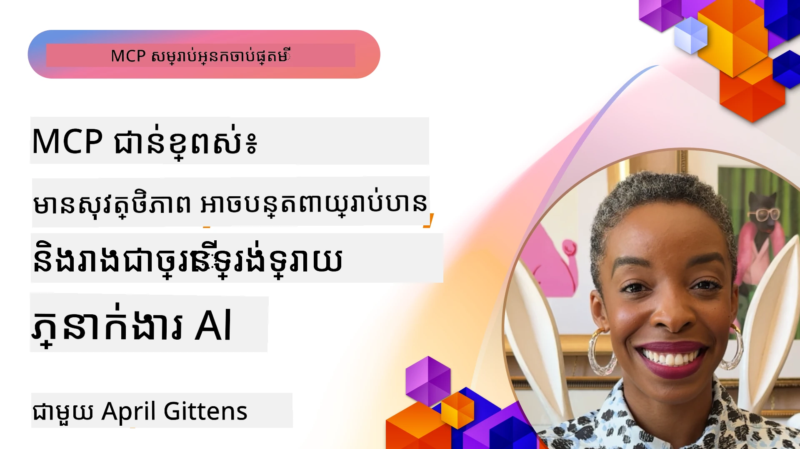

# ប្រធានបទកម្រិតខ្ពស់ក្នុង MCP

_(ចុចលើរូបភាពខាងលើដើម្បីមើលវីដេអូមេរៀននេះ)_

ជំពូកនេះគ្របដណ្តប់ប្រធានបទកម្រិតខ្ពស់មួយស៊េរីក្នុងការអនុវត្តប្រព័ន្ធ Model Context Protocol (MCP) រួមមានការរួមបញ្ចូលនីតិវិធីមូលដ្ឋានច្រើនមុខងារ, ភាពអាចពង្រីកបាន, គោលការណ៍សុវត្ថិភាពល្អបំផុត និងការរួមបញ្ចូលជាមួយអង្គភាពធំនានា។ ប្រធានបទទាំងនេះមានសារៈសំខាន់សម្រាប់ការសាងសង់កម្មវិធី MCP ដែលរឹងមាំ និងត្រៀមរួចសម្រាប់ផលិតកម្ម ដែលអាចបំពេញតម្រូវការរបស់ប្រព័ន្ធ AI សម័យទំនើប។

## ទិដ្ឋភាពទូទៅ

មេរៀននេះអនុវត្តការសិក្សាតាងសំខាន់ៗក្នុងការអនុវត្ត Model Context Protocol ដែលផ្ដោតទៅលើការរួមបញ្ចូលនីតិវិធីមូលដ្ឋានច្រើនមុខងារ, ភាពអាចពង្រីកបាន, គោលការណ៍សុវត្ថិភាពល្អបំផុត និងការរួមបញ្ចូលជាមួយអង្គភាពធំនានា។ ប្រធានបទទាំងនេះសំខាន់សម្រាប់ការសាងសង់កម្មវិធី MCP ដែលមានគុណភាពផលិតកម្ម និងអាចដោះស្រាយតម្រូវការរំភើបក្នុងបរិស្ថានអង្គភាពធំ។

> **កំណត់សម្គាល់លក្ខណៈបច្ចុប្បន្ន៖** MCP `2026-07-28` បានបញ្ឈប់ការប្រើប្រាស់ Roots និង
> Sampling primitives ដែលបានពិភាក្សានៅមេរៀន 5.4 និង 5.6។ វាក៏បានផ្លាស់ប្តូរមុខងារ
> ការប្រណាំង Tasks តាមដែលបានយោងក្នុង Protocol Features (5.16) ទៅ
> ឯកទេស extension Tasks។ មេរៀនទាំងនេះត្រូវបានរក្សាទុកសម្រាប់
> ការអនុវត្ត `2025-11-25` និងរួមបញ្ចូលណែនាំការផ្លាស់ប្តូរ។ សូមមើល
> [តើអ្វីដែលបានផ្លាស់ប្តូរនៅក្នុង MCP៖ លក្ខណៈបញ្ជាក់ 2026-07-28](../01-CoreConcepts/mcp-2026-07-28.md)។

## គោលបំណងផ្នែកការសិក្សា

នៅចុងបញ្ចប់នៃមេរៀននេះ អ្នកនឹងអាច:

- អនុវត្តន៍មុខងារមូលដ្ឋានច្រើនមុខងារនៅក្នុងស្ថាបត្យកម្ម MCP
- គូសរូបផែន MCP ដែលអាចពង្រីកបានសម្រាប់ស្ថានភាពទាមទារខ្ពស់
- អនុវត្តន៍គោលការណ៍សុវត្ថិភាពល្អបំផុតតាមតំរូវការសុវត្ថិភាពរបស់ MCP
- រួមបញ្ចូល MCP ជាមួយប្រព័ន្ធ និងស្ទង់ផ្ទាំង AI របស់អង្គភាពធំ
- បង្កើនសមត្ថភាព និងភាពទាក់ទាន់នៃប្រតិបត្តិការ

## មេរៀន និងគំរូគម្រោង

| Link | Title | Description |
|------|-------|-------------|
| [5.1 Integration with Azure](./mcp-integration/README.md) | រួមបញ្ចូលជាមួយ Azure | រៀនពីរបៀបរួមបញ្ចូល MCP Server របស់អ្នកលើ Azure |
| [5.2 Multi modal sample](./mcp-multi-modality/README.md) | គំរូមូលដ្ឋានច្រើនមុខងារ MCP  | គំរូសំរាប់សម្លេង រូបភាព និងការឆ្លើយតបមូលដ្ឋានច្រើនមុខងារ |
| [5.3 MCP OAuth2 sample](../../../05-AdvancedTopics/mcp-oauth2-demo) | គំរូ MCP OAuth2 | កម្មវិធី Spring Boot ត្រូវបានរៀបចំតិចតួចបង្ហាញការប្រើ OAuth2 ជាមួយ MCP ទាំងជា Authorization និង Resource Server។ បង្ហាញការចេញសំបុត្រសុវត្ថិភាព, ច្រកដែលបានការពារ, ការចាក់បញ្ចូល Azure Container Apps និងការរួមបញ្ចូល API Management។ |
| [5.4 Root Contexts](./mcp-root-contexts/README.md) | បរិបទគោល | រៀនពី primitive Roots `2025-11-25` ក្នុងប្រព័ន្ធបុរាណ និងជម្រើសការផ្លាស់ប្តូរបច្ចុប្បន្ន (បានបញ្ឈប់ប្រើប្រាស់នៅ `2026-07-28`) |
| [5.5 Routing](./mcp-routing/README.md) | ការបញ្ជូន | រៀនពីប្រភេទនានារបស់ការបញ្ជូន |
| [5.6 Sampling](./mcp-sampling/README.md) | ការទាញយកគំរូ | រៀនពី primitive Sampling ទីបំផុត `2025-11-25` និងជម្រើសការផ្លាស់ប្តូរបច្ចុប្បន្ន (បានបញ្ឈប់ប្រើប្រាស់នៅ `2026-07-28`) |
| [5.7 Scaling](./mcp-scaling/README.md) | ការពង្រីក | រៀនអំពីការពង្រីក |
| [5.8 Security](./mcp-security/README.md) | សុវត្ថិភាព | ការពារម៉ាស៊ីន MCP របស់អ្នក |
| [5.9 Web Search sample](./web-search-mcp/README.md) | ស្វែងរកបណ្ដាញ MCP | MCP server និងអតិថិជន Python រួមបញ្ចូលជាមួយ SerpAPI សម្រាប់ការស្វែងរកបណ្ដាញ, ព័ត៌មាន, ផលិតផល និងសំណួរ-ចម្លើយក្នុងពេលវេលាពិត។ បង្ហាញការរួមបញ្ចូលភ្ជាប់គ្រឿងចក្រច្រើន, រួមបញ្ចូល API ខាងក្រៅ និងដោះស្រាយកំហុសយ៉ាងរឹងមាំ។ |
| [5.10 Realtime Streaming](./mcp-realtimestreaming/README.md) | ផ្សាយបន្តពេលវេលាពិត | បច្ចេកវិទ្យាផ្សាយទិន្នន័យបន្តពេលវេលាពិតក្លាយជាតម្រូវការសំខាន់នៅក្នុងពិភពថ្មីដែលអាជីវកម្មនិងកម្មវិធីត្រូវការចូលដំណើរការព័ត៌មានភ្លាមៗដើម្បីធ្វើការសម្រេចចិត្តឆាប់រហ័ស។|
| [5.11 Realtime Web Search](./mcp-realtimesearch/README.md) | ស្វែងរកបណ្ដាញពេលវេលាពិត | របៀបស្វែងរកបណ្ដាញពេលវេលាពិតដែល MCP បំលែងការស្វែងរកបណ្ដាញពេលវេលាពិតដោយផ្តល់វិធីសាស្ត្រមុនដំបូង សម្រាប់ការគ្រប់គ្រងបរិបទគ្នារវាងម៉ូឌែល AI, ម៉ាស៊ីនស្វែងរក និងកម្មវិធី។| 
| [5.12  Entra ID Authentication for Model Context Protocol Servers](./mcp-security-entra/README.md) | ការផ្ទៀងផ្ទាត់សម្គាល់ Entra ID | Microsoft Entra ID ផ្តល់ដំណោះស្រាយគ្រប់គ្រងអត្តសញ្ញាណ និងចូលប្រើប្រាស់លើពពកយ៉ាងរឹងមាំ ដើម្បីធ្វើការធានាថា មានតែករណីអ្នកប្រើនិងកម្មវិធីដែលបានអនុញ្ញាតប៉ុណ្ណោះអាចធ្វើអន្តរគ្នាជាមួយម៉ាស៊ីន MCP របស់អ្នក។|
| [5.13 Microsoft Foundry Agent Integration](./mcp-foundry-agent-integration/README.md) | រួមបញ្ចូល Microsoft Foundry | រៀនពីរបៀបរួមបញ្ចូលម៉ាស៊ីន Model Context Protocol ជាមួយភ្នាក់ងារម៉ៃក្រូសូហ្វបានដ្រី ដើម្បីផ្ដល់សមត្ថភាពត្រួតត្រាឧបករណ៍មានកម្លាំង និងសមត្ថភាព AI សម្រាប់អង្គភាពធំជាមួយការតភ្ជាប់ប្រភពទិន្នន័យខាងក្រៅដែលមានស្តង់ដារ។|
| [5.14 Context Engineering](./mcp-contextengineering/README.md) | វិស្វកម្មបរិបទ | ឱកាសក្នុងអនាគតនៃបច្ចេកវិទ្យាវិស្វកម្មបរិបទសម្រាប់ម៉ាស៊ីន MCP រួមមានការបង្កើនប្រសិទ្ធភាពបរិបទ ការគ្រប់គ្រងបរិបទផ្លាស់ប្តូរប្រចាំ និងយុទ្ធសាស្ត្រសម្រាប់វិស្វកម្មប្រភេទបញ្ជា (prompt engineering) ក្នងស្ថាបត្យកម្ម MCP។|
| [5.15 MCP Custom Transport](./mcp-transport/README.md) | ការដឹកជញ្ជូនផ្ទាល់ខ្លួន | រៀនពីរបៀបអនុវត្តមេកានីសមដឹកជញ្ជូនផ្ទាល់ខ្លួនសម្រាប់ស្ថានភាពទំនាក់ទំនង MCP ដែលមានលក្ខណៈពិសេស។|
| [5.16 Protocol Features Deep Dive](./mcp-protocol-features/README.md) | មុខងារប្រព័ន្ធជ្រៅ | ស្គាល់មុខងារប្រព័ន្ធកម្រិតខ្ពស់រួមមានការជូនដំណឹងវឌ្ឍនភាព ការលុបការស្នើសុំ គំរូធនធាន និងគំរូដោះស្រាយកំហុស។|
| [5.17 Adversarial Multi-Agent Reasoning](./mcp-adversarial-agents/README.md) | អ្នកចាត់ការប្រឆាំង | ប្រើភ្នាក់ងារពីរដែលមានជំនឿបញ្ចាំងគ្នា ចែករំលែកឧបករណ៍ MCP តែមួយ ដើម្បីរកឃើញភាពច្របូកច្របល់, បង្ហាញករណីកម្រិតកំពូលនានា និងបង្កើតលទ្ធផលដែលមានការតម្រូវល្អជាងតាមការអប់រំតាមការជជែកប្រកួត។|

> **កំណត់សម្គាល់ប្រវត្តិសាស្រ្ត `2025-11-25`:** កំណែនេះបានណែនាំមុខងារ
> Tasks ដែលនៅក្នុងស្តង់ដារនិងពង្រីកមុខងារប្រព័ន្ធជាច្រើន។ នៅ `2026-07-28`, Tasks បានផ្លាស់ទៅ
> ជាភាពបន្ថែមផ្លូវការ និង Roots បានបញ្ឈប់ប្រើប្រាស់។ កុំប្រើស្ថានភាពមុខងារ
> `2025-11-25` ជាណែនាំបច្ចុប្បន្នភាព។ សូមមើល
> [បញ្ជីផ្លាស់ប្តូរ 2026-07-28](https://modelcontextprotocol.io/specification/2026-07-28/changelog)។

## ឯកសារយោងបន្ថែម

សម្រាប់ព័ត៌មានបច្ចុប្បន្នបំផុតអំពីប្រធានបទ MCP កម្រិតខ្ពស់ សូមយោងទៅកាន់ៈ
- [ឯកសារជំនួយ MCP](https://modelcontextprotocol.io/)
- [លក្ខណៈបញ្ជាក់ MCP (2026-07-28)](https://modelcontextprotocol.io/specification/2026-07-28/)
- [ផ្ទាំង GitHub](https://github.com/modelcontextprotocol)
- [OWASP MCP Top 10](https://microsoft.github.io/mcp-azure-security-guide/mcp/) - គ្រោះថ្នាក់សុវត្ថិភាព និងការការពារ
- [វគ្គសិក្សាសុវត្ថិភាព MCP Summit (Sherpa)](https://azure-samples.github.io/sherpa/) - កម្មវិធីហ្វឹកហាត់សុវត្ថិភាពដោយដៃ

## ចំណុចសំខាន់ដែលយល់បាន

- ការអនុវត្តវត្ថុមូលដ្ឋានច្រើនមុខងារបន្ថែមសមត្ថភាព AI លើសពីការគ្រប់គ្រងអត្ថបទ
- ភាពអាចពង្រីកបានគឺសំខាន់សម្រាប់ការប្រើប្រាស់ក្នុងអង្គភាពធំនិងអាចដោះស្រាយបានតាមរយៈការពង្រីកទ្រង់ទ្រាយទូលាយ និងកំពូល
- វិធានសុវត្ថិភាពទូលំទូលាយការពារទិន្នន័យនិងធានាការត្រួតពិនិត្យការចូលប្រើបានត្រឹមត្រូវ
- ការរួមបញ្ចូលជាមួយវេទិកាដូចជា Azure OpenAI និង Microsoft AI Foundry ជួយពង្រឹងសមត្ថភាព MCP
- ការអនុវត្ត MCP កម្រិតខ្ពស់ទទួលបានអត្ថប្រយោជន៍ពីស្ថាបត្យកម្មមានប្រសិទ្ធភាព និងការគ្រប់គ្រងធនធានយ៉ាងប្រុងប្រយ័ត្ន

## លំហាត់

គូសរូបផែនការអនុវត្ត MCP កម្រិតអង្គភាពធំសម្រាប់ករណីប្រើប្រាស់ជាក់លាក់មួយ៖

1. កំណត់តម្រូវការមុខងារមូលដ្ឋានច្រើនមុខងារ សម្រាប់ករណីប្រើប្រាស់របស់អ្នក
2. សំគាល់វិធានការសុវត្ថិភាពដែលត្រូវការដើម្បីការពារទិន្នន័យរឹងប៉ាញ
3. គូសរូបផែនដែលអាចពង្រីកបាន ដែលអាចដោះស្រាយភារកិច្ចផ្ទុកខុសៗគ្នា
4. ប្លង់ចំណុចរួមបញ្ចូលជាមួយប្រព័ន្ធ AI និងវេទិការអង្គភាពធំ
5. ឯកសារមូលហេតុការពិបាកកង្វះខាតសមត្ថភាព និងយុទ្ធសាស្ត្រកាត់បន្ថយផលប៉ះពាល់

## រូបប្រយោជន៍បន្ថែម

- [ឯកសារ Azure OpenAI](https://learn.microsoft.com/en-us/azure/ai-services/openai/)
- [ឯកសារ Microsoft AI Foundry](https://learn.microsoft.com/en-us/ai-services/)

---

## តើត្រូវធ្វើអ្វីបន្ទាប់

ស្វែងយល់ពីមេរៀនក្នុងវិញ្ញាសានេះចាប់ពី: [5.1 រួមបញ្ចូល MCP](./mcp-integration/README.md)

បន្ទាប់ពីបានបញ្ចប់វិញ្ញាសានេះ បន្តទៅ: [វិញ្ញាសា 6: ការរួមចំណែកសហគមន៍](../06-CommunityContributions/README.md)

---

<!-- CO-OP TRANSLATOR DISCLAIMER START -->
**ការបដិសេធ**:
ឯកសារនេះត្រូវបានបម្លែងភាសា ដោយប្រើសេវាបម្លែងភាសា AI [Co-op Translator](https://github.com/Azure/co-op-translator)។ ទោះយើងខ្ញុំមានក្តីប្រាថ្នាឱ្យបានច្បាស់លាស់ តែសូមយល់ដឹងថាការបម្លែងដោយស្វ័យប្រវត្តិក៏អាចមានកំហុសឬភាពមិនត្រឹមត្រូវ។ ឯកសារដើមជាភាសាទីតាំងគួរត្រូវបានគេប្រើជាប្រភពច្បាស់លាស់។ សម្រាប់ព័ត៌មានសំខាន់ៗ សូមណែនាំឱ្យប្រើប្រាស់ការប្រែដោយមនុស្សជំនាញ។ យើងខ្ញុំមិនទទួលខុសត្រូវចំពោះការយល់ច្រឡំ ឬការបកស្រាយខុសបន្ទាប់ពីការប្រើប្រាស់ការបម្លែងនេះនោះទេ។
<!-- CO-OP TRANSLATOR DISCLAIMER END -->