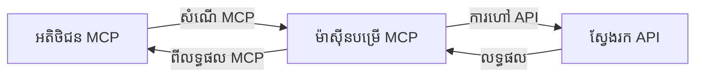
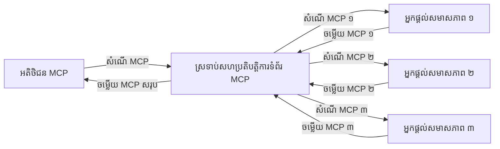
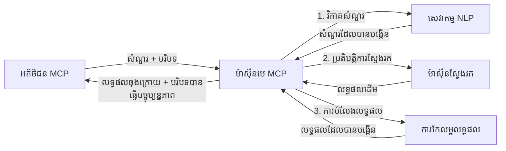

# ពិធីការអ	contextម៉ូដែលសម្រាប់ស្វែងរកបណ្តាញនៅពេលវេលាពិតប្រាកដ

## មេរៀនសង្ខេប

ការ​ស្វែងរកបណ្តាញ​ពេលវេលាពិតប្រាកដ​បាន​ក្លាយ​ជា​រឿង​សំខាន់​ក្នុង​បរិដ្ឋាន​ដែល​មាន​ព័ត៌មាន​ជា​មូលដ្ឋាន​ក្នុង​អំឡុង​ពេល​បច្ចុប្បន្ន ដែល​កម្មវិធី​ត្រូវការ​ការ​ចូល​ដំណើរការ​ព័ត៌មាន​ថ្មីៗ​ដោយទាន់ពេលវេលា​គ្រប់​ទូទាំង​អ៊ិនធឺណិត​ដើម្បី​ផ្ដល់​ចម្លើយ​ដែល​ទាក់ទង​និង​ទាន់ពេល។ ពិធីការ អ<contextម៉ូដែល (MCP) ជា​ការរីកចម្រើន​ដ៏​សំខាន់​ក្នុង​ការ​ធ្វើអោយ​ប្រសើរ​នូវ​ដំណើរការ​ស្វែងរក​ពេលវេលាពិតប្រាកដ​ទាំងនេះ ក្នុង​ការ​បង្កើន​ប្រសិទ្ធភាព​ស្វែងរក ការចងក្រងបរិបទ និង​ការកែលម្អ​ការអនុវត្ត​ប្រព័ន្ធ​ស្នូល។

ម៉ូឌុល​នេះ​ស្ទឹម​យល់ពីរបៀបដែល MCP បម្លែងការស្វែងរកបណ្តាញពេលវេលាពិតប្រាកដ ដោយផ្ដល់ឱ្យនូវវិធីសាស្រ្តស្តង់ដារសម្រាប់ការគ្រប់គ្រងបរិបទកាត់ទុក្ខរវាងម៉ូដែល AI ម៉ាស៊ីនស្វែងរក និងកម្មវិធី។

### អ្វីដែល​អ្នក​នឹងរៀន

ក្នុងមេរៀនបូកបន្ថែមនេះ អ្នក​នឹង​រកឃើញ៖

- របៀបដែល MCP បង្កើតស្ពានរលូនរវាងម៉ូដែល AI និងសមត្ថភាពស្វែងរកបណ្តាញពេលវេលាពិតប្រាកដ
- លំនាំសំណង់សម្រាប់អនុវត្តដំណោះស្រាយស្វែងរកដែលមានប្រសិទ្ធភាព និងអាចពង្រីកបានជាមួយ MCP
- បច្ចេកទេសសម្រាប់ការរក្សាបរិបទស្វែងរកឲ្យបាននៅតាមវិធីស្វែងរកជាច្រើនដង និងប្រតិបត្តិការ
- ការអនុវត្តកូដជាក់ស្ដែងនៅក្នុងភាសា Python និង JavaScript សម្រាប់ស្ថានការណ៍ស្វែងរកផ្សេងៗ
- វិធីសាស្ត្រសម្រាប់ផ្គូផ្គងភាពទាក់ទង ទាន់ពេល និងការអនុវត្តប្រព័ន្ធ MCP

## ការណែនាំអំពីការស្វែងរកបណ្តាញពេលវេលាពិតប្រាកដ

ការ​ស្វែងរក​បណ្ដាញ​ពេលវេលាពិតប្រាកដ គឺជាវិធីបច្ចេកវិទ្យាមួយដែលអនុញ្ញាតឲ្យការសួរសំណួរ ការប្រមូលព័ត៌មាន និងការវិភាគព័ត៌មានបណ្ដាញត្រូវបានអនុវត្តនៅពេលវេលាដូចជាពេលផ្សាយឬផ្សាយបន្តថ្មីៗ អនុញ្ញាតឲ្យប្រព័ន្ធផ្ដល់ព័ត៌មានថ្មីនិងពាក់ព័ន្ធជាមួយពេលវេលាទាបបំផុត។ ខុសពីប្រព័ន្ធស្វែងរកទម្លាប់ដែលដំណើរការលើទិន្នន័យដែលបានរៀបចំជារៀងរាល់ម៉ាឡិកា ឬយូរពេលមួយរយៈ ការ​ស្វែងរក​ពេលវេលាពិតប្រាកដ ដំណើរការទិន្នន័យបច្ចុប្បន្នពីបណ្ដាញ និងផ្ដល់ព័ត៌មានដែលបញ្ចេញពីស្ថានភាពបច្ចុប្បន្ននៃមាតិកា​អនឡាញ។

### គំនិតសំខាន់ៗនៃការស្វែងរកបណ្តាញពេលវេលាពិតប្រាកដ៖

- **ការដំណើរការសំណួរបន្តទៀត**៖ សំណួរស្វែងរកត្រូវបានដំណើរការចំពោះប្រភពទិន្នន័យដែលកំពុងកំពុងផ្លាស់ប្តូរយ៉ាងច្រើន
- **ការផ្តល់អាទិបរមាថ្មីៗ**៖ ប្រព័ន្ធត្រូវបានរចនាឡើងដើម្បីផ្តល់អាទិបរមាព័ត៌មានថ្មីៗ
- **ការបំពេញតុល្យភាពទាក់ទង**៖ រក្សាតុល្យភាពរវាងភាពពាក់ព័ន្ធនិងទាន់ពេលវេលា
- **សំណង់អភិវឌ្ឍន៍អាចពង្រីកបាន**៖ ប្រព័ន្ធត្រូវគ្រប់គ្រងទម្ងន់សំណួរផ្សេងៗ និងបរិមាណទិន្នន័យ
- **ការយល់ដឹងចំពោះបរិបទ**៖ ការរក្សាបរិបទអ្នកប្រើនៅក្នុងការស្វែងរកជាច្រើនជំហានគឺអាចសំខាន់សម្រាប់លទ្ធផលមានន័យ
- **ការកែប្រែសំណួរផ្ទាល់ខ្លួន**៖ ការកែប្រែសំណួរជាសមាសធាតុដោយផ្អែកលើបរិបទ និងលទ្ធផលមុន
- **ការរួមបញ្ចូលប្រភពច្រើន**៖ ការរួមបញ្ចូលលទ្ធផលពីក្រុមហ៊ុនស្វែងរក និងប្រភពបណ្តាញចម្រុះ
- **ការយល់ដឹងអត្ថន័យ**៖ ដំណើរការសំណួរនិងមាតិកាដោយផ្អែកលើអត្ថន័យ មិនមែនមានតែពាក្យគន្លឹះទេ
- **ការឈរ​សីតុណ្ហភាពពេលវេលាពិតប្រាកដ**៖ ការកែប្រែកំណាត់តំលៃលទ្ធផលជាបន្តបន្ទាប់នៅពេលមានព័ត៌មានថ្មីៗ

### ពិធីការអ<contextម៉ូដែល និងការស្វែងរកបណ្តាញពេលវេលាពិតប្រាកដ

ពិធីការ អ<contextម៉ូដែល (MCP) ដោះស្រាយបញ្ហាសំខាន់ជាច្រើនក្នុងបរិដ្ឋានស្វែងរកបណ្តាញពេលវេលាពិតប្រាកដ៖

1. **ការរក្សាបរិបទស្វែងរក**: MCP កំណត់ស្តង់ដាររបៀបរក្សាបរិបទនៅក្នុងសមាសភាគស្វែងរកចែកចាយ ដើម្បីធានាថាម៉ូដែល AI និងកណ្តាប់ដៃដំណើរការមានការចូលដំណើរការជាប្រវត្តិសំណួរពាក់ព័ន្ធ និងចំណង់ចំណូលចិត្តអ្នកប្រើ។

2. **ការគ្រប់គ្រងសំណួរដោយមានប្រសិទ្ធភាព**: ដោយផ្ដល់ប្រាក់ចំណេញនូវមេកានិច​ដែលរចនានូវការផ្ទេរបរិបទ MCP កាត់បន្ថយកម្ចីការដងគ្នាបានសម្រាប់រាល់ជំហានស្វែងរក។

3. **ការសម្របសម្រួលបច្ចេកវិទ្យា**: MCP បង្កើតភាសាសហព័ន្ធសម្រាប់ចែករំលែកបរិបទរវាងបច្ចេកវិទ្យាស្វែងរកនានា និងម៉ូដែល AI ដែលអនុញ្ញាតឲ្យមានសំណង់បត់បែន និងអាចពង្រីកបាន។

4. **បរិបទសម្រួលស្វែងរក**: ការអនុវត្ត MCP អាចផ្តល់អាទិភាពទៅលើធាតุบរិបទដែលពាក់ព័ន្ធបំផុតសម្រាប់ស្វែងរកសម្រួលល្អជាងទាំងអត្ថប្រយោជន៍និងភាពត្រឹមត្រូវ។

5. **ដំណើរការស្វែងរកអាចបត់បែនបាន**: ជាមួយការគ្រប់គ្រងបរិបទត្រឹមត្រូវតាមរយៈ MCP ប្រព័ន្ធស្វែងរកអាចកែប្រែដំណើរការវា​ជាមូលដ្ឋាន​ពី​តម្រូវការអ្នកប្រើ​ជាបន្តបន្ទាប់ និងបរិបទព័ត៌មាន​កំពុង​ប្រែប្រួល។

ក្នុងកម្មវិធីទំនើបចាប់ពីការប្រមូលព័ត៌មាន​ដល់ជំនួយការស្រាវជ្រាវ ការរួមបញ្ចូល MCP ជាមួយបច្ចេកវិទ្យាស្វែងរកបណ្តាញអនុញ្ញាតអោយមានការស្វែងរកឆ្លាតវៃ និងយល់ដឹងបរិបទ​ដែលអាចផ្ដល់លទ្ធផលកាន់តែទាក់ទងជាបន្តបន្ទាប់ក្នុងអំឡុងប្រតិបត្តិការអ្នកប្រើ។

## គោលបំណង​សិក្សា

នៅចុងបញ្ចប់មេរៀននេះ អ្នកនឹងអាច៖

- យល់ដឹងពីមូលដ្ឋាននៃស្វែងរកបណ្តាញពេលវេលាពិតប្រាកដ និងបញ្ហាដែលមានក្នុងកម្មវិធីទំនើប
- ពន្យល់ថា ពិធីការអ<contextម៉ូដែល (MCP) បង្កើនសមត្ថភាពស្វែងរកបណ្តាញពេលវេលាពិតប្រាកដយ៉ាងដូចម្តេច
- អនុវត្តដំណោះស្រាយស្វែងរកដែលផ្អែកលើ MCP ជាមួយស៊ុមនិង API ដែលពេញនិយម
- រចនានិងដំឡើងសំណង់ស្វែងរកដែលអាចពង្រីក និងមានប្រសិទ្ធភាពខ្ពស់ជាមួយ MCP
- អនុវត្តគំនិត MCP ចំពោះករណីប្រើប្រាស់ផ្សេងៗ រួមមានស្វែងរកអត្ថន័យ ជំនួយការស្រាវជ្រាវ និងការប្រមូលព័ត៌មានជាមួយ AI
- ប៉ាន់ប្រមាណនូវនិន្នាការពីពេលនាពេលនិងការបង្កើតថ្មីៗក្នុងបច្ចេកវិទ្យាស្វែងរកដោយ MCP
- បង្កើតប្រព័ន្ធស្វែងរកឆ្លាតវៃដែលរៀនពីបរិបទប្រតិបត្តិការអ្នកប្រើ
- រួមបញ្ចូលសមត្ថភាពស្វែងរកបណ្ដាញទៅជំនួយការដោយមធ្យោបាយបច្ចេកទេស MCP ដែលបានស្តង់ដារ
- បង្កើតបណ្ដាញស្វែងរកជាច្រើនជំហាន ដែលស្វែងរកច្រើនដង ដកស្រង់លទ្ធផលលម្អិតយើងតាមបរិបទ
- បង្កើតប្រសិទ្ធភាពស្វែងរក ខណៈដែលរក្សាបរិបទបានច្រើនប្រកបដោយការយល់ដឹង

### ការប្រាកដនិយមនិងសារៈសំខាន់

ការ​ស្វែងរក​បណ្ដាញ​ពេលវេលាពិតប្រាកដ មានការសួរសំណួរបន្តទៀត ការទាញយកនិងការផ្ដល់ព័ត៌មានបណ្ដាញដោយទាមទារពេលខ្លីបំផុត។ ខុសពីម៉ាស៊ីនស្វែងរកបណ្ដាញប្រពៃណីដែលពិនិត្យអ៊ិនធឺណិតជាទៀងទាត់ និងរៀបចំវា ការ​ស្វែងរក​ពេលវេលាពិតប្រាកដ​ផ្ដល់ព័ត៌មានឡើងវិញ​នៅពេលវាល័យបានឱ្យប្រើ។

លក្ខណៈសំខាន់នៃស្វែងរកបណ្ដាញពេលវេលាពិតប្រាកដរួមមាន៖

- **ភាពថ្មីទាន់ពេល**៖ ផ្តល់អាទិភាពលើមាតិកា និងការអាប់ដេតថ្មីៗ
- **ការបន្តដំណើរការ**៖ តែងតែគ្រប់គ្រងសម្រាប់ព័ត៌មានថ្មីៗ
- **កែសំរួល​សំណួរ**៖ កែលម្អសំណួរស្វែងរកដោយផ្អែកលើបរិបទ និងមតិយោបល់
- **ការផ្ដល់លទ្ធផលភ្លាមៗ**៖ ផ្ដល់លទ្ធផលវាយតម្លៃដោយពេលខ្លីបំផុត
- **រក្សាបរិបទ**៖ អាស្រ័យលើសំណួរមុនៗសម្រាប់ភាពពាក់ព័ន្ធកាន់តែប្រសើរ

### បញ្ហាក្នុងការស្វែងរកបណ្ដាញប្រពៃណី

វិធីសាស្រ្តស្វែងរកបណ្ដាញប្រពៃណីប្រឈមមុខនឹងការកំណត់ច្រើនពេលអនុវត្តក្នុងករណីពេលវេលាពិតប្រាកដ៖

1. **បាត់បង់បរិបទ**: កម្រាមពិបាកក្នុងការរក្សាបរិបទស្វែងរកជាច្រើនដង
2. **ភាពថ្មីក្រាស់ក្រេរ**: បញ្ហាក្នុងការចូលដំណើរការនិងផ្តល់អាទិភាពពត៌មានថ្មីៗបំផុត
3. **ភាពស្មុគស្មាញក្នុងការបញ្ចូលបច្ចេកវិទ្យា**: បញ្ហានៃការសម្របសម្រួលរវាងម៉ាស៊ីនស្វែងរកនិងកម្មវិធី
4. **បញ្ហាពេលយឺត**: ការបំប៉នចន្លោះពេលតបស៊ើបអង្កេតជាមួយតម្រូវការពេលវេលាតបស្តាប់
5. **ការតម្រឹមភាពទាក់ទង**: ទាមទារភាពត្រឹមត្រូវនិងពាក់ព័ន្ធខណៈផ្តល់អាទិភាពលើភាពទាន់ពេល

## ការយល់ដឹងអំពីពិធីការអ<contextម៉ូដែល (MCP) សម្រាប់ការស្វែងរក

### MCP ជាអ្វីក្នុងបរិបទស្វែងរក?

ពិធីការអ<contextម៉ូដែល (MCP) គឺជាពិធីការសម្របសម្រួលស្តង់ដារមួយដែលរៀបចំឡើងដើម្បីងាយស្រួលក្នុងការបម្លាស់ប្តូរព័ត៌មានមួយរវាងម៉ូដែល AI និងកម្មវិធី។ ក្នុងបរិបទស្វែងរកបណ្ដាញពេលវេលាពិតប្រាកដ MCP ផ្ដល់ស៊ុមសម្រាប់៖

- ការរក្សាបរិបទស្វែងរកនៅក្នុងជំនួសសំណួរ
- ការស្តង់ដារ​ទ្រង់ទ្រាយ​សំណួរ និងលទ្ធផល
- ការបង្កើនប្រសិទ្ធភាពក្នុងការផ្ទេរព_PARAMETERS_ និងលទ្ធផលស្វែងរក
- ការកែលម្អការទំនាក់ទំនងរវាងម៉ូដែលនិងម៉ាស៊ីនស្វែងរក

### សមាសធាតុស្នូល និងសំណង់

រចនាសម្ព័ន្ធ MCP សម្រាប់ស្វែងរកបណ្តាញពេលវេលាពិតប្រាកដ មានសមាសធាតុសំខាន់ៗដូចជា៖

1. **អ្នកគ្រប់គ្រងបរិបទសំណួរ**: គ្រប់គ្រង និងរក្សាបរិបទស្វែងរកខណៈបញ្ជা​សំណួរជាច្រើន
2. **អ្នកដំណើរការស្វែងរក**: ដំណើរការសំណើស្វែងរកជាមួយបច្ចេកវិទ្យាដែលយល់ពីបរិបទ
3. **ឧបករណ៍បម្លែងពិធីការ**: បម្លែងរវាង API ស្វែងរកនានា ខណៈរក្សាបរិបទ
4. **ឃ្លាំងបរិបទ**: រក្សាទុក និងទាញយកប្រវត្តិសំណួរ និងចំណង់ចំណូលចិត្ត
5. **អ្នកភ្ជាប់ស្វែងរក**: ភ្ជាប់ទៅម៉ាស៊ីនស្វែងរកពហុប្រភព និង API បណ្តាញ

```mermaid
graph TD
    subgraph "ប្រភពទិន្នន័យ"
        Web[មាតិកា​ប្រព័ន្ធ​អ៊ិនធឺណិត]
        APIs[API ខាងក្រៅ]
        DB[មូលដ្ឋានចំណេះដឹង]
        News[ផ្តូរព័ត៌មាន]
    end

    subgraph "ស្រទាប់ស្វែងរក MCP"
        SC[តំណភ្ជាប់ស្វែងរក]
        PA[ឧបករណ៍ផ្លាស់ប្តូរពិធីសាស្រ្ត]
        CH[កម្មវិធីដោះស្រាយបរិបទ]
        SP[អ្នកដំណើរការស្វែងរក]
        CS[ហាងចាប់យកបរិបទ]
    end

    subgraph "ការតំរូវ និងវិភាគ"
        RE[ម៉ាស៊ីនសំខាន់ភាព]
        ML[ម៉ូឌែល ML]
        NLP[ការបំលែងភាសាធម្មជាតិ (NLP)]
        Rank[ប្រព័ន្ធចំណាត់ថ្នាក់]
    end

    subgraph "កម្មវិធី និងសេវាកម្ម"
        RA[ជំនួយការស្រាវជ្រាវ]
        Alerts[ប្រព័ន្ធរោទ៍]
        KB[មូលដ្ឋានចំណេះដឹង]
        API[សេវា API]
    end

    Web -->|មាតិកា| SC
    APIs -->|ទិន្នន័យ| SC
    DB -->|ចំណេះដឹង| SC
    News -->|ការអាប់ដេត| SC
    
    SC -->|លទ្ធផលដើម| PA
    PA -->|លទ្ធផលក្រោមស្តង់ដារ| CH
    CH <-->|ប្រតិបត្តិការបរិបទ| CS
    CH -->|លទ្ធផលដែលបន្ថែមបរិបទ| SP
    SP -->|លទ្ធផលបានដំណើរការ| RE
    SP -->|លក្ខណៈពិសេស| ML
    SP -->|អត្ថបទ| NLP
    
    RE -->|លទ្ធផលបានចាត់ថ្នាក់| Rank
    ML -->|ការព្យាករណ៍| Rank
    NLP -->|ភាគី និងទំនាក់ទំនង| Rank
    
    Rank -->|លទ្ធផលចុងក្រោយ| RA
    ML -->|ទស្សនៈ| Alerts
    NLP -->|ទិន្នន័យរចនាសម្ព័ន្ធ| KB
    
    RA -->|ការស្រាវជ្រាវ| Users((Users))
    Alerts -->|ការជូនដំណឹង| Users
    KB <-->|ការចូលប្រើចំណេះដឹង| API

    classDef sources fill:#f9f,stroke:#333,stroke-width:2px,color:#4a004a
    classDef mcp fill:#bbf,stroke:#333,stroke-width:2px,color:#00004a
    classDef processing fill:#bfb,stroke:#333,stroke-width:2px,color:#003300
    classDef apps fill:#fbb,stroke:#333,stroke-width:2px,color:#4a0000
    
    class Web,APIs,DB,News sources
    class SC,PA,CH,SP,CS mcp
    class RE,ML,NLP,Rank processing
    class RA,Alerts,KB,API apps
```

### របៀបដែល MCP បង្កើនស្វែងរកបណ្តាញពេលវេលាពិតប្រាកដ

MCP ដោះស្រាយបញ្ហាស្វែងរកប្រពៃណីតាមរយៈ៖

- **បន្តបរិបទ**៖ រក្សាក្សាទំនាក់ទំនងចន្លោះសំណួរពេញមួយវគ្គស្វែងរក
- **បង្រួមការផ្ទេរ**៖ កាត់បន្ថយកម្រិតកើនឡើងក្នុងលក្ខណៈតម្រូវដោយការគ្រប់គ្រងបរិបទយ៉ាងច្បាស់លាស់
- **ច្រកចូលស្តង់ដារ**៖ ផ្ដល់ API សម្រួលសម្រាប់សមាសភាគស្វែងរក
- **កាត់បន្ថយពេលយឺត**៖ បន្ថយម្ចាស់ការដំណើរការដោយគ្រប់គ្រងបរិបទមានប្រសិទ្ធភាព
- **កែលម្អភាពពាក់ព័ន្ធ**៖ ដោះស្រាយភាពពាក់ព័ន្ធក្នុងសំណួរជាច្រើនតាមរយៈការរក្សាចេតនា

## ការរួមបញ្ចូល និងអនុវត្ត

ប្រព័ន្ធស្វែងរកបណ្តាញពេលវេលាពិតប្រាកដ ត្រូវការរចនាសំណង់និងអនុវត្តយ៉ាងប្រុងប្រយ័ត្នដើម្បីរក្សាទាំងប្រសិទ្ធភាព និងភាពរឹងមាំរបស់បរិបទ។ ពិធីការអ<contextម៉ូដែល ផ្ដល់វិធីសាស្រ្តស្តង់ដារ សម្រាប់ការរួមបញ្ចូលម៉ូដែល AI និងបច្ចេកវិទ្យាស្វែងរក អនុញ្ញាតឱ្យមានបណ្ដាញស្វែងរកគិតថ្លៃដែលបត់បែន និងយល់ដឹងបរិបទ។

### មេរៀនសង្ខេបពីការរួមបញ្ចូល MCP នៅក្នុងសំណង់ស្វែងរក

ការអនុវត្ត MCP នៅក្នុងបរិដ្ឋានស្វែងរកបណ្តាញពេលវេលាពិតប្រាកដ មាន​បញ្ហាទាក់ទងសំខាន់ៗ៖

1. **ការ​ស្វែងរក​បរិបទ​ស៊េរី**៖ MCP ផ្ដល់មេកានិចសម្រួលសម្រាប់បង្កើតបរិបទនៅក្នុងសំណើស្វែងរក ដើម្បីធានាថាបរិបទសំខាន់ៗត្រូវបានដឹកជញ្ជូនជាមួយសំណួរពេញលេញតាមដំណើរការផ្ទុក។ រួមមានទ្រង់ទ្រាយស៊េរីស្តង់ដារដែលអនុវត្តបានល្អសម្រាប់ទិន្នន័យចង្ហាន់ពាក់ព័ន្ធ។

2. **ដំណើរការស្វែងរកថាមពលដ៏រឹងមាំ**៖ MCP អនុញ្ញាតអោយដំណើរការដែលមានសារពើភ័ណ្ឌបច្ចេកវិទ្យា ដោយរក្សាទំនុកដោយបរិបទស្វែងរកនេះគឺជាការតំណាងជាប់លាប់ក្នុងជំហានស្វែងរក។ វាមានតម្លៃខ្ពស់នៅក្នុងបណ្តាញស្វែងរកជា​ច្រើនជំហានដែលការកែប្រែបរិបទធ្វើអោយលទ្ធផលប្រសើរឡើង។

3. **ការពង្រីក និងកែប្រែសំណួរ**: ការអនុវត្ត MCP ក្នុងប្រព័ន្ធស្វែងរកអាចជួយអភិវឌ្ឍការបន្ថែមនិងកែប្រែសំណួរដោយផ្អែកលើបរិបទដែលបានប្រមូល, អនុញ្ញាតឲ្យមានលទ្ធផលសម្រួលកាន់តែច្រើនពេលវគ្គស្វែងរកបន្តដំណើរការ។

4. **ការផ្ទុកផ្សេងនិងអាទិភាពលទ្ធផល**: ដោយស្តង់ដារបរិបទ MCP ជួយគ្រប់គ្រងការផ្ទុកលទ្ធផល និងកំណត់អាទិភាព អនុញ្ញាតឲ្យសមាសភាគអាចរៀបចំតាមបរិបទស្វែងរកកំពុងបន្តដំណើរការ។

5. **សម្ព័ន្ធស្វែងរក និងបន្សំ**: MCP ជួយរៀបចំការសម្ព័ន្ធស្វែងរកមានភាពស្មុគស្មាញលើបញ្ជីថ្មីៗដោយផ្ដល់តំណាងរចនាសម្ព័ន្ធទៅលើបរិបទស្វែងរក ធ្វើអោយទទួលបានលទ្ធផលបន្សំមកពីប្រភពផ្សេងៗយ៉ាងមានន័យ។

ការអនុវត្ត MCP នៅលើបច្ចេកវិទ្យាស្វែងរកផ្សេងៗ គឺបង្កើតវិធីសាស្រ្តរួមបញ្ចូលនៅលើការគ្រប់គ្រងបរិបទ កាត់បន្ថយតម្រូវការកូដរួមបញ្ចូលឯកជន ខណៈបង្កើនសមត្ថភាពប្រព័ន្ធក្នុងការរក្សាបរិបទមានន័យពេលសំណួរស្វែងរកបន្តរវាងប្រភេទផ្សេងៗ។

### MCP ក្នុងការអនុវត្តស្វែងរកបណ្តាញផ្សេងៗ

ឧទាហរណ៍ទាំងនេះបន្តតាមលក្ខណៈ MCP បច្ចុប្បន្ន ដែលផ្ដោតលើពិធីការប្រើប្រាស់ JSON-RPC ជាមួយមួយចំនួនមេកានិចផ្ទេរពិសេស។ កូដបង្ហាញពីរបៀបដែលអ្នកអាចអនុវត្តការរួមបញ្ចូលស្វែងរកផ្ទាល់ខ្លួន ខណៈរក្សាការអនុវត្តតាម MCP។


<details>
<summary>ការអនុវត្ត Python ជាមួយ API ស្វែងរកទូទៅ</summary>

```python
import asyncio
import json
import aiohttp
from typing import Dict, Any, Optional, List
from contextlib import asynccontextmanager
from collections.abc import AsyncIterator

# នាំចូលបណ្ណាល័យ MCP ស្តង់ដារ
from mcp.client.session import ClientSession
from mcp.client.streamable_http import streamablehttp_client
from mcp.types import TextContent, CreateMessageRequestParams, CreateMessageResult
from mcp.server.fastmcp import FastMCP

# បង្កើតម៉ាស៊ីនបម្រើ FastMCP សម្រាប់ស្វែងរកតាមបណ្ដាញ
search_server = FastMCP("WebSearch")

# ថ្នាក់សម្រាប់គ្រប់គ្រងប្រតិបត្តិការស្វែងរកតាមបណ្ដាញ
class WebSearchHandler:
    def __init__(self, api_endpoint: str, api_key: str):
        self.api_endpoint = api_endpoint
        self.api_key = api_key
        self.session = None
        
    async def initialize(self):
        """Initialize the HTTP session"""
        self.session = aiohttp.ClientSession(
            headers={"Authorization": f"Bearer {self.api_key}"}
        )
    
    async def close(self):
        """Close the HTTP session"""
        if self.session:
            await self.session.close()
            
    async def perform_search(self, query: str, max_results: int = 5, 
                           include_domains: List[str] = None, 
                           exclude_domains: List[str] = None,
                           time_period: str = "any") -> Dict[str, Any]:
        """Perform web search using the search API"""
        # សង់ប៉ារ៉ាម៉ែត្រស្វែងរក
        search_params = {
            "q": query,
            "limit": max_results,
            "time": time_period
        }
        
        if include_domains:
            search_params["site"] = ",".join(include_domains)
            
        if exclude_domains:
            search_params["exclude_site"] = ",".join(exclude_domains)
        
        # អនុវត្តសំណើស្វែងរក
        try:
            async with self.session.get(
                self.api_endpoint,
                params=search_params
            ) as response:
                if response.status != 200:
                    error_text = await response.text()
                    raise Exception(f"Search API error: {response.status} - {error_text}")
                
                search_data = await response.json()
                
                # បម្លែងចម្លើយ API ជា​ទ្រង់ទ្រាយស្តង់ដារ
                results = []
                for item in search_data.get("results", []):
                    results.append({
                        "title": item.get("title", ""),
                        "url": item.get("url", ""),
                        "snippet": item.get("snippet", ""),
                        "date": item.get("published_date", ""),
                        "source": item.get("source", "")
                    })
                
                return {
                    "query": query,
                    "totalResults": len(results),
                    "results": results
                }
        except Exception as e:
            print(f"Search API request error: {e}")
            raise

# ចាប់ផ្តើមអ្នកគ្រប់គ្រងស្វែងរក
search_handler = WebSearchHandler(
    api_endpoint="https://api.search-service.example/search",
    api_key="your-api-key-here"
)

# កំណត់អាយុកាលដើម្បីគ្រប់គ្រងអ្នកគ្រប់គ្រងស្វែងរក
@asyncio.asynccontextmanager
async def app_lifespan(server: FastMCP):
    """Manage application lifecycle"""
    await search_handler.initialize()
    try:
        yield {"search_handler": search_handler}
    finally:
        await search_handler.close()

# កំណត់អាយុកាលសម្រាប់ម៉ាស៊ីនបម្រើ
search_server = FastMCP("WebSearch", lifespan=app_lifespan)

# ចុះបញ្ជីឧបករណ៍ស្វែងរកតាមបណ្ដាញ
@search_server.tool()
async def web_search(query: str, max_results: int = 5, 
                   include_domains: List[str] = None,
                   exclude_domains: List[str] = None,
                   time_period: str = "any") -> Dict[str, Any]:
    """
    Search the web for information
    
    Args:
        query: The search query
        max_results: Maximum number of results to return (default: 5)
        include_domains: List of domains to include in search results
        exclude_domains: List of domains to exclude from search results
        time_period: Time period for results ("day", "week", "month", "any")
        
    Returns:
        Dictionary containing search results
    """
    ctx = search_server.get_context()
    search_handler = ctx.request_context.lifespan_context["search_handler"]
    
    results = await search_handler.perform_search(
        query=query,
        max_results=max_results,
        include_domains=include_domains,
        exclude_domains=exclude_domains,
        time_period=time_period
    )
    
    return results

# ឧទាហរណ៍ប្រើប្រាស់អតិថិជន
async def client_example():
    # ទំនាក់ទំនងទៅម៉ាស៊ីនបម្រើស្វែងរកដោយប្រើការដឹកជញ្ជូន HTTP ផ្ទុកបាន
    async with streamablehttp_client("http://localhost:8000/mcp") as (read, write, _):
        async with ClientSession(read, write) as session:
            # ចាប់ផ្តើមការតភ្ជាប់
            await session.initialize()
            
            # ហៅឧបករណ៍ web_search
            search_results = await session.call_tool(
                "web_search", 
                {
                    "query": "latest developments in AI and Model Context Protocol",
                    "max_results": 5,
                    "time_period": "day",
                    "include_domains": ["github.com", "microsoft.com"]
                }
            )
            
            print(f"Search results: {search_results}")

# ឧទាហរណ៍កំណត់សមាធិម៉ាស៊ីនបម្រើ
if __name__ == "__main__":
    # ប្រតិបត្តមម៉ាស៊ីនបម្រើជាមួយការដឹកជញ្ជូន HTTP ផ្ទុកបាន
    search_server.run(transport="streamable-http")
```
</details> 

<details>
<summary>ការអនុវត្ត JavaScript ជាមួយស្វែងរកនៅលើកម្មវិធីរុករក</summary>


```javascript
// ការអនុវត្តម៉ាស៊ីនមើល MCP សម្រាប់ស្វែងរកបណ្តាញ
import { McpServer, ResourceTemplate } from '@modelcontextprotocol/sdk/server/mcp.js';
import { StreamableHTTPServerTransport } from '@modelcontextprotocol/sdk/server/streamableHttp.js';
import { z } from 'zod';

// បង្កើតម៉ាស៊ីនមើល MCP សម្រាប់ស្វែងរកបណ្តាញ
const searchServer = new McpServer({
    name: "BrowserSearch",
    description: "A server that provides web search capabilities"
});

// ថ្នាក់សេវាកម្មស្វែងរក
class SearchService {
    constructor(searchApiUrl, apiKey) {
        this.searchApiUrl = searchApiUrl;
        this.apiKey = apiKey;
    }

    async performSearch(parameters) {
        const {
            query = '',
            maxResults = 5,
            includeDomains = [],
            excludeDomains = [],
            timePeriod = 'any'
        } = parameters;
        
        // បង្កើត URL ស្វែងរកជាមួយប៉ារ៉ាម៉ែត្រ
        const url = new URL(this.searchApiUrl);
        url.searchParams.append('q', query);
        url.searchParams.append('limit', maxResults);
        url.searchParams.append('time', timePeriod);
        
        if (includeDomains.length > 0) {
            url.searchParams.append('site', includeDomains.join(','));
        }
        
        if (excludeDomains.length > 0) {
            url.searchParams.append('exclude_site', excludeDomains.join(','));
        }
        
        try {
            const response = await fetch(url.toString(), {
                method: 'GET',
                headers: {
                    'Authorization': `Bearer ${this.apiKey}`,
                    'Content-Type': 'application/json'
                }
            });
            
            if (!response.ok) {
                const errorText = await response.text();
                throw new Error(`Search API error: ${response.status} - ${errorText}`);
            }
            
            const searchData = await response.json();
            
            // បម្លែងចម្លើយដែលជាពិសេសសម្រាប់ API ទៅជាទម្រង់ស្តង់ដារ
            const results = searchData.results?.map(item => ({
                title: item.title || '',
                url: item.url || '',
                snippet: item.snippet || '',
                date: item.published_date || '',
                source: item.source || ''
            })) || [];
            
            return {
                query,
                totalResults: results.length,
                results
            };
        } catch (error) {
            console.error('Search API request error:', error);
            throw error;
        }
    }
}

// ចាប់ផ្តើមសេវាកម្មស្វែងរក
const searchService = new SearchService(
    'https://api.search-service.example/search',
    'your-api-key-here'
);

// កំណត់អ្នកផ្តល់បរិបទសម្រាប់ម៉ាស៊ីនមើល
searchServer.setContextProvider(() => {
    return {
        searchService
    };
});

// ចុះឈ្មោះឧបករណ៍ស្វែងរកបណ្តាញ
searchServer.tool({
    name: 'web_search',
    description: 'Search the web for information',
    parameters: {
        type: 'object',
        properties: {
            query: {
                type: 'string',
                description: 'The search query'
            },
            maxResults: {
                type: 'integer',
                description: 'Maximum number of results to return',
                default: 5
            },
            includeDomains: {
                type: 'array',
                items: { type: 'string' },
                description: 'List of domains to include in search results'
            },
            excludeDomains: {
                type: 'array',
                items: { type: 'string' },
                description: 'List of domains to exclude from search results'
            },
            timePeriod: {
                type: 'string',
                description: 'Time period for results',
                enum: ['day', 'week', 'month', 'any'],
                default: 'any'
            }
        },
        required: ['query']
    },
    handler: async (params, context) => {
        const { searchService } = context;
        return await searchService.performSearch(params);
    }
});

// ឧទាហរណ៍កូដអតិថិជនដើម្បីភ្ជាប់ទៅម៉ាស៊ីនមើលស្វែងរក
import { Client } from '@modelcontextprotocol/sdk/client/index.js';
import { StreamableHTTPClientTransport } from '@modelcontextprotocol/sdk/client/streamableHttp.js';

async function connectToSearchServer() {
    // ភ្ជាប់ទៅម៉ាស៊ីនមើលស្វែងរក
    const transport = new StreamableHTTPClientTransport(
        new URL('http://localhost:8000/mcp')
    );
    
    const client = new Client({
        name: 'search-client',
        version: '1.0.0'
    });
    
    await client.connect(transport);
    
    // ប្រត្តិបត្តឧបករណ៍ស្វែងរក
    const searchResults = await client.callTool({
        name: 'web_search',
        arguments: {
            query: 'Model Context Protocol implementation examples',
            maxResults: 10,
            timePeriod: 'week',
            includeDomains: ['github.com', 'docs.microsoft.com']
        }
    });
    
    console.log('Search results:', searchResults);
    
    // សម្អាត
    await client.disconnect();
}

// ចាប់ផ្តើមម៉ាស៊ីនមើល
const transport = new StreamableHTTPServerTransport();
await searchServer.connect(transport);
console.log('Search server running at http://localhost:8000/mcp');

// នៅក្នុងដំណើរការផ្សេង ឬបន្ទាប់ពីម៉ាស៊ីនមើលបានចាប់ផ្តើម
// connectToSearchServer().catch(console.error);
```
</details> 


## ការជូនដំណឹងអំពីឧទាហរណ៍កូដ

> **កំណត់ចំណាំសំខាន់**៖ ឧទាហរណ៍កូដខាងក្រោមបង្ហាញការរួមបញ្ចូលពិធីការអ<contextម៉ូដែល (MCP) ជាមួយមុខងារស្វែងរកបណ្ដាញ។ បើទោះបីជាវាមានរៀបចំជាលក្ខណៈម៉ូដែល MCP ផ្លូវការ អ្នកប្រើប្រាស់ត្រូវតែយល់ថាវាត្រូវបានគូចាត់ទុកឲ្យសំរាប់គោលបំណងសិក្សា។
> 
> ឧទាហរណ៍ទាំងនេះបង្ហាញ៖
> 
> 1. **ការអនុវត្ត Python**: ការអនុវត្តម៉ាស៊ីនមេ FastMCP ដែលផ្ដល់ឧបករណ៍ស្វែងរកបណ្ដាញ និងភ្ជាប់ទៅ API ស្វែងរកខាងក្រៅ។ ឧទាហរណ៍នេះបង្ហាញពីការគ្រប់គ្រងអាយុកាលត្រឹមត្រូវ ការគ្រប់គ្រងបរិបទ និងការអនុវត្តឧបករណ៍ ដោយអនុវត្តតាមលំនាំគំរូពី [MCP Python SDK ផ្លូវការ](https://github.com/modelcontextprotocol/python-sdk)។ ម៉ាស៊ីនមេប្រើប្រាស់ការផ្ទេរលើ Streamable HTTP ដែលបានជំនួសការផ្ទេរចាស់ SSE សម្រាប់ការបញ្ជូនក្នុងផលិតកម្ម។
> 
> 2. **ការអនុវត្ត JavaScript**: ការអនុវត្តដោយ TypeScript/JavaScript ដែលប្រើរចនាសម្ព័ន្ធ FastMCP ពី [MCP TypeScript SDK ផ្លូវការ](https://github.com/modelcontextprotocol/typescript-sdk) ដើម្បីបង្កើតម៉ាស៊ីនមេស្វែងរក ដែលមានការបង្កើតឧបករណ៍ត្រឹមត្រូវ និងភ្ជាប់អតិថិជន។ វាអនុវត្តតាមរចនាបថថ្មីដែលបានណែនាំសម្រាប់ការគ្រប់គ្រងវគ្គ និងការរក្សាបរិបទ។
> 
> ឧទាហរណ៍ទាំងនេះត្រូវការការគ្រប់គ្រងកំហុស បញ្ជាក់អត្តសញ្ញាណ និងកូដរួមបញ្ចូល API ពិសេសសម្រាប់ការប្រើប្រាស់ផលិតកម្ម។ ចំណុចចេញ API ស្វែងរក (`https://api.search-service.example/search`) គឺជា​កន្លែងអនុគ្រោះ ហើយត្រូវបានជំនួសជាមួយចំណុចចេញសេវាកម្មស្វែងរកពិតប្រាកដ។
> 
> សម្រាប់ព័ត៌មានលម្អិតនិងវិធីសាស្ត្រថ្មីៗមួួយចុងក្រោយ,
> សូមយោងទៅ [បញ្ជី MCP ផ្លូវការ](https://modelcontextprotocol.io/specification/2026-07-28/)
> និងឯកសារជំនួយ SDK។

## គំនិតស្នូល

### ស៊ុម​ពិធីការអ<contextម៉ូ​ដែល (MCP)

នៅមូលដ្ឋាន ពិធីការអ<contextម៉ូ​ដែលផ្ដល់វិធីសាស្រ្តស្តង់ដារមួយសម្រាប់ម៉ូដែល AI កម្មវិធី និងសេវាកម្មក្នុងការប្តូរបរិបទ។ ក្នុងការស្វែងរកបណ្ដាញពេលវេលាពិតប្រាកដ រចនាសម្ព័ន្ធនេះមានសារៈសំខាន់ក្នុងការបង្កើតបទពិសោធន៍ស្វែងរកជាច្រើនជំហានដូចមានលក្ខណៈខោសខាត់។ សមាសធាតុសំខាន់រួមមាន៖

1. **សំណង់អតិថិជន-ម៉ាស៊ីនមេ**: MCP បង្កើតការបែកបង្ហាញច្បាស់រវាងអតិថិជនស្វែងរក (អ្នកស្នើសុំ) និងម៉ាស៊ីនមេស្វែងរក (អ្នកផ្តល់), អនុញ្ញាតឲ្យមានលំនាំដំណើរការបត់បែនបាន។

2. **ការទំនាក់ទំនង JSON-RPC**: ពិធីការនេះប្រើ JSON-RPC សម្រាប់ការប្ដូរព័ត៌មាន ដោយធ្វើឲ្យវាគ្រប់គ្រងជាមួយបច្ចេកវិទ្យាវេប និងងាយស្រួលអនុវត្តនៅលើវេទិកាផ្សេងៗ។

3. **ការគ្រប់គ្រងបរិបទ**: MCP កំណត់វិធីសាស្រ្តសុះសឹងសម្រាប់រក្សា កែប្រែ និងប្រើប្រាស់បរិបទស្វែងរកនៅក្នុងចំណោមប្រតិបត្តិការ​ច្រើនជំហាន។

4. **ការបង្កើតឧបករណ៍**: សមត្ថភាពស្វែងរកត្រូវបានបង្ហាញជាឧបករណ៍ស្តង់ដារដែលមានប៉ារ៉ាម៉ែត្រ និងតម្លៃត្រឡប់បានកំណត់ច្បាស់។

5. **ការគាំទ្ររាល់ការផ្ទូរផ្ទែលទ្ធផលជាគ្រាប់ចាក់**: ពិធីការគាំទ្រឱ្យផ្ទូរឡទ្ធផលជាបន្ទាត់ ចាំបាច់សម្រាប់ការស្វែងរកពេលវេលាពិតប្រាកដដែលលទ្ធផលអាចមកជាបន្តបន្ទាប់។

### លំនាំការរួមបញ្ចូលស្វែងរកបណ្តាញ

កាលណារួមបញ្ចូល MCP ជាមួយស្វែងរកបណ្តាញ មានលំនាំជាច្រើនចេញមក៖

#### 1. ការរួមបញ្ចូលផ្ទាល់ទៅអ្នកផ្ដល់ស្វែងរក



នៅលំនាំនេះ ម៉ាស៊ីនមេ MCP មានចំណុចផ្ទាល់ទៅកាន់ API ស្វែងរកមួយឬច្រើន ដោយបកប្រែសំណើ MCP ទៅជា​សំណើ API រួចរៀបចំលទ្ធផលជាចំលើយ MCP។

#### 2. ស្វែងរកភាគចែករួមជាមួយការរក្សាបរិបទ



លំនាំនេះចែកចាយសំណើស្វែងរកទៅអ្នកផ្ដល់ស្វែងរកដែលជា MCP ប្រើប្រាស់ជាច្រើន ម្នាក់ៗអាចមានជំនាញសម្រាប់មាតិកាផ្សេងៗ ឬសមត្ថភាពផ្សេងៗជាមួយការរក្សាបរិបទជាមួយគ្នា។

#### 3. ស្វែងរកជាមួយខ្សែបរិបទលើកីឡា



ក្នុងលំនាំនេះ ដំណើរការស្វែងរកត្រូវបានបំបែកជាច្រើនជំហាន ដោយបរិបទត្រូវបានពង្រឹងនៅរាល់ជំហាន បង្កើតលទ្ធផលកាន់តែមានន័យ។

### សមាសធាតុនៃបរិបទស្វែងរក

ក្នុងស្វែងរកបណ្ដាញដែលផ្អែកលើ MCP បរិបទស្វែងរកទូទៅរួមមាន៖

- **ប្រវត្តិសំណួរ**: សំណួរស្វែងរកមុនៗក្នុងវគ្គ
- **ចំណង់ចំណូលចិត្តអ្នកប្រើ**: ភាសា តំបន់ តម្រូវការ សុវត្ថិភាពស្វែងរក
- **ប្រវត្តិការប្រតិបត្តិការ**: លទ្ធផលដែលបានចុច ពេលនៅលើលទ្ធផល
- **ប៉ារ៉ាម៉ែត្រស្វែងរក**: ការតម្រួតត្រា លំដាប់ចម្រោះ និងលក្ខណៈបន្ថែមផ្សេងៗ
- **ចំណេះដឹងផ្ទាល់ខ្លួន**: បរិបទជាក់លាក់សម្រាប់មុខវិជ្ជាស្វែងរក
- **បរិបទវេលាផ្នែកពាក់ព័ន្ធ**: កត្តាភាពទាន់ពេលវេលាដែលពាក់ព័ន្ធ
- **ចំណង់ចំណូលចិត្តប្រភព**: ប្រភពព័ត៌មានដែលគ្រប់ទុកឬចូលចិត្ត

## ករណីប្រើ និងកម្មវិធី

### ស្រាវជ្រាវ និងប្រមូលព័ត៌មាន

MCP បង្កើនដំណើរការស្រាវជ្រាវដោយ៖

- រក្សាបរិបទស្រាវ​ជ្រាវជា​ច្រើនវគ្គ
- អនុញ្ញាតសំណួរស្វែងរកដែលមានភាពស្មុគស្មាញ និងពាក់ព័ន្ធល្អ
- គាំទ្រសម្ព័ន្ធស្វែងរកពហុប្រភព
- ជួយដកស្រង់ចំណេះដឹងពីលទ្ធផលស្វែងរក

### ការត្រួតពិនិត្យ​ព័ត៌មាន​ព្រឹត្តិការណ៍ និងនិន្នាការពេលវេលាពិតប្រាកដ

ការស្វែងរកដែលបានបង្ហាញដោយ MCP ផ្ដល់អត្ថប្រយោជន៍សម្រាប់ការតាមដានព្រឹត្តិការណ៍:

- ការរកឃើញ​ព្រឹត្តិការណ៍​ព័ត៌មានថ្មីៗជិតមួយ​ពេលវេលា​ពិតប្រាកដ
- ការចម្រាញ់ពត៌មានដែលពាក់ព័ន្ធ
- ការតាមដានប្រធានបទ និងអង្គភាពច្រើនប្រភព
- ការជូនដំណឹងព័ត៌មានផ្ទាល់ខ្លួនផ្អែកលើបរិបទអ្នកប្រើ

### ការរុករក និងស្រាវជ្រាវជាមួយជំនួយ AI

MCP បង្កើតឱកាសថ្មីសម្រាប់កិច្ចការរុករកជាមួយជំនួយ AI:

- ការផ្ដល់យោបល់ស្វែងរកផ្អែកលើសកម្មភាពរុករកបច្ចុប្បន្ន
- ការរួមបញ្ចូលស្វែងរកបណ្ដាញជាមួយជំនួយការដឹកនាំភាសាធម្មជាតិសម្របសម្រួល
- ការកែប្រែលទ្ធផលជាច្រើនជំហានដោយរក្សាបរិបទ
- ការពិនិត្យត្រួតពិនិត្យភាពត្រឹមត្រូវ និងការផ្ទៀងផ្ទាត់ព័ត៌មានបានល្អប្រសើរ

## និន្នាការនាពេលអនាគត និងការបង្កើតថ្មី

### ការវិវត្តនៃ MCP ក្នុងការស្វែងរកបណ្ដាញ

ទស្សនៈមើលទៅមុខ យើងរំពឹងថា MCP នឹងបន្តជួយដោះស្រាយ:


- **ស្វែងរកពហុរបៀប**: ជម្រុញការស្វែងរកអត្ថបទ រូបភាព សំលេង និងវីដេអូជាមួយនឹងបរិបទដែលបានរក្សាទុក
- **ស្វែងរកដាច់ចែកកណ្តាល**: គាំទ្រសំណុំបែបបទស្វែងរកបំបែក និងបណ្ដាញរួម
- **ការជ្រាបទស្សន៍ឯកជនភាពនៃការស្វែងរក**: គន្លងការស្វែងរកដែលយល់ពីបរិបទរក្សាភាពឯកជន
- **ការយល់ដឹងពីសំណួរស្វែងរក**: ការពិភាក្សាផ្សព្វផ្សាយលម្អិតនៃសំណួរការស្វែងរកភាសាធម្មជាតិ

### ការរីកចម្រើនបច្ចេកវិទ្យាដែលអាចកើតមាន

បច្ចេកវិទ្យាថ្មីៗដែលនឹងប៉ះពាល់ដល់អនាគតនៃការស្វែងរក MCP៖

1. **សំណង់ស្វែងរកប្រព័ន្ធប្រព្រឹត្តប្រសាទ**: ប្រព័ន្ធស្វែងរកលើការបញ្ចូលឯកសារ ដែលបានបង្រៀនសម្រាប់ MCP
2. **បរិបទស្វែងរកផ្ទាល់ខ្លួន**: រៀនពីគំរូការស្វែងរករបស់អ្នកប្រើប្រាស់ជាក់លាក់ជាច្រើនរយៈពេល
3. **ការរួមបញ្ចូលតារាងចំណេះដឹង**: ការស្វែងរកដែលមានបរិបទល្អប្រសើរដោយតារាងចំណេះដឹងជំនាញ
4. **បរិបទឆ្លងកាត់របៀបផ្សេងៗ**: រក្សាបរិបទនៅឡើងវិញនៅក្នុងរបៀបស្វែងរកផ្សេងៗគ្នា

## លំហាត់អនុវត្ត

### លំហាត់ ១ៈ កំណត់បំពង់ស្វែងរក MCP មូលដ្ឋាន

ក្នុងលំហាត់នេះ អ្នកនឹងរៀនរបៀប៖
- កំណត់បរិយាកាសស្វែងរក MCP មូលដ្ឋាន
- អនុវត្តអ្នកគ្រប់គ្រងបរិបទសម្រាប់ស្វែងរកបណ្តាញ
- ពិនិត្យ និងផ្ទៀងផ្ទាត់ការរក្សាបរិបទក្នុងតាមដានស្វែងរក

### លំហាត់ ២ៈ បង្កើតជំនួយការស្រាវជ្រាវជាមួយ MCP Search

បង្កើតកម្មវិធីពេញលេញដែល៖
- ការបម្រាមសំណួរស្រាវជ្រាវភាសាធម្មជាតិ
- ផ្តល់ស្វែងរកបណ្តាញយល់ពីបរិបទ
- សម្រួលព័ត៌មានពីប្រភពជាច្រើន
- បង្ហាញលទ្ធផលស្រាវជ្រាវដែលមានរបៀបរៀបចំ

### លំហាត់ ៣ៈ អនុវត្តសម្ព័ន្ធស្វែងរកប្រភពច្រើនជាមួយ MCP

លំហាត់កម្រិតខ្ពស់ដែលរួមមាន៖
- ការបញ្ជូនសំណួរយល់ពីបរិបទទៅម៉ាស៊ីនស្វែងរកជាច្រើន
- ការដាក់លំដាប់លទ្ធផល និងការសន្និដ្ឋាន
- ការកម្ចាត់លទ្ធផលតម្កល់ចម្លងដោយយល់ពីបរិបទ
- ការដោះស្រាយម៉etadata ជាក់លាក់នៃប្រភព

## សេចកី្តព័ត៌មានបន្ថែម

- [Model Context Protocol Specification](https://modelcontextprotocol.io/specification/2026-07-28/) - ការបញ្ជាក់ MCP ផ្លូវការ និងឯកសារគន្លងផ្លូវលម្អិត
- [Model Context Protocol Documentation](https://modelcontextprotocol.io/) - មេរៀនលម្អិត និងនិរន្តរភាពអនុវត្ត
- [MCP Python SDK](https://github.com/modelcontextprotocol/python-sdk) - ការអនុវត្ត MCP ផ្លូវការជាមួយ Python
- [MCP TypeScript SDK](https://github.com/modelcontextprotocol/typescript-sdk) - ការអនុវត្ត MCP ផ្លូវការជាមួយ TypeScript
- [MCP Reference Servers](https://github.com/modelcontextprotocol/servers) - ការអនុវត្តម៉ាស៊ីនបម្រើ MCP សម្រាប់យោង
- [Bing Web Search API Documentation](https://learn.microsoft.com/en-us/bing/search-apis/bing-web-search/overview) - API ស្វែងរកបណ្តាញរបស់ Microsoft
- [Google Custom Search JSON API](https://developers.google.com/custom-search/v1/overview) - ម៉ាស៊ីនស្វែងរកដែលអាចកម្មវិធីរបស់ Google
- [SerpAPI Documentation](https://serpapi.com/search-api) - API ផុសលទ្ធផលម៉ាស៊ីនស្វែងរក
- [Meilisearch Documentation](https://www.meilisearch.com/docs) - ម៉ាស៊ីនស្វែងរកបើកចំហ
- [Elasticsearch Documentation](https://www.elastic.co/guide/index.html) - ម៉ាស៊ីនស្វែងរកបំបែកចែក ហើយវិភាគព័ត៌មាន
- [LangChain Documentation](https://python.langchain.com/docs/get_started/introduction) - ការបង្កើតកម្មវិធីជាមួយ LLMs

## លទ្ធផលការសិក្សា

ដោយបញ្ចប់មូឌុលនេះ អ្នកនឹងអាច៖

- យល់ពីមូលដ្ឋាននៃការស្វែងរកបណ្តាញពេលវេលាពិត និងបញ្ហានៃវា
- ពន្យល់ពីរបៀបដែល Model Context Protocol (MCP) បន្ថែមសមត្ថភាពស្វែងរកបណ្តាញពេលវេលាពិត
- អនុវត្តដំណោះស្រាយស្វែងរកដោយផ្អែកលើ MCP ប្រើកម្មវិធីគម្រោងនិង API ទូលំទូលាយ
- គូររចនានិងបញ្ចូលសំណង់ស្វែងរកដែលមានសមត្ថភាពខ្ពស់ និងមានសមត្ថភាពអាចពង្រីកជាមួយ MCP
- អនុវត្តមូលដ្ឋាន MCP ទៅក្នុងការប្រើប្រាស់ជាច្រើនរួមមានការស្វែងរកផ្នែកអត្ថន័យ ជំនួយការស្រាវជ្រាវ និងការរុករកដែលមាន AI ជួយ
- វិភាគនិន្នាការ និងការបង្កើតបច្ចេកវិទ្យាចុងក្រោយនៅក្នុងបច្ចេកវិទ្យាស្វែងរក MCP


### ការពិគ្រោះយោបល់អំពីទំនុកចិត្ត និងសុវត្ថិភាព

ពេលអនុវត្តដំណោះស្រាយស្វែងរកបណ្តាញដែលផ្អែកលើ MCP សូមចងចាំគោលការណ៍សំខាន់ៗទាំងនេះពីការកំណត់ MCP៖

1. **ការយល់ព្រម និងការត្រួតពិនិត្យអ្នកប្រើប្រាស់**: អ្នកប្រើប្រាស់ត្រូវបានព្រមព្រៀងច្បាស់លាស់ និងយល់ពីការចូលដំណើរការ និងការប្រតិបត្តិទិន្នន័យទាំងអស់។ វាជារឿងដ៏សំខាន់សម្រាប់ការអនុវត្តស្វែងរកបណ្តាញដែលអាចចូលប្រើប្រភពទិន្នន័យខាងក្រៅ។

2. **ភាពឯកជនទិន្នន័យ**: បំពេញការដោះស្រាយសំណួរនិងលទ្ធផលស្វែងរកយ៉ាងសមរម្យ ជាពិសេសពេលវាអាចមានព័ត៌មានមានអារម្មណ៍។ អនុវត្តគ្រប់គ្រងការចូលដំណើរការដើម្បីការពារទិន្នន័យអ្នកប្រើប្រាស់។

3. **សុវត្ថិភាពឧបករណ៍**: អនុវត្តការអនុញ្ញាត និងផ្ទៀងផ្ទាត់ឧបករណ៍ស្វែងរក ដោយវាជាហានិភ័យសុវត្ថិភាពតាមរយៈការប្រតិបត្តិគូដកូដអាក្រក់។ ការពិពណ៌នាអាកប្បកម្មឧបករណ៍គួរត្រូវបានគិតថាមិនគួរឲ្យជឿរឡើយ លុះត្រាតែទទួលបានពីម៉ាស៊ីនបម្រើដែលទុកចិត្ត។

4. **ឯកសារបញ្ចាក់ច្បាស់លាស់**: ផ្តល់ឯកសារច្បាស់លាស់អំពីសមត្ថភាព ការកំណត់ដែនកំណត់ និងការពិគ្រោះយោបល់សុវត្ថិភាពនៃការអនុវត្តស្វិត្រង MCP របស់អ្នក តាមការណែនាំអនុវត្តពីការកំណត់ MCP។

5. **ដំណើរការយល់ព្រមរឹងមាំ**: បង្កើតដំណើរការយល់ព្រម និងការអនុញ្ញាតដែលរឹងមាំ ដែលពន្យល់យ៉ាងច្បាស់ថាឧបករណ៍នីមួយៗធ្វើអ្វី មុនពេលអនុញ្ញាតនូវការប្រើប្រាស់វា ជាពិសេសសម្រាប់ឧបករណ៍ដែលមានការប៉ះពាល់វេបសាយខាងក្រៅ។

សម្រាប់ព័ត៌មានលម្អិតពាក់ព័ន្ធនឹងសុវត្ថិភាពនិងទំនុកចិត្ត MCP សូមយោងទៅកាន់
[ឯកសារផ្លូវការជាផ្លូវការ](https://modelcontextprotocol.io/specification/2026-07-28/basic/security_best_practices)។

## តើបន្ទាប់មានអ្វីខ្លះ

- [5.12 ការផ្ទៀងផ្ទាត់ Entra ID សម្រាប់ម៉ាស៊ីនបម្រើ Model Context Protocol](../mcp-security-entra/README.md)

---

<!-- CO-OP TRANSLATOR DISCLAIMER START -->
**ការបដិសេធ**:
ឯកសារនេះត្រូវបានបម្លែងភាសា ដោយប្រើសេវាបម្លែងភាសា AI [Co-op Translator](https://github.com/Azure/co-op-translator)។ ទោះយើងខ្ញុំមានក្តីប្រាថ្នាឱ្យបានច្បាស់លាស់ តែសូមយល់ដឹងថាការបម្លែងដោយស្វ័យប្រវត្តិក៏អាចមានកំហុសឬភាពមិនត្រឹមត្រូវ។ ឯកសារដើមជាភាសាទីតាំងគួរត្រូវបានគេប្រើជាប្រភពច្បាស់លាស់។ សម្រាប់ព័ត៌មានសំខាន់ៗ សូមណែនាំឱ្យប្រើប្រាស់ការប្រែដោយមនុស្សជំនាញ។ យើងខ្ញុំមិនទទួលខុសត្រូវចំពោះការយល់ច្រឡំ ឬការបកស្រាយខុសបន្ទាប់ពីការប្រើប្រាស់ការបម្លែងនេះនោះទេ។
<!-- CO-OP TRANSLATOR DISCLAIMER END -->