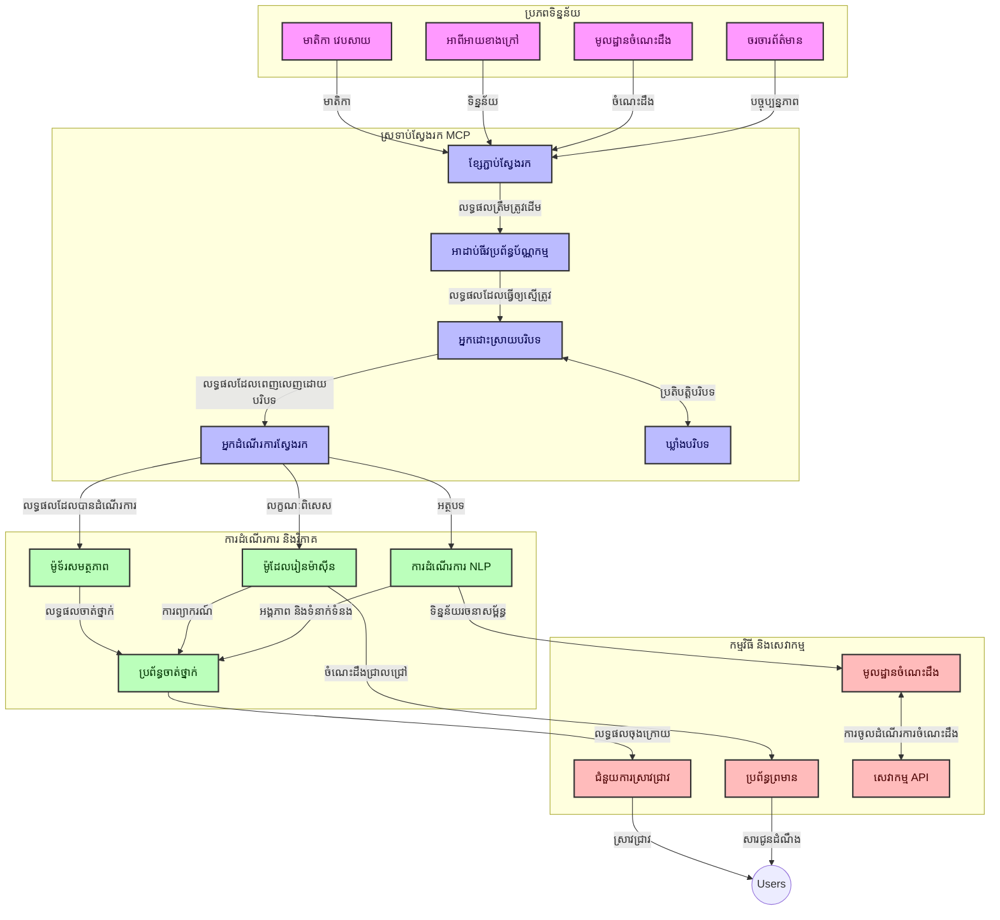
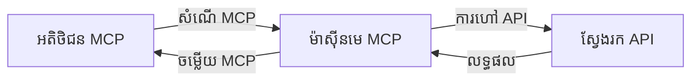
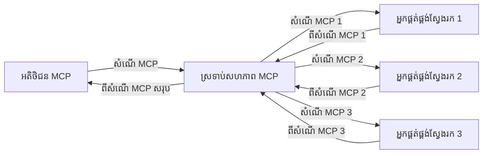
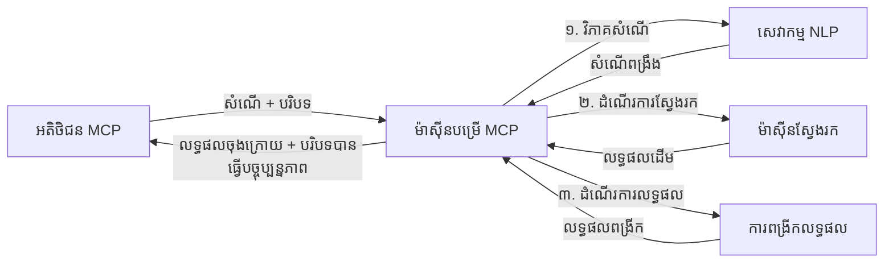

# ពិធីសម្រាប់បរិបទម៉ូដែលសម្រាប់ស្វែងរកវេបសាយពេលវេលាពិត

## ទិដ្ឋភាពទូទៅ

ការស្វែងរកវេបសាយពេលវេលាពិតបានក្លាយជាចំណុចសំខាន់ក្នុងបរិយាកាសដែលដឹកនាំដោយព័ត៌មានសព្វថ្ងៃនេះ ដែលកម្មវិធីត្រូវការការចូលដំណើរការព័ត៌មានទាន់សម័យតាមអ៊ីនធឺរណետយ៉ាងទាន់ម៉ោងដើម្បីផ្តល់នូវចម្លើយមានសារៈសំខាន់ និងទាន់ពេលវេលា។ ពិធីសម្រាប់បរិបទម៉ូដែល (MCP) តំណាងឱ្យការរីកចម្រើនសំខាន់ក្នុងការបង្កើតប្រសិទ្ធភាពដំណើរការស្វែងរកពេលវេលាពិតទាំងនេះ បង្កើនប្រសិទ្ធភាពស្វែងរក រក្សាអោយមានភាពចម្រុះក្នុងបរិបទ និងបង្កើនសមត្ថភាពប្រព័ន្ធទូទៅ។

ម៉ូឌុលនេះធ្វើការស្រាវជ្រាវពីរបៀបដែល MCP បំលែងការស្វែងរកវេបសាយពេលវេលាពិតដោយផ្តល់នូវវិធីសាស្រ្តស្តង់ដារសម្រាប់ការគ្រប់គ្រងបរិបទទូទាំងម៉ូដែល AI ប្រព័ន្ធស្វែងរក និងកម្មវិធី។

### អ្វីដែលអ្នកនឹងរៀន

ក្នុងមគ្គុទ្ទភៀងពេញលេញនេះ អ្នកនឹងស្វែងរក៖

- របៀបដែល MCP បង្កើតស្ពានដ៏រលូនរវាងម៉ូដែល AI និងសមត្ថភាពស្វែងរកវេបសាយពេលវេលាពិត
- រចនាសម្ព័ន្ធសំណុំបែបបទសម្រាប់អនុវត្តដំណោះស្រាយស្វែងរកមានប្រសិទ្ធភាព និងអាចពង្រីកដោយ MCP
- វិធីសាស្រ្តសម្រាប់រក្សាបរិបទស្វែងរកឲ្យនៅមានតាមពេលរក្សាសំណួរ និងអន្តរកម្មជាច្រើន
- ការអនុវត្តកូដជាក់ស្តែងក្នុងភាសា Python និង JavaScript សម្រាប់ស្ថានการณ์ស្វែងរកវេបសាយនានា
- វិធីសាស្រ្តសម្រាប់ផ្គូរផ្គងនូវភាពសមស្រប ទាន់ពេលវេលា និងប្រសិទ្ធភាពក្នុងប្រព័ន្ធស្វែងរកដែលផ្អែកលើ MCP

## ជូនដំណឹងពីការស្វែងរកវេបសាយពេលវេលាពិត

ការស្វែងរកវេបសាយពេលវេលាពិតគឺជាវិធីសាស្រ្តបច្ចេកវិទ្យាដែលអនុញ្ញាតឲ្យមានការសួរព័ត៌មានបន្តរៀងរាល់ពេល ការបម្លែង និងការវិភាគព័ត៌មានតាមអ៊ីនធឺរណែតនៅពេលវេលាដែលវាត្រូវបានបោះពុម្ពឬបន្ទាន់សម័យ បណ្តាលឲ្យប្រព័ន្ធអាចផ្តល់ព័ត៌មានថ្មី និងមានសារៈសំខាន់ជាមួយនឹងការពន្យារពេលតិចបំផុត។ ខុសពីប្រព័ន្ធស្វែងរកចាស់ៗដែលធ្វើការលើទិន្នន័យដែលបានអ៊ិនដិចសដែលអាចមានអាយុកាលរឿងជាច្រើនម៉ោង ឬថ្ងៃ ការស្វែងរកពេលវេលាពិតបម្រើនូវទិន្នន័យផ្សាយបន្តផ្ទាល់ពីអ៊ីនធឺរណែត ដើម្បីផ្តល់នូវចំណេះដឹង និងព័ត៌មានដែលបញ្ចេញស្ថានភាពបច្ចុប្បន្ននៃមាតិកាអនឡាញ។

### គាត់ទូទៅនៃការស្វែងរកវេបសាយពេលវេលាពិត៖

- **ការបន្តរៀងរាល់ការសួរ**: សំណួរស្វែងរកត្រូវបានដំណើរការទៅលើប្រភពទិន្នន័យដែលកំពុងបន្តអាប់ដេត
- **អាទិភាពលើភាពទាន់សម័យ**: ប្រព័ន្ធត្រូវបានរចនាឡើងដើម្បីផ្តល់អាទិភាពដល់ព័ត៌មានថ្មីៗ
- **ការផ្គូរផ្គងភាពសមរម្យ**: រក្សាកម្រិតមធ្យមរវាងភាពសមរម្យ និងភាពទាន់សម័យ
- **រចនាសម្ព័ន្ធអាចពង្រីក**: ប្រព័ន្ធអាចគ្រប់គ្រងបន្ទុកសំណួរនិងបរិមាណទិន្នន័យផ្លាស់ប្តូរ
- **ការយល់ដឹងបរិបទ**: រក្សាបរិបទប្រើប្រាស់តាមសកម្មភាពស្វែងរកជាប់គ្នាជារឿងសំខាន់សម្រាប់លទ្ធផលមានន័យ
- **ការកែប្រែសំណួរបន្តបន្ទាប់**: កែប្រែសំណួរជាមួយបរិបទ និងលទ្ធផលមុនៗដោយប្តូរតាមលក្ខខណ្ឌ
- **ការបញ្ចូលប្រភពជាច្រើន**: បញ្ចូលលទ្ធផលពីអ្នកផ្តល់សេវាស្វែងរក និងប្រភពវេបផ្សេងៗគ្នា
- **ការយល់ដឹងសេចក្ដីមានន័យ**: ដំណើរការសំណួរ និងមាតិកាដោយផ្អែកលើអត្ថន័យ មិនមែនតែពាក្យគេដ៏តែមួយទេ
- **ចំណាត់ថ្នាក់ពេលវេលាពិត**: ការកែតម្រូវចំណាត់ថ្នាក់លទ្ធផលបន្តបន្ទាប់នៅពេលដែលព័ត៌មានថ្មីមាន

### ពិធីសម្រាប់បរិបទម៉ូដែល និងការស្វែងរកវេបសាយពេលវេលាពិត

ពិធីសម្រាប់បរិបទម៉ូដែល (MCP) ដោះស្រាយបញ្ហាសំខាន់ៗជាច្រើនក្នុងបរិបទការស្វែងរកវេបសាយពេលវេលាពិត៖

1. **ការរក្សាបរិបទស្វែងរក**: MCP ស្តង់ដារប្រព័ន្ធរក្សាបរិបទនៅលើប្លុកស្វែងរកចែកចាយប្រាស្រ័យទាក់ទងនូវប្រវត្តិសំណួរមានសារៈសំខាន់ និងចំណង់ចំណូលចិត្តអ្នកប្រើ

2. **ការគ្រប់គ្រងសំណួរដោយមានប្រសិទ្ធភាព**: ការផ្តល់មេកានិចដើម្បីផ្ទេរបរិបទដែលមានរចនាសម្ព័ន្ធ អនុញ្ញាតឲ្យកាត់បន្ថយការផ្ទេរបរិបទសំឡាំងគ្នាទៅលើមួយៗនៃការស្វែងរក

3. **ភាពអាចប្រើប្រាស់រួមគ្នា**: MCP បង្កើតភាសាស្ដង់ដារ សម្រាប់ការចែករំលែកបរិបទរវាងបច្ចេកវិទ្យាស្វែងរកនានានិងម៉ូដែល AI ដែលអនុញ្ញាតឲ្យមានរចនាសម្ព័ន្ធបត់បែន និងអាចពង្រីកបាន

4. **បរិបទបង្កើនប្រសិទ្ធភាពស្វែងរក**: ការអនុវត្ត MCP អាចផ្តល់អាទិភាពទៅលើធាតុបរិបទដែលមានតំលៃសំខាន់បំផុតសម្រាប់ស្វែងរកមានប្រសិទ្ធភាព បង្កើនរាល់ទាំងសមត្ថភាព និងភាពត្រឹមត្រូវ

5. **ការកែតម្រូវដំណើរការស្វែងរក**: ជាមួយនឹងការគ្រប់គ្រងបរិបទត្រឹមត្រូវតាមរយៈ MCP ប្រព័ន្ធស្វែងរកអាចបត់បែនដំណើរការតាមតម្រូវការអ្នកប្រើប្រាស់និងស្ថានភាពព័ត៌មានដែលកំពុងរីកចម្រើន

ក្នុងកម្មវិធីសម័យទំនើបចាប់ពីការបញ្ចូលព័ត៌មានដើម្បីជួយស្រាវជ្រាវ MCP រួមបញ្ចូលជាមួយបច្ចេកវិទ្យាស្វែងរកវេបអាចបង្កើតការស្វែងរកមានបរិបទពិតប្រាកដ និងមានគំនិតឆ្លាត ដែលអាចផ្តល់លទ្ធផលប្រសើរឡើងតាមសកម្មភាពអ្នកប្រើបន្តទៅទៀត។

## គោលបំណងការរៀន

នៅចុងមេរៀននេះ អ្នកនឹងអាច៖

- យល់ដឹងពីមូលដ្ឋាននៃការស្វែងរកវេបសាយពេលវេលាពិត និងបញ្ហានានាផ្លូវពិភពដ៏ទាន់សម័យ
- ពណ៌នាថា ពិធីសម្រាប់បរិបទម៉ូដែល (MCP) បង្កើនសមត្ថភាពស្វែងរកវេបសាយពេលវេលាពិតកាន់តែប្រសើរយ៉ាងដូចម្តេច
- អនុវត្តដំណោះស្រាយស្វែងរកដោយផ្អែកលើ MCP ជាមួយស៊ុមនិង API ពេញនិយម
- រចនានិងដាក់បង្ហាញស្ថាបត្យកម្មស្វែងរកអាចពង្រីក និងមានសមត្ថភាពខ្ពស់ជាមួយ MCP
- ប្រើប្រាស់គំនិត MCP សម្រាប់ករណីប្រើប្រាស់ចម្រង់រួម រួមមានស្វែងរកដោយមានអត្ថន័យ ជំនួយការស្រាវជ្រាវ និងលេងរកអាដាប់ម៉ាន់ AI
- វាយតម្លៃនិន្នាការកំពុងកើតឡើង និងការបង្កើតបច្ចេកវិទ្យាថ្មីៗក្នុងការស្វែងរកតាម MCP
- កែលម្អប្រព័ន្ធស្វែងរកដែលមានបរិបទដែលរៀនពីសកម្មភាពអ្នកប្រើ
- សម្រុកសម្រួលសមត្ថភាពស្វែងរកវេបសាយទៅក្នុងជំនួយការចល័តដោយប្រើពិធីសម្រាប់បរិបទ MCP ស្តង់ដារ
- បង្កើតបណ្តោយបណ្តាលការស្វែងរកជាច្រើនជំហានដែលជួយបន្តឲ្យលទ្ធផលកាន់តែប្រសើរឡើងដោយផ្អែកលើបរិបទ
- បង្កើនប្រសិទ្ធភាពស្វែងរក ខណៈដែលរក្សាបរិបទយ៉ាងពេញលេញ

### ការបកស្រាយនិងសារៈសំខាន់

ការស្វែងរកវេបសាយពេលវេលាពិតពាក់ព័ន្ធនឹងការសួរបន្តរៀងរាល់ពេល ការទាញយក ហើយការផ្តល់ព័ត៌មានតាមអ៊ីនធឺរណិតដោយមានការពន្យារពេលតិចបំផុត។ ខុសពីម៉ាស៊ីនស្វែងរកបែបប្រពៃណីដែលធ្វើការដំណើរការដោយការរុករកនិងអ៊ិនដិចវេបជាប្រចាំ ការស្វែងរកពេលវេលាពិតមានគោលបំណងបង្ហាញព័ត៌មាននៅពេលវេលានោះផ្ទាល់ អនុញ្ញាតឲ្យមានការចូលប្រើចំណូលថ្មីបំផុត។

លក្ខណៈសំខាន់នៃការស្វែងរកវេបសាយពេលវេលាពិតរួមមាន៖

- **ភាពទាន់សម័យ**: ផ្តល់អាទិភាពដល់មាតិកានិងការអាប់ដេតថ្មីៗ
- **ដំណើរការបន្តរាល់ពេល**: តែងតែត្រួតពិនិត្យព័ត៌មានថ្មីៗ
- **ការកែសំណួរ**: បន្តបន្ទាប់កែសម្រួលសំណួរស្វែងរកដោយផ្អែកលើបរិបទ និងមតិយោបល់
- **ការផ្តល់លទ្ធផលភ្លាមៗ**: ផ្តល់លទ្ធផលស្វែងរកជាមួយការពន្យារពេលតិចបំផុត
- **ការរក្សាទុកបរិបទ**: អនុវត្តន៍លើសំណួរមុនៗសម្រាប់ភាពសមរម្យកាន់តែប្រសើរ

### បញ្ហាក្នុងការស្វែងរកវេបសាយប្រពៃណី

វិធីសាស្រ្តស្វែងរកវេបសាយប្រពៃណីជួបប្រទះជាមួយគំរូទាំងនេះនៅពេលអនុវត្តក្នុងស្ថានការណ៍ពេលវេលាពិត៖

1. **បែកខ្ទង់បរិបទ**: ពិបាករក្សាបរិបទស្វែងរកឲ្យនៅរួមគ្នា ក្នុងសំណួរជាច្រើន
2. **ភាពទាន់សម័យព័ត៌មាន**: ប្រឈមមុខនឹងបញ្ហាក្នុងការអនុវត្តអាទិភាពទៅលើព័ត៌មានថ្មីៗបំផុត
3. **ការលំបាកក្នុងការរួមបញ្ចូលគ្នា**: បញ្ហាផ្នែកភាពរួមគ្នារវាងប្រព័ន្ធស្វែងរកនិងកម្មវិធីផ្សេងៗគ្នា
4. **បញ្ហាការពន្យារពេល**: រក្សាកម្រិតស្វែងរកធំទូលាយជាមួយភាពលឿនក្នុងការឆ្លើយតបទាមទារ
5. **ការត្រួតពិនិត្យភាពសមរម្យ**: ផ្តល់ភាពត្រឹមត្រូវ និងសមរម្យ ខណៈផ្តល់អាទិភាពនូវថ្មីៗ

## យល់ដឹងពីពិធីសម្រាប់បរិបទម៉ូដែល (MCP) សម្រាប់ការស្វែងរក

### MCP ជាអ្វីនៅក្នុងបរិបទស្វែងរក?

ពិធីសម្រាប់បរិបទម៉ូដែល (MCP) គឺជាពិធីសាស្រ្តទំនាក់ទំនងផ្ទាល់តែមួយដែលបានស្ដង់ដារ ដើម្បីជួយឲ្យមានការប្តេជ្ញាញត្រួតពិនិត្យប្រសិទ្ធភាពរវាងម៉ូដែល AI និងកម្មវិធី។ នៅក្នុងបរិបទស្វែងរកវេបសាយពេលវេលាពិត MCP ផ្តល់ស៊ុមសម្រាប់៖

- រក្សាបរិបទស្វែងរកជាច្រើនជំពូកសំណួរគ្នា
- ស្ដង់ដារទ្រង់ទ្រាយសំណួរនិងលទ្ធផលស្វែងរក
- អុបទីម៉ាយសារបញ្ជូនប៉ារ៉ាម៉ែត្រនិងលទ្ធផលស្វែងរក
- បង្កើនការប្រាស្រ័យទាក់ទងរវាងម៉ូដែល និងម៉ាស៊ីនស្វែងរក

### ធាតុសំខាន់និងរចនាសម្ព័ន្ធ

រចនាសម្ព័ន្ធ MCP សម្រាប់ការស្វែងរកវេបសាយពេលវេលាពិត មានធាតុសំខាន់ៗជាច្រើន៖

1. **អ្នកគ្រប់គ្រងបរិបទសំណួរ**: គ្រប់គ្រងនិងរក្សាបរិបទស្វែងរកជាច្រើនសំណួរ
2. **អ្នកដំណើរការស្វែងរក**: ដំណើរការសំណើរការស្វែងរកប្រើប្រាស់វិធីសាស្រ្តមានចំណេះនៅលើបរិបទ
3. **ឧបករណ៍បម្លែងពិធី**: បម្លែងរវាង API ស្វែងរកនានា ខណៈរក្សាបរិបទ
4. **ហាងផ្ទុកបរិបទ**: ផ្ទុកនិងទាញយកប្រវត្តិស្វែងរកនិងចំណង់ចំណូលចិត្តបានមានប្រសិទ្ធភាព
5. **អ្នកភ្ជាប់ស្វែងរក**: ភ្ជាប់ទៅម៉ាស៊ីនស្វែងរកនានា និង API វេបផ្សេងៗ



### របៀបដែល MCP ពង្រីកការស្វែងរកវេបសាយពេលវេលាពិត

MCP ដោះស្រាយបញ្ហាស្វែងរកវេបសាយប្រពៃណីដោយ៖

- **ការបន្តបន្តរបរិបទ**: រក្សាទំនាក់ទំនងរវាងសំណួរតាមដំណើរពេញម៉ោងស្វែងរក
- **ការផ្ទេរប្រូតូកូលដ៏ល្អឥតខ្ចោះ**: កាត់បន្ថយភាពកក្រើកនៅក្នុងប៉ារ៉ាម៉ែតរស្វែងរកតាមការគ្រប់គ្រងបរិបទឆ្លាតវៃ
- **ចំណុចប្រទាក់ស្ដង់ដារ**: ផ្តល់ API អស់ពីគ្នាដើម្បីអនុវត្តសមាសធាតុស្វែងរក
- **ការពន្យារពេលកាត់បន្ថយ**: កាត់បន្ថយការលំបាកដំណើរការតាមការគ្រប់គ្រងបរិបទមានប្រសិទ្ធិភាព
- **ភាពសមរម្យបានបង្កើន**: បង្កើនភាពសមរម្យដំណើរការស្វែងរកដោយរក្សាជំនឿរបស់អ្នកប្រើប្រាស់តាមសំណួរជាច្រើន


## ការរួមបញ្ចូល និងការអនុវត្ត

ប្រព័ន្ធស្វែងរកវែបនៅពេលពិតត្រូវការរចនាស្ថាបត្យកម្ម និងការអនុវត្តដោយប្រុងប្រយ័ត្ន ដើម្បីរក្សាភាពល្អប្រសើរ និងភាពត្រឹមត្រូវនៃបរិបទ។ ពProtocol Model Context ផ្ដល់នូវវិធីសាស្រ្តស្តង់ដារសម្រាប់ការរួមបញ្ចូលម៉ូដែល AI និងបច្ចេកវិទ្យាស្វែងរក អនុញ្ញាតឱ្យមានបណ្តាញស្វែងរកដែលស្មុគស្មាញ និងផ្អែកលើបរិបទបានល្អជាងមុន។

### ពិពណ៌នាអំពីការរួមបញ្ចូល MCP ក្នុងស្ថាបត្យកម្មស្វែងរក

ការអនុវត្ត MCP ក្នុងបរិបទស្វែងរកវែបពេលពិតប្រាក់ត្រូវវិចារណាផ្នែកសំខាន់ៗ៖

1. **ការប្រែប្រួលបរិបទស្វែងរកទៅជាទ្រង់ទ្រាយខ្សែអក្សរ**: MCP ផ្ដល់នូវយន្តការសម្រួលសម្រាប់កំណត់លេខបរិបទក្នុងការស្នើសុំស្វែងរក ដើម្បីធានាថាបរិបទសំខាន់ៗត្រូវបានបន្តជាមួយសំណើរនៅក្នុងបណ្តាញដំណើរការ។ នេះរួមបញ្ចូលទ្រង់ទ្រាយសរសេរមានស្តង់ដារ ដែលបានផ្គុំឡើងឲ្យល្អបំផុតសម្រាប់ទិន្នន័យជាពាក់ព័ន្ធនឹងការស្វែងរក។

2. **ដំណើរការស្វែងរកដែលមានស្ថានភាពមួយ**: MCP អនុញ្ញាតឲ្យមានការដំណើរការស្វែងរកយ៉ាងច្បាស់លាស់ ដោយរក្សាទុកការតំណាងបរិបទដោយឥតខ្ជិលនៅក្នុងលំនាំជាលំដាប់ ចំពោះបណ្តាញស្វែងរកដែលមានជាជំហានជាច្រើន នាំឲ្យមានការកែលម្អលទ្ធផល។  

3. **ការពង្រីក និងកែប្រែសំណើស្វែងរក**: ការអនុវត្ត MCP ក្នុងប្រព័ន្ធស្វែងរកអាចជួយបញ្ចេញសំណើស្វែងរកដ៏ស្មុគស្មាញ និងកែលម្អផ្អែកលើបរិបទដែលបានប្រមូលផ្តុំ អនុញ្ញាតឲ្យទទួលលទ្ធផលដែលពាក់ព័ន្ធបន្ថែមកាលពេលសម័យស្វែងរកបន្ត។

4. **ការក្លឹបកំណត់លទ្ធផល និងការចូលបទពិសោធន៍**: ដោយស្តង់ដារការរង់ចាំបរិបទ MCP ជួយគ្រប់គ្រងការក្លឹបនិងកំណត់អាទិភាពលទ្ធផល អនុញ្ញាតឲ្យបច្ចេកវិទ្យាជាច្រើនអាចធ្វើការប្រែប្រួលឡើងទៅតាមបរិបទស្វែងរកដែលកំពុងបន្តអភិវឌ្ឍ។

5. **ការរៀបចំ និងបញ្ចូលស្វែងរកសម្រាប់មូលដ្ឋានបណ្ដាញជាច្រើន**: MCP ជួយធ្វើអោយមានការ​រួមបញ្ចូលស្វែងរកយ៉ាងស្មុគស្មាញពីផ្នែកប៉ះពាល់ជាច្រើន ដោយផ្ដល់នូវរូបភាពមានរចនាសម្ព័ន្ធរបស់បរិបទស្វែងរក អនុញ្ញាតឲ្យមានការបញ្ចូលលទ្ធផលពីប្រភពផ្សេងៗបានយ៉ាងមានអត្ថន័យ។

ការអនុវត្ត MCP ក្នុងបច្ចេកវិទ្យាស្វែងរកជាច្រើន បង្កើតវិធីសាស្រ្តរួមអំពីការគ្រប់គ្រងបរិបទ ដែលកាត់បន្ថយការចាំបាច់នៃកូដរួមបញ្ចូលប្ដូរផ្ទាល់ខ្លួន ខណៈពេលបង្កើនសមត្ថភាពប្រព័ន្ធក្នុងការរក្សាបរិបទដែលមានន័យខណៈសំណើស្វែងរកកំពុងអភិវឌ្ឍ។

### MCP ក្នុងការអនុវត្តស្វែងរកវែបផ្សេងៗ

ឧទាហរណ៍ទាំងនេះអនុវត្តតាមលក្ខណៈបច្ចុប្បន្នរបស់ MCP ដែលផ្អែកលើ JSON-RPC ជាមួយនឹងយន្តការដឹកជញ្ជូនផ្សេងៗគ្នា។ កូដបង្ហាញពីវិធីសាស្រ្តក្នុងការអនុវត្តការរួមបញ្ចូលស្វែងរកផ្ទាល់ខ្លួន ខណៈរក្សាការស្របគ្នាពេញលេញជាមួយប្រព័ន្ធ MCP។


<details>
<summary>ការអនុវត្ត Python ជាមួយ API ស្វែងរកទូទៅ</summary>

```python
import asyncio
import json
import aiohttp
from typing import Dict, Any, Optional, List
from contextlib import asynccontextmanager
from collections.abc import AsyncIterator

# នាំចូលបណ្ណាល័យ MCP ស្តង់ដារ
from mcp.client.session import ClientSession
from mcp.client.streamable_http import streamablehttp_client
from mcp.types import TextContent, CreateMessageRequestParams, CreateMessageResult
from mcp.server.fastmcp import FastMCP

# បង្កើតម៉ាស៊ីនមេ FastMCP សម្រាប់ ស្វែងរកបណ្តាញ
search_server = FastMCP("WebSearch")

# ថ្នាក់ដើម្បីដោះស្រាយប្រតិបត្តិការស្វែងរកបណ្តាញ
class WebSearchHandler:
    def __init__(self, api_endpoint: str, api_key: str):
        self.api_endpoint = api_endpoint
        self.api_key = api_key
        self.session = None
        
    async def initialize(self):
        """Initialize the HTTP session"""
        self.session = aiohttp.ClientSession(
            headers={"Authorization": f"Bearer {self.api_key}"}
        )
    
    async def close(self):
        """Close the HTTP session"""
        if self.session:
            await self.session.close()
            
    async def perform_search(self, query: str, max_results: int = 5, 
                           include_domains: List[str] = None, 
                           exclude_domains: List[str] = None,
                           time_period: str = "any") -> Dict[str, Any]:
        """Perform web search using the search API"""
        # សាងសង់ប៉ារ៉ាម៉ែត្រស្វែងរក
        search_params = {
            "q": query,
            "limit": max_results,
            "time": time_period
        }
        
        if include_domains:
            search_params["site"] = ",".join(include_domains)
            
        if exclude_domains:
            search_params["exclude_site"] = ",".join(exclude_domains)
        
        # សម្របសម្រួលសំណើស្វែងរក
        try:
            async with self.session.get(
                self.api_endpoint,
                params=search_params
            ) as response:
                if response.status != 200:
                    error_text = await response.text()
                    raise Exception(f"Search API error: {response.status} - {error_text}")
                
                search_data = await response.json()
                
                # បំលែងការឆ្លើយតប API ជាទ្រង់ទ្រាយស្តង់ដារ
                results = []
                for item in search_data.get("results", []):
                    results.append({
                        "title": item.get("title", ""),
                        "url": item.get("url", ""),
                        "snippet": item.get("snippet", ""),
                        "date": item.get("published_date", ""),
                        "source": item.get("source", "")
                    })
                
                return {
                    "query": query,
                    "totalResults": len(results),
                    "results": results
                }
        except Exception as e:
            print(f"Search API request error: {e}")
            raise

# ចាប់ផ្តើមអ្នកត្រួតពិនិត្យស្វែងរក
search_handler = WebSearchHandler(
    api_endpoint="https://api.search-service.example/search",
    api_key="your-api-key-here"
)

# តំឡើងអាយុកាលដើម្បីគ្រប់គ្រងអ្នកត្រួតពិនិត្យស្វែងរក
@asyncio.asynccontextmanager
async def app_lifespan(server: FastMCP):
    """Manage application lifecycle"""
    await search_handler.initialize()
    try:
        yield {"search_handler": search_handler}
    finally:
        await search_handler.close()

# កំណត់អាយុកាលសម្រាប់ម៉ាស៊ីនមេ
search_server = FastMCP("WebSearch", lifespan=app_lifespan)

# ចុះឈ្មោះឧបករណ៍ស្វែងរកបណ្តាញ
@search_server.tool()
async def web_search(query: str, max_results: int = 5, 
                   include_domains: List[str] = None,
                   exclude_domains: List[str] = None,
                   time_period: str = "any") -> Dict[str, Any]:
    """
    Search the web for information
    
    Args:
        query: The search query
        max_results: Maximum number of results to return (default: 5)
        include_domains: List of domains to include in search results
        exclude_domains: List of domains to exclude from search results
        time_period: Time period for results ("day", "week", "month", "any")
        
    Returns:
        Dictionary containing search results
    """
    ctx = search_server.get_context()
    search_handler = ctx.request_context.lifespan_context["search_handler"]
    
    results = await search_handler.perform_search(
        query=query,
        max_results=max_results,
        include_domains=include_domains,
        exclude_domains=exclude_domains,
        time_period=time_period
    )
    
    return results

# ឧទាហរណ៍ការប្រើប្រាស់អតិថិជន
async def client_example():
    # ချိတ်ဆက်ទៅម៉ាស៊ីនស្វែងរកដោយប្រើការដឹកជញ្ជូន HTTP ដែលអាចចាក់បាន
    async with streamablehttp_client("http://localhost:8000/mcp") as (read, write, _):
        async with ClientSession(read, write) as session:
            # ចាប់ផ្តើមការតភ្ជាប់
            await session.initialize()
            
            # ហៅឧបករណ៍ web_search
            search_results = await session.call_tool(
                "web_search", 
                {
                    "query": "latest developments in AI and Model Context Protocol",
                    "max_results": 5,
                    "time_period": "day",
                    "include_domains": ["github.com", "microsoft.com"]
                }
            )
            
            print(f"Search results: {search_results}")

# ឧទាហរណ៍ការប្រតិបត្តិម៉ាស៊ីនមេ
if __name__ == "__main__":
    # បើកម៉ាស៊ីនមេជាមួយការដឹកជញ្ជូន HTTP ដែលអាចចាក់បាន
    search_server.run(transport="streamable-http")
```
</details> 

<details>
<summary>ការអនុវត្ត JavaScript ជាមួយស្វែងរកក្នុងឧបករណ៍រុក្ខជាតិកម្មវិធី</summary>


```javascript
// ការ​អនុវត្ត​ម៉ាស៊ីនមេ MCP សម្រាប់​ស្វែងរក​វែប
import { McpServer, ResourceTemplate } from '@modelcontextprotocol/sdk/server/mcp.js';
import { StreamableHTTPServerTransport } from '@modelcontextprotocol/sdk/server/streamableHttp.js';
import { z } from 'zod';

// បង្កើតម៉ាស៊ីនមេ MCP សម្រាប់ស្វែងរកវែប
const searchServer = new McpServer({
    name: "BrowserSearch",
    description: "A server that provides web search capabilities"
});

// ថ្នាក់​សេវាកម្ម​ស្វែងរក
class SearchService {
    constructor(searchApiUrl, apiKey) {
        this.searchApiUrl = searchApiUrl;
        this.apiKey = apiKey;
    }

    async performSearch(parameters) {
        const {
            query = '',
            maxResults = 5,
            includeDomains = [],
            excludeDomains = [],
            timePeriod = 'any'
        } = parameters;
        
        // បង្កើត URL ស្វែងរកជាមួយ​ប៉ារ៉ាម៉ែត្រ
        const url = new URL(this.searchApiUrl);
        url.searchParams.append('q', query);
        url.searchParams.append('limit', maxResults);
        url.searchParams.append('time', timePeriod);
        
        if (includeDomains.length > 0) {
            url.searchParams.append('site', includeDomains.join(','));
        }
        
        if (excludeDomains.length > 0) {
            url.searchParams.append('exclude_site', excludeDomains.join(','));
        }
        
        try {
            const response = await fetch(url.toString(), {
                method: 'GET',
                headers: {
                    'Authorization': `Bearer ${this.apiKey}`,
                    'Content-Type': 'application/json'
                }
            });
            
            if (!response.ok) {
                const errorText = await response.text();
                throw new Error(`Search API error: ${response.status} - ${errorText}`);
            }
            
            const searchData = await response.json();
            
            // បម្លែង​ចម្លើយ​សម្រាប់ API ជាចំណុចទ្រង់ទ្រាយស្តង់ដារ
            const results = searchData.results?.map(item => ({
                title: item.title || '',
                url: item.url || '',
                snippet: item.snippet || '',
                date: item.published_date || '',
                source: item.source || ''
            })) || [];
            
            return {
                query,
                totalResults: results.length,
                results
            };
        } catch (error) {
            console.error('Search API request error:', error);
            throw error;
        }
    }
}

// ការចាប់ផ្តើម​សេវាកម្ម​ស្វែងរក
const searchService = new SearchService(
    'https://api.search-service.example/search',
    'your-api-key-here'
);

// ការរៀបចំ​អ្នកផ្តល់បរិបទសម្រាប់ម៉ាស៊ីនមេ
searchServer.setContextProvider(() => {
    return {
        searchService
    };
});

// ចុះបញ្ជីឧបករណ៍​ស្វែងរក​វែប
searchServer.tool({
    name: 'web_search',
    description: 'Search the web for information',
    parameters: {
        type: 'object',
        properties: {
            query: {
                type: 'string',
                description: 'The search query'
            },
            maxResults: {
                type: 'integer',
                description: 'Maximum number of results to return',
                default: 5
            },
            includeDomains: {
                type: 'array',
                items: { type: 'string' },
                description: 'List of domains to include in search results'
            },
            excludeDomains: {
                type: 'array',
                items: { type: 'string' },
                description: 'List of domains to exclude from search results'
            },
            timePeriod: {
                type: 'string',
                description: 'Time period for results',
                enum: ['day', 'week', 'month', 'any'],
                default: 'any'
            }
        },
        required: ['query']
    },
    handler: async (params, context) => {
        const { searchService } = context;
        return await searchService.performSearch(params);
    }
});

// ឧទាហរណ៍​កូដ​អតិថិជន​សម្រាប់ភ្ជាប់ទៅម៉ាស៊ីនមេ​ស្វែងរក
import { Client } from '@modelcontextprotocol/sdk/client/index.js';
import { StreamableHTTPClientTransport } from '@modelcontextprotocol/sdk/client/streamableHttp.js';

async function connectToSearchServer() {
    // ភ្ជាប់ទៅម៉ាស៊ីនមេ​ស្វែងរក
    const transport = new StreamableHTTPClientTransport(
        new URL('http://localhost:8000/mcp')
    );
    
    const client = new Client({
        name: 'search-client',
        version: '1.0.0'
    });
    
    await client.connect(transport);
    
    // ដំណើរការ​ឧបករណ៍​ស្វែងរក
    const searchResults = await client.callTool({
        name: 'web_search',
        arguments: {
            query: 'Model Context Protocol implementation examples',
            maxResults: 10,
            timePeriod: 'week',
            includeDomains: ['github.com', 'docs.microsoft.com']
        }
    });
    
    console.log('Search results:', searchResults);
    
    // លុបបំបាត់
    await client.disconnect();
}

// ចាប់ផ្តើមម៉ាស៊ីនមេ
const transport = new StreamableHTTPServerTransport();
await searchServer.connect(transport);
console.log('Search server running at http://localhost:8000/mcp');

// ក្នុងដំណើរការផ្សេង ឬបន្ទាប់ពីម៉ាស៊ីនមេចាប់ផ្តើមរួច
// connectToSearchServer().catch(console.error);
```
</details> 


## ការព្រមានអំពីឧទាហរណ៍កូដ

> **កំណត់សំខាន់**: ឧទាហរណ៍កូដខាងក្រោមបង្ហាញពីការរួមបញ្ចូល Model Context Protocol (MCP) ជាមួយនឹងមុខងារស្វែងរកវែប។ ទោះបីជាវា​ត្រូវបានអនុវត្ត​ផ្អែកលើរចនាទម្រង់និងរចនាសម្ព័ន្ធនៃ SDK MCP ផ្លូវការជាដើម ក៏ប៉ុន្តែមោះត្រូវបានបង្រួមសម្រាប់គោលបំណងការអប់រំ។
> 
> ឧទាហរណ៍ទាំងនេះបង្ហាញពី៖
> 
> 1. **ការអនុវត្ត Python**: ការអនុវត្តម៉ាស៊ីនបម្រើ FastMCP ដែលផ្តល់ឧបករណ៍ស្វែងរកវែប និងតភ្ជាប់ទៅ API ស្វែងរកខាងក្រៅ។ ឧទាហរណ៍នេះបង្ហាញពីការគ្រប់គ្រងអាយុកាលជីវិតបានត្រឹមត្រូវ ការគ្រប់គ្រងបរិបទ និងការអនុវត្តឧបករណ៍ តាមរចនាសម្ព័ន្ធនៃ [SDK MCP Python ផ្លូវការ](https://github.com/modelcontextprotocol/python-sdk)។ ម៉ាស៊ីនបម្រើនេះ​ប្រើប្រាស់ធនាគារ Streamable HTTP ដែលបានផ្លាស់ទីធនាគារ SSE ចាស់សម្រាប់ដំណើរការផលិតកម្ម។
> 
> 2. **ការអនុវត្ត JavaScript**: ការអនុវត្ត TypeScript/JavaScript ដោយប្រើតំរូវ FastMCP ពី [SDK MCP TypeScript ផ្លូវការ](https://github.com/modelcontextprotocol/typescript-sdk) ដើម្បីបង្កើតម៉ាស៊ីនបម្រើស្វែងរកដែលមានការកំណត់ឧបករណ៍បានត្រឹមត្រូវ និងការតភ្ជាប់ល្អជាមួយអតិថិជន។ វាធ្វើតាមរចនាសម្ព័ន្ធស្នាក់នៅជាន់ខ្ពស់សម្រាប់គ្រប់គ្រងសម័យនិងការរក្សាបរិបទ។
> 
> ឧទាហរណ៍ទាំងនេះត្រូវការការគ្រប់គ្រងកំហុស បញ្ជាក់អត្តសញ្ញាណ និងកូដបញ្ចូល API ជាក់លាក់សម្រាប់ការប្រើប្រាស់ក្នុងផលិតកម្ម។ ចំណុចចូល APIស្វែងរកបង្ហាញ (`https://api.search-service.example/search`) គឺជាកន្លែងកំណត់ និងត្រូវបានប្តូរជាមួយចំណុចចូលសេវាស្វែងរកពិតប្រាកដ។
> 
> សម្រាប់ព័ត៌មានលំអិតអំពីការអនុវត្តពេញលេញ និងវិធីសាស្រ្តទាន់សម័យបំផុត សូមយោងទៅកាន់ [សេចក្តីណែនាំ MCP ផ្លូវការ](https://spec.modelcontextprotocol.io/) និងឯកសារ SDK។

## គំនិតមូលដ្ឋាន

### សំរបសំរួលរបស់ Model Context Protocol (MCP)

នៅមូលដ្ឋាន Model Context Protocol ផ្ដល់វិធីស្តង់ដាក្នុងការផ្លាស់ប្ដូរបរិបទរវាងម៉ូដែល AI កម្មវិធី និងសេវាកម្ម។ នៅក្នុងការស្វែងរកវែបពេលពិត មូលដ្ឋាននេះមានសារៈសំខាន់សម្រាប់បង្កើតបទពិសោធន៍ស្វែងរកមានចម្ងាយជាច្រើនជុំ។ ធាតុសំខាន់រួមមាន៖

1. **ស្ថាបត្យកម្មអតិថិជន-ម៉ាស៊ីនបម្រើ**: MCP បង្កើតការបែងចែកច្បាស់លាស់រវាងអតិថិជនស្វែងរក (អ្នកស្នើសុំ) និងម៉ាស៊ីនបម្រើស្វែងរក (អ្នកផ្ដល់), សម្រាប់គំរូបញ្ជូនបត់បែន។

2. **ការទំនាក់ទំនង JSON-RPC**: ពProtocol ប្រើប្រាស់ JSON-RPC សម្រាប់ការផ្លាស់ប្ដូរបទសារ ធ្វើឲ្យវាស្របតាមបច្ចេកវិទ្យាវែប និងងាយស្រួលក្នុងការអនុវត្តលើវេទិកាពហុច្រើន។

3. **ការគ្រប់គ្រងបរិបទ**: MCP កំណត់វិធីសាស្រ្តរចនាសម្ព័ន្ធសម្រាប់រក្សា ធ្វើបច្ចុប្បន្នភាព និងការប្រើប្រាស់បរិបទស្វែងរកនៅជុំវិញការបន្តទំនាក់ទំនងជាច្រើន។

4. **ការកំណត់ឧបករណ៍**: សមត្ថភាពស្វែងរកត្រូវបានបង្ហាញជាឧបករណ៍ស្តង់ដារ ដែលមានប៉ារ៉ាម៉ែត្រ និងតម្លៃត្រឡប់ត្រូវបានកំណត់ច្បាស់។

5. **ការបន្លូផ្សាយផ្ទាល់**: ពProtocol គាំទ្រការប្រលាយលទ្ធផល ដើម្បីបំពេញការស្វែងរកពេលពិត ដែលអាចទទួលលទ្ធផលបានដំណាក់កាលជាដំណាក់កាល។

### គំរូរួមបញ្ចូលស្វែងរកវែប

នៅពេលរួមបញ្ចូល MCP ជាមួយស្វែងរកវែប មានគំរូជាច្រើនដែលបង្ហាញឡើង៖

#### 1. រួមបញ្ចូលអ្នកផ្ដល់ស្វែងរកដោយផ្ទាល់



ក្នុងគំរូនេះ ម៉ាស៊ីនបម្រើ MCP ទាក់ទងដោយផ្ទាល់ទៅ API ស្វែងរកមួយឬច្រើន ដោយបំលែងសំណើ MCP ទៅជាការហៅ API ជាក់លាក់ និងបំលែងលទ្ធផលជាសំណព្វ MCP។

#### 2. ស្វែងរកតាមសហភាព ដោយរក្សាភាពរួមបច្ចុប្បន្នភាពបរិបទ



គំរូនេះចែកចាយសំណើស្វែងរកទៅអ្នកផ្ដល់ស្វែងរកជាច្រើនដែលគាំទ្រពProtocol MCP រាល់នាក់អាចមានជំនាញក្នុងមាតិកានិងសមត្ថភាពស្វែងរកខុសៗគ្នា ខណៈរក្សាបរិបទរួមមួយ។

#### 3. ខ្សែស្វែងរកដែលបង្កើតដោយបរិបទបន្ថែម



ក្នុងគំរូនេះ ដំណើរការស្វែងរកត្រូវបានចែកចាយជាច្រើនជំហាន ដោយបរិបទត្រូវបានបន្ថែមនៅជំហាននីមួយៗ ដាំផលិតលទ្ធផលដែលពាក់ព័ន្ធបន្ថែមរៀងរាល់ជំហាន។

### ធាតុរួមបរិបទស្វែងរក

នៅក្នុងស្វែងរកលើវែបដោយផ្អែកលើ MCP បរិបទស្តង់ដារមាន៖

- **ប្រវត្តិសំណើស្វែងរក**: សំណើស្វែងរកពីមុនក្នុងសម័យ
- **ចំណង់ចំណូលចិត្តអ្នកប្រើ**: ភាសា តំបន់ ការកំណត់ស្វែងរកប្រកបដោយសុវត្ថិភាព
- **ប្រវត្តិការជជែកបកម្ម**: លទ្ធផលដែលបានចុច ពេលវេលាចំណាយលើលទ្ធផល
- **ប៉ារ៉ាម៉ែត្រ​ស្វែងរក**: តម្រុយ លំដាប់ចម្រាក់ និងកម្មវិធីបន្ថែមស្វែងរកផ្សេងៗ
- **ចំណេះដឹងផ្នែកដែន**: បរិបទជាមុខវិជ្ជាដែលពាក់ព័ន្ធនឹងការស្វែងរក
- **បរិបទពេលវេលា**: ធាតុពាក់ព័ន្ធផ្អែកលើពេលវេលា
- **ចំណង់ចំណូលចិត្តប្រភព**: ប្រភពព័ត៌មានដែលទុកចិត្ត ឬចូលចិត្ត

## ករណីប្រើប្រាស់ និងកម្មវិធី

### ស្រាវជ្រាវ និងប្រមូលព័ត៌មាន

MCP បង្កើនទិន្នន័យការស្រាវជ្រាវដោយ៖

- រក្សាបរិបទស្រាវជ្រាវក្នុងគន្លងស្វែងរក
- អនុញ្ញាតសំណើស្វែងរកដ៏ស្មុគស្មាញ និងមានពាក់ព័ន្ធជាមួយបរិបទ
- គាំទ្រសហភាពស្វែងរកពីប្រភពជាច្រើន
- ជួយយកចំណេះដឹងពីលទ្ធផលស្វែងរក

### ត្រួតពិនិត្យពត៌មាន និងនិន្នាការពេលពិត

ស្វែងរកដំណើរការដោយ MCP ផ្ដល់អត្ថប្រយោជន៍ចំពោះការត្រួតពិនិត្យពត៌មាន៖

- ស្វែងរកព័ត៌មានថ្មីៗរហ័សនៅជិតពេលពិត
- ការត្រងតាមបរិបទព័ត៌មានពាក់ព័ន្ធ
- ការតាមដានប្រធានបទ និងអង្គភាពពីប្រភពជាច្រើន
- ការជូនដំណឹងព័ត៌មានផ្ទាល់ខ្លួនដោយផ្អែកលើបរិបទអ្នកប្រើ

### ការប្រើប្រាស់បញ្ចូលគ្នារវាង AI និងការស្វែងរក

MCP បង្កើតឱកាសថ្មីសម្រាប់ការប្រើប្រាស់បញ្ចូលគ្នារវាង AI និងការស្វែងរក៖

- សំណើស្វែងរកផ្អែកលើបរិបទលំនាំរបៀបរុករកបច្ចុប្បន្ន
- រួមបញ្ចូលដំណើរការស្វែងរកវែបជាមួយជំនួយការដែលមាន LLM
- ការកែប្រែស្វែងរកជាច្រើនជំហានដោយរក្សាបរិបទ
- ការត្រួតពិនិត្យអត្ថន័យ និងការផ្ទៀងផ្ទាត់ព័ត៌មាន

## និន្នាការនិងច្នៃប្រឌិតអនាគត

### ការវិវត្តន៍ MCP ក្នុងការស្វែងរកវែប

មើលទៅមុខ យើងរំពឹងថា MCP នឹងបន្តបង្កើនដើម្បីដោះស្រាយ៖


- **ការស្វែងរកច្រើនរបៀប**: ឯកភាពការស្វែងរកអត្ថបទ រូបភាព សំឡេង និងវីដេអូជាមួយការបន្តបន្ទាប់នៃបរិបទត្រូវបានរក្សាទុក
- **ការស្វែងរកបម្រុងចែកចាយ**: គាំទ្របរិយាកាសស្វែងរកចែកចាយ និងឯករាជ្យ
- **ភាពឯកជនក្នុងការស្វែងរក**: មេកានិចស្វែងរកដែលគិតពីភាពឯកជនរួមបញ្ចូលបរិបទ
- **ការយល់ដឹងពីសំណើស្វែងរក**: ការព្យាបាលមាតិការស្ដើងនៃសំណើស្វែងរកភាសាធម្មជាតិ

### ការរីកចម្រើនភាគរយនៅក្នុងបច្ចេកវិទ្យា

បច្ចេកវិទ្យាដ៏កើតមានដែលនឹងបញ្ចូលក្លាយជា​អនាគតនៃការស្វែងរក MCP៖

1. **សំណង់ស្វែងរកប្រើបណ្តាញប្រសាទ**: ប្រព័ន្ធស្វែងរកផ្អែកលើការចម្លងបណ្ដាលបានប្រសើរឡើងសម្រាប់ MCP
2. **បរិបទស្វែងរកផ្ទាល់ខ្លួន**: រៀនពីទម្លាប់ស្វែងរករបស់អ្នកប្រើប្រាស់នាក់នីមួយៗជាយូរអង្វែង
3. **ការរួមបញ្ចូលវ៉ិចទ័រព្រះរាជវាំងសារ**: ការស្វែងរកដែលត្រូវរួមបញ្ចូលបរិបទដោយការប្រើចំណេះដឹងជាក់លាក់ក្នុងដែន
4. **បរិបទឆ្លងកាត់ប្រភេទ**: រក្សាទុកបរិបទជាទៀងទាត់នៅជុំវិញប្រភេទស្វែងរកខុសៗគ្នា

## សកម្មភាពអនុវត្តន៍

### សកម្មភាពទី១៖ រៀបចំបណ្តាញស្វែងរក MCP មូលដ្ឋាន

នៅក្នុងសកម្មភាពនេះ អ្នកនឹងរៀនពីរបៀប៖
- កំណត់បរិស្ថានស្វែងរក MCP មូលដ្ឋាន
- អនុវត្តអ្នកដំណើរការបរិបទសម្រាប់ស្វែងរកបណ្តាញ
- សាកល្បងនិងបញ្ជាក់ការរក្សាបរិបទតាមរយៈការស្វែងរកជាទៀងទាត់

### សកម្មភាពទី២៖ បង្កើតជំនួយការស្រាវជ្រាវជាមួយការស្វែងរក MCP

បង្កើតកម្មវិធីពេញលេញដែល៖
- ប្រព្រឹត្តសំណួរស្រាវជ្រាវប្រើភាសាធម្មជាតិ
- អនុវត្តស្វែងរកបណ្តាញដោយយកបរិបទមកគិត
- សម្រួលព័ត៌មានពីប្រភពច្រើន
- បង្ហាញលទ្ធផលស្រាវជ្រាវដែលបានរៀបចំ

### សកម្មភាពទី៣៖ អនុវត្តការស្វែងរកចំណុះច្រើនជាមួយ MCP

សកម្មភាពកម្រិតខ្ពស់ដែលគ្របដណ្តប់ពី៖
- ការត្រួតពិនិត្យសំណើដោយយកបរិបទទៅកាន់ម៉ាស៊ីនស្វែងរកច្រើនគ្រឿង
- ការរៀបចំចំណាត់ថ្នាក់និងការបូកសរុបលទ្ធផល
- ការដាក់ចំណាត់ថ្នាក់ឡើងវិញដើម្បីជៀសវាងលទ្ធផលក្លែងក្លាយ
- ការដោះស្រាយព័ត៌មានបន្ថែមដែលជាពិសេសសម្រាប់ប្រភព

## អត្ថបទបន្ថែម

- [Model Context Protocol Specification](https://spec.modelcontextprotocol.io/) - បញ្ជាក់ MCP ផ្លូវការនិងឯកសារបណ្តឹងលម្អិត
- [Model Context Protocol Documentation](https://modelcontextprotocol.io/) - មេរៀនលម្អិតនិងមគ្គុទេសក៍អនុវត្ត
- [MCP Python SDK](https://github.com/modelcontextprotocol/python-sdk) - ការអនុវត្ត MCP ជាភាសា Python ផ្លូវការ
- [MCP TypeScript SDK](https://github.com/modelcontextprotocol/typescript-sdk) - ការអនុវត្ត MCP ជាភាសា TypeScript ផ្លូវការ
- [MCP Reference Servers](https://github.com/modelcontextprotocol/servers) - ការអនុវត្តម៉ាស៊ីនបម្រុង MCP
- [Bing Web Search API Documentation](https://learn.microsoft.com/en-us/bing/search-apis/bing-web-search/overview) - API ស្វែងរកបណ្តាញ Bing របស់ Microsoft
- [Google Custom Search JSON API](https://developers.google.com/custom-search/v1/overview) - ម៉ាស៊ីនស្វែងរកដែលអាចបញ្ជូនកម្មវិធីបានរបស់ Google
- [SerpAPI Documentation](https://serpapi.com/search-api) - API ទំព័រលទ្ធផលម៉ាស៊ីនស្វែងរក
- [Meilisearch Documentation](https://www.meilisearch.com/docs) - ម៉ាស៊ីនស្វែងរកមូលដ្ឋានកូដ
- [Elasticsearch Documentation](https://www.elastic.co/guide/index.html) - ម៉ាស៊ីនស្វែងរកនិងវិភាគចែកចាយ
- [LangChain Documentation](https://python.langchain.com/docs/get_started/introduction) - ការបង្កើតកម្មវិធីជាមួយ LLMs

## លទ្ធផលការសិក្សាទិដ្ឋភាព

ក្រោយពេលបញ្ចប់មូឌុលនេះ អ្នកនឹងអាចៈ

- យល់ដឹងគោលការណ៍មូលដ្ឋាននៃការស្វែងរកបណ្តាញពេលវេលាពិតនិងបញ្ហារបស់វា
- ពន្យល់ថា Model Context Protocol (MCP) បង្កើតសមត្ថភាពស្វែងរកបណ្តាញពេលវេលាពិតយ៉ាងដូចម្តេច
- អនុវត្តដំណោះស្រាយស្វែងរកផ្អែកលើ MCP ប្រើឧបករណ៍និង API ល្បីៗ
- កំណត់គំរូនិងដាក់ពង្រីកសំណង់ស្វែងរកដែលមានទំហំធំ និងមានប្រសិទ្ធភាពខ្ពស់ជាមួយ MCP
- អនុវត្តគំនិត MCP ទៅកាន់ករណីប្រើខុសៗគ្នា រួមមានស្វែងរកមានអត្ថន័យ ជំនួយការស្រាវជ្រាវ និងការរុករកបន្ថែមដោយ AI
- វាយតម្លៃនិន្នាការ ការផ្លាស់ប្តូរហើយនិងការច្នៃប្រឌិតពេលអនាគតនៅក្នុងបច្ចេកវិទ្យាស្វែងរកអនុវត្ត MCP


### ការភិគួរសុវត្ថិភាពនិងភាពជឿជាក់

នៅពេលអនុវត្តដំណោះស្រាយស្វែងរកបណ្តាញ MCP សូមចងចាំគោលការណ៍សំខាន់ៗទាំងនេះពីការបញ្ជាក់ MCP ៖

1. **ការយល់ព្រមនិងការគ្រប់គ្រងរបស់អ្នកប្រើ**: អ្នកប្រើត្រូវបានអនុញ្ញាតច្បាស់លាស់ និងយល់ដឹងអំពីការចូលដំណើរការទិន្នន័យ និងប្រតិបត្តិការទាំងអស់។ នេះមានសារៈសំខាន់សម្រាប់ការអនុវត្តស្វែងរកបណ្តាញដែលអាចចូលដំណើរការប្រភពទិន្នន័យខាងក្រៅ។

2. **ភាពឯកជនទិន្នន័យ**: ចិញ្ចឹមដំណើរការដោយសុវត្ថិភាពសម្រាប់សំណើស្វែងរកនិងលទ្ធផល ពិសេសបើមានព័ត៌មានសំខាន់។ អនុវត្តការគ្រប់គ្រងការចូលដំណើរការដើម្បីការពារទិន្នន័យអ្នកប្រើ។

3. **សុវត្ថិភាពឧបករណ៍**: អនុវត្តអាជ្ញាប័ណ្ណនិងការផ្ទៀងផ្ទាត់ត្រឹមត្រូវសម្រាប់ឧបករណ៍ស្វែងរក ពីព្រោះវាអាចមានហានិភ័យសុវត្ថិភាពតាមរយៈការប្រតិបត្តិឌីកូដខុសគ្នា។ ពិពណ៌នាអំពីអាកប្បកិរិយាឧបករណ៍គួរត្រូវបានគិតថាមិនគួរឱ្យទុកចិត្តរហូតដល់បានទទួលពីម៉ាស៊ីនបម្រុងដែលគួរឱ្យទុកចិត្ត។

4. **ឯកសារលម្អិតច្បាស់លាស់**: ផ្តល់ឯកសារដោយច្បាស់អំពីសមត្ថភាព កំណត់អំពីកំណត់ អំពីសុវត្ថិភាពនៃការអនុវត្តស្វែងរក​ក្រោម MCP ដោយអនុវត្តិតាមមគ្គុទេសក៍ពីការបញ្ជាក់ MCP។

5. **ដំណើរការយល់ព្រមរឹងមាំ**: បង្កើតដំណើរការយល់ព្រមនិងអាជ្ញាប័ណ្ណរឹងមាំដែលពន្យល់ច្បាស់ថាឧបករណ៍នីមួយៗធ្វើអ្វី មុនពេលអនុញ្ញាតឲ្យប្រើប្រាស់ ពិសេសសម្រាប់ឧបករណ៍ដែលប្រតិបត្តិការជាមួយធនធានបណ្តាញខាងក្រៅ។

សម្រាប់ព័ត៌មានលម្អិតពេញលេញអំពីសុវត្ថិភាពនិងការភិគួរផ្លូវការ MCP សូមយោងទៅកាន់ [ឯកសារផ្លូវការ](https://modelcontextprotocol.io/specification/2025-11-25/basic/security_best_practices)។

## អ្វីទៅបន្ទាប់

- [5.12 ការផ្ទៀងផ្ទាត់ Entra ID សម្រាប់ម៉ាស៊ីនបម្រុង Model Context Protocol](../mcp-security-entra/README.md)

---

<!-- CO-OP TRANSLATOR DISCLAIMER START -->
**ការបដិសេធ**:
ឯកសារនេះត្រូវបានបម្លែងភាសា ដោយប្រើសេវាបម្លែងភាសា AI [Co-op Translator](https://github.com/Azure/co-op-translator)។ ទោះយើងខ្ញុំមានក្តីប្រាថ្នាឱ្យបានច្បាស់លាស់ តែសូមយល់ដឹងថាការបម្លែងដោយស្វ័យប្រវត្តិក៏អាចមានកំហុសឬភាពមិនត្រឹមត្រូវ។ ឯកសារដើមជាភាសាទីតាំងគួរត្រូវបានគេប្រើជាប្រភពច្បាស់លាស់។ សម្រាប់ព័ត៌មានសំខាន់ៗ សូមណែនាំឱ្យប្រើប្រាស់ការប្រែដោយមនុស្សជំនាញ។ យើងខ្ញុំមិនទទួលខុសត្រូវចំពោះការយល់ច្រឡំ ឬការបកស្រាយខុសបន្ទាប់ពីការប្រើប្រាស់ការបម្លែងនេះនោះទេ។
<!-- CO-OP TRANSLATOR DISCLAIMER END -->