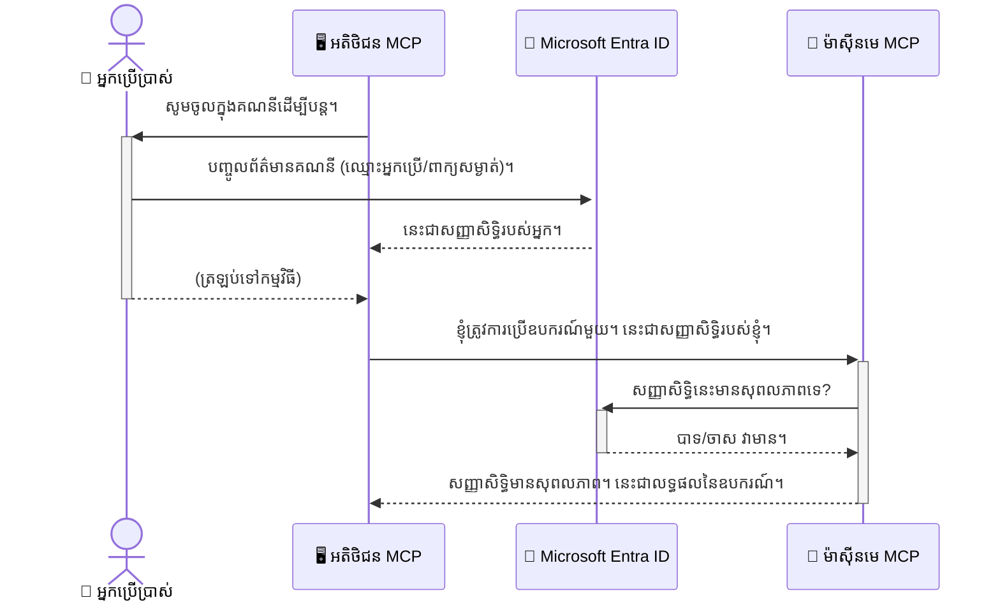

# ការរក្សាភាពសុវត្ថិភាពសម្រាប់ AI Workflows: ការផ្ទៀងផ្ទាត់អត្តសញ្ញាណ Entra ID សម្រាប់ម៉ូដែល Context Protocol Servers

> [!NOTE]
> កូដម៉ាស៊ីនបម្រើចម្ងាយនៅក្នុងមេរៀននេះការពារចំណុចចូល `/sse` និង `/message` របស់ពេលកន្លងមក
> ហើយផ្ទាល់ដល់ MCP `2025-11-25`។ រក្សាបែបបទអត្តសញ្ញាណ និងការផ្ទៀងផ្ទាត់សញ្ញាប័ត្ររបស់វា
> ប៉ុន្តែនៅពេលប្រើប្រាស់សំរាប់ការអនុវត្តថ្មីគួរប្រើប្រាស់ការដឹកជញ្ជូន Streamable HTTP ដែលផ្គូផ្គងនឹង `2026-07-28`។


## បើកភ្លើស
ការរក្សាសុវត្ថិភាពសម្រាប់ម៉ាស៊ីនបម្រើ Model Context Protocol (MCP) របស់អ្នកមានសារសំខាន់ដូចជាការចាក់សោទ្វារមុខផ្ទះរបស់អ្នក។ ការត្រាទ្វារម៉ាស៊ីនបម្រើ MCP របស់អ្នកចោលទៅអាចបន្ថែមឱ្យឧបករណ៍ និងទិន្នន័យរបស់អ្នកប៉ះពាល់ដោយអ្នកមិនមានសិទ្ធិ ដែលអាចនាំឲ្យមានការលួចប្លន់សុវត្ថិភាព។ Microsoft Entra ID ផ្តល់ជូននូវដំណោះស្រាយគ្រប់គ្រងអត្តសញ្ញាណ និងចូលប្រើផ្អែកលើពពកដែលមានភាពរឹងមាំ ជួយធានាថា មានតែអ្នកប្រើប្រាស់ និងកម្មវិធីដែលមានសិទ្ធិប៉ុណ្ណោះអាចធ្វើការទំនាក់ទំនងជាមួយម៉ាស៊ីនបម្រើ MCP របស់អ្នកបាន។ នៅក្នុងផ្នែកនេះ អ្នកនឹងរៀនពីរបៀបការពារការប្រតិបត្តិ AI របស់អ្នកដោយប្រើការផ្ទៀងផ្ទាត់អត្តសញ្ញាណ Entra ID។

## គោលបំណងរៀន
នៅចុងផ្នែកនេះ អ្នកនឹងអាច:

- ប្រាជ្ញាពីភាពសំខាន់នៃការការពារម៉ាស៊ីនបម្រើ MCP។
- អធិប្បាយពីមូលដ្ឋាននៃ Microsoft Entra ID និងការផ្ទៀងផ្ទាត់ OAuth 2.0។
- ស្គាល់ភាពខុសគ្នារវាងអតិថិជនសាធារណៈ និងអតិថិជនសម្ងាត់។
- អនុវត្តការផ្ទៀងផ្ទាត់ពី Entra ID ទាំងក្នុងស្ថានភាពមូលដ្ឋានក្នុងស្រុក (អតិថិជនសាធារណៈ) និងចម្ងាយ (អតិថិជនសម្ងាត់) សម្រាប់ម៉ាស៊ីនបម្រើ MCP។
- អនុវត្តបទបូកសុវត្ថិភាពល្អបំផុតពេលអភិវឌ្ឍន៍ប្រតិបត្តិការលើ AI។

## សុវត្ថិភាព និង MCP

ដូចជាអ្នកមិនគួរតែទុកទ្វារមុខផ្ទះក្រាប នៅពេលដែលរបស់អ្នកនៅផ្ទះទេ អ្នកគួរមិនទុកម៉ាស៊ីនបម្រើ MCP របស់អ្នកឲ្យគេសម្រួលចូលដោយមនុស្សគ្រប់គ្នាបានទេ។ ការរក្សាសុវត្ថិភាពសម្រាប់ប្រតិបត្តិការលើ AI របស់អ្នកគឺសំខាន់ក្នុងការបង្កើតកម្មវិធីដែលរឹងមាំ មានភាពជឿជាក់ និងមានសុវត្ថិភាព។ ជំពូកនេះនឹងណែនាំអ្នកអំពីការប្រើប្រាស់ Microsoft Entra ID ដើម្បីរក្សាសុវត្ថិភាពម៉ាស៊ីនបម្រើ MCP របស់អ្នក ដោយធានាថា មានតែអ្នកប្រើប្រាស់ និងកម្មវិធីដែលមានសិទ្ធិប៉ុណ្ណោះអាចធ្វើការទំនាក់ទំនងជាមួយឧបករណ៍ និងទិន្នន័យរបស់អ្នក។

## ហេតុអ្វីបានជា សុវត្ថិភាពមានសារៈសំខាន់ សម្រាប់ម៉ាស៊ីនបម្រើ MCP

សូមរៀបរាប់ថា ម៉ាស៊ីនបម្រើ MCP របស់អ្នកមានឧបករណ៍ដែលអាចបញ្ចូនអ៊ីម៉ែល ឬចូលប្រើមូលដ្ឋានទិន្នន័យអតិថិជន។ ម៉ាស៊ីនបម្រើមិនមានសុវត្ថិភាពនោះមានន័យថា មនុស្សណាមួយអាចប្រើប្រាស់ឧបករណ៍នោះមកដែលអាចបណ្តាលអោយមានការចូលប្រើទិន្នន័យដោយគ្មានសិទ្ធិ សម្រាប់ការផ្ញើសារបិទផ្សាយឬសកម្មភាពក្រីក្រផ្សេងទៀត។

ដោយអនុវត្តការផ្ទៀងផ្ទាត់ អ្នកធានាឱ្យបានប្រសើរថា ការស្នើសុំទាំងអស់ទៅម៉ាស៊ីនបម្រើរបស់អ្នកត្រូវបានផ្ទៀងផ្ទាត់ ភាពត្រឹមត្រូវរបស់អ្នកប្រើ ឬកម្មវិធីដែលធ្វើស្នើសុំពីយ៉ាងត្រឹមត្រូវ។ នេះគឺជជំហានដំបូង និងសំខាន់បំផុតសម្រាប់រក្សាសុវត្ថិភាពការប្រតិបត្តិ AI របស់អ្នក។

## ការណែនាំអំពី Microsoft Entra ID

[**Microsoft Entra ID**](https://adoption.microsoft.com/microsoft-security/entra/) គឺជាសេវាកម្មគ្រប់គ្រងអត្តសញ្ញាណ និងចូលប្រើផ្អែកលើពពក។ សូមគិតមើលវា​ដូចជាទាហានសន្តិសុខសកលសម្រាប់កម្មវិធីរបស់អ្នក។ វាក្នុងដំណើរស្រាយការផ្ទៀងផ្ទាត់អ្នកប្រើ (authentication) និងកំណត់អ្វីដែលពួកគេអាចអនុវត្តបាន (authorization)។

ដោយប្រើប្រាស់ Entra ID អ្នកអាច:

- អនុញ្ញាតឲ្យអ្នកប្រើចូលប្រើដោយសុវត្ថិភាព។
- ការពារជាភាសា API និងសេវាកម្ម។
- គ្រប់គ្រងគោលនយោបាយចូលប្រើពីកន្លែងមួយ។

សម្រាប់ម៉ាស៊ីនបម្រើ MCP, Entra ID ផ្ដល់ជូនដំណោះស្រាយមិនខកខាន និងគួរឱ្យទុកចិត្តនៅក្នុងការគ្រប់គ្រងមនុស្សដែលអាចចូលប្រើសមត្ថភាពម៉ាស៊ីនបម្រើរបស់អ្នក។

---

## ការយល់ដឹងអំពីម៉ាស៊ីនមន្ត: របៀបដំណើរការផ្ទៀងផ្ទាត់ Entra ID

Entra ID ប្រើស្តង់ដារសំខាន់ៗដូចជា **OAuth 2.0** ដើម្បី​ដោះស្រាយការផ្ទៀងផ្ទាត់។ ទោះបីรายละเอียดមានភាពស្មុគស្មាញ ប៉ុន្តែគំនិតសំខាន់គឺឆាប់យល់ និងអាចយល់បានដោយលើកគំនិតនិមួយ។

### ការណែនាំយក្ជសប្តិ OAuth 2.0: ចុចបើកដំណើរការមោទនភាព (Valet Key)

សូមគិតថា OAuth 2.0 ដូចជាសេវាកម្ម valet សម្រាប់ឡានរបស់អ្នក។ នៅពេលដែលអ្នកទៅភោជនីយដ្ឋាន អ្នកមិនផ្តល់កូនសោធំដៃឲ្យ valet ទេ។ ជំនួស អ្នកផ្តល់ **ចុចបើកដំណើរការមោទនភាព** ដែលមានសិទ្ធិដំណើរការពន្លឿនឡាន និងចាក់សោទ្វារទេ ប៉ុន្តែវាមិនអាចបើកធុងសំបកឡាន ឬប្រអប់កូនសោបានទេ។

ក្នុងការប្រៀបធៀបនេះ៖

- **អ្នក** គឺជា **អ្នកប្រើ**។
- **ឡានរបស់អ្នក** គឺជា **ម៉ាស៊ីនបម្រើ MCP** ដែលមានឧបករណ៍ និងទិន្នន័យមានតម្លៃ។
- **Valet** គឺជា **Microsoft Entra ID**។
- **អ្នករង់ចាំចតឡាន** គឺជា **អតិថិជន MCP** (កម្មវិធីដែលព្យាយាមចូលប្រើម៉ាស៊ីនបម្រើ)។
- **ចុចបើកដំណើរការមោទនភាព** គឺជារ **Access Token**។

Access token គឺជាច្រកលេខសម្ងាត់ដែលអតិថិជន MCP ទទួលបានពី Entra ID បន្ទាប់ពីអ្នកចូល។ អតិថិជននោះនឹងបង្ហាញ token ទៅម៉ាស៊ីនបម្រើ MCP ជាមួយនឹងសំណើរ។ ម៉ាស៊ីនបម្រើអាចផ្ទៀងផ្ទាត់ token ដើម្បីធានាថា សំណើរនេះត្រឹមត្រូវ ហើយថា អតិថិជនមានសិទ្ធិមកទេ ដោយគ្មានការប្រើប្រាស់ពាក្យសម្ងាត់របស់អ្នកនោះទេ។

### សំណើរ Authentication

នេះជារបៀបដំណើរការនៅក្នុងការអនុវត្តជាក់ស្តែង:



### នាំមុខប្រាក់បញ្ញើ Microsoft Authentication Library (MSAL)

មុនពេលចូលទៅកូដ វាគួរត្រូវណែនាំអំពីមួយធាតុសំខាន់ដែលអ្នកនឹងឃើញក្នុងឧទាហរណ៍គឺ **Microsoft Authentication Library (MSAL)**។

MSAL គឺជាបណ្ណាល័យដែល Microsoft បង្កើតឡើង ដើម្បីធ្វើអោយអ្នកអភិវឌ្ឍងាយស្រួលក្នុងការគ្រប់គ្រងការផ្ទៀងផ្ទាត់។ ជំនួសការសរសេរកូដស្មុគស្មាញនិងខ្សែកាដង់សុវត្ថិភាព MSAL នឹងដោះស្រាយវា។

ការប្រើប្រាស់បណ្ណាល័យដូចជា MSAL ត្រូវបានណែនាំយ៉ាងខ្លាំង ពីព្រោះ:

- **វាដំណើរការដោយសុវត្ថិភាព:** វាបានអនុវត្តន៍ប្រព័ន្ធសុវត្ថិភាពដែលត្រូវបានទទួលស្គាល់ និងការអនុវត្តបច្ចេកទេសល្អបំផុត ក្នុងឧស្សាហកម្ម។
- **វាលើកទម្រង់អភិវឌ្ឍន៍:** វារួមបញ្ចូលនូវភាពស្មុគស្មាញរបស់ OAuth 2.0 និង OpenID Connect បានយ៉ាងងាយស្រួល។
- **វាត្រូវបានថែទាំ:** Microsoft ថែទាំ និងធ្វើបច្ចុប្បន្នភាព MSAL ដើម្បីដោះស្រាយខ្លាំងញឹកញាប់ក្រុមហ៊ុនសុវត្ថិភាព និងការផ្លាស់ប្តូរប្លាតហ្វូម។

MSAL គាំទ្រភាសា និងស៊ុមកម្មវិធីជាច្រើន ដូចជា .NET, JavaScript/TypeScript, Python, Java, Go និងវេទិកាម៉ូប៊ីលដូចជា iOS និង Android។ នេះមានន័យថាអ្នកអាចប្រើបែបបទផ្ទៀងផ្ទាត់ដូចគ្នាទាំងសងខាងបច្ចេកវិទ្យា។

ដើម្បីស្វែងយល់បន្ថែមអំពី MSAL អ្នកអាចមើលឯកសារពិពណ៌នាផ្លូវការចំពោះ [MSAL overview documentation](https://learn.microsoft.com/entra/identity-platform/msal-overview)។

---

## រក្សាសុវត្ថិភាពម៉ាស៊ីនបម្រើ MCP របស់អ្នកជាមួយ Entra ID: មគ្គុទេសក៏ជំហាន-ដោយ-ជំហាន

ឥឡូវនេះ យើងនឹងដើរឆ្ពោះទៅរកវិធីរក្សាសុវត្ថិភាពម៉ាស៊ីនបម្រើ MCP ក្នុងស្រុក (ដែលទំនាក់ទំនងតាម `stdio`) ដោយប្រើ Entra ID។ ឧទាហរណ៍នេះប្រើ **អតិថិជនសាធារណៈ** ដែលសាកសមសម្រាប់កម្មវិធីរត់លើកុំព្យូទ័ររបស់អ្នកប្រើ ដូចជា កម្មវិធីតុ ឬម៉ាស៊ីនបម្រើអភិវឌ្ឍន៍ក្នុងស្រុក។

### ស្ថានភាពទី 1: រក្សាសុវត្ថិភាពម៉ាស៊ីនបម្រើ MCP ក្នុងស្រុក (ជាមួយអតិថិជនសាធារណៈ)

ក្នុងស្ថានភាពនេះ យើងនឹងមើលឃើញម៉ាស៊ីនបម្រើ MCP ដែលរត់ក្នុងស្រុក ទំនាក់ទំនងតាម `stdio` ហើយប្រើ Entra ID ក្នុងការផ្ទៀងផ្ទាត់អ្នកប្រើ មុនអនុញ្ញាតឲ្យប្រើឧបករណ៍។ ម៉ាស៊ីនបម្រើនឹងមានឧបករណ៍មួយដែលទាញយកព័ត៌មានគណនីអ្នកប្រើពី Microsoft Graph API។

#### 1. ការកំណត់កម្មវិធីនៅក្នុង Entra ID

មុននឹងសរសេរកូដ អ្នកត្រូវចុះបញ្ជីកម្មវិធីរបស់អ្នកនៅ Microsoft Entra ID។ វានឹងប្រាប់ Entra ID អំពីកម្មវិធីរបស់អ្នក ហើយផ្ដល់សិទ្ធិឲ្យវាប្រើសេវាកម្មផ្ទៀងផ្ទាត់។

1. ទៅកាន់ **[Microsoft Entra portal](https://entra.microsoft.com/)**។
2. ទៅកាន់ **App registrations** ហើយចុច **New registration**។
3. ផ្តល់ឈ្មោះកម្មវិធីរបស់អ្នក (ឧទាហរណ៍ "My Local MCP Server")។
4. សំរាប់ **Supported account types** ជ្រើស **Accounts in this organizational directory only**។
5. អ្នកអាចទុកសំណុំបែបបទ **Redirect URI** ទទេសម្រាប់ឧទាហរណ៍នេះ។
6. ចុច **Register**។

ពេលបានចុះបញ្ជីរួច សូមចងចាំលេខ **Application (client) ID** និង **Directory (tenant) ID**។ អ្នកនឹងត្រូវបញ្ចូលវានៅក្នុងកូដរបស់អ្នក។

#### 2. កូដ: ការពន្យល់

យើងមើលផ្នែកសំខាន់ៗនៃកូដដែលគ្រប់គ្រងការផ្ទៀងផ្ទាត់។ កូដពេញលេញសម្រាប់ឧទាហរណ៍នេះមាននៅក្នុងថត [Entra ID - Local - WAM](https://github.com/Azure-Samples/mcp-auth-servers/tree/main/src/entra-id-local-wam) នៃ [mcp-auth-servers GitHub repository](https://github.com/Azure-Samples/mcp-auth-servers)។

**`AuthenticationService.cs`**

ថ្នាក់នេះទទួលខុសត្រូវក្នុងការគ្រប់គ្រងការទំនាក់ទំនងជាមួយ Entra ID។

- **`CreateAsync`**: វិធីសាស្រ្តនេះផ្តើម `PublicClientApplication` ពី MSAL (Microsoft Authentication Library)។ វាត្រូវបានកំណត់ជាមួយ `clientId` និង `tenantId` របស់កម្មវិធីអ្នក។
- **`WithBroker`**: វាការពារការប្រើប្រាស់ broker (ដូចជា Windows Web Account Manager) ដែលផ្ដល់បទពិសោធន៍ single sign-on ដែលសុវត្ថិភាព និងរលូន។
- **`AcquireTokenAsync`**: វិធីសាស្រ្តសំខាន់នេះ។ វាសាកល្បងទទួលបាន token ដោយស្ងៀម (ថេរ) ជាមុនសិន (នៅពេលអ្នកមានសម័យត្រឹមត្រូវ)។ ប្រសិនបើមិនអាចទទួលបានទេ វានឹងទាក់ទងអ្នកប្រើក្នុងរបៀបអន្តរកម្ម។

```csharp
// Simplified for clarity
public static async Task<AuthenticationService> CreateAsync(ILogger<AuthenticationService> logger)
{
    var msalClient = PublicClientApplicationBuilder
        .Create(_clientId) // Your Application (client) ID
        .WithAuthority(AadAuthorityAudience.AzureAdMyOrg)
        .WithTenantId(_tenantId) // Your Directory (tenant) ID
        .WithBroker(new BrokerOptions(BrokerOptions.OperatingSystems.Windows))
        .Build();

    // ... cache registration ...

    return new AuthenticationService(logger, msalClient);
}

public async Task<string> AcquireTokenAsync()
{
    try
    {
        // Try silent authentication first
        var accounts = await _msalClient.GetAccountsAsync();
        var account = accounts.FirstOrDefault();

        AuthenticationResult? result = null;

        if (account != null)
        {
            result = await _msalClient.AcquireTokenSilent(_scopes, account).ExecuteAsync();
        }
        else
        {
            // If no account, or silent fails, go interactive
            result = await _msalClient.AcquireTokenInteractive(_scopes).ExecuteAsync();
        }

        return result.AccessToken;
    }
    catch (Exception ex)
    {
        _logger.LogError(ex, "An error occurred while acquiring the token.");
        throw; // Optionally rethrow the exception for higher-level handling
    }
}
```

**`Program.cs`**

នេះជាចំណុចដាក់ម៉ាស៊ីនមើម MCP និងបញ្ចូលសេវាកម្ម authentication។

- **`AddSingleton<AuthenticationService>`**: ចុះបញ្ជី `AuthenticationService` នៅក្នុង dependency injection container ដើម្បីអាចប្រើប្រាស់ដោយផ្នែកផ្សេងទៀតនៃកម្មវិធី (ដូចជាឧបករណ៍របស់យើង)។
- **ឧបករណ៍ `GetUserDetailsFromGraph`**: ឧបករណ៍នេះត្រូវការជាគំរូ `AuthenticationService`។ មុនធ្វើការណាមួយ វាចាត់ចេញស្នើសុំ `authService.AcquireTokenAsync()` ដើម្បីទទួល token ចូលប្រើដែលមានសុពលភាព។ ប្រសិនបើផ្ទៀងផ្ទាត់បានជោគជ័យ វាប្រើបញ្ចូល token ទៅ Microsoft Graph API ដើម្បីទាញយកព័ត៌មានអ្នកប្រើ។

```csharp
// Simplified for clarity
[McpServerTool(Name = "GetUserDetailsFromGraph")]
public static async Task<string> GetUserDetailsFromGraph(
    AuthenticationService authService)
{
    try
    {
        // This will trigger the authentication flow
        var accessToken = await authService.AcquireTokenAsync();

        // Use the token to create a GraphServiceClient
        var graphClient = new GraphServiceClient(
            new BaseBearerTokenAuthenticationProvider(new TokenProvider(authService)));

        var user = await graphClient.Me.GetAsync();

        return System.Text.Json.JsonSerializer.Serialize(user);
    }
    catch (Exception ex)
    {
        return $"Error: {ex.Message}";
    }
}
```

#### 3. ប្រតិបត្តិការរួមគ្នា

1. ពេលដែលអតិថិជន MCP ព្យាយាមប្រើឧបករណ៍ `GetUserDetailsFromGraph` ឧបករណ៍នេះយោងទៅកាន់ `AcquireTokenAsync` ជាដំបូង។
2. `AcquireTokenAsync` ជំរុញ MSAL មើលថាតើមាន token ត្រឹមត្រូវក្នុងប្រព័ន្ធទេ។
3. ប្រសិនបើមិនមាន token MSAL តាម broker នឹងទាក់ទងអ្នកប្រើក្នុងការចូលជាមួយគណនី Entra ID របស់ពួកគេ។
4. បន្ទាប់ពីអ្នកប្រើចូលបាន Entra ID ផ្តល់ token ចូល។
5. ឧបករណ៍ទទួលបាន token និងប្រើវាក្នុងការហៅ Microsoft Graph API ជាមួយសុវត្ថិភាព។
6. ព័ត៌មានអ្នកប្រើត្រូវបានបញ្ជូនត្រឡប់ទៅអតិថិជន MCP។

ដំណើរការនេះធានាថា មានតែអ្នកដែលបានផ្ទៀងផ្ទាត់នាឡិកាអាចប្រើឧបករណ៍នេះបាន ដូច្នេះរក្សាសុវត្ថិភាពម៉ាស៊ីនបម្រើ MCP ក្នុងស្រុករបស់អ្នកដោយប្រសើរ។

### ស្ថានភាពទី 2: រក្សាសុវត្ថិភាពម៉ាស៊ីនបម្រើ MCP ចម្ងាយ (ជាមួយអតិថិជនសម្ងាត់)

នៅពេលម៉ាស៊ីនបម្រើ MCP របស់អ្នករត់នៅលើម៉ាស៊ីនចម្ងាយ (ដូចជា ម៉ាស៊ីនបម្រើពពក) ហើយទំនាក់ទំនងតាមប្រព័ន្ធដឹកជញ្ជូនដូចជា HTTP Streaming តម្រូវការសុវត្ថិភាពនឹងផ្សេងគ្នា។ ក្នុងករណីនេះ អ្នកគួរប្រើប្រាស់ **អតិថិជនសម្ងាត់** និង **Authorization Code Flow**។ វាគឺជា​របៀបសុវត្ថិភាពជាង ដោយសារ​កម្រិតសម្ងាត់នៃកម្មវិធីមិនត្រូវបានបញ្ចេញទៅកាន់កម្មវិធីរុករក។

ឧទាហរណ៍នេះប្រើម៉ាស៊ីនបម្រើ MCP ជាភាសា TypeScript ដែលប្រើ Express.js ដើម្បីគ្រប់គ្រងសំណើ HTTP។

#### 1. ការកំណត់កម្មវិធីនៅក្នុង Entra ID

ការកំណត់ក្នុង Entra ID ដូចគ្នានឹងអតិថិជនសាធារណៈ ប៉ុន្តែមានភាពខុសគ្នាមួយគឺ អ្នកត្រូវបង្កើត **client secret**។

1. ទៅកាន់ **[Microsoft Entra portal](https://entra.microsoft.com/)**។
2. ក្នុងការចុះបញ្ជីកម្មវិធីរបស់អ្នក ទៅកាន់ផ្ទាំង **Certificates & secrets**។
3. ចុច **New client secret** ផ្តល់ពណ៌នារបស់វា ហើយចុច **Add**។
4. **សំខាន់:** ចម្លងតម្លៃសម្ងាត់ភ្លាមៗ។ អ្នកនឹងមិនអាចមើលវារវាងក្រោយទេ។
5. អ្នកត្រូវកំណត់ **Redirect URI** ផងដែរ។ ទៅកាន់ផ្ទាំង **Authentication** ចុច **Add a platform**, ជ្រើស **Web**, ហើយបញ្ចូល redirect URI របស់កម្មវិធីអ្នក (ឧ. `http://localhost:3001/auth/callback`)។

> **⚠️ សំខាន់សំរាប់សុវត្ថិភាព:** សម្រាប់កម្មវិធីផលិតកម្ម Microsoft ផ្តល់អនុសាសន៍យ៉ាងខ្លាំងក្នុងការប្រើ **ការផ្ទៀងផ្ទាត់គ្មានសម្ងាត់** ដូចជា **Managed Identity** ឬ **Workload Identity Federation** ជំនួស client secrets។ client secrets មានហានិភ័យសុវត្ថិភាពដោយសារតែអាចត្រូវបានបង្ហាញ ឬបាត់បង់។ Managed identities ផ្តល់វិធីសុវត្ថិភាពជាង ដោយមិនចាំបាច់ផ្ទុកអត្តសញ្ញាណចូលក្នុងកូដ ឬកំណត់រចនាសម្ព័ន្ធ។
>
> សម្រាប់ព័ត៌មានបន្ថែមអំពី managed identities និងរបៀបអនុវត្ត សូមមើល [Managed identities for Azure resources overview](https://learn.microsoft.com/entra/identity/managed-identities-azure-resources/overview)។

#### 2. កូដ: ការពន្យល់

ឧទាហរណ៍នេះប្រើមុខងារសម័យ (session)។ ពេលដែលអ្នកប្រើធ្វើការផ្ទៀងផ្ទាត់ ម៉ាស៊ីនបម្រើរក្សាទុក access token និង refresh token ក្នុងសម័យ ហើយផ្តល់សញ្ញាកម្មវិធីសម័យដល់អ្នកប្រើ។ សញ្ញាកម្មវិធីសម័យនេះត្រូវបានប្រើសម្រាប់សំណើក្រោយ។ កូដពេញលេញសម្រាប់ឧទាហរណ៍នេះមាននៅក្នុងថត [Entra ID - Confidential client](https://github.com/Azure-Samples/mcp-auth-servers/tree/main/src/entra-id-cca-session) នៃ [mcp-auth-servers GitHub repository](https://github.com/Azure-Samples/mcp-auth-servers)។

**`Server.ts`**

ឯកសារនេះបង្កើតម៉ាស៊ីនបម្រើ Express និងស្រទាប់ដឹកជញ្ជូន MCP។

- **`requireBearerAuth`**: វា​ជា middleware ដែលការពារចំណុចចូល `/sse` និង `/message`។ វាពិនិត្យសញ្ញាប័ត្រពិតបញ្ញើនៅក្នុងក្បាលសំណើ `Authorization`។
- **`EntraIdServerAuthProvider`**: ថ្នាក់ផ្ទាល់ខ្លួនដែលអនុវត្តន៍មុខងារ `McpServerAuthorizationProvider`។ វាទទួលខុសត្រូវក្នុងការគ្រប់គ្រងប្រព័ន្ធ OAuth 2.0។
- **`/auth/callback`**: ចំណុចចូលដែលដោះស្រាយការបញ្ជូនពី Entra ID បន្ទាប់ពីអ្នកប្រើធ្វើការ authentication។ វាប្ដូរកូដការអនុញ្ញាតជាគន្លង token និង refresh token។

```typescript
// បានសម្រួលសម្រាប់ភាពច្បាស់លាស់
const app = express();
const { server } = createServer();
const provider = new EntraIdServerAuthProvider();

// ការពារចំណុចបញ្ចាំង SSE
app.get("/sse", requireBearerAuth({
  provider,
  requiredScopes: ["User.Read"]
}), async (req, res) => {
  // ... តភ្ជាប់ទៅកាន់ការដឹកជញ្ជូន ...
});

// ការពារចំណុចបញ្ចាំងសារ
app.post("/message", requireBearerAuth({
  provider,
  requiredScopes: ["User.Read"]
}), async (req, res) => {
  // ... ធ្វើការគ្រប់គ្រងសារ ...
});

// ធ្វើការគ្រប់គ្រងការហៅត្រឡប់ OAuth 2.0
app.get("/auth/callback", (req, res) => {
  provider.handleCallback(req.query.code, req.query.state)
    .then(result => {
      // ... គ្រប់គ្រងភាពជោគជ័យ ឬ ឯកចិត្ត ...
    });
});
```

**`Tools.ts`**

ម្ជុលឯកសារនេះមានឧបករណ៍ដែលម៉ាស៊ីនបម្រើ MCP ផ្ដល់។ ឧបករណ៍ `getUserDetails` មានស្រដៀងនឹងឧទាហរណ៍មុន ប៉ុន្តែវាទទួលបាន access token ពីសម័យ។

```typescript
// មានការងាយស្រួលសម្រាប់ភាពច្បាស់លាស់
server.setRequestHandler(CallToolRequestSchema, async (request) => {
  const { name } = request.params;
  const context = request.params?.context as { token?: string } | undefined;
  const sessionToken = context?.token;

  if (name === ToolName.GET_USER_DETAILS) {
    if (!sessionToken) {
      throw new AuthenticationError("Authentication token is missing or invalid. Ensure the token is provided in the request context.");
    }

    // ដកយកស្លាកសញ្ញា Entra ID ពីហាងសម័យ
    const tokenData = tokenStore.getToken(sessionToken);
    const entraIdToken = tokenData.accessToken;

    const graphClient = Client.init({
      authProvider: (done) => {
        done(null, entraIdToken);
      }
    });

    const user = await graphClient.api('/me').get();

    // ... ដោះស្រាយព័ត៌មានអ្នកប្រើ ...
  }
});
```

**`auth/EntraIdServerAuthProvider.ts`**

ថ្នាក់នេះគ្រប់គ្រងលក្ខណៈដូចជា៖

- បញ្ជូនអ្នកប្រើទៅទំព័រចូល Entra ID។
- ប្ដូរកូដអនុញ្ញាតជាទិន្នន័យសញ្ញាប័ត្រ។
- រក្សាទុកសញ្ញាប័ត្រនៅក្នុង `tokenStore`។
- បច្ចុប្បន្នភាព access token ពេលវាបញ្ចប់សុពលភាព។


#### 3. វិធីដែលវាដំណើរការទាំងអស់រួមគ្នា

1. នៅពេលដែលអ្នកប្រើប្រាស់ព្យាយามភ្ជាប់ទៅម៉ាស៊ីនមេ MCP ជាលើកដំបូង middleware `requireBearerAuth` នឹងមើលឃើញថាពួកគេគ្មានសេចក្ដីបញ្ជាក់សម្រង់ត្រឹមត្រូវ ហើយនឹងបង្វិលពួកគេចូលទៅកាន់ទំព័រស인을ចូល Entra ID។
2. អ្នកប្រើប្រាស់ចូលបញ្ចូលគណនី Entra ID របស់ពួកគេ។
3. Entra ID បង្វិលអ្នកប្រើប្រាស់ត្រឡប់ទៅចំណុច `/auth/callback` ជាមួយកូដអនុញ្ញាត។
4. ម៉ាស៊ីនមេទំនាក់ទំនងកូដសម្រាប់ទទួលបាន access token និង refresh token រួចផ្ទុកវាបង្កើតជា session token ដែលត្រូវបញ្ជូនទៅឪ្យ client។
5. ឥឡូវនេះ client អាចប្រើសញ្ញាបត្រ session token នេះក្នុងស៊េតឈើ `Authorization` សម្រាប់សំណើរ MCP សម្រាប់ពេលក្រោយទាំងអស់។
6. នៅពេលសំភារៈ `getUserDetails` ត្រូវបានហៅ វាប្រើ session token ដើម្បីស្វែងរក access token នៃ Entra ID ហើយបន្ទាប់មកប្រើវាហៅ Microsoft Graph API។

លំហូរនេះស្មុគស្មាញជាងលំហូរអតិថិជនសាធារណៈ ប៉ុន្តែត្រូវការសម្រាប់ចំណុចចូលដែលប្រើនៅលើអ៊ីនធឺណិត។ ដោយសារតែម៉ាស៊ីនមេ MCP ឆ្ងាយអាចចូលដំណើរការតាមរយៈអ៊ីនធឺណិតសាធារណៈ ពួកគេចាំបាច់ត្រូវការ វិធានការពារអន្តរជាតិរឹងមាំ ឆ្ពោះទៅការការពារការចូលប្រើប្រាស់ដោយអត្រាបានហើយករណីសោះ។


## លក្ខណៈសុវត្ថិភាពល្អបំផុត

- **ជានិច្ចប្រើ HTTPS**: បង្កើតការប្រាស្រ័យទាក់ទងដែលបានស្លាករួចរវាង client និងម៉ាស៊ីនមេដើម្បីការពារសញ្ញាបត្រពីការចាប់បានដោយមិនចង់បាន។
- **អនុវត្តការគ្រប់គ្រងការចូលប្រើដោយផ្អែកលើតួនាទី (RBAC)**: កុំត្រឹមតែពិនិត្យមើលចំពោះ *ប្រសិនបើ* អ្នកប្រើបានបញ្ជាក់សម្ងាត់រួចហើយ តែត្រូវពិនិត្យ *អ្វីដែល* ពួកគេសង្ឃឹមធ្វើបាន។ អ្នកអាចកំណត់តួនាទីក្នុង Entra ID ហើយពិនិត្យវានៅម៉ាស៊ីនមេ MCP របស់អ្នក។
- **ត្រួតពិនិត្យ និងរាយការណ៍**: កត់ត្រាព្រឹត្តិការណ៍បញ្ជាក់សម្ងាត់ទាំងអស់ដើម្បីអាចមានការចាប់សញ្ញាសកម្មភាពសង្ស័យ។
- **ត្រួតពិនិត្យការរឹតបន្ថយ និងការបង្ហញ្ញើបអត្រា**: Microsoft Graph និង API ផ្សេងទៀតអនុវត្តការរឹតបន្ថយអត្រាដើម្បីកាត់បន្ថយការការប្រើប្រាស់អាក្រក់។ អនុវត្តការថយចុះអតិផរណា និងលក្ខណៈឡើងវិញនៅម៉ាស៊ីនមេ MCP របស់អ្នកដើម្បីដោះស្រាយដោយសម្រួលចំពោះការឆ្លើយតប HTTP 429 (Too Many Requests)។ សូមគិតពិចារណាការផ្ទុកទិន្នន័យដែលចូលប្រើប្រាស់ជាញឹកញាប់ដើម្បីកាត់បន្ថយការហៅ API។
- **ជាសុវត្ថិភាពក្នុងការផ្ទុកតូខេន**: ផ្ទុក access token និង refresh token ដោយសុវត្ថិភាព។ សម្រាប់កម្មវិធីមូលដ្ឋាន ប្រើវិធីសាស្រ្តផ្ទុកដែលបានការពារ។ សម្រាប់កម្មវិធីម៉ាស៊ីនមេ សូមពិចារណាការប្រើផ្ទុកចងក្រងបានកូដសំងាត់ ឬ សេវាកម្មគ្រប់គ្រងកូនសោសុវត្ថិភាព ដូចជា Azure Key Vault។
- **ដោះស្រាយការបញ្ចប់សុពលភាពតូខេន**: Access token មានអាយុកាលកំណត់។ អនុវត្តការថយចុះបង្ហាញស្វ័យប្រវត្តិសម្រាប់ទទួលបាន token ថ្មីដោយប្រើ refresh token ដើម្បីថែមទាំងមានប្រសិទ្ធភាពប្រើប្រាស់ល្អបន្តដោយមិនចាំបាច់ចូលបញ្ចូលឡើងវិញ។
- **គិតពិចារណាការប្រើ Azure API Management**: ខណៈពេលដែលការអនុវត្តសុវត្ថិភាពដោយផ្ទាល់នៅម៉ាស៊ីនមេ MCP អ្នកផ្តល់ការត្រួតពិនិត្យលំអិត ការរួមបញ្ចូល API Gateway ដូចជា Azure API Management អាចដោះស្រាយករណីសុវត្ថិភាពជាច្រើនដោយស្វ័យប្រវត្តិ រួមទាំងការបញ្ជាក់សម្ងាត់ ការអនុញ្ញាត ការរឹតបន្ថយអត្រា និងការត្រួតពិនិត្យ។ ពួកវាបណ្តាលជាស្រទាប់សុវត្ថិភាពមួយដែលស្ថិតនៅចន្លោះបណ្ដាញអតិថិជន និងម៉ាស៊ីនមេ MCP របស់អ្នក។ សម្រាប់ព័ត៌មានលម្អិតអំពីការប្រើ API Gateway ជាមួយ MCP សូមមើល [Azure API Management Your Auth Gateway For MCP Servers](https://techcommunity.microsoft.com/blog/integrationsonazureblog/azure-api-management-your-auth-gateway-for-mcp-servers/4402690)។


## ចំណុចសំខាន់ៗ

- ការពារម៉ាស៊ីនមេ MCP របស់អ្នកគឺសំខាន់សម្រាប់ការការពារទិន្នន័យ និងឧបករណ៍របស់អ្នក។
- Microsoft Entra ID ផ្តល់ជាបច្ចេកវិទ្យាដែលមានភាពរឹងមាំ និងអាចពង្រីកសម្រាប់ការបញ្ជាក់សម្ងាត់ និងការអនុញ្ញាត។
- ប្រើ **អតិថិជនសាធារណៈ** សម្រាប់កម្មវិធីមូលដ្ឋាន និង **អតិថិជនសម្ងាត់** សម្រាប់ម៉ាស៊ីនមេឆ្ងាយ។
- **Authorization Code Flow** គឺជាជម្រើសសុវត្ថិភាពបំផុតសម្រាប់កម្មវិធីវែប។


## ហ្វឹកហាត់

1. សូមគិតពីម៉ាស៊ីនមេ MCP មួយដែលអ្នកចង់បង្កើត។ តើវាជាម៉ាស៊ីនមេមូលដ្ឋានឬម៉ាស៊ីនមេឆ្ងាយ?
2. អាស្រ័យលើចម្លើយរបស់អ្នក តើអ្នកនឹងប្រើអតិថិជនសាធារណៈឬអតិថិជនសម្ងាត់?
3. តើអាជ្ញាបណ្ណណាដែលម៉ាស៊ីនមេ MCP របស់អ្នកនឹងស្នើសុំសម្រាប់អនុវត្តសកម្មភាពប្រឆាំង Microsoft Graph?


## ហ្វឹកហាត់ដៃជាមួយ

### ហ្វឹកហាត់ 1៖ ចុះឈ្មោះកម្មវិធីនៅក្នុង Entra ID
ចូលទៅកាន់ទ្វារចូល Microsoft Entra ផ្លូវការ។
ចុះឈ្មោះកម្មវិធីថ្មីសម្រាប់ម៉ាស៊ីនមេ MCP របស់អ្នក។
កត់ត្រា Application (client) ID និង Directory (tenant) ID។

### ហ្វឹកហាត់ 2៖ ការពារម៉ាស៊ីនមេ MCP មូលដ្ឋាន (អតិថិជនសាធារណៈ)
- អនុវត្តឧទាហរណ៍កូដដើម្បីបញ្ចូល MSAL (បណ្ណាល័យបញ្ជាក់សម្ងាត់ Microsoft) សម្រាប់ការបញ្ជាក់សម្ងាត់អ្នកប្រើ។
- សាកល្បងលំហូរបញ្ជាក់សម្ងាត់ដោយហៅឧបករណ៍ MCP ដែលយកព័ត៌មានអ្នកប្រើពី Microsoft Graph។

### ហ្វឹកហាត់ 3៖ ការពារម៉ាស៊ីនមេ MCP ឆ្ងាយ (អតិថិជនសម្ងាត់)
- ចុះឈ្មោះអតិថិជនសម្ងាត់នៅក្នុង Entra ID និងបង្កើតកូដសម្ងាត់អតិថិជន។
- កំណត់ Express.js MCP server របស់អ្នកឱ្យប្រើ Authorization Code Flow។
- សាកល្បងចំណុចចូលដែលបានការពារនិងបញ្ជាក់ការចូលប្រើដោយផ្អែកលើ token។

### ហ្វឹកហាត់ 4៖ អនុវត្តលក្ខណៈសុវត្ថិភាពល្អបំផុត
- បើក HTTPS សម្រាប់ម៉ាស៊ីនមេមូលដ្ឋានឬឆ្ងាយរបស់អ្នក។
- អនុវត្តរបៀបគ្រប់គ្រងការចូលប្រើដោយផ្អែកលើតួនាទី (RBAC) ក្នុងលក្ខណៈបទបញ្ជារ។
- បន្ថែមច្បាប់គ្រប់គ្រងការបញ្ចប់សុពលភាពតូខេន និងការផ្ទុកតូខេនដោយសុវត្ថិភាព។

## អត្ថប្រយោជន៍

1. **ឯកសារ OVERVIEW MSAL**  
   យល់ពីរបៀបដែលបណ្ណាល័យបញ្ជាក់សម្ងាត់ Microsoft (MSAL) អនុញ្ញាតឱ្យទទួលបានតូខេនសុវត្ថិភាពរំលងវេទិកា៖  
   [MSAL Overview on Microsoft Learn](https://learn.microsoft.com/en-gb/entra/msal/overview)

2. **អង្គការជាឧទាហរណ៍ Azure-Samples/mcp-auth-servers ក្នុង GitHub**  
   ឧទាហរណ៍អនុវត្ត MCP កំពុងបង្ហាញលំហូរបញ្ជាក់សម្ងាត់៖  
   [Azure-Samples/mcp-auth-servers on GitHub](https://github.com/Azure-Samples/mcp-auth-servers)

3. **មើលសង្ខេបអត្តសញ្ញាណគ្រប់គ្រងសម្រាប់ធនធាន Azure**  
   យល់ដឹងពីរបៀបបញ្ចប់សម្ងាត់ដោយប្រើអត្តសញ្ញាណគ្រប់គ្រងដែលចាត់តាំងដោយប្រព័ន្ធ ឬអ្នកប្រើ៖  
   [Managed Identities Overview on Microsoft Learn](https://learn.microsoft.com/en-us/entra/identity/managed-identities-azure-resources/)

4. **Azure API Management: ប្រព័ន្ធការពារឯកសារតំណក់សម្រាប់ម៉ាស៊ីនមេ MCP**  
   ព្រឹត្តិប័ត្រលម្អិតអំពីការប្រើ APIM ជាទ្វារត្រួតពិនិត្យ OAuth2 សុវត្ថិភាពសម្រាប់ម៉ាស៊ីនមេ MCP៖  
   [Azure API Management Your Auth Gateway For MCP Servers](https://techcommunity.microsoft.com/blog/integrationsonazureblog/azure-api-management-your-auth-gateway-for-mcp-servers/4402690)

5. **រាយការណ៍អាជ្ញាបណ្ណ Microsoft Graph**  
   បញ្ជីពេញលេញនៃអាជ្ញាបណ្ណដែលបានផ្ដល់អំណាច និងអាជ្ញាបណ្ណកម្មវិធីសម្រាប់ Microsoft Graph៖  
   [Microsoft Graph Permissions Reference](https://learn.microsoft.com/zh-tw/graph/permissions-reference)


## លទ្ធផលការសិក្សា
បន្ទាប់ពីបញ្ចប់ផ្នែកនេះ អ្នកនឹងអាចធ្វើការបាន:

- ពន្យល់មូលហេតុដែលការបញ្ជាក់សម្ងាត់មានសារៈសំខាន់សម្រាប់ម៉ាស៊ីនមេ MCP និងប្រតិបត្តិការជាមួយ AI។
- កំណត់និងកំណត់រចនាសម្ព័ន្ធការបញ្ជាក់សម្ងាត់ Entra ID សម្រាប់ស្ថានភាពម៉ាស៊ីនមេ MCP មូលដ្ឋាន និងឆ្ងាយ។
- ជ្រើសរើសប្រភេទអតិថិជនសម្រួល (សាធារណៈ ឬសម្ងាត់) អាស្រ័យលើការបង្ហោះម៉ាស៊ីនមេរបស់អ្នក។
- អនុវត្តវិធីសាស្រ្តរក្សាសុវត្ថិភាពក្នុងការសរសេរកូដ រួមទាំងផ្ទុកតូខេន និងការអនុញ្ញាតដោយផ្អែកលើតួនាទី។
- បន្តិចទៀតការការពារម៉ាស៊ីនមេ MCP និងឧបករណ៍របស់វាពីការចូលប្រើដោយមិនមានការអនុញ្ញាត។

## តើអ្វីទៅបន្ទាប់

- [5.13 សមាសភាគប្រតិបត្តិការបរិបទម៉ូដែល (MCP) ជាមួយ Microsoft Foundry](../mcp-foundry-agent-integration/README.md)

---

<!-- CO-OP TRANSLATOR DISCLAIMER START -->
**ការបដិសេធ**:
ឯកសារនេះត្រូវបានបម្លែងភាសា ដោយប្រើសេវាបម្លែងភាសា AI [Co-op Translator](https://github.com/Azure/co-op-translator)។ ទោះយើងខ្ញុំមានក្តីប្រាថ្នាឱ្យបានច្បាស់លាស់ តែសូមយល់ដឹងថាការបម្លែងដោយស្វ័យប្រវត្តិក៏អាចមានកំហុសឬភាពមិនត្រឹមត្រូវ។ ឯកសារដើមជាភាសាទីតាំងគួរត្រូវបានគេប្រើជាប្រភពច្បាស់លាស់។ សម្រាប់ព័ត៌មានសំខាន់ៗ សូមណែនាំឱ្យប្រើប្រាស់ការប្រែដោយមនុស្សជំនាញ។ យើងខ្ញុំមិនទទួលខុសត្រូវចំពោះការយល់ច្រឡំ ឬការបកស្រាយខុសបន្ទាប់ពីការប្រើប្រាស់ការបម្លែងនេះនោះទេ។
<!-- CO-OP TRANSLATOR DISCLAIMER END -->