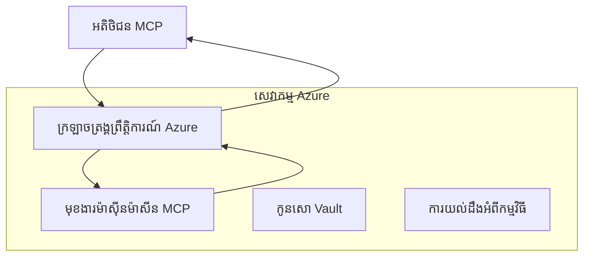
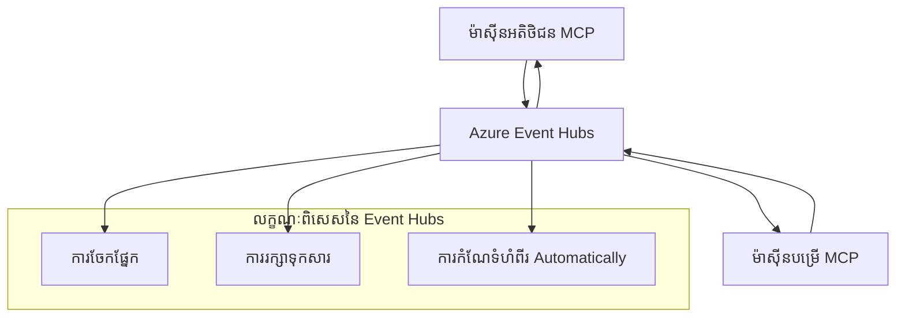

# MCP Custom Transports - មគ្គុទេសក៍អនុវត្តលំដាប់ខ្ពស់

របៀប Model Context Protocol (MCP) អនុញ្ញាតឱ្យមានការអនុវត្តន៍ចរន្តផ្ទាល់ខ្លួនសម្រាប់
បរិយាកាសឯកទេស។ មគ្គុទេសក៍លំដាប់ខ្ពស់នេះសិក្សាពី Azure Event Grid និង
Azure Event Hubs ជាគំរូសំណង់ស្ថាបត្យកម្ម។ ពួកវាមិនមែនជាចរន្ត MCP ស្តង់ដារ
ហើយត្រូវការឲ្យទាំងពីរជម្រើសទាំងពីរយល់ព្រមលើការគំរូផ្ទាល់ខ្លួន។

> **វិសាលភាព MCP `2026-07-28`:** បច្ចុប្បន្ននេះគ្មានសម័យកាលប៉ាប់ប៉ងលើប្រព័ន្ធពិធីការណ៍ទេ,
> ដូច្នេះចរន្តផ្ទាល់ខ្លួនមិនត្រូវឱ្យពឹងផ្អែកលើភាពតម្រូវសម័យកាល ឬ
> ការរៀបចំតាមលំដាប់ក្នុងមួយសម័យកាល។ ក្បាល `Mcp-Method` និង `Mcp-Name` ដែលមានលក្ខណៈលក្ខខណ្ឌគឺ
> ជាការទាមទាររបស់ចរន្ត Streamable HTTP ស្តង់ដារ; ចរន្តមិនមែន HTTP
> ត្រូវការតំណាងសមមូល មូលនិធិដែលបានយល់ព្រមច្បាស់លាស់ ប្រសិនបើកណ្តាលកណ្តាលត្រូវតែផ្ញើ
> ដោយគ្មានការដោះស្រាយ JSON-RPC body។ មើល
> [មានអ្វីផ្លាស់ប្តូរនៅ MCP: ការបញ្ជាក់ 2026-07-28](../../01-CoreConcepts/mcp-2026-07-28.md)។

## ការណែនាំ

ចរន្តស្តង់ដាររបស់ MCP គឺ stdio និង Streamable HTTP។ ប៉ុន្តែក្នុងបរិយាកាស
សហគ្រាសមួយចំនួន ប្រើការគំរូផ្ទាល់ខ្លួនដើម្បីចងក្រងជាមួយនឹង
រចនាសម្ព័ន្ធសាររួមប្រកបដោយស្រោចស្រង់មុន ដោយការធ្វើបែបនេះអាចបន្ថយការអាចប្រើប្រាស់រួមជាមួយម្ចាស់ផ្ទះ MCP និង
SDKs ដែលអនុវត្តតែចរន្តស្តង់ដារ។

មេរៀននេះអនុវត្តលក្ខខណ្ឌមិនមានស្ថានភាពរបស់ការបញ្ជាក់ MCP
`2026-07-28` ទៅសេវាកម្មសារតាម Azure និងគំរូបញ្ចូលសហគ្រាសដែលបានកំណត់។


### **ស្ថាបត្យកម្មចរន្ត MCP**

**ចេញពីការបញ្ជាក់ MCP `2026-07-28`:**

- **ចរន្តស្តង់ដារ**: stdio និង Streamable HTTP
- **ចរន្តផ្ទាល់ខ្លួន**: ជម្រើស អនុវត្តសម្រាប់ទៅតាមការយល់ព្រមរួមពី
    ទីបញ្ចប់ទាំងពីរ
- **ទំរង់សារ**: JSON-RPC 2.0 មានការពន្ធបន្ថែមជាពិសេសសម្រាប់ MCP
- **សំណើដែលមានផ្ទៃក្នុងខ្លួនឯង**: គ្មានសម័យកាលប្រព័ន្ធពិធីការណ៍ ឬសេចក្តីព្រមព្រៀងណាមួយ
    សម្រាប់ផ្ទុកស្ថានភាពរវាងសំណើ

## គោលបំណងសិក្សា

នៅចុងបំផុតនៃមេរៀនលំដាប់ខ្ពស់នេះ អ្នកនឹងអាច:

- **យល់ដឹងពីតម្រូវការចរន្តផ្ទាល់ខ្លួន**: អនុវត្តន៍ពិធី MCP លើស្រទាប់ចរន្តណាមួយ ខណៈរក្សាការអនុលោម
- **បង្កើតចរន្ត Azure Event Grid**: បង្កើតម៉ាស៊ីនបម្រើ MCP ដែលបើកចំហដោយព្រឹត្តិការណ៍ដោយប្រើ Azure Event Grid សម្រាប់កំណត់ភាពខ្ពស់ដោយគ្មានម៉ាស៊ីន
- **អនុវត្តចរន្ត Azure Event Hubs**: រចនាដំណោះស្រាយ MCP មានកំណត់ថ្មោងខ្ពស់ដោយប្រើ Azure Event Hubs សម្រាប់ការប្រលោមពេលវេលាពិត
- **អនុវត្តសំណង់សហគ្រាស**: បញ្ចូលចរន្តផ្ទាល់ខ្លួនជាមួយរចនាសម្ព័ន្ធ និងម៉ូដែលសុវត្ថិភាព Azure មានស្រាប់
- **ដោះស្រាយភាពទុកចិត្តរបស់ចរន្ត**: អនុវត្តភាពធន់នឹងសារ ការរៀបលំដាប់ និងដោះស្រាយកំហុសសម្រាប់សេណារីយ៉ូសហគ្រាស
- **បង្កើនប្រសិទ្ធភាព**: រចនាដំណោះស្រាយចរន្តសម្រាប់កម្រិត តិចណូឡូស៊ី និងកំណត់មុខងារ

## **តម្រូវការចរន្ត**

### **តម្រូវការគោលសម្រាប់ MCP `2026-07-28`**

```yaml
Message Protocol:
  format: "JSON-RPC 2.0 with MCP extensions"
    correlation: "Match responses to requests by JSON-RPC id"
    state: "Each request must be self-contained"
  
Transport Layer:
  reliability: "Transport MUST handle connection failures gracefully"
  security: "Transport MUST support secure communication"
    identification: "Carry protocol version, capabilities, and identity per request"
  
Custom Transport:
    compliance: "Map the selected MCP revision without adding session assumptions"
  extensibility: "MAY add transport-specific features"
    interoperability: "Both endpoints MUST agree on the custom mapping"
```

## **ការអនុវត្តចរន្ត Azure Event Grid**

Azure Event Grid ផ្តល់ជាសេវាកម្មការបញ្ជូនព្រឹត្តិការណ៍ដែលគ្មានម៉ាស៊ីនល្អសម្រាប់សំណង់ MCP ដំណើរការតាមព្រឹត្តិការណ៍។ ការអនុវត្តនេះបង្ហាញពីរបៀបបង្កើតប្រព័ន្ធ MCP ដែលអាចពង្រីក និងមានភាពច្របូកច្របល់តិច។

### **ទិដ្ឋភាពស្ថាបត្យកម្ម**



### **អនុវត្ត C# - ចរន្ត Event Grid**

```csharp
using Azure.Messaging.EventGrid;
using Microsoft.Extensions.Azure;
using System.Text.Json;

public class EventGridMcpTransport : IMcpTransport
{
    private readonly EventGridPublisherClient _publisher;
    private readonly string _topicEndpoint;
    private readonly string _clientId;
    
    public EventGridMcpTransport(string topicEndpoint, string accessKey, string clientId)
    {
        _publisher = new EventGridPublisherClient(
            new Uri(topicEndpoint), 
            new AzureKeyCredential(accessKey));
        _topicEndpoint = topicEndpoint;
        _clientId = clientId;
    }
    
    public async Task SendMessageAsync(McpMessage message)
    {
        var eventGridEvent = new EventGridEvent(
            subject: $"mcp/{_clientId}",
            eventType: "MCP.MessageReceived",
            dataVersion: "1.0",
            data: JsonSerializer.Serialize(message))
        {
            Id = Guid.NewGuid().ToString(),
            EventTime = DateTimeOffset.UtcNow
        };
        
        await _publisher.SendEventAsync(eventGridEvent);
    }
    
    public async Task<McpMessage> ReceiveMessageAsync(CancellationToken cancellationToken)
    {
        // Event Grid is push-based, so implement webhook receiver
        // This would typically be handled by Azure Functions trigger
        throw new NotImplementedException("Use EventGridTrigger in Azure Functions");
    }
}

// Azure Function for receiving Event Grid events
[FunctionName("McpEventGridReceiver")]
public async Task<IActionResult> HandleEventGridMessage(
    [EventGridTrigger] EventGridEvent eventGridEvent,
    ILogger log)
{
    try
    {
        var mcpMessage = JsonSerializer.Deserialize<McpMessage>(
            eventGridEvent.Data.ToString());
        
        // Process MCP message
        var response = await _mcpServer.ProcessMessageAsync(mcpMessage);
        
        // Send response back via Event Grid
        await _transport.SendMessageAsync(response);
        
        return new OkResult();
    }
    catch (Exception ex)
    {
        log.LogError(ex, "Error processing Event Grid MCP message");
        return new BadRequestResult();
    }
}
```

### **អនុវត្ត TypeScript - ចរន្ត Event Grid**

```typescript
import { EventGridPublisherClient, AzureKeyCredential } from "@azure/eventgrid";
import { McpTransport, McpMessage } from "./mcp-types";

export class EventGridMcpTransport implements McpTransport {
    private publisher: EventGridPublisherClient;
    private clientId: string;
    
    constructor(
        private topicEndpoint: string,
        private accessKey: string,
        clientId: string
    ) {
        this.publisher = new EventGridPublisherClient(
            topicEndpoint,
            new AzureKeyCredential(accessKey)
        );
        this.clientId = clientId;
    }
    
    async sendMessage(message: McpMessage): Promise<void> {
        const event = {
            id: crypto.randomUUID(),
            source: `mcp-client-${this.clientId}`,
            type: "MCP.MessageReceived",
            time: new Date(),
            data: message
        };
        
        await this.publisher.sendEvents([event]);
    }
    
    // ទទួលបានដោយបើកហេតុតាមរយៈ Azure Functions
    onMessage(handler: (message: McpMessage) => Promise<void>): void {
        // ការអនុវត្តន៍នឹងប្រើកញ្ចក់ Azure Functions Event Grid
        // នេះជាចំណុចផ្ដើមមួយសម្រាប់អ្នកទទួល webhook
    }
}

// ការអនុវត្ត Azure Functions
import { app, InvocationContext, EventGridEvent } from "@azure/functions";

app.eventGrid("mcpEventGridHandler", {
    handler: async (event: EventGridEvent, context: InvocationContext) => {
        try {
            const mcpMessage = event.data as McpMessage;
            
            // ដំណើរការសារប្រព័ន្ធ MCP
            const response = await mcpServer.processMessage(mcpMessage);
            
            // ផ្ញើការឆ្លើយតបតាមរយៈ Event Grid
            await transport.sendMessage(response);
            
        } catch (error) {
            context.error("Error processing MCP message:", error);
            throw error;
        }
    }
});
```

### **អនុវត្ត Python - ចរន្ត Event Grid**

```python
from azure.eventgrid import EventGridPublisherClient, EventGridEvent
from azure.core.credentials import AzureKeyCredential
import asyncio
import json
from typing import Callable, Optional
import uuid
from datetime import datetime

class EventGridMcpTransport:
    def __init__(self, topic_endpoint: str, access_key: str, client_id: str):
        self.client = EventGridPublisherClient(
            topic_endpoint, 
            AzureKeyCredential(access_key)
        )
        self.client_id = client_id
        self.message_handler: Optional[Callable] = None
    
    async def send_message(self, message: dict) -> None:
        """Send MCP message via Event Grid"""
        event = EventGridEvent(
            data=message,
            subject=f"mcp/{self.client_id}",
            event_type="MCP.MessageReceived",
            data_version="1.0"
        )
        
        await self.client.send(event)
    
    def on_message(self, handler: Callable[[dict], None]) -> None:
        """Register message handler for incoming events"""
        self.message_handler = handler

# ការអនុវត្ត Azure Functions
import azure.functions as func
import logging

def main(event: func.EventGridEvent) -> None:
    """Azure Functions Event Grid trigger for MCP messages"""
    try:
        # រាវអត្ថន័យសារ MCP ពីព្រឹត្តិការណ៍ Event Grid
        mcp_message = json.loads(event.get_body().decode('utf-8'))
        
        # ដំណើរការ​សារ MCP
        response = process_mcp_message(mcp_message)
        
        # ផ្ញើការឆ្លើយតបត្រឡប់តាមរយៈ Event Grid
        # (ការអនុវត្តនឹងបង្កើតអតិថិជន Event Grid ថ្មី)
        
    except Exception as e:
        logging.error(f"Error processing MCP Event Grid message: {e}")
        raise
```

## **ការអនុវត្តចរន្ត Azure Event Hubs**

Azure Event Hubs ផ្តល់នូវសមត្ថភាពបង្ហោះថ្មោងខ្ពស់ និងការបញ្ចូនពេលវេលាពិតសម្រាប់សេណារីយ៉ូម៉ាស៊ីន MCP ដែលតម្រូវឲ្យមានការត្រឹមត្រូវទាប និងបរិមាណសារខ្ពស់។

### **ទិដ្ឋភាពស្ថាបត្យកម្ម**



### **អនុវត្ត C# - ចរន្ត Event Hubs**

```csharp
using Azure.Messaging.EventHubs;
using Azure.Messaging.EventHubs.Producer;
using Azure.Messaging.EventHubs.Consumer;
using System.Text;

public class EventHubsMcpTransport : IMcpTransport, IDisposable
{
    private readonly EventHubProducerClient _producer;
    private readonly EventHubConsumerClient _consumer;
    private readonly string _consumerGroup;
    private readonly CancellationTokenSource _cancellationTokenSource;
    
    public EventHubsMcpTransport(
        string connectionString, 
        string eventHubName,
        string consumerGroup = "$Default")
    {
        _producer = new EventHubProducerClient(connectionString, eventHubName);
        _consumer = new EventHubConsumerClient(
            consumerGroup, 
            connectionString, 
            eventHubName);
        _consumerGroup = consumerGroup;
        _cancellationTokenSource = new CancellationTokenSource();
    }
    
    public async Task SendMessageAsync(McpMessage message)
    {
        var messageBody = JsonSerializer.Serialize(message);
        var eventData = new EventData(Encoding.UTF8.GetBytes(messageBody));
        
        // Add MCP-specific properties
        eventData.Properties.Add("MessageType", message.Method ?? "response");
        eventData.Properties.Add("MessageId", message.Id);
        eventData.Properties.Add("Timestamp", DateTimeOffset.UtcNow);
        
        await _producer.SendAsync(new[] { eventData });
    }
    
    public async Task StartReceivingAsync(
        Func<McpMessage, Task> messageHandler)
    {
        await foreach (PartitionEvent partitionEvent in _consumer.ReadEventsAsync(
            _cancellationTokenSource.Token))
        {
            try
            {
                var messageBody = Encoding.UTF8.GetString(
                    partitionEvent.Data.EventBody.ToArray());
                var mcpMessage = JsonSerializer.Deserialize<McpMessage>(messageBody);
                
                await messageHandler(mcpMessage);
            }
            catch (Exception ex)
            {
                // Handle deserialization or processing errors
                Console.WriteLine($"Error processing message: {ex.Message}");
            }
        }
    }
    
    public void Dispose()
    {
        _cancellationTokenSource?.Cancel();
        _producer?.DisposeAsync().AsTask().Wait();
        _consumer?.DisposeAsync().AsTask().Wait();
        _cancellationTokenSource?.Dispose();
    }
}
```

### **អនុវត្ត TypeScript - ចរន្ត Event Hubs**

```typescript
import { 
    EventHubProducerClient, 
    EventHubConsumerClient, 
    EventData 
} from "@azure/event-hubs";

export class EventHubsMcpTransport implements McpTransport {
    private producer: EventHubProducerClient;
    private consumer: EventHubConsumerClient;
    private isReceiving = false;
    
    constructor(
        private connectionString: string,
        private eventHubName: string,
        private consumerGroup: string = "$Default"
    ) {
        this.producer = new EventHubProducerClient(
            connectionString, 
            eventHubName
        );
        this.consumer = new EventHubConsumerClient(
            consumerGroup,
            connectionString,
            eventHubName
        );
    }
    
    async sendMessage(message: McpMessage): Promise<void> {
        const eventData: EventData = {
            body: JSON.stringify(message),
            properties: {
                messageType: message.method || "response",
                messageId: message.id,
                timestamp: new Date().toISOString()
            }
        };
        
        await this.producer.sendBatch([eventData]);
    }
    
    async startReceiving(
        messageHandler: (message: McpMessage) => Promise<void>
    ): Promise<void> {
        if (this.isReceiving) return;
        
        this.isReceiving = true;
        
        const subscription = this.consumer.subscribe({
            processEvents: async (events, context) => {
                for (const event of events) {
                    try {
                        const messageBody = event.body as string;
                        const mcpMessage: McpMessage = JSON.parse(messageBody);
                        
                        await messageHandler(mcpMessage);
                        
                        // បន្ទាន់សម័យចំណុចពិនិត្យសម្រាប់ការដឹកជញ្ជូនអλάχισត់ម្តងម្ដង
                        await context.updateCheckpoint(event);
                    } catch (error) {
                        console.error("Error processing Event Hubs message:", error);
                    }
                }
            },
            processError: async (err, context) => {
                console.error("Event Hubs error:", err);
            }
        });
    }
    
    async close(): Promise<void> {
        this.isReceiving = false;
        await this.producer.close();
        await this.consumer.close();
    }
}
```

### **អនុវត្ត Python - ចរន្ត Event Hubs**

```python
from azure.eventhub import EventHubProducerClient, EventHubConsumerClient
from azure.eventhub import EventData
import json
import asyncio
from typing import Callable, Dict, Any
import logging

class EventHubsMcpTransport:
    def __init__(
        self, 
        connection_string: str, 
        eventhub_name: str,
        consumer_group: str = "$Default"
    ):
        self.producer = EventHubProducerClient.from_connection_string(
            connection_string, 
            eventhub_name=eventhub_name
        )
        self.consumer = EventHubConsumerClient.from_connection_string(
            connection_string,
            consumer_group=consumer_group,
            eventhub_name=eventhub_name
        )
        self.is_receiving = False
    
    async def send_message(self, message: Dict[str, Any]) -> None:
        """Send MCP message via Event Hubs"""
        event_data = EventData(json.dumps(message))
        
        # បន្ថែមលក្ខណៈពិសេស MCP
        event_data.properties = {
            "messageType": message.get("method", "response"),
            "messageId": message.get("id"),
            "timestamp": "2025-01-14T10:30:00Z"  # ប្រើពេលវេលាពិត
        }
        
        async with self.producer:
            event_data_batch = await self.producer.create_batch()
            event_data_batch.add(event_data)
            await self.producer.send_batch(event_data_batch)
    
    async def start_receiving(
        self, 
        message_handler: Callable[[Dict[str, Any]], None]
    ) -> None:
        """Start receiving MCP messages from Event Hubs"""
        if self.is_receiving:
            return
        
        self.is_receiving = True
        
        async with self.consumer:
            await self.consumer.receive(
                on_event=self._on_event_received(message_handler),
                starting_position="-1"  # ចាប់ផ្តើមពីដើម
            )
    
    def _on_event_received(self, handler: Callable):
        """Internal event handler wrapper"""
        async def handle_event(partition_context, event):
            try:
                # បំលែងសារ MCP ពីព្រឹត្តិការណ៍ Event Hubs
                message_body = event.body_as_str(encoding='UTF-8')
                mcp_message = json.loads(message_body)
                
                # ដំណើរការសារ MCP
                await handler(mcp_message)
                
                # រុញបន្ទាន់ស្នូលសម្រាប់ការចែកចាយយ៉ាងតិចមួយដង
                await partition_context.update_checkpoint(event)
                
            except Exception as e:
                logging.error(f"Error processing Event Hubs message: {e}")
        
        return handle_event
    
    async def close(self) -> None:
        """Clean up transport resources"""
        self.is_receiving = False
        await self.producer.close()
        await self.consumer.close()
```

## **គំរូចរន្តខ្ពស់**

### **ភាពធន់នឹងសារនិងភាពទុកចិត្តនៃចរន្ត**

```csharp
// Implementing message durability with retry logic
public class ReliableTransportWrapper : IMcpTransport
{
    private readonly IMcpTransport _innerTransport;
    private readonly RetryPolicy _retryPolicy;
    
    public async Task SendMessageAsync(McpMessage message)
    {
        await _retryPolicy.ExecuteAsync(async () =>
        {
            try
            {
                await _innerTransport.SendMessageAsync(message);
            }
            catch (TransportException ex) when (ex.IsRetryable)
            {
                // Log and retry
                throw;
            }
        });
    }
}
```

### **ការបញ្ចូលសុវត្ថិភាពចរន្ត**

```csharp
// Integrating Azure Key Vault for transport security
public class SecureTransportFactory
{
    private readonly SecretClient _keyVaultClient;
    
    public async Task<IMcpTransport> CreateEventGridTransportAsync()
    {
        var accessKey = await _keyVaultClient.GetSecretAsync("EventGridAccessKey");
        var topicEndpoint = await _keyVaultClient.GetSecretAsync("EventGridTopic");
        
        return new EventGridMcpTransport(
            topicEndpoint.Value.Value,
            accessKey.Value.Value,
            Environment.MachineName
        );
    }
}
```

### **ការត្រួតពិនិត្យ និងទស្សនៈវិជ្ជាពីចរន្ត**

```csharp
// Adding telemetry to custom transports
public class ObservableTransport : IMcpTransport
{
    private readonly IMcpTransport _transport;
    private readonly ILogger _logger;
    private readonly TelemetryClient _telemetryClient;
    
    public async Task SendMessageAsync(McpMessage message)
    {
        using var activity = Activity.StartActivity("MCP.Transport.Send");
        activity?.SetTag("transport.type", "EventGrid");
        activity?.SetTag("message.method", message.Method);
        
        var stopwatch = Stopwatch.StartNew();
        
        try
        {
            await _transport.SendMessageAsync(message);
            
            _telemetryClient.TrackDependency(
                "EventGrid",
                "SendMessage",
                DateTime.UtcNow.Subtract(stopwatch.Elapsed),
                stopwatch.Elapsed,
                true
            );
        }
        catch (Exception ex)
        {
            _telemetryClient.TrackException(ex);
            throw;
        }
    }
}
```

## **សេណារីយ៉ូបញ្ចូលសហគ្រាស**

### **សេណារីយ៉ូ 1: ការបំលែង MCP ចែកចាយ**

ប្រើ Azure Event Grid សម្រាប់ចែកចាយសំណើ MCP ទៅតាមកណ្តាលដំណើរការច្រើនកន្លែង៖

```yaml
Architecture:
  - MCP Client sends requests to Event Grid topic
  - Multiple Azure Functions subscribe to process different tool types
  - Results aggregated and returned via separate response topic
  
Benefits:
  - Horizontal scaling based on message volume
  - Fault tolerance through redundant processors
  - Cost optimization with serverless compute
```

### **សេណារីយ៉ូ 2: MCP បញ្ចូនព័ត៌មានពេលវេលាពិត**

ប្រើ Azure Event Hubs សម្រាប់អន្តិប្រតិបត្តិ MCP ខ្ពស់៖

```yaml
Architecture:
  - MCP Client streams continuous requests via Event Hubs
  - Stream Analytics processes and routes messages
  - Multiple consumers handle different aspect of processing
  
Benefits:
  - Low latency for real-time scenarios
  - High throughput for batch processing
  - Built-in partitioning for parallel processing
```

### **សេណារីយ៉ូ 3: ស្ថាបត្យកម្មចរន្តផ្សំ**

រួមបញ្ចូលចរន្តជាច្រើនសម្រាប់ករណីប្រើប្រាស់ផ្សេងៗ៖

```csharp
public class HybridMcpTransport : IMcpTransport
{
    private readonly IMcpTransport _realtimeTransport; // Event Hubs
    private readonly IMcpTransport _batchTransport;    // Event Grid
    private readonly IMcpTransport _fallbackTransport; // HTTP Streaming
    
    public async Task SendMessageAsync(McpMessage message)
    {
        // Route based on message characteristics
        var transport = message.Method switch
        {
            "tools/call" when IsRealtime(message) => _realtimeTransport,
            "resources/read" when IsBatch(message) => _batchTransport,
            _ => _fallbackTransport
        };
        
        await transport.SendMessageAsync(message);
    }
}
```

## **ការបង្កើនប្រសិទ្ធភាព**

### **បាត់ឆាបសារសម្រាប់ Event Grid**

```csharp
public class BatchingEventGridTransport : IMcpTransport
{
    private readonly List<McpMessage> _messageBuffer = new();
    private readonly Timer _flushTimer;
    private const int MaxBatchSize = 100;
    
    public async Task SendMessageAsync(McpMessage message)
    {
        lock (_messageBuffer)
        {
            _messageBuffer.Add(message);
            
            if (_messageBuffer.Count >= MaxBatchSize)
            {
                _ = Task.Run(FlushMessages);
            }
        }
    }
    
    private async Task FlushMessages()
    {
        List<McpMessage> toSend;
        lock (_messageBuffer)
        {
            toSend = new List<McpMessage>(_messageBuffer);
            _messageBuffer.Clear();
        }
        
        if (toSend.Any())
        {
            var events = toSend.Select(CreateEventGridEvent);
            await _publisher.SendEventsAsync(events);
        }
    }
}
```

### **យុទ្ធសាស្រ្តចែកផ្នែកសម្រាប់ Event Hubs**

```csharp
public class PartitionedEventHubsTransport : IMcpTransport
{
    public async Task SendMessageAsync(McpMessage message)
    {
        // Partition by client ID for session affinity
        var partitionKey = ExtractClientId(message);
        
        var eventData = new EventData(JsonSerializer.SerializeToUtf8Bytes(message))
        {
            PartitionKey = partitionKey
        };
        
        await _producer.SendAsync(new[] { eventData });
    }
}
```

## **ការប जांचចរន្តផ្ទាល់ខ្លួន**

### **ការធ្វើតេស្តឯកតាមួយនឹងមនុស្សប្រដាប់ការតេស្ត**

```csharp
[Test]
public async Task EventGridTransport_SendMessage_PublishesCorrectEvent()
{
    // Arrange
    var mockPublisher = new Mock<EventGridPublisherClient>();
    var transport = new EventGridMcpTransport(mockPublisher.Object);
    var message = new McpMessage { Method = "tools/list", Id = "test-123" };
    
    // Act
    await transport.SendMessageAsync(message);
    
    // Assert
    mockPublisher.Verify(
        x => x.SendEventAsync(
            It.Is<EventGridEvent>(e => 
                e.EventType == "MCP.MessageReceived" &&
                e.Subject == "mcp/test-client"
            )
        ),
        Times.Once
    );
}
```

### **ការធ្វើតេស្តបញ្ចូលជាមួយ Azure Test Containers**

```csharp
[Test]
public async Task EventHubsTransport_IntegrationTest()
{
    // Using Testcontainers for integration testing
    var eventHubsContainer = new EventHubsContainer()
        .WithEventHub("test-hub");
    
    await eventHubsContainer.StartAsync();
    
    var transport = new EventHubsMcpTransport(
        eventHubsContainer.GetConnectionString(),
        "test-hub"
    );
    
    // Test message round-trip
    var sentMessage = new McpMessage { Method = "test", Id = "123" };
    McpMessage receivedMessage = null;
    
    await transport.StartReceivingAsync(msg => {
        receivedMessage = msg;
        return Task.CompletedTask;
    });
    
    await transport.SendMessageAsync(sentMessage);
    await Task.Delay(1000); // Allow for message processing
    
    Assert.That(receivedMessage?.Id, Is.EqualTo("123"));
}
```

## **បែបបទល្អសម្រាប់យុទ្ធសាស្រ្ត**

### **គោលការណ៍រចនាចរន្ត**

1. **ភាពមិនប៉ុនប៉ង**: ធានាការបម្រើសារមានភាពមិនប៉ុនប៉ងសម្រាប់ដោះស្រាយសារស្ទុំ
2. **ដោះស្រាយកំហុស**: អនុវត្តការដោះស្រាយកំហុសពេញលេញ និងសៀវភៅសារស្លាប់
3. **ត្រួតពិនិត្យ**: បន្ថែមទ្រឹស្តីភាគច្រើននិងការត្រួតពិនិត្យសុខភាព
4. **សុវត្ថិភាព**: ប្រើអត្តសញ្ញាណគ្រប់គ្រង និងការចូលដំណើរការកំណត់តិចបំផុត
5. **ប្រសិទ្ធភាព**: រចនាសម្រាប់តម្រូវការតិចណូឡូស៊ី និងកំណត់មុខងារ

### **အ推荐 Azure**

1. **ប្រើអត្តសញ្ញាណគ្រប់គ្រង**: ជៀសវាងខ្សែការតភ្ជាប់នៅក្នុងផលិតកម្ម
2. **អនុវត្តម្លប់រង្វង់បិទ**: គ្រប់គ្រងការដួលខ្សែសេវារបស់ Azure
3. **ត្រួតពិនិត្យថ្លៃ**: តាមដានបរិមាណសារ និងថ្លៃដំណើរការ
4. **ផែនការសម្រាប់កំណត់ទំហំ**: រចនាយុទ្ធសាស្រ្តចែកផ្នែក និងកំណត់ទំហំមុនជំនួស
5. **ធ្វើតេស្តយ៉ាងហ្មត់ចត់**: ប្រើ Azure DevTest Labs សម្រាប់តេស្តពេញលេញ

## **ចប់សារសារ**

ចរន្ត MCP ផ្ទាល់ខ្លួនអាចបង្កើតសេណារីយ៉ូសហគ្រាសដ៏មានអំណាចដោយប្រើសេវាកម្មសាររបស់ Azure។ ដោយអនុវត្តចរន្ត Event Grid រឺ Event Hubs អ្នកអាចសង់ដំណោះស្រាយ MCP ដែលអាចកំណត់ទំហំបាន ប្រើប្រាស់បានទៀងទាត់ ដែលបញ្ចូលបានដោយទៀងទាត់ជាមួយរចនាសម្ព័ន្ធ Azure មានស្រាប់។

ឧទាហរណ៍ដែលបានផ្តល់គេចេញបង្ហាញពីគំរូសម្រាប់ផលិតកម្មក្នុងការអនុវត្តចរន្តផ្ទាល់ខ្លួន ខណៈរក្សាការអនុលោមពិធីការណ៍ MCP និងអនុវត្តរឿងល្អរបស់ Azure។

## **ធនធានបន្ថែម**

- [ការបញ្ជាក់ MCP 2026-07-28](https://modelcontextprotocol.io/specification/2026-07-28/)
- [ឯកសារណៃ Event Grid របស់ Azure](https://docs.microsoft.com/azure/event-grid/)
- [ឯកសារណៃ Event Hubs របស់ Azure](https://docs.microsoft.com/azure/event-hubs/)
- [Azure Functions Event Grid Trigger](https://docs.microsoft.com/azure/azure-functions/functions-bindings-event-grid)
- [Azure SDK សម្រាប់ .NET](https://github.com/Azure/azure-sdk-for-net)
- [Azure SDK សម្រាប់ TypeScript](https://github.com/Azure/azure-sdk-for-js)
- [Azure SDK សម្រាប់ Python](https://github.com/Azure/azure-sdk-for-python)

---

> *មគ្គុទេសក៍នេះផ្តោតលើគំរូស្ថាបត្យកម្មផ្ទាល់ខ្លួន។ សូមពិនិត្យលក្ខណៈ
> ពិធីការណ៍ដោយប្រើ [MCP Specification 2026-07-28](https://modelcontextprotocol.io/specification/2026-07-28/),
> ហើយពិនិត្យការប្រើប្រាស់ Azure ទៅតាមតម្រូវការរបស់អ្នក និងដែនកំណត់សេវា។*


## តើអ្វីទៅជាពេលក្រោយ
- [6. ការរួមចំណែករបស់សហគមន៍](../../06-CommunityContributions/README.md)

---

<!-- CO-OP TRANSLATOR DISCLAIMER START -->
**ការបដិសេធ**:
ឯកសារនេះត្រូវបានបម្លែងភាសា ដោយប្រើសេវាបម្លែងភាសា AI [Co-op Translator](https://github.com/Azure/co-op-translator)។ ទោះយើងខ្ញុំមានក្តីប្រាថ្នាឱ្យបានច្បាស់លាស់ តែសូមយល់ដឹងថាការបម្លែងដោយស្វ័យប្រវត្តិក៏អាចមានកំហុសឬភាពមិនត្រឹមត្រូវ។ ឯកសារដើមជាភាសាទីតាំងគួរត្រូវបានគេប្រើជាប្រភពច្បាស់លាស់។ សម្រាប់ព័ត៌មានសំខាន់ៗ សូមណែនាំឱ្យប្រើប្រាស់ការប្រែដោយមនុស្សជំនាញ។ យើងខ្ញុំមិនទទួលខុសត្រូវចំពោះការយល់ច្រឡំ ឬការបកស្រាយខុសបន្ទាប់ពីការប្រើប្រាស់ការបម្លែងនេះនោះទេ។
<!-- CO-OP TRANSLATOR DISCLAIMER END -->