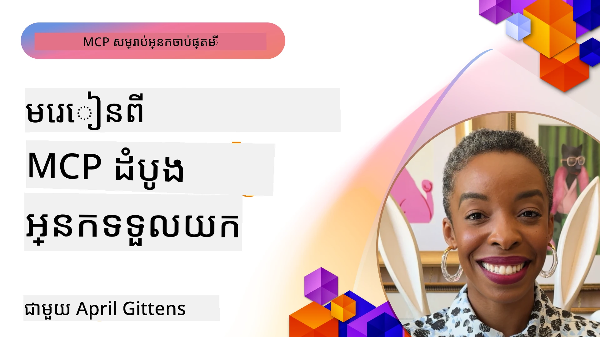

# 🌟 บทเรียนจากนักนำร่องยุคแรก

[](https://youtu.be/jds7dSmNptE)

_(คลิกที่ภาพด้านบนเพื่อดูวิดีโอของบทเรียนนี้)_

## 🎯 โมดูลนี้ครอบคลุมอะไรบ้าง

โมดูลนี้สำรวจว่าบริษัทและนักพัฒนาจริงๆ ใช้ Model Context Protocol (MCP) อย่างไรเพื่อแก้ไขปัญหาที่แท้จริงและขับเคลื่อนนวัตกรรม ผ่านกรณีศึกษาที่ละเอียดโครงการที่ลงมือทำ และตัวอย่างที่ใช้งานจริง คุณจะค้นพบว่า MCP ช่วยให้การผนวก AI ที่ปลอดภัยและปรับขนาดได้ เข้ากับโมเดลภาษา เครื่องมือ และข้อมูลองค์กรได้อย่างไร

### 📚 ดู MCP ในการปฏิบัติ

ต้องการเห็นหลักการเหล่านี้ในเครื่องมือที่พร้อมใช้งานในสายงานจริงหรือไม่? เชิญชม [**10 เซิร์ฟเวอร์ Microsoft MCP ที่กำลังเปลี่ยนแปลงประสิทธิภาพนักพัฒนา**](microsoft-mcp-servers.md) ซึ่งแสดงเซิร์ฟเวอร์ MCP จริงจาก Microsoft ที่คุณสามารถใช้ได้วันนี้

## ภาพรวม

บทเรียนนี้สำรวจว่านักนำร่องยุคแรกใช้ Model Context Protocol (MCP) อย่างไรเพื่อแก้ไขความท้าทายในโลกจริงและขับเคลื่อนนวัตกรรมในหลากหลายอุตสาหกรรม ผ่านกรณีศึกษาที่ละเอียดและโครงการลงมือทำ คุณจะเห็นว่า MCP ช่วยให้การผนวก AI ได้มาตรฐาน ปลอดภัย และปรับขนาดได้โดยเชื่อมโยงโมเดลภาษาขนาดใหญ่ เครื่องมือ และข้อมูลองค์กรเข้ากับกรอบงานเดียวกัน คุณจะได้รับประสบการณ์จริงในการออกแบบและสร้างโซลูชันที่ใช้ MCP เรียนรู้จากรูปแบบการใช้งานที่พิสูจน์แล้ว และค้นพบแนวปฏิบัติที่ดีที่สุดสำหรับการนำ MCP ไปใช้ในสภาพแวดล้อมการผลิต บทเรียนยังเน้นแนวโน้มที่เกิดขึ้น ทิศทางในอนาคต และทรัพยากรโอเพนซอร์สเพื่อช่วยให้คุณอยู่ในแนวหน้าของเทคโนโลยี MCP และระบบนิเวศที่พัฒนาอย่างต่อเนื่อง

## วัตถุประสงค์การเรียนรู้

- วิเคราะห์การใช้งาน MCP ในโลกจริงในหลายอุตสาหกรรม
- ออกแบบและสร้างแอปพลิเคชันที่สมบูรณ์ตาม MCP
- สำรวจแนวโน้มที่เกิดขึ้นและทิศทางในอนาคตของเทคโนโลยี MCP
- นำแนวปฏิบัติที่ดีที่สุดไปใช้ในสถานการณ์พัฒนาจริง

## การใช้งาน MCP ในโลกจริง

### กรณีศึกษา 1: ระบบอัตโนมัติสนับสนุนลูกค้าองค์กร

บริษัทข้ามชาติได้ติดตั้งโซลูชันที่ใช้ MCP เพื่อมาตรฐานการโต้ตอบ AI ในระบบสนับสนุนลูกค้าของพวกเขา อำนวยความสะดวกให้พวกเขาสามารถ:

- สร้างอินเทอร์เฟซเดียวสำหรับผู้ให้บริการ LLM หลายราย
- รักษาการจัดการคำสั่งอย่างสม่ำเสมอในหลายแผนก
- ติดตั้งการควบคุมความปลอดภัยและการปฏิบัติตามกฎระเบียบที่เข้มงวด
- สลับระหว่างโมเดล AI ต่างๆ ได้ง่ายตามความต้องการเฉพาะ

**การติดตั้งทางเทคนิค:**

```python
# ការអនុវត្តម៉ាស៊ីនបម្រើ Python MCP សម្រាប់ការគាំទ្រអតិថិជន
import logging
import asyncio
from modelcontextprotocol import create_server, ServerConfig
from modelcontextprotocol.server import MCPServer
from modelcontextprotocol.transports import create_http_transport
from modelcontextprotocol.resources import ResourceDefinition
from modelcontextprotocol.prompts import PromptDefinition
from modelcontextprotocol.tool import ToolDefinition

# កំណត់ការកត់ត្រា
logging.basicConfig(level=logging.INFO)

async def main():
    # បង្កើតការកំណត់ម៉ាស៊ីនបម្រើ
    config = ServerConfig(
        name="Enterprise Customer Support Server",
        version="1.0.0",
        description="MCP server for handling customer support inquiries"
    )
    
    # ចាប់ផ្តើមម៉ាស៊ីនបម្រើ MCP
    server = create_server(config)
    
    # ចុះបញ្ជីធនធានមូលដ្ឋានចំណេះដឹង
    server.resources.register(
        ResourceDefinition(
            name="customer_kb",
            description="Customer knowledge base documentation"
        ),
        lambda params: get_customer_documentation(params)
    )
    
    # ចុះបញ្ជីគំរូការរំពឹត
    server.prompts.register(
        PromptDefinition(
            name="support_template",
            description="Templates for customer support responses"
        ),
        lambda params: get_support_templates(params)
    )
    
    # ចុះបញ្ជីឧបករណ៍គាំទ្រ
    server.tools.register(
        ToolDefinition(
            name="ticketing",
            description="Create and update support tickets"
        ),
        handle_ticketing_operations
    )
    
    # ចាប់ផ្តើមម៉ាស៊ីនបម្រើជាមួយការដឹកជញ្ជូន HTTP
    transport = create_http_transport(port=8080)
    await server.run(transport)

if __name__ == "__main__":
    asyncio.run(main())
```

**ผลลัพธ์:** ลดค่าใช้จ่ายโมเดล 30%, ปรับปรุงความสม่ำเสมอของการตอบกลับ 45%, และเพิ่มการปฏิบัติตามกฎระเบียบทั่วการดำเนินงานทั่วโลก

### กรณีศึกษา 2: ผู้ช่วยวินิจฉัยทางการแพทย์

ผู้ให้บริการด้านสุขภาพได้พัฒนาโครงสร้างพื้นฐาน MCP เพื่อผนวกโมเดล AI ทางการแพทย์เฉพาะทางหลายโมเดล ขณะเดียวกันรับรองว่าเก็บรักษาข้อมูลผู้ป่วยที่ละเอียดอ่อนได้อย่างปลอดภัย:

- สลับไปมาระหว่างโมเดลการแพทย์ทั่วไปและผู้เชี่ยวชาญได้อย่างราบรื่น
- ควบคุมความเป็นส่วนตัวอย่างเข้มงวดและบันทึกการตรวจสอบ
- ผนวกกับระบบบันทึกสุขภาพอิเล็กทรอนิกส์ (EHR) ที่มีอยู่
- การจัดการคำสั่งในเชิงวิศวกรรมอย่างสม่ำเสมอสำหรับศัพท์ทางการแพทย์

**การติดตั้งทางเทคนิค:**

```csharp
// C# MCP host application implementation in healthcare application
using Microsoft.Extensions.DependencyInjection;
using ModelContextProtocol.SDK.Client;
using ModelContextProtocol.SDK.Security;
using ModelContextProtocol.SDK.Resources;

public class DiagnosticAssistant
{
    private readonly MCPHostClient _mcpClient;
    private readonly PatientContext _patientContext;
    
    public DiagnosticAssistant(PatientContext patientContext)
    {
        _patientContext = patientContext;
        
        // Configure MCP client with healthcare-specific settings
        var clientOptions = new ClientOptions
        {
            Name = "Healthcare Diagnostic Assistant",
            Version = "1.0.0",
            Security = new SecurityOptions
            {
                Encryption = EncryptionLevel.Medical,
                AuditEnabled = true
            }
        };
        
        _mcpClient = new MCPHostClientBuilder()
            .WithOptions(clientOptions)
            .WithTransport(new HttpTransport("https://healthcare-mcp.example.org"))
            .WithAuthentication(new HIPAACompliantAuthProvider())
            .Build();
    }
    
    public async Task<DiagnosticSuggestion> GetDiagnosticAssistance(
        string symptoms, string patientHistory)
    {
        // Create request with appropriate resources and tool access
        var resourceRequest = new ResourceRequest
        {
            Name = "patient_records",
            Parameters = new Dictionary<string, object>
            {
                ["patientId"] = _patientContext.PatientId,
                ["requestingProvider"] = _patientContext.ProviderId
            }
        };
        
        // Request diagnostic assistance using appropriate prompt
        var response = await _mcpClient.SendPromptRequestAsync(
            promptName: "diagnostic_assistance",
            parameters: new Dictionary<string, object>
            {
                ["symptoms"] = symptoms,
                patientHistory = patientHistory,
                relevantGuidelines = _patientContext.GetRelevantGuidelines()
            });
            
        return DiagnosticSuggestion.FromMCPResponse(response);
    }
}
```

**ผลลัพธ์:** ปรับปรุงข้อเสนอแนะการวินิจฉัยสำหรับแพทย์พร้อมรับประกันความสอดคล้องกับ HIPAA อย่างเต็มที่และลดการสลับบริบทระหว่างระบบอย่างมาก

### กรณีศึกษา 3: วิเคราะห์ความเสี่ยงบริการการเงิน

สถาบันการเงินติดตั้ง MCP เพื่อมาตรฐานกระบวนการวิเคราะห์ความเสี่ยงในหลายแผนก:

- สร้างอินเทอร์เฟซเดียวสำหรับโมเดลความเสี่ยงด้านเครดิต การตรวจจับการฉ้อโกง และความเสี่ยงการลงทุน
- ติดตั้งการควบคุมการเข้าถึงที่เข้มงวดและการจัดการเวอร์ชันโมเดล
- รับประกันการตรวจสอบได้ของคำแนะนำ AI ทุกชิ้น
- รักษารูปแบบข้อมูลอย่างสม่ำเสมอในระบบหลายแบบ

**การติดตั้งทางเทคนิค:**

```java
// ម៉ាស៊ីនមេ Java MCP សម្រាប់ការវាយតម្លៃហានិភ័យហិរញ្ញវត្ថុ
import org.mcp.server.*;
import org.mcp.security.*;

public class FinancialRiskMCPServer {
    public static void main(String[] args) {
        // បង្កើតម៉ាស៊ីនមេ MCP ជាមួយមុខងារអនុលោមច្បាប់ហិរញ្ញវត្ថុ
        MCPServer server = new MCPServerBuilder()
            .withModelProviders(
                new ModelProvider("risk-assessment-primary", new AzureOpenAIProvider()),
                new ModelProvider("risk-assessment-audit", new LocalLlamaProvider())
            )
            .withPromptTemplateDirectory("./compliance/templates")
            .withAccessControls(new SOCCompliantAccessControl())
            .withDataEncryption(EncryptionStandard.FINANCIAL_GRADE)
            .withVersionControl(true)
            .withAuditLogging(new DatabaseAuditLogger())
            .build();
            
        server.addRequestValidator(new FinancialDataValidator());
        server.addResponseFilter(new PII_RedactionFilter());
        
        server.start(9000);
        
        System.out.println("Financial Risk MCP Server running on port 9000");
    }
}
```

**ผลลัพธ์:** ปรับปรุงการปฏิบัติตามกฎระเบียบ เพิ่มความเร็วในการปล่อยใช้โมเดล 40% และปรับปรุงความสม่ำเสมอของการประเมินความเสี่ยงข้ามแผนก

### กรณีศึกษา 4: Microsoft Playwright MCP Server สำหรับการทำงานอัตโนมัติเบราว์เซอร์

Microsoft ได้พัฒนา [Playwright MCP server](https://github.com/microsoft/playwright-mcp) เพื่อให้อัตโนมัติการทำงานเบราว์เซอร์อย่างปลอดภัยและได้มาตรฐานผ่านโปรโตคอล Model Context Protocol เซิร์ฟเวอร์ที่พร้อมผลิตนี้อนุญาตให้เอเจนต์ AI และ LLM ทำงานร่วมกับเว็บเบราว์เซอร์ในทางควบคุม ตรวจสอบได้ และขยายได้ – รองรับกรณีการใช้งานเช่นการทดสอบเว็บอัตโนมัติ การสกัดข้อมูล และกระบวนการงานครบวงจร

> **🎯 เครื่องมือพร้อมผลิต**
> 
> กรณีศึกษานี้แสดงเซิร์ฟเวอร์ MCP จริงที่คุณสามารถใช้ได้วันนี้! เรียนรู้เพิ่มเติมเกี่ยวกับ Playwright MCP Server และเซิร์ฟเวอร์ Microsoft MCP พร้อมผลิตอีก 9 รายการได้ที่ [**Microsoft MCP Servers Guide**](microsoft-mcp-servers.md#8--playwright-mcp-server)

**คุณสมบัติหลัก:**
- เปิดเผยความสามารถการทำงานอัตโนมัติของเบราว์เซอร์ (การนำทาง การกรอกแบบฟอร์ม การจับภาพหน้าจอ ฯลฯ) ในรูปแบบเครื่องมือ MCP
- ติดตั้งการควบคุมการเข้าถึงและแซนด์บ็อกซ์เพื่อป้องกันการกระทำที่ไม่ได้รับอนุญาต
- ให้บันทึกตรวจสอบรายละเอียดสำหรับทุกปฏิสัมพันธ์ของเบราว์เซอร์
- รองรับการผนวกกับ Azure OpenAI และผู้ให้บริการ LLM อื่นๆ สำหรับอัตโนมัติผ่านเอเจนต์
- สนับสนุนเอเจนต์การเขียนโค้ดของ GitHub Copilot ด้วยความสามารถการท่องเว็บ

**การติดตั้งทางเทคนิค:**

```typescript
// TypeScript: កំពុងចុះឈ្មោះឧបករណ៍ស្វយ័តកម្មកម្មវិធីហ្គេម Playwright ក្នុងម៉ាស៊ីនបម្រើ MCP
import { createServer, ToolDefinition } from 'modelcontextprotocol';
import { launch } from 'playwright';

const server = createServer({
  name: 'Playwright MCP Server',
  version: '1.0.0',
  description: 'MCP server for browser automation using Playwright'
});

// ចុះឈ្មោះឧបករណ៍សម្រាប់វិលទៅ URL និងចាប់រូបថតអេក្រង់
server.tools.register(
  new ToolDefinition({
    name: 'navigate_and_screenshot',
    description: 'Navigate to a URL and capture a screenshot',
    parameters: {
      url: { type: 'string', description: 'The URL to visit' }
    }
  }),
  async ({ url }) => {
    const browser = await launch();
    const page = await browser.newPage();
    await page.goto(url);
    const screenshot = await page.screenshot();
    await browser.close();
    return { screenshot };
  }
);

// ចាប់ផ្តើមម៉ាស៊ីនបម្រើ MCP
server.listen(8080);
```

**ผลลัพธ์:**

- ทำให้อัตโนมัติการทำงานเบราว์เซอร์โปรแกรมมิ่งปลอดภัยสำหรับเอเจนต์ AI และ LLM
- ลดความพยายามการทดสอบด้วยมือและปรับปรุงความครอบคลุมการทดสอบของแอปเว็บ
- ให้กรอบการทำงานที่นำกลับมาใช้ใหม่และขยายได้สำหรับผนวกเครื่องมือบนเว็บในสภาพแวดล้อมองค์กร
- สนับสนุนความสามารถการท่องเว็บของ GitHub Copilot

**เอกสารอ้างอิง:**

- [Playwright MCP Server GitHub Repository](https://github.com/microsoft/playwright-mcp)
- [Microsoft AI and Automation Solutions](https://azure.microsoft.com/en-us/products/ai-services/)

### กรณีศึกษา 5: Azure MCP – Model Context Protocol ระดับองค์กรในรูปแบบบริการ

Azure MCP Server ([https://aka.ms/azmcp](https://aka.ms/azmcp)) เป็นการใช้งาน Model Context Protocol ระดับองค์กรที่ Microsoft จัดการ มุ่งเน้นให้มีความสามารถสเกล ปลอดภัย และปฏิบัติตามกฎระเบียบในรูปแบบบริการคลาวด์ Azure MCP ช่วยให้องค์กรสามารถปรับใช้ จัดการ และผนวกเซิร์ฟเวอร์ MCP กับ Azure AI ข้อมูล และบริการด้านความปลอดภัยอย่างรวดเร็ว ลดภาระงานและเร่งนำ AI มาใช้

> **🎯 เครื่องมือพร้อมผลิต**
> 
> นี่คือเซิร์ฟเวอร์ MCP จริงที่คุณใช้ได้วันนี้! เรียนรู้เพิ่มเติมเกี่ยวกับ Microsoft Foundry MCP Server ใน [**Microsoft MCP Servers Guide**](microsoft-mcp-servers.md)


- โฮสต์เซิร์ฟเวอร์ MCP ที่จัดการเต็มรูปแบบพร้อมระบบสเกล, การมอนิเตอร์ และความปลอดภัยในตัว
- ผนวกโดยตรงกับ Azure OpenAI, Azure AI Search และบริการ Azure อื่นๆ
- การพิสูจน์ตัวตนและการอนุญาตระดับองค์กรผ่าน Microsoft Entra ID
- รองรับเครื่องมือแบบกำหนดเอง, เทมเพลตคำสั่ง และคอนเนคเตอร์ทรัพยากร
- ปฏิบัติตามความปลอดภัยและข้อกำหนดทางกฎหมายขององค์กร

**การติดตั้งทางเทคนิค:**

```yaml
# Example: Azure MCP server deployment configuration (YAML)
apiVersion: mcp.microsoft.com/v1
kind: McpServer
metadata:
  name: enterprise-mcp-server
spec:
  modelProviders:
    - name: azure-openai
      type: AzureOpenAI
      endpoint: https://<your-openai-resource>.openai.azure.com/
      apiKeySecret: <your-azure-keyvault-secret>
  tools:
    - name: document_search
      type: AzureAISearch
      endpoint: https://<your-search-resource>.search.windows.net/
      apiKeySecret: <your-azure-keyvault-secret>
  authentication:
    type: EntraID
    tenantId: <your-tenant-id>
  monitoring:
    enabled: true
    logAnalyticsWorkspace: <your-log-analytics-id>
```

**ผลลัพธ์:**  
- ลดเวลาสู่การใช้งานสำหรับโครงการ AI องค์กรโดยให้แพลตฟอร์มเซิร์ฟเวอร์ MCP พร้อมใช้และปฏิบัติตามกฎระเบียบ
- ผนวก LLM เครื่องมือ และแหล่งข้อมูลองค์กรได้อย่างง่ายดาย
- เพิ่มความปลอดภัย การสังเกตการณ์ และประสิทธิภาพการดำเนินงานของงาน MCP
- ปรับปรุงคุณภาพโค้ดด้วยแนวปฏิบัติที่ดีที่สุดของ Azure SDK และรูปแบบการพิสูจน์ตัวตนปัจจุบัน

**เอกสารอ้างอิง:**  
- [Azure MCP Documentation](https://aka.ms/azmcp)
- [Azure MCP Server GitHub Repository](https://github.com/Azure/azure-mcp)
- [Azure AI Services](https://azure.microsoft.com/en-us/products/ai-services/)
- [Microsoft MCP Center](https://mcp.azure.com)

## กรณีศึกษา 6: NLWeb 
MCP (Model Context Protocol) คือโปรโตคอลที่เกิดขึ้นใหม่สำหรับแชทบอทและผู้ช่วย AI เพื่อติดต่อกับเครื่องมือ แต่ละอินสแตนซ์ NLWeb ยังเป็นเซิร์ฟเวอร์ MCP ซึ่งสนับสนุนวิธีหลักหนึ่งคือ ask ใช้สำหรับถามคำถามกับเว็บไซต์ด้วยภาษาธรรมชาติ คำตอบที่ส่งกลับใช้ schema.org ซึ่งเป็นคำศัพท์ที่ใช้กันอย่างแพร่หลายสำหรับการบรรยายข้อมูลเว็บ กล่าวง่ายๆ MCP เป็น NLWeb เช่นเดียวกับ Http เป็น HTML NLWeb ผสมผสานโปรโตคอล รูปแบบ Schema.org และโค้ดตัวอย่างเพื่อช่วยให้เว็บไซต์สร้างจุดเชื่อมต่อได้อย่างรวดเร็ว ให้ประโยชน์ทั้งมนุษย์ผ่านอินเทอร์เฟซสนทนาและเครื่องจักรผ่านการโต้ตอบเอเจนต์ต่อเอเจนต์ในภาษาธรรมชาติ

มีส่วนประกอบสองส่วนที่แตกต่างกันของ NLWeb
- โปรโตคอลที่ง่ายมากเริ่มต้นเพื่อเชื่อมต่อกับไซต์ด้วยภาษาธรรมชาติและรูปแบบที่ใช้ json และ schema.org สำหรับคำตอบที่ส่งกลับ ดูเอกสาร API REST สำหรับรายละเอียดเพิ่มเติม
- การใช้งานง่ายของ (1) ที่ใช้เครื่องหมายที่มีอยู่สำหรับเว็บไซต์ที่สามารถนับรวมเป็นรายการรายการ (สินค้า สูตรอาหาร แหล่งท่องเที่ยว รีวิว ฯลฯ) พร้อมกับชุดวิดเจ็ตอินเทอร์เฟซผู้ใช้ เว็บไซต์สามารถให้บริการอินเทอร์เฟซสนทนาสู่เนื้อหา ดูเอกสาร Life of a chat query เพื่อทราบวิธีทำงาน
 
**เอกสารอ้างอิง:**  
- [Azure MCP Documentation](https://aka.ms/azmcp)
- [NLWeb](https://github.com/microsoft/NlWeb)

### กรณีศึกษา 7: Microsoft Foundry MCP Server – การผสานรวมเอเจนต์ AI ในองค์กร

เซิร์ฟเวอร์ Microsoft Foundry MCP แสดงให้เห็นว่า MCP สามารถใช้ในการจัดการและควบคุมเอเจนต์ AI รวมถึงเวิร์กโฟลว์ในสภาพแวดล้อมองค์กรได้อย่างไร ด้วยการผสานรวม MCP กับ Microsoft Foundry องค์กรสามารถมาตรฐานการโต้ตอบของเอเจนต์ ใช้ประโยชน์จากการจัดการเวิร์กโฟลว์ของ Foundry และรับรองการติดตั้งที่ปลอดภัยและปรับขนาดได้

> **🎯 เครื่องมือพร้อมผลิต**
> 
> นี่คือเซิร์ฟเวอร์ MCP จริงที่คุณใช้ได้วันนี้! เรียนรู้เพิ่มเติมเกี่ยวกับ Microsoft Foundry MCP Server ใน [**Microsoft MCP Servers Guide**](microsoft-mcp-servers.md#9--microsoft-foundry-mcp-server)

**คุณสมบัติหลัก:**
- การเข้าถึงครอบคลุมระบบนิเวศ AI ของ Azure รวมถึงแคตตาล็อกโมเดลและการจัดการการปรับใช้
- การจัดทำดัชนีความรู้ด้วย Azure AI Search สำหรับแอปพลิเคชัน RAG
- เครื่องมือประเมินผลการทำงานและความแน่นอนของโมเดล AI
- การผนวกกับ Microsoft Foundry Catalog และ Labs สำหรับโมเดลวิจัยล้ำสมัย
- การจัดการและประเมินเอเจนต์สำหรับสถานการณ์ใช้งานจริง

**ผลลัพธ์:**
- การสร้างต้นแบบรวดเร็วและการมอนิเตอร์เวิร์กโฟลว์ของเอเจนต์ AI อย่างเข้มแข็ง
- ผนวกกับบริการ Azure AI อย่างไร้รอยต่อสำหรับสถานการณ์ขั้นสูง
- อินเทอร์เฟซเดียวสำหรับการสร้าง การปรับใช้ และการมอนิเตอร์สายงานของเอเจนต์
- ปรับปรุงความปลอดภัย การปฏิบัติตามกฎระเบียบ และประสิทธิภาพการดำเนินงานในองค์กร
- เร่งการนำ AI มาใช้ขณะควบคุมกระบวนการที่ซับซ้อนที่ขับเคลื่อนโดยเอเจนต์

**เอกสารอ้างอิง:**
- [Microsoft Foundry MCP Server GitHub Repository](https://github.com/azure-ai-foundry/mcp-foundry)
- [Integrating Azure AI Agents with MCP (Microsoft Foundry Blog)](https://devblogs.microsoft.com/foundry/integrating-azure-ai-agents-mcp/)

### กรณีศึกษา 8: Foundry MCP Playground – การทดลองและต้นแบบ

Foundry MCP Playground ให้สภาพแวดล้อมพร้อมใช้สำหรับทดลองกับเซิร์ฟเวอร์ MCP และการผนวก Microsoft Foundry นักพัฒนาสามารถสร้างต้นแบบ ทดสอบ และประเมินโมเดล AI รวมถึงเวิร์กโฟลว์เอเจนต์โดยใช้แหล่งข้อมูลจาก Microsoft Foundry Catalog และ Labs สนามเด็กเล่นทำให้การตั้งค่าง่ายขึ้น ให้โปรเจกต์ตัวอย่าง และสนับสนุนการพัฒนาร่วมกัน ทำให้สามารถสำรวจแนวปฏิบัติที่ดีที่สุดและสถานการณ์ใหม่ๆ ได้อย่างรวดเร็ว มีประโยชน์โดยเฉพาะสำหรับทีมที่ต้องการตรวจสอบไอเดีย แชร์การทดลอง และเร่งการเรียนรู้โดยไม่ต้องใช้โครงสร้างพื้นฐานที่ซับซ้อน ลดข้อจำกัดในการเริ่มต้น สนามเด็กเล่นช่วยส่งเสริมนวัตกรรมและการมีส่วนร่วมของชุมชนในระบบนิเวศ MCP และ Microsoft Foundry

**เอกสารอ้างอิง:**

- [Foundry MCP Playground GitHub Repository](https://github.com/azure-ai-foundry/foundry-mcp-playground)

### กรณีศึกษา 9: Microsoft Learn Docs MCP Server – การเข้าถึงเอกสารโดย AI

Microsoft Learn Docs MCP Server คือบริการโฮสต์บนคลาวด์ที่ให้ผู้ช่วย AI เข้าถึงเอกสาร Microsoft อย่างเป็นทางการในเวลาจริงผ่าน Model Context Protocol เซิร์ฟเวอร์พร้อมผลิตนี้เชื่อมต่อกับระบบนิเวศ Microsoft Learn แบบครบวงจรและสนับสนุนการค้นหาเชิงความหมายในแหล่งข้อมูล Microsoft ทุกแห่งอย่างมีประสิทธิภาพ

> **🎯 เครื่องมือพร้อมผลิต**
> 
> นี่คือเซิร์ฟเวอร์ MCP จริงที่คุณใช้ได้วันนี้! เรียนรู้เพิ่มเติมเกี่ยวกับ Microsoft Learn Docs MCP Server ใน [**Microsoft MCP Servers Guide**](microsoft-mcp-servers.md#1--microsoft-learn-docs-mcp-server)

**คุณสมบัติหลัก:**
- การเข้าถึงเอกสารทางการ Microsoft Azure และ Microsoft 365 ในเวลาจริง
- ความสามารถค้นหาเชิงความหมายขั้นสูงที่เข้าใจบริบทและเจตนา
- ให้ข้อมูลเป็นปัจจุบันเสมอเมื่อเนื้อหา Microsoft Learn อัปเดต
- ครอบคลุม Microsoft Learn เอกสาร Azure และแหล่งข้อมูล Microsoft 365 อย่างครบถ้วน
- ส่งคืนส่วนประกอบเนื้อหาคุณภาพสูงสูงสุด 10 ส่วนพร้อมชื่อบทความและ URL

**ทำไมจึงสำคัญ:**
- แก้ปัญหาความรู้ AI ที่ล้าสมัยสำหรับเทคโนโลยี Microsoft
- รับรองว่าผู้ช่วย AI เข้าถึงฟีเจอร์ .NET, C#, Azure และ Microsoft 365 ล่าสุดได้
- ให้ข้อมูลที่น่าเชื่อถือและเป็นทางการสำหรับการสร้างโค้ดที่แม่นยำ
- จำเป็นสำหรับนักพัฒนาที่ทำงานกับเทคโนโลยี Microsoft ที่พัฒนาอย่างรวดเร็ว

**ผลลัพธ์:**
- ปรับปรุงความแม่นยำของโค้ดที่สร้างด้วย AI สำหรับเทคโนโลยี Microsoft อย่างชัดเจน
- ลดเวลาค้นหาเอกสารและแนวปฏิบัติที่ดีที่สุด
- เพิ่มผลผลิตนักพัฒนาด้วยการเข้าถึงเอกสารที่เข้าใจบริบท
- ผนวกกับเวิร์กโฟลว์พัฒนาโดยไม่ต้องออกจาก IDE

**เอกสารอ้างอิง:**
- [Microsoft Learn Docs MCP Server GitHub Repository](https://github.com/MicrosoftDocs/mcp)
- [Microsoft Learn Documentation](https://learn.microsoft.com/)

## โครงการลงมือทำ

### โครงการ 1: สร้างเซิร์ฟเวอร์ MCP แบบผู้ให้บริการหลายราย

**วัตถุประสงค์:** สร้างเซิร์ฟเวอร์ MCP ที่สามารถส่งคำขอไปยังผู้ให้บริการโมเดล AI หลายรายตามเกณฑ์ที่กำหนด

**ข้อกำหนด:**

- สนับสนุนผู้ให้บริการโมเดลอย่างน้อยสามรายแตกต่างกัน (เช่น OpenAI, Anthropic, โมเดลภายในท้องถิ่น)
- ติดตั้งกลไกการกำหนดเส้นทางตามเมตาดาต้าของคำขอ
- สร้างระบบกำหนดค่าเพื่อจัดการข้อมูลรับรองของผู้ให้บริการ
- เพิ่มแคชชิ่งเพื่อปรับประสิทธิภาพและลดค่าใช้จ่าย
- สร้างแดชบอร์ดง่ายๆ สำหรับติดตามการใช้งาน

**ขั้นตอนการติดตั้ง:**

1. ตั้งค่าโครงสร้างพื้นฐานเซิร์ฟเวอร์ MCP พื้นฐาน
2. ติดตั้งอะแดปเตอร์ผู้ให้บริการสำหรับแต่ละบริการโมเดล AI
3. สร้างตรรกะการกำหนดเส้นทางตามคุณสมบัติของคำขอ
4. เพิ่มกลไกแคชชิ่งสำหรับคำขอบ่อยครั้ง
5. พัฒนาแดชบอร์ดมอนิเตอร์
6. ทดสอบด้วยรูปแบบคำขอต่างๆ

**เทคโนโลยี:** เลือกใช้ Python (.NET/Java/Python ตามความนิยมของคุณ) Redis สำหรับแคชชิ่ง และเฟรมเวิร์กเว็บง่ายๆ สำหรับแดชบอร์ด

### โครงการ 2: ระบบจัดการเทมเพลตคำสั่งองค์กร

**วัตถุประสงค์:** พัฒนาระบบบนฐาน MCP เพื่อจัดการ แบ่งเวอร์ชัน และปรับใช้เทมเพลตคำสั่งทั่วทั้งองค์กร

**ข้อกำหนด:**


- បង្កើតឃ្លាំងមួយកណ្តាលសម្រាប់គំរូបញ្ជា
- អនុវត្តប្រព័ន្ធកំណែ និងចរន្តការអនុម័ត
- សាងសង់សមត្ថភាពសាកល្បងគំរូជាមួយនឹងបញ្ចូលគំរូ
- អភិវឌ្ឍការត្រួតពិនិត្យចូលដោយផ្អែកលើតួនាទី
- បង្កើត API សម្រាប់ការទាញយក និងចែកចាយគំរូ

**ជំហានអនុវត្ត:**

1. រៀបចំស្កីម៉ារាដATABASE សម្រាប់ផ្ទុកគំរូ
2. បង្កើត API មូលដ្ឋានសម្រាប់ប្រតិបត្តិការ CRUD គំរូ
3. អនុវត្តប្រព័ន្ធកំណែ
4. សាងសង់ចរន្តការអនុម័ត
5. អភិវឌ្ឍស៊ុមហ្វ្រេមសម្រាប់សាកល្បង
6. បង្កើតមុខងារវេបសាយសាមញ្ញសម្រាប់ការគ្រប់គ្រង
7. ប្រតិបត្តិសហការជាមួយម៉ាស៊ីនបម្រើ MCP

**បច្ចេកវិទ្យា:** ជ្រើសរើសស៊ុមហ្វ្រេមខាងក្រោយ, ฐานទិន្នន័យ SQL ឬ NoSQL ហើយស៊ុមហ្វ្រេមខាងមុខសម្រាប់មុខងារគ្រប់គ្រង។

### គម្រោងទី 3: វេទិកាបង្កើតមាតិកាមូលដ្ឋានលើ MCP

**គោលបំណង:** សាងសង់វេទិកាបង្កើតមាតិកាដែលប្រើ MCP ដើម្បីផ្តល់លទ្ធផលមានស្ថិរភាពសំរាប់ប្រភេទមាតិកាផ្សេងៗគ្នា។

**លក្ខខណ្ឌ:**

- គាំទ្រប្រភេទមាតិកាច្រើន (អត្ថបទប្លុក, បណ្តាញសង្គម, ចម្លងទីផ្សារ)
- អនុវត្តការបង្កើតគំរូជាមួយជម្រើសប្តូរតាមបំណង
- បង្កើតប្រព័ន្ធត្រួតពិនិត្យ និងមតិយោបល់មាតិកា
- តាមដានមាត្រដ្ឋានកម្រិតលទ្ធផលមាតិកា
- គាំទ្រកំណត់កំណែ និងកំណត់ការស្រែ្សមាតិកា

**ជំហានអនុវត្ត:**

1. កំណត់មូលដ្ឋានអតិថិជន MCP
2. បង្កើតគំរូសម្រាប់ប្រភេទមាតិកាផ្សេងៗ
3. សាងសង់ដំណាក់កាលបង្កើតមាតិកា
4. អនុវត្តប្រព័ន្ធត្រួតពិនិត្យ
5. អភិវឌ្ឍប្រព័ន្ធតាមដានមាត្រដ្ឋាន
6. បង្កើតមុខងារប្រព័ន្ធផ្ទាំងអ្នកប្រើសម្រាប់គ្រប់គ្រងគំរូ និងបង្កើតមាតិកា

**បច្ចេកវិទ្យា:** ភាសាកម្មវិធីដែលអ្នកចូលចិត្ត, ស៊ុមហ្វ្រេមវេប និងប្រព័ន្ធរៀបចំទិន្នន័យ។

## ទិសដៅអនាគតសម្រាប់បច្ចេកវិទ្យា MCP

### និន្នាការកំណើតថ្មី

1. **MCP ភាពចម្រុះពហុរបៀប**
   - ការពង្រីក MCP ដើម្បីធ្វើឲ្យស្តង់ដារបានសម្រាប់អន្តរកម្មជាមួយ ម៉ូដែលរូបភាព, សំលេង, និងវីដេអូ
   - ការអភិវឌ្ឍសមត្ថភាពគោលបំណងបញ្ច្រាសបែបជុំគ្នា
   - ទ្រង់ទ្រាយបញ្ជារដែលមានស្តង់ដាសម្រាប់របៀបផ្សេងៗ

2. **ហេដ្ឋារចនាសម្ព័ន្ធ MCP វេបចែកចាយ**
   - បណ្តាញ MCP ចែកចាយដែលអាចចែករំលែកធនធានក្នុងស្ថាប័នផ្សេងៗ
   - ពិធីការស្តង់ដារសម្រាប់ការចែកចាយម៉ូដែលដោយសុវត្ថិភាព
   - បច្ចេកទេសគណនាដែលរក្សាគុណភាពឯកជន

3. **ទីផ្សារក្នុង MCP**
   - ប្រព័ន្ធជំនួញសម្រាប់ចែករំលែក និងសម្រាប់បំណុលលេខគំរូ MCP និងផ្ដល់កម្មវិធីបន្ថែម
   - ដំណើរការជាក់ស្តែងសុវត្ថិភាព និងវិញ្ញាបនបត្រ
   - ដំណើរការផ្គុំជាមួយទីផ្សារម៉ូដែល

4. **MCP សម្រាប់ការគណនាក្រៅបណ្ដាញ (Edge Computing)**
   - ការកែប្រែស្តង់ដារ MCP សម្រាប់ឧបករណ៍កណ្តាលមានធនធានកំណត់
   - ពិធីការជាក់ស្តែងសម្រាប់បរិបទបណ្ដាញចំណុចទាប
   - អនុវត្តន៍ MCP ពិសេសសម្រាប់ប្រព័ន្ធ IoT

5. **គម្រោងច្បាប់វិធានការ**
   - អភិវឌ្ឍន៍ជំហានបន្ថែម MCP សម្រាប់ការអនុលោមតាមច្បាប់
   - ផ្សព្វផ្សាយផ្លូវ Audit ត្រា និងមុខងាររៀបចំការពន្យល់
   - ដំណើរការជាមួយស្ថាប័នគ្រប់គ្រង AI កំពុងកើតមាន

### ដំណោះស្រាយ MCP ពី Microsoft

Microsoft និង Azure បានអភិវឌ្ឍឃ្លាំងបើកចំហជាច្រើនដើម្បីជួយអ្នកអភិវឌ្ឍ ធ្វើអោយអាចប្រតិបត្តិ MCP ក្នុងស្ថានភាពផ្សេងៗបាន៖

#### ស្ថាប័ន Microsoft Organization

1. [playwright-mcp](https://github.com/microsoft/playwright-mcp) - ម៉ាស៊ីនបម្រើ MCP Playwright សម្រាប់អូតូម៉ាសិននិងសាកល្បងកម្មវិធីរុករក
2. [files-mcp-server](https://github.com/microsoft/files-mcp-server) - អនុវត្តម៉ាស៊ីនបម្រើ MCP OneDrive សម្រាប់សាកល្បងក្នុងបរិបទក្នុងតំបន់ និងជំនួយសហគមន៍
3. [NLWeb](https://github.com/microsoft/NlWeb) - NLWeb គឺជាការប្រមូលផ្តុំពិធីការបើកចំហ និងឧបករណ៍ឯកសារស្រោចស្រពជាសហគមន៍។ ការផ្តោតសំខាន់បំផុតគឺការបង្កើតស្រទាប់មូលដ្ឋានសម្រាប់វែបដំណើរការ AI

#### ស្ថាប័ន Azure-Samples Organization

1. [mcp](https://github.com/Azure-Samples/mcp) - តំណភ្ជាប់ទៅកាន់គំរូ, ឧបករណ៍ និងធនធានសម្រាប់កសាងនិងបញ្ចូលម៉ាស៊ីនបម្រើ MCP លើ Azure ដោយប្រើភាសាច្រើន
2. [mcp-auth-servers](https://github.com/Azure-Samples/mcp-auth-servers) - ម៉ាស៊ីនបម្រើ MCP តែមួយសម្រាប់បង្ហាញការផ្ទៀងផ្ទាត់តាមលក្ខណៈ Model Context Protocol បច្ចុប្បន្ន
3. [remote-mcp-functions](https://github.com/Azure-Samples/remote-mcp-functions) - ទំព័រចុះចតសម្រាប់អនុវត្តម៉ាស៊ីនបម្រើ Remote MCP ក្នុង Azure Functions ជាមួយដំណាក់កាលភាសាជាក់លាក់
4. [remote-mcp-functions-python](https://github.com/Azure-Samples/remote-mcp-functions-python) - គំរូគ្រាប់ចាប់ផ្តើមរហ័សសម្រាប់កសាងនិងចែកចាយម៉ាស៊ីនបម្រើ Remote MCP ដោយប្រើ Azure Functions ជាមួយ Python
5. [remote-mcp-functions-dotnet](https://github.com/Azure-Samples/remote-mcp-functions-dotnet) - គំរូគ្រាប់ចាប់ផ្តើមរហ័សសម្រាប់កសាងនិងចែកចាយម៉ាស៊ីនបម្រើ Remote MCP ដោយប្រើ Azure Functions ជាមួយ .NET/C#
6. [remote-mcp-functions-typescript](https://github.com/Azure-Samples/remote-mcp-functions-typescript) - គំរូគ្រាប់ចាប់ផ្តើមរហ័សសម្រាប់កសាងនិងចែកចាយម៉ាស៊ីនបម្រើ Remote MCP ដោយប្រើ Azure Functions ជាមួយ TypeScript
7. [remote-mcp-apim-functions-python](https://github.com/Azure-Samples/remote-mcp-apim-functions-python) - Azure API Management ជា AI Gateway ទៅម៉ាស៊ីនបម្រើ Remote MCP ដោយប្រើ Python
8. [AI-Gateway](https://github.com/Azure-Samples/AI-Gateway) - ពិសោធន៍ APIM ❤️ AI រួមបញ្ចូលសមត្ថភាព MCP, បញ្ចូលជាមួយ Azure OpenAI និង AI Foundry

ឃ្លាំងទាំងនេះផ្ដល់នូវការអនុវត្តន៍, គំរូ និងធនធានផ្សេងៗសម្រាប់ការងារជាមួយ Model Context Protocol តាមរយៈភាសាកម្មវិធីនានា និងសេវាកម្ម Azure។ វាផ្ដោតលើករណីប្រើប្រាស់ ចាប់ពីការអនុវត្តម៉ាស៊ីនបម្រើមូលដ្ឋានដល់ការផ្ទៀងផ្ទាត់ភាពសុវត្ថិភាព, ការចែកចាយគេហទំព័រ និងការរួមបញ្ចូលក្នុងអាជីវកម្ម។

#### សៀវភៅធនធាន MCP

ឯកសារទីតាំង [MCP Resources directory](https://github.com/microsoft/mcp/tree/main/Resources) នៅក្នុងឃ្លាំងផ្លូវការរបស់ Microsoft MCP ផ្ដល់នូវការប្រមូលផ្ដុំធនធានគំរូ, គំរូបញ្ជា និងការពិពណ៌នាឧបករណ៍ដែលត្រូវបានរៀបចំយ៉ាងល្អសម្រាប់ប្រើជាមួយម៉ាស៊ីនបម្រើ Model Context Protocol។ ឯកសារនេះត្រូវបានរចនាឡើងដើម្បីជួយអ្នកអភិវឌ្ឍចាប់ផ្តើមឆាប់រហ័សជាមួយ MCP ដោយផ្តល់ប្លុកសំណង់ដែលអាចប្រើឡើងវិញ និងឧទាហរណ៍ល្អបំផុតសម្រាប់៖

- **គំរូបញ្ជា:** គំរូបញ្ជាស្រេចសម្រាប់បេសកកម្ម AI និងស្ថានភាពទូទៅដែលអាចប្ដូរតាមតម្រូវការរបស់អ្នកបម្រើ MCP របស់អ្នក។
- **ការពិពណ៌នាឧបករណ៍:** គំរូស្កីម៉ា និងមេតាដាតាដើម្បីស្តង់ដារការរួមបញ្ចូល និងការហៅឧបករណ៍នៅលើម៉ាស៊ីនបម្រើ MCP ផ្សេងៗគ្នា។
- **ឧទាហរណ៌ធនធាន:** ការពិពណ៌នាធនធានគំរូសម្រាប់ភ្ជាប់ទៅកាន់ប្រភពទិន្នន័យ, API និងសេវាកម្មខាងក្រៅនៅក្នុងស៊ុមហ្វ្រេម MCP។
- **ការអនុវត្តយោង៖** ឧទាហរណ៍ជាក់ស្តែងដែលបង្ហាញពីរបៀបរៀបចំ និងរៀបចំធនធាន, បញ្ជា និងឧបករណ៍ក្នុងគម្រោង MCP ជាក់ស្ដែង។

ធនធានទាំងនេះជំរុញការអភិវឌ្ឍលឿន, ជម្រុញការស្តង់ដារនិងជួយធានាបាននូវអនុវត្តល្អបំផុតពេលសាងសង់និងចែកចាយដំណោះស្រាយផ្អែកលើ MCP។

#### សៀវភៅធនធាន MCP

- [MCP Resources (Sample Prompts, Tools, and Resource Definitions)](https://github.com/microsoft/mcp/tree/main/Resources)

### ឱកាសស្រាវជ្រាវ

- វិធីសាស្ត្របង្កើតបញ្ជាល្អប្រសើរលឿននៅក្នុងស៊ុមហ្វ្រេម MCP
- ម៉ូដែលសុវត្ថិភាពសម្រាប់ការបញ្ចេញ MCP ច្រើនអ្នកជួល
- វាស់វែងប្រសិទ្ធភាពនៅលើការអនុវត្ត MCP ផ្សេងៗ
- វិធីសាស្ត្រត្រួតពិនិត្យផ្លូវការសម្រាប់ម៉ាស៊ីនបម្រើ MCP

## សេចក្ដីសន្និដ្ឋាន

Model Context Protocol (MCP) កំពុងបង្កើតទិសដៅអនាគតសម្រាប់ការរួមបញ្ចូល AI ដែលមានស្តង់ដា, មានសុវត្ថិភាព និងអាចធ្វើការរួមគ្នាបាននៅក្នុងវិស័យផ្សេងៗ។ តាមរយៈករណីសិក្សា និងគម្រោងដៃគូក្នុងមេរៀននេះ អ្នកបានមើលឃើញថាអ្នកចូលរួមដំបូងដូចជា Microsoft និង Azure កំពុងប្រើប្រាស់ MCP ដើម្បីដោះស្រាយបញ្ហាក្នុងពិភពពិត, លើកកម្រិតការទទួលយក AI, និងធានាសុវត្ថិភាព, សមត្ថភាពត្រួតពិនិត្យ និងភាពអាចធ្វើទៅរួច។ វិធីសាស្ត្រម៉ូឌុល MCP អនុញ្ញាតអង្គការបានភ្ជាប់ម៉ូដែលភាសាធំៗ ឧបករណ៍ និងទិន្នន័យអាជីវកម្មនៅក្នុងស៊ុមហ្វ្រេមតែមួយដែលអាចត្រួតពិនិត្យបាន។ ខណៈដែល MCP បន្តអភិវឌ្ឍ ការចូលរួមជាមួយសហគមន៍ ការស្រាវជ្រាវធនធានបើកចំហ និងការអនុវត្តល្អបំផុត នឹងជាកត្តាសំខាន់សម្រាប់ការសាងសង់ដំណោះស្រាយ AI ដែលរឹងមាំ និងរៀបចំរួចសម្រាប់អនាគត។

## ធនធានបន្ថែម

- [MCP Foundry GitHub Repository](https://github.com/azure-ai-foundry/mcp-foundry)
- [Foundry MCP Playground](https://github.com/azure-ai-foundry/foundry-mcp-playground)
- [Integrating Azure AI Agents with MCP (Microsoft Foundry Blog)](https://devblogs.microsoft.com/foundry/integrating-azure-ai-agents-mcp/)
- [MCP GitHub Repository (Microsoft)](https://github.com/microsoft/mcp)
- [MCP Resources Directory (Sample Prompts, Tools, and Resource Definitions)](https://github.com/microsoft/mcp/tree/main/Resources)
- [MCP Community & Documentation](https://modelcontextprotocol.io/introduction)
- [MCP Specification (2026-07-28)](https://modelcontextprotocol.io/specification/2026-07-28/)
- [Azure MCP Documentation](https://aka.ms/azmcp)
- [OWASP MCP Top 10](https://microsoft.github.io/mcp-azure-security-guide/mcp/) - អនុវត្តសុវត្ថិភាពល្អបំផុត
- [Playwright MCP Server GitHub Repository](https://github.com/microsoft/playwright-mcp)
- [Files MCP Server (OneDrive)](https://github.com/microsoft/files-mcp-server)
- [Azure-Samples MCP](https://github.com/Azure-Samples/mcp)
- [MCP Auth Servers (Azure-Samples)](https://github.com/Azure-Samples/mcp-auth-servers)
- [Remote MCP Functions (Azure-Samples)](https://github.com/Azure-Samples/remote-mcp-functions)
- [Remote MCP Functions Python (Azure-Samples)](https://github.com/Azure-Samples/remote-mcp-functions-python)
- [Remote MCP Functions .NET (Azure-Samples)](https://github.com/Azure-Samples/remote-mcp-functions-dotnet)
- [Remote MCP Functions TypeScript (Azure-Samples)](https://github.com/Azure-Samples/remote-mcp-functions-typescript)
- [Remote MCP APIM Functions Python (Azure-Samples)](https://github.com/Azure-Samples/remote-mcp-apim-functions-python)
- [AI-Gateway (Azure-Samples)](https://github.com/Azure-Samples/AI-Gateway)
- [Microsoft AI and Automation Solutions](https://azure.microsoft.com/en-us/products/ai-services/)

## លំហាត់

1. វិភាគករណីសិក្សាមួយ ហើយស្នើវិធីសាស្ត្រអនុវត្តជំនួសមួយ។
2. ជ្រើសរើសគម្រោងមួយ ហើយបង្កើតលក្ខណៈបច្ចេកទេសលម្អិត។
3. ស្រាវជ្រាវវិស័យមួយដែលមិនមាននៅក្នុងករណីសិក្សា ហើយរៀបរាប់របៀប MCP អាចដោះស្រាយបញ្ហាផ្ទាល់ខ្លួនរបស់វា។
4. ស្រាវជ្រាវទិសដៅអនាគតមួយ ហើយបង្កើតគំនិតសម្រាប់បន្ថែម MCP ថ្មីមួយដើម្បីគាំទ្រឱវាទនេះ។

## តើអ្វីជាដំណាក់កាលបន្ទាប់

ស្វែងយល់បន្ថែម៖ [Microsoft MCP Servers](./microsoft-mcp-servers.md)

បន្តទៅ៖ [Module 8: Best Practices](../08-BestPractices/README.md)

---

<!-- CO-OP TRANSLATOR DISCLAIMER START -->
**ការបដិសេធ**:
ឯកសារនេះត្រូវបានបម្លែងភាសា ដោយប្រើសេវាបម្លែងភាសា AI [Co-op Translator](https://github.com/Azure/co-op-translator)។ ទោះយើងខ្ញុំមានក្តីប្រាថ្នាឱ្យបានច្បាស់លាស់ តែសូមយល់ដឹងថាការបម្លែងដោយស្វ័យប្រវត្តិក៏អាចមានកំហុសឬភាពមិនត្រឹមត្រូវ។ ឯកសារដើមជាភាសាទីតាំងគួរត្រូវបានគេប្រើជាប្រភពច្បាស់លាស់។ សម្រាប់ព័ត៌មានសំខាន់ៗ សូមណែនាំឱ្យប្រើប្រាស់ការប្រែដោយមនុស្សជំនាញ។ យើងខ្ញុំមិនទទួលខុសត្រូវចំពោះការយល់ច្រឡំ ឬការបកស្រាយខុសបន្ទាប់ពីការប្រើប្រាស់ការបម្លែងនេះនោះទេ។
<!-- CO-OP TRANSLATOR DISCLAIMER END -->