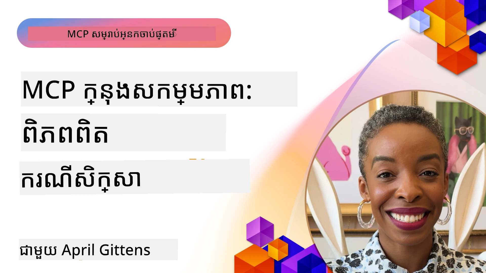

# MCP ក្នុងសកម្មភាពៈ ករណីសិក្សាពីពិភពជាក់ស្តែង  

  

_(ចុចលើរូបភាពខាងលើដើម្បីមើលវីដេអូរបស់មេរៀននេះ)_  

Model Context Protocol (MCP) កំពុងផ្លាស់ប្ដូររបៀបដែលកម្មវិធី AI អន្តរាគមន៍ជាមួយទិន្នន័យ ឧបករណ៍ និងសេវាកម្ម។ ផ្នែកនេះបង្ហាញពីករណីសិក្សាពីជាក់ស្ដែងដែលបង្ហាញពីការអនុវត្ត MCP ដំណើរការជាក់ស្តែងនៅក្នុងស្ថានភាពអាជីវកម្មនានា។  

## ទិដ្ឋភាពទូលំទូលាយ  

ផ្នែកនេះបង្ហាញឧទាហរណ៍ជាក់ស្តែងនៃការអនុវត្ត MCP ដោយបង្ហាញពីរបៀបដែលអង្គការប្រើប្រាស់វា ដើម្បីដោះស្រាយបញ្ហាអាជីវកម្មស្មុគស្មាញ។ ដោយផ្តោតលើករណីសិក្សានេះ អ្នកនឹងទទួលបានចំណេះដឹងអំពីភាពចម្រុះ សមត្ថភាពពង្រីក និងអត្ថប្រយោជន៍ជាក់ស្តែងរបស់ MCP នៅក្នុងស្ថានភាពពិតប្រាកដ។  

## គោលបំណងសិក្សាសំខាន់  

តាមរយៈការស្ទង់មើលករណីសិក្សាទាំងនេះ អ្នកនឹង:  

- យល់ដឹងពីរបៀបអនុវត្ត MCP ដើម្បីដោះស្រាយបញ្ហាអាជីវកម្មជាក់លាក់  
- រៀនអំពីគំរូបញ្ចូលគ្នា និងវិធីស្ថាបត្យកម្មផ្សេងៗ  
- ទទួលស្គាល់អនុវត្តដែលល្អបំផុតសម្រាប់ការអនុវត្ត MCP នៅបរិយាកាសសាជីវកម្ម  
- ទទួលបានចំណេះដឹងអំពីបញ្ហា និងដំណោះស្រាយដែលបានជួបប្រទៈនៅក្នុងករណីសម្រាប់ការអនុវត្តពិតប្រាកដ  
- សម្គាល់ឱកាសក្នុងការអនុវត្តគំរូដូចគ្នា​ក្នុងគម្រោងរបស់អ្នកផ្ទាល់  

## ករណីសិក្សាដែលបានបង្ហាញ  

### 1. [ភ្នាក់ងារធ្វើដំណើរ AI របស់ Azure – ការអនុវត្តសេចក្ដីយោង](./travelagentsample.md)  

ករណីសិក្សានេះផ្តោតសំខាន់លើដំណោះស្រាយយោងរបស់ Microsoft ដែលបង្ហាញពីរបៀបបង្កើតកម្មវិធីរៀបចំដំណើរធ្វើដំណើរជាមួយភ្នាក់ងារ​ច្រើន ដោយប្រើ MCP, Azure OpenAI, និង Azure AI Search។ គម្រោងនេះបង្ហាញពី៖  

- ការត្រួតពិនិត្យការសហការរវាងភ្នាក់ងារច្រើនតាមរយៈ MCP  
- ការបញ្ចូលទិន្នន័យអាជីវកម្មជាមួយ Azure AI Search  
- រចនាសម្ព័ន្ធដែលមានសុវត្ថិភាព និងអាចពង្រីកបានដោយប្រើសេវាកម្ម Azure  
- ឧបករណ៍បន្ថែមដែលអាចបង្កែងបានជាមួយផ្នែកបង្កើត MCP ដែលអាចប្រើឡើងវិញ  
- បទពិសោធន៍អ្នកប្រើប្រាស់ផ្តល់ដោយ Azure OpenAI នៅក្នុងការសន្ទនា  

រចនាសម្ព័ន្ធ និងព័ត៌មានលម្អិតអំពីការអនុវត្តផ្តល់ចំណេះដឹងមានតម្លៃសំរាប់ការសាងសង់ប្រព័ន្ធភ្នាក់ងារច្រើនស្មុគស្មាញជាមួយ MCP ជាជាន់ការសម្របសម្រួល។  

### 2. [ធ្វើបច្ចុប្បន្នភាពធាតុ Azure DevOps ពីទិន្នន័យ YouTube](./UpdateADOItemsFromYT.md)  

ករណីសិក្សានេះបង្ហាញពីការអនុវត្ត MCP ដើម្បីស្វ័យប្រវត្តិកម្មលំហូរងារយ៉ាងជាក់ស្តែង។ វាបង្ហាញពីរបៀបប្រើឧបករណ៍ MCP ដើម្បី៖  

- ដកយកទិន្នន័យពីវេទិកាអនឡាញ (YouTube)  
- ធ្វើបច្ចុប្បន្នភាពធាតុខាងក្នុងប្រព័ន្ធ Azure DevOps  
- បង្កើតលំហូរស្វ័យប្រវត្តិដែលអាចធ្វើឡើងម្តងទៀត  
- បញ្ចូលទិន្នន័យពីប្រព័ន្ធផ្សេងគ្នា  

ឧទាហរណ៍នេះបង្ហាញថា ការអនុវត្ត MCP សាមញ្ញអាចផ្តល់ពីប្រសិទ្ធភាពខ្ពស់ ដោយស្វ័យប្រវត្តិភារកិច្ចធម្មតា និងបង្កើនភាពស៊ីជម្រៅទិន្នន័យឲ្យមានស្ថាពរចំរូងប្រព័ន្ធ។  

### 3. [ការទាញយកឯកសារប្រកបដោយពេលវេលាពិតជាមួយ MCP](./docs-mcp/README.md)  

ករណីសិក្សានេះណែនាំអ្នករបៀបភ្ជាប់កម្មវិធី Python console client ទៅជា MCP server ដើម្បីទាញយក និងកត់ត្រាឯកសារជាក់ស្តែង ដែលស្របតាមបរិបទ Microsoft។ អ្នកនឹងរៀនពីរបៀប៖  

- ភ្ជាប់ទៅ MCP server ដោយប្រើ Python client និង MCP SDK ផ្លូវការជាផ្នែកជំនួយ  
- ប្រើ client HTTP រលត់ទិន្នន័យក្នុងពេលវេលាពិតសម្រាប់ការទាញយកទិន្នន័យមានប្រសិទ្ធភាព  
- អំពាវនាវឧបករណ៍ឯកសារនៅលើ server ហើយកត់ត្រាចម្លើយទៅ console โดยផ្ទាល់  
- បញ្ចូលឯកសារ Microsoft ចុងក្រោយទៅ workflow របស់អ្នកដោយមិនចាកចេញពី terminal  

មេរៀននេះរួមបញ្ចូលភារកិច្ចចុះអត្ថបទ ផ្នែកកូដប្រតិបត្តិការតិចតួច និងតំណភ្ជាប់ទៅធនធានបន្ថែមសម្រាប់រៀនជ្រៅ។ មើលការស្ទង់មើលពេញលេញនិងកូដនៅក្នុងជំពូកដែលភ្ជាប់ដើម្បីយល់ពីរបៀប MCP អាចបម្លែងការចូលប្រើឯកសារ និងផលិតកម្មអ្នកអភិវឌ្ឍន៍ក្នុងបរិយាកាស console។  

### 4. [កម្មវិធីវែបសម្រាប់បង្កើតផែនការសិក្សាផ្ទាល់ខ្លួនជាមួយ MCP](./docs-mcp/README.md)  

ករណីសិក្សានេះបង្ហាញរបៀបបង្កើតកម្មវិធីវែបអន្តរកម្ម ដោយប្រើ Chainlit និង Model Context Protocol (MCP) ដើម្បីបង្កើតផែនការសិក្សាផ្ទាល់ខ្លួនសម្រាប់ប្រធានបទណាមួយ។ អ្នកប្រើអាចបញ្ជាក់ប្រធានបទ (ដូចជា "វិញ្ញាបនបត្រ AI-900") និងរយៈពេលសិក្សា (ឧទាហរណ៍ ៨ សប្តាហ៍) ហើយកម្មវិធីនឹងផ្តល់ផែនការប្រចាំសប្តាហ៍ជាមួយមាតិកាដែលបានផ្ដល់អនុសាសន៍។ Chainlit អនុញ្ញាតឲ្យមានចំណុចចាប់អារម្មណ៍បែបសន្ទនា ជួយធ្វើឲ្យបទពិសោធន៍មានភាពដំណើរការបន្តិចបន្តួច និងមានភាពរលូន។  

- កម្មវិធីវែបដោយសន្ទនាដែលថែមបន្ទាប់ដោយ Chainlit  
- សំណួរដឹកនាំដោយអ្នកប្រើសម្រាប់ប្រធានបទ និងរយៈពេល  
- ការផ្ដល់អនុសាសន៍មាតិកាប្រចាំសប្តាហ៍ដោយប្រើ MCP  
- ចម្លើយជាពេលវេលាពិត និងបូកសរុបដោយអាចបត់បែនក្នុងចំណុចផ្សេងៗនៃសន្ទនា  

គម្រោងបង្ហាញពីរបៀបដែល AI បែបសន្ទនា និង MCP អាចរួមបញ្ចូលគ្នាដើម្បីបង្កើតឧបករណ៍អប់រំដែលអាចបត់បែនដោយអ្នកប្រើនៅក្នុងបរិយាកាសវែបទំនើប។  

### 5. [ឯកសារនៅក្នុងកុងទ័រជាមួយ MCP Server ក្នុង VS Code](./docs-mcp/README.md)  

ករណីសិក្សានេះបង្ហាញពីរបៀបដែលអ្នកអាចយក Microsoft Learn Docs ចូលទៅក្នុងបរិយាកាស VS Code របស់អ្នកដោយប្រើ MCP server — មិនចាំបាច់ប្តូរទាញជាមួយចុចបង្ហាញជាច្រើនទៀត! អ្នកនឹងឃើញរបៀប៖  

- ស្វែងរក និងអានឯកសារប្រកបឥឡូវនេះនៅក្នុង VS Code ដោយប្រើផ្ទាំង MCP ឬ command palette  
- ដកស្រង់ឯកសារយោង និងបញ្ចូលតំណភ្ជាប់ទៅក្នុង README ឬឯកសារ markdown មេរៀន  
- ប្រើ GitHub Copilot និង MCP រួមគ្នាសម្រាប់ការលំហូរកូដ និងឯកសារដោយមាន AI ជួយ  
- បញ្ជាក់ និងបង្កើនការផ្លាស់ប្តូរឯកសាររបស់អ្នកជាមួយមតិពេលវេលាពិត និងភាពត្រឹមត្រូវដែលបានផ្គត់ផ្គង់ដោយ Microsoft  
- បញ្ចូល MCP ជាមួយកិច្ចការសកម្មភាព GitHub សម្រាប់ការត្រួតពិនិត្យឯកសារជាបន្ត  

ការអនុវត្តរួមមាន៖  

- ការកំណត់រចនាសម្ព័ន្ធ `.vscode/mcp.json` សម្រាប់ការតំឡើងងាយស្រួល  
- ស្ទូចស្វែងរកសកម្មភាពក្នុងការបង្ហាញនូវបទពិសោធន៍នៅក្នុងកុងទ័រ  
- អនុវត្តន៍ដោយផ្តោតការរួមបញ្ចូល Copilot និង MCP ដើម្បីឱ្យមានការផលិតបានខ្ពស់បំផុត  

ទិដ្ឋភាពនេះល្អសម្រាប់អ្នកនិពន្ធមេរៀន អ្នកសរសេរ​ឯកសារ និងអ្នកអភិវឌ្ឍន៍ដែលចង់ផ្តោតនៅក្នុងកម្មវិធីតែម្ដង​ពេលធ្វើការជាមួយឯកសារ Copilot និងឧបករណ៍បញ្ជាលេខ — ទាំងអស់នេះដំណើរការដោយ MCP។  

### 6. [ការបង្កើត MCP Server សម្រាប់ APIM](./apimsample.md)  

ករណីសិក្សានេះផ្តល់មគ្គុទេសក៍ជំហានមួយក្នុងការបង្កើត MCP server ដោយប្រើ Azure API Management (APIM)។ វាអនុញ្ញាត៖  

- ការតំឡើង MCP server នៅក្នុង Azure API Management  
- ការបង្ហាញ API operations ជាឧបករណ៍ MCP  
- ការកំណត់គោលនយោបាយសម្រាប់កំណត់កម្រិតនិងសុវត្ថិភាព  
- ការធ្វើតេស្ត MCP server ដោយប្រើ Visual Studio Code និង GitHub Copilot  

ឧទាហរណ៍នេះបង្ហាញពីរបៀបប្រើប្រាស់សមត្ថភាព Azure ដើម្បីបង្កើត MCP server រឹងមាំដែលអាចប្រើបានក្នុងកម្មវិធីនានា ដើម្បីបង្កើនការរួមបញ្ចូលរវាងប្រព័ន្ធ AI និង API អាជីវកម្ម។  

### 7. [GitHub MCP Registry — ការបង្កើនល្បឿនរួមបញ្ចូលជាភ្នាក់ងារ](https://github.com/mcp)  

ករណីសិក្សានេះពិនិត្យរបៀបដែល GitHub's MCP Registry ដែលបានចាប់ផ្តើមក្នុងខែកញ្ញាឆ្នាំ ២០២៥ អាចដោះស្រាយបញ្ហាសំខាន់មួយនៅក្នុងអាគុយម៉ង់ AI៖ ការ​រកឃើញ និងចេញផ្សាយ MCP servers ដែលមានការបែកបាក់ច្រើន។  

#### ទិដ្ឋភាពទូទៅ  
**MCP Registry** ដោះស្រាយការឈឺចាប់ដែលកើតឡើងពីការបែកបាក់របស់ MCP servers ជាច្រើននៅក្នុង repository និង registry ដែលធ្វើអោយការរួមបញ្ចូលយឺត និងងាយខូច ខណៈដែល servers ទាំងនេះអនុញ្ញាតឲ្យភ្នាក់ងារ AI អន្តរាគមន៍ជាមួយប្រព័ន្ធក្រៅដូចជា API, ឃ្លាំងទិន្នន័យ និងប្រភពឯកសារ។  

#### ពិពណ៌នាបញ្ហា  
អ្នកអភិវឌ្ឍន៍ដែលកំពុងបង្កើតលំហូរងារភ្នាក់ងារបានជួបប្រទៈបញ្ហាជាច្រើន៖  
- **ការរកឃើញមានភាពច្របូកច្របល់** នៃ MCP servers នៅក្នុងវេទិកាផ្សេងៗ  
- **សំណួរកំណត់ឡើងឡើងវិញជាច្រើន** ដែលផ្ទុះឡើងក្នុង forum និងឯកសារ  
- **ហានិភ័យសុវត្ថិភាព** ពីប្រភពដែលមិនបានផ្ទៀងផ្ទាត់  
- **ខ្វះស្តង់ដារ** ក្នុងគុណភាព និងភាពសមរម្យនៃ server  

#### រចនាសម្ព័ន្ធដំណោះស្រាយ  
MCP Registry របស់ GitHub ផ្តោតបញ្ចូល MCP servers ដែលទុកចិត្តបានជាមជ្ឈមណ្ឌល មានលក្ខណៈពិសេស៖  
- **តំឡើងក្នុងមួយចុច** តាមរយៈ VS Code សម្រាប់ការតំឡើងស្រួល  
- **ការដាក់ចំណាត់ថ្នាក់លើសញ្ញា** ដោយប្រើផាសក ផលិតភាព និងការផ្ទៀងផ្ទាត់ពីសហគមន៍  
- **ការរួមបញ្ចូលផ្ទាល់** ជាមួយ GitHub Copilot និងឧបករណ៍ដែលគាំទ្រ MCP ផ្សេងទៀត  
- **ម៉ូដែលចូលរួមបើក** អនុញ្ញាតឲ្យសហគមន៍ និងដៃគូអាជីវកម្មរួមចូលលើកចូល  

#### ផលប៉ះពាល់អាជីវកម្ម  
របាយការណ៍នេះបានផ្តល់អត្ថប្រយោជន៍ដែលអាចវាស់បាន៖  
- **ការចូលរួមរហ័ស** សម្រាប់អ្នកអភិវឌ្ឍន៍ ដែលប្រើឧបករណ៍ដូចជា Microsoft Learn MCP Server ដែលផ្សាយឯកសារផ្លូវការចូលទៅភ្នាក់ងារប្រក្រតី  
- **ផលិតភាពកើនឡើង** តាមរយៈ server ផ្សេងៗដូចជា `github-mcp-server` ដែលអាចធ្វើចលនាក្នុងភាសាប្រសើរបាន (បង្កើត PR, ធ្វើ CI ឡើងវិញ, ស្កេនកូដ)  
- **ទំនុកចិត្តក្នុងប្រព័ន្ធកាន់តែក្លាញ់** តាមរយៈបញ្ជីដែលបានតម្រៀប និងស្តង់ដារកំណត់រចនាសម្ព័ន្ធត្រឹមត្រូវ  

#### តម្លៃយុទ្ធសាស្ត្រ  
សម្រាប់អ្នកអនុវត្តដែលមានជំនាញក្នុងការគ្រប់គ្រងអាយុកាលភ្នាក់ងារ និងលំហូរងារដែលអាចផលិតឡើងវិញ MCP Registry ផ្តល់ជូន៖  
- **សមត្ថភាពចែកជាផ្នែកនៃការដាក់ជាភ្នាក់ងារ** ជាមួយភាគហ៊ុនដែលមានស្តង់ដារ  
- **បណ្តាញវាយតម្លៃមូលដ្ឋាន Registry** សម្រាប់ការធ្វើតេស្ត និងផ្ទៀងផ្ទាត់យ៉ាងត្រឹមត្រូវ  
- **ភាពរួមការងារលើឧបករណ៍ផ្សេងៗ** ដែលអាចរួមបញ្ចូលបានយ៉ាងរលូននៅលើវេទិកា AI ផ្សេងៗ  

ករណីសិក្សានេះបង្ហាញថា MCP Registry មិនមែនគ្រាន់តែជាបញ្ជីប៉ុណ្ណោះទេ ប៉ុន្តែវាជាវេទិកាមូលដ្ឋានសម្រាប់ការរួមបញ្ចូលម៉ូឌែលយ៉ាងព្រមព្រៀង និងការដាក់ភ្នាក់ងារដំណើរការដោយយ៉ាងធំទូលាយនៅពិភពពិត។  

### 8. [ចេញផ្សាយទៅបណ្តាញសង្គមពីភ្នាក់ងារ](./publora-social-publishing.md)  

ករណីសិក្សានេះដឹកនាំអ្នកឆ្លងកាត់ MCP server ដែលអាចសរសេរបានពីចម្ងាយ — ដែលឧបករណ៍របស់វាធ្វើសកម្មភាពមិនអាចត្រឡប់ក្រោយបានក្នុងនាមអ្នកប្រើ — ដោយយកការចេញផ្សាយសង្គមជាឧទាហរណ៍។ ភ្នាក់ងារយកថាសប្រកាសមួយ យល់ព្រមដោយមនុស្ស ហើយ server បានកំណត់ពេលវេលាចេញផ្សាយនៅលើបណ្តាញ។  

ហេតុផលអស្ចារ្យគឺការរចនាកំណត់ដែលការចេញផ្សាយនេះកំណត់ ដែលអាចប្រើបានសម្រាប់សេវាកម្មណាមួយដែលសរសេរមិនមែនអាន៖  

- **ការរកឃើញបើក, ការប្រតិបត្តិបានផ្ទៀងផ្ទាត់** — `tools/list` ត្រូវបានឆ្លើយដោយគ្មានព័ត៌មានសម្រាប់ចូល ដូច្នេះ registry និង client អាចស្វែងរកបាន ពេលដែល `tools/call` ប្រើត្រូវការកាត TOKEN ហើយបើមិនមាននឹងត្រូវបានបង្ហាញ `401` ជាមួយ `WWW-Authenticate` header  
- **ការចុះឈ្មោះ OAuth ដោយមិនចាំបាច់មានជំហានក្រៅបណ្តោះអាសន្ន** — ចុះឈ្មោះ client ដោយ δυναμική ទៅថ្ងៃនេះ ជាមួយ Client ID Metadata Documents ដែលនាំទៅការកំណត់ `2026-07-28`  
- **annotations ឧបករណ៍** (`readOnlyHint`, `destructiveHint`, `idempotentHint`) ដែល client ใช้សម្រាប់សម្រេចចិត្តត្រូវបញ្ជាក់អ្វី — ជាគន្លងណែនាំ មិនមែនការរឹតត្បិត ហើយចំណុចនេះ directory ខ្សែភ្លើងភាគពេលឥឡូវនេះត្រូវការនៅក្នុងការពិនិត្យ  
- **អត្តសញ្ញាណមិនអាចច្នៃប្រឌិតបាន** ដូច្នេះតម្លៃក្លែងបន្លំទទួលការបដិសេធយ៉ាងខ្លាំងជាងចាប់ផ្តើមសកម្មភាពលើតម្លៃដែលចុងក្រោយមើលទៅជាភ្លេចចោល  
- **កូនសោ idempotency លើឧបករណ៍បង្កើតផ្សាយ** ដូច្នេះ retry របស់ agent runtime មិនបង្កើតការចេញផ្សាយចម្លង  
- **គោលដៅ no-op បង្ហាញនៅក្នុងគំរូឧបករណ៍** ដែលដំណើរការតាមផ្លូវសរសេរពេញលេញ ហើយមិនផ្សាយអ្វីទេ សម្រាប់អ្នកពិនិត្យ និង CI  

ជំពូកបញ្ចប់ជាមួយបញ្ជីពិនិត្យខ្លីមួយដែលអ្នកអាចអនុវត្តទៅលើ server ដែលអ្នកកំពុងបង្កើត។  

## ទិដ្ឋផលសរុប  

ករណីសិក្សារយៈពេលបូកបញ្ចូលប្រាំបីនេះបង្ហាញពីភាពចម្រុះដ៏គួរឱ្យចាប់អារម្មណ៍ និងអនុវត្ត MCP នៅក្នុងស្ថានភាពពិតប្រាកដនានា។ ពីប្រព័ន្ធរៀបចំដំណើរធ្វើដំណើរភ្នាក់ងារច្រើន និងការគ្រប់គ្រង API អាជីវកម្មដល់លំហូរ​ឯកសារដំណើរការងារយ៉ាងរលូន និង GitHub MCP Registry ដែលប្ដូរពិភពលោក ករណីទាំងនេះបង្ហាញថា MCP ផ្តល់វិធីសាស្ត្រតម្លើងដោយស្តង់ដា និងអាចពង្រីកបានសម្រាប់ភ្ជាប់ប្រព័ន្ធ AI ជាមួយឧបករណ៍ ទិន្នន័យ និងសេវាកម្មដែលពួកគេទាមទារ ដើម្បីផ្តល់តម្លៃដ៏អស្ចារ្យ។  

ករណីសិក្សាទាំងនេះពាក់ព័ន្ធជាប់សាច់ទៅវិស័យមួយចំនួនក្នុងការអនុវត្ត MCP៖  
- **ការរួមបញ្ចូលអាជីវកម្ម**៖ Azure API Management និងស្វ័យប្រវត្តិ Azure DevOps  
- **ការត្រួតពិនិត្យភ្នាក់ងារច្រើន**៖ ការធ្វើដំណើរជាមួយភ្នាក់ងារ AI ដែលបានសម្របសម្រួល  
- **ផលិតកម្មអ្នកអភិវឌ្ឍន៍**៖ ការរួមបញ្ចូល VS Code និងការចូលប្រើឯកសារពេលវេលាពិត  
- **ការអភិវឌ្ឍន៍ប្រព័ន្ធបរិបទ**៖ GitHub MCP Registry ជាវេទិកាមូលដ្ឋាន  
- **កម្មវិធីអប់រំ**៖ កម្មវិធីបង្កើតផែនការសិក្សាអន្តរកម្ម និងផ្ទាំងសន្ទនា  

ដោយសិក្សារូបភាពអនុវត្តនេះ អ្នកនឹងទទួលបានចំណេះដឹងគន្លងទាំងនេះ៖  
- **គំរូស្ថាបត្យកម្ម** សម្រាប់ទំហំ និងការប្រើប្រាស់ផ្សេងទៀត  
- **យុទ្ធសាស្រ្តអនុវត្ត** ដែលសម្របសម្រូលរវាងមុខងារ និងភាពថែទាំ  
- **ការពិចារណាសុវត្ថិភាព និងសមត្ថភាពពង្រីក** សម្រាប់ការចេញផ្សាយជាផលិតកម្ម  
- **អនុវត្តន៍ល្អបំផុត** សម្រាប់ការអភិវឌ្ឍ MCP server និងការរួមបញ្ចូល client  
- **គំនិតប្រព័ន្ធបរិបទ** សម្រាប់ការសាងសង់ការដំណើរការដោយ AI ដែលភ្ជាប់គ្នា  

ឧទាហរណ៍ទាំងនេះបង្ហាញថា MCP មិនមែនគ្រាន់តែជាគ្រប់សំណុំទ្រឹស្តីប៉ុណ្ណោះទេ ប៉ុន្តែជាព្រឹត្តិការណ៍ដែលស្ថិតក្នុងផលិតកម្ម ដែលអាចជួយដោះស្រាយបញ្ហាអាជីវកម្មស្មុគស្មាញបានយ៉ាងមានប្រសិទ្ធភាព។ មិនថាអ្នកកំពុងបង្កើតឧបករណ៍ស្វ័យប្រវត្តិសាមញ្ញ ឬប្រព័ន្ធភ្នាក់ងារច្រើនសម្របសម្រួល ការគំរូ និងវិធានការដែលបានបង្ហាញនៅទីនេះផ្តល់មូលដ្ឋានរឹងមាំសម្រាប់គម្រោង MCP របស់អ្នកផ្ទាល់។  

## ធនធាន​បន្ថែម  

- [ហ្គីតហាប់ភ្នាក់ងារធ្វើដំណើរ AI របស់ Azure](https://github.com/Azure-Samples/azure-ai-travel-agents)  
- [ឧបករណ៍ Azure DevOps MCP](https://github.com/microsoft/azure-devops-mcp)  
- [ឧបករណ៍ Playwright MCP](https://github.com/microsoft/playwright-mcp)  
- [Microsoft Docs MCP Server](https://github.com/MicrosoftDocs/mcp)  
- [GitHub MCP Registry — ការបង្កើនល្បឿនរួមបញ្ចូលជាភ្នាក់ងារ](https://github.com/mcp)  
- [ឧទាហរណ៍ក្នុងសហគមន៍ MCP](https://github.com/microsoft/mcp)  

## តើអ្វីជា​បន្ទាប់  

- មុន៖ [មូឌុល ៨៖ អនុវត្តល្អបំផុត](../08-BestPractices/README.md)  
- បន្ទាប់៖ [មូឌុល ១០៖ ការរំលាយលំហូរ AI៖ ការបង្កើត MCP Server ជាមួយ AI Toolkit](../10-StreamliningAIWorkflowsBuildingAnMCPServerWithAIToolkit/README.md)  

---

<!-- CO-OP TRANSLATOR DISCLAIMER START -->
**ការបដិសេធ**:
ឯកសារនេះត្រូវបានបម្លែងភាសា ដោយប្រើសេវាបម្លែងភាសា AI [Co-op Translator](https://github.com/Azure/co-op-translator)។ ទោះយើងខ្ញុំមានក្តីប្រាថ្នាឱ្យបានច្បាស់លាស់ តែសូមយល់ដឹងថាការបម្លែងដោយស្វ័យប្រវត្តិក៏អាចមានកំហុសឬភាពមិនត្រឹមត្រូវ។ ឯកសារដើមជាភាសាទីតាំងគួរត្រូវបានគេប្រើជាប្រភពច្បាស់លាស់។ សម្រាប់ព័ត៌មានសំខាន់ៗ សូមណែនាំឱ្យប្រើប្រាស់ការប្រែដោយមនុស្សជំនាញ។ យើងខ្ញុំមិនទទួលខុសត្រូវចំពោះការយល់ច្រឡំ ឬការបកស្រាយខុសបន្ទាប់ពីការប្រើប្រាស់ការបម្លែងនេះនោះទេ។
<!-- CO-OP TRANSLATOR DISCLAIMER END -->