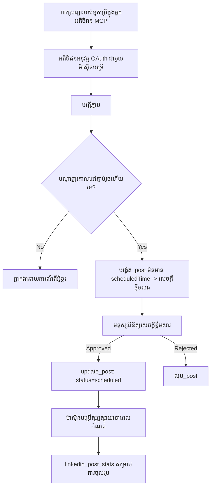

# ការសិក្សករណី៖ការបោះពុម្ពផ្សាយទៅបណ្តាញសង្គមពីភ្នាក់ងារជាមួយម៉ាស៊ីនបម្រើ MCP ចម្ងាយ

> **ការព្រមានៈ** សេវាកម្មមួយចំនួន និងគម្រោងបើកប្រភពអាចបោះពុម្ពផ្សាយទៅបណ្តាញសង្គមបាន ហើយក្រុមមួយអាចបញ្ចូល API របស់បណ្តាញនីមួយៗផ្ទាល់។ សេណារីយ៉ូខាងក្រោមត្រូវបានផ្តល់ជាគំរូតែម្ដងនៃរបៀបដែលម៉ាស៊ីនបម្រើ MCP ចម្ងាយដែលមានសមត្ថភាពសរសេរអាចរចនានិងប្រើប្រាស់បាន។ Publora គឺជាសេវាកម្មពាណិជ្ជកម្មដែលមានកម្រិតឥតគិតថ្លៃ; លំនាំដែលបានពិពណ៌នានៅទីនេះអាចប្រើបាននឹងម៉ាស៊ីនបម្រើ MCP ទាំងអស់ដែលអនុវត្តសកម្មភាពមិនអាចបង្វិលត្រឡប់ឡើងវិញបានក្នុងនាមដ្ឋានអ្នកប្រើ។

## ទិដ្ឋភាពទូទៅ

ភ្នាក់ងារមានជំនាញល្អក្នុងការរៀបចំមាតិកា និងខ្វះជំនាញក្នុងការផ្តល់ជូនវា។ ម៉ូដែលអាចសរសេរជាមួយការបង្ហាញផ្សព្វផ្សាយបានក្នុងរយៈពេលវិនាទី ហើយបន្ទាប់ពីនោះការងារនឹងបញ្ឈប់៖ ការបោះពុម្ពផ្សាយវាមានន័យថាតម្រូវឲ្យមាន API សម្រាប់បណ្តាញនីមួយៗ មានកម្មវិធី OAuth សម្រាប់បណ្តាញនីមួយៗ ហើយមានក្រមសិទិ្ធមេឌៀខុសៗគ្នាច្រើនសម្រាប់មួយៗដោយឡែក។ ក្រុមភាគច្រើនដោះស្រាយនូវបញ្ហានេះដោយចម្លងអត្ថបទទៅក្នុងកម្មវិបត្តិក្នុងកម្មវិធីរុករកដោយដៃ។

ការសិក្សករណីនេះពិចារណាថាតើជំហានចុងក្រោយនេះត្រូវបានបិទជាមួយម៉ាស៊ីនបម្រើ MCP ចម្ងាយតែមួយដូចម្តេច ហើយ — ជំនួយសម្រាប់នរណាមួយកំពុងបង្កើតវា — នូវការសម្រេចចិត្តរចនានៃម៉ាស៊ីនបម្រើដែលមានសមត្ថភាពសរសេរត្រូវត្រូវបានទទួលយកយ៉ាងត្រឹមត្រូវ។ ការអានទិន្នន័យគឺអនុញ្ញាតបាន ប៉ុន្តែការបោះពុម្ពផ្សាយមិនទេ៖ ការហៅឧបករណ៍ខុសគឺអាចមើលឃើញដោយសាធារណៈ ហើយមិនអាចត្រលប់មកវិញបានទេ។

## សេណារីយ៉ូ

ក្រុមអ្នកអភិវឌ្ឍន៍ម្នាក់តូចបានរៀបចំបន្ទាត់មួយនៅក្នុងភ្នាក់ងារ (Claude, VS Code, Cursor — អតិថិជនមិនសំខាន់)។ ពួកគេចង់ឲ្យភ្នាក់ងារមានសមត្ថភាពដូចខាងក្រោម៖

- មើលថាតើគណនីសង្គមណាដែលក្រុមបានភ្ជាប់,
- រៀបចំមាតិកាមួយហើយរក្សាទុកវាជារចនាសំណើសម្រាប់មនុស្សពិនិត្យអនុម័ត,
- ភ្ជាប់រូបភាព,
- កំណត់ពេលវេលាសម្រាប់បោះពុម្ពផ្សាយទៅបណ្តាញជាច្រើននៅពេលដែលបានជ្រើស,
- ហើយនៅពេលក្រោយរាយការណ៍ពីការ​សម្តែងរបស់វា។

សំខាន់បំផុត ពួកគេចង់ឲ្យភ្នាក់ងារមិនអាចបោះពុម្ពផ្សាយដោយចៃដន្យនៅពេលពួកគេខិតខំសាកល្បង។

## ឧបករណ៍ដែលបានប្រើ

- [ម៉ាស៊ីនបម្រើ Publora MCP](https://github.com/publora/mcp-server) — ម៉ាស៊ីនបម្រើ MCP ចម្ងាយ (`streamable-http`) ដែលផ្តល់ឧបករណ៍បោះពុម្ពផ្សាយ កំណត់ពេល វិភាគមេឌៀ និង LinkedIn។ បានចុះបញ្ជីនៅក្នុងបញ្ជី MCP ផ្លូវការជា `com.publora/mcp-server`។

## ដំណើរការជំហាន​ដល់ជំហាន

1. **ភ្ជាប់ម៉ាស៊ីនបម្រើ។** អតិថិជនដែលគាំទ្រ OAuth នឹងបញ្ចប់ដំណើរការអនុម័តដោយកូដទទួលសិទ្ធសាស្ត្រដោយមាន PKCE ត្រូវការចុះបញ្ជីអតិថិជនទេ; អតិថិជនដែលមិនគាំទ្រនោះដូចជា CLI គ្មានចង្កេះ ប្រើខ្ទឹម API Publora ក្នុងក្បាលសំណើ។ ប្រភេទទាំងពីរនេះត្រូវបានគាំទ្រ ហើយអ្វីដែលអ្នកទទួលបានអាស្រ័យលើអតិថិជន មិនមែនម៉ាស៊ីនបម្រើទេ។
2. **បញ្ជីការភ្ជាប់។** ភ្នាក់ងារហៅ `list_connections` ហើយទទួលបានគណនីដែលបានភ្ជាប់ជាមួយលេខសម្គាល់របស់ពួកគេ។
3. **រៀបចំសំណើមាតិកា។** ភ្នាក់ងារហៅ `create_post` *ដោយគ្មាន* ពេលវេលានៅក្នុងកាលវិភាគ។ សំណើត្រូវបានរក្សាទុកជាសំណើច — មិនមានអ្វីបានបោះពុម្ពផ្សាយទេ។
4. **ភ្ជាប់មេឌៀ។** URL រូបភាពសាធារណៈត្រូវបានផ្ដល់ក្នុងការហៅដូចគ្នា; ម៉ាស៊ីនបម្រើទាញយក និងអះអាងវា។
5. **កំណត់ពេលវេលា។** បន្ទាប់ពីបុគ្គលអនុម័ត `update_post` កំណត់ស្ថានភាពទៅកាន់កាលវិភាគជាមួយពេលវេលាមានទំរង់ ISO 8601។
6. **វាស់វែង។** សម្រាប់ LinkedIn, `linkedin_post_stats` បញ្ជូនវិភាគវត្ថុចូលរួមពេលសំណើបានផ្សាយ។

## ឧទាហរណ៍សំណើ

```text
Which social accounts do I have connected?
Draft a post announcing our new changelog page, attach the screenshot at
https://example.com/changelog.png, and keep it as a draft — do not publish it.
Once I approve, schedule it to LinkedIn and Bluesky for tomorrow at 09:00 UTC.
```

## វិញ្ញាសារមាស



## ការអនុវត្តបច្ចេកទេស

មេរៀនខាងក្រោមគឺជាផ្នែកដែលអាចផ្ទេរបាននៃការសិក្សាករណីនេះ។

### ការស្វែងរកបើក ការអនុវត្តត្រូវបានផ្ទៀងផ្ទាត់

`tools/list` ត្រូវបានផ្តល់ដោយគ្មានសក្កិដ្ឋានិកម្ម; រាល់ `tools/call` ត្រូវការតូលគ្នានិងត្រលប់ `401` ជាមួយក្បាល `WWW-Authenticate` បង្ហញទៅកាន់មេតា-ទិន្នន័យគ្រប់គ្រងធនធានដែលបានការពារ។ (ម៉ាស៊ីនបម្រើត្រូវបង្វួលមកតបស្នើ `initialize` មិនបានផ្ទៀងផ្ទាត់ ដែលមានតែអតិថិជននៅតាមកំណែរបស់ពិធីការមុន `2026-07-28`; កំណែនេះបានដកហូតដៃចាប់ផ្តើមចេញទាំងស្រុង។)

ការបែងចែកនេះមានអត្ថន័យនៅក្នុងការអនុវត្ត។ បញ្ជី កាតាឡុក និងអតិថិជនអាចស្វែងរកផ្ទៃឧបករណ៍ — ឈ្មោះ គំរូ និងសម្គាល់ — ដោយគ្មានការកាន់សម្ងាត់ ខណៈដែលគ្មានអ្វីអាច *អនុវត្ត* ទៅដោយមិនច្បាប់។ ម៉ាស៊ីនបម្រើដែលទាមទារតុលសម្រាប់ `initialize` គឺទៅកាន់ភាពមិនឃើញជាក់លាក់ចំពោះឧបករណ៍; ម៉ាស៊ីនបម្រើដែលអនុញ្ញាតឲ្យមាន `tools/call` ដែលមិនបានផ្ទៀងផ្ទាត់គឺជាកំហុសធ្ងន់។

### ការចុះបញ្ជី៖ ការចុះបញ្ជីអតិថិជនបត់បែន និងអ្វីដែលជំនួសវា

ម៉ាស៊ីនបម្រើផ្សព្វផ្សាយអំពី `/.well-known/oauth-protected-resource` និង `/.well-known/oauth-authorization-server` និងគាំទ្រដំណើរការអនុម័តដោយកូដដែលមាន PKCE (`S256`), ការផ្លាស់ប្តូរតុល, និង **ការចុះបញ្ជីអតិថិជនបត់បែន**។

ការចុះបញ្ជីបត់បែនដកស្រង់ជំហានរៀបចំដោយដៃ: គ្មានវា អតិថិជននីមួយៗត្រូវការលេខសម្គាល់ `client_id` ដែលបានចេញជាមុន ដែលមានន័យថាត្រូវចំណាយពេលស្នើសុំតំណាងអ្នកផ្គត់ផ្គង់ជាមួយអតិថិជនថ្មីនីមួយៗ។

ព្យាយាមរកដូចជាពិពណ៌នាការយល់ស្របជាងជាការរចនាដើម្បីចម្លង។ កំណែ `2026-07-28` នៃលក្ខណៈបញ្ជាក់បានដកចេញការចុះបញ្ជីអតិថិជនបត់បែន ជំនួសដោយឯកសារមេតាព័ត៌មានអតិថិជន Client ID Metadata Documents ដែលនៅទីនេះ អតិថិជនផ្ញើឯកសារមេតាព័ត៌មាននៅ URL HTTPS មួយបានមិនផ្លាស់ប្តូរ ហើយ URL នោះ *គឺ* `client_id`។ DCR បន្តដំណើរការនៅសព្វថ្ងៃ ប៉ុន្តែមនុស្សដែលកំពុងបង្កើតម៉ាស៊ីនបម្រើពេលនេះគួរតែមានផែនការសម្រាប់ CIMD ហើយរក្សា DCR សម្រាប់អតិថិជនចាស់ៗ។

### សម្គាល់ឧបករណ៍មិនមែនគ្រាន់តែការតុបតែងទេ

ឧបករណ៍នីមួយៗមាន `title` និងសម្គាល់ដែលអាចប្រើបាន៖ `readOnlyHint`, `destructiveHint`, `idempotentHint`, `openWorldHint`។

មានពីហេតុផលសំខាន់ក្នុងការវិនិយោគចំណាយលើសម្គាល់ទាំងនេះ។ ជាដំបូង អតិថិជនប្រើសម្គាល់ដើម្បីសំរេចចិត្តថាតើត្រូវបញ្ជាក់ជាមួយអ្នកប្រើ បើមិនដូច្នោះ អតិថិជនអាចដំណើរតាមរយៈការស្វែងរកការអានតែមួយហើយឈប់សម្រាប់ការអនុម័តមុនការលុប។ បញ្ជាក់មានភាពច្បាស់ថាសម្គាល់គឺជារូបសញ្ញាដែលមិនគួរឲ្យទុកចិត្ត មិនមែនប្រព័ន្ធសិទ្ធិអនុញ្ញាត៖ វាកំណត់អ្វីដែលអតិថិជនបញ្ចេញបញ្ចូល មិនបញ្ឈប់អ្វីនៅម៉ាស៊ីនបម្រើ ហើយម៉ាស៊ីនបម្រើត្រូវតែអនុវត្តនូវច្បាប់របស់ខ្លួន។ ជាគ្រឿងផ្សំចម្បង នាទីបញ្ជីខ្សែភ្ជាប់ត្រូវការសម្គាល់ទាំងនេះសម្រាប់ពិនិត្យវិចារ; ម៉ាស៊ីនបម្រើដែលឧបករណ៍របស់ខ្លួនគ្មានចំណងជើង និងសម្គាល់ នឹងត្រូវបំផ្លាញមិនថាវាដំណើរការល្អប៉ុណ្ណា។

### បង្កើតលេខសម្គាល់អោយមិនអាចបង្កើតឡើងវិញបាន

លេខសម្គាល់វេទិកាគឺខ្សែបញ្ចូលដែលមិនអាចមើលច្បាស់ត្រូវបានត្រឡប់ជាលទ្ធផលពី `list_connections`, និងការពិពណ៌នាគំរូបានបញ្ជាក់យ៉ាងច្បាស់ថាត្រូវចម្លងឲ្យបានតែមួយច្បាស់ ហើយមិនគួរចាកចេញទេ។ ម៉ាស៊ីនបម្រើធ្វើការបដិសេធអ្វីផ្សេង។

ម៉ូដែលជាអ្នកចងក្រងព្យាករណ៍ល្អ។ ម៉ាស៊ីនបម្រើដែលមានសមត្ថភាពសរសេរណាមួយគួរតែគិតថាលេខសម្គាល់មួយនឹងត្រូវបានបង្កើតក្នុងចិត្តមកពីឡើងវិញ ហើយធ្វើឲ្យផ្លូវនោះបរាជ័យយ៉ាងខ្លាំង និងឆាប់រហ័ស ក្រៅពីសកម្មភាពលើតម្លៃដែលមានទម្រង់សមស្រប។

### បរាជ័យមុននឹងបោះពុម្ពផ្សាយ ជាមួយសារ​អាចដំណើរការ​បាន

បណ្តាញខ្លះច្រានចោលការបោះពុម្ពផ្សាយដែលមានតែអត្ថបទ ហើយតម្រូវឲ្យមានរូបភាព ឬវីដេអូ។ វាត្រូវបានពិនិត្យនៅពេលកំណត់ពេលវេលាសំណើ ហើយកំហុសនឹងបង្ហាញឈ្មោះវេទិកា និងតម្រូវការដែលខ្វះខាត។

ភ្នាក់ងារអាចស្ដារឡើងវិញពី "Instagram តម្រូវឲ្យមានមេឌៀ — ភ្ជាប់រូបភាព ឬវីដេអូ" ដោយគ្មានការធ្វើដំណើរជុំវិញម្ដងទៀត។ វាអាចមិនស្ដារឡើងវិញពី `400` ទូទៅបានទេ។

### ធានាបានការretryឲ្យបានសុវត្ថិភាព

ឧបករណ៍ពីរនៃការបង្កើតមាតិកា, `create_post` និង `update_post`, ទទួលបានកូនសោ idempotency: ការប្រើបញ្ចូលវាឡើងវិញជាមួយសំណើដូចគ្នា នឹងបញ្ចេញឆ្លើយតបដើមវិញ ជំនួសពីការបង្កើតសម្រង់ទី២។ ការអនុវត្តរបស់ភ្នាក់ងារត្រូវបានretry នៅពេលTimeout; បើគ្មាន idempotency, ពេលតបយឺតនឹងជាការបោះពុម្ពផ្សាយចម្លង។ ឧបករណ៍សរសេរផ្សេងទៀត — ការលុប, ជំហានមេឌៀ, ប្រតិកម្ម និងមតិយោបល់ LinkedIn — មិនទទួលកូនសោនេះទេ, ដូច្នេះ retry នៅទីនោះមិនមានសុវត្ថិភាពដោយស្វ័យប្រវត្តិទេ។ គួរដឹងថាការបម្លែងណាដែលមានការពារនិងនោះដែលគ្មាន។

### ផ្តល់វិធីសាស្រ្តសម្រាប់សាកល្បងដែលមិនបោះពុម្ពផ្សាយអ្វីទេ

ម៉ាស៊ីនបម្រើទទួលបានគោលដៅរក្សាទុក `publora-playground` ដែលត្រូវបានពិនិត្យ និងទទួលស្គាល់ដូចជាគោលដៅពិត ហើយបន្ទាប់មកបោះបង់វា — មិនមានអ្វីទៅដល់គណនីផ្ទាល់។ វាត្រូវបានពិពណ៌នានៅក្នុងគំរូឧបករណ៍ស្របពីរបៀប អតិថិជនណាមួយអាចអានដោយគ្មានសក្កិដ្ឋានិកម្ម៖ វាលំហើយនិងការផ្តល់ចំណងជើង `platforms` នៃ `create_post` បានកត់ត្រាវាត្រឹមត្រូវថា "គោលដៅសាកល្បងភ្ជាប់ ដែលមិនតម្រូវការភ្ជាប់ពិតប្រាកដ — សំណើត្រូវបានទទួលស្គាល់ និងបោះបង់, មិនមានអ្វីបោះពុម្ពផ្សាយ"។ ហៅវាដោយផ្តល់វាជាធាតុតែមួយ៖ `platforms: ["publora-playground"]`។

វាបានបង្ហាញថាវាជារឿងល្អបំផុតមួយក្នុងចំណោមរាងផ្ទៃទាំងមូល។ អ្នកពិនិត្យរបៀបផ្សារភ្ជាប់ បរិច្ចាគ និង CI អាចអនុវត្តផ្លូវសរសេរពេញលេញពីកំពុងចាប់ផ្តើមដល់ចុងដោយគ្មានគ្រោះថ្នាក់ចំពោះសាធារណៈពិត។ ម៉ាស៊ីនបម្រូ MCP មួយណាមួយដែលមានសកម្មភាពមិនអាចបង្វិលត្រឡប់បាន នឹងទទួលអត្ថប្រយោជន៍ពីគោលដៅ no-op មានឯកសារពីរបៀប។

## លទ្ធផល និង ផលប៉ះពាល់

- ជំហានបោះពុម្ពផ្សាយបានផ្លាស់ប្ដូរពីកម្មវិបត្តិរុករកទៅការសន្ទនាដើមដែលបានសរសេរមាតិកា ហើយការធ្វើជាថ្មីជាអ្នករៀបចំសែនឲ្យមានមនុស្សក្នុងសង្វាក់។ ត្រូវមានភាពច្បាស់ថាវាជាអ្វី៖ សំណើមាតិកាគឺជាប្រព័ន្ធ ប៉ុន្តែមិនមែនជាកន្ត្រក។ វត្ថុប័ណ្ណសក្ដានុពលអាចកំណត់ពេលវេលាឬបោះពុម្ពផ្សាយ គឺដូចគ្នា ដូច្នេះនរណាម្នាក់ដែលតម្រូវការបញ្ជាក់ពិតប្រាកដត្រូវអនុវត្តវានៅក្រៅផ្ទៃឧបករណ៍ — វត្ថុប័ណ្ណជាផ្នែកផ្សេង ឬបណ្ដាប់គោលនយោបាយនៅមុខម៉ាស៊ីនបម្រើ។
- ភាពខុសគ្នារវាងបណ្តាញមួយៗ — តម្រូវការមេឌៀ, ចំណុចខ្សែ, ឧបករណ៍ត្រួតពិនិត្យចម្លើយ — ត្រូវបានដោះស្រាយម្តងនៅម៉ាស៊ីនបម្រើជំនួសតែមួយសម្រាប់ភ្នាក់ងារនីមួយៗដែលនិយាយទៅវា។
- ម៉ាស៊ីនបម្រើដូចគ្នាផ្តល់ស្តុក MCP ដល់អតិថិជនច្រើនដោយគ្មានការងារផ្ទាល់ខ្លួន ដោយសារតែការស្វែងរកបើក និងការចុះបញ្ជីធ្វើឡើងដោយបត់បែន។
- ដែនកំណត់រចនា​ខាងលើ​ត្រូវបានរៀបចំឡើងដោយការពិនិត្យរបស់បញ្ជីខ្សែភ្ជាប់ ដល់អ្នកប្រើ៖ សម្គាល់ OAuth និងគោលដៅសាកល្បងដែលមានសុវត្ថិភាព ត្រូវការចាំបាច់តួអង្គយ៉ាងហោចណាស់មួយ។

## ឯកសារយោង

- [ម៉ាស៊ីនបម្រើ Publora MCP (ប្រភព)](https://github.com/publora/mcp-server)
- [ឯកសារ API និង MCP របស់ Publora](https://docs.publora.com)
- [ការចុះបញ្ជី MCP៖ `com.publora/mcp-server`](https://registry.modelcontextprotocol.io/v0/servers?search=com.publora/mcp-server)
- [លក្ខណៈបញ្ជាក់ MCP — ការអនុញ្ញាត](https://modelcontextprotocol.io/specification/draft/basic/authorization)
- [លក្ខណៈបញ្ជាក់ MCP — សម្គាល់ឧបករណ៍](https://modelcontextprotocol.io/docs/concepts/tools)

## តើអ្វីទៅបន្ទាប់

- យកម៉ាស៊ីនបម្រើ MCP ដែលអ្នកកំពុងបង្កើត ហើយពិនិត្យមើលប្រាក់ចំណេញថោកបីនេះ៖ សម្គាល់លើរាល់ឧបករណ៍, កូនសោ idempotency ក្នុងរាល់ការសរសេរ, និងគោលដៅ no-op មានឯកសារ។
- សាកល្បងការបែងចែកការស្វែងរកបើក៖ ហៅ `tools/list` ចំពោះម៉ាស៊ីនបម្រើចម្ងាយសាធារណៈដោយគ្មានសក្កិដ្ឋានិកម្ម ហើយបន្ទាប់មកហៅឧបករណ៍ និងពិនិត្យមើលការប្រឈម `401`។
- ពិចារណាថា "undo" មានន័យយ៉ាងដូចម្តេចសម្រាប់ផ្ទៃដែនរបស់អ្នក។ ការបោះពុម្ពផ្សាយមានសំណើ និងការលុប; បើសកម្មភាពរបស់អ្នកគ្មានសមាហរណភាព សំណួរពិនិត្យបញ្ញើគួរត្រូវបានដាក់នៅក្នុងការរចនាឧបករណ៍ មិនមែនក្នុងការអំពាវនាវ។

---

<!-- CO-OP TRANSLATOR DISCLAIMER START -->
**ការបដិសេធ**:
ឯកសារនេះត្រូវបានបម្លែងភាសា ដោយប្រើសេវាបម្លែងភាសា AI [Co-op Translator](https://github.com/Azure/co-op-translator)។ ទោះយើងខ្ញុំមានក្តីប្រាថ្នាឱ្យបានច្បាស់លាស់ តែសូមយល់ដឹងថាការបម្លែងដោយស្វ័យប្រវត្តិក៏អាចមានកំហុសឬភាពមិនត្រឹមត្រូវ។ ឯកសារដើមជាភាសាទីតាំងគួរត្រូវបានគេប្រើជាប្រភពច្បាស់លាស់។ សម្រាប់ព័ត៌មានសំខាន់ៗ សូមណែនាំឱ្យប្រើប្រាស់ការប្រែដោយមនុស្សជំនាញ។ យើងខ្ញុំមិនទទួលខុសត្រូវចំពោះការយល់ច្រឡំ ឬការបកស្រាយខុសបន្ទាប់ពីការប្រើប្រាស់ការបម្លែងនេះនោះទេ។
<!-- CO-OP TRANSLATOR DISCLAIMER END -->