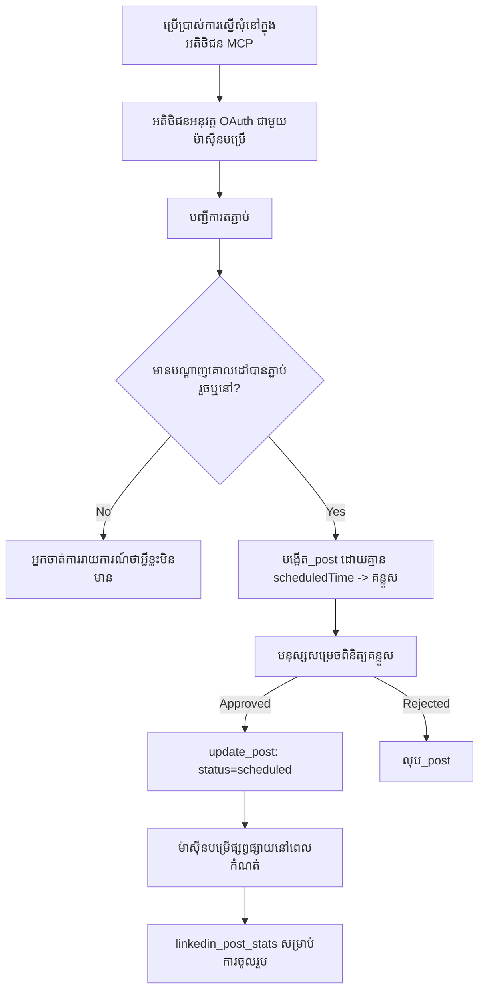

# ករណីសិក្សា៖ ការបោះពុម្ភទៅបណ្តាញសង្គមពីភ្នាក់ងារមួយជាមួយម៉ាស៊ីនមេសេន MCP ពីចម្ងាយ

> **ការតែងតាំង៖** សេវាកម្ម និងគម្រោង open-source ជាច្រើនអាចបោះពុម្ភទៅបណ្តាញសង្គមបាន ហើយក្រុមមួយក៏អាចបញ្ចូល API នៃបណ្តាញនីមួយៗដោយផ្ទាល់។ ស្ថានភាពខាងក្រោមត្រូវបានផ្ដល់ជាឧទាហរណ៍មួយនៃវិធីដែលម៉ាស៊ីនមេសេន MCP មានសមត្ថភាពសរសេរពីចម្ងាយអាចត្រូវបានរចនានិងប្រើប្រាស់។ Publora គឺជាសេវាកម្មពាណិជ្ជកម្មមួយដែលមានកម្រិតឥតគិតថ្លៃ។ លំនាំដែលបានពិពណ៌នាខាងនេះអាចប្រើបានសម្រាប់ម៉ាស៊ីនមេសេន MCP មួយណារឺក៏ដែលអនុវត្តន៍សកម្មភាពដែលមិនអាចត្រឡប់ក្រោយលើប្រតិបត្តិការនៃអ្នកប្រើបាន។

## ទិដ្ឋភាពទូទៅ

ភ្នាក់ងារមិនសូវល្អក្នុងការផ្ញើរចេញមាតិកា ទោះបីជាល្អក្នុងការរៀបចំមាតិកា។ ម៉ូដែលមួយអាចសរសេរប្រកាសចេញផ្សាយបានក្នុងរយៈពេលវិនាទីប៉ុណ្ណោះ ហើយបន្ទាប់ពីនោះការងារនោះឈប់។ ការបោះពុម្ភនោះមានន័យថាត្រូវការតំណភ្ជាប់ API សម្រាប់បណ្តាញផ្សេងៗ កម្មវិធី OAuth សម្រាប់បណ្តាញនីមួយៗ និងកំណត់គោលការណ៍មេឌៀខុសៗគ្នាសម្រាប់នីមួយៗ។ ភាគច្រើននៃក្រុមគឺដោះស្រាយដោយចម្លងអត្ថបទទៅក្នុងកម្មវិធីរុករកដោយដៃ។

ករណីសិក្សានេះពិនិត្យពីរបៀបដែលជំហានចុងក្រោយត្រូវបានបិទជាមួយម៉ាស៊ីនមេសេន MCP មួយតែមួយពីចម្ងាយ ហើយ - មានប្រយោជន៍ជាងសម្រាប់អ្នកណាមួយកំពុងបង្កើតមួយ - នៅលើការសម្រេចចិត្តរចនាដែលម៉ាស៊ីនមេសេនដែលមានសមត្ថភាពសរសេរត្រូវតែធ្វើបានត្រឹមត្រូវ។ ការអានទិន្នន័យមិនស្មុគស្មាញ ការបោះពុម្ភមិនត្រូវបានអនុញ្ញាត៖ ការហៅឧបករណ៍មិនត្រឹមត្រូវអាចមើលឃើញដល់អ្នកគាំទ្រ ហើយមិនអាចបដិសេធបាន។

## ស្ថានភាព

ក្រុមតូចមួយនៃអ្នកអភិវឌ្ឍន៍ទំនាក់ទំនងរៀបចំការផ្សព្វផ្សាយនៅក្នុងភ្នាក់ងារ (Claude, VS Code, Cursor — អតិថិជនមិនសំខាន់ទេ)។ ពួកគេចង់ឲ្យភ្នាក់ងារអាច:

- មើលឃើញគណនីបណ្តាញសង្គមដែលក្រុមបានភ្ជាប់,
- រៀបចំការផ្សព្វផ្សាយ និងរក្សាទុកជារូបមន្តសម្រាប់មនុស្សម្នាក់ឲ្យអនុម័ត,
- ផ្ទុករូបភាព,
- កំណត់ពេលវេលាសម្រាប់បោះពុម្ភទៅបណ្តាញជាច្រើនក្នុងពេលដែលបានជ្រើស,
- ហើយពេលក្រោយរាយការណ៍ពីរបៀបដែលវាបានដំណើរការ។

ពិសេស ពួកគេចង់ឲ្យភ្នាក់ងារមិនអាចបោះពុម្ភដោយចៃដន្យនៅពេលពួកគេចំពោះការសាកល្បងនៅឡើយ។

## ឧបករណ៍ដែលបានប្រើ

- [ម៉ាស៊ីនមេសេន MCP Publora](https://github.com/publora/mcp-server) — ម៉ាស៊ីនមេសេន MCP ពីចម្ងាយ (`streamable-http`) ដែលផ្តល់នូវសេវាកម្មបោះពុម្ភ កំណត់ពេលវេលា មេឌៀ និងឧបករណ៍វិភាគ LinkedIn។ បានចុះបញ្ជីនៅក្នុងបញ្ជី MCP ផ្លូវការជា `com.publora/mcp-server`។

## ដំណើរការលំដាប់ជំហាន

1. **ភ្ជាប់ម៉ាស៊ីនមេសេន។** អតិថិជនដែលគាំទ្រ OAuth ធ្វើដំណើរការអោយបានកូដអោយសង្ឃឹម (authorization-code flow) ជាមួយ PKCE ដោយប្រឆាំងនឹងផ្ទាំងអនុញ្ញាតឯកសាររបស់ម៉ាស៊ីនមេសេន; អតិថិជនដែលមិនមែនជាដូច្នេះ ដូចជា CLI មិនមានផ្ទាំងប្រើប្រាស់ ប្រើកូនសោ API Publora នៅក្នុងក្បាលច្ឌ័ណ្ឌ។ តំបន់ទាំងពីរត្រូវបានគាំទ្រ ហើយតាមបំណងដែលអ្នកទទួលបានទំនាក់ទំនងអាស្រ័យលើអតិថិជន មិនមែនម៉ាស៊ីនមេសេនទេ។
2. **បញ្ជីការភ្ជាប់។** ភ្នាក់ងារហៅ `list_connections` ហើយទទួលតំណាក់កាលគណនីដែលបានភ្ជាប់ជាមួយរបស់ពួកគេ។
3. **រៀបចំ។** ភ្នាក់ងារហៅ `create_post` *ដោយគ្មាន* ពេលវេលាចេញផ្សាយ។ ការផ្សព្វផ្សាយត្រូវបានរក្សាទុកជារូបមន្ត — មិនមានអ្វីត្រូវបានបោះពុម្ភ។
4. **ភ្ជាប់មេឌៀ។** URL រូបភាពសាធារណៈត្រូវបានផ្ញើក្នុងការហៅដដែល; ម៉ាស៊ីនមេសេនទាញយកនិងផ្ទៀងផ្ទាត់វា។
5. **កំណត់ពេលវេលា។** បន្ទាប់ពីមនុស្សអនុម័ត `update_post` កំណត់ស្ថានភាពទៅ scheduled ជាមួយពេលវេលា ISO 8601។
6. **វាស់វែង។** សម្រាប់ LinkedIn, `linkedin_post_stats` ឆ្លើយតបព័ត៌មានសកម្មភាពបន្ទាប់ពីការផ្សព្វផ្សាយចេញ។

## ឧទាហរណ៍ការស្នើសុំ

```text
Which social accounts do I have connected?
Draft a post announcing our new changelog page, attach the screenshot at
https://example.com/changelog.png, and keep it as a draft — do not publish it.
Once I approve, schedule it to LinkedIn and Bluesky for tomorrow at 09:00 UTC.
```

## សៀគ្វី Mermaid



## ការអនុវត្តបច្ចេកទេស

មេរៀនខាងក្រោមគឺជាផ្នែកដែលអាចផ្ទេរសម្រាប់ករណីសិក្សានេះ។

### ការរកឃើញវិចារណញ្ញាណ ការអនុវត្តដោយមានការផ្ទៀងផ្ទាត់

`tools/list` ត្រូវផ្តល់ដោយគ្មានសញ្ញាប័ត្រ; រាល់ `tools/call` ត្រូវការតកាស៍
ហើយត្រលប់ `401` ជាមួយក្បាល `WWW-Authenticate` ដែលបង្ហាញទៅកាន់

protected-resource metadata។ ចុងផ្លូវ​ចាស់​នៃ​ម៉ាស៊ីន​បម្រើ​នេះ​ក៏​ឆ្លើយតប `initialize` ដែល​មិន​បាន​ផ្ទៀង​ផ្ទាត់​សម្រាប់​អតិថិជន​នៅ​លើ​កំណែ​ពិធីការ​មុន `2026-07-28` ដែរ; អតិថិជន​បច្ចុប្បន្ន​មិន​ប្រើ​ដៃ​គូ​នេះ​ទេ។


### ការចុះបញ្ជី៖ ការចុះបញ្ជីអតិថិជនធ្វើឡើង δυναμικά និងអ្វីដែលជំនួសវា


ចាត់ទុកនេះជាអ្វីដែលមានសុទិដ្ឋិនិយមសមស្របជាងគេ ជាជំហានដែលត្រូវគូសចម្លង។ ការកែប្រែ `2026-07-28` នៃលក្ខណៈបញ្ជាក់បានបញ្ឈប់ការចុះបញ្ជីដើមរបស់អតិថិជនក្នុងគោលបំណងលើ Client ID Metadata Documents ដែលក្នុងនោះ អតិថិជនផ្ទុកឯកសារសមាស​ធាតុ (metadata document) នៅ URL HTTPS ដែលមានស្ថិរភាព ហើយ URL នោះ *ជាគ្រាន់តែ* `client_id` ។ DCR នៅតែដំណើរការបាន ហើយម៉ាស៊ីនបម្រើដែលកំពុងត្រូវបានបង្កើតនៅបច្ចុប្បន្នគួរតែផែនការសម្រាប់ CIMD ហើយរក្សា DCR សម្រាប់អតិថិជនចាស់ប៉ុណ្ណោះ។


### ការជ្រៀតជ្រែកឧបករណ៍មិនមែនជាការតុបតែង

ឧបករណ៍គ្រប់គ្នាស៊ើបយក `title` និងកិច្ចរំលឹកដែលអាចប្រើបាន: `readOnlyHint`, `destructiveHint`, `idempotentHint`, `openWorldHint` ។

ពីរមូលហេតុសម្រាប់វិនិយោគលើពួកវា។ ជាផ្លូវដំបូង អតិថិជនប្រើកិច្ចរំលឹកដើម្បីសម្រេចចិត្តថាតើត្រូវបញ្ជាក់ជាមួយអ្នកប្រើប្រាស់អ្វី - អតិថិជនអាចញឹកញាប់រកមើល readonly ហើយឈប់សម្រាប់ការអនុម័តមុនពេលលុប។ លក្ខណៈបញ្ជាក់ពន្យល់ច្បាស់ថា ការជ្រៀតជ្រែកគឺជាកិច្ចរំលឹកដែលមិនគួរឱ្យជឿច្បាស់លាស់ មិនមែនជាមេកានីសមន៍អនុញ្ញាតទេ៖ ពួកវាផ្លាស់ប្តូរអ្វីដែលអតិថិជនផ្តល់ជូន សូមកុំបញ្ឈប់អ្វីលើម៉ាស៊ីនបម្រើ ហើយម៉ាស៊ីនបម្រើត្រូវបន្តអនុវត្តតាមច្បាប់របស់វា។ ជាទីពីរ តំណត្រួតពិនិត្យចម្បងឥឡូវនេះ *ទាមទារ* ពួកវាសម្រាប់ការត្រួតពិនិត្យឡើងវិញ; ម៉ាស៊ីនបម្រើដែលឧបករណ៍របស់វាត្រូវខ្វះចំណងជើង និងកិច្ចរំលឹកនឹងត្រូវសងសងវិញដោយមិនគិតថាវាដំណើរការល្អសោះ។


ម៉ូដែលមានការសន្និដ្ឋានបានច្រើន។ ម៉ាស៊ីនបម្រើមានសមាធិផលនឹងដឹងថាអត្តសញ្ញាណមួយនឹងត្រូវបានធ្វើក្តាមហេតុនានាក្រោយ ហើយធ្វើឲ្យផ្លូវនោះបរាជ័យយ៉ាងច្បាស់លាស់និងមុនគេជាងជំនួសតាមតម្លៃសង្ឃឹម។

### បរាជ័យមុនពេលផ្សព្វផ្សាយ ជាមួយសារ​ដែលអាចអនុវត្តបាន

បណ្ដាញខ្លះបដិសេធការបញ្ជូនផ្លូវតែអត្ថបទហើយត្រូវបានទាមទាររូបភាពឬវីដេអូ។ ត្រូវបានផ្ទៀងផ្ទាត់ពេលបញ្ចូលសារនោះ ហើយកំហុសបង្ហាញឈ្មោះវេទិកា និងតម្រូវការដែលខ្វះ។

អ្នកតំណាងអាចស្ដារឡើងវិញពី "Instagram ត្រូវការ​មេឌៀ — ភ្ជាប់រូបភាព ឬ​វីដេអូ" ដោយមិនចាំបាច់ត្រលប់ទៀតក្រោយ។ វាមិនអាចស្ដារឡើងវិញពីកំហុសទូទៅ `400` ទេ។

### ធ្វើឲ្យការព្យាយាមម្តងទៀតមានសុវត្ថិភាព

ឧបករណ៍ពីរដែលបង្កើតមាតិកា `create_post` និង `update_post` ទទួលបានកូនសោ idempotency៖ ការប្រើឡើងវិញជាមួយសំណើស្រដៀងគ្នា នឹងធ្វើឲ្យមិនបង្កើតសារថ្មីទេ តែចាក់សោរនេះនឹងត្រូវចាក់ទៅលើតបស្នាមដើម។ បរិបូណ៌ភ្នាក់ងារបន្តផ្តើមតាមពេលវេលា; គ្មាន idempotency ចម្លើយយឺតនឹងក្លាយជាការចេញផ្សាយមួយជាច្រើន។ ឧបករណ៍សរសេរផ្សេងទៀត - ការលុបជំហានមេឌៀ សកម្មភាព និងមតិយោបល់ LinkedIn - មិនទទួល idempotency ប៉ុន្មានទេ ដូច្នេះការព្យាយាមម្តងទៀតនៅទីនោះមិនមានសុវត្ថិភាពដោយស្វ័យប្រវត្តិ។ គួរត្រូវដឹងថាការបម្លែងរបស់អ្នកមួយចំនួនមានការការពារ និងមួយចំនួនគ្មាន។


### ផ្ដល់មធ្យោបាយសម្រាប់ការធ្វើតេស្តដែលមិនបោះពុម្ពអ្វីទេ


ម៉ាស៊ីនបម្រើទទួលយកគោលដៅដែលបានរក្សាទុក, `publora-playground`, ដែលត្រូវបានផ្ទៀងផ្ទាត់ និងទទួលស្គាល់ដូចជាគោលដៅពិត ហើយបន្ទាប់មកបាត់បង់ — មិនមានអ្វីទៅដល់គណនីផ្ទាល់។ វាត្រូវបានពណ៌នានៅក្នុងស្គីម៉ាតឧបករណ៍ផ្ទាល់, ដែលអតិថិជនណាមួយអាចអានបានដោយគ្មានអត្តសញ្ញាណៈ: វាល `platforms` នៃឯកសារ `create_post` វាយតម្លៃវា​ជា "គោលដៅសាកល្បងការតភ្ជាប់ដែលមិនត្រូវការតភ្ជាប់ពិត — ការបង្ហោះត្រូវបានទទួលស្គាល់ហើយបាត់បង់, មិនមានអ្វីត្រូវបានបោះពុម្ពផ្សាយ"។ ហៅវាដោយបញ្ជូនវាជាឯកតាតែមួយ៖ `platforms: ["publora-playground"]`។

នេះបានក្លាយជาหนึ่งក្នុងចំណោមព័ត៌មានលម្អិតមានប្រយោជន៍បំផុតនៃផ្ទៃដីទាំងមូល។ អ្នកពិនិត្យបញ្ជីភ្ជាប់, អ្នកចូលរួមនិង CI អាចអនុវត្តផ្លូវសរសេរទាំងមូលពីដំបូងដល់ចុង ដោយគ្មានហានិភ័យដល់អ្នកទស្សនាពិត។ ម៉ាស៊ីនបម្រើ MCP ណាមួយដែលមានសកម្មភាពមិនអាចត្រឡប់ចូលជា មានប្រយោជន៍ពីគោលដៅ no-op ដែលមានឯកសារពាក់ព័ន្ធ។

## លទ្ធផល និងផលប៉ះពាល់

- ជំហានបោះពុម្ពផ្សាយផ្លាស់ទីពីកម្មវិធីរុករកទៅកាន់ការសន្ទនាដែលខ្លឹមសារត្រូវបានសរសេរ, ហើយទម្លាប់រៀនសូត្រប្រភេទdraft ជារឿងដែលរក្សាទុកមនុស្សនៅក្នុងសៀវភៅ។ យកឱ្យច្បាស់អំពីអ្វីដែលនោះជាក់ស្តែង: draft គឺជាសន្ទស្សន៍មួយ, មិនមែនជាស្ពានមួយទេ។ អត្តសញ្ញាណតែមួយអាចកំណត់ពេលឬបោះពុម្ពផ្សាយបាន, ដូច្នេះនរណាដែលត្រូវការខ្សែក្រវ៉ាត់អនុម័តពិតប្រាកដត្រូវតែអនុវត្តវាក្នុងផ្ទៃក្រៅឧបករណ៍ — អត្តសញ្ញាណខុសៗគ្នា ឬស្តង់ដានាមស្តុកមុខនៅមុខម៉ាស៊ីនបម្រើ។
- ភាពខុសគ្នាតាមបណ្តាញ — តម្រូវការព័ត៌មាន, ការរៀបចំពត៌មានជួរ, ការគ្រប់គ្រងការឆ្លើយតប — ត្រូវបានគ្រប់គ្រងមួយលើម៉ាស៊ីនបម្រើជាមុន ជាងនៅក្នុងភ្នាក់ងារនីមួយៗដែលនិយាយទៅវា។
- ម៉ាស៊ីនបម្រើដដែលគាំទ្រអតិថិជន MCP ច្រើនដោយគ្មានអត្តសញ្ញាណដែលបានចេញពីមុន។
    អតិថិជនបច្ចុប្បន្នអាចប្រើឯកសារព័ត៌មានកាតាបអតិថិជន (Client ID Metadata Documents); DCR នៅតែជាជម្រើសផ្សេង
    សម្រាប់អតិថិជនដើម។
- ការរឹតបន្តឹងរចនាសម្ព័ន្ធខាងលើ ត្រូវបានកំណត់ដោយការពិនិត្យបញ្ជីភ្ជាប់ និងអ្នកប្រើ៖ ការកំណត់យកចំណាំ, OAuth និងគោលដៅសាកល្បងដែលមានសុវត្ថិភាព ត្រូវបានទាមទារពីយ៉ាងហោចណាស់ម្នាក់ក្នុងចំណោមពួកគេ។

## ឯកសារ​យោង

- [ម៉ាស៊ីនបម្រើ MCP របស់ Publora (ប្រភព)](https://github.com/publora/mcp-server)
- [ផ្សព្វផ្សាយ API និងឯកសារ MCP របស់ Publora](https://docs.publora.com)
- [វិញ្ញាបនប័ត្រ MCP៖ `com.publora/mcp-server`](https://registry.modelcontextprotocol.io/v0/servers?search=com.publora/mcp-server)
- [ពិនិត្យ MCP — ការអនុញ្ញាត](https://modelcontextprotocol.io/specification/2026-07-28/basic/authorization)
- [ពិនិត្យ MCP — កំណត់ចំណាំឧបករណ៍](https://modelcontextprotocol.io/docs/concepts/tools)

## បន្ទាប់មកជាអ្វី

- យកម៉ាស៊ីនបម្រើ MCP ដែលអ្នកកំពុងកសាង ហើយពិនិត្យប្រៀបបីជ័យជំនះថោកបំផុតនៅនេះ៖ កំណត់ចំណាំលើឧបករណ៍គ្រប់យ៉ាង, កូនសោ idempotency លើការសរសេរនីមួយៗ, និងគោលដៅ no-op ដែលមានឯកសារ។
- សាកល្បងការបំបែកការបើករកមើល៖ ហៅ `tools/list` ទៅម៉ាស៊ីនបម្រើចម្ងាយសាធារណៈដោយគ្មានអត្តសញ្ញាណ, បន្ទាប់មកហៅឧបករណ៍និងពិនិត្យមើលការទាមទារព័ត៌មាន `401`។
- ពិចារណាអ្វីដែល "បដិសេធ" មានន័យសម្រាប់ដែនកំណត់របស់អ្នក។ ការបោះពុម្ពផ្សាយមាន drafts និងការលុបចោល; ប្រសិនបើសកម្មភាពរបស់អ្នកគ្មានជម្រើសស្មើគ្នា ការបញ្ជាក់នោះគួរជារឿងក្នុងរចនាសម្ព័ន្ធឧបករណ៍ មិនមែននៅក្នុងសំណើ។

---

<!-- CO-OP TRANSLATOR DISCLAIMER START -->
**ការបដិសេធ**:
ឯកសារនេះត្រូវបានបម្លែងភាសា ដោយប្រើសេវាបម្លែងភាសា AI [Co-op Translator](https://github.com/Azure/co-op-translator)។ ទោះយើងខ្ញុំមានក្តីប្រាថ្នាឱ្យបានច្បាស់លាស់ តែសូមយល់ដឹងថាការបម្លែងដោយស្វ័យប្រវត្តិក៏អាចមានកំហុសឬភាពមិនត្រឹមត្រូវ។ ឯកសារដើមជាភាសាទីតាំងគួរត្រូវបានគេប្រើជាប្រភពច្បាស់លាស់។ សម្រាប់ព័ត៌មានសំខាន់ៗ សូមណែនាំឱ្យប្រើប្រាស់ការប្រែដោយមនុស្សជំនាញ។ យើងខ្ញុំមិនទទួលខុសត្រូវចំពោះការយល់ច្រឡំ ឬការបកស្រាយខុសបន្ទាប់ពីការប្រើប្រាស់ការបម្លែងនេះនោះទេ។
<!-- CO-OP TRANSLATOR DISCLAIMER END -->