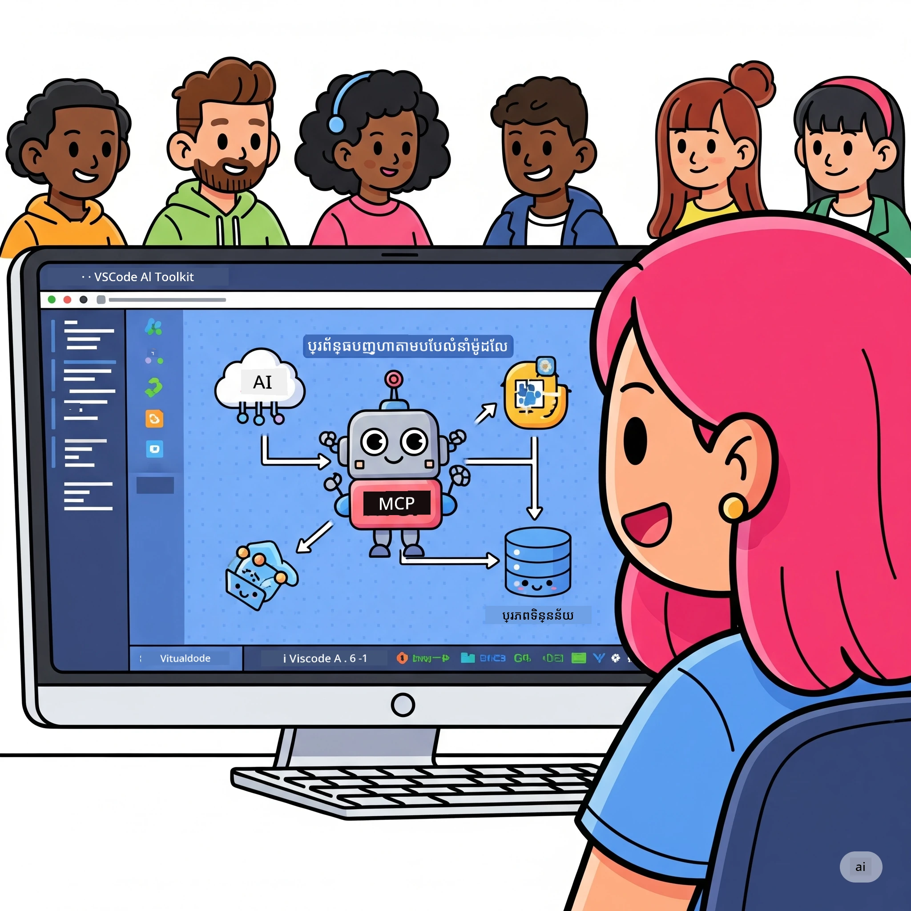
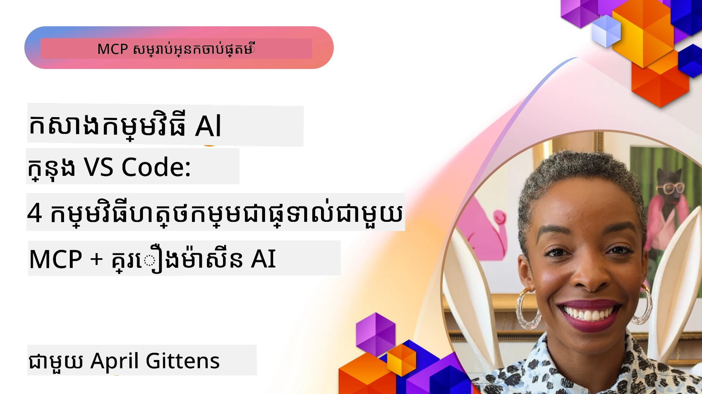

# ការស្រួលបញ្ចប់លំហូរជំនួយ AI៖ ការបង្កើតម៉ាស៊ីនបម្រើ MCP ជាមួយ Microsoft Foundry Toolkit

## 🎯 ទិដ្ឋភាពទូទៅ

_(ចុចរូបភាពខាងលើដើម្បីមើលវីដេអូមេរៀននេះ)_

សូមស្វាគមន៍មកកាន់ **សិក្ខាសាលា Model Context Protocol (MCP)**! សិក្ខាសាលាដែលមានដៃអង្គធំទូលាយនេះបញ្ចូលបច្ចេកវិទ្យាថ្មីពីរក្នុងនោះដើម្បីបង្កើតកំណែបច្ចេកវិទ្យាដ៏ឆ្លាតវៃសម្រាប់អភិវឌ្ឍកម្មវិធី AI៖

> **កំណត់សម្គាល់ការគំរាមកំហែង:** កូដសិក្ខាសាលាត្រូវបានបង្កើតនិងសាកល្បងជាមួយ MCP
> `2025-11-25` ដូចបង្ហាញពីស្លាកនៅលើ។ ប្រើ
> [កំណត់ត្រា `2026-07-28` បច្ចុប្បន្ន](https://modelcontextprotocol.io/specification/2026-07-28/)
> សម្រាប់អនុវត្តន៍ពProtocol ថ្មីៗ ហើយពិនិត្យមើលកំណត់ត្រាបញ្ចេញសមាសធាតុនៅមុនពេល
> ផ្លាស់ប្តូរពហុកម្មវិធី។

- **🔗 Model Context Protocol (MCP)**: ស្តង់ដារបើកសម្រាប់ការតភ្ជាប់ឧបករណ៍ AI ដោយរលូន
- **🛠️ ការបន្ថែម Microsoft Foundry Toolkit សម្រាប់ VS Code**: ការបន្ថែមអភិវឌ្ឍ AI ដែលមានភាពរឹងមាំរបស់ Microsoft

### 🎓 អ្វីដែលអ្នកនឹងរៀន

នៅចុងបញ្ចប់សិក្ខាសាលានេះ អ្នកនឹងមានជំនាញក្នុងការបង្កើតកម្មវិធីឆ្លាតវៃ ដែលភ្ជាប់គ្នារវាងម៉ូដែល AI និងឧបករណ៍និងសេវាកម្មពិតជាពិភពលោក។ ចាប់ពីការធ្វើតេស្តដោយស្វ័យប្រវត្តិដល់ការចូលរួម API ផ្ទាល់ខ្លួន អ្នកនឹងទទួលបានជំនាញអនុវត្តដើម្បីដោះស្រាយបញ្ហាជំនួញស្មុគស្មាញ។

## 🏗️ បច្ចេកវិទ្យាចម្បង

### 🔌 Model Context Protocol (MCP)

MCP គឺជា **"USB-C សម្រាប់ AI"** - ស្តង់ដារសកលដែលភ្ជាប់ម៉ូដែល AI ទៅឧបករណ៍និងប្រភពទិន្នន័យខាងក្រៅ។

**✨ លក្ខណៈសំខាន់ៗ៖**

- 🔄 **ការតភ្ជាប់ស្តង់ដារ**: មុខងារសកលសម្រាប់ការតភ្ជាប់ឧបករណ៍ AI
- 🏛️ **ស្ថាបត្យកម្មបត់បែន**: ម៉ាស៊ីនបម្រើក្នុងតំបន់និងពីចម្ងាយតាមរយៈការដឹកជញ្ជូន stdio/SSE
- 🧰 **បរិស្ថានសម្បូរ**: ឧបករណ៍, ស្នើ, និងធនធានមួយក្នុងពProtocol
- 🔒 **មានស្របតាមសហគ្រាស**: សុវត្ថិភាព និងមានសភាពជឿជាក់

**🎯 អ្វីបានជាអ្នកគួរប្រើ MCP:**
ដូចជាជំនួស USB-C ការវេចខ្ចប់ខ្សែអគ្គិសនី MCP ជួយកាត់បន្ថយភាពស្មុគស្មាញនៃការតភ្ជាប់ AI។ ពProtocol មួយ, សមត្ថភាពគ្មានជ្រៅ។

### 🤖 ការបន្ថែម Microsoft Foundry Toolkit សម្រាប់ VS Code

ការបន្ថែមអភិវឌ្ឍ AI ប្រសើររបស់ Microsoft ដែលបំលែង VS Code ទៅជាម៉ាស៊ីនពិសេស AI។

**🚀 សមត្ថភាពសំខាន់ៗ៖**

- 📦 **កាហ្សូងម៉ូដែល**: ចូលដំណើរការម៉ូដែលពី Azure AI, GitHub, Hugging Face, Ollama
- ⚡ **ការសន្និដ្ឋានក្នុងតំបន់**: ប្រតិបត្តិការដោយ ONNX-optimized CPU/GPU/NPU
- 🏗️ **អ្នកបង្កើតភ្នាក់ងារ**: ការអភិវឌ្ឍភ្នាក់ងារ AI មើលឃើញជាមួយការតភ្ជាប់ MCP
- 🎭 **ពហុរបៀប**: អត្ថបទ, ចក្ខុវិស័យ, និងការបង្ហាញដែលមានរចនាសម្ព័ន្ធ

**💡 ពិសោធន៍អភិវឌ្ឍណ៍៖**

- ប្រើប្រាស់ម៉ូដែលដោយគ្មានការកំណត់
- ការរចនាស្នើយក្សវិជ្ជាជីវៈ
- ប្រឡងលើកទីវេលាពិតជានៅលំហ
- ការតភ្ជាប់ម៉ាស៊ីនបម្រើ MCP ដោយរលូន

## 📚 ផ្លូវការរៀន

### [🚀 មូឌុល ១៖ មូលដ្ឋាន Microsoft Foundry Toolkit](./lab1/README.md)

**រយៈពេល**: ១៥ នាទី

- 🛠️ ដំឡើងនិងកំណត់ Microsoft Foundry Toolkit សម្រាប់ VS Code
- 🗂️ ស្វែងយល់អំពីកាហ្សូងម៉ូដែល (១០០+ ម៉ូដែលពី GitHub, ONNX, OpenAI, Anthropic, Google)
- 🎮 ជំនាញកីឡាជាមួយផ្លូវលេងសម្រាប់ធ្វើតេស្តម៉ូដែលពេលវេលាពិត
- 🤖 បង្កើតភ្នាក់ងារ AI ដំបូងរបស់អ្នកជាមួយអ្នកបង្កើតភ្នាក់ងារ
- 📊 វាយតម្លៃកម្រិតការបង្ហាញម៉ូដែលជាមួយវិមាត្រដែលផ្តល់ជូន (F1, សមាសភាព, ភាពស្រដៀង, ភាពសមរម្យ)
- ⚡ រៀនអំពីការបញ្ចូលក្តារបញ្ចូល និងការគាំទ្រពហុរបៀប

**🎯 លទ្ធផលរៀន**: បង្កើតភ្នាក់ងារ AI ប្រតិបត្តិការដោយយល់ដឹងពេញលេញពីសមត្ថភាព Microsoft Foundry Toolkit

### [🌐 មូឌុល ២៖ MCP ជាមួយ Microsoft Foundry Toolkit មូលដ្ឋាន](./lab2/README.md)

**រយៈពេល**: ២០ នាទី

- 🧠 ជំនាញរចនាសម្ព័ន្ធនិងគំនិត Model Context Protocol (MCP)
- 🌐 ស្វែងយល់អំពីបរិយាកាសម៉ាស៊ីនបម្រើ MCP របស់ Microsoft
- 🤖 បង្កើតភ្នាក់ងារអូតូម៉ាទ័រម៉ោងន៍បើកប្រោសរចនាសម្ព័ន្ធ MCP server Playwright
- 🔧បញ្ចូលម៉ាស៊ីនបម្រើ MCP ជាមួយ Microsoft Foundry Toolkit Agent Builder
- 📊 កំណត់និងធ្វើតេស្តឧបករណ៍ MCP នៅក្នុងភ្នាក់ងាររបស់អ្នក
- 🚀 នាំចេញនិងបញ្ចូនភ្នាក់ងារ MCP សម្រាប់ការប្រើប្រាស់ក្នុងផលិតកម្ម

**🎯 លទ្ធផលរៀន**: ដាក់ឧបករណ៍ភ្នាក់ងារ AI ដែលពិសេសជាមួយឧបករណ៍ខាងក្រៅតាមរយៈ MCP

### [🔧 មូឌុល ៣៖ ការអភិវឌ្ឍ MCP ខ្ពស់ជាមួយ Microsoft Foundry Toolkit](./lab3/README.md)

**រយៈពេល**: ២០ នាទី

- 💻 បង្កើតម៉ាស៊ីនបម្រើ MCP ផ្ទាល់ខ្លួនដោយប្រើ Microsoft Foundry Toolkit
- 🐍 កំណត់និងប្រើប្រាស់ MCP Python SDK ថ្មី (v1.9.3)
- 🔍 រៀបចំនិងប្រើប្រាស់ MCP Inspector សម្រាប់កែលម្អកំហុស
- 🛠️ បង្កើតម៉ាស៊ីនបម្រើ Weather MCP ជាមួយលំហូរការកែលម្អកំហុសដ៏អាជីព
- 🧪 កែលម្អកំហុសម៉ាស៊ីនបម្រើ MCP ទាំងក្នុង Agent Builder និង Inspector

**🎯 លទ្ធផលរៀន**: អភិវឌ្ឍនិងកែប្រែកំហុនវ៊ាមួយ MCP ផ្ទាល់ខ្លួនជាមួយឧបករណ៍ទំនើប

### [🐙 មូឌុល ៤៖ ការអភិវឌ្ឍ MCP អនុវត្ត - ម៉ាស៊ីនបម្រើ GitHub Clone ផ្ទាល់ខ្លួន](./lab4/README.md)

**រយៈពេល**: ៣០ នាទី

- 🏗️ បង្កើតម៉ាស៊ីនបម្រើ GitHub Clone MCP ក្នុងពិភពការអភិវឌ្ឍជាក់ស្តែង
- 🔄 អនុវត្តការបង្កើត repository ដ៏អំណោយផលជាមួយការផ្ទៀងផ្ទាត់និងគ្រប់គ្រងកំហុស
- 📁 បង្កើតការគ្រប់គ្រងថតឯកសារយ៉ាងឆ្លាតវៃនិងការតភ្ជាប់ VS Code
- 🤖 ប្រើ GitHub Copilot Agent Mode ជាមួយឧបករណ៍ MCP ផ្ទាល់ខ្លួន
- 🛡️ អនុវត្តភាពជឿជាក់សម្រាប់ផលិតកម្ម និងការស្របតាមវេទិកាផ្សេងៗ

**🎯 លទ្ធផលរៀន**: ដាក់ម៉ាស៊ីនបម្រើ MCP សម្រាប់ផលិតកម្មដែលបង្កើតលំហូរការអភិវឌ្ឍជាក់ស្តែងឲ្យងាយស្រួល

## 💡 កម្មវិធីនិងឥទ្ធិពលពិតប្រាកដ

### 🏢 ករណីប្រើប្រាស់សហគ្រាស

#### 🔄 ទីផ្សារអូតូម៉ាទ័រ DevOps

បម្លែងលំហូរអភិវឌ្ឍរបស់អ្នកជាមួយអូតូម៉ាទ័រឆ្លាតវៃ៖

- **ការគ្រប់គ្រង Repository យ៉ាងឆ្លាតវៃ**: ការត្រួតពិនិត្យកូដដោយ AI និងកំណត់ការរួមបញ្ចូល
- **CI/CD ទីប្រឹក្សាឆ្លាតវៃ**: ការបង្កើតបណ្ដាញធ្វើអូតូម៉ាទ័រផ្អែកលើការផ្លាស់ប្តូរកូដ
- **ការបែងចែកបញ្ហា**: ការផ្ដល់ចំណាត់ថ្នាក់បញ្ហាដោយស្វ័យប្រវត្តិ និងដាក់ចំណាត់ថ្នាក់

#### 🧪 ការបដិសេធគុណភាព លាយឡំ

លើកកម្ពស់ការធ្វើតេស្តដោយស្វ័យប្រវត្តិដែលមានថាមពល AI៖

- **ការបង្កើតតេស្តឆ្លាតវៃ**: បង្កើតសំណុំតេស្តពេញលេញដោយស្វ័យប្រវត្តិ
- **ការធ្វើតេស្តបង្ហាញមើលវិស្សមកាល**: ការរកឃើញការផ្លាស់ប្តូរពិភាក្សាដោយ AI
- **ការតាមដានសមត្ថភាព**: ការកំណត់បញ្ហាកាន់មុននិងដោះស្រាយ

#### 📊 ឧបករណ៍ដំណើរការទិន្នន័យឆ្លាតវៃ

បង្កើតលំហូរចរន្តដំណើរការទិន្នន័យឆ្លាតវៃ:

- **ដំណើរការបំលែងទិន្នន័យអនុវត្តខ្លួន**: ការបំលែងទិន្នន័យដោយខ្លួនឯង
- **ការសម្គាល់បញ្ហាអសកម្ម**: ការត្រួតពិនិត្យគុណភាពទិន្នន័យពេលវេលាពិត
- **ការបែងចែកដំណើរការ**: ការគ្រប់គ្រងចរន្តទិន្នន័យយ៉ាងឆ្លាតវៃ

#### 🎧 ការកែលម្អបទពិសោធន៍អតិថិជន

បង្កើតការប្រាស្រ័យទាក់ទងអតិថិជនយ៉ាងអស្ចារ្យ៖

- **ការគាំទ្រយល់ដឹងពីបរិបទ**: ភ្នាក់ងារ AI ដែលអាចចូលដំណើរការប្រវត្តិអតិថិជន
- **ការដោះស្រាយបញ្ហា ដោយសារព្យាករណ៍**: សេវាកម្មអតិថិជនប៉ាន់ស្មានបាន
- **ការរួមបញ្ចូល ច្រកចេញផ្សេងៗ**: បទពិសោធន៍ AI តែមួយនៅគ្រប់វេទិកា

## 🛠️ តម្រូវការជាមុន និងការតំឡើង

### 💻 តម្រូវការប្រព័ន្ធ

| ធាតុ | តម្រូវការ | ការបញ្ជាក់ |
|-----------|-------------|-------|
| **ប្រព័ន្ធប្រតិបត្តការ** | Windows 10+, macOS 10.15+, Linux | ប្រព័ន្ធប្រតិបត្តិការទំនើបណាមួយ |
| **Visual Studio Code** | កំណែប្រកបដោយស្ថេរភាពចុងក្រោយ | ត្រូវការសម្រាប់ Microsoft Foundry Toolkit |
| **Node.js** | v18.0+ និង npm | សម្រាប់ការអភិវឌ្ឍម៉ាស៊ីនបម្រើ MCP |
| **Python** | 3.10+ | ជម្រើសសម្រាប់ម៉ាស៊ីនបម្រើ MCP Python |
| **memory** | ម៉ាស៊ីន RAM 8GB អប្បបរមា | 16GB ផ្តល់អនុសាសន៍សម្រាប់ម៉ូដែលក្នុងតំបន់ |

### 🔧 បរិយាកាសអភិវឌ្ឍ

#### ការបន្ថែម VS Code ដែលផ្តល់អនុសាសន៍

- **Microsoft Foundry Toolkit** (ms-windows-ai-studio.windows-ai-studio)
- **Python** (ms-python.python)
- **Python Debugger** (ms-python.debugpy)
- **GitHub Copilot** (GitHub.copilot) - ជម្រើស ប៉ុន្តែមានប្រយោជន៍

#### ឧបករណ៍ជម្រើស

- **uv**: មេនេហ្សឺកញ្ចប់ Python ទំនើប
- **MCP Inspector**: ឧបករណ៍កែលម្អវិនិច្ឆ័យសម្រាប់ម៉ាស៊ីនបម្រើ MCP
- **Playwright**: សម្រាប់ឧទាហរណ៍អូតូម៉ាទ័របណ្ដាញ

## 🎖️ លទ្ធផលនៃការរៀន និងផ្លូវសញ្ញាបត្រ

### 🏆 បញ្ជីពិនិត្យជំនាញឯកទេស

ដោយបញ្ចប់សិក្ខាសាលានេះ អ្នកនឹងមានជំនាញឯកទេសក្នុង៖

#### 🎯 ជំនាញចម្បង

- [ ] **ជំនាញគ្រប់គ្រង MCP Protocol**: យល់ដឹងជ្រៅអំពីរចនាសម្ព័ន្ធ និងលំនាំអនុវត្ត
- [ ] **ជំនាញ Microsoft Foundry Toolkit**: ប្រើប្រាស់ឯកទេស Microsoft Foundry Toolkit សម្រាប់អភិវឌ្ឍន៍រហ័ស
- [ ] **អភិវឌ្ឍម៉ាស៊ីនបម្រើផ្ទាល់ខ្លួន**: បង្កើត, ដាក់, និងថែទាំម៉ាស៊ីនបម្រើ MCP ផលិតកម្ម
- [ ] **ការតភ្ជាប់ឧបករណ៍អស្ចារ្យ**: តភ្ជាប់ AI ជាមួយលំហូរ អភិវឌ្ឍណ៍មានស្រេច
- [ ] **អនុវត្តដោះស្រាយបញ្ហា**: ប្រើជំនាញបានរៀនដើម្បីដោះស្រាយបញ្ហាជំនួញជាក់ស្តែង

#### 🔧 ជំនាញបច្ចេកទេស

- [ ] កំណត់និងកំណត់រចនាសម្ព័ន្ធ Microsoft Foundry Toolkit នៅក្នុង VS Code
- [ ] ការរចនានិងអនុវត្តម៉ាស៊ីនបម្រើ MCP ផ្ទាល់ខ្លួន
- [ ] បញ្ចូលម៉ូដែល GitHub ជាមួយរចនាសម្ព័ន្ធ MCP
- [ ] បង្កើតលំហូរការធ្វើតេស្តដោយស្វ័យប្រវត្តិសម្រាប់ Playwright
- [ ] ដាក់ភ្នាក់ងារ AI សម្រាប់ប្រើប្រាស់ផលិតកម្ម
- [ ] កែលម្អកំហុស និងប្រសើរឡើងសមត្ថភាពម៉ាស៊ីនបម្រើ MCP

#### 🚀 សមត្ថភាពកម្រិតខ្ពស់

- [ ] រចនាសម្ព័ន្ធការតភ្ជាប់ AI ទំហំសហគ្រាស
- [ ] អនុវត្តច្បាប់សុវត្ថិភាពល្អបំផុតសម្រាប់កម្មវិធី AI
- [ ] រចនាសម្ព័ន្ធម៉ាស៊ីនបម្រើ MCP ឲ្យមានភាពអាចពង្រីក
- [ ] បង្កើតខ្សែឧបករណ៍ផ្ទាល់ខ្លួនសម្រាប់ដែនជាក់លាក់
- [ ] ណែនាំអ្នកដទៃក្នុងការអភិវឌ្ឍ AI ដ៏ធម្មជាតិ

## 📖 ធនធានបន្ថែម

- [MCP Specification (2026-07-28)](https://modelcontextprotocol.io/specification/2026-07-28/)
- [Microsoft Foundry Toolkit GitHub Repository](https://github.com/microsoft/vscode-ai-toolkit)
- [Sample MCP Servers Collection](https://github.com/modelcontextprotocol/servers)
- [Best Practices Guide](https://modelcontextprotocol.io/docs/best-practices)
- [OWASP MCP Top 10](https://microsoft.github.io/mcp-azure-security-guide/mcp/) - ច្បាប់សុវត្ថិភាពល្អបំផុត

---

**🚀 ត្រៀមខ្លួនរួចដើម្បីបន្លង់បម្លែងលំហូរអភិវឌ្ឍ AI របស់អ្នកទេ?**

មកកាន់ការបង្កើតអនាគតនៃកម្មវិធីឆ្លាតវៃជាមួយ MCP និង Microsoft Foundry Toolkit!

## តើអ្វីខ្លះនៅក្រោយនេះ

បន្តទៅ៖ [Module 11: MCP Server Hands-On Labs](../11-MCPServerHandsOnLabs/README.md)

---

<!-- CO-OP TRANSLATOR DISCLAIMER START -->
**ការបដិសេធ**:
ឯកសារនេះត្រូវបានបម្លែងភាសា ដោយប្រើសេវាបម្លែងភាសា AI [Co-op Translator](https://github.com/Azure/co-op-translator)។ ទោះយើងខ្ញុំមានក្តីប្រាថ្នាឱ្យបានច្បាស់លាស់ តែសូមយល់ដឹងថាការបម្លែងដោយស្វ័យប្រវត្តិក៏អាចមានកំហុសឬភាពមិនត្រឹមត្រូវ។ ឯកសារដើមជាភាសាទីតាំងគួរត្រូវបានគេប្រើជាប្រភពច្បាស់លាស់។ សម្រាប់ព័ត៌មានសំខាន់ៗ សូមណែនាំឱ្យប្រើប្រាស់ការប្រែដោយមនុស្សជំនាញ។ យើងខ្ញុំមិនទទួលខុសត្រូវចំពោះការយល់ច្រឡំ ឬការបកស្រាយខុសបន្ទាប់ពីការប្រើប្រាស់ការបម្លែងនេះនោះទេ។
<!-- CO-OP TRANSLATOR DISCLAIMER END -->