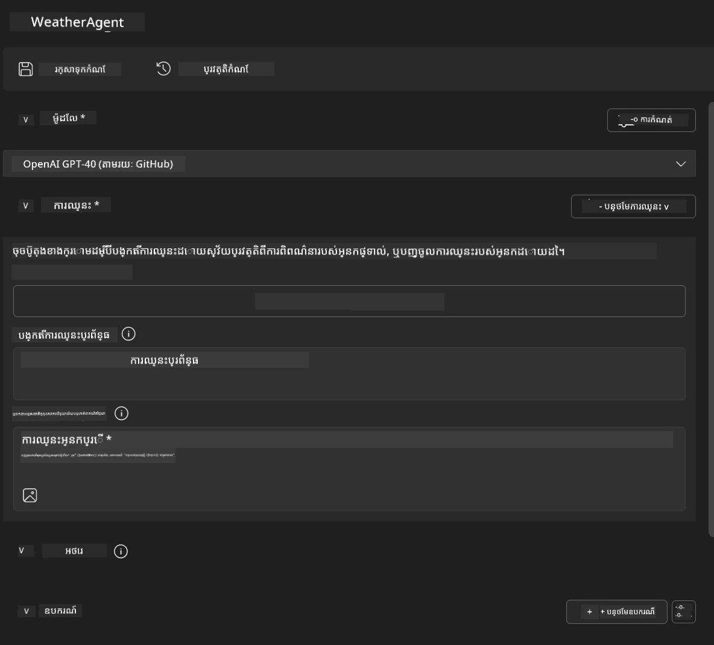
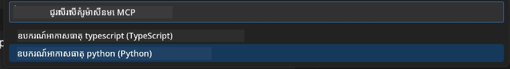
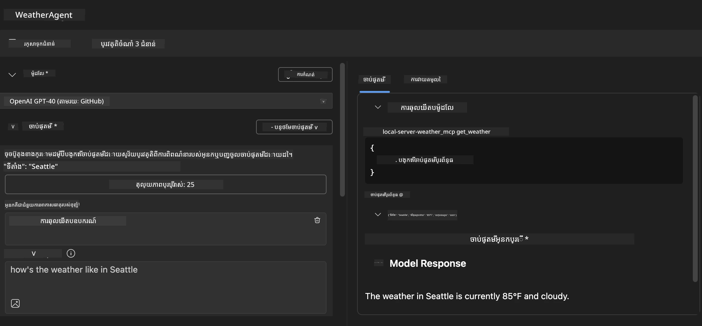
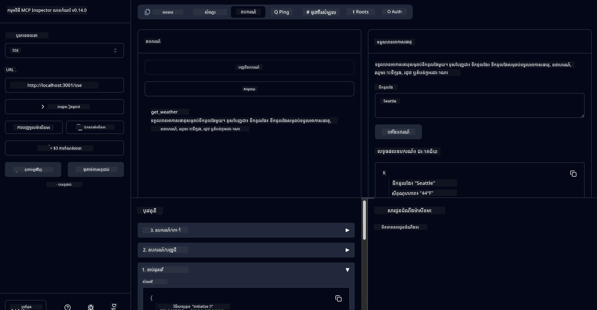

# 🔧 ម៉ូឌុល 3៖ ការអភិវឌ្ឍ MCP កម្រិតខ្ពស់ ជាមួយ Microsoft Foundry Toolkit

> [!NOTE]
> URLs របស់ Inspector ក្នុងមLaboratoryនេះប្រើ​ចុងបំផុត `/sse` ដែលមានមូលដ្ឋានយកលើ
> MCP SDK ជា​ទំនើប `1.9.3` និង Inspector `0.14.0` ដែលបានតំឡើង។ ពួកវាមិនមែនជា
> ឧទាហរណ៍ Streamable HTTP នៃកាលបរិច្ឆេទ `2026-07-28` ទេ។


## 🎯 គោលបំណងការសិក្សា

ចុងបញ្ចប់មLaboratoryនេះ អ្នកនឹងអាចធ្វើបាន៖

- ✅ បង្កើតម៉ាស៊ីនមេ MCP ផ្ទាល់ខ្លួន ដោយប្រើ Microsoft Foundry Toolkit
- ✅ កំណត់ការកំណត់និងប្រើ MCP Python SDK ថ្មីបំផុត (v1.9.3)
- ✅ ដំឡើង និងប្រើ MCP Inspector សម្រាប់ការត្រួតពិនិត្យកំហុស
- ✅ ពិនិត្យកំហុសម៉ាស៊ីនមេ MCP ក្នុងបរិយាកាស Agent Builder និង Inspector
- ✅ យល់ដឹងអំពីដំណើរការអភិវឌ្ឍម៉ាស៊ីនមេ MCP កម្រិតខ្ពស់

## 📋 តម្រូវការលក្ខណះជាមុន

- បានបញ្ចប់មLaboratory 2 (មូលដ្ឋាន MCP)
- VS Code មានកម្មវិធីបន្ថែម Microsoft Foundry Toolkit
- បរិយាកាស Python 3.10 ឬខ្ពស់ជាងនេះ
- Node.js និង npm សម្រាប់ការដំឡើង Inspector

## 🏗️ អ្វីដែលអ្នកនឹងបង្កើត

ក្នុងមLaboratoryនេះ អ្នកនឹងបង្កើត **ម៉ាស៊ីនមេ Weather MCP** ដែលបង្ហាញពី៖
- ការអនុវត្តម៉ាស៊ីនមេ MCP ផ្ទាល់ខ្លួន
- ការរួមបញ្ចូលជាមួយ Microsoft Foundry Toolkit Agent Builder
- ដំណើរការត្រួតពិនិត្យកំហុសប្រកបដោយវិជ្ជាជីវៈ
- គំរូការប្រើ MCP SDK មេដឹកនាំទំនើប

---

## 🔧 សមាសធាតុស្នូលរួម

### 🐍 MCP Python SDK
MCP Python SDK ជាបេដ្ឋការ​សម្រាប់សាងសង់ម៉ាស៊ីនមេ MCP ផ្ទាល់ខ្លួន។ អ្នកនឹងប្រើព版本 1.9.3 ដែលមានសមត្ថភាពត្រួតពិនិត្យកំហុសកាន់តែខ្លាំង។

### 🔍 MCP Inspector
គ្រឿងมហិមាសម្រាប់ត្រួតពិនិត្យកំហុស ដែលផ្ដល់ជូន៖
- ការត្រួតពិនិត្យម៉ាស៊ីនមេនៅពេលពិត
- វីឌីអូបង្ហាញដំណើរការឧបករណ៍
- ការត្រួតពិនិត្យសំណើ/ចម្លើយបណ្តាញ
- បរិយាកាសសាកល្បងអន្តរកម្ម

---

## 📖 ដំណាក់កាលអនុវត្តន៍ជារៀងរាល់ជំហាន

### ជំហាន 1៖ បង្កើត WeatherAgent ក្នុង Agent Builder

1. **ចាប់ផ្ដើម Agent Builder** ក្នុង VS Code តាមរយៈកម្មវិធីបន្ថែម Microsoft Foundry Toolkit
2. **បង្កើតភ្នាក់ងារ​ថ្មី** ដែលមានការកំណត់ដូចខាងក្រោម៖
   - អ្នកភ្នាក់ងារ៖ `WeatherAgent`



### ជំហាន 2៖ ចាប់ផ្ដើមគម្រោងម៉ាស៊ីនមេ MCP

1. **ទៅកាន់ Tools** → **Add Tool** ក្នុង Agent Builder
2. **ជ្រើស "MCP Server"** ពីជម្រើសដែលមាន
3. **ជ្រើស "Create A new MCP Server"**
4. **ជ្រើសប្លង់ `python-weather`**
5. **ឲ្យឈ្មោះម៉ាស៊ីនមេរបស់អ្នក៖** `weather_mcp`



### ជំហាន 3៖ បើក និង ពិនិត្យគម្រោង

1. **បើកគម្រោងដែលបានបង្កើត** នៅ VS Code
2. **ពិនិត្យរចនាសម្ព័ន្ធគម្រោង៖**
   ```
   weather_mcp/
   ├── src/
   │   ├── __init__.py
   │   └── server.py
   ├── inspector/
   │   ├── package.json
   │   └── package-lock.json
   ├── .vscode/
   │   ├── launch.json
   │   └── tasks.json
   ├── pyproject.toml
   └── README.md
   ```

### ជំហាន 4៖ វានៅ MCP SDK ថ្មីបំផុត

> **🔍 ហេតុអ្វីការវានៅ?** យើងចង់ប្រើ MCP SDK ថ្មីបំផុត (v1.9.3) និងសេវាកម្ម Inspector (0.14.0) សម្រាប់មុខងារការពារល្អនិងសមត្ថភាពត្រួតពិនិត្យកំហុសកាន់តែខ្លាំង។

#### 4a. កែប្រែការគាំទ្រពី Python

**កែប្រែ `pyproject.toml`:** កែប្រែ [./code/weather_mcp/pyproject.toml](../../../../10-StreamliningAIWorkflowsBuildingAnMCPServerWithAIToolkit/lab3/code/weather_mcp/pyproject.toml)


#### 4b. កែប្រែការកំណត់ Inspector

**កែប្រែ `inspector/package.json`:** កែប្រែ [./code/weather_mcp/inspector/package.json](../../../../10-StreamliningAIWorkflowsBuildingAnMCPServerWithAIToolkit/lab3/code/weather_mcp/inspector/package.json)

#### 4c. កែប្រែការគាំទ្ររបស់ Inspector

**កែប្រែ `inspector/package-lock.json`:** កែប្រែ [./code/weather_mcp/inspector/package-lock.json](../../../../10-StreamliningAIWorkflowsBuildingAnMCPServerWithAIToolkit/lab3/code/weather_mcp/inspector/package-lock.json)

> **📝 សម្គាល់:** ឯកសារនេះមានការបញ្ជាក់លម្អិតអំពីការគាំទ្រជាច្រើន។ ខាងក្រោមជារចនាសម្ព័ន្ធសំខាន់ - អត្ថបទពេញលេញធានាការដោះស្រាយការគាំទ្រយ៉ាងត្រឹមត្រូវ។


> **⚡ ប្រូសេកល្បាប់ពេញលេញ៖** ផ្តល់ឯកសារ package-lock.json ពេញលេញ មានជួរដេកប្រហែល 3000 សម្រាប់ការគាំទ្រជាប្រភេទ។ ខាងលើបង្ហាញរចនាសម្ព័ន្ធសំខាន់ - សូមប្រើឯកសារដែលផ្តល់សម្រាប់ការដោះស្រាយការគាំទ្រពេញលេញ។

### ជំហាន 5៖ កំណត់ការត្រួតពិនិត្យកំហុស VS Code

*សំគាល់៖ សូមចម្លងឯកសារនៅផ្លូវដែលបញ្ជាក់ទៅជំនួសឯកសារកណ្ដាលក្នុងស្រុក*

#### 5a. កែប្រែការកំណត់ចាប់ផ្ដើម

**កែប្រែ `.vscode/launch.json`:**

```json
{
  "version": "0.2.0",
  "configurations": [
    {
      "name": "Attach to Local MCP",
      "type": "debugpy",
      "request": "attach",
      "connect": {
        "host": "localhost",
        "port": 5678
      },
      "presentation": {
        "hidden": true
      },
      "internalConsoleOptions": "neverOpen",
      "postDebugTask": "Terminate All Tasks"
    },
    {
      "name": "Launch Inspector (Edge)",
      "type": "msedge",
      "request": "launch",
      "url": "http://localhost:6274?timeout=60000&serverUrl=http://localhost:3001/sse#tools",
      "cascadeTerminateToConfigurations": [
        "Attach to Local MCP"
      ],
      "presentation": {
        "hidden": true
      },
      "internalConsoleOptions": "neverOpen"
    },
    {
      "name": "Launch Inspector (Chrome)",
      "type": "chrome",
      "request": "launch",
      "url": "http://localhost:6274?timeout=60000&serverUrl=http://localhost:3001/sse#tools",
      "cascadeTerminateToConfigurations": [
        "Attach to Local MCP"
      ],
      "presentation": {
        "hidden": true
      },
      "internalConsoleOptions": "neverOpen"
    }
  ],
  "compounds": [
    {
      "name": "Debug in Agent Builder",
      "configurations": [
        "Attach to Local MCP"
      ],
      "preLaunchTask": "Open Agent Builder",
    },
    {
      "name": "Debug in Inspector (Edge)",
      "configurations": [
        "Launch Inspector (Edge)",
        "Attach to Local MCP"
      ],
      "preLaunchTask": "Start MCP Inspector",
      "stopAll": true
    },
    {
      "name": "Debug in Inspector (Chrome)",
      "configurations": [
        "Launch Inspector (Chrome)",
        "Attach to Local MCP"
      ],
      "preLaunchTask": "Start MCP Inspector",
      "stopAll": true
    }
  ]
}
```

**កែប្រែ `.vscode/tasks.json`:**

```
{
  "version": "2.0.0",
  "tasks": [
    {
      "label": "Start MCP Server",
      "type": "shell",
      "command": "python -m debugpy --listen 127.0.0.1:5678 src/__init__.py sse",
      "isBackground": true,
      "options": {
        "cwd": "${workspaceFolder}",
        "env": {
          "PORT": "3001"
        }
      },
      "problemMatcher": {
        "pattern": [
          {
            "regexp": "^.*$",
            "file": 0,
            "location": 1,
            "message": 2
          }
        ],
        "background": {
          "activeOnStart": true,
          "beginsPattern": ".*",
          "endsPattern": "Application startup complete|running"
        }
      }
    },
    {
      "label": "Start MCP Inspector",
      "type": "shell",
      "command": "npm run dev:inspector",
      "isBackground": true,
      "options": {
        "cwd": "${workspaceFolder}/inspector",
        "env": {
          "CLIENT_PORT": "6274",
          "SERVER_PORT": "6277",
        }
      },
      "problemMatcher": {
        "pattern": [
          {
            "regexp": "^.*$",
            "file": 0,
            "location": 1,
            "message": 2
          }
        ],
        "background": {
          "activeOnStart": true,
          "beginsPattern": "Starting MCP inspector",
          "endsPattern": "Proxy server listening on port"
        }
      },
      "dependsOn": [
        "Start MCP Server"
      ]
    },
    {
      "label": "Open Agent Builder",
      "type": "shell",
      "command": "echo ${input:openAgentBuilder}",
      "presentation": {
        "reveal": "never"
      },
      "dependsOn": [
        "Start MCP Server"
      ],
    },
    {
      "label": "Terminate All Tasks",
      "command": "echo ${input:terminate}",
      "type": "shell",
      "problemMatcher": []
    }
  ],
  "inputs": [
    {
      "id": "openAgentBuilder",
      "type": "command",
      "command": "ai-mlstudio.agentBuilder",
      "args": {
        "initialMCPs": [ "local-server-weather_mcp" ],
        "triggeredFrom": "vsc-tasks"
      }
    },
    {
      "id": "terminate",
      "type": "command",
      "command": "workbench.action.tasks.terminate",
      "args": "terminateAll"
    }
  ]
}
```


---

## 🚀 រត់ និង សាកល្បងម៉ាស៊ីនមេ MCP របស់អ្នក

### ជំហាន 6៖ ដំឡើងការគាំទ្រ

បន្ទាប់ពីធ្វើការកែប្រែការកំណត់ អ្នកអាចដំណើរការ​ពាក្យបញ្ជាដូចតទៅ៖

**ដំឡើងការគាំទ្រ Python:**
```bash
uv sync
```

**ដំឡើងការគាំទ្រ Inspector:**
```bash
cd inspector
npm install
```

### ជំហាន 7៖ ត្រួតពិនិត្យកំហុសជាមួយ Agent Builder

1. **ចុច F5** ឬប្រើ ការកំណត់ **"Debug in Agent Builder"**
2. **ជ្រើសការកំណត់ផ្សំ** ពីផ្ទាំងត្រួតពិនិត្យកំហុស
3. **រង់ចាំម៉ាស៊ីនមេចាប់ផ្តើម** ហើយបើក Agent Builder
4. **សាកល្បងម៉ាស៊ីនមេ weather MCP របស់អ្នក** ជាមួយការសួរជាគ្រាន់តែភាសาธรรมชาติ

បញ្ចូលពាក្យស្នើសុំដូចនេះ

SYSTEM_PROMPT

```
You are my weather assistant
```

USER_PROMPT

```
How's the weather like in Seattle
```



### ជំហាន 8៖ ត្រួតពិនិត្យកំហុសជាមួយ MCP Inspector

1. **ប្រើការកំណត់ "Debug in Inspector"** (Edge ឬ Chrome)
2. **បើកផ្ទាំង Inspector** នៅ `http://localhost:6274`
3. **សืบស្រាវជ្រាវបរិយាកាសសាកល្បងអន្តរកម្ម៖**
   - មើលឧបករណ៍ដែលមាន
   - សាកល្បងការប្រតិបត្ដិការឧបករណ៍
   - ត្រួតពិនិត្យសំណើបណ្តាញ
   - ត្រួតពិនិត្យចម្លើយម៉ាស៊ីនមេ



---

## 🎯 លទ្ធផលសិក្សាដ៏សំខាន់

ដោយបានបញ្ចប់មLaboratoryនេះ អ្នកបាន៖

- [x] **បានបង្កើតម៉ាស៊ីនមេ MCP ផ្ទាល់ខ្លួន** ដោយប្រើប្លង់ Microsoft Foundry Toolkit
- [x] **បានវានៅ MCP SDK ថ្មីបំផុត** (v1.9.3) សម្រាប់មុខងារកាន់តែល្អ
- [x] **បានកំណត់ដំណើរការត្រួតពិនិត្យកំហុសវិជ្ជាជីវៈ** ទាំង Agent Builder និង Inspector
- [x] **បានដំឡើង MCP Inspector** សម្រាប់សាកល្បងម៉ាស៊ីនមេអន្តរកម្ម
- [x] **បានចេះការកំណត់ត្រួតពិនិត្យកំហុស VS Code** សម្រាប់ការអភិវឌ្ឍ MCP

## 🔧 មុខងារកម្រិតខ្ពស់ដែលបានស្ទុះស្ទាវ

| មុខងារ | សេចក្ដីពិពណ៌នា | ករណីប្រើប្រាស់ |
|---------|-------------|----------|
| **MCP Python SDK v1.9.3** | ការអនុវត្តពិធីការថ្មីបំផុត | ការអភិវឌ្ឍម៉ាស៊ីនមេទំនើប |
| **MCP Inspector 0.14.0** | ឧបករណ៍ត្រួតពិនិត្យកំហុសអន្តរាគមន៍ | សាកល្បងម៉ាស៊ីនមេពេលពិត |
| **VS Code Debugging** | បរិយាកាសការអភិវឌ្ឍបញ្ចូល | ដំណើរការត្រួតពិនិត្យកំហុសវិជ្ជាជីវៈ |
| **Agent Builder Integration** | ការតភ្ជាប់ផ្ទាល់ Microsoft Foundry Toolkit | សាកល្បងភ្នាក់ងារចុងក្រោយ |

## 📚 ជំនួយផ្នែកបន្ថែម

- [ឯកសារ MCP Python SDK](https://modelcontextprotocol.io/docs/sdk/python)
- [មគ្គុទេសក៍ Microsoft Foundry Toolkit Extension](https://code.visualstudio.com/docs/ai/ai-toolkit)
- [ឯកសារត្រួតពិនិត្យកំហុស VS Code](https://code.visualstudio.com/docs/editor/debugging)
- [លក្ខណៈបំណុល Model Context Protocol](https://modelcontextprotocol.io/docs/concepts/architecture)

---

**🎉 សូមអបអរសាទរ!** អ្នកបានបញ្ចប់មLaboratory 3 សម្រេចបានជោគជ័យ ហើយឥឡូវនេះអាចបង្កើត, ត្រួតពិនិត្យកំហុស, និងចែកចាយម៉ាស៊ីនមេ MCP ផ្ទាល់ខ្លួនដោយប្រើដំណើរការអភិវឌ្ឍវិជ្ជាជីវៈ។

### 🔜 បន្តទៅម៉ូឌុលបន្ទាប់

តើអ្នកបានរួចពីការប្រើជំនាញ MCP របស់អ្នកក្នុងដំណើរការអភិវឌ្ឍពិតប្រាកដហើយទេ? បន្តទៅ **[ម៉ូឌុល 4៖ ការអភិវឌ្ឍ MCP ជាក់ស្តែង - ម៉ាស៊ីនមេ GitHub Clone ផ្ទាល់ខ្លួន](../lab4/README.md)** ដែលនៅទីនោះអ្នកនឹងបាន៖
- បង្កើតម៉ាស៊ីនមេ MCP សម្រាប់ផលិតកម្ម ដែលធ្វើស្វ័យប្រវត្តិប្រតិបត្តិការជាមួយ GitHub repository
- អនុវត្តមុខងារចម្លង GitHub repository តាមរយៈ MCP
- បញ្ចូលម៉ាស៊ីនមេ MCP ផ្ទាល់ខ្លួនជាមួយ VS Code និង GitHub Copilot Agent Mode
- សាកល្បង និងចែកចាយម៉ាស៊ីនមេ MCP ផ្ទាល់ខ្លួនក្នុងបរិយាកាសផលិតកម្ម
- រៀនដំណើរការស្វ័យប្រវត្តិក្នុងការអភិវឌ្ឍន៍

---

<!-- CO-OP TRANSLATOR DISCLAIMER START -->
**ការបដិសេធ**:
ឯកសារនេះត្រូវបានបម្លែងភាសា ដោយប្រើសេវាបម្លែងភាសា AI [Co-op Translator](https://github.com/Azure/co-op-translator)។ ទោះយើងខ្ញុំមានក្តីប្រាថ្នាឱ្យបានច្បាស់លាស់ តែសូមយល់ដឹងថាការបម្លែងដោយស្វ័យប្រវត្តិក៏អាចមានកំហុសឬភាពមិនត្រឹមត្រូវ។ ឯកសារដើមជាភាសាទីតាំងគួរត្រូវបានគេប្រើជាប្រភពច្បាស់លាស់។ សម្រាប់ព័ត៌មានសំខាន់ៗ សូមណែនាំឱ្យប្រើប្រាស់ការប្រែដោយមនុស្សជំនាញ។ យើងខ្ញុំមិនទទួលខុសត្រូវចំពោះការយល់ច្រឡំ ឬការបកស្រាយខុសបន្ទាប់ពីការប្រើប្រាស់ការបម្លែងនេះនោះទេ។
<!-- CO-OP TRANSLATOR DISCLAIMER END -->