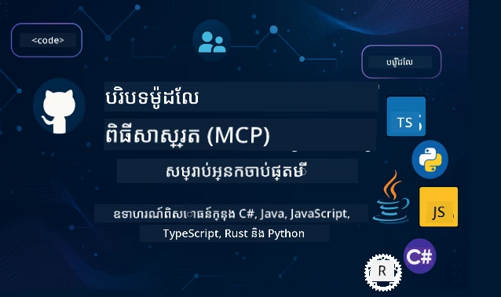

 

[](https://GitHub.com/microsoft/mcp-for-beginners/graphs/contributors)
[](https://GitHub.com/microsoft/mcp-for-beginners/issues)
[](https://GitHub.com/microsoft/mcp-for-beginners/pulls)
[](http://makeapullrequest.com)
[](https://mcptoplist.com/server/mcp.so%2Fmcp-for-beginners%2Fmicrosoft)

[](https://GitHub.com/microsoft/mcp-for-beginners/watchers)
[](https://GitHub.com/microsoft/mcp-for-beginners/fork)
[](https://GitHub.com/microsoft/mcp-for-beginners/stargazers)


[](https://discord.gg/nTYy5BXMWG)

អនុវត្តតាមជំហានទាំងនេះដើម្បីចាប់ផ្តើមប្រើធនធានទាំងនេះ៖
1. **Fork the Repository**: ចុច [](https://GitHub.com/microsoft/mcp-for-beginners/fork)
2. **Clone the Repository**:   `git clone https://github.com/microsoft/mcp-for-beginners.git`
3. **Join The** [](https://discord.gg/nTYy5BXMWG)


### 🌐 ការគាំទ្រជាច្រើនភាសា

#### គាំទ្រតាមរយៈ GitHub Action (ស្វ័យប្រវត្តិ និងតែងតែមានភាពទាន់សម័យ)

<!-- CO-OP TRANSLATOR LANGUAGES TABLE START -->
[Arabic](../ar/README.md) | [Bengali](../bn/README.md) | [Bulgarian](../bg/README.md) | [Burmese (Myanmar)](../my/README.md) | [Chinese (Simplified)](../zh-CN/README.md) | [Chinese (Traditional, Hong Kong)](../zh-HK/README.md) | [Chinese (Traditional, Macau)](../zh-MO/README.md) | [Chinese (Traditional, Taiwan)](../zh-TW/README.md) | [Croatian](../hr/README.md) | [Czech](../cs/README.md) | [Danish](../da/README.md) | [Dutch](../nl/README.md) | [Estonian](../et/README.md) | [Finnish](../fi/README.md) | [French](../fr/README.md) | [German](../de/README.md) | [Greek](../el/README.md) | [Hebrew](../he/README.md) | [Hindi](../hi/README.md) | [Hungarian](../hu/README.md) | [Indonesian](../id/README.md) | [Italian](../it/README.md) | [Japanese](../ja/README.md) | [Kannada](../kn/README.md) | [Khmer](./README.md) | [Korean](../ko/README.md) | [Lithuanian](../lt/README.md) | [Malay](../ms/README.md) | [Malayalam](../ml/README.md) | [Marathi](../mr/README.md) | [Nepali](../ne/README.md) | [Nigerian Pidgin](../pcm/README.md) | [Norwegian](../no/README.md) | [Persian (Farsi)](../fa/README.md) | [Polish](../pl/README.md) | [Portuguese (Brazil)](../pt-BR/README.md) | [Portuguese (Portugal)](../pt-PT/README.md) | [Punjabi (Gurmukhi)](../pa/README.md) | [Romanian](../ro/README.md) | [Russian](../ru/README.md) | [Serbian (Cyrillic)](../sr/README.md) | [Slovak](../sk/README.md) | [Slovenian](../sl/README.md) | [Spanish](../es/README.md) | [Swahili](../sw/README.md) | [Swedish](../sv/README.md) | [Tagalog (Filipino)](../tl/README.md) | [Tamil](../ta/README.md) | [Telugu](../te/README.md) | [Thai](../th/README.md) | [Turkish](../tr/README.md) | [Ukrainian](../uk/README.md) | [Urdu](../ur/README.md) | [Vietnamese](../vi/README.md)

> **ចូលចិត្ត Clone នូវឯកសារក្នុងកុំព្យូទ័ររបស់អ្នក?**
>
> អ្នកគ្រប់គ្រងនេះមានការប្រែប្រួលជាភាសាច្រើនជាង ៥០ ដែលធ្វើអោយទំហំការទាញយកធំជាងមុនច្រើន។ ដើម្បី clone ដោយគ្មានការប្រែភាសា សូមប្រើ sparse checkout៖
>
> **Bash / macOS / Linux:**
> ```bash
> git clone --filter=blob:none --sparse https://github.com/microsoft/mcp-for-beginners.git
> cd mcp-for-beginners
> git sparse-checkout set --no-cone '/*' '!translations' '!translated_images'
> ```
>
> **CMD (Windows):**
> ```cmd
> git clone --filter=blob:none --sparse https://github.com/microsoft/mcp-for-beginners.git
> cd mcp-for-beginners
> git sparse-checkout set --no-cone "/*" "!translations" "!translated_images"
> ```
>
> វានាំមកនូវអ្វីដែលអ្នកត្រូវការទាំងអស់ដើម្បីបញ្ចប់វគ្គនេះជាមួយនឹងការទាញយកដែលលឿនជាងមុន។
<!-- CO-OP TRANSLATOR LANGUAGES TABLE END -->

# 🚀 វគ្គសិក្សា Model Context Protocol (MCP) សម្រាប់អ្នកចាប់ផ្តើម

## **រៀន MCP ជាមួយឧទាហរណ៍កូដដំណើរការផ្ទាល់​ក្នុង C#, Java, JavaScript, Rust, Python និង TypeScript**

## 🧠 ទិដ្ឋភាពទូទៅនៃវគ្គសិក្សា Model Context Protocol
សូមស្វាគមន៍មកកាន់ការធ្វើដំណើររបស់អ្នកចូលទៅក្នុង Model Context Protocol! ប្រសិនបើអ្នកធ្លាប់ធ្វើការសួរថា តើយ៉ាងដូចម្តេចដែលកម្មវិធី AI ទំនាក់ទំនងជាមួយឧបករណ៍និងសេវាកម្មផ្សេងៗ អ្នកកំពុងនឹងរកឃើញដំណោះស្រាយវែងស្លូតដែលកំពុងផ្លាស់ប្ដូរប្រភេទនៃការប្រើប្រាស់ស៊ីស្ទាំអាចញ្ញាពីរបស់អ្នកអភិវឌ្ឍន៍។

សូមគិតថា MCP ជាអ្នកបកប្រែទូទៅសម្រាប់កម្មវិធី AI - ដូចជារបរបផ្សេងៗនៃ USB អនុញ្ញាតឱ្យអ្នកភ្ជាប់ឧបករណ៍ណាមួយទៅកាន់កុំព្យូទ័ររបស់អ្នក MCP អនុញ្ញាតឱ្យម៉ូដែល AI ភ្ជាប់ទៅឧបករណ៍ ឬសេវាកម្មណាមួយដោយវិធីស្ដង់ដារ។ មិនថាអ្នកកំពុងបង្កើត chatbot ជំនាន់ដំបូងរបស់អ្នក ឬកំពុងបង្កើត workflow AI ស្មុគស្មាញ ការយល់ដឹងអំពី MCP នឹងផ្តល់ថាមពលដល់អ្នកក្នុងការបង្កើតកម្មវិធីមានសមត្ថភាពខ្ពស់និងអាចបត់បែនបាន។

វគ្គសិក្សានេះបានរចនាឡើងដោយមានការអះអាងនិងការយកចិត្តទុកដាក់ចំពោះដំណើរការសិក្សារបស់អ្នក។ យើងនឹងចាប់ផ្តើមជាមួយគំនិតតូចៗដែលអ្នកបានយល់ហើយ ហើយដំណើរការជំនាញរបស់អ្នកដោយហាត់ដើម្បីអនុវត្តនៅក្នុងភាសាកម្មវិធីដែលអ្នកចូលចិត្ត។ រាល់ជំហានមានការពន្យល់ច្បាស់ អត្ថាធិប្បាយអនុវត្តន៏ និងការលើកទឹកចិត្តជាច្រើននៅក្នុងដំណើរនោះ។

នៅពេលអ្នកបញ្ចប់ដំណើរនេះ អ្នកនឹងមានការជឿជាក់ក្នុងការបង្កើតម៉ាស៊ីនបម្រើ MCP របស់អ្នកដោយផ្ទាល់ បញ្ចូលវាតាមជាមួយវេទិកា AI ប្រជាជននិងយល់ដឹងពីរបៀបបច្ចេកវិទ្យានេះកំពុងបម្លែងអនាគតនៃការអភិវឌ្ឍ AI។ យើងចាប់ផ្តើមការផ្សងផ្គាលគួរឲ្យរំភើបនេះជាមួយគ្នា!

### ឯកសារផ្លូវការនិងបញ្ជាក់លំអិត

វគ្គសិក្សានេះស្របទៅនឹង **លក្ខណៈបច្ចេកទេស MCP 2025-11-25** (កំណែចុងក្រោយដែលមានស្ថិរភាព)។ លក្ខណៈបច្ចេកទេស MCP ប្រើវិធីសាស្រ្តកំណែផ្អែកលើកាលបរិច្ឆេទ (ទ្រង់ទ្រាយ YYYY-MM-DD) ដើម្បីធានាការតាមដានកំណែប្រតិបត្តិការគ្រប់គ្រងបានច្បាស់លាស់។

> **មើលទៅមុខ:** កំណែប្រកាសមួយសម្រាប់លក្ខណៈបច្ចេកទេសបន្ទាប់, **2026-07-28**, ត្រូវបានគ្រោងចេញក្នុងថ្ងៃទី 28 ខែកក្កដា ឆ្នាំ 2026។ វាធ្វើឱ្យប្រព័ន្ធគ្រប់គ្រងប្រតិបត្តិការមានសភាពអស្ថិរភាពនៅឡើងទូទៅ, រឹតបន្តឹងគម្រោងបន្ថែម (កម្មវិធី MCP, កិច្ចការណ៍), រឹតបន្តឹងការអាជ្ញាប័ណ្ណ, និងលុបចោល Roots, Sampling, និង Logging។ សូមមើល [តើអ្វីដែលកំពុងផ្លាស់ប្តូរនៅ MCP: កំណែប្រកាស 2026-07-28](./01-CoreConcepts/mcp-2026-07-28-release-candidate.md) សម្រាប់ការបង្ហាញលម្អិតពេញលេញ។

ធនធានទាំងនេះមានតម្លៃកាន់តែលើសបើអ្នកយល់ដឹងកាន់តែល្អ ប៉ុន្តែមិនត្រូវភ័យក្នុងការអានទាំងអស់ភ្លាមៗទេ។ ចាប់ផ្តើមចំណុចដែលអ្នកមានចំណាប់អារម្មណ៍ជាមុន!
- 📘 [ឯកសារ MCP](https://modelcontextprotocol.io/) – នេះជាពពួកហង្សរបស់អ្នកសម្រាប់មេរៀនជាបន្តបន្ទាប់និងមគ្គុទ្ទេសក៍អ្នកប្រើប្រាស់។ ឯកសារត្រូវបានសរសេរដោយគិតពីអ្នកចាប់ផ្តើម ដោយផ្តល់ឧទាហរណ៍ច្បាស់លាស់ដែលអ្នកអាចរៀនតាមដានក្នុងខ្លួនអ្នក។
- 📜 [លក្ខណៈបច្ចេកទេស MCP](https://modelcontextprotocol.io/specification/2025-11-25) – សូមគិតថាវាជាគ្រឿងឧបករណ៍យោងទាំងមូលរបស់អ្នក។ នៅពេលដែលអ្នកបញ្ចប់វគ្គសិក្សា អ្នកនឹងត្រូវតែត្រឡប់មកទីនេះដើម្បីមើលព័ត៌មានបន្ថែម និងស្វែងយល់លក្ខណៈពិសេស។
- 📜 [ការកំណត់កំណែលក្ខណៈបច្ចេកទេស MCP](https://modelcontextprotocol.io/specification/versioning) – មានព័ត៌មានអំពីប្រវត្តិកំណែប្រតិបត្តិកម្ម និងរបៀបដែល MCP ប្រើការកំណែផ្អែកលើកាលបរិច្ឆេទ (ទ្រង់ទ្រាយ YYYY-MM-DD)។
- 🧑‍💻 [ឃ្លាំង MCP GitHub](https://github.com/modelcontextprotocol) – ទីនេះអ្នកនឹងរកឃើញ SDKs, ឧបករណ៍, និងឧទាហរណ៍កូដជា​ភាសាកម្មវិធីច្រើន។ វាជាដើមទុនសៀវភៅមួយផ្តល់ឧទាហរណ៍ជាក់ស្តែង និងសមាសធាតុដែលអាចប្រើប្រាស់បានភ្លាម។
- 🌐 [សហគមន៍ MCP](https://github.com/orgs/modelcontextprotocol/discussions) – ចូលរួមជាមួយអ្នករៀននិងអភិវឌ្ឍន៍ដែលមានបទពិសោធន៍ក្នុងការពិភាក្សាអំពី MCP។ វាជាសហគមន៍គាំទ្រដែលការសួរបញ្ហាត្រូវបានស្វាគមន៍និងចែករំលែកចំណេះដឹងដោយសេរី។
  
## គោលបំណងការសិក្សា

នៅចុងវគ្គនេះ អ្នកនឹងមានការជឿជាក់និងរីករាយចំពោះជំនាញថ្មីរបស់អ្នក។ របស់ខាងក្រោមជាអ្វីដែលអ្នកនឹងទទួលបាន៖

• **យល់ដឹងអំពីមូលដ្ឋាន MCP**: អ្នកនឹងយល់ថា Model Context Protocol ជាអ្វី ហើយហេតុអ្វីបានជា វាកំពុងបំលែងរបៀបដែលកម្មវិធី AI ប្រាស្រ័យទាក់ទងគ្នា ដោយប្រើការប្រៀបធៀបនិងឧទាហរណ៍ដែលយល់បាន។

• **បង្កើតម៉ាស៊ីនបម្រើ MCP ជាដំបូងរបស់អ្នក**: អ្នកនឹងបង្កើតម៉ាស៊ីនបម្រើ MCP ដែលដំណើរការបានក្នុងភាសាកម្មវិធីដែលអ្នកចូលចិត្ត ចាប់ផ្តើមពីឧទាហរណ៍សាមញ្ញ ហើយបន្តអភិវឌ្ឍជំនាញទៅមុខមួយជំហាន។

• **ភ្ជាប់ម៉ូដែល AI ទៅឧបករណ៍ពិតប្រាកដ**: អ្នកនឹងរៀនពីរបៀបស្ពានរវាងម៉ូដែល AI និងសេវាកម្មពិត ដើម្បីផ្តល់សមត្ថភាពថ្មីមិនធម្មតាដល់កម្មវិធីរបស់អ្នក។

• **អនុវត្តវិធីសាស្រ្តសន្តិសុខល្អបំផុត**: អ្នកនឹងយល់ពីរបៀបរក្សា MCP របស់អ្នកឲ្យមានសុវត្ថិភាព និងការពារ កម្មវិធីរបស់អ្នកនិងអ្នកប្រើប្រាស់។

• **ដាក់ប្រើជាមួយភាពទុកចិត្ត**: អ្នកនឹងដឹងពីរបៀបយកគម្រោង MCP របស់អ្នកពីអភិវឌ្ឍន៍ទៅផលិតកម្ម ជាមួយយុទ្ធសាស្ត្រដាក់ប្រើដែលអាចប្រើបានក្នុងពិភពលោកពិត។

• **ចូលរួមក្នុងសហគមន៍ MCP**: អ្នកនឹងក្លាយជាផ្នែកមួយនៃសហគមន៍អ្នកអភិវឌ្ឍន៍កំពុងលូតលាស់ ដែលកំពុងរៀបចំអនាគតនៃការអភិវឌ្ឍកម្មវិធី AI។

## ផ្លូវខ្សែយល់ដឹងជាគន្លងមូលដ្ឋាន

មុនពេលយើងធ្វើជម្រេីសិនលើ MCP សូមប្រាកដថាអ្នកមានអារម្មណ៍ផាសុកភាពជាមួយគំនិតមូលដ្ឋានខ្លះៗ។ កុំបារម្ភប្រសិនបើអ្នកមិនមែនជាជាងអ្នកជំនាញនៅក្នុងដែននេះទេ - យើងនឹងពន្យល់អ្វីដែលអ្នកត្រូវការដឹងទៅតាមដំណើរ!

### យល់ដឹងអំពីប្រតិបត្តិការគ្រប់គ្រង (មូលដ្ឋាន)

សូមគិតប្រតិបត្តិការគ្រប់គ្រងជាដូចជាការកំណត់ច្បាប់សម្រាប់ការពិភាក្សា។ ពេលដែលអ្នកហៅមិត្តអ្នកស្រឡាញ់ អ្នកទាំងពីរពិតប្រាកដច្បាស់ក្នុងការប្រាប់ថា "សួស្តី" ពេលឆ្លើយ ត្រង់គ្នាទៅមរដ្ឋាយពីរដងហើយនិយាយ "លាហើយ" ពេលបញ្ចប់។ កម្មវិធីកុំព្យូទ័រត្រូវការច្បាប់ដូចគ្នាដើម្បីផ្ទេរព័ត៌មានបានយ៉ាងមានប្រសិទ្ធិភាព។

MCP គឺជាប្រតិបត្តិការគ្រប់គ្រងមួយ - ជាច្បាប់ដែលបានយល់ព្រមរួច ដើម្បីជួយម៉ូដែលនិងកម្មវិធី AI មាន "ការពិភាក្សា" ដោយមានប្រសិទ្ធភាពជាមួយឧបករណ៍និងសេវា។ ដូចជាការមានច្បាប់សម្រាប់ការពិភាក្សាធ្វើឲ្យការទំនាក់ទំនងមនុស្សមានភាពរលូន MCP បង្កើនភាពទុកចិត្តនិងសមត្ថភាពក្នុងការទំនាក់ទំនងកម្មវិធី AI។

### ទំនាក់ទំនងរវាង Client-Server (របៀបដែលកម្មវិធីធ្វើការជាមួយគ្នា)

អ្នកបានប្រើទំនាក់ទំនង client-server ជារៀងរាល់ថ្ងៃ! ពេលដែលអ្នកប្រើកម្មវិធីរុករកវេបសាយ (client) ដើម្បីចូលទៅកាន់គេហទំព័រ អ្នកកំពុងភ្ជាប់ទៅម៉ាស៊ីនបម្រើវេបសាយដែលផ្ញើមាតិកាទំព័រមកអ្នក។ កម្មវិធីរុករកចេះរបៀបសួរព័ត៌មាន ហើយម៉ាស៊ីនបម្រើចេះរបៀបផ្តល់ចំតប។

ក្នុង MCP យើងមានទំនាក់ទំនងដូចគ្នា: ម៉ូដែល AI មានតួនាទីជាកំណត់client ដែលស្នើសុំព័ត៌មាន ឬសកម្មភាព ខណៈម៉ាស៊ីនបម្រើ MCP ផ្តល់សមត្ថភាពទាំងនោះ។ វាដូចជាមានជួយមនុស្ស (ម៉ាស៊ីនបម្រើ) ដែល AI អាចស្នើឲ្យអនុវត្តបេសកកម្មជាក់លាក់។

### ហេតុអ្វីបានជាស្ដង់ដារ (ការធ្វើឲ្យអ្វីៗបានធ្វើការជាមួយគ្នា)

សូមនឹកឃើញថាប្រតិបត្តិករនៅក្នុងវិស័យផលិតរថយន្តម្នាក់ៗប្រើប្រដាប់បញ្ចូលប្រេងមានរាងខុសៗគ្នា - អ្នកនឹងត្រូវការឧបករណ៍បំលែងខុសៗគ្នាសម្រាប់រថយន្តម្នាក់ៗ! ស្ដង់ដារមើលថាត្រូវយល់ព្រមលើរបៀបធ្វើរួម ដើម្បីឲ្យវាធ្វើការជាមួយគ្នាបានរលូន។

MCP ផ្តល់នូវស្ដង់ដារនេះសម្រាប់កម្មវិធី AI។ ជំនួសពីម៉ូដែល AI មួយៗត្រូវការកូដឯកជនសម្រាប់ការប្រើជាមួយឧបករណ៍និមួយៗ MCP បង្កើតពិធីវិធីទូទៅសម្រាប់ពួកវាទាក់ទងគ្នា។ នេះមានន័យថាអ្នកអភិវឌ្ឍ អាចបង្កើតឧបករណ៍មួយលើក ហើយអោយវាធ្វើការជាមួយស៊ីស្តំ AI ច្រើនបាន។

## 🧭 ទិសដៅសិក្សារបស់អ្នក

ផ្លូវការរបស់ MCP របស់អ្នកបានរៀបចំយ៉ាងម៉ត់ចត់ ដើម្បីបង្កើនការជឿជាក់និងជំនាញយ៉ាងការផុសល្អជាលំដាប់។ ជំហានមួយៗណែនាំគំនិតថ្មី ខណៈពេលបង្កតម្លាភាពអ្វីដែលអ្នកបានរៀន។

### 🌱 ជំហានមូលដ្ឋាន៖ យល់ដឹងអំពីមូលដ្ឋាន (Module 0-2)

នេះជាកន្លែងដែលការផ្សងព្រេងរបស់អ្នកចាប់ផ្តើម! យើងនឹងណែនាំអ្នកអំពីគំនិត MCP ដោយប្រើការប្រៀបធៀបដែលល្ងង់ល្ងើនិងឧទាហរណ៍សាមញ្ញ។ អ្នកនឹងយល់ថា MCP ជាអ្វី ហើយហេតុអ្វីវាមាន និងរបៀបវាដំណើរការនៅក្នុងពិភពនៃការអភិវឌ្ឍ AI ទូលំទូលាយ។


• **ម៉ូឌុល 0 - សេចក្ដីផ្តើមពី MCP**៖ យើងនឹងចាប់ផ្តើមដោយស្វែងយល់ថា MCP ជាអ្វី និងហេតុអ្វីបានជា វាទទួលសំខាន់សម្រាប់កម្មវិធី AI សម័យថ្មី។ អ្នកនឹងបានឃើញឧទាហរណ៍ពិតពី MCP ក្នុងសកម្មភាព និងយល់ថាវាដោះស្រាយបញ្ហាដែលអ្នកអភិវឌ្ឍន៍ជួបប្រទៈយ៉ាងដូចម្តេច។

• **ម៉ូឌុល 1 - ឧត្តមគំនិតស្នូលបានពន្យល់**៖ នៅទីនេះ អ្នកនឹងមានឱកាសរៀនពីគ្រឿងបន្លាស់សំខាន់ៗរបស់ MCP។ យើងនឹងប្រើនិទាន និងឧទាហរណ៍វិឡេស្យវ ដើម្បីធានាថាគំនិតទាំងនេះមានអារម្មណ៍ធម្មតា និងអាចយល់បាន។

• **ម៉ូឌុល 2 - សុវត្ថិភាពក្នុង MCP**៖ សុវត្ថិភាពអាចលឺទៅជាការភ័យខ្លាច តែក្រុមយើងនឹងបង្ហាញអ្នកថា MCP មានមុខងារការពារសុវត្ថិភាពរួមបញ្ចូល ហើយបង្រៀនអំពីរបៀបល្អសម្រាប់ការការពារកម្មវិធីរបស់អ្នកចាប់ពីដើម។

### 🔨 ដំណាក់កាលសាងសង់៖ ការបង្កើតអនុវត្តន៍ដំបូងរបស់អ្នក (ម៉ូឌុល 3)

ឥឡូវនេះ ការកម្សាន្តពិតប្រាកដចាប់ផ្តើមហើយ! អ្នកនឹងទទួលបានបទពិសោធន៍ដៃគូសាងសង់ម៉ាស៊ីនមេ និងអ្នកប្រើ MCP ពិតប្រាកដ។ កុំបារម្ភ - យើងនឹងចាប់ផ្តើមពីរឿងសាមញ្ញ ហើយណែនាំអ្នកពីជំហាននីមួយៗ។

ម៉ូឌុលនេះមានមេរៀនជាច្រើនដែលអនុញ្ញាតឱ្យអ្នកហាត់នៅក្នុងភាសាកម្មវិធីដែលអ្នកចូលចិត្ត។ អ្នកនឹងបង្កើតម៉ាស៊ីនមេដំបូង រួចចាត់តែងអ្នកប្រើដើម្បីភ្ជាប់យ៉ាងបានល្អ ហើយទាំងបញ្ចូលជាមួយឧបករណ៍អភិវឌ្ឍន៍ពេញនិយមដូចជា VS Code។

ជាមេរៀននីមួយៗរួមបញ្ចូលឧទាហរណ៍កូដពេញលេញ ក្បួនដោះស្រាយបញ្ហា និងការពន្យល់ពីមូលហេតុដែលយើងអនុវត្តជ្រើសរើសរចនាប័ទ្មជាក់លាក់។ នៅចុងដំណាក់កាលនេះ អ្នកនឹងមានអនុវត្ត MCP ដែលដំណើរការបានដែលអ្នកអាចភាពជាមានសេចក្តីផ្អែមល្ហែម!

### 🚀 ដំណាក់កាលកើនឡើង៖ គំនិតជ្រៅ និងកម្មវិធីពិតប្រាកដ (ម៉ូឌុល 4-5)

បន្ទាប់ពីចេះមូលដ្ឋានហើយ អ្នកត្រៀមខ្លួនសម្រាប់ស្វែងយល់លក្ខណៈ MCP ដែលមានភាពស្មុគស្មាញកាន់តែខ្ពស់។ យើងនឹងគ្របដណ្តប់យុទ្ធសាស្រ្តអនុវត្តជាក់ស្តែង ក្បួនបញ្ហាបោះពុម្ព និងប្រធានបទជ្រៅដូចជា ការរួមបញ្ចូល AI អំពូលច្រើន។

អ្នកនឹងរៀនពីរបៀបបង្កើនសមត្ថភាពអនុវត្ត MCP របស់អ្នកសម្រាប់ប្រើប្រាស់ផលិតកម្ម និងបញ្ចូលជាមួយវេទិកាបង្ហោះក្នុងពពកដូចជា Azure។ ម៉ូឌុលទាំងនេះរៀបចំឱ្យអ្នកបង្កើតដំណោះស្រាយ MCP ដែលអាចទប់ទល់នឹងតម្រូវការពិតប្រាកដ។

### 🌟 ដំណាក់កាលជំនាញ៖ សហគមន៍ និងជំនាញពិសេស (ម៉ូឌុល 6-11)

ដំណាក់កាលចុងក្រោយផ្តោតលើការចូលរួមក្នុងសហគមន៍ MCP និងជំនាញក្នុងបរិបទដែលអ្នកចាប់អារម្មណ៍បំផុត។ អ្នកនឹងរៀនពីរបៀបចូលរួមក្នុងគម្រោងកូដប្រភពចំហ បង្កើតលំនាំអត្តសញ្ញាណប្រកបដោយជំនាញខ្ពស់ និងបង្កើតដំណោះស្រាយដែលភ្ជាប់ទិន្នន័យបានយ៉ាងទូលំទូលាយ។

ម៉ូឌុល 11 សម្តែងជាពិសេស - វាជាលំនាំរៀនដៃ 13 លាបពេញលេញដែលបង្រៀនអ្នកបង្កើតម៉ាស៊ីនមេ MCP ដែលមានការតភ្ជាប់ PostgreSQL សម្រាប់ផលិតកម្ម។ វាដូចជាប្រធានបទចុងក្រោយដែលបញ្ចូលគ្រប់អ្វីដែលអ្នកបានរៀន!

### 📚 រចនាសម្ព័ន្ធមុខវិជ្ជាទាំងមូល

| ម៉ូឌុល | ប្រធានបទ | ការពិពណ៌នា | ចំណងជើង |
|--------|-------|-------------|------|
| **ម៉ូឌុល 0-3៖ មូលដ្ឋាន** | | | |
| 00 | សេចក្ដីផ្តើមពី MCP | ទិដ្ឋភាពទូទៅនៃ Model Context Protocol និងសារៈសំខាន់របស់វា នៅក្នុងផ្លូវជំនួយ AI | [អាន​បន្ថែម](./00-Introduction/README.md) |
| 01 | ឧត្តមគំនិតស្នូលបានពន្យល់ | ការស្វែងយល់យ៉ាងជ្រៅនៃគំនិតស្នូល MCP | [អាន​បន្ថែម](./01-CoreConcepts/README.md) |
| 1.1 | តើអ្វីកំពុងផ្លាស់ប្តូរនៅ MCP (2026-07-28 RC) | ពិភពប្រព័ន្ធ Stateless, ស៊ុមការពារជាផ្នែកបន្ថែម និងការបញ្ចប់មុខងារបានចូលមកកាន់លក្ខខណ្ឌបន្ទាប់ | [មគ្គុទេសក៍](./01-CoreConcepts/mcp-2026-07-28-release-candidate.md) |
| 02 | សុវត្ថិភាពនៅ MCP | គ្រោះថ្នាក់សុវត្ថិភាព និងការអនុវត្តល្អ | [អាន​បន្ថែម](./02-Security/README.md) |
| 03 | ចាប់ផ្តើមជាមួយ MCP | ការតំឡើងបរិយាកាស ម៉ាស៊ីនមេ/អ្នកប្រើមូលដ្ឋាន ការតភ្ជាប់ | [អាន​បន្ថែម](./03-GettingStarted/README.md) |
| **ម៉ូឌុល 3៖ សាងសង់ម៉ាស៊ីនមេ និងអ្នកប្រើដំបូងរបស់អ្នក** | | | |
| 3.1 | ម៉ាស៊ីនមេដំបូង | បង្កើតម៉ាស៊ីនមេ MCP ដំបូងរបស់អ្នក | [មគ្គុទេសក៍](./03-GettingStarted/01-first-server/README.md) |
| 3.2 | អ្នកប្រើដំបូង | អភិវឌ្ឍអ្នកប្រើ MCP មូលដ្ឋាន | [មគ្គុទេសក៍](./03-GettingStarted/02-client/README.md) |
| 3.3 | អ្នកប្រើជាមួយ LLM | បញ្ចូលម៉ូឌែលភាសាធំៗ | [មគ្គុទេសក៍](./03-GettingStarted/03-llm-client/README.md) |
| 3.4 | ការតភ្ជាប់ VS Code | ប្រើម៉ាស៊ីនមេ MCP នៅក្នុង VS Code | [មគ្គុទេសក៍](./03-GettingStarted/04-vscode/README.md) |
| 3.5 | ម៉ាស៊ីនមេ stdio | បង្កើតម៉ាស៊ីនមេដោយប្រើការដឹកជញ្ជូន stdio | [មគ្គុទេសក៍](./03-GettingStarted/05-stdio-server/README.md) |
| 3.6 | បញ្ជូនផ្សាយ HTTP | អនុវត្តបញ្ជូនផ្សាយ HTTP នៅ MCP | [មគ្គុទេសក៍](./03-GettingStarted/06-http-streaming/README.md) |
| 3.7 | Microsoft Foundry Toolkit | ប្រើ Microsoft Foundry Toolkit ជាមួយ MCP | [មគ្គុទេសក៍](./03-GettingStarted/07-aitk/README.md) |
| 3.8 | ការធ្វើតេស្ត | សាកល្បងការអនុវត្តម៉ាស៊ីនមេ MCP របស់អ្នក | [មគ្គុទេសក៍](./03-GettingStarted/08-testing/README.md) |
| 3.9 | ការរុះរើ | ដាក់បង្ហោះម៉ាស៊ីនមេ MCP ទៅផលិតកម្ម | [មគ្គុទេសក៍](./03-GettingStarted/09-deployment/README.md) |
| 3.10 | ការប្រើម៉ាស៊ីនមេចុងក្រោយ | ប្រើម៉ាស៊ីនមេកម្រិតខ្ពស់សម្រាប់មុខងារជ្រៅ និងសំណង់រចនាសម្ព័ន្ធបានកែលម្អ | [មគ្គុទេសក៍](./03-GettingStarted/10-advanced/README.md) |
| 3.11 | អត្តសញ្ញាណធម្មតា | មេរៀនបង្ហាញអត្តសញ្ញាណចាប់ពីដើម និង RBAC | [មគ្គុទេសក៍](./03-GettingStarted/11-simple-auth/README.md) |
| 3.12 | ម៉ាស៊ីនភ្ញៀវ MCP | ការកំណត់ Claude Desktop, Cursor, Cline និងម៉ាស៊ីនភ្ញៀវ MCP ផ្សេងទៀត | [មគ្គុទេសក៍](./03-GettingStarted/12-mcp-hosts/README.md) |
| 3.13 | MCP Inspector | ពិនិត្យ និងសាកល្បងម៉ាស៊ីនមេ MCP ជាមួយឧបករណ៍ Inspector | [មគ្គុទេសក៍](./03-GettingStarted/13-mcp-inspector/README.md) |
| 3.14 | ការជ្រើសរើស | ប្រើការជ្រើសរើសដើម្បីសហការជាមួយអ្នកប្រើ | [មគ្គុទេសក៍](./03-GettingStarted/14-sampling/README.md) |
| 3.15 | កម្មវិធី MCP | បង្កើតកម្មវិធី MCP | [មគ្គុទេសក៍](./03-GettingStarted/15-mcp-apps/README.md) |
| **ម៉ូឌុល 4-5៖ ពិសោធន៍ & ជ្រៅ** | | | |
| 04 | ការអនុវត្តជាក់ស្តែង | SDKs ការស្វែងរកកំហុស ពិនិត្យ ការប្រើសូមបញ្ជារការលេខទោលបាន | [អាន​បន្ថែម](./04-PracticalImplementation/README.md) |
| 4.1 | ការបែងចែកទំព័រ | គ្រប់គ្រងប្រភពលទ្ធផលធំជាមួយការបែងចែកដោយរាជ្យ | [មគ្គុទេសក៍](./04-PracticalImplementation/pagination/README.md) |
| 05 | ប្រធានបទជ្រៅ MCP | AI អំពូលច្រើន ការកម្រិតខ្ពស់ ការប្រើប្រាស់សហគ្រាស | [អាន​បន្ថែម](./05-AdvancedTopics/README.md) |
| 5.1 | ការបញ្ជូល Azure | ការបញ្ជូល MCP ជាមួយ Azure | [មគ្គុទេសក៍](./05-AdvancedTopics/mcp-integration/README.md) |
| 5.2 | ពហုပានភាព | ធ្វើការ ជាមួយ modalities ជាច្រើន | [មគ្គុទេសក៍](./05-AdvancedTopics/mcp-multi-modality/README.md) |
| 5.3 | ការតេស្ត OAuth2 | អនុវត្តអត្តសញ្ញាណ OAuth2 | [មគ្គុទេសក៍](./05-AdvancedTopics/mcp-oauth2-demo/README.md) |
| 5.4 | បរិស្ថានមូលដ្ឋាន | យល់ដឹង និងអនុវត្តបរិស្ថានមូលដ្ឋាន | [មគ្គុទេសក៍](./05-AdvancedTopics/mcp-root-contexts/README.md) |
| 5.5 | គន្លង | យុទ្ធសាស្រ្តគន្លង MCP | [មគ្គុទេសក៍](./05-AdvancedTopics/mcp-routing/README.md) |
| 5.6 | ការជ្រើសរើស | បច្ចេកវិទ្យាជ្រើសរើសនៅក្នុង MCP | [មគ្គុទេសក៍](./05-AdvancedTopics/mcp-sampling/README.md) |
| 5.7 | ការកម្រិតខ្ពស់ | កម្រិតខ្ពស់ការអនុវត្ត MCP | [មគ្គុទេសក៍](./05-AdvancedTopics/mcp-scaling/README.md) |
| 5.8 | សុវត្ថិភាព | ការពិចារណាសុវត្ថិភាពជ្រៅ | [មគ្គុទេសក៍](./05-AdvancedTopics/mcp-security/README.md) |
| 5.9 | ស្វែងរកតាមអ៊ិនធឺរណេត | អនុវត្តមុខងារស្វែងរកតាមអ៊ិនធឺរណេត | [មគ្គុទេសក៍](./05-AdvancedTopics/web-search-mcp/README.md) |
| 5.10 | បញ្ជូនផ្សាយពេលពិត | បង្កើតមុខងារបញ្ជូនផ្សាយពេលពិត | [មគ្គុទេសក៍](./05-AdvancedTopics/mcp-realtimestreaming/README.md) |
| 5.11 | ស្វែងរកពេលពិត | អនុវត្តការស្វែងរកពេលពិត | [មគ្គុទេសក៍](./05-AdvancedTopics/mcp-realtimesearch/README.md) |
| 5.12 | អត្តសញ្ញាណ Entra ID | អត្តសញ្ញាណជាមួយ Microsoft Entra ID | [មគ្គុទេសក៍](./05-AdvancedTopics/mcp-security-entra/README.md) |
| 5.13 | ការបញ្ជូល Foundry | បញ្ចូលជាមួយ Microsoft Foundry | [មគ្គុទេសក៍](./05-AdvancedTopics/mcp-foundry-agent-integration/README.md) |
| 5.14 | វិជ្ជាជីវៈបរិបទ | បច្ចេកទេសសម្រាប់ប្រើប្រសើរនៃបរិបទ | [មគ្គុទេសក៍](./05-AdvancedTopics/mcp-contextengineering/README.md) |
| 5.15 | ការដឹកជញ្ជូនប្ដូរតាមបុគ្គល | ការអនុវត្តការដឹកជញ្ជូនប្ដូរតាមបុគ្គល | [មគ្គុទេសក៍](./05-AdvancedTopics/mcp-transport/README.md) |
| 5.16 | មុខងារប្រព័ន្ធ | ការជូនដំណឹងអំពីដំណើរការ តមCancelledផ្សេងៗ, គំរូធនធាន | [មគ្គុទេសក៍](./05-AdvancedTopics/mcp-protocol-features/README.md) |
| 5.17 | គំនិតភ្នាក់ងារប្រកួតប្រជែង | ពីរភ្នាក់ងារ បញ្ចេញវិជ្ជមានខុសៗគ្នា ដោយប្រើឧបករណ៍ MCP រួមផ្សំគ្នា, ត្រូវបានវាយតម្លៃដោយភ្នាក់ងារវិជ្ជាជីវៈ | [មគ្គុទេសក៍](./05-AdvancedTopics/mcp-adversarial-agents/README.md) |
| **ម៉ូឌុល 6-10៖ សហគមន៍ & ការអនុវត្តល្អបំផុត** | | | |
| 06 | ការរួមចំណែកសហគមន៍ | របៀបរួមចំណែកក្នុងប្រព័ន្ធហ្វូល MCP | [មគ្គុទេសក៍](./06-CommunityContributions/README.md) |
| 07 | ចំណេះដឹងពីការទទួលយកដំបូង | រឿងរ៉ាវអនុវត្តជាក់ស្តែង | [មគ្គុទេសក៍](./07-LessonsfromEarlyAdoption/README.md) |
| 08 | អនុវត្តល្អបំផុតសម្រាប់ MCP | ការបង្ហាញលទ្ធផល ការថប់ទង្ស ភាពរឹងមាំ | [មគ្គុទេសក៍](./08-BestPractices/README.md) |
| 09 | ករណីសិក្សា MCP | ឧទាហរណ៍អនុវត្តជាក់ស្តែង | [មគ្គុទេសក៍](./09-CaseStudy/README.md) |
| 10 | វគ្គហាត់ផ្ទាល់ | សង់ម៉ាស៊ីនមេ MCP ជាមួយ Microsoft Foundry Toolkit | [មន្ទីរ](./10-StreamliningAIWorkflowsBuildingAnMCPServerWithAIToolkit/README.md) |
| **ម៉ូឌុល 11៖ រោងចក្រ MCP Server Hands On** | | | |
| 11 | ការតភ្ជាប់មូលដ្ឋានទិន្នន័យ MCP Server | ផ្លូវរៀនដៃ 13 លាបពេញលេញសម្រាប់ការតភ្ជាប់ PostgreSQL | [មន្ទីរ](./11-MCPServerHandsOnLabs/README.md) |
| 11.1 | សេចក្ដីផ្តើម | ទិដ្ឋភាពទូទៅនៃ MCP ជាមួយការតភ្ជាប់មូលដ្ឋានទិន្នន័យ និងករណីប្រើវិភាគលក់រាយ | [មន្ទីរ 00](./11-MCPServerHandsOnLabs/00-Introduction/README.md) |
| 11.2 | សំណង់ស្នូល | យល់ដឹងសំណង់ម៉ាស៊ីនមេ MCP ស្រទាប់មូលដ្ឋានទិន្នន័យ និងលំនាំសុវត្ថិភាព | [មន្ទីរ 01](./11-MCPServerHandsOnLabs/01-Architecture/README.md) |
| 11.3 | សុវត្ថិភាព និងការចូលអ្នកច្រើន | សុវត្ថិភាពកម្រិតជួរដេក, អត្តសញ្ញាណ និងការចូលធនធានច្រើនអ្នកប្រើ | [មន្ទីរ 02](./11-MCPServerHandsOnLabs/02-Security/README.md) |
| 11.4 | ការតំឡើងបរិយាកាស | ការតំឡើងបរិយាកាសអភិវឌ្ឍ កុងតេន័រ Docker ថវិកា Azure | [មន្ទីរ 03](./11-MCPServerHandsOnLabs/03-Setup/README.md) |
| 11.5 | ការរចនាមូលដ្ឋានទិន្នន័យ | ការតំឡើង PostgreSQL រចនាសម្ព័ន្ធលក់រាយ និងទិន្នន័យគំរូ | [មន្ទីរ 04](./11-MCPServerHandsOnLabs/04-Database/README.md) |
| 11.6 | ការអនុវត្តម៉ាស៊ីនមេ MCP | សាងសង់ម៉ាស៊ីនមេ FastMCP ជាមួយការតភ្ជាប់មូលដ្ឋានទិន្នន័យ | [មន្ទីរ 05](./11-MCPServerHandsOnLabs/05-MCP-Server/README.md) |
| 11.7 | ការអភិវឌ្ឍឧបករណ៍ | បង្កើតឧបករណ៍សFTWARE សម្រាប់សួរព័ត៌មាន និងអនុវត្តស្កេមា | [មន្ទីរ 06](./11-MCPServerHandsOnLabs/06-Tools/README.md) |
| 11.8 | ស្វែងរកសមាសធាតុ | អនុវត្តអង់ចិនវ៉ិចទ័រ ជាមួយ Azure OpenAI និង pgvector | [មន្ទីរ 07](./11-MCPServerHandsOnLabs/07-Semantic-Search/README.md) |
| 11.9 | ការធ្វើតេស្ត និងជួសជុលកំហុស | យុទ្ធសាស្រ្តធ្វើតេស្ត ឧបករណ៍ជួសជុលកំហុស និងវិធីរកឃើញកំហុស | [មន្ទីរ 08](./11-MCPServerHandsOnLabs/08-Testing/README.md) |
| 11.10 | ការតភ្ជាប់ VS Code | កំណត់ការតភ្ជាប់ VS Code MCP និងការប្រើប្រាស់ AI Chat | [មន្ទីរ 09](./11-MCPServerHandsOnLabs/09-VS-Code/README.md) |
| 11.11 | យុទ្ធសាស្រ្តដាក់បង្ហោះ | ការដាក់បង្ហោះ Docker, Azure Container Apps និងការពិចារណាការកម្រិត | [មន្ទីរ 10](./11-MCPServerHandsOnLabs/10-Deployment/README.md) |
| 11.12 | ការត្រួតពិនិត្យ | Application Insights, ការចុះបញ្ជី, ការត្រួតពិនិត្យការអនុវត្ត | [មន្ទីរ 11](./11-MCPServerHandsOnLabs/11-Monitoring/README.md) |
| 11.13 | អនុវត្តល្អបំផុត | ការបង្កើនប្រសិទ្ធភាព, ការជំរុញសុវត្ថិភាព និងជំនួយក្នុងផលិតកម្ម | [មន្ទីរ 12](./11-MCPServerHandsOnLabs/12-Best-Practices/README.md) |
| **ម៉ូឌុល 12៖ ឧបករណ៍ MCP** | | | |
| 12.1 | ឧបករណ៍ | ការប្រើប្រាស់ MCP នៅកម្មវិធី Copilot | [ មគ្គុទេសក៍ ](./12-tooling/README.md) |

### 💻 គំរូគម្រោងកូដ

មួយក្នុងចំណោមផ្នែកគឺមានក្ដីរំភើបជាងគេនៅក្នុងការរៀន MCP គឺឃើញជំនាញកូដរបស់អ្នកអភិវឌ្ឍកើនឡើងជាកម្រិតទីលំដាប់។ យើងបានរចនាឧទាហរណ៍កូដរបស់យើងដើម្បីចាប់ផ្តើមពីរូបភាពសាមញ្ញ ហើយកើនឡើងទៅកម្រាស់ពេលអ្នកយល់ដឹងកាន់តែរាល។ នេះជារបៀបយើងណែនាំគំនិត - ជាមួយកូដដែលងាយហើយយល់មិនកាច ប៉ុន្តែលម្អិតពីគោលការណ៍ MCP ពិតប្រាកដ អ្នកនឹងយល់ថា មិនត្រឹមតែអ្វីដែលកូដនេះធ្វើ ប៉ុន្តែស្រទាប់រចនាប័ទ្មរបស់វាដោយហេតុផល និងអ្វីដែលវាភ្ជាប់ក្នុងកម្មវិធី MCP ធំទូលាយ។

#### គំរូគណនេយ្យ MCP មូលដ្ឋាន

| ភាសា | ការពិពណ៌នា | ចំណងជើង |
|----------|-------------|------|

| C# | ឧទាហរណ៍ម៉ាស៊ីនមេ MCP | [View Code](./03-GettingStarted/samples/csharp/README.md) |
| Java | គណនី MCP | [View Code](./03-GettingStarted/samples/java/calculator/README.md) |
| JavaScript | ការបង្ហាញ MCP | [View Code](./03-GettingStarted/samples/javascript/README.md) |
| Python | ម៉ាស៊ីនមេ MCP | [View Code](../../03-GettingStarted/samples/python/mcp_calculator_server.py) |
| TypeScript | ឧទាហរណ៍ MCP | [View Code](./03-GettingStarted/samples/typescript/README.md) |
| Rust | ឧទាហរណ៍ MCP | [View Code](./03-GettingStarted/samples/rust/README.md) |

#### ការអនុវត្ត MCP កម្រិតខ្ពស់

| ភាសា | ការពិពណ៌នា | តំណភ្ជាប់ |
|----------|-------------|------|
| C# | ឧទាហរណ៍កម្រិតខ្ពស់ | [View Code](./04-PracticalImplementation/samples/csharp/README.md) |
| Java ជាមួយ Spring | ឧទាហរណ៍កម្មវិធីកុងតឺន័រ | [View Code](./04-PracticalImplementation/samples/java/containerapp/README.md) |
| JavaScript | ឧទាហរណ៍កម្រិតខ្ពស់ | [View Code](./04-PracticalImplementation/samples/javascript/README.md) |
| Python | ការអនុវត្តស្មុគស្មាញ | [View Code](./04-PracticalImplementation/samples/python/README.md) |
| TypeScript | ឧទាហរណ៍កុងតឺន័រ | [View Code](./04-PracticalImplementation/samples/typescript/README.md) |


## 🎯 ការត្រៀមខ្លួនសម្រាប់ការសិក្សា MCP

ដើម្បីទទួលបានអត្ថប្រយោជន៍ច្រើនពីមេរៀននេះ អ្នកគួរតែមាន៖

- សេចក្ដីជ្រាបមូលដ្ឋានពីកម្មវិធីភាសាមួយយ៉ាងហោចណាស់ ដូចជា៖ C#, Java, JavaScript, Python, ឬ TypeScript
- ការយល់ដឹងអំពីម៉ូដែលម៉ាស៊ីនមេ-អតិថិជន និង API
- សុពលភាពនៃ REST និងមូលដ្ឋានពាក្យ HTTP
- (ជាជម្រើស) មូលដ្ឋានពីគំនិត AI/ML

- ចូលរួមក្នុងការពិភាក្សាសហគមន៍សម្រាប់ការគាំទ្រ

## 📚 មគ្គុទេសក៍សិក្សា និងធនធាន

ឃ្លាំងនេះរួមបញ្ចូលធនធានជាច្រើន ដើម្បីជួយអ្នករុងរឿង និងសិក្សាបានយ៉ាងមានប្រសិទ្ធភាព៖

### មគ្គុទេសក៍សិក្សា

មាន [មគ្គុទេសក៍សិក្សា](./study_guide.md) ពេញលេញ ដើម្បីជួយអ្នករុងរឿងឃ្លាំងនេះយ៉ាងប្រសើរ។ ផែនទីមេរៀននេះបង្ហាញពីរបរមាទគ្រប់ប្រធានបទនានា និងផ្តល់ការណែនាំអំពីរបៀបប្រើគម្រោងឧទាហរណ៍យ៉ាងមានប្រសិទ្ធភាព។ វាគឺមានប្រយោជន៍សម្រាប់អ្នករៀនរូបភាពដែលចូលចិត្តមើលទិដ្ឋភាពធំ។

មគ្គុទេសក៍មាន៖
- ផែនទីមេរៀនរូបភាពបង្ហាញគ្រប់ប្រធានបទដែលបានគ្របដណ្តប់
- ការបំបែកលម្អិតនៃផ្នែកឃ្លាំងនិមួយៗ
- ការណែនាំអំពីរបៀបប្រើគម្រោងឧទាហរណ៍
- ផ្លូវការៀនដែលបានណែនាំសម្រាប់កម្រិតជំនាញផ្សេងៗ
- ធនធានជំនួយបន្ថែមដើម្បីបង្ហាញដំណើរការសិក្សារបស់អ្នកឱ្យស្ទាត់ជំនាញ

### ប្រវត្តិការផ្លាស់ប្ដូរ

យើងថែរក្សា [ប្រវត្តិការផ្លាស់ប្ដូរ](./changelog.md) ដែលកត់ត្រាព័ត៌មានថ្មីៗសំខាន់ៗទាំងអស់ទាក់ទងនឹងសម្ភារៈមេរៀន ដូច្នេះអ្នកអាចតាមដានបានទាន់ព្រឹត្តិការណ៍ចុងក្រោយនៃការកែលម្អនិងបន្ថែមថ្មីៗ។
- ការបន្ថែមមាតិការថ្មី
- ការផ្លាស់ប្ដូររចនាសម្ព័ន្ធ
- ការកែលម្អមុខងារ
- កម្មវិធីអាប់ដេតឯកសារ

## 🛠️ របៀបប្រើមេរៀននេះយ៉ាងមានប្រសិទ្ធភាព

មេរៀននិមួយៗក្នុងមគ្គុទេសក៍នេះមាន៖

1. ការពន្យល់ច្បាស់អំពីគំនិត MCP  
2. ឧទាហរណ៍កូដបន្តផ្ទាល់ជាច្រើនភាសា  
3. លំហាត់សម្រាប់បង្កើតកម្មវិធី MCP ពិតប្រាកដ  
4. ធនធានបន្ថែមសម្រាប់អ្នករៀនកម្រិតខ្ពស់

### មករៀន MCP ជាមួយ C# - ស៊េរីមេរៀន
យើងនឹងសិក្សាអំពី Model Context Protocol (MCP) ម៉ាស៊ីនស្រទាប់វឌ្ឍនភាពថ្មី ដែលបង្កើតឡើងដើម្បីធ្វើឲ្យការទំនាក់ទំនងរវាងម៉ូដែល AI និងកម្មវិធីអតិថិជនស្ទង់ស្តាប់យ៉ាងទៀងទាត់។ តាមរយៈវគ្គសិក្សាស្រួលស្រួលនេះ យើងនឹងណែនាំអ្នកអំពី MCP ហើយដឹកនាំអ្នកក្នុងការបង្កើតម៉ាស៊ីនមេ MCP ជាលើកដំបូង។
#### C#: [https://aka.ms/letslearnmcp-csharp](https://aka.ms/letslearnmcp-csharp)
#### Java: [https://aka.ms/letslearnmcp-java](https://aka.ms/letslearnmcp-java)
#### JavaScript: [https://aka.ms/letslearnmcp-javascript](https://aka.ms/letslearnmcp-javascript)
#### Python: [https://aka.ms/letslearnmcp-python](https://aka.ms/letslearnmcp-python)

## 🎓 ដំណើររបស់អ្នកចាប់ផ្តើម MCP

សូមអបអរសាទរ! អ្នកទើបតែចាប់ផ្តើមជំហានដំបូងនៃដំណើរដ៏រំភើបដែលនឹងពង្រីកសមត្ថភាពកម្មវិធីរបស់អ្នក និងភ្ជាប់អ្នកទៅនឹងគំនិតវឌ្ឍនភាព AI ផ្លូវមុខ។

### អ្វីដែលអ្នកបានសម្រេចរួចហើយ

តាមរយៈការអានការណែនាំនេះ អ្នកបានចាប់ផ្តើមបង្កើតមូលដ្ឋានចំណេះដឹង MCP រួចហើយ។ អ្នកយល់ថា MCP គឺជាអ្វី ហេតុអ្វីវាសំខាន់ និងវិធីដែលមេរៀននេះនឹងគាំទ្រដំណើរសិក្សារបស់អ្នក។ នេះជាការសម្រេចធំមួយ និងជាចំណុចចាប់ផ្តើមនៃជំនាញរបស់អ្នកនៅក្នុងបច្ចេកវិទ្យាសំខាន់នេះ។

### ដំណើរផ្លូវមុខ

នៅពេលដែលអ្នកបន្តដំណើររបស់អ្នកតាមរយៈផ្នែកផ្សេងៗ ចូរចងចាំថា គ្រប់ជំនាញណាមួយក៏ត្រូវបានចាប់ផ្តើមពីអ្នកដំណើរថ្មី។ គំនិតដែលមើលទៅស្មុគស្មាញឥលូវនេះ នឹងក្លាយទៅជារឿងធម្មតា ពេលដែលអ្នកអនុវត្តន៍ និងអនុវត្តវា។ ជំហានតូចៗនីមួយៗចងក្បាលទៅកាន់សមត្ថភាពខ្លាំងៗដែលនឹងជួយអ្នកក្នុងអាជីពកម្មវិធីរបស់អ្នក។

### បណ្ដាញគាំទ្ររបស់អ្នក

អ្នកកំពុងចូលរួមជាសហគមន៍នៃអ្នករៀន និងជំនាញដែលមានចិត្តសន្សំសំចៃចំពោះ MCP និងចង់ជួយអ្នកដទៃឱ្យជោគជ័យ។ មិនថាអ្នកត្រូវបានឈប់សម្រាក់នៅលើបញ្ហារបស់កូដរឺសប្បាយចិត្តចែករំលែកអ្វីមួយថ្មីៗ ក្រុមសហគមន៍នៅទីនេះដើម្បីគាំទ្រដំណើររបស់អ្នក។

ប្រសិនបើអ្នកមានបញ្ហាសំណួរឬមានសំណួរអំពីការបង្កើតកម្មវិធី AI ចូលរួមជាមួយអ្នករៀនរួម និងអ្នកអភិវឌ្ឍប្រាជ្ញារបស់យើងក្នុងការពិភាក្សាអំពី MCP។ វាគឺជាសហគមន៍គាំទ្រដែលសំណួរត្រូវបានស្វាគមន៍ និងចំណេះដឹងត្រូវបានចែករំលែកដោយសេរី។

[](https://discord.gg/nTYy5BXMWG)

ប្រសិនបើអ្នកមានមតិយោបល់ឬកំណត់ប្រទាកណាមួយពេលបង្កើត សូមទៅកាន់៖

[](https://aka.ms/foundry/forum)

### តើអ្នកត្រៀមខ្លួនរួចហើយឬនៅ?

ដំណើររបស់ MCP របស់អ្នកចាប់ផ្តើមឥឡូវនេះ! ចាប់ផ្តើមជាមួយផ្នែក Module 0 ដើម្បីចូលទៅក្នុងបទពិសោធន៍វាយតម្លៃ MCP ដំបូងរបស់អ្នក ឬសិក្សាគម្រោងឧទាហរណ៍ ដើម្បីមើលថាអ្វីដែលអ្នកនឹងកសាង។ ចងចាំថា - អ្នកជំនាញគ្រប់រូបបានចាប់ផ្តើមពីទីកន្លែងដូចអ្នកឥឡូវនេះ ហើយជាមួយការអត់ធ្មត់និងការអនុវត្ត អ្នកនឹងភ្ញាក់ផ្អើលពីអ្វីដែលអ្នកអាចសម្រេចបាន។

សូមស្វាគមន៍មកកាន់ពិភពការអភិវឌ្ឍ Model Context Protocol។ មកសាងសង់អ្វីមួយដ៏អស្ចារ្យជាមួយគ្នា!

## 🤝 ការចូលរួមជាសហគមន៍រៀន

មេទំរង់នេះកាន់តែរឹងមាំដោយការចូលរួមពីអ្នករៀនដូចអ្នក! មិនថាអ្នកកំពុងកែប្រែលំនាំខុស ឬផ្តល់យោបល់អំពីការពន្យល់ឲ្យច្បាស់ជាងមុន ឬបញ្ចូលឧទាហរណ៍ថ្មី ការចូលរួមរបស់អ្នកជួយឱ្យអ្នកដំបូងផ្សេងទៀតទទួលបានជោគជ័យ។

អរគុណមនុស្សជំនាញ Microsoft Valued Professional [Shivam Goyal](https://www.linkedin.com/in/shivam2003/) សម្រាប់ការចូលរួមផ្តល់សំណុំឧទាហរណ៍កូដ។

ដំណើរការចូលរួមត្រូវបានរចនាឡើងឲ្យមានការស្វាគមន៍ និងគាំទ្រ។ ការចូលរួមភាគច្រើនត្រូវការសន្ធិភាព Contributor License Agreement (CLA) ប៉ុន្តែឧបករណ៍ស្វ័យប្រវត្តិសាស្ត្រនឹងណែនាំអ្នកតាមដំណើរការបានយ៉ាងរលូន។

## 📜 ការរៀនប្រភពបើកចំហ

មេទំរង់នេះទាំងមូលមាននៅក្រោមអាជ្ញាប័ណ្ណ MIT [LICENSE](../../LICENSE) ដូច្នេះអ្នកអាចប្រើ បំបាត់ បន្តផ្សព្វផ្សាយដោយសេរី។ នេះគាំទ្រការបេសកកម្មរបស់យើងក្នុងការធ្វើឱ្យចំណេះដឹង MCP អាចចូលដំណើរការដល់អ្នកអភិវឌ្ឍគ្រប់ទីកន្លែង។
## 🤝 វិធានការចូលរួម

គម្រោងនេះទទួលយកការចូលរួម និងយោបល់។ ការចូលរួមភាគច្រើនត្រូវការអ្នកយល់ព្រមលើ
សន្ធិភាព Contributor License Agreement (CLA) ដែលសំដៅថាអ្នកមានសិទ្ធិ និងពិតប្រាកដជាប្រើប្រាស់សិទ្ធិនោះចំពោះការចូលរួមរបស់អ្នក។ សម្រាប់ព័ត៌មានបន្ថែម សូមទៅកាន់ <https://cla.opensource.microsoft.com>។


CLA និងតុបតែង PR ឲ្យសមរម្យ (ឧទាហរណ៍៖ ពិនិត្យស្ថានភាព កំណត់ចំណាំ)។ តែត្រូវតែអនុវត្តតាម
សេចក្ដីណែនាំដែលបានផ្តល់ដោយបុត។ អ្នកត្រូវការធ្វើនេះតែម្តងប៉ុណ្ណោះសម្រាប់រាល់ឃ្លាំងដែលប្រើ CLA របស់យើង។


សម្រាប់ព័ត៌មានបន្ថែម ចូលទៅកាន់ [Code of Conduct FAQ](https://opensource.microsoft.com/codeofconduct/faq/) ឬ
ទំនាក់ទំនង [opencode@microsoft.com](mailto:opencode@microsoft.com) សម្រាប់សំណួរឬយោបល់បន្ថែម។


---

*តើអ្នកត្រៀមខ្លួនចាប់ផ្តើមដំណើររបស់ MCP រួចហើយឬ? ចាប់ផ្តើមជាមួយ [Module 00 - សេចក្ដីបង្ហាញពី MCP](./00-Introduction/README.md) ហើយចូលទៅក្នុងជំហានដំបូងនៅក្នុងពិភពការអភិវឌ្ឍ Model Context Protocol!*


## 🎒 មេរៀនផ្សេងទៀត
ក្រុមការងារយើងបង្កើតមេរៀនផ្សេងទៀតផង! សូមពិនិត្យ៖

<!-- CO-OP TRANSLATOR OTHER COURSES START -->
### LangChain
[](https://aka.ms/langchain4j-for-beginners)
[](https://aka.ms/langchainjs-for-beginners?WT.mc_id=m365-94501-dwahlin)
[](https://github.com/microsoft/langchain-for-beginners?WT.mc_id=m365-94501-dwahlin)
---

### Azure / Edge / MCP / Agents
[](https://github.com/microsoft/AZD-for-beginners?WT.mc_id=academic-105485-koreyst)
[](https://github.com/microsoft/edgeai-for-beginners?WT.mc_id=academic-105485-koreyst)
[](https://github.com/microsoft/mcp-for-beginners?WT.mc_id=academic-105485-koreyst)
[](https://github.com/microsoft/ai-agents-for-beginners?WT.mc_id=academic-105485-koreyst)

---
 
### ស៊េរី Generative AI
[](https://github.com/microsoft/generative-ai-for-beginners?WT.mc_id=academic-105485-koreyst)
[-9333EA?style=for-the-badge&labelColor=E5E7EB&color=9333EA)](https://github.com/microsoft/Generative-AI-for-beginners-dotnet?WT.mc_id=academic-105485-koreyst)
[-C084FC?style=for-the-badge&labelColor=E5E7EB&color=C084FC)](https://github.com/microsoft/generative-ai-for-beginners-java?WT.mc_id=academic-105485-koreyst)
[-E879F9?style=for-the-badge&labelColor=E5E7EB&color=E879F9)](https://github.com/microsoft/generative-ai-with-javascript?WT.mc_id=academic-105485-koreyst)

---
 
### ការសិក្សាមូលដ្ឋាន
[](https://aka.ms/ml-beginners?WT.mc_id=academic-105485-koreyst)
[](https://aka.ms/datascience-beginners?WT.mc_id=academic-105485-koreyst)
[](https://aka.ms/ai-beginners?WT.mc_id=academic-105485-koreyst)

[](https://github.com/microsoft/Security-101?WT.mc_id=academic-96948-sayoung)
[](https://aka.ms/webdev-beginners?WT.mc_id=academic-105485-koreyst)
[](https://aka.ms/iot-beginners?WT.mc_id=academic-105485-koreyst)
[](https://github.com/microsoft/xr-development-for-beginners?WT.mc_id=academic-105485-koreyst)

---
 
### ស៊េរី Copilot
[](https://aka.ms/GitHubCopilotAI?WT.mc_id=academic-105485-koreyst)
[](https://github.com/microsoft/mastering-github-copilot-for-dotnet-csharp-developers?WT.mc_id=academic-105485-koreyst)
[](https://github.com/microsoft/CopilotAdventures?WT.mc_id=academic-105485-koreyst)
<!-- CO-OP TRANSLATOR OTHER COURSES END -->

---

<!-- CO-OP TRANSLATOR DISCLAIMER START -->
**ការបដិសេធ**:
ឯកសារនេះត្រូវបានបម្លែងភាសា ដោយប្រើសេវាបម្លែងភាសា AI [Co-op Translator](https://github.com/Azure/co-op-translator)។ ទោះយើងខ្ញុំមានក្តីប្រាថ្នាឱ្យបានច្បាស់លាស់ តែសូមយល់ដឹងថាការបម្លែងដោយស្វ័យប្រវត្តិក៏អាចមានកំហុសឬភាពមិនត្រឹមត្រូវ។ ឯកសារដើមជាភាសាទីតាំងគួរត្រូវបានគេប្រើជាប្រភពច្បាស់លាស់។ សម្រាប់ព័ត៌មានសំខាន់ៗ សូមណែនាំឱ្យប្រើប្រាស់ការប្រែដោយមនុស្សជំនាញ។ យើងខ្ញុំមិនទទួលខុសត្រូវចំពោះការយល់ច្រឡំ ឬការបកស្រាយខុសបន្ទាប់ពីការប្រើប្រាស់ការបម្លែងនេះនោះទេ។
<!-- CO-OP TRANSLATOR DISCLAIMER END -->