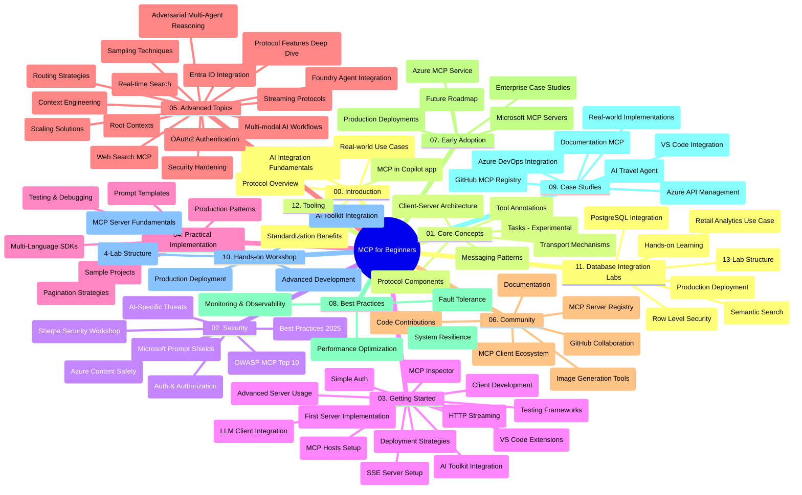

# ម odel Context Protocol (MCP) សម្រាប់អ្នកចាប់ផ្តើម - លំនាំសិក្សា

ជាលំនាំសិក្សានេះផ្តល់នូវការពិពណ៌នាម្ដងទូលំទូលាយពីរចនាសម្ព័ន្ធនៃហាងកូដ និងមាតិកាសម្រាប់មេរៀន "Model Context Protocol (MCP) សម្រាប់អ្នកចាប់ផ្តើម"។ ប្រើលំនាំនេះដើម្បីរុករកហាងកូដអោយមានប្រសិទ្ធភាព និងបំផុតប្រយោជន៍ពីធនធានដែលមាន។

## ពិពណ៌នាហាងកូដ

Model Context Protocol (MCP) គឺជាស៊ុមគ្រប់គ្រងតាមស្តង់ដារសម្រាប់បង្កើតទំនាក់ទំនងរវាងម៉ូដែល AI និងកម្មវិធីអតិថិជន។ ត្រូវបានបង្កើតដំបូងដោយ Anthropic, MCP ត្រូវបានថែរក្សា ដោយសហគមន៍ MCP តាមរយៈអង្គការដូចជាជាផ្លូវការ GitHub។ ហាងកូដនេះផ្តល់ជូននូវមេរៀនទូលំទូលាយជាមួយឧទាហរណ៍កូដដំណើរការពិតនៅក្នុង C#, Java, JavaScript, Python និង TypeScript ដែលបានរចនាឡើងសម្រាប់អ្នកអភិវឌ្ឍ AI, អ្នករចនាសម្ព័ន្ធប្រព័ន្ធ និងវិស្វករផ្នែកទន់។

## ផែនទីមេរៀនទស្សនាភាព

## រចនាសម្ព័ន្ធហាងកូដ

ហាងកូដត្រូវបានរៀបចំក្នុង១២ផ្នែកសំខាន់ៗ, ដែលម្នាក់ៗផ្តោតលើបញ្ហាផ្សេងៗនៃ MCP:

1. **ការណែនាំ (00-Introduction/)**
   - ការពិពណ៌នាពី Model Context Protocol
   - មូលហេតុដែលស្តង់ដារសំខាន់នៅក្នុងដំណើរការអ៊ី.អាយ.
   - ករណីប្រើប្រាស់ជាក់ស្តែង និងអត្ថប្រយោជន៍

2. **មូលដ្ឋានគំនិត (01-CoreConcepts/)**
   - វិវឌ្ឍន៍រចនាសម្ព័ន្ធអតិថិជន-ម៉ាស៊ីនមេ
   - គ្រឿងផ្សំនៃសេវាកម្មស្តង់ដារ
   - លំនាំសារនៅ MCP
   - ហើយ specification បច្ចុប្បន្នៈ [តើអ្វីបានផ្លាស់ប្តូរនៅ MCP: The 2026-07-28 Specification](./01-CoreConcepts/mcp-2026-07-28.md) — ប្រព័ន្ធមូលដ្ឋានគ្មានស្ថានភាព, រចនាសម្ព័ន្ធបន្ថែម, និងការលះបង់ Roots/Sampling/Logging

3. **សុវត្ថិភាព (02-Security/)**
   - គ្រោះថ្នាក់សុវត្ថិភាពនៅក្នុងប្រព័ន្ធផ្អែកលើ MCP
   - អនុវត្តន៍ល្អសម្រាប់ការពារសុវត្ថិភាព
   - វិធានការផ្ទៀងផ្ទាត់ និងអនុញ្ញាត
   - ឧទាហរណ៍ធ្វើដំណើរការជាក់ស្តែង [CIMD និង DCR authorization sample](./02-Security/samples/cimd-dcr-auth/README.md)
   - **ឯកសារសុវត្ថិភាពទូលំទូលាយ**:
     - MCP Security Best Practices
     - Azure Content Safety Implementation Guide
     - MCP Security Controls and Techniques
     - MCP Best Practices Quick Reference
   - **ប្រធានបទសុវត្ថិភាពសំខាន់ៗ**:
     - ការវាយប្រហារចាក់សារបញ្ចូល និងជម្រុះឧបករណ៍
     - ការដកបំប្លែងសម័យ និងបញ្ហាជំនួសបន្លំ
     - បញ្ហាប្រហោងឬចូលដំណើរការដោយគ្មានសិទ្ធិ
     - កំណត់សិទិ្ធ និងការត្រួតពិនិត្យចូលដំណើរការ
     - សុវត្ថិភាពខ្សែចលនាសម្រាប់ផ្នែក AI
     - ការរួមបញ្ចូល Microsoft Prompt Shields

4. **ការចាប់ផ្តើម (03-GettingStarted/)**
   - ការដំឡើងបរិយាកាស និងការកំណត់រចនាសម្ព័ន្ធ
   - ការបង្កើតម៉ាស៊ីនមេ MCP និងអតិថិជនមូលដ្ឋាន
   - ការរួមបញ្ចូលជាមួយកម្មវិធីមានរួចហើយ
   - រួមមានផ្នែកសម្រាប់:
     - ការអនុវត្តម៉ាស៊ីនមេដំបូង
     - ការអភិវឌ្ឍអតិថិជន
     - រួមបញ្ចូលអតិថិជន LLM
     - រួមបញ្ចូល VS Code
     - ម៉ាស៊ីនមេ Server-Sent Events (SSE)
     - ការប្រើប្រាស់ម៉ាស៊ីនមេទំនើប
     - ការបញ្ចាក់ទិន្នន័យ HTTP
     - រួមបញ្ចូលដុំគ្រឿង AI Toolkit
     - វិធានការសាកល្បង
     - សេចក្តីណែនាំសម្រាប់ការដាក់បង្ហោះ

5. **ការអនុវត្តជាក់ស្តែង (04-PracticalImplementation/)**
   - ការប្រើ SDKs នៅក្នុងភាសាកម្មវិធីផ្សេងៗ
   - វិធានការត្រួតពិនិត្យកំហុស សាកល្បង និងផ្ទៀងផ្ទាត់
   - បង្កើតធុងបញ្ចូលឯកសារបញ្ចូលដែលអាចប្រើឡើងវិញ និងដំណើរការងារ
   - គំរូគម្រោងជាមួយឧទាហរណ៍អនុវត្ត

6. **ប្រធានបទកម្រិតខ្ពស់ (05-AdvancedTopics/)**
   - វិធីសាស្រ្តបច្ចេកទេស Context engineering
   - រួមបញ្ចូលភ្នាក់ងារពហុធរណី Foundry
   - ដំណើរការងារ AI ពហុរាង
   - ការសាកល្បងបិទផ្សេង OAuth2
   - សមត្ថភាពស្វែងរកពេលវេលាពិត
   - ផ្ទុកព័ត៌មានអនឡាញពេលវេលាពិត
   - អនុវត្ត context root
   - របៀបកំណត់ផ្លូវ
   - វិធីសាស្រ្តស្ទាក់ជម្រើស
   - វិធីសាស្រ្តពង្រីក
   - ការពិចារណាសុវត្ថិភាព
   - ការរួមបញ្ចូលសុវត្ថិភាព Entra ID
   - ការរួមបញ្ចូលស្វែងរកគេហទំព័រ
   - ការគិតវាយប្រហារសំណុំភ្នាក់ងារពហុរាង (លំនាំប្រយោល)

7. **ការចូលរួមសហគមន៍ (06-CommunityContributions/)**
   - របៀបចូលរួមកូដ និងឯកសារពិពណ៌នា
   - សហការតាមរយៈ GitHub
   - ការកែលម្អ និងមតិយោបល់ដោយសហគមន៍
   - ការប្រើប្រាស់អតិថិជន MCP ផ្សេងៗ (Claude Desktop, Cline, VSCode)
   - ការធ្វើការជាមួយម៉ាស៊ីនមេ MCP ពេញនិយម រួមមាន ការបង្កើតរូបភាព

8. **មេរៀនពីការទទួលយកដំបូង (07-LessonsfromEarlyAdoption/)**
   - ការអនុវត្តន៍ពិត និងរឿងជោគជ័យ
   - ការបង្កើត និងដាក់បង្ហោះដំណោះស្រាយ MCP
   - ទិសដៅនិងផែនការដំណឹង
   - **មគ្គុទេសក៍ម៉ាស៊ីនមេ Microsoft MCP**: មគ្គុទេសក៍ទូលំទូលាយសម្រាប់ម៉ាស៊ីនមេ Microsoft MCP ១០ ដែលមានភាពប្រើប្រាស់ក្នុងផលិតកម្មរួមមាន:
     - Microsoft Learn Docs MCP Server
     - Azure MCP Server (១៥+ ខ្សែភ្ជាប់ឯកទេស)
     - GitHub MCP Server
     - Azure DevOps MCP Server
     - MarkItDown MCP Server
     - SQL Server MCP Server
     - Playwright MCP Server
     - Dev Box MCP Server
     - Microsoft Foundry MCP Server
     - Microsoft 365 Agents Toolkit MCP Server

9. **ការអនុវត្តល្អ (08-BestPractices/)**
   - ការត្រួតពិនិត្យ និងបង្រួមបម្រាស់កម្រិត
   - រចនាបថប្រព័ន្ធ MCP ដែលអាចធន់ទ្រាំកំហុស
   - វិធានការសាកល្បង និងចំណេះប្រសិទ្ធិភាព

10. **ការសិក្សាគំរូ (09-CaseStudy/)**
    - **ការសិក្សាគំរូចំនួនប្រាំពីរដែលបង្ហាញពីភាពចម្រង់ចម្រើនរបស់ MCP នៅក្នុងស្ថានการณ์ផ្សេងៗ**:
    - **ភ្នាក់ងារធ្វើដំណើរផ្នែក Azure AI**: ការតំរូវភ្នាក់ងារពហុដោយប្រើ Azure OpenAI និង AI Search
    - **ការរួមបញ្ចូល Azure DevOps**: ធ្វើដំណើរដំណើរការគ្រប់គ្រងជាមួយទិន្នន័យ YouTube
    - **ការស្វែងរកឯកសារពេលវេលាពិត**: កម្មវិធីអតិថិជន Python console ដោយប្រើ HTTP streaming
    - **កម្មវិធីផលិតផែនការសិក្សា Interactive**: កម្មវិធី Chainlit web app ជាមួយ AI ទាក់ទងសន្ទនា
    - **ឯកសារនៅក្នុងកម្មវិធីកែសម្រួល**: រួមបញ្ចូល VS Code ជាមួយ workflow GitHub Copilot
    - **ការគ្រប់គ្រង Azure API**: ការរួមបញ្ចូល API សហគ្រាស ជាមួយការបង្កើតម៉ាស៊ីនមេ MCP
    - **GitHub MCP Registry**: ការអភិវឌ្ឍផ្នែកបរិវេណ និងវេទិកាការរួមបញ្ចូលភ្នាក់ងារ
    - ឧទាហរណ៍អនុវត្តដែលផលិតនៅក្នុងការរួមបញ្ចូលសហគ្រាស, ប្រសិទ្ធភាពអភិវឌ្ឍន៍, និងអភិវឌ្ឍបរិវេណ

11. **វគ្គប្រឡងដៃ (10-StreamliningAIWorkflowsBuildingAnMCPServerWithAIToolkit/)**
    - វគ្គប្រឡងដៃទូលំទូលាយរួមបញ្ចូល MCP ជាមួយ AI Toolkit
    - ការបង្កើតកម្មវិធីឆ្លាតវៃដែលភ្ជាប់ម៉ូដែល AI ជាមួយឧបករណ៍ដំណើរការពិត
    - មេរៀនជាក់ស្ដែងគ្រប់បែបបទគ្រប់បច្ចេកទេស, ការអភិវឌ្ឍម៉ាស៊ីនមេទំនើប និងយុទ្ធសាស្ត្រដាក់បង្ហោះផលិតកម្ម
    - **រចនាសម្ព័ន្ធពហុមេរៀន**:
      - មេរៀន ១: មូលដ្ឋានម៉ាស៊ីនមេ MCP
      - មេរៀន ២: ការអភិវឌ្ឍម៉ាស៊ីនមេទំនើប MCP
      - មេរៀន ៣: រួមបញ្ចូល AI Toolkit
      - មេរៀន ៤: ការដាក់បង្ហោះផលិតកម្ម និងពង្រីក
    - វិធីសាស្ត្ររៀនដែលគួរដើរតាមជំហាន

12. **មេរៀនរួមបញ្ចូលមូលដ្ឋានទិន្នន័យ MCP Server (11-MCPServerHandsOnLabs/)**
    - **ផ្លូវរៀន ១៣មេរៀនទូលំទូលាយសម្រាប់ការបង្កើតម៉ាស៊ីនមេ MCP ដែលមានស្រាប់ជាមួយការរួមបញ្ចូល PostgreSQL**
    - **ការអនុវត្តវាស់វែងផលិតផលលក់ពិត** ជាមួយករណីប្រើ Zava Retail
    - **លំនាំសម្រាប់ឧស្សាហកម្ម** រួមមាន Row Level Security (RLS), ស្វែងរកមាឌកោណ, និងការចូលដំណើរការទិន្នន័យពហុរុក្ខជាតិ
    - **រចនាសម្ព័ន្ធពហុមេរៀន**:
      - **មេរៀន ០០-០៣: មូលដ្ឋាន** - ការណែនាំ, វិចារ, សុវត្ថិភាព, ការដំឡើងបរិយាកាស
      - **មេរៀន ០៤-០៦: ការបង្កើតម៉ាស៊ីនមេ MCP** - រចនាសម្ព័ន្ធទិន្នន័យ, ការអនុវត្តម៉ាស៊ីនមេ MCP, ការអភិវឌ្ឍឧបករណ៍

      - **មន្ទីរពិសោធន៍ 07-09: លក្ខណៈធម្មតាជំនាញខ្ពស់** - ស្វែងរកអត្ថន័យ, សាកល្បង និង ដោះស្រាយបញ្ហា, ការរួមបញ្ចូល VS Code
      - **មន្ទីរពិសោធន៍ 10-12: ការផលិត និងអនុវត្តវិធីសាស្រ្តល្អបំផុត** - ការចេញផ្សាយ, ការត្រួតពិនិត្យ, ការបង្កើតប្រសិទ្ធភាព
    - **បច្ចេកវិទ្យាដែលគ្របដណ្តប់**: ស៊ុម FastMCP, PostgreSQL, Azure OpenAI, Azure Container Apps, Application Insights
    - **លទ្ធផលការសិក្សា**: ម៉ាស៊ីនបម្រើ MCP ត្រៀមប្រៀបប្រដាល់ការផលិត, ម៉ូដែលបញ្ចូលទិន្នន័យ, វិភាគដោយបច្ចេកវិទ្យាបញ្ញាសិប្បនិម្មិត, សុវត្ថិភាពសម្រាប់សហគ្រាស

13. **ឧបករណ៍ (12-tooling/)**
    - សូមរៀនពីរបៀបប្រើ MCP ក្នុងកម្មវិធី Copilot និងឧបករណ៍ផ្សេងទៀត

## ធនធានបន្ថែម

ឃ្លាំងផ្ទុកធនធានគាំទ្របន្ថែម៖

- **ថតរូបភាព**: មានផ្ទុករូបរាងនិងរូបភាពយោងដែលប្រើក្នុងវគ្គសិក្សា
- **ការបម្លែងភាសា**: គាំទ្រជាភាសាច្រើនជាមួយការបម្លែងដោយស្វ័យប្រវត្តិនៃឯកសារ
- **ធនធាន MCP ផ្លូវការជាផ្លូវការជាផ្លូវការជាផ្លូវការជាផ្លូវការជាផ្លូវការសំរាប់ MCP**:
  - [MCP Documentation](https://modelcontextprotocol.io/)
  - [MCP Specification](https://modelcontextprotocol.io/specification/2026-07-28/)
  - [MCP GitHub Repository](https://github.com/modelcontextprotocol)

## របៀបប្រើឃ្លាំងនេះ

1. **ការសិក្សាដោយជាន់លំដាប់**: អនុវត្តគ្រប់ជំពូកតាមលំដាប់ (ពី 00 ដល់ 11) សម្រាប់បទពិសោធន៍សិក្សាដែលមានរចនាសម្ព័ន្ធ។
2. **ការផ្ដោតលើភាសា**: ប្រសិនបើអ្នកចាប់អារម្មណ៍នូវភាសាកម្មវិធីជាក់លាក់ សូមស្វែងយល់ពីថតចម្លងដែលមានការអនុវត្តន៍ជាភាសាដែលអ្នកចូលចិត្ត។
3. **ការអនុវត្តកម្មវិធី**:ចាប់ផ្ដើមជាមួយផ្នែក "ការចាប់ផ្ដើម" ដើម្បីបង្កើតបរិស្ថានរបស់អ្នក និងបង្កើតម៉ាស៊ីនបម្រើ MCP និងគំរូផ្តើមរបស់អ្នក។
4. **ការស្ទូតបន្ថែម**: បន្ទាប់ពីមានភាពទំនេរជាមួយមូលដ្ឋាន សូមចូលក្នុងប្រធានបទកម្រិតខ្ពស់ដើម្បីពង្រីកចំណេះដឹងរបស់អ្នក។
5. **ការចូលរួមសហគមន៍**: ចូលរួមសហគមន៍ MCP តាមរយៈការពិភាក្សា GitHub និងប្រព័ន្ធ Discord ដើម្បីភ្ជាប់ជាមួយអ្នកជំនាញ និងអ្នកអភិវឌ្ឍន៍ផ្សេងទៀត។

## អតិថិជន MCP និងឧបករណ៍

វគ្គសិក្សាគ្របដណ្តប់អតិថិជន MCP និងឧបករណ៍ជាច្រើន៖

1. **អតិថិជនផ្លូវការជាផ្លូវការ**:
   - Visual Studio Code 
   - MCP ក្នុង Visual Studio Code
   - Claude Desktop
   - Claude ក្នុង VSCode 
   - Claude API

2. **អតិថិជនសហគមន៍**:
   - Cline (តាមកុងសូល)
   - Cursor (កូដកែសម្រួល)
   - ChatMCP
   - Windsurf

3. **ឧបករណ៍គ្រប់គ្រង MCP**:
   - MCP CLI
   - MCP Manager
   - MCP Linker
   - MCP Router

## ម៉ាស៊ីនបម្រើ MCP ពេញនិយម

ឃ្លាំងនេះណែនាំម៉ាស៊ីនបម្រើ MCP ជាច្រើន រួមមាន៖

1. **ម៉ាស៊ីនបម្រើ Microsoft MCP ផ្លូវការ**:
   - Microsoft Learn Docs MCP Server
   - Azure MCP Server (15+ កុងเน็คទ័រពិសេស)
   - GitHub MCP Server
   - Azure DevOps MCP Server
   - MarkItDown MCP Server
   - SQL Server MCP Server
   - Playwright MCP Server
   - Dev Box MCP Server
   - Microsoft Foundry MCP Server
   - Microsoft 365 Agents Toolkit MCP Server

2. **ម៉ាស៊ីនបម្រើយោងផ្លូវការ**:
   - Filesystem
   - Fetch
   - Memory
   - Sequential Thinking

3. **ការបង្កើតរូបភាព**:
   - Azure OpenAI DALL-E 3
   - Stable Diffusion WebUI
   - Replicate

4. **ឧបករណ៍អភិវឌ្ឍន៍**:
   - Git MCP
   - ការគ្រប់គ្រងតាមផ្ទាល់កុងសូល
   - ជួយបញ្ចូលកូដ

5. **ម៉ាស៊ីនបម្រើពិសេស**:
   - Salesforce
   - Microsoft Teams
   - Jira & Confluence

## ការរួមចំណែក

ឃ្លាំងនេះព្រមទទួលយកការរួមចំណែកពីសហគមន៍។ សូមមើលផ្នែកការរួមចំណែកពីសហគមន៍សម្រាប់ការណែនាំពីរបៀបរួមចំណែក យ៉ាងមានប្រសិទ្ធិភាពទៅក្នុងប្រព័ន្ធអ៊ីកូស៊ីសធីម MCP ។

----

*មគ្គុទ្ទប្បថសិក្សានេះបានធ្វើបច្ចុប្បន្នភាពចុងក្រោយនៅថ្ងៃទី ៩ ខែកញ្ញា ឆ្នាំ ២០២៦។ វាបង្ហាញពី MCP
ការបញ្ជាក់ `2026-07-28` ដែលជាការត្រួតពិនិត្យពិព័រណ៍ទម្រង់បច្ចុប្បន្ន។ ឧទាហរណ៍ចម្បងខ្លះនៅតែមានកំណត់ជាច្បាប់ទៅកាន់ `2025-11-25` ខណៈដែល SDK និងឧបករណ៍របស់ពួកគេ
ប្រើប្រាស់ API ពិភពកម្មវិធីពិចារណាឥតស្ថិតិភាព។
.*

---

<!-- CO-OP TRANSLATOR DISCLAIMER START -->
**ការបដិសេធ**:
ឯកសារនេះត្រូវបានបម្លែងភាសា ដោយប្រើសេវាបម្លែងភាសា AI [Co-op Translator](https://github.com/Azure/co-op-translator)។ ទោះយើងខ្ញុំមានក្តីប្រាថ្នាឱ្យបានច្បាស់លាស់ តែសូមយល់ដឹងថាការបម្លែងដោយស្វ័យប្រវត្តិក៏អាចមានកំហុសឬភាពមិនត្រឹមត្រូវ។ ឯកសារដើមជាភាសាទីតាំងគួរត្រូវបានគេប្រើជាប្រភពច្បាស់លាស់។ សម្រាប់ព័ត៌មានសំខាន់ៗ សូមណែនាំឱ្យប្រើប្រាស់ការប្រែដោយមនុស្សជំនាញ។ យើងខ្ញុំមិនទទួលខុសត្រូវចំពោះការយល់ច្រឡំ ឬការបកស្រាយខុសបន្ទាប់ពីការប្រើប្រាស់ការបម្លែងនេះនោះទេ។
<!-- CO-OP TRANSLATOR DISCLAIMER END -->