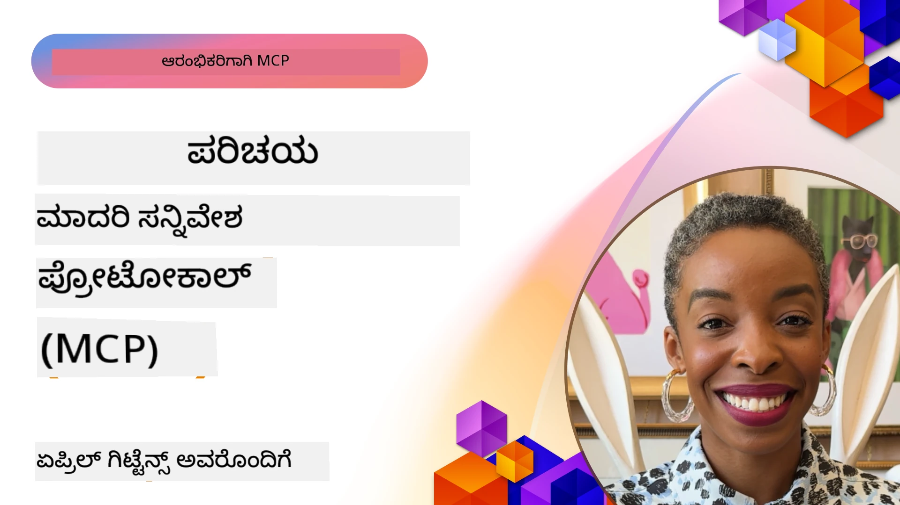
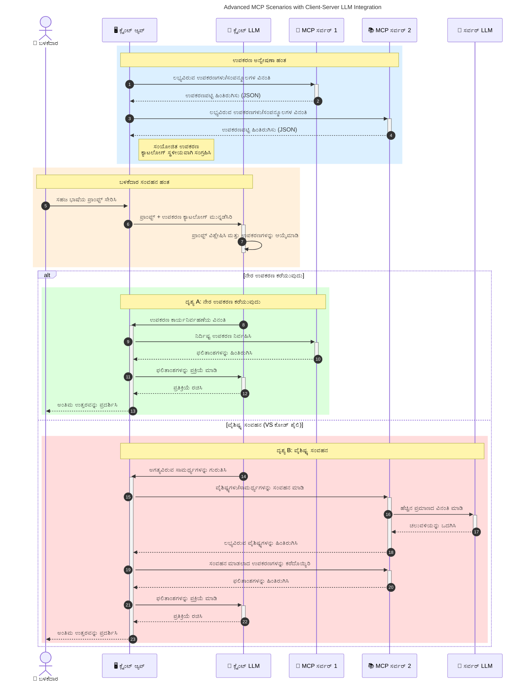

# ಮಾದರಿ ಹಿನ್ನೆಲೆ ಪ್ರೋಟೋಕಾಲ್ (MCP) ಗೆ ಪರಿಚಯ: ಪ್ರಮಾಣೀಕೃತ AI ಅಪ್ಲಿಕೇಶನ್‌ಗಳಿಗೆ ಇದ್ಹಾಗು ಮುಖ್ಯವಾಗಿರುವುದು ಯಾಕೆ

[](https://youtu.be/agBbdiOPLQA)

_(ಈ ಪಾಠದ ವೀಡಿಯೋ ನೋಡಲು ಮೇಲಿನ ಚಿತ್ರವನ್ನು ಕ್ಲಿಕ್ ಮಾಡಿ)_

ತಯಾರಿಸಿರುವ AI ಅಪ್ಲಿಕೇಶನ್‌ಗಳು ಉತ್ತಮ ಮುಂದುವರಿದ ಹಂತವಾಗಿವೆ ಏಕೆಂದರೆ ಅವು ಬಳಕೆದಾರರಿಗೆ ಸಹಜ ಭಾಷಾ ಪ್ರಾಂಪ್ಟ್‌ಗಳನ್ನು ಬಳಸಿಕೊಂಡು ಅಪ್ಲಿಕೇಶನ್ ಜೊತೆಗೆ ಸಂವಾದ ಮಾಡಲು ಅವಕಾಶ ಮಾಡಿಕೊಡುತ್ತವೆ. ಆದಾಗ್ಯೂ, ಹೆಚ್ಚಿನ ಸಮಯ ಮತ್ತು ಸಂಪನ್ಮೂಲಗಳನ್ನು ಇಂಥ ಅಪ್ಲಿಕೇಶನ್‌ಗಳಲ್ಲಿಗೆ ಹೂಡಿಕೆ ಮಾಡುವುದು ಜಾಸ್ತಿ ಆದಾಗ, ಫಂಕ್ಷನಾಲಿಟಿಗಳು ಮತ್ತು ಸಂಪನ್ಮೂಲಗಳನ್ನು ಸುಲಭವಾಗಿ ಕಾಂಡಿಸಿಕೊಳ್ಳಲು ನೀವು ನಿರ್ಧರಿಸಬೇಕು, ನಿಮ್ಮ ಅಪ್ಲಿಕೇಶನ್ ಒಂದಕ್ಕಿಂತ ಹೆಚ್ಚು ಮಾದರಿಗಳನ್ನು ಬಳಸಿಕೊಳ್ಳಲು ಸಾಧ್ಯವಿದೆ ಮತ್ತು ವಿವಿಧ ಮಾದರಿ ವಿದ್ಯಮಾನಗಳನ್ನು ನಿರ್ವಹಿಸಬಹುದು. ಸಂಕೀರ್ಣತೆ ಹೆಚ್ಚಾದಂತೆ, Gen AI ಅಪ್ಲಿಕೇಶನ್‌ಗಳನ್ನು ಕೇವಲ ನಿರ್ಮಿಸುವುದು ಸುಲಭ, ಆದರೂ ಅವು ಬೆಳೆಯುವಂತೆ, ನೀವು ವಿನ್ಯಾಸವನ್ನೂ ತಯಾರಿಸಲು ಪ್ರಾರಂಭಿಸಬೇಕಾಗುತ್ತದೆ ಮತ್ತು ಸ್ಥಿತಿಗತಿಯುಳ್ಳ ವಿನ್ಯಾಸವಾಗಿದೆ ಎಂಬುದನ್ನು ಖಚಿತಪಡಿಸಲು ಸಾಮಾನ್ಯ ಮಾನದಂಡದ ಮೇಲೆ ಅವಲಂಬಿಸಲಿದ್ದೀರಿ. ಇರುತ್ತದೆ MCP ಇದಲ್ಲಿ ಸಹಾಯ ಮಾಡುವುದಕ್ಕೆ ಮತ್ತು ಮಾನದಂಡ ಒದಗಿಸಲು.

---

## **🔍 ಮಾದರಿ ಹಿನ್ನೆಲೆ ಪ್ರೋಟೋಕಾಲ್ (MCP) ಎಂದರೇನು?**

**ಮಾದರಿ ಹಿನ್ನೆಲೆ ಪ್ರೋಟೋಕಾಲ್ (MCP)** ಒಂದು **ತೆರೆದ, ಮಾನ್ಯತೆಯಾದ ಇಂಟರ್ಫೇಸ್** ಆಗಿದ್ದು, LLM ಗಳಿಗೆ ಹೊರಗಿನ ಟೂಲ್ಸ್, API ಗಳು ಮತ್ತು ಡೇಟಾ ಮೂಲಗಳೊಂದಿಗೆ ಸುಗಮವಾಗಿ ಸಂವಹನ ಮಾಡಲು ಅವಕಾಶ ನೀಡುತ್ತದೆ. ಇದು AI ಮಾದರಿಗಳ ಕಾರ್ಯಕ್ಷಮತೆಯನ್ನು ಅವರ ತರಬೇತಿ ಮಾಹಿತಿಗಿಂತ ಮುಂಚಿತವಾಗಿ ವಿಸ್ತರಿಸಲು ಅನುಗುಣವಾದ ಆರ್ಕಿಟೆಕ್ಚರನ್ನು ಒದಗಿಸುತ್ತದೆ, ಚತುರ, ಪ್ರಮಾಣೀಕೃತ ಮತ್ತು ಪ್ರತಿಕ್ರಿಯಾಶೀಲ AI ವ್ಯವಸ್ಥೆಗಳನ್ನು ಸೃಷ್ಟಿಸಲು ಸಹಾಯಮಾಡುತ್ತದೆ.

---

## **🎯 AI ಯಲ್ಲಿ ಮಾನದಂಡೀಕರಣದ ಮಹತ್ವ**

ತಯಾರಿಸಿದ AI ಅಪ್ಲಿಕೇಶನ್‌ಗಳು ಹೆಚ್ಚು ಜಟಿಲವಾಗುತ್ತಿರುವಾಗ, **ಪ್ರಮಾಣಯೋಗ್ಯತೆ, ವಿಸ್ತರಣೀಯತೆ, ನಿರ್ವಹಣೆ ಸರಳತೆ, ಮತ್ತು ವಿತರಕನ ಬಂಧನ ತಪ್ಪಿಸುವುದು** ಎಂಬ ಗುಣಗತ್ತಲು ಮಾನದಂಡಗಳನ್ನು ಅಳವಡಿಸುವುದು ಅತ್ಯಾವಶ್ಯಕ. MCP ಈ ಅಗತ್ಯಗಳನ್ನು ಈ ರೀತಿ ಪರಿಹರಿಸುತ್ತದೆ:

- ಮಾದರಿ-ಟೂಲ್ ಸಂಯೋಜನೆಯನ್ನು ಏಕೀಕೃತಗೊಳಿಸುವುದು
- ನಾಜೂಕಾದ, ಏಕಕಾಲೀನ ಕಸ್ಟಮ್ ಪರಿಹಾರಗಳನ್ನು ಕಡಿಮೆ ಮಾಡುವುದು
- ವಿಭಿನ್ನ ವಿತರಕರ ಅನೇಕ ಮಾದರಿಗಳನ್ನು ಒಂದೇ ಪರಿಸರದಲ್ಲಿ coexist ಆಗಲು ಅವಕಾಶ ನೀಡುವುದು

**ಟಿಪ್ಪಣಿ:** MCP ಯನ್ನು ತೆರೆದ ಮಾನದಂಡ ಎಂದು ಪರಿಗಣಿಸಲಾಗುತ್ತದೆ, ಆದರೆ IEEE, IETF, W3C, ISO ಅಥವಾ ಇತರ ಯಾವುದೇ ಮಾನದಂಡ ಸಂಸ್ಥೆಗಳ ಮೂಲಕ ಅದನ್ನು ಮಾನ್ಯತೆಯಾಗಿಸುವುದರ ಯಾವುದೇ ಯೋಜನೆಗಳಿಲ್ಲ.

---

## **📚 ಕಲಿಕೆ ಗುರಿಗಳು**

ಈ ಲೇಖನದ ಅಂತ್ಯಕ್ಕೆ ನೀವು ಸಾಮರ್ಥ್ಯವನ್ನು ಹೊಂದಿರುತ್ತೀರಿ:

- **ಮಾದರಿ ಹಿನ್ನೆಲೆ ಪ್ರೋಟೋಕಾಲ್ (MCP)** ಮತ್ತು ಅದರ ಉಪಯೋಗಗಳ ವಿವರಣೆ ನೀಡಲು
- MCP ಮಾದರಿ-ಟೂಲ್ ಸಂವಹನವನ್ನು ಹೇಗೆ ಮಾನ್ಯತೆಯಾಗಿಸುತ್ತದೆ ಎಂಬುದನ್ನು ಅರ್ಥಮಾಡಿಕೊಳ್ಳಲು
- MCP ಆರ್ಕಿಟೆಕ್ಚರ್‌ನ ಪ್ರಮುಖ ಘಟಕಗಳನ್ನು ಗುರುತಿಸಲು
- ಕೈಗಾರಿಕಾ ಮತ್ತು ಅಭಿವೃದ್ಧಿ ಸಂದರ್ಭಗಳಲ್ಲಿ MCP ನ ನಿಜ ಜೀವನದ ಬಳಕೆಗಳನ್ನು ಪರಿಶೀಲಿಸಲು

---

## **💡 ಮಾದರಿ ಹಿನ್ನೆಲೆ ಪ್ರೋಟೋಕಾಲ್ (MCP) ಯಾಕೆ ಕ್ರಾಂತಿಕಾರಿ?**

### **🔗 MCP AI ಸಂವಹನದಲ್ಲಿ ವಿಭಜನೆಯ ಸಮಸ್ಯೆಯನ್ನು ಪರಿಹರಿಸುತ್ತದೆ**

MCP ಮೊದಲು, ಮಾದರಿಗಳನ್ನು ಟೂಲ್ಸ್ ಸೇರಿಸುವುದಕ್ಕೆ ಅಗತ್ಯವಿತ್ತು:

- ಪ್ರತಿ ಟೂಲ್-ಮಾದರಿ ಜೋಡಿಗಾಗಿಯೂ ಕಸ್ಟಮ್ ಕೋಡ್
- ಪ್ರತಿಯೊಂದು ವಿತರಕರಿಗೂ ಅಸಮಾನ APIs
- ನವೀಕರಣಗಳಿಂದ ಆಗಾಗ ಸಮಯಕ್ಕೆ ಮುರಿತಾಗುವಿಕೆ
- ಹೆಚ್ಚಿನ ಟೂಲ್ಸ್ ಬಳಕೆಯಲ್ಲಿ scalability ಕಡಿಮೆ

### **✅ MCP ಮಾನ್ಯತೆಗೊಳ್ಳುವದರಿಂದಲಾದ ಲಾಭಗಳು**

| **ಲಾಭ**                 | **ವಿವರಣೆ**                                                               |
|--------------------------|----------------------------------------------------------------------------|
| ಪರಸ್ಪರವ್ಯವಸ್ಥಿತತೆ    | LLMಗಳು ವಿಭಿನ್ನ ವಿತರಕರ ಟೂಲ್ಸ್ ಜೊತೆಗೆ ಸುಗಮವಾಗಿ ಕಾರ್ಯನಿರ್ವಹಿಸುತ್ತವೆ       |
| ಸुसಂಗತತೆ              | ವೇದಿಕೆ ಮತ್ತು ಟೂಲ್ಗಳಲ್ಲಿ ಏಕೀಕೃತ ವರ್ತನೆ                                   |
| ಮರುಬಳಕೆ ಯೋಗ್ಯತೆ        | ಒಮ್ಮೆ ನಿರ್ಮಿಸಿದ ಟೂಲ್ಗಳನ್ನು ವಿವಿಧ ಯೋಜನೆಗಳು ಮತ್ತು ವ್ಯವಸ್ಥೆಗಳಲ್ಲಿ ಬಳಸಬಹುದು   |
| ವೇಗವಾದ ಅಭಿವೃದ್ಧಿ      | ಮಾನ್ಯತೆಯಾದ, ಪ್ಲಗ್-ಅಂಡ್-ಪ್ಲೇ ಇಂಟರ್ಫೇಸ್‌ಗಳನ್ನು ಬಳಸಿ ಅಭಿವೃದ್ಧಿ ಸಮಯವನ್ನು ಕಡಿಮೆ ಮಾಡುತ್ತದೆ |

---

## **🧱 ಉನ್ನತ ಮಟ್ಟದ MCP ಆರ್ಕಿಟೆಕ್ಚರ್ ಅವಲೋಕನ**

MCP ಒಂದು **ಕ್ಲೈಂಟ್-ಸರ್ವರ್ ಮಾದರಿಯನ್ನು** ಅನುಸರಿಸುತ್ತದೆ, ಇಲ್ಲಿ:

- **MCP ಹೋಸ್ಟ್‌ಗಳು** AI ಮಾದರಿಗಳನ್ನು ಚಲಿಸುತ್ತವೆ
- **MCP ಕ್ಲೈಂಟ್‌ಗಳು** ವಿನಂತಿಗಳನ್ನು ಪ್ರಾರಂಭಿಸುತ್ತವೆ
- **MCP ಸರ್ವರ್‌ಗಳು** ಸಂದರ್ಭ, ಟೂಲ್ಸ್ ಮತ್ತು ಸಾಮರ್ಥ್ಯಗಳನ್ನು ಪೂರೈಸುತ್ತವೆ

### **ಪ್ರಮುಖ ಘಟಕಗಳು:**

- **ಸಂಪನ್ಮೂಲಗಳು** – ಮಾದರಿಗಳು ಬಳಸುವ ಸ್ಥಿರ ಅಥವಾ ಚಲಿಸುವ ಡೇಟಾ  
- **ಪ್ರಾಂಪ್ಟ್‌ಗಳು** – ಮಾರ್ಗದರ್ಶಕ ತಯಾರಿಕೆಗೆ ನಿಯೋಜಿತ ಕೆಲಸಗಳ ಸರಣಿ  
- **ಟೂಲ್ಸ್** – ಹುಡುಕು, ಲೆಕ್ಕಾಚಾರಗಳಂತಹ ಕಾರ್ಯಾಚರಣೆಗಳನ್ನು ಮಾಡಬಹುದಾದ ಫಂಕ್ಷನ್ಸುಗಳು  
- **ಸ್ಯಾಂಪ್ಲಿಂಗ್** – ಮನುಷ್ಯನಂತಹ ವರ್ತನೆ recursive ಸಂವಹನದ ಮೂಲಕ (MCP `2026-07-28` ನಲ್ಲಿ ನಿಷ್ಕ್ರಿಯ; ಹೊಸ ಅನುಷ್ಠಾನಗಳು ನೇರವಾಗಿ LLM ಒದಗಿಸುವವರೊಡನೆ ಇಂಟಿಗ್ರೇಟ್ ಮಾಡಬೇಕು)
    
    
- **ಎಲಿಸಿಟೇಶನ್** – ಬಳಕೆದಾರ ಇನ್ಪುಟ್‌ಗಾಗಿ ಸರ್ವರ್ ಪ್ರಾರಂಭಿಸಿದ ವಿನಂತಿಗಳು
- **ರೂಟ್ಗಳು** – ಸರ್ವರ್‌ಗೆ ಸಂಬಂಧಿಸಿದ ಮಾಹಿತಿ ಸಿಸ್ಟಮ್ ಶಾಸನಸ್ಥಾನಗಳು (MCP `2026-07-28` ನಲ್ಲಿ ನಿಷ್ಕ್ರಿಯ; ಟೂಲ್ ಪ್ಯಾರಾಮೀಟರ್‌ಗಳು, ಸಂಪನ್ಮೂಲ URI ಗಳು ಅಥವಾ ಸರ್ವರ್ ಸಂರಚನೆಯ ಮೇಲೂ ಅವಲಂಬನೆ ಮಾಡುವುದು ಉತ್ತಮ)
    
    

### **ಪ್ರೋಟೋಕಾಲ್ ಆರ್ಕಿಟೆಕ್ಚರ್:**

MCP ಎರಡು ಪದರಗಳ ಆರ್ಕಿಟೆಕ್ಚರ್ ಅನ್ನು ಬಳಸುತ್ತದೆ:
- **ಡೇಟಾ ಲೇಯರ್**: JSON-RPC 2.0 ಸಂದೇಶಗಳು, ಪ್ರತಿವಿನಂತಿಗೆ ಮೆಟಾಡೇಟಾ, ಅನ್ವೇಷಣೆ ಮತ್ತು ಪ್ರೋಟೋಕಾಲ್ ಮೂಲಭೂತಾಂಶಗಳು
- **ಟ್ರಾನ್ಸ್‌ಪೋರ್ಟ್ ಲೇಯರ್**: ಸ್ಥಳೀಯ ಉಪಪ್ರಕ್ರಿಯೆಗಳಿಗಾಗಿ stdio ಮತ್ತು ದೂರದ ಸರ್ವರ್‌ಗಳಿಗೆ Streamable HTTP. Streamable HTTP ಸುರಕ್ಷಿತ ಪ್ರತಿಕ್ರಿಯೆಗಳಿಗಾಗಿ SSE ಫ್ರೇಮಿಂಗ್ ಬಳಸಬಹುದು, ಆದರೆ ಹಳೆಯ HTTP+SSE ಟ್ರಾನ್ಸ್‌ಪೋರ್ಟ್ ಅನ್ನು ನಿಷ್ಕ್ರಿಯಗೊಳಿಸಲಾಗಿದೆ.
    
    
    

---

## MCP ಸರ್ವರ್‌ಗಳು ಹೇಗೆ ಕಾರ್ಯನಿರ್ವಹಿಸುತ್ತವೆ

MCP ಸರ್ವರ್‌ಗಳು ಕೆಳಗಿನ ರೀತಿಯಲ್ಲಿ ಕಾರ್ಯಾಚರಣೆ ಮಾಡುತ್ತವೆ:

- **ವಿನಂತಿ ಸಾಗಣೆ**:
    1. ಕೊನೆ ಬಳಕೆದಾರ ಅಥವಾ ಅವರ ಪರವಾಗಿ ಕಾರ್ಯನಿರತ ಸಾಫ್ಟ್‌ವೇರ್ ವಿನಂತಿಯನ್ನು ಪ್ರಾರಂಭಿಸುತ್ತದೆ.
    2. **MCP ಕ್ಲೈಂಟ್** ಆ ವಿನಂತಿಯನ್ನು **MCP ಹೋಸ್ಟ್** ಗೆ ಕಳುಹಿಸುತ್ತದೆ, ಇದು AI ಮಾದರಿ ರನ್‌ಟೈಮ್ ಅನ್ನು ನಿರ್ವಹಿಸುತ್ತದೆ.
    3. **AI ಮಾದರಿ** ಬಳಕೆದಾರ ಪ್ರಾಂಪ್ಟ್ ಅನ್ನು ಸ್ವೀಕರಿಸಿ ಹೊರಗಿನ ಟೂಲ್ಸ್ ಅಥವಾ ಡೇಟಾ ಪ್ರಾಪ್ತಿಗಾಗಿ ಒಂದು ಅಥವಾ ಹೆಚ್ಚು ಟೂಲ್ ಕಾಲ್‌ಗಳನ್ನು ಕೇಳಬಹುದು.
    4. **MCP ಹೋಸ್ಟ್**, ಮಾದರಿಯಾದ DIRECT ಸಂಪರ್ಕವಿಲ್ಲದೆ, ಮಾನ್ಯತೆಯಾದ ಪ್ರೋಟೋಕಾಲ್ ಬಳಸಿ ಸೂಕ್ತ **MCP ಸರ್ವರ್(ಗಳು)** ಜೊತೆ ಸಂವಹನ ಮಾಡುತ್ತದೆ.
- **MCP ಹೋಸ್ಟ್ ಕಾರ್ಯಕ್ಷಮತೆ**:
    - **ಟೂಲ್ ರಿಜಿಸ್ಟ್ರಿ**: ಲಭ್ಯವಿರುವ ಟೂಲ್ಗಳ ಮತ್ತು ಅವುಗಳ ಸಾಮರ್ಥ್ಯಗಳ ಕ್ಯಾಟಲೋಗ್ ಅನ್ನು ಕಾಯ್ದಿರಿಸುತ್ತದೆ.
    - **ಅಥೆಂಟಿಕೇಶನ್**: ಟೂಲ್ ಪ್ರವೇಶಕ್ಕೆ ಅನುಮತಿಗಳನ್ನು ಪರಿಶೀಲಿಸುತ್ತದೆ.
    - **ವಿನಂತಿ ನಿರ್ವಹಣೆ**: ಮಾದರಿಯಿಂದ ಬರುತ್ತಿರುವ ಟೂಲ್ ವಿನಂತಿಗಳನ್ನು ಪ್ರಕ್ರಿಯೆ ಮಾಡುತ್ತದೆ.
    - **ಪ್ರತಿಕ್ರಿಯೆ ರೂಪರೇಖೆ**: ಮಾದರಿಗೆ ಗ್ರಹಿಸಲು ಸುಲಭವಾಗಿರಲು ಟೂಲ್ ಹೊರಹೊಮ್ಮುವ ಸ್ವರೂಪವನ್ನು ರಚಿಸುವುದು.
- **MCP ಸರ್ವರ್ ಕಾರ್ಯನಿರ್ವಹಣೆ**:
    - **MCP ಹೋಸ್ಟ್** ಒಂದು ಅಥವಾ ಹೆಚ್ಚಿನ **MCP ಸರ್ವರ್‌ಗಳಿಗೆ** ಟೂಲ್ ಕಾಲ್‌ಗಳನ್ನು ಮಾರ್ಗದರ್ಶಿಸುತ್ತದೆ, ಪ್ರತಿಯೊಂದೂ ಖಾಸಗಿ ಕಾರ್ಯಗಳನ್ನು (ಹುಡುಕು, ಲೆಕ್ಕಾಚಾರಗಳು, ಡೇಟಾಬೇಸ್ ವಿಚಾರಣೆಗಳು) ಒದಗಿಸುತ್ತದೆ.
    - **MCP ಸರ್ವರ್‌ಗಳು** ತಮ್ಮ ಕಾರ್ಯಾಚರಣೆಗಳನ್ನು ನಿರ್ವಹಿಸಿ ಫಲಿತಾಂಶಗಳನ್ನು ಸರಳ ಸ್ವರೂಪದಲ್ಲಿ **MCP ಹೋಸ್ಟ್** ಗೆ ಹಿಂತಿರುಗಿಸುತ್ತವೆ.
    - **MCP ಹೋಸ್ಟ್** ಇವುಗಳ ಫಲಿತಾಂಶಗಳನ್ನು ರೂಪಗೊಳ್ಳಿಸಿ **AI ಮಾದರಿ** ಗೆ ತಲುಪಿಸುತ್ತದೆ.
- **ಪ್ರತಿಕ್ರಿಯೆ ಪೂರ್ಣಗೊಳಿಸುವಿಕೆ**:
    - **AI ಮಾದರಿ** ಟೂಲ್ ಔಟ್‌ಪುಟ್‌ಗಳನ್ನು ಅಂತಿಮ ಪ್ರತಿಕ್ರಿಯೆಯಲ್ಲಿ ಒಳಗೊಂಡಿಕೊಳ್ಳುತ್ತದೆ.
    - **MCP ಹೋಸ್ಟ್** ಈ ಪ್ರತಿಕ್ರಿಯೆಯನ್ನು **MCP ಕ್ಲೈಂಟ್** ಗೆ ಕಳುಹಿಸುತ್ತದೆ, ಅದು ಅದನ್ನು ಕೊನೆ ಬಳಕೆದಾರ ಅಥವಾ ಕರೆ ಮಾಡುವ ಸಾಫ್ಟ್‌ವೇರ್ ಗೆ ಒಪ್ಪಿಸುತ್ತದೆ.
    

```mermaid
---
title: MCP Architecture and Component Interactions
description: A diagram showing the flows of the components in MCP.
---
graph TD
    Client[MCP ಗ್ರಾಹಕ/ಅಪ್ಲಿಕೇಶನ್] -->|ವಿನಂತಿ ಕಳುಹಿಸುತ್ತದೆ| H[MCP ಹೋಸ್ಟ್]
    H -->|ಕರೆಮಾಡುತ್ತದೆ| A[AI ಮಾದರಿ]
    A -->|ಉಪಕರಣ ಕರೆ ವಿನಂತಿ| H
    H -->|MCP Protocol| T1[MCP Server Tool 01: ವೆಬ್ ಹುಡುಕಾಟ
    H -->|MCP Protocol| T2[MCP Server Tool 02: ಕ್ಯಾಲ್ಕುಲೇಟರ್ ಉಪಕರಣ
    H -->|MCP Protocol| T3[MCP Server Tool 03: ಡೇಟಾಬೇಸ್ ಪ್ರವೇಶ ಉಪಕರಣ
    H -->|MCP Protocol| T4[MCP Server Tool 04: ಫೈಲ್ ಸಿಸ್ಟಮ್ ಉಪಕರಣ
    H -->|ಪ್ರತಿಕ್ರಿಯೆ ಕಳುಹಿಸುತ್ತದೆ| Client

    subgraph "MCP ಹೋಸ್ಟ್ ಘಟಕಗಳು"
        H
        G[ಉಪಕರಣ ನೋಂದಣಿ]
        I[ಪರೀಕ್ಷಣೆ]
        J[ವಿನಂತಿ ನಿರ್ವಹಣೆ]
        K[ಪ್ರತಿಕ್ರಿಯೆ ಸ್ವರೂಪದಿಂದ]
    end

    H <--> G
    H <--> I
    H <--> J
    H <--> K

    style A fill:#f9d5e5,stroke:#333,stroke-width:2px
    style H fill:#eeeeee,stroke:#333,stroke-width:2px
    style Client fill:#d5e8f9,stroke:#333,stroke-width:2px
    style G fill:#fffbe6,stroke:#333,stroke-width:1px
    style I fill:#fffbe6,stroke:#333,stroke-width:1px
    style J fill:#fffbe6,stroke:#333,stroke-width:1px
    style K fill:#fffbe6,stroke:#333,stroke-width:1px
    style T1 fill:#c2f0c2,stroke:#333,stroke-width:1px
    style T2 fill:#c2f0c2,stroke:#333,stroke-width:1px
    style T3 fill:#c2f0c2,stroke:#333,stroke-width:1px
    style T4 fill:#c2f0c2,stroke:#333,stroke-width:1px
```

## 👨‍💻 MCP ಸರ್ವರ್ ಅನ್ನು ಹೇಗೆ ಕಟ್ಟುವುದು (ಉದಾಹರಣೆಗಳೊಂದಿಗೆ)

MCP ಸರ್ವರ್‌ಗಳು ನೀವು LLM ಸಾಮರ್ಥ್ಯಗಳನ್ನು ಡೇಟಾ ಮತ್ತು ಕಾರ್ಯಕ್ಷಮತೆಯನ್ನು ಒದಗಿಸುವ ಮೂಲಕ ವಿಸ್ತರಿಸಲು ಸಹಾಯ ಮಾಡುತ್ತವೆ. 

ಪ್ರಯತ್ನಿಸಲು ಸಿದ್ಧವೇ? ವಿವಿಧ ಭಾಷೆಗಳು/ಸ್ಟ್ಯಾಕ್‌ಗಳಿಗೆ ಸಂಬಂಧಿಸಿದ SDK ಗಳು ಮತ್ತು ಬೇರೆಯುವ MCP ಸರ್ವರ್‌ಗಳನ್ನು ಆಡುಗೊಳ್ಳುವ ಉದಾಹರಣೆಗಳು ಇಲ್ಲಿವೆ:

- **Python SDK**: https://github.com/modelcontextprotocol/python-sdk

- **TypeScript SDK**: https://github.com/modelcontextprotocol/typescript-sdk

- **Java SDK**: https://github.com/modelcontextprotocol/java-sdk

- **C#/.NET SDK**: https://github.com/modelcontextprotocol/csharp-sdk


## 🌍 MCP ನ ನಿಜ ಜೀವನದ ಬಳಕೆ ಪ್ರಕರಣಗಳು

MCP AI ಸಾಮರ್ಥ್ಯಗಳನ್ನು ವಿಸ್ತರಿಸುವ ಮೂಲಕ ವಿವಿಧ ಅಪ್ಲಿಕೇಶನ್‌ಗಳಿಗೆ ಅವಕಾಶ ನೀಡುತ್ತದೆ:

| **ಅಪ್ಲಿಕೇಶನ್**                     | **ವಿವರಣೆ**                                                                     |
|-----------------------------------|---------------------------------------------------------------------------------|
| ಕೈಗಾರಿಕಾ ಡೇಟಾ ಇಂಟ್ರಿಗ್ರೇಶನ್       | LLM ಗಳು ಡೇಟಾಬೇಸ್‌ಗಳು, CRM ಗಳು ಅಥವಾ ಆಂತರಿಕ ಟೂಲ್ಸ್ಗೆ ಸಂಪರ್ಕ ಹೊಂದಿಸಲು                |
| ಏಜೆಂಟಿಕ್ AI ಸಿಸ್ಟಮ್‌ಗಳು            | ಸ್ವಯಂಚಾಲಿತ ಏಜೆಂಟ್‌ಗಳಿಗೆ ಟೂಲ್ ಪ್ರವೇಶ ಮತ್ತು ನಿರ್ಣಯ-ಮಾಡುವ ಕಾರ್ಯಪ್ರವಾಹಗಳು ಸಕ್ರಿಯಗೊಳಿಸಲು       |
| ಬಹು-ಮಾರ್ಗ ಅಪ್ಲಿಕೇಶನ್‌ಗಳು           | ಪಠ್ಯ, ಚಿತ್ರ ಮತ್ತು ಧ್ವನಿ ಟೂಲ್ಗಳನ್ನು ಒಂದೇ ಏಐ ಅಪ್ಲಿಕೇಶನ್‌ನಲ್ಲಿ ಸಂಯೋಜಿಸಲು                              |
| ನೈಜ-ಸಮಯ ಡೇಟಾ ಇಂಟ್ರಿಗ್ರೇಶನ್       | AI ಸಂವಹನಗಳಿಗೆ ನೈಜ ಮತ್ತು ನವನವೀಕೃತ ಡೇಟಾವನ್ನು ತಂದೊಯ್ಯಲು                                         |


### 🧠 MCP = AI ಸಂವಹನಗಳಿಗೆ ವೈಶ್ವಿಕ ಮಾನದಂಡ

ಮಾದರಿ ಹಿನ್ನೆಲೆ ಪ್ರೋಟೋಕಾಲ್ (MCP) AI ಸಂವಹನಗಳಿಗೆ ವೈಶ್ವಿಕ ಮಾನದಂಡವಾಗಿ ಕಾರ್ಯನಿರ್ವಹಿಸುತ್ತದೆ, USB-C ಫಿಜಿಕಲ್ ಸಂಪರ್ಕಗಳಿಗೆ ಮಾನದಂಡ ನೀಡಿದ ರೀತಿಯಲ್ಲೇ. AI ಜಗತ್ತಿನಲ್ಲಿ, MCP ಕನಿಷ್ಠ ಇಂಟರ್ಫೇಸ್ ಒದಗಿಸುತ್ತದೆ, ಇದು ಮಾದರಿಗಳು (ಕ್ಲೈಂಟ್‌ಗಳು) ಹೊರಗಿನ ಟೂಲ್ಸ್ ಮತ್ತು ಡೇಟಾ ಒದಗಿಸುವವರ (ಸರ್ವರ್‌ಗಳು) ಜೊತೆ ಸುಗಮವಾಗಿ ಸಂಯೋಜಿಸಲು ಸಹಾಯ ಮಾಡುತ್ತದೆ. ಇದು ಪ್ರತಿಯೊಂದು API ಅಥವಾ ಡೇಟಾ ಮೂಲದಂತೆ ವಿಭಿನ್ನ, ಕಸ್ಟಮ್ ಪ್ರೋಟೋಕಾಲ್‌ಗಳ ಅವಶ್ಯಕತೆಯನ್ನು ಉತ್ಪತ್ತಿ ಮಾಡಿಲ್ಲ.

MCP ಅಡಿಯಲ್ಲಿ, MCP-ಸಮ್ಮತ ಟೂಲ್ (ಅಥವಾ MCP ಸರ್ವರ್ ಎಂದೂ ಕರೆಯಲ್ಪಡುವುದು) ಒಂದು ಏಕೀಕೃತ ಮಾನದಂಡವನ್ನು ಅನುಸರಿಸುತ್ತದೆ. ಈ ಸರ್ವರ್‌లు ಒದಗಿಸುವ ಟೂಲ್ಸ್ ಅಥವಾ ಕ್ರಮಗಳನ್ನು ಪಟ್ಟಿಮಾಡಬಹುದು ಮತ್ತು AI ಏಜೆಂಟ್ ಕೇಳಿದಾಗ ಆ ಕ್ರಮಗಳನ್ನು ನಿರ್ವಹಿಸುತ್ತವೆ. MCP ಬೆಂಬಲಿಸುವ AI ಏಜೆಂಟ್ ವೇದಿಕೆಗಳು ಲಭ್ಯವಿರುವ ಟೂಲ್ಗಳನ್ನು ಸರ್ವರ್‌ಗಳಿಂದ ಹುಡುಕಬಲ್ಲವು ಮತ್ತು ಈ ಮಾನ್ಯತೆಯ ಪ್ರೋಟೋಕಾಲ್ ಮೂಲಕ ಅವುಗಳನ್ನು ಕರೆಮಾಡಬಹುದು.

### 💡 ಜ್ಞಾನ ಪ್ರವೇಶವನ್ನು ಸುಗಮಗೊಳಿಸುತ್ತದೆ

ಟೂಲ್ಗಳನ್ನು ಮಾತ್ರವಲ್ಲದೆ, MCP ಜ್ಞಾನ ಪ್ರವೇಶವನ್ನು ಸಹ ಸುಗಮಗೊಳಿಸುತ್ತದೆ. ಇದು ಅಪ್ಲಿಕೇಶನ್‌ಗಳಿಗೆ LLM ಗಳಿಗೆ ಸಂದರ್ಭ ನೀಡಲು ಹಾಗೂ ವಿವಿಧ ಡೇಟಾ ಮೂಲಗಳಿಗೆ ಲಿಂಕ್ ಮಾಡಬಹುದು. ಉದಾಹರಣೆಗೆ, ಒಂದು MCP ಸರ್ವರ್ ಒಂದು ಕಂಪನಿಯ ಡಾಕ್ಯುಮೆಂಟ್ ಸಂಗ್ರಹಣೆಯನ್ನು ಪ್ರತಿನಿಧಿಸಬಹುದು, ಏಜೆಂಟ್‌ಗೆ ಅವಶ್ಯಕ ಮಾಹಿತಿಯನ್ನು ಬೇಡಿಕೆಯಿಂದ ತೆಗೆದುಕೊಂಡು ಬರುವಂತೆ ಮಾಡಲು. ಮತ್ತೊಂದು ಸರ್ವರ್ ಇಮೇಲ್ ಕಳುಹಿಸುವುದು ಅಥವಾ ದಾಖಲೆಗಳನ್ನು ನವೀಕರಿಸುವಂತಹ ವಿಶೇಷ ಕ್ರಮಗಳನ್ನು ನಿಭಾಯಿಸಬಹುದು. ಏಜೆಂಟ್ ದೃಷ್ಟಿಯಿಂದ, ಇವು ಎಲ್ಲಾ ಬಳಕೆ ಮಾಡಬಹುದಾದ ಟೂಲ್ಸ್ — ಕೆಲವು ಟೂಲ್ಗಳು ಡೇಟಾವನ್ನು (ಜ್ಞಾನ ಸಂದರ್ಭ) ಹಿಂದಿರುಗಿಸುತ್ತವೆ, ಇತರವು ಕ್ರಮಗಳನ್ನು ನಿರ್ವಹಿಸುತ್ತವೆ. MCP ಇಬ್ಬನ್ನೂ ಪರಿಣಾಮಕಾರಿಯಾಗಿ ನಿರ್ವಹಿಸುತ್ತದೆ.

ಇದೊಂದು ಏಜೆಂಟ್ MCP ಸರ್ವರ್‌ಗೆ ಸಂಪರ್ಕಿಸಿದಾಗ, ಸರ್ವರ್ ಲಭ್ಯವಿರುವ ಸಾಮರ್ಥ್ಯಗಳು ಮತ್ತು ಪ್ರವೇಶಾರ್ಹ ಡೇಟಾ ಸ್ಟ್ಯಾಂಡರ್ಡ್ ಸ್ವರೂಪದ ಮೂಲಕ ಸ್ವಯಂಚಾಲಿತವಾಗಿ ತಿಳಿದುಕೊಳ್ಳುತ್ತದೆ. ಈ ಸಾಮಾನ್ಯೀಕರಣವು ಡೈನಾಮಿಕ್ ಟೂಲ್ ಲಭ್ಯತೆಯನ್ನು ಸುಗಮಗೊಳಿಸುತ್ತದೆ. ಉದಾಹರಣೆಗೆ, ಒಂದು ಹೊಸ MCP ಸರ್ವರ್ ಅನ್ನು ಏಜೆಂಟ್ ಸಿಸ್ಟಮ್‌ಗೆ ಸೇರಿಸುವುದರಿಂದ ಅದರ ಕಾರ್ಯಗಳು ತಕ್ಷಣವೇ ಬಳಕೆಗೆ ಬರುವುದಿಲ್ಲ ಮತ್ತಷ್ಟು ಏಜೆಂಟ್ ಸೂಚನೆಗಳನ್ನು ರೂಪಿಸುವ ಅಗತ್ಯವಿಲ್ಲ.

ಈ ಸರಳೀಕೃತ ಸಂಯೋಜನೆ ಈ ಕೆಳಗಿನ ಚಿತ್ರದಲ್ಲಿನ ಸಂವೇದನೆಯನ್ನು ಹೊಂದಿದೆ, ಅಲ್ಲಿ ಸರ್ವರ್‌ಗಳು ಟೂಲ್ಗಳನ್ನೂ ಜ್ಞಾನವೂ ಒದಗಿಸುತ್ತವೆ, ವ್ಯವಸ್ಥೆಗಳ ನಡುವೆ ಸುಗಮ ಸಹಕಾರವನ್ನು ಖಚಿತಪಡಿಸುತ್ತವೆ.

### 👉 ಉದಾಹರಣೆ: ಪ್ರಮಾಣತತಃ ಏಜೆಂಟ್ ಪರಿಹಾರ

```mermaid
---
title: Scalable Agent Solution with MCP
description: A diagram illustrating how a user interacts with an LLM that connects to multiple MCP servers, with each server providing both knowledge and tools, creating a scalable AI system architecture
---
graph TD
    User -->|ಪ್ರಾಂಪ್ಟ್| LLM
    LLM -->|ಪ್ರತಿಕ್ರಿಯೆ| User
    LLM -->|MCP| ServerA
    LLM -->|MCP| ServerB
    ServerA -->|ಏಕಕಾಲೀನ ಸಂಯೋಜಕ| ServerB
    ServerA --> KnowledgeA
    ServerA --> ToolsA
    ServerB --> KnowledgeB
    ServerB --> ToolsB

    subgraph ಸರ್ವರ್ A
        KnowledgeA[ಜ್ಞಾನ]
        ToolsA[ಸಾಧನಗಳು]
    end

    subgraph ಸರ್ವರ್ B
        KnowledgeB[ಜ್ಞಾನ]
        ToolsB[ಸಾಧನಗಳು]
    end
```
ವಿಶ್ವವ್ಯಾಪಿ ಕನೆಕ್ಟರ್ MCP ಸರ್ವರ್‌ಗಳಿಗೆ ಪರಸ್ಪರ ಸಂವಹನ ಮತ್ತು ಸಾಮರ್ಥ್ಯ ಹಂಚಿಕೆಯನ್ನು ಅನುಮತಿಸುತ್ತದೆ, ServerA ServerB ಗೆ ಕಾರ್ಯಗಳನ್ನು ಹಂಚಿಕೆಗೆ ಅಥವಾ ಅದರ ಟೂಲ್ಸ್ ಮತ್ತು ಜ್ಞಾನಕ್ಕಾಗಿ ಪ್ರವೇಶಕ್ಕೆ ಅವಕಾಶ ನೀಡುತ್ತದೆ. ಇದರಿಂದ ಟೂಲ್ಸ್ ಮತ್ತು ಡೇಟಾಗಳನ್ನು ಸರ್ವರ್‌ಗಳ ನಡುವೆ ಜೋಡಿಸುವ ಮೂಲಕ ಪ್ರಮಾಣಾತ್ಮಕ ಮತ್ತು ಘಟಕದೃಷ್ಟಿ ಏಜೆಂಟ್ ಆರ್ಕಿಟೆಕ್ಚರ್‌ಗಳು ಸಾಧ್ಯವಾಗುತ್ತವೆ. MCP ಅವರು ಟೂಲ್ ಬಾಹ್ಯ ಬಿಚ್ಚನ್ನು ಮಾನ್ಯತೆಯಾಗಿಸುವುದರಿಂದ, ಏಜೆಂಟ್‌ಗಳು ಸರ್ವರ್‌ಗಳ ನಡುವೆ ಡೈನಾಮಿಕ್ ಹುಡುಕಾಟ ಮತ್ತು ವಿನಂತಿ ಮಾರ್ಗದರ್ಶಿಸಲು ಸಾಧ್ಯ, ಹಾರ್ಡ್‌ಕೋಡ್ ಆಗಿರುವ ಸಂಯೋಜನೆ ಇಲ್ಲದೆ.


ಟೂಲ್ ಮತ್ತು ಜ್ಞಾನ ರಾಷ್ಟ್: ಟೂಲ್ ಮತ್ತು ಡೇಟಾಗಳನ್ನು ಸರ್ವರ್‌ಗಳ ನಡುವೆ ಪ್ರವೇಶಿಸಲಾಗುತ್ತದೆ, ಇದು ಹೆಚ್ಚಿನ ಪ್ರಮಾಣಾತ್ಮಕ ಮತ್ತು ಘಟಕದೃಷ್ಟಿ ಏಜೆಂಟಿಕ ಆರ್ಕಿಟೆಕ್ಚರ್‌ಗಳಿಗೆ ಅನುಕೂಲಕರ.

### 🔄 ಕ್ಲೈಂಟ್-ಸೈಡ್ LLM ಇಂಟಿಗ್ರೇಶನ್ ಸಹಿತ ಉತ್ತಮ MCP ದೃಶ್ಯಗಳು

ಮೂಲ MCP ಆರ್ಕಿಟೆಕ್ಚರ್‌ಗೆ ಹೊರತುಪಡಿಸಿ, ಕೆಲವು ಹೆಚ್ಚಿನ ದೃಶ್ಯಗಳಲ್ಲಿ ಕ್ಲೈಂಟ್ ಮತ್ತು ಸರ್ವರ್ ಎರಡರಲ್ಲಿಯೂ LLM ಗೆ ಇರುವಿಕೆ, ಹೆಚ್ಚಿನ ಉನ್ನತ ಸಂವಹನಗಳಿಗೆ ಅನುಪಯುಕ್ತವಾಗುತ್ತದೆ. ಕೆಳಗಿನ ಚಿತ್ರದಲ್ಲಿ, **ಕ್ಲೈಂಟ್ ಅಪ್ಲಿಕೇಶನ್** ಒಂದು IDE ಆಗಿರಬಹುದು, ಇದರಲ್ಲಿ LLM ಬಳಕೆಯುಳ್ಳ ಹಲವು MCP ಟೂಲ್ಗಳು ಲಭ್ಯವಿರುತ್ತವೆ:



## 🔐 MCP ನ ಪ್ರಾಯೋಗಿಕ ಲಾಭಗಳು

MCP ಉಪಯೋಗಿಸುವುದರಿಂದಾಗುವ ಪ್ರಾಯೋಗಿಕ ಲಾಭಗಳು:

- **ಹೊಸತನ**: ಮಾದರಿಗಳು ತಮ್ಮ ತರಬೇತಿ ಮಾಹಿತಿಗಿಂತ ನವೀನ ಮಾಹಿತಿಯನ್ನು ಪ್ರವೇಶಿಸಬಹುದು
- **ಸಾಮರ್ಥ್ಯ ವಿಸ್ತರಣೆ**: ಮಾದರಿಗಳು ತರಬೇತಿ ಪಡೆದಿರದ ಕಾರ್ಯಗಳಿಗೆ ವಿಶೇಷ ಟೂಲ್ಗಳನ್ನು ಬಳಸಬಹುದು
- **ತಪ್ಪು ಕಲ್ಪನೆ ಕಡಿಮೆ ಮಾಡುವಿಕೆ**: ಹೊರಗಿನ ಡೇಟಾ ಮೂಲಗಳು ನಿಜವಾದ ಆಧಾರ ಒದಗಿಸುತ್ತವೆ
- **ಗೌಪ್ಯತೆ**: ಸಂವೇದನಶೀಲ ಡೇಟಾ ಪ್ರಾಂಪ್ಟ್‌ನಲ್ಲಿ ಸೇರಿಸುವುದರ ಕಡೆ ಸುರಕ್ಷಿತ ಪರಿಸರಗಳಲ್ಲಿ ಉಳಿಯಬಹುದು

## 📌 ಮುಖ್ಯ ಸುದ್ದಿ

MCP ಉಪಯೋಗಿಸುವುದಕ್ಕೆ ಪ್ರಮುಖ ಮಾಹಿತಿ:

- **MCP** AI ಮಾದರಿಗಳು ಟೂಲ್ ಮತ್ತು ಡೇಟಾ ಜೊತೆಗೆ ಹೇಗೆ ಸಂವಹನ ಮಾಡಬೇಕು ಎಂದು ಮಾನ್ಯತೆಯನ್ನೂ ಒದಗಿಸುತ್ತದೆ
- **ವಿಸ್ತರಣೀಯತೆ, ಸुसಂಗತತೆ ಮತ್ತು ಪರಸ್ಪರ ಕಾರ್ಯನಿರ್ವಹಣೆಯನ್ನು** ಉತ್ತೇಜಿಸುತ್ತದೆ
- MCP ಅಭಿವೃದ್ಧಿ ಸಮಯವನ್ನು ಕಡಿಮೆ ಮಾಡುತ್ತದೆ, ನಂಬಿಕೆ ಕಂಡುಹಿಡಿಯಲು ಸಹಾಯ ಮಾಡುತ್ತದೆ, ಮತ್ತು ಮಾದರಿ ಸಾಮರ್ಥ್ಯವನ್ನು ವಿಸ್ತರಿಸುತ್ತದೆ
- ಕ್ಲೈಂಟ್-ಸರ್ವರ್ ಆರ್ಕಿಟೆಕ್ಚರ್ ಬದಲಾಯಿಸುವ ಸಾಧ್ಯತೆ, ವಿಸ್ತರಣೆಯಾದ AI ಅಪ್ಲಿಕೇಶನ್‌ಗಳನ್ನು ಸಾಧ್ಯ ಮಾಡುತ್ತದೆ

## 🧠 ಅಭ್ಯಾಸ

ನೀವು ನಿರ್ಮಿಸಲು ಇಚ್ಛಿಸುವ AI ಅಪ್ಲಿಕೇಶನ್ ಬಗ್ಗೆ ಯೋಚಿಸಿ.

- ಯಾವ **ಹೊರಗಿನ ಟೂಲ್ಸ್ ಅಥವಾ ಡೇಟಾ** ಅದರ ಸಾಮರ್ಥ್ಯವನ್ನು ಹೆಚ್ಚಿಸಬಹುದು?
- MCP ಸಂಪರ್ಕಿಕರಣವನ್ನು **ಸರಳವಾಗಿಸುವ ಮತ್ತು ವಿಶ್ವಾಸಾರ್ಹತೆಯನ್ನು ಹೆಚ್ಚಿಸುವುದು ಹೇಗೆ?**

## ಹೆಚ್ಚುವರಿ ಸಂಪನ್ಮೂಲಗಳು

- [MCP GitHub Repository](https://github.com/modelcontextprotocol)


## ಮುಂದೇನು

ಮುಂದಿನ ಅಧ್ಯಾಯ: [ಅಧ್ಯಾಯ 1: ಮೂಲ ತತ್ವಗಳು](../01-CoreConcepts/README.md)

---

<!-- CO-OP TRANSLATOR DISCLAIMER START -->
**ಅಸ್ವೀಕಾರ**:
ಈ ದಸ್ತಾವೇಜು AI ಅನುವಾದ ಸೇವೆ [Co-op Translator](https://github.com/Azure/co-op-translator) ಬಳಸಿ ಅನುವಾದಿಸಲಾಗಿದೆ. ನಾವು ನಿಖರತೆಯನ್ನು ಸಾಧಿಸಲು ಪ್ರಯತ್ನಿಸುತ್ತಿದ್ದರೂ, ದಯವಿಟ್ಟು ಗಮನಿಸಿ, ಸ್ವಯಂಚಾಲಿತ ಅನುವಾದಗಳಲ್ಲಿ ದೋಷಗಳು ಅಥವಾ ಅಸಡ್ಡೆಗಳು ಇರಬಹುದು. ಮೂಲ ಭಾಷೆಯಲ್ಲಿರುವ ಮೂಲ ದಸ್ತಾವೇಜು ಪ್ರಾಮಾಣಿಕ ಮೂಲವೆಂದು ಪರಿಗಣಿಸಬೇಕು. ಪ್ರಮುಖ ಮಾಹಿತಿಗಾಗಿ, ವೃತ್ತಿಪರ ಮಾನವ ಅನುವಾದವನ್ನು ಶಿಫಾರಸು ಮಾಡಲಾಗುತ್ತದೆ. ಈ ಅನುವಾದವನ್ನು ಬಳಸುವ ಮೂಲಕ ಉಂಟಾಗುವ ಯಾವುದೇ ತಪ್ಪು ಅರ್ಥಗಳ ಅಥವಾ ತಪ್ಪು ವ್ಯಾಖ್ಯಾನಗಳ ಬಗ್ಗೆ ನಾವು ಹೊಣೆಗಾರರಲ್ಲ.
<!-- CO-OP TRANSLATOR DISCLAIMER END -->