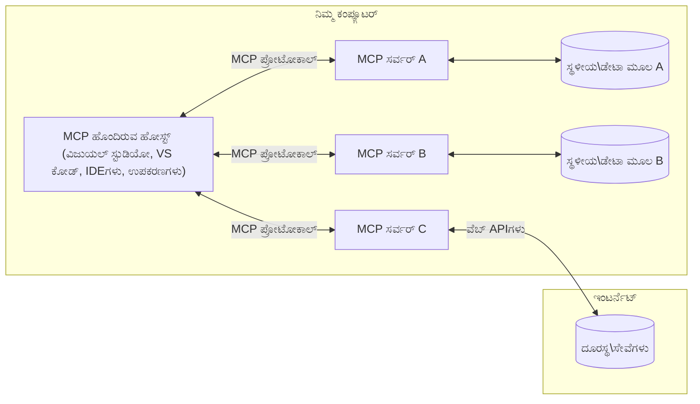

# MCP ಕೋರ್ ಸಂಪ್ರದಾಯಗಳು: AI ಏಕೀಕರಣಕ್ಕಾಗಿ ಮಾದರಿ ಸಂಧರ್ಭ ಪ್ರೋಟೋಕಾಲ್‌ನಲ್ಲಿ ಪರಿಣತಿ

[](https://youtu.be/earDzWGtE84)

_(ಈ ಪಾಠದ ವೀಡಿಯೋವನ್ನು ವೀಕ್ಷಿಸಲು ಮೇಲಿನ ಚಿತ್ರವನ್ನು ಕ್ಲಿಕ್ ಮಾಡಿ)_

[ಮಾದರಿ ಸಂಧರ್ಭ ಪ್ರೋಟೋಕಾಲ್ (MCP)](https://github.com/modelcontextprotocol) ಒಂದು ಶಕ್ತಿಶಾಲಿ, ಮಾನಕೀಕೃತ ಫ್ರೇಮ್ವರ್ಕ್ ಆಗಿದ್ದು, ದೊಡ್ಡ ಭಾಷಾ ಮಾದರಿಗಳು (LLMs) ಮತ್ತು ಬಾಹ್ಯ ಸಾಧನಗಳು, ಅಪ್ಲಿಕೇಶನ್ಗಳು ಮತ್ತು ಡೇಟಾ ಮೂಲಗಳ ನಡುವೆ ಸಂವಹನವನ್ನು ಸುಧಾರಿಸುತ್ತದೆ.  
ಈ ಮಾರ್ಗದರ್ಶಿ ನಿಮಗೆ MCP ನ ಕೋರ್ ಸಂಪ್ರದಾಯಗಳನ್ನು ಪರಿಚಯಿಸುತ್ತದೆ. ನೀವು ಅದರ ಕ್ಲೈಂಟ್-ಸರ್ವರ್ ವಾಸ್ತುಶಿಲ್ಪ, ಅಗತ್ಯ ಘಟಕಗಳು, ಸಂವಹನ ಯಂತ್ರವಿಜ್ಞಾನ ಮತ್ತು ಅನುಷ್ಠಾನ ಉತ್ತಮ ಅಭ್ಯಾಸಗಳನ್ನು ಕಲಿಯುತ್ತೀರಿ.

- **ಸ್ಪಷ್ಟ ಬಳಕೆದಾರ ಅನುಮತಿ**: ಎಲ್ಲಾ ಡೇಟಾ ಪ್ರವೇಶ ಮತ್ತು ಕಾರ್ಯಾಚರಣೆಗಳಿಗೆ ನಿರ್ವಹಣೆಗೆ ಮುಂಚಿತವಾಗಿ ಸ್ಪಷ್ಟ ಬಳಕೆದಾರ ಅನುಮತಿ ಅಗತ್ಯವಿದೆ. ಬಳಕೆದಾರರು ಯಾವ ಡೇಟಾ ಪ್ರವೇಶವಾಗಲಿದೆ ಮತ್ತು ಯಾವ ಕ್ರಿಯೆಗಳು ನಡೆಯಲಿವೆ ಎಂಬುದನ್ನು ಸ್ಪಷ್ಟವಾಗಿ ತಿಳಿದುಕೊಳ್ಳಬೇಕು, ಅನುಮತಿಗಳು ಮತ್ತು ಪ್ರಾಧಿಕಾರಗಳ ಮೇಲೆ ಸೂಕ್ಷ್ಮ ನಿಯಂತ್ರಣದೊಂದಿಗೆ.

- **ಡೇಟಾ ಗೌಪ್ಯತೆ ರಕ್ಷಣೆ**: ಬಳಕೆದಾರ ಡೇಟಾ ಕೇವಲ ಸ್ಪಷ್ಟ ಅನುಮತಿಯೊಂದಿಗೆ ಮಾತ್ರ ಬಹಿರಂಗಗೊಳ್ಳುತ್ತದೆ ಮತ್ತು ಸಂಪೂರ್ಣ ಸಂವಹನ ಜೀವನಚಕ್ರದಲ್ಲಿ ಬಲವಾದ ಪ್ರವೇಶ ನಿಯಂತ್ರಣಗಳಿಂದ ರಕ್ಷಿಸಬೇಕು. ಅನುಷ್ಠಾನಗಳು ಅನಧಿಕೃತ ಡೇಟಾ ಪ್ರಸರಣವನ್ನು ತಡೆಯಬೇಕು ಮತ್ತು ಕಠಿಣ ಗೌಪ್ಯತೆ ಗಡಿಗಳನ್ನು ಕಾಪಾಡಬೇಕು.

- **ಸಾಧನ ಕಾರ್ಯಾಚರಣೆ ಸುರಕ್ಷತೆ**: ಪ್ರತಿ ಸಾಧನ ಕರೆ ಸ್ಪಷ್ಟ ಬಳಕೆದಾರ ಅನುಮತಿಯನ್ನು ಅಗತ್ಯವಿದೆ, ಸಾಧನದ ಕಾರ್ಯಕ್ಷಮತೆ, ಪರಿಮಾಣಗಳು ಮತ್ತು ಸಾಧ್ಯ ಪರಿಣಾಮಗಳನ್ನು ಸ್ಪಷ್ಟವಾಗಿ ತಿಳಿದುಕೊಳ್ಳಬೇಕು. ಬಲವಾದ ಭದ್ರತಾ ಗಡಿಗಳು ಅನಿರೀಕ್ಷಿತ, ಅಪಾಯಕಾರಕ ಅಥವಾ ದುಷ್ಟ ಸಾಧನ ಕಾರ್ಯಾಚರಣೆಯನ್ನು ತಡೆಯಬೇಕು.

- **ಸಂವಹನ ಪದರ ಭದ್ರತೆ**: ಎಲ್ಲಾ ಸಂವಹನ ಚಾನೆಲ್‌ಗಳು ಸೂಕ್ತ ಎನ್‌ಕ್ರಿಪ್ಷನ್ ಮತ್ತು ಪ್ರಮಾಣೀಕರಣ ಯಂತ್ರಗಳನ್ನು ಬಳಸಬೇಕು. ದೂರ ಸಂಪರ್ಕಗಳು ಸುರಕ್ಷಿತ ಸಂವಹನ ಪ್ರೋಟೋಕಾಲ್‌ಗಳನ್ನು ಮತ್ತು ಸರಿಯಾದ ಪ್ರಮಾಣಪತ್ರ ನಿರ್ವಹಣೆಯನ್ನು ಅನುಷ್ಠಾನಗೊಳಿಸಬೇಕು.

#### ಅನುಷ್ಠಾನ ಮಾರ್ಗಸೂಚಿಗಳು:

- **ಅನುಮತಿ ನಿರ್ವಹಣೆ**: ಬಳಕೆದಾರರು ಯಾವ ಸರ್ವರ್‌ಗಳು, ಸಾಧನಗಳು ಮತ್ತು ಸಂಪನ್ಮೂಲಗಳು ಪ್ರವೇಶಿಸಬಹುದೆಂದು ನಿಯಂತ್ರಿಸಲು ಸೂಕ್ಷ್ಮ ಅನುಮತಿ ವ್ಯವಸ್ಥೆಗಳನ್ನು ಅನುಷ್ಠಾನಗೊಳಿಸಿ  
- **ಪ್ರಮಾಣೀಕರಣ ಮತ್ತು ಪ್ರಾಧಿಕಾರ**: ಸುರಕ್ಷಿತ ಪ್ರಮಾಣೀಕರಣ ವಿಧಾನಗಳನ್ನು (OAuth, API ಕೀಗಳು) ಸರಿಯಾದ ಟೋಕನ್ ನಿರ್ವಹಣೆ ಮತ್ತು ಅವಧಿ ಮುಗಿಯುವಿಕೆಯಿಂದ ಬಳಸಿ  
- **ಇನ್ಪುಟ್ ಮಾನ್ಯತೆ**: ನಿರ್ದಿಷ್ಟ ಸ್ಕೀಮಾ ಪ್ರಕಾರ ಎಲ್ಲಾ ಪರಿಮಾಣಗಳು ಮತ್ತು ಡೇಟಾ ಇನ್ಪುಟ್‌ಗಳನ್ನು ಮಾನ್ಯಗೊಳಿಸಿ, ಇಂಜೆಕ್ಷನ್ ದಾಳಿಗಳನ್ನು ತಡೆಯಲು  
- **ಆಡಿಟ್ ಲಾಗಿಂಗ್**: ಭದ್ರತಾ ಮೇಲ್ವಿಚಾರಣೆ ಮತ್ತು ಅನುಕೂಲತೆಗಾಗಿ ಎಲ್ಲಾ ಕಾರ್ಯಾಚರಣೆಗಳ ಸಮಗ್ರ ಲಾಗ್‌ಗಳನ್ನು ಕಾಪಾಡಿ

## ಅವಲೋಕನ

ಈ ಪಾಠವು ಮಾದರಿ ಸಂಧರ್ಭ ಪ್ರೋಟೋಕಾಲ್ (MCP) ಪರಿಸರವನ್ನು ರೂಪಿಸುವ ಮೂಲ ವಾಸ್ತುಶಿಲ್ಪ ಮತ್ತು ಘಟಕಗಳನ್ನು ಅನ್ವೇಷಿಸುತ್ತದೆ. ನೀವು ಕ್ಲೈಂಟ್-ಸರ್ವರ್ ವಾಸ್ತುಶಿಲ್ಪ, ಪ್ರಮುಖ ಘಟಕಗಳು ಮತ್ತು MCP ಸಂವಹನ ಯಂತ್ರವಿಜ್ಞಾನಗಳನ್ನು ಕಲಿಯುತ್ತೀರಿ.

## ಪ್ರಮುಖ ಕಲಿಕೆ ಗುರಿಗಳು

ಈ ಪಾಠದ ಅಂತ್ಯಕ್ಕೆ, ನೀವು:

- MCP ಕ್ಲೈಂಟ್-ಸರ್ವರ್ ವಾಸ್ತುಶಿಲ್ಪವನ್ನು ಅರ್ಥಮಾಡಿಕೊಳ್ಳುತ್ತೀರಿ.  
- ಹೋಸ್ಟ್‌ಗಳು, ಕ್ಲೈಂಟ್‌ಗಳು ಮತ್ತು ಸರ್ವರ್‌ಗಳ ಪಾತ್ರಗಳು ಮತ್ತು ಜವಾಬ್ದಾರಿಗಳನ್ನು ಗುರುತಿಸುತ್ತೀರಿ.  
- MCP ಅನ್ನು ಲವಚಿಕ ಏಕೀಕರಣ ಪದರವಾಗಿಸುವ ಕೋರ್ ವೈಶಿಷ್ಟ್ಯಗಳನ್ನು ವಿಶ್ಲೇಷಿಸುತ್ತೀರಿ.  
- MCP ಪರಿಸರದಲ್ಲಿ ಮಾಹಿತಿ ಹರಿವನ್ನು ಕಲಿಯುತ್ತೀರಿ.  
- .NET, ಜಾವಾ, ಪೈಥಾನ್ ಮತ್ತು ಜಾವಾಸ್ಕ್ರಿಪ್ಟ್‌ನಲ್ಲಿ ಕೋಡ್ ಉದಾಹರಣೆಗಳ ಮೂಲಕ ಪ್ರಾಯೋಗಿಕ ಅಂಶಗಳನ್ನು ಪಡೆಯುತ್ತೀರಿ.

## MCP ವಾಸ್ತುಶಿಲ್ಪ: ಆಳವಾದ ನೋಟ

MCP ಪರಿಸರವು ಕ್ಲೈಂಟ್-ಸರ್ವರ್ ಮಾದರಿಯ ಮೇಲೆ ನಿರ್ಮಿತವಾಗಿದೆ. ಈ ಘಟಕಾತ್ಮಕ ರಚನೆ AI ಅಪ್ಲಿಕೇಶನ್ಗಳು ಸಾಧನಗಳು, ಡೇಟಾಬೇಸ್‌ಗಳು, APIಗಳು ಮತ್ತು ಸಂಧರ್ಭ ಸಂಪನ್ಮೂಲಗಳೊಂದಿಗೆ ಪರಿಣಾಮಕಾರಿಯಾಗಿ ಸಂವಹನ ಮಾಡಲು ಅನುಮತಿಸುತ್ತದೆ. ಈ ವಾಸ್ತುಶಿಲ್ಪವನ್ನು ಅದರ ಕೋರ್ ಘಟಕಗಳಾಗಿ ವಿಭಜಿಸೋಣ.

ಮೂಲತಃ, MCP ಒಂದು ಕ್ಲೈಂಟ್-ಸರ್ವರ್ ವಾಸ್ತುಶಿಲ್ಪವನ್ನು ಅನುಸರಿಸುತ್ತದೆ, ಇಲ್ಲಿ ಒಂದು ಹೋಸ್ಟ್ ಅಪ್ಲಿಕೇಶನ್ ಅನೇಕ ಸರ್ವರ್‌ಗಳಿಗೆ ಸಂಪರ್ಕಿಸಬಹುದು:


- **MCP ಹೋಸ್ಟ್‌ಗಳು**: VSCode, Claude ಡೆಸ್ಕ್‌ಟಾಪ್, IDEಗಳು ಅಥವಾ MCP ಮೂಲಕ ಡೇಟಾ ಪ್ರವೇಶಿಸಲು ಬಯಸುವ AI ಸಾಧನಗಳು  
- **MCP ಕ್ಲೈಂಟ್‌ಗಳು**: ಸರ್ವರ್‌ಗಳೊಂದಿಗೆ 1:1 ಸಂಪರ್ಕಗಳನ್ನು ನಿರ್ವಹಿಸುವ ಪ್ರೋಟೋಕಾಲ್ ಕ್ಲೈಂಟ್‌ಗಳು  
- **MCP ಸರ್ವರ್‌ಗಳು**: ಪ್ರತಿ ಸರ್ವರ್ ಮಾನಕೀಕೃತ ಮಾದರಿ ಸಂಧರ್ಭ ಪ್ರೋಟೋಕಾಲ್ ಮೂಲಕ ನಿರ್ದಿಷ್ಟ ಸಾಮರ್ಥ್ಯಗಳನ್ನು ಬಹಿರಂಗಪಡಿಸುವ ಲಘು-ತೂಕದ ಪ್ರೋಗ್ರಾಮ್‌ಗಳು  
- **ಸ್ಥಳೀಯ ಡೇಟಾ ಮೂಲಗಳು**: ನಿಮ್ಮ ಕಂಪ್ಯೂಟರ್‌ನ ಫೈಲ್‌ಗಳು, ಡೇಟಾಬೇಸ್‌ಗಳು ಮತ್ತು ಸೇವೆಗಳು, ಅವುಗಳನ್ನು MCP ಸರ್ವರ್‌ಗಳು ಸುರಕ್ಷಿತವಾಗಿ ಪ್ರವೇಶಿಸಬಹುದು  
- **ದೂರಸ್ಥ ಸೇವೆಗಳು**: ಇಂಟರ್ನೆಟ್ ಮೂಲಕ ಲಭ್ಯವಿರುವ ಬಾಹ್ಯ ವ್ಯವಸ್ಥೆಗಳು, ಅವುಗಳಿಗೆ MCP ಸರ್ವರ್‌ಗಳು APIಗಳ ಮೂಲಕ ಸಂಪರ್ಕಿಸಬಹುದು.

MCP ಪ್ರೋಟೋಕಾಲ್ ದಿನಾಂಕ ಆಧಾರಿತ ಆವೃತ್ತಿ (YYYY-MM-DD ಸ್ವರೂಪ) ಬಳಸಿ ಅಭಿವೃದ್ಧಿಯಾಗುತ್ತಿರುವ ಮಾನಕವಾಗಿದೆ. ಪ್ರಸ್ತುತ ಪ್ರೋಟೋಕಾಲ್ ಆವೃತ್ತಿ **2025-11-25** ಆಗಿದೆ. ನೀವು [ಪ್ರೋಟೋಕಾಲ್ ನಿರ್ದಿಷ್ಟತೆ](https://modelcontextprotocol.io/specification/2025-11-25/) ನ ಇತ್ತೀಚಿನ ನವೀಕರಣಗಳನ್ನು ನೋಡಬಹುದು.

### 1. ಹೋಸ್ಟ್‌ಗಳು

ಮಾದರಿ ಸಂಧರ್ಭ ಪ್ರೋಟೋಕಾಲ್ (MCP) ನಲ್ಲಿ, **ಹೋಸ್ಟ್‌ಗಳು** ಬಳಕೆದಾರರು ಪ್ರೋಟೋಕಾಲ್ ಜೊತೆಗೆ ಸಂವಹನ ಮಾಡುವ ಪ್ರಾಥಮಿಕ ಇಂಟರ್ಫೇಸ್ ಆಗಿರುವ AI ಅಪ್ಲಿಕೇಶನ್ಗಳು. ಹೋಸ್ಟ್‌ಗಳು ಅನೇಕ MCP ಸರ್ವರ್‌ಗಳಿಗೆ ಸಂಪರ್ಕಗಳನ್ನು ನಿರ್ವಹಿಸಿ, ಪ್ರತಿ ಸರ್ವರ್ ಸಂಪರ್ಕಕ್ಕೆ ಸಮರ್ಪಿತ MCP ಕ್ಲೈಂಟ್‌ಗಳನ್ನು ರಚಿಸುತ್ತವೆ. ಹೋಸ್ಟ್‌ಗಳ ಉದಾಹರಣೆಗಳು:

- **AI ಅಪ್ಲಿಕೇಶನ್ಗಳು**: Claude ಡೆಸ್ಕ್‌ಟಾಪ್, Visual Studio Code, Claude Code  
- **ವಿಕಸನ ಪರಿಸರಗಳು**: MCP ಏಕೀಕರಣ ಹೊಂದಿರುವ IDEಗಳು ಮತ್ತು ಕೋಡ್ ಸಂಪಾದಕರು  
- **ಕಸ್ಟಮ್ ಅಪ್ಲಿಕೇಶನ್ಗಳು**: ಉದ್ದೇಶಿತ AI ಏಜೆಂಟ್‌ಗಳು ಮತ್ತು ಸಾಧನಗಳು

**ಹೋಸ್ಟ್‌ಗಳು** AI ಮಾದರಿ ಸಂವಹನಗಳನ್ನು ಸಂಯೋಜಿಸುವ ಅಪ್ಲಿಕೇಶನ್ಗಳು. ಅವು:

- **AI ಮಾದರಿಗಳನ್ನು ಸಂಯೋಜಿಸುವುದು**: ಪ್ರತಿಕ್ರಿಯೆಗಳನ್ನು ರಚಿಸಲು ಅಥವಾ LLMಗಳೊಂದಿಗೆ ಸಂವಹನ ಮಾಡಲು AI ಕಾರ್ಯಪ್ರವಾಹಗಳನ್ನು ಸಂಯೋಜಿಸುವುದು  
- **ಕ್ಲೈಂಟ್ ಸಂಪರ್ಕಗಳನ್ನು ನಿರ್ವಹಿಸುವುದು**: ಪ್ರತಿ MCP ಸರ್ವರ್ ಸಂಪರ್ಕಕ್ಕೆ ಒಂದು MCP ಕ್ಲೈಂಟ್ ರಚಿಸಿ ನಿರ್ವಹಿಸುವುದು  
- **ಬಳಕೆದಾರ ಇಂಟರ್ಫೇಸ್ ನಿಯಂತ್ರಣ**: ಸಂಭಾಷಣಾ ಹರಿವು, ಬಳಕೆದಾರ ಸಂವಹನ ಮತ್ತು ಪ್ರತಿಕ್ರಿಯೆ ಪ್ರದರ್ಶನವನ್ನು ನಿರ್ವಹಿಸುವುದು  
- **ಭದ್ರತೆ ಜಾರಿಗೊಳಿಸುವುದು**: ಅನುಮತಿಗಳು, ಭದ್ರತಾ ನಿಯಮಗಳು ಮತ್ತು ಪ್ರಮಾಣೀಕರಣವನ್ನು ನಿಯಂತ್ರಿಸುವುದು  
- **ಬಳಕೆದಾರ ಅನುಮತಿ ನಿರ್ವಹಣೆ**: ಡೇಟಾ ಹಂಚಿಕೆ ಮತ್ತು ಸಾಧನ ಕಾರ್ಯಾಚರಣೆಗೆ ಬಳಕೆದಾರ ಅನುಮತಿಯನ್ನು ನಿರ್ವಹಿಸುವುದು

### 2. ಕ್ಲೈಂಟ್‌ಗಳು

**ಕ್ಲೈಂಟ್‌ಗಳು** ಹೋಸ್ಟ್‌ಗಳು ಮತ್ತು MCP ಸರ್ವರ್‌ಗಳ ನಡುವೆ ಸಮರ್ಪಿತ 1:1 ಸಂಪರ್ಕಗಳನ್ನು ನಿರ್ವಹಿಸುವ ಅಗತ್ಯ ಘಟಕಗಳು. ಪ್ರತಿ MCP ಕ್ಲೈಂಟ್ ಅನ್ನು ಹೋಸ್ಟ್ ಒಂದು ನಿರ್ದಿಷ್ಟ MCP ಸರ್ವರ್‌ಗೆ ಸಂಪರ್ಕಿಸಲು ರಚಿಸುತ್ತದೆ, ಸಂಘಟಿತ ಮತ್ತು ಸುರಕ್ಷಿತ ಸಂವಹನ ಚಾನೆಲ್‌ಗಳನ್ನು ಖಚಿತಪಡಿಸುತ್ತದೆ. ಅನೇಕ ಕ್ಲೈಂಟ್‌ಗಳು ಹೋಸ್ಟ್‌ಗಳಿಗೆ ಅನೇಕ ಸರ್ವರ್‌ಗಳಿಗೆ ಒಂದೇ ಸಮಯದಲ್ಲಿ ಸಂಪರ್ಕಿಸಲು ಅನುಮತಿಸುತ್ತವೆ.

**ಕ್ಲೈಂಟ್‌ಗಳು** ಹೋಸ್ಟ್ ಅಪ್ಲಿಕೇಶನ್ ಒಳಗಿನ ಸಂಪರ್ಕ ಘಟಕಗಳು. ಅವು:

- **ಪ್ರೋಟೋಕಾಲ್ ಸಂವಹನ**: ಪ್ರಾಂಪ್ಟ್‌ಗಳು ಮತ್ತು ಸೂಚನೆಗಳೊಂದಿಗೆ JSON-RPC 2.0 ವಿನಂತಿಗಳನ್ನು ಸರ್ವರ್‌ಗಳಿಗೆ ಕಳುಹಿಸುವುದು  
- **ಸಾಮರ್ಥ್ಯ ಸಂಧಾನ**: ಪ್ರಾರಂಭದಲ್ಲಿ ಸರ್ವರ್‌ಗಳೊಂದಿಗೆ ಬೆಂಬಲಿತ ವೈಶಿಷ್ಟ್ಯಗಳು ಮತ್ತು ಪ್ರೋಟೋಕಾಲ್ ಆವೃತ್ತಿಗಳನ್ನು ಸಂಧಾನಿಸುವುದು  
- **ಸಾಧನ ಕಾರ್ಯಾಚರಣೆ**: ಮಾದರಿಗಳಿಂದ ಸಾಧನ ಕಾರ್ಯಾಚರಣೆ ವಿನಂತಿಗಳನ್ನು ನಿರ್ವಹಿಸಿ ಪ್ರತಿಕ್ರಿಯೆಗಳನ್ನು ಪ್ರಕ್ರಿಯೆಗೊಳಿಸುವುದು  
- **ನೈಜ-ಸಮಯ ನವೀಕರಣಗಳು**: ಸರ್ವರ್‌ಗಳಿಂದ ಸೂಚನೆಗಳು ಮತ್ತು ನೈಜ-ಸಮಯ ನವೀಕರಣಗಳನ್ನು ನಿರ್ವಹಿಸುವುದು  
- **ಪ್ರತಿಕ್ರಿಯೆ ಪ್ರಕ್ರಿಯೆ**: ಬಳಕೆದಾರರಿಗೆ ಪ್ರದರ್ಶನಕ್ಕಾಗಿ ಸರ್ವರ್ ಪ್ರತಿಕ್ರಿಯೆಗಳನ್ನು ಪ್ರಕ್ರಿಯೆಗೊಳಿಸಿ ಸ್ವರೂಪಗೊಳಿಸುವುದು

### 3. ಸರ್ವರ್‌ಗಳು

**ಸರ್ವರ್‌ಗಳು** MCP ಕ್ಲೈಂಟ್‌ಗಳಿಗೆ ಸಂಧರ್ಭ, ಸಾಧನಗಳು ಮತ್ತು ಸಾಮರ್ಥ್ಯಗಳನ್ನು ಒದಗಿಸುವ ಪ್ರೋಗ್ರಾಮ್‌ಗಳು. ಅವು ಸ್ಥಳೀಯವಾಗಿ (ಹೋಸ್ಟ್‌ನೊಂದಿಗೆ ಒಂದೇ ಯಂತ್ರದಲ್ಲಿ) ಅಥವಾ ದೂರಸ್ಥವಾಗಿ (ಬಾಹ್ಯ ವೇದಿಕೆಗಳಲ್ಲಿ) ಕಾರ್ಯನಿರ್ವಹಿಸಬಹುದು ಮತ್ತು ಕ್ಲೈಂಟ್ ವಿನಂತಿಗಳನ್ನು ನಿರ್ವಹಿಸಿ ರಚನಾತ್ಮಕ ಪ್ರತಿಕ್ರಿಯೆಗಳನ್ನು ಒದಗಿಸುವ ಜವಾಬ್ದಾರಿಯನ್ನು ಹೊಂದಿವೆ. ಸರ್ವರ್‌ಗಳು ಮಾನಕೀಕೃತ ಮಾದರಿ ಸಂಧರ್ಭ ಪ್ರೋಟೋಕಾಲ್ ಮೂಲಕ ನಿರ್ದಿಷ್ಟ ಕಾರ್ಯಕ್ಷಮತೆಯನ್ನು ಬಹಿರಂಗಪಡಿಸುತ್ತವೆ.

**ಸರ್ವರ್‌ಗಳು** ಸಂಧರ್ಭ ಮತ್ತು ಸಾಮರ್ಥ್ಯಗಳನ್ನು ಒದಗಿಸುವ ಸೇವೆಗಳು. ಅವು:

- **ವೈಶಿಷ್ಟ್ಯ ನೋಂದಣಿ**: ಲಭ್ಯವಿರುವ ಮೂಲಭೂತ ಘಟಕಗಳನ್ನು (ಸಂಪನ್ಮೂಲಗಳು, ಪ್ರಾಂಪ್ಟ್‌ಗಳು, ಸಾಧನಗಳು) ಕ್ಲೈಂಟ್‌ಗಳಿಗೆ ನೋಂದಣಿ ಮಾಡಿ ಬಹಿರಂಗಪಡಿಸುವುದು  
- **ವಿನಂತಿ ಪ್ರಕ್ರಿಯೆ**: ಸಾಧನ ಕರೆಗಳು, ಸಂಪನ್ಮೂಲ ವಿನಂತಿಗಳು ಮತ್ತು ಪ್ರಾಂಪ್ಟ್ ವಿನಂತಿಗಳನ್ನು ಸ್ವೀಕರಿಸಿ ಕಾರ್ಯಗತಗೊಳಿಸುವುದು  
- **ಸಂಧರ್ಭ ಒದಗಿಸುವಿಕೆ**: ಮಾದರಿ ಪ್ರತಿಕ್ರಿಯೆಗಳನ್ನು ಸುಧಾರಿಸಲು ಸಂಧರ್ಭ ಮಾಹಿತಿ ಮತ್ತು ಡೇಟಾವನ್ನು ಒದಗಿಸುವುದು  
- **ಸ್ಥಿತಿ ನಿರ್ವಹಣೆ**: ಅವಶ್ಯಕತೆ ಇದ್ದಾಗ ಸೆಷನ್ ಸ್ಥಿತಿಯನ್ನು ಕಾಪಾಡಿ ಸ್ಥಿತಿಗತ ಸಂವಹನಗಳನ್ನು ನಿರ್ವಹಿಸುವುದು  
- **ನೈಜ-ಸಮಯ ಸೂಚನೆಗಳು**: ಸಾಮರ್ಥ್ಯ ಬದಲಾವಣೆಗಳು ಮತ್ತು ನವೀಕರಣಗಳ ಬಗ್ಗೆ ಸಂಪರ್ಕಿತ ಕ್ಲೈಂಟ್‌ಗಳಿಗೆ ಸೂಚನೆಗಳನ್ನು ಕಳುಹಿಸುವುದು

ಸರ್ವರ್‌ಗಳನ್ನು ಯಾರಾದರೂ ವಿಶೇಷ ಕಾರ್ಯಕ್ಷಮತೆಯೊಂದಿಗೆ ಮಾದರಿ ಸಾಮರ್ಥ್ಯಗಳನ್ನು ವಿಸ್ತರಿಸಲು ಅಭಿವೃದ್ಧಿಪಡಿಸಬಹುದು ಮತ್ತು ಅವು ಸ್ಥಳೀಯ ಮತ್ತು ದೂರಸ್ಥ ನಿಯೋಜನೆ ಪರಿಕಲ್ಪನೆಗಳನ್ನು ಬೆಂಬಲಿಸುತ್ತವೆ.

### 4. ಸರ್ವರ್ ಮೂಲಭೂತ ಘಟಕಗಳು

ಮಾದರಿ ಸಂಧರ್ಭ ಪ್ರೋಟೋಕಾಲ್ (MCP) ನಲ್ಲಿ ಸರ್ವರ್‌ಗಳು ಮೂರು ಕೋರ್ **ಮೂಲಭೂತ ಘಟಕಗಳನ್ನು** ಒದಗಿಸುತ್ತವೆ, ಅವು ಕ್ಲೈಂಟ್‌ಗಳು, ಹೋಸ್ಟ್‌ಗಳು ಮತ್ತು ಭಾಷಾ ಮಾದರಿಗಳ ನಡುವೆ ಶ್ರೀಮಂತ ಸಂವಹನಕ್ಕಾಗಿ ಮೂಲಭೂತ ಕಟ್ಟಡ ಬ್ಲಾಕ್‌ಗಳನ್ನು ನಿರ್ಧರಿಸುತ್ತವೆ. ಈ ಮೂಲಭೂತ ಘಟಕಗಳು ಪ್ರೋಟೋಕಾಲ್ ಮೂಲಕ ಲಭ್ಯವಿರುವ ಸಂಧರ್ಭ ಮಾಹಿತಿ ಮತ್ತು ಕ್ರಿಯೆಗಳ ಪ್ರಕಾರವನ್ನು ನಿರ್ಧರಿಸುತ್ತವೆ.

MCP ಸರ್ವರ್‌ಗಳು ಕೆಳಗಿನ ಮೂರು ಕೋರ್ ಮೂಲಭೂತ ಘಟಕಗಳ ಯಾವುದೇ ಸಂಯೋಜನೆಯನ್ನು ಬಹಿರಂಗಪಡಿಸಬಹುದು:

#### ಸಂಪನ್ಮೂಲಗಳು

**ಸಂಪನ್ಮೂಲಗಳು** AI ಅಪ್ಲಿಕೇಶನ್ಗೆ ಸಂಧರ್ಭ ಮಾಹಿತಿ ಒದಗಿಸುವ ಡೇಟಾ ಮೂಲಗಳು. ಅವು ಸ್ಥಿರ ಅಥವಾ ಚಲಿಸುವ ವಿಷಯವನ್ನು ಪ್ರತಿನಿಧಿಸುತ್ತವೆ, ಇದು ಮಾದರಿ ಅರ್ಥಮಾಡಿಕೊಳ್ಳುವಿಕೆ ಮತ್ತು ನಿರ್ಧಾರ ಕೈಗೊಳ್ಳುವಿಕೆಯನ್ನು ಸುಧಾರಿಸುತ್ತದೆ:

- **ಸಂಧರ್ಭ ಡೇಟಾ**: AI ಮಾದರಿ ಬಳಕೆಗೆ ರಚನಾತ್ಮಕ ಮಾಹಿತಿ ಮತ್ತು ಸಂಧರ್ಭ  
- **ಜ್ಞಾನ ಆಧಾರಗಳು**: ಡಾಕ್ಯುಮೆಂಟ್ ಸಂಗ್ರಹಗಳು, ಲೇಖನಗಳು, ಕೈಪಿಡಿಗಳು ಮತ್ತು ಸಂಶೋಧನಾ ಪತ್ರಿಕೆಗಳು  
- **ಸ್ಥಳೀಯ ಡೇಟಾ ಮೂಲಗಳು**: ಫೈಲ್‌ಗಳು, ಡೇಟಾಬೇಸ್‌ಗಳು ಮತ್ತು ಸ್ಥಳೀಯ ವ್ಯವಸ್ಥೆ ಮಾಹಿತಿ  
- **ಬಾಹ್ಯ ಡೇಟಾ**: API ಪ್ರತಿಕ್ರಿಯೆಗಳು, ವೆಬ್ ಸೇವೆಗಳು ಮತ್ತು ದೂರಸ್ಥ ವ್ಯವಸ್ಥೆ ಡೇಟಾ  
- **ಚಲಿಸುವ ವಿಷಯ**: ಬಾಹ್ಯ ಪರಿಸ್ಥಿತಿಗಳ ಆಧಾರದ ಮೇಲೆ ನೈಜ-ಸಮಯ ಡೇಟಾ

ಸಂಪನ್ಮೂಲಗಳನ್ನು URIಗಳ ಮೂಲಕ ಗುರುತಿಸಲಾಗುತ್ತದೆ ಮತ್ತು `resources/list` ಮೂಲಕ ಅನ್ವೇಷಣೆ ಮತ್ತು `resources/read` ಮೂಲಕ ಪಡೆಯಲು ಬೆಂಬಲಿಸುತ್ತವೆ:

```text
file://documents/project-spec.md
database://production/users/schema
api://weather/current
```

#### ಪ್ರಾಂಪ್ಟ್‌ಗಳು

**ಪ್ರಾಂಪ್ಟ್‌ಗಳು** ಭಾಷಾ ಮಾದರಿಗಳೊಂದಿಗೆ ಸಂವಹನವನ್ನು ರಚಿಸಲು ಸಹಾಯ ಮಾಡುವ ಪುನಃಬಳಕೆ ಮಾಡಬಹುದಾದ ಟೆಂಪ್ಲೇಟುಗಳು. ಅವು ಮಾನಕೀಕೃತ ಸಂವಹನ ಮಾದರಿಗಳು ಮತ್ತು ಟೆಂಪ್ಲೇಟು ಕಾರ್ಯಪ್ರವಾಹಗಳನ್ನು ಒದಗಿಸುತ್ತವೆ:

- **ಟೆಂಪ್ಲೇಟು ಆಧಾರಿತ ಸಂವಹನಗಳು**: ಪೂರ್ವ-ರಚಿಸಲಾದ ಸಂದೇಶಗಳು ಮತ್ತು ಸಂಭಾಷಣಾ ಪ್ರಾರಂಭಗಳು  
- **ಕಾರ್ಯಪ್ರವಾಹ ಟೆಂಪ್ಲೇಟುಗಳು**: ಸಾಮಾನ್ಯ ಕಾರ್ಯಗಳು ಮತ್ತು ಸಂವಹನಗಳಿಗೆ ಮಾನಕೀಕೃತ ಕ್ರಮಗಳು  
- **ಕೆಲವು-ಶಾಟ್ ಉದಾಹರಣೆಗಳು**: ಮಾದರಿ ಸೂಚನೆಗಾಗಿ ಉದಾಹರಣೆ ಆಧಾರಿತ ಟೆಂಪ್ಲೇಟುಗಳು  
- **ಸಿಸ್ಟಮ್ ಪ್ರಾಂಪ್ಟ್‌ಗಳು**: ಮಾದರಿ ವರ್ತನೆ ಮತ್ತು ಸಂಧರ್ಭವನ್ನು ನಿರ್ಧರಿಸುವ ಮೂಲಭೂತ ಪ್ರಾಂಪ್ಟ್‌ಗಳು  
- **ಚಲಿಸುವ ಟೆಂಪ್ಲೇಟುಗಳು**: ನಿರ್ದಿಷ್ಟ ಸಂಧರ್ಭಗಳಿಗೆ ಹೊಂದಿಕೊಳ್ಳುವ ಪರಿಮಾಣಿತ ಪ್ರಾಂಪ್ಟ್‌ಗಳು

ಪ್ರಾಂಪ್ಟ್‌ಗಳು ಚರ ಪರಿವರ್ತನೆಗೆ ಬೆಂಬಲ ನೀಡುತ್ತವೆ ಮತ್ತು `prompts/list` ಮೂಲಕ ಅನ್ವೇಷಣೆ ಮತ್ತು `prompts/get` ಮೂಲಕ ಪಡೆಯಬಹುದು:

```markdown
Generate a {{task_type}} for {{product}} targeting {{audience}} with the following requirements: {{requirements}}
```

#### ಸಾಧನಗಳು

**ಸಾಧನಗಳು** AI ಮಾದರಿಗಳು ನಿರ್ದಿಷ್ಟ ಕ್ರಿಯೆಗಳನ್ನು ನಿರ್ವಹಿಸಲು ಕರೆಮಾಡಬಹುದಾದ ಕಾರ್ಯನಿರ್ವಹಣಾ ಫಂಕ್ಷನ್‌ಗಳು. ಅವು MCP ಪರಿಸರದ "ಕ್ರಿಯಾಪದಗಳು", ಮಾದರಿಗಳನ್ನು ಬಾಹ್ಯ ವ್ಯವಸ್ಥೆಗಳೊಂದಿಗೆ ಸಂವಹನ ಮಾಡಲು ಸಕ್ರಿಯಗೊಳಿಸುತ್ತವೆ:

- **ಕಾರ್ಯನಿರ್ವಹಣಾ ಫಂಕ್ಷನ್‌ಗಳು**: ಮಾದರಿಗಳು ನಿರ್ದಿಷ್ಟ ಪರಿಮಾಣಗಳೊಂದಿಗೆ ಕರೆಮಾಡಬಹುದಾದ ವಿಭಿನ್ನ ಕಾರ್ಯಗಳು  
- **ಬಾಹ್ಯ ವ್ಯವಸ್ಥೆ ಏಕೀಕರಣ**: API ಕರೆಗಳು, ಡೇಟಾಬೇಸ್ ಪ್ರಶ್ನೆಗಳು, ಫೈಲ್ ಕಾರ್ಯಾಚರಣೆಗಳು, ಲೆಕ್ಕಾಚಾರಗಳು  
- **ವಿಶಿಷ್ಟ ಗುರುತು**: ಪ್ರತಿ ಸಾಧನಕ್ಕೆ ವಿಭಿನ್ನ ಹೆಸರು, ವಿವರಣೆ ಮತ್ತು ಪರಿಮಾಣ ಸ್ಕೀಮಾ ಇರುತ್ತದೆ  
- **ರಚನಾತ್ಮಕ ಇನ್‌ಪುಟ್/ಔಟ್‌ಪುಟ್**: ಸಾಧನಗಳು ಮಾನ್ಯಗೊಳಿಸಿದ ಪರಿಮಾಣಗಳನ್ನು ಸ್ವೀಕರಿಸಿ ರಚನಾತ್ಮಕ, ಟೈಪ್ ಮಾಡಲಾದ ಪ್ರತಿಕ್ರಿಯೆಗಳನ್ನು ನೀಡುತ್ತವೆ  
- **ಕ್ರಿಯಾತ್ಮಕ ಸಾಮರ್ಥ್ಯಗಳು**: ಮಾದರಿಗಳಿಗೆ ನೈಜ ಜಗತ್ತಿನ ಕ್ರಿಯೆಗಳನ್ನು ನಿರ್ವಹಿಸಲು ಮತ್ತು ನೈಜ ಡೇಟಾವನ್ನು ಪಡೆಯಲು ಅನುಮತಿಸುವುದು

ಸಾಧನಗಳನ್ನು ಪರಿಮಾಣ ಮಾನ್ಯತೆಗಾಗಿ JSON ಸ್ಕೀಮಾ ಬಳಸಿ ವ್ಯಾಖ್ಯಾನಿಸಲಾಗುತ್ತದೆ ಮತ್ತು `tools/list` ಮೂಲಕ ಅನ್ವೇಷಣೆ ಮತ್ತು `tools/call` ಮೂಲಕ ಕಾರ್ಯಗತಗೊಳಿಸಲಾಗುತ್ತದೆ:

```typescript
server.tool(
  "search_products", 
  {
    query: z.string().describe("Search query for products"),
    category: z.string().optional().describe("Product category filter"),
    max_results: z.number().default(10).describe("Maximum results to return")
  }, 
  async (params) => {
    // ಹುಡುಕಾಟವನ್ನು ನಿರ್ವಹಿಸಿ ಮತ್ತು ರಚನಾತ್ಮಕ ಫಲಿತಾಂಶಗಳನ್ನು ಹಿಂತಿರುಗಿಸಿ
    return await productService.search(params);
  }
);
```

## ಕ್ಲೈಂಟ್ ಮೂಲಭೂತ ಘಟಕಗಳು

ಮಾದರಿ ಸಂಧರ್ಭ ಪ್ರೋಟೋಕಾಲ್ (MCP) ನಲ್ಲಿ, **ಕ್ಲೈಂಟ್‌ಗಳು** ಹೋಸ್ಟ್ ಅಪ್ಲಿಕೇಶನ್‌ನಿಂದ ಹೆಚ್ಚುವರಿ ಸಾಮರ್ಥ್ಯಗಳನ್ನು ಕೇಳಲು ಸರ್ವರ್‌ಗಳಿಗೆ ಅನುಮತಿಸುವ ಮೂಲಭೂತ ಘಟಕಗಳನ್ನು ಬಹಿರಂಗಪಡಿಸಬಹುದು. ಈ ಕ್ಲೈಂಟ್-ಪಾರ್ಶ್ವ ಮೂಲಭೂತ ಘಟಕಗಳು ಶ್ರೀಮಂತ, ಹೆಚ್ಚು ಸಂವಹನಾತ್ಮಕ ಸರ್ವರ್ ಅನುಷ್ಠಾನಗಳಿಗೆ ಅವಕಾಶ ನೀಡುತ್ತವೆ, ಅವು AI ಮಾದರಿ ಸಾಮರ್ಥ್ಯಗಳು ಮತ್ತು ಬಳಕೆದಾರ ಸಂವಹನಗಳನ್ನು ಪ್ರವೇಶಿಸಬಹುದು.

### ಸ್ಯಾಂಪ್ಲಿಂಗ್

**ಸ್ಯಾಂಪ್ಲಿಂಗ್** ಸರ್ವರ್‌ಗಳಿಗೆ ಕ್ಲೈಂಟ್‌ನ AI ಅಪ್ಲಿಕೇಶನ್‌ನಿಂದ ಭಾಷಾ ಮಾದರಿ ಪೂರ್ಣಗೊಳಿಸುವಿಕೆಗಳನ್ನು ಕೇಳಲು ಅನುಮತಿಸುತ್ತದೆ. ಈ ಮೂಲಭೂತ ಘಟಕ ಸರ್ವರ್‌ಗಳಿಗೆ ತಮ್ಮದೇ ಮಾದರಿ ಅವಲಂಬನೆಗಳನ್ನು ಒಳಗೊಂಡಿಲ್ಲದೆ LLM ಸಾಮರ್ಥ್ಯಗಳನ್ನು ಪ್ರವೇಶಿಸಲು ಅವಕಾಶ ನೀಡುತ್ತದೆ:

- **ಮಾದರಿ-ಸ್ವತಂತ್ರ ಪ್ರವೇಶ**: ಸರ್ವರ್‌ಗಳು LLM SDKಗಳನ್ನು ಒಳಗೊಂಡಿಲ್ಲದೆ ಅಥವಾ ಮಾದರಿ ಪ್ರವೇಶವನ್ನು ನಿರ್ವಹಿಸದೆ ಪೂರ್ಣಗೊಳಿಸುವಿಕೆಗಳನ್ನು ಕೇಳಬಹುದು  
- **ಸರ್ವರ್ ಪ್ರಾರಂಭಿತ AI**: ಸರ್ವರ್‌ಗಳು ಸ್ವತಂತ್ರವಾಗಿ ಕ್ಲೈಂಟ್‌ನ AI ಮಾದರಿಯನ್ನು ಬಳಸಿ ವಿಷಯವನ್ನು ರಚಿಸಲು ಅನುಮತಿಸುತ್ತದೆ  
- **ಪುನರಾವರ್ತಿತ LLM ಸಂವಹನಗಳು**: ಸರ್ವರ್‌ಗಳಿಗೆ ಪ್ರಕ್ರಿಯೆಗೆ AI ಸಹಾಯ ಬೇಕಾದ ಸಂಕೀರ್ಣ ಸಂದರ್ಭಗಳನ್ನು ಬೆಂಬಲಿಸುತ್ತದೆ  
- **ಚಲಿಸುವ ವಿಷಯ ರಚನೆ**: ಹೋಸ್ಟ್‌ನ ಮಾದರಿಯನ್ನು ಬಳಸಿ ಸರ್ವರ್‌ಗಳು ಸಂಧರ್ಭಾತ್ಮಕ ಪ್ರತಿಕ್ರಿಯೆಗಳನ್ನು ರಚಿಸಲು ಅನುಮತಿಸುತ್ತದೆ

ಸ್ಯಾಂಪ್ಲಿಂಗ್ `sampling/complete` ವಿಧಾನದ ಮೂಲಕ ಪ್ರಾರಂಭವಾಗುತ್ತದೆ, ಇಲ್ಲಿ ಸರ್ವರ್‌ಗಳು ಪೂರ್ಣಗೊಳಿಸುವಿಕೆ ವಿನಂತಿಗಳನ್ನು ಕ್ಲೈಂಟ್‌ಗಳಿಗೆ ಕಳುಹಿಸುತ್ತವೆ.

### ಎಲಿಸಿಟೇಶನ್

**ಎಲಿಸಿಟೇಶನ್** ಸರ್ವರ್‌ಗಳಿಗೆ ಬಳಕೆದಾರರಿಂದ ಹೆಚ್ಚುವರಿ ಮಾಹಿತಿ ಅಥವಾ ದೃಢೀಕರಣವನ್ನು ಕ್ಲೈಂಟ್ ಇಂಟರ್ಫೇಸ್ ಮೂಲಕ ಕೇಳಲು ಅನುಮತಿಸುತ್ತದೆ:

- **ಬಳಕೆದಾರ ಇನ್ಪುಟ್ ವಿನಂತಿಗಳು**: ಸಾಧನ ಕಾರ್ಯಾಚರಣೆಗೆ ಅಗತ್ಯವಿರುವ ಹೆಚ್ಚುವರಿ ಮಾಹಿತಿಗಾಗಿ ಸರ್ವರ್‌ಗಳು ಕೇಳಬಹುದು  
- **ದೃಢೀಕರಣ ಸಂವಾದಗಳು**: ಸಂವೇದನಾಶೀಲ ಅಥವಾ ಪರಿಣಾಮಕಾರಿ ಕಾರ್ಯಾಚರಣೆಗಳಿಗೆ ಬಳಕೆದಾರ ಅನುಮತಿಯನ್ನು ಕೇಳುವುದು  
- **ಸಂವಹನಾತ್ಮಕ ಕಾರ್ಯಪ್ರವಾಹಗಳು**: ಸರ್ವರ್‌ಗಳಿಗೆ ಹಂತ ಹಂತವಾಗಿ ಬಳಕೆದಾರ ಸಂವಹನಗಳನ್ನು ರಚಿಸಲು ಅನುಮತಿಸುವುದು  
- **ಚಲಿಸುವ ಪರಿಮಾಣ ಸಂಗ್ರಹಣೆ**: ಸಾಧನ ಕಾರ್ಯಾಚರಣೆಯ ಸಮಯದಲ್ಲಿ ಕಳೆದುಹೋಗಿದ ಅಥವಾ ಐಚ್ಛಿಕ ಪರಿಮಾಣಗಳನ್ನು ಸಂಗ್ರಹಿಸುವುದು

ಎಲಿಸಿಟೇಶನ್ ವಿನಂತಿಗಳನ್ನು `elicitation/request` ವಿಧಾನ ಬಳಸಿ ಕ್ಲೈಂಟ್ ಇಂಟರ್ಫೇಸ್ ಮೂಲಕ ಬಳಕೆದಾರ ಇನ್ಪುಟ್ ಸಂಗ್ರಹಿಸಲು ಮಾಡಲಾಗುತ್ತದೆ.

### ಲಾಗಿಂಗ್

**ಲಾಗಿಂಗ್** ಸರ್ವರ್‌ಗಳಿಗೆ ಡಿಬಗ್, ಮೇಲ್ವಿಚಾರಣೆ ಮತ್ತು ಕಾರ್ಯಾಚರಣೆ ದೃಶ್ಯತೆಯಿಗಾಗಿ ರಚನಾತ್ಮಕ ಲಾಗ್ ಸಂದೇಶಗಳನ್ನು ಕ್ಲೈಂಟ್‌ಗಳಿಗೆ ಕಳುಹಿಸಲು ಅನುಮತಿಸುತ್ತದೆ:

- **ಡಿಬಗ್ ಬೆಂಬಲ**: ಸಮಸ್ಯೆ ಪರಿಹಾರಕ್ಕಾಗಿ ಸರ್ವರ್‌ಗಳಿಗೆ ವಿವರವಾದ ಕಾರ್ಯಾಚರಣೆ ಲಾಗ್‌ಗಳನ್ನು ಒದಗಿಸಲು ಅನುಮತಿಸುವುದು  
- **ಕಾರ್ಯಾಚರಣೆ ಮೇಲ್ವಿಚಾರಣೆ**: ಸ್ಥಿತಿ ನವೀಕರಣಗಳು ಮತ್ತು ಕಾರ್ಯಕ್ಷಮತೆ ಅಂಶಗಳನ್ನು ಕ್ಲೈಂಟ್‌ಗಳಿಗೆ ಕಳುಹಿಸುವುದು  
- **ದೋಷ ವರದಿ**: ವಿವರವಾದ ದೋಷ ಸಂಧರ್ಭ ಮತ್ತು ನಿರ್ಣಯ ಮಾಹಿತಿ ಒದಗಿಸುವುದು  
- **ಆಡಿಟ್ ಟ್ರೇಲ್‌ಗಳು**: ಸರ್ವರ್ ಕಾರ್ಯಾಚರಣೆಗಳು ಮತ್ತು ನಿರ್ಧಾರಗಳ ಸಮಗ್ರ ಲಾಗ್‌ಗಳನ್ನು ರಚಿಸುವುದು

ಲಾಗಿಂಗ್ ಸಂದೇಶಗಳನ್ನು ಸರ್ವರ್ ಕಾರ್ಯಾಚರಣೆಗಳ ಪಾರದರ್ಶಕತೆಗಾಗಿ ಮತ್ತು ಡಿಬಗ್ ಸುಗಮಗೊಳಿಸಲು ಕ್ಲೈಂಟ್‌ಗಳಿಗೆ ಕಳುಹಿಸಲಾಗುತ್ತದೆ.

## MCP ನಲ್ಲಿ ಮಾಹಿತಿ ಹರಿವು

ಮಾದರಿ ಸಂಧರ್ಭ ಪ್ರೋಟೋಕಾಲ್ (MCP) ಹೋಸ್ಟ್‌ಗಳು, ಕ್ಲೈಂಟ್‌ಗಳು, ಸರ್ವರ್‌ಗಳು ಮತ್ತು ಮಾದರಿಗಳ ನಡುವೆ ರಚನಾತ್ಮಕ ಮಾಹಿತಿ ಹರಿವನ್ನು ನಿರ್ಧರಿಸುತ್ತದೆ. ಈ ಹರಿವು ಬಳಕೆದಾರ ವಿನಂತಿಗಳನ್ನು ಹೇಗೆ ಪ್ರಕ್ರಿಯೆಗೊಳಿಸಲಾಗುತ್ತದೆ ಮತ್ತು ಬಾಹ್ಯ ಸಾಧನಗಳು ಮತ್ತು ಡೇಟಾ ಮೂಲಗಳು ಮಾದರಿ ಪ್ರತಿಕ್ರಿಯೆಗಳಿಗೆ ಹೇಗೆ ಏಕೀಕೃತವಾಗುತ್ತವೆ ಎಂಬುದನ್ನು ಸ್ಪಷ್ಟಪಡಿಸುತ್ತದೆ.

- **ಹೋಸ್ಟ್ ಸಂಪರ್ಕ ಪ್ರಾರಂಭಿಸುತ್ತದೆ**  
  ಹೋಸ್ಟ್ ಅಪ್ಲಿಕೇಶನ್ (IDE ಅಥವಾ ಚಾಟ್ ಇಂಟರ್ಫೇಸ್ ಮುಂತಾದವು) ಸಾಮಾನ್ಯವಾಗಿ STDIO, ವೆಬ್‌ಸಾಕೆಟ್ ಅಥವಾ ಇನ್ನೊಂದು ಬೆಂಬಲಿತ ಸಂವಹನದ ಮೂಲಕ MCP ಸರ್ವರ್‌ಗೆ ಸಂಪರ್ಕ ಸ್ಥಾಪಿಸುತ್ತದೆ.

- **ಸಾಮರ್ಥ್ಯ ಸಂಧಾನ**  
  ಕ್ಲೈಂಟ್ (ಹೋಸ್ಟ್‌ನಲ್ಲಿ ಒಳಗೊಂಡಿದೆ) ಮತ್ತು ಸರ್ವರ್ ತಮ್ಮ ಬೆಂಬಲಿತ ವೈಶಿಷ್ಟ್ಯಗಳು, ಸಾಧನಗಳು, ಸಂಪನ್ಮೂಲಗಳು ಮತ್ತು ಪ್ರೋಟೋಕಾಲ್ ಆವೃತ್ತಿಗಳ ಬಗ್ಗೆ ಮಾಹಿತಿ ವಿನಿಮಯ ಮಾಡಿಕೊಳ್ಳುತ್ತಾರೆ. ಇದು ಎರಡೂ ಬದಿಗಳು ಸೆಷನ್‌ಗೆ ಲಭ್ಯವಿರುವ ಸಾಮರ್ಥ್ಯಗಳನ್ನು ಅರ್ಥಮಾಡಿಕೊಳ್ಳಲು ಖಚಿತಪಡಿಸುತ್ತದೆ.

- **ಬಳಕೆದಾರ ವಿನಂತಿ**  
  ಬಳಕೆದಾರ ಹೋಸ್ಟ್ ಜೊತೆಗೆ ಸಂವಹನ ಮಾಡುತ್ತಾನೆ (ಉದಾ: ಪ್ರಾಂಪ್ಟ್ ಅಥವಾ ಕಮಾಂಡ್ ನಮೂದಿಸುವುದು). ಹೋಸ್ಟ್ ಈ ಇನ್ಪುಟ್ ಅನ್ನು ಸಂಗ್ರಹಿಸಿ ಪ್ರಕ್ರಿಯೆಗೆ ಕ್ಲೈಂಟ್‌ಗೆ ಕಳುಹಿಸುತ್ತದೆ.

- **ಸಂಪನ್ಮೂಲ ಅಥವಾ ಸಾಧನ ಬಳಕೆ**  
  - ಮಾದರಿಯ ಅರ್ಥಮಾಡಿಕೊಳ್ಳುವಿಕೆಯನ್ನು ಸುಧಾರಿಸಲು ಕ್ಲೈಂಟ್ ಸರ್ವರ್‌ನಿಂದ ಹೆಚ್ಚುವರಿ ಸಂಧರ್ಭ ಅಥವಾ ಸಂಪನ್ಮೂಲಗಳನ್ನು ಕೇಳಬಹುದು (ಫೈಲ್‌ಗಳು, ಡೇಟಾಬೇಸ್ ಎಂಟ್ರಿಗಳು ಅಥವಾ ಜ್ಞಾನ ಆಧಾರ ಲೇಖನಗಳು ಮುಂತಾದವು).  
  - ಮಾದರಿ ಸಾಧನ ಬೇಕಾಗಿರುವುದಾಗಿ ನಿರ್ಧರಿಸಿದರೆ (ಉದಾ: ಡೇಟಾ ಪಡೆಯಲು, ಲೆಕ್ಕಾಚಾರ ಮಾಡಲು ಅಥವಾ API ಕರೆ ಮಾಡಲು), ಕ್ಲೈಂಟ್ ಸಾಧನ ಕರೆ ವಿನಂತಿಯನ್ನು ಸರ್ವರ್‌ಗೆ ಕಳುಹಿಸುತ್ತದೆ, ಸಾಧನದ ಹೆಸರು ಮತ್ತು ಪರಿಮಾಣಗಳನ್ನು ಸೂಚಿಸಿ.

- **ಸರ್ವರ್ ಕಾರ್ಯಾಚರಣೆ**  
  ಸರ್ವರ್ ಸಂಪನ್ಮೂಲ ಅಥವಾ ಸಾಧನ ವಿನಂತಿಯನ್ನು ಸ್ವೀಕರಿಸಿ ಅಗತ್ಯ ಕಾರ್ಯಗಳನ್ನು (ಫಂಕ್ಷನ್ ಚಾಲನೆ, ಡೇಟಾಬೇಸ್ ಪ್ರಶ್ನೆ, ಫೈಲ್ ಪಡೆಯುವಿಕೆ) ನಿರ್ವಹಿಸಿ ಫಲಿತಾಂಶಗಳನ್ನು ರಚನಾತ್ಮಕ ಸ್ವರೂಪದಲ್ಲಿ ಕ್ಲೈಂಟ್‌ಗೆ ಹಿಂತಿರುಗಿಸುತ್ತದೆ.

- **ಪ್ರತಿಕ್ರಿಯೆ ರಚನೆ**  
  ಕ್ಲೈಂಟ್ ಸರ್ವರ್ ಪ್ರತಿಕ್ರಿಯೆಗಳನ್ನು (ಸಂಪನ್ಮೂಲ ಡೇಟಾ, ಸಾಧನ ಔಟ್‌ಪುಟ್‌ಗಳು ಮುಂತಾದವು) ನಿರಂತರ ಮಾದರಿ ಸಂವಹನದಲ್ಲಿ ಸಂಯೋಜಿಸುತ್ತದೆ. ಮಾದರಿ ಈ ಮಾಹಿತಿಯನ್ನು ಬಳಸಿ ಸಮಗ್ರ ಮತ್ತು ಸಂಧರ್ಭಾತ್ಮಕವಾಗಿ ಸಂಬಂಧಿಸಿದ ಪ್ರತಿಕ್ರಿಯೆಯನ್ನು ರಚಿಸುತ್ತದೆ.

- **ಫಲಿತಾಂಶ ಪ್ರದರ್ಶನ**  
  ಹೋಸ್ಟ್ ಅಂತಿಮ ಔಟ್‌ಪುಟ್ ಅನ್ನು ಕ್ಲೈಂಟ್‌ನಿಂದ ಸ್ವೀಕರಿಸಿ ಬಳಕೆದಾರರಿಗೆ ಪ್ರದರ್ಶಿಸುತ್ತದೆ, ಸಾಮಾನ್ಯವಾಗಿ ಮಾದರಿ ರಚಿಸಿದ ಪಠ್ಯ ಮತ್ತು ಸಾಧನ ಕಾರ್ಯಾಚರಣೆ ಅಥವಾ ಸಂಪನ್ಮೂಲ ಹುಡುಕಾಟದ ಫಲಿತಾಂಶಗಳನ್ನು ಒಳಗೊಂಡಂತೆ.

ಈ ಹರಿವು MCP ಗೆ ಸುಧಾರಿತ, ಸಂವಹನಾತ್ಮಕ ಮತ್ತು ಸಂಧರ್ಭ-ಜಾಗೃತ AI ಅಪ್ಲಿಕೇಶನ್ಗಳನ್ನು ಬೆಂಬಲಿಸಲು ಮಾದರಿಗಳನ್ನು ಬಾಹ್ಯ ಸಾಧನಗಳು ಮತ್ತು ಡೇಟಾ ಮೂಲಗಳೊಂದಿಗೆ ನಿರಂತರವಾಗಿ ಸಂಪರ್ಕಿಸಲು ಅನುಮತಿಸುತ್ತದೆ.

## ಪ್ರೋಟೋಕಾಲ್ ವಾಸ್ತುಶಿಲ್ಪ ಮತ್ತು ಪದರಗಳು

MCP ಎರಡು ವಿಭಿನ್ನ ವಾಸ್ತುಶಿಲ್ಪ ಪದರಗಳಿಂದ ಕೂಡಿದೆ, ಅವು ಒಟ್ಟಾಗಿ ಸಂಪೂರ್ಣ ಸಂವಹನ ಫ್ರೇಮ್ವರ್ಕ್ ಒದಗಿಸಲು ಕೆಲಸ ಮಾಡುತ್ತವೆ:

### ಡೇಟಾ ಪದರ

**ಡೇಟಾ ಪದರ** ಮೂಲ MCP ಪ್ರೋಟೋಕಾಲ್ ಅನ್ನು **JSON-RPC 2.0** ಬಳಸಿ ಅನುಷ್ಠಾನಗೊಳಿಸುತ್ತದೆ. ಈ ಪದರ ಸಂದೇಶ ರಚನೆ, ಅರ್ಥಶಾಸ್ತ್ರ ಮತ್ತು ಸಂವಹನ ಮಾದರಿಗಳನ್ನು ನಿರ್ಧರಿಸುತ್ತದೆ:

#### ಕೋರ್ ಘಟಕಗಳು:

- **JSON-RPC 2.0 ಪ್ರೋಟೋಕಾಲ್**: ಎಲ್ಲಾ ಸಂವಹನಗಳು ವಿಧಾನ ಕರೆಗಳು, ಪ್ರತಿಕ್ರಿಯೆಗಳು ಮತ್ತು ಸೂಚನೆಗಳಿಗಾಗಿ ಮಾನಕೀಕೃತ JSON-RPC 2.0 ಸಂದೇಶ ಸ್ವರೂಪವನ್ನು ಬಳಸುತ್ತವೆ
- **ಜೀವಚಕ್ರ ನಿರ್ವಹಣೆ**: ಕ್ಲೈಂಟ್‌ಗಳು ಮತ್ತು ಸರ್ವರ್‌ಗಳ ನಡುವೆ ಸಂಪರ್ಕ ಆರಂಭ, ಸಾಮರ್ಥ್ಯ ಸಂವಹನ ಮತ್ತು ಸೆಷನ್ ಕೊನೆಗೊಳಿಸುವಿಕೆಯನ್ನು ನಿರ್ವಹಿಸುತ್ತದೆ  
- **ಸರ್ವರ್ ಪ್ರಿಮಿಟಿವ್ಸ್**: ಸರ್ವರ್‌ಗಳಿಗೆ ಸಾಧನಗಳು, ಸಂಪನ್ಮೂಲಗಳು ಮತ್ತು ಪ್ರಾಂಪ್ಟ್‌ಗಳ ಮೂಲಕ ಮೂಲ ಕಾರ್ಯಕ್ಷಮತೆಯನ್ನು ಒದಗಿಸಲು ಅನುಮತಿಸುತ್ತದೆ  
- **ಕ್ಲೈಂಟ್ ಪ್ರಿಮಿಟಿವ್ಸ್**: ಸರ್ವರ್‌ಗಳಿಗೆ LLM ಗಳಿಂದ ಮಾದರಿ ಸಂಗ್ರಹಣೆ ಕೇಳಲು, ಬಳಕೆದಾರ ಇನ್‌ಪುಟ್ ಪಡೆಯಲು ಮತ್ತು ಲಾಗ್ ಸಂದೇಶಗಳನ್ನು ಕಳುಹಿಸಲು ಅನುಮತಿಸುತ್ತದೆ  
- **ರಿಯಲ್-ಟೈಮ್ ಸೂಚನೆಗಳು**: ಪೋಲಿಂಗ್ ಇಲ್ಲದೆ ಡೈನಾಮಿಕ್ ಅಪ್ಡೇಟ್ಗಳಿಗಾಗಿ ಅಸಿಂಕ್ರೋನಸ್ ಸೂಚನೆಗಳನ್ನು ಬೆಂಬಲಿಸುತ್ತದೆ  

#### ಪ್ರಮುಖ ವೈಶಿಷ್ಟ್ಯಗಳು:

- **ಪ್ರೋಟೋಕಾಲ್ ಆವೃತ್ತಿ ಸಂವಹನ**: ಹೊಂದಾಣಿಕೆಯನ್ನು ಖಚಿತಪಡಿಸಲು ದಿನಾಂಕ ಆಧಾರಿತ ಆವೃತ್ತಿ (YYYY-MM-DD) ಬಳಕೆ  
- **ಸಾಮರ್ಥ್ಯ ಅನ್ವೇಷಣೆ**: ಆರಂಭಿಕಗೊಳಿಸುವಿಕೆಯಲ್ಲಿ ಕ್ಲೈಂಟ್‌ಗಳು ಮತ್ತು ಸರ್ವರ್‌ಗಳು ಬೆಂಬಲಿತ ವೈಶಿಷ್ಟ್ಯಗಳ ಮಾಹಿತಿಯನ್ನು ವಿನಿಮಯ ಮಾಡಿಕೊಳ್ಳುತ್ತವೆ  
- **ಸ್ಥಿತಿಸ್ಥಾಪಕ ಸೆಷನ್‌ಗಳು**: ಸಾಂದರ್ಭಿಕ ನಿರಂತರತೆಯಿಗಾಗಿ ಬಹು ಸಂವಹನಗಳ ನಡುವೆ ಸಂಪರ್ಕ ಸ್ಥಿತಿಯನ್ನು ಕಾಪಾಡುತ್ತದೆ  

### ಸಾರಿಗೆ ಪದರ

**ಸಾರಿಗೆ ಪದರ** MCP ಭಾಗವಹಿಸುವವರ ನಡುವೆ ಸಂವಹನ ಚಾನೆಲ್‌ಗಳು, ಸಂದೇಶ ಫ್ರೇಮಿಂಗ್ ಮತ್ತು ಪ್ರಮಾಣೀಕರಣವನ್ನು ನಿರ್ವಹಿಸುತ್ತದೆ:

#### ಬೆಂಬಲಿತ ಸಾರಿಗೆ ಯಂತ್ರಗಳು:

1. **STDIO ಸಾರಿಗೆ**:  
   - ನೇರ ಪ್ರಕ್ರಿಯೆ ಸಂವಹನಕ್ಕಾಗಿ ಸ್ಟ್ಯಾಂಡರ್ಡ್ ಇನ್‌ಪುಟ್/ಔಟ್‌ಪುಟ್ ಸ್ಟ್ರೀಮ್‌ಗಳನ್ನು ಬಳಸುತ್ತದೆ  
   - ಯಾವುದೇ ನೆಟ್‌ವರ್ಕ್ ಓವರ್‌ಹೆಡ್ ಇಲ್ಲದೆ ಅದೇ ಯಂತ್ರದ ಸ್ಥಳೀಯ ಪ್ರಕ್ರಿಯೆಗಳಿಗೆ ಸೂಕ್ತ  
   - ಸಾಮಾನ್ಯವಾಗಿ ಸ್ಥಳೀಯ MCP ಸರ್ವರ್ ಅನುಷ್ಠಾನಗಳಿಗೆ ಬಳಸಲಾಗುತ್ತದೆ  

2. **ಸ್ಟ್ರೀಮಬಲ್ HTTP ಸಾರಿಗೆ**:  
   - ಕ್ಲೈಂಟ್-ಟು-ಸರ್ವರ್ ಸಂದೇಶಗಳಿಗೆ HTTP POST ಬಳಕೆ  
   - ಐಚ್ಛಿಕ ಸರ್ವರ್-ಸೆಂಟ್ ಇವೆಂಟ್ಸ್ (SSE) ಮೂಲಕ ಸರ್ವರ್-ಟು-ಕ್ಲೈಂಟ್ ಸ್ಟ್ರೀಮಿಂಗ್  
   - ನೆಟ್‌ವರ್ಕ್‌ಗಳ ಮೂಲಕ ದೂರದ ಸರ್ವರ್ ಸಂವಹನಕ್ಕೆ ಅನುಮತಿಸುತ್ತದೆ  
   - ಸ್ಟ್ಯಾಂಡರ್ಡ್ HTTP ಪ್ರಮಾಣೀಕರಣ (ಬೇರೆರ್ ಟೋಕನ್ಗಳು, API ಕೀಗಳು, ಕಸ್ಟಮ್ ಹೆಡರ್‌ಗಳು) ಬೆಂಬಲಿಸುತ್ತದೆ  
   - ಸುರಕ್ಷಿತ ಟೋಕನ್ ಆಧಾರಿತ ಪ್ರಮಾಣೀಕರಣಕ್ಕಾಗಿ MCP OAuth ಅನ್ನು ಶಿಫಾರಸು ಮಾಡುತ್ತದೆ  

#### ಸಾರಿಗೆ ಅವಲೋಕನ:

ಸಾರಿಗೆ ಪದರವು ಡೇಟಾ ಪದರದಿಂದ ಸಂವಹನ ವಿವರಗಳನ್ನು ಅವಲೋಕನ ಮಾಡುತ್ತದೆ, ಎಲ್ಲಾ ಸಾರಿಗೆ ಯಂತ್ರಗಳಲ್ಲಿ ಒಂದೇ JSON-RPC 2.0 ಸಂದೇಶ ಸ್ವರೂಪವನ್ನು ಅನುಮತಿಸುತ್ತದೆ. ಈ ಅವಲೋಕನವು ಅಪ್ಲಿಕೇಶನ್‌ಗಳಿಗೆ ಸ್ಥಳೀಯ ಮತ್ತು ದೂರದ ಸರ್ವರ್‌ಗಳ ನಡುವೆ ಸುಗಮವಾಗಿ ಬದಲಾಯಿಸಲು ಅವಕಾಶ ನೀಡುತ್ತದೆ.

### ಭದ್ರತೆ ಪರಿಗಣನೆಗಳು

MCP ಅನುಷ್ಠಾನಗಳು ಎಲ್ಲಾ ಪ್ರೋಟೋಕಾಲ್ ಕಾರ್ಯಾಚರಣೆಗಳಲ್ಲಿ ಸುರಕ್ಷಿತ, ನಂಬಿಗಸ್ತ ಮತ್ತು ಭದ್ರ ಸಂವಹನವನ್ನು ಖಚಿತಪಡಿಸಲು ಕೆಲವು ಪ್ರಮುಖ ಭದ್ರತಾ ತತ್ವಗಳನ್ನು ಅನುಸರಿಸಬೇಕು:

- **ಬಳಕೆದಾರ ಅನುಮತಿ ಮತ್ತು ನಿಯಂತ್ರಣ**: ಯಾವುದೇ ಡೇಟಾ ಪ್ರವೇಶಿಸುವ ಮೊದಲು ಅಥವಾ ಕಾರ್ಯಾಚರಣೆಗಳನ್ನು ನಡೆಸುವ ಮೊದಲು ಬಳಕೆದಾರರಿಂದ ಸ್ಪಷ್ಟ ಅನುಮತಿ ಪಡೆಯಬೇಕು. ಅವರು ಯಾವ ಡೇಟಾ ಹಂಚಿಕೊಳ್ಳಲಾಗುತ್ತದೆ ಮತ್ತು ಯಾವ ಕ್ರಿಯೆಗಳು ಅನುಮತಿಸಲಾಗಿದೆ ಎಂಬುದರ ಮೇಲೆ ಸ್ಪಷ್ಟ ನಿಯಂತ್ರಣ ಹೊಂದಿರಬೇಕು, ಮತ್ತು ಚಟುವಟಿಕೆಗಳನ್ನು ಪರಿಶೀಲಿಸಲು ಮತ್ತು ಅನುಮೋದಿಸಲು ಸುಲಭ ಬಳಕೆದಾರ ಇಂಟರ್ಫೇಸ್‌ಗಳು ಇರಬೇಕು.

- **ಡೇಟಾ ಗೌಪ್ಯತೆ**: ಬಳಕೆದಾರ ಡೇಟಾ ಸ್ಪಷ್ಟ ಅನುಮತಿಯೊಂದಿಗೆ ಮಾತ್ರ ಬಹಿರಂಗಗೊಳ್ಳಬೇಕು ಮತ್ತು ಸೂಕ್ತ ಪ್ರವೇಶ ನಿಯಂತ್ರಣಗಳಿಂದ ರಕ್ಷಿಸಬೇಕು. MCP ಅನುಷ್ಠಾನಗಳು ಅನಧಿಕೃತ ಡೇಟಾ ಪ್ರಸರಣವನ್ನು ತಡೆಯಬೇಕು ಮತ್ತು ಎಲ್ಲಾ ಸಂವಹನಗಳಲ್ಲಿ ಗೌಪ್ಯತೆ ಕಾಪಾಡಬೇಕು.

- **ಸಾಧನ ಭದ್ರತೆ**: ಯಾವುದೇ ಸಾಧನವನ್ನು ಕರೆಸುವ ಮೊದಲು ಸ್ಪಷ್ಟ ಬಳಕೆದಾರ ಅನುಮತಿ ಅಗತ್ಯ. ಬಳಕೆದಾರರು ಪ್ರತಿಯೊಂದು ಸಾಧನದ ಕಾರ್ಯಕ್ಷಮತೆಯನ್ನು ಸ್ಪಷ್ಟವಾಗಿ ಅರ್ಥಮಾಡಿಕೊಳ್ಳಬೇಕು ಮತ್ತು ಅನಿರೀಕ್ಷಿತ ಅಥವಾ ಅಪಾಯಕಾರಿಯಾದ ಸಾಧನ ಕಾರ್ಯಾಚರಣೆಯನ್ನು ತಡೆಯಲು ಬಲವಾದ ಭದ್ರತಾ ಗಡಿಗಳನ್ನು ಜಾರಿಗೆ ತರಬೇಕು.

ಈ ಭದ್ರತಾ ತತ್ವಗಳನ್ನು ಅನುಸರಿಸುವ ಮೂಲಕ, MCP ಎಲ್ಲಾ ಪ್ರೋಟೋಕಾಲ್ ಸಂವಹನಗಳಲ್ಲಿ ಬಳಕೆದಾರ ನಂಬಿಕೆ, ಗೌಪ್ಯತೆ ಮತ್ತು ಭದ್ರತೆಯನ್ನು ಕಾಪಾಡುತ್ತಾ ಶಕ್ತಿಶಾಲಿ AI ಏಕೀಕರಣಗಳನ್ನು ಅನುಮತಿಸುತ್ತದೆ.

## ಕೋಡ್ ಉದಾಹರಣೆಗಳು: ಪ್ರಮುಖ ಘಟಕಗಳು

ಕೆಳಗಿನವು ಕೆಲವು ಜನಪ್ರಿಯ ಪ್ರೋಗ್ರಾಮಿಂಗ್ ಭಾಷೆಗಳಲ್ಲಿ MCP ಸರ್ವರ್ ಪ್ರಮುಖ ಘಟಕಗಳು ಮತ್ತು ಸಾಧನಗಳನ್ನು ಹೇಗೆ ಅನುಷ್ಠಾನಗೊಳಿಸುವುದನ್ನು ತೋರಿಸುವ ಕೋಡ್ ಉದಾಹರಣೆಗಳು.

### .NET ಉದಾಹರಣೆ: ಸಾಧನಗಳೊಂದಿಗೆ ಸರಳ MCP ಸರ್ವರ್ ರಚನೆ

ಇದು ಕಸ್ಟಮ್ ಸಾಧನಗಳೊಂದಿಗೆ ಸರಳ MCP ಸರ್ವರ್ ಅನ್ನು ಹೇಗೆ ಅನುಷ್ಠಾನಗೊಳಿಸುವುದನ್ನು ತೋರಿಸುವ ಪ್ರಾಯೋಗಿಕ .NET ಕೋಡ್ ಉದಾಹರಣೆ. ಈ ಉದಾಹರಣೆ ಸಾಧನಗಳನ್ನು ವ್ಯಾಖ್ಯಾನಿಸಿ ನೋಂದಾಯಿಸುವುದು, ವಿನಂತಿಗಳನ್ನು ನಿರ್ವಹಿಸುವುದು ಮತ್ತು Model Context Protocol ಬಳಸಿ ಸರ್ವರ್ ಅನ್ನು ಸಂಪರ್ಕಿಸುವುದನ್ನು ಪ್ರದರ್ಶಿಸುತ್ತದೆ.

```csharp
using System;
using System.Threading.Tasks;
using ModelContextProtocol.Server;
using ModelContextProtocol.Server.Transport;
using ModelContextProtocol.Server.Tools;

public class WeatherServer
{
    public static async Task Main(string[] args)
    {
        // Create an MCP server
        var server = new McpServer(
            name: "Weather MCP Server",
            version: "1.0.0"
        );
        
        // Register our custom weather tool
        server.AddTool<string, WeatherData>("weatherTool", 
            description: "Gets current weather for a location",
            execute: async (location) => {
                // Call weather API (simplified)
                var weatherData = await GetWeatherDataAsync(location);
                return weatherData;
            });
        
        // Connect the server using stdio transport
        var transport = new StdioServerTransport();
        await server.ConnectAsync(transport);
        
        Console.WriteLine("Weather MCP Server started");
        
        // Keep the server running until process is terminated
        await Task.Delay(-1);
    }
    
    private static async Task<WeatherData> GetWeatherDataAsync(string location)
    {
        // This would normally call a weather API
        // Simplified for demonstration
        await Task.Delay(100); // Simulate API call
        return new WeatherData { 
            Temperature = 72.5,
            Conditions = "Sunny",
            Location = location
        };
    }
}

public class WeatherData
{
    public double Temperature { get; set; }
    public string Conditions { get; set; }
    public string Location { get; set; }
}
```

### ಜಾವಾ ಉದಾಹರಣೆ: MCP ಸರ್ವರ್ ಘಟಕಗಳು

ಈ ಉದಾಹರಣೆ ಮೇಲಿನ .NET ಉದಾಹರಣೆಯಂತೆ MCP ಸರ್ವರ್ ಮತ್ತು ಸಾಧನ ನೋಂದಾಯಿಸುವಿಕೆಯನ್ನು ತೋರಿಸುತ್ತದೆ, ಆದರೆ ಜಾವಾ ಭಾಷೆಯಲ್ಲಿ ಅನುಷ್ಠಾನಗೊಳಿಸಲಾಗಿದೆ.

```java
import io.modelcontextprotocol.server.McpServer;
import io.modelcontextprotocol.server.McpToolDefinition;
import io.modelcontextprotocol.server.transport.StdioServerTransport;
import io.modelcontextprotocol.server.tool.ToolExecutionContext;
import io.modelcontextprotocol.server.tool.ToolResponse;

public class WeatherMcpServer {
    public static void main(String[] args) throws Exception {
        // MCP ಸರ್ವರ್ ಅನ್ನು ರಚಿಸಿ
        McpServer server = McpServer.builder()
            .name("Weather MCP Server")
            .version("1.0.0")
            .build();
            
        // ಹವಾಮಾನ ಸಾಧನವನ್ನು ನೋಂದಾಯಿಸಿ
        server.registerTool(McpToolDefinition.builder("weatherTool")
            .description("Gets current weather for a location")
            .parameter("location", String.class)
            .execute((ToolExecutionContext ctx) -> {
                String location = ctx.getParameter("location", String.class);
                
                // ಹವಾಮಾನ ಡೇಟಾವನ್ನು ಪಡೆಯಿರಿ (ಸರಳೀಕೃತ)
                WeatherData data = getWeatherData(location);
                
                // ಸ್ವರೂಪಗೊಳಿಸಿದ ಪ್ರತಿಕ್ರಿಯೆಯನ್ನು ಹಿಂತಿರುಗಿಸಿ
                return ToolResponse.content(
                    String.format("Temperature: %.1f°F, Conditions: %s, Location: %s", 
                    data.getTemperature(), 
                    data.getConditions(), 
                    data.getLocation())
                );
            })
            .build());
        
        // stdio ಸಾರಿಗೆ ಬಳಸಿ ಸರ್ವರ್ ಅನ್ನು ಸಂಪರ್ಕಿಸಿ
        try (StdioServerTransport transport = new StdioServerTransport()) {
            server.connect(transport);
            System.out.println("Weather MCP Server started");
            // ಪ್ರಕ್ರಿಯೆ ನಿಲ್ಲಿಸುವವರೆಗೆ ಸರ್ವರ್ ಅನ್ನು ಚಾಲನೆ ಮಾಡಿರಿ
            Thread.currentThread().join();
        }
    }
    
    private static WeatherData getWeatherData(String location) {
        // ಅನುಷ್ಠಾನವು ಹವಾಮಾನ API ಅನ್ನು ಕರೆಮಾಡುತ್ತದೆ
        // ಉದಾಹರಣೆಯ ಉದ್ದೇಶಕ್ಕಾಗಿ ಸರಳೀಕೃತವಾಗಿದೆ
        return new WeatherData(72.5, "Sunny", location);
    }
}

class WeatherData {
    private double temperature;
    private String conditions;
    private String location;
    
    public WeatherData(double temperature, String conditions, String location) {
        this.temperature = temperature;
        this.conditions = conditions;
        this.location = location;
    }
    
    public double getTemperature() {
        return temperature;
    }
    
    public String getConditions() {
        return conditions;
    }
    
    public String getLocation() {
        return location;
    }
}
```

### ಪೈಥಾನ್ ಉದಾಹರಣೆ: MCP ಸರ್ವರ್ ನಿರ್ಮಾಣ

ಈ ಉದಾಹರಣೆಯಲ್ಲಿ fastmcp ಬಳಕೆ ಮಾಡಲಾಗಿದೆ, ಆದ್ದರಿಂದ ದಯವಿಟ್ಟು ಮೊದಲು ಅದನ್ನು ಸ್ಥಾಪಿಸಿ:

```python
pip install fastmcp
```
ಕೋಡ್ ಮಾದರಿ:

```python
#!/usr/bin/env python3
import asyncio
from fastmcp import FastMCP
from fastmcp.transports.stdio import serve_stdio

# ಫಾಸ್ಟ್‌ಎಂಸಿಪಿ ಸರ್ವರ್ ರಚಿಸಿ
mcp = FastMCP(
    name="Weather MCP Server",
    version="1.0.0"
)

@mcp.tool()
def get_weather(location: str) -> dict:
    """Gets current weather for a location."""
    return {
        "temperature": 72.5,
        "conditions": "Sunny",
        "location": location
    }

# ವರ್ಗವನ್ನು ಬಳಸಿಕೊಂಡು ಪರ್ಯಾಯ ವಿಧಾನ
class WeatherTools:
    @mcp.tool()
    def forecast(self, location: str, days: int = 1) -> dict:
        """Gets weather forecast for a location for the specified number of days."""
        return {
            "location": location,
            "forecast": [
                {"day": i+1, "temperature": 70 + i, "conditions": "Partly Cloudy"}
                for i in range(days)
            ]
        }

# ವರ್ಗ ಸಾಧನಗಳನ್ನು ನೋಂದಣಿ ಮಾಡಿ
weather_tools = WeatherTools()

# ಸರ್ವರ್ ಪ್ರಾರಂಭಿಸಿ
if __name__ == "__main__":
    asyncio.run(serve_stdio(mcp))
```

### ಜಾವಾಸ್ಕ್ರಿಪ್ಟ್ ಉದಾಹರಣೆ: MCP ಸರ್ವರ್ ರಚನೆ

ಈ ಉದಾಹರಣೆ ಜಾವಾಸ್ಕ್ರಿಪ್ಟ್‌ನಲ್ಲಿ MCP ಸರ್ವರ್ ರಚಿಸುವುದನ್ನು ಮತ್ತು ಎರಡು ಹವಾಮಾನ ಸಂಬಂಧಿತ ಸಾಧನಗಳನ್ನು ನೋಂದಾಯಿಸುವುದನ್ನು ತೋರಿಸುತ್ತದೆ.

```javascript
// ಅಧಿಕೃತ ಮಾದರಿ ಸಾಂದರ್ಭಿಕ ಪ್ರೋಟೋಕಾಲ್ SDK ಬಳಕೆ ಮಾಡುವುದು
import { McpServer } from "@modelcontextprotocol/sdk/server/mcp.js";
import { StdioServerTransport } from "@modelcontextprotocol/sdk/server/stdio.js";
import { z } from "zod"; // ಪರಿಮಾಣ ಪರಿಶೀಲನೆಗಾಗಿ

// MCP ಸರ್ವರ್ ರಚಿಸಿ
const server = new McpServer({
  name: "Weather MCP Server",
  version: "1.0.0"
});

// ಹವಾಮಾನ ಸಾಧನವನ್ನು ವ್ಯಾಖ್ಯಾನಿಸಿ
server.tool(
  "weatherTool",
  {
    location: z.string().describe("The location to get weather for")
  },
  async ({ location }) => {
    // ಇದು ಸಾಮಾನ್ಯವಾಗಿ ಹವಾಮಾನ API ಅನ್ನು ಕರೆ ಮಾಡುತ್ತದೆ
    // ಪ್ರದರ್ಶನಕ್ಕಾಗಿ ಸರಳೀಕೃತವಾಗಿದೆ
    const weatherData = await getWeatherData(location);
    
    return {
      content: [
        { 
          type: "text", 
          text: `Temperature: ${weatherData.temperature}°F, Conditions: ${weatherData.conditions}, Location: ${weatherData.location}` 
        }
      ]
    };
  }
);

// ಮುನ್ಸೂಚನೆ ಸಾಧನವನ್ನು ವ್ಯಾಖ್ಯಾನಿಸಿ
server.tool(
  "forecastTool",
  {
    location: z.string(),
    days: z.number().default(3).describe("Number of days for forecast")
  },
  async ({ location, days }) => {
    // ಇದು ಸಾಮಾನ್ಯವಾಗಿ ಹವಾಮಾನ API ಅನ್ನು ಕರೆ ಮಾಡುತ್ತದೆ
    // ಪ್ರದರ್ಶನಕ್ಕಾಗಿ ಸರಳೀಕೃತವಾಗಿದೆ
    const forecast = await getForecastData(location, days);
    
    return {
      content: [
        { 
          type: "text", 
          text: `${days}-day forecast for ${location}: ${JSON.stringify(forecast)}` 
        }
      ]
    };
  }
);

// ಸಹಾಯಕ ಕಾರ್ಯಗಳು
async function getWeatherData(location) {
  // API ಕರೆ ಅನುಕರಿಸಿ
  return {
    temperature: 72.5,
    conditions: "Sunny",
    location: location
  };
}

async function getForecastData(location, days) {
  // API ಕರೆ ಅನುಕರಿಸಿ
  return Array.from({ length: days }, (_, i) => ({
    day: i + 1,
    temperature: 70 + Math.floor(Math.random() * 10),
    conditions: i % 2 === 0 ? "Sunny" : "Partly Cloudy"
  }));
}

// stdio ಸಾರಿಗೆ ಬಳಸಿ ಸರ್ವರ್ ಅನ್ನು ಸಂಪರ್ಕಿಸಿ
const transport = new StdioServerTransport();
server.connect(transport).catch(console.error);

console.log("Weather MCP Server started");
```

ಈ ಜಾವಾಸ್ಕ್ರಿಪ್ಟ್ ಉದಾಹರಣೆ MCP ಕ್ಲೈಂಟ್ ಅನ್ನು ಹೇಗೆ ಸೃಷ್ಟಿಸುವುದು, ಸರ್ವರ್‌ಗೆ ಸಂಪರ್ಕಿಸುವುದು, ಪ್ರಾಂಪ್ಟ್ ಕಳುಹಿಸುವುದು ಮತ್ತು ಯಾವುದೇ ಸಾಧನ ಕರೆಗಳನ್ನು ಒಳಗೊಂಡ ಪ್ರತಿಕ್ರಿಯೆಯನ್ನು ಪ್ರಕ್ರಿಯೆಗೊಳಿಸುವುದನ್ನು ತೋರಿಸುತ್ತದೆ.

## ಭದ್ರತೆ ಮತ್ತು ಅನುಮತಿ

MCP ಪ್ರೋಟೋಕಾಲ್‌ನಲ್ಲಿ ಭದ್ರತೆ ಮತ್ತು ಅನುಮತಿಯನ್ನು ನಿರ್ವಹಿಸಲು ಹಲವಾರು ನಿರ್ಮಿತ ಸಂಯೋಜನೆಗಳು ಮತ್ತು ಯಂತ್ರಗಳನ್ನು ಒಳಗೊಂಡಿದೆ:

1. **ಸಾಧನ ಅನುಮತಿ ನಿಯಂತ್ರಣ**:  
   ಸೆಷನ್ ಸಮಯದಲ್ಲಿ ಮಾದರಿ ಬಳಸಲು ಅನುಮತಿಸಲಾದ ಸಾಧನಗಳನ್ನು ಕ್ಲೈಂಟ್‌ಗಳು ನಿರ್ದಿಷ್ಟಪಡಿಸಬಹುದು. ಇದು ಸ್ಪಷ್ಟವಾಗಿ ಅನುಮೋದಿತ ಸಾಧನಗಳಿಗೆ ಮಾತ್ರ ಪ್ರವೇಶವನ್ನು ನೀಡುತ್ತದೆ, ಅನಿರೀಕ್ಷಿತ ಅಥವಾ ಅಪಾಯಕಾರಿಯಾದ ಕಾರ್ಯಾಚರಣೆಗಳ ಅಪಾಯವನ್ನು ಕಡಿಮೆ ಮಾಡುತ್ತದೆ. ಅನುಮತಿಗಳನ್ನು ಬಳಕೆದಾರ ಇಚ್ಛೆಗಳು, ಸಂಸ್ಥೆಯ ನೀತಿಗಳು ಅಥವಾ ಸಂವಹನದ ಸಾಂದರ್ಭಿಕತೆಯ ಆಧಾರದ ಮೇಲೆ ಡೈನಾಮಿಕ್ ಆಗಿ ಸಂರಚಿಸಬಹುದು.

2. **ಪ್ರಮಾಣೀಕರಣ**:  
   ಸಾಧನಗಳು, ಸಂಪನ್ಮೂಲಗಳು ಅಥವಾ ಸಂವೇದನಾಶೀಲ ಕಾರ್ಯಾಚರಣೆಗಳಿಗೆ ಪ್ರವೇಶ ನೀಡುವ ಮೊದಲು ಸರ್ವರ್‌ಗಳು ಪ್ರಮಾಣೀಕರಣವನ್ನು ಅಗತ್ಯವಿರಿಸಬಹುದು. ಇದರಲ್ಲಿ API ಕೀಗಳು, OAuth ಟೋಕನ್ಗಳು ಅಥವಾ ಇತರ ಪ್ರಮಾಣೀಕರಣ ಯೋಜನೆಗಳು ಇರಬಹುದು. ಸರಿಯಾದ ಪ್ರಮಾಣೀಕರಣವು ನಂಬಿಗಸ್ತ ಕ್ಲೈಂಟ್‌ಗಳು ಮತ್ತು ಬಳಕೆದಾರರು ಮಾತ್ರ ಸರ್ವರ್-ಪಾರ್ಶ್ವ ಸಾಮರ್ಥ್ಯಗಳನ್ನು ಕರೆಸಲು ಸಾಧ್ಯವಾಗುತ್ತದೆ ಎಂದು ಖಚಿತಪಡಿಸುತ್ತದೆ.

3. **ಮಾನ್ಯತೆ**:  
   ಎಲ್ಲಾ ಸಾಧನ ಕರೆಗಳಿಗೆ ಪರಿಮಾಣ ಮಾನ್ಯತೆ ಜಾರಿಗೆ ಬರುತ್ತದೆ. ಪ್ರತಿಯೊಂದು ಸಾಧನವು ಅದರ ಪರಿಮಾಣಗಳ ನಿರೀಕ್ಷಿತ ಪ್ರಕಾರಗಳು, ಸ್ವರೂಪಗಳು ಮತ್ತು ನಿರ್ಬಂಧಗಳನ್ನು ವ್ಯಾಖ್ಯಾನಿಸುತ್ತದೆ ಮತ್ತು ಸರ್ವರ್ ಆಗಮಿಸುವ ವಿನಂತಿಗಳನ್ನು ಅನುಗುಣವಾಗಿ ಪರಿಶೀಲಿಸುತ್ತದೆ. ಇದು ತಪ್ಪು ಅಥವಾ ದುಷ್ಟ ಇನ್‌ಪುಟ್‌ಗಳು ಸಾಧನ ಅನುಷ್ಠಾನಗಳಿಗೆ ತಲುಪುವುದನ್ನು ತಡೆಯುತ್ತದೆ ಮತ್ತು ಕಾರ್ಯಾಚರಣೆಗಳ ಅಖಂಡತೆಯನ್ನು ಕಾಪಾಡುತ್ತದೆ.

4. **ರೇಟ್ ಮಿತಿಗೊಳಿಸುವಿಕೆ**:  
   ದುರುಪಯೋಗವನ್ನು ತಡೆಯಲು ಮತ್ತು ಸರ್ವರ್ ಸಂಪನ್ಮೂಲಗಳ ನ್ಯಾಯಸಮ್ಮತ ಬಳಕೆಯನ್ನು ಖಚಿತಪಡಿಸಲು MCP ಸರ್ವರ್‌ಗಳು ಸಾಧನ ಕರೆಗಳು ಮತ್ತು ಸಂಪನ್ಮೂಲ ಪ್ರವೇಶಕ್ಕೆ ರೇಟ್ ಮಿತಿಗೊಳಿಸುವಿಕೆಯನ್ನು ಜಾರಿಗೆ ತರಬಹುದು. ರೇಟ್ ಮಿತಿಗಳನ್ನು ಬಳಕೆದಾರರ ಪ್ರಕಾರ, ಸೆಷನ್ ಪ್ರಕಾರ ಅಥವಾ ಜಾಗತಿಕವಾಗಿ ಅನ್ವಯಿಸಬಹುದು ಮತ್ತು ಡಿನಯಲ್-ಆಫ್-ಸರ್ವಿಸ್ ದಾಳಿಗಳು ಅಥವಾ ಅತಿಯಾದ ಸಂಪನ್ಮೂಲ ಬಳಕೆಯಿಂದ ರಕ್ಷಿಸುತ್ತದೆ.

ಈ ಯಂತ್ರಗಳನ್ನು ಸಂಯೋಜಿಸುವ ಮೂಲಕ, MCP ಭಾಷಾ ಮಾದರಿಗಳನ್ನು ಬಾಹ್ಯ ಸಾಧನಗಳು ಮತ್ತು ಡೇಟಾ ಮೂಲಗಳೊಂದಿಗೆ ಭದ್ರವಾಗಿ ಏಕೀಕರಿಸಲು, ಬಳಕೆದಾರರು ಮತ್ತು ಡೆವಲಪರ್‌ಗಳಿಗೆ ಪ್ರವೇಶ ಮತ್ತು ಬಳಕೆಯ ಮೇಲೆ ಸೂಕ್ಷ್ಮ ನಿಯಂತ್ರಣ ನೀಡುತ್ತದೆ.

## ಪ್ರೋಟೋಕಾಲ್ ಸಂದೇಶಗಳು ಮತ್ತು ಸಂವಹನ ಹರಿವು

MCP ಸಂವಹನವು ಹೋಸ್ಟ್‌ಗಳು, ಕ್ಲೈಂಟ್‌ಗಳು ಮತ್ತು ಸರ್ವರ್‌ಗಳ ನಡುವೆ ಸ್ಪಷ್ಟ ಮತ್ತು ನಂಬಿಗಸ್ತ ಸಂವಹನವನ್ನು ಸುಗಮಗೊಳಿಸಲು ರಚಿಸಲಾದ **JSON-RPC 2.0** ಸಂದೇಶಗಳನ್ನು ಬಳಸುತ್ತದೆ. ಪ್ರೋಟೋಕಾಲ್ ವಿಭಿನ್ನ ಕಾರ್ಯಾಚರಣೆಗಳಿಗಾಗಿ ನಿರ್ದಿಷ್ಟ ಸಂದೇಶ ಮಾದರಿಗಳನ್ನು ವ್ಯಾಖ್ಯಾನಿಸುತ್ತದೆ:

### ಮೂಲ ಸಂದೇಶ ಪ್ರಕಾರಗಳು:

#### **ಆರಂಭಿಕ ಸಂದೇಶಗಳು**  
- **`initialize` ವಿನಂತಿ**: ಸಂಪರ್ಕ ಸ್ಥಾಪಿಸಿ ಪ್ರೋಟೋಕಾಲ್ ಆವೃತ್ತಿ ಮತ್ತು ಸಾಮರ್ಥ್ಯಗಳನ್ನು ಸಂವಹನ ಮಾಡುತ್ತದೆ  
- **`initialize` ಪ್ರತಿಕ್ರಿಯೆ**: ಬೆಂಬಲಿತ ವೈಶಿಷ್ಟ್ಯಗಳು ಮತ್ತು ಸರ್ವರ್ ಮಾಹಿತಿಯನ್ನು ದೃಢೀಕರಿಸುತ್ತದೆ  
- **`notifications/initialized`**: ಆರಂಭಿಕಗೊಳಿಸುವಿಕೆ ಪೂರ್ಣಗೊಂಡು ಸೆಷನ್ ಸಿದ್ಧವಾಗಿದೆ ಎಂದು ಸೂಚಿಸುತ್ತದೆ  

#### **ಅನ್ವೇಷಣೆ ಸಂದೇಶಗಳು**  
- **`tools/list` ವಿನಂತಿ**: ಸರ್ವರ್‌ನಿಂದ ಲಭ್ಯವಿರುವ ಸಾಧನಗಳನ್ನು ಅನ್ವೇಷಿಸುತ್ತದೆ  
- **`resources/list` ವಿನಂತಿ**: ಲಭ್ಯವಿರುವ ಸಂಪನ್ಮೂಲಗಳನ್ನು (ಡೇಟಾ ಮೂಲಗಳು) ಪಟ್ಟಿ ಮಾಡುತ್ತದೆ  
- **`prompts/list` ವಿನಂತಿ**: ಲಭ್ಯವಿರುವ ಪ್ರಾಂಪ್ಟ್ ಟೆಂಪ್ಲೇಟುಗಳನ್ನು ಪಡೆಯುತ್ತದೆ  

#### **ಕಾರ್ಯಾಚರಣೆ ಸಂದೇಶಗಳು**  
- **`tools/call` ವಿನಂತಿ**: ನೀಡಲಾದ ಪರಿಮಾಣಗಳೊಂದಿಗೆ ನಿರ್ದಿಷ್ಟ ಸಾಧನವನ್ನು ಕಾರ್ಯಗತಗೊಳಿಸುತ್ತದೆ  
- **`resources/read` ವಿನಂತಿ**: ನಿರ್ದಿಷ್ಟ ಸಂಪನ್ಮೂಲದಿಂದ ವಿಷಯವನ್ನು ಪಡೆಯುತ್ತದೆ  
- **`prompts/get` ವಿನಂತಿ**: ಐಚ್ಛಿಕ ಪರಿಮಾಣಗಳೊಂದಿಗೆ ಪ್ರಾಂಪ್ಟ್ ಟೆಂಪ್ಲೇಟನ್ನು ಪಡೆಯುತ್ತದೆ  

#### **ಕ್ಲೈಂಟ್-ಪಾರ್ಶ್ವ ಸಂದೇಶಗಳು**  
- **`sampling/complete` ವಿನಂತಿ**: ಸರ್ವರ್ ಕ್ಲೈಂಟ್‌ನಿಂದ LLM ಪೂರ್ಣಗೊಳಿಸುವಿಕೆಯನ್ನು ಕೇಳುತ್ತದೆ  
- **`elicitation/request`**: ಸರ್ವರ್ ಬಳಕೆದಾರ ಇನ್‌ಪುಟ್ ಅನ್ನು ಕ್ಲೈಂಟ್ ಇಂಟರ್ಫೇಸ್ ಮೂಲಕ ಕೇಳುತ್ತದೆ  
- **ಲಾಗಿಂಗ್ ಸಂದೇಶಗಳು**: ಸರ್ವರ್ ಕ್ಲೈಂಟ್‌ಗೆ ರಚನಾತ್ಮಕ ಲಾಗ್ ಸಂದೇಶಗಳನ್ನು ಕಳುಹಿಸುತ್ತದೆ  

#### **ಸೂಚನೆ ಸಂದೇಶಗಳು**  
- **`notifications/tools/list_changed`**: ಸಾಧನ ಬದಲಾವಣೆಗಳ ಬಗ್ಗೆ ಸರ್ವರ್ ಕ್ಲೈಂಟ್‌ಗೆ ಸೂಚಿಸುತ್ತದೆ  
- **`notifications/resources/list_changed`**: ಸಂಪನ್ಮೂಲ ಬದಲಾವಣೆಗಳ ಬಗ್ಗೆ ಸರ್ವರ್ ಕ್ಲೈಂಟ್‌ಗೆ ಸೂಚಿಸುತ್ತದೆ  
- **`notifications/prompts/list_changed`**: ಪ್ರಾಂಪ್ಟ್ ಬದಲಾವಣೆಗಳ ಬಗ್ಗೆ ಸರ್ವರ್ ಕ್ಲೈಂಟ್‌ಗೆ ಸೂಚಿಸುತ್ತದೆ  

### ಸಂದೇಶ ರಚನೆ:

ಎಲ್ಲಾ MCP ಸಂದೇಶಗಳು JSON-RPC 2.0 ಸ್ವರೂಪವನ್ನು ಅನುಸರಿಸುತ್ತವೆ:  
- **ವಿನಂತಿ ಸಂದೇಶಗಳು**: `id`, `method`, ಮತ್ತು ಐಚ್ಛಿಕ `params` ಒಳಗೊಂಡಿರುತ್ತವೆ  
- **ಪ್ರತಿಕ್ರಿಯೆ ಸಂದೇಶಗಳು**: `id` ಮತ್ತು `result` ಅಥವಾ `error` ಒಳಗೊಂಡಿರುತ್ತವೆ  
- **ಸೂಚನೆ ಸಂದೇಶಗಳು**: `method` ಮತ್ತು ಐಚ್ಛಿಕ `params` ಒಳಗೊಂಡಿರುತ್ತವೆ (ಯಾವುದೇ `id` ಅಥವಾ ಪ್ರತಿಕ್ರಿಯೆ ನಿರೀಕ್ಷಿಸಲಾಗುವುದಿಲ್ಲ)  

ಈ ರಚನಾತ್ಮಕ ಸಂವಹನವು ನಂಬಿಗಸ್ತ, ಟ್ರೇಸ್ ಮಾಡಬಹುದಾದ ಮತ್ತು ವಿಸ್ತರಿಸಬಹುದಾದ ಸಂವಹನವನ್ನು ಖಚಿತಪಡಿಸುತ್ತದೆ, ರಿಯಲ್-ಟೈಮ್ ಅಪ್ಡೇಟ್ಗಳು, ಸಾಧನ ಸರಪಳಿ ಮತ್ತು ಬಲವಾದ ದೋಷ ನಿರ್ವಹಣೆ ಸೇರಿದಂತೆ ಸುಧಾರಿತ ಸಂದರ್ಭಗಳನ್ನು ಬೆಂಬಲಿಸುತ್ತದೆ.

## ಪ್ರಮುಖ ಅಂಶಗಳು

- **ವಾಸ್ತುಶಿಲ್ಪ**: MCP ಕ್ಲೈಂಟ್-ಸರ್ವರ್ ವಾಸ್ತುಶಿಲ್ಪವನ್ನು ಬಳಸುತ್ತದೆ, ಇಲ್ಲಿ ಹೋಸ್ಟ್‌ಗಳು ಸರ್ವರ್‌ಗಳಿಗೆ ಬಹು ಕ್ಲೈಂಟ್ ಸಂಪರ್ಕಗಳನ್ನು ನಿರ್ವಹಿಸುತ್ತವೆ  
- **ಭಾಗವಹಿಸುವವರು**: ಪರಿಸರದಲ್ಲಿ ಹೋಸ್ಟ್‌ಗಳು (AI ಅಪ್ಲಿಕೇಶನ್‌ಗಳು), ಕ್ಲೈಂಟ್‌ಗಳು (ಪ್ರೋಟೋಕಾಲ್ ಸಂಪರ್ಕಗಳು), ಮತ್ತು ಸರ್ವರ್‌ಗಳು (ಸಾಮರ್ಥ್ಯ ಒದಗಿಸುವವರು) ಸೇರಿದ್ದಾರೆ  
- **ಸಾರಿಗೆ ಯಂತ್ರಗಳು**: ಸಂವಹನ STDIO (ಸ್ಥಳೀಯ) ಮತ್ತು ಸ್ಟ್ರೀಮಬಲ್ HTTP ಜೊತೆಗೆ ಐಚ್ಛಿಕ SSE (ದೂರದ) ಅನ್ನು ಬೆಂಬಲಿಸುತ್ತದೆ  
- **ಮೂಲ ಪ್ರಿಮಿಟಿವ್ಸ್**: ಸರ್ವರ್‌ಗಳು ಸಾಧನಗಳು (ಕಾರ್ಯನಿರ್ವಹಣಾ ಫಂಕ್ಷನ್‌ಗಳು), ಸಂಪನ್ಮೂಲಗಳು (ಡೇಟಾ ಮೂಲಗಳು), ಮತ್ತು ಪ್ರಾಂಪ್ಟ್‌ಗಳನ್ನು (ಟೆಂಪ್ಲೇಟುಗಳು) ಬಹಿರಂಗಪಡಿಸುತ್ತವೆ  
- **ಕ್ಲೈಂಟ್ ಪ್ರಿಮಿಟಿವ್ಸ್**: ಸರ್ವರ್‌ಗಳು ಕ್ಲೈಂಟ್‌ಗಳಿಂದ ಮಾದರಿ ಸಂಗ್ರಹಣೆ, ಬಳಕೆದಾರ ಇನ್‌ಪುಟ್, ಮತ್ತು ಲಾಗಿಂಗ್ ಕೇಳಬಹುದು  
- **ಪ್ರೋಟೋಕಾಲ್ ಆಧಾರ**: JSON-RPC 2.0 ಮೇಲೆ ನಿರ್ಮಿತ, ದಿನಾಂಕ ಆಧಾರಿತ ಆವೃತ್ತಿ (ಪ್ರಸ್ತುತ: 2025-11-25)  
- **ರಿಯಲ್-ಟೈಮ್ ಸಾಮರ್ಥ್ಯಗಳು**: ಡೈನಾಮಿಕ್ ಅಪ್ಡೇಟ್ಗಳು ಮತ್ತು ರಿಯಲ್-ಟೈಮ್ ಸಿಂಕ್ರೊನೈಜೇಶನ್‌ಗೆ ಸೂಚನೆಗಳನ್ನು ಬೆಂಬಲಿಸುತ್ತದೆ  
- **ಭದ್ರತೆ ಮೊದಲಿಗೆ**: ಸ್ಪಷ್ಟ ಬಳಕೆದಾರ ಅನುಮತಿ, ಡೇಟಾ ಗೌಪ್ಯತೆ ರಕ್ಷಣೆ ಮತ್ತು ಭದ್ರ ಸಾರಿಗೆ ಮೂಲ ಅಗತ್ಯಗಳು  

## ಅಭ್ಯಾಸ

ನಿಮ್ಮ ಕ್ಷೇತ್ರದಲ್ಲಿ ಉಪಯುಕ್ತವಾಗಬಹುದಾದ ಸರಳ MCP ಸಾಧನವನ್ನು ವಿನ್ಯಾಸಗೊಳಿಸಿ. ವ್ಯಾಖ್ಯಾನಿಸಿ:  
1. ಸಾಧನದ ಹೆಸರು ಏನು ಇರಬೇಕು  
2. ಯಾವ ಪರಿಮಾಣಗಳನ್ನು ಅದು ಸ್ವೀಕರಿಸುತ್ತದೆ  
3. ಯಾವ output ಅನ್ನು ಅದು ನೀಡುತ್ತದೆ  
4. ಬಳಕೆದಾರ ಸಮಸ್ಯೆಗಳನ್ನು ಪರಿಹರಿಸಲು ಮಾದರಿ ಈ ಸಾಧನವನ್ನು ಹೇಗೆ ಬಳಸಬಹುದು  

---

## ಮುಂದೇನು

ಮುಂದೆ: [ಅಧ್ಯಾಯ 2: ಭದ್ರತೆ](../02-Security/README.md)

---

<!-- CO-OP TRANSLATOR DISCLAIMER START -->
**ಅಸ್ವೀಕರಣ**:  
ಈ ದಸ್ತಾವೇಜು AI ಅನುವಾದ ಸೇವೆ [Co-op Translator](https://github.com/Azure/co-op-translator) ಬಳಸಿ ಅನುವಾದಿಸಲಾಗಿದೆ. ನಾವು ನಿಖರತೆಯಿಗಾಗಿ ಪ್ರಯತ್ನಿಸುತ್ತಿದ್ದರೂ, ಸ್ವಯಂಚಾಲಿತ ಅನುವಾದಗಳಲ್ಲಿ ದೋಷಗಳು ಅಥವಾ ತಪ್ಪುಗಳು ಇರಬಹುದು ಎಂದು ದಯವಿಟ್ಟು ಗಮನಿಸಿ. ಮೂಲ ಭಾಷೆಯಲ್ಲಿರುವ ಮೂಲ ದಸ್ತಾವೇಜನ್ನು ಅಧಿಕೃತ ಮೂಲವೆಂದು ಪರಿಗಣಿಸಬೇಕು. ಮಹತ್ವದ ಮಾಹಿತಿಗಾಗಿ, ವೃತ್ತಿಪರ ಮಾನವ ಅನುವಾದವನ್ನು ಶಿಫಾರಸು ಮಾಡಲಾಗುತ್ತದೆ. ಈ ಅನುವಾದ ಬಳಕೆಯಿಂದ ಉಂಟಾಗುವ ಯಾವುದೇ ತಪ್ಪು ಅರ್ಥಮಾಡಿಕೊಳ್ಳುವಿಕೆ ಅಥವಾ ತಪ್ಪು ವಿವರಣೆಗಳಿಗೆ ನಾವು ಹೊಣೆಗಾರರಾಗುವುದಿಲ್ಲ.
<!-- CO-OP TRANSLATOR DISCLAIMER END -->