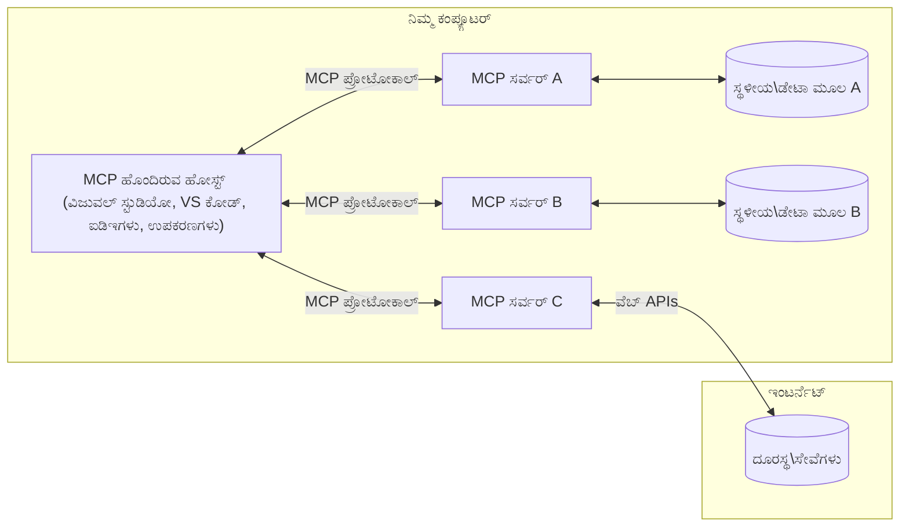

# MCP ಮೂಲ ধারণೆಗಳು: AI ಸಂಯೋಜನೆಯಿಗಾಗಿ ಮಾದರಿ ಸಂದರ್ಭ ಪ್ರೊಟೋಕಾಲ್‌ನಲ್ಲಿ ಪರಿಣತಿ ಹೊಂದುವುದು

[](https://youtu.be/earDzWGtE84)

_(ಈ ಪಾಠದ ವಿಡಿಯೋ ನೋಡಲು ಮೇಲಿನ ಚಿತ್ರವನ್ನು ಕ್ಲಿಕ್ ಮಾಡಿ)_

[ಮಾದರಿ ಸಂದರ್ಭ ಪ್ರೊಟೋಕಾಲ್ (MCP)](https://github.com/modelcontextprotocol) ಒಂದು ಶಕ್ತಿಯುತ, ಮাপকೃತ ಚಟುವಟಿಕೆಯ ವ್ಯವಸ್ಥೆಯಾಗಿದ್ದು, ದೊಡ್ಡ ಭಾಷಾ ಮಾದರಿಗಳು (LLMs) ಮತ್ತು ಬಾಹ್ಯ ಉಪಕರಣಗಳು, ಅನ್ವಯಿಕೆಗಳು, ಮತ್ತು ಡೇಟಾ ಮೂಲಗಳ ನಡುವೆ ಸಂವಹನವನ್ನು ಕನಿಷ್ಠ ಸಮಯದಲ್ಲಿ ಪರಿಣಾಮಕಾರಿ ಮಾಡುತ್ತದೆ.  
ಈ ಮಾರ್ಗದರ್ಶಿ ನಿಮಗೆ MCP ನ ಮೂಲ ಸಂಗತಿಗಳನ್ನು ಪರಿಚಯಿಸುತ್ತದೆ. ನೀವು ಇದರ ಕ್ಲೈಂಟ್-ಸರ್ವರ್ ವಾಸ್ತುಶಿಲ್ಪ, ಅವಶ್ಯಕ ಘಟಕಗಳು, ಸಂವಹನ ಕಾರ್ಯವಿಧಾನಗಳು ಮತ್ತು ಅನುಷ್ಠಾನ ಉತ್ತಮ ಅಭ್ಯಾಸಗಳನ್ನು ಕಲಿಯುತ್ತೀರಿ.

- **ಸ್ಪಷ್ಟ ಬಳಕೆದಾರ ಅನುಮತಿ**: ಎಲ್ಲಾ ಡೇಟಾ ಪ್ರವೇಶ ಮತ್ತು ಕಾರ್ಯಾಚರಣೆಗಳನ್ನು ನಿರ್ವಹಿಸುವ ಮೊದಲು ಬಳಕೆದಾರರ ಸ್ಪಷ್ಟ ಅನುಮತಿ ಅಗತ್ಯವಿರುತ್ತದೆ. ಬಳಕೆದಾರರು ಯಾವ ಡೇಟಾಗೆ ಪ್ರವೇಶಿಸಲಾಗುತ್ತದೆ ಮತ್ತು ಯಾವ ಕ್ರಿಯೆಗಳು ಮಾಡಲphantಾ ಇದ್ದವು ಎಂಬುದನ್ನು ಸ್ಪಷ್ಟವಾಗಿ ತಿಳಿದುಕೊಳ್ಳಬೇಕು, ಅನುಮತಿ ಮತ್ತು ಅಧಿಕಾರಗಳ ಮೇಲೆ ಸೂಕ್ಷ್ಮ ನಿಯಂತ್ರಣ ಸಹಿತ.

- **ಡೇಟಾ ಗೌಪ್ಯತೆ ರಕ್ಷಣೆ**: ಬಳಕೆದಾರರ ಡೇಟಾ ಸ್ಪಷ್ಟ ಅನುಮತಿಗಳೊಂದಿಗೆ ಮಾತ್ರ ಹೊರಹೋಗುತ್ತದೆ ಮತ್ತು ಸಂಪೂರ್ಣ ಪರಸ್ಪರ ಕ್ರಿಯೆಯ ಅವಧಿಯಲ್ಲಿ ಬಲವಾದ ಪ್ರವೇಶ ನಿಯಂತ್ರಣಗಳ ಮೂಲಕ ರಕ್ಷಿಸಬೇಕು. ಅನುಷ್ಠಾನಗಳು ಅನಧಿಕೃತ ಡೇಟಾ ಪ್ರಸರಣವನ್ನು ತಡೆಯಬೇಕು ಮತ್ತು ಕಟ್ಟುನಿಟ್ಟಿನ ಗೌಪ್ಯತೆಯ ಗಡಿಯಾರ ಎಲ್ಲೆಡೆ ಉಳಿಸಬೇಕು.

- **ಉಪಕರಣ ಕಾರ್ಯಾಚರಣೆಯ ಸುರಕ್ಷತೆ**: ಪ್ರತಿ ಉಪಕರಣ ಬಳಸುವಾಗ ಸ್ಪಷ್ಟ ಬಳಕೆದಾರ ಅನುಮತಿ ಬೇಕು, ಉಪಕರಣದ ಕಾರ್ಯತತ್ವ, ನಿಯಾಮಕಗಳು ಮತ್ತು ಸಾಧ್ಯ ಪರಿಣಾಮಗಳ ಸ್ಪಷ್ಟ ಹೊಳೆಯುವಿಕೆ ಇದ್ದಲ್ಲಿ ಮಾತ್ರ ಅನುಮತಿಸಲಾಗುತ್ತದೆ. ಬಲವಾದ ಭದ್ರತಾ ಗಡಿಗಳಿಂದ ನಿರ್ಬಂಧಿತ, ಅನಿರೀಕ್ಷಿತ ಅಥವಾ ದುಷ್ಟ ಉಪಕರಣ ಕಾರ್ಯಾಚರಣೆ ತಡೆಯಲ್ಪಡಬೇಕು.

- **ಸಂಚಾರ ಪದರ ಭದ್ರತೆ**: ಎಲ್ಲಾ ಸಂವಹನ ಚಾನೆಲ್‌ಗಳು ಯೋಗ್ಯ ಇನ್ಕ್ರಿಪ್ಷನ್ ಮತ್ತು ಪ್ರಮಾಣೀಕರಣ ವಿಧಾನಗಳನ್ನು ಉಪಯೋಗಿಸಬೇಕು. ದೂರ ಸಂಪರ್ಕಗಳು ಭದ್ರ ಸಂಚಾರ ಪ್ರೋಟೋಕಾಲ್ಗಳನ್ನು ಮತ್ತು ಸೂಕ್ತ ಪ್ರಮಾಣಪತ್ರ ನಿರ್ವಹಣೆಯನ್ನು ಅನುಷ್ಠಾನ ಮಾಡಬೇಕು.

#### ಅನುಷ್ಠಾನ ಮಾರ್ಗಸೂಚಿ:

- **ಅನುಮತಿವಿಷಯ ನಿರ್ವಹಣೆ**: ಬಳಕೆದಾರರು ಗಮನಾರ್ಹವಾಗಿ ಯಾವ ಸರ್ವರ್‌ಗಳು, ಉಪಕರಣಗಳು, ಮತ್ತು ಸಂಪನ್ಮೂಲಗಳು ಲಭ್ಯವಿವೆ ಎಂದು ನಿಯಂತ್ರಿಸಲು ಸೂಕ್ಷ್ಮ ಅನುಮತಿ ವ್ಯವಸ್ಥೆಗಳನ್ನು ಅನುಷ್ಠಾನಮಾಡಿ  
- **ಪ್ರಮಾಣೀಕರಣ ಮತ್ತುಅಧಿಕಾರಿ ಪಾವತಿ**: ಸುರಕ್ಷಿತ ಪ್ರಮಾಣೀಕರಣ ವಿಧಾನಗಳು (OAuth, API ಕೀಗಳು) ಬಳಸಿ ಮತ್ತು ಸೂಕ್ತ ಟೋಕನ್ ನಿರ್ವಹಣೆ ಮತ್ತು ಅವಧಿ ನಿಯಂತ್ರಣ  
- **ಇನ್ಪುಟ್ ಮಾನ್ಯತೆ**: ಎಲ್ಲ ನಿಯಮಿತ ಪರಿಮಾಣಗಳು ಮತ್ತು ಡೇಟಾ ಇನ್ಪುಟ್‌ಗಳನ್ನು ನಿರ್ದಿಷ್ಟ ಮಾಡಿದ.schemas ಅನುಸಾರ ಪರೀಕ್ಷಿಸಿ, ಇಂಜೆಕ್ಷನ್ ದಾಳಿಗಳನ್ನು ತಡೆಯಲು  
- **ಆಡಿಟ್ ಲಾಗಿಂಗ್**: ಭದ್ರತಾ ನಿಗ vigilancia ಮತ್ತು ಅನುಕೂಲತೆಗಾಗಿ ಎಲ್ಲಾ ಉಳಿದ ಕಾರ್ಯಾಚರಣೆಗಳ ಸಮಗ್ರ ಲಾಗ್‌ಗಳನ್ನು ಉಳಿಸಿ

## ಸಾಮಾನ್ಯ ಅವಲೋಕನ

ಈ ಪಾಠದಲ್ಲಿ ಮಾದರಿ ಸಂದರ್ಭ ಪ್ರೊಟೋಕಾಲ್ (MCP) ಪರಿಸರವನ್ನು ರೂಪಿಸುವ ಮೂಲ ವಾಸ್ತುಶಿಲ್ಪ ಮತ್ತು ಘಟಕಗಳನ್ನು ಅನ್ವೇಷಿಸಲಾಗುತ್ತದೆ. ನೀವು ಕ್ಲೈಂಟ್-ಸರ್ವರ್ ವಾಸ್ತುಶಿಲ್ಪ, ಪ್ರಮುಖ ಘಟಕಗಳು ಮತ್ತು ಸಂವಹನ ಪ್ರಕ್ರಿಯೆಗಳು ಹೇಗೆ MCP ಕ್ರಿಯೆಯೊಂದಿಗೆ ಕಳುಹಿಸುತ್ತವೆ ಎಂಬುದನ್ನು ಕಲಿಯೋಿರಿ.

## ಮುಖ್ಯ ಕಲಿಕಾ ಗುರಿಗಳು

ಈ ಪಾಠದ ಕೊನೆಯಲ್ಲಿ ನೀವು:

- MCP ಕ್ಲೈಂಟ್-ಸರ್ವರ್ ವಾಸ್ತುಶಿಲ್ಪವನ್ನು ಅರ್ಥಮಾಡಿಕೊಳ್ಳುತ್ತೀರಿ.  
- ಹೋಸ್ಟ್‌ಗಳು, ಕ್ಲೈಂಟ್‌ಗಳು ಮತ್ತು ಸರ್ವರ್‌ಗಳ ಪಾತ್ರ ಮತ್ತು ಜವಾಬ್ದಾರಿಗಳನ್ನು ಗುರುತಿಸುತ್ತೀರಿ.  
- MCP ನ ಫ್ಲೆಕ್ಸಿಬಲ್ ಇಂಟೆಗ್ರೇಶನ್ ಪದರವನ್ನು ರೂಪಿಸುವ ಪ್ರಮುಖ ವೈಶಿಷ್ಟ್ಯಗಳನ್ನು ವಿಶ್ಲೇಷಿಸುತ್ತೀರಿ.  
- MCP ಪರಿಸರದ ಒಳಗಿನ ಸುತ್ತುವರಿದ ಮಾಹಿತಿ ಹರಡುವಿಕೆಯನ್ನು ಕಲಿಯುತ್ತೀರಿ.  
- .NET, ಜಾವಾ, ಪೈಥಾನ್, ಮತ್ತು ಜಾವಾಸ್ಕ್ರಿಪ್ಟ್ ಕೋಡ್ ಉದಾಹರಣೆಗಳ ಮೂಲಕ ಪ್ರಾಯೋಗಿಕ ಅಂಶಗಳನ್ನು ಪಡೆಯುತ್ತೀರಿ.

## MCP ವಾಸ್ತುಶಿಲ್ಪ: ಒಂದಷ್ಟು ಗಂಟುಹಾಕಿದ ನೋಟ

MCP ಪರಿಸರವು ಕ್ಲೈಂಟ್-ಸರ್ವರ್ ಮಾದರಿಯ ಮೇಲೆ ನಿರ್ಮಿಸಲಾಗಿದೆ. ಈ ಘಟಕಗಳ ರಚನೆ ಎಐ ಅನ್ವಯಿಕೆಯನ್ನು ಉಪಕರಣಗಳು, ಡೇಟಾಬೇಸ್‌ಗಳು, APIಗಳು ಮತ್ತು ಸಂದರ್ಭ ಸಂಪನ್ಮೂಲಗಳೊಂದಿಗೆ ಪರಿಣಾಮಕಾರಿಯಾಗಿ ಸಂವಹನ ಮಾಡಲು ಸಾಧ್ಯವಾಗಿಸುತ್ತದೆ. ಈ ವಾಸ್ತುಶಿಲ್ಪವನ್ನು ಅದರ ಕೋರ್ ಘಟಕಗಳಾಗಿ ವಿಭಜಿಸೋಣ.

ಹೃದಯದಲ್ಲಿ, MCP ಒಂದು ಕ್ಲೈಂಟ್-ಸರ್ವರ್ ವಾಸ್ತುಶಿಲ್ಪವನ್ನು ಅನುಸರಿಸುತ್ತದೆ, ಇಲ್ಲಿ ಹೋಸ್ಟ್ ಅನ್ವಯಿಕೆ ಹಲವು ಸರ್ವರ್‌ಗಳಿಗೆ ಸಂಪರ್ಕ ಮಾಡಬಹುದು:


```mermaid
flowchart LR
    subgraph "ನಿಮ್ಮ ಕಂಪ್ಯೂಟರ್"
        Host["MCP ಹೊಂದಿರುವ ಹೋಸ್ಟ್ (ವಿಜುವಲ್ ಸ್ಟುಡಿಯೋ, VS ಕೋಡ್, ಐಡಿಇಗಳು, ಉಪಕರಣಗಳು)"]
        S1["MCP ಸರ್ವರ್ A"]
        S2["MCP ಸರ್ವರ್ B"]
        S3["MCP ಸರ್ವರ್ C"]
        Host <-->|"MCP ಪ್ರೋಟೋಕಾಲ್"| S1
        Host <-->|"MCP ಪ್ರೋಟೋಕಾಲ್"| S2
        Host <-->|"MCP ಪ್ರೋಟೋಕಾಲ್"| S3
        S1 <--> D1[("ಸ್ಥಳೀಯ\ಡೇಟಾ ಮೂಲ A")]
        S2 <--> D2[("ಸ್ಥಳೀಯ\ಡೇಟಾ ಮೂಲ B")]
    end
    subgraph "ಇಂಟರ್ನೆಟ್"
        S3 <-->|"ವೆಬ್ APIs"| D3[("ದೂರಸ್ಥ\ಸೇವೆಗಳು")]
    end
```
- **MCP ಹೋಸ್ಟ್‌ಗಳು**: VSCode, ಕ್ಲೋಡ್ ಡೆಸ್ಕ್‌ಟಾಪ್, IDE ಗಳು, ಅಥವಾ MCP ಮೂಲಕ ಡೇಟಾ ಪ್ರವೇಶಿಸಲು ಬಯಸುವ ಎಐ ಉಪಕರಣಗಳು  
- **MCP ಕ್ಲೈಂಟ್‌ಗಳು**: ಸರ್ವರ್‌ಗಳೊಂದಿಗೆ 1:1 ಸಂಪರ್ಕಗಳನ್ನು ನಿರ್ವಹಿಸುವ ಪ್ರೋಟೋಕಾಲ್ ಕ್ಲೈಂಟ್‌ಗಳು  
- **MCP ಸರ್ವರ್‌ಗಳು**: ಪ್ರತಿ MCP ನಿಗದಿತ ಸಾಧ್ಯತೆಗಳನ್ನು ಪ್ರದರ್ಶಿಸುವ ಲಘುಕಾರ್ಯ ಕಾರ್ಯಕ್ರಮಗಳು  
- **ಸ್ಥಳೀಯ ಡೇಟಾ ಮೂಲಗಳು**: ನಿಮ್ಮ ಕಂಪ್ಯೂಟರ್‌ನ ಫೈಲ್ಗಳು, ಡೇಟಾಬೇಸ್‌ಗಳು ಮತ್ತು ಸೇವೆಗಳು, MCP ಸರ್ವರ್‌ಗಳು ಸುರಕ್ಷಿತವಾಗಿ ಪ್ರವೇಶಿಸಬಹುದಾದವು  
- **ದೂರಸ್ಥ ಸೇವೆಗಳು**: ಇಂಟರ್ನೆಟ್ ಮೂಲಕ ಲಭ್ಯವಿರುವ ಬಾಹ್ಯ ವ್ಯವಸ್ಥೆಗಳು, MCP ಸರ್ವರ್‌ಗಳು API ಮುಖಾಂತರ ಜೋಡಿಕೊಳ್ಳುತ್ತವೆ.

MCP ಪ್ರೋಟೋಕಾಲ್ ಒಂದು ಬೆಳೆಯುವ ಮಾನಕವಾಗಿದ್ದು ದಿನಾಂಕ ಆಧಾರಿತ ಆವೃತ್ತಿ ವಿಧಾನದ ಪ್ರಕಾರ (YYYY-MM-DD ಆಕಾರ). ಪ್ರಸ್ತುತ ಪ್ರೋಟೋಕಾಲ್ ಆವೃತ್ತಿ **2025-11-25**. ನೀವು [ಪ್ರೋಟೋಕಾಲ್ ಸ್ಪೆಸಿಫಿಕೇಶನ್](https://modelcontextprotocol.io/specification/2025-11-25/) ನಲ್ಲಿ ಇತ್ತೀಚಿನ ನವೀಕರಣಗಳನ್ನು ನೋಡಬಹುದು.

### 1. ಹೋಸ್ಟ್‌ಗಳು

ಮಾದರಿ ಸಂದರ್ಭ ಪ್ರೋಟೋಕಾಲ್ (MCP) ನಲ್ಲಿ, **ಹೋಸ್ಟ್‌ಗಳು** ಎನ್ನುವುದು ಪ್ರಾಥಮಿಕ ಇಂಟರ್ಫೇಸ್ ಆಗಿದ್ದು ಬಳಕೆದಾರರು ಪ್ರೋಟೋಕಾಲ್ ಜೊತೆ ಸಂವಹನ ಮಾಡುವ ಮೂಲಕ ಬರುತ್ತದೆ. ಹೋಸ್ಟ್‌ಗಳು MCP ಸರ್ವರ್‌ಗಳ ಹಲವಾರು ಸಂಪರ್ಕಗಳನ್ನು ಸಂಯೋಜಿಸಿ ನಿರ್ವಹಿಸುತ್ತವೆ ಮತ್ತು ಪ್ರತ್ಯೇಕ MCP ಕ್ಲೈಂಟ್‌ಗಳನ್ನು ಪ್ರತಿ ಸರ್ವರ್ ಸಂಪರ್ಕಕ್ಕಾಗಿ ಸೃಷ್ಟಿಸುತ್ತವೆ. ಹೋಸ್ಟ್‌ಗಳ ಉದಾಹರಣೆಗಳು:

- **ಎಐ ಅನ್ವಯಿಕೆಗಳು**: ಕ್ಲೋಡ್ ಡೆಸ್ಕ್‌ಟಾಪ್, ವಿಸುಯಲ್ ಸ್ಟುಡಿಯೋ ಕೋಡ್, ಕ್ಲೋಡ್ ಕೋಡ್  
- **ದೇವಲೋಪ್‌ಮೆಂಟ್ ಪರಿಸರಗಳು**: IDEಗಳು ಮತ್ತು MCP ಸಂಯೋಜನೆಯೊಂದಿಗೆ ಕೋಡ್ ಸಂಪಾದಕರು  
- **ಕಸ್ಟಮ್ ಅನ್ವಯಿಕೆಗಳು**: ಉದ್ದೇಶಿತ ಎಐ ಏಜೆಂಟರು ಮತ್ತು ಉಪಕರಣಗಳು

**ಹೋಸ್ಟ್‌ಗಳು** ಎಐ ಮಾದರಿ ಸಂವಹನಗಳನ್ನು ಸಂಯೋಜಿಸುವ ಅನ್ವಯಿಕೆಗಳು. ಅವು:

- **ಎಐ ಮಾದರಿಗಳನ್ನು ನಿರ್ವಹಣೆ ಮಾಡುತ್ತವೆ**: ಪ್ರತಿಕ್ರಿಯೆಗಳನ್ನು ಸೃಷ್ಟಿಸಲು ಅಥವಾ ಸಂವಹನ ಮಾಡಲು LLMಗಳನ್ನು ನಿರ್ವಹಣೆ  
- **ಕ್ಲೈಂಟ್ ಸಂಪರ್ಕಗಳನ್ನು ನಿರ್ವಹಣೆ**: ಪ್ರತಿ MCP ಸರ್ವರ್ ಸಂಪರ್ಕಕ್ಕೆ ಒಬ್ಬ MCP ಕ್ಲೈಂಟ್ ರಚಿಸಿ ನಿರ್ವಹಣೆ  
- **ಬಳಕೆದಾರ ಇಂಟರ್ಫೇಸನ್ನು ನಿಯಂತ್ರಣೆ**: ಸಂಭಾಷಣಾ ಹರಿವು, ಬಳಕೆದಾರ ಸಂವಾದ, ಪ್ರತಿಕ್ರಿಯೆ ಪ್ರದರ್ಶನ  
- **ಭದ್ರತೆ ಜಾರಿಗೆ ಇಟ್ಟುಕೊಳ್ಳುವುದು**: ಅನುಮತಿಗಳು, ಭದ್ರತೆ ನಿಯಂತ್ರಣಗಳು, ಮತ್ತು ಪ್ರಮಾಣೀಕರಣ  
- **ಬಳಕೆದಾರ ಅನುಮತಿಯನ್ನು ಹ್ಯಾಂಡಲ್ ಮಾಡುವುದು**: ಡೇಟಾ ಹಂಚಿಕೆ ಮತ್ತು ಉಪಕರಣ ಕಾರ್ಯಾಚರಣೆಗೆ ಬಳಕೆದಾರ ಅನುಮತಿ ನಿರ್ವಹಣೆ  

### 2. ಕ್ಲೈಂಟ್‌ಗಳು

**ಕ್ಲೈಂಟ್‌ಗಳು** ಹೋಸ್ಟ್ ಮತ್ತು MCP ಸರ್ವರ್‌ಗಳ ನಡುವಿನ ನಿಷ್ಠುರ 1:1 ಸಂಪರ್ಕಗಳನ್ನು ನಿರ್ವಹಿಸುವ ಅವಶ್ಯಕ ಘಟಕಗಳು. ಪ್ರತಿ MCP ಕ್ಲೈಂಟ್ ಹೋಸ್ಟ್ ಮೂಲಕ ನಿರ್ದಿಷ್ಟ MCP ಸರ್ವರ್‌ಗೆ ಸಂಪರ್ಕಿಸಲು ರಚಿಸಲಾಗುತ್ತದೆ, ಇದರಿಂದ ಸಂಘಟಿತ ಮತ್ತು ಸುರಕ್ಷಿತ ಸಂವಹನ ಚಾನೆಲ್‌ಗಳು ಸಾಧ್ಯವಾಗುತ್ತವೆ. ಹಲವಾರು ಕ್ಲೈಂಟ್‌ಗಳು ಹೋಸ್ಟ್‌ಗಳು ಹಲವಾರು ಸರ್ವರ್‌ಗಳಿಗೆ ಹೆಚ್ಚುವರಿ ಸಂಪರ್ಕ ಮಾಡಲು ಸಹಾಯ ಮಾಡುತ್ತವೆ.

**ಕ್ಲೈಂಟ್‌ಗಳು** ಹೋಸ್ಟ್ ಅನ್ವಯಿಕೆಯಲ್ಲಿ ಸಂಪರ್ಕ ಘಟಕಗಳು. ಅವು:

- **ಪ್ರೊಟೋಕಾಲ್ ಸಂವಹನ**: ಪ್ರಾಂಪ್ಟ್‌ಗಳು ಮತ್ತು ಸೂಚನೆಗಳೊಂದಿಗೆ JSON-RPC 2.0 ವಿನಂತಿಗಳನ್ನು ಸರ್ವರ್‌ಗಳಿಗೆ ಕಳುಹಿಸುತ್ತವೆ  
- **ಸಂಭಾವ್ಯತೆ ಚರ್ಚೆ**: ಶುರುವಾಗುವಾಗ ಸರ್ಪೋರ್ಟ್ ಮಾಡಿದ ವೈಶಿಷ್ಟ್ಯಗಳು ಮತ್ತು ಪ್ರೋಟೋಕಾಲ್ ಆವೃತ್ತಿಗಳನ್ನು ನಿಗೊಳ್ಳುವಿಕೆ  
- **ಉಪಕರಣ ಕಾರ್ಯಾಚರಣೆ**: ಮಾದರಿಗಳಿಂದ ಉಪಕರಣ ಕಾರ್ಯಾಚರಣೆ ವಿನಂತಿಗಳನ್ನು ನಿರ್ವಹಿಸುವುದು ಮತ್ತು ಪ್ರತಿಕ್ರಿಯೆಗಳು ಪ್ರಕ್ರಿಯೆಮಾಡುವುದು  
- **ನೈಜ ಸಮಯ ನವೀಕರಣಗಳು**: ಸರ್ವರ್‌ಗಳಿಂದ ಮಾಹಿತಿಗಳನ್ನು ಮತ್ತು ನೈಜ ಸಮಯ ನವೀಕರಣಗಳನ್ನು ನಿರ್ವಹಣೆ  
- **ಪ್ರತಿಕ್ರಿಯೆ ಸಂಸ್ಕರಣೆ**: ಬಳಕೆದಾರರಿಗೆ ತೋರಿಸಲು ಸರ್ವರ್ ಪ್ರತಿಕ್ರಿಯೆಗಳನ್ನು ಸಂಸ್ಕರಿಸಿ ಸ್ವರೂಪಗೊಳಿಸುವುದು  

### 3. ಸರ್ವರ್‌ಗಳು

**ಸರ್ವರ್‌ಗಳು** MCP ಕ್ಲೈಂಟ್‌ಗಳಿಗೆ ಸಂದರ್ಭ, ಉಪಕರಣಗಳು ಮತ್ತು ಸಾಮರ್ಥ್ಯಗಳನ್ನು ಒದಗಿಸುವ ಕಾರ್ಯಕ್ರಮಗಳು. ಸರ್ವರ್‌ಗಳು ಸ್ಥಳೀಯವಾಗಿ (ಹೋಸ್ಟ್‌ನೊಂದಿಗೆ ಒಂದೇ ಯಂತ್ರದಲ್ಲಿ) ಅಥವಾ ದೂರಸ್ಥವಾಗಿ (ಬಾಹ್ಯ ವೇದಿಕೆಗಳ ಮೇಲೆ) ಕಾರ್ಯನಿರ್ವಹಿಸಬಹುದು ಮತ್ತು ಕ್ಲೈಂಟ್ ವಿನಂತಿಗಳನ್ನು ನಿಯಂತ್ರಿಸಿ ಸಂರಚಿತ ಪ್ರತಿಕ್ರಿಯೆಗಳನ್ನು ಒದಗಿಸುವ ಜವಾಬ್ದಾರಿಯುಳ್ಳವು. ಸರ್ವರ್‌ಗಳು ಮাপকೃತ ಮಾದರಿ ಸಂದರ್ಭ ಪ್ರೋಟೋಕಾಲ್ ಮೂಲಕ ನಿಶ್ಚಿತ ಕಾರ್ಯತತ್ವಗಳನ್ನು ಪ್ರದರ್ಶಿಸುತ್ತವೆ.

**ಸರ್ವರ್‌ಗಳು** ನಿರ್ನಾಯಕ ಮತ್ತು ಸಾಮರ್ಥ್ಯಗಳನ್ನು ಒದಗಿಸುತ್ತವೆ. ಅವು:

- **ವೈಶಿಷ್ಟ್ಯ ನೋಂದಣಿ**: ಲಭ್ಯವಿರುವ ಮೂಲಧರ್ಮ (ಸಂಪನ್ಮೂಲಗಳು, ಪ್ರಾಂಪ್ಟ್‌ಗಳು, ಉಪಕರಣಗಳು) ಅನ್ನು ನೋಂದಣಿ ಮಾಡಿ ಕ್ಲೈಂಟ್‌ಗಳಿಗೆ ಒದಗಿಸುವುದು  
- **ವಿನಂತಿ ಪ್ರಕ್ರಿಯೆ**: ಉಪಕರಣ ಕರೆಯಲು, ಸಂಪನ್ಮೂಲ ವಿನಂತಿ ಮತ್ತು ಪ್ರಾಂಪ್ಟ್ ವಿನಂತಿಗಳನ್ನು ಸ್ವೀಕರಿಸಿ ನಿರ್ವಹಣೆ  
- **ಸಂದರ್ಭ ಒದಗಿಸುವಿಕೆ**: ಮಾದರಿ ಪ್ರತಿಕ್ರಿಯೆಯನ್ನು ವೈಶಿಷ್ಟ್ಯಪೂರ್ಣಗೊಳಿಸಲು ಸಂದರ್ಭ ಮಾಹಿತಿ ಮತ್ತು ಡೇಟಾ ಒದಗಿಸುವುದು  
- **ಸ್ಥಿತಿ ನಿರ್ವಹಣೆ**: ಅವಶ್ಯಕತೆ ಇದ್ದಲ್ಲಿ ಸೆಷನ್ ಸ್ಥಿತಿಯನ್ನು ನಿರ್ವಹಿಸಿ ಸ್ಥಿತಿಸ್ಥಾಪಕ ಸಂವಹನಗಳನ್ನು ಜ್ಞಾಪಿಸಿ  
- **ನೈಜ ಸಮಯ ಮಾಹಿತಿ**: ತಲ್ಲೂಕುಂಡು ಬದಲಾವಣೆ ಮತ್ತು ನವೀಕರಣಗಳ ಬಗ್ಗೆ ನೋಟಿಫಿಕೇಶನ್‌ಗಳನ್ನು ಕ್ಲೈಂಟ್‌ಗಳಿಗೆ ಕಳುಹಿಸುವುದು

ಸರ್ವರ್‌ಗಳನ್ನು ಯಾರೂ ತಮ್ಮ ವೈಶಿಷ್ಟ್ಯಪೂರ್ಣ ಕಾರ್ಯತತ್ವಕ್ಕಾಗಿ ಅಭಿವೃದ್ಧಿಪಡಿಸಬಹುದು ಮತ್ತು ಅವು ಸ್ಥಳೀಯ ಮತ್ತು ದೂರಸ್ಥ ನಿಯೋಜನೆಗಳಲ್ಲಿ ಬೆಂಬಲ ನೀಡುತ್ತವೆ.

### 4. ಸರ್ವರ್ ಮೂಲಧರ್ಮಗಳು

ಮಾದರಿ ಸಂದರ್ಭ ಪ್ರೋಟೋಕಾಲ್ (MCP) ನ ಸರ್ವರ್‌ಗಳು ಮೂರು ಮೂಲ **ಮೂಲಧರ್ಮಗಳನ್ನು** ಒದಗಿಸುತ್ತವೆ, ಅವು ಕ್ಲೈಂಟ್‌ಗಳು, ಹೋಸ್ಟ್‌ಗಳು ಮತ್ತು ಭಾಷಾ ಮಾದರಿಗಳ ನಡುವಿನ ವೈಶಿಷ್ಟ್ಯಪೂರ್ಣ ಸಂವಹನಕ್ಕೆ ಮೂಲಬಲವಾಗುವ ಅಂಶಗಳನ್ನು ನಿರ್ದಿಷ್ಟಮಾಡುತ್ತವೆ. ಈ ಮೂಲಧರ್ಮಗಳು ಪ್ರೋಟೋಕಾಲ್ ಮೂಲಕ ಲಭ್ಯವಿರುವ ಸಂದರ್ಭ ಮಾಹಿತಿ ಮತ್ತು ಕ್ರಿಯೆಗಳ ತತ್ವಗಳನ್ನು ವ್ಯಾಖ್ಯಾನಿಸುತ್ತವೆ.

MCP ಸರ್ವರ್‌ಗಳು ಕೆಳಗಿನ ಮೂರು ಮೂಲಧರ್ಮಗಳನ್ನು ಯಾವುದೇ ಸಂಯೋಜನೆಯಲ್ಲಿ ಬಹಿರಂಗಪಡಿಸಬಹುದು:

#### ಸಂಪನ್ಮೂಲಗಳು

**ಸಂಪನ್ಮೂಲಗಳು** ಎಂಬವು ಎಐ ಅನ್ವಯಿಕೆಗಳಿಗೆ ಸಂದರ್ಭ ಮಾಹಿತಿ ಒದಗಿಸುವ ಡೇಟಾ ಮೂಲಗಳು. ಅವು ಸ್ಥಿತಿಗತ ಅಥವಾ ಚಾಲಕ ವಿಷಯಗಳನ್ನು ಪ್ರತಿನಿಧಿಸುತ್ತವೆ, ಮಾದರಿಯ ಅರ್ಥಮಾಡಿಕೋಳ್ಳುವಿಕೆ ಮತ್ತು ನಿರ್ಣಾಯಕ ಸಂಖ್ಯೆಯನ್ನು ಉತ್ತೇಜಿಸುವುದರಲ್ಲಿ ಸಹಾಯಕ:

- **ಸಂದರ್ಭ ಡೇಟಾ**: ನಿರ್ದಿಷ್ಟ ವಿನ್ಯಾಸದಲ್ಲಿನ ಮಾಹಿತಿ ಮತ್ತು ಎಐ ಮಾದರಿಯ ಸೇವೆಗೆ ಸಂಬಂಧಿಸಿದ ಸಂದರ್ಭ  
- **ಜ್ಞಾನ ಕಾಯಾಗಾರಗಳು**: ದಸ್ತಾವೇಜು ಸಂಗ್ರಹಣೆ, ಲೇಖನಗಳು, ಕೈಪಿಡಿಗಳು ಮತ್ತು ಸಂಶೋಧನಾ ಪತ್ರಿಕೆಗಳು  
- **ಸ್ಥಳೀಯ ಡೇಟಾ ಮೂಲಗಳು**: ಫೈಲ್ಗಳು, ಡೇಟಾಬೇಸ್‌ಗಳು, ಮತ್ತು ಸ್ಥಳೀಯ ವ್ಯವಸ್ಥೆಯ ಮಾಹಿತಿ  
- **ಬಾಹ್ಯ ಡೇಟಾ**: API ಪ್ರತಿಕ್ರಿಯೆಗಳು, ವೆಬ್ ಸೇವೆಗಳು ಮತ್ತು ದೂರದ ವ್ಯವಸ್ಥೆಯ ಡೇಟಾ  
- **ಚಲಿಸುವ ವಿಷಯ**: ಬಾಹ್ಯ ಪರಿಸ್ಥಿತಿಗಳ ಆಧಾರದ ಮೇಲೆ ನೈಜ ಸಮಯ ಡೇಟಾ ನವೀಕರಣಗಳು

ಸಂಪನ್ಮೂಲಗಳನ್ನು URIಗಳ ಮೂಲಕ ಗುರುತಿಸಬಹುದು ಮತ್ತು ಅವು `resources/list` ಮೂಲಕ ಕಂಡುಹಿಡಿಯುತ್ತವೆ ಮತ್ತು `resources/read` ಮೂಲಕ ಹಿಂತಿರುಗಿಸುತ್ತವೆ:

```text
file://documents/project-spec.md
database://production/users/schema
api://weather/current
```

#### ಪ್ರಾಂಪ್ಟ್‌ಗಳು

**ಪ್ರಾಂಪ್ಟ್‌ಗಳು** ಎಂಬುವವು ಪುನಃಬಳಕೆ ಮಾಡಬಹುದಾದ ಟೆಂಪ್ಲೇಟ್‌ಗಳು ಆಗಿದ್ದು, ಭಾಷಾ ಮಾದರಿಗಳೊಂದಿಗೆ ಸಂವಾದ ರಚಿಸುವಲ್ಲಿ ಸಹಾಯ ಮಾಡುತ್ತವೆ. ಅವು ಮಾನಕ ಸಂವಹನ ಮಾದರಿಗಳು ಮತ್ತು ಟೆಂಪ್ಲೇಟು ಮೂಲಕ ನಾವು ನಡೆಸುವ ಕಾರ್ಯವಿಧಾನಗಳನ್ನೂ ಒದಗಿಸುತ್ತವೆ:

- **ಟೆಂಪ್ಲೇಟ್ ಆಧಾರಿತ ಸಂವಹನ**: ಪೂರ್ವರಚಿಸಿದ ಸಂದೇಶಗಳು ಮತ್ತು ಸಂಭಾಷಣಾ ಪ್ರಾರಂಭಿಕ  
- **ಕಾರ್ಯಪ್ರವಾಹ ಟೆಂಪ್ಲೇಟ್‌ಗಳು**: ಸಾಮಾನ್ಯ ಕಾರ್ಯಗಳಿಗೆ ಮಾನಕರೂಪವಾದ ಕ್ರಮ  
- **ಕಡಿಮೆ ಉದಾಹರಣೆಯ ಮಾದರಿಗಳು**: ಮಾದರಿ ಸೂಚನೆಗಾಗಿ ಉದಾಹರಣೆಯ ಆಧಾರಿತ ಟೆಂಪ್ಲೇಟುಗಳು  
- **ಸಿಸ್ಟಮ್ ಪ್ರಾಂಪ್ಟ್‌ಗಳು**: ಮಾದರಿಯ ವರ್ತನೆ ಮತ್ತು ಸಂದರ್ಭವನ್ನು ವ್ಯಾಖ್ಯಾನಿಸುವ ಮೂಲಭೂತ ಪ್ರಾಂಪ್ಟ್‌ಗಳು  
- **ಚಲಿಸುವ ಟೆಂಪ್ಲೇಟುಗಳು**: ನಿರ್ದಿಷ್ಟ ಸಂದರ್ಭಗಳಿಗೆ ಹೊಂದಿಕೊಳ್ಳುವ ಪರಿಮಾಣಿತ ಪ್ರಾಂಪ್ಟ್‌ಗಳು

ಪ್ರಾಂಪ್ಟ್‌ಗಳು ರೂಪಾಂತರ ಬದಲಾವಣೆಗಳನ್ನು ಬೆಂಬಲಿಸುತ್ತವೆ ಮತ್ತು `prompts/list` ಮೂಲಕ ಕಂಡುಹಿಡಿಯಲು ಮತ್ತು `prompts/get` ಮೂಲಕ ಪಡೆಯಬಹುದು:

```markdown
Generate a {{task_type}} for {{product}} targeting {{audience}} with the following requirements: {{requirements}}
```

#### ಉಪಕರಣಗಳು

**ಉಪಕರಣಗಳು** ಎಂಬವು AI ಮಾದರಿಗಳು ನಿರ್ದಿಷ್ಟ ಕ್ರಿಯೆಗಳು ಮಾಡಲು ಕರೆಯಬಹುದಾದ ಕಾರ್ಯನಿರ್ವಹಿಸುವ ಕಾರ್ಯಗಳನ್ನು ಸೂಚಿಸುತ್ತವೆ. ಅವು MCP ಪರಿಸರದ "ಕ್ರಿಯಾಪದಗಳು" ಆಗಿದ್ದು, ಮಾದರಿಗಳನ್ನು ಬಾಹ್ಯ ವ್ಯವಸ್ಥೆಗಳೊಂದಿಗೆ ಸಂವಹನ ಮಾಡಲು ಸಕ್ರಿಯಗೊಳಿಸುತ್ತವೆ:

- **ಕಾರ್ಯನಿರ್ವಹಣಾ ಕಾರ್ಯಗಳು**: ನಿರ್ದಿಷ್ಟ ನಿಯಮಿತ ಪರಿಮಾಣಗಳೊಂದಿಗೆ ಮಾದರಿಗಳು ಕರೆಯಬಹುದಾದ ಸ್ವತಂತ್ರ ಕಾರ್ಯಾಚರಣೆಗಳು  
- **ಬಾಹ್ಯ ವ್ಯವಸ್ಥೆ ಸಂಯೋಜನೆ**: API ಕರೆಗಳು, ಡೇಟಾಬೇಸ್ ಕ್ವೇರಿ, ಫೈಲ್ ಕಾರ್ಯಾಚರಣೆ, ಲೆಕ್ಕಾಚಾರ  
- **ವಿಶಿಷ್ಟ ಗುರುತು**: ಪ್ರತಿ ಉಪಕರಣದ ವಿಶಿಷ್ಟ ಹೆಸರು, ವಿವರಣೆ ಮತ್ತು ಪರಿಮಾಣ ಯೋಜನೆ  
- **ಸಂರಚಿತ ಇನ್‌ಪುಟ್/ಔಟ್‌ಪುಟ್**: ಉಪಕರಣಗಳು ಮಾನ್ಯತೆ ಪಡೆದ ಪರಿಮಾಣಗಳನ್ನು ಸ್ವೀಕರಿಸಿ ಸಂರಚಿತ, ಪ್ರವರ್ಗೀಕೃತ ಪ್ರತಿಕ್ರಿಯೆಗಳನ್ನು ಹಿಂತಿರುಗಿಸುತ್ತವೆ  
- **ಕ್ರಿಯಾ ಸಾಮರ್ಥ್ಯಗಳು**: ಮಾದರಿಗಳಿಗೆ ನೈಜ ಜಗತ್ತಿನ ಕ್ರಿಯೆಗಳು ಹಾಗೂ ಲೈವ್ ಡೇಟಾ ಪಡೆದಿಕೊಳ್ಳಲು ಸಾಧ್ಯವಾಗಿಸುತ್ತದೆ

ಉಪಕರಣಗಳು ಪರಿಮಾಣ ಪರಿಶೀಲನೆಗಾಗಿ JSON Schema ಬಳಸಲಾಗುತ್ತದೆ ಮತ್ತು ಅವು `tools/list` ಮೂಲಕ ಹುಡುಕಲ್ಪಡುತ್ತವೆ ಮತ್ತು `tools/call` ಮೂಲಕ ಕಾರ್ಯಗತಗೊಳ್ಳುತ್ತವೆ. ಉತ್ತಮ UI ಪ್ರದರ್ಶನಕ್ಕಾಗಿ ಉಪಕರಣಗಳಿಗೆ **ಐಕಾನ್‌ಗಳು** ಕೂಡ(metadata) ಸೇರಿಸಬಹುದಾಗಿದೆ.

**ಉಪಕರಣ ಟಿಪ್ಪಣಿಗಳು**: ಉಪಕರಣಗಳು ನಡೆudge (e.g., `readOnlyHint`, `destructiveHint`) ನಡವಳಿಕೆ ಟಿಪ್ಪಣಿಗಳನ್ನು ಬೆಂಬಲಿಸುತ್ತವೆ, ಅವು ಉದ್ಯೋಗವನ್ನು ಓದುಗರಾಗಿಯೇ ಅಥವಾ ನಾಶಕವಾಗಿರುವುದಾಗಿ ವರ್ಣಿಸುವುದರಿಂದ ಕ್ಲೈಂಟ್‌ಗಳು ಉಪಕರಣ ಕಾರ್ಯಾಚರಣೆಗೆ ತಿಳಿದ ನಿರ್ಧಾರಗಳನ್ನದುಕೊಳ್ಳಲು ಸಹಾಯ ಮಾಡುತ್ತವೆ.

ಉದಾಹರಣೆಯ ಉಪಕರಣ ವ್ಯಾಖ್ಯಾನ:

```typescript
server.tool(
  "search_products", 
  {
    query: z.string().describe("Search query for products"),
    category: z.string().optional().describe("Product category filter"),
    max_results: z.number().default(10).describe("Maximum results to return")
  }, 
  async (params) => {
    // ಹುಡುಕಾಟವನ್ನು ನಿರ್ವಹಿಸಿ ಮತ್ತು ರಚನೆಯಾದ ಫಲಿತಾಂಶಗಳನ್ನು ಹಿಂತಿರುಗಿಸಿ
    return await productService.search(params);
  }
);
```

## ಕ್ಲೈಂಟ್ ಮೂಲಧರ್ಮಗಳು

ಮಾದರಿ ಸಂದರ್ಭ ಪ್ರೊಟೋಕಾಲ್ (MCP) ನಲ್ಲಿ, **ಕ್ಲೈಂಟ್‌ಗಳು** ಹೋಸ್ಟ್ ಅನ್ವಯಿಕೆಯಿಂದ ಹೆಚ್ಚಿನ ಸಾಮರ್ಥ್ಯಗಳನ್ನು ಸರ್ವರ್‌ಗಳು ಕೇಳಿಕೊಳ್ಳಲು ಮೂಲಧರ್ಮಗಳನ್ನು ಬಹಿರಂಗಪಡಿಸಬಹುದು. ಈ ಕ್ಲೈಂಟ್-ಬದಿ ಮೂಲಧರ್ಮಗಳು ಹೆಚ್ಚಿನ ಸಂವಾದಾತ್ಮಕ ಸರ್ವರ್ ಅನುಷ್ಠಾನಗಳಿಗೆ ಸಹಾಯ ಮಾಡುತ್ತವೆ, ಮತ್ತು ಎಐ ಮಾದರಿ ಸಾಮರ್ಥ್ಯಗಳು ಮತ್ತು ಬಳಕೆದಾರ ಸಂವಹನಗಳಿಗೆ ಪ್ರವೇಶವನ್ನು ಒದಗಿಸುತ್ತವೆ.

### ಸ್ಯಾಂಪ್ಲಿಂಗ್

**ಸ್ಯಾಂಪ್ಲಿಂಗ್** ಮೂಲಕ ಸರ್ವರ್‌ಗಳು ಕ್ಲೈಂಟ್‌ನ ಎಐ ಅನ್ವಯಿಕೆಯಿಂದ ಭಾಷಾ ಮಾದರಿ ಪೂರ್ಣಗೊಳಿಸುವಿಕೆಗಳನ್ನು ಕೇಳಬಹುದು. ಈ ಮೂಲಧರ್ಮವು ಸರ್ವರ್‌ಗಳಿಗೆ ತಮ್ಮ ಸ್ವಂತ ಮಾದರಿ ಅವಲಂಬನೆಗಳನ್ನು ಒಳಗೊಂಡಿಲ್ಲದೆ LLM ಸಾಮರ್ಥ್ಯಗಳನ್ನು ಪ್ರವೇಶಿಸಲು ಅವಕಾಶ ನೀಡುತ್ತದೆ:

- **ಮಾದರಿಯ තಾನಾತನ ಸಂಪರ್ಕವನ್ನು ಬಿಡಿಸಿ**: ಸರ್ವರ್‌ಗಳು LLM SDKಗಳನ್ನು ಸೇರಿಸುವುದಿಲ್ಲ ಮತ್ತು ಮಾದರಿ ಪ್ರವೇಶ ನಿರ್ವಹಣೆ ಮಾಡಬೇಕಾಗಿಲ್ಲ  
- **ಸರ್ವರ್ ಪ್ರಾರಂಭಿತ ಎಐ**: ಸರ್ವರ್‌ಗಳಿಗೆ ಕ್ಲೈಂಟ್‌ನ ಎಐ ಮಾದರಿ ಉಪಯೋಗಿಸಿ ಸ್ವತಂತ್ರವಾಗಿ ವಿಷಯ ಸೃಷ್ಟಿಸಲು ಅವಕಾಶ ನೀಡುತ್ತದೆ  
- **ಮರಳಿ ಬಳಕೆ LLM ಸಂವಹನಗಳು**: ಸಂಕೀರ್ಣ ಸಂದರ್ಭಗಳಿಗೆ - ಸರ್ವರ್‌ಗಳಿಗೆ ಪ್ರಕ್ರಿಯೆಗಾಗಿ ಎಐ ಸಹಾಯ ಬೇಕಾಗುವುದನ್ನು ಬೆಂಬಲಿಸುತ್ತದೆ  
- **ಡೈನಾಮಿಕ್ ವಿಷಯ ಸೃಷ್ಟಿ**: ಹೋಸ್ಟ್ ಅವರ ಮಾದರಿಯನ್ನು ಉಪಯೋಗಿಸಿ ಸಂದರ್ಭೀಯ ಪ್ರತಿಕ್ರಿಯೆಗಳನ್ನು ಸೃಷ್ಟಿಸಲು ಅನುಮತಿಸುತ್ತದೆ  
- **ಉಪಕರಣ ಕರೆಯುವ ಬೆಂಬಲ**: `tools` ಮತ್ತು `toolChoice` ಪರಿಮಾಣಗಳನ್ನು ಒಳಗೊಂಡು ಸರ್ವರ್ ಕಳುಹಿಸುವ ಮೂಲಕ ಕ್ಲೈಂಟ್ ಮಾದರಿ ಉಪಕರಣಗಳನ್ನು ಸ್ಯಾಂಪ್ಲಿಂಗ್ ಸಮಯದಲ್ಲಿ ಕರೆಯಲು ಅವಕಾಶ ನೀಡುತ್ತದೆ

ಸ್ಯಾಂಪ್ಲಿಂಗ್ ಅನ್ನು `sampling/complete` ವಿಧಾನದಿಂದ ಪ್ರಾರಂಭ ಮಾಡಲಾಗುತ್ತದೆ, ಅಲ್ಲಿ ಸರ್ವರ್‌ಗಳು ಪೂರ್ಣಗೊಳಿಸುವಿಕೆ ವಿನಂತಿಗಳನ್ನು ಕ್ಲೈಂಟ್‌ಗಳಿಗೆ ಕಳುಹಿಸುತ್ತದೆ.

### ರೂಟ್ಸ್

**ರೂಟ್‌ಗಳು** ಸರ್ವರ್‌ಗಳಿಗೆ ಫೈಲ್‌ಸಿಸ್ಟಮ್ ಗಡಿ ವಿವರಿಸಲು ಕ್ಲೈಂಟ್‌ಗಳು ಕೆಲವು ಮಾನಕ ಮಾರ್ಗವನ್ನು ಒದಗಿಸುವುದಕ್ಕೆ ಸಹಾಯ ಮಾಡುತ್ತವೆ, ಇದು ಸರ್ವರ್‌ಗಳು ಯಾವ ಡೈರೆಕ್ಟರಿಗಳು ಮತ್ತು ಫೈಲುಗಳಿಗೆ ಪ್ರವೇಶ ಹೊಂದಬಲ್ಲವು ಎಂಬುದನ್ನು ಅರ್ಥಮಾಡಿಕೊಳ್ಳಲು ನೆರವಾಗುತ್ತದೆ:

- **ಫೈಲ್‌ಸಿಸ್ಟಮ್ ಗಡಿಗಳು**: ಸರ್ವರ್‌ಗಳು ಫೈಲ್ ಸಿಸ್ಟಮ್‌ನಲ್ಲಿ ಕಾರ್ಯರತ ಇರುವ ಗಡಿಗಳನ್ನು ನಿರ್ಧರಿಸುವುದು  
- **ಪ್ರವೇಶ ನಿಯಂತ್ರಣ**: ಸರ್ವರ್‌ಗಳಿಗೆ ಯಾವ ಡೈರೆಕ್ಟರಿಗಳು ಮತ್ತು ಫೈಲುಗಳಿಗೆ ಪ್ರವೇಶ ಹಾಗೇ ಅವುಗಳ ಅನುಮತಿ ಇರುವುದನ್ನು ತಿಳಿಸಲು ನೆರವು  
- **ಡೈನಾಮಿಕ್ ನವೀಕರಣಗಳು**: ರೂಟ್ ಪಟ್ಟಿಯಲ್ಲಿ ಬದಲಾವಣೆ ಯಾವಾಗನಾದರೂ ಆಗಿದ್ರೆ ಕ್ಲೈಂಟ್‌ಗಳು ಅದನ್ನು ಸರ್ವರ್‌ಗಳಿಗೆ ತಿಳಿಸಲು ನೋಟಿಫಿಕೇಶನ್ ಕಳುಹಿಸುವುದು  
- **URI ಆಧಾರಿತ ಗುರುತింపు**: ರೂಟ್‌ಗಳು `file://` URI ಗಳನ್ನು ಬಳಸಿ ಲಭ್ಯವಿರುವ ಡೈರೆಕ್ಟರಿಗಳು ಮತ್ತು ಫೈಲುಗಳನ್ನು ಗುರುತಿಸುತ್ತವೆ

ರೂಟ್‌ಗಳನ್ನು `roots/list` ಮೂಲಕ ಕಂಡುಹಿಡಿಯುತ್ತಾರೆ ಮತ್ತು ರೂಟ್‌ ಬದಲಾವಣೆಗಳಿಗೆ ಕ್ಲೈಂಟ್‌ಗಳು `notifications/roots/list_changed` ಕಳುಹಿಸುತ್ತವೆ.

### ಎಲಿಸಿಟೇಶನ್

**ಎಲಿಸಿಟೇಶನ್** ಮೂಲಕ ಸರ್ವರ್‌ಗಳು ಬಳಕೆದಾರರಿಂದ ಹೆಚ್ಚುವರಿ ಮಾಹಿತಿ ಅಥವಾ ದೃಢೀಕರಣವನ್ನು ಕ್ಲೈಂಟ್ ಇಂಟರ್ಫೇಸ್ ಮೂಲಕ ಕೇಳಬಹುದು:

- **ಬಳಕೆದಾರ ಇನ್ಪುಟ್ ವಿನಂತಿಗಳು**: ಉಪಕರಣ ಕಾರ್ಯಾಚರಣೆಗೆ ಅಗತ್ಯವಿರುವ ಹೆಚ್ಚಿನ ಮಾಹಿತಿಗಾಗಿ ಸರ್ವರ್ ಕೇಳಬಹುದು  
- **ದೃಢೀಕರಣ ಸಂವಾದಗಳು**: ಸಂವೇದನಾಶೀಲ ಅಥವಾ ಪರಿಣಾಮ ಬೀರುವ ಕಾರ್ಯಗಳಿಗೆ ಬಳಕೆದಾರ ಅನುಮತಿಯನ್ನು ಕೇಳಲು  
- **ಇಂಟರಾಕ್ಟಿವ್ ಕಾರ್ಯಪ್ರವಾಹಗಳು**: ಹಂತ ಹಂತವಾಗಿ ಬಳಕೆದಾರ ಸಂವಹನಗಳನ್ನು ಸೃಷ್ಟಿಸಲು ಸರ್ವರ್‌ಗಳಿಗೆ ಅನುಮತಿಸು  
- **ಡೈನಾಮಿಕ್ ಪರಿಮಾಣ ಸಂಗ್ರಹಣೆ**: ಉಪಕರಣ ಕಾರ್ಯಾಚರಣೆಯ ಸಂದರ್ಭದಲ್ಲಿ ತಪ್ಪಿದ ಅಥವಾ ಐಚ್ಛಿಕ ಪರಿಮಾಣಗಳನ್ನು ಸಂಗ್ರಹಿಸುವುದು

ಎಲಿಸಿಟೇಶನ್ ವಿನಂತಿಗಳನ್ನು `elicitation/request` ವಿಧಾನದಿಂದ ಬಳಕೆದಾರ ಇನ್ಪುಟ್ ಸಂಗ್ರಹಿಸಲು ಕಳುಹಿಸಲಾಗುತ್ತದೆ.

**URL ಮೋಡ್ ಎಲಿಸಿಟೇಶನ್**: ಸರ್ವರ್‌ಗಳು URL ಆಧಾರಿತ ಬಳಕೆದಾರ ಸಂವಹನವನ್ನು ಕೂಡ ಕೇಳಬಹುದು, ಇದರಿಂದ ಸರ್ವರ್‌ಗಳು ಬಳಕೆದಾರರನ್ನು ಅನುಮತಿಸಲು ಅಥವಾ ಡೇಟಾ ನಮೂದಿಸಲು ಬಾಹ್ಯ ವೆಬ್ ಪುಟಗಳಿಗೆ ಕರೆದೊಯ್ಯಬಹುದು.

### ಲಾಗಿಂಗ್

**ಲಾಗಿಂಗ್** ಮೂಲಕ ಸರ್ವರ್‌ಗಳು ಕ್ಲೈಂಟ್‌ಗಳಿಗೆ ಸಂರಚಿತ ಲಾಗ್ ಸಂದೇಶಗಳನ್ನು ಕಳುಹಿಸಿ ಡಿಬಗ್, ನಿಗ vigilancia ಮತ್ತು ಕಾರ್ಯಾಚರಣಾ ಪಾರದರ್ಶಕತೆಯನ್ನು ಸಾಧಿಸಬಹುದು:

- **ಡಿಬಗ್ ಬೆಂಬಲ**: ಸಮಸ್ಯೆ ಪರಿಹಾರಕ್ಕಾಗಿ ಸರ್ವರ್‌ಗಳು ವಿವರವಾದ ಕಾರ್ಯಾನಿರ್ವಹಣಾ ಲಾಗ್ ಒದಗಿಸಬಹುದು  
- **ಕಾರ್ಯಾಚರಣೆ ניט צוות**: ಸ್ಥಿತಿ ನವೀಕರಣ ಮತ್ತು ಕಾರ್ಯಕ್ಷಮತಾ ಮೆಟ್ರಿಕ್‌ಗಳನ್ನು ಕ್ಲೈಂಟ್‌ಗಳಿಗೆ ಕಳುಹಿಸಬಹುದು  
- **ದೋಷ ವರದಿ**: ವಿವರವಾದ ದೋಷ ಸಂಧರ್ಭ ಮತ್ತು ವಿಶ್ಲೇಷಣಾ ಮಾಹಿತಿ ಒದಗಿಸುವುದು  
- **ಆಡಿಟ್ ಟ್ರೇಲ್ಸ್**: ಸರ್ವರ್ ಕಾರ್ಯಾಚರಣೆಗಳ ಸಮಗ್ರ ಲಾಗ್ ಬರೆಯುವುದು

ಲಾಗ್ ಸಂದೇಶಗಳನ್ನು ಕ್ಲೈಂಟ್‌ಗಳಿಗೆ ಕಳುಹಿಸಲಾಗುತ್ತದೆ, ಇದು ಸರ್ವರ್ ಕಾರ್ಯಾಚರಣೆಯಲ್ಲಿ ಪಾರದರ್ಶಕತೆಯನ್ನು ಒದಗಿಸಿ ಡಿಬಗ್ ಮಾಡಲು ಸಹಾಯ ಮಾಡುತ್ತದೆ.

## MCPಯಲ್ಲಿ ಮಾಹಿತಿ ಹರಿವು

ಮಾದರಿ ಸಂದರ್ಭ ಪ್ರೋಟೋಕಾಲ್ (MCP) ಹೋಸ್ಟ್‌, ಕ್ಲೈಂಟ್‌, ಸರ್ವರ್‌ಗಳು ಮತ್ತು ಮಾದರಿಗಳ ನಡುವೆ ಸಂರಚಿತ ಮಾಹಿತಿ ಹರಿವನ್ನು ವ್ಯಾಖ್ಯಾನಿಸುತ್ತದೆ. ಈ ಹರಿವು ಬಳಕೆದಾರ ವಿನಂತಿಗಳು ಹೇಗೆ ಪ್ರಕ್ರಿಯೆಗೊಳ್ಳುವುದೆಂಬುದನ್ನು ಮತ್ತು ಬಾಹ್ಯ ಉಪಕರಣಗಳು ಮತ್ತು ಡೇಟಾ ಹೇಗೆ ಮಾದರಿ ಪ್ರತಿಕ್ರಿಯೆಗಳಿಗೆ ಸಂಯೋಜನೆಯಾಗುತ್ತವೆ ಎಂಬುದನ್ನು ಸ್ಪಷ್ಟಪಡಿಸಲು ಸಹಾಯ ಮಾಡುತ್ತದೆ.
- **ಹೋಸ್ಟ್ ಸಂಪರ್ಕ ಪ್ರಾರಂಭಿಸುತ್ತದೆ**  
  ಹೋಸ್ಟ್ ಅಪ್ಲಿಕೇಶನ್ (ಉದಾಹರಣೆಗೆ IDE ಅಥವಾ ಚಾಟ್ ಇಂಟರ್ಫೇಸ್) ಸಾಮಾನ್ಯವಾಗಿ STDIO, ವೆಬ್‌ಸಾಕೆಟ್ ಅಥವಾ ಮತ್ತೊಂದು ಬೆಂಬಲಿಸುವ ಸಂವಹನ μέσω MCP ಸರ್ವರ್‌ಗೆ ಸಂಪರ್ಕವನ್ನು ಸ್ಥಾಪಿಸುತ್ತದೆ.

- **ಸಾಮರ್ಥ್ಯ ಸಂವಾದ**  
  ಹೋಸ್ಟ್‌ನೊಳಗಿನ ಕ್ಲೈಂಟ್ ಮತ್ತು ಸರ್ವರ್ ತಮ್ಮ ಬೆಂಬಲಿತ ವೈಶಿಷ್ಟ್ಯಗಳು, ಸಾಧನಗಳು, ಸಂಪನ್ಮೂಲಗಳು ಮತ್ತು ಪ್ರೋಟೋಕಾಲ್ ಆವೃತ್ತಿಗಳ ಬಗ್ಗೆ ಮಾಹಿತಿಯನ್ನು ವಿನಿಮಯ ಮಾಡಿಕೊಳ್ಳುತ್ತಾರೆ. ಇದರಿಂದ ಎರಡೂ ತಲೆಗಳು ಸೆಷನ್‌ಗೆ ಲಭ್ಯವಿರುವ ಸಾಮರ್ಥ್ಯಗಳನ್ನು ಅರ್ಥಮಾಡಿಕೊಳ್ಳುತ್ತವೆ.

- **ಬಳಕೆದಾರ ವಿನಂತಿ**  
  ಬಳಕೆದಾರ ಹೋಸ್ಟ್‌ನೊಂದಿಗೆ ಸಂವಹನ ಮಾಡುತ್ತಾನೆ (ಉದಾಹರಣೆಗೆ, ಪ್ರಾಂಪ್ಟ್ ಅಥವಾ ಕಮಾಂಡ್ ನಮೂದಿಸುವುದು). ಹೋಸ್ಟ್ ಈ ಇನ್ಪುಟ್ ಅನ್ನು ಸಂಗ್ರಹಿಸಿ, ಕ್ಲೈಂಟ್‌ಗೆ ಪ್ರಕ್ರಿಯೆಗೆ ಕಳುಹಿಸುತ್ತದೆ.

- **ಸಂಪನ್ಮೂಲ ಅಥವಾ ಸಾಧನ ಬಳಕೆ**  
  - ಕ್ಲೈಂಟ್ ಸರ್ವರ್‌ನಿಂದ ಹೆಚ್ಚುವರಿ ಪರಿಪೆಕ್ಷ್ಯ ಅಥವಾ ಸಂಪನ್ಮೂಲಗಳನ್ನು (ಉದಾಹರಣೆಗೆ ಫೈಲ್ಗಳು, ಡೇಟಾಬೇಸ್ ನೊಂದಣಿಗಳು ಅಥವಾ ಜ್ಞಾನಾಧಾರ ಲೇಖನಗಳು) ವಿನಂತಿಸಬಹುದು ಮಾದರಿಯ ಅರಿವನ್ನು ಹೆಚ್ಚಿಸಲು.
  - ಮಾದರಿ ಯಾವುದೇ ಸಾಧನ ಅಗತ್ಯವಿದೆ ಎಂದು ನಿರ್ಧರಿಸಿದರೆ (ಉದಾಹರಣೆಗೆ ಡೇಟಾ ತೋರುತ್ತದೆ, ಲೆಕ್ಕಾಚಾರ ನಡೆಸುತ್ತದೆ, ಅಥವಾ API ಅನ್ನು ಕರೆ ಮಾಡುತ್ತದೆ), ಕ್ಲೈಂಟ್ ಸಾಧನದ ಹೆಸರು ಮತ್ತು ಪರಿಮಾಣಗಳನ್ನು ಸೂಚಿಸಿ ಸಾಧನ ಆಮಂತ್ರಣ ವಿನಂತಿಯನ್ನು ಸರ್ವರ್‌ಗೆ ಕಳುಹಿಸುತ್ತದೆ.

- **ಸರ್ವರ್ ನಿರ್ವಹಣೆ**  
  ಸರ್ವರ್ ಸಂಪನ್ಮೂಲ ಅಥವಾ ಸಾಧನ ವಿನಂತಿಯನ್ನು ಸ್ವೀಕರಿಸಿ, ಅಗತ್ಯ ಕಾರ್ಯಾಚರಣೆಗಳನ್ನು (ಉದಾಹರಣೆಗೆ ಕಾರ್ಯ ಚಲಿಸುವುದು, ಡೇಟಾಬೇಸ್ ವಿಚಾರಣೆ, ಅಥವಾ ಫೈಲ್ ಪಡೆಯುವುದು) ನಡಸುತ್ತಾ, ಫಲಿತಾಂಶಗಳನ್ನು ಕ್ಲೈಂಟ್‌ಗೆ ರಚನೆಯಾದ ಸ್ವರೂಪದಲ್ಲಿ ಹಿಂತಿರುಗಿಸುತ್ತದೆ.

- **ಪ್ರतिक್ರಿಯೆ ಉತ್ಪತ್ತಿ**  
  ಕ್ಲೈಂಟ್ ಸರ್ವರ್‌ನ ಪ್ರತಿಕ್ರಿಯೆಗಳನ್ನು (ಸಂಪನ್ಮೂಲ ಡೇಟಾ, ಸಾಧನ ಔಟ್‌ಪುಟ್‌ಗಳು ಇತ್ಯಾದಿ) ನಿರಂತರ ಮಾದರಿ ಸಂವಹನದಲ್ಲಿ ಏಕೀಕರಿಸುತ್ತದೆ. ಮಾದರಿ ಈ ಮಾಹಿತಿಯನ್ನು ಪೂರಕ ಹಾಗೂ ಸಂಧರ್ಭಗತ ಸಂಬಂಧಿತ ತಜ್ಞತ್ವದಲ್ಲಿನ ಪ್ರತಿಕ್ರಿಯೆಯನ್ನು ಉಂಟುಮಾಡಲು ಬಳಸುತ್ತದೆ.

- **ಫಲಿತಾಂಶ ಪ್ರದರ್ಶನ**  
  ಹೋಸ್ಟ್ ಕೊನೇ ಔಟ್‌ಪುಟ್ ಅನ್ನು ಕ್ಲೈಂಟ್‌ನಿಂದ ಪಡೆದ ಮೇಲೆ ಬಳಕೆದಾರರಿಗೆ ತೋರುತ್ತದೆ, ಸಾಮಾನ್ಯವಾಗಿ ಮಾದರಿಯ ಬರೆಹ ಮತ್ತು ಸಾಧನ ನಿರ್ವಹಣೆ ಅಥವಾ ಸಂಪನ್ಮೂಲ ಪರಿಶೀಲನೆಯ ಫಲಿತಾಂಶಗಳನ್ನು ಸೇರಿಸಿ.

ಈ ಹರಿವು MCPಗೆ ಮೋಡೆಲುಗಳನ್ನು ಹೊರಗಡೆಯ ಸಾಧನಗಳು ಮತ್ತು ಡೇಟಾ ಸಲಾಕೆಗಳೊಂದಿಗೆ ಸುಗಮವಾಗಿ ಸಂಪರ್ಕಿಸಿ, ಅತಿ ಸುಧಾರಿತ, ಸಂವಹನಾತ್ಮಕ ಮತ್ತು ಸಂಧರ್ಭಜ್ಞ ಏಐ ಅಪ್ಲಿಕೇಶನ್‌ಗಳನ್ನು ಬೆಂಬಲಿಸುವಂತೆ ಮಾಡುತ್ತದೆ.

## ಪ್ರೋಟೋಕಾಲ್ ವಾಸ್ತುಶಿಲ್ಪ ಮತ್ತು ಅಡಿಗೆಗಳು

MCP ಎರಡು ವಿಭಿನ್ನ ವಾಸ್ತುಶಿಲ್ಪ ಅಡಿಗೆಗಳನ್ನು ಹೊಂದಿದೆ, ಅವು ಪರಸ್ಪರ ಕಾರ್ಯನಿರ್ವಹಿಸಿ ಸಂಪೂರ್ಣ ಸಂವಹನ ಚಟುವಟಿಕೆಯನ್ನು ಒದಗಿಸುತ್ತವೆ:

### ಡೇಟಾ ಅಡಿಗೆ

**ಡೇಟಾ ಅಡಿಗೆ** ಮೂಲ MCP ಪ್ರೋಟೋಕಾಲ್ ಅನ್ನು **JSON-RPC 2.0** ಬಳಸಿ ಅನ್ವಯಿಸುತ್ತದೆ. ಈ ಅಡಿಗೆಯಲ್ಲಿ ಸಂದೇಶ ರಚನೆ, ಅರ್ಥಗಳ ಮತ್ತು ಸಂವಹನ ಮಾದರಿಗಳನ್ನು ನಿರ್ಧರಿಸಲಾಗುತ್ತದೆ:

#### ಮುಖ್ಯ ಪದಾರ್ಥಗಳು:

- **JSON-RPC 2.0 ಪ್ರೋಟೋಕಾಲ್**: ಎಲ್ಲಾ ಸಂವಹನಕ್ಕೆ ಮಾನ್ಯ JSON-RPC 2.0 ಸಂದೇಶ ರೂಪಕವನ್ನು ಬಳಕೆ ಮಾಡುವುದು
- **ಜೀವಚಕ್ರ ನಿರ್ವಹಣೆ**: ಕ್ಲೈಂಟ್ ಮತ್ತು ಸರ್ವರ್‌ಗಳ ನಡುವೆ ಸಂಪರ್ಕ ಪ್ರಾರಂಭ, ಸಾಮರ್ಥ್ಯ ಸಂವಾದ ಮತ್ತು ಸೆಷನ್ ಕೊನೆಗೊಳಿಸುವಿಕೆಯನ್ನು ಕೈಗೊಳ್ಳುತ್ತದೆ
- **ಸರ್ವರ್ ಮೂಲತತ್ವಗಳು**: ಸರ್ವರ್‌ಗಳು ಸಾಧನಗಳು, ಸಂಪನ್ಮೂಲಗಳು ಮತ್ತು ಪ್ರಾಂಪ್ಟ್‌ಗಳ ಮೂಲಕ ಮೂಲ ಕಾರ್ಯನಿರ್ವಹಣೆಯನ್ನು ಒದಗಿಸಲು ಸಹಾಯ ಮಾಡುತ್ತದೆ
- **ಕ್ಲೈಂಟ್ ಮೂಲತತ್ವಗಳು**: ಸರ್ವರ್‌ಗಳಿಗೆ LLMದಿಂದ ಮಾದರಿ ಉತ್ಪಾದನೆಗೆ ವಿನಂತಿಸುವುದು, ಬಳಕೆದಾರ ಇನ್ಪುಟ್ ಸ್ವೀಕರಿಸುವುದು ಮತ್ತು ಲಾಗ್ ಸಂದೇಶಗಳನ್ನು ಕಳುಹಿಸುವುದು
- **ರಿಯಲ್-ಟೈಮ್ ಅಧಿಸೂಚನೆಗಳು**: ಪೂರ್ಣ ಮಾದರಿಯಾಗಿ ತಕ್ಷಣದ ಅಪ್ಡೇಟ್‌ಗಳಿಗೆ ಅಸಿಂಕ್ರೋನಸ್ ಅಧಿಸೂಚನೆಗಳನ್ನು ಬೆಂಬಲಿಸುತ್ತದೆ

#### ಪ್ರಮುಖ ವೈಶಿಷ್ಟ್ಯಗಳು:

- **ಪ್ರೋಟೋಕಾಲ್ ಆವೃತ್ತಿ ಸಂವಾದ**: YYYY-MM-DD ಆಧಾರಿತ ಆವೃತ್ತಿ ನಿರ್ಧಾರವನ್ನು ಬಳಸಿ ಹೊಂದಾಣಿಕೆಯನ್ನು ಖಚಿತಪಡಿಸುತ್ತದೆ
- **ಸಾಮರ್ಥ್ಯ ಅನ್ವೇಷಣೆ**: ಆರಂಭದಲ್ಲಿ ಬೆಂಬಲಿಸಲಾದ ವೈಶಿಷ್ಟ್ಯಗಳ ವಿನಿಮಯ
- **ಸ್ಥಿತಿಗತ ಸೆಷನ್ಗಳು**: ಅನೇಕ ಸಂವಹನಗಳ ನಡುವೆ ಸಂಪರ್ಕ ಸ್ಥಿತಿಯನ್ನು ನಿರ್ವಹಿಸುವ ಮೂಲಕ ಸಧೃಡತೆಯನ್ನು ಒದಗಿಸುತ್ತದೆ

### ಸಾರಿಗೆ ಅಡಿಗೆ

**ಸಾರಿಗೆ ಅಡಿಗೆ** MCP ಪಾಲುಗಳ ನಡುವಿನ ಸಂವಹನ ಚಾನೆಲ್‌ಗಳು, ಸಂದೇಶ ಫ್ರೇಮಿಂಗ್ ಮತ್ತು ಪ್ರamahಣೆಯನ್ನು ನಿರ್ವಹಿಸುತ್ತದೆ:

#### ಬೆಂಬಲಿತ ಸಾರಿಗೆ ವಿಧಾನಗಳು:

1. **STDIO ಸಾರಿಗೆ**:  
   - ನೇರ ಪ್ರಕ್ರಿಯೆ ಸಂವಹನಕ್ಕಾಗಿ ಸ್ಟ್ಯಾಂಡರ್ಡ್ ಇನ್ಪುಟ್/ಔಟ್‌ಪುಟ್ ಸ್ಟ್ರೀಮ್ಗಳನ್ನು ಬಳಸುತ್ತದೆ  
   - ಹೋಸ್ಟ್‌ದ ಸರಿಯಾದ ಮಷೀನಿನಲ್ಲಿ ಸ್ಥಳೀಯ ಪ್ರಕ್ರಿಯೆಗಳಿಗೆ ಅತ್ಯುತ್ತಮ  
   - ಸ್ಥಳೀಯ MCP ಸರ್ವರ್ ಅನುಷ್ಠಾನಗಳಿಗಾಗಿ ಸಾಮಾನ್ಯವಾಗಿ ಬಳಸಲಾಗುತ್ತದೆ

2. **ಸ್ಟ್ರೀಮಬಲ್ HTTP ಸಾರಿಗೆ**:  
   - ಕ್ಲೈಂಟ್-ಟು-ಸರ್ವರ್ ಸಂದೇಶಗಳಿಗಾಗಿ HTTP POST ಬಳಕೆ  
   - ಐಚ್ಛಿಕವಾಗಿ ಸೆರ್ವರ್-ಸೇಂಟ್ ಇವೆಂಟ್ಸ್ (SSE) ಮೂಲಕ ಸರ್ವರ್-ಟು-ಕ್ಲೈಂಟ್ ಸ್ಟ್ರೀಮಿಂಗ್  
   - ನೇಟ್ವರ್ಕ್‌ಗಳಲ್ಲಿ ದೂರಸ್ಥ ಸರ್ವರ್ ಸಂವಹನ ಸಾಧ್ಯತೆ  
   - ಮಾನ್ಯ HTTP ಪ್ರಾಮಾಣೀಕರಣವನ್ನು ಬೆಂಬಲಿಸುತ್ತದೆ (ಬೇರ್ ಟೋಕನ್‌ಗಳು, API ಕೀಗಳು, ಕಸ್ಟಮ್ ಹೆಡರ್‌ಗಳು)  
   - MCP ಭದ್ರತೆಯಿಗಾಗಿ OAuth ಅವರ ಶಿಫಾರಸು ಮಾಡುತ್ತದೆ

#### ಸಾರಿಗೆ ಅವಲೋಕನ:

ಸಾರಿಗೆ ಅಡಿಗೆ ಡೇಟಾ ಅಡಿಗೆಯಿಂದ ಸಂವಹನ ವಿವರಗಳನ್ನು ವಿಭಜಿಸುತ್ತದೆ, ಎಲ್ಲಾ ಸಾರಿಗೆ ವಿಧಾನಗಳ ಮೇಲೆ ಏಕವಚನ JSON-RPC 2.0 ಸಂದೇಶ ರೂಪಕವನ್ನು ಅನುಮತಿಸುತ್ತದೆ. ಇದರಿಂದ ಅಪ್ಲಿಕೇಶನ್‌ಗಳಿಗೆ ಸ್ಥಳೀಯ ಮತ್ತು ದೂರಸ್ಥ ಸರ್ವರ್ಗಳ ಮಧ್ಯೆ ಸುಗಮವಾಗಿ ಬದಲಾಯಿಸಬಹುದು.

### ಭದ್ರತೆ ಪರಿಗಣನೆಗಳು

MCP ಅನುಷ್ಠಾನಗಳು ಪ್ರೋಟೋಕಾಲ್ ಸುತ್ತಲೂ ಸುರಕ್ಷಿತ, ನಂಬಿಗಸ್ತ ಮತ್ತು ಭದ್ರ ಸಂವಹನಗಳನ್ನು ಖಚಿತಪಡಿಸಲು ಹಲವು ಮುಖ್ಯ ಭದ್ರತಾ ತತ್ತ್ವಗಳನ್ನು ಅನುಸರಿಸಬೇಕು:

- **ಬಳಕೆದಾರ ಅನುಮತಿ ಮತ್ತು ನಿಯಂತ್ರಣ**: ಯಾವುದೇ ಡೇಟಾ ಪ್ರವೇಶಿಸಲು ಅಥವಾ ಕಾರ್ಯಾಚರಣೆಗಳ ನಿರ್ವಹಣೆಗೆ ಬಳಕೆದಾರರು ಸ್ಪಷ್ಟ ಅನುಮತಿ ನೀಡಬೇಕು. ಅವರು ಯಾವ ಡೇಟಾ ಹಂಚಿಕೊಳ್ಳಲಾಗುತ್ತದೆ ಮತ್ತು ಯಾವ ಕ್ರಿಯೆಗಳು ಅನುಮತಿಸಲ್ಪಡುತ್ತವೆ ಎಂಬುದರ ಮೇಲೆ ಸ್ಪಷ್ಟ ನಿಯಂತ್ರಣ ಹೊಂದಿರಬೇಕು, ಮತ್ತು ಚಟುವಟಿಕೆ ಪರಿಶೀಲನೆ ಮತ್ತು ಅನುಮೋದನೆಗಾಗಿ ಬಳಕೆದಾರ ಸ್ನೇಹಿ ಇಂಟರ್ಫೇಸ್‌ಗಳು ದೊರಕಬೇಕು.

- **ಡೇಟಾ ಗೌಪ್ಯತೆ**: ಬಳಕೆದಾರ ಡೇಟಾ ಸ್ಪಷ್ಟ ಅನುಮತಿಯೊಂದಿಗೆ ಮಾತ್ರ ಹಂಚಿಕೊಳ್ಳಬೇಕಾಗಿದ್ದು, ಸಮರ್ಪಕ ಪ್ರವೇಶ ನಿಯಂತ್ರಣಗಳಿಂದ ರಕ್ಷಿಸಿಕೊಂಡಿರಬೇಕು. MCP ಅನುಷ್ಠಾನಗಳು ಅನಧಿಕೃತ ಡೇಟಾ ಪ್ರಸಾರವನ್ನು ತಡೆಯಬೇಕು ಮತ್ತು ಎಲ್ಲಾ ಸಂವಹನಗಳ ನಡುವೆ ಗೌಪ್ಯತೆ ಕಾಪಾಡಬೇಕು.

- **ಸಾಧನ ಭದ್ರತೆ**: ಯಾವುದೇ ಸಾಧನವನ್ನು ಆಮಂತ್ರಿಸುವ ಮುನ್ನ ಸ್ಪಷ್ಟ ಬಳಕೆದಾರ ಅನುಮತಿ ಕೂಡಿಸಬೇಕು. ಬಳಕೆದಾರರಿಗೆ ಪ್ರತಿಯೊಂದು ಸಾಧನದ ಕಾರ್ಯಕ್ಷಮತೆ ಸ್ಪಷ್ಟವಾಗಿ ತಿಳಿಯಬೇಕು ಮತ್ತು ಅನೈಚ್ಛಿಕ ಅಥವಾ ಅಪಾಯಕರ ಸಾಧನ ನಿರ್ವಹಣೆಯನ್ನು ತಡೆಯಲು ಭದ್ರತಾ ಗಡಿಗಳನ್ನು ಕಟ್ಟಬೇಕಾಗಿರುತ್ತದೆ.

ಈ ಭದ್ರತಾ ತತ್ತ್ವಗಳನ್ನು ಅನುಸರಿಸುವ ಮೂಲಕ MCP ಬಳಕೆದಾರ ಭರವಸೆ, ಗೌಪ್ಯತೆ ಮತ್ತು ಭದ್ರತೆಯನ್ನು ಪ್ರೋಟೋಕಾಲ್‌ಗಳ ಎಲ್ಲಾ ಸಂವಹನಗಳಲ್ಲಿ ಕಾಯ್ದುಕೊಳ್ಳುತ್ತದೆ ಮತ್ತು ತಲ್ಲೀನ ಏಐ ಸಂಯೋಜನೆಗಳನ್ನು ಸಾಧ್ಯಮಾಡುತ್ತದೆ.

## ಕೋಡ್ ಉದಾಹರಣೆಗಳು: ಪ್ರಮುಖ ಅಂಶಗಳು

ಕೆಳಗಿನ ಕೋಡ್ ಉದಾಹರಣೆಗಳು ಕೆಲವು ಜನಪ್ರಿಯ ಪ್ರೋಗ್ರ್ಯಾಮಿಂಗ್ ಭಾಷೆಗಳಲ್ಲಿ ನೀಡಲಾಗಿದೆ, ಇವು MCP ಸರ್ವರ್ ಪ್ರಮುಖ ಅಂಶಗಳು ಮತ್ತು ಸಾಧನಗಳನ್ನು ಹೇಗೆ ಅನುಷ್ಠಾನಗೊಳಿಸಬಹುದು ಎಂಬುದನ್ನು ತೋರಿಸುತ್ತವೆ.

### .NET ಉದಾಹರಣೆ: ಸರಳ MCP ಸರ್ವರ್ ರಚನೆ ಸಾಧನಗಳೊಂದಿಗೆ

ಇದೀಗ .NET ಕೋಡ್ ಉದಾಹರಣೆ ಒದಗಿಸುತ್ತದೆ, ಇದು ಕಸ್ಟಮ್ ಸಾಧನಗಳೊಂದಿಗೆ ಸರಳ MCP ಸರ್ವರ್ ಅನ್ನು ಹೇಗೆ ರಚಿಸುವುದು ಎಂಬುದನ್ನು ತೋರಿಸುತ್ತದೆ. ಉದಾಹರಣೆಯಲ್ಲಿ ಸಾಧನಗಳನ್ನು ವ್ಯಾಖ್ಯಾನಿಸಿ ನೋಂದಾಯಿಸುವುದು, ವಿನಂತಿಗಳನ್ನು ಕೈಗಾರಿಕೆ ಮಾಡುವುದು ಮತ್ತು ಮಾದರಿ ಕಂಟೆಕ್ಸ್ಟ್ ಪ್ರೋಟೋಕಾಲ್ ಬಳಸಿ ಸರ್ವರ್ ಅನ್ನು ಸಂಪರ್ಕಿಸುವ ವಿಧಾನಗಳಿವೆ.

```csharp
using System;
using System.Threading.Tasks;
using ModelContextProtocol.Server;
using ModelContextProtocol.Server.Transport;
using ModelContextProtocol.Server.Tools;

public class WeatherServer
{
    public static async Task Main(string[] args)
    {
        // Create an MCP server
        var server = new McpServer(
            name: "Weather MCP Server",
            version: "1.0.0"
        );
        
        // Register our custom weather tool
        server.AddTool<string, WeatherData>("weatherTool", 
            description: "Gets current weather for a location",
            execute: async (location) => {
                // Call weather API (simplified)
                var weatherData = await GetWeatherDataAsync(location);
                return weatherData;
            });
        
        // Connect the server using stdio transport
        var transport = new StdioServerTransport();
        await server.ConnectAsync(transport);
        
        Console.WriteLine("Weather MCP Server started");
        
        // Keep the server running until process is terminated
        await Task.Delay(-1);
    }
    
    private static async Task<WeatherData> GetWeatherDataAsync(string location)
    {
        // This would normally call a weather API
        // Simplified for demonstration
        await Task.Delay(100); // Simulate API call
        return new WeatherData { 
            Temperature = 72.5,
            Conditions = "Sunny",
            Location = location
        };
    }
}

public class WeatherData
{
    public double Temperature { get; set; }
    public string Conditions { get; set; }
    public string Location { get; set; }
}
```

### ಜಾವಾ ಉದಾಹರಣೆ: MCP ಸರ್ವರ್ ಅಂಶಗಳು

ಈ ಉದಾಹರಣೆ ಮೇಲಿನ .NET ಉದಾಹರಣೆಯೊಂದಿಗೆ ಸಮಾನವಾದ MCP ಸರ್ವರ್ ಮತ್ತು ಸಾಧನ ನೋಂದಣಿ ಕಾರ್ಯಕ್ರಮವನ್ನು ಜಾವಾದಲ್ಲಿ ಅನುಷ್ಠಾನಗೊಳಿಸುತ್ತದೆ.

```java
import io.modelcontextprotocol.server.McpServer;
import io.modelcontextprotocol.server.McpToolDefinition;
import io.modelcontextprotocol.server.transport.StdioServerTransport;
import io.modelcontextprotocol.server.tool.ToolExecutionContext;
import io.modelcontextprotocol.server.tool.ToolResponse;

public class WeatherMcpServer {
    public static void main(String[] args) throws Exception {
        // MCP ಸರ್ವರೊಂದನ್ನು ರಚಿಸಿ
        McpServer server = McpServer.builder()
            .name("Weather MCP Server")
            .version("1.0.0")
            .build();
            
        // ಹವಾಮಾನ ಉಪಕರಣವನ್ನು ನೋಂದಣಿ ಮಾಡಿ
        server.registerTool(McpToolDefinition.builder("weatherTool")
            .description("Gets current weather for a location")
            .parameter("location", String.class)
            .execute((ToolExecutionContext ctx) -> {
                String location = ctx.getParameter("location", String.class);
                
                // ಹವಾಮಾನ ಡೇಟಾವನ್ನು ಪಡೆಯಿರಿ (ಸರಳೀಕೃತ)
                WeatherData data = getWeatherData(location);
                
                // ಫಾರ್ಮ್ಯಾಟ್ ಮಾಡಲಾದ ಪ್ರತಿಕ್ರಿಯೆಯನ್ನು ಹಿಂತಿರುಗಿಸಿ
                return ToolResponse.content(
                    String.format("Temperature: %.1f°F, Conditions: %s, Location: %s", 
                    data.getTemperature(), 
                    data.getConditions(), 
                    data.getLocation())
                );
            })
            .build());
        
        // stdio ಸಾರಿಗೆ ಬಳಸಿ ಸರ್ವರ್ನೊಂದಿಗೆ ಸಂಪರ್ಕಿಸಿ
        try (StdioServerTransport transport = new StdioServerTransport()) {
            server.connect(transport);
            System.out.println("Weather MCP Server started");
            // ಪ್ರಕ್ರಿಯೆಯನ್ನು ನಿಲ್ಲಿಸುವವರೆಗೆ ಸರ್ವರ್ ಸೇವೆಯನ್ನು ನಿರಂತರವಾಗಿ ನಡೆಸಿ
            Thread.currentThread().join();
        }
    }
    
    private static WeatherData getWeatherData(String location) {
        // ಜಾರಿಗೊಳಿಸುವಿಕೆ ಹವಾಮಾನ API ಅನ್ನು ಕರೆಮಾಡುತ್ತದೆ
        // ಉದಾಹರಣೆಯ ಉದ್ದೇಶಗಳಿಗಾಗಿ ಸರಳೀಕೃತ ಮಾಡಲಾಗಿದೆ
        return new WeatherData(72.5, "Sunny", location);
    }
}

class WeatherData {
    private double temperature;
    private String conditions;
    private String location;
    
    public WeatherData(double temperature, String conditions, String location) {
        this.temperature = temperature;
        this.conditions = conditions;
        this.location = location;
    }
    
    public double getTemperature() {
        return temperature;
    }
    
    public String getConditions() {
        return conditions;
    }
    
    public String getLocation() {
        return location;
    }
}
```

### ಪೈಥಾನ್ ಉದಾಹರಣೆ: MCP ಸರ್ವರ್ ನಿರ್ಮಾಣ

ಈ ಉದಾಹರಣೆಯಲ್ಲಿ fastmcp ಬಳಸದಂತೆ, ದಯವಿಟ್ಟು ಮೊದಲು ಅದನ್ನು ಸ್ಥಾಪಿಸಿಕೊಳ್ಳಿ:

```python
pip install fastmcp
```
ಕೋಡ್ ಮಾದರಿ:

```python
#!/usr/bin/env python3
import asyncio
from fastmcp import FastMCP
from fastmcp.transports.stdio import serve_stdio

# FastMCP ಸರ್ವರ್ ರಚಿಸಿ
mcp = FastMCP(
    name="Weather MCP Server",
    version="1.0.0"
)

@mcp.tool()
def get_weather(location: str) -> dict:
    """Gets current weather for a location."""
    return {
        "temperature": 72.5,
        "conditions": "Sunny",
        "location": location
    }

# ವರ್ಗವನ್ನು ಬಳಸಿಕೊಂಡು ಪರ್ಯಾಯ ವಿಧಾನ
class WeatherTools:
    @mcp.tool()
    def forecast(self, location: str, days: int = 1) -> dict:
        """Gets weather forecast for a location for the specified number of days."""
        return {
            "location": location,
            "forecast": [
                {"day": i+1, "temperature": 70 + i, "conditions": "Partly Cloudy"}
                for i in range(days)
            ]
        }

# ವರ್ಗ ಸಾಧನಗಳನ್ನು ನೋಂದಣಿ ಮಾಡಿ
weather_tools = WeatherTools()

# ಸರ್ವರ್ ಪ್ರಾರಂಭಿಸಿ
if __name__ == "__main__":
    asyncio.run(serve_stdio(mcp))
```

### ಜಾವಾಸ್ಕ್ರಿಪ್ಟ್ ಉದಾಹರಣೆ: MCP ಸರ್ವರ್ ರಚನೆ

ಈ ಉದಾಹರಣೆ MCP ಸರ್ವರ್ ರಚಿಸುವುದನ್ನು ಮತ್ತು ಹವಾಮಾನ ಸಂಬಂಧಿತ ಎರಡು ಸಾಧನಗಳನ್ನು ನೋಂದಾಯಿಸುವುದನ್ನು ತೋರಿಸುತ್ತದೆ.

```javascript
// ಅಧಿಕೃತ ಮಾದರಿ ಸ೦ದೇಶ ಪ್ರೋಟೋಕಾಲ್ SDK ಬಳಸಿ
import { McpServer } from "@modelcontextprotocol/sdk/server/mcp.js";
import { StdioServerTransport } from "@modelcontextprotocol/sdk/server/stdio.js";
import { z } from "zod"; // ಪರಿಮಾಣ ಪರಿಶೀಲನೆಗಾಗಿ

// MCP ಸರ್ವರ್ ರಚಿಸಿ
const server = new McpServer({
  name: "Weather MCP Server",
  version: "1.0.0"
});

// ಹವಾಮಾನ ಉಪಕರಣವನ್ನು ವ್ಯಾಖ್ಯಾನಿಸಿ
server.tool(
  "weatherTool",
  {
    location: z.string().describe("The location to get weather for")
  },
  async ({ location }) => {
    // ಇದು ಸಾಮಾನ್ಯವಾಗಿ ಹವಾಮಾನ API ಅನ್ನು ಕರೆಮಾಡುತ್ತದೆ
    // ಪ್ರದರ್ಶನಕ್ಕಾಗಿ ಸಾದರೀಕರಣ
    const weatherData = await getWeatherData(location);
    
    return {
      content: [
        { 
          type: "text", 
          text: `Temperature: ${weatherData.temperature}°F, Conditions: ${weatherData.conditions}, Location: ${weatherData.location}` 
        }
      ]
    };
  }
);

// ಮುನ್ಸೂಚನೆ ಉಪಕರಣವನ್ನು ವ್ಯಾಖ್ಯಾನಿಸಿ
server.tool(
  "forecastTool",
  {
    location: z.string(),
    days: z.number().default(3).describe("Number of days for forecast")
  },
  async ({ location, days }) => {
    // ಇದು ಸಾಮಾನ್ಯವಾಗಿ ಹವಾಮಾನ API ಅನ್ನು ಕರೆಮಾಡುತ್ತದೆ
    // ಪ್ರದರ್ಶನಕ್ಕಾಗಿ ಸಾದರೀಕರಣ
    const forecast = await getForecastData(location, days);
    
    return {
      content: [
        { 
          type: "text", 
          text: `${days}-day forecast for ${location}: ${JSON.stringify(forecast)}` 
        }
      ]
    };
  }
);

// ಸಹಾಯಕ ಕಾರ್ಯಗಳು
async function getWeatherData(location) {
  // API ಕರೆ ಅನುಕರಣ ಮಾಡಿ
  return {
    temperature: 72.5,
    conditions: "Sunny",
    location: location
  };
}

async function getForecastData(location, days) {
  // API ಕರೆ ಅನುಕರಣ ಮಾಡಿ
  return Array.from({ length: days }, (_, i) => ({
    day: i + 1,
    temperature: 70 + Math.floor(Math.random() * 10),
    conditions: i % 2 === 0 ? "Sunny" : "Partly Cloudy"
  }));
}

// stdio ಸಾರಿಗೆ ಬಳಸಿ ಸರ್ವರ್ ಅನ್ನು ಸಂಪರ್ಕಿಸಿ
const transport = new StdioServerTransport();
server.connect(transport).catch(console.error);

console.log("Weather MCP Server started");
```

ಈ ಜಾವಾಸ್ಕ್ರಿಪ್ಟ್ ಉದಾಹರಣೆಯು MCP ಸರ್ವರ್ ರಚನೆಯನ್ನು ಪ್ರದರ್ಶಿಸುತ್ತದೆ, ಹವಾಮಾನ ಸಂಬಂಧಿತ ಸಾಧನಗಳನ್ನು ನೋಂದಾಯಿಸಿ stdio ಸಾರಿಗೆ ಬಳಸಿ ಇನ್ಕಮಿಂಗ್ ಕ್ಲೈಂಟ್ ವಿನಂತಿಗಳನ್ನು ಹತೋಟಿಯಾಗಿ ನೋಡಿಕೊಳ್ಳುತ್ತದೆ.

## ಭದ್ರತೆ ಮತ್ತು ಪ್ರಾಮಾಣೀಕರಣ

MCP ಪ್ರೋಟೋಕಾಲ್ ಸುತ್ತದಾಗಿ ಭದ್ರತೆ ಮತ್ತು ಪ್ರಾಮಾಣೀಕರಣ ನಿರ್ವಹಣೆಗೆ ಅನೇಕ ಒಳಗೊಂಡ ಸಂಗತಿಗಳು ಮತ್ತು ವಿಧಾನಗಳನ್ನು ಒಳಗೊಂಡಿದೆ:

1. **ಸಾಧನ ಅನುಮತಿ ನಿಯಂತ್ರಣ**:  
  ಸೆಷನ್ ವೇಳೆ ಮಾದರಿ ಬಳಸಬಹುದಾದ ಸಾಧನಗಳನ್ನು ಕ್ಲೈಂಟ್ ಗಳು ನಿಗದಿಪಡಿಸಬಹುದು. ಇದರಿಂದ ಸ್ಪಷ್ಟವಾಗಿ ಅನುಮೋದಿತ ಸಾಧನಗಳಿಗೆ ಮಾತ್ರ ಪ್ರವೇಶ ಸಿಗುತ್ತದೆ ಹಾಗೂ ಅನಾಛೆಗೆ ಅಪಾಯಕರ ಕ್ರಿಯೆಗಳ ಅಪಾಯ ಕಡಿಮೆಯಾಗುತ್ತದೆ. ಅನುಮತಿಗಳನ್ನು ಬಳಕೆದಾರ ಇಚ್ಛೆಗಳು, ಸಂಸ್ಥೆಯ ನೀತಿಗಳು ಅಥವಾ ಸಂವಾದ ಸಂಧರ್ಭಗಳ ಆಧಾರದಲ್ಲಿ ಡೈನಾಮಿಕ್ ಆಗಿ ಹೊಂದಿಸಬಹುದು.

2. **ಪ್ರಾಮಾಣೀಕರಣ**:  
  ಸಾಧನಗಳು, ಸಂಪನ್ಮೂಲಗಳು ಅಥವಾ ಸಂವೇದಿ ಕಾರ್ಯಾಚರಣೆಗಳಿಗೆ ಪ್ರವೇಶ ನೀಡುವ ಮುನ್ನ ಸರ್ವರ್‌ಗಳು ಪ್ರಾಮಾಣೀಕರಣ ಬೇಕಾಗಬಹುದು. ಇದಕ್ಕೆ API ಕೀಗಳು, OAuth ಟೋಕನ್‌ಗಳು ಅಥವಾ ಇತರೆ ದೃಢೀಕರಣ ವಿಧಾನಗಳು ಸೇರಬಹುದು. ಸರಿಯಾದ ಪ್ರಾಮಾಣೀಕರಣದ ಮೂಲಕ ಮಾತ್ರ ನಂಬಿಗಸ್ತ ಬಳಕೆದಾರರು ಮತ್ತು ಕ್ಲೈಂಟ್ ಗಳಿಗೆ ಸರ್ವರ್ ಸಾಮರ್ಥ್ಯಗಳನ್ನು ಆಮಂತ್ರಿಸಲು ಅವಕಾಶ ಸಿಗುತ್ತದೆ.

3. **ಮಾನ್ಯತೆ**:  
  ಎಲ್ಲಾ ಸಾಧನ ಆಮಂತ್ರಣಗಳಿಗಾಗಿ ಪರಿಮಾಣಗಳ ಮಾನ್ಯತೆ ಕಡ್ಡಾಯ. ಪ್ರತಿಯೊಂದು ಸಾಧನ ಅದರ ಪರಿಮಾಣಗಳ ನಿರೀಕ್ಷಿತ ಪ್ರಕಾರ, ಸ್ವರೂಪ ಮತ್ತು ನಿಯಮಗಳನ್ನು ವ್ಯಾಖ್ಯಾನಿಸುತ್ತದೆ ಮತ್ತು ಸರ್ವರ್ ಬೀಳುವ ವಿನಂತಿಗಳನ್ನು ಪರಿಶೀಲಿಸುತ್ತದೆ. ಇದರಿಂದ ಬෝಧಮುಖ ಅಥವಾ ಹಾನಿಕಾರಿ ಇನ್ಪುಟ್ ಸಾಧನ ಅನುಷ್ಠಾನಗಳಿಗೆ ತಲುಪದಂತಾಗುತ್ತದೆ ಮತ್ತು ಕಾರ್ಯಚಟುವಟಿಕೆಯ ಸಮಗ್ರತೆ ಕಾಯ್ದುಕೊಳ್ಳುತ್ತದೆ.

4. **ರೇಟು ಮಿತಿ ಹೇರಿಕೆ**:  
  ದುರുപಯೋಗವನ್ನು ತಡೆಯಲು ಮತ್ತು ಸರ್ವರ್ ಸಂಪನ್ಮೂಲಗಳ ನ್ಯಾಯಬದ್ಧ ಬಳಕೆಗೆ MCP ಸರ್ವರ್‌ಗಳು ಸಾಧನ ಕರೆ ಮತ್ತು ಸಂಪನ್ಮೂಲ ಪ್ರವೇಶಕ್ಕೆ ರೇಟು ಮಿತಿಗಳನ್ನು ಜಾರಿಗೆ ತರುತ್ತವೆ. ರೇಟು ಮಿತಿಗಳು ಪ್ರತಿ ಬಳಕೆದಾರ, ಪ್ರತಿ ಸೆಷನ್ ಅಥವಾ ಜಾಗತಿಕವಾಗಿ ಇರಬಹುದು. ಇದರಿಂದ ಡಿನಯಲ್-ಆಫ್-ಸರ್ವಿಸ್ ದಾಳಿಗಳು ಅಥವಾ ಅತಿಯಾಗಿ ಸಂಪನ್ಮೂಲ ಬಳಕೆ ತಡೆಯಲಾಗುತ್ತದೆ.

ಈ ಮೆಕಾನಿಸಮ್‌ಗಳ ಸಂಯೋಜನೆಯಿಂದ MCP ಭಾಷಾ ಮಾದರಿಗಳನ್ನು ಹೊರಗಿನ ಸಾಧನಗಳು ಮತ್ತು ಡೇಟಾ ಅಂಗಡಿಗಳೊಂದಿಗೆ ಭದ್ರವಾಗಿ ಸಂಯೋಜಿಸಲು, ಬಳಕೆದಾರರು ಮತ್ತು ಡೆವಲಪರ್‌ಗಳಿಗೆ ಸಮಗ್ರ ಪ್ರವೇಶ ಮತ್ತು ಬಳಕೆ ನಿಯಂತ್ರಣವನ್ನು ನೀಡುತ್ತದೆ.

## ಪ್ರೋಟೋಕಾಲ್ ಸಂದೇಶಗಳು ಮತ್ತು ಸಂವಹನ ಹರಿವು

MCP ಸಂವಹನವು ಸ್ಪಷ್ಟ, ನಂಬಿಕೆಯಾಗುವ ಮತ್ತು ವಿಸ್ತರಣೆ ಸಾಮರ್ಥ್ಯವಿರುವ ಪರಸ್ಪರ ಸಂಪರ್ಕಕ್ಕೆ ವಿನ್ಯಾಸಗೊಳಿಸಿದ **JSON-RPC 2.0** ಸಂಘಟಿತ ಸಂದೇಶಗಳನ್ನು ಬಳಸುತ್ತದೆ. ಪ್ರೋಟೋಕಾಲ್ ವಿವಿಧ ಕಾರ್ಯಗಳಿಗಾಗಿ ವಿಶೇಷ ಸಂದೇಶ ಮಾದರಿಗಳನ್ನು ನಿರ್ಧರಿಸುತ್ತದೆ:

### ಮೂಲ ಸಂದೇಶ ಪ್ರಕಾರಗಳು:

#### **ಆರಂಭಿಕ ಸಂದೇಶಗಳು**
- **`initialize` ವಿನಂತಿ**: ಸಂಪರ್ಕ ಸ್ಥಾಪಿಸಿ ಪ್ರೋಟೋಕಾಲ್ ಆವೃತ್ತಿ ಮತ್ತು ಸಾಮರ್ಥ್ಯಗಳನ್ನು ಚರ್ಚಿಸುವುದು
- **`initialize` ಪ್ರತಿಕ್ರಿಯೆ**: ಬೆಂಬಲಿತ ವೈಶಿಷ್ಟ್ಯಗಳು ಮತ್ತು ಸರ್ವರ್ ಮಾಹಿತಿಯನ್ನು ದೃಢಪಡಿಸು  
- **`notifications/initialized`**: ಆರಂಭಿಕತೆ ಪೂರ್ಣಗೊಂಡಿರುವುದನ್ನು ಸೂಚಿಸುತ್ತದೆ ಮತ್ತು ಸೆಷನ್ನ ಬದ್ಧವಾಗಿದೆ

#### **ಅನ್ವೇಷಣೆ ಸಂದೇಶಗಳು**
- **`tools/list` ವಿನಂತಿ**: ಸರ್ವರ್‌ನಿಂದ ಲಭ್ಯವಿರುವ ಸಾಧನಗಳನ್ನು ಅನ್ವೇಷಿಸುವುದು
- **`resources/list` ವಿನಂತಿ**: ಲಭ್ಯವಿರುವ ಸಂಪನ್ಮೂಲಗಳ (ಡೇಟಾ ಮೂಲಗಳು) ಪಟ್ಟಿಯನ್ನು ಪಡೆಯುವುದು
- **`prompts/list` ವಿನಂತಿ**: ಲಭ್ಯವಿರುವ ಪ್ರಾಂಪ್ಟ್ ಟೆಂಪ್ಲೇಟ್‌ಗಳನ್ನು ಪಡೆಯುವುದು

#### **ನಿರ್ವಹಣಾ ಸಂದೇಶಗಳು**  
- **`tools/call` ವಿನಂತಿ**: ನೀಡಲಾದ ಪರಿಮಾಣಗಳೊಂದಿಗೆ ನಿಗದಿತ ಸಾಧನ ನಿರ್ವಹಣೆ  
- **`resources/read` ವಿನಂತಿ**: ನಿಗದಿತ ಸಂಪನ್ಮೂಲದಿಂದ ವಿಷಯವನ್ನು ಪಡೆಯುವುದು  
- **`prompts/get` ವಿನಂತಿ**: ಐಚ್ಛಿಕ ಪರಿಮಾಣಗಳೊಂದಿಗೆ ಪ್ರಾಂಪ್ಟ್ ಟೆಂಪ್ಲೇಟ್‌ನ್ನು ಪಡೆದುಕೊಳ್ಳುವುದು

#### **ಕ್ಲೈಂಟ್-ಪಕ್ಕದ ಸಂದೇಶಗಳು**
- **`sampling/complete` ವಿನಂತಿ**: ಸರ್ವರ್ ಕ್ಲೈಂಟ್‌ನಿಂದ LLM ಪೂರ್ಣಗೊಳಿಸುವಿಕೆಯನ್ನು ಕೇಳುತ್ತದೆ
- **`elicitation/request`**: ಬಳಕೆದಾರ ಇನ್ಪುಟ್‌ಗಾಗಿ ಸರ್ವರ್ ಕ್ಲೈಂಟ್ ಮೂಲಕ ಕೇಳುತ್ತದೆ
- **ಲಾಗಿಂಗ್ ಸಂದೇಶಗಳು**: ಸರ್ವರ್ ಬಳಕೆದಾರ ಸ೦ದರ್ಶನಗಳಿಗೆ ಕಟ್ಟಿ ಲಾಗ್ ಸಂದೇಶಗಳನ್ನು ಕಳುಹಿಸುತ್ತದೆ

#### **ಅಧಿಸೂಚನಾ ಸಂದೇಶಗಳು**
- **`notifications/tools/list_changed`**: ಸಾಧನ ಬದಲಾವಣೆಗಳ ಕುರಿತು ಸರ್ವರ್ ಕ್ಲೈಂಟ್‌ಗೆ ಅಧಿಸೂಚನೆ ನೀಡುತ್ತದೆ
- **`notifications/resources/list_changed`**: ಸಂಪನ್ಮೂಲ ಬದಲಾವಣೆಗಳ ಕುರಿತು ಸರ್ವರ್ ಕ್ಲೈಂಟ್‌ಗೆ ಅಧಿಸೂಚನೆ  
- **`notifications/prompts/list_changed`**: ಪ್ರಾಂಪ್ಟ್ ಬದಲಾವಣೆಗಳ ಕುರಿತು ಸರ್ವರ್ ಕ್ಲೈಂಟ್‌ಗೆ ಅಧಿಸೂಚನೆ ನೀಡುತ್ತದೆ

### ಸಂದೇಶ ರಚನೆ:

ಎಲ್ಲಾ MCP ಸಂದೇಶಗಳು JSON-RPC 2.0 ರೂಢಿಯನ್ನು ಅನುಸರಿಸುತ್ತವೆ:  
- **ವಿನಂತಿ ಸಂದೇಶಗಳು**: `id`, `method` ಮತ್ತು ಐಚ್ಛಿಕ `params` ಸಮಾವೇಶಿತಗೊಂಡಿರುತ್ತವೆ  
- **ಪ್ರತಿಕ್ರಿಯೆ ಸಂದೇಶಗಳು**: `id` ಮತ್ತು `result` ಅಥವಾ `error`  
- **ಅಧಿಸೂಚನಾ ಸಂದೇಶಗಳು**: `method` ಮತ್ತು ಐಚ್ಛಿಕ `params` (ಇವುಗಳಿಗೆ `id` ಇಲ್ಲ ಮತ್ತು ಪ್ರತಿಕ್ರಿಯೆ ಅಗತ್ಯವಿಲ್ಲ)

ಈ ಸಂಘಟಿತ ಸಂವಹನ ನಂಬಿಗಸ್ಥ, ಹಾದಿತ ಎನ್ನುವ ಮತ್ತು ವಿಸ್ತಾರಗೊಳ್ಳಬಲ್ಲ ಸಂವಹನಗಳನ್ನು ಖಚಿತಪಡಿಸುತ್ತದೆ, ಇದರಲ್ಲಿ ರಿಯಲ್-ಟೈಂ ಅಪ್ಡೇಟ್ಸ್, ಸಾಧನ ಚೈನಿಂಗ್ ಮತ್ತು ದೋಷ ನಿರ್ವಹಣೆ ಇರಬಹುದು.

### ಕಾರ್ಯಗಳು (ಪ್ರಯೋಗಾತ್ಮಕ)

**ಕಾರ್ಯಗಳು** MCP ವಿನಂತಿಗಳಿಗಾಗಿ ನಿಶ್ಚಿತ ಕಾರ್ಯಾಚರಣೆ ವ್ರಾಪರ್‌ಗಳನ್ನು ನೀಡುವ ಪ್ರಯೋಗ ಪ್ರಯೋಜನದ ಈ ವೈಶಿಷ್ಟ್ಯ:  
- **ದೀರ್ಘಕಾಲಿಕ ಕಾರ್ಯಗಳು**: ದುಬಾರಿ ಗಣನೆಗಳು, ಕಾರ್ಯಪ್ರವಾಹ ಸ್ವಚ್ಛಂದತೆ, ಬ್ಯಾಚ್ ಪ್ರಕ್ರಿಯೆಗಳನ್ನು ಗಮನಿಸುವುದು  
- **ವಿಳಂಬಿತ ಫಲಿತಾಂಶ**: ಕಾರ್ಯ ಸ್ಥಿತಿಯನ್ನು ನೋಡಿ ಫಲಿತಾಂಶಗಳನ್ನು ಪರಿಗಣಿಸುವುದು  
- **ಸ್ಥಿತಿ ಟ್ರ್ಯಾಕಿಂಗ್**: ನಿರ್ಧರಿಸಲಾದ ಜೀವಚಕ್ರ ಹಂತಗಳಿಂದ ಕಾರ್ಯ ಪ್ರಗತಿ ಮೇಲ್ವಿಚಾರಣೆ  
- **ಬಹು ಹಂತ ಕಾರ್ಯಗಳು**: ಅನೇಕ ಸಂವಹನಗಳನ್ನು ಒಳಗೊಂಡ ಸಂಕೀರ್ಣ ಕಾರ್ಯಪ್ರವಾಹಗಳಿಗೆ ಬೆಂಬಲ

ಕಾರ್ಯಗಳು ತಕ್ಷಣ ಪೂರ್ಣಗೊಳ್ಳದ ಸಾಧ್ಯವಾದ ಕಾರ್ಯಗಳಿಗೆ ಅಸಿಂಕ್ರೋನಸ್ ನಿರ್ವಹಣೆಯನ್ನು ಸಾಧ್ಯಮಾಡಲು MCP ವಿನಂತಿಗಳನ್ನು ವ್ರಾಪ್ ಮಾಡುತ್ತವೆ.

## ಮುಖ್ಯಾಂಶಗಳು

- **ವಾಸ್ತುಶಿಲ್ಪ**: MCP ಒಂದು ಕ್ಲೈಂಟ್-ಸರ್ವರ್ ವಾಸ್ತುಶಿಲ್ಪವನ್ನು ಬಳಸುತ್ತದೆ, ಹೋಸ್ಟ್‌ಗಳು ಹಲವಾರು ಕ್ಲೈಂಟ್ ಸಂಪರ್ಕಗಳನ್ನು ಸರ್ವರ್‌ಗಳಿಗೆ ನಿರ್ವಹಿಸುತ್ತವೆ  
- **ಪಾಲುಗಳು**: ಪರಿಸರದಲ್ಲಿ ಹೋಸ್ಟ್ (AI ಅಪ್ಲಿಕೇಶನ್‌ಗಳು), ಕ್ಲೈಂಟ್ (ಪ್ರೋಟೋಕಾಲ್ ಸಂಪರ್ಕಕಾರಗಳು), ಮತ್ತು ಸರ್ವರ್ (ಸಾಮರ್ಥ್ಯ ಒದಗಿಸುವವರು) ಸೇರಿದ್ದಾರೆ  
- **ಸಾರಿಗೆ ವಿಧಾನಗಳು**: ಸಂವಹನಕ್ಕಾಗಲಿ STDIO (ಸ್ಥಳೀಯ) ಮತ್ತು ಸ್ಟ್ರೀಮಬಲ್ HTTP ಐಚ್ಛಿಕ SSE (ದೂರಸ್ಥ) ಅನ್ನು ಬೆಂಬಲಿಸುತ್ತದೆ  
- **ಮೂಲತತ್ವಗಳು**: ಸರ್ವರ್‌ಗಳು ಸಾಧನಗಳು (ಚಲಾಯಿಸಬಹುದಾದ ಕಾರ್ಯಗಳು), ಸಂಪನ್ಮೂಲಗಳು (ಡೇಟಾ ಮೂಲಗಳು), ಮತ್ತು ಪ್ರಾಂಪ್ಟ್‌ಗಳನ್ನು (ಟೆಂಪ್ಲೇಟ್‌ಗಳು) ಬಹಿರಂಗಪಡಿಸುತ್ತವೆ  
- **ಕ್ಲೈಂಟ್ ಮೂಲತತ್ವಗಳು**: ಮಾದರಿ ಪೂರ್ಣಗೊಳಿಸುವಿಕೆ (ಸಾಧನ ಕರೆ ಬೆಂಬಲಿಸಿದ LLM ಪೂರ್ಣಗೊಳಿಸುವಿಕೆ), ಇಲಿಸಿಟೇಶನ್ (ಬಳಕೆದಾರ ಇನ್ಪುಟ್ ಸೇರಿದಂತೆ URL ಮೋಡ್), ರೂಟ್ಸ್ (ಫೈಲ್‌ಸಿಸ್ಟಮ್ ಗಡಿ), ಮತ್ತು ಲಾಗಿಂಗ್‌ಗಾಗಿ ಸರ್ವರ್‌ಗಳು ಕ್ಲೈಂಟ್‌ಗೆ ವಿನಂತಿಗಳು ಮಾಡುವವರೆಗೆ  
- **ಪ್ರಯೋಗಾತ್ಮಕ ವೈಶಿಷ್ಟ್ಯಗಳು**: ಕಾರ್ಯಗಳು ದೀರ್ಘಕಾಲದ ಕಾರ್ಯಚಟುವಟಿಕೆಗಳಿಗೆ ಸ್ಥಿರ ಕಾರ್ಯ ನಿರ್ವಹಣೆಯನ್ನು ಒದಗಿಸುತ್ತವೆ  
- **ಪ್ರೋಟೋಕಾಲ್ ಆಧಾರ**: JSON-RPC 2.0 ಮೇಲೇನ್ಮುಖವಾಗಿದ್ದು ದಿನಾಂಕ ಆಧಾರಿತ ಆವೃತ್ತಿಯಾಗಿರುವದು (ಇತ್ತೀಚಿನ: 2025-11-25)  
- **ರಿಯಲ್-ಟೈಂ ಸಾಮರ್ಥ್ಯಗಳು**: ಚುರುಕಿನ ಅಪ್ಡೇಟ್‌ಗಳು ಮತ್ತು ರಿಯಲ್-ಟೈಂ ಸಮಕ್ರಿಯೆಯನ್ನು ಬೆಂಬಲಿಸುತ್ತದೆ  
- **ಭದ್ರತೆ ಮೊದಲು**: ಸ್ಪಷ್ಟ ಬಳಕೆದಾರ ಅನುಮತಿ, ಡೇಟಾ ಗೌಪ್ಯತೆ ರಕ್ಷಣೆ ಮತ್ತು ಭದ್ರ ಸಾರಿಗೆಯು ಮೂಲ ಅಗತ್ಯಗಳಾಗಿವೆ

## ಅಭ್ಯಾಸ

ನಿಮ್ಮ ಕ್ಷೇತ್ರದಲ್ಲಿ ಉಪಯುಕ್ತವಾಗುವ ಸರಳ MCP ಸಾಧನವನ್ನು ವಿನ್ಯಾಸಗೊಳಿಸಿ. ನಿರ್ಧರಿಸಿ:  
1. ಸಾಧನದ ಹೆಸರು ಏನು ಇರಬೇಕು  
2. ಯಾವ ಪರಿಮಾಣಗಳನ್ನು ಅದು ಸ್ವೀಕರಿಸಬೇಕು  
3. ಯಾವ ಔಟ್‌ಪುಟ್ ಅನ್ನು ಅದು ಹಿಂತಿರುಗಿಸಬೇಕು  
4. ಬಳಕೆದಾರ ಸಮಸ್ಯೆಗಳನ್ನು ಪರಿಹರಿಸಲು ಮಾದರಿ ಈ ಸಾಧನವನ್ನು ಹೇಗೆ ಬಳಸಬಹುದು

---

## ಮುಂದೇನಿದೆ

ಮುಂದೆ: [ಅಧ್ಯಾಯ 2: ಭದ್ರತೆ](../02-Security/README.md)

---

<!-- CO-OP TRANSLATOR DISCLAIMER START -->
**ಚುಂಭಕ**:  
ಈ ದಸ್ತಾವೇಜನ್ನು AI ಅನುವಾದ ಸೇವೆ [Co-op Translator](https://github.com/Azure/co-op-translator) ಬಳಸಿ ಅನುವಾದಿಸಲಾಗಿದೆ. ನಾವು ನಿಖರತೆಯ ಮೇಲೆ ಶ್ರಮಿಸುತ್ತಿದ್ದರೂ, ಸ್ವಯಂಚಾಲಿತ ಅನುವಾದಗಳಲ್ಲಿ ದೋಷಗಳು ಅಥವಾ ತಪ್ಪುಗಳಿರಬಹುದು ಎಂಬುದನ್ನು ಗಮನಿಸಿ. ಮೂಲ ದಸ್ತಾವೇಜನ್ನು ಅದರ ಮೂಲ ಭಾಷೆಯಲ್ಲಿಯೇ ಪ್ರಾಮಾಣಿಕ ಮೂಲವೆಂದು ಪರಿಗಣಿಸಬೇಕು. ಮಹತ್ವದ ಮಾಹಿತಿಗಾಗಿ, ವೃತ್ತಿಪರ ಮಾನವ ಅನುವಾದವನ್ನು ಶಿಫಾರಸು ಮಾಡಲಾಗುತ್ತದೆ. ಈ ಅನುವಾದವನ್ನು ಬಳಸದರಿಂದ ಉಂಟಾಗುವ ಯಾವುದೇ ತಪ್ಪುಗಳು ಅಥವಾ ಅರ್ಥಪರಿವರ್ತನೆಗಳ ಬಗ್ಗೆ ನಾವು ಹೊಣೆಗಾರರಲ್ಲ.
<!-- CO-OP TRANSLATOR DISCLAIMER END -->