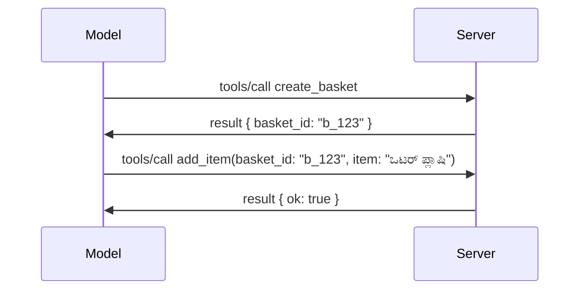

# MCPನಲ್ಲಿ ಆಗಿರುವ ಬದಲಾವಣೆ: 2026-07-28 ಸ್ಪೆಸಿಫಿಕೇಷನ್  

> **ಸ್ಥಿತಿ:** ಅಂತಿಮ. MCP ಸ್ಪೆಸಿಫಿಕೇಷನ್ `2026-07-28` 2026 ಜುಲೈ 28 ರಂದು ಬಿಡುಗಡೆಗೊಂಡಿದ್ದು  
> ಇದು ಪ್ರಸ್ತುತ ಪ್ರೋಟೋಕಾಲ್ ಪರಿಷ್ಕರಣೆ. ಈ ಪಾಠ ಅಂತಿಮ  
> ಸ್ಪೆಸಿಫಿಕೇಷನನ್ನು ವಿವರಿಸುತ್ತದೆ. ಕೆಲವು ಪಠ್ಯಕ್ರಮ ಉದಾಹರಣೆಗಳು ವಿಶೇಷವಾಗಿ  
> `2025-11-25`ಗೆ ಆವೃತ್ತಿಯನ್ನು ಉಳಿಸಿಕೊಂಡಿವೆ ಏಕೆಂದರೆ ಅವುಗಳ SDKಗಳು  
> ಇನ್ನೂ ಹೊಸ ಸ್ಥಿತಿಸ್ಬರಹಿತ API ಅನ್ನು ಅಳವಡಿಸಿಲ್ಲ; ಅವುಗಳನ್ನು ಪರಂಪರೆಯಿಂದಲೂ ಅನುಕರಿಸುವ ಮಾರ್ಗದರ್ಶಿಯಾಗಿ ಪರಿಗಣಿಸಿ.  

## ಅವಲೋಕನ  

`2026-07-28` MCP ಆರಂಭವಾದ ಬಳಿಕದ ಅತಿ ದೊಡ್ಡ ಪರಿಷ್ಕರಣೆ. ಆರು  
ಸ್ಪೆಸಿಫಿಕೇಷನ್ ಹೆಚ್ಚಿಸುವ ಪ್ರಸ್ತಾಪಗಳು (SEPs) ಪ್ರೋಟೋಕಾಲ್ ಮಟ್ಟದ ಸೆಷನ್ಗಳನ್ನು ತೆಗೆದುಹಾಕಿ  
MCP ಅನ್ನು ಸಾರವಾಹಕ ಮಾದರಿಯಲ್ಲಿ ಸ್ಥಿತಿಸ್ಬರಹಿತವಾಗಿಸುತ್ತದೆ, ವಿಸ್ತರಣೆಗಳು ಮೊದಲನೇ ದರ್ಜೆಯ,  
ಆವೃತ್ತಿಯನ್ನು ಹೊಂದಿರುವ ವ್ಯವಸ್ಥೆಯಾಗುತ್ತವೆ ಮತ್ತು ಈ ಪಠ್ಯಕ್ರಮದಲ್ಲಿ पहले شامل ಮಾಡಲಾದ ಹಲವು ವೈಶಿಷ್ಟ್ಯಗಳು  
(ರೂಟ್ಸ್, ಸಂಗ್ರಹಣೆ, ಲಾಗಿಂಗ್) ಹೊಸ ಜೀವನ ಚಕ್ರ ನೀತಿಯಿಂದ ಮಾನ್ಯತೆ ಕಳೆದುಕೊಳ್ಳುತ್ತವೆ. ಇದು  
ಪಾಠದಲ್ಲಿ ಏನು ಬದಲಾಗಿದೆ, ಏಕೆ ಇದು ಮುಖ್ಯ, ಮತ್ತು ಇದು `2025-11-25`ಗೆ ಬರೆಯಲಾದ ಕೋಡ್‌ಗೆ  
ಏನು ಅರ್ಥವಾಗುತ್ತದೆ ಎಂಬುದನ್ನು ಸಂಕ್ಷಿಪ್ತವಾಗಿ ವಿವರಿಸಲಾಗಿದೆ.  

ஆதாரம்: [The 2026-07-28 MCP Specification Release Candidate](https://blog.modelcontextprotocol.io/posts/2026-07-28-release-candidate/) (ಮಾದರಿ ಸಂದರ್ಭ ಪ್ರೋಟೋಕಾಲ್ ಬ್ಲಾಗ್, ಡೇವಿಡ್ ಸೋರಿಯಾ ಪಾರ್ರಾ ಮತ್ತು ಡೆನ್ ಡೆಲಿಮಾರ್ಡ್ಸ್ಕಿ).  

## ಕಲಿಕೆಯ ಉದ್ದೇಶಗಳು  

ಈ ಪಾಠದ ಅಂತ್ಯಕ್ಕೆ ನೀವು ಮಾಡಲು ಸಾಧ್ಯವಾಗುವುದು:  

- MCP ಮಾದರಿಯನ್ನು ಸ್ಥಿತಿಸ್ಬರಹಿತ ಪ್ರೋಟೋಕಾಲ್ ಕೋರ್‌ಗೆ ಯಾಕೆ ಮರುಹೊಂದಿಸುತ್ತಿದೆ ಮತ್ತು ಇದು ಆಡಿಯೋಹೋರಿಜಂಟಲ್ ಪ್ರಮಾಣದಲ್ಲಿ ಏನು ಸಮಸ್ಯೆ ಪರಿಹರಿಸುತ್ತದೆ ಎಂದು ವಿವರಿಸು.  
- `initialize`/`initialized` ಹ್ಯಾಂಡ್‌ಶೇಕ್ ಮತ್ತು `Mcp-Session-Id` ಹೆಡರ್ ಹೇಗೆ ಬದಲಾಗಿವೆ ಎಂಬುದನ್ನು ವಿವರಣೆ ಮಾಡುವುದು.  
- ಹೊಸ `Mcp-Method` ಮತ್ತು `Mcp-Name` ಹೆಡರ್ಗಳು ಮತ್ತು `ttlMs`/`cacheScope` ಕ್ಯಾಚಿಂಗ್ ಮೆಟಾಡೇಟಾ ಗುರುತಿಸುವುದು.  
- ವಿಸ್ತರಣೆಗಳ ನಿಯಂತ್ರಣವನ್ನು ಗುರುತಿಸುವುದು ಮತ್ತು ಈ ಬಿಡುಗಡೆ ಜೊತೆ ಬರೋ ವಿಸ್ತರಣೆಗಳು: MCP ಅಪ್ಲಿಕೇಶನ್ಗಳು ಮತ್ತು ಟಾಸ್ಕ್‌ಗಳು.  
- ಪ್ರವೇಶದ ಕಠಿಣೀಕರಣ ಮತ್ತು ಡೈನಾಮಿಕ್ ಕ್ಲೈಯೆಂಟ್ ನೋಂದಣಿ ನಿಷೇಧವನ್ನು ಸಾರಾಂಶಗೊಳಿಸುವುದು.  
 
- ಯಾವ ಕೋರ್ ವೈಶಿಷ್ಟ್ಯಗಳು (ರೂಟ್ಸ್, ಸಂಗ್ರಹಣೆ, ಲಾಗಿಂಗ್) ಈಗ ನಿಷೇಧಗೊಂಡಿವೆ ಮತ್ತು ಅದರ ನೈಜ ಅರ್ಥವೇನು ಎಂಬುದನ್ನು ಗುರುತಿಸುವುದು.  
- ಟೂಲ್ `inputSchema`/`outputSchema`ಗಾಗಿ ಪೂರ್ಣ JSON_SCHEMA 2020-12 ಬದಲಾವಣೆಯನ್ನು ವಿವರಿಸುವುದು.  

## ಸ್ಥಿತಿಸ್ಬರಹಿತ ಪ್ರೋಟೋಕಾಲ್  

ಮುಖ್ಯ ಬದಲಾವಣೆ: MCP ಪ್ರೋಟೋಕಾಲ್ ಮಟ್ಟದಲ್ಲಿ ಸ್ಥಿತಿಸ್ಬರಹಿತವಾಗುತ್ತದೆ.  

### ಮೊದಲು (2025-11-25): ಸೆಷನ್ಗಳು ನಿಮ್ಮನ್ನು ಒಬ್ಬ ಸರ್ವರ್ ಉದಾಹರಣೆಗೆ ಬಂಧಿಸುತ್ತವೆ  

ಸ್ಟ್ರೀಮಬಲ್ HTTP ಮೂಲಕ ಟೂಲ್ ಅನ್ನು ಕರೆ ಮಾಡಿದಾಗ `initialize` ಹ್ಯಾಂಡ್‌ಶೇಕ್ ನಂತರ ಪ್ರಾರಂಭವಾಗುತ್ತದೆ. ಸರ್ವರ್ ಪ್ರತಿಕ್ರಿಯೆಯಲ್ಲಿ `Mcp-Session-Id` ಹೆಡರ್ ನೀಡುತ್ತದೆ, ಇದು ಪ್ರತಿಯೊಂದು ವಿನಂತಿಯೂ ಜೊತೆಯಾಗಿರಬೇಕು:  

```http
POST /mcp HTTP/1.1
Mcp-Session-Id: 1868a90c-3a3f-4f5b
Content-Type: application/json

{"jsonrpc":"2.0","id":2,"method":"tools/call",
 "params":{"name":"search","arguments":{"q":"otters"}}}
```
  
ಸೆಷನ್ ನೀಡಿದ ಸರ್ವರ್ ಉದಾಹರಣೆಗೆ ಅಡ್ಡವಾಗಿ ಲಂಬವಾಗಿ ಸ್ಕೇಲ್ ಮಾಡಿದ ನಿಯೋಜನೆಗಳಿಗೆ ಲೋಡ್ ಬಲಾನ್ಸರ್‌ನಲ್ಲಿ **ಸ್ಟಿಕ್ಕಿ ರೌಟಿಂಗ್** ಮತ್ತು ಉದಾಹರಣೆಗಳ ನಡುವೆ **ಹσαಷಯಿತ ಸೆಷನ್ ಸಂಗ್ರಹ** ಅಗತ್ಯವಿದೆ.  

### ನಂತರ (2026-07-28): ಪ್ರತಿಯೊಂದು ವಿನಂತಿಯೂ ಸ್ವಯಂ-ಸಂಯುಕ್ತವಾಗಿದೆ  

```http
POST /mcp HTTP/1.1
MCP-Protocol-Version: 2026-07-28
Mcp-Method: tools/call
Mcp-Name: search
Content-Type: application/json

{"jsonrpc":"2.0","id":1,"method":"tools/call",
 "params":{"name":"search","arguments":{"q":"otters"},
           "_meta":{"io.modelcontextprotocol/protocolVersion":"2026-07-28",
                    "io.modelcontextprotocol/clientInfo":{"name":"my-app","version":"1.0"},
                    "io.modelcontextprotocol/clientCapabilities":{}}}}
```
  
ಯಾವುದೇ ಸರ್ವರ್ ಉದಾಹರಣೆ ಈ ವಿನಂತಿಯನ್ನು ಸಂಭಾಳಿಸಬಹುದಾಗಿದೆ. ಪ್ರಮುಖ ಬದಲಾವಣೆಗಳು:  

- **`initialize`/`initialized` ಹ್ಯಾಂಡ್‌ಶೇಕ್ ತೆಗೆದುಹಾಕಲಾಗಿದೆ** ([SEP-2575](https://github.com/modelcontextprotocol/modelcontextprotocol/pull/2575)). ಪ್ರೋಟೋಕಾಲ್ ಆವೃತ್ತಿ, ಕ್ಲೈಯೆಂಟ್ ಮಾಹಿತಿ, ಮತ್ತು ಕ್ಲೈಯೆಂಟ್ ಸಾಮರ್ಥ್ಯಗಳು ಪ್ರತಿ ವಿನಂತಿಯಲ್ಲಿಯೂ `_meta`ನಲ್ಲಿ ವಹಿಸಲಾಗುತ್ತದೆ. ಹೊಸ `server/discover` ವಿಧಾನವು ಕ್ಲೈಯೆಂಟ್‌ಗೆ ಅಗತ್ಯವಿದ್ದಾಗ ಸರ್ವರ್ ಸಾಮರ್ಥ್ಯಗಳನ್ನು ಮುಂಚಿತವಾಗಿ ಪಡೆಯಲು ಬಿಡುತ್ತದೆ.  

- **`Mcp-Session-Id` ಹೆಡರ್ ಮತ್ತು ಪ್ರೋಟೋಕಾಲ್-ಮಟ್ಟದ ಸೆಷನ್ ತೆಗೆದುಹಾಕಲ್ಪಟ್ಟಿವೆ** ([SEP-2567](https://github.com/modelcontextprotocol/modelcontextprotocol/pull/2567)). ಸ್ಟಿಕ್ಕಿ ರೌಟಿಂಗ್ ಮತ್ತು ಹಂಚಿಕೊಂಡಿರುವ ಸೆಷನ್ ಸಂಗ್ರಹಣಾ ವ್ಯವಸ್ಥೆಗಳು ಈಗ ಪ್ರೋಟೋಕಾಲ್ ಲೇಯರ್‌ನಲ್ಲಿ ಅಗತ್ಯವಿಲ್ಲ.

### ಸ್ಥಿತಿ ರಹಿತ ಪ್ರೋಟೋಕಾಲ್, ಸ್ಥಿತಿಸ್ಥಾಪಕ ಅಪ್ಲಿಕೇಶನ್‌ಗಳು

ಪ್ರೋಟೋಕಾಲ್-ಮಟ್ಟದ ಸೆಷನ್ ತೆಗೆದುಹಾಕುವುದು ನಿಮ್ಮ ಸರ್ವರ್ ಸ್ಥಿತಿಸ್ಥಾಪಕವಾಗಿರಲು ಸಾಧ್ಯವಿಲ್ಲ ಎಂದು ಅರ್ಥವಲ್ಲ. ಶಿಫಾರಸು ಮಾಡಲಾದ ಮಾದರಿ ಸಹಜವಾಗಿ HTTP API ಗಳಿಂದ ಯಾವಾಗಲೂ ಬಳಸಲಾಗುವ ಮಾದರಿಯೇ ಇದೆ: ಒಂದು ಟೂಲ್ ಕರೆದಿಂದ ಸಾಂದರ್ಭಿಕ ಹ್ಯಾಂಡಲ್ (ಒಂದು `basket_id`, ಒಂದು `browser_id`) ಉತ್ಪಾದಿಸಿ, ಮತ್ತು ನಂತರದ ಕರೆಯೆಡೆಗೆ ಆ ಹ್ಯಾಂಡಲ್ ಅನ್ನು ಸರಳ ವಾದವಾಗಿ ಮಾದರಿಗೆ ಹಿಂತಿರುಗಿಸಿಕೊಳ್ಳಿ.



ಇದು ಸ್ಥಿತಿಯನ್ನು ಮಾದರಿಗೆ ಗೋಚರವಾಗುವಂತೆ ಮತ್ತು ಯುಕ್ತಿವಂತವಾಗುವಂತೆ ಮಾಡುತ್ತದೆ, ಬದಲಾಗಿ ಅದನ್ನು ಸಾಗಣಾ ಮೆಟಾಡೇಟಾದಲ್ಲಿ ಮರೆಯುವ ಬದಲು, ಮತ್ತು ಇದು ಯಾವುದೇ ಸರ್ವರ್ ಇನ್ಸ್‌ಟಾನ್ಸ್ ಯಾವುದೇ ಕರೆಯನ್ನೂ ನಿರ್ವಹಿಸಲು ಅನುಮತಿಸುತ್ತದೆ.

### ಸರ್ವರ್-ರಿಂದ ಕ್ಲೈಂಟ್ ವಿನಂತಿಗಳು, ಮರುಸಂರಚಿಸಲಾಗಿದೆ

ಸ್ಥಿತಿ ರಹಿತ ಪ್ರೋಟೋಕಾಲ್ ಇದೆಯಾದರೂ ಕೂಡ, ಸರ್ವರ್ ಸಾಧಾರಣವಾಗಿ ಮಧ್ಯದಲ್ಲಿ ಕ್ಲೈಂಟ್‌ನ್ನು ಏನಾದರೂ ಕೇಳಬೇಕಾದ ಮೂಲೆ ಇದೆ (ಉದಾಹರಣೆಗೆ, ಪ್ರಶ್ನೆಯನ್ನು ಕೇಳುವ ಪ್ರಾಂಪ್ಟ್):

- **ಸರ್ವರ್ ಪ್ರಾರಂಭಿಸಿದ ವಿನಂತಿಗಳು ಸರ್ವರ್ ಸಕ್ರಿಯವಾಗಿ ಕ್ಲೈಂಟ್ ವಿನಂತಿಯನ್ನು ಪ್ರಕ್ರಿಯೆಗೊಳಿಸುತ್ತಿರುವಾಗ ಮಾತ್ರ ನೀಡಬಹುದು** ([SEP-2260](https://github.com/modelcontextprotocol/modelcontextprotocol/pull/2260)) — ಮೊದಲು ಶಿಫಾರಸು ಆಗಿದ್ದವು, ಈಗ ಅಗತ್ಯ. ಬಳಕೆದಾರರು ಎಂದಿಗೂ ಅನಿರೀಕ್ಷಿತವಾಗಿ ಪ್ರಾಂಪ್ಟ್ ಆಗುವುದಿಲ್ಲ.
- **ಬಹು-ಮಡಿಗೆ ವಿನಂತಿಗಳು** ([SEP-2322](https://github.com/modelcontextprotocol/modelcontextprotocol/pull/2322)) SSE ಸ್ಟ್ರೀಮ್ ತೆರೆದಿಡುವುದನ್ನು ಬದಲಿಸುತ್ತದೆ. ಬದಲು, ಸರ್ವರ್ `InputRequiredResult` ಅನ್ನು ಹಿಂತಿರುಗಿಸುತ್ತದೆ:

  ```json
  {
    "resultType": "input_required",
    "inputRequests": {
      "confirm": {
        "type": "elicitation",
        "message": "Delete 3 files?",
        "schema": { "type": "boolean" }
      }
    },
    "requestState": "eyJzdGVwIjoxLCJmaWxlcyI6WyJhIiwiYiIsImMiXX0="
  }
  ```

  ಕ್ಲೈಂಟ್ ಉತ್ತರವಳಿಗಳನ್ನು ಸಂಗ್ರಹಿಸಿ ಮೂಲ ಕರೆ ಮರುಕಳುಹಿಸಿ `inputResponses` ಹಾಗೂ ಪ್ರತಿಧ್ವನಿಯಾಗಿರುವ `requestState` ಜೊತೆಗೆ. ಯಾವುದೇ ಸರ್ವರ್ ಇನ್ಸ್‌ಟಾನ್ಸ್ மறಳಿಸುವಿಕೆಯಿಂದ ಹಿಡಿಯಬಹುದು ಏಕೆಂದರೆ ಅವಶ್ಯಕವಾದ ಎಲ್ಲವೂ ಪೇಲೋಡ್‌ನಲ್ಲಿ ಇರುತ್ತದೆ.

### ಮಾರ್ಗಪಟ್ಟಿ, ಕ್ಯಾಶೇಯಾದ, ಹಾದಿಮಾಡಬಹುದಾದ

ಮೂರು ಸಣ್ಣ ಬದಲಾವಣೆಗಳು ಸ್ಥಿತಿ ರಹಿತ ಸಂಚಾರವನ್ನು ನಿರ್ವಹಿಸಲು ಸುಲಭಮಾಡುತ್ತವೆ:

- **`Mcp-Method` ಮತ್ತು `Mcp-Name` ಹೆಡರ್‌ಗಳು ಸ್ಟ್ರೀಮಬಲ್ HTTP ಮೇಲೆ ಅಗತ್ಯವಿದ್ದಾರೆ** ([SEP-2243](https://github.com/modelcontextprotocol/modelcontextprotocol/pull/2243)), ಆದ್ದರಿಂದ ಲೋಡ್ ಬಲಾನ್ಸರ್‌ಗಳು, ಗೇಟ್ವೇಗಳು ಮತ್ತು ದರ ನಿಯಂತ್ರಕಗಳು JSON ದೇಹವನ್ನು ಪರಿಶೀಲಿಸುವ ಅಗತ್ಯವಿಲ್ಲದೆ ಕಾರ್ಯಾಚರಣೆಯಲ್ಲಿ ಮಾರ್ಗದರ್ಶನೆಯನ್ನು ಮಾಡಬಹುದು. ಹೆಡರ್‌ಗಳು ಮತ್ತು ದೇಹ ಒಪ್ಪಿಕொண்டಿಲ್ಲದ ಕರೆಯನ್ನೇ ಸರ್ವರ್ ತಿರಸ್ಕರಿಸುತ್ತದೆ.
- **`tools/list` ಮತ್ತು ಸಂಪನ್ಮೂಲ ಓದುವ ಫಲಿತಾಂಶಗಳು `ttlMs` ಮತ್ತು `cacheScope` ಅನ್ನು ಹೊಂದಿವೆ** ([SEP-2549](https://github.com/modelcontextprotocol/modelcontextprotocol/pull/2549)), HTTP `Cache-Control` ಆಧಾರಿತವಾಗಿವೆ. ಗ್ರಾಹಕರು ಪಟ್ಟಿಯ ಫಲಿತಾಂಶ ಎಷ್ಟು ಕಾಲ تازಾ ಆಗಿದೆ ಮತ್ತು ಇದು ಬಳಕೆದಾರರ ನಡುವೆ ಹಂಚಿಕೊಳ್ಳಲು ಸುರಕ್ಷಿತವಾಗಿದೆಯೇ ಎಂಬುದೆಯನ್ನು ತಿಳಿದುಕೊಳ್ಳುತ್ತಾರೆ, ಬದಲಾಗಿ ಬದಲಾವಣೆಗಳನ್ನು ತಿಳಿಯಲು ದೀರ್ಘಕಾಲದ SSE ಸ್ಟ್ರೀಮ್ ಅಗತ್ಯವಿಲ್ಲ.
- **W3C ಟ್ರೇಸ್ ಕಾಂಟೆಕ್ಸ್ಟ್ ಪ್ರಸಾರ `_meta` ನಲ್ಲಿ ದಾಖಲಿಸಲಾಗಿದೆ** ([SEP-414](https://github.com/modelcontextprotocol/modelcontextprotocol/pull/414)), `traceparent`, `tracestate`, ಮತ್ತು `baggage` ಕೀಲಿಮಣೆ ಹೆಸರುಗಳನ್ನು ಸರಿಪಡಿಸಿದೆ, ಎ ಹಂಚಿಕೆಡಿಸಿದ ಟ್ರೇಸ್ ಸSDK, MCP ಸರ್ವರ್ ಮತ್ತು ಕೆಳಗಡೆಯು ವ್ಯವಸ್ಥೆಗಳ ನಡುವೆ [OpenTelemetry](https://opentelemetry.io/) ಹೊಂದಾಣಿಕೆಯ ಬ್ಯಾಕೆಂಡ್‌ನಲ್ಲಿ ಒಂದು ಕರೆ ಅನುಸರಿಸಬಹುದು.

## ವಿಸ್ತರಣೆಗಳು ಪ್ರಥಮ ವರ್ಗವಾಯ್ತು

ವಿಸ್ತರಣೆಗಳು ಅನೌಪಚಾರಿಕವಾಗಿ `2025-11-25` ರಲ್ಲಿ ಇದ್ದವು. [SEP-2133](https://github.com/modelcontextprotocol/modelcontextprotocol/pull/2133) ಅವುಗಳನ್ನು ಪ್ರತ್ಯೇಕವಾಗಿ ವಿವರಿಸುತ್ತದೆ:

- ವಿಸ್ತರಣೆಗಳನ್ನು ರಿವರ್ಸ್-DNS ID ಗಳ ಮೂಲಕ ಗುರುತಿಸಲಾಗುತ್ತದೆ.
- ಅವುಗಳು ಗ್ರಾಹಕ ಮತ್ತು ಸರ್ವರ್ ಸಾಮರ್ಥ್ಯಗಳ ಮೇಲೆ `extensions` ಮ್ಯಾಪ್ ಮೂಲಕ ಸಂವಾದಮಾಡಲ್ಪಡುತ್ತವೆ.

- ಅವವರು ತಮ್ಮದೇ `ext-*` ಸಂಗ್ರಹಣೆಗಳಲ್ಲಿ ವಾಸಿಸುತ್ತಾರೆ, ದೆಲಿಗೇಟು ಮಾಡಿದ ನಿರ್ವಹಕರೊಂದಿಗೆ ಮತ್ತು ಕೋರ್ ಸ್ಪೆಸಿಫಿಕೇಶನ್‌ನಿಂದ ಸ್ವತಂತ್ರವಾಗಿ ಆವೃತ್ತಿ ಮಾಡುತ್ತಾರೆ.
- SEP ಪ್ರಕ್ರಿಯೆಯಲ್ಲಿ ಹೊಸ ಎಕ್ಸ್ಟेंಶನ್ಸ್ ಟ್ರ್ಯಾಕ್ ಅವರಿಗೆ ಪ್ರಯೋಗಾತ್ಮಕದಿಂದ ಅಧಿಕೃತಕ್ಕೆ ಮಾರ್ಗವನ್ನು ನೀಡುತ್ತದೆ.

ಈ ಬಿಡುಗಡೆ ಎರಡು ಅಧಿಕೃತ ಎಕ್ಸ್ಟೆನ್ಶನ್‌ಗಳನ್ನು ಸಾಗಿಸುತ್ತದೆ.


### MCP ಅಪ್ಲಿಕೇಶನ್‌ಗಳು: ಸರ್ವರ್-ರೆಂಡರ್ ಮಾಡಲಾದ ಬಳಕೆದಾರ ಇಂಟರ್ಫೇಸ್ಗಳು

[MCP ಅಪ್ಲಿಕೇಶನ್‌ಗಳು](https://blog.modelcontextprotocol.io/posts/2026-01-26-mcp-apps/) ([SEP-1865](https://github.com/modelcontextprotocol/modelcontextprotocol/pull/1865)) ಸರ್ವರ್‌ಗಳಿಗೆ ಪಲ್ಲಟಿತ ಸಂಕುಚಿತ ಆದೇಶಕ ಅಡಿಯಲ್ಲಿ ಸೇರ್ಪಡೆಗೊಳ್ಳುವ ಇಂಟರೆಕ್ಟಿವ್ HTML ಇಂಟರ್ಫೇಸ್ಗಳನ್ನು ಕಳುಹಿಸಲು ಅನುಮತಿಸುತ್ತವೆ. ಸಾಧನಗಳು ತಮ್ಮ UI ಟೆಂಪ್ಲೇಟುಗಳನ್ನು ಮುಂಚಿತವಾಗಿ ಘೋಷಿಸುತ್ತವೆ ಆದ್ದರಿಂದ ಹೊಂದಾಣಿಕೆಗಳು ಅವುಗಳನ್ನು ಮುಂಚಿತವಾಗಿ ಪಡೆದು, ಸಂಗ್ರಹಿಸಿ ಮತ್ತು ಭದ್ರತಾ ಪರಿಶೀಲನೆ ಮಾಡಬಹುದು. ನೀವು ಈಗಾಗಲೇ [ಪಾಠ 15: MCP ಅಪ್ಲಿಕೇಶನ್‌ಗಳು](../03-GettingStarted/15-mcp-apps/README.md) ನಲ್ಲಿ ಇದರ ಮೂಲಭೂತಗಳನ್ನು ಮುಚ್ಚಿದ್ದೀರಿ — ವಿಸ್ತರಣಾ ಫ್ರೇಮ್‌ವರ್ಕ್ ಅಡಿಯಲ್ಲಿ, MCP ಅಪ್ಲಿಕೇಶನ್‌ಗಳು ಈಗ ಅಧಿಕೃತವಾಗಿ ತಂತ್ರಾಂಶ ಅಲ್ಲ, ಬದಲಾಗಿ ವಿಸ್ತರಣೆ ಆಗಿವೆ.

### ಕಾರ್ಯಗಳು ವಿಸ್ತರಣೆಗೆ ಹಾದು ಹೋದವು

ಕಾರ್ಯಗಳು `2025-11-25` ಅನ್ನು ಪ್ರಾಯೋಗಿಕ ಮೂಲ ವೈಶಿಷ್ಟ್ಯವಾಗಿ ರವಾನಿಸಲ್ಪಟ್ಟವು. ಉತ್ಪಾದನಾ ಬಳಕೆ ಸಾಕಷ್ಟು ಪುನರ್‌ರೂಪಣೆಯನ್ನು ತರುವುದಾಗಿ ಕಂಡುಬಂದಿದ್ದು, ಇದರ ಸೂಕ್ತ ಗೃಹಸ್ಥಳ ವಿಸ್ತರಣೆಯೇ ಆಗಿದೆ: [ಕಾರ್ಯ ವಿಸ್ತರಣೆ](https://github.com/modelcontextprotocol/modelcontextprotocol/pull/2663) ಸ್ಟೇಟ್ಲೆಸ್ ಮಾದರಿಯ ಸುತ್ತ ಲೈಫ್ಸೈಕಲ್ ಅನ್ನು ಪುನರ್ ವಿನ್ಯಾಸ ಮಾಡಿದೆ — ಸರ್ವರ್ `tools/call` ಗೆ ಒಂದು ಕಾರ್ಯ ಹ್ಯಾಂಡಲ್ ಅನ್ನು ಉತ್ತರಿಸಬಹುದು ಮತ್ತು ಗ್ರಾಹಕ `tasks/get`, `tasks/update`, ಮತ್ತು `tasks/cancel` ನೊಂದಿಗೆ ಅದನ್ನು ಮುಂದುವರೆಸುತ್ತಾನೆ. ಕಾರ್ಯ ರಚನೆ ಸರ್ವರ್-ನೇರಿತವಾಗಿದೆ: ಗ್ರಾಹಕ ವಿಸ್ತರಣೆಯನ್ನು ಘೋಷಿಸುತ್ತದೆ ಮತ್ತು ಸರ್ವರ್ ಒಂದು ಕರೆ ಕಾರ್ಯವಾಗಿರಬೇಕು ಎಂಬುದನ್ನು ನಿರ್ಧರಿಸುತ್ತದೆ. `tasks/list` ಅನ್ನು ಸಂಪೂರ್ಣವಾಗಿ ತೆಗೆದುಹಾಕಲಾಗಿದೆ ಏಕೆಂದರೆ ಅದು ಸೆಷನ್‌ಗಳಿಲ್ಲದೆ ಸುರಕ್ಷಿತವಾಗಿ ವ್ಯಾಪಿಸಲಾಗದು.

> **ಸ್ಥಳಾಂತರ ಅಭಿಪ್ರಾಯ:** ನೀವು ಪ್ರಾಯೋಗಿಕ `2025-11-25` ಕಾರ್ಯ API ಅನ್ನು ಅನುಷ್ಠಾನಗೊಳಿಸಿದರೆ, ನೀವು ಹೊಸ ವಿಸ್ತರಣೆಯ ಲೈಫ್ಸೈಕಲ್ ಗೆ ಸ್ಥಳಾಂತರವಾಗಬೇಕಾಗುತ್ತದೆ — ಇದಾದಾಯಕವಾಗಿ ಹಿಂತಿರುಗುವಂತೆ ಹೊಂದಿಕೆಯಾಗುವುದಿಲ್ಲ.

## ಪ್ರಾಧಿಕಾರ ಮજબೂತಿಗೊಳಿಸುವಿಕೆ

ಹಲವಾರು SEP ಗಳು
[ಪ್ರಾಧಿಕಾರ ವಿವರಾಬಂಧ](https://modelcontextprotocol.io/specification/2026-07-28/basic/authorization)
ಅನ್ನು ನೈಜ ಜಗತ್ತಿನ OAuth 2.0 / OpenID Connect ಬಳಕೆಗಳೊಂದಿಗೆ ಹೆಚ್ಚು ಹೊಂದಾಣಿಕೆಯಾಗುವಂತೆ ಮજબೂತಿಗೊಳಿಸುತ್ತವೆ:

| SEP | ಬದಲಾವಣೆ |
|---|---|
| [SEP-2468](https://github.com/modelcontextprotocol/modelcontextprotocol/pull/2468) | ಗ್ರಾಹಕರಿಗೆ ಪ್ರಾಧಿಕಾರ ಪ್ರತಿಕ್ರಿಯೆಗಳ ಮೇಲೆ `iss` ಪಾರಾಮೀಟರ್ ಅನ್ನು [RFC 9207](https://www.rfc-editor.org/rfc/rfc9207) ಪ್ರಕಾರ ಮಾನ್ಯಗೊಳಿಸುವುದು ಕಡ್ಡಾಯ, ಇದು MCP ಯ ಏಕರೂಪ ಗ್ರಾಹಕ, ಅನೇಕ ಸರ್ವರ್ ಮಾದರಿಯಲ್ಲಿ ಸಾಮಾನ್ಯವಾಗಿರುವ ಮಿಶ್ರಣದ ಹಲ್ಲೆಗಳನ್ನು ತಡೆಗಟ್ಟುತ್ತದೆ. ಭವಿಷ್ಯದಲ್ಲಿ ನಿತ್ಯದಲ್ಲಿ `iss` ಇಲ್ಲದ ಪ್ರತಿಕ್ರಿಯೆಗಳನ್ನು ತಿರಸ್ಕರಿಸುವ ಅಗತ್ಯವಿರುತ್ತದೆ. |
| [SEP-837](https://github.com/modelcontextprotocol/modelcontextprotocol/pull/837) | ಹೊಂದಾಣಿಕೆಗೆ ಮಾತ್ರ ಡೈನಾಮಿಕ್ ಕ್ಲೈಂಟ್ ನೋಂದಣಿ ಗ್ರাহಕರು ತಮ್ಮ OpenID Connect `application_type` ಅನ್ನು ಘೋಷಿಸುತ್ತಾರೆ, ಡೆಸ್ಕ್‌ಟಾಪ್ ಮತ್ತು CLI ಗ್ರಾಹಕರಲ್ಲಿ ತಪ್ಪಾದ `"web"` ನ ಡೀಫಾಲ್ಟ್ ತಪ್ಪಿಸುವಂತೆ. |
| [SEP-2352](https://github.com/modelcontextprotocol/modelcontextprotocol/pull/2352) | ಹೊಂದಾಣಿಕೆಗೆ ಮಾತ್ರ ನೋಂದಾಯಿತ ಪ್ರಮಾಣೀಕರಣಗಳು ಬಿಡುಗಡೆ ಮಾಡುವ ಪ್ರಾಧಿಕಾರ ಸರ್ವರ್‌ನ `issuer` ಗೆ ಬದ್ಧವಾಗಿರುತ್ತವೆ; ಸಂಪನ್ಮೂಲವು ಸ್ಥಳಾಂತರವಾದಲ್ಲಿ ಗ್ರಾಹಕರು ಮರು-ನೋಂದಾಯಿಸುವ ಅಗತ್ಯವಿದೆ. |
| [SEP-2207](https://github.com/modelcontextprotocol/modelcontextprotocol/pull/2207) | OpenID Connect ಶೈಲಿಯ ಪ್ರಾಧಿಕಾರ ಸರ್ವರ್‌ಗಳಿಂದ ರಿಫ್ರೇಶ್ ಟೋಕನ್ಗಳ ವಿನಂತಿ ಹೇಗೆ ಮಾಡುವುದೆಂದು ದಾಖಲಿಸುತ್ತದೆ. |
| [SEP-2350](https://github.com/modelcontextprotocol/modelcontextprotocol/pull/2350) | ಹಂತ-ಅಪ್ಭಾವ ಪ್ರಾಧಿಕಾರದಲ್ಲಿ ವ್ಯಾಪ್ತಿ ಸಂಗ್ರಹಣೆ ಸ್ಪಷ್ಟಪಡಿಸುತ್ತದೆ. |
| [SEP-2351](https://github.com/modelcontextprotocol/modelcontextprotocol/pull/2351) | `.well-known` ಅಂತ್ಯಲಕ್ಷಣವನ್ನು ಸ್ಪಷ್ಟಪಡಿಸುತ್ತದೆ. |

ನೀವು MCP ಗಾಗಿ ಪ್ರಾಧಿಕಾರ ಸರ್ವರ್ ರಚಿಸುತ್ತಿದ್ದರೆ,
ಪ್ರಾಧಿಕಾರ ಪ್ರತಿಕ್ರಿಯೆಗಳಲ್ಲಿ `iss` ನೀಡಿರಿ ಮತ್ತು ಅಂತಿಮ ಪ್ರಾಧಿಕಾರ ವಿವರಾಬಂಧವನ್ನು ಅನುಸರಿಸಿ.ಿಂದ
ಕೈಗಾರಿಕೆ ಮಾರ್ಗದರ್ಶನಕ್ಕಾಗಿ ನೋಡಿರಿ [02-Security](../02-Security/README.md).

ಡೈನಾಮಿಕ್ ಕ್ಲೈಂಟ್ ನೋಂದಣಿ ಹೊಂದಾಣಿಕೆಗಾಗಿ ಪ್ರಾಯೋಗಿಕವಾಗಿದೆ ಆದರೆ `2026-07-28` ರಂದು ನಿವೃತ್ತಿ ಸ್ಥಗಿತವಾಗಿದೆ.
ಹೊಸ ಅನುಷ್ಠಾನಗಳು ಕ್ಲೈಂಟ್ ಐಡಿ ಮೆಟಾಡೇಟಾ
ಪ್ರಬಂಧಗಳನ್ನು ಬಳಸಬೇಕು.

## ನಿವೃತ್ತಗೊಂಡ ವೈಶಿಷ್ಟ್ಯಗಳು

ಹೊಸ
[ವೈಶಿಷ್ಟ್ಯ ಲೈಫ್ಸೈಕಲ್ ನೀತಿ](https://github.com/modelcontextprotocol/modelcontextprotocol/pull/2577),
ಅಡಿಯಲ್ಲಿ ರೂಟ್ಸ್, ಸ್ಯಾಂಪ್ಲಿಂಗ್, ಲಾಗಿಂಗ್ ಮತ್ತು ಡೈನಾಮಿಕ್ ಕ್ಲೈಂಟ್ ನೋಂದಣಿ **ನಿವೃತ್ತಗೊಂಡಿವೆ**:

| ವೈಶಿಷ್ಟ್ಯ | ಶಿಫಾರಸು ಮಾಡಲಾದ ಬದಲಾವಣೆ |
|---|---|
| ರೂಟ್ಸ್ | ಟೂಲ್ ಪ್ಯಾರಾಮೀಟರ್‌ಗಳು, ಸಂಪನ್ಮೂಲ URIಗಳು ಅಥವಾ ಸರ್ವರ್ ಸಂರಚನೆ |
| ಸ್ಯಾಂಪ್ಲಿಂಗ್ | LLM ಪ್ರೊವೈಡರ್ APIಗಳೊಂದಿಗೆ ನೇರ ಇಂಟಿಗ್ರೇಷನ್ |
| ಲಾಗಿಂಗ್ | stdio ಸಾರಿಸು ಸಂಪಾದನಿಗಾಗಿ `stderr`; ರಚನೆಗೊಳ್ಳುವ ದೃಷ್ಠಿಸ್ಥಿತಿಗಾಗಿ OpenTelemetry |
| ಡೈನಾಮಿಕ್ ಕ್ಲೈಂಟ್ ನೋಂದಣಿ | ಕ್ಲೈಂಟ್ ಐಡಿ ಮೆಟಾಡೇಟಾ ಪ್ರಬಂಧಗಳು |

ಈ ವೈಶಿಷ್ಟ್ಯಗಳು `2026-07-28` ಪ್ರತಿಕೃತಿ ಹೊಂದಿರುವುದರಿಂದ ಹೊಂದಾಣಿಕೆಗೆ ಉಳಿದಿವೆ. ಇವು
2027 ಜುಲೈ 28 ಅಥವಾ ಅದಕ್ಕೆ ನಂತರ ಬಿಡುಗಡೆಗೊಳ್ಳುವ ಮೊದಲ ವಿವರಾಬಂಧ ಪರಿಷ್ಕರಣೆಯಲ್ಲಿ ತೆಗೆದುಹಾಕಲು ಅರ್ಹವಾಗಿವೆ;
ನಿಜವಾದ ತೆಗೆದುಹಾಕುವುದು ನಂತರದ ದಿನಾಂಕದಲ್ಲಿ ಇರಬಹುದು. ಹೊಸ ಅನುಷ್ಠಾನಗಳು ಮೇಲ್ಕಾಣಿಸಿದ
ಬದಲಾವಣಾ ಮಾದರಿಗಳನ್ನು ಬಳಸಬೇಕು.

## ಸಾಧನಗಳಿಗೆ ಸಂಪೂರ್ಣ JSON Schema 2020-12

ಸಾಧನ `inputSchema` ಮತ್ತು `outputSchema` ಸಂಪೂರ್ಣ [JSON Schema 2020-12](https://json-schema.org/draft/2020-12) ಗೆ ( [SEP-2106](https://github.com/modelcontextprotocol/modelcontextprotocol/pull/2106)) ಬರೆದಿವೆ:

- ಇನ್‌ಪುಟ್ ಸ್ಕೀಮಾಗಳು `type: "object"` ಮೂಲ ನಿಯಮವನ್ನು ಉಳಿಸಿಕೊಂಡಿವೆ ಆದರೆ ಈಗ ಸಂಯೋಜನೆಗಳನ್ನು (`oneOf`, `anyOf`, `allOf`), ಶರತ್ತುಗಳು ಮತ್ತು ಉಲ್ಲೇಖಗಳನ್ನು (`$ref`, `$defs`) ಅನುಮತಿಸುತ್ತವೆ.
- ಔಟ್‌ಪುಟ್ ಸ್ಕೀಮಾಗಳು ನಿರ್ಬಂಧವಿಲ್ಲದೇ ಇವೆ ಮತ್ತು `structuredContent` ಈಗ ಯಾವುದಾದರೂ JSON ಮೌಲ್ಯವಾಗಿರಬಹುದು, ಕೇವಲ ವಸ್ತುವಲ್ಲದೆ.
- ಅನುಷ್ಠಾನಗಳು ಬಾಹ್ಯ `$ref` URIಗಳನ್ನು ಸ್ವಯಂಚಾಲಿತವಾಗಿ ಅನುದೇಶಿಸುವುದಿಲ್ಲ ಮತ್ತು ಸ್ಕೀಮಾ ಆಳ ಮತ್ತು ಮಾನ್ಯಗೊಳಿಸುವ ಕಾಲವನ್ನು ಮೆರಗು ಮಾಡಬೇಕು (ಈದು DDoS ತಡೆಯುವ ಪ್ರಮೇಯವಾಗಿದೆ; ನೀವು ಸರ್ವರ್-ಪಕ್ಕದಲ್ಲಿ ಸ್ಕೀಮಾಗಳನ್ನು ಮಾನ್ಯಗೊಳಿಸಲು ಸದಾ ಗಮನಿಸಬೇಕು).

ಬೇರೆಯಾಗಿ, ಕಾಣೆಯಾದ ಸಂಪನ್ಮೂಲಗಳ ದೋಷ ಕೋಡ್ MCP-ಕಸ್ಟಮ್ `-32002`ನಿಂದ JSON-RPC ಪೂರ್ಣಾಂಕ `-32602` (ಅಮಾನ್ಯ ಪ್ಯಾರಾಮ್ಸ್) ಗೆ ಬದಲಾಗುತ್ತಿದೆ ( [SEP-2164](https://github.com/modelcontextprotocol/modelcontextprotocol/pull/2164)) . ನಿಮ್ಮ ಗ್ರಾಹಕರು ನೈಋತ್ಯ `-32002` ಮೌಲ್ಯವನ್ನು ಹೊಂದಿದ್ದರೆ, ನೀವು ಅದನ್ನು ನವೀಕರಿಸಬೇಕು.

## ಪ್ರೋಟೋಕೋಲ್ ಇಲ್ಲಿ ಎಲ್ಲಿಂದ ಮುಂದೆ ಸಾಗುತ್ತದೆ

ಈ ಬಿಡುಗಡೆ ಎಲ್ಲರನ್ನು ಬದಲಿಸುವ ಬದಲಾವಣೆಗಳನ್ನು ಒಳಗೊಂಡಿದೆ, ಮತ್ತು MCP ರಕ್ಷಕರು ಮುಂದುವೈದೆ ಇದು ಸಾಮಾನ್ಯವಾಗುವುದಿಲ್ಲ ಎಂದು ಉದ್ದೇಶಿಸುತ್ತಾರೆ. ಮೂರು ಆಡಳಿತ SEP ಗಳು ಪುನರಾವರ್ತನೆತಡೆಗೆ ಉದ್ದೇಶಿಸಿರುವವು:

- **ವೈಶಿಷ್ಟ್ಯ ಲೈಫ್ಸೈಕಲ್ ನೀತಿ** ಪ್ರತಿ ವೈಶಿಷ್ಟ್ಯಕ್ಕೆ ಐದು ಹಂತದ ಸಜೀವ → ನಿವೃತ್ತ → ತೆಗೆದುಹಾಕುವ ಮಾರ್ಗವನ್ನು ನೀಡುತ್ತದೆ, ನಿವೃತ್ತಿಗಿಂತ ಕನಿಷ್ಠ ಹನ್ನೊಂದು ತಿಂಗಳುಗಳ ಅಂತರವಿದೆ.
- **ವಿಸ್ತರಣೆ ಫ್ರೇಮ್‌ವರ್ಕ್** ಹೊಸ ಸಾಮರ್ಥ್ಯಗಳನ್ನು ಆಯ್ಕೆಮಾಡುವ ವಿಸ್ತರಣೆಗಳಾಗಿ ಹಂಚಿಕೊಳ್ಳಲು ಮತ್ತು ಅವುಗಳಲ್ಲಿ ಸ್ಥಿರಗೊಳಿಸಲು ಅವಕಾಶ ನೀಡುತ್ತದೆ, ಮತ್ತು ನಂತರ (ಬಹುಶಃ ಎಂದೆಾದರೂ) ಕೇಂದ್ರ ನಿಯಮಕ್ಕೆ ಸೇರಿಸಲು.
- ಸ್ಟ್ಯಾಂಡರ್ಡ್ಸ್ ಟ್ರ್ಯಾಕ್ SEP ಫಲಿತಾಂಶ ಸ್ಥಿತಿಗೆ ತಲುಪುವುದಕ್ಕೆ ಮುನ್ನ, ಹೊಂದಾಣಿಕೆ ಸರಣಿಯಲ್ಲಿ ಸಂನಿಹವುಳ್ಳ ಸಂದರ್ಭಕ್ಕೆ ಈಡಾಗಿರಬೇಕು ( [conformance suite](https://github.com/modelcontextprotocol/conformance) ( [SEP-2484](https://github.com/modelcontextprotocol/modelcontextprotocol/pull/2484) )) — ಲಭ್ಯವಿರುವ SDK ತರಗತ ಕ್ರಮವಾಯುಗೆ ಅಧಿಕೃತ SDKಗಳನ್ನು ಅಂಕೆಮಾಡುತ್ತದೆ (https://github.com/modelcontextprotocol/modelcontextprotocol/pull/1777).

## ಬಿಡುಗಡೆಯ ಸಮಯರೇಖೆ ಮತ್ತು ಪರಿಶೀಲನೆ

- ಬಿಡುಗಡೆ ಅಭ್ಯರ್ಥಿ ಮೇ 21, 2026 ರಂದು ಲಾಕ್ ಮಾಡಲಾಯಿತು.
- ಅಂತಿಮ ವಿವರಾಬಂಧ ಜುಲೈ 28, 2026 ರಂದು ಬಿಡುಗಡೆ ಮಾಡಲಾಯಿತು.

- SDK ಬೆಂಬಲವು ವಿವರಣೆಗಿಂತ ನಿಧಾನವಾಗಬಹುದು. ಪರಿಶೀಲಿಸಿ
  [SDK ಡಾಕ್ಯುಮೆಂಟೇಷನ್](https://modelcontextprotocol.io/docs/sdk) ಮತ್ತು SDK ರಿಲೀಸ್
  ಸೂಚನೆಗಳನ್ನು ಉದಾಹರಣೆಯನ್ನು ಸ್ಥಳಾಂತರಿಸುವ ಮೊದಲು.
- ಅಂತಿಮ ಬದಲಾವಣೆಗಳನ್ನು ಟ್ರ್ಯಾಕ್ ಮಾಡಿ
  [2026-07-28 ವಿವರಣೆ](https://modelcontextprotocol.io/specification/2026-07-28/)
  ಮತ್ತು ಅದರ
  [ಚೇಂಜ್ಲಾಗ್](https://modelcontextprotocol.io/specification/2026-07-28/changelog).

## ಈ ಪಠ್ಯಕ್ರಮಕ್ಕಾಗಿ ಇದರ ಅರ್ಥ ಏನು

ಪಠ್ಯಕ್ರಮವು `2025-11-25` ಉದಾಹರಣೆಗಳಿಂದ ಪ್ರಸ್ತುತದ
`2026-07-28` ವಿವರಣೆಗೆ ಪರ್ವರ್ತಿಸುತ್ತದೆ. ಸ್ಪಷ್ಟವಾಗಿ:

- **ಸೆಶನ್ಗಳು ಮತ್ತು `initialize` ಹ್ಯಾನ್‌ಶೇಕ್** `2025-11-25` ಗುರಿಯಾದ
  ಉದಾಹರಣೆಗಳಲ್ಲಿ ಲೆಗಸಿ ವರ್ತನೆ ಆಗಿವೆ. `2026-07-28` ಪ್ರೋಟೋಕೋಲ್ ಅವುಗಳನ್ನು
  ಮೇಲಾಗದ ವಿನಂತಿ ಮಾದರಿಯಿಂದ ಬದಲಾಯಿಸುತ್ತದೆ.
- **ಸ್ಯಾಂಪ್ಲಿಂಗ್ ಮತ್ತು ರೂಟ್ಸ್** ಹೊಂದಾಣಿಕೆಗೆ ಲಭ್ಯವಿವೆ ಆದರೆ ಅವು ಡಿಪ್ರೀಯೇಟೆಡ್.
  ಹೊಸ ವಿನ್ಯಾಸಗಳು ಮೇಲಿನ ಬದಲಾವಣೆ ಮಾದರಿಗಳನ್ನು ಬಳಸಬೇಕು.
- **ಪ್ರಾಯೋಗಿಕ ಟಾಸ್ಕ್ ವೈಶಿಷ್ಟ್ಯ**, ನೀವು ಇದನ್ನು ಬಳಸಿದ್ದರೆ, ಟಾಸ್ಕ್ ವಿಸ್ತರಣೆ ಹೊಸ ಜೀವನಚಕ್ರಕ್ಕೆ ಸ್ಥಳಾಂತರಿಸಬೇಕು.
- **MCP ಆ್ಯಪ್ಗಳು** ([ಪಾಠ 15](../03-GettingStarted/15-mcp-apps/README.md)) ಕೆಲಸದಲ್ಲಿ ಪ್ರಭಾವಿತವಾಗಿಲ್ಲ; ಇದು ಸರಳವಾಗಿ ಅಧಿಕೃತ ವಿಸ್ತರಣೆ ರೂಪಕೋಶದಡಿಯಲ್ಲಿ ಹೋಗುತ್ತದೆ.

## ಹೆಚ್ಚುವರಿ ಸಂಪನ್ಮೂಲಗಳು

- [MCP ವಿವರಣೆ 2026-07-28](https://modelcontextprotocol.io/specification/2026-07-28/)
- [2026-07-28 ಚೇಂಜ್ಲಾಗ್](https://modelcontextprotocol.io/specification/2026-07-28/changelog)
- [2026-07-28 MCP ವಿವರಣೆ ರಿಲೀಸ್ ಕ್ಯಾಂಡಿಡೇಟ್ (ಐತಿಹಾಸಿಕ ಬ್ಲಾಗ್ ಪೋಸ್ಟ್)](https://blog.modelcontextprotocol.io/posts/2026-07-28-release-candidate/)
- [MCP ಟ್ರಾನ್ಸ್‌ಪೋರ್ಟ್‌ಗಳ ಭವಿಷ್ಯ](https://blog.modelcontextprotocol.io/posts/2025-12-19-mcp-transport-future/)
- [SEP ಮಾರ್ಗಸೂಚಿಗಳು](https://modelcontextprotocol.io/community/sep-guidelines)
- [MCP SDK ಟಿಯರ್ ಸಿಸ್ಟಮ್](https://modelcontextprotocol.io/docs/sdk)

## ಮುಂದಿನ ಹಂತಗಳು

ಹಿಂತಿರುಗಿ [ಮೂಲ ಸಂಪ್ರದಾಯಗಳು](./README.md) ಅಥವಾ ಮುಂದುವರೆಯಿರಿ
[ಸುರಕ್ಷತೆ](../02-Security/README.md) ಗೆ ಪ್ರಸ್ತುತದ `2026-07-28` ಮಾರ್ಗದರ್ಶನವನ್ನು ಅನ್ವಯಿಸಲು.

---

<!-- CO-OP TRANSLATOR DISCLAIMER START -->
**ಅಸ್ವೀಕಾರ**:
ಈ ದಸ್ತಾವೇಜು AI ಅನುವಾದ ಸೇವೆ [Co-op Translator](https://github.com/Azure/co-op-translator) ಬಳಸಿ ಅನುವಾದಿಸಲಾಗಿದೆ. ನಾವು ನಿಖರತೆಯನ್ನು ಸಾಧಿಸಲು ಪ್ರಯತ್ನಿಸುತ್ತಿದ್ದರೂ, ದಯವಿಟ್ಟು ಗಮನಿಸಿ, ಸ್ವಯಂಚಾಲಿತ ಅನುವಾದಗಳಲ್ಲಿ ದೋಷಗಳು ಅಥವಾ ಅಸಡ್ಡೆಗಳು ಇರಬಹುದು. ಮೂಲ ಭಾಷೆಯಲ್ಲಿರುವ ಮೂಲ ದಸ್ತಾವೇಜು ಪ್ರಾಮಾಣಿಕ ಮೂಲವೆಂದು ಪರಿಗಣಿಸಬೇಕು. ಪ್ರಮುಖ ಮಾಹಿತಿಗಾಗಿ, ವೃತ್ತಿಪರ ಮಾನವ ಅನುವಾದವನ್ನು ಶಿಫಾರಸು ಮಾಡಲಾಗುತ್ತದೆ. ಈ ಅನುವಾದವನ್ನು ಬಳಸುವ ಮೂಲಕ ಉಂಟಾಗುವ ಯಾವುದೇ ತಪ್ಪು ಅರ್ಥಗಳ ಅಥವಾ ತಪ್ಪು ವ್ಯಾಖ್ಯಾನಗಳ ಬಗ್ಗೆ ನಾವು ಹೊಣೆಗಾರರಲ್ಲ.
<!-- CO-OP TRANSLATOR DISCLAIMER END -->