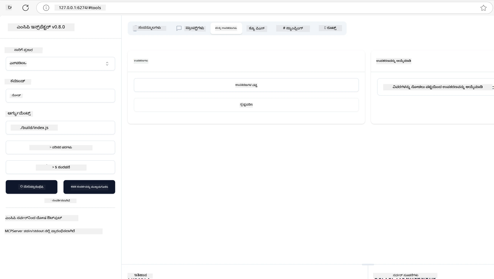
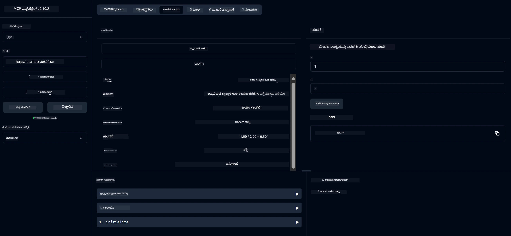
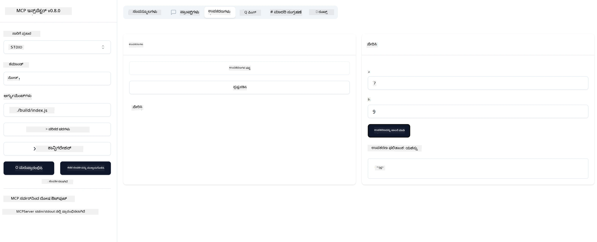

# MCP ಜೊತೆಗೆ ಪ್ರಾರಂಭಿಸುವುದು

> [!NOTE]
> ಈ ಪಾಠದಲ್ಲಿ ಜಾವಾ HTTP ಉದಾಹರಣೆಯು ಹಳೆಯ HTTP+SSE ಸಾರಿಗೆ ಉಪಯೋಗಿಸುತ್ತದೆ ಮತ್ತು
> MCP `2025-11-25` ಗೆ ಹೊಂದಾಣಿಕೆಯಾಗುವ SDK ಗಾಗಿ ಗುರಿಯಾಗಿವೆ. ಹೊಸ ದೂರಸ್ಥ ಸರ್ವರ್‌ಗಳಿಗೆ,
> `2026-07-28` ಸ್ಟ್ರೀಮೇಬಲ್ HTTP ಸಾರಿಗೆ ಬಳಸಿ ಮತ್ತು ನಿಮ್ಮ SDK ಯಲ್ಲಿ ಬೆಂಬಲವನ್ನು ಪರಿಶೀಲಿಸಿ.

ನಿಮಗೆ ಮೊದಲು ಸ್ಟೆಪ್ ಗಳಿಗೆ ಸ್ವಾಗತ, Model Context Protocol (MCP) ಉಪಯೋಗಿಸುವಿಕೆ! ನೀವು MCP ಗೆ ಹೊಸದಾದ್ರೆ ಅಥವಾ ನಿಮ್ಮ ಅರಿವನ್ನು ಆಳವಾಗಿ ಪಡೆಯಲು ಬಯಸಿದರೆ, ಈ ಮಾರ್ಗಸೂಚಿ ನಿಮಗೆ ಅವಶ್ಯಕ ಸೆಟ್ ಅಪ್ ಮತ್ತು ಅಭಿವೃದ್ಧಿ ಪ್ರಕ್ರಿಯೆಯನ್ನು ತಿಳಿಸುತ್ತದೆ. MCP AI ಮಾದರಿಗಳು ಮತ್ತು ಅಪ್ಲಿಕೆಷನ್ಗಳ ನಡುವೆ ನಿರಂತರ ಸಂಯೋಜನೆಯನ್ನು ಹೇಗೆ ಅನುಮತಿಸುತ್ತದೆ ಎಂದು ನೀವು ತಿಳಿದುಕೊಳ್ಳುತ್ತೀರಿ, ಮತ್ತು MCP ಸಾಕ್ಷಮವಾದ ಪರಿಹಾರಗಳನ್ನು ನಿರ್ಮಿಸಲು ಮತ್ತು ಪರೀಕ್ಷಿಸಲು ನಿಮ್ಮ ಪರಿಸರವನ್ನು ತ್ವರಿತವಾಗಿ ಸಿದ್ಧಪಡಿಸುವುದನ್ನು ಕಲಿಯುತ್ತೀರಿ.

> TLDR; ನೀವು AI ಆಪ್‌ಗಳು ನಿರ್ಮಿಸಿದರೆ, ನಿಮ್ಮ LLM (ದೊಡ್ಡ ಭಾಷಾ ಮಾದರಿ) ಗೆ ಉಪಕರಣಗಳು ಮತ್ತು ಇತರೆ ಸಂಪನ್ಮೂಲಗಳನ್ನು ಸೇರಿಸಬಹುದು ಎಂಬುದು ನಿಮಗೆ ತಿಳಿದಿರುತ್ತದೆ, ಇದರಿಂದ LLM ಹೆಚ್ಚು ಜ್ಞಾನಕರವಾಗುತ್ತದೆ. ಆದರೆ ಆ ಉಪಕರಣಗಳು ಮತ್ತು ಸಂಪನ್ಮೂಲಗಳನ್ನು ಸರ್ವರ್ ಮೇಲೆ ಇಡಿದರೆ, ಆಪ್ ಮತ್ತು ಸರ್ವರ್ ಸಾಮರ್ಥ್ಯಗಳನ್ನು ಯಾವುದೇ ಕ್ಲೈಂಟ್ LLM ಇದ್ದ ಅಥವಾ ಇಲ್ಲದೇ ಬಳಸಬಹುದು.

## ಸಮಗ್ರ ಅವಲೋಕನ

ಈ ಪಾಠವು MCP ಪರಿಸರಗಳನ್ನು ಸೆಟ್ ಅಪ್ ಮಾಡುವುದು ಮತ್ತು ನಿಮ್ಮ ಮೊದಲ MCP ಅಪ್ಲಿಕೇಶನ್‌ಗಳನ್ನು ನಿರ್ಮಿಸುವ ಬಗ್ಗೆ ಪ್ರಾಯೋಗಿಕ ಮಾರ್ಗದರ್ಶನವನ್ನು ನೀಡುತ್ತದೆ. ನೀವು ಅಗತ್ಯ ಸಾಧನಗಳು ಮತ್ತು ಫ್ರೇಮ್ವರ್ಕ್‌ಗಳನ್ನು ಇನ್‌ಸ್ಟಾಲ್ ಮಾಡುವುದು, ಮೂಲ MCP ಸರ್ವರ್‌ಗಳನ್ನು ನಿರ್ಮಿಸುವುದು, ಹೋಸ್ಟ್ ಅಪ್ಲಿಕೇಶನ್‌ಗಳನ್ನು ಸೃಷ್ಟಿಸುವುದು, ಮತ್ತು ನಿಮ್ಮ ಅಂಶಗಳನ್ನು ಪರೀಕ್ಷಿಸುವುದು ಹೇಗೆ ಎಂದು ಕಲಿಯುತ್ತೀರಿ.

Model Context Protocol (MCP) ಒಂದುತಿರುವು ಪ್ರೋಟೋಕಾಲ್ ಆಗಿದ್ದು, ಅಪ್ಲಿಕೇಶನ್‌ಗಳು LLMಗಳಿಗೆ ಸಂದರ್ಭ ಒದಗಿಸುವ ವೈಖರಿಯನ್ನು ಮಾನ್ಯಗೊಳಿಸುತ್ತದೆ. MCP ನ್ನು AI ಅಪ್ಲಿಕೇಶನ್‌ಗಳಿಗೆ USB-C ಪೋರ್ಟ್ ಬಗೆಗಿನಂತೆ ಕಲ್ಪಿಸಿ - ಇದು ವಿಭಿನ್ನ ಡೇಟಾ ಮೂಲಗಳು ಮತ್ತು ಉಪಕರಣಗಳೊಂದಿಗೆ AI ಮಾದರಿಗಳನ್ನು ಸಂಪರ್ಕಿಸುವ ಮಾನ್ಯಗೊಳಿಸಲಾದ ಮಾರ್ಗವನ್ನೂ ಒದಗಿಸುತ್ತದೆ.

## ಕಲಿಕೆಯ ಗುರಿಗಳು

ಈ ಪಾಠದ ಕೊನೆಯಲ್ಲಿ, ನೀವು ಈ ಸಾಮರ್ಥ್ಯಗಳನ್ನು ಹೊಂದಿರುತ್ತೀರಿ:

- C#, Java, Python, TypeScript, ಮತ್ತು Rust ನಲ್ಲಿ MCP ಅಭಿವೃದ್ಧಿ ಪರಿಸರಗಳನ್ನು ಸೆಟ್ ಮಾಡುವುದು
- ಕಸ್ಟಮ್ ವೈಶಿಷ್ಟ್ಯಗಳೊಂದಿಗೆ (ಸಂಪನ್ಮೂಲಗಳು, ಪ್ರಾಂಪ್ಟ್‌ಗಳು, ಮತ್ತು ಉಪಕರಣಗಳು) ಮೂಲ MCP ಸರ್ವರ್‌ಗಳನ್ನು ನಿರ್ಮಿಸಲು ಮತ್ತು ನಿಯೋಜಿಸಲು
- MCP ಸರ್ವರ್‌ಗಳಿಗೆ ಸಂಪರ್ಕ ಹೊಂದಿರುವ ಹೋಸ್ಟ್ ಅಪ್ಲಿಕೇಶನ್‌ಗಳನ್ನು ಸೃಷ್ಟಿಸಲು
- MCP ಅನುಷ್ಠಾನಗಳನ್ನು ಪರೀಕ್ಷಿಸಿ ಮತ್ತು ಡಿಬಗ್ ಮಾಡಲು

## ನಿಮ್ಮ MCP ಪರಿಸರವನ್ನು ಸೆಟ್ ಅಪ್ ಮಾಡುವುದು

MCP ಜೊತೆ ಕೆಲಸ ಪ್ರಾರಂಭಿಸುವ ಮೊದಲು, ನಿಮ್ಮ ಅಭಿವೃದ್ಧಿ ಪರಿಸರವನ್ನು ಸಿದ್ಧಪಡಿಸುವುದು ಮತ್ತು ಮೂಲ ಕಾರ್ಯಪ್ರವಾಹವನ್ನು ಅರ್ಥಮಾಡಿಕೊಳ್ಳುವುದು ಮಹತ್ವದ್ದಾಗಿದೆ. ಈ ಭಾಗವು ಸಮರ್ಥವಾಗಿ MCP ನೊಡನೆ ಆರಂಭಿಸಬಹುದಾದ ಪ್ರಾರಂಭಿಕ ಸೆಟ್ ಅಪ್ ಹಂತಗಳನ್ನು ಮಾರ್ಗದರ್ಶನ ಮಾಡುತ್ತದೆ.

### ಪೂರ್ವ ಅವಶ್ಯಕತೆಗಳು

MCP ಅಭಿವೃದ್ಧಿಗೆ ಮುಂದು ಬನ್ನುವ ಮುನ್ನ, ಈ ಸಂಗತಿಗಳು ಇದ್ದಾರೆ ಎಂದು ಖಾತ್ರಿ ಮಾಡಿಕೊಳ್ಳಿ:

- **ಅಭಿವೃದ್ಧಿ ಪರಿಸರ**: ನಿಮ್ಮ ಆಯ್ದ ಭಾಷೆಗಾಗಿ (C#, Java, Python, TypeScript, ಅಥವಾ Rust)
- **IDE/ಸಂಪಾದಕ**: Visual Studio, Visual Studio Code, IntelliJ, Eclipse, PyCharm, ಅಥವಾ ಯಾವುದೇ ಆಧುನಿಕ ಕೋಡ್ ಸಂಪಾದಕ
- **ಪ್ಯಾಕೇಜ್ ನಿರ್ವಾಹಕಗಳು**: NuGet, Maven/Gradle, pip, npm/yarn, ಅಥವಾ Cargo
- **API ಕೀಲಿಗಳು**: ನೀವು ನಿಮ್ಮ ಹೋಸ್ಟ್ ಅಪ್ಲಿಕೇಶನ್‌ಗಳಲ್ಲಿ ಬಳಸಲು ಯೋಜಿಸುವ ಯಾವುದೇ AI ಸೇವೆಗಳಿಗೆ

## ಮೂಲ MCP ಸರ್ವರ್ ರಚನೆ

ಒಂದು MCP ಸರ್ವರ್ ಸಾಮಾನ್ಯವಾಗಿ ಒಳಗೊಂಡಿದೆ:

- **ಸರ್ವರ್ ಸಂರಚನೆ**: ಪೋರ್ಟ್, ಪ್ರಮಾಣೀಕರಣ ಮತ್ತು ಇತರ ಸೆಟ್ಟಿಂಗ್‌ಗಳನ್ನು ಸಂಘಟಿಸುವುದು
- **ಸಂಪನ್ಮೂಲಗಳು**: LLMಗಳಿಗೆ ಲಭ್ಯವಿರುವ ಡೇಟಾ ಮತ್ತು ಸಂದರ್ಭ
- **ಉಪಕರಣಗಳು**: ಮಾದರಿಗಳು ಕರೆಯಬಹುದಾದ ಕಾರ್ಯಕ್ಷಮತೆ
- **ಪ್ರಾಂಪ್ಟ್‌ಗಳು**: ಪಠ್ಯವನ್ನು ರಚಿಸುವ ಅಥವಾ ರಚನೆಯ ರೂಪದಲ್ಲಿ ಟೆಂಪ್ಲೇಟ್ಗಳು

ಇಲ್ಲಿದೆ TypeScript ನಲ್ಲಿ ಸರಳ ಉದಾಹರಣೆ:

```typescript
import { McpServer, ResourceTemplate } from "@modelcontextprotocol/sdk/server/mcp.js";
import { StdioServerTransport } from "@modelcontextprotocol/sdk/server/stdio.js";
import { z } from "zod";

// MCP ಸರ್ವರ್ ರಚಿಸಿ
const server = new McpServer({
  name: "Demo",
  version: "1.0.0"
});

// ಒಂದು ಸೇರ್ಪಡೆ ಸಾಧನವನ್ನು ಸೇರಿಸಿ
server.tool("add",
  { a: z.number(), b: z.number() },
  async ({ a, b }) => ({
    content: [{ type: "text", text: String(a + b) }]
  })
);

// ಒಂದು ಗತಿಶೀಲ ಅಭಿನಂದನಾ ಸಂಪನ್ಮೂಲವನ್ನು ಸೇರಿಸಿ
server.resource(
  "file",
  // 'list' ಪ್ಯಾರಾಮೀಟರ್ ಸಂಪನ್ಮೂಲವು ಲಭ್ಯವಿರುವ ಫೈಲ್ಗಳನ್ನು ಹೇಗೆ ಪಟ್ಟಿ ಮಾಡುತ್ತದೆ ಎಂಬುದನ್ನು ನಿಯಂತ್ರಿಸುತ್ತದೆ. ಅದನ್ನು ಅಸ್ಪಷ್ಟವಾಗಿ ಹೊಂದಿಸುವುದರಿಂದ ಈ ಸಂಪನ್ಮೂಲಕ್ಕಾಗಿ ಪಟ್ಟಿ ಮಾಡುವುದು ನಿಷ್ಕ್ರಿಯಗೊಳ್ಳುತ್ತದೆ.
  new ResourceTemplate("file://{path}", { list: undefined }),
  async (uri, { path }) => ({
    contents: [{
      uri: uri.href,
      text: `File, ${path}!`
    }]
  })
);

// ಫೈಲ್ ಒಳಗಿನ ವಿಷಯಗಳನ್ನು ಓದುವ ಫೈಲ್ ಸಂಪನ್ಮೂಲವನ್ನು ಸೇರಿಸಿ
server.resource(
  "file",
  new ResourceTemplate("file://{path}", { list: undefined }),
  async (uri, { path }) => {
    let text;
    try {
      text = await fs.readFile(path, "utf8");
    } catch (err) {
      text = `Error reading file: ${err.message}`;
    }
    return {
      contents: [{
        uri: uri.href,
        text
      }]
    };
  }
);

server.prompt(
  "review-code",
  { code: z.string() },
  ({ code }) => ({
    messages: [{
      role: "user",
      content: {
        type: "text",
        text: `Please review this code:\n\n${code}`
      }
    }]
  })
);

// stdin ನಲ್ಲಿ ಸಂದೇಶಗಳನ್ನು ಸ್ವೀಕರಿಸುವುದನ್ನು ಪ್ರಾರಂಭಿಸಿ ಮತ್ತು stdout ನಲ್ಲಿ ಸಂದೇಶಗಳನ್ನು ಕಳುಹಿಸುವುದನ್ನು ಪ್ರಾರಂಭಿಸಿ
const transport = new StdioServerTransport();
await server.connect(transport);
```

ಮುಂಚಿನ ಕೋಡಿನಲ್ಲಿ ನಾವು:

- MCP TypeScript SDK ಯಿಂದ ಅಗತ್ಯವಿರುವ ಕ್ಲಾಸ್‌ಗಳನ್ನು ಆಮದು ಮಾಡಿದ್ದೇವೆ.
- ಹೊಸ MCP ಸರ್ವರ್ ಉದಾಹರಣೆಯನ್ನು ರಚಿಸಿ ಮತ್ತು ಸಂರಚಿಸಿದ್ದೇವೆ.
- ಕಸ್ಟಮ್ ಉಪಕರಣ (`calculator`) ಅನ್ನು ಹ್ಯಾಂಡ್ಲರ್ ಫಂಕ್ಷನ್ ಜೊತೆಗೆ ನೋಂದಾಯಿಸಿದ್ದೇವೆ.
- MCP ವಿನಂತಿಗಳನ್ನು ಸ್ವೀಕಾರ ಮಾಡಲು ಸರ್ವರ್ ಅನ್ನು ಪ್ರಾರಂಭಿಸಿದ್ದೇವೆ.

## ಪರೀಕ್ಷೆ ಮತ್ತು ಡಿಬಗ್ಗಿಂಗ್

ನಿಮ್ಮ MCP ಸರ್ವರ್ ಪರೀಕ್ಷಿಸುವ ಮೊದಲು, ಲಭ್ಯವಿರುವ ಉಪಕರಣಗಳು ಮತ್ತು ಬೆಸ್ಟ್ ಪ್ರಾಕ್ಟೀಸ್‌ಗಳ ಕುರಿತು ತಿಳಿದುಕೊಳ್ಳುವುದು ಮಹತ್ವದ್ದಾಗಿದೆ. ಪರಿಣಾಮಕಾರಿ ಪರೀಕ್ಷೆಯು ನಿಮ್ಮ ಸರ್ವರ್ ನಿರೀಕ್ಷಿತ ರೀತಿಯಲ್ಲಿ ನಡೆದುಕೊಳ್ಳುವುದನ್ನು ಖಚಿತಪಡಿಸುತ್ತದೆ ಮತ್ತು ಸಮಸ್ಯೆಗಳನ್ನು ತ್ವರಿತವಾಗಿ ಗುರುತಿಸಿ ಪರಿಹರಿಸಲು ಸಹಾಯಮಾಡುತ್ತದೆ. ಕೆಳಗಿನ ವಿಭಾಗವು ನಿಮ್ಮ MCP ಅನುಷ್ಠಾನವನ್ನು ಮಾನ್ಯಗೊಳಿಸಲು ಶಿಫಾರಸು ಮಾಡಿದ ವಿಧಾನಗಳನ್ನು ವಿವರಿಸುತ್ತದೆ.

MCP ನಿಮ್ಮ ಸರ್ವರ್‌ಗಳನ್ನು ಪರೀಕ್ಷಿಸಲು ಮತ್ತು ಡಿಬಗ್ ಮಾಡಲು ಉಪಕರಣಗಳನ್ನು ಒದಗಿಸುತ್ತದೆ:

- **ಇನ್‌ಸ್ಪೆಕ್ಟರ್ ಉಪಕರಣ**, ಈ ದೃಷ್ಠಿಕೋನದ ಬಳಕೆಯ ಎಲ್ಲ ಉಪಕರಣಗಳು, ಪ್ರಾಂಪ್ಟ್‌ಗಳು ಮತ್ತು ಸಂಪನ್ಮೂಲಗಳನ್ನು ಪರೀಕ್ಷಿಸಲು ಸಂವಹನ ಮಾಡಲು ಅನುಮತಿಸುತ್ತದೆ.
- **curl**, ನೀವು curl ಅಥವಾ ಇತರ ಗ್ರಾಹಕರಂತಹ ಅವಶ್ಯಕವಾದ HTTP ಆಜ್ಞೆಗಳನ್ನು ಸೃಷ್ಟಿಸುವ ಮತ್ತು ಚಾಲನೆಮಾಡುವ ಕಮಾಂಡ್ ಲೈನ್ ಉಪಕರಣಗಳನ್ನು ಬಳಸಿಕೊಂಡು ಸರ್ವರ್‌ಗೆ ಸಂಪರ್ಕ ಮಾಡಬಹುದು.

### MCP ಇನ್‌ಸ್ಪೆಕ್ಟರ್ ಬಳಕೆ

[MCP ಇನ್‌ಸ್ಪೆಕ್ಟರ್](https://github.com/modelcontextprotocol/inspector) ಒಂದು ದೃಶ್ಯಾತ್ಮಕ ಪರೀಕ್ಷಾ ಉಪಕರಣವಾಗಿದೆ ಇದು ನಿಮ್ಮಿಗೆ ಸಹಾಯಮಾಡುತ್ತದೆ:

1. **ಸರ್ವರ್ ಸಾಮರ್ಥ್ಯಗಳನ್ನು ಪತ್ತೆಹಚ್ಚುವುದು**: ಲಭ್ಯವಿರುವ ಸಂಪನ್ಮೂಲಗಳು, ಉಪಕರಣಗಳು ಮತ್ತು ಪ್ರಾಂಪ್ಟ್‌ಗಳನ್ನು ತಕ್ಷಣ ಪತ್ತೆಹಚ್ಚುವುದು
2. **ಉಪಕರಣ ಕಾರ್ಯಾಚರಣೆಯನ್ನು ಪರೀಕ್ಷಿಸುವುದು**: ವಿಭಿನ್ನ ಪರಮಿತಿಗಳನ್ನು ಪ್ರಯತ್ನಿಸಿ, ಪ್ರತಿಕ್ರಿಯೆಗಳನ್ನೂ ನೇರವಾಗಿ ಕಂಡುಕೊಳ್ಳುವುದು
3. **ಸರ್ವರ್ ಮೆಟಾಡೇಟಾವನ್ನು ವೀಕ್ಷಿಸುವುದು**: ಸರ್ವರ್ ಮಾಹಿತಿ, ಸ್ಕೀಮಾ ಮತ್ತು ಸಂರಚನೆಗಳನ್ನು ಪರಿಶೀಲಿಸುವುದು

```bash
# ಉದಾಹರಣೆ TypeScript, MCP ಇನ್ಸ್‌ಪೆಕ್ಟರ್ ಅನ್ನು ಇನ್‌ಸ್ಟಾಲ್ ಮಾಡುವುದು ಮತ್ತು ಚಾಲನೆ ಮಾಡುವುದು
npx @modelcontextprotocol/inspector node build/index.js
```

ಮೇಲಿನ ಆಜ್ಞೆಗಳು ಚಾಲನೆಯಲ್ಲಿಟ್ಟಾಗ, MCP ಇನ್‌ಸ್ಪೆಕ್ಟರ್ ನಿಮ್ಮ ಬ್ರೌಸರಿನಲ್ಲಿ ಸ್ಥಳೀಯ ವೆಬ್ ಇಂಟರ್ಗೇಸ್ ಪ್ರಾರಂಭ ಮಾಡುತ್ತದೆ. ನೀವು ನೋಂದಾಯಿಸಿದ MCP ಸರ್ವರ್‌ಗಳು, ಅವರ ಲಭ್ಯವಿರುವ ಉಪಕರಣಗಳು, ಸಂಪನ್ಮೂಲಗಳು ಮತ್ತು ಪ್ರಾಂಪ್ಟ್‌ಗಳನ್ನು ಡ್ಯಾಸ್ಬೋರ್ಡ್‌ನಲ್ಲಿ ನೋಡಬಹುದು. ಈ ಇಂಟರ್ಗೇಸ್ ಉಪಕರಣ ಕಾರ್ಯಾಚರಣೆಯನ್ನು ಸಂವಹನಾತ್ಮಕವಾಗಿ ಪರೀಕ್ಷಿಸಲು, ಸರ್ವರ್ ಮೆಟಾಡೇಟಾವನ್ನು ಪರಿಶೀಲಿಸಲು ಮತ್ತು ನೇರಪ್ರತಿಕ್ರಿಯೆಗಳನ್ನು ವೀಕ್ಷಿಸಲು ಅನುಮತಿಸುತ್ತದೆ. ಇದರಿಂದ ನಿಮ್ಮ MCP ಸರ್ವರ್ ಅನುಷ್ಠಾನಗಳನ್ನು ಮೌಲ್ಯಮಾಪನ ಮತ್ತು ಡಿಬಗ್ ಮಾಡುವುದು ಸುಲಭವಾಗುತ್ತದೆ.

ಇದಿದೆ ಅದರ ಸ್ಕ್ರೀನ್ ಶಾಟ್ ಒಂದು:



## ಸಾಮಾನ್ಯ ಸೆಟ್ ಅಪ್ ಸಮಸ್ಯೆಗಳು ಮತ್ತು ಪರಿಹಾರಗಳು

| ಸಮಸ್ಯೆ | ಸಾಧ್ಯತೆ ಪರಿಹಾರ |
|-------|-------------------|
| ಸಂಪರ್ಕ ತಿರಸ್ಕೃತವಾಗಿದೆ | ಸರ್ವರ್ ಚಲಿಸುತ್ತಿದೆಯೆ ಮತ್ತು ಪೋರ್ಟ್ ಸರಿಯಿದೆಯೆ ಎಂದು ಪರಿಶೀಲಿಸಿ |
| ಉಪಕರಣ ಕಾರ್ಯಾಚರಣೆಗಳ ದೋಷಗಳು | ಪರಮಿತಿಗಳ ಮಾನ್ಯತೆ ಮತ್ತು ದೋಶ ನಿರ್ವಹಣೆಯನ್ನು ಪರಿಶೀಲಿಸಿ |
| ಪ್ರಮಾಣೀಕರಣ ವಿಫಲತೆಗಳು | API ಕೀಲಿಗಳು ಮತ್ತು ಅನುಮತಿಗಳನ್ನು ಪರಿಶೀಲಿಸಿ |
| ಸ್ಕೀಮಾ ಮಾನ್ಯತೆ ದೋಷಗಳು | ನಿರ್ದಿಷ್ಟಪಡಿಸಿದ ಸ್ಕೀಮಾ ಗೆ ಪರಮಿತಿಗಳು ಹೊಂದಿದೆ ಎಂದು ಖಚಿತಪಡಿಸಿಕೊಳ್ಳಿ |
| ಸರ್ವರ್ ಪ್ರಾರಂಭವಾಗುತ್ತಿಲ್ಲ | ಪೋರ್ಟ್ ಸಂಧಿ ಸಮಸ್ಯೆಗಳು ಅಥವಾ ಅವಲಂಬನೆಗಳ ಕೊರತೆ ಪರಿಶೀಲಿಸಿ |
| CORS ದೋಷಗಳು | ಕ್ರಾಸ್-ಓರಿಜಿನ್ ವಿನಂತಿಗಳಿಗೆ ಸರಿಯಾದ CORS ಹೆಡರ್ಸ್ ಅಳವಡಿಸಿ |
| ಪ್ರಮಾಣೀಕರಣ ಸಮಸ್ಯೆಗಳು | ಟೋಕನ್ ಮಾನ್ಯತೆ ಮತ್ತು ಅನುಮತಿಗಳನ್ನು ಪರಿಶೀಲಿಸಿ |

## ಸ್ಥಳೀಯ ಅಭಿವೃದ್ಧಿ

ಸ್ಥಳೀಯ ಅಭಿವೃದ್ಧಿಗೆ ಮತ್ತು ಪರೀಕ್ಷೆಗೆ, ನೀವು ನಿಮ್ಮ ಯಂತ್ರದಲ್ಲಿ ನೇರವಾಗಿ MCP ಸರ್ವರ್‌ಗಳನ್ನು ಚಾಲನೆ ಮಾಡಬಹುದು:

1. **ಸರ್ವರ್ ಪ್ರಕ್ರಿಯೆಯನ್ನು ಪ್ರಾರಂಭಿಸಿ**: ನಿಮ್ಮ MCP ಸರ್ವರ್ ಅಪ್ಲಿಕೇಶನ್ ಅನ್ನು ಚಾಲನೆ ಮಾಡಿ
2. **ನಿರ್ವಹಣೆಯ ಸಂಯೋಜನೆ ಮಾಡಿ**: ಸರ್ವರ್ ನಿರೀಕ್ಷಿತ ಪೋರ್ಟ್ ನಲ್ಲಿ ಲಭ್ಯವಿರುವಂತೆ ಖಚಿತಪಡಿಸಿಕೊಳ್ಳಿ
3. **ಕ್ಲೈಂಟ್ಗಳು ಸಂಪರ್ಕ ಮಾಡಿ**: `http://localhost:3000` ಇಂತಹ ಸ್ಥಳೀಯ ಸಂಪರ್ಕ URLಗಳನ್ನು ಬಳಸಿ

```bash
# ಉದಾಹರಣೆ: ಟೈಪ್‌ಸ್ಕ್ರಿಪ್ಟ್ MCP ಸರ್ವರ್ ಸ್ಥಳೀಯವಾಗಿ ಚಾಲನೆಗೊಳಿಸುವುದು
npm run start
# ಸರ್ವರ್ http://localhost:3000 ನಲ್ಲಿ ಚಾಲನೆಗೊಂಡಿದೆ
```

## ನಿಮ್ಮ ಮೊದಲ MCP ಸರ್ವರ್ ನಿರ್ಮಾಣ

ನಾವು ಹಿಂದೆ [ಮೂಲ ಸಂಪ್ರದಾಯಗಳು](../../01-CoreConcepts/README.md) ಅನ್ನು ಆವರಿಸಿಕೊಂಡಿದ್ದೇವೆ, ಈಗ ಆ ಜ್ಞಾನವನ್ನು ಕಾರ್ಯಗತಗೊಳಿಸುವ ಸಮಯ ಬಂದಿದೆ.

### ಸರ್ವರ್ ಏನು ಮಾಡಬಹುದು

ಕೋಡ್ ಬರೆಯುವುದನ್ನು ಪ್ರಾರಂಭಿಸುವ ಮೊದಲು, ಸರ್ವರ್ ಏನು ಮಾಡಬಹುದು ಎಂದು ನೆನಪಿಸಿಕೊಳ್ಳೋಣ:

ಒಂದು MCP ಸರ್ವರ್ ಉದಾಹರಣೆಗೆ:

- ಸ್ಥಳೀಯ ಫೈಲ್‌ಗಳು ಮತ್ತು ಡೇಟಾಬೇಸ್‌ಗಳಿಗೆ ಪ್ರಾಪ್ತಿ ಪಡೆಯಲು
- ದೂರಸ್ಥ APIಗಳಿಗೆ ಸಂಪರ್ಕ ಕಲ್ಪಿಸಲು
- ಗಣನೆಗಳನ್ನು ನಿರ್ವಹಿಸಲು
- ಇತರೆ ಉಪಕರಣಗಳು ಮತ್ತು ಸೇವೆಗಳೊಂದಿಗೆ ಸಂಯೋಜಿಸಲು
- ಸಂವಹನಕ್ಕೆ ಬಳಕೆದಾರ ಮೊಮ್ಮಗಳು ಒದಗಿಸಲು

ಅದ್ಭುತ, ನಾವು ಏನು ಮಾಡಲು ಸಾಧ್ಯವಾಯಿತೆಂದು ತಿಳಿದುಕೊಂಡಿಖಾಯ್ತ್, ಈಗ ಕೋಡಿಂಗ್ ಪ್ರಾರಂಭಿಸೋಣ.

## ವ್ಯಾಯಾಮ: ಸರ್ವರ್ ನಿರ್ಮಾಣ

ಸರ್ವರ್ ಸೃಷ್ಟಿಸಲು, ಈ ಹಂತಗಳನ್ನು ಅನುಸರಿಸಬೇಕು:

- MCP SDK ಅನ್ನು ಇನ್‌ಸ್ಟಾಲ್ ಮಾಡಿಕೊಳ್ಳಿ.
- ಪ್ರಾಜೆಕ್ಟ್ ಅನ್ನು ರಚಿಸಿ ಮತ್ತು ಪ್ರಾಜೆಕ್ಟ್ ರಚನೆಯನ್ನು ಹೊಂದಿಸಿ.
- ಸರ್ವರ್ ಕೋಡ್ ಬರೆಯಿರಿ.
- ಸರ್ವರ್ ಅನ್ನು ಪರೀಕ್ಷಿಸಿ.

### -1- ಪ್ರಾಜೆಕ್ಟ್ ರಚನೆ

#### TypeScript

```sh
# ಪ್ರಾಜೆಕ್ಟ್ ಡೈರೆಕ್ಟರಿ ರಚಿಸಿ ಮತ್ತು npm ಪ್ರಾಜೆಕ್ಟ್ ಪ್ರಾರಂಭಿಸಿ
mkdir calculator-server
cd calculator-server
npm init -y
```

#### Python

```sh
# ಪ್ರಾಜೆಕ್ಟ್ ಡೈರಕ್ಟರಿ ರಚಿಸಿ
mkdir calculator-server
cd calculator-server
# ಫೋಲ್ಡರ್ ಅನ್ನು Visual Studio Code ನಲ್ಲಿ ತೆರೆಯಿರಿ - ನೀವು ಬೇರೆ IDE ಬಳಸುತ್ತಿದ್ದರೆ ಇದನ್ನು ಬಿಟ್ಟುಕೊಳ್ಳಿ
code .
```

#### .NET

```sh
dotnet new console -n McpCalculatorServer
cd McpCalculatorServer
```

#### Java

ಜಾವಾಗೆ, Spring Boot ಪ್ರಾಜೆಕ್ಟ್ ರಚಿಸಿ:

```bash
curl https://start.spring.io/starter.zip \
  -d dependencies=web \
  -d javaVersion=21 \
  -d type=maven-project \
  -d groupId=com.example \
  -d artifactId=calculator-server \
  -d name=McpServer \
  -d packageName=com.microsoft.mcp.sample.server \
  -o calculator-server.zip
```

ಜಿಪ್ ಫೈಲ್ ಅನೇಜಿಸಿ:

```bash
unzip calculator-server.zip -d calculator-server
cd calculator-server
# ಆಯ್ಕೆಯಿಂದ ಬಳಕೆಯಲ್ಲದ ಪರೀಕ್ಷೆಯನ್ನು ತೆಗೆದುಹಾಕಿ
rm -rf src/test/java
```

ನಿಮ್ಮ *pom.xml* ಫೈಲ್‌ಗೆ ಕೆಳಕಂಡ ಸಂಪೂರ್ಣ ಸಂರಚನೆಯನ್ನು ಸೇರಿಸಿ:

```xml
<?xml version="1.0" encoding="UTF-8"?>
<project xmlns="http://maven.apache.org/POM/4.0.0"
    xmlns:xsi="http://www.w3.org/2001/XMLSchema-instance"
    xsi:schemaLocation="http://maven.apache.org/POM/4.0.0 http://maven.apache.org/xsd/maven-4.0.0.xsd">
    <modelVersion>4.0.0</modelVersion>
    
    <!-- Spring Boot parent for dependency management -->
    <parent>
        <groupId>org.springframework.boot</groupId>
        <artifactId>spring-boot-starter-parent</artifactId>
        <version>3.5.0</version>
        <relativePath />
    </parent>

    <!-- Project coordinates -->
    <groupId>com.example</groupId>
    <artifactId>calculator-server</artifactId>
    <version>0.0.1-SNAPSHOT</version>
    <name>Calculator Server</name>
    <description>Basic calculator MCP service for beginners</description>

    <!-- Properties -->
    <properties>
        <java.version>21</java.version>
        <maven.compiler.source>21</maven.compiler.source>
        <maven.compiler.target>21</maven.compiler.target>
    </properties>

    <!-- Spring AI BOM for version management -->
    <dependencyManagement>
        <dependencies>
            <dependency>
                <groupId>org.springframework.ai</groupId>
                <artifactId>spring-ai-bom</artifactId>
                <version>1.0.0-SNAPSHOT</version>
                <type>pom</type>
                <scope>import</scope>
            </dependency>
        </dependencies>
    </dependencyManagement>

    <!-- Dependencies -->
    <dependencies>
        <dependency>
            <groupId>org.springframework.ai</groupId>
            <artifactId>spring-ai-starter-mcp-server-webflux</artifactId>
        </dependency>
        <dependency>
            <groupId>org.springframework.boot</groupId>
            <artifactId>spring-boot-starter-actuator</artifactId>
        </dependency>
        <dependency>
         <groupId>org.springframework.boot</groupId>
         <artifactId>spring-boot-starter-test</artifactId>
         <scope>test</scope>
      </dependency>
    </dependencies>

    <!-- Build configuration -->
    <build>
        <plugins>
            <plugin>
                <groupId>org.springframework.boot</groupId>
                <artifactId>spring-boot-maven-plugin</artifactId>
            </plugin>
            <plugin>
                <groupId>org.apache.maven.plugins</groupId>
                <artifactId>maven-compiler-plugin</artifactId>
                <configuration>
                    <release>21</release>
                </configuration>
            </plugin>
        </plugins>
    </build>

    <!-- Repositories for Spring AI snapshots -->
    <repositories>
        <repository>
            <id>spring-milestones</id>
            <name>Spring Milestones</name>
            <url>https://repo.spring.io/milestone</url>
            <snapshots>
                <enabled>false</enabled>
            </snapshots>
        </repository>
        <repository>
            <id>spring-snapshots</id>
            <name>Spring Snapshots</name>
            <url>https://repo.spring.io/snapshot</url>
            <releases>
                <enabled>false</enabled>
            </releases>
        </repository>
    </repositories>
</project>
```

#### Rust

```sh
mkdir calculator-server
cd calculator-server
cargo init
```

### -2- ಅವಲಂಬನೆಗಳನ್ನು ಸೇರಿಸುವುದು

ಈಗ ನಿಮ್ಮ ಪ್ರಾಜೆಕ್ಟ್ ರಚನೆಯಾದ ಮೇಲೆ, ಮುಂದಿನ ಹಂತದಲ್ಲಿ ಅವಲಂಬನೆಗಳನ್ನು ಸೇರಿಸೋಣ:

#### TypeScript

```sh
# ಈಗಾಗಲೇ ಅಳವಡಿಸಲಾಗದಿದ್ದಲ್ಲಿ, ಟೈಪ್ಸ್ಕ್ರಿಪ್ಟ್ ಅನ್ನು ಗ್ಲೋಬಲ್ ಆಗಿ ಅಳವಡಿಸಿ
npm install typescript -g

# ಎಸ್‌ಡಿಕೆ ಮತ್ತು ಸೂತ್ರ ಪರಿಶೀಲನೆಗಾಗಿ Zod ಅನ್ನು ಅಳವಡಿಸಿ
npm install @modelcontextprotocol/sdk zod
npm install -D @types/node typescript
```

#### Python

```sh
# ಏಕಕಾಲಿಕ ಪರಿಸರವನ್ನು ರಚಿಸಿ ಮತ್ತು ಅವಲಂಬನೆಗಳನ್ನು ಸ್ಥಾಪಿಸಿ
python -m venv venv
venv\Scripts\activate
pip install "mcp[cli]"
```

#### Java

```bash
cd calculator-server
./mvnw clean install -DskipTests
```

#### Rust

```sh
cargo add rmcp --features server,transport-io
cargo add serde
cargo add tokio --features rt-multi-thread
```

### -3- ಪ್ರಾಜೆಕ್ಟ್ ಫೈಲ್‌ಗಳನ್ನು ರಚಿಸುವುದು

#### TypeScript

*package.json* ಫೈಲ್ ತೆರೆಯಿರಿ ಮತ್ತು ಕೆಳಗಿನ ವಿಷಯಗಳನ್ನು ಬದಲಿಸಿ, ಸರ್ವರ್ ನಿರ್ಮಿಸುವುದಕ್ಕಾಗಿ ಮತ್ತು ನಡೆಯುವುದಕ್ಕಾಗಿ ಖಚಿತಪಡಿಸಲು:

```json
{
  "name": "calculator-server",
  "version": "1.0.0",
  "main": "index.js",
  "type": "module",
  "scripts": {
    "build": "tsc",
    "start": "npm run build && node ./build/index.js",
  },
  "keywords": [],
  "author": "",
  "license": "ISC",
  "description": "A simple calculator server using Model Context Protocol",
  "dependencies": {
    "@modelcontextprotocol/sdk": "^1.16.0",
    "zod": "^3.25.76"
  },
  "devDependencies": {
    "@types/node": "^24.0.14",
    "typescript": "^5.8.3"
  }
}
```

*tsconfig.json* ರಚಿಸಿ ಕೆಳಗಿನ ವಿಷಯದೊಂದಿಗೆ:

```json
{
  "compilerOptions": {
    "target": "ES2022",
    "module": "Node16",
    "moduleResolution": "Node16",
    "outDir": "./build",
    "rootDir": "./src",
    "strict": true,
    "esModuleInterop": true,
    "skipLibCheck": true,
    "forceConsistentCasingInFileNames": true
  },
  "include": ["src/**/*"],
  "exclude": ["node_modules"]
}
```

ನಿಮ್ಮ ಮೂಲ ಕೋಡ್‌ಗಾಗಿ ಫೋಲ್ಡರ್ ರಚಿಸಿ:

```sh
mkdir src
touch src/index.ts
```

#### Python

*server.py* ಫೈಲ್ ರಚಿಸಿ

```sh
touch server.py
```

#### .NET

ಅಗತ್ಯವಿರುವ NuGet ಪ್ಯಾಕೇಜ್‌ಗಳನ್ನು ಇನ್‌ಸ್ಟಾಲ್ ಮಾಡಿ:

```sh
dotnet add package ModelContextProtocol --prerelease
dotnet add package Microsoft.Extensions.Hosting
```

#### Java

Java Spring Boot ಪ್ರಾಜೆಕ್ಟ್‌ಗಳಿಗೆ, ಪ್ರಾಜೆಕ್ಟ್ ರಚನೆ ಸ್ವಯಂಚಾಲಿತವಾಗಿ ಸೃಷ್ಟಿಯಾಗುತ್ತದೆ.

#### Rust

Rust ಗಾಗಿ, ನೀವು `cargo init` ನಡೆಸುವಾಗ ಡೀಫಾಲ್ಟ್ ಆಗಿ *src/main.rs* ಫೈಲ್ ಸೃಷ್ಟಿಯಾಗುತ್ತದೆ. ಫೈಲ್ ತೆರೆಯಿರಿ ಮತ್ತು ಡೀಫಾಲ್ಟ್ ಕೋಡ್ ಅನ್ನು ಅಳಿಸಿ.

### -4- ಸರ್ವರ್ ಕೋಡ್ ಬರೆಯುವುದು

#### TypeScript

*index.ts* ಫೈಲ್ ರಚಿಸಿ ಮತ್ತು ಕೆಳಗಿನ ಕೋಡ್ ಸೇರಿಸಿ:

```typescript
import { McpServer, ResourceTemplate } from "@modelcontextprotocol/sdk/server/mcp.js";
import { StdioServerTransport } from "@modelcontextprotocol/sdk/server/stdio.js";
import { z } from "zod";
 
// MCP ಸರ್ವರ್ ಅನ್ನು ರಚಿಸಿ
const server = new McpServer({
  name: "Calculator MCP Server",
  version: "1.0.0"
});
```

ಈಗ ನಿಮಗೆ ಸರ್ವರ್ ಇದೆ, ಆದರೆ ಅದು ಹೆಚ್ಚು ಏನು ಮಾಡೋದಿಲ್ಲ, ಅದನ್ನು ಸರಿಪಡಿಸೋಣ.

#### Python

```python
# server.py
from mcp.server.fastmcp import FastMCP

# MCP ಸರ್ವರ್ ಅನ್ನು ರಚಿಸಿ
mcp = FastMCP("Demo")
```

#### .NET

```csharp
using Microsoft.Extensions.DependencyInjection;
using Microsoft.Extensions.Hosting;
using Microsoft.Extensions.Logging;
using ModelContextProtocol.Server;
using System.ComponentModel;

var builder = Host.CreateApplicationBuilder(args);
builder.Logging.AddConsole(consoleLogOptions =>
{
    // Configure all logs to go to stderr
    consoleLogOptions.LogToStandardErrorThreshold = LogLevel.Trace;
});

builder.Services
    .AddMcpServer()
    .WithStdioServerTransport()
    .WithToolsFromAssembly();
await builder.Build().RunAsync();

// add features
```

#### Java

ಜಾವಾಗೆ, ಕೋರ ಸರ್ವರ್ ಘಟಕಗಳನ್ನು ರಚಿಸಿ. ಮೊದಲು ಮುಖ್ಯ ಅಪ್ಲಿಕೇಶನ್ ಕ್ಲಾಸ್ ಬದಲಿಸಿ:

*src/main/java/com/microsoft/mcp/sample/server/McpServerApplication.java*:

```java
package com.microsoft.mcp.sample.server;

import org.springframework.ai.tool.ToolCallbackProvider;
import org.springframework.ai.tool.method.MethodToolCallbackProvider;
import org.springframework.boot.SpringApplication;
import org.springframework.boot.autoconfigure.SpringBootApplication;
import org.springframework.context.annotation.Bean;
import com.microsoft.mcp.sample.server.service.CalculatorService;

@SpringBootApplication
public class McpServerApplication {

    public static void main(String[] args) {
        SpringApplication.run(McpServerApplication.class, args);
    }
    
    @Bean
    public ToolCallbackProvider calculatorTools(CalculatorService calculator) {
        return MethodToolCallbackProvider.builder().toolObjects(calculator).build();
    }
}
```

ಕ್ಯಾಲ್ಕುಲೇಟರ್ ಸೇವೆ ರಚಿಸಿ *src/main/java/com/microsoft/mcp/sample/server/service/CalculatorService.java*:

```java
package com.microsoft.mcp.sample.server.service;

import org.springframework.ai.tool.annotation.Tool;
import org.springframework.stereotype.Service;

/**
 * Service for basic calculator operations.
 * This service provides simple calculator functionality through MCP.
 */
@Service
public class CalculatorService {

    /**
     * Add two numbers
     * @param a The first number
     * @param b The second number
     * @return The sum of the two numbers
     */
    @Tool(description = "Add two numbers together")
    public String add(double a, double b) {
        double result = a + b;
        return formatResult(a, "+", b, result);
    }

    /**
     * Subtract one number from another
     * @param a The number to subtract from
     * @param b The number to subtract
     * @return The result of the subtraction
     */
    @Tool(description = "Subtract the second number from the first number")
    public String subtract(double a, double b) {
        double result = a - b;
        return formatResult(a, "-", b, result);
    }

    /**
     * Multiply two numbers
     * @param a The first number
     * @param b The second number
     * @return The product of the two numbers
     */
    @Tool(description = "Multiply two numbers together")
    public String multiply(double a, double b) {
        double result = a * b;
        return formatResult(a, "*", b, result);
    }

    /**
     * Divide one number by another
     * @param a The numerator
     * @param b The denominator
     * @return The result of the division
     */
    @Tool(description = "Divide the first number by the second number")
    public String divide(double a, double b) {
        if (b == 0) {
            return "Error: Cannot divide by zero";
        }
        double result = a / b;
        return formatResult(a, "/", b, result);
    }

    /**
     * Calculate the power of a number
     * @param base The base number
     * @param exponent The exponent
     * @return The result of raising the base to the exponent
     */
    @Tool(description = "Calculate the power of a number (base raised to an exponent)")
    public String power(double base, double exponent) {
        double result = Math.pow(base, exponent);
        return formatResult(base, "^", exponent, result);
    }

    /**
     * Calculate the square root of a number
     * @param number The number to find the square root of
     * @return The square root of the number
     */
    @Tool(description = "Calculate the square root of a number")
    public String squareRoot(double number) {
        if (number < 0) {
            return "Error: Cannot calculate square root of a negative number";
        }
        double result = Math.sqrt(number);
        return String.format("√%.2f = %.2f", number, result);
    }

    /**
     * Calculate the modulus (remainder) of division
     * @param a The dividend
     * @param b The divisor
     * @return The remainder of the division
     */
    @Tool(description = "Calculate the remainder when one number is divided by another")
    public String modulus(double a, double b) {
        if (b == 0) {
            return "Error: Cannot divide by zero";
        }
        double result = a % b;
        return formatResult(a, "%", b, result);
    }

    /**
     * Calculate the absolute value of a number
     * @param number The number to find the absolute value of
     * @return The absolute value of the number
     */
    @Tool(description = "Calculate the absolute value of a number")
    public String absolute(double number) {
        double result = Math.abs(number);
        return String.format("|%.2f| = %.2f", number, result);
    }

    /**
     * Get help about available calculator operations
     * @return Information about available operations
     */
    @Tool(description = "Get help about available calculator operations")
    public String help() {
        return "Basic Calculator MCP Service\n\n" +
               "Available operations:\n" +
               "1. add(a, b) - Adds two numbers\n" +
               "2. subtract(a, b) - Subtracts the second number from the first\n" +
               "3. multiply(a, b) - Multiplies two numbers\n" +
               "4. divide(a, b) - Divides the first number by the second\n" +
               "5. power(base, exponent) - Raises a number to a power\n" +
               "6. squareRoot(number) - Calculates the square root\n" + 
               "7. modulus(a, b) - Calculates the remainder of division\n" +
               "8. absolute(number) - Calculates the absolute value\n\n" +
               "Example usage: add(5, 3) will return 5 + 3 = 8";
    }

    /**
     * Format the result of a calculation
     */
    private String formatResult(double a, String operator, double b, double result) {
        return String.format("%.2f %s %.2f = %.2f", a, operator, b, result);
    }
}
```

**ಉತ್ಪಾದನೆ-ಸಿದ್ಧ ಸೇವೆಗೆ ಐಚ್ಛಿಕ ಭಾಗಗಳು:**

ಸ್ಟಾರ್ಟಪ್ ಸಂರಚನೆ ರಚಿಸಿ *src/main/java/com/microsoft/mcp/sample/server/config/StartupConfig.java*:

```java
package com.microsoft.mcp.sample.server.config;

import org.springframework.boot.CommandLineRunner;
import org.springframework.context.annotation.Bean;
import org.springframework.context.annotation.Configuration;

@Configuration
public class StartupConfig {
    
    @Bean
    public CommandLineRunner startupInfo() {
        return args -> {
            System.out.println("\n" + "=".repeat(60));
            System.out.println("Calculator MCP Server is starting...");
            System.out.println("SSE endpoint: http://localhost:8080/sse");
            System.out.println("Health check: http://localhost:8080/actuator/health");
            System.out.println("=".repeat(60) + "\n");
        };
    }
}
```

ಆರೋಗ್ಯ ನಿಯಂತ್ರಕ ರಚಿಸಿ *src/main/java/com/microsoft/mcp/sample/server/controller/HealthController.java*:

```java
package com.microsoft.mcp.sample.server.controller;

import org.springframework.http.ResponseEntity;
import org.springframework.web.bind.annotation.GetMapping;
import org.springframework.web.bind.annotation.RestController;
import java.time.LocalDateTime;
import java.util.HashMap;
import java.util.Map;

@RestController
public class HealthController {
    
    @GetMapping("/health")
    public ResponseEntity<Map<String, Object>> healthCheck() {
        Map<String, Object> response = new HashMap<>();
        response.put("status", "UP");
        response.put("timestamp", LocalDateTime.now().toString());
        response.put("service", "Calculator MCP Server");
        return ResponseEntity.ok(response);
    }
}
```

ಅಪವಾದ ಹ್ಯಾಂಡ್ಲರ್ ರಚಿಸಿ *src/main/java/com/microsoft/mcp/sample/server/exception/GlobalExceptionHandler.java*:

```java
package com.microsoft.mcp.sample.server.exception;

import org.springframework.http.HttpStatus;
import org.springframework.http.ResponseEntity;
import org.springframework.web.bind.annotation.ExceptionHandler;
import org.springframework.web.bind.annotation.RestControllerAdvice;

@RestControllerAdvice
public class GlobalExceptionHandler {

    @ExceptionHandler(IllegalArgumentException.class)
    public ResponseEntity<ErrorResponse> handleIllegalArgumentException(IllegalArgumentException ex) {
        ErrorResponse error = new ErrorResponse(
            "Invalid_Input", 
            "Invalid input parameter: " + ex.getMessage());
        return new ResponseEntity<>(error, HttpStatus.BAD_REQUEST);
    }

    public static class ErrorResponse {
        private String code;
        private String message;

        public ErrorResponse(String code, String message) {
            this.code = code;
            this.message = message;
        }

        // ಪಡೆಯುವವರು
        public String getCode() { return code; }
        public String getMessage() { return message; }
    }
}
```

ಕಸ್ಟಮ್ ಬ್ಯಾನರ್ ರಚಿಸಿ *src/main/resources/banner.txt*:

```text
_____      _            _       _             
 / ____|    | |          | |     | |            
| |     __ _| | ___ _   _| | __ _| |_ ___  _ __ 
| |    / _` | |/ __| | | | |/ _` | __/ _ \| '__|
| |___| (_| | | (__| |_| | | (_| | || (_) | |   
 \_____\__,_|_|\___|\__,_|_|\__,_|\__\___/|_|   
                                                
Calculator MCP Server v1.0
Spring Boot MCP Application
```

</details>

#### Rust

*src/main.rs* ಫೈಲ್ ಟಾಪ್ಗೆ ಕೆಳಗಿನ ಕೋಡ್ ಸೇರಿಸಿ. ಇದು ನಿಮ್ಮ MCP ಸರ್ವರ್‌ಗೆ ಅಗತ್ಯವಿರುವ ಗ್ರಂಥಾಲಯಗಳು ಮತ್ತು ಮೋಡ್ಯುಲ್‌ಗಳನ್ನು ಆಮದು ಮಾಡುತ್ತದೆ.

```rust
use rmcp::{
    handler::server::{router::tool::ToolRouter, tool::Parameters},
    model::{ServerCapabilities, ServerInfo},
    schemars, tool, tool_handler, tool_router,
    transport::stdio,
    ServerHandler, ServiceExt,
};
use std::error::Error;
```

ಕ್ಯಾಲ್ಕುಲೇಟರ್ ಸರ್ವರ್ ಒಂದು ಸರಳ ಸರ್ವರ್ ಆಗಿದ್ದು, ಎರಡು ಸಂಖ್ಯೆಗಳ ಮೊತ್ತವನ್ನು ಹಾಕುವದು. ಕ್ಯಾಲ್ಕುಲೇಟರ್ ವಿನಂತಿಯನ್ನು ಪ್ರತಿನಿಧಿಸುವ ಒಂದು ಸ್ಟ್ರಕ್ಟ್ ಸೃಷ್ಟಿಸೋಣ.

```rust
#[derive(Debug, serde::Deserialize, schemars::JsonSchema)]
pub struct CalculatorRequest {
    pub a: f64,
    pub b: f64,
}
```

ನಂತರ, ಕ್ಯಾಲ್ಕುಲೇಟರ್ ಸರ್ವರ್ ಅನ್ನು ಪ್ರತಿನಿಧಿಸುವ ಸ್ಟ್ರಕ್ಟ್ ಸೃಷ್ಟಿಸಿ. ಈ ಸ್ಟ್ರಕ್ತ್ ಉಪಕರಣ ರೌಟರ್ ಅನ್ನು ಸಂಗ್ರಹಿಸುತ್ತದೆ, ಇದು ಉಪಕರಣಗಳನ್ನು ನೋಂದಾಯಿಸಲು ಉಪಯೋಗಿಸಲಾಗುತ್ತದೆ.

```rust
#[derive(Debug, Clone)]
pub struct Calculator {
    tool_router: ToolRouter<Self>,
}
```

ಹೀಗಾಗಿ, `Calculator` ಸ್ಟ್ರಕ್ಟ್ ಅನ್ನು ಅನುಷ್ಠಾನಗೊಳಿಸಿ ಸರ್ವರ್ ಹೊಸ ಉದಾಹರಣೆಯನ್ನು ರಚಿಸಿ ಮತ್ತು ಸರ್ವರ್ ಮಾಹಿತಿ ಒದಗಿಸುವ ಸರ್ವರ್ ಹ್ಯಾಂಡ್ಲರ್ ಅನ್ನು ಅನುಷ್ಠಾನಗೊಳಿಸಿ.

```rust
#[tool_router]
impl Calculator {
    pub fn new() -> Self {
        Self {
            tool_router: Self::tool_router(),
        }
    }
}

#[tool_handler]
impl ServerHandler for Calculator {
    fn get_info(&self) -> ServerInfo {
        ServerInfo {
            instructions: Some("A simple calculator tool".into()),
            capabilities: ServerCapabilities::builder().enable_tools().build(),
            ..Default::default()
        }
    }
}
```

ಕೊನೆಗೆ, ಸರ್ವರ್ ಪ್ರಾರಂಭಿಸಲು ಮುಖ್ಯ ಕಾರ್ಯವನ್ನು ಅನುಷ್ಠಾನಗೊಳಿಸಬೇಕಾಗುತ್ತದೆ. ಈ ಕಾರ್ಯವು `Calculator` ಸ್ಟ್ರಕ್ಟ್‌ನ ಉದಾಹರಣೆಯನ್ನು ರಚಿಸಿ ಅದನ್ನು ಸಾಂಪ್ರದಾಯಿಕ ಇನ್‌ಪುಟ್/ಔಟ್‌ಪುಟ್ ಮೂಲಕ ಪೂರ್ವವಾಹನಗೊಳಿಸುತ್ತದೆ.

```rust
#[tokio::main]
async fn main() -> Result<(), Box<dyn Error>> {
    let service = Calculator::new().serve(stdio()).await?;
    service.waiting().await?;
    Ok(())
}
```

ಈಗ ಸರ್ವರ್ ತನ್ನ ಬಗ್ಗೆ ಮೂಲ ಮಾಹಿತಿಯನ್ನು ಒದಗಿಸಲು ಸಿದ್ಧವಾಗಿದೆ. ಮುಂದಿನ ಹಂತದಲ್ಲಿ, ನಾವು ಸೇರಿಸುವ ಕಾರ್ಯಾಚರಣೆಯನ್ನು ಮಾಡುವ ಉಪಕರಣವನ್ನು ಸೇರಿಸುವೆವು.

### -5- ಉಪಕರಣ ಮತ್ತು ಸಂಪನ್ಮೂಲ ಸೇರಿಸುವುದು

ಕೆಳಗಿನ ಕೋಡ್ ಸೇರಿಸಿ ಉಪಕರಣ ಮತ್ತು ಸಂಪನ್ಮೂಲಗಳನ್ನು ಸೇರಿಸಿ:

#### TypeScript

```typescript
server.tool(
  "add",
  { a: z.number(), b: z.number() },
  async ({ a, b }) => ({
    content: [{ type: "text", text: String(a + b) }]
  })
);

server.resource(
  "greeting",
  new ResourceTemplate("greeting://{name}", { list: undefined }),
  async (uri, { name }) => ({
    contents: [{
      uri: uri.href,
      text: `Hello, ${name}!`
    }]
  })
);
```

ನಿಮ್ಮ ಉಪಕರಣ `a` ಮತ್ತು `b` ಪರಮಿತಿಗಳನ್ನು ತೆಗೆದುಕೊಂಡು ಕೆಳಗಿನ ಸ್ವರೂಪದ ಪ್ರತಿಕ್ರಿಯೆಯನ್ನು ಉತ್ಪಾದಿಸುವ ಕಾರ್ಯಾಚರಣೆಯನ್ನು ನಡೆಸುತ್ತದೆ:

```typescript
{
  contents: [{
    type: "text", content: "some content"
  }]
}
```

ನಿಮ್ಮ ಸಂಪನ್ಮೂಲವು "greeting" ಎಂಬ ಸ್ಟ್ರಿಂಗ್ ಮೂಲಕ ಪ್ರವೇಶಿಸಲಾಗುತ್ತದೆ ಮತ್ತು `name` ಪರಮಿತಿಯನ್ನು ತೆಗೆದುಕೊಂಡು ಉಪಕರಣದಂತೆ ಸಮಾನ ಪ್ರತಿಕ್ರಿಯೆಯನ್ನು ಉತ್ಪಾದಿಸುತ್ತದೆ:

```typescript
{
  uri: "<href>",
  text: "a text"
}
```

#### Python

```python
# ಒಂದು ಸೇರ್ಪಡೆ ಸಾಧನವನ್ನು ಸೇರಿಸಿ
@mcp.tool()
def add(a: int, b: int) -> int:
    """Add two numbers"""
    return a + b


# ಡೈನಾಮಿಕ್ ವಂದನೆ ಸಂಪನ್ಮೂಲವನ್ನು ಸೇರಿಸಿ
@mcp.resource("greeting://{name}")
def get_greeting(name: str) -> str:
    """Get a personalized greeting"""
    return f"Hello, {name}!"
```

ಹಿಂದೆ ಕಾಣಿಸಿದ ಕೋಡಿನಲ್ಲಿ ನಾವು:

- `add` ಎಂಬ ಉಪಕರಣವನ್ನು ತಿಳಿಸಿದ್ದೇವೆ, ಇದು `a` ಮತ್ತು `b` ಎಂಬ ಪೂರ್ಣಾಂಕ ಪರಮಿತಿಗಳನ್ನು ತೆಗೆದುಕೊಳ್ಳುತ್ತದೆ.
- `greeting` ಎಂಬ ಸಂಪನ್ಮೂಲವನ್ನು ನಿರ್ಮಿಸಿದ್ದೇವೆ, ಇದು `name` ಪರಮಿತಿಯನ್ನು ತೆಗೆದುಕೊಳ್ಳುತ್ತದೆ.

#### .NET

ನಿಮ್ಮ Program.cs ಫೈಲ್‌ಗೆ ಇದು ಸೇರಿಸಿ:

```csharp
[McpServerToolType]
public static class CalculatorTool
{
    [McpServerTool, Description("Adds two numbers")]
    public static string Add(int a, int b) => $"Sum {a + b}";
}
```

#### Java

ಉಪಕರಣಗಳು ಮುಂಚಿನ ಹಂತದಲ್ಲಿ ಈಗಾಗಲೇ ನಿರ್ಮಿಸಲಾಗಿವೆ.

#### Rust

`impl Calculator` ಬ್ಲಾಕ್ ಒಳಗೆ ಹೊಸ ಉಪಕರಣ ಸೇರಿಸಿ:

```rust
#[tool(description = "Adds a and b")]
async fn add(
    &self,
    Parameters(CalculatorRequest { a, b }): Parameters<CalculatorRequest>,
) -> String {
    (a + b).to_string()
}
```

### -6- ಕೊನೆಯ ಕೋಡ್

ಸರ್ವರ್ ಪ್ರಾರಂಭಿಸಲು ಅಗತ್ಯವಿರುವ ಕೊನೆಯ ಕೋಡ್ ಸೇರಿಸೋಣ:

#### TypeScript

```typescript
// stdin ನಲ್ಲಿ ಸಂದೇಶಗಳನ್ನು ಸ್ವೀಕರಿಸುವುದನ್ನು ಪ್ರಾರಂಭಿಸಿ ಮತ್ತು stdout ನಲ್ಲಿ ಸಂದೇಶಗಳನ್ನು ಕಳುಹಿಸುವುದನ್ನು ಪ್ರಾರಂಭಿಸಿ
const transport = new StdioServerTransport();
await server.connect(transport);
```

ಸಂಪೂರ್ಣ ಕೋಡ್ ಇಲ್ಲಿದೆ:

```typescript
// index.ts
import { McpServer, ResourceTemplate } from "@modelcontextprotocol/sdk/server/mcp.js";
import { StdioServerTransport } from "@modelcontextprotocol/sdk/server/stdio.js";
import { z } from "zod";

// MCP ಸರ್ವರ್ ರಚಿಸಿ
const server = new McpServer({
  name: "Calculator MCP Server",
  version: "1.0.0"
});

// ಒಂದು ಸೇರ್ಪಡೆ ಉಪಕರಣವನ್ನು ಸೇರಿಸಿ
server.tool(
  "add",
  { a: z.number(), b: z.number() },
  async ({ a, b }) => ({
    content: [{ type: "text", text: String(a + b) }]
  })
);

// ಚರ动态图 ಒಂದು ಅಭಿವಾದನಾ ಸಂಪನ್ಮೂಲವನ್ನು ಸೇರಿಸಿ
server.resource(
  "greeting",
  new ResourceTemplate("greeting://{name}", { list: undefined }),
  async (uri, { name }) => ({
    contents: [{
      uri: uri.href,
      text: `Hello, ${name}!`
    }]
  })
);

// stdin ನಲ್ಲಿ ಸಂದೇಶಗಳನ್ನು ಸ್ವೀಕರಿಸಲು ಮತ್ತು stdout ನಲ್ಲಿ ಸಂದೇಶಗಳನ್ನು ಕಳುಹಿಸಲು ಪ್ರಾರಂಭಿಸಿ
const transport = new StdioServerTransport();
server.connect(transport);
```

#### Python

```python
# server.py
from mcp.server.fastmcp import FastMCP

# ಒಂದು MCP ಸರ್ವರ್ ರಚಿಸಿ
mcp = FastMCP("Demo")


# ಒಂದು ಸೇರಿಸುವ ಸಾಧನವನ್ನು ಸೇರಿಸಿ
@mcp.tool()
def add(a: int, b: int) -> int:
    """Add two numbers"""
    return a + b


# ಒಂದು ಗತಿಶೀಲ ಸಂಭಾಷಣೆ ಸಂಪನ್ಮೂಲವನ್ನು ಸೇರಿಸಿ
@mcp.resource("greeting://{name}")
def get_greeting(name: str) -> str:
    """Get a personalized greeting"""
    return f"Hello, {name}!"

# ಮುಖ್ಯ ಚಾಲನೆಯ ಬ್ಲಾಕ್ - ಸರ್ವರ್ ನಡಿಸಲು ಇದನ್ನು ಅಗತ್ಯವಿದೆ
if __name__ == "__main__":
    mcp.run()
```

#### .NET

ಕೆಳಗಿನ ವಿಷಯದೊಂದಿಗೆ Program.cs ಫೈಲ್ ರಚಿಸಿ:

```csharp
using Microsoft.Extensions.DependencyInjection;
using Microsoft.Extensions.Hosting;
using Microsoft.Extensions.Logging;
using ModelContextProtocol.Server;
using System.ComponentModel;

var builder = Host.CreateApplicationBuilder(args);
builder.Logging.AddConsole(consoleLogOptions =>
{
    // Configure all logs to go to stderr
    consoleLogOptions.LogToStandardErrorThreshold = LogLevel.Trace;
});

builder.Services
    .AddMcpServer()
    .WithStdioServerTransport()
    .WithToolsFromAssembly();
await builder.Build().RunAsync();

[McpServerToolType]
public static class CalculatorTool
{
    [McpServerTool, Description("Adds two numbers")]
    public static string Add(int a, int b) => $"Sum {a + b}";
}
```

#### Java

ನಿಮ್ಮ ಸಂಪೂರ್ಣ ಮುಖ್ಯ ಅಪ್ಲಿಕೇಶನ್ ಕ್ಲಾಸ್ ಹೀಗಿರಬೇಕು:

```java
// McpServerApplication.java
package com.microsoft.mcp.sample.server;

import org.springframework.ai.tool.ToolCallbackProvider;
import org.springframework.ai.tool.method.MethodToolCallbackProvider;
import org.springframework.boot.SpringApplication;
import org.springframework.boot.autoconfigure.SpringBootApplication;
import org.springframework.context.annotation.Bean;
import com.microsoft.mcp.sample.server.service.CalculatorService;

@SpringBootApplication
public class McpServerApplication {

    public static void main(String[] args) {
        SpringApplication.run(McpServerApplication.class, args);
    }
    
    @Bean
    public ToolCallbackProvider calculatorTools(CalculatorService calculator) {
        return MethodToolCallbackProvider.builder().toolObjects(calculator).build();
    }
}
```

#### Rust

Rust ಸರ್ವರ್‌ನ ಕೊನೆಯ ಕೋಡ್ ಹೀಗಿರಬೇಕು:

```rust
use rmcp::{
    ServerHandler, ServiceExt,
    handler::server::{router::tool::ToolRouter, tool::Parameters},
    model::{ServerCapabilities, ServerInfo},
    schemars, tool, tool_handler, tool_router,
    transport::stdio,
};
use std::error::Error;

#[derive(Debug, serde::Deserialize, schemars::JsonSchema)]
pub struct CalculatorRequest {
    pub a: f64,
    pub b: f64,
}

#[derive(Debug, Clone)]
pub struct Calculator {
    tool_router: ToolRouter<Self>,
}

#[tool_router]
impl Calculator {
    pub fn new() -> Self {
        Self {
            tool_router: Self::tool_router(),
        }
    }
    
    #[tool(description = "Adds a and b")]
    async fn add(
        &self,
        Parameters(CalculatorRequest { a, b }): Parameters<CalculatorRequest>,
    ) -> String {
        (a + b).to_string()
    }
}

#[tool_handler]
impl ServerHandler for Calculator {
    fn get_info(&self) -> ServerInfo {
        ServerInfo {
            instructions: Some("A simple calculator tool".into()),
            capabilities: ServerCapabilities::builder().enable_tools().build(),
            ..Default::default()
        }
    }
}

#[tokio::main]
async fn main() -> Result<(), Box<dyn Error>> {
    let service = Calculator::new().serve(stdio()).await?;
    service.waiting().await?;
    Ok(())
}
```

### -7- ಸರ್ವರ್ ಪರೀಕ್ಷೆ

ಕೆಳಗಿನ ಆಜ್ಞೆಯೊಂದಿಗೆ ಸರ್ವರ್ ಆರಂಭಿಸಿ:

#### TypeScript

```sh
npm run build
```

#### Python

```sh
mcp run server.py
```

> MCP ಇನ್‌ಸ್ಪೆಕ್ಟರ್ ಬಳಸಲು, `mcp dev server.py` ಪ್ರಯೋಗಿಸಿ, ಇದು ಸ್ವಯಂಚಾಲಿತವಾಗಿ ಇನ್‌ಸ್ಪೆಕ್ಟರ್ ಪ್ರಾರಂಭಿಸುತ್ತದೆ ಮತ್ತು ಅಗತ್ಯ ಪ್ರಾಕ್ಸಿ ಸೆಷನ್ ಟೋಕನ್ ಒದಗಿಸುತ್ತದೆ. ನೀವು `mcp run server.py` ಬಳಸದಿದ್ದರೆ, ನೀವು ಕೈಯಿಂದ ಇನ್‌ಸ್ಪೆಕ್ಟರ್ ಪ್ರಾರಂಭಿಸಿ ಸಂಪರ್ಕವನ್ನು ಸಂರಚಿಸಬೇಕು.

#### .NET

ನೀವು ನಿಮ್ಮ ಪ್ರಾಜೆಕ್ಟ್ ಡೈರೆಕ್ಟರಿಯಲ್ಲಿ ಇದ್ದೀರಾ ಎಂದು ಖಚಿತಪಡಿಸಿಕೊಳ್ಳಿ:

```sh
cd McpCalculatorServer
dotnet run
```

#### Java

```bash
./mvnw clean install -DskipTests
java -jar target/calculator-server-0.0.1-SNAPSHOT.jar
```

#### Rust

ಕೆಳಗಿನ ಆಜ್ಞೆಗಳನ್ನು ಬಳಸಿ ಫಾರ್ಮಾಟ್ ಮತ್ತು ಸರ್ವರ್ ಚಾಲನೆ ಮಾಡಿ:

```sh
cargo fmt
cargo run
```

### -8- ಇನ್‌ಸ್ಪೆಕ್ಟರ್ ಬಳಸಿ ಚಾಲನೆ

ಇನ್‌ಸ್ಪೆಕ್ಟರ್ ಒಂದು ಅದ್ಭುತ ಉಪಕರಣ, ಇದು ನಿಮ್ಮ ಸರ್ವರ್ ಅನ್ನು ಪ್ರಾರಂಭಿಸುವುದಕ್ಕೆ ಸಹಾಯಮಾಡುತ್ತದೆ ಮತ್ತು ಅದನ್ನು ಸಂವಹನ ಮಾಡಲು ಮತ್ತು ಪರೀಕ್ಷಿಸಲು ಅನುಮತಿಸುತ್ತದೆ. ಆರಂಭಿಸೋಣ:

> [!NOTE]
> "command" ಕ್ಷೇತ್ರದಲ್ಲಿ ಇದು ಬೇರೆ ರೀತಿ ಕಾಣಿಸಬಹುದು ಏಕೆಂದರೆ ಅದು ನಿಮ್ಮ ವಿಶೇಷ ರನ್ ಟೈಮ್ ಜೊತೆಗೆ ಸರ್ವರ್ ಚಾಲನೆ ಮಾಡುವ ಆಜ್ಞೆಯನ್ನು ಹೊಂದಿದೆ /

#### TypeScript

```sh
npx @modelcontextprotocol/inspector node build/index.js
```

ಅಥವಾ ಇದನ್ನು ನಿಮ್ಮ *package.json* ಗೆ ಹೀಗಾಗಿ ಸೇರಿಸಿ: `"inspector": "npx @modelcontextprotocol/inspector node build/index.js"` ಮತ್ತು ನಂತರ `npm run inspector` ಚಾಲನೆ ಮಾಡಿ

#### Python

Python ನ ಒಂದು Node.js ಉಪಕರಣವಾದ ಇನ್‌ಸ್ಪೆಕ್ಟರ್ ಹೊಂದಿದೆ. ಈ ಉಪಕರಣವನ್ನು ಹೀಗೆ ಕರೆ ಮಾಡಬಹುದು:

```sh
mcp dev server.py
```


ಆದರೆ, ಇದು ಟೂಲ್‌ನಲ್ಲಿ ಲಭ್ಯವಿರುವ ಎಲ್ಲಾ ವಿಧಾನಗಳನ್ನು ಜಾರಿಗೆ ತರುವುದಿಲ್ಲ ಆದ್ದರಿಂದ ನೇರವಾಗಿ ಕೆಳಗಿನಂತೆ Node.js ಟೂಲ್ ಅನ್ನು ಚಲಾಯಿಸಲು ಶಿಫಾರಸು ಮಾಡಲಾಗುತ್ತದೆ:

```sh
npx @modelcontextprotocol/inspector mcp run server.py
```

ನೀವು ಸ್ಕ್ರಿಪ್ಟ್‌ಗಳನ್ನು ರನ್ ಮಾಡಲು ಆಜ್ಞೆಗಳು ಮತ್ತು_ARGUMENTS_ ಅನ್ನು ಸಂರಚಿಸಲು ಅನುಮತಿಸುವ ಟೂಲ್ ಅಥವಾ IDE ಅನ್ನು ಬಳಸುತ್ತಿದ್ದರೆ, 
`Command` ಕ್ಷೇತ್ರದಲ್ಲಿ `python` ಅನ್ನು ಮತ್ತು `Arguments` ಒಳಗೆ `server.py` ಅನ್ನು ಹೊಂದಿಸಿ. ಇದು ಸ್ಕ್ರಿಪ್ಟ್ ಸರಿಯಾಗಿ ನಡೆಯಲು ಖಚಿತಪಡಿಸುತ್ತದೆ.

#### .NET

ನಿಮ್ಮ ಪ್ರಾಜೆಕ್ಟ್ ಡೈರೆಕ್ಟರಿಯಲ್ಲಿ ಇದ್ದೀರಾ ಎಂದು ಖಚಿತಪಡಿಸಿಕೊಳ್ಳಿ:

```sh
cd McpCalculatorServer
npx @modelcontextprotocol/inspector dotnet run
```

#### ಜಾವಾ

ನಿಮ್ಮ ಕ್ಯಾಲ್ಕುಲೇಟರ್ ಸರ್ವರ್ ಚಲಿಸುತ್ತಿದೆಯೇ ಎಂದು ಖಚಿತಪಡಿಸಿಕೊಳ್ಳಿ
ಇನ್ಸ್ಪೆಕ್ಟರ್ ಅನ್ನು ಚಾಲನೆ ಮಾಡಿ:

```cmd
npx @modelcontextprotocol/inspector
```

ಇನ್ಸ್ಪೆಕ್ಟರ್ ವೆಬ್ ಇಂಟರ್‌ಫೇಸ್ನಲ್ಲಿ:

1. "SSE" ಅನ್ನು ಸಾರಿಗೆ ಪ್ರಕಾರವಾಗಿ ಆಯ್ಕೆಮಾಡಿ
2. URL ಅನ್ನು `http://localhost:8080/sse` ಗೆ ಹೊಂದಿಸಿ
3. "Connect" ಕ್ಲಿಕ್ ಮಾಡಿ



**ನೀವು ಈಗ ಸರ್ವರ್‌ಗೆ ಸಂಪರ್ಕ ಹೊಂದಿದ್ದೀರಿ**
**ಜಾವಾ ಸರ್ವರ್ ಪರೀಕ್ಷಾ ವಿಭಾಗವು ಈಗ ಪೂರ್ಣಗೊಂಡಿದೆ**

ಮುಂದಿನ ವಿಭಾಗವು ಸರ್ವರ್ ಜೊತೆಗೆ ಪರಸ್ಪರ ಕ್ರಿಯಾಶೀಲತೆಯ ಬಗ್ಗೆ.

ನೀವು ಕೆಳಗಿನ ಬಳಕೆದಾರ ಇಂಟರ್‌ಫೇಸ್ ಅನ್ನು ನೋಡಬೇಕು:


1. ಕನೆಕ್ಟ್ ಬಟನ್ ಆಯ್ಕೆಮಾಡಿ ಸರ್ವರ್‌ಗೆ ಸಂಪರ್ಕ ಹೊಂದಿ
  ನೀವು ಸರ್ವರ್‌ಗೆ ಸಂಪರ್ಕ ಹೊಂದಿದ ನಂತರ, ನೀವು ಕೆಳಗಿನದು ನೋಡಬಹುದು:

  

1. "Tools" ಮತ್ತು "listTools" ಆಯ್ಕೆ ಮಾಡಿ, "Add" ಕಾಣಿಸುತ್ತದೆ, "Add" ಆಯ್ಕೆ ಮಾಡಿ ಮತ್ತು ಪರಿಮೇತ್ರ ಮೌಲ್ಯಗಳನ್ನು ತುಂಬಿ.

  ನೀವು ಕೆಳಗಿನ ಪ್ರತಿಕ್ರಿಯೆಯನ್ನು ನೋಡಬಹುದು, ಅಂದರೆ "add" ಟೂಲ್‌ನಿಂದ ಫಲಿತಾಂಶ:

  

ಅಭಿನಂದನೆಗಳು, ನೀವು ಮೊದಲ ಸರ್ವರ್ ಅನ್ನು ರಚಿಸಿ ಚಲಾಯಿಸುವಲ್ಲಿ ಯಶಸ್ವಿಯಾದಿರಿ!

#### ರಸ್ಟ್

MCP ಇನ್ಸ್ಪೆಕ್ಟರ್ CLI ಮೂಲಕ ರಸ್ಟ್ ಸರ್ವರ್ ಅನ್ನು ರನ್ ಮಾಡಲು ಕೆಳಗಿನ ಆಜ್ಞೆಯನ್ನು ಬಳಸಿ:

```sh
npx @modelcontextprotocol/inspector cargo run --cli --method tools/call --tool-name add --tool-arg a=1 b=2
```

### ಅಧಿಕೃತ SDK ಗಳು

MCP ವಿವಿಧ ಭಾಷೆಗಳಿಗಾಗಿ ಅಧಿಕೃತ SDK ಗಳು ಒದಗಿಸುತ್ತದೆ:

- [C# SDK](https://github.com/modelcontextprotocol/csharp-sdk) - ಮೈಕ್ರೋಸಾಫ್ಟ್ ಜೊತೆಗೆ ಸಹಯೋಗದಲ್ಲಿ ನಿರ್ವಹಿಸಲಾಗುತ್ತದೆ
- [Java SDK](https://github.com/modelcontextprotocol/java-sdk) - ಸ್ಪ್ರಿಂಗ್ AI ಜೊತೆಗೆ ಸಹಯೋಗದಲ್ಲಿದೆ
- [TypeScript SDK](https://github.com/modelcontextprotocol/typescript-sdk) - ಅಧಿಕೃತ ಟೈಪ್‌ಸ್ಕ್ರಿಪ್ಟ್ ಜಾರಿಗೆ
- [Python SDK](https://github.com/modelcontextprotocol/python-sdk) - ಅಧಿಕೃತ ಪೈಥಾನ್ ಜಾರಿಗೆ
- [Kotlin SDK](https://github.com/modelcontextprotocol/kotlin-sdk) - ಅಧಿಕೃತ ಕೋಟ್ಲಿನ್ ಜಾರಿಗೆ
- [Swift SDK](https://github.com/modelcontextprotocol/swift-sdk) - ಲೂಪುರ್ಕ್ AI ಜೊತೆಗೆ ನಿರ್ವಹಿಸಲಾಗುತ್ತದೆ
- [Rust SDK](https://github.com/modelcontextprotocol/rust-sdk) - ಅಧಿಕೃತ ರಸ್ಟ್ ಜಾರಿಗೆ

## ಮುಖ್ಯ ಪಾಠಗಳು

- ಭಾಷೆ ನಿಷ್ಠ SDK ಗಳ ಮೂಲಕ MCP ಅಭಿವೃದ್ಧಿ ಪರಿಸರವನ್ನು ಸಿದ್ಧಪಡಿಸುವುದು ಸುಲಭವಲ್ಲ
- MCP ಸರ್ವರ್‌ಗಳನ್ನು ನಿರ್ಮಿಸುವುದು ಸ್ಪಷ್ಟವಿರುವ ಪರಿಕಲ್ಪನೆಗಳೊಂದಿಗೆ ಟೂಲ್ ಗಳನ್ನು ರಚಿಸಿ ಮತ್ತು ನೋಂದಾಯಿಸುವುದನ್ನು ಒಳಗೊಂಡಿದೆ
- ಪರೀಕ್ಷೆ ಮತ್ತು ಡಿಬಗ್ ನಂಬಿಗಸ್ತ MCP ಜಾರಿಗೆಗಳಿಗೆ ಅಗತ್ಯ

## ಉದಾಹರಣೆಗಳು

- [ಜಾವಾ ಕ್ಯಾಲ್ಕುಲೇಟರ್](../samples/java/calculator/README.md)
- [.NET ಕ್ಯಾಲ್ಕುಲೇಟರ್](../../../../03-GettingStarted/samples/csharp)
- [ಜಾವಾಸ್ಕ್ರಿಪ್ಟ್ ಕ್ಯಾಲ್ಕುಲೇಟರ್](../samples/javascript/README.md)
- [ಟೈಪ್‌ಸ್ಕ್ರಿಪ್ಟ್ ಕ್ಯಾಲ್ಕುಲೇಟರ್](../samples/typescript/README.md)
- [ಪೈಥಾನ್ ಕ್ಯಾಲ್ಕುಲೇಟರ್](../../../../03-GettingStarted/samples/python)
- [ರಸ್ಟ್ ಕ್ಯಾಲ್ಕುಲೇಟರ್](../../../../03-GettingStarted/samples/rust)

## ಕಾರ್ಯ

ನಿಮ್ಮ ಆಯ್ಕೆಮಾಡಿದ ಟೂಲ್ ಜೊತೆಗೆ ಸರಳ MCP ಸರ್ವರ್ ರಚಿಸಿ:

1. ನಿಮ್ಮ ಇಚ್ಛಿತ ಭಾಷೆಯಲ್ಲಿ ಟೂಲ್ ಅನ್ನು ಜಾರಿಗೆ ತರುವಿರಿ (.NET, ಜಾವಾ, ಪೈಥಾನ್, ಟೈಪ್‌ಸ್ಕ್ರಿಪ್ಟ್ ಅಥವಾ ರಸ್ಟ್).
2. ಇನ್‌ಪುಟ್ ಪರಿಮMFತ್ರಗಳು ಮತ್ತು ಹಿಂತಿರುಗುವ ಮೌಲ್ಯಗಳನ್ನು ವ್ಯಾಖ್ಯಾನಿಸಿ.
3. ಸರ್ವರ್ ಸರಿಯಾಗಿ ಕಾರ್ಯ ನಿರ್ವಹಿಸುತ್ತಿದೆಯೇ ಎಂದು ಖಚಿತಪಡಿಸಲು ಇನ್ಸ್ಪೆಕ್ಟರ್ ಟೂಲ್ ಅನ್ನು ರನ್ ಮಾಡಿ.
4. ವಿವಿಧ ಇನ್‌ಪುಟ್‌ಗಳೊಂದಿಗೆ ಜಾರಿಗೆ ತರುವಿಕೆಯನ್ನು ಪರೀಕ್ಷಿಸಿ.

## ಪರಿಹಾರ

[ಪರಿಹಾರ](./solution/README.md)

## ಹೆಚ್ಚುವರಿ ಸಂಪನ್ಮೂಲಗಳು

- [ಆಜ್ಯೂರ್‌ನಲ್ಲಿ ಮೋಡಲ್ ಕಾಂಟೆಕ್ಸ್ಟ್ ಪ್ರೋಟೋಕಾಲ್ ಬಳಸಿ ಏಜೆಂಟ್ಸ್ ನಿರ್ಮಿಸಿ](https://learn.microsoft.com/azure/developer/ai/intro-agents-mcp)
- [ಆಜ್ಯೂರ್ ಕಂಟೈನರ್ ಅಪ್ಸ್ ಮೂಲಕ ರಿಮೋಟು MCP (Node.js/TypeScript/JavaScript)](https://learn.microsoft.com/samples/azure-samples/mcp-container-ts/mcp-container-ts/)
- [.NET OpenAI MCP ಏಜೆಂಟ್](https://learn.microsoft.com/samples/azure-samples/openai-mcp-agent-dotnet/openai-mcp-agent-dotnet/)

## ಮುಂದಿನದು ಏನು

ಮುಂದಿನದು: [MCP ಕ್ಲೈಂಟ್‌ಗಳೊಂದಿಗೆ ಪ್ರಾರಂಭಿಸುವುದು](../02-client/README.md)

---

<!-- CO-OP TRANSLATOR DISCLAIMER START -->
**ಅಸ್ವೀಕಾರ**:
ಈ ದಸ್ತಾವೇಜು AI ಅನುವಾದ ಸೇವೆ [Co-op Translator](https://github.com/Azure/co-op-translator) ಬಳಸಿ ಅನುವಾದಿಸಲಾಗಿದೆ. ನಾವು ನಿಖರತೆಯನ್ನು ಸಾಧಿಸಲು ಪ್ರಯತ್ನಿಸುತ್ತಿದ್ದರೂ, ದಯವಿಟ್ಟು ಗಮನಿಸಿ, ಸ್ವಯಂಚಾಲಿತ ಅನುವಾದಗಳಲ್ಲಿ ದೋಷಗಳು ಅಥವಾ ಅಸಡ್ಡೆಗಳು ಇರಬಹುದು. ಮೂಲ ಭಾಷೆಯಲ್ಲಿರುವ ಮೂಲ ದಸ್ತಾವೇಜು ಪ್ರಾಮಾಣಿಕ ಮೂಲವೆಂದು ಪರಿಗಣಿಸಬೇಕು. ಪ್ರಮುಖ ಮಾಹಿತಿಗಾಗಿ, ವೃತ್ತಿಪರ ಮಾನವ ಅನುವಾದವನ್ನು ಶಿಫಾರಸು ಮಾಡಲಾಗುತ್ತದೆ. ಈ ಅನುವಾದವನ್ನು ಬಳಸುವ ಮೂಲಕ ಉಂಟಾಗುವ ಯಾವುದೇ ತಪ್ಪು ಅರ್ಥಗಳ ಅಥವಾ ತಪ್ಪು ವ್ಯಾಖ್ಯಾನಗಳ ಬಗ್ಗೆ ನಾವು ಹೊಣೆಗಾರರಲ್ಲ.
<!-- CO-OP TRANSLATOR DISCLAIMER END -->