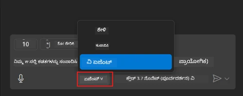
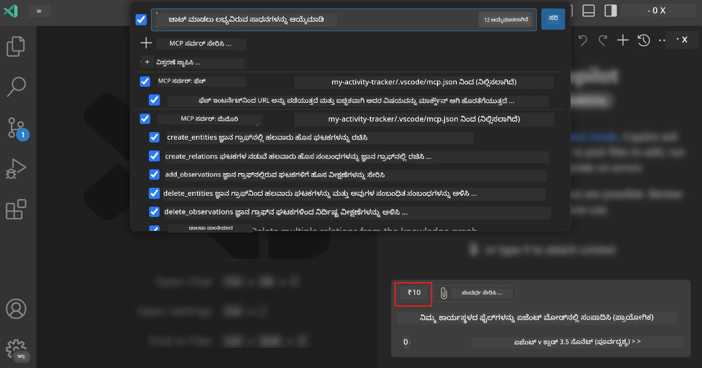
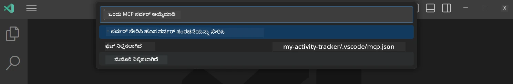
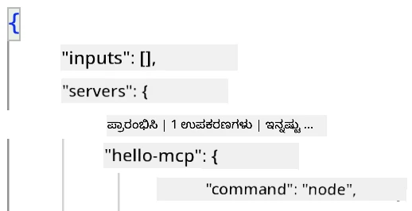
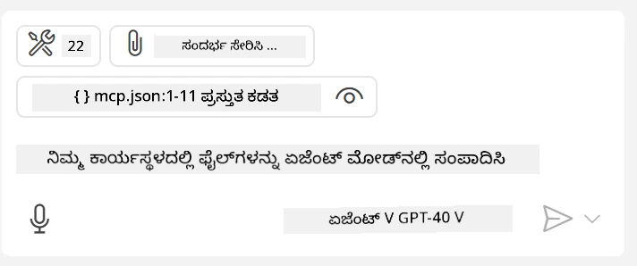
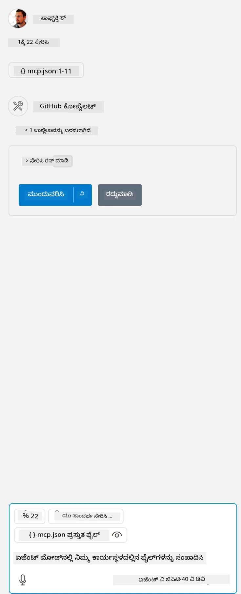

# GitHub Copilot ಏಜೆಂಟ್ ಮೋಡ್‌ನಿಂದ ಸರ್ವರ್ ಅನ್ನು ಬಳಸು ಹೇಗೆ

Visual Studio Code ಮತ್ತು GitHub Copilot ಗಳು ಕ್ಲೈಂಟ್ ಆಗಿ ಕಾರ್ಯನಿರ್ವಹಿಸಿ MCP ಸರ್ವರ್ ಅನ್ನು ಬಳಸಬಹುದು. ನೀವು ಕೇಳಬಹುದು ಏಕೆ ನಾವು ಇದನ್ನು ಮಾಡಬೇಕು? ಅದಕ್ಕೆ ಕಾರಣವೆಂದರೆ MCP ಸರ್ವರ್ ಹೊಂದಿರುವ ಎಲ್ಲ ವಿಶೇಷಣಗಳನ್ನು ಈಗ ನಿಮ್ಮ IDE ಒಳಗಿನಿಂದ ಬಳಸಬಹುದಾಗಿದೆ. ಉದಾಹರಣೆಗೆ GitHub ರ MCP ಸರ್ವರ್ ಅನ್ನು ಸೇರಿಸಿದರೆ, ಟರ್ಮಿನಲ್‌ನಲ್ಲಿ ನಿಖರವಾದ ಕಮಾಂಡ್‌ಗಳನ್ನು ಟೈಪ್ ಮಾಡುವ ಬದಲು ಪ್ರಾಂಪ್ಟ್‌ಗಳ ಮೂಲಕ GitHub ಅನ್ನು ನಿಯಂತ್ರಿಸಲು ಸಾಧ್ಯವಾಗುತ್ತದೆ. ಅಥವಾ ನೈಜ ಭಾಷೆಯ ಮೂಲಕ ನಿಯಂತ್ರಣ ಹೊಂದುವ ಮೂಲಕ ನಿಮ್ಮ ಡೆವಲಪರ್ ಅನುಭವವನ್ನು ಸುಧಾರಿಸುವ ಯಾವುದಾದರೂ ಸಾಮಾನ್ಯ ವಿಚಾರವನ್ನು ಕಲ್ಪಿಸಿ ನೋಡಿ. ಈಗ ನೀವು ಗೆಲುವಿನ ಸಂಕೇತವನ್ನು ಕಾಣಲು ಪ್ರಾರಂಭಿಸುತ್ತೀರಿ ಅಲ್ಲವೇ?

## ಅವಲೋಕನ

ಈ ಪಾಠವು Visual Studio Code ಮತ್ತು GitHub Copilot ಏಜೆಂಟ್ ಮೋಡ್‌ನ್ನು ನಿಮ್ಮ MCP ಸರ್ವರ್‌ಗೆ ಕ್ಲೈಂಟ್ ಆಗಿ ಹೇಗೆ ಬಳಸುವುದು ಎಂಬುದನ್ನು ಒಳಗೊಂಡಿದೆ.

## ಕಲಿಕಾ ಗುರಿಗಳು

ಈ ಪಾಠದ ಕೊನೆಯಲ್ಲಿ, ನೀವು ಈ ಕೆಳಗಿನವುಗಳನ್ನು ಮಾಡಲು सक्षमರಾಗಿರುತ್ತೀರಿ:

- Visual Studio Code ಮೂಲಕ MCP ಸರ್ವರ್ ಅನ್ನು ಬಳಸು.
- GitHub Copilot ಮೂಲಕ ಸಾಧನಗಳಂತಹ ಸಾಮರ್ಥ್ಯಗಳನ್ನು ಚಾಲನೆ ಮಾಡು.
- Visual Studio Code ಅನ್ನು ನಿಮ್ಮ MCP ಸರ್ವರ್ ಅನ್ನು ಹುಡುಕಲು ಮತ್ತು ನಿರ್ವಹಿಸಲು ಸಂರಚಿಸು.

## ಬಳಕೆ

ನೀವು ಎರಡು ವಿಭಿನ್ನ ಮಾರ್ಗಗಳಲ್ಲಿ ನಿಮ್ಮ MCP ಸರ್ವರ್ ಅನ್ನು ನಿಯಂತ್ರಿಸಬಹುದು:

- ಬಳಕೆದಾರ ಇಂಟರ್ಫೇಸ್, ಇದನ್ನು ಈ ಅಧ್ಯಾಯದಲ್ಲಿ ನಂತರ ನೋಡಬಹುದು.
- ಟರ್ಮಿನಲ್, `code` ಕಾರ್ಯಾಚರಣಾರ್ಹ ಫೈಲ್ ಬಳಸಿ ಟರ್ಮಿನಲ್‌ ಮೂಲಕ ವಸ್ತುಗಳನ್ನು ನಿಯಂತ್ರಿಸುವ ಸಾಧ್ಯತೆ ಇದೆ:

  ನಿಮ್ಮ ಬಳಕೆದಾರ ಪ್ರೊಫೈಲಿಗೆ MCP ಸರ್ವರ್ ಸೇರಿಸಲು, --add-mcp ಕಮಾಂಡ್ ಲೈನ್ ಆಯ್ಕೆ ಬಳಸಿ, ಮತ್ತು JSON ಸರ್ವರ್ ಸಂರಚನೆಯನ್ನು {\"name\":\"server-name\",\"command\":...} ಎಂಬ ರೂಪದಲ್ಲಿ ನೀಡಿ.

  ```
  code --add-mcp "{\"name\":\"my-server\",\"command\": \"uvx\",\"args\": [\"mcp-server-fetch\"]}"
  ```

### ಸ್ಕ್ರೀನ್‌ಶಾಟ್ಗಳು





ಮುಂದಿನ ಭಾಗಗಳಲ್ಲಿ ನಾವು ವಿಸ್ಯುಯಲ್ ಇಂಟರ್ಫೇಸ್ ಅನ್ನು ಹೇಗೆ ಬಳಸುತ್ತೇವೆ ಎಂಬುದನ್ನು ಚರ್ಚಿಸೋಣ.

## ವಿಧಾನ

ಇದನ್ನು ಉನ್ನತ ಮಟ್ಟದಲ್ಲಿ ನಾವು ಹೇಗೆ ನಿಭಾಯಿಸಬೇಕೆಂದರೆ:

- ನಮ್ಮ MCP ಸರ್ವರ್ ಅನ್ನು ಹುಡುಕಲು ಫೈಲ್ ಒಂದನ್ನು ಸಂರಚಿಸು.
- ಆ ಸರ್ವರ್ ಅನ್ನು ಪ್ರಾರಂಭಿಸಿ/ಕನೆಕ್ಟ್ ಆಗಿ ಅದರ ಸಾಮರ್ಥ್ಯಗಳನ್ನು ಪಟ್ಟಿಮಾಡಿಸು.
- GitHub Copilot ಚಾಟ್ ಇಂಟರ್ಫೇಸ್ ಮೂಲಕ ಆ ಸಾಮರ್ಥ್ಯಗಳನ್ನು ಬಳಸು.

ಚೆನ್ನಾಗಿದೆ, ಈಗ ಪ್ರಕ್ರಿಯೆಯನ್ನು ಅರ್ಥಮಾಡಿಕೊಂಡಿದ್ದೇವೆ, Visual Studio Code ಮೂಲಕ MCP ಸರ್ವರ್ ಅನ್ನು ಒಂದು ಅಭ್ಯಾಸದ ಮೂಲಕ ಬಳಸಿ ನೋಡೋಣ.

## ಅಭ್ಯಾಸ: ಸರ್ವರ್ ಬಳಕೆ

ಈ ಅಭ್ಯಾಸದಲ್ಲಿ, ನೀವು Visual Studio Code ಅನ್ನು ನಿಮ್ಮ MCP ಸರ್ವರ್ ಅನ್ನು ಹುಡುಕಲು ಮತ್ತು GitHub Copilot ಚಾಟ್ ಇಂಟರ್ಫೇಸ್ ಮೂಲಕ ಬಳಸಲು ಸಂರಚಿಸುವುದನ್ನು ಕಲಿಯೋಣ.

### -0- ಪೂರ್ವಪರಿಬ್ಬಂಧ, MCP ಸರ್ವರ್ ಅನ್ವೇಷಣೆ ಸಕ್ರಿಯಗೊಳಿಸಿ

ನೀವು MCP ಸರ್ವರ್‌ಗಳ ಅನ್ವೇಷಣೆಯನ್ನು ಸಕ್ರಿಯಗೊಳಿಸುವ ಅಗತ್ಯವಿರಬಹುದು.

1. Visual Studio Code ನಲ್ಲಿ `File -> Preferences -> Settings` ಗೆ ಹೋಗಿ.

1. "MCP" ಎಂದು ಹುಡುಕಿ ಮತ್ತು settings.json ಫೈಲ್‌ನಲ್ಲಿ `chat.mcp.discovery.enabled` ಅನ್ನು ಸಕ್ರಿಯಗೊಳಿಸಿ.

### -1- ಸಂರಚನಾ ಫೈಲ್ ರಚಿಸಿ

ಪ್ರಾಜೆಕ್ಟ್ ಮೂಲದಲ್ಲಿ ಒಂದು ಸಂರಚನಾ ಫೈಲ್ ರಚಿಸುವುದನ್ನು ಪ್ರಾರಂಭಿಸಿ, ಅವಶ್ಯಕತೆ ಇದ್ದರೆ MCP.json ಎಂಬ ಫೈಲ್ ಅನ್ನು .vscode ಎಂಬ ಫೋಲ್ಡರ್‌లో ಇರಿಸಿ. ಅದು ಹೀಗಿರಬೇಕು:

```text
.vscode
|-- mcp.json
```

ಮುಂದಕ್ಕೆ, ನಾವು ಸರ್ವರ್ ಎಂಟ್ರಿಯನ್ನು ಹೇಗೆ ಸೇರಿಸಬಹುದು ನೋಡೋಣ.

### -2- ಸರ್ವರ್ ಸಂರಚಿಸು

*mcp.json* ಗೆ ಕೆಳಗಿನ ವಿಷಯವನ್ನು ಸೇರಿಸಿ:

```json
{
    "inputs": [],
    "servers": {
       "hello-mcp": {
           "command": "node",
           "args": [
               "build/index.js"
           ]
       }
    }
}
```

ಮೇಲಿನ ಸರಳ ಉದಾಹರಣೆ ಒಂದು Node.js ನಲ್ಲಿ ಬರೆದ ಸರಳ ಸರ್ವರ್ ಅನ್ನು ಪ್ರಾರಂಭಿಸುವುದು ಹೇಗೆ ಎಂದು ತೋರಿಸುತ್ತದೆ, ಇತರ ರಂಟೈಮ್ಗಳಿಗಾಗಿ, `command` ಮತ್ತು `args` ಬಳಸಿ ಸರಿಯಾದ ಸರ್ವರ್ ಪ್ರಾರಂಭಿಸುವ ಕಮಾಂಡ್ ಸೂಚಿಸಿ.

### -3- ಸರ್ವರ್ ಪ್ರಾರಂಭಿಸಿ

ನೀವು ಎಂಟ್ರಿಯನ್ನು ಸೇರಿಸಿರುವುದರಿಂದ ಈಗ ಸರ್ವರ್ ಪ್ರಾರಂಭಿಸೋಣ:

1. *mcp.json* ನಲ್ಲಿ ನಿಮ್ಮ ಎಂಟ್ರಿಯನ್ನು ಹುಡುಕಿ ಮತ್ತು "play" ಐಕಾನ್ ಕಾಣಿಸಿಕೊಳ್ಳುತ್ತದೆ ಎಂದು ಖಚಿತಪಡಿಸಿಕೊಳ್ಳಿ:

    

1. "play" ಐಕಾನ್ ಮೇಲೆ ಕ್ಲಿಕ್ ಮಾಡಿ, GitHub Copilot ಚಾಟ್‌ನಲ್ಲಿ ಸಾಧನಗಳ ಐಕಾನ್ ಲಭ್ಯವಿರುವ ಸಾಧನಗಳ ಸಂಖ್ಯೆಯನ್ನು ಹೆಚ್ಚಿಸುವುದನ್ನು ನೀವು ನೋಡುತ್ತೀರಿ. ಆ ಸಾಧನಗಳ ಐಕಾನ್ ಕ್ಲಿಕ್ ಮಾಡಿದರೆ ನೋಂದಾಯಿತ ಸಾಧನಗಳ ಪಟ್ಟಿ ಕಾಣಬಹುದು. GitHub Copilot ಅವರು ಸಂದರ್ಭವಾಗಿ ಬಳಸಬೇಕಾಗಿದ್ದರೆ ಪ್ರತಿ ಸಾಧನವನ್ನು ಪರಿಶೀಲನೆ/ಅಪರಿಶೀಲನೆ ಮಾಡಲು ಸಾಧ್ಯ:

  

1. ಸಾಧನವನ್ನು ಚಾಲನೆ ಮಾಡಲು, ನಿಮ್ಮ ಸಾಧನಗಳ ವರ್ಣನೆಯೊಂದರೊಂದಿಗೆ ಹೊಂದಿಕೆಯಾಗುವ ಪ್ರಾಂಪ್ಟ್ ಟೈಪ್ ಮಾಡಿ, ಉದಾಹರಣೆಗೆ "add 22 to 1" ಎಂಬಂತೆ:

  

  ಉತ್ತರವಾಗಿ 23 ಎನ್ನುವುದನ್ನು ನೀವು ನೋಡಬೇಕು.

## ನಿಯೋಜನೆ

ನಿಮ್ಮ *mcp.json* ಫೈಲ್‌ಗೆ ಸರ್ವರ್ ಎಂಟ್ರಿಯನ್ನು ಸೇರಿಸಿ ಮತ್ತು ಸರ್ವರ್ ಪ್ರಾರಂಭಿಸಲು/ನಿಲ್ಲಿಸಲು ಸಾಧ್ಯವಾಗುವುದು ಖಚಿತಪಡಿಸಿಕೊಳ್ಳಿ. GitHub Copilot ಚಾಟ್ ಮೂಲಕ ನಿಮ್ಮ ಸರ್ವರ್‌ನ ಸಾಧನಗಳೊಂದಿಗೆ ಸಂವಹನ ಮಾಡಬಹುದು ಎಂದು ಖಚಿತಪಡಿಸಿಕೊಳ್ಳಿ.

## ಪರಿಹಾರ

[ಪರಿಹಾರ](./solution/README.md)

## ಪ್ರಮುಖ ಅಂಶಗಳು

ಈ ಅಧ್ಯಾಯದಿಂದ ತೆಗೆದುಕೊಳ್ಳಬೇಕಾದ ಅಂಶಗಳು ಇವೆ:

- Visual Studio Code ಉತ್ತಮ ಕ್ಲೈಂಟ್ ಆಗಿದ್ದು ಹಲವು MCP ಸರ್ವರ್‌ಗಳು ಮತ್ತು ಅವುಗಳ ಸಾಧನಗಳನ್ನು ಬಳಸಲು ಅನುಮತಿಸುತ್ತದೆ.
- GitHub Copilot ಚಾಟ್ ಇಂಟರ್ಫೇಸ್ ಮೂಲಕ ನೀವು ಸರ್ವರ್‌ಗಳೊಂದಿಗೆ ಸಂವಹನ ಮಾಡುತ್ತೀರಿ.
- ಬಳಕೆದಾರರಿಂದ API ಕೀಗಳಂತಹ ಮಾಹಿತಿಗಳನ್ನು ಕೇಳಿ, ಅವುಗಳನ್ನು *mcp.json* ಫೈಲ್‌ನಲ್ಲಿ ಸರ್ವರ್ ಎಂಟ್ರಿ ಸಂರಚಿಸುವಾಗ MCP ಸರ್ವರ್‌ಗೆ ಪಾಸ್ ಮಾಡಬಹುದು.

## ಮಾದರಿಗಳನ್ನು

- [ಜಾವಾ ಕ್ಯಾಲ್ಕುಲೇಟರ್](../samples/java/calculator/README.md)
- [.ನೆಟ್ ಕ್ಯಾಲ್ಕುಲೇಟರ್](../../../../03-GettingStarted/samples/csharp)
- [ಜಾವಾಸ್ಕ್ರಿಪ್ಟ್ ಕ್ಯಾಲ್ಕುಲೇಟರ್](../samples/javascript/README.md)
- [ಟೈಪ್ಸ್ಕ್ರಿಪ್ಟ್ ಕ್ಯಾಲ್ಕುಲೇಟರ್](../samples/typescript/README.md)
- [ಪೈಥಾನ್ ಕ್ಯಾಲ್ಕುಲೇಟರ್](../../../../03-GettingStarted/samples/python)

## ಹೆಚ್ಚುವರಿ ಸಂಪನ್ಮೂಲಗಳು

- [Visual Studio ಡಾಕ್ಯುಮೆಂಟ್‌ಗಳು](https://code.visualstudio.com/docs/copilot/chat/mcp-servers)

## ಮುಂದೇನು

- ಮುಂದಿನದು: [stdio ಸರ್ವರ್ ರಚನೆ](../05-stdio-server/README.md)

---

<!-- CO-OP TRANSLATOR DISCLAIMER START -->
**ಅಸ್ವೀಕಾರ**:
ಈ ದಸ್ತಾವೇಜು AI ಅನುವಾದ ಸೇವೆ [Co-op Translator](https://github.com/Azure/co-op-translator) ಬಳಸಿ ಅನುವಾದಿಸಲಾಗಿದೆ. ನಾವು ನಿಖರತೆಯನ್ನು ಸಾಧಿಸಲು ಪ್ರಯತ್ನಿಸುತ್ತಿದ್ದರೂ, ದಯವಿಟ್ಟು ಗಮನಿಸಿ, ಸ್ವಯಂಚಾಲಿತ ಅನುವಾದಗಳಲ್ಲಿ ದೋಷಗಳು ಅಥವಾ ಅಸಡ್ಡೆಗಳು ಇರಬಹುದು. ಮೂಲ ಭಾಷೆಯಲ್ಲಿರುವ ಮೂಲ ದಸ್ತಾವೇಜು ಪ್ರಾಮಾಣಿಕ ಮೂಲವೆಂದು ಪರಿಗಣಿಸಬೇಕು. ಪ್ರಮುಖ ಮಾಹಿತಿಗಾಗಿ, ವೃತ್ತಿಪರ ಮಾನವ ಅನುವಾದವನ್ನು ಶಿಫಾರಸು ಮಾಡಲಾಗುತ್ತದೆ. ಈ ಅನುವಾದವನ್ನು ಬಳಸುವ ಮೂಲಕ ಉಂಟಾಗುವ ಯಾವುದೇ ತಪ್ಪು ಅರ್ಥಗಳ ಅಥವಾ ತಪ್ಪು ವ್ಯಾಖ್ಯಾನಗಳ ಬಗ್ಗೆ ನಾವು ಹೊಣೆಗಾರರಲ್ಲ.
<!-- CO-OP TRANSLATOR DISCLAIMER END -->