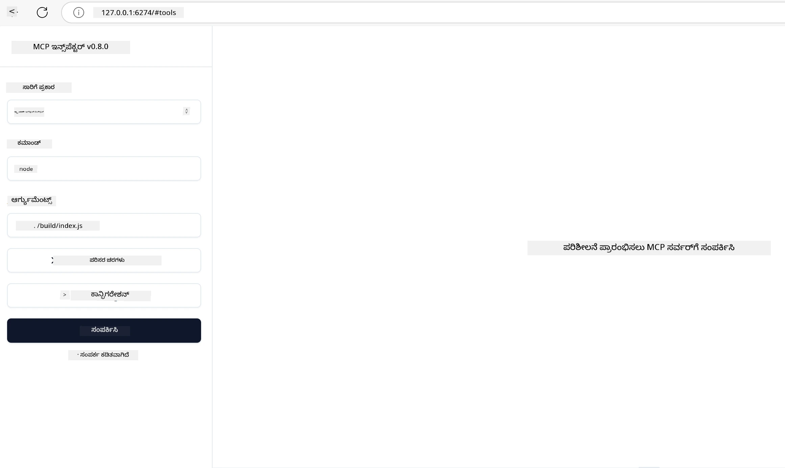

## ಪರೀಕ್ಷೆ ಮತ್ತು ಡಿಬಗಿಂಗ್

ನೀವು ನಿಮ್ಮ MCP ಸರ್ವರ್ ಅನ್ನು ಪರೀಕ್ಷಿಸಲು ಪ್ರಾರಂಭಿಸುವ ಮೊದಲು, ಲಭ್ಯವಿರುವ ಸಾಧನಗಳು ಮತ್ತು ಡಿಬಗ್ ಮಾಡುವ ಉತ್ತಮ ಕ್ರಮಗಳನ್ನು ಅರ್ಥಮಾಡಿಕೊಳ್ಳುವುದು ಮಹತ್ವದ್ದು. ಪರಿಣಾಮಕಾರಿ ಪರೀಕ್ಷೆ ನಿಮ್ಮ ಸರ್ವರ್ ನಿರೀಕ್ಷಿತವಾಗಿ ನಡೆದುಕೊಳ್ಳುವಂತೆ ನೋಡಿಕೊಳ್ಳುತ್ತದೆ ಮತ್ತು ಸಮಸ್ಯೆಗಳನ್ನು ಶೀಘ್ರವಾಗಿ ಗುರುತಿಸಿ ಪರಿಹರಿಸಲು ಸಹಾಯ ಮಾಡುತ್ತದೆ. ಕೆಳಗಿನ ವಿಭಾಗದಲ್ಲಿ ನಿಮ್ಮ MCP ಜಾರಿಗೆ ಶಿಫಾರಸು ಮಾಡಲಾದ ದೃಷ್ಟಿಕೋನಗಳನ್ನು ವಿವರಿಸಲಾಗಿದೆ.

## ಅವಲೋಕನ

ಈ ಪಾಠವು ಸರಿಯಾದ ಪರೀಕ್ಷಾ ಕ್ರಮವನ್ನು ಆಯ್ಕೆಮಾಡುವುದು ಮತ್ತು ಅತ್ಯಂತ ಪರಿಣಾಮಕಾರಿ ಪರೀಕ್ಷಾ ಸಾಧನವನ್ನು ಬಳಸುವುದು ಹೇಗೆ ಎಂಬುದನ್ನು ಒಳಗೊಂಡಿದೆ.

## ಅಭ್ಯಾಸ ಗುರಿಗಳು

ಈ ಪಾಠದ ಕೊನೆಯಲ್ಲಿ ನೀವು ಈ ಕೆಳಗಿನ ಕಾರ್ಯಗಳನ್ನು ನೆರವೇರಿಸಲು ಸಾಧ್ಯವಾಗುತ್ತದೆ:

- ಪರೀಕ್ಷೆಗಾಗಿ ವಿಭಿನ್ನ ದೃಷ್ಟಿಕೋನಗಳನ್ನು ವಿವರಿಸುವುದು.
- ವಿವಿಧ ಸಾಧನಗಳನ್ನು ಪರಿಣಾಮಕಾರಿಯಾಗಿ ನಿಮ್ಮ ಕೋಡ್ ಪರೀಕ್ಷಿಸಲು ಬಳಸುವುದು.

## MCP ಸರ್ವರ್‌ಗಳನ್ನು ಪರೀಕ್ಷಿಸುವುದು

MCP ನಿಮ್ಮ ಸರ್ವರ್‌ಗಳನ್ನು ಪರೀಕ್ಷಿಸಲು ಮತ್ತು ಡಿಬಗ್ ಮಾಡಲು ಸಹಾಯಮಾಡುವ ಸಾಧನಗಳನ್ನು ಒದಗಿಸುತ್ತದೆ:

- **MCP ಇನ್ಸ್ಪೆಕ್ಟರ್**: CLI ಸಾಧನವಾಗಿಯೂ ಮತ್ತು ದೃಶ್ಯ ಸಾಧನವಾಗಿಯೂ ಓಡಿಸಬಹುದಾದ ಕಮಾಂಡ್ ಲೈನ್ ಸಾಧನ.
- **ಹಸ್ತಚಾಲಿತ ಪರೀಕ್ಷೆ**: ವೆಬ್ ವಿನಂತಿಗಳನ್ನು ನಡೆಸಲು curl ಮುಂತಾದ ಸಾಧನವನ್ನು ಬಳಸಬಹುದು, ಆದರೆ HTTP ಓಡಿಸಲಾದ ಯಾವುದೇ ಸಾಧನ ಬಳಸಿ ಸಾಧ್ಯ.
- **ಘಟಕ ಪರೀಕ್ಷೆ**: ಸರ್ವರ್ ಮತ್ತು ಕ್ಲೈಂಟ್ ವೈಶಿಷ್ಟ್ಯಗಳನ್ನು ಪರೀಕ್ಷಿಸಲು ನಿಮ್ಮ ಇಚ್ಛೆಯ ಪರೀಕ್ಷಾ ವ್ಯವಸ್ಥೆಯನ್ನು ಬಳಸಬಹುದು.

### MCP ಇನ್ಸ್ಪೆಕ್ಟರ್ ಬಳಕೆ

ಈ ಸಾಧನ ಬಳಕೆ ಕುರಿತು ನಾವು ಹಿಂದಿನ ಪಾಠಗಳಲ್ಲಿ ವಿವರಿಸಿದ್ದೇವೆ, ಆದರೆ ಇದನ್ನು ಒಂದು ಸಾಧಾರಣ ಮಟ್ಟದಲ್ಲಿ ಮಾತನಾಡೋಣ. ಇದು Node.js ನಲ್ಲಿ ನಿರ್ಮಿಸಲಾದ ಸಾಧನವಾಗಿದ್ದು, ನೀವು `npx` ಕಾರ್ಯಾಚರಣೆ ಮೂಲಕ ಬಳಸಬಹುದು, ಇದು ತಕ್ಷಣವೇ ಸಾಧನವನ್ನು ಡೌನ್‌ಲೋಡ್ ಮಾಡಿ ಇನ್ಸ್ಟಾಲ್ ಮಾಡಿ, ನಿಮ್ಮ ವಿನಂತಿಯನ್ನು ಪೂರ್ಣಗೊಳಿಸಿದ ಮೇಲೆ ಸ್ವತಃ ತೆಗೆಯುತ್ತದೆ.

[MCP ಇನ್ಸ್ಪೆಕ್ಟರ್](https://github.com/modelcontextprotocol/inspector) ನಿಮಗೆ ಸಹಾಯ ಮಾಡುತ್ತದೆ:

- **ಸರ್ವರ್ ಸಾಮರ್ಥ್ಯಗಳನ್ನು ಅನ್ವೇಷಿಸಿ**: ಲಭ್ಯವಿರುವ ಸಂಪನ್ಮೂಲಗಳು, ಸಾಧನಗಳು ಮತ್ತು ಪ್ರಾಂಪ್ಟ್‌ಗಳನ್ನು ಸ್ವಯಂಚಾಲಿತವಾಗಿ ಕಂಡು ಹಿಡಿಯುವುದು
- **ಪರೀಕ್ಷಾ ಸಾಧನ ಕಾರ್ಯಾಚರಣೆ**: ವಿಭಿನ್ನ ಪ್ಯಾರಾಮೀಟರ್‌ಗಳನ್ನು ಪ್ರಯತ್ನಿಸಿ ಪ್ರತಿಕ್ರಿಯೆಗಳನ್ನು ರಿಯಲ್-ಟೈಮ್‌ನಲ್ಲಿ ನೋಡಿ
- **ಸರ್ವರ್ ಮೆಟಾಡೇಟಾವನ್ನು ವೀಕ್ಷಿಸಿ**: ಸರ್ವರ್ ಮಾಹಿತಿ, ಸ್ಕೀಮಾ ಮತ್ತು ಸಂರಚನೆಗಳನ್ನು ಪರೀಕ್ಷಿಸುವುದು

ಸಾಧನದ ಸಾಮಾನ್ಯ ಓಟ ಈ ಕೆಳಗಿನಂತೆ ಕಾಣಬಹುದು:

```bash
npx @modelcontextprotocol/inspector node build/index.js
```

ಮೇಲಿನ ಕಮಾಂಡ್ ಒಂದು MCP ಮತ್ತು ಅದರ ದೃಶ್ಯ ಮುಖಮಂದಿರವನ್ನು ಪ್ರಾರಂಭಿಸಿ, ನಿಮ್ಮ ಬ್ರೌಸರ್‌ನಲ್ಲಿ ಸ್ಥಳೀಯ ವೆಬ್ ಇಂಟರ್ಫೇಸ್ ಅನ್ನು ಲೋಡ್ ಮಾಡುತ್ತದೆ. ನೀವು ನೋಂದಾಯಿತ MCP ಸರ್ವರ್‌ಗಳ ಡ್ಯಾಶ್‌ಬೋರ್ಡ್, ಲಭ್ಯವಿರುವ ಸಾಧನಗಳು, ಸಂಪನ್ಮೂಲಗಳು ಮತ್ತು ಪ್ರಾಂಪ್ಟ್‌ಗಳನ್ನು ನೋಡಬಹುದು. ಇಂಟರ್ಫೇಸ್ ನಿಮಗೆ ಸಾಧನ ಕಾರ್ಯಾಚರಣೆಯನ್ನು ಸಂವಹನಾತ್ಮಕವಾಗಿ ಪರೀಕ್ಷಿಸಲು, ಸರ್ವರ್ ಮೆಟಾಡೇಟಾವನ್ನು ಪರಿಶೀಲಿಸಲು ಮತ್ತು ರಿಯಲ್-ಟೈಮ್ ಪ್ರತಿಕ್ರಿಯೆಗಳನ್ನು ವೀಕ್ಷಿಸಲು ಅವಕಾಶ ನೀಡುತ್ತದೆ, ಇದು ನಿಮ್ಮ MCP ಸರ್ವರ್ ಜಾಗತೀಕರಣಗಳನ್ನು ಪರಿಶೀಲಿಸಿ ಡಿಬಗ್ ಮಾಡಲು ಸುಲಭಗೊಳಿಸುತ್ತದೆ.

ಇದು ಹೀಗೆ ಕಾಣಬಹುದು: 

ನೀವು ಈ ಸಾಧನವನ್ನು CLI ಮೋಡ್‌ನಲ್ಲಿ ಓಡಿಸಬಹುದು, ಆ ಸಂದರ್ಭದಲ್ಲಿ `--cli` ಗುಣಲಕ್ಷಣವನ್ನು ಸೇರಿಸುವುದು ಅವಶ್ಯಕ. ಕೆಳಗಿನ ಉದಾಹರಣೆಯು "CLI" ಮೋಡ್‌ನಲ್ಲಿ ಸಾಧನವನ್ನು ಓಡಿಸುವ ಉದಾಹರಣೆಯಾಗಿದೆ, ಇದು ಸರ್ವರ್‌ನ ಎಲ್ಲಾ ಸಾಧನಗಳನ್ನು ಪಟ್ಟಿ ಮಾಡುತ್ತದೆ:

```sh
npx @modelcontextprotocol/inspector --cli node build/index.js --method tools/list
```

### ಹಸ್ತಚಾಲಿತ ಪರೀಕ್ಷೆ

ಸರ್ವರ್ ಸಾಮರ್ಥ್ಯಗಳನ್ನು ಪರೀಕ್ಷಿಸಲು ಇನ್ಸ್ಪೆಕ್ಟರ್ ಸಾಧನವನ್ನು ಓಡಿಸುವದರಿಂದ ಹೊರತು, ಮತ್ತೊಂದು ಸಮಾನ ಕ್ರಮವೆಂದರೆ HTTP ಪ್ರಯೋಗ ಮಾಡಲು ಸಕ್ರಿಯವಾಗಿರುವ ಕ್ಲೈಂಟ್, ಉದಾಹರಣೆಗೆ curl ಬಳಸುವಂತೆ.

curl ಬಳಸಿ ನೀವು MCP ಸರ್ವರ್‌ಗಳನ್ನು ನೇರವಾಗಿ HTTP ವಿನಂತಿಗಳ ಮೂಲಕ ಪರೀಕ್ಷಿಸಬಹುದು:

```bash
# ಉದಾಹರಣೆ: ಪರೀಕ್ಷಾ ಸರ್ವರ್ ಮೆಟಾಡೇಟಾ
curl http://localhost:3000/v1/metadata

# ಉದಾಹರಣೆ: ಒಂದು ಸಾಧನ ಕಾರ್ಯಗತಗೊಳಿಸಿ
curl -X POST http://localhost:3000/v1/tools/execute \
  -H "Content-Type: application/json" \
  -d '{"name": "calculator", "parameters": {"expression": "2+2"}}'
```

ಮೇಲಿನ curl ಬಳಕೆಯಿಂದ ನೀವು ನೋಡಬಹುದಾಗಿದೆ, ನೀವು POST ವಿನಂತಿಯನ್ನು ಬಳಸಿ ಸಾಧನದ ಹೆಸರು ಮತ್ತು ಅದರ ಪ್ಯಾರಾಮೀಟರ್‌ಗಳ ಸಂಯೋಜನೆಯೊಂದಿಗೆ ಒದಗಿಸಿದ ಪೇಲೋಡ್ ಮೂಲಕ ಸಾಧನವನ್ನು ಕರೆಸಬಹುದು. ಎಲ್ಲಿಗೂ ಅನ್ವಯಿಸುವ ಕ್ರಮವನ್ನು ಬಳಸಿಕೊಳ್ಳಿ. CLI ಸಾಧನಗಳು ಸಾಮಾನ್ಯವಾಗಿ ವೇಗವಾಗಿ ಬಳಸಲು ಅನುಕೂಲಕರವಾಗಿದ್ದು, ಸ್ಕ್ರಿಪ್ಟ್ ಮಾಡಲು ಸೂಕ್ತವಾಗಿರುತ್ತವೆ, ಇದು CI/CD ಪರಿಸರದಲ್ಲಿ ಉಪಯುಕ್ತ.

### ಘಟಕ ಪರೀಕ್ಷೆ

ನಿಮ್ಮ ಸಾಧನಗಳು ಮತ್ತು ಸಂಪನ್ಮೂಲಗಳು ನಿರೀಕ್ಷಿತಂತೆ ಕಾರ್ಯನಿರ್ವಹಿಸುತ್ತವೆ ಎಂಬುದನ್ನು ಖಾತ್ರಿಪಡಿಸಲು ಘಟಕ ಪರೀಕ್ಷೆಗಳನ್ನು ರಚಿಸಿ. ಕೆಳಗಿನ ಉದಾಹರಣೆಯ ಪರೀಕ್ಷಾ ಕೋಡ್ ನೋಡಿ.

```python
import pytest

from mcp.server.fastmcp import FastMCP
from mcp.shared.memory import (
    create_connected_server_and_client_session as create_session,
)

# ಸಂಪೂರ್ಣ ಮೋಡ್ಯೂಲ್ ಅನ್ನು ಅಸಿಂಕ್ರೋನ್ ಪರೀಕ್ಷೆಗಾಗಿಯೇ ಗುರುತಿಸಿ
pytestmark = pytest.mark.anyio


async def test_list_tools_cursor_parameter():
    """Test that the cursor parameter is accepted for list_tools.

    Note: FastMCP doesn't currently implement pagination, so this test
    only verifies that the cursor parameter is accepted by the client.
    """

 server = FastMCP("test")

    # ಕೆಲವು ಪರೀಕ್ಷಾ ಸಾಧನಗಳನ್ನು ರಚಿಸಿ
    @server.tool(name="test_tool_1")
    async def test_tool_1() -> str:
        """First test tool"""
        return "Result 1"

    @server.tool(name="test_tool_2")
    async def test_tool_2() -> str:
        """Second test tool"""
        return "Result 2"

    async with create_session(server._mcp_server) as client_session:
        # ಕರ್ಸರ್ ಪ್ಯಾರಾಮೀಟರ್ ಇಲ್ಲದೆ ಪರೀಕ್ಷೆ (ಬಿಟ್ಟಿದೆ)
        result1 = await client_session.list_tools()
        assert len(result1.tools) == 2

        # cursor=None ಜೊತೆಗೆ ಪರೀಕ್ಷೆ
        result2 = await client_session.list_tools(cursor=None)
        assert len(result2.tools) == 2

        # ಕರ್ಸರ್ ಅನ್ನು ಸ್ಟ್ರಿಂಗ್ ರೂಪದಲ್ಲಿ ಹೊಂದಿ ಪರೀಕ್ಷೆ
        result3 = await client_session.list_tools(cursor="some_cursor_value")
        assert len(result3.tools) == 2

        # ಖಾಲಿ ಸ್ಟ್ರಿಂಗ್ ಕರ್ಸರ್ ಜೊತೆಗೆ ಪರೀಕ್ಷೆ
        result4 = await client_session.list_tools(cursor="")
        assert len(result4.tools) == 2
    
```

ಮೇಲಿನ ಕೋಡ್ ಈ ಕೆಳಗಿನಂತೆ ಕಾರ್ಯನಿರ್ವಹಿಸುತ್ತದೆ:

- pytest ವ್ಯವಸ್ಥೆಯನ್ನು ಬಳಸಿಕೊಂಡಿದ್ದು, ಇದು ಪರೀಕ್ಷೆಗಳನ್ನು ಕಾರ್ಯಗಳಾಗಿ ರಚಿಸಲು ಮತ್ತು assert ಹೇಳಿಕೆಗಳನ್ನು ಬಳಸಲು ಅನುಮತಿಸುತ್ತದೆ.
- ಎರಡು ವಿಭಿನ್ನ ಸಾಧನಗಳುಳ್ಳ MCP ಸರ್ವರ್ ಅನ್ನು ರಚಿಸುತ್ತದೆ.
- ಕೆಲವು ಶರತ್ತುಗಳು ಪೂರೈಸಲ್ಪಟ್ಟಿರುವುದನ್ನು ಪರಿಶೀಲಿಸಲು `assert` ಹೇಳಿಕೆಯನ್ನು ಬಳಸುತ್ತದೆ.

[ಸಂಪೂರ್ಣ ಫೈಲ್ ಇಲ್ಲಿ ನೋಡಿ](https://github.com/modelcontextprotocol/python-sdk/blob/main/tests/client/test_list_methods_cursor.py)

ಮೇಲಿನ ಫೈಲ್ ಅನುಸರಿಸಿ, ನಿಮ್ಮ ಸರ್ವರ್ ಅನ್ನು ಪರೀಕ್ಷಿಸಿ ಸಾಮರ್ಥ್ಯಗಳು ಸರಿಯಾಗಿ ರಚಿಸಲಾಗಿದೆಯೇ ಎಂದು ಖಚಿತಪಡಿಸಿಕೊಳ್ಳಿ.

ಅತ್ಯುತ್ತಮ SDKಗಳಲ್ಲಿಯೂ ಇಂತಹ ಪರೀಕ್ಷಾ ವಿಭಾಗಗಳಿವೆ, ಆದ್ದರಿಂದ ನೀವು ಆಯ್ದ ರಂಟೈಮ್‌ಗೆ ಹೊಂದಿಸಿಕೊಂಡಿಕೊಳ್ಳಬಹುದು.

## ಮಾದರಿಗಳು

- [ಜಾವಾ ಕ್ಯಾಲ್ಕ್ಯುಲೇಟರ್](../samples/java/calculator/README.md)
- [.Net ಕ್ಯಾಲ್ಕ್ಯುಲೇಟರ್](../../../../03-GettingStarted/samples/csharp)
- [ಜಾವಾಸ್ಕ್ರಿಪ್ಟ್ ಕ್ಯಾಲ್ಕ್ಯುಲೇಟರ್](../samples/javascript/README.md)
- [ಟೈಪ್‌ಸ್ಕ್ರಿಪ್ಟ್ ಕ್ಯಾಲ್ಕ್ಯುಲೇಟರ್](../samples/typescript/README.md)
- [ಪೈತಾನ್ ಕ್ಯಾಲ್ಕ್ಯುಲೇಟರ್](../../../../03-GettingStarted/samples/python) 

## ಹೆಚ್ಚುವರಿ ಸಂಪನ್ಮೂಲಗಳು

- [ಪೈತಾನ್ SDK](https://github.com/modelcontextprotocol/python-sdk)

## ಮುಂದಿನ ಹಂತ

- ಮುಂದಿನದು: [ದಾಖಲು](../09-deployment/README.md)

---

<!-- CO-OP TRANSLATOR DISCLAIMER START -->
**ವೆಚ್ಚಪತ್ರ**:  
ಈ ದಾಖಲೆ [Co-op Translator](https://github.com/Azure/co-op-translator) ಎಂಬ AI ಅನುವಾದ ಸೇವೆಯನ್ನು ಬಳಸಿ ಅನುವಾದಿಸಲಾಗಿದೆ. ನಾವು ನಿಖರತೆಯಿಗಾಗಿ ಶ್ರಮಿಸುವಾಗಲೂ, ಸ್ವಯಂಚಾಲಿತ ಅನುವಾದಗಳಲ್ಲಿ ದೋಷಗಳು ಅಥವಾ ಅಸತ್ಯತೆಗಳು ಇರುವ ಸಾಧ್ಯತೆ ಇದೆ ಎಂದು ದಯವಿಟ್ಟು ಗಮನಿಸಿ. ಮೂಲ ಭಾಷೆಯಲ್ಲಿರುವ ಮೂಲ ದಾಖಲೆ ಇನ್ನಷ್ಟು ಅಧಿಕೃತ ಮಾಹಿತಿ ಮೂಲವಾಗಿರಬೇಕು. ಮಹತ್ವದ ಮಾಹಿತಿಗಾಗಿ ವೃತ್ತಿಪರ ಮಾನವ ಅನುವಾದವನ್ನು ಶಿಫಾರಸು ಮಾಡಲಾಗುತ್ತದೆ. ಈ ಅನುವಾದದ ಬಳಕೆಯಿಂದ ಆಗುವ ಯಾವುದೇ ತಪ್ಪು ಅರ್ಥಗ್ರಹಣ ಅಥವಾ ತಪ್ಪು ಅರ್ಥಮಾಡಿಕೊಳ್ಳುವುದಕ್ಕೆ ನಾವು ಜವಾಬ್ದಾರರಾಗುವುದಿಲ್ಲ.
<!-- CO-OP TRANSLATOR DISCLAIMER END -->