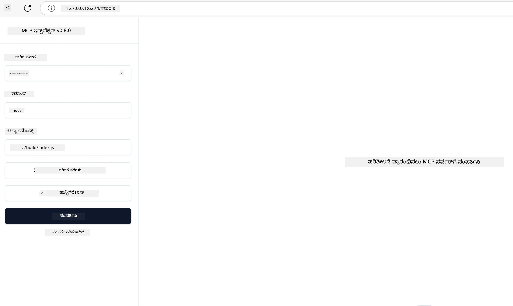

## ಪರೀಕ್ಷೆ ಮತ್ತು ಡಿಬಗಿಂಗ್

ನೀವು ನಿಮ್ಮ MCP ಸರ್ವರ್ ಅನ್ನು ಪರೀಕ್ಷಿಸಲು ಪ್ರಾರಂಭಿಸುವ ಮೊದಲು, ಲಭ್ಯವಿರುವ ಉಪಕರಣಗಳು ಮತ್ತು ಡಿಬಗಿಂಗ್‌ಗೆ ಉತ್ತಮ ಅಭ್ಯಾಸಗಳನ್ನು ಅರ್ಥಮಾಡಿಕೊಳ್ಳುವುದು ಮುಖ್ಯ. ಪರಿಣಾಮಕಾರಿ ಪರೀಕ್ಷೆ ನಿಮ್ಮ ಸರ್ವರ್ ನಿರೀಕ್ಷಿತವಾಗಿ ಕಾರ್ಯನಿರ್ವಹಿಸುತ್ತದೆ ಎಂದು ಖಚಿತಪಡಿಸುತ್ತದೆ ಮತ್ತು ಸಮಸ್ಯೆಗಳನ್ನು ತ್ವರಿತವಾಗಿ ಗುರುತಿಸಿ ಪರಿಹರಿಸಲು ಸಹಾಯ ಮಾಡುತ್ತದೆ. ಕೆಳಗಿನ ವಿಭಾಗದಲ್ಲಿ ನಿಮ್ಮ MCP ಅನುಷ್ಠಾನವನ್ನು ಮಾನ್ಯಗೊಳಿಸಲು ಶಿಫಾರಸು ಮಾಡಿದ ವಿಧಾನಗಳನ್ನು ವಿವರಿಸಲಾಗಿದೆ.

## ಅವಲೋಕನ

ಈ ಪಾಠವು ಸರಿಯಾದ ಪರೀಕ್ಷಾ ವಿಧಾನವನ್ನು ಆಯ್ಕೆ ಮಾಡುವುದನ್ನು ಮತ್ತು ಅತ್ಯಂತ ಪರಿಣಾಮಕಾರಿ ಪರೀಕ್ಷಾ ಉಪಕರಣವನ್ನು ಹೇಗೆ ಬಳಸುವುದು ಎಂಬುದನ್ನು ಒಳಗೊಂಡಿದೆ.

## ಕಲಿಯುವ ಉದ್ದೇಶಗಳು

ಈ ಪಾಠದ ಕೊನೆಯಲ್ಲಿ, ನೀವು ಇವುಗಳನ್ನು ಮಾಡಬಲ್ಲಿರಿ:

- ಪರೀಕ್ಷೆಗೆ ವಿವಿಧ ವಿಧಾನಗಳನ್ನು ವರ್ಣಿಸಲು.
- ನಿಮ್ಮ ಕೋಡ್ ಅನ್ನು ಪರಿಣಾಮಕಾರಿಯಾಗಿ ಪರೀಕ್ಷಿಸಲು ವಿವಿಧ ಉಪಕರಣಗಳನ್ನು ಬಳಸಲು.


## MCP ಸರ್ವರ್‌ಗಳನ್ನು ಪರೀಕ್ಷಿಸುವುದು

MCP ನಿಮಗೆ ನಿಮ್ಮ ಸರ್ವರ್‌ಗಳನ್ನು ಪರೀಕ್ಷಿಸಲು ಮತ್ತು ಡಿಬಗ್ ಮಾಡಲು ಸಹಾಯಕವಾಗುವ ಉಪಕರಣಗಳನ್ನು ಒದಗಿಸುತ್ತದೆ:

- **MCP ಇನ್‌ಸ್ಪೆಕ్టర్**: CLI ಉಪಕರಣವಾಗಿ ಮತ್ತು ದೃಶ್ಯಾಂಶ ಉಪಕರಣವಾಗಿ ಎರಡೂಗಳನ್ನು ಓಡಿಸಲು ಸಾಧ್ಯವಾಗುವ ಆಜ್ಞಾಪಟ್ಟಿ ಉಪಕರಣ.
- **ಮ್ಯಾನುಯಲ್ ಪರೀಕ್ಷೆ**: ನೀವು curl ಹೀಗೆ HTTP ರನ್ ಮಾಡಬಲ್ಲ ಬೆರಗಿನ ಉಪಕರಣವನ್ನು ಬಳಸಬಹುದು, ಆದರೆ HTTP ಅನ್ನು ಚಾಲನೆ ಮಾಡಬಹುದಾದ ಯಾವುದೇ ಉಪಕರಣವೂ ಸರಿ.
- **ಯೂನಿಟ್ ಪರೀಕ್ಷೆ**: ಸರ್ವರ್ ಮತ್ತು ಕ್ಲೈಂಟ್ ಉಭಯದ ವೈಶಿಷ್ಟ್ಯಗಳನ್ನು ಪರೀಕ್ಷಿಸಲು ನಿಮಗೆ ಇಷ್ಟವಾದ ಪರೀಕ್ಷಾ ಫ್ರೆಮ್ವರ್ಕ್ ಬಳಸಬಹುದು.

### MCP ಇನ್‌ಸ್ಪೆಕ್ಟರ್ ಬಳಕೆ

ನಾವು ಈ ಉಪಕರಣದ ಬಳಕೆಯನ್ನು ಹಿಂದೆಗಿನ ಪಾಠಗಳಲ್ಲಿ ವಿವರಣೆ ಮಾಡಿದ್ದೇವೆ ಆದರೆ ಅದು ಹೇಗೆ ಕಾರ್ಯನಿರ್ವಹಿಸುತ್ತದೆ ಎಂಬುದನ್ನು ಸ್ವಲ್ಪ ಉನ್ನತ ಮಟ್ಟದಲ್ಲಿ ಚರ್ಚಿಸೋಣ. ಇದು Node.js ನಲ್ಲಿ ನಿರ್ಮಿತವಾದ ಉಪಕರಣ ಮತ್ತು ನೀವು `npx` ಕಾರ್ಯನಿರ್ವಹಣಾರ್ಹತೆಯನ್ನು ಕರೆದು ಬಳಸಿ ಇದನ್ನು ಬಳಸಬಹುದು, ಇದು ಉಪಕರಣವನ್ನು ತಾತ್ಕಾಲಿಕವಾಗಿ ಡೌನ್‌ಲೋಡ್ ಮಾಡುತ್ತದೆ ಮತ್ತು ನಿಮ್ಮ ವಿನಂತಿಯನ್ನು ಓಡಿಸಿದ ನಂತರ ಸ್ವಯಂ ಸ್ವಚ್ಛಗೊಳಿಸುತ್ತದೆ.

[MCP ಇನ್‌ಸ್ಪೆಕ್ಟರ್](https://github.com/modelcontextprotocol/inspector) ನಿಮಗೆ ಸಹಾಯ ಮಾಡುತ್ತದೆ:

- **ಸರ್ವರ್ ಸಾಮರ್ಥ್ಯಗಳನ್ನು ಪತ್ತೆಹಚ್ಚುವುದು**: ಲಭ್ಯವಿರುವ ಸಂಪನ್ಮೂಲಗಳು, ಉಪಕರಣಗಳು ಮತ್ತು ಪ್ರಾಂಪ್ಟ್‌ಗಳನ್ನು ಸ್ವಯಂಚಾಲಿತವಾಗಿ ಪತ್ತೆಮಾಡುವುದು
- **ಉಪಕರಣ ಕಾರ್ಯಾಚರಣೆಯನ್ನು ಪರೀಕ್ಷೆ ಮಾಡುವುದು**: ವಿಭಿನ್ನ ಮಾನದಂಡಗಳನ್ನು ಪ್ರಯತ್ನಿಸಿ ನೈಜ ಸಮಯದಲ್ಲಿ ಪ್ರತಿಕ್ರಿಯೆಗಳನ್ನು ನೋಡಿ
- **ಸರ್ವರ್ ಮೆಟಾಡೇಟಾವನ್ನು ವೀಕ್ಷಿಸುವುದು**: ಸರ್ವರ್ ಮಾಹಿತಿ, ಸ್ಕೀಮಾಗಳು ಮತ್ತು ಸಂರಚನೆಗಳನ್ನು ಪರಿಶೀಲಿಸುವುದು

ಉಪಕರಣದ ಸಾಮಾನ್ಯ ಓಟ ಇಲ್ಲಿದೆ:

```bash
npx @modelcontextprotocol/inspector node build/index.js
```

ಮೇಲಿನ ಆಜ್ಞೆ ನಿಮ್ಮ ಬ್ರೌಸರ್‌ನಲ್ಲಿ ಸ್ಥಳೀಯ ವೆಬ್ ಇಂಟರ್ಫೇಸ್ ಅನ್ನು ಪ್ರಾರಂಭಿಸುತ್ತದೆ ಮತ್ತು MCP ಮತ್ತು ಅದರ ದೃಶ್ಯಾಂಶ ಮುಕ್ತಾಯವನ್ನು ಪ್ರಾರಂಭಿಸುತ್ತದೆ. ನೀವು ನಿಮ್ಮ ದಾಖಲಾದ MCP ಸರ್ವರ್‌ಗಳು, ಅವುಗಳ ಲಭ್ಯವಿರುವ ಉಪಕರಣಗಳು, ಸಂಪನ್ಮೂಲಗಳು ಮತ್ತು ಪ್ರಾಂಪ್ಟ್‌ಗಳನ್ನು ಪ್ರದರ್ಶಿಸುವ ಡ್ಯಾಶ್‌ಬೋರ್ಡ್ ಅನ್ನು ಕಾಣಬಹುದಾಗಿದೆ. ಇಂಟರ್ಫೇಸ್ ನಿಮಗೆ ಉಪಕರಣ ಕಾರ್ಯಾಚರಣೆಯನ್ನು ಅಂತರ್‌ಕ್ರಿಯಾತ್ಮಕವಾಗಿ ಪರೀಕ್ಷಿಸಲು, ಸರ್ವರ್ ಮೆಟಾಡೇಟಾವನ್ನು ಪರಿಶೀಲಿಸಲು ಮತ್ತು ನೈಜ-ಸಮಯ ಪ್ರತಿಕ್ರಿಯೆಗಳನ್ನು ವೀಕ್ಷಿಸಲು ಅನುಮತಿಸುತ್ತದೆ, ಇದರಿಂದ ನಿಮ್ಮ MCP ಸರ್ವರ್ ಅನುಷ್ಠಾನಗಳನ್ನು ಸರಿಯಾಗಿ ಪರಿಶೀಲಿಸಿ ಡಿಬಗ್ ಮಾಡುವುದು ಸುಲಭವಾಗುತ್ತದೆ.

ಇದು ಹೇಗೆ ಕಾಣಿಸಬಹುದು: 

ನೀವು ಈ ಉಪಕರಣವನ್ನು CLI ಮೋಡ್‌ನಲ್ಲಿ ಸಹ ಓಡಿಸಬಹುದು, ಆ ಸಂದರ್ಭದಲ್ಲಿ `--cli` ಗುಣಲಕ್ಷಣವನ್ನು ಸೇರಿಸಬೇಕು. ಇಲ್ಲಿದೆ সার্ভರ್‌ನ ಎಲ್ಲಾ ಉಪಕರಣಗಳನ್ನು ಪಟ್ಟಿ ಮಾಡುವ "CLI" ಮೋಡ್‌ನಲ್ಲಿ ಉಪಕರಣವನ್ನು ಚಾಲನೆ ಮಾಡುವ ಉದಾಹರಣೆ:

```sh
npx @modelcontextprotocol/inspector --cli node build/index.js --method tools/list
```

### ಮ್ಯಾನುಯಲ್ ಪರೀಕ್ಷೆ

ಸರ್ವರ್ ಸಾಮರ್ಥ್ಯಗಳನ್ನು ಪರೀಕ್ಷಿಸಲು ಇನ್‌ಸ್ಪೆಕ್ಟರ್ ಉಪಕರಣವನ್ನು ಓಡಿಸುವುದನ್ನು ಬಿಟ್ಟಿನ ಇನ್ನೊಂದು ಸಾದೃಶ್ಯ ವಿಧಾನವೆಂದರೆ HTTP ಬಳಕೆ ಮಾಡುವಂತಹ ಕ್ಲೈಂಟ್ ಅನ್ನು ಬಳಸುವುದು, ಉದಾಹರಣೆಗೆ curl.

curl ಬಳಸಿ, ನೀವು MCP ಸರ್ವರ್‌ಗಳನ್ನು ನೇರವಾಗಿ HTTP ವಿನಂತಿಗಳ ಮೂಲಕ ಪರೀಕ್ಷಿಸಬಹುದು:

```bash
# ಉದಾಹರಣೆ: ಟೆಸ್ಟ್ ಸರ್ವರ್ ಮೆಟಾಡೇಟಾ
curl http://localhost:3000/v1/metadata

# ಉದಾಹರಣೆ: ಒಂದು ಸಾಧನವನ್ನು ಕಾರ್ಯಗತಗೊಳಿಸಿ
curl -X POST http://localhost:3000/v1/tools/execute \
  -H "Content-Type: application/json" \
  -d '{"name": "calculator", "parameters": {"expression": "2+2"}}'
```

ಮೇಲಿನ curl ಬಳಕೆಯಲ್ಲಿ ನೀವು ನೋಡಬಹುದು, ನೀವು ಒಂದು ಉಪಕರಣವನ್ನು ಕರೆಸಲು POST ವಿನಂತಿಯನ್ನು ಉಪಕರಣದ ಹೆಸರು ಮತ್ತು ಅದರ ಮಾನದಂಡಗಳನ್ನು ಒಳಗೊಂಡಿರುವ ಪೇಲೋಡ್ ಮೂಲಕ ಬಳಸಿ. ನಿಮಗೆ ತಕ್ಕ ರೀತಿಯನ್ನು ಬಳಸಿಕೊಳ್ಳಿ. ಸಾಮಾನ್ಯವಾಗಿ CLI ಉಪಕರಣಗಳನ್ನು ಬಳಸುವುದು ವೇಗವಾಗಿ ಮತ್ತು ಸಕ್ರಿಯವಾಗಿರುತ್ತದೆ ಮತ್ತು ಅವುಗಳನ್ನು ಸ್ಕ್ರಿಪ್ಟ್ ಮಾಡಿ CI/CD ಪರಿಸರದಲ್ಲಿ ಬಳಸಲು ಅನುಕೂಲಕರವಾಗಿರುತ್ತದೆ.

### ಯೂನಿಟ್ ಪರೀಕ್ಷೆ

ನಿಮ್ಮ ಉಪಕರಣಗಳು ಮತ್ತು ಸಂಪನ್ಮೂಲಗಳು ನಿರೀಕ್ಷಿತಂತೆ ಕಾರ್ಯನಿರ್ವಹಿಸುತ್ತವೆ ಎಂದು ಖಚಿತಪಡಿಸಿಕೊಳ್ಳಲು ಯೂನಿಟ್ ಪರೀಕ್ಷೆಗಳನ್ನು ರಚಿಸಿ. ಇಲ್ಲಿದೆ ಕೆಲವು ಉದಾಹರಣಾ ಪರೀಕ್ಷಾ ಕೋಡ್.

```python
import pytest

from mcp.server.fastmcp import FastMCP
from mcp.shared.memory import (
    create_connected_server_and_client_session as create_session,
)

# ಅಸಿಂಕ್ ಟೆಸ್ಟ್‌ಗಳಿಗೆ ಸಂಪೂರ್ಣ ಮೋಡ್ಯೂಲ್ ಅನ್ನು ಗುರುತಿಸಿ
pytestmark = pytest.mark.anyio


async def test_list_tools_cursor_parameter():
    """Test that the cursor parameter is accepted for list_tools.

    Note: FastMCP doesn't currently implement pagination, so this test
    only verifies that the cursor parameter is accepted by the client.
    """

 server = FastMCP("test")

    # ಕೆಲವು ಟೆಸ್ಟ್ ಉಪಕರಣಗಳನ್ನು ರಚಿಸಿ
    @server.tool(name="test_tool_1")
    async def test_tool_1() -> str:
        """First test tool"""
        return "Result 1"

    @server.tool(name="test_tool_2")
    async def test_tool_2() -> str:
        """Second test tool"""
        return "Result 2"

    async with create_session(server._mcp_server) as client_session:
        # ಕಾರ್ಸರ್ ಪ್ಯಾರಾಮೀಟರ್ ಇಲ್ಲದೆ ಪರೀಕ್ಷಿಸಿ (ತ್ಯಜಿಸಲಾಗಿದೆ)
        result1 = await client_session.list_tools()
        assert len(result1.tools) == 2

        # cursor=None ಇರುವುದಾಗಿ ಪರೀಕ್ಷಿಸಿ
        result2 = await client_session.list_tools(cursor=None)
        assert len(result2.tools) == 2

        # ಸ್ಟ್ರಿಂಗ್ ಆಗಿ cursor ಹೊಂದಿರುವುದಾಗಿ ಪರೀಕ್ಷಿಸಿ
        result3 = await client_session.list_tools(cursor="some_cursor_value")
        assert len(result3.tools) == 2

        # ಖಾಲಿ ಸ್ಟ್ರಿಂಗ್ ಕಾರ್ಸರ್ ಹೊಂದಿರುವುದಾಗಿ ಪರೀಕ್ಷಿಸಿ
        result4 = await client_session.list_tools(cursor="")
        assert len(result4.tools) == 2
    
```

ಮೇಲಿನ ಕೋಡ್ ಕೆಳಗಿನಂತೆಯೇ ಕಾರ್ಯನಿರ್ವಹಿಸುತ್ತದೆ:

- pytest ಫ್ರೆಮ್ವರ್ಕ್ ಬಳಸುತ್ತದೆ, ಇದು ನಿಮಗೆ ಪರೀಕ್ಷೆಗಳನ್ನು ಫಂಕ್ಷನ್‌ಗಳಾಗಿ ರಚಿಸಲು ಮತ್ತು assert ಹೇಳಿಕೆಗಳನ್ನು ಬಳಸಲು ಅನುಮತಿಸುತ್ತದೆ.
- ಎರಡು ವಿಭಿನ್ನ ಉಪಕರಣಗಳೊಂದಿಗೆ MCP ಸರ್ವರ್ ರಚಿಸುತ್ತದೆ.
- ಕೆಲವು ಶರತ್ತುಗಳನ್ನು ಪೂರ್ಣಗೊಳ್ಳುತ್ತಿರವುದನ್ನು ಪರಿಶೀಲಿಸಲು `assert` ಹೇಳಿಕೆಯನ್ನು ಬಳಸುತ್ತದೆ.

[ಇಲ್ಲಿ ಸಂಪೂರ್ಣ ಕಡತವನ್ನು ನೋಡಿ](https://github.com/modelcontextprotocol/python-sdk/blob/main/tests/client/test_list_methods_cursor.py)

ಮೇಲಿನ ಕಡತವನ್ನು ಆಧರಿಸಿಕೊಂಡು, ನಿಮ್ಮ ಸ್ವಂತ ಸರ್ವರ್ ಪರೀಕ್ಷಿಸಿ ಸಾಮರ್ಥ್ಯಗಳು ಸರಿಯಾಗಿ ರಚಿಸಲ್ಪಟ್ಟಿವೆ ಎಂದು ಖಚಿತಪಡಿಸಿಕೊಳ್ಳಬಹುದು.

ಎಲ್ಲಾ ಪ್ರಮುಖ SDK ಗಳು ಸಹ ಇಂತಹ ಪರೀಕ್ಷಾ ವಿಭಾಗಗಳನ್ನು ಹೊಂದಿವೆ ಆದ್ದರಿಂದ ನೀವು ನಿಮ್ಮ ಆಯ್ದ ರಂಟೈಮ್‌ಗೆ ಹೊಂದಿಸಿಕೊಳ್ಳಬಹುದು.

## ಉದಾಹರಣೆಗಳು

- [ಜಾವಾ ಕ್ಯಾಲ್ಕುಲೇಟರ್](../samples/java/calculator/README.md)
- [.ನೆಟ್ ಕ್ಯಾಲ್ಕುಲೇಟರ್](../../../../03-GettingStarted/samples/csharp)
- [ಜಾವಾಸ್ಕ್ರಿಪ್ಟ್ ಕ್ಯಾಲ್ಕುಲೇಟರ್](../samples/javascript/README.md)
- [ಟೈಪ್ಸ್ಕ್ರಿಪ್ಟ್ ಕ್ಯಾಲ್ಕುಲೇಟರ್](../samples/typescript/README.md)
- [ಪೈಥಾನ್ ಕ್ಯಾಲ್ಕುಲೇಟರ್](../../../../03-GettingStarted/samples/python)

## ಹೆಚ್ಚುವರಿ ಸಂಪನ್ಮೂಲಗಳು

- [ಪೈಥಾನ್ SDK](https://github.com/modelcontextprotocol/python-sdk)

## ಮುಂದಿನ ಪದವಿ

- ಮುಂದಿನದು: [ಡಿಪ್ಲಾಯ್‌ಮೆಂಟ್](../09-deployment/README.md)

---

<!-- CO-OP TRANSLATOR DISCLAIMER START -->
**ಅಸ್ವೀಕಾರ**:
ಈ ದಸ್ತಾವೇಜು AI ಅನುವಾದ ಸೇವೆ [Co-op Translator](https://github.com/Azure/co-op-translator) ಬಳಸಿ ಅನುವಾದಿಸಲಾಗಿದೆ. ನಾವು ನಿಖರತೆಯನ್ನು ಸಾಧಿಸಲು ಪ್ರಯತ್ನಿಸುತ್ತಿದ್ದರೂ, ದಯವಿಟ್ಟು ಗಮನಿಸಿ, ಸ್ವಯಂಚಾಲಿತ ಅನುವಾದಗಳಲ್ಲಿ ದೋಷಗಳು ಅಥವಾ ಅಸಡ್ಡೆಗಳು ಇರಬಹುದು. ಮೂಲ ಭಾಷೆಯಲ್ಲಿರುವ ಮೂಲ ದಸ್ತಾವೇಜು ಪ್ರಾಮಾಣಿಕ ಮೂಲವೆಂದು ಪರಿಗಣಿಸಬೇಕು. ಪ್ರಮುಖ ಮಾಹಿತಿಗಾಗಿ, ವೃತ್ತಿಪರ ಮಾನವ ಅನುವಾದವನ್ನು ಶಿಫಾರಸು ಮಾಡಲಾಗುತ್ತದೆ. ಈ ಅನುವಾದವನ್ನು ಬಳಸುವ ಮೂಲಕ ಉಂಟಾಗುವ ಯಾವುದೇ ತಪ್ಪು ಅರ್ಥಗಳ ಅಥವಾ ತಪ್ಪು ವ್ಯಾಖ್ಯಾನಗಳ ಬಗ್ಗೆ ನಾವು ಹೊಣೆಗಾರರಲ್ಲ.
<!-- CO-OP TRANSLATOR DISCLAIMER END -->