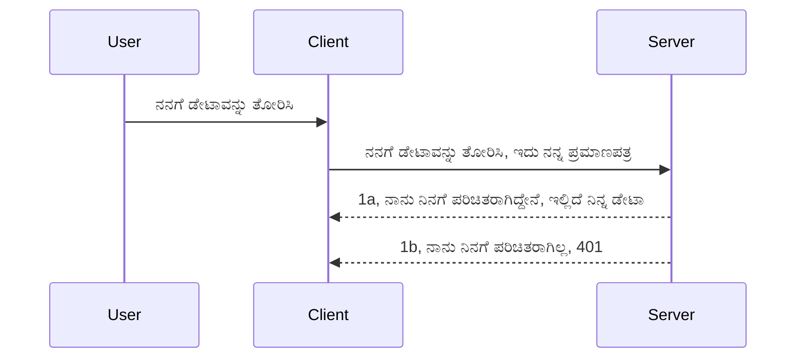

# ಸಿಂಪಲ್ auctor

MCP SDKಗಳು OAuth 2.1 ಬಳಸುವುದನ್ನು ಬೆಂಬಲಿಸುತ್ತವೆ, ಇದು ಅನುಸರಿಸುವ ಪ್ರಕ್ರಿಯೆ ಬಹುಪಾಲು ತಜ್ಞತೆಯನ್ನು ಒಳಗೊಂಡಿದೆ, ಉದಾಹರಣೆಗೆ auth ಸರ್ವರ್, resource ಸರ್ವರ್, ಕ್ರೆಡೆನ್ಷಿಯಲ್ಸ್ ಪೋಸ್ಟ್ ಮಾಡುವುದು, ಕೋಡ್ ಪಡೆಯುವುದು, ಕೋಡ್ ಬೇರರ್ ಟೋಕೆನ್‌ಗಾಗಿ ವಿನಿಮಯ ಮಾಡಿಕೊಳ್ಳುವುದು ಮತ್ತು ಕೊನೆಗೆ ನೀವು resource ಡೇಟಾವನ್ನು ಪಡೆದುಕೊಳ್ಳಬಹುದು. ನೀವು OAuthಗೆ 익숙ರಾಗಿಲ್ಲದಿದ್ದರೆ, ಅದನ್ನು ಅಳವಡಿಸುವುದು ಉತ್ತಮ ಸಂಗತಿ, ಆದರೆ ಪ್ರಾಥಮಿಕ ಮಟ್ಟದ auth ಅನ್ನು ಪ್ರಾರಂಭಿಸುವುದು ಮತ್ತು ಉತ್ತಮ ಸುರಕ್ಷತೆಯನ್ನು ನಿರ್ಮಿಸುವುದು ಉತ್ತಮ. ಅದಕ್ಕಾಗಿ ಈ ಅಧ್ಯಾಯವಿದೆ, ನಿಮ್ಮನ್ನು ಹೆಚ್ಚು ಆಧುನಿಕ auth ಗೆ ಉತ್ತೇಜಿಸುವುದು.

## Auth ಎಂದರೆ ಏನು?

Auth ಎಂದರೆ authentication ಮತ್ತು authorization. ಉದ್ದೇಶ ಭಿನ್ನ ಎರಡು ಕೆಲಸಗಳು:

- **Authentication**, ಇದು ನಾವು ಯಾವೊಬ್ಬನನ್ನು ನಮ್ಮ ಮನೆಗೆ ಪ್ರವೇಶಿಸಬಯಸುವೆವು ಎಂದು ಖಚಿತಪಡಿಸಿಕೊಳ್ಳುವುದರ ಪ್ರಕ್ರಿಯೆ, ಅವರು "ಇಲ್ಲಿ" ಇರುವ ಹಕ್ಕು ಹೊಂದಿದ್ದಾರೆ ಎಂದರೆ ನಮ್ಮ resource ಸರ್ವರ್ನಲ್ಲಿ MCP ಸರ್ವರ್ ವೈಶಿಷ್ಟ್ಯಗಳ ವೀಕ್ಷಣೆ ಮಾಡುವ ಹಕ್ಕು ಹೊಂದಿದ್ದಾರೆ ಎಂದು ಪರಿಶೀಲಿಸುವುದು.
- **Authorization**, ಇದು ಬಳಕೆದಾರನು ಅವನು ಕೇಳುತ್ತಿರುವ ಈ ನಿರ್ದಿಷ್ಟ ಸಂಪನ್ಮೂಲಗಳಿಗೆ ಪ್ರವೇಶ ಹೊಂದಬೇಕೇ ನೋಡುವುದು, ಉದಾಹರಣೆಗೆ ಈ ಆದೇಶಗಳು ಅಥವಾ ಈ ಉತ್ಪನ್ನಗಳನ್ನೂ ಅಥವಾ ಅವನು ಈ ವಿಷಯವನ್ನುೊ ಓದಬಹುದು ಆದರೆ ಅಳಿಸಲು ಹಕ್ಕಿಲ್ಲ ಎಂದು ಇನ್ನೊಂದು ಉದಾಹರಣೆ.

## ಕ್ರೆಡೆನ್ಷಿಯಲ್ಸ್: ನಾವು ವ್ಯವಸ್ಥೆಗೆ ನಾವು ಯಾರು ಎಂದು ಹೇಳುವುದು ಹೇಗೆ

ಬಹುತೇಕ ವೆಬ್ ಡೆವಲಪರ್‌ಗಳು ಸರ್ವರ್‌ಗೆ ಕ್ರೆಡೆನ್ಷಿಯಲ್ ಒದಗಿಸುವ ವಿಷಯವನ್ನು ಯೋಚಿಸುತ್ತಾರೆ, ಸಾಮಾನ್ಯವಾಗಿ ಗುಪ್ತ ಸಂರಕ್ಷಣೆಯೊಂದಿಗೆ, ಇದು ಅವರಿಗೆ "Authentication" ಆಗಿ ಇಲ್ಲಿ ಇರಲು ಅನುಮತಿಸುತ್ತದೆ ಎಂದು ಸೂಚಿಸುತ್ತದೆ. ಈ ಕ್ರೆಡೆನ್ಷಿಯಲ್ ಸಾಮಾನ್ಯವಾಗಿ ಬಳಕೆದಾರಹೆಸರು ಮತ್ತು ಗುಪ್ತಪದದ base64 ಎನ್ಕೋಡ್ ಮಾಡಿದ ಆವೃತ್ತಿ ಅಥವಾ ವಿಶಿಷ್ಟವಾಗಿ ಒಂದು ಬಳಕೆದಾರರನ್ನು ಗುರುತಿಸುವ API ಕೀ ಆಗಿರುತ್ತದೆ.

ಇದನ್ನು "Authorization" ಎಂಬ ಹೆಡರ್ ಮೂಲಕ ಕಳುಹಿಸಲಾಗುತ್ತದೆ ಹೀಗಿದೆ:

```json
{ "Authorization": "secret123" }
```
  
ಹೆಸರಾಂತವಾಗಿ ಇದನ್ನು ಬೈಸಿಕ್ Authentication ಎಂದು ಕರೆಯುತ್ತಾರೆ. ಇದು ಹೇಗೆ ಕೆಲಸ ಮಾಡುತ್ತದೆ ಎಂಬುದು ಕೆಳಗಿನಂತಿದೆ:


ಇದನ್ನು ನಾವು ಪ್ರಕ್ರಿಯಾತ್ಮಕ ದೃಷ್ಟಿಯಿಂದ ಅರ್ಥಮಾಡಿಕೊಂಡಿದೆ, ಅದನ್ನು ನಾವು ಹೇಗೆ ಜಾರಿಗೆ ತರುವುದೆ? ಬಹುತೇಕ ವೆಬ್ ಸರ್ವರ್‌ಗಳು middleware ಎಂಬ ಕಲ್ಪನೆಯನ್ನು ಹೊಂದಿವೆ, ಇದೊಂದು ಕೋಡ್ ಭಾಗವನ್ನು ಬರೆದು ಅಪೀಸ್ ಮೂಲಕ credentails ಪರಿಶೀಲಿಸುತ್ತದೆ, ಮತ್ತು ಅವು ಮಾನ್ಯವಾಗದಿದ್ದರೆ, ವಿನಂತಿಯೇ ಅಲ್ಲಿ ತಡೆ ಹಾಕುತ್ತದೆ. middlewareಯನ್ನು ಹೇಗೆ ಜಾರಿಗೆ ತರುವುದೆ ನೋಡೋಣ:

**Python**

```python
class AuthMiddleware(BaseHTTPMiddleware):
    async def dispatch(self, request, call_next):

        has_header = request.headers.get("Authorization")
        if not has_header:
            print("-> Missing Authorization header!")
            return Response(status_code=401, content="Unauthorized")

        if not valid_token(has_header):
            print("-> Invalid token!")
            return Response(status_code=403, content="Forbidden")

        print("Valid token, proceeding...")
       
        response = await call_next(request)
        # ಯಾವುದೇ ಗ್ರಾಹಕ ಹೆಡರ್‌ಗಳನ್ನು ಸೇರಿಸಿ ಅಥವಾ ಪ್ರತಿಕ್ರಿಯೆಯಲ್ಲಿ ಯಾವುದೋ ರೀತಿಯಲ್ಲಿ ಬದಲಾವಣೆ ಮಾಡಿ
        return response


starlette_app.add_middleware(CustomHeaderMiddleware)
```
  
ಇಲ್ಲಿ:

- `AuthMiddleware` ಎಂಬ ಮಿಡಲ್‌ವೇರ್ ಅನ್ನು ರಚಿಸಲಾಗಿದೆ, ಅದರ `dispatch` ಪದ್ಧತಿ ವೆಬ್ ಸರ್ವರ್ ಮೂಲಕ ಕರೆಮಾಡಲ್ಪಡುತ್ತಿದೆ.
- middleware ಅನ್ನು ವೆಬ್ ಸರ್ವರ್‌ಗೆ ಸೇರಿಸಲಾಗಿದೆ:

    ```python
    starlette_app.add_middleware(AuthMiddleware)
    ```
  
- Authorization ಹೆಡರ್ ಇರುವುದನ್ನು ಹಾಗೂ ಕಳುಹಿಸಲಾದ ಗುಪ್ತವು ಮಾನ್ಯವಾಗಿದೆಯೇ ಎಂದು ಪರಿಶೀಲಿಸುವ ಲಾಜಿಕ್ಸ್ ಬರೆದಿದೆ:

    ```python
    has_header = request.headers.get("Authorization")
    if not has_header:
        print("-> Missing Authorization header!")
        return Response(status_code=401, content="Unauthorized")

    if not valid_token(has_header):
        print("-> Invalid token!")
        return Response(status_code=403, content="Forbidden")
    ```
  
    ಗುಪ್ತವು ಯಾವಾಗ Present ಆಗಿ ಮಾನ್ಯವಾದರೆ, `call_next` ಅನ್ನು ಕರೆಸಿ ವಿನಂತಿಯನ್ನು ಮುಂದುವರೆಸಲು ಅವಕಾಶ ನೀಡುತ್ತೇವೆ ಮತ್ತು ಪ್ರತಿಕ್ರಿಯೆಯನ್ನು ಹಿಂತೆಗೆದುಕೊಳ್ಳುತ್ತೇವೆ.

    ```python
    response = await call_next(request)
    # ಯಾವುದೇ ಗ್ರಾಹಕ ಶೀರ್ಷಿಕೆಗಳನ್ನು ಸೇರಿಸಿ ಅಥವಾ ಉತ್ತರದಲ್ಲಿ ಯಾವುದೇ ರೀತಿಯಲ್ಲಿ ಬದಲಾವಣೆ ಮಾಡಿ
    return response
    ```
  
ಈ ವಿಧಾನದಲ್ಲಿ, ಯಾವಾಗಲೂ ವೆಬ್‌ ವಿನಂತಿ ಸರ್ವರ್ ಕಡೆಗೆ ಬರುವಾಗ middleware ಆಗಿ ಕಾರ್ಯನಿರ್ವಹುತ್ತದೆ ಮತ್ತು ಅದರ ಜಾರಿಗೆ ಅನುಸಾರ, ಅದು ಅಥವಾ ವಿನಂತಿಯನ್ನು ಮುಂದುವರಿಸಲು ಅವಕಾಶ ಮಾಡಿಕೊಡುತ್ತದೆ ಅಥವಾ ಗ್ರಾಹಕನು ಮುಂದುವರಿಯಲು ಅನುಮತಿಸದ ಊಹಾಪೋಹ ದೋಷ ಸಂದೇಶವನ್ನು ಹಿಂದಿರುಗಿಸುತ್ತದೆ.

**TypeScript**

ಇಲ್ಲಿ ನಾವು ಜನಪ್ರಿಯ ಫ್ರೇಮ್ವರ್ಕ್ Expressನೊಂದಿಗೆ middleware ರಚಿಸಿ MCP ಸರ್ವರ್‌ಗೆ ಮುಂಚಿತ ಮನವಿ ದಡೆಹಿಡಿಯುತ್ತೇವೆ. ಇದರ ಕೋಡ್ ಹೀಗಿದೆ:

```typescript
function isValid(secret) {
    return secret === "secret123";
}

app.use((req, res, next) => {
    // 1. ಪ್ರಾಧಿಕರಣ ಶೀರ್ಷಿಕೆ ಲಭ್ಯವಿದೆಯೆ?
    if(!req.headers["Authorization"]) {
        res.status(401).send('Unauthorized');
    }
    
    let token = req.headers["Authorization"];

    // 2. ಮಾನ್ಯತೆಯನ್ನು ಪರಿಶೀಲಿಸಿ.
    if(!isValid(token)) {
        res.status(403).send('Forbidden');
    }

   
    console.log('Middleware executed');
    // 3. ವಿನಂತಿ ಪೈಪ್ಲೈನ್‌ನ ಮುಂದಿನ ಹಂತಕ್ಕೆ ವಿನಂತಿಯನ್ನು ಕಳುಹಿಸಿ.
    next();
});
```
  
ಈ ಕೋಡ್‌ನಲ್ಲಿ ನಾವು:

1. ಮೊದಲು Authorization ಹೆಡರ್ ಪಡೆದಿದೆಯೇ ಎಂದು ಚೆಕ್ ಮಾಡುತ್ತೇವೆ, ಇಲ್ಲದಿದ್ದರೆ 401 ದೋಷ ಕಳುಹಿಸುತ್ತೇವೆ.
2. ಕ್ರೆಡೆನ್ಷಿಯಲ್ / ಟೋಕನ್ ಮಾನ್ಯವಾಗಿದೆಯೇ ಎಂದು ಖಚಿತಪಡಿಸುತ್ತೇವೆ, ಇಲ್ಲದಿದ್ದರೆ 403 ದೋಷ ಕಳುಹಿಸುತ್ತೇವೆ.
3. ಕೊನೆಗೆ ವಿನಂತಿಯನ್ನು ವಿನಂತಿಗಳ ಸರಣಿಯಲ್ಲಿ ಮುಂದುವರೆಸುತ್ತೇವೆ ಮತ್ತು ಬೇಡಿದ ಸಂಪನ್ಮೂಲವನ್ನು ಹಿಂತಿರುಗಿಸುತ್ತೇವೆ.

## ವ್ಯಾಯಾಮ: authentication ಜಾರಿಗೆ ತಂದು ಮುನ್ನಡೆಸಿರಿ

ನಮ್ಮ ಜ್ಞಾನವನ್ನು ಉಪಯೋಗಿಸಿ ಜಾರಿಗೆ ತರುವ ಪ್ರಯತ್ನ ಮಾಡೋಣ. ಯೋಜನೆಯ ರೂಪೆ:

ಸರ್ವರ್

- ವೆಬ್ ಸರ್ವರ್ ಮತ್ತು MCP ಇನ್ಸ್ಟೆನ್ಸ್ ರಚಿಸಿ.
- ಸರ್ವರ್‌ಗೆ middleware ಜಾರಿಗೆ ತರುವಿರಿ.

ಗ್ರಾಹಕ

- ಹೆಡರ್ ಮೂಲಕ ಕ್ರೆಡೆನ್ಷಿಯಲ್ ಕಳುಹಿಸಿ.

### -1- ವೆಬ್ ಸರ್ವರ್ ಮತ್ತು MCP ಇನ್ಸ್ಟೆನ್ಸ್ ರಚನೆ

ನಮ್ಮ ಮೊದಲ ಹಂತದಲ್ಲಿ, ವೆಬ್ ಸರ್ವರ್ ಇನ್ಸ್ಟೆನ್ಸ್ ಮತ್ತು MCP ಸರ್ವರ್ ರಚಿಸಬೇಕಾಗುತ್ತದೆ.

**Python**

ಇಲ್ಲಿ ನಾವು MCP ಸರ್ವರ್ ಇನ್ಸ್ಟೆನ್ಸನ್ನು ರಚಿಸಿ, starlette ವೆಬ್ ಅಪ್ಲಿಕೇಶನ್ ಮಾಡಿ, ಅದನ್ನು uvicorn ಮೂಲಕ ಹೋಸ್ಟ್ ಮಾಡುತ್ತೇವೆ.

```python
# MCP ಸರ್ವರ್ ಸೃಷ್ಟಿಸಲಾಗುತ್ತಿದೆ

app = FastMCP(
    name="MCP Resource Server",
    instructions="Resource Server that validates tokens via Authorization Server introspection",
    host=settings["host"],
    port=settings["port"],
    debug=True
)

# ಸ್ಟಾರ್ಲೆಟ್ ವೆಬ್ ಅಪ್ಲಿಕೇಶನ್ ಸೃಷ್ಟಿಸಲಾಗುತ್ತಿದೆ
starlette_app = app.streamable_http_app()

# ಯುವಿಕೋರ್ನ್ ಮೂಲಕ ಅಪ್ಲಿಕೇಶನ್ ಸೇವೆ ನೀಡಲಾಗುತ್ತಿದೆ
async def run(starlette_app):
    import uvicorn
    config = uvicorn.Config(
            starlette_app,
            host=app.settings.host,
            port=app.settings.port,
            log_level=app.settings.log_level.lower(),
        )
    server = uvicorn.Server(config)
    await server.serve()

run(starlette_app)
```
  
ಈ ಕೋಡ್‌ನಲ್ಲಿ:

- MCP ಸರ್ವರ್ ರಚಿಸಲಾಗಿದೆ.
- MCP ಸರ್ವರ್‌ನಿಂದ starlette ವೆಬ್ ಅಪ್ ರಚಿಸಲಾಗಿದೆ `app.streamable_http_app()`.
- uvicorn ಬಳಸಿ ಆಪ್ ಅನ್ನು ಹೋಸ್ಟ್ ಮಾಡಲಾಗಿದೆ ಮತ್ತು ಸೇವೆ ನೀಡಲಾಗಿದೆ `server.serve()`.

**TypeScript**

ಇಲ್ಲಿ ನಾವು MCP ಸರ್ವರ್ ಇನ್ಸ್ಟೆನ್ಸ್ ರಚಿಸುತ್ತೇವೆ.

```typescript
const server = new McpServer({
      name: "example-server",
      version: "1.0.0"
    });

    // ... ಸರ್ವರ್ ಸಂಪನ್ಮೂಲಗಳು, ಉಪಕರಣಗಳು ಮತ್ತು ಪ್ರಾಂಪ್ಟ್‌ಗಳನ್ನು ಹೊಂದಿಸಿ ...
```
  
ಈ MCP ಸರ್ವರ್ ರಚನೆ POST /mcp ರೌಟ್ ವ್ಯಾಖ್ಯಾನದಲ್ಲಿರಬೇಕು, ಆದ್ದರಿಂದ ಮೇಲಿನ ಕೋಡ್ ಅನ್ನು ಹಾಗೆ ವರ್ಗಾಯಿಸೋಣ:

```typescript
import express from "express";
import { randomUUID } from "node:crypto";
import { McpServer } from "@modelcontextprotocol/sdk/server/mcp.js";
import { StreamableHTTPServerTransport } from "@modelcontextprotocol/sdk/server/streamableHttp.js";
import { isInitializeRequest } from "@modelcontextprotocol/sdk/types.js"

const app = express();
app.use(express.json());

// ಸೆಷನ್ ಐಡಿಯನ್ನು ಆಧರಿಸಿ ಸಾರಿಗೆಗಳನ್ನು ಸಂಗ್ರಹಿಸಲು ಮ್ಯಾಪ್
const transports: { [sessionId: string]: StreamableHTTPServerTransport } = {};

// ಕ್ಲೈಂಟ್-ಟು-ಸರ್ವರ್ ಸಂವಹನಕ್ಕಾಗಿ POST ವಿನಂತಿಗಳನ್ನು ನಿರ್ವಹಿಸಿ
app.post('/mcp', async (req, res) => {
  // ಈಗಾಗಲೇ ಇರುವ ಸೆಷನ್ ಐಡಿ ಪರಿಶೀಲಿಸಿ
  const sessionId = req.headers['mcp-session-id'] as string | undefined;
  let transport: StreamableHTTPServerTransport;

  if (sessionId && transports[sessionId]) {
    // ಈಗಾಗಲೇ ಇರುವ ಸಾರಿಗೆಯನ್ನು ಮರುಬಳಕೆ ಮಾಡಿ
    transport = transports[sessionId];
  } else if (!sessionId && isInitializeRequest(req.body)) {
    // ಹೊಸ ಪ್ರಾರಂಭ ವಿನಂತಿ
    transport = new StreamableHTTPServerTransport({
      sessionIdGenerator: () => randomUUID(),
      onsessioninitialized: (sessionId) => {
        // ಸೆಷನ್ ಐಡಿಯಿಂದ ಸಾರಿಗೆ ಸಂಗ್ರಹಿಸಿ
        transports[sessionId] = transport;
      },
      // ಹಿಂದಿನ ಹೊಂದಾಣಿಕೆಗೆ ಡಿಎನ್ಎಸ್ ರಿಬೈಂಡಿಂಗ್ ರಕ್ಷಣೆ ಮೂಲತಃ ನಿಷ್ಕ್ರಿಯವಾಗಿದೆ. ನೀವು ಈ ಸರ್ವರ್ ಅನ್ನು
      // ಸ್ಥಳೀಯವಾಗಿ ನಡೆಸುತ್ತಿದ್ದರೆ, ಖಚಿತವಾಗಿಸುತ್ತೇವೆ:
      // enableDnsRebindingProtection: true,
      // allowedHosts: ['127.0.0.1'],
    });

    // ಮುಚ್ಚಿದಾಗ ಸಾರಿಗೆಯನ್ನು ಸ್ವಚ್ಛಗೊಳಿಸಿ
    transport.onclose = () => {
      if (transport.sessionId) {
        delete transports[transport.sessionId];
      }
    };
    const server = new McpServer({
      name: "example-server",
      version: "1.0.0"
    });

    // ... ಸರ್ವರ್ ಸಂಪನ್ಮೂಲಗಳು, ಉಪಕರಣಗಳು ಮತ್ತು ಪ್ರಾಂಪ್ಟ್‌ಗಳನ್ನು ವ್ಯವಸ್ಥೆಯಲ್ಲಿಡಿ ...

    // MCP ಸರ್ವರ್‌ಗೆ ಸಂಪರ್ಕಿಸು
    await server.connect(transport);
  } else {
    // ಅಮಾನ್ಯ ವಿನಂತಿ
    res.status(400).json({
      jsonrpc: '2.0',
      error: {
        code: -32000,
        message: 'Bad Request: No valid session ID provided',
      },
      id: null,
    });
    return;
  }

  // ವಿನಂತಿಯನ್ನು ನಿರ್ವಹಿಸಿ
  await transport.handleRequest(req, res, req.body);
});

// GET ಮತ್ತು DELETE ವಿನಂತಿಗಳಿಗಾಗಿ ಮರುಬಳಕೆ ಗೊಳ್ಳುವ ಹ್ಯಾಂಡ್ಲರ್
const handleSessionRequest = async (req: express.Request, res: express.Response) => {
  const sessionId = req.headers['mcp-session-id'] as string | undefined;
  if (!sessionId || !transports[sessionId]) {
    res.status(400).send('Invalid or missing session ID');
    return;
  }
  
  const transport = transports[sessionId];
  await transport.handleRequest(req, res);
};

// SSE ಮೂಲಕ ಸರ್ವರ್-ಟು-ಕ್ಲೈಂಟ್ ಸೂಚನೆಗಳಿಗೆ GET ವಿನಂತಿಗಳನ್ನು ನಿರ್ವಹಿಸಿ
app.get('/mcp', handleSessionRequest);

// ಸೆಷನ್ ಕೊನೆಯಗೊಳಿಸಲು DELETE ವಿನಂತಿಗಳನ್ನು ನಿರ್ವಹಿಸಿ
app.delete('/mcp', handleSessionRequest);

app.listen(3000);
```
  
ಈಗ ನೀವು ನೋಡುತ್ತಿದ್ದೀರಿ MCP ಸರ್ವರ ರಚನೆಯು `app.post("/mcp")` ಒಳಗಾಗಿವೆ.

ಮುಂದಿನ ಹಂತ middleware ರಚನೆಗೆ ಹೋಗೋಣ, ಆಮೇಲೆ ನಾವು ಕ್ರೆಡೆನ್ಷಿಯಲ್ ಮಾನ್ಯತೆಯನ್ನು ಪರಿಶೀಲಿಸೋಣ.

### -2- ಸರ್ವರ್‌ಗೆ middleware ಅನ್ನು ಜಾರಿಗೊಳಿಸುವುದು

ಈಗ middleware ಹಂತಕ್ಕೆ ಹೋಗೋಣ. ಇಲ್ಲಿ ನಾವು middleware ರಚಿಸುತ್ತೇವೆ, ಅದರಲ್ಲಿ `Authorization` ಹೆಡರ್ ನಲ್ಲಿ ಕ್ರೆಡೆನ್ಷಿಯಲ್ ಅರನೇಬೇಕು ಮತ್ತು ಅದನ್ನು ಮಾನ್ಯತೆ ಪರಿಶೀಲಿಸುವುದು. ಮಾನ್ಯವಾದರೆ, ವಿನಂತಿಯನ್ನು ಮುಂದುವರಿಸುವುದು (ಉದಾಹರಣೆಗೆ, ಟೂಲ್ಸ್ ಪಟ್ಟಿ ಮಾಡುವುದು, a resource ಓದುವುದು ಅಥವಾ MCP ವೈಶಿಷ್ಟ್ಯ ಬೇಡಿಕೆಯನ್ನು ಮಾಡಲು).

**Python**

middleware ರಚಿಸಲು, `BaseHTTPMiddleware` ವರ್ಗದಿಂದ ಕ್ಲಾಸ್ ವಂಶಾವಳಿಯಾಗಬೇಕು. ಎರಡು ಆಸಕ್ತಿದಾಯಕ ಭಾಗಗಳಿವೆ:

- ವಿನಂತಿ `request` , ನಾವು ಹೆಡರ್ ಮಾಹಿತಿ ಅಂದವಲಿಸಲಾಗುತ್ತದೆ.
- `call_next` ಕಾಲ್‌ಬ್ಯಾಕ್, ಇದು ಸತ್ಯಾಪಿತ ಕ್ರೆಡೆನ್ಷಿಯಲ್ ಬಂದರೆ ಕರೆ ಮಾಡಬೇಕು.

ಮೊದಲು, `Authorization` ಹೆಡರ್ ಇಲ್ಲದಿದ್ದಲ್ಲಿ ಹೇಗೆ ನಿರ್ವಹಿಸುವುದು ನೋಡೋಣ:

```python
has_header = request.headers.get("Authorization")

# ಯಾವುದೇ ಹೆಡರ್ ಇಲ್ಲ, 401 ಮೂಲಕ ವಿಫಲಗೊಳ್ಳಿ, ಇಲ್ಲದಿದ್ದರೆ ಮುಂದುವರಿಯಿರಿ.
if not has_header:
    print("-> Missing Authorization header!")
    return Response(status_code=401, content="Unauthorized")
```
  
ಗ್ರಾಹಕರ authentication ವಿಫಲವಾಗುತ್ತಿದ್ದರಿಂದ 401 unauthorized ಸಂದೇಶ ಕಳುಹಿಸುತ್ತೇವೆ.

ನಂತರ, ಕ್ರೆಡೆನ್ಷಿಯಲ್ ಸಲ್ಲಿಸಿದರೆ, ಅದನ್ನು ಮಾನ್ಯತೆ ಪರಿಶೀಲಿಸಬೇಕು ಹೀಗಿವೆ:

```python
 if not valid_token(has_header):
    print("-> Invalid token!")
    return Response(status_code=403, content="Forbidden")
```
  
ಮೇಲಿನಂತೆ 403 forbidden ಸಂದೇಶ ಕಳುಹಿಸುವುದನ್ನು ಗಮನಿಸಿ. ನಾವು ಪೂರ್ಣ middleware ಕೆಳಗಿನಂತಿದೆ:

```python
class AuthMiddleware(BaseHTTPMiddleware):
    async def dispatch(self, request, call_next):

        has_header = request.headers.get("Authorization")
        if not has_header:
            print("-> Missing Authorization header!")
            return Response(status_code=401, content="Unauthorized")

        if not valid_token(has_header):
            print("-> Invalid token!")
            return Response(status_code=403, content="Forbidden")

        print("Valid token, proceeding...")
        print(f"-> Received {request.method} {request.url}")
        response = await call_next(request)
        response.headers['Custom'] = 'Example'
        return response

```
  
ಚೆನ್ನಾಗಿದೆ, ಆದರೆ `valid_token` ಫಂಕ್ಷನ್ ಹೇಗೆ? ಅದು ಕೆಳಗಿನಂತಿದೆ:

```python
# ಉತ್ಪಾದನೆಗಾಗಿ ಬಳಸಿ ಬೇಡಿ - ಅದನ್ನು ಸುಧಾರಿಸಿ !!
def valid_token(token: str) -> bool:
    # "Bearer "ಮುಖಪಟವನ್ನು ತೆಗೆದುಹಾಕಿ
    if token.startswith("Bearer "):
        token = token[7:]
        return token == "secret-token"
    return False
```
  
ಇದು ಸ್ಪಷ್ಟವಾಗಿ ಸುಧಾರಣೆ ಆಯುಕ್ತ.

IMPORTANT: ಈ ರೀತಿಯ ಗುಪ್ತಗಳನ್ನು ನೀವು ಕೋಡ್‌ನಲ್ಲಿ ಇರಿಸಬಾರದು. ನಿಮ್ಮ ಸಾಧಾರಣವಾಗಿ ಈ ಮೌಲ್ಯವನ್ನು ಡೇಟಾ ಮೂಲದಿಂದ ಅಥವಾ IDP (identity service provider) ಯಿಂದ ಪಡೆಯುವುದು ಉತ್ತಮ, ಅಥವಾ IDP ನಿಂದಲೇ ಮಾನ್ಯತೆ ನಿರ್ವಹಿಸಿಕೊಳ್ಳಿ.

**TypeScript**

Express middleware ಜಾರಿಗೆ `use` ವಿಧಾನವನ್ನು ಕಾಲ್ ಮಾಡಬೇಕು.

ನಾಗಬೇಕಾದವುಗಳು:

- ವಿನಂತಿ ವೇರಿಯಬಲ್ ಮೂಲಕ ಕ್ರೆಡೆನ್ಷಿಯಲ್ ಅನ್ನು `Authorization` ಗುಣಲಕ್ಷಣದಲ್ಲಿ ಪರಿಶೀಲನೆ.
- ಮಾನ್ಯತೆ ಮಾಡಿದರೆ request ಮುಂದುವರೆಸಿ ಗ್ರಾಹಕ ಬೇಡಿಕೆಯನ್ನು MCP ವೈಶಿಷ್ಟ್ಯಕ್ಕೆ ಅನುಗುಣವಾಗಿ ನೆರವೇರಿಸುವುದು.

ನಾವು ಪರೀಕ್ಷಿಸುವುದು `Authorization` ಹೆಡರ್ ಇದೆ ಎಂದು, ಇಲ್ಲದಿದ್ದರೆ ವಿನಂತಿಯನ್ನು ತಡೆಹಿಡಿಯಬೇಕಾದುದು ಹೀಗಿದೆ:

```typescript
if(!req.headers["authorization"]) {
    res.status(401).send('Unauthorized');
    return;
}
```
  
ಪ್ರಾಥಮಿಕವಾಗಿ ಹೆಡರ್ ಇಲ್ಲದಿದ್ದರೆ 401 ತೋರಿಸಲಾಗುತ್ತದೆ.

ನಂತರ ಮಾನ್ಯತೆ ಪರಿಶೀಲನೆ, ಗ್ರಾಹಕ ಅರ್ಥಪಡಿದಂತೆ 403 ದೋಷ ಸಿಗುತ್ತದೆ:

```typescript
if(!isValid(token)) {
    res.status(403).send('Forbidden');
    return;
} 
```
  
ಈಗ ನೀವು 403 ದೋಷ ಪಡೆಯುತ್ತೀರಿ.

ಪೂರ್ಣ ಕೋಡ್ ಹೀಗಿದೆ:

```typescript
app.use((req, res, next) => {
    console.log('Request received:', req.method, req.url, req.headers);
    console.log('Headers:', req.headers["authorization"]);
    if(!req.headers["authorization"]) {
        res.status(401).send('Unauthorized');
        return;
    }
    
    let token = req.headers["authorization"];

    if(!isValid(token)) {
        res.status(403).send('Forbidden');
        return;
    }  

    console.log('Middleware executed');
    next();
});
```
  
ಮೇಲಿನಂತೆ, ನಾವು ವೆಬ್ ಸರ್ವರ್‌ಗಿಂತ middleware ಅಳವಡಿಸಿಕೊಂಡಿದ್ದೇವೆ, ಗ್ರಾಹಕನು ಕಳುಹಿಸುವ ಕ್ರೆಡೆನ್ಷಿಯಲ್ ಪರಿಶೀಲಿಸಲು. ಗ್ರಾಹಕನೇನು ಮಾಡುತ್ತಿದೆ?

### -3- ಹೆಡರ್ ಮೂಲಕ ಕ್ರೆಡೆನ್ಷಿಯಲ್ ಕಳುಹಿಸಲು ವೆಬ್ ವಿನಂತಿ ಕಳುಹಿಸಿ

ಗ್ರಾಹಕನು ಕ್ರೆಡೆನ್ಷಿಯಲ್ ಹೆಡರ್ ಮೂಲಕ ಕಳುಹಿಸುತ್ತಿರುವುದನ್ನು ಖಚಿತಪಡಿಸಿಕೊಳ್ಳಬೇಕು. MCP ಗ್ರಾಹಕ ಬಳಸಿ ಹೇಗೆ ಮಾಡುವುದೆ ನೋಡೋಣ.

**Python**

ಗ್ರಾಹಕಕ್ಕೆ ಹೆಡರ್ ಕಳುಹಿಸುವಂತೆ ಹೀಗಾಗಿರಬೇಕಾಗಿದೆ:

```python
# ಮೌಲ್ಯವನ್ನು ಕಠಿಣವಾಗಿ ನಿರ್ಧರಿಸಬೇಡಿ, ಕನಿಷ್ಠ ಪರಿಸರ ಚರಲ್ಯದಲ್ಲಿ ಅಥವಾ ಹೆಚ್ಚು ಭದ್ರ ಸಂಗ್ರಹಣೆಯಲ್ಲಿ ಇರಿಸಿ
token = "secret-token"

async with streamablehttp_client(
        url = f"http://localhost:{port}/mcp",
        headers = {"Authorization": f"Bearer {token}"}
    ) as (
        read_stream,
        write_stream,
        session_callback,
    ):
        async with ClientSession(
            read_stream,
            write_stream
        ) as session:
            await session.initialize()
      
            # ಮಾಡಬೇಕಾದ ಕೆಲಸ, ಗ್ರಾಹಕದಲ್ಲಿ ನೀವು ಏನು ಮಾಡಿಸಿಕೊಳ್ಳಲು ಬಯಸುತ್ತೀರಿ, ಉದಾ: ಸಾಧನಗಳನ್ನು ಪಟ್ಟಿ ಮಾಡುವುದು, ಸಾಧನಗಳನ್ನು ಕರೆ ಮಾಡುವುದು ಇತ್ಯಾದಿ.
```
  
`headers` ಗುಣಲಕ್ಷಣವನ್ನು ಆಗಾಗ `headers = {"Authorization": f"Bearer {token}"}` ಎನ್ನುತ್ತೇವೆ ನೋಡಿ.

**TypeScript**

ಇದನ್ನು ಎರಡು ಹಂತಗಳಲ್ಲಿ ನಿಭಾಯಿಸಬಹುದು:

1. ನಮ್ಮ ಕ್ರೆಡೆನ್ಷಿಯಲ್ ತೆರುವುದುКонfiguration ವಸ್ತು.
2. ಆ ವಸ್ತುವನ್ನು transport ಗೆ ಪಾಸ್ ಮಾಡುವುದು.

```typescript

// ಇಲ್ಲಿ ತೋರಿಸಿರುವಂತೆ ಮೌಲ್ಯವನ್ನು ಕಠಿಣ ಕೋಡ್ ಮಾಡಬೇಡಿ. ಕನಿಷ್ಠ ಅದನ್ನು ಪರಿಸರ ಚರ ವೈಜ್ಞಾನಿಕವಾಗಿ ಇಟ್ಟಿರಿಸಿ ಮತ್ತು ಡಾಟ್‌ಎನ್ವ್‌ (ವಿಕಸನ ಮಾರುಕಟ್ಟೆಯಲ್ಲಿ) ಬಳಸಿ.
let token = "secret123"

// ಗ್ರಾಹಕ ಸಾರಿಗೆ ಆಯ್ಕೆ ವಸ್ತುವನ್ನು ವ್ಯಾಖ್ಯಾನಿಸಿ
let options: StreamableHTTPClientTransportOptions = {
  sessionId: sessionId,
  requestInit: {
    headers: {
      "Authorization": "secret123"
    }
  }
};

// ಆಯ್ಕೆ ವಸ್ತುವನ್ನು ಸಾರಿಗೆಗೆ ನೀಡಿರಿ
async function main() {
   const transport = new StreamableHTTPClientTransport(
      new URL(serverUrl),
      options
   );
```
  
ಮೇಲಿನಂತೆ, ನಾವು `options` ವಸ್ತುವನ್ನು ರಚಿಸಿ ಅದರ `requestInit` ಗುಣಲಕ್ಷಣದ ಅಡಿಯಲ್ಲಿ ಹೆಡರ್‌ಗಳನ್ನು ಸೇರಿಸಿದ್ದೇವೆ.

IMPORTANT: ಇದರಿಂದ ಮೇಲೆ ಸುಧಾರಣೆ ಹೇಗೆ ಮಾಡುವುದು? ಪ್ರಸ್ತುತ ಜಾರಿಗೆ ಕೆಲವು ಸಮಸ್ಯೆಗಳಿವೆ. ಮುಂಚಿತವಾಗಿ, ಈ ರೀತಿಯ ಕ್ರೆಡೆನ್ಷಿಯಲ್ ಕಳುಹಿಸುವುದು ಅಪಾಯಕಾರಕ, ಕನಿಷ್ಠ ನೀವು HTTPS ಬಳಸಿ ಇರಬೇಕು. ಆದರೂ ಸಹ, ಟೋಕನ್ ಕಳವು ಆಗಬಹುದು, ಸೂಕ್ತಪಡಿಸಲು ಇದನ್ನು ರದ್ದುಮಾಡಲು ಆಯೆ ವ್ಯವಸ್ಥೆ ಬೇಕು, ಮತ್ತು ಹೆಚ್ಚುವರಿ ತಪಾಸಣೆಗಳನ್ನು ಜೋಡಿಸಬೇಕಾಗುತ್ತದೆ, ಉದಾಹರಣೆಗೆ: ಇವುಗಳು ಎಲ್ಲಿಂದ ಬರುವುದು, ವಿನಂತಿ ತುಂಬಾ ಆದಿ ಮತ್ ಬಹಿರ್ಭಾವ (ಬೋಟಿನಂತೆ) ಉಳಿದಂತೆ. 

ಹಾಗಾದರೆಹಾಗೆ, ಬಹಳ ಸರಳ APIಗಳಿಗೆ, ನೀವು ಯಾರಿಗೂ ಯಾವಾಗಲೂ authenticated ಆಗದೆ ನಿಮ್ಮ API ಕರೆ ಮಾಡಲು ಬಿಡದಿರಲು ಇದು ಉತ್ತಮ ಆರಂಭ.

ಇದನ್ನು ಗಮನಿಸಿ, ನಮಗೆ ಭದ್ರತೆ ಸ್ವಲ್ಪ ಹೆಚ್ಚಿಸಲು ನಾವು JSON ವೆಬ್ ಟೋಕನ್ ಅನ್ನು ಬಳಸುತೇವೆ, ಅದೇ JWT ಅಥವಾ "ಜೋಟ್" ಟೋಕನ್ ಎನ್ನುವುದು.

## JSON ವೆಬ್ ಟೋಕನ್ಸ್, JWT

ಹಾಗಾದರೆ, ನಾವು ಸರಳ ಕ್ರೆಡೆನ್ಷಿಯಲ್ ಕಳುಹಿಸುವಿಕೆಯಿಂದ ಸುಧಾರಣೆ ಮಾಡೋಣ. JWTವನ್ನು ಅಳವಡಿಸುವುದರ ಜಯಧಾಕ್ಷತೆಗಳೇನು?

- **ಭದ್ರತೆ ಸುಧಾರಣೆಗಳು**. ಮೂಲ auth ನಲ್ಲಿ ಬಳಕೆದಾರಹೆಸರು ಮತ್ತು ಗುಪ್ತಪದವನ್ನು base64 ಎನ್ಕೋಡ್ ಆಗಿ ಬಹಳ ಬಾರಿ ಕಳುಹಿಸಲಾಗುತ್ತದೆ (ಅಥವಾ API ಕೀ ಅನ್ನು), ಇದು ಅಪಾಯ ಹೆಚ್ಚಿಸುತ್ತದೆ. JWT ಬಳಸಿ ನೀವು ಒಂದು ಟೋಕನ್ ಪಡೆಯುತ್ತೀರಿ ಮತ್ತು ಅವು ಸಮಯ-ಬದ್ಧ ಆಗಿದ್ದು ಅವು ಅವಧಿ ಮುಗಿಯುತ್ತವೆ. JWT ನೀವು ಸೂಕ್ಷ್ಮ ಪ್ರವೇಶ ನಿಯಂತ್ರಣವಾಗಿ roles, scopes ಮತ್ತು permissions ಬಳಸಲು ಅನುಮತಿಸುತ್ತದೆ.
- **ಸ್ಥಿತಿಸ್ವತಂತ್ರತೆ ಮತ್ತು ವಿಸ್ತರಣೆಯ ಮಿತಿಗೆ ತಕ್ಕಂತೆ**. JWT ಸ್ವಯಂ ಹೊಂದಿರುವುದು, ಎಲ್ಲಾ ಬಳಕೆದಾರ ಮಾಹಿತಿ ಹೊತ್ತಿದೆ, ಸರ್ವರ್-ಪಕ್ಕದ ಸೆಷನ್ ಸಂಗ್ರಹಣೆ ಬೇಕಿಲ್ಲ. ಟೋಕನ್ ಅನ್ನು ಸ್ಥಳೀಯವಾಗಿ ಮಾನ್ಯಗೊಳಿಸಬಹುದು.
- **ಇಂಟರ್‌ಆಪರೇಬಿಲಿಟಿ ಮತ್ತು ಫೆಡರೇಶನ್**. JWT Open ID Connect ನ ಕೇಂದ್ರಭಾಗವಾಗಿದೆ ಮತ್ತು Entra ID, Google Identity ಮತ್ತು Auth0 ಮುಂತಾದ ಪ್ರಖ್ಯಾತ ಗುರುತಿನ ಪೂರೈಕೆದಾರರೊಂದಿಗೆ ಉಪಯೋಗಿಸಲಾಗುತ್ತದೆ. ಸಮಗ್ರ ಸಿಂಗಲ್ ಸೈನ್-ಅನ್ ಮತ್ತು ಹೆಚ್ಚುವರಿ ವೈಶಿಷ್ಟ್ಯಗಳೊಂದಿಗೆ उदಯೋಗ-ಮಟ್ಟದ ಅನುಭವ ನೀಡುತ್ತದೆ.
- **ಮాడ್ಯೂಲಾರಿಟಿ ಮತ್ತು ನಮ್ಯತೆ**. JWT API ಗೇಟವೇಗಳು ಉದಾ. Azure API Management, NGINX ಸೇರಿದಂತೆ ಉಪಯೋಗಿಸಬಹುದು. ಅದು ಉಪಯೋಜನೆ ಪ್ರಕ್ರಿಯೆಗಳಲ್ಲಿ ಮತ್ತು ಸರ್ವರ್-ಟೂ-ಸರ್ವೀಸ್ ಸಂವಹನದಲ್ಲಿ ಕೂಡ ಬೆಂಬಲ ನೀಡುತ್ತದೆ.
- **ಕಾರ್ಯಕ್ಷಮತೆ ಮತ್ತು ಕ್ಯಾಚಿಂಗ್**. JWT ಡಿಕೋಡ್ ಆದ ನಂತರ ಕ್ಯಾಚ್ ಮಾಡಬಹುದು; ಇದರಿಂದ ವಿಶ್ಲೇಷಣೆ ಅಗತ್ಯತೆ ಕಡಿಮೆಗೊಳ್ಳುತ್ತದೆ. ಹೆಚ್ಚಿನ ಸಂಚಾರ ಇರುವ ಅಪ್ಲಿಕೇಶನ್‌ಗಳಿಗೆ throughput ಹೆಚ್ಚಿಸುತ್ತದೆ ಮತ್ತು ಮೂಲಭೂತ ಉಪಕರಣದ ಮೇಲೆ ಒತ್ತಡ ಕಡಿಮೆ ಮಾಡುತ್ತದೆ.
- **ಆಧುನಿಕ ವೈಶಿಷ್ಟ್ಯಗಳು**. ಇದು introspection (ಸರ್ವರ್ ಮೇಲ್ವಿಚಾರಣೆ) ಮತ್ತು revocation (ಟೋಕನ್ ಅಮಾನ್ಯಗೊಳಿಸುವಿಕೆ) ಸಹ ಬೆಂಬಲಿಸುತ್ತದೆ.

ಈ ಎಲ್ಲಾ ಲಾಭಗಳೊಂದಿಗೆ, ನಾವು ನಮ್ಮ ಜಾರಿಗೆ ಮತ್ತಷ್ಟು ಮುಂದುವರಿಯೋಣ.

## ಬಿಸಿಕ್ auth ನಿಂದ JWTಗೆ ಪರಿವರ್ತನೆ

ಮುಖ್ಯ ಬದಲಾವಣೆಗಳನ್ನು ನೋಡಿದರೆ:

- **JWT ಟೋಕನ್ ರಚಿಸಲು ಕಲಿಯಿರಿ**, ಮತ್ತು ಅದನ್ನು ಗ್ರಾಹಕದಿಂದ ಸರ್ವರ್‌ಗೆ ಕಳುಹಿಸಲು ಸಿದ್ಧಮಾಡಿ.
- **JWT ಟೋಕನ್ ಸತ್ಯಾಪಿಸಿ**, ಮತ್ತು ಸರಿಯಾದರೆ ಗ್ರಾಹಕನು ಸಂಪನ್ಮೂಲಗಳಿಗೆ ಪ್ರವೇಶಿಸಲಿ.
- **ಟೋಕನ್ ಸುರಕ್ಷಿತ ಸಂಗ್ರಹಣೆ**. ನಾವು ಟೋಕನನ್ನು ಹೇಗೆ ಸಂಗ್ರಹಿಸುವುದು.
- **ರೌಟ್‌ಗಳನ್ನು ರಕ್ಷಿಸಲಿ**. ನಮ್ಮದಾಗಿ ರಕ್ಷಣೆ ಅಗತ್ಯವಿರುವ MCP ವೈಶಿಷ್ಟ್ಯಗಳಿಗೆ ಸಂರಕ್ಷಣೆ ಮಾಡಬೇಕು.
- **ರಿಫ್ರೆಶ್ ಟೋಕನ್ಗಳು ಸೇರಿಸಿ**. ಟೋಕನ್‌ಗಳು ಸ್ವಲ್ಪ ಕಾಲ ಮಾನ್ಯವಾಗಿ ಇರಬೇಕು, ಮತ್ತು ದೀರ್ಘಕಾಲ ಮಾನ್ಯ ವಿರುವ ರಿಫ್ರೆಶ್ ಟೋಕನ್ಗಳನ್ನು ನಿರ್ಮಿಸಿ ಅವುಗಳು ಟೋಕನ್ ಅವಧಿ ಆಯುಕ್ತಲ್ಲಿ ಹೊಸ ಟೋಕನ್ ಪಡೆಯಲು ಸಹಾಯ ಮಾಡಬೇಕು. ರಿಫ್ರೆಶ್ ಎנד್ಪಾಯಿಂಟ್ ಮತ್ತು ರೋಟೇಷನ್ ತಂತ್ರಗಳ ಸತ್ವಕವಲು.

### -1- JWT ಟೋಕನ್ ರಚನೆ

ಮೊದಲಿಗೆ, JWT ಟೋಕನ್ ಕೆಳಗಿನ ಭಾಗಗಳನ್ನು ಹೊಂದಿದೆ:

- **ಹೆಡರ್**, ಬಳಸಲಾದ ಆಲ್ಗೋರಿಥಮ್ ಮತ್ತು ಟೋಕನ್ ಪ್ರಕಾರ.
- **ಪೇಲೋಡ್**, ಕ್ಲೇಮ್ಸ್, eg: sub (ಟೋಕನ್ ಪ್ರತಿನಿಧಿಸುವ ಬಳಕೆದಾರ ಅಥವಾ ಘಟಕ; auth ಪರಿಸ್ಥಿತಿಯಲ್ಲಿ ಸಾಮಾನ್ಯವಾಗಿ user ID), exp (ಮೂರುಗಾಲ), role (ಪಾತ್ರ).
- **ಸಿಗ್ನೇಚರ್**, ಗುಪ್ತ ಅಥವಾ ಖಾಸಗಿ ಕೀ ಮೂಲಕ ಸಹಿ ಮಾಡಲ್ಪಟ್ಟಿದೆ.

ಹೆಡರ್, ಪೇಲೋಡ್ ಮತ್ತು ಎನ್ಕೋಡೆಡ್ ಟೋಕನ್ ರಚಿಸೋಣ.

**Python**

```python

import jwt
import jwt
from jwt.exceptions import ExpiredSignatureError, InvalidTokenError
import datetime

# JWT ಅನ್ನು ಸಹಿ ಮಾಡಲು ಬಳಸಲಾಗುವ ಗುಪ್ತ ಕೀ
secret_key = 'your-secret-key'

header = {
    "alg": "HS256",
    "typ": "JWT"
}

# ಬಳಕೆದಾರ ಮಾಹಿತಿ ಮತ್ತು ಅದರ ಹಕ್ಕುಗಳು ಮತ್ತು ಅವಧಿ ಕಾಲ
payload = {
    "sub": "1234567890",               # ವಿಷಯ (ಬಳಕೆದಾರ ID)
    "name": "User Userson",                # ಕಸ್ಟಮ್ ಹಕ್ಕು
    "admin": True,                     # ಕಸ್ಟಮ್ ಹಕ್ಕು
    "iat": datetime.datetime.utcnow(),# ನೀಡಲಾದ ಸಮಯ
    "exp": datetime.datetime.utcnow() + datetime.timedelta(hours=1)  # ಅವಧಿ ಕೊನೆಗೊಳ್ಳುವ ಸಮಯ
}

# ಅದನ್ನು ಸಂಕೇತರಿಸಿ
encoded_jwt = jwt.encode(payload, secret_key, algorithm="HS256", headers=header)
```
  
ಮೇಲೆ ಕೋಡ್‌ನಲ್ಲಿ:

- HS256 ಆಲ್ಗೋರಿಥಮ್ ಮತ್ತು JWT ಪ್ರಕಾರದ ಹೆಡರ್ ಹೊಂದಿದೆ.
- ಪೇಲೋಡ್‌ನಲ್ಲಿ ವಿಷಯ ಅಥವಾ ಬಳಕೆದಾರ ID, ಹೆಸರು, ಪಾತ್ರ, ನೀಡಿದ ಸಮಯ ಮತ್ತು ಅವಧಿ ಮುಗಿವಿನ ಸಮಯವನ್ನು ಸೂಚಿಸಲಾಗಿದೆ.

**TypeScript**

ನಾವು JWT ಟೋಕನ್ ರಚಿಸಲು ಕೆಲವು ಡಿಪೆಂಡೆನ್ಸಿಗಳನ್ನು ಬಳಸಬೇಕಾಗಿವೆ.

ಡಿಪೆಂಡೆನ್ಸಿಗಳು

```sh

npm install jsonwebtoken
npm install --save-dev @types/jsonwebtoken
```
  
ಈಗ ನಾವು ಹೆಡರ್, ಪೇಲೋಡ್ ರಚಿಸಿ ಕೋಡ್ ಮಾಡಿದ ಟೋಕನ್ ಪಡೆಯೋಣ.

```typescript
import jwt from 'jsonwebtoken';

const secretKey = 'your-secret-key'; // ಉತ್ಪಾದನೆಯಲ್ಲಿ env vars ಅನ್ನು ಬಳಸಿ

// ಪೇಲೋಡ್ ಅನ್ನು ವ್ಯಾಖ್ಯಾನಿಸಿ
const payload = {
  sub: '1234567890',
  name: 'User usersson',
  admin: true,
  iat: Math.floor(Date.now() / 1000), // ಬಿಡುಗಡೆ ಮಾಡಲಾಗಿದೆ
  exp: Math.floor(Date.now() / 1000) + 60 * 60 // 1 ಗಂಟೆಯಲ್ಲಿ ಅವಧಿ ಮುಗಿಯುತ್ತದೆ
};

// ಹೆಡರ್ ಅನ್ನು ವ್ಯಾಖ್ಯಾನಿಸಿ (ಐಚ್ಛಿಕ, jsonwebtoken ಡೀಫಾಲ್ಟ್ಗಳನ್ನು ಹೊಂದಿಸುತ್ತದೆ)
const header = {
  alg: 'HS256',
  typ: 'JWT'
};

// ಟೋಕನ್ ಅನ್ನು ಸೃಷ್ಟಿಸಿ
const token = jwt.sign(payload, secretKey, {
  algorithm: 'HS256',
  header: header
});

console.log('JWT:', token);
```
  
ಈ ಟೋಕನ್:

HS256 ಬಳಸಿ ಸಹಿ ಮಾಡಲಾಗಿದೆ  
1 ಗಂಟೆ ಮಾನ್ಯತೆ  
claims ಗಳಲ್ಲಿ sub, name, admin, iat ಮತ್ತು exp ಸೇರಿವೆ.

### -2- ಟೋಕನ್ ಮಾನ್ಯತೆ ಪರಿಶೀಲನೆ

ಟೋಕನ್ ಸತ್ಯಾಪಿಸುವುದು, ಇದು ಸರ್ವರ್‌ನಲ್ಲಿ ಮಾಡಬೇಕು, ಗ್ರಾಹಕ ಕಳುಹಿಸಿದುದನ್ನು ಪರಿಶೀಲಿಸಬೇಕು. ಅನೇಕ ತಪಾಸಣೆಗಳನ್ನು ಮಾಡಬೇಕಾಗುತ್ತದೆ, ಫಾರ್ಮಾಟ್ ಹಾಗು ಮಾನ್ಯತೆಯನ್ನು ಸಹ. ಬಳಕೆದಾರ ನಮ್ಮ ವ್ಯವಸ್ಥೆಯಲ್ಲಿದ್ದಾನೆ ಎಂಬುದನ್ನು ಮತ್ತು ಹಕ್ಕುಗಳನ್ನು ಕೂಡ ಪರಿಶೀಲಿಸುವುದಕ್ಕೆ ಸೂಚಿಸಲಾಗುತ್ತದೆ.

ಟೋಕನ್ ಡಿಕೋಡ್ ಮಾಡಿ ಮತ್ತು ಪರಿಶೀಲನೆ ಪ್ರಾರಂಭಿಸೋಣ.

**Python**

```python

# JWT ಅನ್ನು ಡೀಕೋಡ್ ಮಾಡಿ ಮತ್ತು ಪರಿಶೀಲಿಸಿ
try:
    decoded = jwt.decode(token, secret_key, algorithms=["HS256"])
    print("✅ Token is valid.")
    print("Decoded claims:")
    for key, value in decoded.items():
        print(f"  {key}: {value}")
except ExpiredSignatureError:
    print("❌ Token has expired.")
except InvalidTokenError as e:
    print(f"❌ Invalid token: {e}")

```
  
ಈ ಕೋಡ್‌ನಲ್ಲಿ ನಾವು `jwt.decode` ಅನ್ನು ಟೋಕನ್, ಗುಪ್ತ ಕೀ ಮತ್ತು ಆಲ್ಗೋರಿಥಮ್ ಜೊತೆಗೆ ಕರೆ ಮಾಡುತ್ತೇವೆ. try-catch ರಚನೆ ಬಳಸಿ ತಪ್ಪಾದ ಸತ್ಯಾಪನೆ ದೋಷ ಉಂಟಾಗುತ್ತದೆ.

**TypeScript**

ಇಲ್ಲಿ `jwt.verify` ಕರೆಮಾಡಿ ಟೋಕನ್ ಡಿಕೋಡ್ ಮಾಡುತ್ತೇವೆ, ಇದು ವಿಫಲವಾದರೆ, ಟೋಕನ್ ಫಾರ್ಮಾಟ್ ತಪ್ಪಿದೆ ಅಥವಾ ಮಾನ್ಯವಿಲ್ಲ.

```typescript

try {
  const decoded = jwt.verify(token, secretKey);
  console.log('Decoded Payload:', decoded);
} catch (err) {
  console.error('Token verification failed:', err);
}
```
  
ಸೂಚನೆ: ಮೊದಲಿಗಿಂತ ಹೆಚ್ಚುವರಿ ಪರಿಶೀಲನೆ ಮಾಡಿ, ಕ್ಯಾತೀಗ ಈ ಟೋಕನ್ ನಿಮ್ಮ ಬಳಕೆದಾರನನ್ನು ಸೂಚಿಸುತ್ತದೆ ಮತ್ತು ಅವನು ಹಕ್ಕುಗಳನ್ನು ಹೊಂದಿಕೊಂಡಿದ್ದಾನೆ ಎಂಬುದನ್ನು ಖಚಿತಪಡಿಸಿಕೊಳ್ಳಿ.

ಮುಂದೆ, RBAC ಎಂದೊ Step-Based Access Control, ಪಾತ್ರ ಆಧಾರಿತ ಪ್ರವೇಶ ನಿಯಂತ್ರಣೆ ನೋಡೋಣ.
## ಪಾತ್ರ ಆಧಾರಿತ ಪ್ರವೇಶ ನಿಯಂತ್ರಣವನ್ನು ಸೇರಿಸುವುದು

ವಿಚಾರವೇನೆಂದರೆ ನಾವು ವಿಭಿನ್ನ ಪಾತ್ರಗಳಿಗೆ ವಿಭಿನ್ನ ಅನುಮತಿಗಳನ್ನು ಹೊಂದಿರುವುದನ್ನು ವರ್ಣಿಸಲು ಬಯಸುತ್ತೇವೆ. ಉದಾಹರಣೆಗೆ, ನಾವು ಆಡಳಿತಗಾರನು ಎಲ್ಲವನ್ನೂ ಮಾಡಬಹುದು ಎಂದು ಊಹಿಸುತ್ತೇವೆ ಮತ್ತು ಸಾಮಾನ್ಯ ಬಳಕೆದಾರರು ಓದುವುದು/ಬರೆದುವುದು ಮಾಡಬಹುದು ಮತ್ತು ಅತಿಥಿ ಮಾತ್ರ ಓದಬಹುದು. ಆದ್ದರಿಂದ, ಇಲ್ಲಿ ಕೆಲವು ಸಾಧ್ಯವಿರುವ ಅನುಮತಿ ಮಟ್ಟಗಳು ಇವೆ:

- Admin.Write 
- User.Read
- Guest.Read

ನಮ್ಮ.middleware ಮೂಲಕ ಇಂತಹ ನಿಯಂತ್ರಣವನ್ನು ಹೇಗೆ ಜಾರಿಗೆ кел್ತೀರೋ ನೋಡೋಣ. Middleware ಗಳನ್ನು ಪ್ರತಿ ಮಾರ್ಗಕ್ಕೂ ಮತ್ತು ಎಲ್ಲಾ ಮಾರ್ಗಗಳಿಗೂ ಸೇರಿಸಬಹುದು.

**Python**

```python
from starlette.middleware.base import BaseHTTPMiddleware
from starlette.responses import JSONResponse
import jwt

# ರಹಸ್ಯವನ್ನು ಕೋಡ್‌ನಲ್ಲಿ ಇರಿಸಬೇಡಿ, ಇದು ಪ್ರದರ್ಶನದ ಉದ್ದೇಶಕ್ಕಾಗಿ ಮಾತ್ರ. ಅದನ್ನು ಸುರಕ್ಷಿತ ಸ್ಥಳದಿಂದ ಓದಿ.
SECRET_KEY = "your-secret-key" # ಇದನ್ನು ಪರಿಸರ ವ್ಯತ್ಯಾಸದಲ್ಲಿ ಇಡಿರಿ
REQUIRED_PERMISSION = "User.Read"

class JWTPermissionMiddleware(BaseHTTPMiddleware):
    async def dispatch(self, request, call_next):
        auth_header = request.headers.get("Authorization")
        if not auth_header or not auth_header.startswith("Bearer "):
            return JSONResponse({"error": "Missing or invalid Authorization header"}, status_code=401)

        token = auth_header.split(" ")[1]
        try:
            decoded = jwt.decode(token, SECRET_KEY, algorithms=["HS256"])
        except jwt.ExpiredSignatureError:
            return JSONResponse({"error": "Token expired"}, status_code=401)
        except jwt.InvalidTokenError:
            return JSONResponse({"error": "Invalid token"}, status_code=401)

        permissions = decoded.get("permissions", [])
        if REQUIRED_PERMISSION not in permissions:
            return JSONResponse({"error": "Permission denied"}, status_code=403)

        request.state.user = decoded
        return await call_next(request)


```

ಕೆಳಗಿನಂತೆ middleware ಸೇರಿಸುವ ಹಲವು ವಿಧಾನಗಳಿವೆ:

```python

# ಪರ್ಯಾಯ 1: ಸ್ಟಾರ್ಲೆಟ್ ಆ್ಯಪ್ ನಿರ್ಮಿಸುವಾಗ ಮಧ್ಯವರ್ತಿ ಸೇರಿಸಿ
middleware = [
    Middleware(JWTPermissionMiddleware)
]

app = Starlette(routes=routes, middleware=middleware)

# ಪರ್ಯಾಯ 2: ಸ್ಟಾರ್ಲೆಟ್ ಆ್ಯಪ್ ಈಗಾಗಲೇ ನಿರ್ಮಿಸಲ್ಪಟ್ಟ ನಂತರ ಮಧ್ಯವರ್ತಿ ಸೇರಿಸಿ
starlette_app.add_middleware(JWTPermissionMiddleware)

# ಪರ್ಯಾಯ 3: ಪ್ರತಿ ಮಾರ್ಗಕ್ಕೆ ಮಧ್ಯವರ್ತಿ ಸೇರಿಸಿ
routes = [
    Route(
        "/mcp",
        endpoint=..., # ಸಂಭಾಳಕ
        middleware=[Middleware(JWTPermissionMiddleware)]
    )
]
```

**TypeScript**

ನಾವು `app.use` ಮತ್ತು ಎಲ್ಲಾ ವಿನಂತಿಗಳಿಗೆ ஓಡಬರುವ middleware ಅನ್ನು ಬಳಸಬಹುದು.

```typescript
app.use((req, res, next) => {
    console.log('Request received:', req.method, req.url, req.headers);
    console.log('Headers:', req.headers["authorization"]);

    // 1. ಅನುಮತಿ ಶೀರ್ಷಿಕೆ ಕಳುಹಿಸಲಾಗಿದೆ ಎಂಬುದನ್ನು ಪರಿಶೀಲಿಸಿ

    if(!req.headers["authorization"]) {
        res.status(401).send('Unauthorized');
        return;
    }
    
    let token = req.headers["authorization"];

    // 2. ಟೋಕನ್ ಮಾನ್ಯವಿರುವುದನ್ನು ಪರಿಶೀಲಿಸಿ
    if(!isValid(token)) {
        res.status(403).send('Forbidden');
        return;
    }  

    // 3. টೋಕನ್ ಬಳಕೆದಾರನ ನಮ್ಮ ವ್ಯವಸ್ಥೆಯಲ್ಲಿ ತ್ವರಿತವಿವರವನ್ನು ಪರಿಶೀಲಿಸಿ
    if(!isExistingUser(token)) {
        res.status(403).send('Forbidden');
        console.log("User does not exist");
        return;
    }
    console.log("User exists");

    // 4. ಟೋಕನ್ ಒಳಗೊಂಡಿರುವ ಸರಿಯಾದ ಅನುಮತಿಗಳನ್ನು ಪರಿಶೀಲಿಸಿ
    if(!hasScopes(token, ["User.Read"])){
        res.status(403).send('Forbidden - insufficient scopes');
    }

    console.log("User has required scopes");

    console.log('Middleware executed');
    next();
});

```

ನಮ್ಮ middleware ಮಾಡಬಹುದಾದ ಮತ್ತು ಮಾಡಬೇಕಾದ ಹಲವು ಸಂಗತಿಗಳನ್ನು ನೋಡೋಣ, ಅವು:

1..authorization ಹೆಡರ್ ಅಸ್ತಿತ್ವದಲ್ಲಿದೆಯೇ ಎಂದು ಪರಿಶೀಲಿಸಿ
2. ಟೋಕನ್ ವಾಯಿದಾಯಿತ್ವ ಇದ್ದೇ ಎಂದು ಪರಿಶೀಲಿಸಿ, ನಾವು ಬರೆದ `isValid` ಮೆತೋಡ್ ಅನ್ನು ಕರೆಮಾಡುತ್ತೇವೆ ಇದು JWT ಟೋಕನ್ ಬಲ್ಲಿಕೆ ಮತ್ತು ಮಾನ್ಯತೆ ಪರಿಶೀಲಿಸುತ್ತದೆ.
3. ಬಳಕೆದಾರನು ನಮ್ಮ ವ್ಯವಸ್ಥೆಯಲ್ಲಿ ಇದ್ದಾನಾರೋ ನೋಡಬೇಕು.

   ```typescript
    // ಡಿಬಿಯಲ್ಲಿ ಬಳಕೆದಾರರು
   const users = [
     "user1",
     "User usersson",
   ]

   function isExistingUser(token) {
     let decodedToken = verifyToken(token);

     // ಟೂಡೂ, ಬಳಕೆದಾರರು ಹಿಂದಿನ ಮಾಹಿತಿಯಲ್ಲಿ ಇದ್ದರೆ ಪರಿಶೀಲಿಸಿ
     return users.includes(decodedToken?.name || "");
   }
   ```

ಮೇಲಿನಲ್ಲಿರುವುದರಲ್ಲಿ, ನಾವು ಬಹಳ ಸರಳವಾದ `users` ಪಟ್ಟಿ ರಚಿಸಿದ್ದೇವೆ, ಇದು ಸ್ಪಷ್ಟವಾಗಿ ಡೇಟಾಬೇಸಿನಲ್ಲಿ ಇರಬೇಕು.

4. ಹೆಚ್ಚಿಗೆ, ಟೋಕನ್ ಸರಿಯಾದ ಅನುಮತಿಗಳನ್ನು ಹೊಂದಿದೆಯೇ ಅಂತ ಪರಿಶೀಲಿಸಬೇಕು.

   ```typescript
   if(!hasScopes(token, ["User.Read"])){
        res.status(403).send('Forbidden - insufficient scopes');
   }
   ```

ಮೇಲಿನ middleware ಕೋಡ್‌ನಲ್ಲಿ, ನಾವು ಟೋಕನ್ User.Read ಅನುಮತಿಯನ್ನು ಹೊಂದಿದೆಯೇ ಎಂದು ಪರೀಕ್ಷಿಸುತ್ತೇವೆ, ಇಲ್ಲವಾದರೆ 403 ದೋಷವನ್ನು ಕಳುಹಿಸುತ್ತೇವೆ. ಕೆಳಗಿನದು `hasScopes` ಸಹಾಯಕ ವಿಧಾನ.

   ```typescript
   function hasScopes(scope: string, requiredScopes: string[]) {
     let decodedToken = verifyToken(scope);
    return requiredScopes.every(scope => decodedToken?.scopes.includes(scope));
  }
   ```

Have a think which additional checks you should be doing, but these are the absolute minimum of checks you should be doing.

Using Express as a web framework is a common choice. There are helpers library when you use JWT so you can write less code.

- `express-jwt`, helper library that provides a middleware that helps decode your token.
- `express-jwt-permissions`, this provides a middleware `guard` that helps check if a certain permission is on the token.

Here's what these libraries can look like when used:

```typescript
const express = require('express');
const jwt = require('express-jwt');
const guard = require('express-jwt-permissions')();

const app = express();
const secretKey = 'your-secret-key'; // put this in env variable

// Decode JWT and attach to req.user
app.use(jwt({ secret: secretKey, algorithms: ['HS256'] }));

// Check for User.Read permission
app.use(guard.check('User.Read'));

// multiple permissions
// app.use(guard.check(['User.Read', 'Admin.Access']));

app.get('/protected', (req, res) => {
  res.json({ message: `Welcome ${req.user.name}` });
});

// Error handler
app.use((err, req, res, next) => {
  if (err.code === 'permission_denied') {
    return res.status(403).send('Forbidden');
  }
  next(err);
});

```

ಈಗ middleware ಅನ್ನು ಪ್ರಾಮಾಣಿಕತೆ ಮತ್ತು ಅನುಮತಿಗಾಗಿ ಹೇಗೆ ಉಪಯೋಗಿಸಬಹುದೋ ನೀವು ನೋಡಿದ್ದೀರಿ, MCP ನಲ್ಲಿ auth ಯನ್ನು ಹೇಗೆ ಮಾಡುತ್ತೇವೆ? ಅದು auth ಮಾಡುವುದು ಬದಲು ಮಾಡುತ್ತದೆಯೇ ಎಂದು ಮುಂದಿನ ವಿಭಾಗದಲ್ಲಿ ತಿಳಿಯೋಣ.

### -3- MCP ಗೆ RBAC ಸೇರಿಸುವುದು

middleware ಮೂಲಕ RBAC ಹೇಗೆ ಸೇರಿಸುವುದನ್ನು ನೀವು ನೋಡಿದಿರಿ, ಆದರೆ MCP ಗೆ ಪ್ರತಿ MCP ಫೀಚರ್‌ಗೆ RBAC ಸೇರಿಸುವ ಸರಳ ವಿಧಾನವಿಲ್ಲ, ಆದ್ದರಿಂದ ನಾವು ಏನು ಮಾಡಬೇಕು? ಇದಕ್ಕೆ ಹೀಗೊಂದು ಕೋಡ್ ಸೇರಿಸಬೇಕು, ಇದು ಈ ಪ್ರಕರಣದಲ್ಲಿ ಕ್ಲೈಂಟ್‌ಗೆ ನಿರ್ದಿಷ್ಟ ಉಪಕರಣವನ್ನು ಕರೆದೇಳುವ ಹಕ್ಕುಗಳಿವೆ ಎಂದು ಪರೀಕ್ಷಿಸುತ್ತದೆ:

ಪ್ರತಿ ಫೀಚರ್‌ಗೆ RBAC ಅನ್ನು ಸಾಧಿಸಲು ನೀವು ಕೆಲವು ವಿಭಿನ್ನ ಆಯ್ಕೆಗಳು ಇವೆ, ಕೆಲವು ಹೀಗೆ:

- ಪ್ರತಿ ಉಪಕರಣ, ಸಂಪನ್ಮೂಲ, ಪ್ರಾಂಪ್ಟ್ ಮೊದಲಾದವುಗಳಿಗೆ ಪರಿಶೀಲನೆ ಸೇರಿಸಿ, ನೀವು ಅನುಮತಿ ಮಟ್ಟ ಪರಿಶೀಲಿಸಬೇಕಾದ ಜಾಗ.

   **python**

   ```python
   @tool()
   def delete_product(id: int):
      try:
          check_permissions(role="Admin.Write", request)
      catch:
        pass # ಗ್ರಾಹಕ ಅನುಮತಿಯನ್ನು ವಿಫಲಗೊಳಿಸಿತು, ಅನುಮತಿ ದೋಷವನ್ನು ಎಬ್ಬಿಸಿ
   ```

   **typescript**

   ```typescript
   server.registerTool(
    "delete-product",
    {
      title: Delete a product",
      description: "Deletes a product",
      inputSchema: { id: z.number() }
    },
    async ({ id }) => {
      
      try {
        checkPermissions("Admin.Write", request);
        // ಮಾಡಬೇಕಾಗಿದೆ, id ಅನ್ನು productService ಮತ್ತು remote entry ಗೆ ಕಳುಹಿಸಿ
      } catch(Exception e) {
        console.log("Authorization error, you're not allowed");  
      }

      return {
        content: [{ type: "text", text: `Deletected product with id ${id}` }]
      };
    }
   );
   ```


- ಉತ್ತಮ ಸರ್ವರ್ ದೃಷ್ಠಿಕೋನ ಮತ್ತು ವಿನಂತಿ ಹ್ಯಾಂಡ್ಲರ್ ಗಳನ್ನು ಬಳಸಿ, ನೀವು ಪರಿಶೀಲನೆ ಮಾಡಬೇಕಾದ ಸ್ಥಳಗಳನ್ನು ಕನಿಷ್ಟಗೊಳಿಸಿ.

   **Python**

   ```python
   
   tool_permission = {
      "create_product": ["User.Write", "Admin.Write"],
      "delete_product": ["Admin.Write"]
   }

   def has_permission(user_permissions, required_permissions) -> bool:
      # user_permissions: ಬಳಕೆದಾರನಿಗೆ ಇರುವ ಅನುಮತಿಗಳ ಪಟ್ಟಿಯಾಗಿದೆ
      # required_permissions: ಸಾಧನಕ್ಕೆ ಅಗತ್ಯವಿರುವ ಅನುಮತಿಗಳ ಪಟ್ಟಿಯಾಗಿದೆ
      return any(perm in user_permissions for perm in required_permissions)

   @server.call_tool()
   async def handle_call_tool(
     name: str, arguments: dict[str, str] | None
   ) -> list[types.TextContent]:
    # request.user.permissions ಅನ್ನು ಬಳಕೆದಾರನ ಅನುಮತಿಗಳ ಪಟ್ಟಿಯಾಗಿ ಪರಿಗಣಿಸಿ
     user_permissions = request.user.permissions
     required_permissions = tool_permission.get(name, [])
     if not has_permission(user_permissions, required_permissions):
        # ತಪ್ಪು ಎಬ್ಬಿಸಿ "ನೀವು ಸಾಧನ {name} ಅನ್ನು ಕರೆ ಮಾಡಲು ಅನುಮತಿ ಹೊಂದಿಲ್ಲ"
        raise Exception(f"You don't have permission to call tool {name}")
     # ಮುಂದುವರಿಸಿ ಮತ್ತು ಸಾಧನವನ್ನು ಕರೆ ಮಾಡಿರಿ
     # ...
   ```   
   

   **TypeScript**

   ```typescript
   function hasPermission(userPermissions: string[], requiredPermissions: string[]): boolean {
       if (!Array.isArray(userPermissions) || !Array.isArray(requiredPermissions)) return false;
       // ಬಳಕೆದಾರರಿಗೆ ಕನಿಷ್ಠ ಒಂದು ಅಗತ್ಯ ಅನುಮತಿ ಇದ್ದರೆ ಸತ್ಯವನ್ನು ಹಿಂತಿರುಗಿಸಿ
       
       return requiredPermissions.some(perm => userPermissions.includes(perm));
   }
  
   server.setRequestHandler(CallToolRequestSchema, async (request) => {
      const { params: { name } } = request;
  
      let permissions = request.user.permissions;
  
      if (!hasPermission(permissions, toolPermissions[name])) {
         return new Error(`You don't have permission to call ${name}`);
      }
  
      // ಮುಂದುವರೆಯಿರಿ..
   });
   ```

ಕೋರಿಕೆ: ನಿಮ್ಮ middleware ಡಿಕೋಡ್ ಮಾಡಿದ ಟೋಕನ್ ಅನ್ನು ವಿನಂತಿಯ user ಗುಣಧರ್ಮಕ್ಕೆ ನಿಯೋಜಿಸಬೇಕಾಗುತ್ತದೆ, ಆದರಿಂದ ಮೇಲಿನ ಕೋಡ್ ಸರಳವಾಗುತ್ತದೆ.

### ಸಾರಾಂಶ

RBAC ಗೆ ಸಾಮಾನ್ಯವಾಗಿ ಮತ್ತು ವಿಶೇಷವಾಗಿ MCP ಗೆ ಬೆಂಬಲ ಸೇರಿಸುವುದರ ಬಗ್ಗೆ ಚರ್ಚಿಸಿದ ನಂತರ, ನೀವು ಸಂದರ್ಶನಗಳನ್ನು ಸ್ವತಃ ಜಾರಿ ಮಾಡೋಣ ಎಂದು ಪ್ರಯತ್ನಿಸುವ ಸಮಯ. ನೀವು ನೀವು ನೀಡಲಾದ ತತ್ವಗಳನ್ನು ಅರಿತಿರುತ್ತೀರಿ ಎಂದು ಖಚಿತಪಡಿಸಿಕೊಳ್ಳಲು.

## ಅಭ್ಯಾಸ 1: ಮೂಲ ಪ್ರಾಮಾಣೀಕರಣ ಬಳಸಿ mcp ಸರ್ವರ್ ಮತ್ತು mcp ಕ್ಲೈಂಟ್ ನಿರ್ಮಿಸಿ

ಇಲ್ಲಿ ನೀವು ಹೆಡರ್ಗಳ ಮೂಲಕ ದೃಢೀಕರಣಗಳನ್ನು ಕಳುಹಿಸುವಿಕೆಯಿಂದ ಕಲಿತದ್ದನ್ನು ತೆಗೆದುಕೊಳ್ಳುತ್ತೀರಿ.

## ಪರಿಹಾರ 1

[ಪರಿಹಾರ 1](./code/basic/README.md)

## ಅಭ್ಯಾಸ 2: ಅಭ್ಯಾಸ 1 ರ ಪರಿಹಾರವನ್ನು JWT ಬಳಸಿ ಅಭಿವೃದ್ಧಿಪಡಿಸಿ

ಮೊದಲ ಪರಿಹಾರವನ್ನು ತೆಗೆದುಕೊಳ್ಳಿ ಆದರೆ ಈ ಬಾರಿ ಅದನ್ನು ಸುಧಾರಿಸೋಣ.

ಬೇಸಿಕ್ ಪ್ರಾಮಾಣೀಕರಣದ ಬದಲು, JWT ಅನ್ನು ಬಳಸಿ.

## ಪರಿಹಾರ 2

[ಪರಿಹಾರ 2](./solution/jwt-solution/README.md)

## ಸವಾಲು

ನಾವು "MCP ಗೆ RBAC ಸೇರಿಸುವುದು" ವಿಭಾಗದಲ್ಲಿ ವಿವರಣೆ ಮಾಡಿದ ಪ್ರತಿ ಉಪಕರಣಕ್ಕೆ RBAC ಸೇರಿಸಿ.

## ಸಾರಾಂಶ

ನೀವು ಈ ಅಧ್ಯಾಯದಲ್ಲಿ ಬಹಳಷ್ಟು ಕಲಿತಿದ್ದೀರಂತೆ, ಸಂಪೂರ್ಣ ಸುರಕ್ಷತೆ ಇಲ್ಲದೆ, ಪ್ರಾಥಮಿಕ ಸುರಕ್ಷತೆ, JWT ಮತ್ತು ಅದನ್ನು MCP ಗೆ ಹೇಗೆ ಸೇರಿಸುವುದು ಎಂಬುದರ ಕುರಿತು.

ನಾವು ಕಸ್ಟಮ್ JWTಗಳೊಂದಿಗೆ ದೃಢವಾದ ಮೂಲವನ್ನು ನಿರ್ಮಿಸಿದ್ದೇವೆ, ಆದರೆ ನಾವು ವಿಸ್ತಾರಗೊಳ್ಳುತ್ತಿದ್ದಂತೆ, ನಾವು ಮಾನದಂಡ ಆಧಾರಿತ ಗುರುತು ಮಾದರಿಗೆ ಹೋಗುತ್ತಿದ್ದೇವೆ. Entra ಅಥವಾ Keycloak જેવા IdP ಗಳನ್ನು ಅಳವಡಿಸುವ ಮೂಲಕ, ನಾವು ಟೋಕನ್ ನೀಡುವಿಕೆ, ಮಾನ್ಯತೆ ಮತ್ತು ಜೀವನಚಕ್ರ ನಿರ್ವಹಣೆಯನ್ನು ವಿಶ್ವಾಸಾರ್ಹ ವೇದಿಕೆಯೊಂದಿಗೆ ನಿಗ್ರಹಿಸಬಹುದು — ಅಪ್ಲಿಕೇಶನ್ ತರ್ಕ ಮತ್ತು ಬಳಕೆದಾರ ಅನುಭವಕ್ಕೆ ಗಮನಹರಿಸಲು ಮುಕ್ತರಾಗಲು.

ಅದರಿಗಾಗಿ, ನಮ್ಮ ಬಳಿ ಇನ್ನಷ್ಟು [ಮುಂದುವರೆದ ಅಧ್ಯಾಯ Entra ಕುರಿತು](../../05-AdvancedTopics/mcp-security-entra/README.md) ಇದೆ.

## ಮುಂದೆ ಏನು

- ಮುಂದಿನದು: [MCP ಹೋಸ್ಟ್‌ಗಳನ್ನು ಹೊಂದಿಸುವುದು](../12-mcp-hosts/README.md)

---

<!-- CO-OP TRANSLATOR DISCLAIMER START -->
**ಅಸ್ಪಷ್ಟತಾ ಸೂಚನೆ**:  
ಈ ದಾಖಲೆ [Co-op Translator](https://github.com/Azure/co-op-translator) ಎಂಬ AI ಭಾಷಾಂತರ ಸೇವೆಯನ್ನು ಬಳಸಿಕೊಂಡು ಭಾಷಾಂತರಿಸಲಾಗಿದೆ. ನಾವು ಸರಿಯಾದ ಅನುವಾದ ನೀಡಲು ಪ್ರಯತ್ನಿಸುತ್ತಿದ್ದರೂ, ಸ್ವಯಂಚಾಲಿತ ಭಾಷಾಂತರದಲ್ಲಿ ದೋಷಗಳು ಅಥವಾ ತಪ್ಪುಗಳಿರಬಹುದು ಎಂಬುದನ್ನು ಗಮನದಲ್ಲಿಡಿ. ಮೂಲ ಭಾಷೆಯ ಪ್ರಾಮಾಣಿಕ ದಾಖಲೆ ಅಧಿಕೃತ ಮೂಲವಾಗಿರಬೇಕು. ಪ್ರಮುಖ ಮಾಹಿತಿಗಾಗಿ, ವೃತ್ತಿಪರ ಮಾನವ ಭಾಷಾಂತರವನ್ನು ಅನುಸರಿಸುವುದು ಶಿಫಾರಸು ಮಾಡಲಾಗಿದೆ. ಈ ಭಾಷಾಂತರ ಬಳಕೆಗಾಗಿ ಉಂಟಾಗುವ ತವರಿಗಳು ಅಥವಾ ತಪ್ಪು ಅರ್ಥ ಮಾಡಿಕೊಳ್ಳುವಿಕೆಗೆ ನಮ್ಮನ್ನು ಹೊಣೆಗಾರರಾಗಿರಲು ಸಾಧ್ಯವಿಲ್ಲ.
<!-- CO-OP TRANSLATOR DISCLAIMER END -->