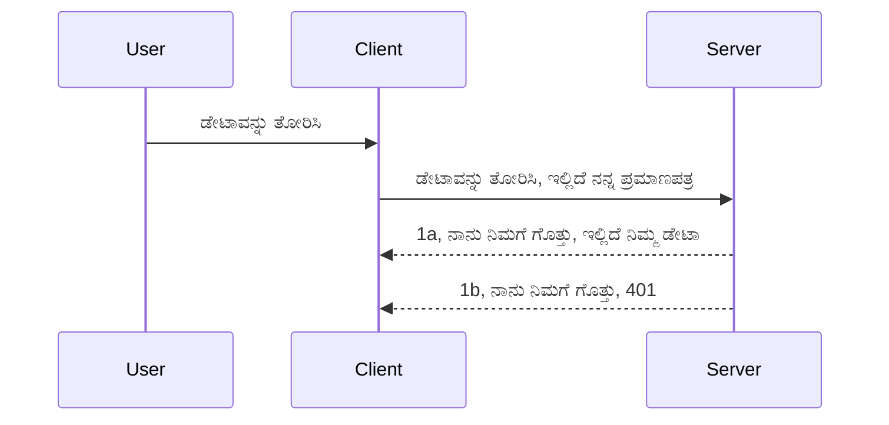

# ಸರಳ ಪ್ರಾಮಾಣೀಕರಣ

MCP SDKಗಳು OAuth 2.1 ಬಳಕೆಯನ್ನು ಬೆಂಬಲಿಸುತ್ತವೆ, ಇದು ನ್ಯಾಯಸಮ್ಮತವಾಗಿ ಕೆಲವೊಂದು ಪ್ರಕ್ರಿಯೆಯೊಂದಾಗಿದೆ, ಇದರಲ್ಲಿ auth ಸರ್ವರ್, resource ಸರ್ವರ್, ಪ್ರಮಾಣೀಕರಣ ಡೇಟಾವನ್ನು ಕಳುಹಿಸುವುದು, ಕೋಡ್ ಪಡೆಯುವುದು, ಕೋಡ್ ಅನ್ನು bearer ಟೋಕನ್‌ಗೆ ಪರಿವರ್ತಿಸುವುದು, ಅಂತಿಮವಾಗಿ ನೀವು ನಿಮ್ಮ resource ಡೇಟಾವನ್ನು ಪಡೆಯುವ ತನಕ ಚಟುವಟಿಕೆಗಳಿವೆ. ನೀವು OAuthಗೆ ಅಭ್ಯಾಸವಿಲ್ಲದಿದ್ದರೆ, ಇದು ಅಳವಡಿಸಲು ಉತ್ತಮವಾಗಿದೆ, ಆದ್ದರಿಂದ ಬೇಸಿಕ್ ಮಟ್ಟದ auth ನಿಂದ ಪ್ರಾರಂಭಿಸಿ ಉತ್ತಮ ಮತ್ತು ಉತ್ತಮ ಭದ್ರತೆಯ ಕಡೆಗೆ ಹೋದರೆ ಉತ್ತಮ. ಈ ಅಧ್ಯಾಯ ಇದಕ್ಕಾಗಿ ಇದೆ, ನಿಮಗೆ ಹೆಚ್ಚಿನ پرمختಿತ auth ಗೆ ಕಟ್ಟಿಕೊಳ್ಳಲು.

## auth, ನಾವು ಏನು ಎಂದಾಗ?

auth ಎಂದರೆ authentication ಮತ್ತು authorization. ಎಂದು ಅರ್ಥವೆಂದರೆ ನಮಗೆ ಎರಡು ಕೆಲಸಗಳನ್ನು ಮಾಡಬೇಕಾಗುತ್ತದೆ:

- **authentication**, ಅಥವಾ ನಾವು ಯಾರಾದರೂ ಮನೆಯೊಳಗೆ ಬರಲು ಅನುಮತಿಸೋಣವೋ ಅಲ್ಲವೋ ಎಂದು ಕಂಡುಕೊಳ್ಳುವ ಪ್ರಕ್ರಿಯೆ, ಅವರಿಂದ MCP ಸರ್ವರ್ ವೈಶಿಷ್ಟ್ಯಗಳು ಇರುವ resource ಸರ್ವರ್‌ಗೆ ಪ್ರವೇಶ ಹೊಂದಿದಾರೆ ಎಂಬುದನ್ನು ಖಚಿತಪಡಿಸುವದು.
- **authorization**, ಬಳಕೆದಾರರು ಕೇಳಿದ ವಿಶೇಷ resourceಗಳಿಗೆ ಅಥವಾ ಉದಾಹರಣೆಗೆ ಆ ಆರ್ಡರ್‌ಗಳಿಗೆ ಅಥವಾ ಉತ್ಪನ್ನಗಳಿಗೆ ಪ್ರವೇಶ ಹೊಂದಬೇಕೇಂದು ನೋಡಿಕೊಳ್ಳುವ ಪ್ರಕ್ರಿಯೆ ಅಥವಾ ಅವರು ಅಕ್ಷರಿಸಿ ಓದಬಹುದು ಆದರೆ ಅಳಿಸಲಾರೆ ಎಂಬ ನಿಯಂತ್ರಣ.

## ಪ್ರಮಾಣೀಕರಣಗಳು: ನಾವು ವ್ಯವಸ್ಥೆಗೆ ನಾವು ಯಾರೋ ಎಂದು ಹೆಸರಿಸುವುದು

ಬಹುತೇಕ ವೆಬ್ ಡೆವಲಪರ್‌ಗಳು ಸಾಮಾನ್ಯವಾಗಿ ಸರ್ವರ್‌ಗೆ ಒಂದು ಪ್ರಮಾಣೀಕರಣ ಒದಗಿಸುವ ವಿಚಾರದಲ್ಲಿ ತಲೆಹೊಡಿಸುತ್ತಾರೆ, ಸಾಮಾನ್ಯವಾಗಿ ಒಂದು ರಹಸ್ಯ, ಅದು ಅವನು ಇಲ್ಲಿ ಇರಲು ಅನುಮತಿಸಿದ್ದು ಎಂದು ಸೂಚಿಸುತ್ತದೆ "authentication". ಈ ಪ್ರಮಾಣೀಕರಣವು ಸಾಮಾನ್ಯವಾಗಿ ಬಳಕೆದಾರಹೆಸರಿನ ಮತ್ತು ಗುಪ್ತಪದದ base64 ಎನ್‌ಕೋಡ್ ಮಾಡಿದ ಆವೃತ್ತಿ ಅಥವಾ API ಕೀ ಆಗಿರುತ್ತದೆ, ಇದು ವಿಶಿಷ್ಟ ಬಳಕೆದಾರರನ್ನು ಗುರುತಿಸುತ್ತದೆ.

ಇದನ್ನು "Authorization" ಎಂಬ ಹೆಡರ್ ಮೂಲಕ ಕಳುಹಿಸುವುದು.

```json
{ "Authorization": "secret123" }
```

ಇದನ್ನು ಸಾಮಾನ್ಯವಾಗಿ basic authentication ಎಂದು ಕರೆಯಲಾಗುತ್ತದೆ. ಒಟ್ಟು ಹರಿವು ಈ ಕೆಳಗಿನ ರೀತಿಯಲ್ಲಿ ಕೆಲಸ ಮಾಡುತ್ತದೆ:


```mermaid
sequenceDiagram
   participant User
   participant Client
   participant Server

   User->>Client: ಡೇಟಾವನ್ನು ತೋರಿಸಿ
   Client->>Server: ಡೇಟಾವನ್ನು ತೋರಿಸಿ, ಇಲ್ಲಿದೆ ನನ್ನ ಪ್ರಮಾಣಪತ್ರ
   Server-->>Client: 1a, ನಾನು ನಿಮಗೆ ಗೊತ್ತು, ಇಲ್ಲಿದೆ ನಿಮ್ಮ ಡೇಟಾ
   Server-->>Client: 1b, ನಾನು ನಿಮಗೆ ಗೊತ್ತು, 401 
```

ಈಗ ನಾವು ಹೇಗೆ ಕಾರ್ಯನಿರ್ವಹಿಸುತ್ತದೆ ಅನ್ನು ಅರ್ಥಮಾಡಿಕೊಂಡಿದ್ದೇವೆ, ಅದನ್ನು ಹೇಗೆ ಜಾರಿಗೆ ತರುವುದೆಂಬುದನ್ನು ನೋಡೋಣ? ಬಹುತೇಕ ವೆಬ್ ಸರ್ವರ್‌ಗಳು middleware ಎಂಬ ಸಂಧರ್ಭ ಹೊಂದಿವೆ, ಅದು ಬೇಡಿಕೆಯ ಭಾಗವಾಗಿ ಓಡುತ್ತದೆ ಮತ್ತು ಪ್ರಮಾಣೀಕರಣಗಳನ್ನು ಪರಿಶೀಲಿಸುವ ಕೆಲಸ ಮಾಡುತ್ತದೆ, ಪ್ರಮಾಣೀಕರಣಗಳು ಅಮಾನ್ಯವಾದರೆ auth ದೋಷವನ್ನು ಕೊಡುವದು. ಇದನ್ನು ಹೇಗೆ ಜಾರಿಗೆ ತರಬಹುದು ನೋಡೋಣ:

**ಪೈಥಾನ್**

```python
class AuthMiddleware(BaseHTTPMiddleware):
    async def dispatch(self, request, call_next):

        has_header = request.headers.get("Authorization")
        if not has_header:
            print("-> Missing Authorization header!")
            return Response(status_code=401, content="Unauthorized")

        if not valid_token(has_header):
            print("-> Invalid token!")
            return Response(status_code=403, content="Forbidden")

        print("Valid token, proceeding...")
       
        response = await call_next(request)
        # ಯಾವುದೇ ಗ್ರಾಹಕ ಹೆಡರ್‌ಗಳನ್ನು ಸೇರಿಸಿ ಅಥವಾ ಪ್ರತಿಕ್ರಿಯೆಯಲ್ಲಿ ಏನಾದರೂ ಬದಲಾವಣೆ ಮಾಡಿ
        return response


starlette_app.add_middleware(CustomHeaderMiddleware)
```

ಇಲ್ಲಿ ನಾವು:

- `AuthMiddleware` ಎಂದು middleware ರಚಿಸಲಾಗಿದೆ, ಇದರ `dispatch` ಮೆಥಡ್ ವೆಬ್ ಸರ್ವರ್ ಮೂಲಕ ಕರೆಯಲ್ಪಡುತ್ತಲಿದೆ.
- middleware ಸರ್ವರ್‌ಗೆ ಸೇರ್ಪಡೆ ಮಾಡಲಾಗಿದೆ:

    ```python
    starlette_app.add_middleware(AuthMiddleware)
    ```

- `Authorization` ಹೆಡರ್ ಇದಿದೆಯೇ ಮತ್ತು ಕಳುಹಿಸಲಾದ ರಹಸ್ಯ ಸರಿಯಾದದೆಯೇ ಎಂದು ಪರಿಶೀಲಿಸುವ ಲಾಜಿಕ್ ಅನ್ನು ಬರೆದಿದೆ:

    ```python
    has_header = request.headers.get("Authorization")
    if not has_header:
        print("-> Missing Authorization header!")
        return Response(status_code=401, content="Unauthorized")

    if not valid_token(has_header):
        print("-> Invalid token!")
        return Response(status_code=403, content="Forbidden")
    ```

    ರಹಸ್ಯ ಇದ್ದರೂ ಸರಿಯಾದದ್ದಾದರೆ `call_next` ಕರೆಯಲಾಗುತ್ತದೆ ಮತ್ತು ಪ್ರತಿಕ್ರಿಯೆ ಹಿಂತಿರುಗಿಸಲಾಗುತ್ತದೆ.

    ```python
    response = await call_next(request)
    # ಯಾವುದೇ ಗ್ರಾಹಕ ಹೆಡರ್ಗಳನ್ನು ಸೇರಿಸಿ ಅಥವಾ ಪ್ರತಿಕ್ರಿಯೆಯಲ್ಲಿ ಯಾವುದೋ ರೀತಿಯಲ್ಲಿ ಬದಲಾವಣೆ ಮಾಡಿ
    return response
    ```

ಕಾರ್ಯವಿಧಾನವೇನೆಂದರೆ, ವೆಬ್ ಬೇಡಿಕೆ ಸರ್ವರ್‌ಗೆ ಬರಲಿ, middleware ಕರೆಯಲಾಗುತ್ತದೆ ಮತ್ತು ದತ್ತಾಂಶದ ಅನುಸಾರ ಬೇಡಿಕೆಯನ್ನು ಮುನ್ನಡೆಸಲು ಅನುಮತಿಸುವುದು ಅಥವಾ "ಹೆಚ್ಚುವರಿ ಅನುಮತಿ ಇಲ್ಲ" ಎಂಬ ದೋಷ ಹಿಂತಿರುಗಿಸುವುದು.

**ಟೈಪ್ಸ್ಕ್ರಿಪ್ಟ್**

ಇಲ್ಲಿ ನಾವು ಜನಪ್ರಿಯ Express ಫ್ರೇಮ್ವರ್ಕ್ ಬಳಸಿ middleware ರಚಿಸುತ್ತೇವೆ ಮತ್ತು MCP ಸರ್ವರ್‌ಗೆ ಬರುವ ಮೊದಲು ಬೇಡಿಕೆಯನ್ನು ಅಡ್ಡಪಡೆದುಕೊಳ್ಳುತ್ತೇವೆ. ಇದು ಕೆಳಗಿನ ಕೋಡ್ ಇದೆ:

```typescript
function isValid(secret) {
    return secret === "secret123";
}

app.use((req, res, next) => {
    // 1. ಪ್ರाधिकರಣ ಶೀರ್ಷಿಕೆ ಇದೆವೆಯೇ?
    if(!req.headers["Authorization"]) {
        res.status(401).send('Unauthorized');
    }
    
    let token = req.headers["Authorization"];

    // 2. ಮಾನ್ಯತೆ ಪರಿಶೀಲಿಸಿ.
    if(!isValid(token)) {
        res.status(403).send('Forbidden');
    }

   
    console.log('Middleware executed');
    // 3. ವಿನಂತಿಯನ್ನು ವಿನಂತಿ ಪೈಪ್ಲೈನ್‌ನಲ್ಲಿ ಮುಂದಿನ ಹಂತಕ್ಕೆ ಹಿಂತಿರುಗಿಸುತ್ತದೆ.
    next();
});
```

ಈ ಕೋಡ್‌ನಲ್ಲಿ ನಾವು:

1. ಮೊದಲನೇದಾಗಿ Authorization ಹೆಡರ್ ಇರುತ್ತದೆಯೇ ಎಂದು ಪರಿಶೀಲಿಸುತ್ತೇವೆ, ಇಲ್ಲದಿದ್ದರೆ 401 ದೋಷ ಕಳುಹಿಸುತ್ತೇವೆ.
2. ಪ್ರಮಾಣೀಕರಣ/ಟೋಕನ್ ಮಾನ್ಯವೋ ಇಲ್ಲವೋ ಎಂದು ಪರಿಶೀಲಿಸಿ, ಇಲ್ಲವಾದರೆ 403 ದೋಷ ಕಳುಹಿಸುತ್ತೇವೆ.
3. ಕೊನೆಗೆ ಮರುಬೇಡಿಕೆಯಂತೆಯೇ ಬೇಡಿಕೆಯನ್ನು ಮುಂದಿನ ಪೈಪ್‌ಲೈನ್‌ಗೆಹೋಗಲು ಬಿಡುತ್ತೇವೆ ಮತ್ತು ಕೇಳಲಾದ ಸಂಪನ್ಮೂಲವನ್ನು ಹಿಂತಿರುಗಿಸುತ್ತೇವೆ.

## ಅಭ್ಯಾಸ: authentication ಜಾರಿಗೊಳಿಸೋಣ

ನಾವು ತಿಳಿದಿರುವದನ್ನು ತೆಗೆದು ಇದನ್ನು ಜಾರಿಗೊಳಿಸುವ ಯತ್ನ ಮಾಡೋಣ. ಯೋಜನೆ ಈ ಕೆಳಗಿನಂತೆ:

ಸರ್ವರ್

- ವೆಬ್ ಸರ್ವರ್ ಮತ್ತು MCP ಇನ್ಸ್ಟಾನ್ಸ್ ರಚಿಸಿ.
- ಸರ್ವರ್‌ಗೆ middleware ಜಾರಿಗೊಳಿಸಿ.

ಕ್ಲೈಂಟ್ 

- ಹೆಡರ್ ಮೂಲಕ ಪ್ರಮಾಣೀಕರಣ ಸಂಖ್ಯೆಯನ್ನು ಸೇರಿಸಿ ವೆಬ್ ಬೇಡಿಕೆ ಕಳುಹಿಸಿ.

### -1- ವೆಬ್ ಸರ್ವರ್ ಮತ್ತು MCP ಇನ್ಸ್ಟಾನ್ಸ್ ರಚಿಸಿ

> [!WARNING]
> ಕೆಳಗಿನ ಟೈಪ್ಸ್ಕ್ರಿಪ್ಟ್ ಉದಾಹರಣೆ MCP `2025-11-25` ಗಾಗಿ ನಿಗದಿತವಾಗಿದೆ. ಇದು `mcp-session-id` ಮೂಲಕ ವಹಿಸಲಾದ ಸಂಖ್ಯೆಯನ್ನು ಬಳಸುತ್ತದೆ ಮತ್ತು ಪ್ರಸ್ತುತ `2026-07-28` ವಹಿಸುವಿಕೆ ಉದಾಹರಣೆಯಾಗಿಲ್ಲ. MCP `2026-07-28` ನಲ್ಲಿ `initialize` ಹ್ಯಾಂಡ್‌ಶೇಕ್ ಮತ್ತು ಪ್ರೋಟೋಕಾಲ್ ಸೆಷನ್ ID ಅನ್ನು ತೆಗೆದುಹಾಕಲಾಗಿದೆ; ಹೊಸ ಜಾರಿಗೊಳಿಸುವಿಕೆಗಳು ಸ್ವಯಂ ಅಡ್ಡ ಹೆಸರಿನಲ್ಲಿ ವಿನಂತಿಗಳನ್ನು ಬಳಸುತ್ತವೆ. ವಿವರಕ್ಕಾಗಿ [What's Changed in MCP: The 2026-07-28 Specification](../../01-CoreConcepts/mcp-2026-07-28.md) ನೋಡಿ.

> MCP `2026-07-28` initialize ಹ್ಯಾಂಡ್‌ಶೇಕ್ ಮತ್ತು ಪ್ರೋಟೋಕಾಲ್ ಸೆಷನ್ ID ತೆಗೆದಿದೆ; ಹೊಸ ಜಾರಿಗೊಳಿಸುವಿಕೆಗಳು ಸ್ವಯಂ ಅಡ್ಡ ವಿನಂತಿಗಳನ್ನು ಬಳಸುತ್ತವೆ.

> [What's Changed in MCP: The 2026-07-28 Specification](../../01-CoreConcepts/mcp-2026-07-28.md).

ನಮ್ಮ ಮೊದಲ ಹಂತದಲ್ಲಿ, ನಾವು ವೆಬ್ ಸರ್ವರ್ ಮತ್ತು MCP ಸರ್ವರ್ ಇನ್ಸ್ಟಾನ್ಸ್ ಅನ್ನು ರಚಿಸಬೇಕಾಗಿದೆ.

**ಪೈಥಾನ್**

ಇಲ್ಲಿ ನಾವು MCP ಸರ್ವರ್ ಇನ್ಸ್ಟಾನ್ಸ್ ರಚಿಸಿ, ಸ್ಟಾರ್‍ಲೆಟ್ ವೆಬ್ ಅಪ್ಲಿಕೇಶನ್ ರಚಿಸಿ, ಮತ್ತು ಅದನ್ನು ಉವಿಕಾರ್ನ್ ಮೂಲಕ ಹೋಸ್ಟ್ ಮಾಡುತ್ತೇವೆ.

```python
# MCP ಸರ್ವರ್ ರಚಿಸಲಾಗುತ್ತಿದೆ

app = FastMCP(
    name="MCP Resource Server",
    instructions="Resource Server that validates tokens via Authorization Server introspection",
    host=settings["host"],
    port=settings["port"],
    debug=True
)

# ಸ್ಟಾರ್ಲೆಟ್ вэಬ್ ಅಪ್ಲಿಕೇಶನ್ ರಚಿಸಲಾಗುತ್ತಿದೆ
starlette_app = app.streamable_http_app()

# uvicorn ಮೂಲಕ ಅಪ್ಲಿಕೇಶನ್ ಸೇವೆ ನೀಡಲಾಗುತ್ತಿದೆ
async def run(starlette_app):
    import uvicorn
    config = uvicorn.Config(
            starlette_app,
            host=app.settings.host,
            port=app.settings.port,
            log_level=app.settings.log_level.lower(),
        )
    server = uvicorn.Server(config)
    await server.serve()

run(starlette_app)
```

ಈ ಕೋಡ್‌ನಲ್ಲಿ ನಾವು:

- MCP ಸರ್ವರ್ ರಚಿಸಲಾಗಿದೆ.
- MCP ಸರ್ವರ್ ನಿಂದ ಸ್ಟಾರ್‍ಲೆಟ್ ವೆಬ್ ಅಪ್ ರಚಿಸಲಾಗಿದೆ, `app.streamable_http_app()`.
- ಉವಿಕಾರ್ನ್ ಬಳಸಿ ವೆಬ್ ಅಪ್ ಅನ್ನು ಹೋಸ್ಟ್ ಮತ್ತು ಸರ್ವ್ ಮಾಡಲಾಗಿದೆ `server.serve()`.

**ಟೈಪ್ಸ್ಕ್ರಿಪ್ಟ್**

ಇಲ್ಲಿ MCP ಸರ್ವರ್ ಇನ್ಸ್ಟಾನ್ಸ್ ರಚಿಸಲಾಗಿದೆ.

```typescript
const server = new McpServer({
      name: "example-server",
      version: "1.0.0"
    });

    // ... ಸರ್ವರ್ ಸಂಪನ್ಮೂಲಗಳು, ಸಾಧನಗಳು ಮತ್ತು ಪ್ರಾಂಪ್ಟ್‌ಗಳನ್ನು ವ್ಯವಸ್ಥೆಯು ಮಾಡಿ ...
```

ಈ MCP ಸರ್ವರ್ ರಚನೆಯನ್ನು POST /mcp ಮಾರ್ಗ ವ್ಯಾಖ್ಯಾನ ಒಳಗೆ ಮಾಡಬೇಕಾಗಿದ್ದು, ಮೇಲಿನ ಕೋಡ್ ಅನ್ನು ಇಂತೆ ವರ್ಗಾಯಿಸೋಣ:

```typescript
import express from "express";
import { randomUUID } from "node:crypto";
import { McpServer } from "@modelcontextprotocol/sdk/server/mcp.js";
import { StreamableHTTPServerTransport } from "@modelcontextprotocol/sdk/server/streamableHttp.js";
import { isInitializeRequest } from "@modelcontextprotocol/sdk/types.js"

const app = express();
app.use(express.json());

// ಸೆಷನ್ ID ಮೂಲಕ ಸಾರಿಗೆಗಳನ್ನು ಸಂಗ್ರಹಿಸಲು ನಕ್ಷೆ
const transports: { [sessionId: string]: StreamableHTTPServerTransport } = {};

// ಕ್ಲೈಂಟ್-ದಿಂದ-ಸರ್ವರ್ ಸಂವಹನದ POST ವಿನಂತಿಗಳನ್ನು ನಿರ್ವಹಿಸಿ
app.post('/mcp', async (req, res) => {
  // ಈಗಿರುವ ಸೆಷನ್ ID ಪರಿಶೀಲಿಸಿ
  const sessionId = req.headers['mcp-session-id'] as string | undefined;
  let transport: StreamableHTTPServerTransport;

  if (sessionId && transports[sessionId]) {
    // ಈಗಿರುವ ಸಾರಿಕೆಯನ್ನು ಪುನಃ ಬಳಸಿಕೊಳ್ಳಿ
    transport = transports[sessionId];
  } else if (!sessionId && isInitializeRequest(req.body)) {
    // ಹೊಸ ಆರಂಭಿಕ ವಿನಂತಿ
    transport = new StreamableHTTPServerTransport({
      sessionIdGenerator: () => randomUUID(),
      onsessioninitialized: (sessionId) => {
        // ಸೆಷನ್ ID ಮೂಲಕ ಸಾರಿಗೆಯನ್ನು ಸಂಗ್ರಹಿಸಿ
        transports[sessionId] = transport;
      },
      // ಹಿಂದಿನ ಹೊಂದಾಣಿಕೆಗೆ ಡಿಎನ್ಎಸ್ ರಿಬೈಂಡಿಂಗ್ ರಕ್ಷಣೆ ಮೂಲತಃ ಡಿಸೇಬಲ್ ಆಗಿದೆ. ನೀವು ಈ ಸರ್ವರ್ ಅನ್ನು
      // ಸ್ಥಳೀಯವಾಗಿ ಚಾಲನೆ ಮಾಡುತ್ತಿದ್ದಲ್ಲಿ, ಕನಿಷ್ಠವು ಹೊಂದಿಸಿ:
      // enableDnsRebindingProtection: true,
      // allowedHosts: ['127.0.0.1'],
    });

    // ಮುಚ್ಚಿದಾಗ ಸಾರಿಗೆಯನ್ನು ಸ್ವಚ್ಛಗೊಳಿಸಿ
    transport.onclose = () => {
      if (transport.sessionId) {
        delete transports[transport.sessionId];
      }
    };
    const server = new McpServer({
      name: "example-server",
      version: "1.0.0"
    });

    // ... ಸರ್ವರ್ ಸಂಪನ್ಮೂಲಗಳು, ಸಾಧನಗಳು ಮತ್ತು ಪ್ರಾಂಪ್ಟ್ ಗಳನ್ನು ಸೆಟ್ ಮಾಡಿ ...

    // MCP ಸರ್ವರ್ ಗೆ ಸಂಪರ್ಕಿಸುತ್ತಿದೆ
    await server.connect(transport);
  } else {
    // ಅಮಾನ್ಯ ವಿನಂತಿ
    res.status(400).json({
      jsonrpc: '2.0',
      error: {
        code: -32000,
        message: 'Bad Request: No valid session ID provided',
      },
      id: null,
    });
    return;
  }

  // ವಿನಂತಿಯನ್ನು ನಿರ್ವಹಿಸಿ
  await transport.handleRequest(req, res, req.body);
});

// GET ಮತ್ತು DELETE ವಿನಂತಿಗಳಿಗಾಗಿ ಮರುಬಳಕೆ ಆಯೋಗ್ಯ ಹ್ಯಾಂಡ್ಲರ್
const handleSessionRequest = async (req: express.Request, res: express.Response) => {
  const sessionId = req.headers['mcp-session-id'] as string | undefined;
  if (!sessionId || !transports[sessionId]) {
    res.status(400).send('Invalid or missing session ID');
    return;
  }
  
  const transport = transports[sessionId];
  await transport.handleRequest(req, res);
};

// SSE ಮುಖಾಂತರ ಸರ್ವರ್-ಗೆ-ಕ್ಲೈಂಟ್ ಅಧಿಸೂಚನೆಗಳಿಗೆ GET ವಿನಂತಿಗಳನ್ನು ನಿರ್ವಹಿಸಿ
app.get('/mcp', handleSessionRequest);

// ಸೆಷನ್ ಮುಗಿಸುವ DELETE ವಿನಂತಿಗಳನ್ನು ನಿರ್ವಹಿಸಿ
app.delete('/mcp', handleSessionRequest);

app.listen(3000);
```

ಈಗ ನೀವು `app.post("/mcp")` ಒಳಗೆ MCP ಸರ್ವರ್ ರಚನೆ ಹೇಗೆ ಹೋಲಿಕೆ ಅನುಸರಿಸಿದೆ ಎಂದು ನೋಡಬಹುದು.

middleware ರಚನೆಗೆ ಮುಂದುವರಿಯೋಣ, ಇದು ಬಂದ ಪ್ರತಿಯೊಂದು ಪ್ರಮಾಣೀಕರಣವನ್ನೂ ಪರಿಶೀಲಿಸುತ್ತದೆ.

### -2- ಸರ್ವರ್‌ಗೆ middleware ಜಾರಿಗೆ ತರೋಣ

middleware ವಿಭಾಗಕ್ಕೆ ಬನ್ನಿ. ಇಲ್ಲಿ ನಾವು `Authorization` ಹೆಡರ್ ಒಳಗಿನ ಪ್ರಮಾಣೀಕರಣ ಹುಡುಕಿ ಪರಿಶೀಲಿಸುವ middleware ಒದಗಿಸುತ್ತೇವೆ. ಅದು ಸೂಕ್ತವಿದ್ದರೆ ಬೇಡಿಕೆಯು ಮುಂದುವರಿಯುತ್ತದೆ (ಉದಾ: ಉಪಕರಣಗಳು ಪಟ್ಟಿಮಾಡಿ, ಸಂಪನ್ಮೂಲ ಓದಿ ಅಥವಾ MCP ಕಾರ್ಯಕ್ಷಮತೆ).

**ಪೈಥಾನ್**

middleware ರಚಿಸಲು, ನಾವು `BaseHTTPMiddleware` ಇಂದ ಲಗತ್ತಿಸಿಕೊಂಡ ಕ್ಲಾಸ್ ರಚಿಸುವುದು ಅಗತ್ಯ. ಇಲ್ಲಿ ಎರಡು ವಿಶೇಷ ಅಂಶಗಳಿವೆ:

- `request` ಎಂಬ ನಾವು ಹೆಡರ್ ಮಾಹಿತಿ ಓದಿಕೊಳ್ಳುವ ಬೇಡಿಕೆ.
- `call_next` ಅನ್ನು ಕರೆಸಬೇಕು, ಅದು ದೃಢೀಕರಿಸಿರುವ ಪ್ರಮಾಣೀಕರಣ ಇದ್ದಾಗ ಕಾರ್ಯಗತಗೊಳಿಸುವ ಕಾಲ್ಬ್ಯಾಕ್.

ಮೊದಲು `Authorization` ಹೆಡರ್ ಇಲ್ಲದಿದ್ದಾಗ ಹೇಗಾಗುವದು ನೋಡೋಣ:

```python
has_header = request.headers.get("Authorization")

# ಯಾವ ಹೆಡರ್ ಇಲ್ಲ, 401 ನೊಂದಿಗೆ ವಿಫಲವಾಗುತ್ತದೆ, ಇಲ್ಲದಿದ್ದರೆ ಮುಂದುವರಿಯುತ್ತದೆ.
if not has_header:
    print("-> Missing Authorization header!")
    return Response(status_code=401, content="Unauthorized")
```

ಇಲ್ಲ ನಾವು 401 ರ ಜೈಲಿನ ಬತಯಿಸುವ ಮೂಲಕ ಕ್ಲೈಂಟ್ ಪ್ರಮಾಣೀಕರಣ ವಿಫಲವಾಗಿದೆ ಎಂದು ಕಳುಹಿಸುತ್ತೇವೆ.

ನಂತರ, ಪ್ರಮಾಣೀಕರಣ ಬಂದಿದೆಯೇ ಎಂದು ಅದರ ಮಾನ್ಯತೆ ಪರಿಶೀಲಿಸುತ್ತೇವೆ.

```python
 if not valid_token(has_header):
    print("-> Invalid token!")
    return Response(status_code=403, content="Forbidden")
```

ಮೇಲ್ಸೂಚಿತ 403 ನಿಷೇಧ ಸಂದೇಶವನ್ನು ಕಳುಹಿಸುವುದನ್ನು ಗಮನಿಸಿ. ಕೆಳಗಿನ ಸಂಪೂರ್ಣ middleware ಇದನ್ನು jಾರಿಗೊಳಿಸಿದೆ:

```python
class AuthMiddleware(BaseHTTPMiddleware):
    async def dispatch(self, request, call_next):

        has_header = request.headers.get("Authorization")
        if not has_header:
            print("-> Missing Authorization header!")
            return Response(status_code=401, content="Unauthorized")

        if not valid_token(has_header):
            print("-> Invalid token!")
            return Response(status_code=403, content="Forbidden")

        print("Valid token, proceeding...")
        print(f"-> Received {request.method} {request.url}")
        response = await call_next(request)
        response.headers['Custom'] = 'Example'
        return response

```

ಚೆನ್ನಾಗಿದೆ, ಆದರೆ `valid_token` ಫಂಕ್ಷನ್ ಏನು? ಅದು ಇಲ್ಲಿದೆ:

```python
# ಉತ್ಪಾದನೆಗೆ ಬಳಸಬೇಡಿ - ಇದನ್ನು ಸುಧಾರಣೆಯಾಗಿ ಮಾಡಿ !!
def valid_token(token: str) -> bool:
    # "Bearer " ಪೂರ್ವವಚನವನ್ನು ತೆಗೆದುಹಾಕಿ
    if token.startswith("Bearer "):
        token = token[7:]
        return token == "secret-token"
    return False
```

ಇದನ್ನು ಸ್ಪಷ್ಟವಾಗಿ ಅಭಿವೃದ್ಧಿಪಡಿಸಬೇಕು.

ಪ್ರಮುಖ: ನೀವು ಇಂತಹ ರಹಸ್ಯಗಳನ್ನು ಕೋಡ್‌ನಲ್ಲಿ ಹಂಚಬಾರದು. ಅವುಗಳನ್ನು ideal ಆಗಿ ಡೇಟಾ ಮೂಲದಿಂದ ಅಥವಾ IDP (ಪರಿಚಯ ಸೇವಾ ಪೂರೈಕೆದಾರ) ಇಂದ ಪಡೆಯಬೇಕು ಅಥವಾ ಆತ್ಮೀಯವಾಗಿ IDP ಕಾರ್ಯಕ್ಷಮತೆ ಮಾಡುವಂತೆ ಮಾಡಬೇಕು.

**ಟೈಪ್ಸ್ಕ್ರಿಪ್ಟ್**

Express ಬಳಸಿ ಇದನ್ನು ಜಾರಿಗೆ ತರುವುದೆಂದರೆ, middleware ಕಾರ್ಯಗಳನ್ನು ಕರೆದಿಕೊಳ್ಳಲು `use` ವಿಧಾನವನ್ನು ಬಳಸಬೇಕು.


ನಮಗೆ ಬೇಕಾಗುವುದು:

- `Authorization` ಗುಣಲಕ್ಷಣದಲ್ಲಿ ಹಾಳಾದ ಪ್ರಮಾಣಪತ್ರವನ್ನು ಪರಿಶೀಲಿಸಲು ವಿನಂತಿ ಚರವನ್ನು ಸಂವಹನ ಮಾಡಬೇಕು.
- ಪ್ರಮಾಣಪತ್ರವನ್ನು ಪರಿಶೀಲಿಸಿ, ಆಗ ವಿನಂತಿಯನ್ನು ಮುಂದುವರಿಸಲು ಅನುಮತಿಸಿ ಮತ್ತು ಕ್ಲೈಂಟ್‌ನ MCP ವಿನಂತಿ ಅದರ ಕರ್ತವ್ಯವನ್ನು (ಉದಾ: ಸಾಧನಗಳನ್ನು ಪಟ್ಟಿ ಮಾಡುವುದು, ಸಂಪನ್ಮೂಲವನ್ನು ಓದುವುದು ಅಥವಾ MCP ಸಂಬಂಧಿತ ಯಾವುದಾದರೂ ಕಾರ್ಯ) ನಿರ್ವಹಿಸಲಿ.

ಇಲ್ಲಿ ನಾವು `Authorization` ಶೀರ್ಷಿಕೆ ಲಭ್ಯವಿದೆಯೇ ಎಂದು ಪರಿಶೀಲಿಸುತ್ತಿದ್ದೇವೆ, ಇಲ್ಲದಿದ್ದರೆ ನಮಗೆ ವಿನಂತಿಯನ್ನು ತಡೆಹಿಡಿಯಬೇಕು:

```typescript
if(!req.headers["authorization"]) {
    res.status(401).send('Unauthorized');
    return;
}
```

ಮೊದಲೇ ಶೀರ್ಷಿಕೆಯನ್ನು ಕಳುಹಿಸದಿದ್ದಲ್ಲಿ, ನೀವು 401 ಬದ್ರವನ್ನು ಪಡೆಯುತ್ತೀರಿ.

ನಂತರ, ಪ್ರಮಾಣಪತ್ರ ಮಾನ್ಯವಿದೆಯೇ ಎಂದು ಪರಿಶೀಲಿಸಿ, ಇಲ್ಲದಿದ್ದರೆ ಮತ್ತೆ ಒಂದೆರಡು ಭಿನ್ನ ಸಂದೇಶದೊಂದಿಗೆ ವಿನಂತಿಯನ್ನು ತಡೆಹಿಡಿಯಿರಿ:

```typescript
if(!isValid(token)) {
    res.status(403).send('Forbidden');
    return;
} 
```

ಈಗ ನೀವು 403 ದೋಷವನ್ನು ಪಡೆಯುತ್ತೀರಿ ಎಂದು ಗಮನಿಸಿ.

ಇದರ ಪೂರ್ಣ ಕೋಡ್ ಇಲ್ಲಿದೆ:

```typescript
app.use((req, res, next) => {
    console.log('Request received:', req.method, req.url, req.headers);
    console.log('Headers:', req.headers["authorization"]);
    if(!req.headers["authorization"]) {
        res.status(401).send('Unauthorized');
        return;
    }
    
    let token = req.headers["authorization"];

    if(!isValid(token)) {
        res.status(403).send('Forbidden');
        return;
    }  

    console.log('Middleware executed');
    next();
});
```

ನಾವು ವೆಬ್ ಸರ್ವರ್ ಅನ್ನು ಮಧ್ಯವರ್ತಿ ರೂವಾರಿ ನೋಡಲು ವ್ಯವಸ್ಥೆ ಮಾಡಿದ್ದೇವೆ, ಇದು ಕ್ಲೈಂಟ್ ನಮಗೆ ಕಳುಹಿಸುವ ಪ್ರಮಾಣಪತ್ರವನ್ನು ಪರಿಶೀಲಿಸುತ್ತದೆ. ಕ್ಲೈಂಟ್ ಬಗ್ಗೆ ಏನು?

### -3- ಪ್ರಮಾಣಪತ್ರವನ್ನು ಶೀರ್ಷಿಕೆಯ ಮೂಲಕ ಬಳಸಿಕೊಂಡು ವೆಬ್ ವಿನಂತಿ ಕಳುಹಿಸಿ

ಕ್ಲೈಂಟ್ ಪ್ರಮಾಣಪತ್ರವನ್ನು ಶೀರ್ಷಿಕೆಯ ಮೂಲಕ ಕಳುಹಿಸುತ್ತಿದೆಯೇ ಎಂಬುದನ್ನು ನಾವು ಖಚಿತಪಡಿಸಿಕೊಳ್ಳಬೇಕು. ನಾವು MCP ಕ್ಲೈಂಟ್ ಬಳಸುತ್ತಿದ್ದೇವೆ, ಅದನ್ನು ಹೇಗೆ ಮಾಡಲು ಅರ್ಹತೆ ಹೊಂದಬೇಕು.

**Python**

ಕ್ಲೈಂಟ್‌ಗೆ ನಾವು ಈ ರೀತಿಯಲ್ಲಿ ಪ್ರಮಾಣಪತ್ರದೊಂದಿಗೆ ಶೀರ್ಷಿಕೆಯನ್ನು ಕಳಿಸುವ ಅಗತ್ಯವಿದೆ:

```python
# ಮೌಲ್ಯವನ್ನು ಕಠಿಣವಾಗಿ ಕೋಡ್ ಮಾಡಬೇಡಿ, ಕನಿಷ್ಠವಾಗಿ ಅದನ್ನು ಪರಿಸರ ಚರ변ರಿಯಲ್ಲಿ ಅಥವಾ ಹೆಚ್ಚುವರಿ ಭದ್ರತೆಯ ಸಂಗ್ರಹಣದಲ್ಲಿ ಇಡಿ
token = "secret-token"

async with streamablehttp_client(
        url = f"http://localhost:{port}/mcp",
        headers = {"Authorization": f"Bearer {token}"}
    ) as (
        read_stream,
        write_stream,
        session_callback,
    ):
        async with ClientSession(
            read_stream,
            write_stream
        ) as session:
            await session.initialize()
      
            # TODO, ಕ್ಲೈಂಟ್‌ನಲ್ಲಿ ನೀವು ಏನು ಮಾಡಲು ಬಯಸುತ್ತೀರಿ, ಉದಾಹರಣೆಗೆ ಉಪಕರಣಗಳ ಪಟ್ಟಿ ಮಾಡುವುದು, ಉಪಕರಣಗಳನ್ನು ಕರೆದೊಯ್ಯುವುದು ಇತ್ಯಾದಿ.
```

`headers` ಗುಣಲಕ್ಷಣವನ್ನು ಹೀಗೆ ತುಂಬಿಸುವ ವಿಧಾನವನ್ನು ಗಮನಿಸಿ: ` headers = {"Authorization": f"Bearer {token}"}`.

**TypeScript**

ನಾವು ಇದನ್ನು ಎರಡು ಹಂತಗಳಲ್ಲಿ ಪರಿಹರಿಸಬಹುದು:

1. ನಮ್ಮ ಪ್ರಮಾಣಪತ್ರವಿರುವ ಸಂರಚನಾ ವಸ್ತುವನ್ನು ತುಂಬಿಸಿ.
2. ಸಂರಚನಾ ವಸ್ತುವನ್ನು ಸಾರಿಗೆಗೆ ಕಳುಹಿಸಿ.

```typescript

// ಇಲ್ಲಿ ತೋರಿಸಿದಂತೆ ಮೌಲ್ಯವನ್ನು ಹಾರ್ಡ್‌ಕೋಡ್ ಮಾಡಬೇಡಿ. ಕನಿಷ್ಟವಾಗೀತು ಅದನ್ನು env ವೇರಿಯಬಲ್ ಆಗಿ ಇರಿಸಿ ಮತ್ತು dev ಮೋಡ್‌ನಲ್ಲಿ dotenv ವಂಶಾಯಿಸುವುದನ್ನು ಬಳಸಿ.
let token = "secret123"

// ಕ್ಲೈಂಟ್ ಟ್ರಾನ್ಸ್‌ಪೋರ್ಟ್ ಆಯ್ಕೆಯನ್ನು ನಿರ್ಧರಿಸಿ
let options: StreamableHTTPClientTransportOptions = {
  sessionId: sessionId,
  requestInit: {
    headers: {
      "Authorization": "secret123"
    }
  }
};

// ಆಯ್ಕೆಗಳ ವಸ್ತುವನ್ನು ಟ್ರಾನ್ಸ್‌ಪೋರ್ಟ್‌ಗೆ ಪಾಸ ಮಾಡಿ
async function main() {
   const transport = new StreamableHTTPClientTransport(
      new URL(serverUrl),
      options
   );
```

ಮೇಲಿನ ಉದಾಹರಣೆಯಲ್ಲಿ ನಾವು `options` ವಸ್ತುವನ್ನು ರಚಿಸಿ, ಮತ್ತು `requestInit` ಗುಣಲಕ್ಷಣದ ತಳದಲ್ಲಿಯು ನಮ್ಮ ಶೀರ್ಷಿಕೆಗಳನ್ನು ಬಿಟ್ಟು ಹಾಕಿರುವುದನ್ನು ನೋಡಬಹುದು.

ಮಹತ್ವದ ನುಡಿ: ನಾವು ಇದರಿಂದ ಅಭಿವೃದ್ಧಿಪಡಿಸಬೇಕೆಂದರೆ ಹೇಗೆ? ಪ್ರಸ್ತುತ ಜಾರಿಗೆ ಕೆಲವು ಸಮಸ್ಯೆಗಳಿವೆ. ಮೊದಲನೆಯದಾಗಿ, ಪ್ರಮಾಣಪತ್ರವನ್ನು ಹೀಗೆ ಮಾರ್ಗದರ್ಶಿಸುವುದು ಸಾಕಷ್ಟೂ ಅಪಾಯಕಾರಿಯಾಗಿದೆ ಆದರೆ ಕನಿಷ್ಠವಾಗಿ HTTPS ಹೊಂದಿದ್ದರೆ ಮಾತ್ರ. ಅದಿಕ್ಕಿಂತೇ, ಪ್ರಮಾಣಪತ್ರ ಕದ್ದಿಕೊಳ್ಳಬಹುದಾಗಿದೆ, ಆದ್ದರಿಂದ ನೀವು ಟೋಕನ್ ಅನ್ನು ಸುಲಭವಾಗಿ ರದ್ದುಮಾಡಲು ಮತ್ತು ಇತರ ಪರಿಶೀಲನೆಗಳನ್ನು ಸೇರಿಸಲು ಒಂದು ವ್ಯವಸ್ಥೆಯನ್ನು ಹೊಂದಬೇಕು, ಉದಾಹರಣೆಗೆ ಪ್ರಪಂಚದ哪ಯಲ್ಲಿ ಅದು ಬಂದಾವೆಯೋ, ವಿನಂತಿ ತುಂಬಾ ಬಾರಿ ಆಗುತ್ತದೆಯೇ (ಬಾಟ್-जಾಗತಿಕ), ಸಂಕ್ಷಿಪ್ತವಾಗಿ, ಎನ್ನುವ ಉಪ್ಪತ್ರಗಳು ಇವೆ.

ಆದರೆ ಇದನ್ನು ಹೇಳಬೇಕಾಗಿದೆ, ತುಂಬಾ ಸರಳ APIs ಗಾಗಿ, ಯಾರಿಗೂ ನಿಮ್ಮ API ಅನ್ನು ಮಾನ್ಯತೆ ಇಲ್ಲದೆ ಕರೆ ಮಾಡಲು ಬಯಸುವುದಿಲ್ಲ ಎಂದರೆ ಇಲ್ಲಿ ನಾವು ಹೊಂದಿರುವುದು ಒಳ್ಳೆಯ ಪ್ರಾರಂಭವಾಗಿದೆ.

ಅಂದರೆ, ನಾವು JSON ವೆಬ್ ಟೋಕನ್ (JWT) ಎಂಬ ಮಾನ್ಯ ವಿನ್ಯಾಸವನ್ನು ಬಳಸುವ ಮೂಲಕ ಭದ್ರತೆಯನ್ನು ಸ್ವಲ್ಪ ಹೆಚ್ಚಿಸೋಣ.

## JSON ವೆಬ್ ಟೋಕನ್ ಗಳು, JWT

ಹೀಗಾಗಿ, ನಾವು ತುಂಬಾ ಸರಳ ಪ್ರಮಾಣಪತ್ರಗಳನ್ನು ಕಳುಹಿಸುವ ಕ್ರಮದಿಂದ ಸುಧಾರಿಸಲು ಯತ್ನಿಸುತ್ತಿದ್ದೇವೆ. JWT ಅನ್ನು ಅಳವಡಿಸಿಕೊಂಡಾಗ ನಮಗೆ ತಕ್ಷಣವೇ ಯಾವ ಸುಧಾರಣೆಗಳು ಬರುತ್ತವೆ?

- **ಭದ್ರತೆ ಸುಧಾರಣೆಗಳು**. ಮೂಲಭೂತ ಮಾನ್ಯತೆಯಲ್ಲಿ (ಬೇಸಿಕ್ auth), ನೀವು ಬಳಕೆದಾರ ಹೆಸರು ಮತ್ತು ಪಾಸ್‌ವರ್ಡ್ ಅನ್ನು ಬೇಸ್64 ಎಂಕೋಡ್ ಮಾಡಿದ ಟೋಕನಾಗಿ ಅಥವಾ API ಕೀ ಆಗಿ ಮುಂದುವರಿಸಿರುತ್ತೀರಿ, ಇದು ಅಪಾಯವನ್ನು ಹೆಚ್ಚಿಸುತ್ತದೆ. JWT ನೊಂದಿಗೆ, ನೀವು ಬಳಕೆದಾರ ಹೆಸರು ಮತ್ತು ಪಾಸ್‌ವರ್ಡ್ ಕಳುಹಿಸಿ ಟೋಕನ್ ಪಡೆಯುತ್ತೀರಿ ಮತ್ತು ಅದು ಸಮಯ ಮಿತಿಯಲ್ಲಿದ್ದು ಮಾನ್ಯತೆಯ ಅವಧಿ ಸೀಮಿತವಾಗಿದೆ. JWT ನಿಮಗೆ ಊಹಾಪೋಹ, ವ್ಯಾಪ್ತಿಗಳು ಮತ್ತು ಅನುಮತಿಗಳನ್ನು ಬಳಸಿಕೊಂಡು ಸೂಕ್ಷ್ಮ ಪ್ರವೇಶ ನಿಯಂತ್ರಣವನ್ನು ಸುಲಭವಾಗಿ ಮಾಡಬಹುದು.
- **ಸ್ಥಿತಿಸ್ವಾತಂತ್ರ್ಯ ಮತ್ತು ವಿಸ್ತರಣೆ**. JWT ಗಳು ಸ್ವಯಂಸಂಪೂರ್ಣವಾಗಿವೆ, ಅವು ಎಲ್ಲಾ ಬಳಕೆದಾರ ಮಾಹಿತಿಯನ್ನು ಹೊಂದಿವೆ ಮತ್ತು ಸರ್ವರ್-ಪಕ್ಷದ ಸೆಷನ್ ಸಂಗ್ರಹಣೆ ಅವಶ್ಯಕತೆಯನ್ನು ನಿರ್ಮೂಲ ಮಾಡುತ್ತವೆ. ಟೋಕನನ್ನು ಸ್ಥಳೀಯವಾಗಿ ಕೂಡ ಪರಿಶೀಲಿಸಬಹುದು.
- **ಇಂಟರೋಪರಬಿಲಿಟಿ ಮತ್ತು ಫೆಡರೇಶನ್**. JWT ಗಳು Open ID Connect ಗಾಗಿ ಕೇಂದ್ರವಾಗಿದೆ ಮತ್ತು Entra ID, Google Identity ಮತ್ತು Auth0 ಎಂಬ ಖ್ಯಾತ ಗುರುತುಪಡೆಯುವವರ ಜೊತೆಗೆ ಬಳಸಲಾಗುತ್ತವೆ. ಅವು ಸಿಂಗಲ್ ಸೈನ್ ಆನ್ ಹಾಗು ಹೆಚ್ಚಿನವನ್ನೂ ಅನುಮತಿಸುತ್ತವೆ, ಇದರಿಂದ ಅವು ಉದ್ಯಮ ಮಟ್ಟದಮಾಗಿರುತ್ತವೆ.
- **ಮಾಡ್ಯೂಲಾರಿಟಿ ಮತ್ತು ಬಲವಂತ**. JWT ಗಳು API ಗೇಟ್ವೇಗಳೊಂದಿಗೆ ಕೂಡ ಬಳಸಬಹುದು, ಉದಾಹರಣೆಗೆ Azure API Management, NGINX ಮತ್ತು ಇತರ ಕೆಲವೊಮ್ಮೆ. ಇದು ಬಳಕೆದಾರ ದೃಢೀಕರಣ ದೃಶ್ಯಗಳನ್ನು ಮತ್ತು ಸರ್ವರ್-ಗೆ-ಸರ್ವಿಸ್ ಸಂವಹನವನ್ನು ಕೂಡ ಬೆಂಬಲಿಸುತ್ತದೆ, ಆತ್ಮನಿಮಿತ್ತ ಮತ್ತು ಪ್ರತ್ಯೇಕಣ ದೃಶ್ಯಗಳ ಸಹಿತ.
- **ಕಾರ್ಯಕ್ಷಮತೆ ಮತ್ತು ಕ್ಯಾಶಿಂಗ್**. JWT ಗಳನ್ನು ಡಿಕೋಡ್ ಮಾಡಿದ ನಂತರ ಕ್ಯಾಶ್ ಮಾಡಬಹುದು, ಇದು ಪಾರ್ಸಿಂಗ್ ಅವಶ್ಯಕತೆಯನ್ನು ಕಡಿಮೆ ಮಾಡುತ್ತದೆ. ಇದು ವಿಶೇಷವಾಗಿ ಹೆಚ್ಚು ಸಂಚಾರ ಹೊಂದಿರುವ ಅಪ್ಲಿಕೇಶನ್‍ಗಳಿಗೆ ನೆರವಾಗುತ್ತದೆ, ಓಟವನ್ನು ಸುಧಾರಿಸುತ್ತದೆ ಮತ್ತು ನಿಮ್ಮ ಆಯ್ಕೆ ಮಾಡಲಾದ ಮೂಲಸೌಕರ್ಯ ಮೇಲಿನ ಭಾರವನ್ನು ಕಡಿಮೆ ಮಾಡುತ್ತದೆ.
- **ಮುನ್ನಡೆ ವೈಶಿಷ್ಟ್ಯಗಳು**. ಇದು ಇಂಟ್ರೊಸ್ಪೆಕ್ಷನ್ (ಸರ್ವರಿನಲ್ಲಿ ಮಾನ್ಯತೆ ಪರಿಶೀಲನೆ) ಮತ್ತು ರದ್ದುಪಡಿಸುವಿಕೆ (ಟೋಕನ್ ಅನ್ನು ಅಮಾನ್ಯಗೊಳಿಸುವಿಕೆ) ಕೂಡ ಬೆಂಬಲಿಸುತ್ತದೆ.

ಎಂತಹ ಪ್ರಯೋಜನಗಳಿದ್ದರೂ ಸರಿ, ನಮ್ಮ ಜಾರಿಗೆ ಮುಂದಿನ ಮಟ್ಟಕ್ಕೆ ತರುವ ರೀತಿಯನ್ನು ನೋಡೋಣ.

## ಬೇಸಿಕ್ auth ಯನ್ನು JWT ಗೆ ಪರಿವರ್ತಿಸುವುದು

ಆದ್ದರಿಂದ, ನಾವು ಮಾಡುವ ದೊಡ್ಡ ಮಟ್ಟದ ಬದಲಾವಣೆಗಳು ಇವು:

- **JWT ಟೋಕನ್ ಅನ್ನು ರಚಿಸುವೆವು** ಹಾಗೂ ಅದು ಕ್ಲೈಂಟ್‌ನಿಂದ ಸರ್ವರ್‌ಗೆ ಕಳುಹಿಸಲು ಸಿದ್ಧವಾಗಿರಬೇಕು.
- **JWT ಟೋಕನ್ ಅನ್ನು ಪರಿಶೀಲಿಸುವೆವು**, ಹಾಗಾದರೆ ನಮಗೆ ಸಂಪನ್ಮೂಲಗಳನ್ನು ಕ್ಲೈಂಟ್‌ಗೆ ನೀಡಬಹುದು.
- **ಟೋಕನ್ ಭದ್ರ ಸಂಗ್ರಹಣೆ**. ನಾವು ಈ ಟೋಕನ್ ಅನ್ನು ಹೇಗೆ ಸಂಗ್ರಹಿಸಬೇಕು.
- **ಮಾರ್ಗಗಳನ್ನು ರಕ್ಷಿಸುವುದು**. ನಾವು ಮಾರ್ಗಗಳನ್ನು ಮತ್ತು ನಮಗೆ ಸಂಬಂಧಿಸಿದ MCP ವೈಶಿಷ್ಟ್ಯಗಳನ್ನು ರಕ್ಷಿಸಬೇಕು.
- **ರಿಫ್ರೆಶ್ ಟೋಕನ್ಗಳನ್ನು ಸೇರಿಸುವುದು**. ಕಿರು ಆಯುಷ್ಯದ ಟೋಕನ್ಗಳನ್ನು ಮತ್ತು ಹಬ್ಬಿಸಿದ, ಉದ್ದ ಅವಧಿಯ ರಿಫ್ರೆಶ್ ಟೋಕನ್ಗಳನ್ನು ರಚಿಸಿ, ಅವು ಅವಧಿ ಮುಕ್ತಾಯವಾದಾಗ ಹೊಸ ಟೋಕನವನ್ನ ಪಡೆಯಲು ಬಳಸಬಹುದು. ಜೊತೆಗೆ ರಿಫ್ರೆಶ್ ಎಂಡ್ಪಾಯಿಂಟ್ ಮತ್ತು ರೋಟೇಶನ್ ತಂತ್ರವನ್ನು ಖಚಿತಪಡಿಸಿಕೊಳ್ಳಿ.

### -1- JWT ಟೋಕನ್ ರಚಿಸುವುದು

ಮೊದಲನೇದು, JWT ಟೋಕನಿನ ಭಾಗಗಳು ಇವು:

- **ಶೀರ್ಷಿಕೆ**, ಅಲ್ಗಾರಿದಮ್ ಮತ್ತು ಟೋಕನ್ ಪ್ರಕಾರ.
- **ಪೇಲೋಡ್**, ದावेಗಳು, ಉದಾ., sub (ಟೋಕನ್ ಪ್ರತಿನಿಧಿಸುವ ಬಳಕೆದಾರ ಅಥವಾ ಘಟಕ. ಮಾನ್ಯತೆ ದೃಶ್ಯದಲ್ಲಿ ಸಾಮಾನ್ಯವಾಗಿ ಬಳಕೆದಾರಐಡಿ), exp (ಅವಧಿ), ಮತ್ತು role (ಭಾಜನ).
- **ಸಿದ್ಧಾಂತ**, ರಹಸ್ಯ ಅಥವಾ ಖಾಸಗಿ ಕೀಲಿಯನ್ನು ಬಳಸಿ ಸಹಿ ಮಾಡಲಾಗಿದೆ.

ಇದಕ್ಕಾಗಿ ನಾವು ಶೀರ್ಷಿಕೆ, ಪೇಲೋಡ್ ಮತ್ತು ಎನ್‌ಕೋಡ್ಡ್ ಟೋಕನ್ ರಚಿಸಬೇಕು.

**Python**

```python

import jwt
import jwt
from jwt.exceptions import ExpiredSignatureError, InvalidTokenError
import datetime

# JWTಗೆ ಸಹಿ ಹಾಕಲು ಬಳಸುವ ರಹಸ್ಯ ಕೀ
secret_key = 'your-secret-key'

header = {
    "alg": "HS256",
    "typ": "JWT"
}

# ಬಳಕೆದಾರ ಮಾಹಿತಿ ಮತ್ತು ಅದರ ಹಕ್ಕುಗಳು ಮತ್ತು ಅವಧಿ ಸಮಯ
payload = {
    "sub": "1234567890",               # ವಿಷಯ (ಬಳಕೆದಾರ ID)
    "name": "User Userson",                # ಕಸ್ಟಮ್ ಹಕ್ಕು
    "admin": True,                     # ಕಸ್ಟಮ್ ಹಕ್ಕು
    "iat": datetime.datetime.utcnow(),# ಮೇಲೆ ನೀಡಲಾಗಿದೆ
    "exp": datetime.datetime.utcnow() + datetime.timedelta(hours=1)  # ಅವಧಿ ಕೊನೆ
}

# ಇದನ್ನು ಎನ್ಕೋಡ್ ಮಾಡಿ
encoded_jwt = jwt.encode(payload, secret_key, algorithm="HS256", headers=header)
```

ಮೇಲಿನ ಕೋಡಿನಲ್ಲಿ ನಾವು:

- HS256 ಅನ್ನು ಅಲ್ಗಾರಿದಮ್ ಆಗಿ ಮತ್ತು ಟೋಕನ್ ಪ್ರಕಾರವಾಗಿಯೂ JWT ಅನ್ನು ಹೊಂದಿರುವ ಶೀರ್ಷಿಕೆಯನ್ನುนิರ್ಧರಿಸಿದ್ದೇವೆ.
- ಸಮಾಗಮವನ್ನು (payload) ರಚಿಸಿದ್ದೇವೆ, ಇದರಲ್ಲಿ ವಿಷಯ ಅಥವಾ ಬಳಕೆದಾರ ಐಡಿ, ಬಳಕೆದಾರಹೆಸರು, ಭಾಜನ, ಅದು ಯಾವಾಗ ನೀಡಲ್ಪಟ್ಟಿತು ಮತ್ತು ಯಾವಾಗ ಮುಗಿಯುತ್ತದೆ ಎಂಬುದು ಅಳವಡಿಸಲಾಗಿದೆ, ಹೀಗಾಗಿ ನಾವೇ ಮೊದಲೇ ಹೇಳಿದ ಕಾಲಾವಧಿ ನಿರ್ಧಾರವನ್ನು ಅನುಷ್ಠಾನಗೊಳಿಸಲಾಗಿದೆ.

**TypeScript**

ಇಲ್ಲಿಗೆ JWT ಟೋಕನ್ ರಚಿಸಲು ಕೆಲವು ಅವಶ್ಯಕತೆಗಳು ಬೇಕಾಗಿವೆ.

ಅವಶ್ಯಕತೆಗಳು

```sh

npm install jsonwebtoken
npm install --save-dev @types/jsonwebtoken
```

ಈಗ ಪಾಲಿಕೊಳ್ಳೋಣ, ಶೀರ್ಷಿಕೆ, ಪೇಲೋಡ್ ರಚಿಸಿ, ಅದರಿಂದ ಎನ್‌ಕೋಡ್ಡ್ ಟೋಕನ್ ಸೃಷ್ಟಿಸುವುದು.

```typescript
import jwt from 'jsonwebtoken';

const secretKey = 'your-secret-key'; // ಉತ್ಪಾದನೆಯಲ್ಲಿ env ಮಾದರಿಗಳನ್ನು ಬಳಸಿ

// ಪೇಲೋಡ್ ಅನ್ನು ನಿರ್ಧರಿಸಿ
const payload = {
  sub: '1234567890',
  name: 'User usersson',
  admin: true,
  iat: Math.floor(Date.now() / 1000), // ನೀಡಲಾದ ಸಮಯ
  exp: Math.floor(Date.now() / 1000) + 60 * 60 // 1 ಗಂಟೆಯಲ್ಲಿ ಮುಚ್ಚುತ್ತದೆ
};

// ಹೆಡರ್ ಅನ್ನು ನಿರ್ಧರಿಸಿ (ऐच्छಿಕ, jsonwebtoken ಡೀಫಾಲ್ಟ್ಗಳನ್ನು ಹೊಂದಿದೆ)
const header = {
  alg: 'HS256',
  typ: 'JWT'
};

// ಟೋಕನ್ ಅನ್ನು ರಚಿಸಿ
const token = jwt.sign(payload, secretKey, {
  algorithm: 'HS256',
  header: header
});

console.log('JWT:', token);
```

ಈ ಟೋಕನ್ ಇದೆಯೆಂದು:

HS256 ಬಳಸಿ ಸಹಿ ಮಾಡಲಾಗಿದೆ
1 ಗಂಟೆಯ ಕಾಲ ಮಾನ್ಯ
sub, name, admin, iat ಮತ್ತು exp ಮುಂತಾದ ದಾವೆಗಳನ್ನೊಳಗೊಂಡಿದೆ.

### -2- ಟೋಕನ್ ಪರಿಶೀಲಿಸುವುದು

ಟೋಕನ್ ಅನ್ನು ಪರಿಶೀಲಿಸುವ ಅಗತ್ಯವೂ ಇದೆ, ಇದು ನಾವು ಸರ್ವರ್‌ನಲ್ಲಿ ಮಾಡಬೇಕಾದದ್ದು, ಏಕೆಂದರೆ ಕ್ಲೈಂಟ್ ನಮಗೆ ಕಳುಹಿಸುವುದು ನಿಜವಾಗಿಯೂ ಮಾನ್ಯವೋ ಅಲ್ಲವೋ ಎಂದು ಖಚಿತಪಡಿಸಬೇಕು. ಇಲ್ಲಿಗೆ ಹೊತ್ತೊಪ್ಪುವ ರಚನೆ ಮತ್ತು ಮಾನ್ಯತೆ ಪರಿಶೀಲನೆ ಸೇರಿದಂತೆ ಅನೇಕ ಪರಿಶೀಲನೆಗಳನ್ನು ನಾವು ಮಾಡಬೇಕು. ನಿಮ್ಮ ಸಿಸ್ಟಮ್‌ನಲ್ಲಿ ಬಳಕೆದಾರ ಇದ್ದಾನೇ ಎಂಬುದು ಮತ್ತು ಇನ್ನೂ ಹೆಚ್ಚಿನ ಪರಿಶೀಲನೆಗಳನ್ನು ಸೇರಿಸುವುದು ಶಿಫಾರಸು.

ಟೋಕನ್ ಪರಿಶೀಲಿಸಲು, ಅದನ್ನು ಡಿಕೋಡ್ ಮಾಡಬೇಕು, ನಂತರ ಅದರ ಮಾನ್ಯತೆ ಪರಿಶೀಲನೆ ಪ್ರಾರಂಭಿಸಬೇಕು:

**Python**

```python

# JWT ಅನ್ನು ಡಿಕೋಡ್ ಮಾಡಿ ಮತ್ತು ಪರಿಶೀಲಿಸಿ
try:
    decoded = jwt.decode(token, secret_key, algorithms=["HS256"])
    print("✅ Token is valid.")
    print("Decoded claims:")
    for key, value in decoded.items():
        print(f"  {key}: {value}")
except ExpiredSignatureError:
    print("❌ Token has expired.")
except InvalidTokenError as e:
    print(f"❌ Invalid token: {e}")

```


ಈ ಕೋಡ್‌ನಲ್ಲಿ, ನಾವು ಟೋಕನ್, ರಹಸ್ಯ ಕೀ ಮತ್ತು ಆಯ್ದ ಆಲ್ಗೋರಿದಮ್ ಅನ್ನು ಇನ್‌ಪುಟ್‌ವಾಗಿ ಬಳಸಿ `jwt.decode` ಅನ್ನು ಕರೆಸುತ್ತೇವೆ. ವಿಫಲವಾದ ಮಾನ್ಯತೆ ತಪ್ಪು ಉಂಟಾಗಿಸುವುದರಿಂದ try-catch ಸಂರಚನೆಯನ್ನು ಬಳಸುವ ರೀತಿಯನ್ನು ಗಮನಿಸಿ.

**ಟೈಪ್‌ಸ್ಕ್ರಿಪ್ಟ್**

ಇಲ್ಲಿ ನಾವು `jwt.verify` ಅನ್ನು ಕರೆಸಬೇಕಾಗಿದೆ ώστε ನಾಂವಿಗೆ-token ಡಿಕೋಡ್ ಮಾಡಿದ ಆವರಣವನ್ನು ಪಡೆಯಲು ಅದು ನಂತರ ವಿಶ್ಲೇಷಿಸಬಹುದು. ಈ ಕರೆ ವಿಫಲವಾದರೆ, ಅಂದರೆ ಟೋಕನ್‌ನ ರಚನೆ ತಪ್ಪಾಗಿದೆ ಅಥವಾ ಇದು ಇನ್ನೂ ಮಾನ್ಯವಿಲ್ಲ.

```typescript

try {
  const decoded = jwt.verify(token, secretKey);
  console.log('Decoded Payload:', decoded);
} catch (err) {
  console.error('Token verification failed:', err);
}
```

ಗಮನಿಸಿ: ಮುಂಚೆ ಉಲ್ಲೇಖಿಸಿದಂತೆ, ಈ ಟೋಕನ್ ನಮ್ಮ ವ್ಯವಸ್ಥೆಯಲ್ಲಿನ ಬಳಕೆದಾರನನ್ನು ಸೂಚಿಸುತ್ತಿದೆಯೇ ಮತ್ತು ಬಳಕೆದಾರನಿಗೆ ಅವಶ್ಯವಾದ ಹಕ್ಕುಗಳಿವೆ ಎನ್ನುದು ಖಚಿತಪಡಿಸಲು ಹೆಚ್ಚಿನ ಪರಿಶೀಲನೆಗಳನ್ನು ಮಾಡಬೇಕಾಗಿದೆ.

ಇನ್ನು ಮುಂದೆ, ನಾವು ಪಾತ್ರ ಆಧಾರಿತ ಪ್ರವೇಶ ನಿಯಂತ್ರಣ (RBAC) ವಿರುದ್ಧ ನೋಡೋಣ.

## ಪಾತ್ರ ಆಧಾರಿತ ಪ್ರವೇಶ ನಿಯಂತ್ರಣ ಸೇರ್ಪಡೆ

ವಿಭಿನ್ನ ಪಾತ್ರಗಳಿಗೆ ವಿಭಿನ್ನ ಅನುಮತಿಗಳನ್ನು ನೀಡಬೇಕು ಎಂಬ ಕಲ್ಪನೆ ಇದೆ. ಉದಾಹರಣೆಗೆ, ಆಡಳಿತಗಾರನು ಎಲ್ಲವನ್ನೂ ಮಾಡಬಹುದು ಎಂದು ನಾವು ಊಹಿಸಲಾಗುತ್ತದೆ ಮತ್ತು ಸಾಮಾನ್ಯ ಬಳಕೆದಾರನು ಓದಲು/ಬರೆಯಲು ಸಾಧ್ಯವಿದ್ದು ಅತಿಥಿ ಮಾತ್ರ ಓದು ಮಾತ್ರ ಮಾಡಬಹುದು ಎಂದು ನಂಬಲಾಗಿದೆ. ಆದ್ದರಿಂದ, ಕೆಲವು ಸಾಧ್ಯ ಅನುಮತಿ ಮಟ್ಟಗಳು ಇವು:

- Admin.Write 
- User.Read
- Guest.Read

ಮಧ್ಯಮಾದಡಿ (middleware) ಮೂಲಕ ಇಂತಹ ನಿಯಂತ್ರಣವನ್ನು ನಾವು ಹೇಗೆ ಅನುಷ್ಟಾನ ಮಾಡಬಹುದು ಎಂಬುದನ್ನು ನೋಡೋಣ. ಮಧ್ಯಮಾದಡಿಗಳನ್ನು ಮಾರ್ಗದ ಪ್ರತಿ ಹಾಗೂ ಎಲ್ಲಾ ಮಾರ್ಗಗಳಿಗೆ ಸೇರಿಸಬಹುದು.

**Python**

```python
from starlette.middleware.base import BaseHTTPMiddleware
from starlette.responses import JSONResponse
import jwt

# ಕೋಡ್‌ನಲ್ಲಿ ರಹಸ್ಯವಿರಬಾರದು, ಇದು ಪ್ರದರ್ಶನ ಉದ್ದೇಶಗಳಿಗೆ ಮಾತ್ರ. ಅದನ್ನು ಸುರಕ್ಷಿತ ಸ್ಥಳದಿಂದ ಓದಿಸಿರಿ.
SECRET_KEY = "your-secret-key" # ಇದನ್ನು ಎನ್‌ವೈರುಮೆಂಟ್ ವ್ಯಾರೀಯಬಲ್‌ನಲ್ಲಿ ಇಡಿ
REQUIRED_PERMISSION = "User.Read"

class JWTPermissionMiddleware(BaseHTTPMiddleware):
    async def dispatch(self, request, call_next):
        auth_header = request.headers.get("Authorization")
        if not auth_header or not auth_header.startswith("Bearer "):
            return JSONResponse({"error": "Missing or invalid Authorization header"}, status_code=401)

        token = auth_header.split(" ")[1]
        try:
            decoded = jwt.decode(token, SECRET_KEY, algorithms=["HS256"])
        except jwt.ExpiredSignatureError:
            return JSONResponse({"error": "Token expired"}, status_code=401)
        except jwt.InvalidTokenError:
            return JSONResponse({"error": "Invalid token"}, status_code=401)

        permissions = decoded.get("permissions", [])
        if REQUIRED_PERMISSION not in permissions:
            return JSONResponse({"error": "Permission denied"}, status_code=403)

        request.state.user = decoded
        return await call_next(request)


```

ಕೆಳಗಿನಂತೆ ಮಧ್ಯಮಾದಡಿಯನ್ನು ಸೇರಿಸುವ ಏಳು ವಿಶೇಷ ವಿಧಾನಗಳಿವೆ:

```python

# ಆಯ್ಕೆ 1: ಸ್ಟಾರ್ಲೆಟ್ ಅಪ್ ಅನ್ನು ರಚಿಸುವಾಗ ಮಿಡಲ್‌ವೇರ್ ಅನ್ನು ಸೇರಿಸಿ
middleware = [
    Middleware(JWTPermissionMiddleware)
]

app = Starlette(routes=routes, middleware=middleware)

# ಆಯ್ಕೆ 2: ಸ್ಟಾರ್ಲೆಟ್ ಅಪ್ ಈಗಾಗಲೇ ರಚಿಸಿದ ನಂತರ ಮಿಡಲ್‌ವೇರ್ ಅನ್ನು ಸೇರಿಸಿ
starlette_app.add_middleware(JWTPermissionMiddleware)

# ಆಯ್ಕೆ 3: ಪ್ರತಿ ಮಾರ್ಗಕ್ಕೆ ಮಿಡಲ್‌ವೇರ್ ಅನ್ನು ಸೇರಿಸಿ
routes = [
    Route(
        "/mcp",
        endpoint=..., # ಹ್ಯಾಂಡ್ಲರ್
        middleware=[Middleware(JWTPermissionMiddleware)]
    )
]
```

**ಟೈಪ್‌ಸ್ಕ್ರಿಪ್ಟ್**

ಎಲ್ಲಾ ವಿನಂತಿಗಳಿಗಾಗಿ `app.use` ಮತ್ತು ಒಂದು ಮಧ್ಯಮಾದಡಿ ಬಳಸಬಹುದು.

```typescript
app.use((req, res, next) => {
    console.log('Request received:', req.method, req.url, req.headers);
    console.log('Headers:', req.headers["authorization"]);

    // 1. අවසර හිස සඳහන් ಮಾಡಲಾಗಿದೆ ಎಂದು ಪರಿಶೀಲಿಸಿ

    if(!req.headers["authorization"]) {
        res.status(401).send('Unauthorized');
        return;
    }
    
    let token = req.headers["authorization"];

    // 2. ටෝකනය වලංගුද ಎಂದು ಪರಿಶೀಲಿಸಿ
    if(!isValid(token)) {
        res.status(403).send('Forbidden');
        return;
    }  

    // 3. ටෝකನ್ ಬಳಕೆದಾರನು ನಮ್ಮ ವ್ಯವಸ್ಥೆಯಲ್ಲಿ ಅಸ್ತಿತ್ವದಲ್ಲಿದೆಯೇ ಎಂದು ಪರಿಶೀಲಿಸಿ
    if(!isExistingUser(token)) {
        res.status(403).send('Forbidden');
        console.log("User does not exist");
        return;
    }
    console.log("User exists");

    // 4. ಟೋಕನ್ ಹೊಂದಿರುವ ಅನುವಾದಗಳನ್ನು ದೃಢೀಕರಿಸಿ
    if(!hasScopes(token, ["User.Read"])){
        res.status(403).send('Forbidden - insufficient scopes');
    }

    console.log("User has required scopes");

    console.log('Middleware executed');
    next();
});

```

ನಾವು ನಮ್ಮ ಮಧ್ಯಮಾದಡಿ ಮಾಡಬೇಕಾದ ಹಲವು ವಿಷಯಗಳಿವೆ, ಮುಖ್ಯವಾಗಿ:

1. ಪ್ರಾಧಿಕರಣ ಹೆಡರ್‌ ಅಸ್ತಿತ್ವದಲ್ಲಿದೆಯೇ ಎಂದು ಪರಿಶೀಲಿಸು
2. ಟೋಕನ್ ಮಾನ್ಯವಿದೆಯೇ ಎಂದು ಪರಿಶೀಲಿಸು, ನಾವು ಬರೆದಿರುವ `isValid` ಎಂಬ ಮೆಥಡ್ ಅನ್ನು ಕರೆದು JWT ಟೋಕನ್‌ನ ಅಖಂಡತೆ ಮತ್ತು ಮಾನ್ಯತೆಯನ್ನೊಳಗೊಂಡಿದೆ.
3. ಬಳಕೆದಾರನು ನಮ್ಮ ವ್ಯವಸ್ಥೆಯಲ್ಲಿ ಇದ್ದಾನೆ ಎಂದು ಖಚಿತಪಡಿಸು, ಇದನ್ನು ನಾವು ಪರಿಶೀಲಿಸಬೇಕಾಗಿದೆ.

   ```typescript
    // ಡಿಬಿಯಲ್ಲಿ ಬಳಕೆದಾರರು
   const users = [
     "user1",
     "User usersson",
   ]

   function isExistingUser(token) {
     let decodedToken = verifyToken(token);

     // ಮಾಡಬೇಕಿದೆ, ಡಿಬಿಯಲ್ಲಿ ಬಳಕೆದಾರ ಇದ್ದೀರಾ ಎಂದು ಪರಿಶೀಲಿಸಿ
     return users.includes(decodedToken?.name || "");
   }
   ```

   ಮೇಲಿನಡೆ, ನಾವು ಬಹಳ ಸರಳವಾದ `users` ಪಟ್ಟಿಯನ್ನು ಸೃಷ್ಟಿಸಿದ್ದೇವೆ, ಇದನ್ನು ಖಚಿತವಾಗಿ ಡೇಟಾಬೇಸ್‌ನಲ್ಲಿ ಇಡಬೇಕು.

4. ಹೆಚ್ಚುವರಿ, ಟೋಕನ್‌ಗೆ ಸರಿಯಾದ ಅನುಮತಿಗಳು ಇದ್ದಾರೆಯೇ ಎಂಬುದರ ಪರಿಶೀಲನೆ ಕೂಡ ಮಾಡಬೇಕಾಗಿದೆ.

   ```typescript
   if(!hasScopes(token, ["User.Read"])){
        res.status(403).send('Forbidden - insufficient scopes');
   }
   ```

   ಮೇಲಿನ ಕೋಡ್‌ನಲ್ಲಿ ಮಧ್ಯಮಾದಡಿಯಿಂದ, ನಾವು ಟೋಕನ್ User.Read ಅನುಮತಿಯನ್ನೊಳ್ಳಲಾಗಿದೆ ಎಂದು ಪರಿಶೀಲಿಸುತ್ತೇವೆ, ಇಲ್ಲದಿದ್ದರೆ 403 ದೋಷವನ್ನು ಕಳುಹಿಸುತ್ತೇವೆ. ಕೆಳಗಿನದು `hasScopes` ಸಹಾಯಕ ವಿಧಾನ.

   ```typescript
   function hasScopes(scope: string, requiredScopes: string[]) {
     let decodedToken = verifyToken(scope);
    return requiredScopes.every(scope => decodedToken?.scopes.includes(scope));
  }
   ```

Have a think which additional checks you should be doing, but these are the absolute minimum of checks you should be doing.

Using Express as a web framework is a common choice. There are helpers library when you use JWT so you can write less code.

- `express-jwt`, helper library that provides a middleware that helps decode your token.
- `express-jwt-permissions`, this provides a middleware `guard` that helps check if a certain permission is on the token.

Here's what these libraries can look like when used:

```typescript
const express = require('express');
const jwt = require('express-jwt');
const guard = require('express-jwt-permissions')();

const app = express();
const secretKey = 'your-secret-key'; // put this in env variable

// Decode JWT and attach to req.user
app.use(jwt({ secret: secretKey, algorithms: ['HS256'] }));

// Check for User.Read permission
app.use(guard.check('User.Read'));

// multiple permissions
// app.use(guard.check(['User.Read', 'Admin.Access']));

app.get('/protected', (req, res) => {
  res.json({ message: `Welcome ${req.user.name}` });
});

// Error handler
app.use((err, req, res, next) => {
  if (err.code === 'permission_denied') {
    return res.status(403).send('Forbidden');
  }
  next(err);
});

```

ಈಗ ನೀವು ಮಧ್ಯಮಾದಡಿಯನ್ನು ದೃಢೀಕರಣ ಮತ್ತು ಪ್ರಾಧಿಕರಣಕ್ಕಾಗಿ ಹೇಗೆ ಬಳಸಬಹುದು ಎಂದು ನೋಡಿದ್ದೀರಲ್ಲ, MCP ಬಗ್ಗೆ ಹೇಗೆ? ಅದು ವಿಹಿತ ವಿಧಾನದ ಪ್ರಕಾರ auth ನಲ್ಲಿ ಬದಲಾವಣೆ ಆಗುವದಾ? ಮುಂದಿನ ಅಧ್ಯಾಯದಲ್ಲಿ ತಿಳಿಯೋಣ.

### -3- MCP ಗೆ RBAC ಸೇರ್ಪಡೆ

ನೀವು ಈಗಾಗಲೇ ಮಧ್ಯಮಾದಡಿ ಮೂಲಕ RBAC ಅನ್ನು ಸೇರ್ಪಡೆಮಾಡುವ ವಿಧಾನ ಹೇಗೆ ಎಂಬುದನ್ನು ನೋಡಿದ್ದೀರಿ, ಆದರೆ MCP ಗೆ ಪ್ರತಿ MCP ವೈಶಿಷ್ಟ್ಯ RBAC ಸೇರಿಸುವ ಸರಳ ಮಾರ್ಗ ಇಲ್ಲ; ಹಾಗಾದರೆ ನಾವು ಏನು ಮಾಡಬೇಕು? ನಾವು ಈ ಕೆಳಗಿನಂತೆ ಕೋಡ್ ಸೇರಿಸಬೇಕಾಗುತ್ತದೆ, ಇದರಲ್ಲಿ ಗ್ರಾಹಕನು ನಿಶ್ಚಿತ ಟೂಲ್ ಅನ್ನು ಕರೆಸಲು ಹಕ್ಕುಗಳನ್ನು ಹೊಂದಿದೆಯೇ ಎಂಬುದನ್ನು ಪರಿಶೀಲಿಸಲಾಗುತ್ತದೆ:

ಪ್ರತಿ ವೈಶಿಷ್ಟ್ಯ RBAC ಸಾಧಿಸಲು ನೀವು ಕೆಲ ವಿಭಿನ್ನ ಆಯ್ಕೆಗಳಿವೆ, ಕೆಲವು ಹೀಗಿವೆ:

- ಪ್ರತಿ ಉಪಕರಣ, ಸಂಪನ್ಮೂಲ, ಪ್ರಾಂಪ್ಟ್‌ಗಾಗಿ ಪರಿಶೀಲನೆ ಸೇರಿಸಿ, ಅಲ್ಲಿ ಅನುಮತಿ ಮಟ್ಟ ಪರಿಶೀಲನೆ ಅಗತ್ಯವಿದೆ.

   **python**

   ```python
   @tool()
   def delete_product(id: int):
      try:
          check_permissions(role="Admin.Write", request)
      catch:
        pass # ಗ್ರಾಹಕ ಅನುಮತಿ ವಿಫಲವಾಯಿತು, ಅನುಮತಿ ದೋಷವನ್ನು ಏರಿಸು
   ```

   **typescript**

   ```typescript
   server.registerTool(
    "delete-product",
    {
      title: Delete a product",
      description: "Deletes a product",
      inputSchema: { id: z.number() }
    },
    async ({ id }) => {
      
      try {
        checkPermissions("Admin.Write", request);
        // ಟುಡೂ, productService ಮತ್ತು ರಿಮೋಟ್ ಎಂಟ್ರಿಗೆ ಐಡಿ ಕಳುಹಿಸಿ
      } catch(Exception e) {
        console.log("Authorization error, you're not allowed");  
      }

      return {
        content: [{ type: "text", text: `Deletected product with id ${id}` }]
      };
    }
   );
   ```


- ಅತ್ಯಾಧುನಿಕ ಸರ್ವರ್ ವಿಧಾನ ಮತ್ತು ವಿನಂತಿ ಹ್ಯಾಂಡ್ಲರ್‌ಗಳನ್ನು ಬಳಸಿ ಪರಿಶೀಲನೆ ಮಾಡಬೇಕಾದ ಜಾಗಗಳನ್ನು ಕಡಿಮೆ ಮಾಡಿ.

   **Python**

   ```python
   
   tool_permission = {
      "create_product": ["User.Write", "Admin.Write"],
      "delete_product": ["Admin.Write"]
   }

   def has_permission(user_permissions, required_permissions) -> bool:
      # user_permissions: ಬಳಕೆದಾರನ ಅನುಮತಿಗಳ ಪಟ್ಟಿ
      # required_permissions: ಉಪಕರಣಕ್ಕೆ ಬೇಕಾಗುವ ಅನುಮತಿಗಳ ಪಟ್ಟಿ
      return any(perm in user_permissions for perm in required_permissions)

   @server.call_tool()
   async def handle_call_tool(
     name: str, arguments: dict[str, str] | None
   ) -> list[types.TextContent]:
    # request.user.permissions ಅನ್ನು ಬಳಕೆದಾರನ ಅನುಮತಿಗಳ ಪಟ್ಟಿ ಎಂದು ಊಹಿಸಿ
     user_permissions = request.user.permissions
     required_permissions = tool_permission.get(name, [])
     if not has_permission(user_permissions, required_permissions):
        # ದೋಷವನ್ನು ಎತ್ತಿ "ನೀವು ಉಪಕರಣ {name} ಕರೆಸಲು ಅನುಮತಿ ಹೊಂದಿಲ್ಲ"
        raise Exception(f"You don't have permission to call tool {name}")
     # ಮುಂದುವರಿ ಮತ್ತು ಉಪಕರಣವನ್ನು ಕರೆಸಿ
     # ...
   ```   
   

   **ಟೈಪ್‌ಸ್ಕ್ರಿಪ್ಟ್**

   ```typescript
   function hasPermission(userPermissions: string[], requiredPermissions: string[]): boolean {
       if (!Array.isArray(userPermissions) || !Array.isArray(requiredPermissions)) return false;
       // ಬಳಕೆದಾರನಿಗೆ ಕನಿಷ್ಟ ಒಂದು ಅಗತ್ಯ ಅನುಮತಿ ಇದ್ದರೆ ಸತ್ಯವನ್ನು ಹಿಂತಿರುಗಿಸಿ
       
       return requiredPermissions.some(perm => userPermissions.includes(perm));
   }
  
   server.setRequestHandler(CallToolRequestSchema, async (request) => {
      const { params: { name } } = request;
  
      let permissions = request.user.permissions;
  
      if (!hasPermission(permissions, toolPermissions[name])) {
         return new Error(`You don't have permission to call ${name}`);
      }
  
      // ಮುಂದುವರೆಯಿರಿ..
   });
   ```

   ಗಮನಿಸಿ, ನಿಮ್ಮ ಮಧ್ಯಮಾದಡಿಗಳು ಡಿಕೋಡ್ ಮಾಡಿದ ಟೋಕನ್ ಅನ್ನು ವಿನಂತಿಯ user ಗುಣಲಕ್ಷಣಕ್ಕೆ ಬાંધી ಬೇಕಾಗುತ್ತದೆ ಅಂದರೆ ಮೇಲಿನ ಕೋಡ್ ಸುಲಭವಾಗುತ್ತದೆ.

### ಸಾರಾಂಶ

ನಾವು ಸಾಮಾನ್ಯವಾಗಿ ಮತ್ತು ವಿಶೇಷವಾಗಿ MCP ಗೆ RBAC ಸೇರಿಸುವ ವಿಧಾನವನ್ನು ಚರ್ಚಿಸಿದ್ದೇವೆ, ಈಗ conceitos ಪಟ್ಟಿ ಮಾಡಲಾದ ಅರ್ಥವನ್ನು ಆಯಾಸವಿಲ್ಲದೆ ಅಭ್ಯಾಸಕ್ಕೆ ತರಬೇತಿ ಮಾಡುವ ಸಮಯವಾಗಿದೆ.

## ಕಾರ್ಯ 1: ಮೂಲತಃ ಸತ್ಯಾಪನೆ ಬಳಸಿ mcp ಸರ್ವರ್ ಮತ್ತು mcp ಗ್ರಾಹಕ ನಿರ್ಮಿಸಿ

ಇಲ್ಲಿ ನೀವು ಹೆಡರ್‌ಗಳ ಮೂಲಕ ಪ್ರমাণಪತ್ರಗಳನ್ನು ಕಳುಹಿಸುವುದರ ಬಗ್ಗೆ ಕಲಿತೀರಾ.

## ಪರಿಹಾರ 1

[Solution 1](./code/basic/README.md)

## ಕಾರ್ಯ 2: ಕಾರ್ಯ 1 ರ ಪರಿಹಾರವನ್ನು JWT ಬಳಕೆಮಾಡಿ ಅಪ್‌ಗ್ರೇಡ್ ಮಾಡಿ

ಮೊದಲಿಗೆ ಪರಿಹಾರವನ್ನು ತೆಗೆದುಕೊಳ್ಳಿ ಆದರೆ ಈ ಬಾರಿ ಅದನ್ನು ಸುಧಾರಿಸೋಣ.

ಮೂಲ ದಾಖಲಿಯ ಕೆಲವು ಅಂಶಗಳ ಬದಲು JWT ಬಳಸಿ.

## ಪರಿಹಾರ 2

[Solution 2](./solution/jwt-solution/README.md)

## ಸವಾಲು

"Add RBAC to MCP" ಅಧ್ಯಾಯದಲ್ಲಿ ನಾವು ವಿವರಣೆ ಮಾಡಿದ ಟೂಲ್ ಪ್ರತಿ RBAC ಸೇರ್ಪಡೆ ಮಾಡಿ.

## ಸಾರಾಂಶ

ನೀವು ಈ ಅಧ್ಯಾಯದಲ್ಲಿ ಬಹುಮಾನವಾಗಿ ಕಲಿತಿದ್ದೀರಾ - ಸಂಪೂರ್ಣ ಭದ್ರತೆ ಇಲ್ಲದೇ ಪ್ರಾರಂಭಿಸಿ, ಮೂಲ ಭದ್ರತೆ, JWT, ಮತ್ತು MCP ಗೆ ಅದನ್ನು ಸೇರಿಸುವ ವಿಧಾನವನ್ನು.

ನಾವು ಕಸ್ಟಮ್ JWTs ಮೂಲಕ ಸ್ಥಿರ ಅಡಿಷ್ಠಾನವನ್ನು ನಿರ್ಮಿಸಿದ್ದೇವೆ, ಆದರೆ ನಾವು ವಿಸ್ತಾರಗೊಳ್ಳುತ್ತಿದ್ದಂತೆ, ನಾವು ಮಾನಕ ಆಧಾರಿತ ಗುರುತಿನ ಮಾದರಿಯತ್ತ ಸಾಗುತ್ತಿದ್ದೇವೆ. Entra ಅಥವಾ Keycloakಂತಹ IdP ಸ್ವೀಕರಿಸುವಿಕೆ ಟೋಕನ್ ಜಾರಿಗೆ, ಮಾನ್ಯತೆ ಮತ್ತು ಜೀವನಚರಿತ್ರೆಯ ವ್ಯವಸ್ಥೆಗಳನ್ನು ವಿಶ್ವಾಸಾರ್ಹ ವೇದಿಕೆಯೊಂದಕ್ಕೆ ಒಪ್ಪಿಸಲು ಸಂತೋಷವನ್ನು ನೀಡುತ್ತದೆ — ಇದರಿಂದ ನಾವು ಅಪ್ಲಿಕೇಶನ್ ತರ್ಕ ಮತ್ತು ಬಳಕೆದಾರ ಅನುಭವದ ಮೇಲೆ ಗಮನ ಹರಿಸಬಹುದು.

ಇದರಿಗಾಗಿ, ನಾವು ಹೆಚ್ಚಿನ [ ಉನ್ನತ ಅಧ್ಯಾಯ Entra ಮೇಲೆ](../../05-AdvancedTopics/mcp-security-entra/README.md)

## ಮುಂದೇನಿದೆ

- ಮುಂದಿನದು: [MCP ಅತಿಥಿಗಳನ್ನು ಸ್ಥಾಪಿಸುವುದು](../12-mcp-hosts/README.md)

---

<!-- CO-OP TRANSLATOR DISCLAIMER START -->
**ಅಸ್ವೀಕಾರ**:
ಈ ದಸ್ತಾವೇಜು AI ಅನುವಾದ ಸೇವೆ [Co-op Translator](https://github.com/Azure/co-op-translator) ಬಳಸಿ ಅನುವಾದಿಸಲಾಗಿದೆ. ನಾವು ನಿಖರತೆಯನ್ನು ಸಾಧಿಸಲು ಪ್ರಯತ್ನಿಸುತ್ತಿದ್ದರೂ, ದಯವಿಟ್ಟು ಗಮನಿಸಿ, ಸ್ವಯಂಚಾಲಿತ ಅನುವಾದಗಳಲ್ಲಿ ದೋಷಗಳು ಅಥವಾ ಅಸಡ್ಡೆಗಳು ಇರಬಹುದು. ಮೂಲ ಭಾಷೆಯಲ್ಲಿರುವ ಮೂಲ ದಸ್ತಾವೇಜು ಪ್ರಾಮಾಣಿಕ ಮೂಲವೆಂದು ಪರಿಗಣಿಸಬೇಕು. ಪ್ರಮುಖ ಮಾಹಿತಿಗಾಗಿ, ವೃತ್ತಿಪರ ಮಾನವ ಅನುವಾದವನ್ನು ಶಿಫಾರಸು ಮಾಡಲಾಗುತ್ತದೆ. ಈ ಅನುವಾದವನ್ನು ಬಳಸುವ ಮೂಲಕ ಉಂಟಾಗುವ ಯಾವುದೇ ತಪ್ಪು ಅರ್ಥಗಳ ಅಥವಾ ತಪ್ಪು ವ್ಯಾಖ್ಯಾನಗಳ ಬಗ್ಗೆ ನಾವು ಹೊಣೆಗಾರರಲ್ಲ.
<!-- CO-OP TRANSLATOR DISCLAIMER END -->