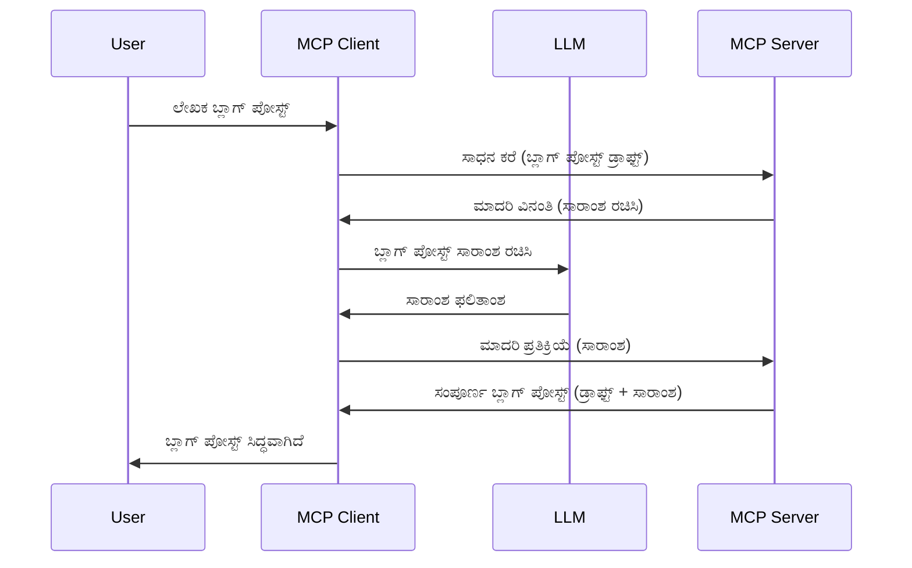

> [!WARNING]
> MCP `2026-07-28` ನಲ್ಲಿ ಸಮ್ನು ತಿಳಿಸುವಿಕೆ ನಿರಾಕರಿಸಲಾಗಿದೆ. ಈ ಪಾಠವನ್ನು 
> ಪುರಾತನ ಅನುಷ್ಠಾನಗಳಿಗೆ ಇಡಲಾಗಿದೆ. ಹೊಸ ಸರ್ವರ್ಗಳು ನೇರವಾಗಿ LLM
> ಪೂರೈಕೆದಾರ API ಜೊತೆಗೆ ಸಂಯೋಜಿಸಬೇಕು.

# ಸಮ್ನು - ಗ್ರಾಹಕೆಗೆ ځانګತಿಗಳನ್ನು ಹಸ್ತಾಂತರಿಸಿ

> ಸಮ್ನು `2026-07-28` ವಿಶೇಷಣದಲ್ಲಿಯೂ ಸಹ ಹೊಂದಿದ್ದು ತಾಳ್ಮೆಗೆ ಲಭ್ಯವಾಗಿದೆ ಮತ್ತು
> ಜುಲೈ 28, 2027 ನಂತರ ಬಿಡುಗಡೆ ಆಗುವ ಮೊದಲ ಸಂಶೋಧನೆದಲ್ಲಿ ತೆಗೆದುಹಾಕಬಹುದು.
> ಈ ಪಾಠದಲ್ಲಿನ ಉದಾಹರಣೆಗಳು `2025-11-25` ಅನ್ನು ಅನುಷ್ಠಾನಗೊಳಿಸುವ SDK API ಗಳನ್ನು ಬಳಸಿ ಇರಬಹುದು.
> [MCP ನಲ್ಲಿ ಏನು ಬದಲಾಯಿದೆ: 2026-07-28 ವಿಶೇಷಣ](../../01-CoreConcepts/mcp-2026-07-28.md) ಅನ್ನು ನೋಡಿ.

ಪುರಾತನ ಅನುಷ್ಠಾನಗಳಲ್ಲಿ, ಸಮ್ನು MCP ಸರ್ವರ್ ಗೆ ಗ್ರಾಹಕನ ನಿರ್ವಹಿಸುವ LLM ನಿಂದ ಸಹಾಯ ಕೇಳಲು ಅನುಮತಿಸುತ್ತದೆ.
ಹೊಸ ಅನುಷ್ಠಾನಗಳಿಗೆ ನೀವು ನೇರವಾಗಿ ಆರಿಸಿದ LLM ಪೂರೈಕೆದಾರರನ್ನು ಕರೆ ಮಾಡಿ.


## ಅವಲೋಕನ

ಈ ಪಾಠದಲ್ಲಿ, ನಾವು ಸಮ್ನು ಯಾವಾಗ ಮತ್ತು ಎಲ್ಲಿ ಬಳಸಬೇಕು ಮತ್ತು ಅದನ್ನು ಹೇಗೆ ಹೊಂದಿಸಬೇಕು ಎಂಬುದನ್ನು ವಿವರಿಸುತ್ತೇವೆ.

## ಕಲಿಕಾ ಗುರಿಗಳು

ಈ ಅಧ್ಯಾಯದಲ್ಲಿ, ನಾವು:

- ಸಮ್ನು ಎಂದರೇನು ಮತ್ತು ಅದನ್ನು ಯಾವಾಗ ಬಳಸಬೇಕು ಎಂಬುದನ್ನು ವಿವರಿಸುವುದು.
- MCP ನಲ್ಲಿ ಸಮ್ನು ಹೇಗೆ ಹೊಂದಿಸುವುದನ್ನು ತೋರುತ್ತೇವೆ.
- ಸಮ್ನು ಚಟುವಟಿಕೆಯಲ್ಲಿ ಉದಾಹರಣೆಗಳನ್ನು ನೀಡುತ್ತೇವೆ.

## ಸಮ್ನು ಎಂದರೇನು ಮತ್ತು ಅದನ್ನು ಯಾಕೆ ಬಳಸಬೇಕು?

ಸಮ್ನು ಒಂದು ಪ್ರಗತಿಶೀಲ ವೈಶಿಷ್ಟ್ಯವಾಗಿದ್ದು ಕೆಳಗಿನ ರೀತಿಯಲ್ಲಿ ಕಾರ್ಯನಿರ್ವಹಿಸುತ್ತದೆ:



### ಸಮ್ನು વિનಂತಿ

ಈಗ ನಾವು ಒಂದು ವಿಶ್ವಾಸಾರ್ಹ ದೃಶ್ಯಾವಳಿಯ ಸಮಗ್ರ ಚಿತ್ರಣ ಪಡೆದಿದ್ದೇವೆ, ಸರ್ವರ್ ಗ್ರಾಹಕನಿಗೆ ಹಿಂತಿರುಗಿಸುವ ಸಮ್ನು ವಿನಂತಿಯನ್ನು ಚರ್ಚಿಸೋಣ. JSON-RPC ಸ್ವರೂಪದಲ್ಲಿ ಈ ವಿನಂತಿ ಹೀಗೆ ಕಾಣಬಹುದು:

```json
{
  "jsonrpc": "2.0",
  "id": 1,
  "method": "sampling/createMessage",
  "params": {
    "messages": [
      {
        "role": "user",
        "content": {
          "type": "text",
          "text": "Create a blog post summary of the following blog post: <BLOG POST>"
        }
      }
    ],
    "modelPreferences": {
      "hints": [
        {
          "name": "claude-3-sonnet"
        }
      ],
      "intelligencePriority": 0.8,
      "speedPriority": 0.5
    },
    "systemPrompt": "You are a helpful assistant.",
    "maxTokens": 100
  }
}
```

ಇಲ್ಲಿ ಕೆಲ ಪ್ರಮುಖ ವಿಷಯಗಳನ್ನು ಹಗುರವಾಗಿ ಒತ್ತಿಚ್ಚಿಸೋಣ:

- ವಿಷಯದಡಿ -> ಪಠ್ಯದಲ್ಲಿ ಪ್ರಾಂಪ್ಟ್ ನಮ್ಮ LLM ಗೆ ಬ್ಲಾಗ್ ಪೋಸ್ಟ್ ವಿಷಯವನ್ನು ಸಂಕ್ಷಿಪ್ತಗೊಳಿಸುವ ಸೂಚನೆ.

- **modelPreferences**. ಇದು ಯಾವುದೇ ನಿರ್ದೇಶನಕ್ಕಿಂತ ಹೆಚ್ಚಾಗಿ LLM ಜೊತೆಗೆ ಬಳಸಲೇಬೇಕಾದ ರಚನೆಯನ್ನು ಸೂಚಿಸುವ ನಿಯಮೆ, ಬಳಕೆದಾರ ಈ ಸಲಹೆಗಳನ್ನು ಸ್ವೀಕರಿಸಬಹುದು ಅಥವಾ ಬದಲಾಯಿಸಬಹುದು. ಈ ಉದಾಹರಣೆಯಲ್ಲಿ ಯಾವ ಮಾದರಿ ಬಳಸಬೇಕು ಮತ್ತು ವೇಗ ಮತ್ತು ಬುದ್ಧಿಮತ್ತೆಯ ಆದ್ಯತೆ ಬಗ್ಗೆ ಸಲಹೆಗಳಿವೆ.
- **systemPrompt**, ಇದು ನಿಮ್ಮ ಸಾಮಾನ್ಯ ವ್ಯವಸ್ಥೆಯ ಪ್ರಾಂಪ್ಟ್ ಆಗಿದ್ದು ನಿಮ್ಮ LLM ಗೆ ವ್ಯಕ್ತಿತ್ವವನ್ನು ನೀಡುತ್ತದೆ ಮತ್ತು ಮಾರ್ಗದರ್ಶನ ಸೂಚನೆಗಳನ್ನು ಹೊಂದಿದೆ.
- **maxTokens**, ಈ ಗುಣಲಕ್ಷಣವು ಈ ಕಾರ್ಯಕ್ಕೆ ಎಷ್ಟಷ್ಟು ಟೋಕನ್ ಬಳಸಬೇಕು ಎಂದು ಸೂಚಿಸುತ್ತದೆ.

### ಸಮ್ನು ಪ್ರತಿಕ್ರಿಯೆ

ಈ ಪ್ರತಿಕ್ರಿಯೆಯನ್ನು MCP ಗ್ರಾಹಕನಿಂದ MCP ಸರ್ವರ್ ಗೆ ಕಳುಹಿಸಲಾಗುತ್ತದೆ ಮತ್ತು ಇದು ಗ್ರಾಹಕ LLM ಅನ್ನು ಕರೆ ಮಾಡಿ ಪ್ರತಿಕ್ರಿಯೆಗಾಗಿ ನಿರೀಕ್ಷಿಸಿ ನಂತರ ಈ ಸಂದೇಶವನ್ನು ರಚಿಸಿರುವ ಫಲಿತಾಂಶವಾಗಿದೆ. JSON-RPC ಸ್ವರೂಪದಲ್ಲಿ ಇದು ಹೀಗೆ ಕಾಣಬಹುದು:

```json
{
  "jsonrpc": "2.0",
  "id": 1,
  "result": {
    "role": "assistant",
    "content": {
      "type": "text",
      "text": "Here's your abstract <ABSTRACT>"
    },
    "model": "gpt-5",
    "stopReason": "endTurn"
  }
}
```

ಪ್ರತಿಕ್ರಿಯೆವು ನಾವು ಕೇಳಿದಂತೆ ಬ್ಲಾಗ್ ಪೋಸ್ಟ್ ಸಣ್ಣ ವಿವರಣೆ ಆಗಿದೆ. "model" ಮೈತ್ರಿಯಿಂದ ನಾವು ಕೇಳಿದುದಲ್ಲ "gpt-5" ಅನ್ನು "claude-3-sonnet" ಬದಲಾಗಿ ಬಳಸಲಾಗಿದೆ. ಇದು ಬಳಕೆದಾರನು ಬದಲಾವಣೆಯನ್ನು ಮಾಡಬಹುದು ಮತ್ತು ನಿಮ್ಮ ಸಮ್ನು ವಿನಂತಿಯು ಸಲಹೆ ಮಾತ್ರ ಎಂಬುದನ್ನು ತೋರಿಸಲು.

ಈಗ ಮುಖ್ಯ ಪ್ರಕ್ರಿಯೆ ಮತ್ತು "ಬ್ಲಾಗ್ ಪೋಸ್ಟ್ ರಚನೆ + ಸಣ್ಣ ವಿವರಣೆ" ಎಂಬ ಉಪಯುಕ್ತ ಕಾರ್ಯವನ್ನು ನಾವು ಅರ್ಥಮಾಡಿಕೊಂಡಿದ್ದೇವೆ, ಅದನ್ನು ಕಾರ್ಯಗತಗೊಳಿಸಲು ಬೇಕಾದ зүйлಗಳನ್ನು ನೋಡೋಣ.

### ಸಂದೇಶಗಳ ಪ್ರಕಾರಗಳು

ಸಮ್ನು ಸಂದೇಶಗಳು ಸರಹದ್ದು ಪಠ್ಯಕ್ಕೆ ಮಾತ್ರ ಸೀಮಿತವಿಲ್ಲ, ಬದಲೆ ನೀವು ಚಿತ್ರಗಳು ಮತ್ತು ಧ್ವನಿಯನ್ನು ಸಹ ಕಳುಹಿಸಬಹುದು. JSON-RPC ಹೇಗೆ ಬದಲಾಗುತ್ತದೆ ಎಂಬುದು ಹೀಗಿದೆ:

**ಪಠ್ಯ**

```json
{
  "type": "text",
  "text": "The message content"
}
```

**ಚಿತ್ರ ವಿಷಯ**

```json
{
  "type": "image",
  "data": "base64-encoded-image-data",
  "mimeType": "image/jpeg"
}
```

**ಧ್ವನಿ ವಿಷಯ**

```json
{
  "type": "audio",
  "data": "base64-encoded-audio-data",
  "mimeType": "audio/wav"
}
```

> NOTE: ಪ್ರಸ್ತುತ ಸ್ಥಿತಿ ಮತ್ತು ಮಾರ್ಗದರ್ಶನಕ್ಕೆ, ನೋಡಿ
> [ನಿರಾಕೃತ ಸಮ್ನು ಡಾಕ್ಯುಮೆಂಟ್](https://modelcontextprotocol.io/specification/2026-07-28/client/sampling).

## ಗ್ರಾಹಕೆಯಲ್ಲಿ ಸಮ್ನು ಹೇಗೆ ಹೊಂದಿಸುವುದು

> ಗಮನಿಸಿ: ನೀವು ಸರ್ವರ್ ಮಾತ್ರ ನಿರ್ಮಿಸುತ್ತಿದ್ದರೆ ಇಲ್ಲಿ ಬಹಳಷ್ಟು ಮಾಡಬೇಕಾಗಿಲ್ಲ.

ಗ್ರಾಹಕೆಯಲ್ಲಿ, ನೀವು ಕೆಳಗಿನ ವೈಶಿಷ್ಟ್ಯತೆಗೆ ಹೀಗೆಯೇ ಸೂಚಿಸಬೇಕು:

```json
{
  "capabilities": {
    "sampling": {}
  }
}
```

ನಿಮ್ಮ ಆರಿಸಿದ ಗ್ರಾಹಕ ಸರ್ವರ್ ಜೊತೆಗೆ ಪ್ರಾರಂಭಿಸುವಾಗ ಇದು ಅಳವಡಿಸಲಾಗುತ್ತದೆ.

## ಸಮ್ನು ಚಟುವಟಿಕೆಯಲ್ಲಿ ಉದಾಹರಣೆ - ಬ್ಲಾಗ್ ಪೋಸ್ಟ್ ರಚನೆ

ನಾವು ಸಮ್ನು ಸರ್ವರ್ ಅನ್ನು ಸಂಯೋಜಿಸೋಣ, ನಮಗೆ ಈ ಕೆಳಗಿನ ಅದನ್ನು ಮಾಡಬೇಕು:

1. ಸರ್ವರ್ ಮೇಲೆ ಒಂದು ಸಾಧನವನ್ನು ಸೃಷ್ಟಿಸು.
1. ಆ ಸಾಧನವು ಸಮ್ನು ವಿನಂತಿಯನ್ನು ರಚಿಸಬೇಕು
1. ಸಾಧನವು ಗ್ರಾಹಕರ ಸಮ್ನು ವಿನಂತಿಗೆ ಉತ್ತರ ಮಿಗಿಲು ಸಾದನೆಗಾಗಿ ಕಾಯಬೇಕು.
1. ಬಳಿಕ ಸಾಧನದ ಫಲಿತಾಂಶ ರಚಿಸಬೇಕು.

ಹಂತ ಹಂತವಾಗಿ ಕೋಡ್ ನೋಡೋಣ:

### -1- ಸಾಧನ ರಚನೆ

**python**

```python
@mcp.tool()
async def create_blog(title: str, content: str, ctx: Context[ServerSession, None]) -> str:
    """Create a blog post and generate a summary"""

```

### -2- ಸಮ್ನು ವಿನಂತಿ ರಚನೆ

ನಿಮ್ಮ ಸಾಧನವನ್ನು ಕೆಳಗಿನ ಕೋಡ್ ನೊಂದಿಗೆ ವಿಸ್ತರಿಸಿ:

**python**

```python
post = BlogPost(
        id=len(posts) + 1,
        title=title,
        content=content,
        abstract=""
    )

prompt = f"Create an abstract of the following blog post: title: {title} and draft: {content} "

result = await ctx.session.create_message(
        messages=[
            SamplingMessage(
                role="user",
                content=TextContent(type="text", text=prompt),
            )
        ],
        max_tokens=100,
)

```

### -3- ಪ್ರತಿಕ್ರಿಯೆಗಾಗಿ ನಿರೀಕ್ಷಿಸಿ ಮತ್ತು ಪ್ರತಿಕ್ರಿಯೆಯನ್ನು ಹಿಂತಿರುಗಿಸಿ

**python**

```python
post.abstract = result.content.text

posts.append(post)

# ಪೂರ್ಣ ಉತ್ಪನ್ನವನ್ನು ತಿರುಗಿಸಿ
return json.dumps({
    "id": post.title,
    "abstract": post.abstract
})
```

### -4- ಸಂಪೂರ್ಣ ಕೋಡ್

**python**

```python
from starlette.applications import Starlette
from starlette.routing import Mount, Host

from mcp.server.fastmcp import Context, FastMCP

from mcp.server.session import ServerSession
from mcp.types import SamplingMessage, TextContent

import json


from uuid import uuid4
from typing import List
from pydantic import BaseModel


mcp = FastMCP("Blog post generator")

# app = FastAPI()

posts = []

class BlogPost(BaseModel):
    id: int
    title: str
    content: str
    abstract: str

posts: List[BlogPost] = []

@mcp.tool()
async def create_blog(title: str, content: str, ctx: Context[ServerSession, None]) -> str:
    """Create a blog post and generate a summary"""

    post = BlogPost(
        id=len(posts) + 1,
        title=title,
        content=content,
        abstract=""
    )

    prompt = f"Create an abstract of the following blog post: title: {title} and draft: {content} "

    result = await ctx.session.create_message(
        messages=[
            SamplingMessage(
                role="user",
                content=TextContent(type="text", text=prompt),
            )
        ],
        max_tokens=100,
    )

    post.abstract = result.content.text

    posts.append(post)

    # ಸಂಪೂರ್ಣ ಬ್ಲಾಗ್ ಪೋಸ್ಟ್ ಅನ್ನು ಮರಳಿ ನೀಡುತ್ತದೆ
    return json.dumps({
        "id": post.title,
        "abstract": post.abstract
    })

if __name__ == "__main__":
    print("Starting server...")
    # mcp.run()
    mcp.run(transport="streamable-http")

# ಈ ಕೆಳಗಿನಂತೆ ಅಪ್ಲಿಕೇಶನ್ ಅನ್ನು ಚಾಲನೆ ಮಾಡಿ: python server.py
```

### -5- Visual Studio Code ನಲ್ಲಿ ಪರೀಕ್ಷೆ

Visual Studio Code ನಲ್ಲಿ ಇದನ್ನು ಪರೀಕ್ಷಿಸಲು, ಕೆಳಗಿನಂತೆ ಮಾಡಿ:

1. ಟರ್ಮಿನಲ್‌ನಲ್ಲಿ ಸರ್ವರ್ ಪ್ರಾರಂಭಿಸಿ
1. ಅದನ್ನು *mcp.json* ಗೆ ಸೇರಿಸಿ (ಮತ್ತು ಚಾಲನೆ ಮಾಡಿರುವುದನ್ನು ಖಚಿತಪಡಿಸಿ), ಉದಾಹರಣೆಗೆ ಹೀಗೆ:

   ```json
   "servers": {
      "blog-server": {
        "type": "http",
        "url": "http://localhost:8000/mcp"
      }
   }
   ```

1. ಪ್ರಾಂಪ್ಟ್ ಟೈಪ್ ಮಾಡಿ:

   ```text
   create a blog post named "Where Python comes from", the content is "Python is actually named after Monty Python Flying Circus"
   ```

1. ಸಮ್ನು ಸಂಭವಿಸಲು ಅನುಮತಿ ನೀಡಿ. ನೀವು ಮೊದಲ ಬಾರಿಗೆ ಇದನ್ನು ಪರೀಕ್ಷಿಸಿದಾಗ మీరు ಮತ್ತೊಂದು ಡೈಲಾಗ್ ಸ್ವೀಕರಿಸಬೇಕು, ನಂತರ ಸಾಧನವನ್ನು ನಡೆಸಲು ಸಾಮಾನ್ಯ ಡೈಲಾಗ್ ಕಾಣಿಸುತ್ತದೆ

1. ಫಲಿತಾಂಶಗಳನ್ನು ಪರಿಶೀಲಿಸಿ. ಫಲಿತಾಂಶಗಳು GitHub Copilot ಚಾಟ್ ನಲ್ಲಿ ಚೆನ್ನಾಗಿ ಪ್ರದರ್ಶಿಸಲಾಗುತ್ತದೆ ಮತ್ತು ನೀವು ಕಚ್ಚಾ JSON ಪ್ರತಿಕ್ರಿಯೆಯನ್ನು ಕೂಡ ಪರಿಶೀಲಿಸಬಹುದು.

**ಬೋನುಸ್**. Visual Studio Code ಟೂಲಿಂಗ್ ಸಮ್ನಿಗೆ ಉತ್ತಮ ಬೆಂಬಲವನ್ನು ಒದಗಿಸುತ್ತದೆ. ನೀವು ನಿಮ್ಮ ಸ್ಥಾಪಿಸಿದ ಸರ್ವರ್‌ನಲ್ಲಿ ಸಮ್ನು ಪ್ರವೇಶವನ್ನು ಕಾನ್ಫಿಗರ್ ಮಾಡಬಹುದು ಹೀಗಾಗಿ:

1. ವಿಸ್ತರಣೆ ವಿಭಾಗಕ್ಕೆ ತೆರಳಿ.
1. "MCP SERVERS - INSTALLED" ವಿಭಾಗದಲ್ಲಿ ನಿಮ್ಮ ಸ್ಥಾಪಿತ ಸರ್ವರ್ ಗೆ ಕಾಗ್ ಐಕಾನ್ ಆಯ್ಕೆಮಾಡಿ.
1 "Configure Model Access" ಆಯ್ಕೆಮಾಡಿ, ಇಲ್ಲಿ ನೀವು GitHub Copilot ಗೆ ಸಮ್ನು ನಡೆಸುವಾಗ ಯಾವ ಮಾದರಿಗಳನ್ನು ಬಳಸುವ ಹಕ್ಕು ಇದೆ ಎಂದು ಆಯ್ಕೆಮಾಡಬಹುದು. ಅಲ್ಲಿ "Show Sampling requests" ಆಯ್ಕೆಮಾಡಿ ಇತ್ತೀಚೆಗೆ ನಡೆದ ಎಲ್ಲಾ ಸಮ್ನು ವಿನಂತಿಗಳನ್ನು ನೋಡಬಹುದು.

## ನಿಯೋಜನೆ

ಈ ನಿಯೋಜನೆಯಲ್ಲಿ, ನೀವು ಸ್ವಲ್ಪ ವಿಭಿನ್ನ ಸಮ್ನು ನಿರ್ಮಿಸುವಿರಿ, ಅಂದರೆ ಉತ್ಪನ್ನ ವರ್ಣನೆಯನ್ನು ರಚಿಸುವ sampling ಏಕೀಕರಣವನ್ನು ಬೆಂಬಲಿಸುವ sampling. ಇದು ನಿಮ್ಮ ದೃಶ್ಯಾವಳಿ:

**ದೃಶ್ಯಾವಳಿ**: ಇ-ಕಾಮರ್ಸ್‌ನ ಬ್ಯಾಕ್ ಆಫೀಸ್ ಕೆಲಸಗಾರರಿಗೆ ಸಹಾಯ ಬೇಕಾಗಿದ್ದು, ಉತ್ಪನ್ನ ವರ್ಣನೆಗಳನ್ನು ರಚಿಸಲು ತುಂಬಾ ಸಮಯ ಬೇಕಾಗುತ್ತದೆ. ಆದ್ದರಿಂದ, ನೀವು "create_product" ಎಂಬ ಸಾಧನವನ್ನು "title" ಮತ್ತು "keywords" ದಿ_ARGUMENTSಾಗಿ ಕರೆ ಮಾಡಬಹುದಾದ ಒಂದು ಪರಿಹಾರವನ್ನು ನಿರ್ಮಿಸಬೇಕಾಗಿದೆ ಮತ್ತು ಅದು "description" ಕ್ಷೇತ್ರವೊಂದನ್ನು ಹೊಂದಿದ ಸಂಪೂರ್ಣ ಉತ್ಪನ್ನವನ್ನು ತಯಾರಿಸಬೇಕು, ಅದು ಗ್ರಾಹಕನ LLM ಮೂಲಕ ತುಂಬಲಾಗುತ್ತದೆ.

ಟಿಪ್: ಈ ಸರ್ವರ್ ಮತ್ತು ಅದರ ಸಾಧನವನ್ನು sampling ವಿನಂತಿ ಬಳಸಿ ರಚಿಸಲು ನೀವು ಹಂಚಿಕೊಂಡಿರುವದು ಬಳಸಿ.

## ಪರಿಹಾರ

[ಪರಿಹಾರ](./solution/README.md)

## ಮುಖ್ಯ ಪಾಠಗಳು


ಸ್ಯಾಂಪ್ಲಿಂಗ್ ಒಂದು ಶಕ್ತಿಶಾಲಿ ವೈಶಿಷ್ಟ್ಯವಾಗಿದೆ ಇದು ಸರ್ವರ್‌ಗೆ LLM ಸಹಾಯ ಬೇಕಾದಾಗ ಕಾರ್ಯಗಳನ್ನು ಕ್ಲೈಂಟ್ಗೆ ಹಸ್ತಾಂತರಿಸಲು ಅನುಮತಿಸುತ್ತದೆ.

## ಮುಂದೇನು

- [ಅಧ್ಯಾಯ 4 - ಪ್ರಾಯೋಗಿಕ ಅನುಷ್ಠಾನ](../../04-PracticalImplementation/README.md)

---

<!-- CO-OP TRANSLATOR DISCLAIMER START -->
**ಅಸ್ವೀಕಾರ**:
ಈ ದಸ್ತಾವೇಜು AI ಅನುವಾದ ಸೇವೆ [Co-op Translator](https://github.com/Azure/co-op-translator) ಬಳಸಿ ಅನುವಾದಿಸಲಾಗಿದೆ. ನಾವು ನಿಖರತೆಯನ್ನು ಸಾಧಿಸಲು ಪ್ರಯತ್ನಿಸುತ್ತಿದ್ದರೂ, ದಯವಿಟ್ಟು ಗಮನಿಸಿ, ಸ್ವಯಂಚಾಲಿತ ಅನುವಾದಗಳಲ್ಲಿ ದೋಷಗಳು ಅಥವಾ ಅಸಡ್ಡೆಗಳು ಇರಬಹುದು. ಮೂಲ ಭಾಷೆಯಲ್ಲಿರುವ ಮೂಲ ದಸ್ತಾವೇಜು ಪ್ರಾಮಾಣಿಕ ಮೂಲವೆಂದು ಪರಿಗಣಿಸಬೇಕು. ಪ್ರಮುಖ ಮಾಹಿತಿಗಾಗಿ, ವೃತ್ತಿಪರ ಮಾನವ ಅನುವಾದವನ್ನು ಶಿಫಾರಸು ಮಾಡಲಾಗುತ್ತದೆ. ಈ ಅನುವಾದವನ್ನು ಬಳಸುವ ಮೂಲಕ ಉಂಟಾಗುವ ಯಾವುದೇ ತಪ್ಪು ಅರ್ಥಗಳ ಅಥವಾ ತಪ್ಪು ವ್ಯಾಖ್ಯಾನಗಳ ಬಗ್ಗೆ ನಾವು ಹೊಣೆಗಾರರಲ್ಲ.
<!-- CO-OP TRANSLATOR DISCLAIMER END -->