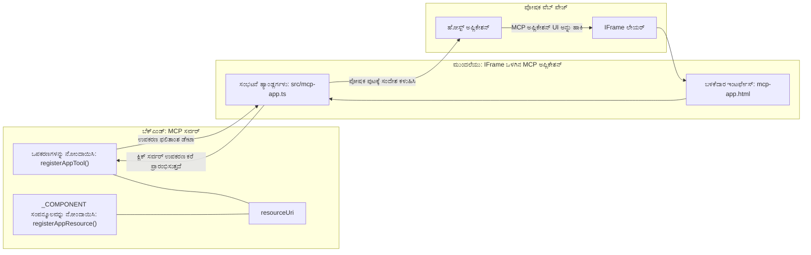
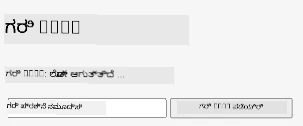
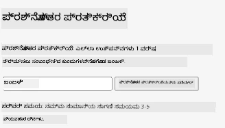
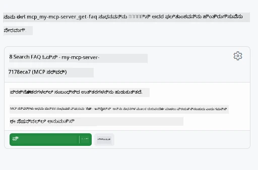
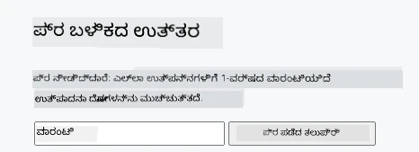

# MCP ಅಪ್‌ಗಳು

MCP ಅಪ್‌ಗಳು MCP ಯಲ್ಲಿ ಹೊಸ ಪರಿಕಲ್ಪನೆ ಆಗಿದೆ. ಆ ಯೋಚನೆ ಏನೆಂದರೆ ನೀವು ಒಮ್ಮೆಗೆ ಒزارುವ ಕೆಲವೊಂದು ಟೂಲ್ ಕರೆಮಾಡಿ ಡೇಟಾ בלבדವನ್ನು ಪ್ರತಿಕ್ರಿಯಿಸುವುದಲ್ಲದೆ, ಈ ಮಾಹಿತಿ ಹೇಗೆ ಸಂಪರ್ಕಿಸಬೇಕು ಎಂಬುದರ ಕುರಿತು ಮಾಹಿತಿ ಕೂಡ ಒದಗಿಸುತ್ತೀರಿ. ಇದರರ್ಥ ಇಂದು ಟೂಲ್ ಫಲಿತಾಂಶಗಳು UI ಮಾಹಿತಿಯನ್ನು ಹೊಂದಿರಬಹುದು. ಆದರೆ ಅದನ್ನು ನಾವು ಏಕೆ ಬಯಸಬೇಕು? ಹೌದು, ನೀವು ಇಂದು ಹೇಗೆ ಕಾರ್ಯನಿರ್ವಹಿಸುತ್ತೀರಿ ಎಂದು ಪರಿಗಣಿಸಿ. ನೀವು ಹೆಚ್ಚು MCP ಸರ್ವರ್ ಫಲಿತಾಂಶಗಳನ್ನು ಮುಂಭಾಗದಲ್ಲಿ ಕೆಲವೊಂದು ಕೋಡ್ ಬರೆಯಿರಿ ಮತ್ತು ನಿರ್ವಹಣೆ ಮಾಡುತ್ತೀರಿ. ಕೆಲವು ಸಮಯದಲ್ಲಿ ಅದೇ ಅಗತ್ಯವಿರುತ್ತದೆ, ಆದರೆ ಕೆಲವೊಮ್ಮೆ ನೀವು ಸಂಪೂರ್ಣ ಸ್ವತಂತ್ರವಾಗಿ ಎಲ್ಲಾ ಅಂಶಗಳನ್ನು ಹೊಂದಿರುವ ಒಂದು ಮಾಹಿತಿ ಸ್ಲೈಸ್ ಅನ್ನು ಕೇವಲ ತರುವುದು ಉತ್ಕೃಷ್ಟವಾಗುತ್ತದೆ.

## ಅವಲೋಕನ

ಈ ಪಾಠವು MCP ಅಪ್‌ಗಳ ಕುರಿತು ಪ್ರಾಯೋಗಿಕ ಮಾರ್ಗದರ್ಶನ ಒದಗಿಸುತ್ತದೆ, ಅದನ್ನು ಹೇಗೆ ಪ್ರಾರಂಭಿಸಲು ಮತ್ತು ನಿಮ್ಮ ಇಂದಿನ ವೆಬ್ ಅಪ್‌ಗಳಲ್ಲಿ ಹೇಗೆ ಸಂಯೋಜಿಸಲು ಎಂಬುದನ್ನು. MCP ಅಪ್‌ಗಳು MCP ಸ್ಟಾಂಡರ್ಡ್ ಗೆ ಒಂದು ಬಹಳ ಹೊಸ ಸೇರ್ಪಡೆ.

## ಕಲಿಕೆ ಉದ್ದೇಶಗಳು

ಈ ಪಾಠದ ಕೊನೆಯಲ್ಲಿ ನೀವು ಈವುಗಳಿಗೆ ಸಾಮರ್ಥ್ಯ ಹೊಂದಿರುತ್ತಾರೆ:

- MCP ಅಪ್‌ಗಳು ಎಂದು ಏನು ಎಂದು ವಿವರಿಸಿರಿ.
- ಯಾವಾಗ MCP ಅಪ್‌ಗಳನ್ನು ಉಪಯೋಗಿಸುವುದೆಂದು ತಿಳಿಯಿರಿ.
- ನಿಮ್ಮದೇ MCP ಅಪ್ಗಳನ್ನು ರಚಿಸಿ ಮತ್ತು ಸಂಯೋಜಿಸಿ.

## MCP ಅಪ್‌ಗಳು - ಇದು ಹೇಗೆ ಕೆಲಸ ಮಾಡುತ್ತವೆ

MCP ಅಪ್‌ಗಳೊಂದಿಗೆ ಯೋಚನೆ ಎಂದರೆ ಸಮರ್ಪಕವಾಗಿ ಒಂದು ಘಟಕವನ್ನು ರೆಂಡರ್ ಮಾಡಿಸಲು ಪ್ರತಿಕ್ರಿಯೆಯನ್ನು ಒದಗಿಸುವುದು. ಇಂತಹ ಘಟಕವು ದೃಶ್ಯಗಳು ಮತ್ತು ಪರಸ್ಪರಿಕತೆಗಳನ್ನು ಹೊಂದಿರಬಹುದು, ಉದಾ. ಬಟನ್ ಕ್ಲಿಕ್ ಮಾಡುವಿಕೆಗಳು, ಬಳಕೆದಾರ ಇನ್‌ಪುಟ್ ಮತ್ತು ಇನ್ನಷ್ಟು. ಸರ್ವರ್ ಭಾಗದಿಂದ ಪ್ರಾರಂಭಿಸೋಣ ನಾವು MCP ಸರ್ವರ್ ಹೊಂದಿದ್ದೇವೆ. ಒಂದು MCP ಅಪ್ ಘಟಕವನ್ನು ರಚಿಸಲು ನೀವು ಎರಡು ಒಂದು ಟೂಲ್ ಮತ್ತು ಅಪ್ಲಿಕೇಶನ್ ಸಂಪನ್ಮೂಲವನ್ನು ರಚಿಸಬೇಕಾಗುತ್ತದೆ. ಈ ಎರಡು ಭಾಗಗಳನ್ನು resourceUri ಮೂಲಕ ಸಂಪರ್ಕಿಸಲಾಗುತ್ತದೆ.

ಇದೆಯನ್ನು ವಿಸ್ತರಿಸುವ ಉದಾಹರಣೆ ಇಲ್ಲಿದೆ. ಯಾವುದೊಂದು ದೃಶ್ಯ ರೂಪಿಸಿಕೊಂಡು ಇದರಲ್ಲಿ ಯಾವ ಭಾಗ ಯಾವ ಕೆಲಸ ಮಾಡುತ್ತದೆ ನೋಡೋಣ:

```text
server.ts -- responsible for registering tools and the component as a UI component
src/
  mcp-app.ts -- wiring up event handlers
mcp-app.html -- the user interface
```

ಈ ಚಿತ್ರವು ಘಟಕವನ್ನು ರಚಿಸುವ ಆರ್ಕಿಟೆಕ್ಚರ್ ಮತ್ತು ಅದರ ಲಾಜಿಕ್ ಅನ್ನು ವಿವರಿಸುತ್ತದೆ.


ಮುಂದುವರೆದು ಬ್ಯಾಕ್‌ಎಂಡ್ ಮತ್ತು ಫ್ರಂಟ್‌ಎಂಡ್ ಜವಾಬ್ದಾರಿಗಳನ್ನು ವಿವರಿಸೋಣ.

### ಬ್ಯಾಕ್‌ಎಂಡ್

ನಾವು ಇಲ್ಲಿ ಎರಡು ಕಾರ್ಯಗಳನ್ನು ಮಾಡಬೇಕಾಗಿದೆ:

- ನಾವು ಸಂಪರ್ಕಿಸಬೇಕಾದ ಟೂಲ್‌ಗಳ ನೋಂದಣಿ ಮಾಡುವುದು.
- ಘಟಕವನ್ನು ನಿರ್ಧರಿಸುವುದು.

**ಟೂಲ್ ನೋಂದಣಿ**

```typescript
registerAppTool(
    server,
    "get-time",
    {
      title: "Get Time",
      description: "Returns the current server time.",
      inputSchema: {},
      _meta: { ui: { resourceUri } }, // ಈ ಉಪಕರಣವನ್ನು ಅದರ UI ಸಂಪನ್ಮೂಲಕ್ಕೆ ಸಂಪರ್ಕಿಸುತ್ತದೆ
    },
    async () => {
      const time = new Date().toISOString();
      return { content: [{ type: "text", text: time }] };
    },
  );

```

ಮುಂಬರುವ ಕೋಡ್ `get-time` ಎಂಬ ಟೂಲ್ ಅನ್ನು ಬಹಿರಂಗಪಡಿಸುವ ವಿಧಾನದ ಬಗ್ಗೆ ವಿವರಿಸುತ್ತದೆ. ಇದರ ಯಾವುದೇ ಇನ್‌ಪುಟ್ ಬೇಕಾಗಿಲ್ಲ ಆದರೆ ಇದರಿಂದ ನಮ್ಮ ಹಾಜರಿನ ಸಮಯವನ್ನು ಪಡೆಯಬಹುದು. ಬಳಕೆದಾರ ಇನ್‌ಪುಟ್ ಸ್ವೀಕರಿಸುವ ಅಗತ್ಯವಿದಾಗ ನಾವು `inputSchema` ಅನ್ನು ಟೂಲ್‌ಗಳಿಗೆ ನಿರ್ಧರಿಸುವ ಸಾಮರ್ಥ್ಯ ಹೊಂದಿದ್ದೇವೆ.

**ಘಟಕ ನೋಂದಣಿ**

ಅದೇ ಫೈಲ್‌ನಲ್ಲಿ, ನಾವು ಘಟಕದ ನೋಂದಣಿಯನ್ನು ಮಾಡಬೇಕಾಗುತ್ತದೆ:

```typescript
const resourceUri = "ui://get-time/mcp-app.html";

// ಬಳಸಿ, ಇದು UIಗಾಗಿ ಬಂಡಲ್ ಮಾಡಿದ HTML/JavaScript ಅನ್ನು ಹಿಂತಿರುಗಿಸುತ್ತದೆ.
registerAppResource(
  server,
  resourceUri,
  resourceUri,
  { mimeType: RESOURCE_MIME_TYPE },
  async () => {
    const html = await fs.readFile(path.join(DIST_DIR, "mcp-app.html"), "utf-8");

    return {
    contents: [
        { uri: resourceUri, mimeType: RESOURCE_MIME_TYPE, text: html },
    ],
    };
  },
);
```

ನಾವು ಯಾವುದೇ ಟೂಲ್‌ಗಳನ್ನು ಘಟಕಕ್ಕೆ ಸಂಪರ್ಕಿಸಲು `resourceUri` ಅನ್ನು ಹೇಗೆ குறிப்பிடುತ್ತೇವೆ ನೋಡಿರಿ. ಗಮನಾರ್ಹವಾದದ್ದು ನಾವು UI ಫೈಲ್ನ್ನು ಲೋಡ್ ಮಾಡಿ ಘಟಕ ವಾಪಸ್ ಮಾಡೋ ಜವಾಬ್ದಾರಿಯ 콜್ಬ್ಯಾಕ್ ಕೂಡ ಇದಾಗಿದೆ.

### ಘಟಕದ ಫ್ರಂಟ್‌ಎಂಡ್

ಬ್ಯಾಕ್‌ಎಂಡ್ ಪ್ರಕಾರ ಇಲ್ಲಿಯೂ ಎರಡು ವಿಭಾಗಗಳಿವೆ:

- ಶುದ್ಧ HTML ನಲ್ಲಿ ಬರೆದಿರುವ ಫ್ರಂಟ್‌ಎಂಡ್.
- ಈವೆಂಟ್‌ಗಳನ್ನು ನಿಯಂತ್ರಿಸುವ ಮತ್ತು ಕೆಲಸ ಮಾಡಿಸುವ ಕೋಡ್, ಉದಾ. ಟೂಲ್‌ಗಳನ್ನು ಕರೆ ಮಾಡುವುದು ಅಥವಾ ಪೋಷಕ ವಿಂಡೋಗೆ ಸಂದೇಶಗಳನ್ನು ಕಳುಹಿಸುವುದು.

**ಬಳಕೆದಾರ ಇಂಟರ‍್ಫೇಸು**

ಬಳಕೆದಾರ ಇಂಟರ್ಫೇಸ್ ನೋಡೋಣ.

```html
<!-- mcp-app.html -->
<!DOCTYPE html>
<html lang="en">
  <head>
    <meta charset="UTF-8" />
    <title>Get Time App</title>
  </head>
  <body>
    <p>
      <strong>Server Time:</strong> <code id="server-time">Loading...</code>
    </p>
    <button id="get-time-btn">Get Server Time</button>
    <script type="module" src="/src/mcp-app.ts"></script>
  </body>
</html>
```

**ಈವೆಂಟ್ ವಾಯರ್‌ಅಪ್**

ಕೊನೆಯ ಭಾಗ ಈವೆಂಟ್ ವಾಯರ್‌ಅಪ್ ಆಗಿದೆ. ಇದರರ್ಥ UI ಯ ಯಾವ ಭಾಗಗಳಿಗೆ ಈವೆಂಟ್ ಹ್ಯಾಂಡ್ಲರ್ ಬೇಕೋ ಬೇರೆಯಾಗಿ ಈವೆಂಟ್‌ಗಳು ಸಕ್ರಿಯವಾದಾಗ ಏನು ಮಾಡಬೇಕು ಎಂದು ಗುರುತು ಮಾಡುವುದು:

```typescript
// mcp-app.ts

import { App } from "@modelcontextprotocol/ext-apps";

// ಘಟಕ ಉಲ್ಲೇಖಗಳನ್ನು ಪಡೆಯಿರಿ
const serverTimeEl = document.getElementById("server-time")!;
const getTimeBtn = document.getElementById("get-time-btn")!;

// ಅಪ್ಲಿಕೇಶನ್ ಉದಾಹರಣೆ ರಚಿಸಿ
const app = new App({ name: "Get Time App", version: "1.0.0" });

// ಸರ್ವರ್‌ನಿಂದ ಟೂಲ್ ಫಲಿತಾಂಶಗಳನ್ನು ನಿರ್ವಹಿಸಿ. ಪ್ರಾರಂಭದಲ್ಲಿ `app.connect()` ಮುನ್ನ ಸೆಟ್ ಮಾಡಿ ತಪ್ಪಿಸುವುದರಿಂದ
// ಆರಂಭಿಕ ಟೂಲ್ ಫಲಿತಾಂಶವನ್ನು ತಪ್ಪಿಸುವುದನ್ನು ತಡೆಯಲು.
app.ontoolresult = (result) => {
  const time = result.content?.find((c) => c.type === "text")?.text;
  serverTimeEl.textContent = time ?? "[ERROR]";
};

// ಬಟನ್ ಕ್ಲಿಕ್ ಅನ್ನು ಸಂಪರ್ಕಿಸಿ
getTimeBtn.addEventListener("click", async () => {
  // `app.callServerTool()` UI ಗೆ ಸರ್ವರ್‌ನಿಂದ ಹೊಸ ಡೇಟಾವನ್ನು ವಿನಂತಿಸಲು ಅವಕಾಶ ನೀಡುತ್ತದೆ
  const result = await app.callServerTool({ name: "get-time", arguments: {} });
  const time = result.content?.find((c) => c.type === "text")?.text;
  serverTimeEl.textContent = time ?? "[ERROR]";
});

// ಹೋಸ್ಟ್‌ಕ್ಕೆ ಸಂಪರ್ಕಿಸಿರಿ
app.connect();
```

ಮೇಲಿನ ಕೋಡ್‌ನಿಂದ ನೀವು ನೋಡಬಹುದು, ಇದು DOM ಎಲೆಮೆಂಟ್‌ಗಳನ್ನು ಈವೆಂಟ್‌ಗಳಿಗೆ ಸಂಪರ್ಕಿಸುವ ಸಾಮಾನ್ಯ ಕೋಡ್. ವಿಶೇಷವಾಗಿ `callServerTool` ಗೆ ಕರೆ ಮಾಡುವುದನ್ನು ಗಮನಿಸಿ, ಇದು ಬ್ಯಾಕ್‌ಎಂಡಿನಲ್ಲಿರುವ ಟೂಲ್ ಅನ್ನು ಕರೆಮಾಡುತ್ತದೆ.

## ಬಳಕೆದಾರ ಇನ್‌ಪುಟ್ ಅನ್ನು ಹ್ಯಾಂಡ್ಲಿಂಗ್ ಮಾಡುವುದು

ಇಲ್ಲWarehouse, ನಾವು ಒಂದು ಬಟನ್ ಹೊಂದಿರುವ ಘಟಕವನ್ನು ನೋಡಿದೇವಿ, ಅದನ್ನು ಕ್ಲಿಕ್ ಮಾಡಿದಾಗ ಟೂಲ್ ಅನ್ನು ಕರೆ ಮಾಡುತ್ತದೆ. ಈಗ ನಮಗೆ ಇನ್ನಷ್ಟು UI ಅಂಶಗಳನ್ನು ಸೇರಿಸಿ ಒಂದು ಇನ್‌ಪುಟ್ ಫೀಲ್ಡ್ ಮೂಲಕ ಟೂಲ್ ಗೆ_ARGUMENTS ಕಳುಹಿಸುವುದನ್ನು ಪ್ರಯತ್ನಿಸೋಣ. ಒಂದು FAQ ಕಾರ್ಯಾಚರಣೆಯನ್ನು ಜಾರಿಗೆ ತೋರೋಣ. ಇದೊಂದು ಇಂಥದಾಗಿರಬೇಕು:

- ಒಂದು ಬಟನ್ ಮತ್ತು ಇನ್‌ಪುಟ್‌ ಎಲಿಮೆಂಟ್ ಇರಬೇಕು, ಬಳಕೆದಾರ ಉದಾ. "Shipping" ಎಂಬ ಕೀವರ್ಡ್ ಅನ್ನು ಟೈಪ್ ಮಾಡಿ ಹುಡುಕಲು. ಇದರಿಂದ ಬ್ಯಾಕ್‌ಎಂಡ್ ನಲ್ಲಿ FAQ ಡೇಟಾದಲ್ಲಿ ಹುಡುಕುವ ಟೂಲ್ ಅನ್ನು ಕರೆ ಮಾಡಲಾಗುತ್ತದೆ.
- ಉಲ್ಲೇಖಿಸಿದ FAQ ಹುಡುಕುವ ಟೂಲ್.

ಮೊದಲು ಬ್ಯಾಕ್‌ಎಂಡ್‌ಗೆ ಅಗತ್ಯ ನೆರವನ್ನೂ ಸೇರಿಸೋಣ:

```typescript
const faq: { [key: string]: string } = {
    "shipping": "Our standard shipping time is 3-5 business days.",
    "return policy": "You can return any item within 30 days of purchase.",
    "warranty": "All products come with a 1-year warranty covering manufacturing defects.",
  }

registerAppTool(
    server,
    "get-faq",
    {
      title: "Search FAQ",
      description: "Searches the FAQ for relevant answers.",
      inputSchema: zod.object({
        query: zod.string().default("shipping"),
      }),
      _meta: { ui: { resourceUri: faqResourceUri } }, // ಈ ಸಾಧನವನ್ನು ಅದರ UI ಸಂಪನ್ಮೂಲಕ್ಕೆ ಲಿಂಕ್ ಮಾಡುತ್ತದೆ
    },
    async ({ query }) => {
      const answer: string = faq[query.toLowerCase()] || "Sorry, I don't have an answer for that.";
      return { content: [{ type: "text", text: answer }] };
    },
  );
```

ನಾವು ಇಲ್ಲಿ `inputSchema` ಅನ್ನು ತುಂಬಿಸುವ ರೀತಿಯನ್ನು ನೋಡುತ್ತಿದ್ದೇವೆ ಮತ್ತು ಅದರೊಂದಿಗೆ `zod` ಸ್ಕೀಮಾ ನೀಡುತ್ತಿದ್ದೇವೆ:

```typescript
inputSchema: zod.object({
  query: zod.string().default("shipping"),
})
```

ಮೇಲಿನ ಸ್ಕೀಮಾ ಯಲ್ಲಿ ನಾವು `query` ಎಂಬ ವಿಶೇಷ ಇನ್‌ಪುಟ್ ಪರಿಮಾಣ ಇದೆ ಅದನ್ನು ಐಚ್ಛಿಕ ಮತ್ತು ಡೀಫಾಲ್ಟ್ ಮೌಲ್ಯ "shipping" ಎಂದು ಘೋಷಿಸಿದ್ದೇವೆ.

ಸರಿ, ಈಗ *mcp-app.html* ಗೆ ಹೋಗಿ ನಾವು ಯಾವ UI ಬೇಕು ಅಂತ ನೋಡಿ:

```html
<div class="faq">
    <h1>FAQ response</h1>
    <p>FAQ Response: <code id="faq-response">Loading...</code></p>
    <input type="text" id="faq-query" placeholder="Enter FAQ query" />
    <button id="get-faq-btn">Get FAQ Response</button>
  </div>
```

ಶ್ರೇಷ್ಟ, ಈಗ ನಮಗೆ ಇನ್‌ಪುಟ್ ಎಲೆಮೆಂಟ್ ಮತ್ತು ಬಟನ್ ಇದೆ. *mcp-app.ts* ಗೆ ಹೋಗಿ ಈ ಈವೆಂಟ್‌ಗಳನ್ನು ಸಂಪರ್ಕಿಸೋಣ:

```typescript
const getFaqBtn = document.getElementById("get-faq-btn")!;
const faqQueryInput = document.getElementById("faq-query") as HTMLInputElement;

getFaqBtn.addEventListener("click", async () => {
  const query = faqQueryInput.value;
  const result = await app.callServerTool({ name: "get-faq", arguments: { query } });
  const faq = result.content?.find((c) => c.type === "text")?.text;
  faqResponseEl.textContent = faq ?? "[ERROR]";
});
```

ಮೇಲಿನ ಕೋಡ್‌ನಲ್ಲಿ ನಾವು:

- ಮುಖ್ಯ UI ಅಂಶಗಳಿಗೆ ರೆಫರೆನ್ಸ್‌ಗಳನ್ನು ರಚಿಸುತ್ತೇವೆ.
- ಬಟನ್ ಕ್ಲಿಕ್ ಅನ್ನು ಪಾರ್ಸ್ ಮಾಡಿ ಇನ್‌ಪುಟ್ ಮೌಲ್ಯವನ್ನು ಪಡೆಯುತ್ತೇವೆ ಹಾಗೂ `app.callServerTool()` ಅನ್ನು `name` ಮತ್ತು `arguments` ಜೊತೆ ಕರೆಯಲಾಗುತ್ತದೆ, ಇಲ್ಲಿ `arguments` ಅಂದರೆ `query` ವೇರಿಯಬಲ್ ಮೂಲಕ ಮೌಲ್ಯ ನೀಡಲಾಗುತ್ತದೆ.

ನೀವು `callServerTool` ಅನ್ನು ಕರೆ ಮಾಡಿದಾಗ ಪ್ರತ್ಯಕ್ಷವಾಗಿ ಏನಾಗುತ್ತದಂದರೆ ಅದು ಪೋಷಕ ವಿಂಡೋಗೆ ಸಂದೇಶ ಕಳುಹಿಸುತ್ತದೆ ಮತ್ತು ಆ ವಿಂಡೋ MCP ಸರ್ವರ್ ಅನ್ನು ಕರೆ ಮಾಡುತ್ತದೆ.

### ಪ್ರಯತ್ನಿಸಿ ನೋಡಿ

ಇದನ್ನು ಪ್ರಯತ್ನಿಸಿದಾಗ ನಾವು ಕೆಳಗಿನವುಗಳನ್ನು ಕಾಣಬಹುದು:



ಇಲ್ಲಿದೆ ನಾವು "warranty" ಒಳಪಡಿಸಿ ಪ್ರಯತ್ನಿಸುವುದು:



ಈ ಕೋಡ್ ಅನ್ನು ಓಡಿಸಲು, [Code section](./code/README.md) ಗೆ ಹೋಗಿ.

## Visual Studio Code ನಲ್ಲಿ ಪರೀಕ್ಷೆ

Visual Studio Code ನಲ್ಲಿ MVP ಅಪ್‌ಗಳಿಗೆ ಉತ್ತಮ ಬೆಂಬಲವಿದೆ ಮತ್ತು ನಿಮ್ಮ MCP ಅಪ್‌ಗಳನ್ನು ಪರೀಕ್ಷಿಸುವ ಅತ್ಯಂತ ಸುಲಭ ವಿಧಾನಗಳಲ್ಲಿ ಒಂದಾಗಿದೆ. Visual Studio Code ಬಳಸಲು, *mcp.json* ಗೆ ಸರ್ವರ್ ಎಂಟ್ರಿಯನ್ನು ಸೇರಿಸಿ:

```json
"my-mcp-server-7178eca7": {
    "url": "http://localhost:3001/mcp",
    "type": "http"
  }
```

ನಂತರ ಸರ್ವರ್ ಅನ್ನು ಪ್ರಾರಂಭಿಸಿ, ನೀವು MVP ಅಪ್ ಮೂಲಕ ಚಾಟ್ ವಿಂಡೋ ಮೂಲಕ ಸಂವಹನ ಮಾಡಬಹುದು, ನೀವು GitHub Copilot ಇನ್ಸ್ಟಾಲ್ ಮಾಡಿದ್ದರೆ.

ಪ್ರಾಂಪ್ಟ್ ಮೂಲಕ ಉದಾಹರಣೆಗೆ "#get-faq" ಅನ್ನು ಚಾಲನೆ ಮಾಡಿ:



ನೀವು ಬ್ರೌಸರ್ ಮೂಲಕ ಚಾಲನೆ ಮಾಡಿದಂತೆ, ಇದು ಇದೇ ರೀತಿ ರೆಂಡರ್ ಆಗುತ್ತದೆ:



## ಕಾರ್ಯ

ರಾಕ್ ಪೇಪರ್ ಸಿಸ್ಸರ್ ಆಟವನ್ನು ರಚಿಸಿ. ಅದು ಕೆಳಗಿನ ಅಂಶಗಳನ್ನು ಹೊಂದಿರಬೇಕು:

UI:

- ಆಯ್ಕೆಗಳುಳ್ಳ ಡ್ರಾಪ್ ಡೌನ್ ಲಿಸ್ಟ್
- ಆಯ್ಕೆಯನ್ನು ಸಲ್ಲಿಸಲು ಬಟನ್
- ಯಾರು ಯಾವ ಆಯ್ಕೆಯನ್ನು ತೆಗೆದುಕೊಂಡರೋ ಮತ್ತು ಯಾರು ಗೆದ್ದಾರೋ ತೋರಿಸುವ ಲೇಬಲ್

ಸರ್ವರ್:

- "choice" ಎಂಬ ಇನ್‌ಪುಟ್ ತೆಗೆದುಕೊಳ್ಳುವ ರಾಕ್ ಪೇಪರ್ ಸಿಸ್ಸರ್ ಟೂಲ್ ಇರಬೇಕು. ಇದು ಕಂಪ್ಯೂಟರ್ ಆಯ್ಕೆಯನ್ನು ರೆಂಡರ್ ಮಾಡಬೇಕು ಮತ್ತು ಗೆಲುವುವೇಯಾರೋ ನಿರ್ಧರಿಸಬೇಕು.

## ಪರಿಹಾರ

[Solution](./assignment/README.md)

## ಸಾರಾಂಶ

ನಾವು ಈ ಹೊಸ ಪರಿಕಲ್ಪನೆ MCP ಅಪ್‌ಗಳ ಬಗ್ಗೆ ಕಲಿತೀವಿ. ಇದು MCP ಸರ್ವರ್‌ಗಳಿಗೆ ಡೇಟಾ ಮಾತ್ರವಲ್ಲದೆ ಈ ಡೇಟಾ ಹೇಗೆ ಪ್ರಸ್ತುತಪಡಿಸಬೇಕು ಎಂಬ ಅಭಿಪ್ರಾಯವನ್ನು ಹೊಂದಲು ಅವಕಾಶ ನೀಡುವ ಹೊಸ ಪರಿಕಲ್ಪನೆ.

ಇದು ಹೆಚ್ಚುವರಿ, MCP ಅಪ್‌ಗಳು IFrame ನಲ್ಲಿ ಹೋಸ್ಟ್ ಆಗುತ್ತವೆ ಮತ್ತು MCP ಸರ್ವರ್‌ಗಳೊಂದಿಗೆ ಸಂವಹನ ಮಾಡಲು ಅವರು ಪೋಷಕ ವೆಬ್ ಅಪ್ ಗೆ ಸಂದೇಶಗಳನ್ನು ಕಳುಹಿಸಬೇಕು. ಇದರ ಸಂವಹನ ಸುಲಭಗೊಳಿಸಲು ಸಾಕಷ್ಟು ಗ್ರಂಥಾಲಯಗಳು plain JavaScript, React ಮತ್ತು ಇನ್ನಷ್ಟು ಲಭ್ಯವಿವೆ.

## ಪ್ರಮುಖ ಕಲಿತ ಅಂಶಗಳು

ನೀವು ಈವುಗಳನ್ನು ಕಲಿತೀರಿ:

- MCP ಅಪ್‌ಗಳು ಡೇಟಾ ಮತ್ತು UI ವೈಶಿಷ್ಟ್ಯಗಳನ್ನು ಒಟ್ಟಿಗೆ ಸಾಗಿಸಲು ಉಪಯುಕ್ತವಾಗಬಲ್ಲ ಹೊಸ ಸ್ಟಾಂಡರ್ಡ್.
- ಭದ್ರತೆಗಾಗಿ ಇವು IFrame ನಲ್ಲಿ ಚಲಿಸುತ್ತವೆ.

## ಮುಂದಿನ ಹಂತ

- [ಅಧ್ಯಾಯ 4](../../04-PracticalImplementation/README.md)

---

<!-- CO-OP TRANSLATOR DISCLAIMER START -->
**ಅಸ್ವೀಕರಣ**:  
ಈ ದಸ್ತಾವೇಜನ್ನು AI ಅನುವಾದ ಸೇವೆ [ದ Copa Translator](https://github.com/Azure/co-op-translator) ಬಳಸಿ ಅನುವಾದಿಸಲಾಗಿದೆ. ನಾವು ನಿಖರತೆಗೆ ಪ್ರಯತ್ನಿಸಿದರೂ, ಸ್ವಯಂಚಾಲಿತ ಅನುವಾದಗಳಲ್ಲಿ ತಪ್ಪುಗಳು ಅಥವಾ ಅಸತ್ಯತೆಗಳು ಇರಬಹುದು ಎಂಬುದನ್ನು ಗಮನದಲ್ಲಿಡಿ. ಮೂಲ ಭಾಷೆಯ ದಸ್ತಾವೇಜುದೇ ನಿಜವಾದ ಮತ್ತು ಅಧಿಕೃತ ಮೂಲವಾಗಿರುತ್ತದೆ. ಸ್ತರವಾದ ಮಾಹಿತಿಗಾಗಿ ವೃತ್ತಿಪರ ಮಾನವ ಅನುವಾದವನ್ನು ಶಿಫಾರಸು ಮಾಡಲಾಗುತ್ತದೆ. ಈ ಅನುವಾದ ಬಳಕೆಯಿಂದ ಉಂಟಾಗುವ ಯಾವುದೇ ಅರ್ಥ ಕಳಪೆ ಅಥವಾ ಅರ್ಥಭ್ರಷ್ಟತೆಗಳಿಗೆ ನಾವು ಜವಾಬ್ದಾರರಲ್ಲ.
<!-- CO-OP TRANSLATOR DISCLAIMER END -->