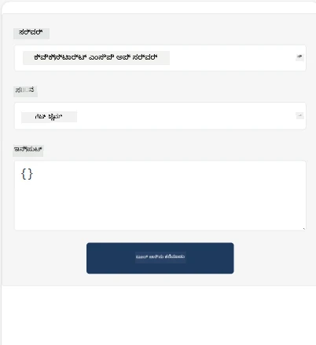
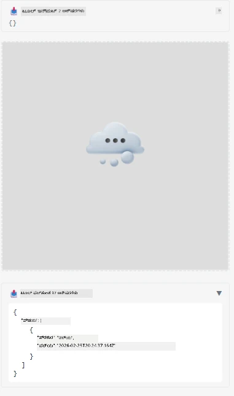

Here's a sample demonstrating MCP App

## Install 

1. *mcp-app* ಫೋಲ್ಡರ್‌ಗೆ ನವಿಗೇಟ್ ಮಾಡಿ  
1. `npm install` ರನ್ ಮಾಡಿ, ಇದರಿಂದ ಫ್ರಂಟ್ಎಂಡ್ ಮತ್ತು ಬ್ಯಾಕ್ಎಂಡ್ ಅವಲಂಬನೆಗಳು ಸ್ಥಾಪಿತವಾಗಬೇಕು

ಬ್ಯಾಕ್ಎಂಡ್ ಸ_compiles_ ಆಗುತ್ತಿದೆಯೇ ಎಂದು ಪರಿಶೀಲಿಸಲು ಕೆಳಕಂಡನ್ನು ರನ್ ಮಾಡಿ:

```sh
npx tsc --noEmit
```
  
ಎಲ್ಲವೂ ಸರಿಯಾಗಿದ್ದರೆ ಯಾವುದೇ ಔಟ್‌ಪುಟ್ ಇರಬಾರದು.

## ಬ್ಯಾಕ್ಎಂಡ್ ರನ್ ಮಾಡಿ

> ನೀವು ವಿಂಡೋಸ್ ಯಂತ್ರದಲ್ಲಿ ಇದ್ದರೆ ಸ್ವಲ್ಪ ಹೆಚ್ಚುವರಿದ ಕಷ್ಟ ಬರುತ್ತದೆ, ಕಾರಣ MCP Apps ಪರಿಹಾರವು `concurrently` ಲೈಬ್ರರಿ ಬಳಸುತ್ತದೆ ಅದಕ್ಕಾಗಿ ನಿಮಗೆ ಬದಲಾವಣೆ ಹುಡುಕಬೇಕಾಗುತ್ತದೆ. ಇಲ್ಲಿ MCP App ನ *package.json* ನಲ್ಲಿ ತಪ್ಪಾದ ಪಂಕ್ತಿ ಇದೆ:

    ```json
    "start": "concurrently \"cross-env NODE_ENV=development INPUT=mcp-app.html vite build --watch\" \"tsx watch main.ts\""
    ```

ಈ ಅಪ್ಲಿಕೇಶನ್ ಎರಡು ಭಾಗಗಳಿವೆ, ಒಂದು ಬ್ಯಾಕ್ಎಂಡ್ ಭಾಗ ಮತ್ತು ಒಂದು ಹೋಸ್ಟ್ ಭಾಗ.

ಬ್ಯಾಕ್ಎಂಡ್ ಪ್ರಾರಂಭಿಸಲು ಕಾಲ್ ಮಾಡಿ:

```sh
npm start
```
  
ಇದು ಬ್ಯಾಕ್ಎಂಡ್ ಅನ್ನು `http://localhost:3001/mcp` ನಲ್ಲಿ ಪ್ರಾರಂಭಿಸಬೇಕು.

> ಗಮನಿಸಿ, ನೀವು Codespace ನಲ್ಲಿದ್ದರೆ, ಪೋರ್ಟ್ ವೀಕ್ಷಣೆಯನ್ನು ಸಾರ್ವಜನಿಕ ಮಾಡಬೇಕಾಗಬಹುದು. https://<Codespace ನ ಹೆಸರು>.app.github.dev/mcp ಮೂಲಕ ಬ್ರೌಸರ್ ನಲ್ಲಿ ಎಂಡ್ಪಾಯಿಂಟ್ ತಲುಪಬಹುದು ಎಂದು ಪರಿಶೀಲಿಸಿ

## ಆಯ್ಕೆ -1 Visual Studio Code ನಲ್ಲಿ ಅಪ್ಲಿಕೇಶನ್ ಪರೀಕ್ಷಿಸಿ

Visual Studio Code ನಲ್ಲಿ ಪರಿಹಾರವನ್ನು ಪರೀಕ್ಷಿಸಲು, ಕೆಳಕಂಡಂತೆ ಮಾಡಿರಿ:

- `mcp.json` ಗೆ ಒಂದು ಸರ್ವರ್ ಎಂಟ್‌ರಿ ಸೇರಿಸಿ:

    ```json
    {
        "servers": {
            "my-mcp-server-7178eca7": {
                "url": "http://localhost:3001/mcp",
                "type": "http"
            }
        },
        "inputs": []
    }
    ```
  
1. *mcp.json* ನಲ್ಲಿ "start" ಬಟನ್ ಕ್ಲಿಕ್ ಮಾಡಿ  
1. ಚಾಟ್ ವಿಂಡೋow ತೆರೆಯಿರಿ ಮತ್ತು `get-faq` ಟೈಪ್ ಮಾಡಿ, ಕೆಳಗಿನಂತೆಯೇ ಫಲಿತಾಂಶ ಕಾಣಿಸಬೇಕು:

    

## ಆಯ್ಕೆ -2- ಹೋಸ್ಟ್ ಮೂಲಕ ಅಪ್ಲಿಕೇಶನ್ ಪರೀಕ್ಷಿಸಿ

<https://github.com/modelcontextprotocol/ext-apps> ರೆಪೊದಲ್ಲಿ ವಿವಿಧ ಹೋಸ್ಟ್‌ಗಳು ಇವೆ, ನೀವು ಅವುಗಳನ್ನು ನನ್ನ MVP ಅಪ್ಲಿಕೇಶನ್‌ಗಳನ್ನು ಪರೀಕ್ಷಿಸಲು ಬಳಸಬಹುದು.

ಇಲ್ಲಿ ನಾವು ನಿಮಗೆ ಎರಡು ವಿಭಿನ್ನ ಆಯ್ಕೆಗಳನ್ನು ನೀಡುತ್ತೇವೆ:

### ಲೊಕಲ್ ಯಂತ್ರ

- ರೆಪೊ ಕ್ಲೋನ್ ಆದ ನಂತರ *ext-apps* ಗೆ ನವಿಗೇಟ್ ಮಾಡಿ.

- ಅವಲಂಬನೆಗಳನ್ನು ಸ್ಥಾಪಿಸಿ

   ```sh
   npm install
   ```
  
- ಬೇರೆ ಟರ್ಮಿನಲ್ ವಿಂಡೋದಲ್ಲಿ *ext-apps/examples/basic-host* ಗೆ ನವಿಗೇಟ್ ಮಾಡಿ  

    > ನೀವು Codespace ಇದ್ದರೆ, serve.ts ಫೈಲ್ ಮತ್ತು 27ನೇ ಸಾಲಿಗೆ ಹೋಗಿ http://localhost:3001/mcp ಅನ್ನು ನಿಮ್ಮ Codespace URL ಗೆ ಬದಲಾಯಿಸಬೇಕು, ಉದಾಹರಣೆಗೆ https://psychic-xylophone-657rpjgvxpc5g64-3001.app.github.dev/mcp

- ಹೋಸ್ಟ್ ಅನ್ನು ಓಡಿಸಿ:

    ```sh
    npm start
    ```
  
    ಇದರಿಂದ ಹೋಸ್ಟ್ ಬ್ಯಾಕ್ಎಂಡ್ ನೊಂದಿಗೆ ಸಂಪರ್ಕ ಹೊಂದುತ್ತೆ ಮತ್ತು ಅಪ್ಲಿಕೇಶನ್ ಈ ಕೆಳಗಿನಂತೆ ಚಾಲನೆಯಲ್ಲಿರುತ್ತದೆ:

    

### Codespace

Codespace ಪರಿಸರ ಕಾರ್ಯಗತಗೊಳಿಸಲು ಸ್ವಲ್ಪ ಹೆಚ್ಚುವರಿದ ಕೆಲಸ ಮಾಡಬೇಕಾಗುತ್ತದೆ. Codespace ಮೂಲಕ ಹೋಸ್ಟ್ ಉಪಯೋಗಿಸಲು: 

- *ext-apps* ಡೈರೆಕ್ಟರಿಯನ್ನು ನೋಡಿ *examples/basic-host* ಗೆ ನವಿಗೇಟ್ ಮಾಡಿ.  
- `npm install` ರನ್ ಮಾಡಿ ಅವಲಂಬನೆಗಳನ್ನು ಸ್ಥಾಪಿಸಲು  
- `npm start` ರನ್ ಮಾಡಿ ಹೋಸ್ಟ್ ಪ್ರಾರಂಭಿಸಲು.

## ಅಪ್ಲಿಕೇಶನ್ ಪರೀಕ್ಷಿಸಿ

ನಿಮ್ಮ ಅಪ್ಲಿಕೇಶನ್ ಅನ್ನು ಕೆಳಕಂಡ ರೀತಿಯಲ್ಲಿ ಪ್ರಯತ್ನಿಸಿ:

- "Call Tool" ಬಟನ್ ಆಯ್ಕೆಮಾಡಿ, ಫಲಿತಾಂಶಗಳು ಕೆಳಕಂಡಂತೆ ಕಾಣಿಸಬೇಕು:

    

ಶ್ರೇಷ್ಠ, ಎಲ್ಲವೂ ಸರಿಯಾಗಿ ಕಾರ್ಯನಿರ್ವಹಿಸುತ್ತಿದೆ.

---

<!-- CO-OP TRANSLATOR DISCLAIMER START -->
**ಜವಾಬ್ದಾರಿಗೆ ವಿನಂತಿ**:  
ಈ ದಸ್ತಾವೇಜನ್ನು AI ಅನುವಾದ ಸೇವೆ [Co-op Translator](https://github.com/Azure/co-op-translator) ಬಳಸಿ ಭಾಷಾಂತರಿಸಲಾಗಿದೆ. ನಾವು ಶುದ್ಧತೆಯನ್ನು ಪ್ರಯತ್ನಿಸಲಿದ್ದರೂ, ಸ್ವಯಂಚಾಲಿತ ಅನುವಾದಗಳಲ್ಲಿ ತಪ್ಪುಗಳು ಅಥವಾ ಅಸತ್ಯತೆಗಳಿರುವ ಸಾಧ್ಯತೆ ಇದೆ. ಮೂಲ ದಾಖಲೆ ಅದರ ಸ್ವದೇಶಿ ಭಾಷೆಯಲ್ಲಿ ಅಧಿಕಾರಪ್ರಾಪ್ತ स्रोतವಾಗಿದೆ ಎಂದು ಪರಿಗಣಿಸಬೇಕು. ಪ್ರಮುಖ ಮಾಹಿತಿಗಾಗಿ, ವೃತ್ತಿಪರ ಮಾನವ ಅನುವಾದವನ್ನು ಶಿಫಾರಸು ಮಾಡಲಾಗುತ್ತದೆ. ಈ ಅನುವಾದವನ್ನು ಬಳಕೆ ಮಾಡುವುದರಿಂದ ಉಂಟಾಗುವ ಯಾವುದೇ ತಪ್ಪುфи 이해 या ದುರುಪಯೋಗಕ್ಕೆ ನಾವು ಜವಾಬ್ದಾರಿಯಲ್ಲ.
<!-- CO-OP TRANSLATOR DISCLAIMER END -->