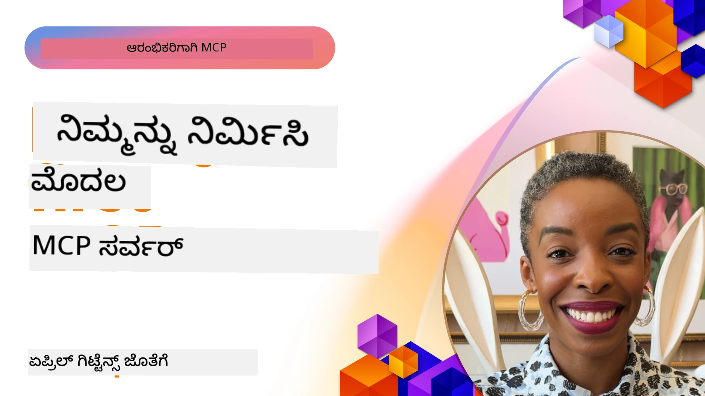

## ಆರಂಭಿಸುವುದು  

_(ಈ ಪಾಠದ ವೀಡಿಯೋವನ್ನು ನೋಡಲು ಮೇಲಿನ ಚಿತ್ರವನ್ನು ಕ್ಲಿಕ್ ಮಾಡಿ)_

ಈ ವಿಭಾಗದಲ್ಲಿ ಹಲವಾರು ಪಾಠಗಳಿವೆ:

- **1 ನಿಮ್ಮ ಮೊದಲ ಸರ್ವರ್**, ಈ ಮೊದಲ ಪಾಠದಲ್ಲಿ, ನೀವು ನಿಮ್ಮ ಮೊದಲ ಸರ್ವರ್ ಅನ್ನು ರಚಿಸುವುದು ಮತ್ತು ಅದನ್ನು ಇನ್ಸ್‌ಪೆಕ್ಟರ್ ಉಪಕರಣದಿಂದ ಪರಿಶೀಲಿಸುವುದನ್ನು ಕಲಿಯುತ್ತೀರಿ, ಇದು ನಿಮ್ಮ ಸರ್ವರ್ ಅನ್ನು ಪರೀಕ್ಷಿಸಲು ಮತ್ತು ಡಿಬಗ್ ಮಾಡಲು ಅಮೂಲ್ಯ ಮಾರ್ಗವಾಗಿದೆ, [ಪಾಠಕ್ಕೆ](01-first-server/README.md)

- **2 ಕ್ಲೈಂಟ್**, ಈ ಪಾಠದಲ್ಲಿ, ನೀವು ನಿಮ್ಮ ಸರ್ವರ್ಗೆ ಸಂಪರ್ಕಗೊಳ್ಳಬಹುದಾದ ಕ್ಲೈಂಟ್ ಬರೆಯುವುದನ್ನು ಕಲಿಯುತ್ತೀರಿ, [ಪಾಠಕ್ಕೆ](02-client/README.md)

- **3 LLM ಹೊಂದಿರುವ ಕ್ಲೈಂಟ್**, ಕ್ಲೈಂಟ್ ಬರೆಯುವ ಇನ್ನೂ ಉತ್ತಮ ಮಾರ್ಗವು ಅದಕ್ಕೆ LLM ಸೇರಿಸುವುದು, ಇದರಿಂದ ಇದು ನಿಮ್ಮ ಸರ್ವರೊಂದಿಗೆ "ವರ್ತನೇ" ಮಾಡಬಹುದು, ಹೇಗೆ ಮಾಡಬೇಕು ಎಂಬುದನ್ನು ತಿಳಿದುಕೊಳ್ಳಿ, [ಪಾಠಕ್ಕೆ](03-llm-client/README.md)

- **4 Visual Studio Code ನಲ್ಲಿ GitHub Copilot ಏಜೆಂಟ್ ಮೋಡ್ ಬಳಸಿ ಸರ್ವರ್ ಬಳಕೆ**. ಇಲ್ಲಿ, ನಾವು MCP ಸರ್ವರ್ ಅನ್ನು Visual Studio Code ಒಳಗಿನಿಂದ ಚಾಲನೆ ಮಾಡುತ್ತಿರುವುದನ್ನು ನೋಡುತ್ತಿದ್ದೇವೆ, [ಪಾಠಕ್ಕೆ](04-vscode/README.md)

- **5 stdio ಟ್ರಾನ್ಸ್ಪೋರ್ಟ್ ಸರ್ವರ್** stdio ಟ್ರಾನ್ಸ್ಪೋರ್ಟ್ ರಾತ್ರಿರಲ್ಲಿ ಪ್ರಾದೇಶಿಕ MCP ಸರ್ವರ್-ಟು-ಕ್ಲೈಂಟ್ ಸಂವಹನಕ್ಕೆ ಶಿಫಾರಸು ಮಾಡಿದ ಸ್ಟ್ಯಾಂಡರ್ಡ್ ಆಗಿದ್ದು, ಸುರಕ್ಷಿತ ಸಬ್‌ಪ್ರೊಸೆಸ್ ಆಧಾರಿತ ಸಂವಹನ ಮತ್ತು ನಿರ್ಮಿತ ಪ್ರಕ್ರಿಯಾ ಪ್ರತ್ಯೇಕಣೆಯನ್ನು ಒದಗಿಸುತ್ತದೆ [ಪಾಠಕ್ಕೆ](05-stdio-server/README.md)

- **6 MCP ಜೊತೆಗೆ HTTP ಸ್ಟ್ರೀಮಿಂಗ್ (ಸ್ಟ್ರೀಮಬಲ್ HTTP)**. ಆಧುನಿಕ HTTP ಸ್ಟ್ರೀಮಿಂಗ್ ಟ್ರಾನ್ಸ್ಪೋರ್ಟ್ ಕುರಿತು ಮತ್ತು ಪ್ರಗತಿ ನೋಟಿಫಿಕೇಶನ್‌ಗಳು, ಮತ್ತು Streamable HTTP ಬಳಸಿ ವಿಸ್ತಾರವಾಗಿ ಮತ್ತು ರಿಯಲ್-ಟೈಮ್ MCP ಸರ್ವರ್ ಮತ್ತು ಕ್ಲೈಂಟ್‌ಗಳ ಅನ್ವಯಿಕೆಗಳನ್ನು ಹೇಗೆ ಮಾಡುವುದು ಕಲಿಯಿರಿ. [ಪಾಠಕ್ಕೆ](06-http-streaming/README.md)

- **7 VSCode ಗಾಗಿ AI ಟೂಲ്കಿಟ್ ಬಳಕೆ** ನಿಮ್ಮ MCP ಕ್ಲೈಂಟ್ ಮತ್ತು ಸರ್ವರ್‌ಗಳನ್ನು ಬಳಸಿ ಪರೀಕ್ಷಿಸಲು [ಪಾಠಕ್ಕೆ](07-aitk/README.md)

- **8 ಪರೀಕ್ಷೆ**. ಇಲ್ಲಿ ನಾವು ವಿಶೇಷವಾಗಿ ನಮ್ಮ ಸರ್ವರ್ ಮತ್ತು ಕ್ಲೈಂಟ್ ಅನ್ನು ವಿಭಿನ್ನ ರೀತಿಗಳಲ್ಲಿ ಪರೀಕ್ಷಿಸುವುದರ ಮೇಲೆ ಗಮನ ನೀಡುತ್ತೇವೆ, [ಪಾಠಕ್ಕೆ](08-testing/README.md)

- **9 ನಿಯೋಜನೆ**. ಈ ಅಧ್ಯಾಯದಲ್ಲಿ ನೀವು ನಿಮ್ಮ MCP ಪರಿಹಾರಗಳನ್ನು ವಿವಿಧ ರೀತಿಯಲ್ಲಿ ನಿಯೋಜಿಸುವ ಬಗ್ಗೆ ತಿಳಿದುಕೊಳ್ಳುತ್ತೀರಿ, [ಪಾಠಕ್ಕೆ](09-deployment/README.md)

- **10 ಉನ್ನತ ಸರ್ವರ್ ಬಳಕೆ**. ಈ ಅಧ್ಯಾಯದಲ್ಲಿ ಉನ್ನತ ಸರ್ವರ್ ಬಳಕೆಯನ್ನು ಸವಿವರವಾಗಿ ಎತ್ತಿಹಿಡಿಯಲಾಗಿದೆ, [ಪಾಠಕ್ಕೆ](./10-advanced/README.md)

- **11 ಪ್ರామಾಣೀಕರಣ**. ಈ ಅಧ್ಯಾಯದಲ್ಲಿ ಸರಳ ಪ್ರಾಮಾಣೀಕರಣವನ್ನು ಸೇರಿಸುವುದು, ಮೂಲಭೂತ ಪ್ರಾಮಾಣೀಕರಣದಿಂದ JWT ಮತ್ತು RBAC ಬಳಕೆಗಳವರೆಗೆ ಚರ್ಚಿಸಲಾಗಿದೆ. ನೀವು ಇಲ್ಲಿ ಪ್ರಾರಂಭಿಸುವುದನ್ನು ಮತ್ತು ನಂತರ 5ನೇ ಅಧ್ಯಾಯದ ಉನ್ನತ ವಿಷಯಗಳನ್ನು ನೋಡಲು ಮತ್ತು 2ನೇ ಅಧ್ಯಾಯದ ಶಿಫಾರಸುಗಳ ಮೂಲಕ ಹೆಚ್ಚಿನ ಭದ್ರತೆ ಹೆಚ್ಚಿಸುವುದನ್ನು ಪ್ರೋತ್ಸಾಹಿಸಲಾಗುತ್ತದೆ, [ಪಾಠಕ್ಕೆ](./11-simple-auth/README.md)

- **12 MCP ಹೋಸ್ಟ್‌ಗಳು**. ಜನಪ್ರಿಯ MCP ಹೋಸ್ಟ್ ಕ್ಲೈಂಟ್‌ಗಳನ್ನು ಸಂರಚಿಸಿ ಮತ್ತು ಬಳಸಿ, Claude Desktop, Cursor, Cline ಮತ್ತು Windsurf ಸೇರಿವೆ. ಟ್ರಾನ್ಸ್ಪೋರ್ಟ್ ಪ್ರಕಾರ ಮತ್ತು ಸಮಸ್ಯೆ ಪರಿಹಾರವನ್ನು ಕಲಿಯಿರಿ, [ಪಾಠಕ್ಕೆ](./12-mcp-hosts/README.md)

- **13 MCP ಇನ್ಸ್‌ಪೆಕ್ಟರ್**. MCP ಸರ್ವರ್‌ಗಳನ್ನು ಇಂಟರಾಕ್ಟಿವ್ ರೀತಿಯಲ್ಲಿ ಡಿಬಗ್ ಮತ್ತು ಪರೀಕ್ಷಿಸಲು MCP ಇನ್ಸ್‌ಪೆಕ್ಟರ್ ಉಪಕರಣವನ್ನು ಉಪಯೋಗಿಸಿ. ಉಪಕರಣಗಳು, ಸಂಪನ್ಮೂಲಗಳು ಮತ್ತು ಪ್ರೋಟೋಕಾಲ್ ಸಂದೇಶಗಳನ್ನು ಸಮಸ್ಯೆ ಪರಿಹರಿಸುವುದನ್ನು ಕಲಿಯಿರಿ, [ಪಾಠಕ್ಕೆ](./13-mcp-inspector/README.md)

- **14 ಸೆಂಪ್ಲಿಂಗ್**. LLM ಸಂಬಂಧಿತ ಕಾರ್ಯಗಳಲ್ಲಿ MCP ಕ್ಲೈಂಟ್‌ಗಳೊಂದಿಗೆ ಸಹಯೋಗ ಮಾಡುವ MCP ಸರ್ವರ್‌ಗಳನ್ನು ರಚಿಸಿ. [ಪಾಠಕ್ಕೆ](./14-sampling/README.md)

- **15 MCP ಅಪ್ಲಿಕೇಶನ್‌ಗಳು**. UI ಸೂಚನೆಗಳೊಂದಿಗೆ ಉತ್ತರಿಸುವ MCP ಸರ್ವರ್‌ಗಳನ್ನು ನಿರ್ಮಿಸಿ, [ಪಾಠಕ್ಕೆ](./15-mcp-apps/README.md)

ಮಾದರಿ ಸನ್ನಿವೇಶ ಪ್ರೋಟೋಕಾಲ್ (MCP) ಒಂದು ತೆರೆಯಲಾದ ಪ್ರೋಟೋಕಾಲ್ ಆಗಿದ್ದು, ಆಪ್ಲಿಕೇಶನ್‌ಗಳು LLM ಗಳಿಗೆ ಸನ್ನಿವೇಶವನ್ನು ಒದಗಿಸುವ ವಿಧಾನವನ್ನು ಮಾನಕೀಕರಿಸುತ್ತದೆ. MCP ಅನ್ನು AI ಆಪ್ಲಿಕೇಶನ್‌ಗಳಿಗೆ USB-C ಪೋರ್ಟ್ ಎಂದು ಪರಿಗಣಿಸಿ - ಇದು ವಿಭಿನ್ನ ಡೇಟಾ ಮೂಲಗಳು ಮತ್ತು ಸಾಧನಗಳಿಗೆ AI ಮಾದರಿಗಳನ್ನು ಸಂಪರ್ಕಿಸುವ ಮಾನಕೀಕೃತ ಮಾರ್ಗವನ್ನು ಒದಗಿಸುತ್ತದೆ.

## ಕಲಿಕೆಯ ಗುರಿಗಳು

ಈ ಪಾಠದ ಕೊನೆಯಲ್ಲಿ, ನೀವು ಹೀಗಿರಬಹುದು:

- C#, Java, Python, TypeScript ಮತ್ತು JavaScript ನಲ್ಲಿ MCP ಗಾಗಿ ಅಭಿವೃದ್ಧಿ ಪರಿಸರಗಳನ್ನು ಸೆಟ್‌ಅಪ್ ಮಾಡುವುದು
- ಕಸ್ಟಮ್ ವೈಶಿಷ್ಟ್ಯಗಳೊಂದಿಗೆ (ಸಂಪನ್ಮೂಲಗಳು, ಪ್ರಾಂಪ್ಟ್‌ಗಳು ಮತ್ತು ಸಾಧನಗಳು) ಮೂಲ MCP ಸರ್ವರ್‌ಗಳನ್ನು ನಿರ್ಮಿಸಿ ಮತ್ತು ನಿಯೋಜಿಸುವುದು
- MCP ಸರ್ವರ್‌ಗಳಿಗೆ ಸಂಪರ್ಕಗೊಳ್ಳುವ ಹೋಸ್ಟ್ ಅಪ್ಲಿಕೇಶನ್‌ಗಳನ್ನು ರಚಿಸುವುದು
- MCP ಅನ್ವಯಿಕೆಗಳನ್ನು ಪರೀಕ್ಷಿಸಿ ಡಿಬಗ್ ಮಾಡುವುದು
- ಸಾಮಾನ್ಯ ಸೆಟ್‌ಅಪ್ ಸವಾಲುಗಳು ಮತ್ತು ಅವುಗಳ ಪರಿಹಾರವನ್ನು ತಿಳಿದುಕೊಳ್ಳುವುದು
- ಜನಪ್ರಿಯ LLM ಸೇವೆಗಳಿಗೆ ನಿಮ್ಮ MCP ಅನ್ವಯಿಕೆಗಳನ್ನು ಸಂಪರ್ಕಿಸುವುದು

## ನಿಮ್ಮ MCP ಪರಿಸರವನ್ನು ಹೊಂದಿಸುವುದು

MCP ಜೊತೆಗೆ ಕೆಲಸ ಪ್ರಾರಂಭಿಸುವ ಮೊದಲು, ನಿಮ್ಮ ಅಭಿವೃದ್ಧಿ ಪರಿಸರವನ್ನು ಸಿದ್ಧಪಡಿಸುವುದು ಮತ್ತು ಮೂಲ ವರ್ಕ್ಫ್ಲೋವನ್ನು ತಿಳಿದುಕೊಳ್ಳುವುದು ಪ್ರಮುಖ. ಈ ವಿಭಾಗವು MCP ಜೊತೆಗೆ ಸುಗಮ ಆರಂಭಕ್ಕಾಗಿ ಪ್ರಾಥಮಿಕ ಸೆಟ್‌ಅಪ್ ಕ್ರಮಗಳನ್ನು ಮಾರ್ಗದರ್ಶಿಸುತ್ತದೆ.

### ಪೂರ್ವಾಪೇಕ್ಷಿತಗಳು

MCP ಅಭಿವೃದ್ಧಿಯಲ್ಲಿ ಮುಳುಗಿಕೊಳ್ಳುವುದಕ್ಕೆ ಮುಂಚೆ ನೀವು ಇವುಗಳನ್ನು ಖಚಿತಪಡಿಸಿಕೊಳ್ಳಿ:

- **ಅಭಿವೃದ್ಧಿ ಪರಿಸರ**: ನೀವು ಆರಿಸಿಕೊಂಡ ಭಾಷೆಗೆ (C#, Java, Python, TypeScript, ಅಥವಾ JavaScript)
- **IDE/ಎಡಿಟರ್**: Visual Studio, Visual Studio Code, IntelliJ, Eclipse, PyCharm, ಅಥವಾ ಯಾವುದೇ ಆಧುನಿಕ ಕೋಡ್ ಎಡಿಟರ್
- **ಪ್ಯಾಕೇಜ್ ಮ್ಯಾನೇಜರ್‌ಗಳು**: NuGet, Maven/Gradle, pip, ಅಥವಾ npm/yarn
- **API ಕೀಜಿ**: ನೀವು ನಿಮ್ಮ ಹೋಸ್ಟ್ ಅಪ್ಲಿಕೇಶನ್‌ಗಳಲ್ಲಿ ಬಳಸಲಿರುವ ಯಾವುದೇ AI ಸೇವೆಗಳಿಗಾಗಿ

### ಅಧಿಕೃತ SDK ಗಳು

ಮುಂದಿನ ಅಧ್ಯಾಯಗಳಲ್ಲಿ ನೀವು Python, TypeScript, Java ಮತ್ತು .NET ಬಳಸಿ ನಿರ್ಮಿತ ಪರಿಹಾರಗಳನ್ನು ನೋಡುತ್ತೀರಿ. ಇಲ್ಲಿವೆ ಎಲ್ಲಾ ಅಧಿಕೃತವಾಗಿ ಬೆಂಬಲಿತ SDK ಗಳು.

MCP ಬಹುಭಾಷೆಗಳಿಗೆ ಅಧಿಕೃತ SDK ಗಳು ಒದಗಿಸುತ್ತದೆ ([MCP ಸ್ಪೆಸಿಫಿಕೇಶನ್ 2025-11-25](https://spec.modelcontextprotocol.io/specification/2025-11-25/) ಅನುಗುಣವಾಗಿ):
- [C# SDK](https://github.com/modelcontextprotocol/csharp-sdk) - ಮೈಕ್ರೋಸಾಫ್ಟ್ ಜೊತೆಗೆ ಸಹಯೋಗದಲ್ಲಿ ನಿರ್ವಹಿಸಲಾಗುತ್ತಿದೆ
- [Java SDK](https://github.com/modelcontextprotocol/java-sdk) - Spring AI ಜೊತೆ ಸಹಯೋಗದಲ್ಲಿ ನಿರ್ವಹಿಸಲಾಗುತ್ತಿದೆ
- [TypeScript SDK](https://github.com/modelcontextprotocol/typescript-sdk) - ಅಧಿಕೃತ TypeScript ಅನುಷ್ಠಾನ
- [Python SDK](https://github.com/modelcontextprotocol/python-sdk) - ಅಧಿಕೃತ Python ಅನುಷ್ಠಾನ (FastMCP)
- [Kotlin SDK](https://github.com/modelcontextprotocol/kotlin-sdk) - ಅಧಿಕೃತ Kotlin ಅನುಷ್ಠಾನ
- [Swift SDK](https://github.com/modelcontextprotocol/swift-sdk) - Loopwork AI ಜೊತೆಗೆ ಸಹಯೋಗದಲ್ಲಿ ನಿರ್ವಹಿಸಲಾಗುತ್ತಿದೆ
- [Rust SDK](https://github.com/modelcontextprotocol/rust-sdk) - ಅಧಿಕೃತ Rust ಅನುಷ್ಠಾನ
- [Go SDK](https://github.com/modelcontextprotocol/go-sdk) - ಅಧಿಕೃತ Go ಅನುಷ್ಠಾನ

## ಮುಖ್ಯ ಪಾಠಗಳು

- MCP ಅಭಿವೃದ್ಧಿ ಪರಿಸರವನ್ನು ಭಾಷಾ-ನಿರ್ದಿಷ್ಟ SDK ಗಳೊಂದಿಗೆ ಸುಲಭವಾಗಿ ಸೆಟ್‌ಅಪ್ ಮಾಡಬಹುದು
- MCP ಸರ್ವರ್‌ಗಳನ್ನು ನಿರ್ಮಿಸುವಾಗ ಸ್ಪಷ್ಟ ಕ್ಷೇಮಗಳೊಂದಿಗೆ ಸಾಧನಗಳನ್ನು ರಚಿಸಿ ನೋಂದಾಯಿಸಬೇಕು
- MCP ಕ್ಲೈಂಟ್‌ಗಳು ಸರ್ವರ್‌ಗಳು ಮತ್ತು ಮಾದರಿಗಳ ಸಂಪರ್ಕಕ್ಕೆ ಸಂಪರ್ಕಮಾಡಿ ವಿಸ್ತೃತ ಸಾಮರ್ಥ್ಯಗಳನ್ನು ಉಪಯೋಗಿಸುತ್ತವೆ
- MCP ಅನ್ವಯಿಕೆಗಳಿಗೆ ನಂಬನೀಯತೆಯನ್ನು ನೀಡಲು ಪರೀಕ್ಷೆ ಮತ್ತು ಡಿಬಗೆ ವಿಶೇಷ ಪ್ರಾಮುಖ್ಯತೆ ಇದೆ
- ನಿಯೋಜನೆ ಆಯ್ಕೆಗಳು ಸ್ಥಳೀಯ ಅಭಿವೃದ್ಧಿಯಿಂದ ಮೆฆಾಧಾರಿತ ಪರಿಹಾರಗಳವರೆಗೆ ವ್ಯಾಪ್ತಿಯಲ್ಲಿವೆ

## ಅಭ್ಯಾಸ

ನಮಗೆ ಈ ವಿಭಾಗದ ಎಲ್ಲಾ ಅಧ್ಯಾಯಗಳಲ್ಲಿ ನೀವು ನೋಡಲಿರುವ ವ್ಯಾಯಾಮಗಳನ್ನು ಪೂರಕ ಮಾಡುವ ಕೆಲವು ಮಾದರಿಗಳು (ಸ್ಯಾಂಪಲ್‌ಗಳು) ಇವೆ. ಪ್ರತಿ ಅಧ್ಯಾಯಕ್ಕೂ ತನ್ನದೇ ವ್ಯಾಯಾಮಗಳು ಮತ್ತು ನಿಯೋಜನೆಗಳಿವೆ

- [Java ಕ್ಯಾಲ್ಕುಲೇಟರ್](./samples/java/calculator/README.md)
- [.Net ಕ್ಯಾಲ್ಕುಲೇಟರ್](../../../03-GettingStarted/samples/csharp)
- [JavaScript ಕ್ಯಾಲ್ಕುಲೇಟರ್](./samples/javascript/README.md)
- [TypeScript ಕ್ಯಾಲ್ಕುಲೇಟರ್](./samples/typescript/README.md)
- [Python ಕ್ಯಾಲ್ಕುಲೇಟರ್](../../../03-GettingStarted/samples/python)

## ಹೆಚ್ಚುವರಿ ಸಂಪನ್ಮೂಲಗಳು

- [Azure ಮೇಲೆ Model Context Protocol ಬಳಸಿ ಏಜೆಂಟ್‌ಗಳನ್ನು ನಿರ್ಮಿಸಿ](https://learn.microsoft.com/azure/developer/ai/intro-agents-mcp)
- [Azure Container Apps (Node.js/TypeScript/JavaScript) ಮೂಲಕ ರಿಮೋಟ್ MCP](https://learn.microsoft.com/samples/azure-samples/mcp-container-ts/mcp-container-ts/)
- [.NET OpenAI MCP ಏಜೆಂಟ್](https://learn.microsoft.com/samples/azure-samples/openai-mcp-agent-dotnet/openai-mcp-agent-dotnet/)

## ಮುಂದೇನು

ಮೊದಲ ಪಾಠದಿಂದ ಪ್ರಾರಂಭಿಸಿ: [ನಿಮ್ಮ ಮೊದಲ MCP ಸರ್ವರ್ ರಚನೆ](01-first-server/README.md)

ಈ ಮೊಡ್ಯೂಲ್ ಪೂರ್ಣಗೊಂಡ ಮೇಲೆ, ಮುಂದುವರಿಯಿರಿ: [ಮೊಡ್ಯೂಲ್ 4: ಪ್ರಾಯೋಗಿಕ ಅನುಷ್ಠಾನ](../04-PracticalImplementation/README.md)

---

<!-- CO-OP TRANSLATOR DISCLAIMER START -->
**ಅಸ್ವೀಕಾರಣೆ**:  
ಈ ದಾಖಲೆ AI ಭಾಷಾಂತರ ಸೇವೆ [Co-op Translator](https://github.com/Azure/co-op-translator) ಬಳಸಿ ಭಾಷಾಂತರಿಸಲ್ಪಟ್ಟಿದೆ. ನಾವು ನಿಖರತೆಯನ್ನು ಕಾಯ್ದುಕೊಳ್ಳಲು ಪ್ರಯತ್ನಿಸಿದರೂ, ಸ್ವಯಂಚಾಲಿತ ಭಾಷಾಂತರಗಳಲ್ಲಿ ತಪ್ಪುಗಳು ಅಥವಾ ಅಸತ್ಯತೆಗಳು ಇರಬಹುದೆಂದು ದಯವಿಟ್ಟು ಗಮನಿಸಿ. ಮೂಲ ಭಾಷೆಯಲ್ಲಿರುವ ಮೂಲ ದಾಖಲೆ ನಂಬಿಕೆಯುತ ಮೂಲವಾಗಿ ಪರಿಗಣಿಸಬೇಕು. ಪ್ರಮುಖ ಮಾಹಿತಿಗಾಗಿ ವೃತ್ತಿಪರ ಮಾನವ ಭಾಷಾಂತರವನ್ನು ಶಿಫಾರಸು ಮಾಡಲಾಗುತ್ತದೆ. ಈ ಭಾಷಾಂತರದಿಂದ ಉಂಟಾಗುವ ಯಾವುದೇ ತಪ್ಪು ಅರ್ಥಗಳು ಅಥವಾ ತಪ್ಪು ವ್ಯಾಖ್ಯಾನಗಳಿಗೆ ನಾವು ಹೊಣೆಗಾರರಾಗಿರುವುದಿಲ್ಲ.
<!-- CO-OP TRANSLATOR DISCLAIMER END -->