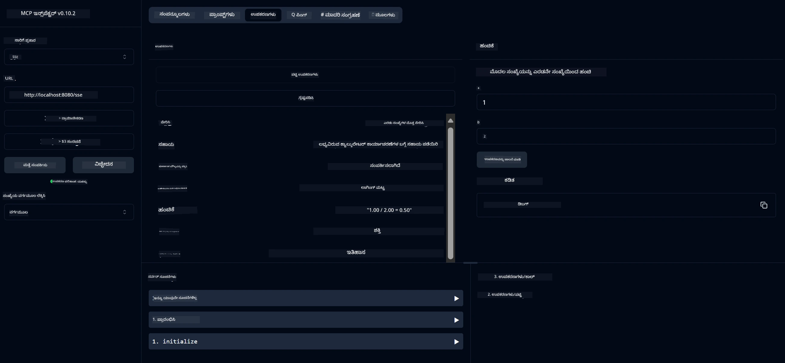

# ಮೂಲ ಭೂತ ಕ್ಯಾಲ್ಕುಲೇಟರ್ MCP ಸೇವೆ

> [!NOTE]
> ಈ ಉದಾಹರಣೆ ಪುರಾತನ HTTP+SSE ಸಾರಿಗೆ ಬಳಸುತ್ತದೆ ಮತ್ತು MCP `2025-11-25` ಗೆ ಹೊಂದಿಕೆಯಾಗುವ SDK ಗಾಗಿ ಉದ್ದು ಮಾಡುತ್ತದೆ.
> ಹೊಸ ರಿಮೋಟ್ ಸರ್ವರ್‌ಗಳು `2026-07-28` ಸ್ಟ್ರೀಮೇಬಲ್ HTTP ಬೆಂಬಲವನ್ನು ಬಳಸಬೇಕು.


- SSE (ಸರ್ವರ್-ಸೆಂಟ್ ಇವೆಂಟ್ಸ್) ಪರಿಚಯಕ್ಕೆ ಬೆಂಬಲ
- ಸ್ಪ್ರಿಂಗ್ AI ಯ `@Tool` ಅನೇಟೇಶನ್ ಬಳಸಿ ಸ್ವಯಂಚಾಲಿತ ಸಾಧನ ದಾಖಲಿಸುವಿಕೆ
- ಮೂಲಭೂತ ಕ್ಯಾಲ್ಕುಲೇಟರ್ ಕಾರ್ಯಗಳು:
  - ಸೇರಿಸುವಿಕೆ, ಕಡಕುವುದು, ಗುಣಾಕರಿಸುವಿಕೆ, ಭಾಗಾಕಾರ
  - ವಿದ್ಯುತ್ ಲೆಕ್ಕಾಚಾರ ಮತ್ತು ವರ್ಗಮೂಲ
  - ಮಿಗಿನ ಗುರುತು (ಮಾಡ್ಯುಲಸ್) ಮತ್ತು ಪರಮ ಮೌಲ್ಯ
  - ಕಾರ್ಯ ವಿವರಣೆಗಳಿಗೆ ಸಹಾಯ ಕಾರ್ಯ


   - ಎರಡು ಸಂಖ್ಯೆಗಳನ್ನು ಸೇರಿಸುವುದು
   - ಒಂದು ಸಂಖ್ಯೆಯಿಂದ ಇನ್ನೊಂದು ಸಂಖ್ಯೆಯನ್ನು ಬಿಯಿಸುವುದು
   - ಎರಡು ಸಂಖ್ಯೆಗಳ ಗುಣಾಕಾರ
   - ಒಂದು ಸಂಖ್ಯೆಯನ್ನು ಇನ್ನೊಂದು ಸಂಖ್ಯೆಯಿಂದ ಭಾಗಿಸುವುದು (ಶೂನ್ಯ ಭಾಗಿಸುವಿಕೆ ಪರೀಕ್ಷೆ ಜೊತೆ)


   - ವಿದ್ಯುತ್ ಲೆಕ್ಕಾಚಾರ (ಮೂಲಾಂತರ ಒಂದು ಘಾತಕ್ಕೆ ಎತ್ತುವುದು)
   - ವರ್ಗಮೂಲ ಲೆಕ್ಕಾಚಾರ (ನಕಾರಾತ್ಮಕ ಸಂಖ್ಯೆ ಪರಿಶೀಲನೆಯೊಂದಿಗೆ)
   - ಮಾಡ್ಯುಲಸ್ (ಮಿಗಿಲಿನ ಗುರುತು) ಲೆಕ್ಕಾಚಾರ
   - ಪರಮ ಮೌಲ್ಯ ಲೆಕ್ಕಾಚಾರ


   - ಲಭ್ಯವಿರುವ ಎಲ್ಲಾ ಕಾರ್ಯಗಳನ್ನು ವಿವರಿಸುವ ಬಳಕೆಯಲ್ಲಿರುವ ಸಹಾಯ ಕಾರ್ಯ


- `subtract(a, b)`: ಎರಡನೇ ಸಂಖ್ಯೆಯನ್ನು ಮೊದಲನೆಯಿಂದ ಬಿಯಿಸಿ
- `multiply(a, b)`: ಎರಡು ಸಂಖ್ಯೆಗಳ ಗುಣಾಕಾರ ಮಾಡಿ
- `divide(a, b)`: ಮೊದಲನೆಯ ಸಂಖ್ಯೆಯನ್ನು ಎರಡನೆಯಿಂದ ಭಾಗಿಸಿ (ಶೂನ್ಯ ಪರೀಕ್ಷೆಯ ಜೊತೆ)
- `power(base, exponent)`: ಒಂದು ಸಂಖ್ಯೆಯ ವಿದ್ಯುತ್ ಲೆಕ್ಕಾಚಾರ ಮಾಡುವುದು
- `squareRoot(number)`: ವರ್ಗಮೂಲ ಲೆಕ್ಕಾಚಾರ (ನಕಾರಾತ್ಮಕ ಪರಿಶೀಲನೆಯೊಂದಿಗೆ)
- `modulus(a, b)`: ಭಾಗಾಗಾರದ ಹಿಂದುಳಿದ ಭಾಗ ಲೆಕ್ಕಾಚಾರ
- `absolute(number)`: ಪರಮ ಮೌಲ್ಯ ಲೆಕ್ಕಾಚಾರ
- `help()`: ಲಭ್ಯವಿರುವ ಕಾರ್ಯಗಳ ಕುರಿತು ಮಾಹಿತಿ ಪಡೆಯಿರಿ


   
   GitHub ಯ AI ಮಾದರಿಗಳನ್ನು (ಒಂದಾದಂತೆ phi-4) ಬಳಸಲು, ನಿಮಗೆ GitHub ವೈಯಕ್ತಿಕ ಪ್ರವೇಶ ಟೋಕನ್ ಬೇಕು:


   
   b. "Generate new token" → "Generate new token (classic)" ಕ್ಲಿಕ್ ಮಾಡಿ
   
   c. ನಿಮ್ಮ ಟೋಕನ್ಗೆ ವರ್ಣನಾತ್ಮಕ ಹೆಸರು ನೀಡಿ
   
   d. ಕೆಳಗಿನ ಪರಿಧಿಗಳನ್ನು ಆಯ್ಕೆಮಾಡಿ:
      - `repo` (ಖಾಸಗಿ ರೆಪೊಸಿಟರಿಗೆ ಪೂರ್ಣ ನಿಯಂತ್ರಣ)
      - `read:org` (ಸಂಸ್ಥೆ ಮತ್ತು ತಂಡ ಸದಸ್ಯತ್ವ ಓದಿ, ಸಂಸ್ಥೆ ಯೋಜನೆಗಳನ್ನು ಓದಿ)
      - `gist` (ಗಿಸ್ಟ್ ರಚಿಸಿ)


      - `user:email` (ಬಳಕೆದಾರರ ಇಮೇಲ್ ವಿಳಾಸಗಳನ್ನು ಪ್ರವೇಶಿಸಿ (ಓದು ಮಾತ್ರ))
   
   e. "Generate token" ಕ್ಲಿಕ್ ಮಾಡಿ ಮತ್ತು ನಿಮ್ಮ ಹೊಸ ಟೋಕನ್ ಅನ್ನು ನಕಲಿಸಿ
   
   f. ಅದನ್ನು ಪರಿಸರ ಚರವಾಗಿಯಾಗಿ ಹೊಂದಿಸಿ:
      
      ವಿಂಡೋಸ್‌ನಲ್ಲಿ:
      ```
      set GITHUB_TOKEN=your-github-token
      ```
      
      ಮ್ಯಾಕ್‌ಒಎಸ್/ಲಿನಕ್ಸ್‌ನಲ್ಲಿ:
      ```bash
      export GITHUB_TOKEN=your-github-token
      ```

   g. ಸ್ಥಿರ ಹೊಂದಿಕೆಗೆ, ಸಿಸ್ಟಂ ಸೆಟ್ಟಿಂಗ್ಸ್ ಮೂಲಕ ಅದನ್ನು ನಿಮ್ಮ ಪರಿಸರ ಚರಗಳಲ್ಲಿ ಸೇರಿಸಿ

2. ನಿಮ್ಮ ಪ್ರಾಜೆಕ್ಟ್‌ಗೆ LangChain4j GitHub ಅವಲಂಬನೆಯನ್ನು ಸೇರಿಸಿ (pom.xml ನಲ್ಲಿ ಈಗಾಗಲೆ ಸೇರಿಸಲಾಗಿದೆ):
   ```xml
   <dependency>
       <groupId>dev.langchain4j</groupId>
       <artifactId>langchain4j-github</artifactId>
       <version>${langchain4j.version}</version>
   </dependency>
   ```

3. ಕ್ಯಾಲ್ಕ್ಯುಲೇಟರ್ ಸರ್ವರ್ `localhost:8080` ನ್ನು ಓಡಿ ಕೊಂಡಿರುವುದನ್ನು ಖಚಿತಪಡಿಸಿಕೊಳ್ಳಿ

### LangChain4j ಕ್ಲೈಂಟ್ ಅನ್ನು ಓಡಿಸುವುದು

ಈ ಉದಾಹರಣೆ ಈ ಕೆಳಗಿನವುಗಳನ್ನು ಪ್ರದರ್ಶಿಸುತ್ತದೆ:
- ಕ್ಯಾಲ್ಕ್ಯುಲೇಟರ್ MCP ಸರ್ವರ್‌ಗೆ SSE ಸಾರಿಗೆ ಮೂಲಕ ಸಂಪರ್ಕ ಸಾಧಿಸುವುದು
- ಕ್ಯಾಲ್ಕ್ಯುಲೇಟರ್ ಕಾರ್ಯಾಚರಣೆಗಳನ್ನು ಬಳಸಿ ಚಾಟ್ ಬಾಟ್ ರಚಿಸಲು LangChain4j ಬಳಸುವುದು
- GitHub AI ಮಾದರಿಗಳೊಂದಿಗೆ ಸಂಯೋಜನೆ (ಈಗ phi-4 ಮಾದರಿಯನ್ನು ಬಳಸುತ್ತಿದೆ)

ಕ್ಲೈಂಟ್ ಕಾರ್ಯಚಟುವಟಿಕೆಯನ್ನು ಪ್ರದರ್ಶಿಸುವ ಉದಾಹರಣೆಯಾಗಿ ಕೆಳಗಿನ ಮಾದರಿ ಪ್ರಶ್ನೆಗಳನ್ನು ಕಳುಹಿಸುತ್ತದೆ:
1. ಎರಡು ಸಂಖ್ಯೆಗಳ ಮೊತ್ತವೆಣಿಕೆ
2. ಸಂಖ್ಯೆಯ ವರ್ಗ ರೂಟ್ ಹುಡುಕುವುದು
3. ಲಭ್ಯವಿರುವ ಕ್ಯಾಲ್ಕ್ಯುಲೇಟರ್ ಕಾರ್ಯಾಚರಣೆಗಳ ಬಗ್ಗೆ ಸಹಾಯ ಮಾಹಿತಿ ಪಡೆಯುವುದು

ಉದಾಹರಣೆಯನ್ನು ಓಡಿಸಿ ಮತ್ತು ಕನ್‌ಸೋಲ್ ಔಟ್‌ಪುಟ್ ಪರಿಶೀಲಿಸಿ, ಹೇಗೆ AI ಮಾದರಿ ಕ್ಯಾಲ್ಕ್ಯುಲೇಟರ್ ಉಪಕರಣಗಳನ್ನು ಬಳಸಿಕೊಂಡು ಪ್ರಶ್ನೆಗಳಿಗೆ ಉತ್ತರಿಸುತ್ತದೆ ಎಂದು ನೋಡಿ.

### GitHub ಮಾದರಿ ಸಂರಚನೆ

LangChain4j ಕ್ಲೈಂಟ್ ಕೆಳಗಿನ ಸೆಟ್ಟಿಂಗ್‌ಗಳೊಂದಿಗೆ GitHubನ phi-4 ಮಾದರಿಯನ್ನು ಬಳಸಲು ಸಂರಚಿಸಲಾಗಿದೆ:

```java
ChatLanguageModel model = GitHubChatModel.builder()
    .apiKey(System.getenv("GITHUB_TOKEN"))
    .timeout(Duration.ofSeconds(60))
    .modelName("phi-4")
    .logRequests(true)
    .logResponses(true)
    .build();
```

ವಿಭಿನ್ನ GitHub ಮಾದರಿಗಳನ್ನು ಬಳಸಲು, `modelName` ಪರಮಿಟರ್ ಅನ್ನು ಬೆಂಬಲಿತ ಇನ್ನೊಂದು ಮಾದರಿಯ (ಉದಾ: "claude-3-haiku-20240307", "llama-3-70b-8192", ಇತ್ಯಾದಿ) ಹೆಸರಿಗೆ ಬದಲಾಯಿಸಿ.

## ಅವಲಂಬನೆಗಳು

ಈ ಪ್ರಾಜೆಕ್ಟ್‌ಗೆ ಕೆಳಗಿನ ಪ್ರಮುಖ ಅವಲಂಬನೆಗಳ ಅಗತ್ಯವಿದೆ:

```xml
<!-- For MCP Server -->
<dependency>
    <groupId>org.springframework.ai</groupId>
    <artifactId>spring-ai-starter-mcp-server-webflux</artifactId>
</dependency>

<!-- For LangChain4j integration -->
<dependency>
    <groupId>dev.langchain4j</groupId>
    <artifactId>langchain4j-mcp</artifactId>
    <version>${langchain4j.version}</version>
</dependency>

<!-- For GitHub models support -->
<dependency>
    <groupId>dev.langchain4j</groupId>
    <artifactId>langchain4j-github</artifactId>
    <version>${langchain4j.version}</version>
</dependency>
```

## ಪ್ರಾಜೆಕ್ಟ್ ನಿರ್ಮಾಣ

Maven ಬಳಸಿ ಪ್ರಾಜೆಕ್ಟ್ ಅನ್ನು ನಿರ್ಮಿಸಿ:
```bash
./mvnw clean install -DskipTests
```

## ಸರ್ವರ್ ಓಡಿಸುವುದು

### ಜಾವಾ ಬಳಸಿ

```bash
java -jar target/calculator-server-0.0.1-SNAPSHOT.jar
```

### MCP ಇನ್ಸ್‌ಪೆಕ್ಟರ್ ಬಳಸಿ

MCP ಇನ್ಸ್‌ಪೆಕ್ಟರ್ MCP ಸೇವೆಗಳೊಂದಿಗೆ ಸಂವಹನ ಮಾಡಲು ಸಹಾಯಕ ಉಪಕರಣವಾಗಿದೆ. ಈ ಕ್ಯಾಲ್ಕ್ಯುಲೇಟರ್ ಸೇವೆಗೆ ಬಳಸದಕ್ಕೆ:

1. **MCP ಇನ್ಸ್‌ಪೆಕ್ಟರ್ ಅನ್ನು ಸ್ಥಾಪಿಸಿ ಮತ್ತು ಓಡಿಸಿ** ಹೊಸ ಟರ್ಮಿನಲ್ ವಿಂಡೋದಲ್ಲಿ:
   ```bash
   npx @modelcontextprotocol/inspector
   ```

2. **ಅ್ಯಪ್ ತೋರಿಸುವ URL (ಸಾಮಾನ್ಯವಾಗಿ http://localhost:6274) ಕ್ಲಿಕ್ಮಾಡಿ ವೆಬ್ UI ಗೆ ಪ್ರವೇಶಿಸಿ**

3. **ಕನೆಕ್ಷನ್ ಅನ್ನು ಸಂರಚಿಸಿ**:
   - ಸಾರಿಗೆ ಪ್ರಕಾರವನ್ನು "SSE" ಆಗಿ ಹೊಂದಿಸಿ
   - ನಿಮ್ಮ ಓಡುತ್ತಿರುವ ಸರ್ವರ್ SSE ಎಂಡ್ಪಾಯಿಂಟ್ URL ಅನ್ನು ಹೊಂದಿಸಿ: `http://localhost:8080/sse`
   - "Connect" ಕ್ಲಿಕ್ ಮಾಡಿ

4. **ಉಪಕರಣಗಳನ್ನು ಬಳಸಿ**:
   - ಲಭ್ಯವಿರುವ ಕ್ಯಾಲ್ಕ್ಯುಲೇಟರ್ ಕಾರ್ಯಾಚರಣೆಗಳನ್ನು ನೋಡಲು "List Tools" ಕ್ಲಿಕ್ ಮಾಡಿ
   - ಕಾರ್ಯಾಚರಣೆ ನಡೆಸಲು ಒಂದು ಉಪಕರಣವನ್ನು ಆಯ್ಕೆಮಾಡಿ ಮತ್ತು "Run Tool" ಕ್ಲಿಕ್ ಮಾಡಿ



### ಡಾಕರ್ ಬಳಸಿ

ಪ್ರಾಜೆಕ್ಟ್ ಡಾಕರ್‌ಫೈಲ್ ಅನ್ನು ಒಳಗೊಂಡಿದೆ ಕಡತಕ್ಕೊಂದಿಂಡಿನ ನಿಯೋಜನೆಗೆ:

1. **ಡಾಕರ್ ಇಮೇಜ್ ನಿರ್ಮಿಸಿ**:
   ```bash
   docker build -t calculator-mcp-service .
   ```

2. **ಡಾಕರ್ ಕಾಂಟೈನರ್ ಓಡಿಸಿ**:
   ```bash
   docker run -p 8080:8080 calculator-mcp-service
   ```

ಇದರಿಂದ:
- Maven 3.9.9 ಮತ್ತು Eclipse Temurin 24 JDK ಜೊತೆ ಮಲ್ಟಿ-ಸ್ಟೇಜ್ ಡಾಕರ್ ಇಮೇಜ್ ನಿರ್ಮಿಸಲಾಗುತ್ತದೆ
- ಸಾಧಾರಣಗೊಂಡ ಕಂಟೈನರ್ ಇಮೇಜ್ ರಚಿಸಲಾಗುತ್ತದೆ
- ಸೇವೆ 8080 ಪೋರ್ಟ್ ನಲ್ಲಿ ಅನಾವರಣ ಮಾಡಲಾಗುತ್ತದೆ
- ಕಾಂಟೈನರ್ ಒಳಗೆ MCP ಕ್ಯಾಲ್ಕ್ಯುಲೇಟರ್ ಸೇವೆಯನ್ನು ಪ್ರಾರಂಭಿಸಲಾಗುತ್ತದೆ

ಕಾಂಟೈನರ್ ಓಡುತ್ತಿದ್ದರೆ ನೀವು `http://localhost:8080` ನಲ್ಲಿ ಸೇವೆಯನ್ನು ಪ್ರವೇಶಿಸಬಹುದು.

## ಸಮಸ್ಯೆ ಪರಿಹಾರ

### GitHub ಟೋಕನ್ ಸಂಸದ್ನ ಸಾಮಾನ್ಯ ಸಮಸ್ಯೆಗಳು


1. **ಟೋಕನ್ ಅನುಮತಿ ಸಮಸ್ಯೆಗಳು**: ನೀವು 403 Forbidden ದೋಷವನ್ನು ಪಡೆದರೆ, ನಿಮ್ಮ ಟೋಕನ್ prerequisiteಗಳಲ್ಲಿ ಉಲ್ಲೇಖಿಸಿರುವ ಸರಿಯಾದ ಅನುಮತಿಗಳನ್ನು ಹೊಂದಿದೆಯೇ ಎಂಬುದನ್ನು ಪರಿಶೀಲಿಸಿ.

2. **ಟೋಕನ್ ಸಿಗಲಿಲ್ಲ**: ನೀವು "ಯಾವುದೇ API ಕೀ ಕಾಣಿಸಲಿಲ್ಲ" ದೋಷವನ್ನು ಪಡೆದರೆ, GITHUB_TOKEN ಪರಿಸರ ಚರವನ್ನು ಸರಿಯಾಗಿ ಸೆಟ್ ಮಾಡಲಾಗಿದೆ ಎಂದು ಖಚಿತಪಡಿಸಿಕೊಳ್ಳಿ.

3. **ರೇಟ್ ಲಿಮಿಟಿಂಗ್**: GitHub APIಗೆ ರೇಟ್ ಮಿತಿ ಇದೆ. ನೀವು ರೇಟ್ ಮಿತಿ ದೋಷ (ಸ್ಥಿತಿ ಕೋಡ್ 429) ಎದುರಾದರೆ, ಮತ್ತೊಮ್ಮೆ ಪ್ರಯತ್ನಿಸುವ ಮೊದಲು ಕೆಲವು ನಿಮಿಷಗಳನ್ನು ಕಾಯಿರಿ.

4. **ಟೋಕನ್ ಅವಧಿ ಮುಗಿಯುವುದು**: GitHub ಟೋಕನ್‌ಗಳು ಅವಧಿ ಮುಗಿಯಬಹುದು. ಕೆಲ ಸಮಯದ ಬಳಿಕ ಪ್ರಮಾಣೀಕರಣ ದೋಷಗಳು ಬಂದರೆ, ಹೊಸ ಟೋಕನ್ ರಚಿಸಿ ಮತ್ತು ನಿಮ್ಮ ಪರಿಸರ ಚರವನ್ನು ನವೀಕರಿಸಿ.

ನೀವು ಹೆಚ್ಚು ಸಹಾಯ ಬೇಕಾದರೆ, [LangChain4j ಡಾಕ್ಯುಮೆಂಟೇಶನ್](https://github.com/langchain4j/langchain4j) ಅಥವಾ [GitHub API ಡಾಕ್ಯುಮೆಂಟೇಶನ್](https://docs.github.com/en/rest) ಅನ್ನು ಪರಿಶೀಲಿಸಿ.

---

<!-- CO-OP TRANSLATOR DISCLAIMER START -->
**ಅಸ್ವೀಕಾರ**:
ಈ ದಸ್ತಾವೇಜು AI ಅನುವಾದ ಸೇವೆ [Co-op Translator](https://github.com/Azure/co-op-translator) ಬಳಸಿ ಅನುವಾದಿಸಲಾಗಿದೆ. ನಾವು ನಿಖರತೆಯನ್ನು ಸಾಧಿಸಲು ಪ್ರಯತ್ನಿಸುತ್ತಿದ್ದರೂ, ದಯವಿಟ್ಟು ಗಮನಿಸಿ, ಸ್ವಯಂಚಾಲಿತ ಅನುವಾದಗಳಲ್ಲಿ ದೋಷಗಳು ಅಥವಾ ಅಸಡ್ಡೆಗಳು ಇರಬಹುದು. ಮೂಲ ಭಾಷೆಯಲ್ಲಿರುವ ಮೂಲ ದಸ್ತಾವೇಜು ಪ್ರಾಮಾಣಿಕ ಮೂಲವೆಂದು ಪರಿಗಣಿಸಬೇಕು. ಪ್ರಮುಖ ಮಾಹಿತಿಗಾಗಿ, ವೃತ್ತಿಪರ ಮಾನವ ಅನುವಾದವನ್ನು ಶಿಫಾರಸು ಮಾಡಲಾಗುತ್ತದೆ. ಈ ಅನುವಾದವನ್ನು ಬಳಸುವ ಮೂಲಕ ಉಂಟಾಗುವ ಯಾವುದೇ ತಪ್ಪು ಅರ್ಥಗಳ ಅಥವಾ ತಪ್ಪು ವ್ಯಾಖ್ಯಾನಗಳ ಬಗ್ಗೆ ನಾವು ಹೊಣೆಗಾರರಲ್ಲ.
<!-- CO-OP TRANSLATOR DISCLAIMER END -->