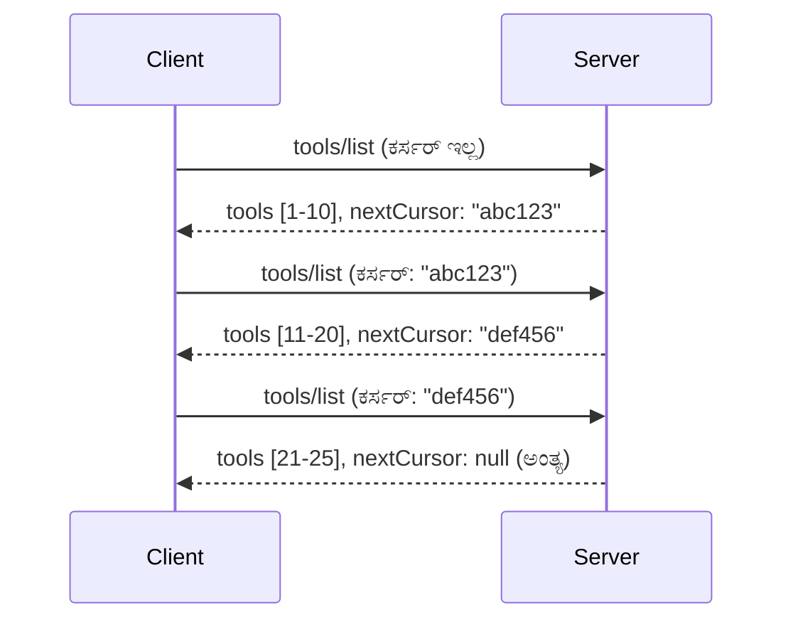

# MCPನಲ್ಲಿ ಪುಟವಿಡಿಸುವಿಕೆ ಮತ್ತು ದೊಡ್ಡ ಫಲಿತಾಂಶ ಸೆಟ್‌ಗಳು

ನಿಮ್ಮ MCP ಸರ್ವರ್ ದೊಡ್ಡ ಡೇಟಾಸೆಟ್‌ಗಳನ್ನು ನಿರ್ವಹಿಸುವಾಗ — ಸಾವಿರಾರು ಕಡತಗಳು, ಡೇಟಾಬೇಸ್ ದಾಖಲೆಗಳು ಅಥವಾ ಹುಡುಕಾಟ ಫಲಿತಾಂಶಗಳನ್ನು ಸೂಚಿಸುವಾಗ — ಸ್ಮರಣಾಶಕ್ತಿಯನ್ನು ಪರಿಣಾಮಕಾರಿಯಾಗಿ ನಿರ್ವಹಿಸಲು ಮತ್ತು ಪ್ರತಿಕ್ರಿಯಾಶೀಲ ಬಳಕೆದಾರ ಅನುಭವಗಳನ್ನು ಒದಗಿಸಲು ಪುಟವಿಡಿಸುವಿಕೆ ಅಗತ್ಯ. ಈ ಮಾರ್ಗದರ್ಶಿಯಲ್ಲಿ MCPನಲ್ಲಿ ಪುಟವಿಡಿಸುವಿಕೆಯನ್ನು ಹೇಗೆ ಅನುಷ್ಠಾನಗೊಳಿಸಬೇಕು ಮತ್ತು ಬಳಸಬೇಕು ಎಂದು ಕುರಿತು ವಿವರಿಸಲಾಗಿದೆ.

## ಪುಟವಿಡಿಸುವಿಕೆ ಮುಖ್ಯವೇನೊ

ಪುಟವಿಡಿಸುವಿಕೆಯಾಗದಿದ್ದರೆ, ದೊಡ್ಡ ಪ್ರತಿಕ್ರಿಯೆಗಳು ಪರಿಣಾಮಕಾರಿಯಾಗಿ:

- **ಸ್ಮರಣೆ ಕೊರತೆ** - ಒಂದುಲ್ಲಾ ಸಾವಿರಾರು ದಾಖಲೆಗಳನ್ನು ಲೋಡ್ ಮಾಡುವುದು
- **ಮಂದಗತಿ ಪ್ರತಿಕ್ರಿಯೆಗಳು** - ಎಲ್ಲಾ ಡೇಟಾ ಲೋಡ್ ಆಗುವವರೆಗೆ ಬಳಕೆದಾರರು ಕಾಯುತ್ತಾರೆ
- **ಟೈಮೌಟ್ ದೋಷಗಳು** - ವಿನಂತಿಗಳು ಕಡ್ಡಾಯವಾದ ಸಮಯ ಮಿತಿ ಮೀರುವಿಕೆ
- **ನಿಷ್ಪ್ರಭೆಎಐ ಕಾರ್ಯಕ್ಷಮತೆ** - LLMಗಳು ಭಾರೀ ಕಾನ್ಟೆಕ್ಸ್ಟ್‌ಗಳನ್ನು ಸಾಗಿಸಲು ತೊಂದರೆಗೊಳಗಾಗುತ್ತವೆ

MCP ನವು ಫಲಿತಾಂಶ ಸೆಟ್‌ಗಳನ್ನು ನಂಬಿಕೆಯಿಡುವ, ಸ್ಥಿರ ಪುಟವಿಡಿಸುವಿಕೆಗಾಗಿ **ಕರ್ಸರ್ ಆಧಾರಿತ ಪುಟವಿಡಿಸುವಿಕೆ**ಗಳನ್ನು ಬಳಸುತ್ತದೆ.

---

## MCP ಪುಟವಿಡಿಸುವಿಕೆ ಹೇಗೆ ಕೆಲಸ ಮಾಡುತ್ತದೆ

### ಕರ್ಸರ್ ತತ್ವ

**ಕರ್ಸರ್** ಎನ್ನುವುದು ಫಲಿತಾಂಶದ ಸೆಟ್‌ನಲ್ಲಿ ನಿಮ್ಮ ಸ್ಥಾನವನ್ನು ಗುರುತಿಸುವ ಅನಾಮಿಕ ಸ್ಟ್ರಿಂಗ್. ಇದನ್ನು ದೀರ್ಘ ಪುಸ್ತಕದ ಬುಕ್‌ಮಾರ್ಕ್ ಎಂದು ತಿಳಿಯಿರಿ.



### MCP ವಿಧಾನಗಳಲ್ಲಿ ಪುಟವಿಡಿಸುವಿಕೆ

ಈ MCP ವಿಧಾನಗಳು ಪುಟವಿಡಿಸುವಿಕೆಯನ್ನು ಬೆಂಬಲಿಸುತ್ತವೆ:

| ವಿಧಾನ | ಹಿಂತಿರುಗಿಸುವುದು | ಕರ್ಸರ್ ಬೆಂಬಲ |
|--------|---------|----------------|
| `tools/list` | ಟೂಲಿನ ವ್ಯಾಖ್ಯಾನಗಳು | ✅ |
| `resources/list` | ಸಂಪನ್ಮೂಲ ವ್ಯಾಖ್ಯಾನಗಳು | ✅ |
| `prompts/list` | ಪ್ರಾಂಪ್ಟ್ ವ್ಯಾಖ್ಯಾನಗಳು | ✅ |
| `resources/templates/list` | ಸಂಪನ್ಮೂಲ ಟೆಂಪ್ಲೇಟುಗಳು | ✅ |

---

## ಸರ್ವರ್ ಅನುಷ್ಠಾನ

### ಪೈಥಾನ್ (ಫಾಸ್ಟ್ MCP)

```python
from mcp.server import Server
from mcp.types import Tool, ListToolsResult
import math

app = Server("paginated-server")

# ಅನುಕರಿಸಿದ ದೊಡ್ಡ ಡೇಟಾಸೆಟ್
ALL_TOOLS = [
    Tool(name=f"tool_{i}", description=f"Tool number {i}", inputSchema={})
    for i in range(100)
]

PAGE_SIZE = 10

@app.list_tools()
async def list_tools(cursor: str | None = None) -> ListToolsResult:
    """List tools with pagination support."""
    
    # ಪ್ರಾರಂಭಿಕ ಅನುಕ್ರಮಣಿಕೆಯನ್ನು ಪಡೆಯಲು ಕರ್ಸರ್ ಡಿಕೋಡ್ ಮಾಡಿ
    start_index = 0
    if cursor:
        try:
            start_index = int(cursor)
        except ValueError:
            start_index = 0
    
    # ಫಲಿತಾಂಶಗಳ ಪುಟವನ್ನು ಪಡೆಯಿರಿ
    end_index = min(start_index + PAGE_SIZE, len(ALL_TOOLS))
    page_tools = ALL_TOOLS[start_index:end_index]
    
    # ಮುಂದಿನ ಕರ್ಸರ್ ಅನ್ನು ಲೆಕ್ಕಿಸು
    next_cursor = None
    if end_index < len(ALL_TOOLS):
        next_cursor = str(end_index)
    
    return ListToolsResult(
        tools=page_tools,
        nextCursor=next_cursor
    )
```

### ಟೈಪ್ ಸ್ರಿಪ್ಟ್

```typescript
import { Server } from "@modelcontextprotocol/sdk/server/index.js";
import { ListToolsResultSchema } from "@modelcontextprotocol/sdk/types.js";

const server = new Server({
  name: "paginated-server",
  version: "1.0.0"
});

// ಅನুকರಣೆಯ ದೊಡ್ಡ ಡೇಟಾಸೆಟ್
const ALL_TOOLS = Array.from({ length: 100 }, (_, i) => ({
  name: `tool_${i}`,
  description: `Tool number ${i}`,
  inputSchema: { type: "object", properties: {} }
}));

const PAGE_SIZE = 10;

server.setRequestHandler(ListToolsResultSchema, async (request) => {
  // ಕರ್ಸರ್ ಅನ್ನು ಡಿಕೋಡ್ ಮಾಡಿ
  let startIndex = 0;
  if (request.params?.cursor) {
    startIndex = parseInt(request.params.cursor, 10) || 0;
  }
  
  // ಫಲಿತಾಂಶಗಳ ಪುಟವನ್ನು ಪಡೆದುಕೊಳ್ಳಿ
  const endIndex = Math.min(startIndex + PAGE_SIZE, ALL_TOOLS.length);
  const pageTools = ALL_TOOLS.slice(startIndex, endIndex);
  
  // ಮುಂದಿನ ಕರ್ಸರ್ ಅನ್ನು ಲೆಕ್ಕಿಸಿ
  const nextCursor = endIndex < ALL_TOOLS.length ? String(endIndex) : undefined;
  
  return {
    tools: pageTools,
    nextCursor
  };
});
```

### ಜಾವಾ (ಸ್ಪ್ರಿಂಗ್ MCP)

```java
@Service
public class PaginatedToolService {
    
    private static final int PAGE_SIZE = 10;
    private final List<Tool> allTools;
    
    public PaginatedToolService() {
        // ದೊಡ್ಡ ಡೇಟಾಸೆಟ್ ಪ್ರಾರಂಭಿಸಿ
        this.allTools = IntStream.range(0, 100)
            .mapToObj(i -> new Tool("tool_" + i, "Tool number " + i, Map.of()))
            .collect(Collectors.toList());
    }
    
    @McpMethod("tools/list")
    public ListToolsResult listTools(@Param("cursor") String cursor) {
        // ಕರ್ಸರ್ ಡಿಕೋಡ್ ಮಾಡಿ
        int startIndex = 0;
        if (cursor != null && !cursor.isEmpty()) {
            try {
                startIndex = Integer.parseInt(cursor);
            } catch (NumberFormatException e) {
                startIndex = 0;
            }
        }
        
        // ಫಲಿತಾಂಶಗಳ ಪುಟ ಪಡೆಯಿರಿ
        int endIndex = Math.min(startIndex + PAGE_SIZE, allTools.size());
        List<Tool> pageTools = allTools.subList(startIndex, endIndex);
        
        // ಮುಂದಿನ ಕರ್ಸರ್ ಲೆಕ್ಕಹಾಕಿ
        String nextCursor = endIndex < allTools.size() ? String.valueOf(endIndex) : null;
        
        return new ListToolsResult(pageTools, nextCursor);
    }
}
```

---

## ಕ್ಲೈಂಟ್ ಅನುಷ್ಠಾನ

### ಪೈಥಾನ್ ಕ್ಲೈಂಟ್

```python
from mcp import ClientSession

async def get_all_tools(session: ClientSession) -> list:
    """Fetch all tools using pagination."""
    all_tools = []
    cursor = None
    
    while True:
        result = await session.list_tools(cursor=cursor)
        all_tools.extend(result.tools)
        
        if result.nextCursor is None:
            break
        cursor = result.nextCursor
    
    return all_tools

# ಬಳಕೆಯು
async with client_session as session:
    tools = await get_all_tools(session)
    print(f"Found {len(tools)} tools")
```

### ಟೈಪ್ ಸ्रಿಪ್ಟ್ ಕ್ಲೈಂಟ್

```typescript
import { Client } from "@modelcontextprotocol/sdk/client/index.js";

async function getAllTools(client: Client): Promise<Tool[]> {
  const allTools: Tool[] = [];
  let cursor: string | undefined = undefined;
  
  do {
    const result = await client.listTools({ cursor });
    allTools.push(...result.tools);
    cursor = result.nextCursor;
  } while (cursor);
  
  return allTools;
}

// ಬಳಕೆ
const tools = await getAllTools(client);
console.log(`Found ${tools.length} tools`);
```

### ಆಲಸ್ಯವಾಗಿ ಲೋಡ್ ಮಾಡುವ ಮಾದರಿ

ತುಂಬಾ ದೊಡ್ಡ ಡೇಟಾಸೆಟ್‌ಗಳಿಗೆ, ಬೇಕಾದ ವೇಳೆ ಪುಟಗಳನ್ನು ಲೋಡ್ ಮಾಡಿ:

```python
class PaginatedToolIterator:
    """Lazily iterate through paginated tools."""
    
    def __init__(self, session: ClientSession):
        self.session = session
        self.cursor = None
        self.buffer = []
        self.exhausted = False
    
    async def __anext__(self):
        # ಲಭ್ಯವಿದ್ದರೆ ಬಫರ್‌ನಿಂದ ಹಿಂದಿರುಗಿ
        if self.buffer:
            return self.buffer.pop(0)
        
        # ನಾವು ಎಲ್ಲಾ ಪುಟಗಳನ್ನು ಮುಗಿಸಿದ್ದೇವೆ ಎಂಬುದನ್ನು ಪರಿಶೀಲಿಸಿ
        if self.exhausted:
            raise StopAsyncIteration
        
        # siguiente ಪುಟವನ್ನು ಪಡೆದುಕೊಳ್ಳಿ
        result = await self.session.list_tools(cursor=self.cursor)
        self.buffer = list(result.tools)
        self.cursor = result.nextCursor
        
        if self.cursor is None:
            self.exhausted = True
        
        if not self.buffer:
            raise StopAsyncIteration
        
        return self.buffer.pop(0)
    
    def __aiter__(self):
        return self

# ಬಳಕೆ - ದೊಡ್ಡ ಡೇಟಾಸೆಟ್‌ಗಳಿಗೆ ಸ್ಮೃತಿ ಪರಿಣಾಮಕಾರಿಯಾಗುತ್ತದೆ
async for tool in PaginatedToolIterator(session):
    process_tool(tool)
```

---

## ಸಂಪನ್ಮೂಲಗಳ ಪುಟವಿಡಿಸುವಿಕೆ

ಡೈರೆಕ್ಟರಿಗಳು ಅಥವಾ ದೊಡ್ಡ ಡೇಟಾಸೆಟ್‌ಗಳಿಗಾಗಿ ಸಂಪನ್ಮೂಲಗಳಿಗೆ ಪುಟವಿಡಿಸುವಿಕೆ ಅಗತ್ಯವಿರುತ್ತದೆ:

```python
from mcp.server import Server
from mcp.types import Resource, ListResourcesResult
import os

app = Server("file-server")

@app.list_resources()
async def list_resources(cursor: str | None = None) -> ListResourcesResult:
    """List files in directory with pagination."""
    
    directory = "/data/files"
    all_files = sorted(os.listdir(directory))
    
    # ಕರ್ಸರ್ ಡಿಕೋಡ್ ಮಾಡಿ (ಫೈಲ್ ಇಂಡೆಕ್ಸ್)
    start_index = int(cursor) if cursor else 0
    page_size = 20
    end_index = min(start_index + page_size, len(all_files))
    
    # ಈ ಪುಟಕ್ಕೆ ಸಂಪನ್ಮೂಲ ಪಟ್ಟಿ ರಚಿಸಿ
    resources = []
    for filename in all_files[start_index:end_index]:
        filepath = os.path.join(directory, filename)
        resources.append(Resource(
            uri=f"file://{filepath}",
            name=filename,
            mimeType="application/octet-stream"
        ))
    
    # ಮುಂದಿನ ಕರ್ಸರ್ ಗಣನೆ ಮಾಡು
    next_cursor = str(end_index) if end_index < len(all_files) else None
    
    return ListResourcesResult(
        resources=resources,
        nextCursor=next_cursor
    )
```

---

## ಕರ್ಸರ್ ವಿನ್ಯಾಸ ತಂತ್ರಗಳು

### ತಂತ್ರ 1: ಸೂಚ್ಯಂಕ ಆಧಾರಿತ (ಸರಳ)

```python
# ಕರ್ಸರ್ ಕೇವಲ ಸೂಚ್ಯಂಕವಾಗಿದೆ
cursor = "50"  # ಐಟಂ 50ರಿಂದ ಪ್ರಾರಂಭಿಸಿ
```

**ಗുണಗಳು:** ಸರಳ, ಸ್ಥಿತರಹಿತ
**ಅಣಕುಗಳು:** ಐಟಮ್‌ಗಳನ್ನು ಸೇರಿಸುವಾಗ/ತೆಗೆಯುವಾಗ ಫಲಿತಾಂಶಗಳು ಸರಿಯಬಹುದು

### ತಂತ್ರ 2: ಐಡಿ ಆಧಾರಿತ (ಸ್ಥಿರ)

```python
# ಕರ್ಸರ್ ಕೊನೆಗೆ ಕಂಡ ID ಆಗಿದೆ
cursor = "item_abc123"  # ಈ ವಸ್ತುವಿನ ನಂತರ ಪ್ರಾರಂಭಿಸಿ
```

**ಗুণಗಳು:** ಐಟಮ್‌ಗಳು ಬದಲಾಗಿದರೂ ಸ್ಥಿರ
**ಅಣಕುಗಳು:** ಆರ್ಡರ್ ಮಾಡಿದ ಐಡಿಗಳು ಅಗತ್ಯವಿದೆ

### ತಂತ್ರ 3: ಎಂಕ್ರಿಪ್ಟೆಡ್ ಸ್ಥಿತಿ (ಕಾಲುಪಾಡು)

```python
import base64
import json

def encode_cursor(state: dict) -> str:
    return base64.b64encode(json.dumps(state).encode()).decode()

def decode_cursor(cursor: str) -> dict:
    return json.loads(base64.b64decode(cursor).decode())

# ಕರ್ಸರ್ ನಲ್ಲಿ ಹಲವು ಸ್ಥಿತಿ ಕ್ಷೇತ್ರಗಳು ಇದ್ದವೆ
cursor = encode_cursor({
    "offset": 50,
    "filter": "active",
    "sort": "name"
})
```

**ಗुणಗಳು:** ಸಂಕೀರ್ಣ ಸ್ಥಿತಿಗಳನ್ನು ಎನ್‌ಕೊಡ್ ಮಾಡಬಹುದು
**ಅಣಕುಗಳು:** ಹೆಚ್ಚು ಸಂಕೀರ್ಣ, ದೊಡ್ಡ ಕರ್ಸರ್ ಸ್ಟ್ರಿಂಗ್‌ಗಳು

---

## ಉತ್ತಮ ಅಭ್ಯಾಸಗಳು

### 1. ಸೂಕ್ತ ಪುಟ ಗಾತ್ರಗಳನ್ನು ಆರಿಸಿಕೊಳ್ಳಿ

```python
# ಡೇಟಾ ಗಾತ್ರವನ್ನು ಪರಿಗಣಿಸಿ
PAGE_SIZE_SMALL_ITEMS = 100   # ಸರಳ ಮೆಟಾಡೇಟಾ
PAGE_SIZE_MEDIUM_ITEMS = 20   # ಶ್ರೀಮಂತ ಅಂಶಗಳು
PAGE_SIZE_LARGE_ITEMS = 5     # ಜಟಿಲ ವಿಷಯ
```

### 2. ಅಮಾನ್ಯ ಕರ್ಸರ್‌ಗಳನ್ನು ಸೌಮ್ಯವಾಗಿ ನಿರ್ವಹಿಸಿ

```python
@app.list_tools()
async def list_tools(cursor: str | None = None) -> ListToolsResult:
    try:
        start_index = int(cursor) if cursor else 0
        if start_index < 0 or start_index >= len(ALL_TOOLS):
            start_index = 0  # ಆರಂಭಕ್ಕೆ ಮರುಹೊಂದಿಸಿ
    except (ValueError, TypeError):
        start_index = 0  # ಅಮಾನ್ಯ ಕರ್ಸರ್, ಹೊಸದಾಗಿ ಪ್ರಾರಂಭಿಸಿ
    # ...
```

### 3. ಒಟ್ಟಾರೆ ಎಣಿಕೆಯನ್ನು ಸೇರಿಸಿ (ಐಚ್ಛಿಕ)

```python
return ListToolsResult(
    tools=page_tools,
    nextCursor=next_cursor,
    # ಕೆಲವು ಅನುಷ್ಠಾನಗಳಲ್ಲಿ UI ಪ್ರಗತಿಗಾಗಿ ಒಟ್ಟು ಸೇರಿಸಲಾಗಿದೆ
    _meta={"total": len(ALL_TOOLS)}
)
```

### 4. ಅತಿ ಅಂಚು ಪ್ರಕರಣಗಳನ್ನು ಪರೀಕ್ಷಿಸಿ

```python
async def test_pagination():
    # ಖಾಲಿ ಫಲಿತಾಂಶ ಸೆಟ್
    result = await session.list_tools()
    assert result.tools == []
    assert result.nextCursor is None
    
    # ಒಬ್ಬ ಪುಟ
    result = await session.list_tools()
    assert len(result.tools) <= PAGE_SIZE
    
    # ಅಮಾನ್ಯ ಕರ್ಸರ್
    result = await session.list_tools(cursor="invalid")
    assert result.tools  # ಮೊದಲ ಪುಟವನ್ನು ನೀಡಬೇಕು
```

---

## ಸಾಮಾನ್ಯ ತಪ್ಪುಗಳು

### ❌ ಎಲ್ಲ ಫಲಿತಾಂಶಗಳನ್ನು ಹಿಂದಿರುಗಿಸಿ ನಂತರ ಕ್ಲೈಂಟ್‌ ಸೈಡ್‌ನಲ್ಲಿ ಪುಟವಿಡಿಸುವಿಕೆ

```python
# ಕೆಟ್ಟದು: ಎಲ್ಲವನ್ನೂ ಮೆಮೊರಿಯಲ್ಲಿ ಲೋಡ್ ಮಾಡುತ್ತದೆ
@app.list_tools()
async def list_tools() -> ListToolsResult:
    all_tools = load_all_tools()  # 1 ಮಿಲಿಯನ್ ಉಪಕರಣಗಳು!
    return ListToolsResult(tools=all_tools)
```

### ✅ ಡೇಟಾ ಮೂಲದ ಹಂತದಲ್ಲಿ ಪುಟವಿಡಿಸುವಿಕೆ ಮಾಡಿ

```python
# ಉತ್ತಮ: ಬೇಕಾಗಿರುವದನ್ನು ಮಾತ್ರ ಲೋಡ್ ಮಾಡುತ್ತದೆ
@app.list_tools()
async def list_tools(cursor: str | None = None) -> ListToolsResult:
    offset = int(cursor) if cursor else 0
    tools = await db.query_tools(offset=offset, limit=PAGE_SIZE)
    return ListToolsResult(tools=tools, nextCursor=...)
```

---

## ಮುಂದೇನು

- [ಮಾಡ್ಯೂಲ್ 5.14 - ಕಾನ್ಟೆಕ್ಸ್ಟ್ ಎಂಜಿನಿಯರಿಂಗ್](../../05-AdvancedTopics/mcp-contextengineering/README.md)
- [ಮಾಡ್ಯೂಲ್ 8 - ಉತ್ತಮ ಅಭ್ಯಾಸಗಳು](../../08-BestPractices/README.md)
- [3.8 - ನಿಮ್ಮ MCP ಸರ್ವರ್‌ ಅನ್ನು ಪರಿಶೀಲಿಸಿ](../../03-GettingStarted/08-testing/README.md)

---

## ಹೆಚ್ಚುವರಿ ಸಂಪನ್ಮೂಲಗಳು

- [MCP ಸ್ಪೆಸಿಫಿಕೇಶನ್ - ಪುಟವಿಡಿಸುವಿಕೆ](https://modelcontextprotocol.io/specification/2026-07-28/)
- [ಕರ್ಸರ್ ಆಧಾರಿತ ಪುಟವಿಡಿಸುವಿಕೆ ವಿವರಿಸಲಾಗಿದೆ](https://slack.engineering/evolving-api-pagination-at-slack/)
- [Python SDK ಪುಟವಿಡಿಸುವಿಕೆ ಪರೀಕ್ಷೆಗಳು](https://github.com/modelcontextprotocol/python-sdk/blob/main/tests/client/test_list_methods_cursor.py)

---

<!-- CO-OP TRANSLATOR DISCLAIMER START -->
**ಅಸ್ವೀಕಾರ**:
ಈ ದಸ್ತಾವೇಜು AI ಅನುವಾದ ಸೇವೆ [Co-op Translator](https://github.com/Azure/co-op-translator) ಬಳಸಿ ಅನುವಾದಿಸಲಾಗಿದೆ. ನಾವು ನಿಖರತೆಯನ್ನು ಸಾಧಿಸಲು ಪ್ರಯತ್ನಿಸುತ್ತಿದ್ದರೂ, ದಯವಿಟ್ಟು ಗಮನಿಸಿ, ಸ್ವಯಂಚಾಲಿತ ಅನುವಾದಗಳಲ್ಲಿ ದೋಷಗಳು ಅಥವಾ ಅಸಡ್ಡೆಗಳು ಇರಬಹುದು. ಮೂಲ ಭಾಷೆಯಲ್ಲಿರುವ ಮೂಲ ದಸ್ತಾವೇಜು ಪ್ರಾಮಾಣಿಕ ಮೂಲವೆಂದು ಪರಿಗಣಿಸಬೇಕು. ಪ್ರಮುಖ ಮಾಹಿತಿಗಾಗಿ, ವೃತ್ತಿಪರ ಮಾನವ ಅನುವಾದವನ್ನು ಶಿಫಾರಸು ಮಾಡಲಾಗುತ್ತದೆ. ಈ ಅನುವಾದವನ್ನು ಬಳಸುವ ಮೂಲಕ ಉಂಟಾಗುವ ಯಾವುದೇ ತಪ್ಪು ಅರ್ಥಗಳ ಅಥವಾ ತಪ್ಪು ವ್ಯಾಖ್ಯಾನಗಳ ಬಗ್ಗೆ ನಾವು ಹೊಣೆಗಾರರಲ್ಲ.
<!-- CO-OP TRANSLATOR DISCLAIMER END -->