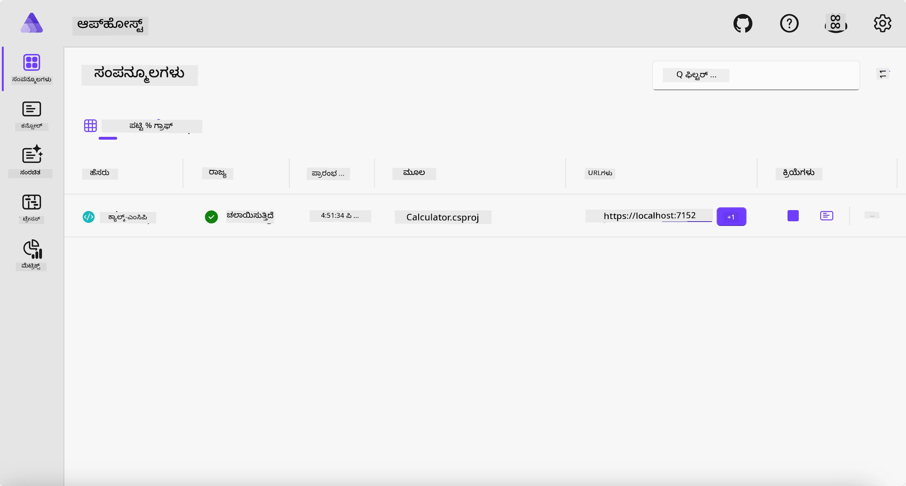
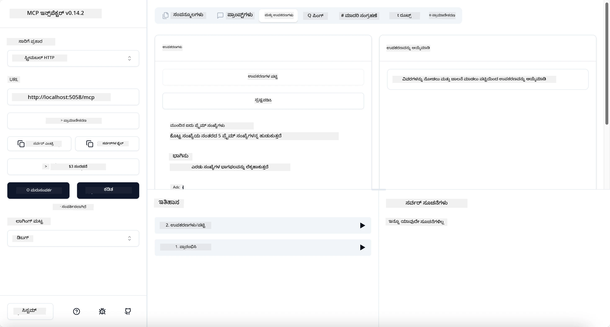
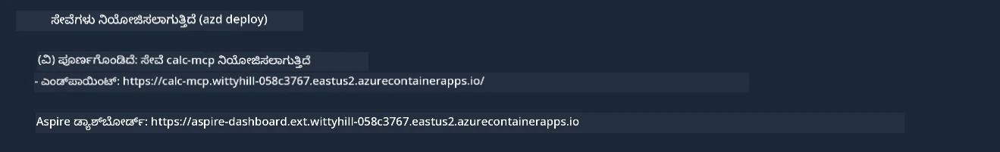

# ಉದಾಹರಣೆ

ಹಿಂದಿನ ಉದಾಹರಣೆ `stdio` ಪ್ರಕಾರದ ಸ್ಥಳೀಯ .NET ಯೋಜನೆಯನ್ನು ಹೇಗೆ ಬಳಸಬೇಕೆಂದು ತೋರಿಸುತ್ತದೆ. ಮತ್ತು ನಿಮ್ಮ ಸರ್ವರ್ ಅನ್ನು ಕಂಟೈನರ್‌ನಲ್ಲಿ ಸ್ಥಳೀಯವಾಗಿ ಹೇಗೆ ಓಡಿಸುವುದನ್ನು ತೋರಿಸುತ್ತದೆ. ಇದು ಅನೇಕ ಸಂದರ್ಭಗಳಲ್ಲಿ ಉತ್ತಮ ಪರಿಹಾರ. ಆದರೆ, ಸರ್ವರ್ ಅನ್ನು ದೂರಸ್ಥವಾಗಿ, ಉದಾಹರಣೆಗೆ ಕ್ಲೌಡ್ ಪರಿಸರದಲ್ಲಿ ಓಡಿಸುವುದು ಸಹ ಉಪಯುಕ್ತವಾಗಬಹುದು. ಅವನಾಗ `http` ಪ್ರಕಾರ ಬಳಸಲಾಗುತ್ತದೆ.

`04-PracticalImplementation` ಫೋಲ್ಡರ್‌ನಲ್ಲಿರುವ ಪರಿಹಾರವನ್ನು ನೋಡಿದರೆ, ಇದು ಹಿಂದಿನದಿಗಿಂತ ತುಂಬಾ ಜಟಿಲವಾಗಿ ಕಾಣಿಸಬಹುದು. ಆದರೆ ವಾಸ್ತವದಲ್ಲಿ ಹಾಗೆ ಅಲ್ಲ. ಪ್ರಾಜೆಕ್ಟ್ `src/Calculator` ಅನ್ನು ನಿಖರವಾಗಿ ನೋಡಿದರೆ ನೀವು ಬಹುಮಾನ ಹೋಲುವಂತಹ ಅದೇ ಕೋಡ್ ಅನ್ನು ಕಾಣುತ್ತೀರಿ. ಏಕೈಕ ವ್ಯತ್ಯಾಸವೆಂದರೆ ನಾವು HTTP ವಿನಂತಿಗಳನ್ನು ನಿರ್ವಹಿಸಲು `ModelContextProtocol.AspNetCore` ಎಂಬ ಬೇರೆಯ ಗ್ರಂಥಾಲಯವನ್ನು ಬಳಸುತ್ತಿದ್ದೇವೆ. ಮತ್ತು `IsPrime` ವಿಧಾನವನ್ನು ಖಾಸಗಿ ಮಾಡಿದ್ದೇವೆ, ಇದು ನಿಮ್ಮ ಕೋಡ್‌ನಲ್ಲಿ ಖಾಸಗಿ ವಿಧಾನಗಳನ್ನು ಹೊಂದಬಹುದೆಂದು ತೋರಿಸಲು. ಉಳಿದ ಕೋಡ್ ಹಿಂದಿನಂತೆ ಒಂದೇ.

ಇತರ ಪ್ರಾಜೆಕ್ಟುಗಳು [Aspire](https://aspire.dev/get-started/what-is-aspire/) ನಿಂದ ಆಗಿವೆ. ಪರಿಹಾರದಲ್ಲಿ Aspire ಇದ್ದರೆ ಅಭಿವೃದ್ಧಿ ಮತ್ತು ಪರೀಕ್ಷೆಯಲ್ಲಿ ಅಭಿವೃದ್ಧಿಪಡಿಸುವುದರ ಅನುಭವವನ್ನೂ ಮತ್ತು ಅವಲೋಕನಕ್ಷಮತೆಯನ್ನು ಉತ್ತಮಗೊಳಿಸುತ್ತದೆ. ಸರ್ವರ್ ಓಡಿಸಲು ಅಗತ್ಯವಿಲ್ಲ, ಆದರೆ ನಿಮ್ಮ ಪರಿಹಾರದಲ್ಲಿ ಇದನ್ನು ಇರಿಸುವುದು ಉತ್ತಮ ಅಭ್ಯಾಸ.

## ಸರ್ವರ್ ಅನ್ನು ಸ್ಥಳೀಯವಾಗಿ ಪ್ರಾರಂಭಿಸಿ

1. VS Code (C# DevKit ವಿಸ್ತರಣೆಯೊಂದಿಗೆ) ನಿಂದ `04-PracticalImplementation/samples/csharp` ಡೈರೆಕ್ಟರಿಯಲ್ಲಿ ಹೋಗಿ.
1. ಸರ್ವರ್ ಪ್ರಾರಂಭಿಸಲು ಕೆಳಗಿನ ಆಜ್ಞೆಯನ್ನು ಕಾರ್ಯಗತಿಗೊಳಿಸಿ:

   ```bash
    dotnet watch run --project ./src/AppHost
   ```

1. ವೆಬ್ ಬ್ರೌಸರ್ Aspire ಡ್ಯಾಶ್‌ಬೋರ್ಡ್ ತೆರೆಯುವಾಗ `http` URL ಗಮನಿಸಿ. ಅದು `http://localhost:5058/` ಎಂಬ ಹಾಗಿರುತ್ತದೆ.

   

## MCP ಇನ್‌سپೆಕ್ಟರ್ ಜೊತೆಗೆ ಸ್ಟ್ರೀಮೇಬಲ್ HTTP ಪರೀಕ್ಷಿಸಿ

ನೀವು Node.js 22.7.5 ಅಥವಾ ಹೆಚ್ಚಿನ ಆವೃತ್ತಿಯನ್ನು ಹೊಂದಿದ್ದರೆ, MCP ಇನ್‌سپೆಕ್ಟರ್ ಮೂಲಕ ಸರ್ವರ್ ಪರೀಕ್ಷೆ ಮಾಡಬಹುದು.

ಸರ್ವರ್ ಪ್ರಾರಂಭಿಸಿ, ಟರ್ಮಿನಲ್‌ನಲ್ಲಿ ಈ ಕೆಳಗಿನ ಆಜ್ಞೆಯನ್ನು ರನ್ ಮಾಡಿ:

```bash
npx @modelcontextprotocol/inspector http://localhost:5058
```



- ಸಂಚಾರ ಪ್ರಕಾರವಾಗಿ `Streamable HTTP` ಆಯ್ಕೆಮಾಡಿ.
- Url ಕ್ಷೇತ್ರದಲ್ಲಿ, ಬರುವ ಸರ್ವರ್ URL ಹಾಕಿ ಮತ್ತು `/mcp` ಸೇರ್ಸಿರಿ. ಅದು `http` (https ಅಲ್ಲ) ಆಗಿರಬೇಕು, ಉದಾಹರಣೆಗೆ `http://localhost:5058/mcp`.
- ಸಂಪರ್ಕ ಬಟನ್ ಆಯ್ಕೆಮಾಡಿ.

ಇನ್‌سپೆಕ್ಟರ್ ಒಬ್ಬ ಚೆನ್ನಾಗಿರುವುದು ಏನೆಂದರೆ ಅದು ನಡೆಯುತ್ತಿರುವುದರ ಬಗ್ಗೆ ಉತ್ತಮ ದೃಶ್ಯಮಾಪನ ಒದಗಿಸುತ್ತದೆ.

- ಲಭ್ಯವಿರುವ ಸಾಧನಗಳನ್ನು ಅಸ್ತಿತ್ವಕ್ಕೆ ತರಲು ಪ್ರಯತ್ನಿಸಿ
- ಅವುಗಳಲ್ಲಿ ಕೆಲವು ಪರೀಕ್ಷಿಸಿ, ಇದು ಹಿಂದಿನಂತೆ ಕೆಲಸ ಮಾಡುತ್ತದೆ.

## VS Code ನಲ್ಲಿ GitHub Copilot Chat ಜೊತೆಗೆ MCP ಸರ್ವರ್ ಪರೀಕ್ಷಿಸಿ

Streamable HTTP ಸಂಚಾರವನ್ನು GitHub Copilot Chat ನಲ್ಲಿ ಬಳಸಲು, ಮೊದಲು ಸೃಷ್ಟಿಸಿದ `calc-mcp` ಸರ್ವರ್ ಕಾಂಫಿಗರೇಶನ್ ಅನ್ನು ಹೀಗೆ ಬದಲಾಯಿಸಿ:

```jsonc
// .vscode/mcp.json
{
  "servers": {
    "calc-mcp": {
      "type": "http",
      "url": "http://localhost:5058/mcp"
    }
  }
}
```

ಕೆಲವು ಪರೀಕ್ಷೆಗಳನ್ನು ಮಾಡಿ:

- "6780 ನಂತರ 3 ಪ್ರಧಾನ ಸಂಖ್ಯೆಗಳು" ಎಂದು ಕೇಳಿ. Copilot ಹೊಸ ಸಾಧನಗಳು `NextFivePrimeNumbers` ಬಳಸುತ್ತದೆ ಮತ್ತು ಮೊದಲ 3 ಪ್ರಧಾನ ಸಂಖ್ಯೆಗಳನ್ನೇ ಮಾತ್ರ ನೀಡುತ್ತದೆ ಎಂದು ಗಮನಿಸಿ.
- "111 ನಂತರ 7 ಪ್ರಧಾನ ಸಂಖ್ಯೆಗಳು" ಕೇಳಿ, ಏನು ಸಂಭವಿಸುತ್ತದೆ ನೋಡಿ.
- "ಜಾನ್ ಬಳಿ 24 ಲಾಲಿಗಳು ಇದ್ದು ಅವನ 3 ಮಕ್ಕಳಿಗೆ ಎಲ್ಲಾ ಹಂಚಬೇಕು. ಪ್ರತಿ ಮಗುವಿಗೆ ಎಷ್ಟು ಲಾಲಿಗಳು ಬರುವುದು?" ಎಂದು ಕೇಳಿ, ಏನು ಸಂಭವಿಸುತ್ತದೆ ನೋಡಿ.

## ಸರ್ವರ್ ಅನ್ನು Azure ಗೆ ನಿಯೋಜಿಸಿ

ಹೆಚ್ಚು ಜನರು ಬಳಕೆ ಮಾಡಲು ನಾವು ಸರ್ವರ್ ಅನ್ನು Azure ಗೆ ನಿಯೋಜಿಸೋಣ.

ಟರ್ಮಿನಲ್‌ನಿಂದ `04-PracticalImplementation/samples/csharp` ಫೋಲ್ಡರ್‌ಗೆ ಹೋಗಿ ಕೆಳಗಿನ ಆಜ್ಞೆಯನ್ನು ಕಾರ್ಯಗತಿಗೊಳಿಸಿ:

```bash
azd up
```

ನಿಯೋಜನೆ ಮುಗಿದರೆ, ಈ ರೀತಿಯ ಸಂದೇಶ ಕಾಣಬಹುದು:



URL ಅನ್ನು ಪಡೆದು MCP ಇನ್‌سپೆಕ್ಟರ್ ಮತ್ತು GitHub Copilot Chat ನಲ್ಲಿ ಬಳಸಿ.

```jsonc
// .vscode/mcp.json
{
  "servers": {
    "calc-mcp": {
      "type": "http",
      "url": "https://calc-mcp.gentleriver-3977fbcf.australiaeast.azurecontainerapps.io/mcp"
    }
  }
}
```

## ಮುಂದಿನಿಂದ ಏನು?

ವಿವಿಧ ಸಂಚಾರ ಪ್ರಕಾರಗಳು ಮತ್ತು ಪರೀಕ್ಷಾ ಸಾಧನಗಳನ್ನು ನಾವು ಪ್ರಯತ್ನಿಸಿದ್ದೇವೆ. ನಮ್ಮ MCP ಸರ್ವರ್ ಅನ್ನು Azure ಗೆ ನಿಯೋಜಿಸಿದ್ದೇವೆ. ಆದರೆ ನಮ್ಮ ಸರ್ವರ್ ಖಾಸಗಿ ಸಂಪನ್ಮೂಲಗಳಿಗೆ ಪ್ರವೇಶ ಬೇಕಾದರೆ? ಉದಾಹರಣೆಗೆ, ಡೇಟಾಬೇಸ್ ಅಥವಾ ಖಾಸಗಿ API? ಮುಂದಿನ ಅಧ್ಯಾಯದಲ್ಲಿ, ನಾವು ನಮ್ಮ ಸರ್ವರ್ ಭದ್ರತೆ ಹೇಗೆ ಉತ್ತಮಗೊಳಿಸಬಹುದು ಎಂಬುದನ್ನು ನೋಡೋಣ.

---

<!-- CO-OP TRANSLATOR DISCLAIMER START -->
**ಅಸ್ವೀಕಾರ**:
ಈ ದಸ್ತಾವೇಜು AI ಅನುವಾದ ಸೇವೆ [Co-op Translator](https://github.com/Azure/co-op-translator) ಬಳಸಿ ಅನುವಾದಿಸಲಾಗಿದೆ. ನಾವು ನಿಖರತೆಯನ್ನು ಸಾಧಿಸಲು ಪ್ರಯತ್ನಿಸುತ್ತಿದ್ದರೂ, ದಯವಿಟ್ಟು ಗಮನಿಸಿ, ಸ್ವಯಂಚಾಲಿತ ಅನುವಾದಗಳಲ್ಲಿ ದೋಷಗಳು ಅಥವಾ ಅಸಡ್ಡೆಗಳು ಇರಬಹುದು. ಮೂಲ ಭಾಷೆಯಲ್ಲಿರುವ ಮೂಲ ದಸ್ತಾವೇಜು ಪ್ರಾಮಾಣಿಕ ಮೂಲವೆಂದು ಪರಿಗಣಿಸಬೇಕು. ಪ್ರಮುಖ ಮಾಹಿತಿಗಾಗಿ, ವೃತ್ತಿಪರ ಮಾನವ ಅನುವಾದವನ್ನು ಶಿಫಾರಸು ಮಾಡಲಾಗುತ್ತದೆ. ಈ ಅನುವಾದವನ್ನು ಬಳಸುವ ಮೂಲಕ ಉಂಟಾಗುವ ಯಾವುದೇ ತಪ್ಪು ಅರ್ಥಗಳ ಅಥವಾ ತಪ್ಪು ವ್ಯಾಖ್ಯಾನಗಳ ಬಗ್ಗೆ ನಾವು ಹೊಣೆಗಾರರಲ್ಲ.
<!-- CO-OP TRANSLATOR DISCLAIMER END -->