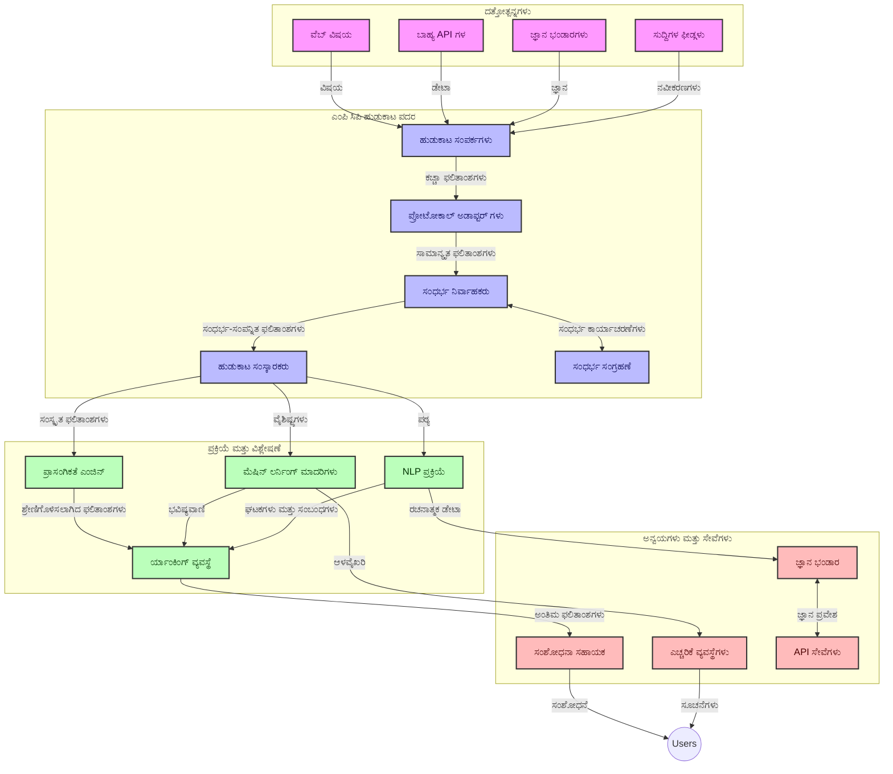
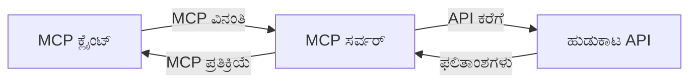
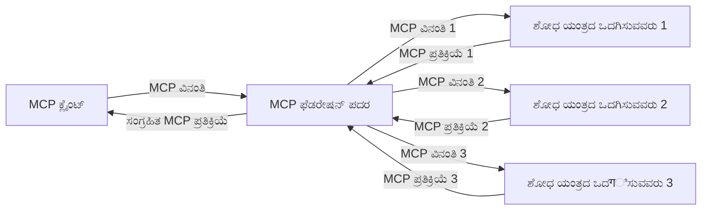
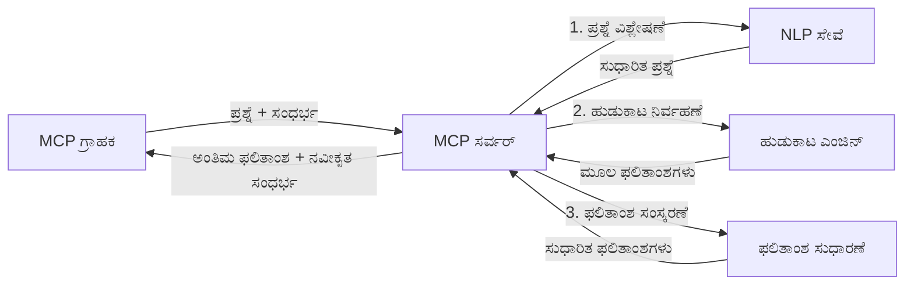

# ರಿಯಲ್-ಟೈಮ್ ವೆಬ್ ಹುಡುಕಾಟಕ್ಕಾಗಿ ಮಾದರಿ ಸಂಧರ್ಭ ಪ್ರೋಟೋಕಾಲ್

## ಅವಲೋಕನ

ರಿಯಲ್-ಟೈಮ್ ವೆಬ್ ಹುಡುಕಾಟವು ಇತ್ತೀಚಿನ ಮಾಹಿತಿ ಬೇಕಾಗುವ ಅಪ್ಲಿಕೇಶನ್‌ಗಳು ಸಂಬಂಧಿತ ಮತ್ತು ಸೂಕ್ತವಾದ ಪ್ರತಿಕ್ರಿಯೆಗಳನ್ನು ಒದಗಿಸಲು ಇಂಟರ್ನೆಟ್ ಆಧಾರಿತ ತಾಜಾದ ಮಾಹಿತಿ ತಕ್ಷಣ ಪ್ರಾಪ್ತಿಗೊಳಿಸಬೇಕಾಗಿರುವ ಇಂದಿನ ಮಾಹಿತಿ ಪ್ರೇರಿತ ಪರಿಸರದಲ್ಲಿ ಅಗತ್ಯವಾಗಿದೆ. ಮಾದರಿ ಸಂಧರ್ಭ ಪ್ರೋಟೋಕಾಲ್ (MCP) ಈ ರಿಯಲ್-ಟೈಮ್ ಹುಡುಕಾಟ ಪ್ರಕ್ರಿಯೆಗಳ ಬುದ್ಧಿಮತ್ತೆಯ ಹೆಚ್ಚಳ, ಹುಡುಕಾಟದ ಕಾರ್ಯಕ್ಷಮತೆ ಸುಧಾರಣೆ, ಸಂಧರ್ಭ ಅಖಂಡತೆಯನ್ನು ಕಾಪಾಡುವುದು ಮತ್ತು ಒಟ್ಟು ಸಿಸ್ಟಮ್ ಪ್ರದರ್ಶನವನ್ನು ಸುಧಾರಿಸುವ ಮಹತ್ವಪೂರ್ಣ ಪ್ರಗತಿಯನ್ನು ಪ್ರತಿನಿಧಿಸುತ್ತದೆ.

ಈ ಮód್ಯೂಲ್ MCP ಹೇಗೆ AI ಮಾದರಿ, ಹುಡುಕಾಟ ಎಂಜಿನ್ ಮತ್ತು ಅಪ್ಲಿಕೇಶನ್‌ಗಳಲ್ಲಿ ಸಂಧರ್ಭ ನಿರ್ವಹಣೆಗೆ ಮಾನಕ ವಿಧಾನ ಒದಗಿಸುವ ಮೂಲಕ ರಿಯಲ್-ಟೈಮ್ ವೆಬ್ ಹುಡುಕಾಟವನ್ನು ಪರಿವರ್ತಿಸುತ್ತದೆ ಎಂಬುದನ್ನು ಅನ್ವೇಷಿಸುತ್ತದೆ.

### ನೀವು ಏನು ಕಲಿಯುವಿರಿ

ಈ ಪೂರ್ಣಗೊಳಿಸಿದ ಮಾರ್ಗದರ್ಶಿಯಲ್ಲೀಗ Você encontrará:

- MCP ಹೇಗೆ AI ಮಾದರಿ ಮತ್ತು ರಿಯಲ್-ಟೈಮ್ ವೆಬ್ ಹುಡುಕಾಟ ಸಾಮರ್ಥ್ಯಗಳ ನಡುವೆ ಸಿರಾಗದ ಸೇತುವೆ ರಚಿಸುತ್ತದೆ
- MCPೊಂದಿಗೆ ಪರಿಣಾಮಕಾರಿ, ವಿಸ್ತಾರಗೊಳ್ಳುವ ಹುಡುಕಾಟ ಪರಿಹಾರಗಳನ್ನು ಜಾರಿಗೆ ತರುವ ವಾಸ್ತುಶಿಲ್ಪ ಮಾದರಿಗಳು
- ಬೊಮ್ಮಲುಗಳು ಮತ್ತು ಪರಸ್ಪರ ಕ್ರಿಯೆಗಳಾದ ಅನೇಕ ಪ್ರಶ್ನೆಗಳ ನಡುವೆ ಹುಡುಕಾಟ ಸಂಧರ್ಭವನ್ನು ಕಾಯ್ದು ಇರಿಸುವ ತಂತ್ರಗಳು
- ವಿವಿಧ ಹುಡುಕಾಟ ಪರಿಸ್ಥಿತಿಗಳಿಗೆ ಪೈಥಾನ್ ಮತ್ತು ಜಾವಾಸ್ಕ್ರಿಪ್ಟ್‌ನಲ್ಲಿರುವ ಕಾರ್ಯನಿರ್ವಹಣಾತ್ಮಕ ಕೋಡ್ ಜಾರಿಗೆ ವಿಧಿಗಳು
- MCP ತಂಡದ ಹುಡುಕಾಟ ವ್ಯವಸ್ಥೆಗಳಲ್ಲಿ ಸಂಬಂಧಿತತೆ, ಇತ್ತೀಚಿನ ಮಾಹಿತಿ ಮತ್ತು ಕಾರ್ಯಕ್ಷಮತೆಯನ್ನು ಸಮತೋಲನಗೊಳಿಸುವ ವಿಧಾನಗಳು

## ರಿಯಲ್-ಟೈಮ್ ವೆಬ್ ಹುಡುಕಾಟಕ್ಕೆ ಪರಿಚಯ

ರಿಯಲ್-ಟೈಮ್ ವೆಬ್ ಹುಡುಕಾಟವು ವೆಬ್ ಆಧಾರಿತ ಮಾಹಿತಿಯನ್ನು ಪ್ರಕಟಿತಾಗುವ ಅಥವಾ ನವೀಕರಿತಾಗುವಷ್ಟರಲ್ಲಿ ನಿರಂತರವಾಗಿ ವಿಚಾರಣೆ, ಪ್ರಕ್ರಿಯೆ ಮತ್ತು ವಿಶ್ಲೇಷಿಸುವ ತಂತ್ರಜ್ಞಾನಾತ್ಮಕ ವಿಧಾನವಾಗಿದೆ, ಇದು ವ್ಯವಸ್ಥೆಗಳಿಗೆ ಕನಿಷ್ಠ ವಿಳಂಬದೊಂದಿಗೆ تازಾ ಮತ್ತು ಸಂಬಂಧಿಸಿದ ಮಾಹಿತಿಯನ್ನು ಒದಗಿಸಲು ಅನುಮತಿಸುತ್ತದೆ. ಗಂಟೆಗಳು ಅಥವಾ ದಿನಗಳ ಹಳೆಯವಾಗಿದೆಯಾದ ಸೂಚ್ಯಂಕಗೊಳಿಸಿದ ಡೇಟಾದ ಮೇಲೆ ಕಾರ್ಯನಿರ್ವಹಿಸುವ ಪಾರಂಪರಿಕ ಹುಡುಕಾಟ ವ್ಯವಸ್ಥೆಗಳಿಗಿಂತ ಬೇರೆಯಾಗಿ, ರಿಯಲ್-ಟೈಮ್ ಹುಡುಕಾಟವು ಜಾಲತಾಣದ ಜೀವಂತ ಡೇಟಾವನ್ನು ಪ್ರಕ್ರಿಯೆಗೊಳಿಸುತ್ತದೆ, ಆನ್‌ಲೈನ್ ವಿಷಯದ ಪ್ರಸ್ತುತ ಸ್ಥಿತಿಯನ್ನು ಪ್ರತಿಬಿಂಬಿಸುವ ದೃಷ್ಟಾಂಶ ಮತ್ತು ಮಾಹಿತಿಯನ್ನು ವಿತರಿಸುತ್ತದೆ.

### ರಿಯಲ್-ಟೈಮ್ ವೆಬ್ ಹುಡುಕಾಟದ ಮೂಲ ತತ್ವಗಳು:

- **ನಿರಂತರ ವಿಚಾರಣೆ ಪ್ರಕ್ರಿಯೆ**: ಹುಡುಕಾಟ ಪ್ರಶ್ನೆಗಳು ಸದಾ ನವೀಕರಿಸುತ್ತಿರುವ ಡೇಟಾ ಮೂಲಗಳ ವಿರುದ್ಧ ಪ್ರಕ್ರಿಯೆಗೊಳಿಸಲಾಗುತ್ತದೆ
- **ಇತ್ತೀಚಿನತೆಯನ್ನು ಆದ್ಯತೆ ನೀಡುವುದು**: ವ್ಯವಸ್ಥೆಗಳು تازಾ ಮಾಹಿತೆಯನ್ನು ಆದ್ಯತಾಪೂರಿತವಾಗಿರಲು ವಿನ್ಯಾಸಗೊಳೆವು
- **ಸಂಬಂಧಿತ ಸಮತೋಲನ**: ಸಂಬಂಧಿತತೆ ಮತ್ತು ಇತ್ತೀಚಿನತೆಯ ನಡುವೆ ಸಮತೋಲನವನ್ನು ಕಾಯ್ದುಕೊಳ್ಳುವುದು
- **ವಿಸ್ತಾರಗೊಳ್ಳುವ ವಾಸ್ತುಶಿಲ್ಪ**: ಸಿಸ್ಟಮ್‌ಗಳು ವ್ಯತ್ಯಾಸಮಾಡುವ ಪ್ರಶ್ನಾ ಭಾರಗಳು ಮತ್ತು ಡೇಟಾ ಪ್ರಮಾಣಗಳನ್ನು ಹ್ಯಾಂಡಲ್ ಮಾಡಬೇಕು
- **ಸಂಧರ್ಭದ ಅರಿವು**: ಹುಡುಕಾಟ ಪುನರಾವರ್ತನೆಗಳಾದಂತೆ ಬಳಕೆದಾರ ಸಂಧರ್ಭವನ್ನು ಕಾಯ್ದುಕೊಳ್ಳುವುದು ಮಹತ್ವಪೂರ್ಣ
- ** động Query ಪುನರ್‌ರೂಪಗೊಳಿಸುವುದು**: ಸಂಧರ್ಭ ಮತ್ತು ಪೂರ್ವ ಪರಿಣಾಮಗಳ ಆಧಾರದ ಮೇಲೆ ಹೊಂದಾಣಿಕೆಗೊಳ್ಳುವ ಪ್ರಶ್ನೆಗಳ ಮರುಸಂರಚನೆ
- **ಬಹು-ಮೂಲ ಇಂಟಿಗ್ರೇಶನ್**: ಹಲವಾರು ಹುಡುಕಾಟ ಒದಗಿಸುವವರ ಮತ್ತು ವೆಬ್ ಮೂಲಗಳಿಂದ ಫಲಿತಾಂಶಗಳನ್ನು ಸಂಯೋಜನೆ ಮಾಡುವುದು
- **ಅರ್ಥ ವೈಚಾರಿಕತೆ**: ಕೀವರ್ಡ್ಗಳಿಗಿಂತ ಬೇರೆ ಅರ್ಥದ ಆಧಾರದ ಮೇಲೆ ಪ್ರಶ್ನೆ ಮತ್ತು ವಿಷಯವನ್ನು ಪ್ರಕ್ರಿಯೆಗೊಳಿಸುವುದು
- **ರಿಯಲ್-ಟೈಮ್ ರ್ಯಾಂಕಿಂಗ್**: ಹೊಸ ಮಾಹಿತಿ ಲಭ್ಯವಾಗುತ್ತಿದ್ದಂತೆ ಫಲಿತಾಂಶದ ಸ್ಥಾನಮಾನಗಳ ನಿರಂತರವಾಗಿ ಸವರಣೆ

### ಮಾದರಿ ಸಂಧರ್ಭ ಪ್ರೋಟೋಕಾಲ್ ಮತ್ತು ರಿಯಲ್-ಟೈಮ್ ವೆಬ್ ಹುಡುಕಾಟ

ಮಾದರಿ ಸಂಧರ್ಭ ಪ್ರೋಟೋಕಾಲ್ (MCP) ರಿಯಲ್-ಟೈಮ್ ವೆಬ್ ಹುಡುಕಾಟ ಪರಿಸರಗಳಲ್ಲಿ ಕೆಲವು ಪ್ರಮುಖ ಸವಾಲುಗಳನ್ನು ಪೂರೈಸುತ್ತದೆ:

1. **ಹುಡುಕಾಟ ಸಂಧರ್ಭ ಕಾಯ್ದುಕೊಳ್ಳುವುದು**: MCP ಬಿತ್ತಡಿಕೆಯ ಹುಡುಕಾಟ ಘಟಕಗಳ ನಡುವೆ ಸಂಧರ್ಭವನ್ನು ಹೋಲಿಸುವ ರೀತಿಯಲ್ಲಿ ಮಾನಕ ಹೋರಾಟವನ್ನು ನೀಡುತ್ತದೆ, ಇದರಿಂದ AI ಮಾದರಿ ಮತ್ತು ಪ್ರಕ್ರಿಯೆ ಶೃಂಗಗಳಿಗೆ ಸಂಬಂಧಿಸಿದ ಪ್ರಶ್ನಾ ಇತಿಹಾಸ ಮತ್ತು ಬಳಕೆದಾರ ಪ್ರಾಧ್ಯತೆಗಳ ಪ್ರಾಪ್ತಿಗೊಳ್ಳುವಿಕೆ ಸಾಧ್ಯವಾಗುತ್ತದೆ.

2. **ದಕ್ಷ ಪ್ರಶ್ನಾ ನಿರ್ವಹಣೆ**: ಸಂಧರ್ಭ ಪ್ರಸರಣಕ್ಕಾಗಿ ಘನವಾದ ವಿಧಾನಗಳನ್ನು ಒದಗಿಸುವ ಮೂಲಕ MCP ಪ್ರತೀ ಹುಡುಕಾಟ ಪುನರಾವರ್ತನೆಯಲ್ಲಿನ ಸಂಧರ್ಭ ಪುನರಾವರ್ತನೆಯ ಭಾರವನ್ನು ಕಡಿಮೆ ಮಾಡುತ್ತದೆ.

3. **ಸಾಕ್ಷಮತೆಯ ಜೋಡಣಿಕೆ**: MCP ವಿಭಿನ್ನ ಹುಡುಕಾಟ ತಂತ್ರಜ್ಞಾನಗಳು ಮತ್ತು AI ಮಾದರಿಗಳ ನಡುವೆ ಸಂಧರ್ಭ ಹಂಚಿಕೆಯ ಸಾಮಾನ್ಯ ಭಾಷೆಯನ್ನು ರಚಿಸುತ್ತದೆ, ಇದು ಹೆಚ್ಚು ಲವಚಿಕ ಮತ್ತು ವಿಸ್ತರಿಸುವ ವಾಸ್ತುಶಿಲ್ಪಗಳನ್ನು ಸಾಧ್ಯಮಾಡುತ್ತದೆ.

4. **ಹುಡುಕಾಟ-ಅನುವಾದಿತ ಸಂಧರ್ಭ**: MCP ಜಾರಿಗೆ ತರುತ್ತಿರುವ ಸಂಧರ್ಭವು ಪರಿಣಾಮಕಾರಿಯಾದ ಹುಡುಕಾಟಕ್ಕಾಗಿ ಅತ್ಯಂತ ಸಂಬಂಧಿತ ವಿಚಾರಾಂಶಗಳನ್ನು ಆದ್ಯತೆ ನೀಡಬಹುದು, ಇದು ಕಾರ್ಯಕ್ಷಮತೆ ಮತ್ತು ಖಚಿತತೆ ಎರಡರನ್ನೂ ಪರಿಪೂರ್ಣಗೊಳಿಸುತ್ತದೆ.

5. **ಅನುಕೂಲಗೊಳ್ಳುವ ಹುಡುಕಾಟ ಪ್ರಕ್ರಿಯೆ**: MCP ಮೂಲಕ ಸಮರ್ಪಕ ಸಂಧರ್ಭ ನಿರ್ವಹಣೆಯಿಂದ, ಹುಡುಕಾಟ ವ್ಯವಸ್ಥೆಗಳು ಬಳಕೆದಾರನ ಅಗತ್ಯಗಳು ಮತ್ತು ಮಾಹಿತಿಯ ಪರಿಸರಗಳ ಆಧಾರದ ಮೇಲೆ ಪ್ರಕ್ರಿಯೆಯನ್ನು ಡೈನಾಮಿಕ್‌ವಾಗಿ ಸರಿಹೊಂದಿಸಬಹುದು.

ನ್ಯೂಸ್ ಅಗ್ರಿಗೇಶನ್‌ನಿಂದ ಸಂಶೋಧನಾ ಸಹಾಯಕರೆಂದರೆ ಇಂದಿನ ಅಪ್ಲಿಕೇಶನ್‌ಗಳಲ್ಲಿ MCPನ ಸಂಘಟನೆ ಹೆಚ್ಚುತ್ತಿರುವಂತೆ, ವೆಬ್ ಹುಡುಕಾಟ ತಂತ್ರಜ್ಞಾನಗಳ ಜೋಡಣೆಯಿಂದ ಪ್ರಾಮಾಣಿಕ, ಸಂಧರ್ಭ-अದರಿತ ಹುಡುಕಾಟ ಸಾಧ್ಯವಾಗುತ್ತದೆ, ಇದು ಬಳಕೆದಾರ ಪರಸ್ಪರ ಕ್ರಿಯೆಗಳೊಂದಿಗೆ ಹೆಚ್ಚು ಸಂಬಂಧಿತ ಫಲಿತಾಂಶಗಳನ್ನು ನೀಡುತ್ತದೆ.

## ಕಲಿಕೆಯ ಗುರಿಗಳು

ಈ ಪಾಠದ ಅಂತ್ಯಕ್ಕೆ ನೀವು ಸಾಧಿಸಬಹುದಾದವುಗಳು:

- ರಿಯಲ್-ಟೈಮ್ ವೆಬ್ ಹುಡುಕಾಟದ ಮೂಲಭೂತ ತತ್ವಗಳು ಮತ್ತು ಅದರಲ್ಲಿ ಎದುರಿಸುವ ಸವಾಲುಗಳನ್ನು ತಿಳಿದುಕೊಳ್ಳುವುದು
- ಮಾದರಿ ಸಂಧರ್ಭ ಪ್ರೋಟೋಕಾಲ್ (MCP) ರಿಯಲ್-ಟೈಮ್ ವೆಬ್ ಹುಡುಕಾಟ ಸಾಮರ್ಥ್ಯಗಳನ್ನು ಹೇಗೆ ಉತ್ತಮಗೊಳಿಸುತ್ತದೆ ಎನ್ನುವುದನ್ನು ವಿವರಿಸುವುದು
- ಜನಪ್ರಿಯ ಫ್ರೇಮ್ವರ್ಕ್‌ಗಳು ಮತ್ತು APIಗಳ ಬಳಕೆ ಮಾಡಿ MCP ಆಧಾರಿತ ಹುಡುಕಾಟ ಪರಿಹಾರಗಳನ್ನು ಜಾರಿಗೊಳಿಸುವುದು
- MCP ಸಹಿತ ವಿಸ್ತಾರಗೊಳ್ಳುವ, ಹೆಚ್ಚಿನ ಪ್ರದರ್ಶನದ ಹುಡುಕಾಟ ವಾಸ್ತುಶಿಲ್ಪಗಳನ್ನು ವಿನ್ಯಾಸ ಮತ್ತು ನಿಯೋಜಿಸುವುದು
- ಸಂಧರ್ಭ ಚಿಂತನೆಗಳನ್ನು ಸಿಂಮ್ಯಾಂಟಿಕ್ ಹುಡುಕಾಟ, ಸಂಶೋಧನಾ ಸಹಾಯ ಮತ್ತು AI-ಅಗ್ಮೆಂಟೆಡ್ ಬ್ರೌಸಿಂಗ್ ಸೇರಿದಂತೆ ವಿಭಿನ್ನ ಬಳಕೆ ಪ್ರಕರಣಗಳಿಗೆ ಅನ್ವಯಿಸುವುದು
- MCP ಆಧಾರಿತ ಹುಡುಕಾಟ ತಂತ್ರಜ್ಞಾನಗಳ ಉದಯೋನ್ಮುಖ ಧೋರಣೆಗಳು ಮತ್ತು ಭವಿಷ್ಯದ ಆವಿಷ್ಕಾರಗಳನ್ನು ಮೌಲ್ಯಮಾಪನ ಮಾಡುವುದು
- ಬಳಕೆದಾರ ಪರಸ್ಪರ ಕ್ರಿಯೆಯಿಂದ ಕಲಿಕೆಯನ್ನು ಪಡೆಯುವ ಸಂಧರ್ಭ-ಅದರಿತ ಹುಡುಕಾಟ ವ್ಯವಸ್ಥೆಗಳನ್ನು ಅಭಿವೃದ್ಧಿಪಡಿಸುವುದು
- ಮಾನಕ MCP ಪ್ರೋಟೋಕಾಲ್‌ಗಳನ್ನು ಬಳಸಿಕೊಂಡು AI ಸಹಾಯಕರಲ್ಲಿ ವೆಬ್ ಹುಡುಕಾಟ ಸಾಮರ್ಥ್ಯಗಳನ್ನು ಇಂಟಿಗ್ರೇಟ್ ಮಾಡುವುದು
- ಸಂಧರ್ಭ ಆಧಾರಿತವಾಗಿ ರೂಪುಗೊಂಡ ಫಲಿತಾಂಶಗಳನ್ನು ಪ್ರಗತಿಶೀಲವಾಗಿ ಶುದ್ಧೀಕರಿಸುವ ಬಹು-ಹಂತ ಹುಡುಕಾಟ ಪೈಪ್‌ಲೈನ್‌ಗಳು ರಚಿಸುವುದು
- ಸಂಧರ್ಭ ಅರಿವು ರೂಢಿಸಿಕೊಂಡು ಹುಡುಕಾಟ ಕಾರ್ಯಕ್ಷಮತೆಯನ್ನು ಸಹ ಒತ್ತಾಯಿಸುವುದು

### ವ್ಯಾಖ್ಯಾನ ಮತ್ತು ಮಹತ್ವ

ರಿಯಲ್-ಟೈಮ್ ವೆಬ್ ಹುಡುಕಾಟವು ಕನಿಷ್ಠ ವಿಳಂಬದೊಂದಿಗೆ ವೆಬ್ ಆಧಾರಿತ ಮಾಹಿತಿಯ ನಿರಂತರ ವಿಚಾರಣೆ, ಪಡೆ এবং ವಿತರಣೆಯನ್ನು ಒಳಗೊಂಡಿದೆ. ಕಾಲಾಂಕಿತವಾಗಿ ಜಾಲತಾಣವನ್ನು ಕ್ರೋಲ್ ಮಾಡಲಾಗಿ ಸೂಚ್ಯಂಕ ಮಾಡಲೆಂದು ಪ್ರಯತ್ನಿಸುವ ಪಾರಂಪರಿಕ ಹುಡುಕಾಟ ಎಂಜಿನ್‌ಗಳಿಗಿಂತ ಬೇರೆಯಾಗಿ, ರಿಯಲ್-ಟೈಮ್ ಹುಡುಕಾಟ ಲಭ್ಯವಿರುವಂತೆ ಮಾಹಿತಿ ಮೇಲ್ಕೆಳೆಯುವ ಪ್ರಯತ್ನವನ್ನು ಮಾಡುತ್ತದೆ, ಅತ್ಯಂತ ನವೀನ ವಿಷಯಕ್ಕೆ ತಕ್ಷಣ ಪ್ರವೇಶವನ್ನು ಅನುಮತಿಸುತ್ತದೆ.

ರಿಯಲ್-ಟೈಮ್ ವೆಬ್ ಹುಡುಕಾಟದ ಪ್ರಮುಖ ಲಕ್ಷಣಗಳು:

- **ತಾಜತೆ**: ಇತ್ತೀಚಿನ ವಿಷಯವನ್ನು ಮತ್ತು ನವೀಕರಣಗಳನ್ನು ಆದ್ಯತೆ ನೀಡುವುದು
- **ನಿರಂತರ ಪ್ರಕ್ರಿಯೆ**: ಹೊಸ ಮಾಹಿತಿಗಾಗಿ ಸದಾ ನಿಗಾವಾಳುವುದು
- **ಪ್ರಶ್ನೆ ಹೊಂದಿಕೆಯು**: ಸಂಧರ್ಭ ಮತ್ತು ಪ್ರತಿಕ್ರಿಯೆಯ ಆಧಾರದ ಮೇಲೆ ಹುಡುಕಾಟ ಪ್ರಶ್ನೆಗಳನ್ನು ಶುದ್ಧೀಕರಿಸುವುದು
- **ತಕ್ಷಣ ವಿತರಣೆಯು**: ಕನಿಷ್ಠ ವಿಳಂಬದೊಂದಿಗೆ ಹುಡುಕಾಟ ಫಲಿತಾಂಶಗಳನ್ನು ಒದಗಿಸುವುದು
- **ಸಂಧರ್ಭ ಕಾಯ್ದುಕೊಳ್ಳುವುದು**: ಮುಂಚಿನ ಪ್ರಶ್ನೆಗಳ ಮೇಲೆ ಕಟ್ಟಿಕೊಳ್ಳಿ ಉತ್ತಮ ಸಂಬಂಧಿತತೆಯಿಗಾಗಿ

### ಪಾರಂಪರಿಕ ವೆಬ್ ಹುಡುಕಾಟದ ಸವಾಲುಗಳು

ಪಾರಂಪರಿಕ ವೆಬ್ ಹುಡುಕಾಟ ವಿಧಾನಗಳು ರಿಯಲ್-ಟೈಮ್ ಪರಿಸ್ಥಿತಿಗಳಲ್ಲಿ ಅನ್ವಯಿಸಿದಾಗ ಹಲವಾರು ಸೀಮಿತತೆಗಳನ್ನು ಎದುರಿಸಬೇಕಾಗುತ್ತದೆ:

1. **ಸಂಧರ್ಭದ ಭಾಗಶಃಗೊಳಿಸುವಿಕೆ**: ಹಲವಾರು ಪ್ರಶ್ನೆಗಳ ನಡುವೆ ಹುಡುಕಾಟ ಸಂಧರ್ಭವನ್ನು ಕಾಯ್ದುಕೊಳ್ಳಲು ಕಷ್ಟ
2. **ಮಾಹಿತಿಯ تازಗಿಯು**: ಅತ್ಯಂತ ಇತ್ತೀಚಿನ ಮಾಹಿತಿಯನ್ನು ಪ್ರವೇಶಿಸುವುದು ಮತ್ತು ಆದ್ಯತೆ ನೀಡುವುದರಲ್ಲಿ ಸವಾಲುಗಳು
3. **ಸಂಯೋಜನೆಯ ಜಟಿಲತೆ**: ಹುಡುಕಾಟ ವ್ಯವಸ್ಥೆಗಳು ಮತ್ತು ಅಪ್ಲಿಕೇಶನ್‌ಗಳ ನಡುವಣ ಸಾಮರಸ್ಯದ ಸಮಸ್ಯೆಗಳು
4. **ವಿಳಂಬ ಸಮಸ್ಯೆಗಳು**: ವಿಸ್ತೃತ ಹುಡುಕಾಟ ಮತ್ತು ಪ್ರತಿಕ್ರಿಯಾ ಸಮಯ ಅಗತ್ಯಗಳ ಸಮತೋಲನ
5. **ಸಂಬಂಧಿತ ಸರಿಹೊಂದಿಸುವಿಕೆ**: ಇತ್ತೀಚಿನತೆಯನ್ನು ಆದ್ಯತೆವಿದೆ ಎಂದಾದರೂ ಖಚಿತತೆ ಮತ್ತು ಸಂಬಂಧಿತತೆ ನಿರ್ವಹಣೆ

## ಹುಡುಕಾಟಕ್ಕೆ ಮಾದರಿ ಸಂಧರ್ಭ ಪ್ರೋಟೋಕಾಲ್ (MCP) ಅರ್ಥಮಾಡಿಕೊಳ್ಳಿ

### ಹುಡುಕಾಟ ಸಂಧರ್ಭದಲ್ಲಿ MCP ಎಂದರೆ ಏನು?

ಮಾದರಿ ಸಂಧರ್ಭ ಪ್ರೋಟೋಕಾಲ್ (MCP) ಎಂಬುದು AI ಮಾದರಿ ಮತ್ತು ಅಪ್ಲಿಕೇಶನ್‌ಗಳ ನಡುವೆ ಪರಿಣಾಮಕಾರಿ ಸಂವಹನವನ್ನು ಸುಲಭಗೊಳಿಸಲು ರೂಪುಗೊಂಡ ಮಾನಕ ಸಂವಹನ ಪ್ರೋಟೋಕಾಲ್ ಆಗಿದೆ. ರಿಯಲ್-ಟೈಮ್ ವೆಬ್ ಹುಡುಕಾಟದ ವಿವಿಧ ಪರಿಕಲ್ಪನೆಗಳಲ್ಲಿ MCP ನೀಡುವುದು:

- ಪ್ರಶ್ನೆ ಕ್ರಮಗಳಾದಂತೆ ಹುಡುಕಾಟ ಸಂಧರ್ಭವನ್ನು ಕಾಯ್ದುಕೊಳ್ಳುವುದು
- ಹುಡುಕಾಟ ಪ್ರಶ್ನೆ ಮತ್ತು ಫಲಿತಾಂಶ ಸ್ವರೂಪಗಳನ್ನು ಮಾನಕರಗೊಳಿಸುವುದು
- ಹುಡುಕಾಟ ಮಿತಿಗಳು ಮತ್ತು ಫಲಿತಾಂಶಗಳ ಪ್ರಸರಣದ ಸುಧಾರಣೆ
- ಮಾದರಿ-ಇಂಜಿನ್ ಸಂವಹನಕ್ಕೆ ಕ್ರಯೋೕಜನೋಪಾಯಗಳ ಸುಧಾರಣೆ

### ಮೂಲ ಘಟಕಗಳು ಮತ್ತು ವಾಸ್ತುಶಿಲ್ಪ

ರಿಯಲ್-ಟೈಮ್ ವೆಬ್ ಹುಡುಕಾಟಕ್ಕಾಗಿ MCP ವಾಸ್ತುಶಿಲ್ಪದಲ್ಲಿ ಹಲವು ಪ್ರಮುಖ ಘಟಕಗಳಿವೆ:

1. **ಪ್ರಶ್ನೆ ಸಂಧರ್ಭ ನಿರ್ವಾಹಕರು**: ಹಲವಾರು ಪ್ರಶ್ನೆಗಳ ನಡುವಣ ಹುಡುಕಾಟ ಸಂಧರ್ಭ ನಿರ್ವಹಣೆ ಮತ್ತು ಅನುಸರಣೆ
2. **ಹುಡುಕಾಟ ಪ್ರಕ್ರಿಯೆಗೊಳಿಸುವವನು**: ಸಂಧರ್ಭ-ಅದರಿತ ತಂತ್ರದ ಮೂಲಕ ಪ್ರವೇಶಿಸಿದ ಹುಡುಕಾಟ ವಿನಂತಿಗಳನ್ನು ಪ್ರಕ್ರಿಯೆಗೊಳಿಸುವುದು
3. **ಪ್ರೋಟೋಕಾಲ್ ಅಡಾಪ್ಟರ್‌ಗಳು**: ವಿವಿಧ ಹುಡುಕಾಟ APIಗಳ ನಡುವೆ ಸಂಧರ್ಭವನ್ನು ಕಾಯ್ದುಕೊಂಡು ಪರಿವರ್ತಿಸುವುದು
4. **ಸಂಧರ್ಭ ಸಂಗ್ರಹಣೆ**: ಹುಡುಕಾಟ ಇತಿಹಾಸ ಮತ್ತು ಪ್ರಾಧ್ಯತೆಗಳನ್ನು ಪರಿಣಾಮಕಾರಿ ರೀತಿಯಲ್ಲಿ ಸಂಗ್ರಹಿಸಿ ಹಿಂತೆಗೆದುಕೊಂಡುಬರುವುದು
5. **ಹುಡುಕಾಟ ಸಂಪರ್ಕದಾರರು**: ವಿವಿಧ ಹುಡುಕಾಟ ಎಂಜಿನ್‌ಗಳು ಮತ್ತು ವೆಬ್ APIಗಳೊಂದಿಗೆ ಸಂಪರ್ಕ ಮಾಡುವುದು



### MCP ರಿಯಲ್-ಟೈಮ್ ವೆಬ್ ಹುಡುಕಾಟವನ್ನು ಹೇಗೆ ಸುಧಾರಿಸುತ್ತದೆ

MCP ಮುಖ್ಯತೆಗೆ ಪಾರಂಪರಿಕವೆಬ್ ಹುಡುಕಾಟದ ಸವಾಲುಗಳನ್ನು ಹೀಗೆ ಪರಿಹರಿಸುತ್ತದೆ:

- **ಸಂಧರ್ಭದ ಸತತತೆ**: ಸಂಪೂರ್ಣ ಹುಡುಕಾಟ ಸೆಷನ್‌ನಾದ್ಯಂತ ಪ್ರಶ್ನೆಗಳ ಮಧ್ಯೆ ಸಂಬಂಧಗಳನ್ನು ಕಾಯ್ದುಕೊಳ್ಳುವುದು
- **ಆಪ್ಟಿಮೈಜ್ಡ್ ಪ್ರಸರಣ**: ಬುದ್ಧಿವಂತಿಕೆಯಿಂದ ಸಂಧರ್ಭ ನಿರ್ವಹಣೆಯಿಂದ ಹುಡುಕಾಟ ಮಿತಿಗಳ ಪುನರಾವರ್ತನೆಯ ಕಡಿತ
- **ಮಾನಕ ಇಂಟರ್ಫೇಸ್‌ಗಳು**: ಹುಡುಕಾಟ ಘಟಕಗಳಿಗೆ ಸರಳ ಮತ್ತು ಅಭಿಮತ APIs ಒದಗಿಸುವುದು
- **ಕಡಿಮೆ ವಿಳಂಬ**: ಪರಿಣಾಮಕಾರಿ ಸಂಧರ್ಭ ಹ್ಯಾಂಡ್ಲಿಂಗ್ ಮೂಲಕ ಪ್ರಕ್ರಿಯೆ ಭಾರವನ್ನು ಕಡಿಮೆ ಮಾಡುವುದು
- **ಸುಧಾರಿತ ಸಂಬಂಧಿತತೆ**: ಹಲವಾರು ಪ್ರಶ್ನೆಗಳಲ್ಲಿಯೂ ಬಳಕೆದಾರ ಉದ್ದೇಶವನ್ನು ಕಾಯ್ದುಕೊಂಡು ಹುಡುಕಾಟ ಸಂಬಂಧಿತತೆಯನ್ನು ಹೆಚ್ಚಿಸುವುದು

## ಸಂಯೋಜನೆ ಮತ್ತು ಜಾರಿಗೊಳಿಕೆ

ರಿಯಲ್-ಟೈಮ್ ವೆಬ್ ಹುಡುಕಾಟ ವ್ಯವಸ್ಥೆಗಳಿಗೆ ಕಾರ್ಯಕ್ಷಮತೆ ಮತ್ತು ಸಂಧರ್ಭ ಅಖಂಡತೆಯ ಎರಡನ್ನೂ ಕಾಪಾಡಲು ಎಚ್ಚರಿಕೆಯಿಂದ ವಾಸ್ತುಶಿಲ್ಪ ವಿನ್ಯಾಸ ಮತ್ತು ಜಾರಿಗೊಳಿಕೆ ಅಗತ್ಯವಿದೆ. ಮಾದರಿ ಸಂಧರ್ಭ ಪ್ರೋಟೋಕಾಲ್ AI ಮಾದರಿಗಳ ಮತ್ತು ಹುಡುಕಾಟ ತಂತ್ರಜ್ಞಾನಗಳ ಜೋಡಣೆಗೆ ಮಾನಕ ಹಾದಿಯನ್ನು ಒದಗಿಸುವ ಮೂಲಕ ಹೆಚ್ಚು ಜಟಿಲ, ಸಂಧರ್ಭ-ಅದರಿತ ಹುಡುಕಾಟ ಪೈಪ್‌ಲೈನ್‌ಗಳನ್ನು ಸಾಧ್ಯಮಾಡುತ್ತದೆ.

### ಹುಡುಕಾಟ ವಾಸ್ತುಶಿಲ್ಪಗಳಲ್ಲಿ MCP ಸಂಯೋಜನೆಯ ಅವಲೋಕನ

ರಿಯಲ್-ಟೈಮ್ ವೆಬ್ ಹುಡುಕಾಟ ಪರಿಸರಗಳಲ್ಲಿ MCP ಜಾರಿಗೊಳಿಸುವುದಕ್ಕೆ ಕೆಲವು ಮುಖ್ಯ ವಿಚಾರಗಳಿವೆ:

1. **ಹುಡುಕಾಟ ಸಂಧರ್ಭ ಸರಣೀಕರಣ**: MCP ಹುಡುಕಾಟ ವಿನಂತಿಗಳೊಳಗಿನ ಸಂಧರ್ಭ ಮಾಹಿತಿಯನ್ನು ಸಂಕೇತಗೊಳಿಸುವ ದಕ್ಷ ವಿಧಾನಗಳನ್ನು ಒದಗಿಸುತ್ತದೆ, ಮುಖ್ಯ ಸಂಧರ್ಭ ಪ್ರಶ್ನೆಯ ವಿಷೇಶತೆಯನ್ನು ಪ್ರಕ್ರಿಯೆ ಪೈಪ್‌ಲೈನ್‌ಗಳಾದ್ಯಂತ ಅನುಸರಿಸುತ್ತದೆ. ಇದರಲ್ಲಿ ಮುಖ್ಯವಾಗಿ ಹುಡುಕಾಟ ಸಂಬಂಧಿ ಮೆಟಾಡೇಟಾ ಗಾಗಿ ಮೇಮಗ್ರಾಗಳು ಇರುವ ಮಾನಕ ಸರಣೀಕರಣ ಸ್ವರೂಪಗಳಿವೆ.

2. **ಸ್ಥಿರಸ್ಥಿತಿಯ ಹುಡುಕಾಟ ಪ್ರಕ್ರಿಯೆಗೊಳಿಸುವಿಕೆ**: MCP ಸದೃಢ ಸಂಧರ್ಭ ಪ್ರತಿನಿಧಾನವನ್ನು ಕಾಯ್ದುಕೊಂಡು ಹಲವಾರು ಹುಡುಕಾಟ ಪುನರಾವರ್ತನೆಗಾಗಿನ ಹೆಚ್ಚು ಬುದ್ಧಿವಂತ ಸ್ಥಿರಪ್ರಕ್ರಿಯೆಯನ್ನು ಸಾಧ್ಯಮಾಡುತ್ತದೆ. ಇದು ಹೆಚ್ಚಿನ ಹಂತಗಳ ಹುಡುಕಾಟ ಪೈಪ್‌ಲೈನ್‌ಗಳಲ್ಲಿ ಫಲಿತಾಂಶ ಸುಧಾರಣೆಗೆ ವಿಶೇಷ ಮೌಲ್ಯವನ್ನು ಕೊಡುತ್ತದೆ.

3. **ಪ್ರಶ್ನೆ ವಿಸ್ತಾರ ಹಾಗೂ ಶುದ್ಧೀಕರಣ**: MCP ಜಾರಿಗೆ ತರುವವು ಸಂಚಯಿತ ಸಂಧರ್ಭ ಆಧಾರದ ಮೇಲೆ ಜಟಿಲ ಪ್ರಶ್ನಾ ವಿಸ್ತಾರ ಮತ್ತು ಶುದ್ಧೀಕರಣವನ್ನು ಸುಲಭಗೊಳಿಸುತ್ತವೆ, ಹುಡುಕಾಟ ಸೆಷನ್ ಪ್ರಗತಿಯಂತೆ ಹೆಚ್ಚು ಸಂಬಂಧಿತ ಫಲಿತಾಂಶಗಳನ್ನು ಒದಗಿಸುತ್ತವೆ.

4. **ಫಲಿತಾಂಶ ক্যಾಶೆ ಮತ್ತು ಆದ್ಯತೆಗಳು**: MCP ಸಂಧರ್ಭ ನಿರ್ವಹಣೆಯನ್ನು ಮಾನಕರೂಪದಲ್ಲಿ ಮಾಡುವುದರಿಂದ, ಘಟಕಗಳಿಗೆ ಮಾರ್ಗದರ್ಶನ ನೀಡಿ ಫಲಿತಾಂಶ ಕ್ಯಾಶೆ ಮತ್ತು ಆದ್ಯತೆಗಳನ್ನು ಸಹಜವಾಗಿ ನಿರ್ವಹಿಸಲು ನೆರವಾಗುತ್ತದೆ.

5. **ಹುಡುಕಾಟ ಸಂವಿಧಾನ ಮತ್ತು ಸಂಗ್ರಹಣೆ**: MCP ಸಂಧರ್ಭದ ಘನರೂಪಿತ ಪ್ರತಿನಿಧಾನಗಳಿಂದಾಗಿ ಹಲವು ಬೆಕ್‌ಎಂಡ್‌ಗಳ ನಡುವೆ ಹುಡುಕಾಟದ ಹೆಚ್ಚು ಜಟಿಲ ಫೆಡರೇಶನ್ ಮತ್ತು ಫಲಿತಾಂಶ ಸಂಗ್ರಹಣೆಯನ್ನೂ ಸಹ ಸೂಕ್ತವಾಗಿ ಮಾಡಬಹುದು.

ವಿವಿಧ ಹುಡುಕಾಟ ತಂತ್ರಜ್ಞಾನಗಳಲ್ಲಿ MCP ಜಾರಿಗೆ ತರುವಿಕೆ ಕ್ರಮಾಂತರದಲ್ಲಿ ಸಂಧರ್ಭ ನಿರ್ವಹಣೆಗೆ ಏಕೀಕೃತ ವಿಧಾನ ಸೃಷ್ಟಿಸಲಾಗುತ್ತದೆ, ಇದರಿಂದ ಕಸ್ಟಮ್ ಸಂಯೋಜನಾ ಕೋಡ್ ಅವಶ್ಯಕತೆ ಕಡಿಮೆಯಾಗುತ್ತದೆ ಮತ್ತು ಹುಡುಕಾಟ ಪ್ರಶ್ನೆಗಳ ಬೆಳವಣಿಗೆಯೊಡನೆ ಅರ್ಥದಾಯಕ ಸಂಧರ್ಭವನ್ನು ಕಾಯ್ದುಕೊಳ್ಳಲು ವ್ಯವಸ್ಥೆಯ ಸಾಮರ್ಥ್ಯ ಹೆಚ್ಚಾಗುತ್ತದೆ.

### ವೆಬ್ ಹುಡುಕಾಟ ವಿವಿಧ ಜಾರಿಗೊಳಿತಗಳಲ್ಲಿ MCP

ಈ ಉದಾಹರಣೆಗಳು ಪ್ರಸ್ತುತ MCP ವಿಶಿಷ್ಟಾಗಾರಿಕೆಯಲ್ಲಿ ಅನುಸರಿಸುತ್ತವೆ, ಇದು ವಿಭಿನ್ನ ಸಾರಿಗೆ ವ್ಯವಸ್ಥೆಗಳೊಂದಿಗೆ JSON-RPC ಆಧಾರಿತ ಪ್ರೋಟೋಕಾಲ್ ಅನ್ನು ಗಮನಿಸುತ್ತದೆ. ಕೋಡ್ ನೀವೇಕೆ ಹೇಗೆ ನಿಮ್ಮ ಸ್ವಂತ ಹುಡುಕಾಟ ಸಂಯೋಜನೆಗಳನ್ನು ಜಾರಿಗೊಳಿಸುವುದು ಮತ್ತು MCP ಪ್ರೋಟೋಕಾಲ್ ಹೊಂದಾಣಿಕೆಯು ಸಂಪೂರ್ಣವಾಗಿರುತ್ತದೆ ಎಂದು ತೋರಿಸುತ್ತದೆ.


<details>
<summary>ಜನರಿಕ್ ಹುಡುಕಾಟ API ಬಳಸಿ ಪೈಥಾನ್ ಜಾರಿಗೊಳಿಕೆ</summary>

```python
import asyncio
import json
import aiohttp
from typing import Dict, Any, Optional, List
from contextlib import asynccontextmanager
from collections.abc import AsyncIterator

# ಸ್ಟ್ಯಾಂಡರ್ಡ್ MCP ಗ್ರಂಥಾಲಯಗಳನ್ನು ಆಮದುಮಾಡಿ
from mcp.client.session import ClientSession
from mcp.client.streamable_http import streamablehttp_client
from mcp.types import TextContent, CreateMessageRequestParams, CreateMessageResult
from mcp.server.fastmcp import FastMCP

# ವೆಬ್ ಹುಡುಕಾಟಕ್ಕೆ ಫಾಸ್ಟ್MCP ಸರ್ವರ್ ರಚಿಸಿ
search_server = FastMCP("WebSearch")

# ವೆಬ್ ಹುಡುಕಾಟ ಕಾರ್ಯಗಳನ್ನು ನಿರ್ವಹಿಸುವ ತರಗತಿ
class WebSearchHandler:
    def __init__(self, api_endpoint: str, api_key: str):
        self.api_endpoint = api_endpoint
        self.api_key = api_key
        self.session = None
        
    async def initialize(self):
        """Initialize the HTTP session"""
        self.session = aiohttp.ClientSession(
            headers={"Authorization": f"Bearer {self.api_key}"}
        )
    
    async def close(self):
        """Close the HTTP session"""
        if self.session:
            await self.session.close()
            
    async def perform_search(self, query: str, max_results: int = 5, 
                           include_domains: List[str] = None, 
                           exclude_domains: List[str] = None,
                           time_period: str = "any") -> Dict[str, Any]:
        """Perform web search using the search API"""
        # ಹುಡುಕಾಟ ಪರಿಮಾಣಗಳನ್ನು ನಿರ್ಮಿಸಿ
        search_params = {
            "q": query,
            "limit": max_results,
            "time": time_period
        }
        
        if include_domains:
            search_params["site"] = ",".join(include_domains)
            
        if exclude_domains:
            search_params["exclude_site"] = ",".join(exclude_domains)
        
        # ಹುಡುಕಾಟ ವಿನಂತಿಯನ್ನು ನಿರ್ವಹಿಸಿ
        try:
            async with self.session.get(
                self.api_endpoint,
                params=search_params
            ) as response:
                if response.status != 200:
                    error_text = await response.text()
                    raise Exception(f"Search API error: {response.status} - {error_text}")
                
                search_data = await response.json()
                
                # API-ವಿಶೇಷ ಪ್ರತಿಕ್ರಿಯೆಯನ್ನು ಸ್ಟ್ಯಾಂಡರ್ಡ್ ಸ್ವರೂಪಕ್ಕೆ ಬದಲಾಯಿಸಿ
                results = []
                for item in search_data.get("results", []):
                    results.append({
                        "title": item.get("title", ""),
                        "url": item.get("url", ""),
                        "snippet": item.get("snippet", ""),
                        "date": item.get("published_date", ""),
                        "source": item.get("source", "")
                    })
                
                return {
                    "query": query,
                    "totalResults": len(results),
                    "results": results
                }
        except Exception as e:
            print(f"Search API request error: {e}")
            raise

# ಹುಡುಕಾಟ ಹ್ಯಾಂಡ್ಲರ್ ಅನ್ನು ಪ್ರಾರಂಭಿಸು
search_handler = WebSearchHandler(
    api_endpoint="https://api.search-service.example/search",
    api_key="your-api-key-here"
)

# ಹುಡುಕಾಟ ಹ್ಯಾಂಡ್ಲರ್ ನಿರ್ವಹಿಸಲು ಆಯುಷ್ಯಾವಧಿ ಹೊಂದಿಸಿ
@asyncio.asynccontextmanager
async def app_lifespan(server: FastMCP):
    """Manage application lifecycle"""
    await search_handler.initialize()
    try:
        yield {"search_handler": search_handler}
    finally:
        await search_handler.close()

# ಸರ್ವರ್‌ಗೆ ಆಯುಷ್ಯಾವಧಿ ಹೊಂದಿಸಿ
search_server = FastMCP("WebSearch", lifespan=app_lifespan)

# ವೆಬ್ ಹುಡುಕಾಟ ಉಪಕರಣವನ್ನು ನೋಂದಾಯಿಸಿ
@search_server.tool()
async def web_search(query: str, max_results: int = 5, 
                   include_domains: List[str] = None,
                   exclude_domains: List[str] = None,
                   time_period: str = "any") -> Dict[str, Any]:
    """
    Search the web for information
    
    Args:
        query: The search query
        max_results: Maximum number of results to return (default: 5)
        include_domains: List of domains to include in search results
        exclude_domains: List of domains to exclude from search results
        time_period: Time period for results ("day", "week", "month", "any")
        
    Returns:
        Dictionary containing search results
    """
    ctx = search_server.get_context()
    search_handler = ctx.request_context.lifespan_context["search_handler"]
    
    results = await search_handler.perform_search(
        query=query,
        max_results=max_results,
        include_domains=include_domains,
        exclude_domains=exclude_domains,
        time_period=time_period
    )
    
    return results

# ಉದಾಹರಣೆಯ ಗ್ರಾಹಕ ಬಳಕೆ
async def client_example():
    # ಸ್ಟ್ರೀಮಬಲ್ HTTP ಸಾರಿಗೆ ಬಳಸಿ ಹುಡುಕಾಟ ಸರ್ವರ್‌ಗೆ ಸಂಪರ್ಕಿಸು
    async with streamablehttp_client("http://localhost:8000/mcp") as (read, write, _):
        async with ClientSession(read, write) as session:
            # ಸಂಪರ್ಕವನ್ನು ಪ್ರಾರಂಭಿಸು
            await session.initialize()
            
            # web_search ಉಪಕರಣವನ್ನು ಕರೆಸಿರಿ
            search_results = await session.call_tool(
                "web_search", 
                {
                    "query": "latest developments in AI and Model Context Protocol",
                    "max_results": 5,
                    "time_period": "day",
                    "include_domains": ["github.com", "microsoft.com"]
                }
            )
            
            print(f"Search results: {search_results}")

# ಸರ್ವರ್ ನಿರ್ವಹಣೆಯ ಉದಾಹರಣೆ
if __name__ == "__main__":
    # ಸ್ಟ್ರೀಮಬಲ್ HTTP ಸಾರಿಗೆ ಜೊತೆ ಸರ್ವರ್ ಅನ್ನು ಚಾಲನೆಗೊಳಿಸು
    search_server.run(transport="streamable-http")
```
</details> 

<details>
<summary>ಬ್ರೌಸರ್ ಆಧಾರಿತ ಹುಡುಕಾಟದೊಂದಿಗೆ ಜಾವಾಸ್ಕ್ರಿಪ್ಟ್ ಜಾರಿಗೊಳಿಕೆ</summary>


```javascript
// ವೆಬ್ ಹುಡುಕಾಟಕ್ಕಾಗಿ MCP ಸರ್ವರ್ ಅನುಷ್ಠಾನ
import { McpServer, ResourceTemplate } from '@modelcontextprotocol/sdk/server/mcp.js';
import { StreamableHTTPServerTransport } from '@modelcontextprotocol/sdk/server/streamableHttp.js';
import { z } from 'zod';

// ವೆಬ್ ಹುಡುಕಾಟಕ್ಕಾಗಿ MCP ಸರ್ವರ್ ರಚಿಸಿ
const searchServer = new McpServer({
    name: "BrowserSearch",
    description: "A server that provides web search capabilities"
});

// ಹುಡುಕಾಟ ಸೇವೆ ವರ್ಗ
class SearchService {
    constructor(searchApiUrl, apiKey) {
        this.searchApiUrl = searchApiUrl;
        this.apiKey = apiKey;
    }

    async performSearch(parameters) {
        const {
            query = '',
            maxResults = 5,
            includeDomains = [],
            excludeDomains = [],
            timePeriod = 'any'
        } = parameters;
        
        // ಪ್ಯಾರಾಮೀಟರ್‌ಗಳೊಂದಿಗೆ ಹುಡುಕಾಟ URL ರಚಿಸಿ
        const url = new URL(this.searchApiUrl);
        url.searchParams.append('q', query);
        url.searchParams.append('limit', maxResults);
        url.searchParams.append('time', timePeriod);
        
        if (includeDomains.length > 0) {
            url.searchParams.append('site', includeDomains.join(','));
        }
        
        if (excludeDomains.length > 0) {
            url.searchParams.append('exclude_site', excludeDomains.join(','));
        }
        
        try {
            const response = await fetch(url.toString(), {
                method: 'GET',
                headers: {
                    'Authorization': `Bearer ${this.apiKey}`,
                    'Content-Type': 'application/json'
                }
            });
            
            if (!response.ok) {
                const errorText = await response.text();
                throw new Error(`Search API error: ${response.status} - ${errorText}`);
            }
            
            const searchData = await response.json();
            
            // API-ನಿರ್ದಿಷ್ಟ ಪ್ರತಿಕ್ರಿಯೆಯನ್ನು ಸ್ಟ್ಯಾಂಡರ್ಡ್ ಫಾರ್ಮಾಟ್‌ಗೆ ಪರಿವರ್ತಿಸಿ
            const results = searchData.results?.map(item => ({
                title: item.title || '',
                url: item.url || '',
                snippet: item.snippet || '',
                date: item.published_date || '',
                source: item.source || ''
            })) || [];
            
            return {
                query,
                totalResults: results.length,
                results
            };
        } catch (error) {
            console.error('Search API request error:', error);
            throw error;
        }
    }
}

// ಹುಡುಕಾಟ ಸೇವೆಯನ್ನು ಪ್ರಾರಂಭಿಸಿ
const searchService = new SearchService(
    'https://api.search-service.example/search',
    'your-api-key-here'
);

// ಸರ್ವರ್‌ಗಾಗಿ ಪರಿಯೆ<context provider>ನ್ನು ಸೆಟ್‌ಅಪ್ ಮಾಡಿ
searchServer.setContextProvider(() => {
    return {
        searchService
    };
});

// ವೆಬ್ ಹುಡುಕಾಟ ಸಾಧನವನ್ನು ನೋಂದಣಿ ಮಾಡು
searchServer.tool({
    name: 'web_search',
    description: 'Search the web for information',
    parameters: {
        type: 'object',
        properties: {
            query: {
                type: 'string',
                description: 'The search query'
            },
            maxResults: {
                type: 'integer',
                description: 'Maximum number of results to return',
                default: 5
            },
            includeDomains: {
                type: 'array',
                items: { type: 'string' },
                description: 'List of domains to include in search results'
            },
            excludeDomains: {
                type: 'array',
                items: { type: 'string' },
                description: 'List of domains to exclude from search results'
            },
            timePeriod: {
                type: 'string',
                description: 'Time period for results',
                enum: ['day', 'week', 'month', 'any'],
                default: 'any'
            }
        },
        required: ['query']
    },
    handler: async (params, context) => {
        const { searchService } = context;
        return await searchService.performSearch(params);
    }
});

// ಹುಡುಕಾಟ ಸರ್ವರ್ ಜೋಡಣೆಗೆ ಉದಾಹರಣೆಯ ಗ್ರಾಹಕ ಕೋಡ್
import { Client } from '@modelcontextprotocol/sdk/client/index.js';
import { StreamableHTTPClientTransport } from '@modelcontextprotocol/sdk/client/streamableHttp.js';

async function connectToSearchServer() {
    // ಹುಡುಕಾಟ ಸರ್ವರ್‌ಗೆ ಸಂಪರ್ಕಿಸಿ
    const transport = new StreamableHTTPClientTransport(
        new URL('http://localhost:8000/mcp')
    );
    
    const client = new Client({
        name: 'search-client',
        version: '1.0.0'
    });
    
    await client.connect(transport);
    
    // ಹುಡುಕಾಟ ಸಾಧನವನ್ನು ಕಾರ್ಯಗತಗೊಳಿಸಿ
    const searchResults = await client.callTool({
        name: 'web_search',
        arguments: {
            query: 'Model Context Protocol implementation examples',
            maxResults: 10,
            timePeriod: 'week',
            includeDomains: ['github.com', 'docs.microsoft.com']
        }
    });
    
    console.log('Search results:', searchResults);
    
    // ಶುದ್ಧಿಮಾಡಿಕೊಳ್ಳಿ
    await client.disconnect();
}

// ಸರ್ವರ್ ಅನ್ನು ಪ್ರಾರಂಭಿಸಿ
const transport = new StreamableHTTPServerTransport();
await searchServer.connect(transport);
console.log('Search server running at http://localhost:8000/mcp');

// ವಿಭಿನ್ನ ಪ್ರಕ್ರಿಯೆಯಲ್ಲಿ ಅಥವಾ ಸರ್ವರ್ ಆರಂಭಿಸಿದ ನಂತರ
// connectToSearchServer().catch(console.error);
```
</details> 


## ಕೋಡ್ ಉದಾಹರಣೆಗಳ ದಿಸ್ಕ್ಲೈಮರ್

> **ಮುಖ್ಯ ಟಿಪ್ಪಣಿ**: ಕೆಳಗಿನ ಕೋಡ್ ಉದಾಹರಣೆಗಳು ಮಾದರಿ ಸಂಧರ್ಭ ಪ್ರೋಟೋಕಾಲ್ (MCP) ವೆಬ್ ಹುಡುಕಾಟ ಕಾರ್ಯಕ್ಷಮತೆಯ ಜೊತೆಗೆ ಇಂಟಿಗ್ರೇಶನ್ ಮಾಡಿರುವುದನ್ನು ತೋರಿಸುತ್ತವೆ. ಅವು ಅಧಿಕೃತ MCP SDKಗಳ ಮಾದರಿಗಳನ್ನು ಅನುಸರಿಸಿದರೂ, ಶಿಕ್ಷಣMahಚ್ಚಿಕೆ ಗಾಗಿ ಸರಳಗೊಳಿಸಲ್ಪಟ್ಟಿವೆ.
> 
> ಈ ಉದಾಹರಣೆಗಳು ತೋರಿಸುತ್ತವೆ:
> 
> 1. **ಪೈಥಾನ್ ಜಾರಿಗೊಳಿಕೆ**: ಫಾಸ್ಟ್MCP ಸರ್ವರ್ ಜಾರಿಗೊಳಿಕೆ, ಇದು ವೆಬ್ ಹುಡುಕಾಟ ಸಾಧನ ಒದಗಿಸುತ್ತದೆ ಮತ್ತು ಹೊರಗಿನ ಹುಡುಕಾಟ APIಗೆ ಸಂಪರ್ಕ ಹೊಂದಿದೆ. ಈ ಉದಾಹರಣೆ ಜೀವನಾವಧಿ ನಿರ್ವಹಣೆ, ಸಂಧರ್ಭ ನಿರ್ವಹಣೆ ಮತ್ತು ಸಾಧನ ಜಾರಿಗೊಳಿಕೆ ಸೂಕ್ತ ವಿಧಾನವನ್ನು ಅಧಿಕೃತ MCP ಪೈಥಾನ್ SDK ಮಾದರಿಗಳನ್ನು ಅನುಸರಿಸಿ ತೋರಿಸುತ್ತದೆ. ಸರ್ವರ್ ಶಿಫಾರಸು ಮಾಡಲಾದ Streamable HTTP ಸಾರಿಗೆ ಬಳಸುತ್ತದೆ, ಇದು ಹಳೆಯ SSE ಸಾರಿಗೆಗೆ ಗರಿಷ್ಠ ಉತ್ಪಾದನಾ ಜಾರಿಗೊಳಿಕೆಯಲ್ಲಿ ಬದಲಿ ಆಗಿದೆ.
> 
> 2. **ಜಾವಾಸ್ಕ್ರಿಪ್ಟ್ ಜಾರಿಗೊಳಿಕೆ**: ಅಧಿಕೃತ MCP ಟೈಪ್‌ಸ್ಕ್ರಿಪ್ಟ್ SDKಯಿಂದ ಫಾಸ್ಟ್MCP ಮಾದರಿಯನ್ನು ಉಪಯೋಗಿಸಿ ಟೈಪ್‌ಸ್ಕ್ರಿಪ್ಟ್/ಜಾವಾಸ್ಕ್ರಿಪ್ಟ್ ಜಾರಿಗೊಳಿಕೆ, ಇದು ಸರಿಯಾದ ಸಾಧನ ವ್ಯಾಖ್ಯಾನಗಳು ಮತ್ತು ಗ್ರಾಹಕ ಸಂಪರ್ಕಗಳನ್ನು ಹೊಂದಿರುವ ಹುಡುಕಾಟ ಸರ್ವರ್ ರಚಿಸುತ್ತದೆ. ಇದು ಸೆಷನ್ ನಿರ್ವಹಣೆ ಮತ್ತು ಸಂಧರ್ಭ ಕಾಯ್ದುಕೊಂಡು ನವೀಕರಿಸಲಾದ ಶಿಫಾರಸು ಮಾದರಿಗಳನ್ನು ಅನುಸರಿಸುತ್ತದೆ.
> 
> ಈ ಉದಾಹರಣೆಗಳಿಗೆ ಹೆಚ್ಚುವರಿ ದೋಷ ನಿರ್ವಹಣೆ, ದೃಢೀಕರಣ ಮತ್ತು ವಿಶೇಷ API ಇಂಟಿಗ್ರೇಶನ್ ಕೋಡ್ ಅಗತ್ಯವಾಗಿದೆ ಉತ್ಪಾದನಾ ಉಪಯೋಗಕ್ಕಾಗಿ. ತೋರಿಸಿದ ಹುಡುಕಾಟ API ಎಂಡ್‌ಪಾಯಿಂಟ್ ಗಳು (`https://api.search-service.example/search`) ನುಸುರು ಅಡ್ರೆಸ್‌ಗಳು, ಅವುಗಳನ್ನು ನಿಜವಾದ ಸೇವಾ ಸರ್ವರ್ ಎಂಡ್‌ಪಾಯಿಂಟ್‌ಗಳಿಂದ ಬದಲು ಮಾಡಬೇಕಾಗುತ್ತದೆ.
> 
> ಸಂಪೂರ್ಣ ಜಾರಿಗೊಳಿಕೆ ವಿವರಗಳು ಮತ್ತು ನವೀಕರಿಸಲಾದ ವಿಧಾನಗಳಿಗಾಗಿ, ದಯವಿಟ್ಟು ಅಧಿಕೃತ MCP ನಿರ್ದಿಷ್ಟಾ [https://spec.modelcontextprotocol.io/] ಮತ್ತು SDK ಡಾಕ್ಯುಮೆಂಟೇಶನ್ ನೋಡಿ.

## ಮೂಲ ತತ್ವಗಳು

### ಮಾದರಿ ಸಂಧರ್ಭ ಪ್ರೋಟೋಕಾಲ್ (MCP) ಫ್ರೇಮ್ವರ್ಕ್

ಮೂಲವಾಗಿ, ಮಾದರಿ ಸಂಧರ್ಭ ಪ್ರೋಟೋಕಾಲ್ AI ಮಾದರಿ, ಅಪ್ಲಿಕೇಶನ್ ಮತ್ತು ಸೇವೆಗಳ ನಡುವೆ ಸಂಧರ್ಭ ವಿನಿಮಯಕ್ಕೆ ಮಾನಕ ಮಾರ್ಗವನ್ನು ಒದಗಿಸುತ್ತದೆ. ರಿಯಲ್-ಟೈಮ್ ವೆಬ್ ಹುಡುಕಾಟದಲ್ಲಿ, ಈ ಫ್ರೇಮ್ವರ್ಕ್ ಸಂಯೋಜಿತ, ಬಹು-ತಿರುವಿನ ಹುಡುಕಾಟ ಅನುಭವಗಳನ್ನು ರಚಿಸಲು ಅಗತ್ಯವಾಗಿದೆ. ಪ್ರಮುಖ ಘಟಕಗಳು:

1. **ಗ್ರಾಹಕ-ಸರ್ವರ್ ವಾಸ್ತುಶಿಲ್ಪ**: MCP ಹುಡುಕಾಟ ಗ್ರಾಹಕರು (ಅುರೋಣೆದಾರರು) ಮತ್ತು ಹುಡುಕಾಟ ಸರ್ವರ್ಗಳು (ನಿರ್ದೇಶಕರು) ನಡುವೆ ಸ್ಪಷ್ಟ ವಿಭಾಗವನ್ನು ಸ್ಥಾಪಿಸುತ್ತದೆ, ಇದು ಸುಲಭ орналುವಿಕೆ ಮಾದರಿಗಳನ್ನು ಅನುಮತಿಸುತ್ತದೆ.

2. **JSON-RPC ಸಂವಹನ**: ಪ್ರೋಟೋಕಾಲ್ ಸಂದೇಶ ವಿನಿಮಯಕ್ಕೆ JSON-RPC ಬಳಸುತ್ತದೆ, ಇದು ವೆಬ್ ತಂತ್ರಜ್ಞಾನಗಳಿಗೆ ಹೊಂದಿಕೆಯಾಗಿದ್ದು ವಿಭಿನ್ನ ಮಂಚಗಳಾದ್ಯಂತ ಸುಲಭ ಜಾರಿಗೆ ಪರವಾನಗಿ ಹೊಂದಿದೆ.

3. **ಸಂಧರ್ಭ ನಿರ್ವಹಣೆ**: MCP ಬಹು ಪ್ರಕರಣಗಳ ನಡುವಣ ಹುಡುಕಾಟ ಸಂಧರ್ಭವನ್ನು ಉಳಿಸುವುದು, ನವೀಕರಿಸುವುದು ಮತ್ತು ಬಳಸಿಕೊಳ್ಳುವ ಘನವಾದ ವಿಧಾನಗಳನ್ನು ಪರಿಗಣಿಸುತ್ತದೆ.

4. **ಸಾಧನ ವ್ಯಾಖ್ಯಾನಗಳು**: ಹುಡುಕಾಟ ಸಾಮರ್ಥ್ಯಗಳನ್ನು ಸರಳ ಮತ್ತು ಒಪ್ಪಿಗೆಯಾದ ಸಾಧನಗಳಲ್ಲಿ ಪ್ರಸ್ತುತಪಡಿಸುವುದು, ಸದ್ಯದಲ್ಲಿನ ನಿಯಮಿತ ನಿಯತಾಂಕ ಮತ್ತು ಪ್ರತಿಕ್ರಿಯೆ ಮೌಲ್ಯಗಳನ್ನು ಹೊಂದಿರುತ್ತವೆ.

5. **ಸ್ಟ್ರೀಮಿಂಗ್ ಬೆಂಬಲ**: ಪ್ರೋಟೋಕಾಲ್ ಫಲಿತಾಂಶಗಳನ್ನು ಸ್ಟ್ರೀಮಿಂಗ್ ಮಾಡಲು ಬೆಂಬಲ ನೀಡುತ್ತದೆ, ಇದು ರಿಯಲ್-ಟೈಮ್ ಹುಡುಕಾಟದಲ್ಲಿ ಫಲಿತಾಂಶಗಳು ಕ್ರಮೇಣ ಬರುವ ಸಂದರ್ಭಕ್ಕೆ ಅಗತ್ಯ.

### ವೆಬ್ ಹುಡುಕಾಟ ಸಂಯೋಜನೆ ಮಾದರಿಗಳು

MCPನ್ನು ವೆಬ್ ಹುಡುಕಾಟದೊಂದಿಗೆ ಸಂಯೋಜಿಸುವಾಗ, ಕೆಲ ಕೆಲವು ಮಾದರಿಗಳು ಬೆಳೆಯುತ್ತವೆ:

#### 1. ನೇರ ಹುಡುಕಾಟ ಒದಗಿಸುವವರ ಜೋಡಣೆ



ಈ ಮಾದರಿಯಲ್ಲಿ, MCP ಸರ್ವರ್ ನೇರವಾಗಿ ಒಂದು ಅಥವಾ ಹೆಚ್ಚು ಹುಡುಕಾಟ APIಗಳೊಂದಿಗೆ ಸಂಪರ್ಕ ಹೊಂದಿ, MCP ವಿನಂತಿಗಳನ್ನು API-ಸ್ಪೆಸಿಫಿಕ್ ಕರೆಗಳಿಗೆ ಅನುವಾದಿಸಿ ಮತ್ತು ಫಲಿತಾಂಶಗಳನ್ನು MCP ಪ್ರತಿಕ್ರಿಯೆಗಳಾಗಿ ರೂಪಾಂತರಿಸುತ್ತದೆ.

#### 2. ಸಂಧರ್ಭ ಕಾಯ್ದುಕೊಂಡು ಫೆಡರೇಟೆಡ್ ಹುಡುಕಾಟ



ಈ ಮಾದರಿ MCP-ಸಂಪರ್ಕ ಹೊಂದಿರುವ ಅನೇಕ ಹುಡುಕಾಟ ಒದಗಿಸುವವರ ಜಾಲವನ್ನು ಹಂಚಿಕೊಡುವುದು, ಪ್ರತಿ ಒದಗಿಸುವವರು ವಿಭಿನ್ನ ವಿಷಯಗಳು ಅಥವಾ ಹುಡುಕಾಟ ಸಾಮರ್ಥ್ಯಗಳಲ್ಲಿ ಪರಿಣತರು ಆಗಿರಬಹುದು, ಆದರೆ ಏಕೀಕೃತ ಸಂಧರ್ಭ ಕಾಪಾಡುತ್ತದೆ.

#### 3. ಸಂಧರ್ಭವರ್ಧಿತ ಹುಡುಕಾಟ ಸರಪಳಿ



ಈ ಮಾದರಿಯಲ್ಲಿ, ಹುಡುಕಾಟ ಪ್ರಕ್ರಿಯೆಯನ್ನು ಹಲವಾರು ಹಂತಗಳಿಗೆ ವಿಭಜಿಸಲಾಗುತ್ತದೆ, ಪ್ರತಿಯೊಂದು ಹಂತದಲ್ಲಿಯೂ ಸಂಧರ್ಭವನ್ನು ಶ್ರೀಮಂತಗೊಳಿಸುವ ಮೂಲಕ, ಹಂತ ಹಂತಕ್ಕೆ ಹೆಚ್ಚು ಸಂಬಂಧಿತ ಫಲಿತಾಂಶಗಳನ್ನು ಪಡೆಯಲಾಗುತ್ತದೆ.

### ಹುಡುಕಾಟ ಸಂಧರ್ಭ ಘಟಕಗಳು

MCP ಆಧಾರಿತ ವೆಬ್ ಹುಡುಕಾಟದಲ್ಲಿ ಸಂಧರ್ಭ ಸಾಮಾನ್ಯವಾಗಿ ಒಳಗೊಂಡಿದೆ:

- **ಪ್ರಶ್ನೆ ಇತಿಹಾಸ**: ಸೆಷನ್‌ನ ಮುಂಚಿನ ಹುಡುಕಾಟ ಪ್ರಶ್ನೆಗಳು
- **ಬಳಕೆದಾರ ಪ್ರಾಧ್ಯತೆಗಳು**: ಭಾಷೆ, ಪ್ರಾಂತ, ಸುರಕ್ಷಿತ ಹುಡುಕಾಟ ಸೆಟ್ಟಿಂಗ್ಗಳು
- **ಪರಸ್ಪರ ಕ್ರಿಯೆ ಇತಿಹಾಸ**: ಯಾವ ಫಲಿತಾಂಶಗಳನ್ನು ಕ್ಲಿಕ್ ಮಾಡಲಾಗಿದೆ, ಫಲಿತಾಂಶಗಳ ಮೇಲಿರುವ ಕಾಲ
- **ಹುಡುಕಾಟ ನಿಯಂತ್ರಣಗಳು**: ಫಿಲ್ಟರ್ಗಳು, ವಿಂಗಡಣೆ ಆದೇಶಗಳು ಮತ್ತು ಇತರೆ ಹುಡುಕಾಟ ಸಂಶೋಧಕರು
- **ವಿಷಯ ಜ್ಞಾನ**: ಹುಡುಕಾಟಕ್ಕೆ ಸಂಬಂಧಿಸಿದ ವಿಷಯಾತ್ಮಕ ಸಂಧರ್ಭ
- **ಕಾಲಿಕ ಸಂಧರ್ಭ**: ಕಾಲ ಆಧಾರಿತ ಸಂಬಂಧಿತ ಅಂಶಗಳು
- **ಮೂಲ ಪ್ರಾಧ್ಯತೆಗಳು**: ವಿಶ್ವಾಸಾರ್ಹ ಅಥವಾ ಆದ್ಯತೆ ಪಡೆದ ಮಾಹಿತಿಯ ಮೂಲಗಳು

## ಬಳಕೆ ಪ್ರಕರಣಗಳು ಮತ್ತು ಅಪ್ಲಿಕೇಶನ್‌ಗಳು

### ಸಂಶೋಧನೆ ಮತ್ತು ಮಾಹಿತಿ ಸಂಗ್ರಹಣೆ

MCP ಸಂಶೋಧನಾ ಕಾರ್ಯವಾಹಕತೆಗಳನ್ನು ಸುಧಾರಿಸುತ್ತದೆ:

- ಸಂಶೋಧನಾ ಸೆಷನ್‌ಗಳಲ್ಲಿ ಸಂಧರ್ಭವನ್ನು ಕಾಯ್ದುಕೊಳ್ಳುವುದು
- ಹೆಚ್ಚು ಜಟಿಲ ಮತ್ತು ಸಂಧರ್ಭ-ಅದರಿತ ಪ್ರಶ್ನೆಗಳಿಗೆ ಸಹಾಯ
- ಬಹು ಮೂಲ ಹುಡುಕಾಟ ಫೆಡರೇಶನ್‌ಗೆ ಬೆಂಬಲ
- ಹುಡುಕಾಟ ಫಲಿತಾಂಶಗಳಿಂದ ಜ್ಞಾನ ಹೊರತೆಗೆದು ಕುಳ್ಳುವುದು

### ರಿಯಲ್-ಟೈಮ್ ಸುದ್ದಿಗಳು ಮತ್ತು ಧೋರಣೆ ನಿರೀಕ್ಷಣೆ

MCP ಚಾಲಿತ ಹುಡುಕಾಟ ಸುದ್ದಿಗಳ ನಿರೀಕ್ಷಣೆಗೆ ಈ ಕೆಳಗಿನ ಸೌಲಭ್ಯಗಳನ್ನು ಒದಗಿಸುತ್ತದೆ:

- ಉದಯೋನ್ಮುಖ ಸುದ್ದಿಪಾತ್ರಗಳ ಸಮೀಪ-ತಕ್ಷಣ ಪತ್ತೆ
- ಸಂಬಂಧಿತ ಮಾಹಿತಿಯ ಸಂಧರ್ಭಾನ್ವಿತ ಶೋಧನೆ
- ಬಹು ಮೂಲಗಳಾದಂತೆ ವಿಷಯ ಮತ್ತು ಘಟಕಗಳನ್ನು ಅನುಸರಿಸುವುದು
- ಬಳಕೆದಾರ ಸಂಧರ್ಭ ಆಧಾರಿತ ವೈಯಕ್ತಿಕೃತ ಸುದ್ದಿಸೂಚನೆಗಳು

### AI-ಸಹಾಯಿತ ಬ್ರೌಸಿಂಗ್ ಮತ್ತು ಸಂಶೋಧನೆ

MCP AI-ಅಗ್ಮೆಂಟೆಡ್ ಬ್ರೌಸಿಂಗ್‌ಗೆ ಹೊಸ ಸಾಧ್ಯತೆಗಳನ್ನು ಸೃಷ್ಟಿಸುತ್ತದೆ:

- ಪ್ರಸ್ತುತ ಬ್ರೌಸರ್ ಚಟುವಟಿಕೆಯ ಆಧಾರದ ಮೇಲೆ ಸಂಧರ್ಭದ ಹುಡುಕಾಟ ಸೂಚನೆಗಳು
- LLM ಚಾಲಿತ ಸಹಾಯಕರೊಂದಿಗೆ ವೆಬ್ ಹುಡುಕಾಟದ ನಿರಂತರ ಸಂಯೋಜನೆ
- ಸಂಧರ್ಭ ಕಾಯ್ದುಕೊಂಡು ಬಹು-ತಿರುವಿನ ಹುಡುಕಾಟ ಶುದ್ಧೀಕರಣ
- ಸುಧಾರಿತ ವಾಸ್ತವ ಪರಿಶೀಲನೆ ಮತ್ತು ಮಾಹಿತಿ ದೃಢೀಕರಣ

## ಭವಿಷ್ಯದ ಧೋರಣೆಗಳು ಮತ್ತು ಆವಿಷ್ಕಾರಗಳು

### ವೆಬ್ ಹುಡುಕಾಟದಲ್ಲಿ MCP ಕ್ರಾಂತಿ

ಮುನ್ನಡೆಯ ದೃಷ್ಟಿಯಲ್ಲಿ, ನಾವು MCP ಯಾವ ರೀತಿ ಅಭಿವೃದ್ಧಿಯಾಗುತ್ತದೆ ಎಂದಾದರೆ:


- **ಬಹುಮೋಧಿ ಹುಡುಕಾಟ**: ಮాతೃಕೆಯನ್ನು ಸಂರಕ್ಷಿಸುವ ಸಂದರ್ಭದಲ್ಲಿ ಪಠ್ಯ, ಚಿತ್ರ, ಧ್ವನಿ ಮತ್ತು ವೀಡಿಯೊ ಹುಡುಕಾಟವನ್ನು ಸಂಯೋಜಿಸಲಾಗುತ್ತದೆ
- **ವಿಕೇಂದ್ರಿತ ಹುಡುಕಾಟ**: ಹಂಚಿಕೆಮಾಡಿದ ಮತ್ತು ಫೆಡರೇಟೆಡ್ ಹುಡುಕಾಟ ಪರಿಸರಗಳನ್ನು ಬೆಂಬಲಿಸುವುದು
- **ಹುಡುಕಾಟ ಗೌಪ್ಯತೆ**: ಸಾಂದರ್ಭಿಕ-ಜಾಗೃತ್ಯ ಗೌಪ್ಯತೆಗೆ ಅನುಕೂಲವಾಗುವ ಹುಡುಕಾಟ ಪರಿಕಲ್ಪನೆಗಳು
- **ಕ್ವೈರಿ ಗ್ರಹಿಕೆ**: ಸಹಜ ಭಾಷೆ ಹುಡುಕಾಟ ಪ್ರಶ್ನೆಗಳ ಆಳವಾದ ಅರ್ಥವೈಖ್ಯಾನ

### ತಂತ್ರಜ್ಞಾನದಲ್ಲಿ ಸಾಧ್ಯವಿರುವ ಶ್ರೇಷ್ಟತೆಗಳು

MCP ಹುಡುಕಾಟದ ಭವಿಷ್ಯವನ್ನು ರೂಪಿಸುವ ಉದಯೋನ್ಮುಖ ತಂತ್ರಜ್ಞಾನಗಳು:

1. **ನ್ಯೂರಲ್ ಹುಡುಕಾಟ ವಾಸ್ತುಶಿಲ್ಪಗಳು**: MCPಗೆ ಆಧಾರಿತ ಶೋಧನ ವ್ಯವಸ್ಥೆಗಳ ಎम्बೆಡಿಂಗ್-ಆಧಾರಿತ ಆಪ್ಟಿಮೈಜೇಶನ್
2. **ವೈಯಕ್ತಿಕೀಕೃತ ಹುಡುಕಾಟ ಪರಿಸರ**: ಸಮಯಕಾಲದಲ್ಲಿ ವೈಯಕ್ತಿಕ ಬಳಕೆದಾರರ ಹುಡುಕಾಟ ಮಾದರಿಗಳನ್ನು ಕಲಿಯುವುದು
3. **ಜ್ಞಾನ ಗ್ರಾಫ್ ಸಂಯೋಜನೆ**: ಕ್ಷೇತ್ರ-ನಿರ್ದಿಷ್ಟ ಜ್ಞಾನ ಗ್ರಾಫ್‌ಗಳ ಮೂಲಕ ಸಾಂದರ್ಭಿಕ ಹುಡುಕಾಟವನ್ನು ವೃದ್ಧಿಸುವುದು
4. **ಅಂತರ್ಮೋಧಿ ಸಾಂದರ್ಭಿಕತೆ**: ವಿಭಿನ್ನ ಹುಡುಕಾಟ ಮೋಡಾಲಿಟಿಗಳ ನಡುವೆ ಸಾಂದರ್ಭಿಕತೆಯನ್ನು ಕಾಯ್ದುಕೊಳ್ಳುವುದು

## ಕೈಯೊಂದಿಗೆ ಅಭ್ಯಾಸಗಳು

### ಅಭ್ಯಾಸ 1: ಮೂಲ MCP ಹುಡುಕಾಟ ಪೈಪ್ಲೈನ್‍ ಅನ್ನು ಸ್ಥಾಪಿಸುವುದು

ಈ ಅಭ್ಯಾಸದಲ್ಲಿ, ನೀವು ಹೀಗೇ ತಿಳಿದಿಕೊಳ್ಳಲಿದ್ದೀರಿ:
- ಮೂಲ MCP ಹುಡುಕಾಟ ಪರಿಸರವನ್ನು ಸಂರಚಿಸುವುದು
- ವೆಬ್ ಹುಡುಕಾಟಕ್ಕೆ ಸಾಂದರ್ಭಿಕ ಹ್ಯಾಂಡ್ಲರ್‌ಗಳನ್ನು ಜಾರಿಗೊಳಿಸುವುದು
- ಹುಡುಕಾಟ ಪುನರಾವೃತ್ತಿಗಳಲ್ಲಿ ಸಾಂದರ್ಭಿಕ ಸಂರಕ್ಷಣೆ ಪರೀಕ್ಷಿಸುಮತ್ತು ಮಾನ್ಯಮಾಡುವುದು

### ಅಭ್ಯಾಸ 2: MCP ಹುಡುಕಾಟದೊಂದಿಗೆ ಸಂಶೋಧನೆ ಸಹಾಯಕನ ನಿರ್ಮಾಣ

ಸಂಪೂರ್ಣ ಅಪ್ಲಿಕೇಶನ್ ಅನ್ನು ರಚಿಸಿ:
- ಸಹಜ ಭಾಷೆಯ ಸಂಶೋಧನಾ ಪ್ರಶ್ನೆಗಳನ್ನು ಪ್ರಕ್ರಿಯೆ ಮಾಡುವುದು
- ಸಾಂದರ್ಭಿಕವಾಗಿ ಜಾಗೃತ ವೆಬ್ ಹುಡುಕಾಟಗಳನ್ನು ನಡೆಸುವುದು
- ಹಲವು ಮೂಲಗಳಿಂದ ಮಾಹಿತಿಯನ್ನು ಸಂಗ್ರಹಿಸಿ ಸಂಶ್ಲೇಷಿಸುವುದು
- ಸಲ್ಪನಿಸಿದ ಸಂಶೋಧನೆಯ ಫಲಿತಾಂಶಗಳನ್ನು ಪ್ರಸ್ತುತಪಡಿಸುವುದು

### ಅಭ್ಯಾಸ 3: MCP ಮೂಲಕ ಬಹು-ಮೂಲ ಶೋಧ ಫೆಡರೇಶನ್ ಜಾರಿಗೊಳಿಸುವಿಕೆ

ಮುಂದುವರಿದ ಅಭ್ಯಾಸ:
- ಹಲವು ಹುಡುಕಾಟ ಎಂಜಿನ್‌ಗಳಿಗೆ ಸಾಂದರ್ಭಿಕ ಜಾಗೃತಿ ಮೂಲಕ ಪ್ರಶ್ನೆಗಳನ್ನು ಪಠಿಸಲು
- ಫಲಿತಾಂಶಗಳ ಶ್ರೇಣೀಕರಣ ಮತ್ತು ಸಮಗ್ರಣೆ
- ಹುಡುಕಾಟ ಫಲಿತಾಂಶಗಳ ಸಾಂದರ್ಭಿಕ ಪುನರಾವರ್ತನೆ ನಿವಾರಣೆ
- ಮೂಲ-ವಿಶೇಷ ಮेटಾಡೇಟಾ ನಿಭಾಯಿಸುವುದು

## ಹೆಚ್ಚಿನ ಸಂಪನ್ಮೂಲಗಳು

- [ಮಾದರಿ ಸಾಂದರ್ಭಿಕ ಪ್ರೋಟೋಕಾಲ್ ವಿವರಣೆ](https://spec.modelcontextprotocol.io/) - ಅಧಿಕೃತ MCP ವಿವರಣೆ ಮತ್ತು ವಿಸ್ತೃತ ಪ್ರೋಟೋಕಾಲ್ ದಾಖಲೆ
- [ಮಾದರಿ ಸಾಂದರ್ಭಿಕ ಪ್ರೋಟೋಕಾಲ್ ದಾಖಲೆ](https://modelcontextprotocol.io/) - ವಿವರವಾದ ತರಬೇತಿ ಮತ್ತು ಜಾರಿಗೊಳಿಸುವಿಕೆ ಮಾರ್ಗदರ್ಶಿಗಳು
- [MCP ಪೈಥಾನ್ SDK](https://github.com/modelcontextprotocol/python-sdk) - MCP ಪ್ರೋಟೋಕಾಲ್‌ನ ಅಧಿಕೃತ ಪೈಥಾನ್ ಜಾರಿಗೊಳಿಸು
- [MCP ಟೈಪ್‌ಸ್ಕ್ರಿಪ್ಟ್ SDK](https://github.com/modelcontextprotocol/typescript-sdk) - MCP ಪ್ರೋಟೋಕಾಲ್‌ನ ಅಧಿಕೃತ ಟೈಪ್‌ಸ್ಕ್ರಿಪ್ಟ್ ಜಾರಿಗೊಳಿಸು
- [MCP ಉಲ್ಲೇಖ ಸರ್ವರ್‌ಗಳು](https://github.com/modelcontextprotocol/servers) - MCP ಸರ್ವರ್‌ಗಳ ಉಲ್ಲೇಖ ಜಾರಿಗೊಳಿಸುಗಳು
- [ಬಿಂಗ್ ವೆಬ್ ಶೋಧ API ದಾಖಲೆ](https://learn.microsoft.com/en-us/bing/search-apis/bing-web-search/overview) - ಮೈಕ್ರೋಸಾಫ್ಟ್ ವೆಬ್ ಶೋಧ API
- [ಗೂಗಲ್ ಕಸ್ಟಮ್ ಶೋಧ JSON API](https://developers.google.com/custom-search/v1/overview) - ಗೂಗಲ್ ಪ್ರೋಗ್ರಾಮೆಬಲ್ ಶೋಧ ಎಂಜಿನ್
- [SerpAPI ದಾಖಲೆ](https://serpapi.com/search-api) - ಶೋಧ ಎಂಜಿನ್ ಫಲಿತಾಂಶ ಪುಟ API
- [Meilisearch ದಾಖಲೆ](https://www.meilisearch.com/docs) - ಮುಕ್ತಸೋರ್ಸ್ ಹುಡುಕಾಟ ಎಂಜಿನ್
- [Elasticsearch ದಾಖಲೆ](https://www.elastic.co/guide/index.html) - ಹಂಚಿಕೆಮಾಡಿದ ಹುಡುಕಾಟ ಮತ್ತು ವಿಶ್ಲೇಷಣೆ ಎಂಜಿನ್
- [LangChain ದಾಖಲೆ](https://python.langchain.com/docs/get_started/introduction) - LLMಗಳೊಂದಿಗೆ ಅಪ್ಲಿಕೇಶನ್ಗಳ ನಿರ್ಮಾಣ

## ಕಲಿಕಾ ಫಲಿತಾಂಶಗಳು

ಈ ಅಧ್ಯಾಯವನ್ನು ಪೂರ್ಣಗೊಳಿಸುವ ಮೂಲಕ, ನೀವು ಮಾಡಬಲ್ಲಿರಿ:

- ರಿಯಲ್-ಟೈಂ ವೆಬ್ ಶೋಧದ ಮೂಲತತ್ವಗಳು ಮತ್ತು ಅದರ ಸವಾಲುಗಳನ್ನು ಅರ್ಥಮಾಡಿಕೊಳ್ಳಿ
- ಮಾದರಿ ಸಾಂದರ್ಭಿಕ ಪ್ರೋಟೋಕಾಲ್ (MCP) ರಿಯಲ್-ಟೈಂ ವೆಬ್ ಶೋಧ ಸಾಮರ್ಥ್ಯಗಳನ್ನು ಹೇಗೆ ವೃದ್ಧಿಸುತ್ತದೆ ಎಂದು ವಿವರಿಸಿ
- ಜನಪ್ರಿಯ ನೆಲೆಗಳನ್ನು ಮತ್ತು APIs ಬಳಸಿ MCP-ಆಧಾರಿತ ಹುಡುಕಾಟ ಪರಿಹಾರಗಳನ್ನು ಜಾರಿಗೊಳಿಸಿ
- MCP ಮೂಲಕ ಮೊಟ್ಟಮೊದಲಿಗೆ ಸ್ಕೇಲಬಲ್, ಅತಿ-ಕಾರ್ಯಕ್ಷಮ ಹುಡುಕಾಟ ವಾಸ್ತುಶಿಲ್ಪಗಳನ್ನು ವಿನ್ಯಾಸ ಮಾಡಿ ಮತ್ತು ನಿಯೋಜಿಸಿ
- MCP ಪರಿಕಲ್ಪನೆಗಳನ್ನು ವಿವಿಧ ಬಳಕೆ ಪ್ರಕರಣಗಳಿಗೆ ಅನ್ವಯಿಸಿ, ಸಹಜ ಶೋಧ, ಸಂಶೋಧನಾ ಸಹಾಯಕ, ಮತ್ತು AI-ಸಹಾಯಿತ ಬ್ರೌಸಿಂಗ್‌ಗಳನ್ನು ಒಳಗೊಂಡಂತೆ
- MCP ಆಧಾರಿತ ಹುಡುಕಾಟ ತಂತ್ರಜ್ಞಾನಗಳ ಉದಯೋನ್ಮುಖ ಪ್ರವೃತ್ತಿಗಳು ಮತ್ತು ಭವಿಷ್ಯದ ಆವಿಷ್ಕಾರಗಳನ್ನು ಮೌಲ್ಯಮಾಪನ ಮಾಡಿ


### ನಂಬಿಕೆ ಮತ್ತು ಭದ್ರತೆ ವಿಚಾರಣೆಗಳು

MCP ಆಧಾರಿತ ವೆಬ್ ಶೋಧ ಪರಿಹಾರಗಳನ್ನು ಜಾರಿಗೊಳಿಸುವಾಗ, MCP ವಿವರಣೆ ಪ್ರಕಾರ ಈ ಪ್ರಮುಖ ತತ್ವಗಳನ್ನು ನೆನಪಿಡಿ:

1. **ಬಳಕೆದಾರ ಅನುಮತಿ ಮತ್ತು ನಿಯಂತ್ರಣ**: ಎಲ್ಲಾ ಡೇಟಾ ಪ್ರವೇಶ ಮತ್ತು ಕಾರ್ಯಾಚರಣೆಗಳಿಗೆ ಬಳಕೆದಾರರು ಸ್ಪಷ್ಟವಾಗಿ ಅನುಮತಿಸಬೇಕು ಮತ್ತು ಅವುಗಳನ್ನು ಅರ್ಥಮಾಡಿಕೊಂಡಿರಬೇಕು. ಹೀಗಿರುವುದು ವಿಶೇಷವಾಗಿ ವಿಸ್ತರಣಾತ್ಮಕ ವೆಬ್ ಶೋಧ ಜಾರಿಗೊಳಿಸುಗಳಿಗೆ ಮುಖ್ಯ.

2. **ಡೇಟಾ ಗೌಪ್ಯತೆ**: ಪರಿಸರಗಳಲ್ಲಿ ಇದ್ದರೂ ಸಂವೇದನಾಶೀಲ ಮಾಹಿತಿಯನ್ನು ಒಳಗೊಂಡಿರಬಹುದಾದ ಹುಡುಕಾಟ ಪ್ರಶ್ನೆಗಳು ಮತ್ತು ಫಲಿತಾಂಶಗಳ ಯೋಗ್ಯ ನಿರ್ವಹಣೆಯನ್ನು ಖಚಿತಪಡಿಸಿ. ಬಳಕೆದಾರ ಡೇಟಾವನ್ನು ರಕ್ಷಿಸಲು ಸೂಕ್ತ ಪ್ರವೇಶ ನಿಯಂತ್ರಣಗಳನ್ನು ಜಾರಿಗೊಳಿಸಿ.

3. **ಉಪಕರಣ ಭದ್ರತೆ**: ಅನಿಯಂತ್ರಿತ ಕೋಡ್ ಕಾರ್ಯಾಚರಣೆಯಿಂದ ಸಂಭವಿಸುವ ಭದ್ರತಾ ಅಪಾಯಗಳಿಂದ ಉಚಿತವಾಗಲು ಹುಡುಕಾಟ ಉಪಕರಣಗಳ ಸರಿಯಾದ ಅನುಮತಿ ಮತ್ತು ಮಾನ್ಯತೆಯನ್ನು ಜಾರಿಗೆ ತರಬೇಕು. ಉಪಕರಣ ವರ್ತನೆ ವಿವರಣೆಗಳು ನಂಬಲಾಗದಿದ್ದರೆ ಅವುಗಳ ಮೂಲವನ್ನು ನಂಬಿಕೆಯ серверದಿಂದ ದೊರಕಿಸಿಕೊಳ್ಳದೆ ಇರಬೇಕು.

4. **ಸ್ಪಷ್ಟ ದಾಖಲೆ**: ನಿಮ್ಮ MCP ಆಧಾರಿತ ಹುಡುಕಾಟ ಜಾರಿಗೊಳಿಕೆಯ ಸಾಮರ್ಥ್ಯಗಳು, ಮಿತಿ, ಮತ್ತು ಭದ್ರತೆ ವಿಚಾರಣೆಗಳನ್ನು ಸ್ಪಷ್ಟವಾಗಿ ದಾಖಲಿಸಿ, MCP ನಿರ್ದಿಷ್ಟ ಮಾರ್ಗದರ್ಶಿಗಳ ಪ್ರಕಾರ.

5. **ದೃಢ ಅನುಮತಿ ಪ್ರಕ್ರಿಯೆಗಳು**: ಪ್ರತಿ ಉಪಕರಣವು ಏನು ಮಾಡುತ್ತದೆ ಎಂಬುದರ ಸ್ಪಷ್ಟ ವಿವರಣೆಯೊಂದಿಗೆ ದೃಢ ಅನುಮತಿ ಮತ್ತು ಮಾನ್ಯತೆಯ ಪ್ರಕ್ರಿಯೆಗಳನ್ನು ನಿರ್ಮಿಸಿ, ವಿಶೇಷವಾಗಿ ಬಾಹ್ಯ ವೆಬ್ ಸಂಪನ್ಮೂಲಗಳೊಂದಿಗೆ ಸಂವಹನಪಡಿಸುವ ಉಪಕರಣಗಳಿಗೆ.

MCP ಭದ್ರತೆ ಮತ್ತು ನಂಬಿಕೆ ವಿಚಾರಣೆಗಳ ಸಂಪೂರ್ಣ ವಿವರಗಳಿಗೆ, [ಅಧಿಕೃತ ದಾಖಲೆ](https://modelcontextprotocol.io/specification/2025-11-25/basic/security_best_practices)ನ್ನು ನೋಡಿ.

## ಮುಂದೇನು 

- [5.12 ಮಾದರಿ ಸಾಂದರ್ಭಿಕ ಪ್ರೋಟೋಕಾಲ್ ಸರ್ವರ್‌ಗಳಿಗೆ Entra ID ದೃಢೀಕರಣ](../mcp-security-entra/README.md)

---

<!-- CO-OP TRANSLATOR DISCLAIMER START -->
**ಅಸ್ವೀಕಾರ**:
ಈ ದಸ್ತಾವೇಜು AI ಅನುವಾದ ಸೇವೆ [Co-op Translator](https://github.com/Azure/co-op-translator) ಬಳಸಿ ಅನುವಾದಿಸಲಾಗಿದೆ. ನಾವು ನಿಖರತೆಯನ್ನು ಸಾಧಿಸಲು ಪ್ರಯತ್ನಿಸುತ್ತಿದ್ದರೂ, ದಯವಿಟ್ಟು ಗಮನಿಸಿ, ಸ್ವಯಂಚಾಲಿತ ಅನುವಾದಗಳಲ್ಲಿ ದೋಷಗಳು ಅಥವಾ ಅಸಡ್ಡೆಗಳು ಇರಬಹುದು. ಮೂಲ ಭಾಷೆಯಲ್ಲಿರುವ ಮೂಲ ದಸ್ತಾವೇಜು ಪ್ರಾಮಾಣಿಕ ಮೂಲವೆಂದು ಪರಿಗಣಿಸಬೇಕು. ಪ್ರಮುಖ ಮಾಹಿತಿಗಾಗಿ, ವೃತ್ತಿಪರ ಮಾನವ ಅನುವಾದವನ್ನು ಶಿಫಾರಸು ಮಾಡಲಾಗುತ್ತದೆ. ಈ ಅನುವಾದವನ್ನು ಬಳಸುವ ಮೂಲಕ ಉಂಟಾಗುವ ಯಾವುದೇ ತಪ್ಪು ಅರ್ಥಗಳ ಅಥವಾ ತಪ್ಪು ವ್ಯಾಖ್ಯಾನಗಳ ಬಗ್ಗೆ ನಾವು ಹೊಣೆಗಾರರಲ್ಲ.
<!-- CO-OP TRANSLATOR DISCLAIMER END -->