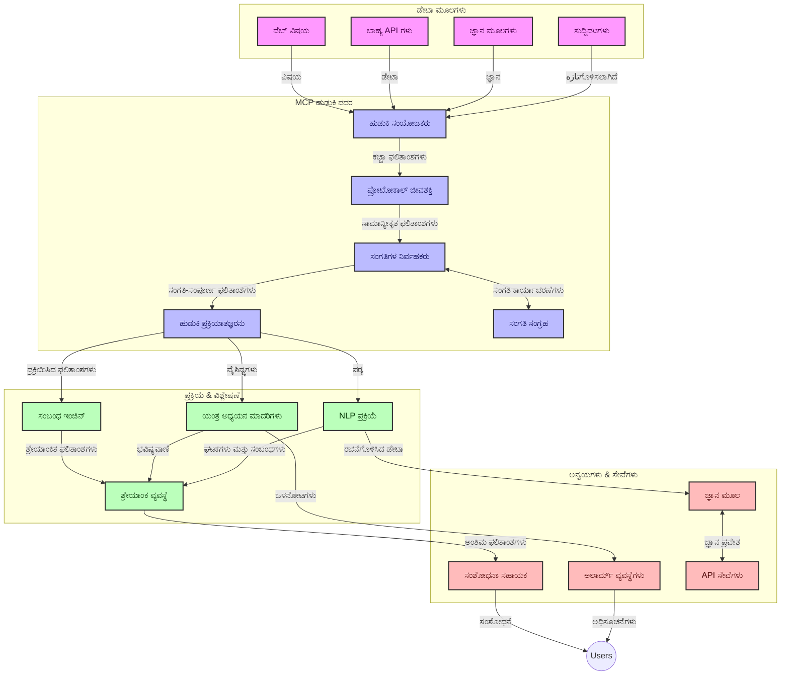
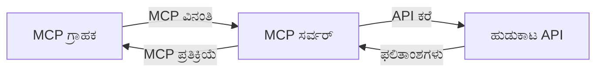
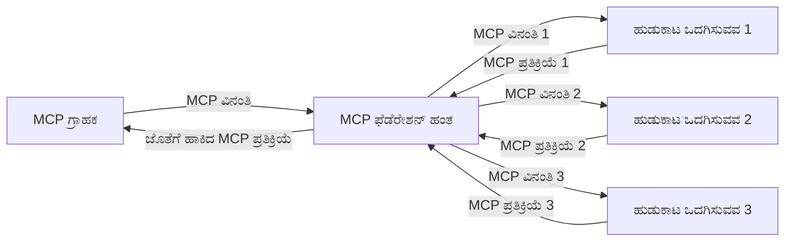
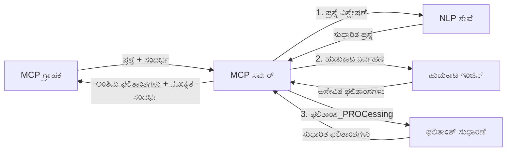

# ನಿಜ ಕಾಲದ ವೆಬ್ ಹುಡುಕಾಟಕ್ಕಾಗಿ ಮಾದರಿ ಸಂದರ್ಭ ಪ್ರೋಟೋಕಾಲ್

## ಅವಲೋಕನ

ನಿಜ ಕಾಲದ ವೆಬ್ ಹುಡುಕಾಟವು ಇಂದಿನ ಮಾಹಿತಿ-ಚಾಲಿತ ಪರಿಸರದಲ್ಲಿ ಅವಶ್ಯಕವಾಗಿದೆ, ಇಲ್ಲಿ ಅಪ್ಲಿಕೇಶನ್‌ಗಳು ಅಂತರ್ಜಾಲದಾದ್ಯಂತ ನವೀಕೃತ ಮಾಹಿತಿಗೆ ತಕ್ಷಣ ಪ್ರವೇಶವನ್ನು ಅಗತ್ಯ ಮಾಡಿಕೊಳ್ಳುತ್ತವೆ, ಸಂಬಂಧಿತ ಮತ್ತು ಸಮಯೋಚಿತ ಪ್ರತಿಕ್ರಿಯೆಗಳನ್ನು ಒದಗಿಸಲು. ಮಾದರಿ ಸಂದರ್ಭ ಪ್ರೋಟೋಕால் (MCP) ಈ ನಿಜ ಕಾಲದ ಹುಡುಕಾಟ ಪ್ರಕ್ರಿಯೆಗಳನ್ನು ಉತ್ತಮಗೊಳಿಸುವಲ್ಲಿ ಪ್ರಮುಖ ಬಿಡುಗಡೆ ಆಗಿದ್ದು, ಹುಡುಕಾಟದ ಪರಿಣಾಮಕಾರಿತೆಯನ್ನು ಹೆಚ್ಚಿಸುವುದು, ಸಂದರ್ಭ ಸತ್ಯತೆಯನ್ನು ಕಾಪಾಡುವುದು ಮತ್ತು ಒಟ್ಟಾರೆ ವ್ಯವಸ್ಥೆಯ ಕಾರ್ಯಕ್ಷಮತೆಯನ್ನು ಸುಧಾರಿಸುವುದನ್ನು ಒಳಗೊಂಡಿದೆ.

ಈ ಮಾಯಾಜಾಲವು MCP ನ ಮೂಲಕ ನಿಜ ಕಾಲದ ವೆಬ್ ಹುಡುಕಾಟವನ್ನು ಹೇಗೆ ಪರಿವರ್ತಿಸುತ್ತದೆ ಎಂಬುದನ್ನು ಅನ್ವೇಷಿಸುತ್ತದೆ, AI ಮಾದರಿಗಳು, ಹುಡುಕಾಟ ಎಂಜಿನ್‌ಗಳು ಮತ್ತು ಅಪ್ಲಿಕೇಶನ್‌ಗಳಾದ್ಯಂತ ಸದುಪಯೋಗ ಸಾಂದರ್ಭಿಕ ವ್ಯವಸ್ಥೆಯನ್ನು ಒದಗಿಸುವ ಮಾನಕೀಕೃತ ಕ್ರಮವನ್ನು ಒದಗಿಸುವ ಮೂಲಕ.

### ನೀವು ಕಲಿಯುವುದೇನು

ಈ ವ್ಯಾಪಕ ಮಾರ್ಗದರ್ಶನದಲ್ಲಿ, ನೀವು ಕಂಡುಕೊಳ್ಳುತ್ತೀರ:

- MCP ಬಳಸಿಕೊಂಡು AI ಮಾದರಿಗಳು ಮತ್ತು ನಿಜ ಕಾಲದ ವೆಬ್ ಹುಡುಕಾಟ ಸಾಮರ್ಥ್ಯಗಳ ನಡುವೆ ನಿರಂತರ ಸೇತುವೆ ನಿರ್ಮಿಸುವುದು
- MCP ಮೂಲಕ ಪರಿಣಾಮಕಾರಿ ಮತ್ತು ವಿಸ್ತರಿಸಬಹುದಾದ ಹುಡುಕಾಟ ಪರಿಹಾರಗಳನ್ನು ರಚಿಸಲು ಆರ್ಕಿಟೆಕ್ಚರಲ್ ಮಾದರಿಗಳು
- ಹಲವಾರು ಪ್ರಶ್ನೆಗಳ ಹಾಗೂ ಸಂವಾದಗಳ ಸಮಯದಲ್ಲಿ ಹುಡುಕಾಟ ಸಂದರ್ಭವನ್ನು ಉಳಿಸುವ ತಂತ್ರಗಳು
- ವಿಭಿನ್ನ ಹುಡುಕಾಟ ಸಂದರ್ಭಗಳಿಗಾಗಿ Python ಮತ್ತು JavaScript ನಲ್ಲಿ ಪ್ರಾಯೋಗಿಕ ಕೋಡ್ ಅನುಷ್ಠಾನಗಳು
- MCP-ಚಾಲಿತ ಹುಡುಕಾಟ ವ್ಯವಸ್ಥೆಗಳಲ್ಲಿ ಪ್ರಾಸಕ್ತತೆ, ಆದ್ಯತೆಯನ್ನು ಮತ್ತು ಕಾರ್ಯಕ್ಷಮತೆಯನ್ನು ಸಮತೋಲನಗೊಳಿಸುವ ವಿಧಾನಗಳು

## ನಿಜ ಕಾಲದ ವೆಬ್ ಹುಡುಕಾಟ ಪರಿಚಯ

ನಿಜ ಕಾಲದ ವೆಬ್ ಹುಡುಕಾಟವು ಒಂದು ತಂತ್ರಜ್ಞಾನಾತ್ಮಕ ಕ್ರಮವಾಗಿದ್ದು, ವೆಬ್ ಆಧಾರಿತ ಮಾಹಿತಿಯನ್ನು ನೇರವಾಗಿ ಪ್ರಶ್ನಿಸುವುದು, ಪ್ರಕ್ರಿಯೆ ಮಾಡುವುದು ಮತ್ತು ವಿಶ್ಲೇಷಿಸುವಂತೆ ಮಾಡುತ್ತದೆ; ಹೀಗಾಗಿ ಸಿಸ್ಟಮ್‌ಗಳು ಕಡಿಮೆ ಪ್ರತ್ಯೇಕತೆಯೊಂದಿಗೆ تازಾ ಮತ್ತು ಸಂಬಂಧಿತ ಮಾಹಿತಿಯನ್ನು ಒದಗಿಸುವಂತೆ ಸಾಧ್ಯವಾಗುತ್ತದೆ. ಪರಂಪರাগত ಹುಡುಕಾಟ ವ್ಯವಸ್ಥೆಗಳಿಗಿಂತ ಭಿನ್ನವಾಗಿ, ಅವು ಘಂಟೆಗಳ ಅಥವಾ ದಿನಗಳ ಹಳೆಯ ಸಂಖ್ಯಿತ ಡೇಟಾ ಮೇಲೆ ಕಾರ್ಯನಿರ್ವಹಿಸುವುವು, ನಿಜ ಕಾಲದ ಹುಡುಕಾಟವು ಆನ್‌ಲೈನ್ ವಿಷಯದ ಆಧುನಿಕ ಸ್ಥಿತಿಯನ್ನು ಪ್ರತಿಬಿಂಬಿಸುವ ಸಜೀವ ಡೇಟಾವನ್ನು ಸಂಸ್ಕರಿಸುತ್ತವೆ.

### ನಿಜ ಕಾಲದ ವೆಬ್ ಹುಡುಕಾಟದ ಮೂಲ ಆಲೋಚನೆಗಳು:

- **ಅವರವರೇ ಸುಕ್ಕೂ ಪ್ರಶ್ನೆಗೆ ಪ್ರಕ್ರಿಯೆ**: ಹುಡುಕಾಟ ಪ್ರಶ್ನೆಗಳು ನಿಯತವಾಗಿ ತಾಜಾ ಆಗುತ್ತಿರುವ ಡೇಟಾ ಮೂಲಗಳ ವಿರುದ್ಧ ಪ್ರಕ್ರಿಯೆ ಮಾಡಲ್ಪಡುವುದೇ
- **ತಾಜಾ ಮಾಹಿತಿಗೆ ಆದ್ಯತೆ**: ಸಿಸ್ಟಮ್‌ಗಳು تازಾ ಮಾಹಿತಿಯನ್ನು ಪ್ರಾಧಾನ್ಯ ನೀಡಿ ವಿನ್ಯಾಸಗೊಳ್ಳುತ್ತವೆ
- **ಪ್ರಾಸಕ್ತತೆ ಸಮತೋಲನ**: ಪ್ರಾಸಕ್ತತೆ ಮತ್ತು ಆದ್ಯತೆಯ ನಡುವೆ ಸಮತೋಲನವನ್ನು ಕಾಪಾಡುವುದು
- **ವಿಸ್ತಾರವಾದ ಆರ್ಕಿಟೆಕ್ಚರ್**: ಸಿಸ್ಟಮ್‌ಗಳು ಬದಲಾಗುವ ಪ್ರಶ್ನೆ ಲೋಡ್ ಮತ್ತು ಡೇಟಾ ಪ್ರಮಾಣಗಳನ್ನು ನಿರ್ವಹಿಸಬೇಕು
- **ಸಂದರ್ಭಿಕ ಅರ್ಥಮಾಡಿಕೊಳಿಕೆ**: ಹುಡುಕಾಟ ಕ್ರಮಗಳಾದ್ಯಂತ ಬಳಕೆದಾರರ ಸಾಂದರ್ಭಿಕತೆಯನ್ನು ಕಾಪಾಡುವುದು ಪರಿಣಾಮಕಾರಿಯಾದ ಫಲಿತಾಂಶಗಳಿಗಾಗಿ ಮಹತ್ವಪೂರ್ಣವಾಗಿದೆ
- **ಚಲಿಸುತ್ತಿರುವ ಪ್ರಶ್ನೆ ಮರುರೂಪಗಣನೆ**: ಸಂದರ್ಭ ಮತ್ತು ಹಿಂದಿನ ಫಲಿತಾಂಶಗಳ ಆಧಾರದ ಮೇಲೆ ಪ್ರಶ್ನೆಗಳನ್ನು ಅನುಗುಣವಾಗಿ ಬದಲಿಸುವುದು
- **ಬಹು ಮೂಲ ಸಂಯೋಜನೆ**: ಹಲವಾರು ಹುಡುಕಾಟಪೂರೈಕೆದಾರರು ಮತ್ತು ವೆಬ್ ಮೂಲಗಳಿಂದ ಫಲಿತಾಂಶಗಳನ್ನು ಸಮಗ್ರಿಸುವುದು
- **ಅರ್ಥಮೂಲಕ ಅರ್ಥಮಾಡಿಕೊಳಿಕೆ**: ಕೀವರ್ಡ್‌ಗಳಿಗಿಂತ ಅರ್ಥಾಧಾರಿತವಾಗಿಯೇ ಪ್ರಶ್ನೆಗಳು ಮತ್ತು ವಿಷಯಗಳನ್ನು ಪ್ರಕ್ರಿಯೆ ಮಾಡುವುದು
- **ನಿಜ ಕಾಲ ಶ್ರೇಣೀಕರಣ**: ಹೊಸ ಮಾಹಿತಿಯ ದಾಖಲಾದಂತೆ ನಿರಂತರವಾಗಿ ಫಲಿತಾಂಶಗಳ ಶ್ರೇಣಿಯನ್ನು ಹೊಂದಿಸುವುದು

### ಮಾದರಿ ಸಂದರ್ಭ ಪ್ರೋಟೋಕಾಲ್ ಮತ್ತು ನಿಜ ಕಾಲದ ವೆಬ್ ಹುಡುಕಾಟ

ಮಾದರಿ ಸಂದರ್ಭ ಪ್ರೋಟೋಕಾಲ್ (MCP) ನಿಜ ಕಾಲದ ವೆಬ್ ಹುಡುಕಾಟ ಪರಿಸರದಲ್ಲಿ ಅನೇಕ ಪ್ರಮುಖ ಸವಾಲುಗಳನ್ನು ಎದುರಿಸುತ್ತದೆ:

1. **ಹುಡುಕಾಟ ಸಂದರ್ಭ ಸಂರಕ್ಷಣೆಯು**: MCP ಸಮಗ್ರ ಹುಡುಕಾಟ ಘಟಕಗಳಾದ್ಯಂತ ಸಂದರ್ಭವನ್ನು ಹೇಗೆ ಕಾಪಾಡಬೇಕೆಂದು ಮಾನಕವನ್ನಾಗಿ ಮಾಡುತ್ತದೆ, AI ಮಾದರಿಗಳು ಮತ್ತು ಪ್ರಕ್ರಿಯೆ ಮಾಡುತ್ತಿರುವ ನೋಡುಗಳು ಸಂಬಂಧಿತ ಪ್ರಶ್ನೆ ಇತಿಹಾಸ ಮತ್ತು ಬಳಕೆದಾರನ ಇಚ್ಛೆಯನ್ನು ಪ್ರವೇಶಿಸಲು ಸಾಧ್ಯವಾಗುವಂತೆ.

2. **ಪ್ರಭಾವಶಾಲಿ ಪ್ರಶ್ನೆ ನಿರ್ವಹಣೆ**: ಸಂದರ್ಭ ಪ್ರಸರಣಕ್ಕಾಗಿ ಸಂರಚಿತ ವ್ಯವಸ್ಥೆಗಳನ್ನು ಒದಗಿಸುವ ಮೂಲಕ MCP ಪ್ರತಿ ಹುಡುಕಾಟ ಕ್ರಮದಲ್ಲಿ ಸಂದರ್ಭವನ್ನು ಮರುಪರ್ಯಾಯವಾಗಿ ಮುಲ್ಲಾದಲ್ಲಿ ಕಡಿಮೆ ಮಾಡುತ್ತದೆ.

3. **ಪರಸ್ಪರಕ್ರಿಯಾಶೀಲತೆ**: MCP ವಿಭಿನ್ನ ಹುಡುಕಾಟ ತಂತ್ರಜ್ಞಾನಗಳು ಮತ್ತು AI ಮಾದರಿಗಳ ನಡುವೆ ಸಾಂದರ್ಭಿಕತೆ ಹಂಚಿಕೊಳ್ಳಲು ಸಾಮಾನ್ಯ ಭಾಷೆಯನ್ನು ಸೃಷ್ಟಿಸುತ್ತದೆ, ಹೆಚ್ಚಿನ ಸ್ಥಿರ ಮತ್ತು ವಿಸ್ತರಿಸಬಹುದಾದ ಆರ್ಕಿಟೆಕ್ಚರ್‍ಗಳನ್ನು ಸಾಧ್ಯಮಾಡುತ್ತದೆ.

4. **ಹುಡುಕಾಟಕ್ಕೆ ಸೂಕ್ತವಾದ ಸಂದರ್ಭ**: MCP ಅನುಷ್ಠಾನಗಳು ಪರಿಣಾಮಕಾರಿಯಾದ ಹುಡುಕಾಟಕ್ಕಾಗಿ ಅತ್ಯುತ್ತಮ ಸಂಬಂಧಿತ ಸಂದರ್ಭ ಅಂಶಗಳನ್ನು ಆದ್ಯತೆ ನೀಡಬಹುದು, ಕಾರ್ಯಕ್ಷಮತೆ ಮತ್ತು ನಿಖರತೆಯನ್ನು ಉದ್ದೇಶಿಸುವಂತೆ.

5. **ಅನುಗುಣ ಹುಡುಕಾಟ ಪ್ರಕ್ರಿಯೆ**: MCP ಮೂಲಕ ಸೂಕ್ತ ಸಂದರ್ಭ ನಿರ್ವಹಣೆಯೊಂದಿಗೆ, ಹುಡುಕಾಟ ವ್ಯವಸ್ಥೆಗಳು ಬಳಕೆದಾರ ಅಗತ್ಯಗಳು ಮತ್ತು ಮಾಹಿತಿ ವಾತಾವರಣಗಳ ಬದಲಾವಣೆಯ ಆಧಾರದ ಮೇಲೆ ಪ್ರಕ್ರಿಯೆಯನ್ನು ಚಟುವಟಿಕೆಯಿಂದ ಹೊಂದಿಕೊಳ್ಳಬಹುದು.

ಸುದ್ದಿ ಸಂಗ್ರಹಣೆಯಿಂದ ಸಂಶೋಧನಾ ಸಹಾಯಕರೆಂದು ಅಧಿಕೃತ ಅಪ್ಲಿಕೇಶನ್‌ಗಳಲ್ಲಿ, MCP ನ ಉಪಯೋಗವು ಇನ್ನಷ್ಟು ಬುದ್ಧಿಪೂರ್ವಕ, ಸದುಪಯೋಗದ ಸಂದರ್ಭ-ಜ್ಞಾನಿ ಹುಡುಕಾಟವನ್ನು ಸಾಧ್ಯವಾಗಿಸುತ್ತದೆ, ಅದು ಬಳಕೆದಾರ ಸಂವಹನಗಳೊಂದಿಗೆ ಹೆಚ್ಚು ಸಂಬಂಧಿತ ಫಲಿತಾಂಶಗಳನ್ನು ಒದಗಿಸುತ್ತದೆ.

## ಕಲಿಕೆಯ ಗುರಿಗಳು

ಈ ಪಾಠದ ಕೊನೆಯಲ್ಲಿ, ನೀವು ಸಾಮರ್ಥ್ಯ ಹೊಂದಿರುತ್ತೀರಿ:

- ನಿಜ ಕಾಲದ ವೆಬ್ ಹುಡುಕಾಟದ ಪ್ರಾಥಮಿಕಾಂಶಗಳು ಮತ್ತು ಆಧುನಿಕ ಅಪ್ಲಿಕೇಶನ್‌ಗಳಲ್ಲಿ ಅದರ ಸವಾಲುಗಳನ್ನು ಅರ್ಥಮಾಡಿಕೊಳ್ಳುವುದು
- ಮಾದರಿ ಸಂದರ್ಭ ಪ್ರೋಟೋಕಾಲ್ (MCP) ನಿಜ ಕಾಲದ ವೆಬ್ ಹುಡುಕಾಟ ಸಾಮರ್ಥ್ಯಗಳನ್ನು ಹೇಗೆ ಹೆಚ್ಚಿಸುತ್ತದೆ ಎಂಬುದನ್ನು ವಿವರಿಸುವುದು
- ಜನಪ್ರಿಯ ಫ್ರೇಮ್‌ವರ್ಕ್‌ಗಳು ಮತ್ತು APIಗಳನ್ನು ಬಳಸಿ MCP ಆಧಾರಿತ ಹುಡುಕಾಟ ಪರಿಹಾರಗಳನ್ನು ಅನುಷ್ಠಾನಗೊಳಿಸುವುದು
- MCP ಬಳಸಿ ವಿಸ್ತಾರವಾದ, ಉನ್ನತ-ಕಾರ್ಯಕ್ಷಮತೆಯ ಹುಡುಕಾಟ ಆರ್ಕಿಟೆಕ್ಚರ್‌ಗಳನ್ನು ವಿನ್ಯಾಸಗೊಳಿಸಿ ನಿಯೋಜಿಸುವುದು
- ಸಾಂದರ್ಭಿಕ ಹುಡುಕಾಟ, ಸಂಶೋಧನಾ ಸಹಾಯ ಮತ್ತು AI ಸಹಾಯಿತ ಬ್ರೌಸರಿಂಗ್ ಸೇರಿದಂತೆ ವಿವಿಧ ಬಳಕೆಯ ಸಂದರ್ಭಗಳಿಗೆ MCP ಕಲ್ಪನೆಗಳನ್ನು ಅನ್ವಯಿಸುವುದು
- MCP ಆಧಾರಿತ ಹುಡುಕಾಟ ತಂತ್ರಜ್ಞಾನಗಳಲ್ಲಿ ಎದುರಾಗುತ್ತಿರುವ ಪ್ರವೃತ್ತಿಗಳು ಮತ್ತು ಭವಿಷ್ಯದಲ್ಲಿನ ಹೊಸತನಗಳ ಮೌಲ್ಯಮಾಪನ
- ಬಳಕೆದಾರ ಸಂವಹನಗಳಿಂದ ಕಲಿಯುವ ಸಾಂದರ್ಭಿಕ ಅರಿವು ಹೊಂದಿದ ಹುಡುಕಾಟ ವ್ಯವಸ್ಥೆಗಳನ್ನು ಅಭಿವೃದ್ಧಿಪಡಿಸುವುದು
- ಮಾನಕೀಕೃತ MCP ಪ್ರೋಟೋಕಾಲ್ಗಳನ್ನು ಬಳಸಿ AI ಸಹಾಯಕರೆಡೆಗೆ ವೆಬ್ ಹುಡುಕಾಟ ಸಾಮರ್ಥ್ಯಗಳನ್ನು ಏರ್ಪಡಿಸುವುದು
- ಸಾಂದರ್ಭದ ಆಧಾರದಲ್ಲಿ ಹಂತ ಹಂತವಾಗಿ ಫಲಿತಾಂಶಗಳನ್ನು ಸುಧಾರಿಸುವ ಬಹು ಹಂತದ ಹುಡುಕಾಟ ಪೈಪ್ಲೈನ್ಗಳನ್ನು ರಚಿಸುವುದು
- ವ್ಯಾಪಕ ಸಾಂದರ್ಭಿಕ ಅರಿವನ್ನು ಕಾಪಾಡುವುದಾದರೂ ಹುಡುಕಾಟ ಕಾರ್ಯಕ್ಷಮತೆಯನ್ನು ಉತ್ತೇಜಿಸುವುದು

### ವ್ಯಾಖ್ಯಾನ ಮತ್ತು ಮಹತ್ವ

ನಿಜ ಕಾಲದ ವೆಬ್ ಹುಡುಕಾಟ ಎಂದರೆ ಕಡಿಮೆ ವಿಳಂಬದೊಂದಿಗೆ ವೆಬ್ ಆಧಾರಿತ ಮಾಹಿತಿಯನ್ನು ನಿರಂತರವಾಗಿ ಪ್ರಶ್ನಿಸುವುದು, ಪಡೆಯುವುದು ಮತ್ತು ಒದಗಿಸುವುದು. ಸಾಂಪ್ರದಾಯಿಕ ಹುಡುಕಾಟ ಎಂಜಿನ್‌ಗಳು ವೆಬ್ ಅನ್ನು ನಿಯತ ಮಾನದಿಂದ ಕ್ರಾಲ್ ಮಾಡಿ ಸೂಚಿಪತ್ರಣ ಮಾಡುತ್ತವೆ, ಆದರೆ ನಿಜ ಕಾಲದ ಹುಡುಕಾಟವು ಲಭ್ಯವಾಗುತ್ತಿರುವಂತೆ ಮಾಹಿತಿಯನ್ನು ಹೊರತರುತ್ತದೆ, ಅತ್ಯಂತ ನವೀಕೃತ ವಿಷಯಕ್ಕೆ ತಕ್ಷಣ ಪ್ರವೇಶವನ್ನು ಸಾದ್ಯಮಾಡುತ್ತದೆ.

ನಿಜ ಕಾಲದ ವೆಬ್ ಹುಡುಕಾಟದ ಪ್ರಮುಖ ಲಕ್ಷಣಗಳು:

- **ತಾಜಾತನ**: تازه ವಿಷಯ ಮತ್ತು ನವೀಕರಣಗಳಿಗೆ ಆದ್ಯತೆ ನೀಡುವುದು
- **ನಿರಂತರ ಪ್ರಕ್ರಿಯೆ**: ಹೊಸ ಮಾಹಿತಿಗಾಗಿ ನಿರಂತರವಾಗಿ ಮೇಲ್ವಿಚಾರಣೆ ಮಾಡುವುದು
- **ಪ್ರಶ್ನೆ ಹೊಂದಿಕೆ**: ಸಾಂದರ್ಭ ಮತ್ತು ಪ್ರತಿಕ್ರಿಯೆಯ ಆಧಾರದ ಮೇಲೆ ಹುಡುಕಾಟ ಪ್ರಶ್ನೆಗಳನ್ನು ಸುಧಾರಿಸುವುದು
- **ತಕ್ಷಣದ ವಿತರಣೆ**: ಕಡಿಮೆ ವಿಳಂಬದೊಂದಿಗೆ ಹುಡುಕಾಟ ಫಲಿತಾಂಶಗಳನ್ನು ಒದಗಿಸುವುದು
- **ಸಂದರ್ಭ ಸಂರಕ್ಷಣೆ**: ಸುಧಾರಿತ ಪ್ರಾಸಕ್ತತೆಗೆ ಹಿಂದಿನ ಪ್ರಶ್ನೆಗಳಲೀ ನೆಡಿ</aha

### ಸಾಂಪ್ರದಾಯಿಕ ವೆಬ್ ಹುಡುಕಾಟದ ಸವಾಲುಗಳು

ಸಾಂಪ್ರದಾಯಿಕ ವೆಬ್ ಹುಡುಕಾಟ ವಿಧಾನಗಳು ನಿಜ ಕಾಲದ ಸಂದರ್ಭಗಳಿಗೆ ಅನ್ವಯಿಸಿದಾಗ ಹಲವಾರು ಸೀಮಿತತೆಗಳನ್ನು ಎದುರಿಸಬೇಕು:

1. **ಸಂದರ್ಭ ಭಂಗ**: ಹಲವಾರು ಪ್ರಶ್ನೆಗಳಾದ್ಯಂತ ಹುಡುಕಾಟ ಸಂದರ್ಭವನ್ನು ಕಾಪಾಡಲು ಕಷ್ಟ
2. **ಮಾಹಿತಿ ತಾಜಾತನ**: ಅತ್ಯಂತ ತಾಜಾ ಮಾಹಿತಿಗೆ ಪ್ರವೇಶ ಮತ್ತು ಆದ್ಯತೆ ನೀಡಲು ಸವಾಲುಗಳು
3. **ಸಂಯೋಜನೆ ಸಂಕೀರ್ಣತೆ**: ಹುಡುಕಾಟ ವ್ಯವಸ್ಥೆಗಳ ಮತ್ತು ಅಪ್ಲಿಕೇಶನ್‌ಗಳ ನಡುವಿನ ಪರಸ್ಪರ ಕ್ರಿಯಾಶೀಲತೆಗೆ ಸಂಬಂಧಿಸಿದ ಸಮಸ್ಯೆಗಳು
4. **ವಿಳಂಬ ಸಮಸ್ಯೆಗಳು**: ಸಮಗ್ರ ಹುಡುಕಾಟದೊಂದಿಗೆ ಪ್ರತಿಕ್ರಿಯೆ ಸಮಯದ ಅವಶ್ಯಕತೆಗಳನ್ನು ಸಮತೋಲನಗೊಳಿಸುವುದು
5. **ಪ್ರಾಸಕ್ತತೆ ಹೊಂದಿಕೆ**: ತಾಜಾತನಕ್ಕೆ ಆದ್ಯತೆ ನೀಡುವಾಗ ನಿಖರತೆ ಮತ್ತು ಸಂಬಂಧಿತತೆಯನ್ನು ಖಚಿತಗೊಳಿಸುವುದು

## ಹುಡುಕಾಟಕ್ಕಾಗಿ ಮಾದರಿ ಸಂದರ್ಭ ಪ್ರೋಟೋಕಾಲ್ (MCP)ನ ಅರ್ಥಮಾಡಿಕೊಂಡಕೊಂಡುಗೊಳ್ಳುವುದು

### ಹುಡುಕಾಟ ಸಂದರ್ಭದಲ್ಲಿ MCP ಎಂದರೇನು?

ಮಾದರಿ ಸಂದರ್ಭ ಪ್ರೋಟೋಕಾಲ್ (MCP)ವು AI ಮಾದರಿಗಳು ಮತ್ತು ಅಪ್ಲಿಕೇಶನ್‌ಗಳ ನಡುವೆ ಪರಿಣಾಮಕಾರಿಯಾದ ಸಂವಹನವನ್ನು ಸುಗಮಗೊಳಿಸಲು ಸಿದ್ಧಪಡಿಸಲಾದ ಮಾನಕ ಸಂವಹನ ಪ್ರೋಟೋಕಾಲಾಗಿದೆ. ನಿಜ ಕಾಲದ ವೆಬ್ ಹುಡುಕಾಟದ ಸಂದರ್ಭದಲ್ಲಿ, MCP ಒಂದು ಫ್ರೇಮ್ವರ್ಕ್ ಅನ್ನು ಒದಗಿಸುತ್ತದೆ:

- ಹುಡುಕಾಟ ಸಂದರ್ಭವನ್ನು ಪ್ರಶ್ನೆ ಸರಣಿಗಳಾದ್ಯಂತ ಉಳಿಸುವುದು
- ಹುಡುಕಾಟ ಪ್ರಶ್ನೆ ಮತ್ತು ಫಲಿತಾಂಶ ಸ್ವರೂಪಗಳನ್ನು ಮಾನಕೀಕರಿಸುವುದು
- ಹುಡುಕಾಟ ಪರಿಮಾಣಗಳು ಮತ್ತು ಫಲಿತಾಂಶಗಳ ಪ್ರಸರಣವನ್ನು ಉತ್ತಮಗೊಳಿಸುವುದು
- ಮಾದರಿ-ಹುಡುಕಾಟ ಎಂಜಿನ್ ಸಂವಹನವನ್ನು ಸುಧಾರಿಸುವುದು

### ಮುಖ್ಯ ಘಟಕಗಳು ಮತ್ತು ಆರ್ಕಿಟೆಕ್ಚರ್

ನಿಜ ಕಾಲದ ವೆಬ್ ಹುಡುಕಾಟಕ್ಕಾಗಿ MCP ಆರ್ಕಿಟೆಕ್ಚರ್ ಕೆಲವು ಪ್ರಮುಖ ಘಟಕಗಳನ್ನು ಒಳಗೊಂಡಿದೆ:

1. **ಪ್ರಶ್ನೆ ಸಂದರ್ಭ ನಿರ್ವಹಣೆಯವರು**: ಹಲವಾರು ಪ್ರಶ್ನೆಗಳಾದ್ಯಂತ ಹುಡುಕಾಟ ಸಂದರ್ಭವನ್ನು ನಿರ್ವಹಿಸುವುದು ಮತ್ತು ಕಾಪಾಡುವುದು
2. **ಹುಡುಕಾಟ ಪ್ರಕ್ರಿಯೆಕಾರರು**: ಸಾಂದರ್ಭಿಕ ತಂತ್ರೋಪಾಯಗಳನ್ನು ಬಳಸಿ ಬಂದಿರುವ ಹುಡುಕಾಟ ವಿನಂತಿಗಳನ್ನು ಪ್ರಕ್ರಿಯೆ ಮಾಡುವುದು
3. **ಪ್ರೋಟೋಕಾಲ್ ಅನ್ವಯಿಕಗಳು**: ವಿಭಿನ್ನ ಹುಡುಕಾಟ APIಗಳ ನಡುವೆ ಸಂದರ್ಭ ಕಾಪಾಡುವುದುವನ್ನು ಉಳಿಸಿ ಪರಿವರ್ತಿಸುವುದು
4. **ಸಂದರ್ಭ ಸಂಗ್ರಹಣೆ**: ಹುಡುಕಾಟ ಇತಿಹಾಸ ಮತ್ತು ಇಚ್ಛೆಗಳ ಸಂಗ್ರಹಣೆ ಮತ್ತು ಪುನಃ ಪಡೆಯುವಿಕೆಗೆ ಪರಿಣಾಮಕಾರಿ ವ್ಯವಸ್ಥೆ
5. **ಹುಡುಕಾಟ ಸಂಯೋಜಕಗಳು**: ವಿವಿಧ ಹುಡುಕಾಟ ಎಂಜಿನ್‌ಗಳು ಮತ್ತು ವೆಬ್ APIಗಳಿಗೆ ಸಂಪರ್ಕಿಸುವುದು



### MCP ನಿಜ ಕಾಲದ ವೆಬ್ ಹುಡುಕಾಟವನ್ನು ಹೇಗೆ ಸುಧಾರಿಸುತ್ತದೆ

MCP ಸಾಂಪ್ರದಾಯಿಕ ವೆಬ್ ಹುಡುಕಾಟ ಸವಾಲುಗಳನ್ನು ಈ ಮೂಲಕ ಎದುರಿಸುತ್ತದೆ:

- **ಸಾಂದರ್ಭಿಕ ನಿರಂತರತೆ**: ಸಂಪೂರ್ಣ ಹುಡುಕಾಟ ಅಧಿವೇಶನಾದ್ಯಂತ ಪ್ರಶ್ನೆಗಳ ನಡುವೆ ಸಂಬಂಧವನ್ನು ಕಾಪಾಡುವುದು
- **ಅಪ್ಟಿಮೈಸ್ ಮಾಡಿದ ಪ್ರಸರಣ**: ಸ್ಮಾರ್ಟ್ ಸಾಂದರ್ಭಿಕ ನಿರ್ವಹಣೆಯ ಮೂಲಕ ಹುಡುಕಾಟ ಪರಿಮಾಣಗಳಲ್ಲಿ ಪುನರಾವರ್ತನವನ್ನು ಕಡಿಮೆ ಮಾಡುವುದು
- **ಮಾನಕೀಕೃತ ಇಂಟರ್ಫೇಸ್‌ಗಳು**: ಹುಡುಕಾಟ ಘಟಕಗಳಿಗೆ ಸಧೃಢ APIs ನೀಡುವುದು
- **ಕಡಿಮೆ ವಿಳಂಬ**: ಪರಿಣಾಮಕಾರಿಯಾದ ಸಾಂದರ್ಭಿಕ ನಿರ್ವಹಣೆಯ ಮೂಲಕ ಪ್ರಕ್ರಿಯೆ ಲಭ್ಯತೆ ಕಡಿಮೆ ಮಾಡುವುದು
- **ಸುಧಾರಿತ ಪ್ರಾಸಕ್ತತೆ**: ಹಲವು ಪ್ರಶ್ನೆಗಳಾದ್ಯಂತ ಬಳಕೆದಾರರ ಉದ್ದೇಶವನ್ನು ಉಳಿಸಿಕೊಳ್ಳುವ ಮೂಲಕ ಹುಡುಕಾಟ ಪ್ರಾಸಕ್ತತೆಯನ್ನು ಹೆಚ್ಚಿಸುವುದು

## ಏಕೀಕರಣ ಮತ್ತು ಅನುಷ್ಠಾನ

ನಿಜ ಕಾಲದ ವೆಬ್ ಹುಡುಕಾಟ ವ್ಯವಸ್ಥೆಗಳು ಕಾರ್ಯಕ್ಷಮತೆ ಮತ್ತು ಸಾಂದರ್ಭಿಕ ಸತ್ಯತೆಯನ್ನು ಕಾಪಾಡಲು ಸೂಕ್ತವಾದ ಆರ್ಕಿಟೆಕ್ಚರ್ ವಿನ್ಯಾಸ ಮತ್ತು ಅನುಷ್ಠಾನವನ್ನು ಅವಶ್ಯಕತೆ ಪಡುತ್ತವೆ. ಮಾದರಿ ಸಂದರ್ಭ ಪ್ರೋಟೋಕಾಲ್ AI ಮಾದರಿಗಳು ಮತ್ತು ಹುಡುಕಾಟ ತಂತ್ರಜ್ಞಾನಗಳ ಏಕೀಕರಣಕ್ಕೆ ಮಾನಕ ಮಾರ್ಗವನ್ನು ನೀಡುತ್ತದೆ, ಪರಿಣಾಮಕಾರಿಯಾದ, ಸಾಂದರ್ಭಜ್ಞ ಹುಡುಕಾಟ ಪೈಪ್ಲೈನ್‌ಗಳಿಗಾಗಿ ಅವಕಾಶ ನೀಡುತ್ತದೆ.

### ಹುಡುಕಾಟ ಆರ್ಕಿಟೆಕ್ಚರ್‌ಗಳಲ್ಲಿ MCP ಏಕೀಕರಣದ ಅವಲೋಕನ

ನಿಜ ಕಾಲದ ವೆಬ್ ಹುಡುಕಾಟ ಪರಿಸರಗಳಲ್ಲಿ MCP ಅನ್ನು ಅನುಷ್ಠಾನಗೊಳಿಸುವಾಗ ಕೆಲವು ಪ್ರಮುಖ ವಿಚಾರಗಳನ್ನು ಪರಿಗಣಿಸಬೇಕು:

1. **ಹುಡುಕಾಟ ಸಂದರ್ಭ ಸರಣೀಕರಣ**: MCP ಹುಡುಕಾಟ ವಿನಂತಿಗಳೊಳಗೆ ಸಾಂದರ್ಭಿಕ ಮಾಹಿತಿಯನ್ನು ಎನ್‌ಕೋಡ್ ಮಾಡಲು ಪರಿಣಾಮಕಾರಿ ವ್ಯವಸ್ಥೆಗಳನ್ನು ಒದಗಿಸುತ್ತದೆ, ಅಗತ್ಯ ಸಾಂದರ್ಭಿಕವಾಗಿ ಪ್ರಕ್ರಿಯೆ ಪೈಪ್ಲೈನ್ಗಳಲ್ಲಿದೆ ಹಾದುಹೋಗುತ್ತದೆ. ಇದರಲ್ಲಿ ಹುಡುಕಾಟ-ಸಂಬಂಧಿತ ಮೆಟಾಡೇಟಾದಿಗಾಗಿ ಉತ್ತಮಗೊಳ್ಳಲಾದ ಮಾನಕ ಸರಣೀಕರಣ ಸ್ವರೂಪಗಳು ಒಳಗೊಂಡಿವೆ.

2. **ಸ್ಥಿತಿ ಆಧಾರಿತ ಹುಡುಕಾಟ ಪ್ರಕ್ರಿಯೆ**: MCP ಸಾಂದರ್ಭಿಕ ಪ್ರತಿನಿಧಾನವನ್ನು ಸಮನ್ವಯದೇಯವಾಗಿ ಮುಂತಾದ ಹುಡುಕಾಟ ಕ್ರಮಗಳಾದ್ಯಂತ ಕಾಪಾಡುವ ಮೂಲಕ ನಿರ್ದಿಷ್ಠ ಸ್ಥಿತಿ ಕೊಂಡ ವ್ಯವಸ್ಥೆಯನ್ನು ಸಾಧ್ಯಮಾಡುತ್ತದೆ. ಇದು ಬಹು ಹಂತದ ಹುಡುಕಾಟ ಪೈಪ್ಲೈನ್‌ಗಳಲ್ಲಿ ಹೆಚ್ಚಿನ ಫಲಿತಾಂಶಗಳಿಗಾಗಿ ಸಾಂದರ್ಭ ಭರಿತ ಸುಧಾರಣೆಯನ್ನು ಬಹುಮೌಲ್ಯವಾಗಿಸುತ್ತದೆ.

3. **ಪ್ರಶ್ನೆ ವಿಸ್ತರಣೆ ಮತ್ತು ಸುಧಾರಣೆ**: MCP ಆಧಾರಿತ ಸಿಸ್ಟಮ್‌ಗಳು ಜಮಾ ಮಾಡಿಕೊಂಡ ಸಾಂದರ್ಭಿಕತೆಯ ಆಧಾರದ ಮೇಲೆ ಸುಧಾರಿತ ಪ್ರಶ್ನೆ ವಿಸ್ತರಣೆ ಮತ್ತು ಸುಧಾರಣೆಯನ್ನು ಸೇರಿಸಬಹುದು, ಹುಡುಕಾಟ ಅಧಿವೇಶನ ಮುಂದುವರಿದಂತೆ ಹೆಚ್ಚು ಸಂಬಂಧಿತ ಫಲಿತಾಂಶಗಳನ್ನು ನೀಡುತ್ತವೆ.

4. **ಫಲಿತಾಂಶ ಕಶಿಂಗ್ ಮತ್ತು ಆದ್ಯತೆಯಿಂದ ಪ್ರಾಬಲ್ಯ**: MCP ಮೂಲಕ ಸಾಂದರ್ಭ ನಿರ್ವಹಣೆಯನ್ನು ಮಾನಕೀಕರಿಸುವ ಮೂಲಕ ಕರ್ನಾಟಕ ವೈವಹಿಸಿದ್ದು, ಘಟಕಗಳು ಬದಲಾಗುತ್ತಿರುವ ಹುಡುಕಾಟ ಸಾಂದರ್ಭಿಕತೆಯ ಆಧಾರದ ಮೇಲೆ ಫಲಿತಾಂಶ ಕಶಿಂಗ್ ಮತ್ತು ಆದ್ಯತೆಯನ್ನು ಹೊಂದಿಕೊಳ್ಳಬಹುದು.

5. **ಹುಡುಕಾಟ ಸಂಘಟನೆ ಮತ್ತು ಸಮಗ್ರಣತಿ**: MCP ಹಲವಾರು ಬ್ಯಾಕ್‌ಎಂಡ್‌ಗಳಾದ್ಯಂತ ಸುಧಾರಿತ ಹುಡುಕಾಟ ಸಂಘಟನೆಗೆ ಸಹಾಯ ಮಾಡುತ್ತದೆ ಸಾಂದರ್ಭಿಕತೆಯ ಸಂಕೇತಿತ ಪ್ರತಿನಿಧಾನಗಳನ್ನು ಒದಗಿಸುವ ಮೂಲಕ ವಿವಿಧ ಮೂಲಗಳಿಂದ ಫಲಿತಾಂಶಗಳ ಅರ್ಥಪೂರ್ಣ ಸಮಗ್ರಣತಿಯನ್ನೂ ಸಾಧ್ಯಮಾಡುತ್ತದೆ.

ವಿವಿಧ ಹುಡುಕಾಟ ತಂತ್ರಜ್ಞಾನಗಳಲ್ಲಿ MCP ಅನುಷ್ಠಾನವು ಸಾಂದರ್ಭಿಕ ನಿರ್ವಹಣೆಗೆ ಏಕರೂಪವಾದ ಕ್ರಮವನ್ನು ಸೃಷ್ಟಿಸುತ್ತದೆ, ಕಸ್ಟಮ್ ಏಕೀಕರಣ ಕೋಡ್ ಅಗತ್ಯತೆಯನ್ನು ಕಡಿಮೆ ಮಾಡುತ್ತಾ ಪರೀಕ್ಷಿತ ದಾಖಲೆಯಾದಂತೆ ಸಂದರ್ಶನಗಳನ್ನು ಕಾಪಾಡುತ್ತದೆ.

### ವೆಬ್ ಹುಡುಕಾಟ ವಿವಿಧ ಅನುಷ್ಠಾನಗಳಲ್ಲಿ MCP

ಈ ಉದಾಹರಣೆಗಳು ಪ್ರಸ್ತುತ MCP ವಿಶೇಷಣವನ್ನು ಅನುಸರಿಸುತ್ತವೆ, ಅದರಲ್ಲಿ JSON-RPC ಆಧಾರಿತ ಪ್ರೋಟೋಕಾಲ್ ಪಾರದರ್ಶಕ ಸಂಚಾರ ವಿಧಾನಗಳನ್ನು ಹೊಂದಿದೆ. ಈ ಕೋಡ್ ಹೇಗೆ ನೀವು ಮಾನಕ MCP ಪ್ರೋಟೋಕಾಲ್ ಜೊತೆಗೆ ಸಂಪೂರ್ಣ ಹೊಂದಾಣಿಕೆಯುಳ್ಳ ಕಸ್ಟಮ್ ಹುಡುಕಾಟ ಏಕೀಕರಣಗಳನ್ನು ರೂಪಿಸಬಹುದೆಂಬುದನ್ನು ತೋರಿಸುತ್ತದೆ.


<details>
<summary>ಜನರಿಕ್ ಸುಚನಾ API ಜೊತೆಗೆ Python ಅನುಷ್ಠಾನ</summary>

```python
import asyncio
import json
import aiohttp
from typing import Dict, Any, Optional, List
from contextlib import asynccontextmanager
from collections.abc import AsyncIterator

# ಸಾಮಾನ್ಯ MCP ಗ್ರಂಥಾಲಯಗಳನ್ನು ಇಂಪೋರ್ಟ್ ಮಾಡಿ
from mcp.client.session import ClientSession
from mcp.client.streamable_http import streamablehttp_client
from mcp.types import TextContent, CreateMessageRequestParams, CreateMessageResult
from mcp.server.fastmcp import FastMCP

# ವೆಬ್ ಶೋಧನೆಗೆ FastMCP ಸರ್ವರ್ ರಚಿಸಿ
search_server = FastMCP("WebSearch")

# ವೆಬ್ ಶೋಧನೆ ಕಾರ್ಯಗಳನ್ನು ನಿರ್ವಹಿಸುವ ವರ್ಗ
class WebSearchHandler:
    def __init__(self, api_endpoint: str, api_key: str):
        self.api_endpoint = api_endpoint
        self.api_key = api_key
        self.session = None
        
    async def initialize(self):
        """Initialize the HTTP session"""
        self.session = aiohttp.ClientSession(
            headers={"Authorization": f"Bearer {self.api_key}"}
        )
    
    async def close(self):
        """Close the HTTP session"""
        if self.session:
            await self.session.close()
            
    async def perform_search(self, query: str, max_results: int = 5, 
                           include_domains: List[str] = None, 
                           exclude_domains: List[str] = None,
                           time_period: str = "any") -> Dict[str, Any]:
        """Perform web search using the search API"""
        # ಶೋಧನ پیرಾಮೀಟರ್ ಗಳನ್ನ ರೂಪಿಸಿ
        search_params = {
            "q": query,
            "limit": max_results,
            "time": time_period
        }
        
        if include_domains:
            search_params["site"] = ",".join(include_domains)
            
        if exclude_domains:
            search_params["exclude_site"] = ",".join(exclude_domains)
        
        # ಶೋಧನೆಯ ವಿನಂತಿಯನ್ನು ನಿರ್ವಹಿಸಿ
        try:
            async with self.session.get(
                self.api_endpoint,
                params=search_params
            ) as response:
                if response.status != 200:
                    error_text = await response.text()
                    raise Exception(f"Search API error: {response.status} - {error_text}")
                
                search_data = await response.json()
                
                # API-ನಿರ್ದಿಷ್ಟ ಪ್ರತಿಕ್ರಿಯೆಯನ್ನು ಸಾಮಾನ್ಯ ಸ್ವರೂಪಕ್ಕೆ ಪರಿವರ್ತಿಸಿ
                results = []
                for item in search_data.get("results", []):
                    results.append({
                        "title": item.get("title", ""),
                        "url": item.get("url", ""),
                        "snippet": item.get("snippet", ""),
                        "date": item.get("published_date", ""),
                        "source": item.get("source", "")
                    })
                
                return {
                    "query": query,
                    "totalResults": len(results),
                    "results": results
                }
        except Exception as e:
            print(f"Search API request error: {e}")
            raise

# ಶೋಧನೆ ನಿರ್ವಹಣೆಯನ್ನು ಪ್ರಾರಂಭಿಸಿ
search_handler = WebSearchHandler(
    api_endpoint="https://api.search-service.example/search",
    api_key="your-api-key-here"
)

# ಶೋಧನೆ ನಿರ್ವಹಣೆಯನ್ನು ನಿಭಾಯಿಸಲು ಅವಧಿಯನ್ನು ಹೊಂದಿಸಿ
@asyncio.asynccontextmanager
async def app_lifespan(server: FastMCP):
    """Manage application lifecycle"""
    await search_handler.initialize()
    try:
        yield {"search_handler": search_handler}
    finally:
        await search_handler.close()

# ಸರ್ವರ್‌ಗಾಗಿ ಅವಧಿಯನ್ನು ಹೊಂದಿಸಿ
search_server = FastMCP("WebSearch", lifespan=app_lifespan)

# ವೆಬ್ ಶೋಧನೆ ಉಪಕರಣವನ್ನು ನೋಂದಣಿ ಮಾಡಿ
@search_server.tool()
async def web_search(query: str, max_results: int = 5, 
                   include_domains: List[str] = None,
                   exclude_domains: List[str] = None,
                   time_period: str = "any") -> Dict[str, Any]:
    """
    Search the web for information
    
    Args:
        query: The search query
        max_results: Maximum number of results to return (default: 5)
        include_domains: List of domains to include in search results
        exclude_domains: List of domains to exclude from search results
        time_period: Time period for results ("day", "week", "month", "any")
        
    Returns:
        Dictionary containing search results
    """
    ctx = search_server.get_context()
    search_handler = ctx.request_context.lifespan_context["search_handler"]
    
    results = await search_handler.perform_search(
        query=query,
        max_results=max_results,
        include_domains=include_domains,
        exclude_domains=exclude_domains,
        time_period=time_period
    )
    
    return results

# ಉದಾಹರಣೆಯ ಗ್ರಾಹಕರ ಬಳಕೆ
async def client_example():
    # ಸ್ಟ್ರೀಮ್‌ಯಾಬಲ್ HTTP ಸಾರಿಗೆ ಬಳಸಿ ಶೋಧನೆ ಸರ್ವರ್‌ಗೆ ಸಂಪರ್ಕಿಸಿರಿ
    async with streamablehttp_client("http://localhost:8000/mcp") as (read, write, _):
        async with ClientSession(read, write) as session:
            # ಸಂಪರ್ಕವನ್ನು ಪ್ರಾರಂಭಿಸಿ
            await session.initialize()
            
            # web_search ಉಪಕರಣವನ್ನು ಕರೆ ಮಾಡಿ
            search_results = await session.call_tool(
                "web_search", 
                {
                    "query": "latest developments in AI and Model Context Protocol",
                    "max_results": 5,
                    "time_period": "day",
                    "include_domains": ["github.com", "microsoft.com"]
                }
            )
            
            print(f"Search results: {search_results}")

# ಸರ್ವರ್ ಕಾರ್ಯಾಚರಣೆ ಉದಾಹರಣೆ
if __name__ == "__main__":
    # ಸ್ಟ್ರೀಮ್‌ಯಾಬಲ್ HTTP ಸಾರಿಗೆ ಬಳಸಿ ಸರ್ವರ್ ಅನ್ನು ನಿರ್ವಹಿಸಿ
    search_server.run(transport="streamable-http")
```
</details> 

<details>
<summary>ಬ್ರೌಸರ್ ಆಧರಿತ ಹುಡುಕಾಟದೊಂದಿಗೆ JavaScript ಅನುಷ್ಠಾನ</summary>


```javascript
// ವೆಬ್ ಸಂಶೋಧನೆಗಾಗಿ MCP ಸರ್ವರ್ ಅನುಷ್ಠಾನ
import { McpServer, ResourceTemplate } from '@modelcontextprotocol/sdk/server/mcp.js';
import { StreamableHTTPServerTransport } from '@modelcontextprotocol/sdk/server/streamableHttp.js';
import { z } from 'zod';

// ವೆಬ್ ಸಂಶೋಧನೆಗಾಗಿ MCP ಸರ್ವರ್ ರಚಿಸಿ
const searchServer = new McpServer({
    name: "BrowserSearch",
    description: "A server that provides web search capabilities"
});

// ಸಂಶೋಧನಾ ಸೇವೆ ತರಗತಿ
class SearchService {
    constructor(searchApiUrl, apiKey) {
        this.searchApiUrl = searchApiUrl;
        this.apiKey = apiKey;
    }

    async performSearch(parameters) {
        const {
            query = '',
            maxResults = 5,
            includeDomains = [],
            excludeDomains = [],
            timePeriod = 'any'
        } = parameters;
        
        // ಪರಾಮಿತಿಗಳೊಂದಿಗೆ ಸಂಶೋಧನಾ URL ರಚಿಸಿ
        const url = new URL(this.searchApiUrl);
        url.searchParams.append('q', query);
        url.searchParams.append('limit', maxResults);
        url.searchParams.append('time', timePeriod);
        
        if (includeDomains.length > 0) {
            url.searchParams.append('site', includeDomains.join(','));
        }
        
        if (excludeDomains.length > 0) {
            url.searchParams.append('exclude_site', excludeDomains.join(','));
        }
        
        try {
            const response = await fetch(url.toString(), {
                method: 'GET',
                headers: {
                    'Authorization': `Bearer ${this.apiKey}`,
                    'Content-Type': 'application/json'
                }
            });
            
            if (!response.ok) {
                const errorText = await response.text();
                throw new Error(`Search API error: ${response.status} - ${errorText}`);
            }
            
            const searchData = await response.json();
            
            // API-ನಿರ್ದಿಷ್ಟ ಪ್ರತಿಕ್ರಿಯೆಯನ್ನು ಮಾನಕ ಸ್ವರೂಪಕ್ಕೆ ಪರಿವರ್ತಿಸಿ
            const results = searchData.results?.map(item => ({
                title: item.title || '',
                url: item.url || '',
                snippet: item.snippet || '',
                date: item.published_date || '',
                source: item.source || ''
            })) || [];
            
            return {
                query,
                totalResults: results.length,
                results
            };
        } catch (error) {
            console.error('Search API request error:', error);
            throw error;
        }
    }
}

// ಸಂಶೋಧನಾ ಸೇವೆಯನ್ನು ಪ್ರಾರಂಭಿಸಿ
const searchService = new SearchService(
    'https://api.search-service.example/search',
    'your-api-key-here'
);

// ಸರ್ವರ್‌ಗಾಗಿ ಸಂದರ್ಭ ಒದಗಿಸುವಿಕೆ ವ್ಯವಸ್ಥೆ ಮಾಡಿ
searchServer.setContextProvider(() => {
    return {
        searchService
    };
});

// ವೆಬ್ ಸಂಶೋಧನಾ ಉಪಕರಣವನ್ನು ನೋಂದಣಿ ಮಾಡಿ
searchServer.tool({
    name: 'web_search',
    description: 'Search the web for information',
    parameters: {
        type: 'object',
        properties: {
            query: {
                type: 'string',
                description: 'The search query'
            },
            maxResults: {
                type: 'integer',
                description: 'Maximum number of results to return',
                default: 5
            },
            includeDomains: {
                type: 'array',
                items: { type: 'string' },
                description: 'List of domains to include in search results'
            },
            excludeDomains: {
                type: 'array',
                items: { type: 'string' },
                description: 'List of domains to exclude from search results'
            },
            timePeriod: {
                type: 'string',
                description: 'Time period for results',
                enum: ['day', 'week', 'month', 'any'],
                default: 'any'
            }
        },
        required: ['query']
    },
    handler: async (params, context) => {
        const { searchService } = context;
        return await searchService.performSearch(params);
    }
});

// ಸಂಶೋಧನಾ ಸರ್ವರ್‌ಗೆ ಸಂಪರ್ಕಿಸಲು ಉದಾಹರಣೆಯ ಗ್ರಾಹಕ ಕೋಡ್
import { Client } from '@modelcontextprotocol/sdk/client/index.js';
import { StreamableHTTPClientTransport } from '@modelcontextprotocol/sdk/client/streamableHttp.js';

async function connectToSearchServer() {
    // ಸಂಶೋಧನಾ ಸರ್ವರ್‌ಗೆ ಸಂಪರ್ಕಿಸಿ
    const transport = new StreamableHTTPClientTransport(
        new URL('http://localhost:8000/mcp')
    );
    
    const client = new Client({
        name: 'search-client',
        version: '1.0.0'
    });
    
    await client.connect(transport);
    
    // ಸಂಶೋಧನಾ ಉಪಕರಣವನ್ನು ಕಾರ್ಯಗತಗೊಳಿಸಿ
    const searchResults = await client.callTool({
        name: 'web_search',
        arguments: {
            query: 'Model Context Protocol implementation examples',
            maxResults: 10,
            timePeriod: 'week',
            includeDomains: ['github.com', 'docs.microsoft.com']
        }
    });
    
    console.log('Search results:', searchResults);
    
    // ಶುದ್ಧತೆ
    await client.disconnect();
}

// ಸರ್ವರ್ ಪ್ರಾರಂಭಿಸಿ
const transport = new StreamableHTTPServerTransport();
await searchServer.connect(transport);
console.log('Search server running at http://localhost:8000/mcp');

// ವಿಭಿನ್ನ ಪ್ರಕ್ರಿಯೆಯಲ್ಲಿ ಅಥವಾ ಸರ್ವರ್ ಪ್ರಾರಂಭವಾದ ಮೇಲೆ
// connectToSearchServer().catch(console.error);
```
</details> 


## ಕೋಡ್ ಉದಾಹರಣೆಗಳ ನಿರಾಕರಣೆ

> **ಮುಖ್ಯ ಟಿಪ್ಪಣಿ**: ಕೆಳಗಿನ ಕೋಡ್ ಉದಾಹರಣೆಗಳು ಮಾದರಿ ಸಂದರ್ಭ ಪ್ರೋಟೋಕಾಲ್ (MCP)ಯನ್ನು ವೆಬ್ ಹುಡುಕಾಟ ಕಾರ್ಯಕ್ಷಮತೆಯೊಂದಿಗೆ ಏಕೀಕರಿಸುವ ಮಾದರಿಯನ್ನು ತೋರಿಸುತ್ತವೆ. ಅವು ಅಧಿಕೃತ MCP SDKಗಳ ಮಾದರಿಗಳನ್ನು ಅನುಸರಿಸಿದರೆಲಾದರೂ, ಶಿಕ್ಷಣಕ್ಕಾಗಿ ಸರಳೀಕೃತವಾಗಿದೆ.
> 
> ಈ ಉದಾಹರಣೆಗಳು ತೋರಿಸುತ್ತವೆ:
> 
> 1. **Python ಅನುಷ್ಠಾನ**: FastMCP ಸರ್ವರ್ ಅನುಷ್ಠಾನ, ಇದು ವೆಬ್ ಹುಡುಕಾಟ ಸಾಧನವನ್ನು ಒದಗಿಸುತ್ತದೆ ಮತ್ತು ಹೊರಗಿನ ಹುಡುಕಾಟ APIಗೆ ಸಂಪರ್ಕಿಸುತ್ತದೆ. ಈ ಉದಾಹರಣೆ ಕಾದಂಬರಿ ಅವಧಿ ನಿರ್ವಹಣೆ, ಸಾಂದರ್ಭಿಕತೆಯ ಕೈಗೊಳ್ಳುವಿಕೆ ಮತ್ತು ಸಾಧನ ಅನುಷ್ಠಾನಗಳನ್ನು [ಅಧಿಕೃತ MCP Python SDK](https://github.com/modelcontextprotocol/python-sdk) ಮಾದರಿಗಳನ್ನು ಅನುಸರಿಸಿ ತೋರಿಸುತ್ತದೆ. ಸರ್ವರ್ ಶಿಫಾರಸು ಮಾಡಿದ Streamable HTTP ಸಂಚಾರವನ್ನು ಉಪಯೋಗಿಸುತ್ತದೆ, ಇದು ಹಿರಿಯ SSE ಸಂಚಾರವನ್ನು ಉತ್ಪಾದನಾ ನಿಯೋಜನೆಗಳಿಗಾಗಿ ಬದಲಾಯಿಸಿದೆ.
> 
> 2. **JavaScript ಅನುಷ್ಠಾನ**: [ಅಧಿಕೃತ MCP ಟೈಪ್‌ಸ್ಕ್ರಿಪ್ಟ್ SDK](https://github.com/modelcontextprotocol/typescript-sdk)ಯಿಂದ FastMCP ಮಾದರಿಯನ್ನು ಉಪಯೋಗಿಸುವ ಟೈಪ್‌ಸ್ಕ್ರಿಪ್ಟ್ / JavaScript ಅನುಷ್ಠಾನ, ಇದು ಸರಿಯಾದ ಸಾಧನ ವ್ಯಾಖ್ಯಾನಗಳ ಹಾಗೂ ಕ್ಲೈಂಟ್ ಸಂಪರ್ಕಗಳೊಂದಿಗೆ ಹುಡುಕಾಟ ಸರ್ವರ್ ಅನ್ನು ಸೃಷ್ಟಿಸುತ್ತದೆ. ಇದು ಅಧಿವೇಶನ ನಿರ್ವಹಣೆ ಮತ್ತು ಸಾಂದರ್ಭ ಸಂರಕ್ಷಣೆಯ ಪ recientes ಶಿಫಾರಸು ಮಾಡಿದ ಮಾದರಿಗಳನ್ನು ಅನುಸರಿಸುತ್ತದೆ.
> 
> ಈ ಉದಾಹರಣೆಗಳು ಇನ್ನಷ್ಟು ದೋಷ ನಿಭಾಯಣೆ, ಪ್ರಮಾಣೀಕರಣ ಮತ್ತು ವಿಶೇಷ API ಏಕೀಕರಣ ಕೋಡ್ ಅನ್ನು ಉತ್ಪಾದನಾ ಬಳಕೆಗೆ ಅಗತ್ಯವಿರಬಹುದು. ತೋರಿಸಿದ ಹುಡುಕಾಟ API ಎಂಡ್‌ಪಾಯಿಂಟ್‌ಗಳು (`https://api.search-service.example/search`) ಸ್ಥಳಾಪಕಗಳು ಮತ್ತು ನಿಜವಾದ ಹುಡುಕಾಟ ಸೇವೆ ಎಂಡ್‌ಪಾಯಿಂಟ್‌ಗಳೊಡನೆ ಬದಲಾಯಿಸಬೇಕಾಗುತ್ತದೆ.
> 
> ಪೂರ್ಣ ಅನುಷ್ಠಾನ ವಿವರಗಳು ಮತ್ತು ಅತ್ಯಾಧುನಿಕ ವಿಧಾನಗಳಿಗೆ,
> [ಅಧಿಕೃತ MCP ವಿಶೇಷಣ](https://modelcontextprotocol.io/specification/2026-07-28/)
> ಮತ್ತು SDK ದಾಖಲೆಗಳನ್ನು ನೋಡಿ.

## ಮೂಲ ಆಲೋಚನೆಗಳು

### ಮಾದರಿ ಸಂದರ್ಭ ಪ್ರೋಟೋಕಾಲ್ (MCP) ಫ್ರೇಮ್ವರ್ಕ್

ಅದರ ಮೂಲಭೂತದಲ್ಲಿ, ಮಾದರಿ ಸಂದರ್ಭ ಪ್ರೋಟೋಕಾಲ್ AI ಮಾದರಿಗಳು, ಅಪ್ಲಿಕೇಶನ್‌ಗಳು ಮತ್ತು ಸೇವೆಗಳ ಸಾಂದರ್ಭಿಕತೆ ವಿನಿಮಯಕ್ಕೆ ಮಾನಕ ಮಾರ್ಗವನ್ನು ಒದಗಿಸುತ್ತದೆ. ನಿಜ ಕಾಲದ ವೆಬ್ ಹುಡುಕಾಟದಲ್ಲಿ, ಈ ಫ್ರೇಮ್ವರ್ಕ್ ತಾಳ್ಮೆಯಿಂದ, ಬಹು ಹಂತದ ಹುಡುಕಾಟ ಅನುಭವಗಳನ್ನು ರಚಿಸಲು ಅತ್ಯಾವಶ್ಯಕವಾಗಿದೆ. ಮುಖ್ಯ ಘಟಕಗಳಾಗಿ:

1. **ಕ್ಲೈಂಟ್-ಸರ್ವರ್ ಆರ್ಕಿಟೆಕ್ಚರ್**: MCP ಹುಡುಕಾಟ ಕ್ಲೈಂಟ್‌ಗಳು (ವಿನಂತಿದಾರರು) ಮತ್ತು ಹುಡುಕಾಟ ಸರ್ವರ್‌ಗಳು (ಪ್ರದಾನಕಾರರು) ನಡುವೆ ಸ್ಪಷ್ಟ ವಿಭಜನೆ ಅಳವಡಿಸುತ್ತದೆ, ಹೀಗಾಗಿ ಅತ್ಯಂತ ವಿನ್ಯಾಸಗತ ನಿಯೋಜನ ಮಾದರಿಗಳನ್ನು ಅನುಮತಿಸುತ್ತದೆ.

2. **JSON-RPC ಸಂವಹನ**: ಪ್ರೋಟೋಕಾಲ್ ಸಂದೇಶ ವಿನಿಮಯಕ್ಕಾಗಿ JSON-RPC ಬಳಸುತ್ತದೆ, ವೆಬ್ ತಂತ್ರಜ್ಞಾನಗಳಿಗೆ ಹೊಂದಿಕೊಂಡಿದ್ದು ವಿಭಿನ್ನ ವೇದಿಕೆಗಳಾದ್ಯಂತ ಸುಲಭ ಅನುಷ್ಠಾನಕ್ಕೆ ಅವಕಾಶ ನೀಡುತ್ತದೆ.

3. **ಸಾಂದರ್ಭಿಕ ನಿರ್ವಹಣೆ**: MCP ಹಲವು ಪರಸ್ಪರ ಕ್ರಿಯೆಗಳಾದ್ಯಂತ ಹುಡುಕಾಟ ಸಾಂದರ್ಭ ಕಾಪಾಡಲು, ನವೀಕರಿಸಲು ಮತ್ತು ಬಳಸಲು ಸಂರಚಿತ ವಿಧಾನಗಳನ್ನು ವ್ಯಾಖ್ಯಾನಿಸುತ್ತದೆ.

4. **ಸಾಧನ ವ್ಯಾಖ್ಯಾನಗಳು**: ಹುಡುಕಾಟ ಸಾಮರ್ಥ್ಯಗಳನ್ನು ಉತ್ತಮವಾಗಿ ವ್ಯಾಖ್ಯಾನಿತ ಪರಿಮಾಣ ಮತ್ತು ಹಿಂತಿರುಗುವ ಮೌಲ್ಯಗಳೊಂದಿಗೆ ಮಾನಕೀಕೃತ ಸಾಧನಗಳಾಗಿ ಬಹಿರಂಗಪಡಿಸಲಾಗುತ್ತದೆ.

5. **ಸ್ಟ್ರೀಮಿಂಗ್ ಬೆಂಬಲ**: ನಿಜ ಕಾಲದ ಹುಡುಕಾಟದಲ್ಲಿ ಫಲಿತಾಂಶವು ಕ್ರಮವಾಗಿ ಆಗಮಿಸುವುದರಿಂದ, ಪ್ರೋಟೋಕಾಲ್ ಸ್ಟ್ರೀಮಿಂಗ್ ಫಲಿತಾಂಶಗಳನ್ನು ಬೆಂಬಲಿಸುತ್ತದೆ.

### ವೆಬ್ ಹುಡುಕಾಟ ಏಕೀಕರಣ ಮಾದರಿಗಳು

MCP ಅನ್ನು ವೆಬ್ ಹುಡುಕಾಟದೊಂದಿಗೆ ಏಕೀಕರಿಸುವಾಗ ಹಲವಾರು ಮಾದರಿಗಳು ಹೊರಹೋಗುತ್ತವೆ:

#### 1. ನೇರ ಹುಡುಕಾಟ ಪೂರೈಕೆದಾರ ಏಕೀಕರಣ



ಈ ಮಾದರಿಯಲ್ಲಿ, MCP ಸರ್ವರ್ ನೇರವಾಗಿ ಒಂದು ಅಥವಾ ಹೆಚ್ಚು ಹುಡುಕಾಟ APIಗಳೊಂದಿಗೆ ಸಂವಹನ ಮಾಡುತ್ತದೆ, MCP ವಿನಂತಿಗಳನ್ನು API-ನಿರ್ದಿಷ್ಟ ಕರೆಗಳಿಗೆ ಪರಿವರ್ತಿಸಿ ಹಾಗೂ ಫಲಿತಾಂಶಗಳನ್ನು MCP ಪ್ರತಿಕ್ರಿಯೆಗಳಾಗಿ ರೂಪಿಸುತ್ತದೆ.

#### 2. ಸಾಂದರ್ಭ ಕಾಪಾಡಿದ ಫೆಡರೇಟೆಡ್ ಹುಡುಕಾಟ



ಈ ಮಾದರಿ ಅಭ್ಯಾಸಗಳಲ್ಲಿ MCP-ಅನುಕೂಲಿತ ಹುಡುಕಾಟ ಪೂರೈಕೆದಾರರು, ಪ್ರತಿ ವಿಶೇಷ ವಿಷಯ ಅಥವಾ ಹುಡುಕಾಟ ಸಾಮರ್ಥ್ಯಗಳಲ್ಲಿ ಪರಿಣತಿ ಹೊಂದಿರುವ ಹಲವಾರು ಮೌಲ್ಯವನ್ನು ಹೊಂದುವವರ ಮಧ್ಯೆ ಹುಡುಕಾಟ ಪ್ರಶ್ನೆಗಳನ್ನು ವಿತರಿಸುತ್ತದೆ, ಒಂದೇ ಸಾಂದರ್ಭವನ್ನು ಕಾಪಾಡುತ್ತಾ.

#### 3. ಸಾಂದರ್ಭ ಬಲವರ್ಧಿತ ಹುಡುಕಾಟ ಸರಪಳಿ



ಈ ಮಾದರಿಯಲ್ಲಿ, ಹುಡುಕಾಟ ಪ್ರಕ್ರಿಯೆ ಹಲವಾರು ಹಂತಗಳಿಗೆ ಹಂಚಲ್ಪಡುತ್ತದೆ, ಪ್ರತಿ ಹಂತದಲ್ಲಿ ಸಾಂದರ್ಭ ವೃದ್ಧಿಪಡಿಸಲಾಗುತ್ತದೆ, ಹಾಗಿ ಹಂತ ಹಂತವಾಗಿ ಹೆಚ್ಚು ಸಂಬಂಧಿತ ಫಲಿತಾಂಶಗಳು ದೊರಕುತ್ತವೆ.

### ಹುಡುಕಾಟ ಸಾಂದર્ભಿಕ ಘಟಕಗಳು

MCP ಆಧಾರಿತ ವೆಬ್ ಹುಡುಕಾಟದಲ್ಲಿ, ಸಾಂದರ್ಭ ಸಾಮಾನ್ಯವಾಗಿ ಒಳಗೊಂಡಿರುತ್ತದೆ:

- **ಪ್ರಶ್ನೆ ಇತಿಹಾಸ**: ಅಧಿವೇಶನದ ಹಿಂದಿನ ಹುಡುಕಾಟ ಪ್ರಶ್ನೆಗಳು
- **ಬಳಕೆದಾರ ಇಚ್ಛೆಗಳು**: ಭಾಷೆ, ಪ್ರದೇಶ, ಸುರಕ್ಷಿತ ಹುಡುಕಾಟ ಸೆಟ್ಟಿಂಗ್ಗಳು
- **ಸಂವಾದ ಇತಿಹಾಸ**: ಯಾವ ಫಲಿತಾಂಶಗಳನ್ನು ಕ್ಲಿಕ್ ಮಾಡಲಾಗಿದೆ, ಫಲಿತಾಂಶಗಳ ಮೇಲಿನ ಕಾಲ ಸಂಯೋಜನೆ
- **ಹುಡುಕಾಟ ಪರಿಮಾಣಗಳು**: ಫಿಲ್ಟರ್‌ಗಳು, ಆರ್ಡರ್‌ಗಳು ಮತ್ತು ಇತರ ಹುಡುಕಾಟ ಬದಲಾವಣೆಗಳು
- **ವಿಷಯ ಜ್ಞಾನ**: ಸಂಬಂಧಿತ ವಿಷಯಕ್ಕೆ ವಿಶೇಷ ಸಾಂದರ್ಭಿಕತೆ
- **ಕಾಲಿಕ ಸಾಂದರ್ಭ**: ಸಮಯ ಆಧಾರಿತ ಪ್ರಾಸಕ್ತತೆಯ ಅಂಶಗಳು
- **ಮೂಲ ಆದ್ಯತೆಗಳು**: ನಂಬಿಗಸ್ತ ಅಥವಾ ಇಚ್ಛಿತ ಮಾಹಿತಿ ಮೂಲಗಳು

## ಬಳಕೆಯ ಪ್ರಕರಣಗಳು ಮತ್ತು ಅಪ್ಲಿಕೇಶನ್‌ಗಳು

### ಸಂಶೋಧನೆ ಮತ್ತು ಮಾಹಿತಿ ಸಂಗ್ರಹಣೆ

MCP ಸಂಶೋಧನಾ ಕಾರ್ಯಪ್ರವಾಹಗಳನ್ನು ಸುಧಾರಿಸುತ್ತದೆ:

- ಸಂಶೋಧನಾ ಅಧಿವೇಶನಾದ್ಯಂತ ಸಂಧರ್ಭವನ್ನು ಕಾಪಾಡುವುದು
- ಹೆಚ್ಚಿನ ಸಾಂದರ್ಭಿಕ ಹಾಗೂ ಸಂಬಂಧಿತ ಪ್ರಶ್ನೆಗಳನ್ನು ಸಾಧ್ಯಮಾಡುವುದು
- ಬಹು ಮೂಲದ ಹುಡುಕಾಟ ಸಂಘಟನೆಗೆ ಬೆಂಬಲ ನೀಡುವುದು
- ಹುಡುಕಾಟ ಫಲಿತಾಂಶಗಳಿಂದ ಜ್ಞಾನ ಸಂಗ್ರಹಣೆಗೆ ನೆರವು

### ನಿಜ ಕಾಲದ ಸುದ್ದಿ ಮತ್ತು ಪ್ರವೃತ್ತಿ ಮೇಲ್ವಿಚಾರಣೆ

MCP-ಚಾಲಿತ ಹುಡುಕಾಟವು ಸುದ್ದಿಮೇಲ್ವಿಚಾರಣೆಗೆ ಲಾಭಗಳನ್ನು ಒದಗಿಸುತ್ತದೆ:

- ಸಂಭವಿಸುತ್ತಿರುವ ಸುದ್ದಿ ಕಥೆಗಳ ನಿಕಟ-ನಿಜ ಕಾಲ ಪತ್ತೆ
- ಸಂಬಂಧಿತ ಮಾಹಿತಿಗೆ ಸಾಂದರ್ಭಿಕ ಶೋಧನೆ
- ವಿಷಯ ಮತ್ತು ಘಟಕಗಳನ್ನು ಬಹು ಮೂಲಗಳಾದ್ಯಂತ ಟ್ರ್ಯಾಕ್ ಮಾಡುವುದು
- ಬಳಕೆದಾರರ ಸಾಂದರ್ಭದ ಆಧಾರದ ಮೇಲೆ ವೈಯಕ್ತಿಕೃತ ಸುದ್ದಿ ಅಲರ್ಟ್‌ಗಳು

### AI-ವೃದ್ಧಿತ ಬ್ರೌಸರಿಂಗ್ ಮತ್ತು ಸಂಶೋಧನೆ

MCP AI-ವೃದ್ಧಿತ ಬ್ರೌಸರಿಂಗ್‌ಗೆ ಹೊಸ ಸಾಧ್ಯತೆಗಳನ್ನು ಸೃಷ್ಟಿಸುತ್ತದೆ:

- ಪ್ರಸ್ತುತ ಬ್ರೌಸರ್ ಚಟುವಟಿಕೆಗೆ ಆಧಾರಿತ ಸಾಂದರ್ಭಿಕ ಹುಡುಕಾಟ ಸಲಹೆಗಳು
- LLM-ಚಾಲಿತ ಸಹಾಯಕರ್ತರೊಡನೆ ವೆಬ್ ಹುಡುಕಾಟದ ಸಂಯೋಜನೆ
- ಕಾಪಾಡಲಾದ ಸಾಂದರ್ಭದೊಂದಿಗೆ ಬಹು ಹಂತದ ಹುಡುಕಾಟ ಸುಧಾರಣೆ
- ಉತ್ತಮ ಫ್ಯಾಕ್ಟ್‌ಚೆಕ್ಕಿಂಗ್ ಮತ್ತು ಮಾಹಿತಿ ಪರಿಶೀಲನೆ

## ಭವಿಷ್ಯದ ಪ್ರವೃತ್ತಿಗಳು ಮತ್ತು ಹೊಸತನಗಳು

### ವೆಬ್ ಹುಡುಕಾಟದಲ್ಲಿ MCP ನ ವಿಕಾಸ

ಮುಂದೆ ನೋಡುತ್ತಿರುವಾಗ, ನಾವು MCP ಯು ಈ ಕೆಳಗಿನಗಳಿಗೆ ಹೊಣೆತಾಳುತ್ತದೆ ಎಂದು ನಿರೀಕ್ಷಿಸುತ್ತೇವೆ:


- **ಮುಖದರ್ಶಕ ಶೋಧನೆ**: ಪಠ್ಯ, ಚಿತ್ರ, ಧ್ವನಿ ಮತ್ತು ವೀಡಿಯೋ ಶೋಧನೆಯನ್ನು ಸಂರಕ್ಷಿತ ಪ್ರಾಸಂಗಿಕತೆಯೊಂದಿಗೆ ಜೋಡಿಸುವುದು  
- **ವಿಕೇಂದ್ರೀಕೃತ ಶೋಧನೆ**: ವಿತರಿತ ಮತ್ತು ಸನಿಹಶೀಲ ಶೋಧನೆ ಪರಿಸರಗಳನ್ನು ಬೆಂಬಲಿಸುವುದು  
- **ಶೋಧನೆ ಗೌಪ್ಯತೆ**: ಪ್ರಾಸಂಗಿಕ ಅರಿವು ಹೊಂದಿರುವ ಗೌಪ್ಯತೆಯ ರಕ್ಷಿಸುವ ಶೋಧನಾತ್ಮಕ ವೆಂಬಿಕೆಗಳು  
- **ಹುಡುಕು ಪ್ರವೇಶ**: ನೈಸರ್ಗಿಕ ಭಾಷೆಯ ಶೋಧನೆ ಪ್ರಶ್ನೆಗಳ ಆಳವಾದ ಅರ್ಥಶಾಸ್ತ್ರೀಯ ಪಾರ್ಸಿಂಗ್  

### ತಂತ್ರಜ್ಞಾನದಲ್ಲಿ ಸಾಧ್ಯವಿರುವ ಪ್ರಗತಿಗಳು  

ಭವಿಷ್ಯದ MCP ಶೋಧನೆಯನ್ನು ರೂಪಿಸುವ ಉದಯೋನ್ಮುಖ ತಂತ್ರಜ್ಞಾನಗಳು:  

1. **ನ್ಯೂರಲ್ ಶೋಧನೆ ವಾಸ್ತುಶಿಲ್ಪಗಳು**: MCP ಗಾಗಿ ಅಂಶನವಿರು ತಂತ್ರಾಂಶಗಳು  
2. **ವೈಯಕ್ತಿಕೃತ ಶೋಧನೆ ಪ್ರಾಸಂಗಿಕತೆ**: ಕಾಲಕ್ರಮೇಣ ವಿಭಿನ್ನ ಬಳಕೆದಾರ ಶೋಧನೆ ಮಾದರಿಗಳನ್ನು ಕಲಿಯುವುದು  
3. **ಜ್ಞಾನ ಗ್ರಾಫ್ ಒಗ್ಗೂಡಿಕೆ**: ವಲಯವಿಶೇಷ ಜ್ಞಾನ ಗ್ರಾಫ್‌ಗಳಿಂದ ಪ್ರಾಸಂಗಿಕ ಶೋಧನೆ ಹೆಚ್ಚಿಸುವಿಕೆ  
4. **ಕ್ರಾಸ್-ಮೋಡಲ್ ಪ್ರಾಸಂಗಿಕತೆ**: ವಿವಿಧ ಶೋಧನಾ ಮಾಧ್ಯಮಗಳ ನಡುವೆ ಪ್ರಾಸಂಗಿಕತೆಯನ್ನು ಕಾಯ್ದಿರಿಸುವುದು  

## ಕೈಪಿಡಿ ಅಭ್ಯಾಸಗಳು  

### ಅಭ್ಯಾಸ 1: ಮೂಲ MCP ಶೋಧನೆ ಪೈಪ್‌ಲೈನ್ ಸ್ಥಾಪನೆ  

ಈ ಅಭ್ಯಾಸದಲ್ಲಿ, ನೀವು ಕಲಿಯುತ್ತೀರಿ:  
- ಮೂಲ MCP ಶೋಧನೆ ಪರಿಕರವನ್ನು ಸಂರಚಿಸುವುದು  
- ವೆಬ್ ಶೋಧನೆಗೆ ಪ್ರಾಸಂಗಿಕತೆಯ ನಿರ್ವಹಕರು ಜಾರಿಗೆ ತರಬಹುದು  
- ಶೋಧನಾ ಪುನರಾವೃತ್ತಿಗಳಲ್ಲಿ ಪ್ರಾಸಂಗಿಕತೆಯ ಸಂರಕ್ಷಣೆ ಪರೀಕ್ಷಿಸುವುದು ಮತ್ತು ಮಾನ್ಯತೆ ನೀಡುವುದು  

### ಅಭ್ಯಾಸ 2: MCP ಶೋಧನೆಯೊಂದಿಗೆ ಸಂಶೋಧನೆ ಸಹಾಯಕನ ನಿರ್ಮಾಣ  

ಪೂರ್ಣ ಅಪ್ಲಿಕೇಶನ್ ಅನ್ನು ರಚಿಸುವುದು, ಅದು:  
- ನೈಸರ್ಗಿಕ ಭಾಷೆಯ ಸಂಶೋಧನಾ ಪ್ರಶ್ನೆಗಳನ್ನು ಸಂಸ್ಕರಿಸುತ್ತದೆ  
- ಪ್ರಾಸಂಗಿಕತೆ ಅರಿತ ವೆಬ್ ಶೋಧನೆಯನ್ನು ನಡೆಸುತ್ತದೆ  
- ಹಲವಾರು ಮೂಲಗಳಿಂದ ಮಾಹಿತಿ ಸಂಯೋಜಿಸುತ್ತದೆ  
- ಸಂಘಟಿತ ಸಂಶೋಧನಾ ವರದಿಗಳನ್ನು ಪ್ರದರ್ಶಿಸುತ್ತದೆ  

### ಅಭ್ಯಾಸ 3: MCP ಸಹಿತ ಬಹು-ಮೂಲ ಶೋಧನಾ ഫെಡರೇಷನ್ ಜಾರಿಗೆ ತಂದಿರುವುದು  

ಶ್ರೀಮಂತವಾದ ಅಭ್ಯಾಸದಲ್ಲಿ ಒಳಗೊಂಡಿದೆ:  
- ಹಲವು ಶೋಧನಾ ಎಂಜಿನ್‌ಗಳಿಗೆ ಪ್ರಾಸಂಗಿಕ ಪ್ರಶ್ನೆ పంపಣೆ  
- ಫಲಿತಾಂಶಗಳ ರ‍್ಯಾಂಕಿಂಗ್ ಮತ್ತು ಸಂಗ್ರಹಣೆ  
- ಶೋಧನಾ ಫಲಿತಾಂಶಗಳ ಪ್ರಾಸಂಗಿಕ ನಕಲಿ ತೊಡೆಯುವಿಕೆ  
- ಮೂಲ-ವಿಶೇಷ ಮೆಟಾ ಡೇಟಾ ನಿರ್ವಹಣೆ  

## ಮುಂಬರುವ ಸಂಪನ್ಮೂಲಗಳು  

- [ಮಾದರಿ ಪ್ರಾಸಂಗಿಕ ಪ್ರೋಟೋಕಾಲ್ ಸ್ಪೆಸಿಫಿಕೇಶನ್](https://modelcontextprotocol.io/specification/2026-07-28/) - ಅಧಿಕೃತ MCP ಸ್ಪೆಸಿಫಿಕೇಶನ್ ಮತ್ತು ವಿವರವಾದ ಪ್ರೋಟೋಕಾಲ್ ದಾಖಲೆಗಳು  
- [ಮಾದರಿ ಪ್ರಾಸಂಗಿಕ ಪ್ರೋಟೋಕಾಲ್ ಡಾಕ್ಯುಮೆಂಟೇಶನ್](https://modelcontextprotocol.io/) - ವಿವರವಾದ ಟ್ಯುಟೋರಿಯಲ್ಗಳು ಮತ್ತು ಜಾರಿಗೆ ಮಾರ್ಗದರ್ಶಿಗಳು  
- [MCP ಪೈಥನ್ SDK](https://github.com/modelcontextprotocol/python-sdk) - MCP ಪ್ರೋಟೋಕಾಲ್‌ನ ಅಧಿಕೃತ ಪೈಥನ್ ಜಾರಿಗೆ  
- [MCP ಟೈಪ್‌ಸ್ಕ್ರಿಪ್ಟ್ SDK](https://github.com/modelcontextprotocol/typescript-sdk) - MCP ಪ್ರೋಟೋಕಾಲ್‌ನ ಅಧಿಕೃತ ಟೈಪ್‌ಸ್ಕ್ರಿಪ್ಟ್ ಜಾರಿಗೆ  
- [MCP ರೆಫರೆನ್ಸ್ ಸರ್ವರ್ಸ್](https://github.com/modelcontextprotocol/servers) - MCP ಸರ್ವರ್‌ಗಳ ರೆಫರೆನ್ಸ್ ಜಾರಿಗೆಗಳು  
- [ಬಿಂಗ್ ವೆಬ್ ಶೋಧನೆ API ಡಾಕ್ಯುಮೆಂಟೇಶನ್](https://learn.microsoft.com/en-us/bing/search-apis/bing-web-search/overview) - ಮೈಕ್ರೋಸಾಫ್ಟ್‌ನ ವೆಬ್ ಶೋಧನೆ API  
- [ಗೂಗಲ್ ಕಸ್ಟಮ್ ಶೋಧನೆ JSON API](https://developers.google.com/custom-search/v1/overview) - ಗೂಗಲ್‌ನ ಕಾರ್ಯಸಾಧ್ಯ ಶೋಧನೆ ಎಂಜಿನ್  
- [SerpAPI ಡಾಕ್ಯುಮೆಂಟೇಶನ್](https://serpapi.com/search-api) - ಶೋಧನೆ ಎಂಜಿನ್ ಫಲಿತಾಂಶ ಪುಟ API  
- [Meilisearch ಡಾಕ್ಯುಮೆಂಟೇಶನ್](https://www.meilisearch.com/docs) - ಮುಕ್ತ-ಮೂಲ ಶೋಧನೆ ಎಂಜಿನ್  
- [Elasticsearch ಡಾಕ್ಯುಮೆಂಟೇಶನ್](https://www.elastic.co/guide/index.html) - ವಿತರಿತ ಶೋಧನೆ ಮತ್ತು ವಿಶ್ಲೇಷಣೆ ಎಂಜಿನ್  
- [LangChain ಡಾಕ್ಯುಮೆಂಟೇಶನ್](https://python.langchain.com/docs/get_started/introduction) - LLMಗಳೊಂದಿಗೆ ಅಪ್ಲಿಕೇಶನ್‌ಗಳನ್ನು ನಿರ್ಮಿಸುವುದು  

## ಅಧ್ಯಯನ ಫಲಿತಾಂಶಗಳು  

ಈ ಘಟಕವನ್ನು ಪೂರ್ಣಗೊಳಿಸುವ ಮೂಲಕ, ನೀವು ಸಾಧ್ಯವಾಗುವುದು:  

- ನೈಜ-ಸಮಯ ವೆಬ್ ಶೋಧನೆಯ ಮೂಲಭೂತಗಳನ್ನು ಹಾಗೂ ಅದರ ಸವಾಲುಗಳನ್ನು ಪರಿಚಯಿಸಿಕೊಳ್ಳುವುದು  
- ಮಾದರಿ ಪ್ರಾಸಂಗಿಕ ಪ್ರೋಟೋಕಾಲ್ (MCP) ನೈಜ-ಸಮಯ ವೆಬ್ ಶೋಧನೆ ಸಾಮರ್ಥ್ಯಗಳನ್ನು ಹೇಗೆ ಸುಧಾರಿಸುತ್ತದೆ ಎಂದು ವಿವರಿಸುವುದು  
- ಜನಪ್ರಿಯ ಫ್ರೇಮ್‌ವರ್ಕ್‌ಗಳು ಮತ್ತು APIಗಳನ್ನು ಬಳಸಿ MCP ಆಧಾರಿತ ಶೋಧನಾ ಪರಿಹಾರಗಳನ್ನು ಜಾರಿಗೆ ತರುವುದು  
- MCP ಸಹಿತ ವಿಸ್ತಾರಶೀಲ, ಉತ್ಕೃಷ್ಟ ಕಾರ್ಯಕ್ಷಮತೆಯ ಶೋಧನಾ ವಾಸ್ತುಶಿಲ್ಪಗಳನ್ನು ವಿನ್ಯಾಸಮಾಡಿ ನಿಯೋಜಿಸುವುದು  
- MCP ತತ್ವಗಳನ್ನು ಅರ್ಥಮಾಡಿಕೊಳ್ಳುವ ಶೋಧನೆ, ಸಂಶೋಧನಾ ಸಹಾಯ, ಮತ್ತು ಆಧುನಿಕ AI ಬ್ರೌಸಿಂಗ್ ಸೇರಿದಂತೆ ವಿವಿಧ ಬಳಕೆ ಪ್ರಕರಣಗಳಲ್ಲಿ ಅನ್ವಯಿಸುವುದು  
- MCP ಆಧಾರಿತ ಶೋಧನೆ ತಂತ್ರಜ್ಞಾನಗಳಲ್ಲಿ ಉದಯೋನ್ಮುಖ ಧೋರಣೆಗಳ ಮತ್ತು ಭವಿಷ್ಯದ ನಾವೀನ್ಯದ ಮೌಲ್ಯಮಾಪನ ಮಾಡುವುದು  


### ನಂಬಿಕೆ ಮತ್ತು ಸುರಕ್ಷತೆ ಪರಿಗಣನೆಗಳು  

MCP ಆಧಾರಿತ ವೆಬ್ ಶೋಧನೆ ಪರಿಹಾರಗಳನ್ನು ಜಾರಿಗೆ ತರುವಾಗ, MCP ಸ್ಪೆಸಿಫಿಕೇಶನ್‌ನಿಂದ ಪ್ಯಾಲಿಸಿ ಆಧಾರಿತ ಈ ಪ್ರಮುಖ ತತ್ವಗಳನ್ನು ನೆನಸಿಕೊಳ್ಳಿ:  

1. **ಬಳಕೆದಾರ ಅನುಮತಿ ಮತ್ತು ನಿಯಂತ್ರಣ**: ಎಲ್ಲಾ ಡೇಟಾ ಪ್ರವೇಶ ಮತ್ತು ಕಾರ್ಯಾಚರಣೆಗಳಿಗೆ ಬಳಕೆದಾರರು ಸ್ಪಷ್ಟ ಅನುಮತಿ ನೀಡಬೇಕು ಮತ್ತು ತಿಳಿದುಕೊಳ್ಳಬೇಕು. ಇದು ವಿಶೇಷವಾಗಿ ಬಾಹ್ಯ ಡೇಟಾ ಮೂಲಗಳನ್ನು ಪ್ರವೇಶಿಸಬಹುದಾದ ವೆಬ್ ಶೋಧನಾ ಜಾರಿಗೆಗಳಿಗೆ ಮುಖ್ಯವಾದುದು.  

2. **ಡೇಟಾ ಗೌಪ್ಯತೆ**: ಶೋಧನಾ ಪ್ರಶ್ನೆಗಳು ಮತ್ತು ಫಲಿತಾಂಶಗಳ ಸರಿಯಾದ ಸಂರಕ್ಷಣೆಯನ್ನು ಖಚಿತಪಡಿಸಿಕೊಳ್ಳಿ, ಅವರು ಸಂವೇದಿ ಮಾಹಿತಿಗಳನ್ನು ಹೊಂದಿರಬಹುದು. ಬಳಕೆದಾರ ಡೇಟಾ ರಕ್ಷಿಸಲು ಸೂಕ್ತ ಪ್ರವೇಶ ನಿಯಂತ್ರಣಗಳನ್ನು ಜಾರಿಗೆ ತರಲು ಪ್ರಯತ್ನಿಸಿ.  

3. **ಉಪಕರಣ ಸುರಕ್ಷತೆ**: ಶೋಧನಾ ಉಪಕರಣಗಳಿಗೆ ಸರಿಯಾದ ಅನುಮತಿ ಮತ್ತು ಮಾನ್ಯತೆ ನೀಡಿರಿ, ಏಕೆಂದರೆ ಅವು ಅನುವಧಿ ಕೋಡ್ ನಿರ್ವಹಣೆಯಿಂದ ಭದ್ರತಾ ಅಪಾಯಗಳಾಗಿರಬಹುದು. ಉಪಕರಣ ವರಣೆಯನ್ನು ನಂಬತಕ್ಕದಂತೆ ಪರಿಗಣಿಸಬೇಡಿ, ವಿಶ್ವಾಸಾರ್ಹ ಸರ್ವರ್‌ನಿಂದ ಬಂದವಷ್ಟೇ ಅವವನ್ನು ನಂಬಿ.  

4. **ಸ್ವಚ್ಛ ದಾಖಲೆ**: ನಿಮ್ಮ MCP ಆಧಾರಿತ ಶೋಧನಾ ಜಾರಿಗೆಗೆ ಸಂಬಂಧಿಸಿದ ಸಾಮರ್ಥ್ಯಗಳು, ಮಿತಿಗಳು ಮತ್ತು ಭದ್ರತಾ ಪರಿಗಣನೆಗಳನ್ನು ಸ್ಪಷ್ಟವಾಗಿ ದಾಖಲಿಸಿ, MCP ಸ್ಪೆಸಿಫಿಕೇಶನ್‌ನ ಜಾರಿಗೆ ಮಾರ್ಗಸೂಚಿ ಅನುಸರಿಸಿ.  

5. **ದೃಢ ಅನುಮತಿ ಪ್ರಕ್ರಿಯೆಗಳು**: ಜಾರಿಗೆ ತರದ ಮೊದಲು ಪ್ರತಿಯೊಂದು ಉಪಕರಣವೇನು ನಡಿಸುವುದೆಂದು ಸ್ಪಷ್ಟವಾಗಿ ವಿವರಿಸುವ ದೃಢ ಅನುಮತಿ ಮತ್ತು ಅಧಿಕೃತ ಪ್ರವರ್ತನೆಗಳನ್ನು ರೂಪಿಸಿ, ವಿಶೇಷವಾಗಿ ಬಾಹ್ಯ ವೆಬ್ ಸಂಪನ್ಮೂಲಗಳನ್ನು ಬಳಸುವ ಉಪಕರಣಗಳಿಗಾಗಿಯೂ.  

MCP ಭದ್ರತೆ ಮತ್ತು ನಂಬಿಕೆ ಪರಿಗಣನೆಗಳ ಸಂಪೂರ್ಣ ವಿವರಗಳಿಗೆ,  
[ಅಧಿಕೃತ ಡಾಕ್ಯುಮೆಂಟೇಶನ್](https://modelcontextprotocol.io/specification/2026-07-28/basic/security_best_practices) ನೋಡಿ.  

## ಮುಂದೇನು  

- [5.12 ಎಂಟ್ರಾ ID ಪ್ರಮಾಣೀಕರಣ: ಮಾದರಿ ಪ್ರಾಸಂಗಿಕ ಪ್ರೋಟೋಕಾಲ್ ಸರ್ವರ್‌ಗಳಿಗಾಗಿ](../mcp-security-entra/README.md)  

---

<!-- CO-OP TRANSLATOR DISCLAIMER START -->
**ಅಸ್ವೀಕಾರ**:
ಈ ದಸ್ತಾವೇಜು AI ಅನುವಾದ ಸೇವೆ [Co-op Translator](https://github.com/Azure/co-op-translator) ಬಳಸಿ ಅನುವಾದಿಸಲಾಗಿದೆ. ನಾವು ನಿಖರತೆಯನ್ನು ಸಾಧಿಸಲು ಪ್ರಯತ್ನಿಸುತ್ತಿದ್ದರೂ, ದಯವಿಟ್ಟು ಗಮನಿಸಿ, ಸ್ವಯಂಚಾಲಿತ ಅನುವಾದಗಳಲ್ಲಿ ದೋಷಗಳು ಅಥವಾ ಅಸಡ್ಡೆಗಳು ಇರಬಹುದು. ಮೂಲ ಭಾಷೆಯಲ್ಲಿರುವ ಮೂಲ ದಸ್ತಾವೇಜು ಪ್ರಾಮಾಣಿಕ ಮೂಲವೆಂದು ಪರಿಗಣಿಸಬೇಕು. ಪ್ರಮುಖ ಮಾಹಿತಿಗಾಗಿ, ವೃತ್ತಿಪರ ಮಾನವ ಅನುವಾದವನ್ನು ಶಿಫಾರಸು ಮಾಡಲಾಗುತ್ತದೆ. ಈ ಅನುವಾದವನ್ನು ಬಳಸುವ ಮೂಲಕ ಉಂಟಾಗುವ ಯಾವುದೇ ತಪ್ಪು ಅರ್ಥಗಳ ಅಥವಾ ತಪ್ಪು ವ್ಯಾಖ್ಯಾನಗಳ ಬಗ್ಗೆ ನಾವು ಹೊಣೆಗಾರರಲ್ಲ.
<!-- CO-OP TRANSLATOR DISCLAIMER END -->