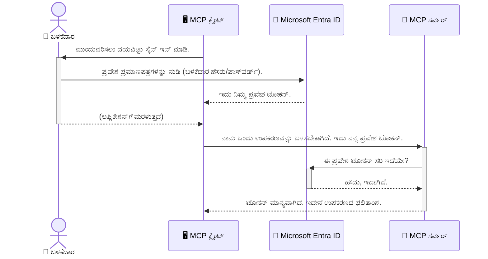

# AI ವರ್ಕ್‌ಫ್ಲೋಗಳನ್ನು ಸುರಕ್ಷಿತಗೊಳಿಸುವುದು: ಮಾದರಿ ಕಾನ್‌ಟೆಕ್ಸ್ಟ್ ಪ್ರೋಟೋಕಾಲ್ ಸರ್ವರ್‌ಗಳಿಗೆ Entra ID ಪರಿಶೀಲನೆ

> [!NOTE]
> ಈ ಪಾಠದ ದೂರಸ್ಥ ಸರ್ವರ್ ಕೋಡ್ ಪುರಾತನ `/sse` ಮತ್ತು `/message` ಎಂಡ್ಫಾಯಿಂಟ್‌ಗಳನ್ನು ರಕ್ಷಿಸುತ್ತದೆ
> ಮತ್ತು MCP `2025-11-25` ಗುರಿಯಾಗಿರುತ್ತದೆ. ಅದರ ID ಮತ್ತು ಟೋಕೆನ್-ಚಕುಸ್ತ ಪರೀಕ್ಷಿಸುವ
> ಪದ್ಧತಿಗಳನ್ನು ಉಳಿಸಿ, ಆದರೆ ಹೊಸ ಅನುಷ್ಠಾನಗಳಿಗೆ `2026-07-28` ಹೊಂದಿಕೊಳ್ಳುವ ಸ್ಟ್ರೀಮಬಲ್ HTTP ಸಾರಿಗೆ ಬಳಸಿ.


## ಪರಿಚಯ
ನಿಮ್ಮ ಮಾದರಿ ಕಾನ್‌ಟೆಕ್ಸ್ಟ್ ಪ್ರೋಟೋಕಾಲ್ (MCP) ಸರ್ವರ್‌ನ್ನು ರಕ್ಷಿಸುವುದು ನಿಮ್ಮ ಮನೆಯ ಮುಂಭಾಗದ ಬಾಗಿಲನ್ನು ತಾಳೆಯೊಡ್ಡುವುದಕ್ಕಿಂತಲೂ ಮುಖ್ಯ. ನಿಮ್ಮ MCP ಸರ್ವರ್ ತೆರೆಯಲಾಗಿದೆ ಎಂದರೆ ನಿಮ್ಮ ಉಪಕರಣಗಳು ಮತ್ತು ಡೇಟಾ ಅನುಮತಿಗೇತವಲ್ಲದ ಪ್ರವೇಶಕ್ಕೆ ಒಳಗಾಗುತ್ತದೆ, ಇದು ಭದ್ರತಾ ಭಂಗಗಳಿಗೆ ಕಾರಣವಾಗಬಹುದು. Microsoft Entra ID ಬಲವಾದ ಕ್ಲೌಡ್ ಆಧಾರಿತ ಗುರುತು ಮತ್ತು ಪ್ರವೇಶ ನಿರ್ವಹಣಾ ಪರಿಹಾರವನ್ನು ಒದಗಿಸುತ್ತದೆ, ಇದು ಅವಧಿಸಲಾಗಿರುವ ಬಳಕೆದಾರರು ಮತ್ತು ಅಪ್ಲಿಕೇಶನ್‌ಗಳು ಮಾತ್ರ ನಿಮ್ಮ MCP ಸರ್ವರ್‌ನೊಂದಿಗೆ ಸಂವಹನ ಮಾಡಬಹುದು ಎಂದು ಖಾತ್ರಿ ಪಡಿಸುತ್ತದೆ. ಈ ವಿಭಾಗದಲ್ಲಿ, ನೀವು Entra ID ಪರಿಶೀಲನೆಯ ಮೂಲಕ ನಿಮ್ಮ AI ವರ್ಕ್‌ಫ್ಲೋಗಳನ್ನು ಹೇಗೆ ರಕ್ಷಿಸುವುದು ಎಂದು ಕಲಿಯುತ್ತೀರಿ.

## ಅಧ್ಯಯನ ಉದ್ದೇಶಗಳು
ಈ ವಿಭಾಗದ ಅಂತ್ಯದಲ್ಲಿ, ನೀವು ಇವುಗಳನ್ನು ಮಾಡಲು ಸಾಧ್ಯವಾಗುತ್ತದೆ:

- MCP ಸರ್ವರ್‌ಗಳನ್ನು ಸುರಕ್ಷಿತಗೊಳಿಸುವ ಮಹತ್ವವನ್ನು ಅರ್ಥಮಾಡಿಕೊಳ್ಳುವುದು.
- Microsoft Entra ID ಮತ್ತು OAuth 2.0 ಪರಿಶೀಲನೆಯ ಮೂಲಭೂತಗಳನ್ನು ವಿವರಣೆ ಮಾಡುವುದು.
- ಸಾರ್ವಜನಿಕ ಮತ್ತು ಗುಪ್ತclೈಂಟ್ಗಳ ನಡುವಿನ ವ್ಯತ್ಯಾಸವನ್ನು ಗುರುತಿಸುವುದು.
- ಸ್ಥಳೀಯ (ಸದಸ್ಯ clೈಂಟ್) ಮತ್ತು ದೂರಸ್ಥ (ಗುಪ್ತ clೈಂಟ್) MCP ಸರ್ವರ್ ಪ್ರಕರಣಗಳಲ್ಲಿ Entra ID ಪರಿಶೀಲನೆಯನ್ನು ಜಾರಿಗೆ ತರಲು.
- AI ವರ್ಕ್‌ಫ್ಲೋಗಳನ್ನು ಅಭಿವೃದ್ಧಿಪಡಿಸುವಾಗ ಭದ್ರತಾ ಒಳ್ಳೆಯ ಅಭ್ಯಾಸಗಳನ್ನು ಅನ್ವಯಿಸುವುದು.

## ಭದ್ರತೆ ಮತ್ತು MCP

ನೀವು ನಿಮ್ಮ ಮನೆಯ ಮುಂಭಾಗದ ಬಾಗಿಲನ್ನು ತೆರೆಯಿಟ್ಟುಕೊಳ್ಳದು ಹಾಗೇ, ನಿಮ್ಮ MCP ಸರ್ವರ್ ನ್ನು ಯಾರಿಗೂ ಪ್ರವೇಶ ನೀಡುವುದಿಲ್ಲ. ನಿಮ್ಮ AI ವರ್ಕ್‌ಫ್ಲೋಗಳನ್ನು ಸುರಕ್ಷಿತಗೊಳಿಸುವುದು ಬಲವಾದ, ನಂಬಬಹುದಾದ ಮತ್ತು ಸುರಕ್ಷಿತ ಅಪ್ಲಿಕೇಶನ್‌ಗಳನ್ನು ನಿರ್ಮಿಸುವುದಕ್ಕೆ ಅವಶ್ಯಕ. ಈ ಅಧ್ಯಾಯದಲ್ಲಿ ನೀವು Microsoft Entra ID ಅನ್ನು ಬಳಸಿ ನಿಮ್ಮ MCP ಸರ್ವರ್‌ಗಳನ್ನು ಅಗರಿಸಲು ಪರಿಚಯಿಸಬಹುದು, ಇದರಿಂದ ಮಾತ್ರ ಅನುಮತಿಗೇತ ಬಳಕೆದಾರರು ಮತ್ತು ಅಪ್ಲಿಕೇಶನ್‌ಗಳು ನಿಮ್ಮ ಉಪಕರಣಗಳು ಮತ್ತು ಡೇಟಾದೊಂದಿಗೆ ಸಂವಹನ ಮಾಡಬಹುದು.

## MCP ಸರ್ವರ್‌ಗಳಿಗೆ ಭದ್ರತೆ ಏಕೆ ಮುಖ್ಯ

ನಿಮ್ಮ MCP ಸರ್ವರ್‌ಗೆ ಇಮೇಲ್ ಕಳುಹಿಸುವ ಅಥವಾ ಗ್ರಾಹಕ ಡೇಟಾಬೇಸ್‌ಗೆ ಪ್ರವೇಶವನ್ನು ನೀಡುವ ಉಪಕರಣವಿದೆ ಎಂದು ಭಾವಿಸಿ. ಸುರಕ್ಷಿತಗೊಳಿಸಲ್ಪಟ್ಟಿಲ್ಲದ ಸರ್ವರ್ ಎಂದರೆ ಯಾರೂ ಆ ಉಪಕರಣವನ್ನು ಬಳಸಬಹುದು, ಇದು ಅನುಮತಿಗೇತವಲ್ಲದ ಡೇಟಾ ಪ್ರವೇಶ, ಸ್ಪ್ಯಾಮ್ ಅಥವಾ ಇತರ ದುಷ್ಟ ಚಟುವಟಿಕೆಗಳಿಗೆ ಕಾರಣವಾಗಬಹುದು.

ಪರಿಶೀಲನೆ ಜಾರಿಗೆ ತರುವುದರಿಂದ, ಪ್ರತಿಯೊಬ್ಬ ವಿನಂತಿಕಾರನ ಗುರುತು ಪರಿಶೀಲಿಸಲಾಗುತ್ತದೆ, ಬಳಕೆದಾರ ಅಥವಾ ಅಪ್ಲಿಕೇಶನ್ ಅವರ ಐಡೆಂಟಿಟಿಯನ್ನು ಖಚಿತಪಡಿಸಿಕೊಳ್ಳುತ್ತದೆ. ಇದು ನಿಮ್ಮ AI ವರ್ಕ್‌ಫ್ಲೋಗಳನ್ನು ಸುರಕ್ಷಿತಗೊಳಿಸುವ ಮೊದಲ ಹಾಗೂ ಅತಿಮಹತ್ವದ ಹಂತ.

## Microsoft Entra ID ಪರಿಚಯ

[**Microsoft Entra ID**](https://adoption.microsoft.com/microsoft-security/entra/) ಕ್ಲೌಡ್ ಆಧಾರಿತ ಗುರುತು ಮತ್ತು ಪ್ರವೇಶ ನಿರ್ವಹಣಾ ಸೇವೆಯಾಗಿದೆ. ನಿಮ್ಮ ಅಪ್ಲಿಕೇಶನ್‌ಗಳಿಗೆ ವಿಶ್ವವ್ಯಾಪಿ ಭದ್ರತಾ ಗಾರ್ಡಿನಂತೆ ಇದನ್ನು ಪರಿಗಣಿಸಿ. ಇದು ಬಳಕೆದಾರರ ಗುರುತುಗಳನ್ನು ಪರಿಶೀಲಿಸುವ (ಪರಿಶೀಲನೆ) ಮತ್ತು ಅವರು ಏನು ಮಾಡಲು ಅವಕಾಶವಿದೆ ಎಂಬುದನ್ನು ನಿರ್ಧರಿಸುವ (ಅಧಿಕಾರ) ಸಂಕೀರ್ಣ ಪ್ರಕ್ರಿಯೆಯನ್ನು ನಿರ್ವಹಿಸುತ್ತದೆ.

Entra ID ಬಳಸಿ, ನೀವು:

- ಬಳಕೆದಾರರಿಗೆ ಸುರಕ್ಷಿತ ಸೈನ್-ಇನ್ ಅನುಮತಿಸಿ.
- API ಮತ್ತು ಸೇವೆಗಳನ್ನು ರಕ್ಷಿಸಿ.
- ಕೇಂದ್ರ ಸ್ಥಳದಿಂದ ಪ್ರವೇಶ ನೀತಿಗಳನ್ನು ನಿರ್ವಹಿಸಿ.

MCP ಸರ್ವರ್‌ಗಳಿಗೆ, Entra ID ಸರ್ವರ್‌ನ ಸಾಮರ್ಥ್ಯಗಳನ್ನು ಯಾರಿಗೆ ಪ್ರವೇಶ ಕಲ್ಪಿಸುವುದೆಂದರೆ ಬಹಳ ಪ್ರಾಮಾಣಿಕ ಮತ್ತು ವಿಶ್ವಾಸಾರ್ಹ ಪರಿಹಾರ ಒದಗಿಸುತ್ತದೆ.

---

## ಮಾಯಾಜಾಲವನ್ನು ಅರ್ಥಮಾಡಿಕೊಳ್ಳುವುದು: Entra ID ಪರಿಶೀಲನೆ ಹೇಗೆ ಕಾರ್ಯನಿರ್ವಹಿಸುತ್ತದೆ

Entra ID ಪರಿಶೀಲನೆಗೆ **OAuth 2.0** ಹಾಗು ಇತರ ತೆರೆಯಲಾದ ಸ್ಟ್ಯಾಂಡರ್ಡ್‌ಗಳನ್ನು ಬಳಸುತ್ತದೆ. ವಿವರಗಳು ಕೆಲವೊಮ್ಮೆ ಸಾಂಖ್ಯಾತ್ಮಕವಾಗಿರಬಹುದು, ಆದರೆ ಮೂಲಭೂತ ಸಂ conceಪ ಸುಲಭವಾಗಿದೆ ಮತ್ತು ಉದಾಹರಣೆಯಿಂದ ಅರ್ಥಮಾಡಬಹುದು.

### OAuth 2.0 ಗೆ ಸೌಮ್ಯ ಪರಿಚಯ: ವೆಲೆಟ್ ಕೀ

OAuth 2.0 ಅನ್ನು ನಿಮ್ಮ ಕಾರಿನ ವೆಲೆಟ್ ಸೇವೆಯಂತೆ ಭಾವಿಸಿ. ನೀವು ಒಂದು ರೆಸ್ಟೋರೆಂಟ್‌ಗೆ ಬазарಾಗುವಾಗ, ನೀವು ವೆಲೆಟ್‌ಗೆ ನಿಮ್ಮ ಮುಕ್ತಾಯ ಕೀಲಿಯನ್ನು ನೀಡುವುದಿಲ್ಲ. ಬದಲಿಗೆ ನೀವು ನೀಡುವುದು ಒಂದು **ವೆಲೆಟ್ ಕೀ** ಆಗಿದ್ದು, ಅದು সীমಿತ ಅನುಮತಿಯೊಂದಿದೆ — ಅದು ಕಾರನ್ನು ಪ್ರಾರಂಭಿಸಬಹುದು ಮತ್ತು ಬಾಗಿಲುಗಳನ್ನು ನೋಡಬಹುದು, ಆದರೆ ಟಂಕ್ ಅಥವಾ ಹ್ಯಾಂಡ್‌ಗ್ಲೋವ್ ಕಂಬಾರ್ಟ್ ತೆರೆಯಲು ಸಾಧ್ಯವಿಲ್ಲ.

ಈ ಉದಾಹರಣೆಯಲ್ಲಿ:

- **ನೀವು** ಆ **ಬಳಕೆದಾರರು** ಆಗಿದ್ದೀರಿ.
- **ನಿಮ್ಮ ಕಾರು** MCP ಸರ್ವರ್ ಮತ್ತು ಅದರ ಮೌಲ್ಯಯುತ ಉಪಕರಣಗಳು ಮತ್ತು ಡೇಟಾ.
- **ವೆಲೆಟ್** Microsoft Entra ID ಆಗಿದೆ.
- **ಪಾರ್ಕಿಂಗ್ ಅಟೆಂಡೆಂಟ್** MCP ಕ್ಲೈಂಟ್ (ಸರ್ವರ್‌ಗೆ ಪ್ರವೇಶಿಸುವ ಅಪ್ಲಿಕೇಶನ್).
- **ವೆಲೆಟ್ ಕೀ** ಪ್ರವೇಶ ಟೋಕೆನ್ ಆಗಿದೆ.

ಪ್ರವೇಶ ಟೋಕೆನ್ Entra ID ರಿಂದ ನಿಮ್ಮ ಸೈನ್ ಇನ್ ನಂತರ MCP ಕ್ಲೈಂಟ್ ಪಡೆಯುವ ಸುರಕ್ಷಿತ ಪಠ್ಯ ಸಂಕೇತ. ನಂತರ ಕ್ಲೈಂಟ್ ಪ್ರತಿಯೊಂದು ವಿನಂತಿಗೆ ಈ ಟೋಕೆನ್ ಅನ್ನು MCP ಸರ್ವರ್‌ಗೂ ತೋರಿಸುತ್ತದೆ. ಸರ್ವರ್ ಈ ಟೋಕೆನ್ ಮಾನ್ಯವಾಗಿದೆಯೇ ಎಂದು ಪರಿಶೀಲಿಸಿ, ವಿನಂತಿ ನ್ಯಾಯಬದ್ಧವಾಗಿದೆಯೇ ಅಥವಾ ಕ್ಲೈಂಟ್ ಅಗತ್ಯ ಅನುಮತಿ ಹೊಂದಿದೆಯೇ ಎಂದು ಖಚಿತಪಡಿಸುತ್ತದೆ, ಮತ್ತು ನಿಮ್ಮ ಜಾರಿಗೆ (ಹಾಗೆ ನಿಮ್ಮ ಪಾಸ್ವರ್ಡ್) ನ್ನು ಕೈಬಿಡದೆ.

### ಪರಿಶೀಲನಾ ಕೇಂದ್ರಪ್ರವಾಹ

ಪ್ರಾಯೋಗಿಕವಾಗಿ ಈ ಪ್ರಕ್ರಿಯೆ ಹೇಗೆ ಕಾರ್ಯನಿರ್ವಹಿಸುತ್ತದೆ:



### Microsoft Authentication Library (MSAL) ಪರಿಚಯ

ಕೋಡ್‌ಗೆ ಕೆಳಕ್ಕೆ ಬೃಹತ್ ಮಾಡು ಮುಂಚೆ, ನೀವು ಉದಾಹರಣೆಗಳಲ್ಲಿ ನೋಡೋಣ ಒಂದು ಮುಖ್ಯ ಭಾಗ: **Microsoft Authentication Library (MSAL)**.

MSAL ಮೈಕ್ರೋಸುಫ್ಟ್ ಅಭಿವೃದ್ಧಿಪಡಿಸಿದ ಪುಸ್ತಕಾಲಯವೂ, ಡೆವಲಪರ್‌ಗಳಿಗೆ ಪರಿಶೀಲನೆಯನ್ನು ಸುಗಮವಾಗಿಸುತ್ತದೆ. ನೀವು ಭದ್ರತಾ ಟೋಕನ್‌ಗಳು, ಸೈನ್-ಇನ್ ನಿರ್ವಹಣೆ ಮತ್ತು ಸೆಷನ್ ಪುನರ್‌ಜೀವನಗಳನ್ನು ನಿರ್ವಹಿಸಲು ಸಂಕೀರ್ಣ ಕೋಡ್ ಬರೆಯುವ ಅವಶ್ಯಕತೆಯಿಲ್ಲ, MSAL ಅದನ್ನು ತಾಳಿಹೋಗುತ್ತದೆ.

MSAL ಬಳಸುವುದು ಶಿಫಾರಸು ಮಾಡಲಾಗುವುದಿದೆ ಏಕೆಂದರೆ:

- **ಸುರುಕ್ಷಿತವಾಗಿದೆ:** ಇದು ಕೈಗಾರಿಕಾ ಸ್ಟ್ಯಾಂಡರ್ಡ್ ಪ್ರೋಟೋಕಾಲ್‌ಗಳು ಮತ್ತು ಭದ್ರತಾ ಉತ್ಕೃಷ್ಟ ಪದ್ಧತಿಗಳನ್ನು ಜಾರಿಗೊಳಿಸುತ್ತದೆ, ನಿಮ್ಮ ಕೋಡ್‌ನಲ್ಲಿ ದುರ್ಬಲತೆಗಳ ಅಪಾಯವನ್ನು ಕಡಿಮೆ ಮಾಡುತ್ತದೆ.
- **ಅಭಿವೃದ್ದಿಗೆ ಸರಳೀಕೃತ:** OAuth 2.0 ಮತ್ತು OpenID Connect ನ ಬಗೆಗಿನ ಸಂಕೀರ್ಣತೆಗಳನ್ನು ಮರೆಮಾಚಿ, ಕೆಲವು ಸಾಲುಗಳ ಕೋಡ್‌ನಿಂದ ಬಲವಂತಾದ ಪರಿಶೀಲನೆವನ್ನು ನಿಮ್ಮ ಅಪ್ಲಿಕೇಶನ್‌ಗೆ ಸೇರಿಸಲು ಸಹಾಯ ಮಾಡುತ್ತದೆ.
- **ನಿರತಪಾಲಿಸಲಾಗುತ್ತದೆ:** ಮೈಕ್ರೋಸುಫ್ಟ್ ಸಕ್ರಿಯವಾಗಿ MSAL ಅನ್ನು ನವೀಕರಿಸಿ ಭದ್ರತಾ ಬೆಚ್ಚನ್ನು ಮತ್ತು ವೇದಿಕೆ ಬದಲಾವಣೆಗಳನ್ನು ಮಾಡುತ್ತದೆ.

MSAL .NET, JavaScript/TypeScript, Python, Java, Go ಮತ್ತು iOS, Android ಮೊಬೈಲ್ ವೇದಿಕೆಗಳಂತಹ ಬೃಹತ್ ಭಾಷೆಗಳು ಮತ್ತು ಅಪ್ಲಿಕೇಶನ್ ಫ್ರೇಮ್ವರ್ಕ್ಗಳನ್ನು ಬೆಂಬಲಿಸುತ್ತದೆ. ಇದರಿಂದ ನೀವು ನಿಮ್ಮ ಸಂಪೂರ್ಣ ತಂತ್ರಜ್ಞಾನ ಸ್ಟ್ಯಾಕ್ ಮೇಲೆ ಒಂದೇ ರೀತಿಯ ಪರಿಶೀಲನಾ ಮಾದರಿಗಳನ್ನು ಬಳಸಬಹುದು.

MSAL ಬಗ್ಗೆ ಇನ್ನಷ್ಟು ತಿಳಿಯಲು, ಅಧಿಕೃತ [MSAL ಅವಲೋಕನ ದಾಖಲೆ](https://learn.microsoft.com/entra/identity-platform/msal-overview) ನೋಡಿ.

---

## Entra ID ಮೂಲಕ ನಿಮ್ಮ MCP ಸರ್ವರ್ ಅನ್ನು ರಕ್ಷಿಸುವುದು: ಹಂತ ಹಂತದ ಮಾರ್ಗದರ್ಶಿ

ಈಗ, Entra ID ಬಳಸಿ `stdio` ಮೂಲಕ ಸಂಪರ್ಕ ಹೊಂದುವ ಸ್ಥಳೀಯ MCP ಸರ್ವರ್ ಅನ್ನು ಹೇಗೆ ರಕ್ಷಿಸುವುದು ಎಂದು ನೋಡೋಣ. ಈ ಉದಾಹರಣೆ **ಸಾಮಾನ್ಯ ಕ್ಲೈಂಟ್** ಅನ್ನು ಬಳಸುತ್ತದೆ, ಇದು ಬಳಕೆದಾರರ ಯಂತ್ರದ ಅಪ್ಲಿಕೇಶನ್‌ಗಳಿಗೆ, ಡೆಸ್ಕ್‌ಟಾಪ್ ಅಪ್ಲಿಕೇಶನ್ ಅಥವಾ ಸ್ಥಳೀಯ ಅಭಿವೃದ್ಧಿ ಸರ್ವರ್‌ಗಳಿಗೆ ಸೂಕ್ತವಾಗಿದೆ.

### ಸಂದರ್ಭ 1: ಸ್ಥಳೀಯ MCP ಸರ್ವರ್ ಅನ್ನು ರಕ್ಷಿಸುವುದು (ಸಾರ್ವಜನಿಕ ಕ್ಲೈಂಟ್‌ನೊಂದಿಗೆ)

ಈ ಸಂದರ್ಭದಲ್ಲಿ, ಸ್ಥಳೀಯವಾಗಿ ಕಾರ್ಯ ನಿರ್ವಹಿಸುವ MCP ಸರ್ವರ್ ಇದ್ದು, `stdio` ಮೂಲಕ ಸಂವಹನ ಮಾಡುತ್ತದೆ ಮತ್ತು ಉಪಕರಣಗಳಿಗೆ ಪ್ರವೇಶಕ್ಕೆ ಮೊದಲು ಬಳಕೆದಾರರನ್ನು Entra ID ಮೂಲಕ ಪರಿಶೀಲಿಸುತ್ತದೆ. ಸರ್ವರ್ ಒಂದು ಉಪಕರಣ ಇರಲಿದೆ, ಅದು Microsoft ಗ್ರಾಫ್ API ನಲ್ಲಿ ಬಳಕೆದಾರರ ಪ್ರೊಫೈಲ್ ಮಾಹಿತಿಯನ್ನು ಪಡೆಯುತ್ತದೆ.

#### 1. Entra ID ಯಲ್ಲಿ ಅಪ್ಲಿಕೇಶನ್ ಸಿದ್ಧಪಡಿಸುವುದು

ಯಾವುದೇ ಕೋಡ್ ಬರೆಯುವ ಮುಂಚೆ, Microsoft Entra ID ಯಲ್ಲಿ ನಿಮ್ಮ ಅಪ್ಲಿಕೇಶನ್ ಅನ್ನು ನೋಂದಾಯಿಸಬೇಕು. ಇದು Entra ID ಗೆ ನಿಮ್ಮ ಅಪ್ಲಿಕೇಶನ್ ಬಗ್ಗೆ ತೋರಿಸುತ್ತದೆ ಮತ್ತು ಪರಿಶೀಲನಾ ಸೇವೆ ಬಳಸಲು ಅನುಮತಿ ನೀಡುತ್ತದೆ.

1. **[Microsoft Entra ಪೋರ್ಟಲ್](https://entra.microsoft.com/)** ಗೆ ನವಿಗೇಟ್ ಮಾಡಿ.
2. **App registrations** ಗೆ ಹೋಗಿ ಮತ್ತು **New registration** ಕ್ಲಿಕ್ ಮಾಡಿ.
3. ನಿಮ್ಮ ಅಪ್ಲಿಕೇಶನಿಗೆ ಹೆಸರುಕೊಡಿ (ಉದಾಹರಣೆಗೆ, "My Local MCP Server").
4. **Supported account types** ನಲ್ಲಿ **Accounts in this organizational directory only** ಆಯ್ಕೆಮಾಡಿ.
5. ಈ ಉದಾಹರಣೆಗೆ **Redirect URI** ಅನ್ನು ಖಾಲಿ ಬಿಟ್ಟುಬಿಡಿ.
6. **Register** ಕ್ಲಿಕ್ ಮಾಡಿ.

ನೋಂದಾಯಿಸಿದ ನಂತರ, **Application (client) ID** ಮತ್ತು **Directory (tenant) ID** ಗಮನವಿಟ್ಟು ನೀವು ನಿಮಗೂ ಕೋಡ್‌ನಲ್ಲಿ ಅವುಗಳ ಅಗತ್ಯವಿದೆ.

#### 2. ಕೋಡ್: ಒಂದು ಸಂಕ್ಷಿಪ್ತ ವಿವರಣೆ

ಪರಿಶೀಲನೆಯನ್ನು ಹ್ಯಾಂಡಲ್ ಮಾಡುವ ಕೋಡ್‌ನ ಮುಖ್ಯ ಭಾಗಗಳನ್ನು ನೋಡೋಣ. ಈ ಉದಾಹರಣೆಯ ಪೂರ್ಣ ಕೋಡ್ [Entra ID - Local - WAM](https://github.com/Azure-Samples/mcp-auth-servers/tree/main/src/entra-id-local-wam) ಫೋಲ್ಡರಿನಲ್ಲಿ [mcp-auth-servers GitHub ಸಂಗ್ರಹ](https://github.com/Azure-Samples/mcp-auth-servers) ಲಭ್ಯವಿದೆ.

**`AuthenticationService.cs`**

ಇದು Entra ID ಜೊತೆಗೆ ಸಂವಹನ ನಿರ್ವಹಿಸುವ ವರ್ಗ.

- **`CreateAsync`**: ಇದು MSAL (Microsoft Authentication Library) ಮೂಲಕ `PublicClientApplication` ಅನ್ನು ಪ್ರಾರಂಭಿಸುತ್ತದೆ. ನಿಮ್ಮ ಅಪ್ಲಿಕೇಶನ್‌ನ `clientId` ಮತ್ತು `tenantId` ಮುಖಾಂತರ ಸಂರಚಿಸಲಾಗಿದೆ.
- **`WithBroker`**: ಇದು ಬ್ರೋಕರ್ (ಉದಾ: Windows Web Account Manager) ಬಳಕೆಯನ್ನು ಸಕ್ರಿಯಗೊಳಿಸುತ್ತದೆ, ಇದು ಸುರಕ್ಷಿತ ಮತ್ತು ಸತತ ಏಕ ಸೈನ್-ಆನ್ ಅನುಭವವನ್ನು ಒದಗಿಸುತ್ತದೆ.
- **`AcquireTokenAsync`**: ಪ್ರಧಾನ ವಿಧಾನ. ಮೊದಲು ನಿಶ್ಶಬ್ದವಾಗಿ ಟೋಕೆನ್ ಪಡೆದುಕೊಳ್ಳಲು ಯತ್ನಿಸುತ್ತದೆ (ಅರ್ಥাৎ ಬಳಕೆದಾರರನ್ನು ಮತ್ತೆ ಸೈನ್ ಇನ್ ಮಾಡಬೇಕಾಗುವುದಿಲ್ಲ). ನಿಶ್ಶಬ್ದ ಟೋಕೆನ್ ಸಿಗದಿದ್ದರೆ ಬಳಕೆದಾರರಿಂದ ಸಹಭಾಗಿತ್ವದಲ್ಲಿ ಸೈನ್ ಇನ್ ಕೇಳುತ್ತದೆ.

```csharp
// Simplified for clarity
public static async Task<AuthenticationService> CreateAsync(ILogger<AuthenticationService> logger)
{
    var msalClient = PublicClientApplicationBuilder
        .Create(_clientId) // Your Application (client) ID
        .WithAuthority(AadAuthorityAudience.AzureAdMyOrg)
        .WithTenantId(_tenantId) // Your Directory (tenant) ID
        .WithBroker(new BrokerOptions(BrokerOptions.OperatingSystems.Windows))
        .Build();

    // ... cache registration ...

    return new AuthenticationService(logger, msalClient);
}

public async Task<string> AcquireTokenAsync()
{
    try
    {
        // Try silent authentication first
        var accounts = await _msalClient.GetAccountsAsync();
        var account = accounts.FirstOrDefault();

        AuthenticationResult? result = null;

        if (account != null)
        {
            result = await _msalClient.AcquireTokenSilent(_scopes, account).ExecuteAsync();
        }
        else
        {
            // If no account, or silent fails, go interactive
            result = await _msalClient.AcquireTokenInteractive(_scopes).ExecuteAsync();
        }

        return result.AccessToken;
    }
    catch (Exception ex)
    {
        _logger.LogError(ex, "An error occurred while acquiring the token.");
        throw; // Optionally rethrow the exception for higher-level handling
    }
}
```

**`Program.cs`**

ಇಲ್ಲಿ MCP ಸರ್ವರ್ ಸಿದ್ದಪಡಿಸಲಾಗುತ್ತದೆ ಮತ್ತು ಪರಿಶೀಲನಾ ಸೇವೆಯನ್ನು ಜೋಡಿಸಲಾಗುತ್ತದೆ.

- **`AddSingleton<AuthenticationService>`**: ಇದು ಡಿಪೆಂಡೆನ್ಸಿ ಇಂಜೆಕ್ಷನ್ ಕಂಟೈನರ್‌ನಲ್ಲಿ `AuthenticationService` ಅನ್ನು ನೋಂದಾಯಿಸುತ್ತದೆ, ಇದರಿಂದ ಅಪಲೀಕೇಶನ್ ಇತರೆ ಭಾಗಗಳು (ಉಪಕರಣಗಳು) ಇದನ್ನು ಬಳಸಬಹುದು.
- **`GetUserDetailsFromGraph` ಉಪಕರಣ**: ಈ ಉಪಕರಣಕ್ಕೆ `AuthenticationService` ನ್ನು ಅವಶ್ಯಕತೆಯಿದೆ. ಮೊದಲಿಗೆ `authService.AcquireTokenAsync()` ಕರೆ ಮಾಡಿ ಮಾನ್ಯ ಟೋಕೆನ್ ಪಡೆಯುತ್ತದೆ. ಪರಿಶೀಲನೆ ಯಶಸ್ವಿಯಾಗಿ ಆದರೆ, ಈ ಟೋಕೆನ್ ಬಳಸಿ Microsoft Graph API ಗೆ ಕರೆ ಮಾಡಿ ಬಳಕೆದಾರರ ವಿವರಗಳನ್ನು ಪಡೆಯುತ್ತದೆ.

```csharp
// Simplified for clarity
[McpServerTool(Name = "GetUserDetailsFromGraph")]
public static async Task<string> GetUserDetailsFromGraph(
    AuthenticationService authService)
{
    try
    {
        // This will trigger the authentication flow
        var accessToken = await authService.AcquireTokenAsync();

        // Use the token to create a GraphServiceClient
        var graphClient = new GraphServiceClient(
            new BaseBearerTokenAuthenticationProvider(new TokenProvider(authService)));

        var user = await graphClient.Me.GetAsync();

        return System.Text.Json.JsonSerializer.Serialize(user);
    }
    catch (Exception ex)
    {
        return $"Error: {ex.Message}";
    }
}
```

#### 3. ಏನು ಎಲ್ಲವು ಒಂದಾಗಿ ಕೆಲಸ ಮಾಡುತ್ತದೆ

1. MCP ಕ್ಲೈಂಟ್ `GetUserDetailsFromGraph` ಉಪಕರಣವನ್ನು ಬಳಸಲು ಪ್ರಯತ್ನಿಸುವಾಗ, ಮೊದಲಿಗೆ `AcquireTokenAsync` ಅನ್ನು ಕರೆಯುತ್ತದೆ.
2. `AcquireTokenAsync` MSAL ಪುಸ್ತಕಾಲಯವನ್ನು ಮಾನ್ಯ ಟೋಕೆನ್ ಗೆ ಪರೀಕ್ಷಿಸುವಂತೆ ಪ್ರಾರಂಭಿಸುತ್ತದೆ.
3. ಟೋಕೆನ್ ಸಿಗದಿದ್ದರೆ, MSAL ಬ್ರೋಕರ್ ಮೂಲಕ ಬಳಕೆದಾರರನ್ನು Entra ID ಖಾತ್ರಿ ಮಾಡಿದ ಖಾತ್ರನ್ನು ಬಳಸಿ ಸೈನ್ ಇನ್ ಮಾಡಲು ಕೇಳುತ್ತದೆ.
4. ಬಳಕೆದಾರ ಸೈನ್ ಇನ್ ಮಾಡಿದ ಮೇಲೆ Entra ID ಪ್ರವೇಶ ಟೋಕೆನ್ ನೀಡುತ್ತದೆ.
5. ಉಪಕರಣ ಟೋಕೆನ್ ಸ್ವೀಕರಿಸಿ Microsoft Graph API ಗೆ ಸುರಕ್ಷಿತ ಕರೆ ಮಾಡುತ್ತದೆ.
6. ಬಳಕೆದಾರರ ವಿವರಗಳು MCP ಕ್ಲೈಂಟ್ ಗೆ ಹಿಂತಿರುಗುತ್ತವೆ.

ಈ ಪ್ರಕ್ರಿಯೆಯು ಮಾತ್ರ ಪರಿಶೀಲಿತ ಬಳಕೆದಾರರು ಉಪಕರಣವನ್ನು ಬಳಸಬಹುದು ಎಂದು ಖಾತ್ರಿಪಡಿಸಿ, ನಿಮ್ಮ ಸ್ಥಳೀಯ MCP ಸರ್ವರ್ ಅನ್ನು ಪರಿಣಾಮಕಾರಿಯಾಗಿ ರಕ್ಷಿಸುತ್ತದೆ.

### ಸಂದರ್ಭ 2: ದೂರ MCP ಸರ್ವರ್ ಅನ್ನು ರಕ್ಷಿಸುವುದು (ಗುಪ್ತ clೈಂಟ್ ಬಳಸಿ)

ನಿಮ್ಮ MCP ಸರ್ವರ್ ದೂರಸ್ಥ ಯಂತ್ರದಲ್ಲಿ (ಕ್ಲೌಡ್ ಸರ್ವರ್ ಅಗದು) HTTP ಸ್ಟ್ರೀಮಿಂಗ್ ಪ್ರೋಟೋಕಾಲ್ ಬಳಸಿ ಸಂವಹನ ಮಾಡುವಾಗ, ಭದ್ರತಾ ಅವಶ್ಯಕತೆ ಬೇರೆಯಾದವು. ಈ ಸಂದರ್ಭದಲ್ಲಿ ನೀವು **ಗುಪ್ತ clೈಂಟ್** ಮತ್ತು **Authorization Code Flow** ಬಳಸದೇಬೇಕು. ಇದು ಸುರಕ್ಷಿತ ವಿಧಾನ, ಏಕೆಂದರೆ ಅಪ್ಲಿಕೇಶನ್ ರಹಸ್ಯಗಳು ಬ್ರೌಸರ್‌ಗೆ ಬಹಿರಂಗವಾಗುವುದಿಲ್ಲ.

ಈ ಉದಾಹರಣೆಯಲ್ಲಿ TypeScript ಆಧಾರಿತ MCP ಸರ್ವರ್ ಇದೆ, ಇದು Express.js ಬಳಸಿ HTTP ವಿನಂತಿಗಳನ್ನು ನಿರ್ವಹಿಸುತ್ತದೆ.

#### 1. Entra ID ಯಲ್ಲಿ ಅಪ್ಲಿಕೇಶನ್ ಸಿದ್ಧಪಡಿಸುವುದು

Entra ID ಯಲ್ಲಿ ಸಿದ್ಧತೆ ಸಾರ್ವಜನಿಕ clೈಂಟ್‌ಗೆ ಸಮಾನ, ಆದರೆ ಒಂದು ಪ್ರಮುಖ ವ್ಯತ್ಯಾಸವಿದೆ: ಈ ಸಲ ನೀವು **clೈಂಟ್ ಸೀಕ್ರೆಟ್** ಸೃಷ್ಟಿಸಬೇಕು.

1. **[Microsoft Entra ಪೋರ್ಟಲ್](https://entra.microsoft.com/)** ಗೆ ನವಿಗೇಟ್ ಮಾಡಿ.
2. ನಿಮ್ಮ ಅಪ್ಲಿಕೇಶನ್ ನೋಂದಣಿಯಲ್ಲಿ **Certificates & secrets** ಟ್ಯಾಬ್‌ಗೆ ಹೋಗಿ.
3. **New client secret** ಕ್ಲಿಕ್ ಮಾಡಿ, ವಿವರಣೆ ನೀಡಿ, ಮತ್ತು **Add** ಕ್ಲಿಕ್ ಮಾಡಿ.
4. **ಪ್ರಮುಖ:** ಸೀಕ್ರೆಟ್ ಮೌಲ್ಯವನ್ನು ತಕ್ಷಣ ನಕಲಿಸಿ. ನೀವು ಅದನ್ನು ಮತ್ತೆ ನೋಡಲು ಸಾಧ್ಯವಿರುವುದಿಲ್ಲ.
5. ನೀವು **Redirect URI** ಕೂಡ ಸಿದ್ಧಪಡಿಸಬೇಕು. **Authentication** ಟ್ಯಾಬ್‌ಗೆ ಹೋಗಿ, **Add a platform** ಕ್ಲಿಕ್ ಮಾಡಿ, **Web** ಆಯ್ಕೆಮಾಡಿ ಮತ್ತು ನಿಮ್ಮ ಅಪ್ಲಿಕೇಶನ್ Redirect URI ನ್ನು ನಮೂದಿಸಿ (ಉದಾ., `http://localhost:3001/auth/callback`).

> **⚠️ ಪ್ರಮುಖ ಭದ್ರತಾ ಟಿಪ್ಪಣಿ:** ಉತ್ಪಾದನಾ ಅಪ್ಲಿಕೇಶನ್‌ಗಳಿಗೆ ಮೈಕ್ರೋಸುಫ್ಟ್ ಗಟ್ಟಿಯಾಗಿ ಶಿಫಾರಸು ಮಾಡುತ್ತದೆ **secretless(authentication) ವಿಧಾನಗಳು** ಬಳಸಲು, ಉದಾ: **Managed Identity** ಅಥವಾ **Workload Identity Federation**, clೈಂಟ್ ಸೀಕ್ರೆಟ್‌ಗಳ ಬದಲು. clೈಂಟ್ ಸೀಕ್ರೆಟ್‌ಗಳು ಭದ್ರತಾ ಅಪಾಯ ಹೊಂದಿವೆ ಏಕೆಂದರೆ ಅವು ಬಹಿರಂಗವಾಗಬಹುದು ಅಥವಾ ಹಾನಿಗೊಳಪಡಬಹುದು. ನಿರ್ವಹಿತ ಗುರುತುಗಳು ನಿಮ್ಮ ಕೋಡ್ ಅಥವಾ ಕಾನ್ಫಿಗರೇಶನ್‌ನಲ್ಲಿ ಕ್ರೆಡೆನ್ಶಿಯಲ್ಸ್ ಸಂಗ್ರಹಿಸದಂತೆ ಹೆಚ್ಚು ಸುರಕ್ಷಿತ ವಿಧಾನ ಒದಗಿಸುತ್ತದೆ.
>
> ನಿರ್ವಹಿತ ಗುರುತುಗಳ ಬಗ್ಗೆ ಮತ್ತು ಅವುಗಳನ್ನು ಜಾರಿಗೊಳಿಸುವುದೆಂದರೆ ಹೆಚ್ಚಿನ ಮಾಹಿತಿಗಾಗಿ, [Managed identities for Azure resources overview](https://learn.microsoft.com/entra/identity/managed-identities-azure-resources/overview) ನೋಡಿ.

#### 2. ಕೋಡ್: ಒಂದು ಸಂಕ್ಷಿಪ್ತ ವಿವರಣೆ

ಈ ಉದಾಹರಣೆ ಸೆಷನ್ ಆಧಾರಿತವಾಗಿದೆ. ಬಳಕೆದಾರರು ಪರಿಶೀಲನೆ ಮಾಡಿದಾಗ, ಸರ್ವರ್ ಪ್ರವೇಶ ಟೋಕೆನ್ ಮತ್ತು ರಿಫ್ರೇಶ ಟೋಕೆನ್ ಅನ್ನು ಸೆಷನ್‌ನಲ್ಲಿ ಸಂಗ್ರಹಿಸುತ್ತದೆ ಮತ್ತು ಬಳಕೆದಾರರಿಗೆ ಸೆಷನ್ ಟೋಕೆನ್ ನೀಡುತ್ತದೆ. ನಂತರದ ವಿನಂತಿಗಳಿಗೆ ಈ ಸೆಷನ್ ಟೋಕೆನ್ ಬಳಸಲಾಗುತ್ತದೆ. ಪೂರ್ಣ ಕೋಡ್ [Entra ID - Confidential client](https://github.com/Azure-Samples/mcp-auth-servers/tree/main/src/entra-id-cca-session) ಫೋಲ್ಡರಿನಲ್ಲಿದ್ದು [mcp-auth-servers GitHub ಸಂಗ್ರಹ](https://github.com/Azure-Samples/mcp-auth-servers) ನಲ್ಲಿ ಲಭ್ಯ.

**`Server.ts`**

ಈ ಫೈಲ್ Express ಸರ್ವರ್ ಮತ್ತು MCP ಸಾರಿಗೆ ಲೇಯರ್ ಅನ್ನು ಸ್ಥಾಪಿಸುತ್ತದೆ.

- **`requireBearerAuth`**: ಇದು ಮೀಡಿಯಾವೇರ್, `/sse` ಮತ್ತು `/message` ಎಂಡ್ಫಾಯಿಂಟ್‌ಗಳನ್ನು ರಕ್ಷಿಸುತ್ತದೆ. ವಿನಂತಿಯ `Authorization` ಹೆಡ್ಡರ್‌ನಲ್ಲಿ ಮಾನ್ಯ Bearer ಟೋಕೆನ್ ಪರೀಕ್ಷಿಸುತ್ತದೆ.
- **`EntraIdServerAuthProvider`**: ಇದು ಕಸ್ಟಮ್ ವರ್ಗ, `McpServerAuthorizationProvider` ಇಂಟರ್ಫೇಸ್ ಅನ್ನು ಜಾರಿಗೊಳಿಸುತ್ತದೆ. OAuth 2.0 ಫ್ಲೋ ನಿರ್ವಹಿಸುವ ಜವಾಬ್ದಾರಿಯಿದೆ.
- **`/auth/callback`**: ಈ ಎಂಡ್ಫಾಯಿಂಟ್ ಬಳಕೆದಾರರು ಪರಿಶೀಲನೆ ಮಾಡಿದ ಮೇಲೆ Entra ID ನಿಂದ ರಿಡೈರೆಕ್ಟ್ ಅನ್ನು ಹ್ಯಂಡಲ್ ಮಾಡುತ್ತದೆ. ಇದು ಪ್ರವೇಶ ಕೋಡ್ ನ್ನು ಪ್ರವೇಶ ಟೋಕನ್ ಮತ್ತು ರಿಫ್ರೇಶ ಟೋಕನ್ ಗೆ ವಿನಿಮಯ ಮಾಡುತ್ತದೆ.

```typescript
// ಸರಳೀಕೃತವಾಗಿದ್ದು ಸ್ಪಷ್ಟತೆಗಾಗಿ
const app = express();
const { server } = createServer();
const provider = new EntraIdServerAuthProvider();

// SSE ಅವಶ್ಯಕತೆ ಕಾಪಾಡಿ
app.get("/sse", requireBearerAuth({
  provider,
  requiredScopes: ["User.Read"]
}), async (req, res) => {
  // ... ಸಾರಿಗೆಗೆ ಸಂಪರ್ಕಿಸಿ ...
});

// ಸಂದೇಶ ಅಂತರಂಗ ಸುರಕ್ಷಿಸಿ
app.post("/message", requireBearerAuth({
  provider,
  requiredScopes: ["User.Read"]
}), async (req, res) => {
  // ... ಸಂದೇಶವನ್ನು ನಿರ್ವಹಿಸಿ ...
});

// OAuth 2.0 ಕಾಲ್ಬ್ಯಾಕ್ ಅನ್ನು ನಿರ್ವಹಿಸಿ
app.get("/auth/callback", (req, res) => {
  provider.handleCallback(req.query.code, req.query.state)
    .then(result => {
      // ... ಯಶಸ್ಸು ಅಥವಾ ವೈಫಲ್ಯವನ್ನು ನಿರ್ವಹಿಸಿ ...
    });
});
```

**`Tools.ts`**

MCP ಸರ್ವರ್ ಒದಗಿಸುವ ಉಪಕರಣಗಳನ್ನು ವರ್ಣಿಸುತ್ತದೆ. `getUserDetails` ಉಪಕರಣ ಹಿಂದಿನ ಉದಾಹರಣೆಯಂತೆಯೇ, ಆದರೆ ಸೆಷನ್‌ನಿಂದ ಟೊಕನ್ ಪಡೆಯುತ್ತದೆ.

```typescript
// ಸೊಗಸುಗೊಳಿಸಲು ಸರಳೀಕರಿಸಲಾಗಿದೆ
server.setRequestHandler(CallToolRequestSchema, async (request) => {
  const { name } = request.params;
  const context = request.params?.context as { token?: string } | undefined;
  const sessionToken = context?.token;

  if (name === ToolName.GET_USER_DETAILS) {
    if (!sessionToken) {
      throw new AuthenticationError("Authentication token is missing or invalid. Ensure the token is provided in the request context.");
    }

    // ಸೆಷನ್ ಸ್ಟೋರ್‌ನಿಂದ ಎಂಟ್ರಾ ಐಡಿ ಟೋಕನ್ ಪಡೆಯಿರಿ
    const tokenData = tokenStore.getToken(sessionToken);
    const entraIdToken = tokenData.accessToken;

    const graphClient = Client.init({
      authProvider: (done) => {
        done(null, entraIdToken);
      }
    });

    const user = await graphClient.api('/me').get();

    // ... ಬಳಕೆದಾರದ ವಿವರಗಳನ್ನು ಹಿಂತಿರುಗಿಸಿ ...
  }
});
```

**`auth/EntraIdServerAuthProvider.ts`**

ಈ ವರ್ಗದ ಜವಾಬ್ದಾರಿಗಳು:

- ಬಳಕೆದಾರರನ್ನು Entra ID ಸೈನ್-ಇನ್ ಪುಟಕ್ಕೆ ರೀಡೈರೆಕ್ಟ್ ಮಾಡುವುದು.
- ಪ್ರವೇಶ ಟೋಕ್‌ಗೆ ಅಧಿಕಾರ ಕೋಡ್ ವಿನಿಮಯ ಮಾಡುವುದು.
- ಟೋಕನ್ಗಳನ್ನು `tokenStore` ನಲ್ಲಿ ಸಂಗ್ರಹಿಸುವುದು.
- ಟೋಕನ್ಗಳು ಅವಧಿ ಮುಗಿಸಿದಾಗ ರಿಫ್ರೆಶ್ ಮಾಡುವುದು.


#### 3. ಇದು ಎಲ್ಲವು ಹೇಗೆ ಒಟ್ಟಿಗೆ ಕೆಲಸ ಮಾಡುತ್ತದೆ  

1. ಬಳಕೆದಾರ ಮೊಗ್ಗ MCP ಸರ್ವರ್ ಗೆ ಸಂಪರ್ಕಿಸಲು ಪ್ರಯತ್ನಿಸಿದಾಗ, `requireBearerAuth` ಮಧ್ಯವರ್ತಿ ಅವರು ಅವರಿಗೆ ಮಾನ್ಯ ಸೆಷನ್ ಇಲ್ಲದಿರುವುದನ್ನು ನೋಡಿ ಅವರನ್ನು Entra ID ಸೈನ್-ಇನ್ ಪುಟಕ್ಕೆ ಮುಖಾಮುಖಿಯಾಗಿಸುವರು.  
2. ಬಳಕೆದಾರರು ತಮ್ಮ Entra ID ಖಾತೆಯಿಂದ ಸೈನ್ ಇನ್ ಮಾಡುತ್ತಾರೆ.  
3. Entra ID ಬಳಕೆದಾರನ್ನು `/auth/callback` ಅಂತಿಮ ಬಿಂದುಗೆ 'authorization code' ಜೊತೆ ಮರಳಿಸಲು ಮಾಡುವದು.  
4. ಸರ್ವರ್ ಆ ಕೋಡ್ ಅನ್ನು ಪ್ರವೇಶ ಟೋಕನ್ ಮತ್ತು ರಿಫ್ರೆಶ್ ಟೋಕನ್ ಗೆ ವಿನಿಮಯ ಮಾಡಿಕೊಳ್ಳುತ್ತದೆ, ಅವುಗಳನ್ನು ಸಂಗ್ರಹಿಸಿ, ಮತ್ತು ಸೆಷನ್ ಟೋಕನ್ ರಚಿಸಿ ಅದು ಕ್ಲೈಂಟ್ ಗೆ ಕಳುಹಿಸಲಾಗುತ್ತದೆ.  
5. ಈಗ ಕ್ಲೈಂಟ್ ಈ ಸೆಷನ್ ಟೋಕನ್ ಅನ್ನು MCP ಸರ್ವರ್ ಗೆ ಎಲ್ಲಾ ಭವಿಷ್ಯದ ವಿನಂತಿಗಳಲ್ಲಿ `Authorization` ಹೆಡರ್ ನಲ್ಲಿ ಬಳಕೆ ಮಾಡಬಹುದು.  
6. `getUserDetails` ಸಾಧನವನ್ನು ಕರೆ ಮಾಡಿದಾಗ, ಅದು ಸೆಷನ್ ಟೋಕನ್ ಅನ್ನು ಬಳಸಿ Entra ID ಪ್ರವೇಶ ಟೋಕನ್ ಅನ್ನು ಹುಡುಕುತ್ತದೆ ಮತ್ತು ಅದನ್ನು ಬಳಸಿ Microsoft Graph API ಅನ್ನು ಕರೆ ಮಾಡುತ್ತದೆ.  

ಈ ಪ್ರವಾಹ ಸಾರ್ವಜನಿಕ ಕ್ಲೈಂಟ್ ಪ್ರವಾಹಕ್ಕಿಂತ ಹೆಚ್ಚು ಸಂಕೀರ್ಣವಾಗಿದೆ, ಆದರೆ ಇಂಟರ್ನೆಟ್ ಮುಖಾಮುಖಿ ಅಂತಿಮ ಬಿಂದುಗಳಿಗೆ ಇದು ಅಗತ್ಯ. ದೂರದ MCP ಸರ್ವರ್ ಗಳು ಸಾರ್ವಜನಿಕ ಇಂಟರ್ನೆಟ್ ಮೂಲಕ ಲಭ್ಯವಿರುವ ಕಾರಣ, ಅವುಗಳಿಗೆ ಅನಧಿಕೃತ ಪ್ರವೇಶ ಮತ್ತು ಸಾಧ್ಯವಾದ ಆಕ್ರಮಣಗಳಿಂದ ರಕ್ಷಿಸಲು ಬಲವಾದ ಭದ್ರತಾ ಕ್ರಮಗಳು ಬೇಕಾಗಿವೆ.  


## ಭದ್ರತಾ ಉತ್ತಮ ಅಭ್ಯಾಸಗಳು  

- **ಎಂದಿಗೂ HTTPS ಬಳಸಿರಿ**: ಟೋಕನ್ ಗಳನ್ನು ಹೈಸೂತ್ರಿಯಿಂದ ರಕ್ಷಿಸಲು ಕ್ಲೈಂಟ್ ಮತ್ತು ಸರ್ವರ್‍ನ ಮಧ್ಯೆ ಸಂವಹನವನ್ನು ಎನ್ಕ್ರಿಪ್ಟ್ ಮಾಡಿ.  
- **ಭೂಮಿಕೆ ಆಧಾರಿತ ಪ್ರವೇಶ ನಿಯಂತ್ರಣ (RBAC) ಜಾರಿಗೆ ತರಿರಿ**: ಬಳಕೆದಾರರು ಪ್ರಮಾಣೀಕೃತವಾಗಿದೆಯೇ ಎಂದು ಮಾತ್ರ ತಪಾಸಿಸಬೇಡಿ; ಅವರು ಏನನ್ನು ಅನುಮತಿಸಿದರು ಎಂಬುದನ್ನೂ ತಪಾಸಿಸಿ. ನೀವು Entra ID ನಲ್ಲಿ ಪಾತ್ರಗಳನ್ನು 정의 ಮಾಡಿ, ನಿಮ್ಮ MCP ಸರ್ವರ್ ನಲ್ಲಿ ಅವುಗಳನ್ನು ಪರಿಶೀಲಿಸಬಹುದು.  
- **ನಿಗಾದಾನ ಮತ್ತು ಆಡಿಟ್ ಮಾಡಿ**: ಎಲ್ಲಾ ಪ್ರಮಾಣೀಕರಣ ಘಟನೆಗಳನ್ನು ದಾಖಲಿ, ಶಂಕಾಸ್ಪದ ಚಟುವಟಿಕೆಯನ್ನು ಪತ್ತೆಮಾಡಿ ಮತ್ತು ಪ್ರತಿಕ್ರಿಯಿಸಿ.  
- **ರೇಟು ಸೀಮಿತಗೊಳಿಸುವಿಕೆ ಮತ್ತು ಥ್ರಾಟ್ಲಿಂಗ್ ನ್ನು ನಿರ್ವಹಿಸಿ**: Microsoft Graph ಮತ್ತು ಇतर API ಗಳು ದುರುಪಯೋಗ ತಡೆಯಲು ರೇಟು ಸೀಮಿತಗೊಳಿಸುವಿಕೆ ಜಾರಿಗೆ ತಂದಿವೆ. HTTP 429 (Too Many Requests) ಪ್ರತಿಕ್ರಿಯೆಗಳ ದಿನ ಮಾಡಿಕೊಳ್ಳಲು ನಿಮ್ಮ MCP ಸರ್ವರ್ ನಲ್ಲಿ ಘಾತಾಂತರ ಮಾಲಿನ್ಯ ಮತ್ತು ಮರುಪ್ರಯತ್ನ ತತ್ವಾಂಶಗಳನ್ನು ಜಾರಿಗೆ ತರಿರಿ. API ಕರೆಗಳನ್ನು ಕಡಿಮೆ ಮಾಡಲು ಹೆಚ್ಚು ಉಪಯೋಗಿಸಲಾದ ಮಾಹಿತಿಯನ್ನು ಕ್ಯಾಶ್ ಮಾಡಿ.  
- **ಟೋಕನ್ ಸಂಗ್ರಹಣೆಯನ್ನು ಭದ್ರಪಡಿಸಿ**: ಪ್ರವೇಶ ಟೋಕನ್ ಮತ್ತು ರಿಫ್ರೆಶ್ ಟೋಕನ್ ಗಳನ್ನು ಸುರಕ್ಷಿತವಾಗಿ ಸಂಗ್ರಹಿಸಿ. ಸ್ಥಳೀಯ ಅಪ್ಲಿಕೇಶನ್ ಗಾಗಿ ಸಿಸ್ಟಂನಲ್ಲಿ ಸುರಕ್ಷಿತ ಸಂಗ್ರಹಣಾ ವಿಧಾನಗಳನ್ನು ಬಳಸಿ. ಸರ್ವರ್ ಅಪ್ಲಿಕೇಶನ್ ಗಾಗಿ ಎನ್‌ಕ್ರಿಪ್ಟೆಡ್ ಸಂಗ್ರಹಣೆ ಅಥವಾ Azure Key Vault ತಂತ್ರಜ್ಞಾನಗಳಂತಹ ಭದ್ರ ಚಾವಣಿ ವಸತಿಗಳನ್ನು ಪರಿಗಣಿಸಿ.  
- **ಟೋಕನ್ കാലಹರಣ ನಿರ್ವಹಣೆ**: ಪ್ರವೇಶ ಟೋಕನ್ಗಳಿಗೆ ಮಿತಿಯ ಗಡುವು ಇದೆ. ಪುನಃ ಪ್ರಮಾಣೀಕರಣ ಬೇಡದೆ, ನಿರಂತರ ಬಳಕೆದಾರ ಅನುಭವವನ್ನು ಕಾಪಾಡಲು ರಿಫ್ರೆಶ್ ಟೋಕನ್ಗಳಿಂದ ಸ್ವಯಂಚಾಲಿತ ಟೋಕನ್ ನವೀಕರಣವನ್ನು ಜಾರಿಗೆ ತರಿರಿ.  
- **Azure API Management ಬಳಸುವುದನ್ನು ಪರಿಗಣಿಸಿ**: ನಿಮ್ಮ MCP ಸರ್ವರ್ ನಲ್ಲಿ ನೇರವಾಗಿ ಭದ್ರತೆಯನ್ನು ಜಾರಿಗೆ ತರುವುದರಿಂದ ನಿಮಗೆ ಸೂಕ್ಷ್ಮ ನಿಯಂತ್ರಣ ಸಿಗುತ್ತದೆ, ಆದರೆ API ಗೇಟ್‌ವೇಗಳು (Azure API Management) ಈ ಭದ್ರತಾ ಸಮಸ್ಯೆಗಳನ್ನು ಸ್ವಯಂಚಾಲಿತವಾಗಿ ನಿರ್ವಹಿಸಬಹುದು, ಅದರಲ್ಲಿ ಪ್ರಮಾಣೀಕರಣ, ಪ್ರಾಧಿಕಾರ, ರೇಟು ಸೀಮಿತಗೊಳಿಸುವಿಕೆ ಮತ್ತು ನಿಗಾದಾನ ಸೇರಿವೆ. ಅವು ನಿಮ್ಮ ಕ್ಲೈಂಟ್ ಮತ್ತು MCP ಸರ್ವರ್ ಗಳ ಮಧ್ಯೆ ಕೇಂದ್ರಿತ ಭದ್ರತಾ ಪದರವನ್ನು ಒದಗಿಸುತ್ತವೆ. MCPಗಾಗಿ API ಗೇಟ್‌ವೇಗಳನ್ನು ಬಳಕೆ ಮಾಡುವ ಕುರಿತು ಹೆಚ್ಚಿನ ಮಾಹಿತಿಗಾಗಿ, ನಮ್ಮ [Azure API Management Your Auth Gateway For MCP Servers](https://techcommunity.microsoft.com/blog/integrationsonazureblog/azure-api-management-your-auth-gateway-for-mcp-servers/4402690) ಅನ್ನು ನೋಡಿ.  


## ಪ್ರಮುಖ ಪಾಠಗಳು  

- ನಿಮ್ಮ MCP ಸರ್ವರ್ ಅನ್ನು ಭದ್ರಪಡಿಸುವುದು ನಿಮ್ಮ ದತ್ತಾಂಶ ಮತ್ತು ಸಾಧನಗಳನ್ನು ರಕ್ಷಿಸಲು ಬಹಳ ಮುಖ್ಯ.  
- Microsoft Entra ID ಪ್ರಮಾಣೀಕರಣ ಮತ್ತು ಪ್ರಾಧಿಕಾರಕ್ಕೆ ಬಲವಾದ ಮತ್ತು ವ್ಯವಹಾರ ಹೊಂದಾಣಿಕೆಯ ಪರಿಹಾರವನ್ನು ಒದಗಿಸುತ್ತದೆ.  
- ಸ್ಥಳೀಯ ಅಪ್ಲಿಕೇಶನ್ ಗಳಿಗೆ **ಸಾರ್ವಜನಿಕ ಕ್ಲೈಂಟ್** ಮತ್ತು ದೂರದ ಸರ್ವರ್ ಗಾಗಿ **ಗುಪ್ತ ಕ್ಲೈಂಟ್** ಬಳಸಿ.  
- **ಅಧಿಕೃತ ಕೋಡ್ ಪ್ರಮಾಣವಿಧಾನ** ವೆಬ್ ಅಪ್ಲಿಕೇಶನ್ ಗಳಿಗೆ ಅತ್ಯಂತ ಭದ್ರವಾದ ಆಯ್ಕೆಯಾಗಿದ್ದು.  


## ಅಭ್ಯಾಸ  

1. ನೀವು ನಿರ್ಮಿಸಬಹುದು ಎಂಬ MCP ಸರ್ವರ್ ಬಗ್ಗೆ ಯೋಚಿಸಿ. ಅದು ಸ್ಥಳೀಯ ಸರ್ವರ್ ಆಗಿರುತ್ತದೆಯೇ ಅಥವಾ ದೂರದ ಸರ್ವರ್ ಆಗಿರುತ್ತದೆಯೇ?  
2. ನಿಮ್ಮ ಉತ್ತರದ ಆಧಾರದ ಮೇಲೆ, ನೀವು ಸಾರ್ವಜನಿಕ ಅಥವಾ ಗುಪ್ತ ಕ್ಲೈಂಟ್ ಯನ್ನು ಬಳಸುತ್ತೀರಾ?  
3. Microsoft Graph ವಿರುದ್ಧ ಕಾರ್ಯಗಳನ್ನು ನಿರ್ವಹಿಸಲು ನಿಮ್ಮ MCP ಸರ್ವರ್ ಯಾವ ಅನುಮತಿ ಕೇಳುತ್ತದೆಯೆ?  


## ಪ್ರಾಯೋಗಿಕ ಅಭ್ಯಾಸಗಳು  

### ಅಭ್ಯಾಸ 1: Entra ID ನಲ್ಲಿ ಅಪ್ಲಿಕೇಶನ್ ನೊಂದಾಯಿಸಿ  
Microsoft Entra ಪೋರ್ಟಲ್ ಗೆ ಹೋಗಿ.  
ನಿಮ್ಮ MCP ಸರ್ವರ್ ಗಾಗಿ ಹೊಸ ಅಪ್ಲಿಕೇಶನ್ ನೊಂದಾಯಿಸಿ.  
ಅಪ್ಲಿಕೇಶನ್ (ಕ್ಲೈಂಟ್) ID ಮತ್ತು ಡೈರೆಕ್ಟರಿ (ಟೆನೇಂಟ್) ID ದಾಖಲಿಸಿ.  

### ಅಭ್ಯಾಸ 2: ಸ್ಥಳೀಯ MCP ಸರ್ವರ್ ನ್ನು ಭದ್ರಪಡಿಸಿ (ಸಾರ್ವಜನಿಕ ಕ್ಲೈಂಟ್)  
- ಬಳಕೆದಾರರ ಪ್ರಮಾಣೀಕರಣಕ್ಕಾಗಿ MSAL (Microsoft Authentication Library) ಅನ್ನು ಸಂಯೋಜಿಸುವ ಕೋಡ್ ಉದಾಹರಣೆಯನ್ನು ಅನುಸರಿಸಿ.  
- MCP ಸಾಧನವನ್ನು ಕರೆ ಮಾಡಿ, ಅದು Microsoft Graph ನಿಂದ ಬಳಕೆದಾರ ವಿವರಗಳನ್ನು ಪಡೆಯುತ್ತದೆ ಎಂದು ಪರಿಶೀಲಿಸಿ.  

### ಅಭ್ಯಾಸ 3: ದೂರದ MCP ಸರ್ವರ್ ನ್ನು ಭದ್ರಪಡಿಸಿ (ಗುಪ್ತ ಕ್ಲೈಂಟ್)  
- Entra ID ನಲ್ಲಿ ಗುಪ್ತ ಕ್ಲೈಂಟ್ ಅನ್ನು ನೋಂದಣಿ ಮಾಡಿ ಮತ್ತು ಕ್ಲೈಂಟ್ ಸೀಕ್ರೆಟ್ ರಚಿಸಿ.  
- ನಿಮ್ಮ Express.js MCP ಸರ್ವರ್‌ಗೆ ಅಧಿಕಾರ ಕೋಡ್ ಪ್ರಮಾಣವಿಧಾನ ಬಳಸುವಂತೆ ಸಂರಚಿಸಿ.  
- ಸುರಕ್ಷಿತ ಅಂತಿಮ ಬಿಂದುಗಳನ್ನು ಪರೀಕ್ಷಿಸಿ ಮತ್ತು ಟೋಕನ್ ಆಧಾರಿತ ಪ್ರವೇಶವನ್ನು ದೃಢೀಕರಿಸಿ.  

### ಅಭ್ಯಾಸ 4: ಭದ್ರತಾ ಉತ್ತಮ ಅಭ್ಯಾಸಗಳನ್ನು ಅನ್ವಯಿಸಿ  
- ನಿಮ್ಮ ಸ್ಥಳೀಯ ಅಥವಾ ದೂರದ ಸರ್ವರ್ ಗಾಗಿ HTTPS ಸಕ್ರಿಯಗೊಳಿಸಿ.  
- ನಿಮ್ಮ ಸರ್ವರ್ ಲಾಜಿಕ್ ನಲ್ಲಿ ಪಾತ್ರ ಆಧಾರಿತ ಪ್ರವೇಶ ನಿಯಂತ್ರಣ (RBAC) ಜಾರಿಗೆ ತರಿರಿ.  
- ಟೋಕನ್ ಅವಧಿ ನಿರ್ವಹಣೆ ಮತ್ತು ಭದ್ರ ಟೋಕನ್ ಸಂಗ್ರಹಣೆ ಸೇರಿಸಿ.  

## ಸಂಪನ್ಮೂಲಗಳು  

1. **MSAL ಅವಲೋಕನ ಡಾಕ್ಯುಮೆಂಟೇಶನ್**  
   ವೈವಿಧ್ಯಮಯ ವೇದಿಕೆಗಳಲ್ಲಿ ಸುರಕ್ಷಿತ ಟೋಕನ್ ಸಾಧನೆಗೆ Microsoft Authentication Library (MSAL) ಹೇಗೆ ಸಹಾಯ ಮಾಡುತ್ತದೆ ಎಂಬುದನ್ನು ತಿಳಿಯಿರಿ:  
   [MSAL Overview on Microsoft Learn](https://learn.microsoft.com/en-gb/entra/msal/overview)  

2. **Azure-Samples/mcp-auth-servers GitHub ಸಂಗ್ರಹಾಲಯ**  
   ಪ್ರಮಾಣೀಕರಣ ಪ್ರವಾಹಗಳನ್ನು ಪ್ರದರ್ಶಿಸುವ MCP ಸರ್ವರ್ ಗಳ ಉಲ್ಲೇಖ ಅನುಷ್ಠಾನಗಳು:  
   [Azure-Samples/mcp-auth-servers on GitHub](https://github.com/Azure-Samples/mcp-auth-servers)  

3. **Azure ಸಂಪದ್ಗಳಿಗಾಗಿ ನಿರ್ವಹಿತ ಗುರುತುಗಳ ಅವಲೋಕನ**  
   ಸಿಸ್ಟಮ್ ಅಥವಾ ಬಳಕೆದಾರ ನಿಗದಿಪಡಿಸಿದ ನಿರ್ವಹಿತ ಗುರುತುಗಳನ್ನು ಬಳಸಿ ರಹಸ್ಯಗಳನ್ನು ಹೇಗೆ ತೆಗೆದುಹಾಕುವುದು ಎಂಬುದನ್ನು ಅರ್ಥಮಾಡಿಕೊಳ್ಳಿ:  
   [Managed Identities Overview on Microsoft Learn](https://learn.microsoft.com/en-us/entra/identity/managed-identities-azure-resources/)  

4. **Azure API Management: ನಿಮ್ಮ MCP ಸರ್ವರ್ ಗಾಗಿ ನಿಮ್ಮ ಪ್ರಮಾಣೀಕರಣ ದ್ವಾರ**  
   MCP ಸರ್ವರ್ ಗಳಿಗಾಗಿ ಸುರಕ್ಷಿತ OAuth2 ದ್ವಾರವಾಗಿ APIM ಬಳಕೆಯ ಆಳವಾದ ವಿವರಣೆ:  
   [Azure API Management Your Auth Gateway For MCP Servers](https://techcommunity.microsoft.com/blog/integrationsonazureblog/azure-api-management-your-auth-gateway-for-mcp-servers/4402690)  

5. **Microsoft Graph ಅನುಮತಿಗಳ ಉಲ್ಲೇಖ**  
   ಪ್ರತ್ಯಕ್ಷಣ ಮತ್ತು ಅಪ್ಲಿಕೇಶನ್ ಅನುಮತಿಗಳ ಸಂಪೂರ್ಣ ಪಟ್ಟಿ:  
   [Microsoft Graph Permissions Reference](https://learn.microsoft.com/zh-tw/graph/permissions-reference)  


## ಕಲಿಕೆ ಫಲಿತಾಂಶಗಳು  
ಈ ವಿಭಾಗವನ್ನು ಪೂರೈಸಿದ ನಂತರ, ನೀವು ಕೆಳಕಂಡವುಗಳನ್ನು ಸಾಧಿಸಬಹುದಾಗಿದೆ:  

- ಎಂಸಿಪಿ ಸರ್ವರ್ ಗಳು ಮತ್ತು AI ವರ್ಕ್ಫ್ಲೋಗಳಿಗಾಗಿ ಪ್ರಮಾಣೀಕರಣ ಏಕೆ ಅಗತ್ಯವೋ ಅದನ್ನು ವಿವರಿಸಬಹುದು.  
- ಸ್ಥಳೀಯ ಮತ್ತು ದೂರದ MCP ಸರ್ವರ್ ಸನ್ನಿವೇಶಗಳಿಗಾಗಿ Entra ID ಪ್ರಮಾಣೀಕರಣವನ್ನು ಸೂಕ್ತವಾಗಿ ಸ್ಥಾಪಿಸಬಹುದು ಮತ್ತು ಸಂರಚಿಸಬಹುದು.  
- ನಿಮ್ಮ ಸರ್ವರ್ ನಿಯೋಜನೆ ಆಧಾರವಾಗಿ ಸೂಕ್ತ ಕ್ಲೈಂಟ್ ಪ್ರಕಾರ (ಸಾರ್ವಜನಿಕ ಅಥವಾ ಗುಪ್ತ) ಆಯ್ಕೆಮಾಡಬಹುದು.  
- ಭದ್ರತಾ ಪದ್ಧತಿಗಳನ್ನು ಜಾರಿಗೆ ತರಬಹುದು, ಅದರಲ್ಲಿ ಟೋಕನ್ ಸಂಗ್ರಹಣೆ ಮತ್ತು ಪಾತ್ರ ಆಧಾರಿತ ಪ್ರಾಧಿಕಾರ ಸೇರಿವೆ.  
- ನಿಮ್ಮ MCP ಸರ್ವರ್ ಮತ್ತು ಅದರ ಸಾಧನಗಳನ್ನು ಅನಧಿಕೃತ ಪ್ರವೇಶದಿಂದ ವಿಶ್ವಾಸದಿಂದ ರಕ್ಷಿಸಬಹುದು.  

## ಮುಂದಿನದು ಏನು  

- [5.13 ಮಾದರಿ ಸಂಧರ್ಭ ಪ್ರೋಟೋಕಾಲ್ (MCP) ಅನ್ನು Microsoft Foundry ಜೊತೆಗೆ ಸಂಯೋಜನೆ](../mcp-foundry-agent-integration/README.md)  

---

<!-- CO-OP TRANSLATOR DISCLAIMER START -->
**ಅಸ್ವೀಕಾರ**:
ಈ ದಸ್ತಾವೇಜು AI ಅನುವಾದ ಸೇವೆ [Co-op Translator](https://github.com/Azure/co-op-translator) ಬಳಸಿ ಅನುವಾದಿಸಲಾಗಿದೆ. ನಾವು ನಿಖರತೆಯನ್ನು ಸಾಧಿಸಲು ಪ್ರಯತ್ನಿಸುತ್ತಿದ್ದರೂ, ದಯವಿಟ್ಟು ಗಮನಿಸಿ, ಸ್ವಯಂಚಾಲಿತ ಅನುವಾದಗಳಲ್ಲಿ ದೋಷಗಳು ಅಥವಾ ಅಸಡ್ಡೆಗಳು ಇರಬಹುದು. ಮೂಲ ಭಾಷೆಯಲ್ಲಿರುವ ಮೂಲ ದಸ್ತಾವೇಜು ಪ್ರಾಮಾಣಿಕ ಮೂಲವೆಂದು ಪರಿಗಣಿಸಬೇಕು. ಪ್ರಮುಖ ಮಾಹಿತಿಗಾಗಿ, ವೃತ್ತಿಪರ ಮಾನವ ಅನುವಾದವನ್ನು ಶಿಫಾರಸು ಮಾಡಲಾಗುತ್ತದೆ. ಈ ಅನುವಾದವನ್ನು ಬಳಸುವ ಮೂಲಕ ಉಂಟಾಗುವ ಯಾವುದೇ ತಪ್ಪು ಅರ್ಥಗಳ ಅಥವಾ ತಪ್ಪು ವ್ಯಾಖ್ಯಾನಗಳ ಬಗ್ಗೆ ನಾವು ಹೊಣೆಗಾರರಲ್ಲ.
<!-- CO-OP TRANSLATOR DISCLAIMER END -->