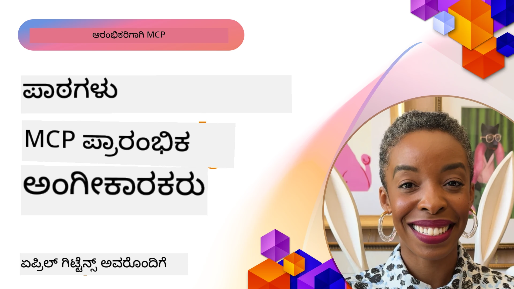

# 🌟 ಆರಂಭಿಕ ಅಡಾಪ್ಟರ್ಸ್‌ನಿಂದ ಪಾಠಗಳು

[](https://youtu.be/jds7dSmNptE)

_(ಈ ಪಾಠದ ವೀಡಿಯೋವನ್ನು ನೋಡುವುದಕ್ಕಾಗಿ ಮೇಲಿನ ಚಿತ್ರವನ್ನು ಕ್ಲಿಕ್ ಮಾಡಿ)_

## 🎯 ಈ ಮೋಡ್ಯೂಲ್ ಒಳಗೊಂಡಿದ್ದದ್ದು ಏನು

ಈ ಮೋಡ್ಯೂಲ್ ಮೌಲಿಕ ಸಂಸ್ಥೆಗಳು ಮತ್ತು ಡೆವಲಪರ್ಗಳು ಎಂಪಿಸಿ (ಮೋಡೆಲ್ ಕಾಂಟೆಕ್ಸ್ ಪ್ರೋಟೋಕಾಲ್) ಯನ್ನು ಹೇಗೆ ಮೂಲ ಸಮಸ್ಯೆಗಳನ್ನು ಪರಿಹರಿಸಲು ಮತ್ತು ಹೊಸತನವನ್ನು ಚಾಲನೆ ಮಾಡಲು ಉಪಯೋಗಿಸುತ್ತಿದ್ದಾರೆ ಎಂಬುದನ್ನು ಅನ್ವೇಷಿಸುತ್ತದೆ. ವಿಶದವಾದ ಪ್ರಕರಣ ಅಧ್ಯಯನಗಳು, ಕೈಗೆಟುಕುವಿರುವ ಪ್ರಾಜೆಕ್ಟ್ಗಳು ಮತ್ತು ಪ್ರಾಯೋಗಿಕ ಉದಾಹರಣೆಗಳ ಮೂಲಕ, ನೀವು ಹೇಗೆ MCP ಸೈಬರ್ ಸುರಕ್ಷಿತ, ವಿಸ್ತರಣೆಗೊಳ್ಳುವ AI ಅಂತರಸಂವಹನವನ್ನು ಸಾಧ್ಯ ಮಾಡುತ್ತದೆ ಎಂದು ಕಂಡುಕೊಳ್ಳುತ್ತೀರಿ, ಇದು ಭಾಷಾ ಮಾದರಿಗಳು, ಸಾಧನಗಳು ಮತ್ತು ಎಂಟರ್ಪ್ರೈಸ್ ಡೇಟಾವನ್ನು ಸಂಪರ್ಕಿಸುತ್ತದೆ.

### 📚 MCP ಅನ್ನು ಕಾರ್ಯವಿಧಾನದಲ್ಲಿ ನೋಡಿ

ನೀವು ಈ ತತ್ವಗಳನ್ನು ಉತ್ಪಾದನ-ತಯಾರ ಸಾಧನಗಳಿಗೆ ಅನ್ವಯಿಸಿದ ಹಾಗೆ ನೋಡಲು ಬಯಸುವಿರಾ? ನಮ್ಮ [**10 ಮೈಕ್ರೋಸಾಫ್ಟ್ MCP ಸರ್ವರ್ಗಳು ಡೆವಲಪರ್ ಉತ್ಪಾದಕತೆಯನ್ನು ಪರಿವರ್ತಿಸುತ್ತಿವೆ**](microsoft-mcp-servers.md) ಅನ್ನು ನೋಡಿ, ಇದರಲ್ಲಿ ನಿಮಗೆ ಇಂದು ಉಪಯೋಗಿಸಬಹುದಾದ ನಿಜವಾದ ಮೈಕ್ರೋಸಾಫ್ಟ್ MCP ಸರ್ವರುಗಳನ್ನೂ ಒಳಗೊಂಡಿದೆ.

## ಅವಲೋಕನ

ಈ ಪಾಠವು ಆರಂಭಿಕ ಅಡಾಪ್ಟರ್ಸ್ ಹೇಗೆ MCP ಯನ್ನು ಉಪಯೋಗಿಸಿ ವಾಸ್ತವಿಕ ಸಮಸ್ಯೆಗಳನ್ನು ಪರಿಹರಿಸಿ ಹಾಗೂ ಕೈಗಾರಿಕೆಗಳಲ್ಲಿ ಹೊಸತನ್ನು ಚಾಲನೆ ಮಾಡಿದ್ದಾರೆ ಎಂಬುದನ್ನು ಪರಿಶೀಲಿಸುತ್ತದೆ. ವಿಶದವಾದ ಪ್ರಕರಣ ಅಧ್ಯಯನಗಳು ಮತ್ತು ಕೈಗೆಟುಕುವಿರುವ ಪ್ರಾಜೆಕ್ಟ್ಗಳ ಮೂಲಕ, ನೀವು ಹೇಗೆ MCP ಒಂದು ಏಕೀಕೃತ ವ್ಯವಹಾರದಲ್ಲಿ ದೊಡ್ಡ ಭಾಷಾ ಮಾದರಿಗಳು, ಸಾಧನಗಳು ಮತ್ತು ಎಂಟರ್ಪ್ರೈಸ್ ಡೇಟಾವನ್ನು ಸಂಪರ್ಕಿಸುವ ನಿಯಮಿತ, ಸುರಕ್ಷಿತ ಮತ್ತು ವಿಸ್ತಾರಗೊಳ್ಳುವ AI ಅಂತರಸಂವಹनವನ್ನು ಸಾಧ್ಯವಾಗಿಸುತ್ತದೆ ಎಂಬುದನ್ನು ನೋಡಬಹುದು. ನೀವು MCP ಆಧಾರಿತ ಪರಿಹಾರಗಳನ್ನು ರೂಪಿಸಿ ನಿರ್ಮಿಸುವ ಪ್ರಾಯೋಗಿಕ ಅನುಭವವನ್ನು ಪಡೆಯುತ್ತೀರಿ, ಸೂಕ್ತ ಅನುಷ್ಠಾನ ಮಾದರಿಗಳಿಂದ ಕಲಿಯುತ್ತೀರಿ ಮತ್ತು ಉತ್ಪಾದನಾ ವಾತಾವರಣದಲ್ಲಿ MCP ಅನ್ನು ನಿಯೋಜಿಸುವ ಉತ್ತಮ ಪದ್ಧತಿಗಳನ್ನು ಅನ್ವೇಷಿಸುತ್ತೀರಿ. ಪಾಠವು ಉದಯೋನ್ಮುಖ ಧೋರಣೆಗಳು, ಭವಿಷ್ಯ ದಿಕ್ಕುಗಳು, ಮತ್ತು ಮುಕ್ತ-ಮೂಲ ಸಂಪನ್ಮೂಲಗಳನ್ನು ಕೂಡ ಹೇಳಿಕೆಯಾಗಿಸುತ್ತದೆ, ಇದು ನಿಮಗೆ MCP ತಂತ್ರಜ್ಞಾನ ಮತ್ತು ಅದರ ಪರಿವರ್ತನೆಯ ಇಕೋಸಿಸ್ಟಮ್‌ನ ಮುಂಚೂಣಿಯಲ್ಲಿ ಇರಲು ಸಹಾಯ ಮಾಡುತ್ತದೆ.

## ಕಲಿಕಾ ಗುರಿಗಳು

- ವಿಭಿನ್ನ ಕೈಗಾರಿಕೆಗಳಲ್ಲಿ ವಾಸ್ತವಿಕ MCP ಅನುಷ್ಠಾನಗಳನ್ನು ವಿಶ್ಲೇಷಿಸಿ
- ಪೂರ್ಣ MCP ಆಧಾರಿತ ಅಪ್ಲಿಕೇಶನ್‌ಗಳನ್ನು ವಿನ್ಯಾಸಗೊಳಿಸಿ ಮತ್ತು ನಿರ್ಮಿಸಿ
- MCP ತಂತ್ರಜ್ಞಾನದಲ್ಲಿ ಉದಯೋನ್ಮುಖ ಧೋರಣೆಗಳು ಮತ್ತು ಭವಿಷ್ಯ ದಿಕ್ಕುಗಳನ್ನು ಅನ್ವೇಷಿಸಿ
- ವಾಸ್ತವಿಕ ಅಭಿವೃದ್ಧಿ ಪರಿಸರಗಳಲ್ಲಿ ಉತ್ತಮ ಅಭ್ಯಾಸಗಳನ್ನು ಅನ್ವಯಿಸಿ

## ವಾಸ್ತವಿಕ MCP ಅನುಷ್ಠಾನಗಳು

### ಪ್ರಕರಣ ಅಧ್ಯಯನ 1: ಎಂಟರ್ಪ್ರೈಸ್ ಗ್ರಾಹಕ ಬೆಂಬಲ ಸ್ವಯಂಚಾಲಿತ

ಒಂದು ಬಹುರಾಷ್ಟ್ರೀಯ ಸಂಸ್ಥೆ MCP ಆಧಾರಿತ ಪರಿಹಾರವನ್ನು ಜಾರಿಗೆ ತಂದು, ತಮ್ಮ ಗ್ರಾಹಕ ಬೆಂಬಲ ವ್ಯವಸ್ಥೆಗಳ ನಡುವೆ AI ಸಂವಹನಗಳನ್ನು ನಿಯಮೀಕರಿಸಲು. ಇದರಿಂದ ಅವರಿಗೆ ಸಾಧ್ಯವಾಯಿತು:

- ಹಲವಾರು LLM ಒದಗಿಸುವವರಿಗಾಗಿ ಏಕರೂಪದ ಇಂಟರ್ಫೇಸ್ ರಚಿಸಲಾಗಿದೆ
- ಇಲಾಖೆಗಳಾದ್ಯಾಂತ ಸತತ ಪ್ರಾಂಪ್ಟ್ ನಿರ್ವಹಣೆ ನಿರ್ವಹಣೆ
- ದುರ್ಬಲ ಭದ್ರತೆ ಮತ್ತು ಅನುಕ್ರಮಣ ನಿಯಂತ್ರಣಗಳನ್ನು ಜಾರಿ ಮಾಡಲಾಗಿದೆ
- ವಿಶೇಷ ಅಗತ್ಯಗಳ ಆಧಾರದ ಮೇಲೆ ವಿಭಿನ್ನ AI ಮಾದರಿಗಳಿಗೆ ಸುಲಭವಾಗಿ ಬದಲಾಯಿಸಲು

**ತಂತ್ರಜ್ಞಾನ ಅನುಷ್ಠಾನ:**

```python
# ಗ್ರಾಹಕ ಬೆಂಬಲಕ್ಕಾಗಿ Python MCP ಸರ್ವರ್ ಅನುಷ್ಠಾನ
import logging
import asyncio
from modelcontextprotocol import create_server, ServerConfig
from modelcontextprotocol.server import MCPServer
from modelcontextprotocol.transports import create_http_transport
from modelcontextprotocol.resources import ResourceDefinition
from modelcontextprotocol.prompts import PromptDefinition
from modelcontextprotocol.tool import ToolDefinition

# ಲಾಗಿಂಗ್ ಅನ್ನು ಸಂರಚಿಸಿ
logging.basicConfig(level=logging.INFO)

async def main():
    # ಸರ್ವರ್ ಸಂರಚನೆ ರಚಿಸಿ
    config = ServerConfig(
        name="Enterprise Customer Support Server",
        version="1.0.0",
        description="MCP server for handling customer support inquiries"
    )
    
    # MCP ಸರ್ವರ್ ಅನ್ನು ಪ್ರಾರಂಭಿಸಿ
    server = create_server(config)
    
    # ಜ್ಞಾನ ಆಧಾರ ಸಂಪನ್ಮೂಲಗಳನ್ನು ನೋಂದಾಯಿಸಿ
    server.resources.register(
        ResourceDefinition(
            name="customer_kb",
            description="Customer knowledge base documentation"
        ),
        lambda params: get_customer_documentation(params)
    )
    
    # ಪ್ರಾಂಪ್ಟ್ ಟೆಂಪ್ಲೇಟುಗಳನ್ನು ನೋಂದಾಯಿಸಿ
    server.prompts.register(
        PromptDefinition(
            name="support_template",
            description="Templates for customer support responses"
        ),
        lambda params: get_support_templates(params)
    )
    
    # ಬೆಂಬಲ ಉಪಕರಣಗಳನ್ನು ನೋಂದಾಯಿಸಿ
    server.tools.register(
        ToolDefinition(
            name="ticketing",
            description="Create and update support tickets"
        ),
        handle_ticketing_operations
    )
    
    # HTTP ಸಾರಿಗೆೊಂದಿಗೆ ಸರ್ವರ್ ಆರಂಭಿಸಿ
    transport = create_http_transport(port=8080)
    await server.run(transport)

if __name__ == "__main__":
    asyncio.run(main())
```

**ಫಲಿತಾಂಶಗಳು:** ಮಾದರಿ ವೆಚ್ಚಗಳಲ್ಲಿ 30% ಕಡಿತ, ಪ್ರತಿಕ್ರಿಯೆಯ ಸತತತೆಯಲ್ಲಿ 45% ಸುಧಾರಣೆ, ಮತ್ತು ಜಾಗತಿಕ ಕಾರ್ಯಾಚರಣೆಗಳಲ್ಲಿ ಅನುಕ್ರಮಣ ಸುಧಾರಣೆ.

### ಪ್ರಕರಣ ಅಧ್ಯಯನ 2: ಆರೋಗ್ಯ ತಪಾಸಣೆ ಸಹಾಯಕ

ಒಂದು ಆರೋಗ್ಯ ಸೇವಾ ಒದಗಿಸುವವರು ಹಲವು ವಿಶೇಷ ವೈದ್ಯಕೀಯ AI ಮಾದರಿಗಳನ್ನು ಸಂಯೋಜಿಸಲು MCP ಇನ್‌ಫ್ರಾಸ್ಟ್ರಕ್ಚರ್ ಅನ್ನು ಅಭಿವೃದ್ಧಿಪಡಿಸಿದ್ದಾರೆ ಹಾಗು ಸಂವೇದನಶೀಲ ರೋಗಿಗಳ ಡೇಟಾವನ್ನು ರಕ್ಷಿಸಿವೆ:

- ಸಾಮಾನ್ಯ ಮತ್ತು ವಿಶೇಷ ವೈದ್ಯಕೀಯ ಮಾದರಿಗಳ ನಡುವೆ ಸುಗಮ ಬದಲಿ
- ಕಠಿಣ ಗೌಪ್ಯತಾ ನಿಯಂತ್ರಣಗಳು ಮತ್ತು ಅಧಿಕೃತ ದಾಖಲೆಗಳು
- ಇಲೆಕ್ಟ್ರಾನಿಕ್ ಹೆಲ್ತ್ ರೆಕಾರ್ಡ್ (EHR) ವ್ಯವಸ್ಥೆಗಳೊಂದಿಗೆ ಸಂಯೋಜನೆ
- ವೈದ್ಯಕೀಯ ಪದಜಾಲಕ್ಕೆ ಎಂದುವೇಳು ಸತತ ಪ್ರಾಂಪ್ಟ್ ಎಂಜಿನಿಯರಿಂಗ್

**ತಂತ್ರಜ್ಞಾನ ಅನುಷ್ಠಾನ:**

```csharp
// C# MCP host application implementation in healthcare application
using Microsoft.Extensions.DependencyInjection;
using ModelContextProtocol.SDK.Client;
using ModelContextProtocol.SDK.Security;
using ModelContextProtocol.SDK.Resources;

public class DiagnosticAssistant
{
    private readonly MCPHostClient _mcpClient;
    private readonly PatientContext _patientContext;
    
    public DiagnosticAssistant(PatientContext patientContext)
    {
        _patientContext = patientContext;
        
        // Configure MCP client with healthcare-specific settings
        var clientOptions = new ClientOptions
        {
            Name = "Healthcare Diagnostic Assistant",
            Version = "1.0.0",
            Security = new SecurityOptions
            {
                Encryption = EncryptionLevel.Medical,
                AuditEnabled = true
            }
        };
        
        _mcpClient = new MCPHostClientBuilder()
            .WithOptions(clientOptions)
            .WithTransport(new HttpTransport("https://healthcare-mcp.example.org"))
            .WithAuthentication(new HIPAACompliantAuthProvider())
            .Build();
    }
    
    public async Task<DiagnosticSuggestion> GetDiagnosticAssistance(
        string symptoms, string patientHistory)
    {
        // Create request with appropriate resources and tool access
        var resourceRequest = new ResourceRequest
        {
            Name = "patient_records",
            Parameters = new Dictionary<string, object>
            {
                ["patientId"] = _patientContext.PatientId,
                ["requestingProvider"] = _patientContext.ProviderId
            }
        };
        
        // Request diagnostic assistance using appropriate prompt
        var response = await _mcpClient.SendPromptRequestAsync(
            promptName: "diagnostic_assistance",
            parameters: new Dictionary<string, object>
            {
                ["symptoms"] = symptoms,
                patientHistory = patientHistory,
                relevantGuidelines = _patientContext.GetRelevantGuidelines()
            });
            
        return DiagnosticSuggestion.FromMCPResponse(response);
    }
}
```

**ಫಲಿತಾಂಶಗಳು:** ವೈದ್ಯರಿಗಾಗಿ ಸುಧಾರಿತ ತಪಾಸಣಾ ಸಲಹೆಗಳು HIPAA ಸಂಪೂರ್ಣ ಅನುಗುಣತೆ ಜೊತೆಗೆ ಮತ್ತು ವ್ಯವಸ್ಥೆಗಳ ನಡುವಣ ನಿರಂತರ-ಬದಲಾವಣೆ ಕಡಿತ.

### ಪ್ರಕರಣ ಅಧ್ಯಯನ 3: ಹಣಕಾಸು ಸೇವೆಗಳು ಅಪಾಯ ವಿಶ್ಲೇಷಣೆ

ಒಂದು ಹಣಕಾಸು ಸಂಸ್ಥೆ MCP ಅನ್ನು ಜಾರಿಗೆ ತಂದು ವಿಭಿನ್ನ ಇಲಾಖೆಗಳ ಅಪಾಯ ವಿಶ್ಲೇಷಣಾ ಪ್ರಕ್ರಿಯೆಗಳ ನಿಯಮೀಕರಣಕ್ಕಾಗಿ:

- ಕ್ರೆಡಿಟ್ ಅಪಾಯ, ಜಾಲತಾಣ ಪತ್ತೆ, ಮತ್ತು ಹೂಡಿಕೆಯ ಅಪಾಯ ಮಾದರಿಗಳಿಗಾಗಿ ಏಕರೂಪದ ಇಂಟರ್ಫೇಸ್ ರಚನೆ
- ಕಠಿಣ ಪ್ರವೇಶ ನಿಯಂತ್ರಣಗಳು ಮತ್ತು ಮಾದರಿ ಆವೃತ್ತಿ ನಿರ್ವಹಣೆ ಜಾರಿಗೆ
- ಎಲ್ಲಾ AI ಶಿಫಾರಸ್ಸುಗಳಿಗೂ ಪರಿಶೀಲನೆ ಸಾಧ್ಯತೆ
- ವಿಭಿನ್ನ ವ್ಯವಸ್ಥೆಗಳಲ್ಲಿ ಸತತ ಡೇಟಾ ಸ್ವರೂಪಣ

**ತಂತ್ರಜ್ಞಾನ ಅನುಷ್ಠಾನ:**

```java
// ಆರ್ಥಿಕ ಅಪಾಯ ಮೌಲ್ಯಮಾಪನಕ್ಕಾಗಿ ಜಾವಾ MCP ಸರ್ವರ್
import org.mcp.server.*;
import org.mcp.security.*;

public class FinancialRiskMCPServer {
    public static void main(String[] args) {
        // ಆರ್ಥಿಕ ಅನುಕೂಲತಾ ವೈಶಿಷ್ಟ್ಯಗಳೊಂದಿಗೆ MCP ಸರ್ವರ್ ರಚಿಸಿ
        MCPServer server = new MCPServerBuilder()
            .withModelProviders(
                new ModelProvider("risk-assessment-primary", new AzureOpenAIProvider()),
                new ModelProvider("risk-assessment-audit", new LocalLlamaProvider())
            )
            .withPromptTemplateDirectory("./compliance/templates")
            .withAccessControls(new SOCCompliantAccessControl())
            .withDataEncryption(EncryptionStandard.FINANCIAL_GRADE)
            .withVersionControl(true)
            .withAuditLogging(new DatabaseAuditLogger())
            .build();
            
        server.addRequestValidator(new FinancialDataValidator());
        server.addResponseFilter(new PII_RedactionFilter());
        
        server.start(9000);
        
        System.out.println("Financial Risk MCP Server running on port 9000");
    }
}
```

**ಫಲಿತಾಂಶಗಳು:** ನಿಯಮಾನುಗುಣತೆಗಾಗಿ ಸುಧಾರಣೆ, 40% ವೇಗದ ಮಾದರಿ ನಿಯೋಜನೆ ಚಕ್ರಗಳು ಮತ್ತು ಇಲಾಖೆಗಳ ಮಧ್ಯೆ ಅಪಾಯ ಮೌಲ್ಯಮಾಪನ ಸತತತೆ ಉನ್ನತಮಾಡಲಾಗಿದೆ.

### ಪ್ರಕರಣ ಅಧ್ಯಯನ 4: ಮೈಕ್ರೋಸಾಫ್ಟ್ ಪ್ಲೇ ರೈಟ್ MCP ಸರ್ವರ್ ಬ್ರೌಸರ್ ಸ್ವಯಂಚಾಲನೆಗಾಗಿ

ಮೈಕ್ರೋಸಾಫ್ಟ್ [ಪ್ಲೇ ರೈಟ್ MCP ಸರ್ವರ್](https://github.com/microsoft/playwright-mcp) ಅನ್ನು ಮಾದರಿ ಕಾಂಟೆಕ್ಸ್ ಪ್ರೋಟೋಕಾಲ್ ಮೂಲಕ ಸುರಕ್ಷಿತ, ನಿಯಮಿತ ಬ್ರೌಸರ್ ಸ್ವಯಂಚಾಲನೆಗೆ ಅನುಕೂಲವಾಗುವಂತೆ ಅಭಿವೃದ್ಧಿಪಡಿಸಿದೆ. ಈ ಉತ್ಪಾದನಾ ಸಿದ್ಧ ಸರ್ವರ್ AI ಏಜೆಂಟ್ಗಳು ಮತ್ತು LLM ಗಳಿಗೆ ವೆಬ್ ಬ್ರೌಸರ್‌ಗಳ ಜೊತೆ ನಿಯಂತ್ರಿತ, ಪರಿಶೀಲಿಸಬಹುದಾದ ಮತ್ತು ವಿಸ್ತರಿಸಬಹುದಾದ ರೀತಿಯಲ್ಲಿ ಸಂವಾದ ಮಾಡಲು ಅವಕಾಶ ಒದಗಿಸುತ್ತದೆ — ಸ್ವಯಂಚಾಲಿತ ವೆಬ್ ಪರೀಕ್ಷೆ, ಡೇಟಾ ತೆಗೆಯುವಿಕೆ, ಮತ್ತು ಪೂರ್ಣ ಮಾಗಿನ ಕಾರ್ಯಪ್ರವಾಹಗಳಂತಹ ಉಪಯೋಗ ಪ್ರಕರಣಗಳಿಗೆ ಅನುಕೂಲವನ್ನು ಕಲ್ಪಿಸುತ್ತದೆ.

> **🎯 ಉತ್ಪಾದನಾ ಸಿದ್ಧ ಸಾಧನ**
> 
> ಈ ಪ್ರಕರಣ ಅಧ್ಯಯನವು ನೀವು ಇಂದೇ ಉಪಯೋಗಿಸಬಹುದಾದ ನಿಜವಾದ MCP ಸರ್ವರ್ ಅನ್ನು ಪ್ರದರ್ಶಿಸುತ್ತದೆ! ನಮ್ಮ [**ಮೈಕ್ರೋಸಾಫ್ಟ್ MCP ಸರ್ವರ್ಗಳ ಮಾರ್ಗದರ್ಶಿ**](microsoft-mcp-servers.md#8--playwright-mcp-server) ನಲ್ಲಿ ಪ್ಲೇ ರೈಟ್ MCP ಸರ್ವರ್ ಮತ್ತು ಇತರ 9 ಉತ್ಪಾದನಾ ಸಿದ್ಧ ಮೈಕ್ರೋಸಾಫ್ಟ್ MCP ಸರ್ವರ್ಗಳ ಬಗ್ಗೆ ತಿಳಿದುಕೊಳ್ಳಿ.

**ಮುಖ್ಯ ವೈಶಿಷ್ಟ್ಯಗಳು:**
- ಬ್ರೌಸರ್ ಸ್ವಯಂಚಾಲನೆ ಸಾಮರ್ಥ್ಯಗಳನ್ನು (ನಾವಿಗೇಶನ್, ಫಾರ್ಮ್ ಭರ್ತಿ, ಸ್ಕ್ರೀನ್ ಶಾಟ್ ಸೆರೆತುವುದು ಇತ್ಯಾದಿ) MCP ಸಾಧನಗಳಾಗಿ ಪ್ರದರ್ಶಿಸುತ್ತದೆ
- ಅನಧಿಕೃತ ಕ್ರಿಯೆಗಳ ತಡೆಗೆ ನಿಯಮಿತ ಪ್ರವೇಶ ನಿಯಂತ್ರಣಗಳು ಮತ್ತು ಸ್ಯಾಂಡ್‌ಬಾಕ್ಸಿಂಗ್ ಜಾರಿಗೊಳಿಸುತ್ತದೆ
- ಎಲ್ಲಾ ಬ್ರೌಸರ್ ಸಂವಾದಗಳಿಗಾಗಿ ವಿಸ್ತೃತ ಪರಿಶೀಲನೆ ದಾಖಲೆಗಳನ್ನು ಒದಗಿಸುತ್ತದೆ
- ಏಜಂಟ್ ಚಾಲಿತ ಸ್ವಯಂಚಲಿತಕ್ಕಾಗಿ ಅಜ್ಯುರ್ ಓಪನ್AI ಮತ್ತು ಇತರೆ LLM ಒದಗಿಸುವವರ ಜೊತೆಗೆ ಸಂಯೋಜನೆಯನ್ನು ಬೆಂಬಲಿಸುತ್ತದೆ
- GitHub ಕೋಪಿಲಾಟ್‌ನ ಕೋಡಿಂಗ್ ಏಜೆಂಟ್ಗೆ ವೆಬ್ ಬ್ರೌಸಿಂಗ್ ಸಾಮರ್ಥ್ಯಗಳನ್ನು ಪೂರೈಸುತ್ತದೆ

**ತಂತ್ರಜ್ಞಾನ ಅನುಷ್ಠಾನ:**

```typescript
// ಟೈಪ್‌ಸ್ಕ್ರಿಪ್ಟ್: MCP ಸರ್ವರ್‌ನಲ್ಲಿ ಪ್ಲೇರೈಟ್ ಬ್ರೌಸರ್ ಸ್ವಯಂಚಾಲಿತ ابزارಗಳನ್ನು ನೋಂದಣಿ ಮಾಡಲಾಗುತ್ತಿದೆ
import { createServer, ToolDefinition } from 'modelcontextprotocol';
import { launch } from 'playwright';

const server = createServer({
  name: 'Playwright MCP Server',
  version: '1.0.0',
  description: 'MCP server for browser automation using Playwright'
});

// URL ಗೆ ಸಾಗಿಸಲು ಮತ್ತು ಸ್ಕ್ರೀನ್‌ಶಾಟ್ ಸೆರೆಹಿಡಿಯಲು ಒಂದು ಉಪಕರಣವನ್ನು ನೋಂದಣಿ ಮಾಡಿ
server.tools.register(
  new ToolDefinition({
    name: 'navigate_and_screenshot',
    description: 'Navigate to a URL and capture a screenshot',
    parameters: {
      url: { type: 'string', description: 'The URL to visit' }
    }
  }),
  async ({ url }) => {
    const browser = await launch();
    const page = await browser.newPage();
    await page.goto(url);
    const screenshot = await page.screenshot();
    await browser.close();
    return { screenshot };
  }
);

// MCP ಸರ್ವರ್ ಪ್ರಾರಂಭಿಸಿ
server.listen(8080);
```

**ಫಲಿತಾಂಶಗಳು:**

- AI ಏಜೆಂಟ್ಗಳ ಮತ್ತು LLM ಗಳಿಗಾಗಿ ಸುರಕ್ಷಿತ, ಕ್ರಮಬದ್ಧ ಬ್ರೌಸರ್ ಸ್ವಯಂಚಾಲನೆ ಸಾದ್ಯವಾಯಿತು
- ಕೈಯಲ್ಲಿನ ಪರೀಕ್ಷಾ ಪ್ರಯತ್ನ ಕಡಿಮೆಯಾಯಿತು ಮತ್ತು ವೆಬ್ ಅಪ್ಲಿಕೇಶನ್‌ಗಳಿಗಾಗಿ ಪರೀಕ್ಷಾ ವ್ಯಾಪ್ತಿಯನ್ನು ಸುಧಾರಿಸಲಾಗಿದೆ
- ಎಂಟರ್ಪ್ರೈಸ್ ವಾತಾವರಣಗಳಲ್ಲಿನ ಬ್ರೌಸರ್ ಆಧಾರಿತ ಸಾಧನ ಸಂಯೋಜನೆಗೆ ಪುನಃಬಳಕೆ ಮಾಡಬಹುದಾದ, ವಿಸ್ತರಿಸಬಹುದಾದ ಸಂರಚನೆಯನ್ನು ಒದಗಿಸಲಾಗಿದೆ
- GitHub ಕೋಪಿಲಾಟ್‌ನ ವೆಬ್ ಬ್ರೌಸಿಂಗ್ ಸಾಮರ್ಥ್ಯಗಳನ್ನು ಸಕ್ರಿಯಗೊಳಿಸುತ್ತದೆ

**ರೆಫರೆನ್ಸುಗಳು:**

- [ಪ್ಲೇ ರೈಟ್ MCP ಸರ್ವರ್ GitHub ಸಂಗ್ರಹಣೆ](https://github.com/microsoft/playwright-mcp)
- [ಮೈಕ್ರೋಸಾಫ್ಟ್ AI ಮತ್ತು ಸ್ವಯಂಚಾಲಿತ ಪರಿಹಾರಗಳು](https://azure.microsoft.com/en-us/products/ai-services/)

### ಪ್ರಕರಣ ಅಧ್ಯಯನ 5: ಅಜ್ಯುರ್ MCP – ಎಂಟರ್ಪ್ರೈಸ್-ಗುಣಮಟ್ಟದ MCP ಸೇವೆಯಾಗಿ

ಅಜ್ಯುರ್ MCP ಸರ್ವರ್ ([https://aka.ms/azmcp](https://aka.ms/azmcp)) ಮೈಕ್ರೋಸಾಫ್ಟ್ ನ ನಿರ್ವಹಿತ, ಎಂಟರ್ಪ್ರೈಸ್-ಗುಣಮಟ್ಟದ MCP ಅನುಷ್ಠಾನವಾಗಿದ್ದು, ಕ್ಲೌಡ್ ಸೇವೆಯಾಗಿ ವಿಸ್ತರಣೀಯ, ಸುರಕ್ಷಿತ ಮತ್ತು ಅನುಗುಣ MCP ಸರ್ವರ್ ಸಾಮರ್ಥ್ಯಗಳನ್ನು ಒದಗಿಸುವಂತೆ ವಿನ್ಯಾಸಗೊಳಿಸಲಾಗಿದೆ. ಅಜ್ಯುರ್ MCP ಸಂಸ್ಥೆಗಳಿಗೆ MCP ಸರ್ವರ್‌ಗಳನ್ನು ಶೀಘ್ರವಾಗಿ ನಿಯೋಜಿಸುವ, ನಿರ್ವಹಿಸುವ ಮತ್ತು ಅಜ್ಯುರ್ AI, ಡೇಟಾ ಮತ್ತು ಭದ್ರತಾ ಸೇವೆಗಳೊಂದಿಗೆ ಸಂಯೋಜಿಸುವ ಅವಕಾಶ ನೀಡುತ್ತದೆ, ಕಾರ್ಯಾಚರಣೆ ಮೇಲ್ವಿಚಾರಣೆಯನ್ನು ಕಡಿಮೆ ಮಾಡಿ AI ಆಳವಾಗಿ ಸ್ವೀಕೃತಿಯನ್ನು ವೇಗಗೊಳಿಸುತ್ತದೆ.

> **🎯 ಉತ್ಪಾದನಾ ಸಿದ್ಧ ಸಾಧನ**
> 
> ಇದು ನೀವು ಇಂದೇ ಉಪಯೋಗಿಸಬಹುದಾದ ನಿಜವಾದ MCP ಸರ್ವರ್! ನಮ್ಮ [**ಮೈಕ್ರೋಸಾಫ್ಟ್ MCP ಸರ್ವರ್ಗಳ ಮಾರ್ಗದರ್ಶಿ**](microsoft-mcp-servers.md) ನಲ್ಲಿ ಮೈಕ್ರೋಸಾಫ್ಟ್ ಫೌಂಡ್ರಿ MCP ಸರ್ವರ್ ಬಗ್ಗೆ ತಿಳಿದುಕೊಳ್ಳಿ.


- ಪೂರ್ಣವಾಗಿ ನಿರ್ವಹಿಸಲ್ಪಟ್ಟ MCP ಸರ್ವರ್ հೋಸ್ಟಿಂಗ್, ಮೆಗುಡಿಕೆ, ಮೇಲ್ವಿಚಾರಣೆ ಮತ್ತು ಭದ್ರತೆಯೊಂದಿಗೆ  
- ಅಜ್ಯುರ್ ಓಪನ್AI, ಅಜ್ಯುರ್ AI ಸರ್ಚ್ ಮತ್ತು ಇತರೆ ಅಜ್ಯುರ್ ಸೇವೆಗಳೊಂದಿಗೆ ಸ್ಥಳೀಯ ಸಂಯೋಜನೆ  
- ಮೈಕ್ರೋಸಾಫ್ಟ್ ಎಂಟ್ರಾ ID ಮೂಲಕ ಎಂಟರ್ಪ್ರೈಸ್ ಪ್ರಮಾಣೀಕರಣ ಮತ್ತು ಪ್ರಾಧಿಕಾರ   
- ಕಸ್ಟಮ್ ಸಾಧನಗಳು, ಪ್ರಾಂಪ್ಟ್ ಟೆಂಪ್ಲೇಟುಗಳು ಮತ್ತು ಸಂಪನ್ಮೂಲ ಕನೆಕ್ಟರ್‌ಗಳಿಗೆ ಬೆಂಬಲ   
- ಎಂಟರ್ಪ್ರೈಸ್ ಭದ್ರತಾ ಮತ್ತು ನಿಯಾಮಕ ಅವಶ್ಯಕತೆಗಳಿಗೆ ಅನುಗುಣತೆ  

**ತಂತ್ರಜ್ಞಾನ ಅನುಷ್ಠಾನ:**

```yaml
# Example: Azure MCP server deployment configuration (YAML)
apiVersion: mcp.microsoft.com/v1
kind: McpServer
metadata:
  name: enterprise-mcp-server
spec:
  modelProviders:
    - name: azure-openai
      type: AzureOpenAI
      endpoint: https://<your-openai-resource>.openai.azure.com/
      apiKeySecret: <your-azure-keyvault-secret>
  tools:
    - name: document_search
      type: AzureAISearch
      endpoint: https://<your-search-resource>.search.windows.net/
      apiKeySecret: <your-azure-keyvault-secret>
  authentication:
    type: EntraID
    tenantId: <your-tenant-id>
  monitoring:
    enabled: true
    logAnalyticsWorkspace: <your-log-analytics-id>
```

**ಫಲಿತಾಂಶಗಳು:**  
- ಎಂಟರ್ಪ್ರೈಸ್ AI ಯೋಜನೆಗಳಿಗೆ ತ್ವರಿತ ಮೌಲ್ಯ ಪ್ರಾಪ್ತಿಗಾಗಿ ಸಿದ್ಧವಾದ, ಅನುಗುಣ MCP ಸರ್ವರ್ ವೇದಿಕೆಯ ಒದಗಿಸುವಿಕೆ  
- LLM ಗಳು, ಸಾಧನಗಳು ಮತ್ತು ಎಂಟರ್ಪ್ರೈಸ್ ಡೇಟಾ ಮೂಲಗಳ ಸರಳ ಸಂಯೋಜನೆ  
- MCP ಕೆಲಸಗಳಿಗೆ ಸುಧಾರಿತ ಭದ್ರತೆ, ಪರಿಶೀಲನೆ ಮತ್ತು ಕಾರ್ಯಾಚರಣೆ ದಕ್ಷತೆ  
- ಅಜ್ಯುರ್ SDK ಉತ್ತಮ ಅಭ್ಯಾಸಗಳು ಮತ್ತು ಆಧುನಿಕ ಪ್ರಮಾಣೀಕರಣ ಮಾದರಿಗಳೊಂದಿಗೆ ಸುಧಾರಿತ ಕೋಡ್ ಗುಣಮಟ್ಟ  

**ರೆಫರೆನ್ಸುಗಳು:**  
- [ಅಜ್ಯುರ್ MCP ಡಾಕ್ಯುಮೆಂಟೇಶನ್](https://aka.ms/azmcp)
- [ಅಜ್ಯುರ್ MCP ಸರ್ವರ್ GitHub ಸಂಗ್ರಹಣೆ](https://github.com/Azure/azure-mcp)
- [ಅಜ್ಯುರ್ AI ಸೇವೆಗಳು](https://azure.microsoft.com/en-us/products/ai-services/)
- [ಮೈಕ್ರೋಸಾಫ್ಟ್ MCP ಕೇಂದ್ರ](https://mcp.azure.com)

## ಪ್ರಕರಣ ಅಧ್ಯಯನ 6: NLWeb
MCP (ಮೋಡೆಲ್ ಕಾಂಟೆಕ್ಸ್ ಪ್ರೋಟೋಕಾಲ್) ಚಾಟ್‌ಬಾಟ್‌ಗಳು ಮತ್ತು AI ಸಹಾಯಕರು ಸಾಧನಗಳೊಂದಿಗೆ ಸಂವಹನ ಮಾಡಲು ಸಂಪ್ರತಿಷ್ಠಿತ ಪ್ರೋಟೋಕಾಲ್ ಆಗಿದೆ. ಪ್ರತಿ NLWeb ಉದಾಹರಣೆ ಕೂಡ MCP ಸರ್ವರ್ ಆಗಿದ್ದು, ಒಂದು ಕೋರ್ ವಿಧಾನವನ್ನು ಬೆಂಬಲಿಸುತ್ತದೆ, 'ask', ಅದು ವೆಬ್‍ಸೈಟ್‌ಗೆ ಸಹಜ ಭಾಷೆಯಲ್ಲಿ ಪ್ರಶ್ನೆ ಕೇಳಲು ಉಪಯೋಗಿಸಲಾಗುತ್ತದೆ. ಲಭ್ಯವಾದ ಪ್ರತಿಕ್ರಿಯೆ schema.org ಅನ್ನು ಬಳಸಿ, ಇದು ವೆಬ್ ಡೇಟಾವನ್ನು ವರ್ಣಿಸಲು ವ್ಯಾಪಕವಾಗಿ ಬಳಸುವ ಪದಸಂಕಲನ. ಸಡಿಲವಾಗಿ ಹೇಳುವುದಾದರೆ, MCP ನlWebಕ್ಕಿಂತ Http Html ಗೆ ಇರುವ ಸಂಬಂಧೆಯಂತೆ ಇದೆ. NLWeb ಪ್ರೋಟокол್‌ಗಳು, schema.org ಸ್ವರೂಪಗಳು ಮತ್ತು ಮಾದರಿ ಕೋಡ್ ಅನ್ನು ಸಂಯೋಜಿಸಿ, ತ್ವರಿತವಾಗಿ ಈ ಅಂತ್ಯಬಿಂದುಗಳನ್ನು ರಚಿಸಲು ಸಹಾಯ ಮಾಡುತ್ತದೆ, ಇದು ಕನ್ಸರ್ವೇಶನಲ್ ಇಂಟರ್ಫೇಸ್ಗಳ ಮೂಲಕ ಮಾನವರಿಗೆ ಮತ್ತು ನೈಸರ್ಗಿಕ ಏಜೆಂಟ್-ನೇರ ಏಜೆಂಟ್ ಸಂವಹನದ ಮೂಲಕ ಯಂತ್ರಗಳಿಗೆ ಲಾಭದಾಯಕವಾಗಿದೆ.

NLWeb ಗೆ ಎರಡು ವಿಭಿನ್ನ ಘಟಕಗಳಿವೆ.
- ಒಂದು ಪ್ರೋಟೋಕಾಲ್, ಬಹಳ ಸರಳವಾದ ಪ್ರಾರಂಭಕ್ಕೆ, ನೈಸರ್ಗಿಕ ಭಾಷೆಯಲ್ಲಿ ಸೈಟ್ ಜೊತೆಗೆ ಸಂವಹನ ಮಾಡಲು ಮತ್ತು ಪ್ರತಿಕ್ರಿಯೆಗೆ json ಮತ್ತು schema.org ಸ್ವರೂಪಗಳನ್ನು ಉಪಯೋಗಿಸುವುದು. ಹೆಚ್ಚಿನ ವಿವರಗಳಿಗೆ REST API ಮುಖಾಂತರ ದಾಖಲೆ ಸೈಟ್ ನೋಡಿ.
- (1) ರ ಸರಳ ಅನುಷ್ಠಾನ, ಇದರಲ್ಲಿ ಇದ್ದ ಅಂಕಿ-ಅಂಶಗಳನ್ನು ಪಟ್ಟಿ ರೂಪದಲ್ಲಿ ಹೊಂದಿರುವ ಸೈಟ್‌ಗಳನ್ನು ನಿರೂಪಿಸಲು ಅಸ್ತಿತ್ವದಲ್ಲಿರುವ ಮಾರ್ಕಪ್ ಬಳಸಿ. ಬಳಕೆದಾರ ಇಂಟರ್ಫೇಸ್ ವಿದ್ಜೆಟ್ಸ್ ಒಂದೂಟದ ಜೊತೆ ಕೈಗಿನ ವಿಷಯಗಳಿಗೆ ಸಂಭಾಷಣಾತ್ಮಕ ಇಂಟರ್ಫೇಸ್‌ಗಳನ್ನು ಸುಲಭವಾಗಿ ಒದಗಿಸಲಾಗುತ್ತದೆ. ಇದರ ಕಾರ್ಯವಿಧಾನ ಹೇಗಿದೆ ಎಂಬುದರ ಪರಿಶೀಲನೆಗಳಿಗೆ Life of a chat query ಕುರಿತು ದಾಖಲೆ ನೋಡಿ.
 
**ರೆಫರೆನ್ಸುಗಳು:**  
- [ಅಜ್ಯುರ್ MCP ಡಾಕ್ಯುಮೆಂಟೇಶನ್](https://aka.ms/azmcp)
- [NLWeb](https://github.com/microsoft/NlWeb)

### ಪ್ರಕರಣ ಅಧ್ಯಯನ 7: ಮೈಕ್ರೋಸಾಫ್ಟ್ ಫೌಂಡ್ರಿ MCP ಸರ್ವರ್ – ಎಂಟರ್ಪ್ರೈಸ್ AI ಏಜೆಂಟ್ ಸಂಯೋಜನೆ

ಮೈಕ್ರೋಸಾಫ್ಟ್ ಫೌಂಡ್ರಿ MCP ಸರ್ವರುಗಳು ಎಂಟರ್ಪ್ರೈಸ್ ವಾತಾವರಣಗಳಲ್ಲಿ AI ಏಜೆಂಟ್‌ಗಳು ಮತ್ತು ಕಾರ್ಯಪ್ರವಾಹಗಳನ್ನು ಹೇಗೆ ಸಂಯೋಜಿಸಿ ನಿರ್ವಹಿಸಬಹುದು ಎಂದು ಪ್ರದರ್ಶಿಸುತ್ತವೆ. MCP ನೊಂದಿಗೆ ಮೈಕ್ರೋಸಾಫ್ಟ್ ಫೌಂಡ್ರಿ ಯನ್ನು ಸಂಯೋಜಿಸುವ ಮೂಲಕ, ಸಂಸ್ಥೆಗಳು ಏಜೆಂಟ್ ಸಂವಹನಗಳನ್ನು ನಿಯಮೀಕರಿಸಬಹುದು, ಫೌಂಡ್ರಿಯ ಕಾರ್ಯಪ್ರವಾಹ ನಿರ್ವಹಣೆಯನ್ನು ಉಪಯೋಗಿಸಬಹುದು ಮತ್ತು ಸುರಕ್ಷಿತ, ವಿಸ್ತಾರಗೊಳ್ಳುವ ನಿಯೋಜನೆಗಳನ್ನು ಖಚಿತಪಡಿಸಿಕೊಳ್ಳಬಹುದು.

> **🎯 ಉತ್ಪಾದನಾ ಸಿದ್ಧ ಸಾಧನ**
> 
> ಇದು ನೀವು ಇಂದೇ ಉಪಯೋಗಿಸಬಹುದಾದ ನಿಜವಾದ MCP ಸರ್ವರ್! ನಮ್ಮ [**ಮೈಕ್ರೋಸಾಫ್ಟ್ MCP ಸರ್ವರ್ಗಳ ಮಾರ್ಗದರ್ಶಿ**](microsoft-mcp-servers.md#9--microsoft-foundry-mcp-server) ನಲ್ಲಿ ಮೈಕ್ರೋಸಾಫ್ಟ್ ಫೌಂಡ್ರಿ MCP ಸರ್ವರ್ ಬಗ್ಗೆ ತಿಳಿದುಕೊಳ್ಳಿ.

**ಮುಖ್ಯ ವೈಶಿಷ್ಟ್ಯಗಳು:**
- ಮಾದರಿ ಕ್ಯಾಟಲಾಗ್‌ಗಳು ಮತ್ತು ನಿಯೋಜನೆ ನಿರ್ವಹಣೆ ಸೇರಿದಂತೆ ಅಜ್ಯುರ್‌ನ AI ಇಕೋಸಿಸ್ಟಮ್‌ಗೆ ಸಮಗ್ರ ಪ್ರವೇಶ
- RAG ಅಪ್ಲಿಕೇಶನ್‌ಗಳಿಗೆ ಅಜ್ಯುರ್ AI ಸರ್ಚ್ ಮೂಲಕ ಜ್ಞಾನ ಸೂಚ್ಯಂಕ ನಿರ್ಮಾಣ
- AI ಮಾದರಿ ಪಾರಂಪರಿಕತೆ ಮತ್ತು ಗುಣಾತ್ಮಕ ಖಚಿತತೆಗಾಗಿ ಮೌಲ್ಯಮಾಪನ ಸಾಧನಗಳು
- ಮೈಕ್ರೋಸಾಫ್ಟ್ ಫೌಂಡ್ರಿ ಕ್ಯಾಟಲಾಗ್ ಮತ್ತು ಪ್ರಯೋಗಾಲಯಗಳೊಂದಿಗೆ ಸಂಯೋಜನೆ, ಮುಂದೂಡಿಕೆ ಸಂಶೋಧನೆ ಮಾದರಿಗಳು
- ಉತ್ಪಾದನಾ ಪರಿಸರಗಳಿಗೆ ಏಜೆಂಟ್ ನಿರ್ವಹಣೆ ಮತ್ತು ಮೌಲ್ಯಮಾಪನ ಸಾಮರ್ಥ್ಯಗಳು

**ಫಲಿತಾಂಶಗಳು:**
- AI ಏಜೆಂಟ್ ಕಾರ್ಯಪ್ರವಾಹಗಳ ವೇಗದ ಪ್ರೋಟೋಟೈಪಿಂಗ್ ಮತ್ತು ಬಲವಾದ ಮೇಲ್ವಿಚಾರಣೆ
- ಸುಧಾರಿತ ದೃಶ್ಯೋಪಕಾರಗಳಿಗಾಗಿ ಅಜ್ಯುರ್ AI ಸೇವೆಗಳೊಂದಿಗೆ ಸುಗಮ ಸಂಯೋಜನೆ
- ಏಜೆಂಟ್ ಪೈಪ್ಲೈನ್‌ಗಳ ನಿರ್ಮಾಣ, ನಿಯೋಜನೆ ಮತ್ತು ಮೇಲ್ವಿಚಾರಣೆಗೆ ಏಕೀಕೃತ ಇಂಟರ್ಫೇಸ್
- ಸಂಸ್ಥೆಗಳ ಸುರಕ್ಷತೆ, ಪಾಲನೆ ಮತ್ತು ಕಾರ್ಯಾಚರಣಾ ದಕ್ಷತೆ ಸುಧಾರಣೆ
- ಸಂಕೀರ್ಣ ಏಜೆಂಟ್ ಚಾಲಿತ ಪ್ರಕ್ರಿಯೆಗಳ ಮೇಲೆ ನಿಯಂತ್ರಣವನ್ನು ಇಟ್ಟುಕೊಂಡು AI ಸ್ವೀಕೃತಿ ವೇಗಗೊಳಿಸಿದೆ

**ರೆಫರೆನ್ಸುಗಳು:**
- [ಮೈಕ್ರೋಸಾಫ್ಟ್ ಫೌಂಡ್ರಿ MCP ಸರ್ವರ್ GitHub ಸಂಗ್ರಹಣೆ](https://github.com/azure-ai-foundry/mcp-foundry)
- [MCP ಜೊತೆಗೆ ಅಜ್ಯುರ್ AI ಏಜೆಂಟ್‌ಗಳನ್ನು ಸಂಯೋಜಿಸುವುದು (ಮೈಕ್ರೋಸಾಫ್ಟ್ ಫೌಂಡ್ರಿ ಬ್ಲಾಗ್)](https://devblogs.microsoft.com/foundry/integrating-azure-ai-agents-mcp/)

### ಪ್ರಕರಣ ಅಧ್ಯಯನ 8: ಫೌಂಡ್ರಿ MCP ಪ್ಲೇಗ್ರೌಂಡ್ – ಪ್ರಯೋಗ ಮತ್ತು ಪ್ರೋಟೋಟೈಪಿಂಗ್

ಫೌಂಡ್ರಿ MCP ಪ್ಲೇಗ್ರೌಂಡ್ MCP ಸರ್ವರ್‌ಗಳು ಮತ್ತು ಮೈಕ್ರೋಸಾಫ್ಟ್ ಫೌಂಡ್ರಿ ಸಂಯೋಜನೆಗಳೊಂದಿಗೆ ಪ್ರಯೋಗ ಮಾಡಲು ಸಿದ್ಧವಾದ ವಾತಾವರಣ ಒದಗಿಸುತ್ತದೆ. ಡೆವಲಪರ್ಗಳು ತ್ವರಿತವಾಗಿ ಪ್ರೋಟೋಟೈಪ್, ಪರೀಕ್ಷೆ, ಮತ್ತು AI ಮಾದರಿಗಳು ಮತ್ತು ಏಜೆಂಟ್ ಕಾರ್ಯಪ್ರವಾಹಗಳನ್ನು ಮೌಲ್ಯಮಾಪನ ಮಾಡಬಹುದು ಹಾಗೂ ಮೈಕ್ರೋಸಾಫ್ಟ್ ಫೌಂಡ್ರಿ ಕ್ಯಾಟಲಾಗ್ ಮತ್ತು ಪ್ರಯೋಗಾಲಯದ ಸಂಪನ್ಮೂಲಗಳನ್ನು ಉಪಯೋಗಿಸಬಹುದು. ಪ್ಲೇಗ್ರೌಂಡ್ ಸೆಟಪ್ ಪರಿಶೀಲನೆ, ಮಾದರಿ ಪ್ರಾಜೆಕ್ಟ್ಗಳನ್ನು ಒದಗಿಸುವುದು ಮತ್ತು ಸಹಯೋಗಿ ಅಭಿವೃದ್ಧಿಗೆ ಬೆಂಬಲ ನೀಡುತ್ತದೆ, ಕಡಿಮೆ ವೆಚ್ಚದಲ್ಲಿ ಉತ್ತಮ ಅಭ್ಯಾಸಗಳು ಮತ್ತು ಹೊಸ ಪರಿಸ್ಥಿತಿಗಳನ್ನು ಅನ್ವೇಷಿಸಲು ಸುಲಭವಾಗುತ್ತದೆ. ಇದು ವಿಶೇಷವಾಗಿ ಸಂಘಗಳು ವಿಚಾರಗಳನ್ನು ಪರಿಶೀಲಿಸಲು, ಪ್ರಯೋಗಗಳನ್ನು ಹಂಚಿಕೊಳ್ಳಲು ಮತ್ತು ಸೞೀಕರಣ ಕಲಿಕೆ ಮಾಡಲು ಬಯಸುವವರಿಗೆ ಸಹಾಯವಾಗುತ್ತದೆ, ಮತ್ತು ಸಂಕೀರ್ಣ ಮೂಲಸೌಕರ್ಯಕ್ಕೆ ಅಗತ್ಯವಿಲ್ಲದೆ ನವೀನತೆ ಮತ್ತು ಸಮುದಾಯ ಕೊಡುಗೆಗಳನ್ನು ಉತ್ತೇಜಿಸುತ್ತದೆ.

**ರೆಫರೆನ್ಸುಗಳು:**

- [ಫೌಂಡ್ರಿ MCP ಪ್ಲೇಗ್ರೌಂಡ್ GitHub ಸಂಗ್ರಹಣೆ](https://github.com/azure-ai-foundry/foundry-mcp-playground)

### ಪ್ರಕರಣ ಅಧ್ಯಯನ 9: ಮೈಕ್ರೋಸಾಫ್ಟ್ ಲರ್ನ್ ಡಾಕ್ಸ್ MCP ಸರ್ವರ್ – AI-ಚಾಲಿತ ಡಾಕ್ಯುಮೆಂಟೇಶನ್ ಪ್ರವೇಶ

ಮೈಕ್ರೋಸಾಫ್ಟ್ ಲರ್ನ್ ಡಾಕ್ಸ್ MCP ಸರ್ವರ್ ಒಂದು ಕ್ಲೌಡ್-ಆಧಾರಿತ ಸೇವೆ ಆಗಿದ್ದು, AI ಸಹಾಯಕರು ಅಧಿಕೃತ ಮೈಕ್ರೋಸಾಫ್ಟ್ ಡಾಕ್ಯುಮೆಂಟೇಶನ್ ಗೆ  ರಿಯಲ್ಟೈಮ್‌ ಪ್ರವೇಶ ಪಡೆಯಲು Model Context Protocol ಮೂಲಕ ಉಪಯೋಗಿಸುತ್ತಾರೆ. ಈ ಉತ್ಪಾದನಾ ಸಿದ್ಧ ಸರ್ವರ್ ವಿಸ್ತೃತ ಮೈಕ್ರೋಸಾಫ್ಟ್ ಲರ್ನ್ ಪರಿಕರ ಜಾಲವನ್ನು ಸಂಪರ್ಕಿಸುತ್ತದೆ ಮತ್ತು ಎಲ್ಲಾ ಅಧಿಕೃತ ಮೈಕ್ರೋಸಾಫ್ಟ್ ಮೂಲಗಳಲ್ಲಿ ಅರ್ಥಾನ್ವಿತ ಶೋಧನೆಯನ್ನು ಸಾಧ್ಯಮಾಡಿಸುತ್ತದೆ.

> **🎯 ಉತ್ಪಾದನಾ ಸಿದ್ಧ ಸಾಧನ**
> 
> ಇದು ನೀವು ಇಂದೇ ಉಪಯೋಗಿಸಬಹುದಾದ ನಿಜವಾದ MCP ಸರ್ವರ್! ನಮ್ಮ [**ಮೈಕ್ರೋಸಾಫ್ಟ್ MCP ಸರ್ವರ್ಗಳ ಮಾರ್ಗದರ್ಶಿ**](microsoft-mcp-servers.md#1--microsoft-learn-docs-mcp-server) ನಲ್ಲಿ ಮೈಕ್ರೋಸಾಫ್ಟ್ ಲರ್ನ್ ಡಾಕ್ಸ್ MCP ಸರ್ವರ್ ಬಗ್ಗೆ ತಿಳಿದುಕೊಳ್ಳಿ.

**ಮುಖ್ಯ ವೈಶಿಷ್ಟ್ಯಗಳು:**
- ಅಧಿಕೃತ ಮೈಕ್ರೋಸಾಫ್ಟ್ ಡಾಕ್ಯುಮೆಂಟೇಶನ್, ಅಜ್ಯುರ್ ಡಾಕ್ಸ್ ಮತ್ತು ಮೈಕ್ರೋಸಾಫ್ಟ್ 365 ಡಾಕ್ಯುಮೆಂಟೇಶನ್‌ಗೆ ರಿಯಲ್ಟೈಮ್ ಪ್ರವೇಶ  
- ಸಂದರ್ಭ ಮತ್ತು ಉದ್ದೇಶ ಅರ್ಥಮಾಡಿಕೊಳ್ಳುವ ಮುಂದಿನ ತಲೆಮಾರಿನ ಅರ್ಥಾನ್ವಿತ ಶೋಧ ಸಾಮರ್ಥ್ಯಗಳು  
- ಪ್ರಕಟಿಸಲಾಗುತ್ತಿರುವ ಮೈಕ್ರೋಸಾಫ್ಟ್ ಲರ್ನ್ ವಿಷಯದಂತೆ ಸದಾ ನವೀಕೃತ ಮಾಹಿತಿಯು  
- ಮೈಕ್ರೋಸಾಫ್ಟ್ ಲರ್ನ್, ಅಜ್ಯುರ್ ಡಾಕ್ಯುಮೆಂಟೇಶನ್, ಮತ್ತು ಮೈಕ್ರೋಸಾಫ್ಟ್ 365 ಮೂಲಗಳ ವಿಸ್ತೃತ ವ್ಯಾಪ್ತಿ  
- ಲೇಖನ ಶೀರ್ಷಿಕೆಗಳು ಮತ್ತು URL ಗಳು ಸಹಿತ 10 ಉನ್ನತ ಗುಣಮಟ್ಟದ ವಿಷಯ ಬ್ಲಾಕುಗಳನ್ನು ಹಿಂದಿರುಗಿಸಲಾಗುವುದು  

**ಇದು ಏಕೆ ಪ್ರಮುಖ:**
- ಮೈಕ್ರೋಸಾಫ್ಟ್ ತಂತ್ರಜ್ಞಾನಗಳಿಗೆ "ಹಳೆಯದಾಗಿ ಹೋಗಿರುವ AI ಜ್ಞಾನ" ಸಮಸ್ಯೆಯನ್ನು ಪರಿಹರಿಸುತ್ತದೆ  
- AI ಸಹಾಯಕರಿಗೆ ವಿಶಿಷ್ಟ .NET, C#, ಅಜ್ಯುರ್ ಮತ್ತು ಮೈಕ್ರೋಸಾಫ್ಟ್ 365 ವೈಶಿಷ್ಟ್ಯಗಳಿಗೆ ಪ್ರವೇಶ ಸಿಗುತ್ತದೆ  
- ನಿಖರವಾದ ಕೋಡ್ ನಿರ್ಮಣಕ್ಕಾಗಿ ಅಧಿಕೃತ, ಪ್ರಥಮ-ಪಕ್ಷ ಮಾಹಿತಿ ಒದಗಿಸುತ್ತದೆ  
- ಶೀಘ್ರವಾಗಿ ಪರಿವರ್ತನಶೀಲ ಮೈಕ್ರೋಸಾಫ್ಟ್ ತಂತ್ರಜ್ಞಾನಗಳೊಂದಿಗೆ ಕಾರ್ಯನಿರ್ವಹಿಸುತ್ತಿರುವ ಡೆವಲಪರ್‌ಗಳಿಗೆ ಅಗತ್ಯವಿದೆ  

**ಫಲಿತಾಂಶಗಳು:**
- ಮೈಕ್ರೋಸಾಫ್ಟ್ ತಂತ್ರಜ್ಞಾನಗಳಿಗೆ AI-ತಯಾರಿಸಿದ ಕೋಡ್‌ನ ನಿಖರತೆ ಬಹಳ ಸುಧಾರಿಸಿದೆ  
- ಇತ್ತೀಚಿನ ಡಾಕ್ಯುಮೆಂಟೇಶನ್ ಮತ್ತು ಉತ್ತಮ ಅಭ್ಯಾಸಗಳನ್ನು ಹುಡುಕಲು ಕಡಿಮೆ ಸಮಯ ವ್ಯಯ  
- ಸಂಪರ್ಕಾವಸ್ಥೆಯ ಮೆಲುಕುಹಿಡಿಯುವ ಡಾಕ್ಯುಮೆಂಟೇಶನ್ ವಶಪಡಿಸಿಕೊಳ್ಳುವಿಕೆಯೊಂದಿಗೆ ಡೆವಲಪರ್ ಉತ್ಪಾದಕತೆ ಹೆಚ್ಚಾಗಿದೆ  
- ಐಡಿಇ ಬಿಟ್ಟು ಹೋಗದೆ ಅಭಿವೃದ್ಧಿ ಕಾರ್ಯಪ್ರವೃತ್ತಿಗಳಿಗೆ ಸುಗಮ ಏಕೀಕರಣ  

**ರೆಫರೆನ್ಸುಗಳು:**
- [ಮೈಕ್ರೋಸಾಫ್ಟ್ ಲರ್ನ್ ಡಾಕ್ಸ್ MCP ಸರ್ವರ್ GitHub ಸಂಗ್ರಹಣೆ](https://github.com/MicrosoftDocs/mcp)
- [ಮೈಕ್ರೋಸಾಫ್ಟ್ ಲರ್ನ್ ಡಾಕ್ಯುಮೆಂಟೇಶನ್](https://learn.microsoft.com/)

## ಕೈಗೆಟುಕುವ ಪ್ರಾಜೆಕ್ಟ್ಗಳು

### ಪ್ರಾಜೆಕ್ಟ್ 1: ಬಹು-ಪ್ರದಾತ MCP ಸರ್ವರ್ ನಿರ್ಮಿಸಿ

**ಉದ್ದೇಶ:** ನಿರ್ದಿಷ್ಟ ಮಾನದಂಡಗಳ ಆಧಾರದ ಮೇಲೆ ಅನೇಕ AI ಮಾದರಿ ಒದಗಿಸುವವರಿಗೆ ವಿನಂತಿಗಳನ್ನು ಮಾರ್ಗದರ್ಶಿಸುವ MCP ಸರ್ವರ್ ರಚಿಸಿ.

**ಅವಶ್ಯಕತೆಗಳು:**

- ಕನಿಷ್ಠ ಮೂರು ವಿಭಿನ್ನ ಮಾದರಿ ಒದಗಿಸುವವರಿಗೆ ಬೆಂಬಲ (ಉದಾ: OpenAI, Anthropic, ಸ್ಥಳೀಯ ಮಾದರಿಗಳು)
- ವಿನಂತಿ ಮೆಟಾಡೇಟಾ ಆಧಾರದ ಮೇಲೆ ಮಾರ್ಗದರ್ಶನಾ ಕ್ರಮ ಜಾರಿಗೊಳಿಸಿ
- ಒದಗಿಸುವವರ ಪ್ರಾಮಾಣಿಕತೆ ನಿರ್ವಹಿಸಲು ಸಂರಚನಾ ವ್ಯವಸ್ಥೆ ರಚಿಸಿ
- ಕಾರ್ಯಕ್ಷಮತೆ ಮತ್ತು ವೆಚ್ಚಗಳ ಪರಿಗಣಿಸುವಿಕೆಗಾಗಿ ಕ್ಯಾಶಿಂಗ್ ಜೋಡಿಸಿ
- ಬಳಕೆಯ ಮೇಲ್ವಿಚಾರಣೆಗೆ ಸರಳ ಡ್ಯಾಶ್‌ಬೋರ್ಡ್ ನಿರ್ಮಿಸಿ

**ಅನುಷ್ಠಾನ ಹಂತಗಳು:**

1. ಮೂಲ MCP ಸರ್ವರ್ ಮೂಲಸೌಕರ್ಯವನ್ನು ಸ್ಥಾಪಿಸಿ
2. ಪ್ರತಿ AI ಮಾದರಿ ಸೇವೆಗೆ ಒದಗಿಸುವವರ ಅಡಾಪ್ಟರ್‌ಗಳನ್ನು ಜಾರಿ ಮಾಡಿ
3. ವಿನಂತಿ ಗುಣಲಕ್ಷಣಗಳ ಆಧಾರದ ಮೇಲೆ ಮಾರ್ಗದರ್ಶನಾ ತರ್ಕವನ್ನು ರಚಿಸಿ
4. ಸಾಮಾನ್ಯ ವಿನಂತಿಗಳಿಗಾಗಿ ಕ್ಯಾಶಿಂಗ್ ವ್ಯವಸ್ಥೆಗಳನ್ನು ಸೇರಿಸಿ
5. ಮೇಲ್ವಿಚಾರಣಾ ಡ್ಯಾಶ್‌ಬೋರ್ಡ್ ಅಭಿವೃದ್ಧಿಪಡಿಸಿ
6. ವಿವಿಧ ವಿನಂತಿ ಮಾದರಿಗಳ ಜೊತೆಗೆ ಪರೀಕ್ಷಿಸಿ

**ತಂತ್ರಜ್ಞಾನಗಳು:** Python (.NET/Java/Python ನಿಮ್ಮ ರುಚಿಗೆ ಅನುಗುಣವಾಗಿ), Redis ಕ್ಯಾಷಿಂಗ್‌ಗೆ, ಮತ್ತು ಡ್ಯಾಶ್‌ಬೋರ್ಡ್ ಗೆ ಸರಳ ವೆಬ್ ಫ್ರೇಮ್ವರ್ಕ್ ಆಯ್ಕೆ ಮಾಡಿಕೊಂಡು.

### ಪ್ರಾಜೆಕ್ಟ್ 2: ಎಂಟರ್ಪ್ರೈಸ್ ಪ್ರಾಂಪ್ಟ್ ನಿರ್ವಹಣಾ ವ್ಯವಸ್ಥೆ

**ಉದ್ದೇಶ:** ಒಂದು MCP ಆಧಾರಿತ ವ್ಯವಸ್ಥೆಯನ್ನು ಅಭಿವೃದ್ಧಿಪಡಿಸಿ, ಅದು ಪ್ರಾಂಪ್ಟ್ ಟೆಂಪ್ಲೇಟುಗಳನ್ನು ನಿರ್ವಹಿಸಲೂ, ಆವೃತ್ತಿ ನಿರ್ವಹಣೆಗೆ ಮತ್ತು ಒಗ್ಗೂಡಿಸಿ ಸಂಸ್ಥೆ ಅಗತ್ಯಗಳಿಗೆ ಅನುಗುಣವಾಗಿ ನಿಯೋಜಿಸಲು ಸಾಧ್ಯವಾಗಲಿ.

**ಅವಶ್ಯಕತೆಗಳು:**


- ಪ್ರಾಂಪ್ಟ್ ಟೆಂಪ್ಲೇಟ್ಗಳಿಗಾಗಿ ಕೇಂದ್ರಭೂತಿತ ಸಂಗ್ರಹಸ್ಥಾನವನ್ನು ರಚಿಸಿ
- ಆವೃತ್ತಿ ನಿಯಂತ್ರಣ ಮತ್ತು ಅಂಗೀಕಾರ ಕಾರ್ಯವಿಧಾನಗಳನ್ನು ಅನುಷ್ಠಾನಗೊಳಿಸಿ
- ಮಾದರಿ ಇನ್ಪುಟ್‌ಗಳೊಂದಿಗೆ ಟೆಂಪ್ಲೇಟು ಪರೀಕ್ಷಾ ಸಾಮರ್ಥ್ಯಗಳನ್ನು ನಿರ್ಮಿಸಿ
- ಪಾತ್ರಾಧಾರಿತ ಪ್ರವೇಶ ನಿಯಂತ್ರಣಗಳನ್ನು ಅಭಿವೃದ್ಧಿಪಡಿಸಿ
- ಟೆಂಪ್ಲೇಟು ಪಡೆದುಕೊಳ್ಳುವಿಕೆ ಮತ್ತು ನಿಯೋಜನೆಗಾಗಿ API ರಚಿಸಿ

**ಅನುವರಣೆ ಹಂತಗಳು:**

1. ಟೆಂಪ್ಲೇಟು ಸಂಗ್ರಹಣೆಯಿಗಾಗಿ ಡೇಟಾಬೇಸ್ ವಿನ್ಯಾಸ ಮಾಡಿ
2. ಟೆಂಪ್ಲೇಟು CRUD ಕಾರ್ಯಾಚರಣೆಗಳಿಗಾಗಿ ಪ್ರಮುಖ API ರಚಿಸಿ
3. ಆವೃತ್ತಿ ನಿಯಂತ್ರಣ ವ್ಯವಸ್ಥೆಯನ್ನು ಅನುಷ್ಠಾನಗೊಳಿಸಿ
4. ಅಂಗೀಕಾರ ಕಾರ್ಯವಿಧಾನವನ್ನು ನಿರ್ಮಿಸಿ
5. ಪರೀಕ್ಷಾ ಚಟುವಟಿಕೆಯ ತಂತ್ರಾಂಶವನ್ನು ಅಭಿವೃದ್ಧಿಪಡಿಸಿ
6. ನಿರ್ವಹಣೆಯುಳ್ಳ ಸರಳ ವೆಬ್ ಇಂಟರ್‌ಫೇಸ್ ರಚಿಸಿ
7. MCP ಸರ್ವರ್‌ಗೆ ಏಕತೆಯ ಮುಡುಪು ಹಾಕಿ

**ತಂತ್ರಜ್ಞಾನಗಳು:** ನಿರ್ವಹಣೆಯ ಇಂಟರ್‌ಫೇಸಿಗಾಗಿ ನಿಮ್ಮ ಆಯ್ಕೆಬದ್ಧ ಬ್ಯಾಕ್‌ಎಂಡ್ ಫ್ರೇಮ್ವರ್ಕ್, SQL ಅಥವಾ NoSQL ಡೇಟಾಬೇಸ್, ಮತ್ತು ಒಂದು ಫ್ರಂಟ್ಎಂಡ್ ಫ್ರೇಮ್ವರ್ಕ್.

### ಪ್ರಾಜೆಕ್ಟ್ 3: MCP ಆಧಾರಿತ ವಿಷಯ ಸೃಷ್ಟಿ ವೇದಿಕೆ

**ಉದ್ದೇಶ:** ವಿಭಿನ್ನ ವಿಷಯ ಮಾದರಿಗಳಲ್ಲಿ ಸुसಂಗತ ಫಲಿತಾಂಶಗಳನ್ನು ಒದಗಿಸಲು MCP ನ್ನು ಬಳಸಿ ವಿಷಯ ಸೃಷ್ಟಿ ವೇದಿಕೆಯನ್ನು ನಿರ್ಮಿಸಿ.

**ಅವಶ್ಯಕತೆಗಳು:**

- ಬಹುಮುಖ ವಿಷಯ ಆಕಾರಗಳನ್ನು ಬೆಂಬಲಿಸುವುದು (ಬ್ಲಾಗ್ ಪೋಸ್ಟ್‌ಗಳು, ಸಾಮಾಜಿಕ ಮಾಧ್ಯಮ, ಮಾರ್ಕೆಟಿಂಗ್ ಪ್ರತಿಗಳು)
- ಹೊಂದಾಣಿಕೆಯ ಆಯ್ಕೆಗಳೊಂದಿಗೆ ಟೆಂಪ್ಲೇಟ್ ಆಧಾರಿತ ಸೃಷ್ಟಿ ಅನುಷ್ಠಾನಗೊಳಿಸುವುದು
- ವಿಷಯ ವಿಮರ್ಶೆ ಮತ್ತು ಪ್ರತಿಕ್ರಿಯಾ ವ್ಯವಸ್ಥೆಯನ್ನು ರಚಿಸಿ
- ವಿಷಯ ಕಾರ್ಯಕ್ಷಮತೆ ಮೆಟ್ರಿಕ್ಸ್ ಅನ್ನು ಅನುಗಮಿಸಿ
- ವಿಷಯ ಆವೃತ್ತಿ ನಿಯಂತ್ರಣ ಮತ್ತು ಪುನರಾವೃತ್ತಿ ಬೆಂಬಲಿಸಿ

**ಅನುವರಣೆ ಹಂತಗಳು:**

1. MCP ಕ್ಲೈಂಟ್ ಮೂಲಸೌಕರ್ಯವನ್ನು ಹೊಂದಿಸಿ
2. ವಿಭಿನ್ನ ವಿಷಯ ಮಾದರಿಗಳಿಗಾಗಿ ಟೆಂಪ್ಲೇಟುಗಳನ್ನು ರಚಿಸಿ
3. ವಿಷಯ ಸೃಷ್ಟಿ ಆವೃತ್ತಿಯನ್ನು ನಿರ್ಮಿಸಿ
4. ವಿಮರ್ಶಾ ವ್ಯವಸ್ಥೆಯನ್ನು ಅನುಷ್ಠಾನಗೊಳಿಸಿ
5. ಮೆಟ್ರಿಕ್ಸ್ ಅನುಗಮಿಕೆಯ ವ್ಯವಸ್ಥೆಯನ್ನು ಅಭಿವೃದ್ಧಿಪಡಿಸಿ
6. ಟೆಂಪ್ಲೇಟು ನಿರ್ವಹಣೆ ಮತ್ತು ವಿಷಯ ಸೃಷ್ಟಿಗೆ ಬಳಕೆದಾರ ಇಂಟರ್‌ಫೇಸನ್ನು ರಚಿಸಿ

**ತಂತ್ರಜ್ಞಾನಗಳು:** ನಿಮ್ಮ ಇಚ್ಛೆಯ ಪ್ರೋಗ್ರಾಮಿಂಗ್ ಭಾಷೆ, ವೆಬ್ ಫ್ರೇಮ್ವರ್ಕ್ ಮತ್ತು ಡೇಟಾಬೇಸ್ ವ್ಯವಸ್ಥೆ.

## MCP ತಂತ್ರಜ್ಞಾನದ ಭವಿಷ್ಯ ದಿಕ್ಕುಗಳು

### ಉದಯೋನ್ಮುಖ ಪ್ರವೃತ್ತಿಗಳು

1. **ಬಹುಮಾಧ್ಯಮ MCP**
   - ಚಿತ್ರ, ಧ್ವನಿ ಮತ್ತು ವೀಡಿಯೊ ಮಾದರಿಗಳೊಂದಿಗೆ ಸಂವಹನಗಳನ್ನು ಸಾಂಪ್ರದಾಯೀಕರಿಸಲು MCP ವಿಸ್ತರಣೆ
   - ಕ್ರಾಸ್-ಮೋದಲ್ ತರ್ಕ సామರ್ಥ್ಯಗಳ ಅಭಿವೃದ್ಧಿ
   - ವಿಭಿನ್ನ ಮಾಧ್ಯಮಗಳಿಗೆ ಸಾಂಪ್ರದಾಯೀಕೃತ ಪ್ರಾಂಪ್ಟ್ ಸ್ವರೂಪಗಳು

2. **ಫೆಡರೇಟೆಡ್ MCP ಮೂಲಸೌಕರ್ಯ**
   - ಸಂಸ್ಥೆಗಳ ನಡುವೆ ಸಂಪನ್ಮೂಲಗಳನ್ನು ಹಂಚಿಕೊಳ್ಳುವ ವಿತರಿತ MCP ಜಾಲಗಳು
   - ಸುರಕ್ಷಿತ ಮಾದರಿ ಹಂಚಿಕೆಗೆ ಸಾಂಪ್ರದಾಯೀಕೃತ ಪ್ರೋಟೋಕೆಾಲ್‌ಗಳು
   - ಗೌಪ್ಯತೆಯನ್ನು ಕಾಪಾಡುವ ಗಣನೆ ತಂತ್ರಗಳು

3. **MCP ಮಾರುಕಟ್ಟೆಗಳು**
   - MCP ಟೆಂಪ್ಲೇಟುಗಳು ಮತ್ತು ಪ್ಲಗ್ಇನ್ಗಳ ಹಂಚಿಕೆ ಮತ್ತು ಹಣಕಾಸುಗೊಳಿಸಲು ಪರಿಸರಗಳು
   - ಗುಣಮಟ್ಟ ಭರವಸೆ ಮತ್ತು ಪ್ರಮಾಣೀಕರಣ ಪ್ರಕ್ರಿಯೆಗಳು
   - ಮಾದರಿ ಮಾರುಕಟ್ಟೆಗಳೊಂದಿಗೆ ಏಕಮತ

4. **ಏಜ್ ಕಂಪ್ಯೂಟಿಂಗ್‌ಗಾಗಿ MCP**
   - ಸಂಪನ್ಮೂಲ-ಪರಿಮಿತ ಏಜ್ ಸಾಧನಗಳಿಗೆ MCP ಮಾನಕಗಳ ಅನುಗುಣತೆ
   - ಕಡಿಮೆ ಬ್ಯಾಂಡ್‌ವಿಡ್ ಪರಿಸರಗಳಿಗೆ ಉತ್ತಮಗೊಳಿಸಲಾಗಿದ ಪ್ರೋಟೋಕಾಲ್‌ಗಳು
   - ಐಒಟಿ ಪರಿಸರಗಳಿಗೆ ವಿಶೇಷ MCP ಅನುಷ್ಠಾನಗಳು

5. **ನಿಯಮಾತ್ಮಕ ಫ್ರೇಮ್ವರ್ಕ್‌ಗಳು**
   - ನಿಯಮ ಪಾಲನೆಯಿಗಾಗಿ MCP ವಿಸ್ತರಣೆಗಳ ಅಭಿವೃದ್ಧಿ
   - ಸಾಂಪ್ರದಾಯೀಕೃತ ಆಡಿಟ್ ಟ್ರೈಲ್ಸ್ ಮತ್ತು ವಿವರಿಸುವ ಯಂತ್ರಾಂಶಿ ಇಂಟರ್‌ಫೇಸ್ಗಳು
   - ಉದಯೋನ್ಮುಖ AI ಆಡಳಿತ ಫ್ರೇಮ್ವರ್ಕ್‌ಗಳೊಂದಿಗೆ ಏಕಮತ

### ಮೈಕ್ರೋಸಾಫ್ಟ್‌ನಿಂದ MCP ಪರಿಹಾರಗಳು

ಮೈಕ್ರೋಸಾಫ್ಟ್ ಮತ್ತು ಅಜುರ್ ಅವರು ಡೆವಲಪರ್ಗಳಿಗೆ ವಿವಿಧ ಸಂದರ್ಭಗಳಲ್ಲಿ MCP ಅನುಷ್ಠಾನಗೊಳಿಸಲು ಸಹಾಯ ಮಾಡುವ ಕರಡು-ಮೂಲ ಸಂಗ್ರಹಸ್ಥಾನಗಳನ್ನು ಅಭಿವೃದ್ಧಿಪಡಿಸಿದ್ದಾರೆ:

#### ಮೈಕ್ರೋಸಾಫ್ಟ್ ಸಂಘಟನೆ

1. [playwright-mcp](https://github.com/microsoft/playwright-mcp) - ಬ್ರೌಸರ್ ಸ್ವಯಂಚಾಲನೆ ಮತ್ತು ಪರೀಕ್ಷೆಗೆ ಪ್ಲೇರೈಟ್ MCP ಸರ್ವರ್
2. [files-mcp-server](https://github.com/microsoft/files-mcp-server) - OneDrive MCP ಸರ್ವರ್ ಅನುಷ್ಠಾನ ಸ್ಥಳೀಯ ಪರೀಕ್ಷೆ ಮತ್ತು ಸಮುದಾಯ ಸಹಭಾಗಿತ್ವಕ್ಕಾಗಿ
3. [NLWeb](https://github.com/microsoft/NlWeb) - NLWeb ಎಂದರೆ ತೆರೆದ ನಿಲುವಿನ ಪ್ರೋಟೋಕಾಲ್ಗಳ ಮತ್ತು ಸಂಬಂಧಿಸಿದ ತೆರೆದ ಮೂಲ ಉಪಕರಣಗಳ ಸಂಗ್ರಹ. ಇದರ ಪ್ರಧಾನ ಗುರಿ AI ವೆಬ್‌ಗಾಗಿ ಮೂಲಭೂತ ಹಂತವನ್ನು ರೂಪಿಸುವುದು

#### ಅಜುರ್-ಸ್ಯಾಂಪಲ್ಸ್ ಸಂಘಟನೆ

1. [mcp](https://github.com/Azure-Samples/mcp) - ಅಜುರ್‌ನಲ್ಲಿ ಹಲವು ಭಾಷೆಗಳೊಂದಿಗೆ MCP ಸರ್ವರ್‌ಗಳನ್ನು ನಿರ್ಮಿಸುವ ಮತ್ತು ಏಕತೆಯುಳ್ಳ ಉಪಕರಣ ಬೆಂಬಲಿಸುವ ಮಾದರಿಗಳು, ಉಪಕರಣಗಳು ಮತ್ತು ಸಂಪನ್ಮೂಲಗಳ ಲಿಂಕ್‌ಗಳು
2. [mcp-auth-servers](https://github.com/Azure-Samples/mcp-auth-servers) - ಹಾಲಿ ಮಾದರಿ ಸನ್ನಿವೇಶ ಪ್ರೋಟೋಕಾಲ್ ಸ್ಪೆಸಿಫಿಕೇಶನ್ ಮೂಲಕ ಪ್ರಾಮಾಣೀಕರಣವನ್ನು ಪ್ರದರ್ಶಿಸುವ MCP ಸರ್ವರ್‌ಗಳ ಉಲ್ಲೇಖ
3. [remote-mcp-functions](https://github.com/Azure-Samples/remote-mcp-functions) - ಅಜುರ್ ಫಂಕ್ಷನ್‌ಗಳಲ್ಲಿನ ದೂರದ MCP ಸರ್ವರ್ ಅನುಷ್ಠಾನಗಳಿಗೆ ಲ್ಯಾಂಡಿಂಗ್ ಪೇಜ್ ಮತ್ತು ಭಾಷಾ-ನಿರ್ದಿಷ್ಟ ಸಂಗ್ರಹಣೆಗಳಿಗೆ ಲಿಂಕ್‌ಗಳು
4. [remote-mcp-functions-python](https://github.com/Azure-Samples/remote-mcp-functions-python) - Python ಬಳಸಿಕೊಂದು ದೂರದ MCP ಸರ್ವರ್‌ಗಳನ್ನು ನಿರ್ಮಿಸಲು ಮತ್ತು ನಿಯೋಜಿಸಲು ತ್ವರಿತ ಪ್ರಾರಂಭ ಟೆಂಪ್ಲೇಟ್
5. [remote-mcp-functions-dotnet](https://github.com/Azure-Samples/remote-mcp-functions-dotnet) - .NET/C# ಬಳಸಿ ದೂರದ MCP ಸರ್ವರ್‌ಗಳನ್ನು ನಿರ್ಮಿಸಲು ಮತ್ತು ನಿಯೋಜಿಸಲು ತ್ವರಿತ ಪ್ರಾರಂಭ ಟೆಂಪ್ಲೇಟ್
6. [remote-mcp-functions-typescript](https://github.com/Azure-Samples/remote-mcp-functions-typescript) - TypeScript ಬಳಸಿ ದೂರದ MCP ಸರ್ವರ್‌ಗಳನ್ನು ನಿರ್ಮಿಸಲು ಮತ್ತು ನಿಯೋಜಿಸಲು ತ್ವರಿತ ಪ್ರಾರಂಭ ಟೆಂಪ್ಲೇಟ್
7. [remote-mcp-apim-functions-python](https://github.com/Azure-Samples/remote-mcp-apim-functions-python) - Python ಬಳಸಿ ದೂರದ MCP ಸರ್ವರ್‌ಗಳಿಗೆ AI ಗೇಟ್‌ವೇ ಆಗಿ ಅಜುರ್ API ನಿರ್ವಹಣೆ
8. [AI-Gateway](https://github.com/Azure-Samples/AI-Gateway) - MCP ಸಾಮರ್ಥ್ಯಗಳೊಂದಿಗೆ APIM ❤️ AI ಪ್ರಯೋಗಗಳು, ಅಜುರ್ ಓಪನ್AI ಮತ್ತು AI ಫೌಂಡ್ರಿ ಸಂಯೋಜನೆ

ಈ ಸಂಗ್ರಹಸ್ಥಾನಗಳು ವಿವಿಧ ಪ್ರೋಗ್ರಾಮಿಂಗ್ ಭಾಷೆಗಳು ಮತ್ತು ಅಜುರ್ ಸೇವೆಗಳ ಮೂಲಕ ಮಾದರಿ ಸನ್ನಿವೇಶ ಪ್ರೋಟೋಕಾಲ್ ಜೊತೆಗೆ ಕೆಲಸ ಮಾಡುವ ಅನುಷ್ಠಾನಗಳು, ಟೆಂಪ್ಲೇಟುಗಳು ಮತ್ತು ಸಂಪನ್ಮೂಲಗಳನ್ನು ಒದಗಿಸುತ್ತವೆ. ಮೂಲ ಸರ್ವರ್ ಅನುಷ್ಠಾನಗಳಿಂದ ಪ್ರಾಮಾಣೀಕರಣ, ಕ್ಲೌಡ್ ನಿಯೋಜನೆ ಮತ್ತು ಉದ್ಯಮ ಏಕತೆಯ ಪರಿಸರಗಳಿಗೆ ವ್ಯಾಪಕ ಬಳಸಿಕೊಡುತ್ತವೆ.

#### MCP ಸಂಪನ್ಮೂಲಗಳ ಡೈರೆಕ್ಟರಿ

ಅಧಿಕೃತ ಮೈಕ್ರೋಸಾಫ್ಟ್ MCP ರೆಪೊನಲ್ಲಿ ಇರುವ [MCP Resources directory](https://github.com/microsoft/mcp/tree/main/Resources) ಮಾದರಿ ಸಂಪನ್ಮೂಲಗಳು, ಪ್ರಾಂಪ್ಟ್ ಟೆಂಪ್ಲೇಟುಗಳು ಮತ್ತು ಉಪಕರಣ ವ್ಯಾಖ್ಯಾನಗಳ ಸಂಗ್ರಹವನ್ನು ಒದಗಿಸುತ್ತದೆ. ಈ ಡೈರೆಕ್ಟರಿ ಅಭಿವೃದ್ಧಿಪರರಿಗೆ MCP ನೊಂದಿಗೆ ಆರಂಭಿಸಲು ಸಹಾಯ ಮಾಡುವ ಪುನಃಬಳಕೆಯಾದ ಗಣಕ ಶಿಲ್ಪಗಳು ಮತ್ತು ಉತ್ತಮ ಅಭ್ಯಾಸ ನಿರೀಕ್ಷೆಗಳನ್ನು ಒದಗಿಸುತ್ತದೆ:

- **ಪ್ರಾಂಪ್ಟ್ ಟೆಂಪ್ಲೇಟುಗಳು:** ಸಾಮಾನ್ಯ AI ಕಾರ್ಯಗಳು ಮತ್ತು ಸನ್ನಿವೇಶಗಳಿಗಾಗಿ ತಯಾರಾದ ಪ್ರಾಂಪ್ಟ್ ಟೆಂಪ್ಲೇಟುಗಳು, ನಿಮ್ಮ ಸ್ವಂತ MCP ಸರ್ವರ್ ಅನುಷ್ಠಾನಗಳಿಗೆ ಹೊಂದಿಕೊಳ್ಳಬಹುದಾದವು.
- **ಉಪಕರಣ ವ್ಯಾಖ್ಯಾನಗಳು:** ವಿವಿಧ MCP ಸರ್ವರ್‌ಗಳಲ್ಲಿ ಉಪಕರಣ ಏಕಲಕ್ಷಣತೆ ಮತ್ತು ಕೋರಿಕೆಯ ನಿಯಂತ್ರಣವನ್ನು ಸಾಂಪ್ರದಾಯೀಕೃತಗೊಳಿಸುವ ಮಾದರಿ ಉಪಕರಣ ವ್ಯಾಖ್ಯಾನಗಳು.
- **ಸಂಪನ್ಮೂಲ ಮಾದರಿಗಳು:** MCP ಫಲಕದಲ್ಲಿ ಡೇಟಾ ಮೂಲಗಳು, APIಗಳು ಮತ್ತು ಹೊರಗಿನ ಸೇವೆಗಳ ಸಂಪರ್ಕಕ್ಕೆ ಉದಾಹರಣೆಯ ಸಂಪನ್ಮೂಲ ವ್ಯಾಖ್ಯಾನಗಳು.
- **ಉಲ್ಲೇಖ ಅನುಷ್ಠಾನಗಳು:** ಸೂಕ್ತತೆ ಮತ್ತು ಸಂಘಟನೆ ಗುರಿಗಳೊಂದಿಗೆ MCP ಯೋಜನೆಗಳಲ್ಲಿ ಸಂಪನ್ಮೂಲಗಳು, ಪ್ರಾಂಪ್ಟ್‌ಗಳು ಮತ್ತು ಉಪಕರಣಗಳನ್ನು ರಚಿಸುವ ಪ್ರಾಯೋಗಿಕ ಮಾದರಿಗಳು.

ಈ ಸಂಪನ್ಮೂಲಗಳು ಅಭಿವೃದ್ಧಿಯನ್ನು ವೇಗದಮಾಡುತ್ತವೆ, ಸಾಂಪ್ರದಾಯೀಕರಣವನ್ನು ಉತ್ತೇಜಿಸುತ್ತವೆ ಮತ್ತು MCP ಆಧಾರಿತ ಪರಿಹಾರಗಳನ್ನು ನಿರ್ಮಿಸುವಾಗ ಉತ್ತಮ ಅಭ್ಯಾಸಗಳನ್ನು ಖಾತ್ರಿಪಡಿಸುತ್ತವೆ.

#### MCP ಸಂಪನ್ಮೂಲಗಳ ಡೈರೆಕ್ಟರಿ

- [MCP Resources (Sample Prompts, Tools, and Resource Definitions)](https://github.com/microsoft/mcp/tree/main/Resources)

### ಸಂಶೋಧನಾ ಅವಕಾಶಗಳು

- MCP ಚಟುವಟಿಕೆಗಳ ಒಳಗೆ ಪರಿಣಾಮಕಾರಿಯಾದ ಪ್ರಾಂಪ್ಟ್ ಗತಿ ತಂತ್ರಗಳು
- ಬಹು-ಕಿರಾಯಿದಾರ MCP ನಿಯೋಜನೆಗಳಿಗೆ ಭದ್ರತೆ ಮಾದರಿಗಳು
- ವಿಭಿನ್ನ MCP ಅನುಷ್ಠಾನಗಳ ನಿರ್ವಹಣಾ ಕಾರ್ಯಕ್ಷಮತೆ ಅಳತೆ
- MCP ಸರ್ವರ್‌ಗಳಿಗಾಗಿ ಅಧಿಕೃತ ಪರಿಶೀಲನಾ ವಿಧಾನಗಳು

## ನಿರ್ಣಯ

ಮಾದರಿ ಸನ್ನಿವೇಶ ಪ್ರೋಟೋಕಾಲ್ (MCP) ಕೈಗಾರಿಕೆಗಳ ಅಂತರದಲ್ಲಿ ಸಾಂಪ್ರದಾಯೀಕೃತ, ಸುರಕ್ಷಿತ ಮತ್ತು ಪರಸ್ಪರ ಸಂವಹನಯೋಗ್ಯ AI ಏಕತೆಗೆ ಭವಿಷ್ಯವನ್ನು ವೇಗವಾಗಿ ರೂಪಿಸುತ್ತಿದೆ. ಈ ಪಾಠದಲ್ಲಿ ನಿಮ್ಮಿಗೆ ಕೇಸ್ ಅಧ್ಯಯನಗಳು ಮತ್ತು ಪ್ರಾಯೋಗಿಕ ಪ್ರಾಜೆಕ್ಟ್‌ಗಳ ಮೂಲಕ ನೀವು ಕಂಡಿರುವಂತೆ ಆರಂಭಿಕ ಬಳಕೆದಾರರು — ಮೈಕ್ರೋಸಾಫ್ಟ್ ಮತ್ತು ಅಜುರ್ ಸೇರಿ — MCP ನ್ನು ನೈಜ ಜಗತ್ತಿನ ಸವಾಲುಗಳನ್ನು ಪರಿಹರಿಸಲು, AI ಬಳಕೆಯನ್ನು ವೇಗಗೊಳಿಸಲು ಮತ್ತು ಅನುಗುಣತೆ, ಭದ್ರತೆ ಮತ್ತು ಪ್ರಮಾಣವದ್ಧತೆಯನ್ನು ಖಾತ್ರಿ ಪಡಿಸಲು ಉಪಯುಕ್ತಪಡಿಸುತ್ತಿದ್ದಾರೆ. MCP ಯ ವಿಂಗಡಿತ ತಾರತಮ್ಯವು ಸಂಸ್ಥೆಗಳಿಗೆ ದೊಡ್ಡ ಭಾಷಾ ಮಾದರಿಗಳು, ಉಪಕರಣಗಳು ಮತ್ತು ಉದ್ಯಮ ಡೇಟಾವನ್ನು ಒಟ್ಟುಗೂಡಿಸಿದ, ಪರಿಶೀಲನೀಯ ಫಲಕದಲ್ಲಿ ಸಂಪರ್ಕಿಸಲು ಅವಕಾಶ ನೀಡುತ್ತದೆ. MCP ಯ ಅಭಿವೃದ್ಧಿ ಮುಂದುವರಿಯುತ್ತಿರುವಾಗ ಸಮುದಾಯದ ಜೊತೆಗೆ ಸಂವಹನದಲ್ಲಿರುವುದು, ತೆರೆದ ಮೂಲ ಸಂಪನ್ಮೂಲಗಳನ್ನು ಅನ್ವೇಷಿಸುವುದು ಮತ್ತು ಉತ್ತಮ ಅಭ್ಯಾಸಗಳನ್ನು ಅನುಸರಿಸುವುದು ಭವಿಷ್ಯಕ್ಕೆ ಸಿದ್ಧ AI ಪರಿಹಾರಗಳನ್ನು ನಿರ್ಮಿಸುವ ಪ್ರಮುಖ ಅಂಶಗಳಾಗಿವೆ.

## ಹೆಚ್ಚುವರಿ ಸಂಪನ್ಮೂಲಗಳು

- [MCP Foundry GitHub Repository](https://github.com/azure-ai-foundry/mcp-foundry)
- [Foundry MCP Playground](https://github.com/azure-ai-foundry/foundry-mcp-playground)
- [MCP ನೊಂದಿಗೆ ಅಜುರ್ AI ಏಜೆಂಟ್ಗಳ ಏಕತೆ (Microsoft Foundry Blog)](https://devblogs.microsoft.com/foundry/integrating-azure-ai-agents-mcp/)
- [MCP GitHub Repository (Microsoft)](https://github.com/microsoft/mcp)
- [MCP Resources Directory (Sample Prompts, Tools, and Resource Definitions)](https://github.com/microsoft/mcp/tree/main/Resources)
- [MCP ಸಮುದಾಯ ಮತ್ತು ಡಾಕ್ಯುಮೆಂಟೇಶನ್](https://modelcontextprotocol.io/introduction)
- [MCP ನಿರ್ದಿಷ್ಟಕರಣ (2026-07-28)](https://modelcontextprotocol.io/specification/2026-07-28/)
- [ಅಜುರ್ MCP ಡಾಕ್ಯುಮೆಂಟೇಶನ್](https://aka.ms/azmcp)
- [OWASP MCP ಟಾಪ್ 10](https://microsoft.github.io/mcp-azure-security-guide/mcp/) - ಭದ್ರತಾ ಉತ್ತಮ ಅಭ್ಯಾಸಗಳು
- [Playwright MCP Server GitHub Repository](https://github.com/microsoft/playwright-mcp)
- [Files MCP Server (OneDrive)](https://github.com/microsoft/files-mcp-server)
- [ಅಜುರ್-ಸ್ಯಾಂಪಲ್ಸ್ MCP](https://github.com/Azure-Samples/mcp)
- [MCP Auth Servers (Azure-Samples)](https://github.com/Azure-Samples/mcp-auth-servers)
- [Remote MCP Functions (Azure-Samples)](https://github.com/Azure-Samples/remote-mcp-functions)
- [Remote MCP Functions Python (Azure-Samples)](https://github.com/Azure-Samples/remote-mcp-functions-python)
- [Remote MCP Functions .NET (Azure-Samples)](https://github.com/Azure-Samples/remote-mcp-functions-dotnet)
- [Remote MCP Functions TypeScript (Azure-Samples)](https://github.com/Azure-Samples/remote-mcp-functions-typescript)
- [Remote MCP APIM Functions Python (Azure-Samples)](https://github.com/Azure-Samples/remote-mcp-apim-functions-python)
- [AI-Gateway (Azure-Samples)](https://github.com/Azure-Samples/AI-Gateway)
- [Microsoft AI ಮತ್ತು Automation Solutions](https://azure.microsoft.com/en-us/products/ai-services/)

## ಅಭ್ಯಾಸಗಳು

1. ಒಂದುವೇಳೆ ಕೇಸ್ ಅಧ್ಯಯನಗಳನ್ನು ವಿಶ್ಲೇಷಿಸಿ ಮತ್ತು ಪರ್ಯಾಯ ಅನುಷ್ಠಾನ ವಿಧಾನವನ್ನು ಪ್ರಸ್ತಾಪಿಸಿ.
2. ಯಾವಾಗಲಾದರೂ ಒಂದು ಪ್ರಾಜೆಕ್ಟ್ ಆಲೋಚನೆಯನ್ನು ಆರಿಸಿ ಮತ್ತು ತಾಂತ್ರಿಕ ವಿವರಗಳನ್ನು ತಯಾರಿಸಿ.
3. ಕೇಸ್ ಅಧ್ಯಯನಗಳಲ್ಲಿ ಒಳಗೊಂಡಿಲ್ಲದ ಕೈಗಾರಿಕೆಯನ್ನು ಸಂಶೋಧಿಸಿ ಮತ್ತು ಅದರ ನಿರ್ದಿಷ್ಟ ಸವಾಲುಗಳನ್ನು MCP ಹೇಗೆ ನಿಭಾಯಿಸಬಹುದು ಎಂದು ಚರ್ಚಿಸಿ.
4. ಭವಿಷ್ಯದ ದಿಕ್ಕುಗಳಲ್ಲಿ ಒಂದುವೇಳೆ ಆಯ್ದುಕೊಂಡು ಹೊಸ MCP ವಿಸ್ತರಣೆಗಾಗಿ ಸಂಪ್ರದಾಯವನ್ನು ರಚಿಸಿ.

## ಮುಂದೇನು

ಹೆಚ್ಚುವರಿ ಅನ್ವೇಷಣೆಗಾಗಿ: [Microsoft MCP Servers](./microsoft-mcp-servers.md)

ಮುಂದುವರಿಸು: [ಮಾಡ್ಯೂಲ್ 8: ಉತ್ತಮ ಅಭ್ಯಾಸಗಳು](../08-BestPractices/README.md)

---

<!-- CO-OP TRANSLATOR DISCLAIMER START -->
**ಅಸ್ವೀಕಾರ**:
ಈ ದಸ್ತಾವೇಜು AI ಅನುವಾದ ಸೇವೆ [Co-op Translator](https://github.com/Azure/co-op-translator) ಬಳಸಿ ಅನುವಾದಿಸಲಾಗಿದೆ. ನಾವು ನಿಖರತೆಯನ್ನು ಸಾಧಿಸಲು ಪ್ರಯತ್ನಿಸುತ್ತಿದ್ದರೂ, ದಯವಿಟ್ಟು ಗಮನಿಸಿ, ಸ್ವಯಂಚಾಲಿತ ಅನುವಾದಗಳಲ್ಲಿ ದೋಷಗಳು ಅಥವಾ ಅಸಡ್ಡೆಗಳು ಇರಬಹುದು. ಮೂಲ ಭಾಷೆಯಲ್ಲಿರುವ ಮೂಲ ದಸ್ತಾವೇಜು ಪ್ರಾಮಾಣಿಕ ಮೂಲವೆಂದು ಪರಿಗಣಿಸಬೇಕು. ಪ್ರಮುಖ ಮಾಹಿತಿಗಾಗಿ, ವೃತ್ತಿಪರ ಮಾನವ ಅನುವಾದವನ್ನು ಶಿಫಾರಸು ಮಾಡಲಾಗುತ್ತದೆ. ಈ ಅನುವಾದವನ್ನು ಬಳಸುವ ಮೂಲಕ ಉಂಟಾಗುವ ಯಾವುದೇ ತಪ್ಪು ಅರ್ಥಗಳ ಅಥವಾ ತಪ್ಪು ವ್ಯಾಖ್ಯಾನಗಳ ಬಗ್ಗೆ ನಾವು ಹೊಣೆಗಾರರಲ್ಲ.
<!-- CO-OP TRANSLATOR DISCLAIMER END -->