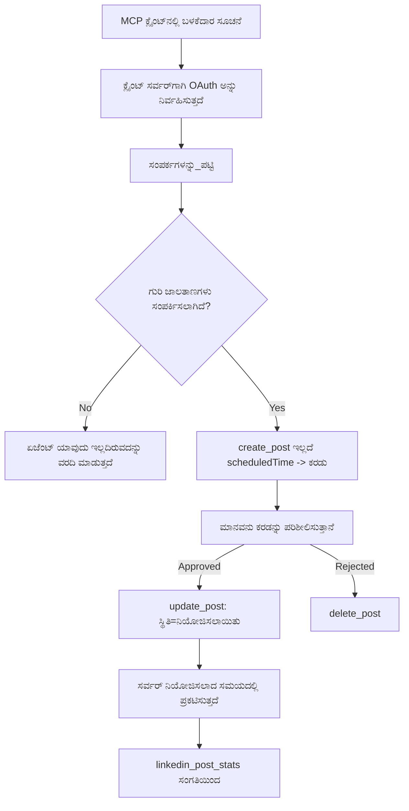

# ಪ್ರಕರಣ ಅಧ್ಯಯನ: ರಿಮೋಟ್ MCP ಸರ್ವರ್ ಮೂಲಕ ಏජೆಂಟ್‌ನಿಂದ ಸೋಶಿಯಲ್ ನೆಟ್‌ವರ್ಕ್‌ಗಳಿಗೆ ಪ್ರಕಟಣೆ

> **ತಗ್ಗುಚುಟಿಕೆ:** ಹಲವು ಸೇವೆಗಳು ಮತ್ತು ಓಪನ್-ಸೋರ್ಸ್ ಪ್ರಾಜೆಕ್ಟ್‌ಗಳು ಸೋಶಿಯಲ್ ನೆಟ್‌ವರ್ಕ್‌ಗಳಿಗೆ ಪ್ರಕಟಿಸಬಹುದು, ಮತ್ತು ಒಂದು ತಂಡವೂ ಪ್ರತಿ ನೆಟ್‌ವರ್ಕ್‌ನ API ನೇರವಾಗಿ ಹೊಂದಿಸಬಹುದು. ಕೆಳಗಿನ ದೃಶ್ಯಾವಳಿ ಒಂದು **ಬರೆಯಬಲ್ಲ ರಿಮೋಟ್ MCP ಸರ್ವರ್** ಅನ್ನು ಕೆಲಸ ಮಾಡಿದ ಉದಾಹರಣೆ ರೂಪದಲ್ಲಿ ನೀಡಲಾಗಿದೆ. ಪಬ್ಲೋರಾ ಒಂದು ವಾಣಿಜ್ಯ ಸೇವೆಯಾಗಿದ್ದು, ಉಚಿತ ತಿನಿಸು ಹೊಂದಿದೆ; ಇಲ್ಲಿ ವರ್ಣಿಸಲಾಗಿದೆ ಎಂತಹ ನಿಯಮಗಳು ಯಾವುದೇ MCP ಸರ್ವರ್‌ಗೆ ಅನ್ವಯಿಸುತ್ತವೆ, ಅದು ಬಳಕೆದಾರ ಪರವಾಗಿ ಮರಳಿಸಲಾಗದ ಕಾರ್ಯಗಳನ್ನು ನಡಿಸುತ್ತದೆ.

## ಅವಲೋಕನ

ಏಜೆಂಟ್‌ಗಳು ವಿಷಯವನ್ನು ತಯಾರಿಸುವಲ್ಲಿ ಉತ್ತಮವಾಗಿರುತ್ತವೆ ಆದರೆ ಅದನ್ನು ವಿತರಿಸುವಲ್ಲಿ ಕಮರೂ ಆಗುತ್ತವೆ. ಒಂದು ಮಾದರಿ ರಿಲೀಸ್ ಪ್ರಕಟಣೆಯನ್ನು ಸೆಕೆಂಡುಗಳಲ್ಲಿ ಬರೆಯಬಹುದು, ನಂತರ ಕೆಲಸ ನಿಲ್ಲುತ್ತದೆ: ಪ್ರಕಟಣೆ ಎಂದರೆ ಪ್ರತಿ ನೆಟ್‌ವರ್ಕ್‌కు API, ಪ್ರತಿ ನೆಟ್‌ವರ್ಕ್‌ಗೆ OAuth ಅಪ್ಲಿಕೇಶನ್, ಮತ್ತು ಪ್ರತಿ ಒಂದಕ್ಕೂ ವಿಭಿನ್ನ ಮೀಡಿಯಾ ನಿಯಮಗಳು. ಬಹುತೇಕ ತಂಡಗಳು ಇದನ್ನು ಕೈಯಲ್ಲಿ ಬ್ರೌಸರ್‌ಗೆ ಪಠ್ಯವನ್ನು ನಕಲಿಸುವ ಮೂಲಕ ಪರಿಹರಿಸುತ್ತವೆ.

ಈ ಪ್ರಕರಣ ಅಧ್ಯಯನವು ಆ ಅಂತಿಮ ಹಂತವನ್ನು ಏಕೈಕ ರಿಮೋಟ್ MCP ಸರ್ವರ್ ಮೂಲಕ ಹೇಗೆ ಪೂರ್ಣಗೊಳಿಸಲಾಗುತ್ತದೆ ಎಂಬುದನ್ನು ಮತ್ತು — ಇದನ್ನು ನಿರ್ಮಿಸುವ ಯಾರಿಗಾದರೂ ಹೆಚ್ಚು ಉಪಯುಕ್ತವಾಗಿ — **ಬರೆಯಬಲ್ಲ** ಸರ್ವರ್‌ನ ವಿನ್ಯಾಸ ನಿರ್ಧಾರಗಳನ್ನು ಕುರಿತಾಗಿ ಗಮನಿಸುತ್ತದೆ. ಮಾಹಿತಿ ಓದುಗತೆಗೆ ಅನುಕೂಲಕರ ಆದರೆ ಪ್ರಕಟಣೆ ಇಹ: ತಪ್ಪಾದ ಉಪಕರಣ ಕಾಲ್ ಪ್ರೇಕ್ಷಕರಿಗೆ ಹರಾಜಾಗುತ್ತದೆ ಮತ್ತು ಅದನ್ನು ಹಿಂಪಡೆಯಲು ಸಾಧ್ಯವಿಲ್ಲ.

## ದೃಶ್ಯಾವಳಿ

ಮೂಗಿನ ನಗರ-ಸಂಬಂಧಗಳ ತಂಡವು ಏಜೆಂಟ್ (Claude, VS Code, Cursor — ಕ್ಲೈಂಟ್ ಯಾರು ಅನಿವಾರ್ಯವಲ್ಲ) ಒಳಗೆ ಪೋಸ್ಟ್‌ಗಳನ್ನು ರಚಿಸುತ್ತದೆ. ಅವರು ಏಜೆಂಟ್‌ನಿಂದ:

- ತಂಡ ಯಾವ ಸೋಶಿಯಲ್ ಖಾತೆಗಳು ಸಂಯೋಜಿಸಿದ್ದಿವೆ ಎಂಬುದನ್ನು ಕಾಣಬಯಸುತ್ತಾರೆ,
- ಒಂದು ಪೋಸ್ಟ್ ಬರೆಯಲು ಮತ್ತು ಮಾನವನ ಅಮಾನು ಪತ್ರಕ್ಕೆ ಕಾಯುಲು ಡ್ರಾಫ್ಟ್ ಆಗಿ ಇಡಲು,
- ಚಿತ್ರವನ್ನು ಲಗತ್ತಿಸಲು,
- ಆಯ್ದ ಸಮಯದಲ್ಲಿ ಬಹಳ ನೆಟ್‌ವರ್ಕ್‌ಗಳಿಗೆ ವೇಳಾಪಟ್ಟಿ ಮಾಡಿಸಲು,
- ನಂತರ ಅದು ಹೇಗೆ ಕಾರ್ಯನಿರ್ವಹಿಸಿತ್ತೆಂಬುದನ್ನು ವರದಿ ಮಾಡಲು.

ಮುಖ್ಯವಾಗಿ, ಅವರು ಇನ್ನೂ ಪ್ರಯೋಗ ಮಾಡುತ್ತಿದ್ದಾಗ ಏಜೆಂಟ್ ತಪ್ಪಾಗಿ ಪ್ರಕಟಣೆ ಮಾಡಲು *ಸಾಧ್ಯವಿಲ್ಲ* ಆಗಲಿ ಬಯಸುತ್ತಾರೆ.

## ಬಳಸಿರುವ ಸಾಧನಗಳು

- [Publora MCP Server](https://github.com/publora/mcp-server) — ಪ್ರಕಟಣೆ, ವೇಳಾಪಟ್ಟಿ, ಮೀಡಿಯಾ ಮತ್ತು LinkedIn ವಿಶ್ಲೇಷಣೆ ಸಾಧನಗಳನ್ನು ನೀಡುವ ರಿಮೋಟ್ MCP ಸರ್ವರ್ (`streamable-http`). ಅಧಿಕೃತ MCP ಪಂಜಿಯಲ್ಲಿ `com.publora/mcp-server` ಎಂದು ದಾಖಲಿಸಿದೆ.

## ಹಂತ-ಹಂತದ ವರ್ಕ್ಫ್ಲೋ

1. **ಸರ್ವರ್‌ಗೆ ಸಂಪರ್ಕಿಸು.** OAuth ಮಾತನಾಡುವ ಗ್ರಾಹಕರು PKCE ಬಳಸಿ ಅನುಮತಿ-ಕೋಡ್ ಪ್ರಕ್ರಿಯೆಯನ್ನು ಪೂರ್ಣಗೊಳಿಸುವರು; ಹೀಗೆ ಇಲ್ಲದಂತಿರುವುದು, ಉದಾಹರಣೆಗೆ ಹೆಡ್‌ಲೆಸ್ CLI ಗಳು, ಹೆಡರ್‌ನಲ್ಲಿ Publora API ಕೀ ಬಳಸುತ್ತವೆ. ಇಬ್ಬರೂ ಮಾರ್ಗಗಳನ್ನು ಬೆಂಬಲಿಸಲಾಗಿದೆ, ಹಾಗೂ ನೀವು ಯಾವದನ್ನು ಪಡೆಯುತ್ತೀರೋ ಅದು ಗ್ರಾಹಕದಿಂದ ಅವಲಂಬಿಸಿದ್ದು ಸರ್ವರ್‌ನಿಂದ ಅಲ್ಲ.
2. **ಸಂಪರ್ಕಗಳನ್ನು ಪಟ್ಟಿ ಮಾಡು.** ಏಜೆಂಟ್ `list_connections` ಅನ್ನು ಕಾಲ್ ಮಾಡಿ ಸಂಪರ್ಕಿಸಿದ ಖಾತೆಗಳ ಗುರುತಿಗಳನ್ನು ಪಡೆಯುತ್ತದೆ.
3. **ಡ್ರಾಫ್ಟ್ ಮಾಡು.** ಏಜೆಂಟ್ `create_post` ಅನ್ನು ಸಮಯ ನಿರ್ಧಾರ ಇಲ್ಲದೆ ಕರೆಸುತ್ತದೆ. ಪೋಸ್ಟ್ ಡ್ರಾಫ್ಟ್ ಆಗಿ ಸಂಗ್ರಹಿಸುತ್ತದೆ — ಪ್ರಕಟಣೆ ಮಾಡೋದಿಲ್ಲ.
4. **ಮೀಡಿಯಾ ಜೋಡಿಸು.** ಸಾರ್ವಜನಿಕ ಚಿತ್ರ URL ಗಳನ್ನು ಒಂದೇ ಕಾಲ್ ನಲ್ಲಿ ಪಾಸ್ ಮಾಡುತ್ತಾರೆ; ಸರ್ವರ್ ಅವುಗಳನ್ನು ಡೌನ್‌ಲೋಡ್ ಮಾಡಿ ಪರಿಶೀಲಿಸುತ್ತದೆ.
5. **ವೇಳಾಪಟ್ಟಿ ಮಾಡು.** ಮಾನವ ಅನುಮೋದನೆಯ ನಂತರ `update_post` ಸ್ಥಿತಿಯನ್ನು ISO 8601 ಸಮಯದೊಂದಿಗೆ `scheduled` ಆಗಿ ಸೆಟ್ ಮಾಡುತ್ತದೆ.
6. **ಮಾಪನ ಮಾಡು.** LinkedInಗಾಗಿ, `linkedin_post_stats` ಪೋಸ್ಟ್ ಲೈವ್ ಆದ ನಂತರ ತೊಡಕಿನ ಪ್ರಮಾಣವನ್ನು ನೀಡುತ್ತದೆ.

## ಉದಾಹರಣಾ ಪ್ರಾಂಪ್ಟ್

```text
Which social accounts do I have connected?
Draft a post announcing our new changelog page, attach the screenshot at
https://example.com/changelog.png, and keep it as a draft — do not publish it.
Once I approve, schedule it to LinkedIn and Bluesky for tomorrow at 09:00 UTC.
```

## ಮರ್ಮೇಶಿಡ ಫ್ಲೌಚಾರ್ಟ್



## ತಾಂತ್ರಿಕ ಜಾರಿಗೆ

ಕೆಳಗಿನ ಪಾಠಗಳು ಈ ಪ್ರಕರಣ ಅಧ್ಯಯನದ ವರ್ಗಾಯಿಸಬಹುದಾದ ಭಾಗಗಳಿವೆ.

### ತೆರಸಿದ ಅನ್ವೇಷಣೆ, ಪ್ರಾಮಾಣಿಕಗೊಂಡ ಕಾರ್ಯಾಗರಣೆ

`tools/list` ಅನ್ನು ದಿ ಲಾಗಿನ್ ಇಲ್ಲದೆ ಸೇರಿಸಲಾಗುತ್ತದೆ; ಪ್ರತಿಯೊಬ್ಬ `tools/call` ಟೋಕನ್ ಅಗತ್ಯವಿದೆ ಮತ್ತು ಇಲ್ಲದಿದ್ದರೆ `401` ರಿಟರ್ನ್ ಮಾಡುತ್ತದೆ ಜೊತೆಗೆ `WWW-Authenticate` ಹೆಡರ್ ಪ್ರೊಟೆಕ್ಟೆಡ್-ರಿಸೋರ್ಸ್ ಮೆಟಾಡೇಟಾಕ್ಕೆ ಸೂಚಿಸುತ್ತದೆ. (ಸರ್ವರ್ `initialize` ಆನುಪ್ರಮಾಣಿಕ ಕಳಚಿಕೆ ಪ್ರತಿಕ್ರಿಯೆ ಕೂಡ ನೀಡುತ್ತದೆ, ಅದು 2026-07-28 ವೇಳೆ ಅಥವಾ ಮುಂಚಿನ ಪ್ರೋಟೋಕಾಲ್ ವಾಷರ್ಷನ್‌ಗಳಿಗೆ ಮಾತ್ರ ಅಗತ್ಯವಿದೆ; ಆ ದಾಖಲ  ಹಸ್ತ ಘೋಷಣೆಯನ್ನು ಸಂಪೂರ್ಣವಾಗಿ ತೆಗೆದುಹಾಕಿತು.)

ಈ ವಿಭಜನೆ ಪ್ರಾಯೋಗಿಕವಾಗಿ ಮಹತ್ವಪೂರ್ಣ. ರೆಜಿಸ್ಟ್ರಿಗಳು, ಕ್ಯಾಟಲಾಗುಗಳು ಮತ್ತು ಕ್ಲೈಂಟ್‌ಗಳು ಉಪಕರಣದ ಮೇಲೆ ಗುಟ್ಟು ಇಲ್ಲದೆ ಪರಿಚಯಿಸಬಹುದು — ಹೆಸರುಗಳು, ಸ್ಕೀಮಾ, ಟಿಪ್ಪಣಿಗಳು — ಆದರೆ ಯಾವುದೇ ಕಾರ್ಯಾಚರಣೆ ಅನಾಮಧೇಯವಾಗಿ ನಡೆಯುವುದಿಲ್ಲ. ಒಂದು ಸರ್ವರ್ `initialize` ಗೆ ಟೋಕನ್ ಬೇಡಿಕೆ ಮಾಡುವುದು ಉಪಕರಣಗಳಿಗೆ ಅಪ್ರತ്യക്ഷವಾಗಲು ಕಾರಣವಾಗುತ್ತದೆ; ಮತ್ತು ಅನಾಮಧೇಯ `tools/call` ನಿರ್ವಹಿಸುವ ಸರ್ವರ್ ಹೊಣೆಗಾರಿಕೆಯಾಗುತ್ತದೆ.

### ನೋಂದಣಿ: ಡೈನಾಮಿಕ್ ಕ್ಲೈಂಟ್ ನೋಂದಣಿ ಮತ್ತು ಅದನ್ನು ಬದಲಾಯಿಸುವುದು

ಸರ್ವರ್ `/.well-known/oauth-protected-resource` ಮತ್ತು `/.well-known/oauth-authorization-server` ಅನ್ನು ಪ್ರಕಟಿಸುತ್ತದೆ ಮತ್ತು PKCE (`S256`), ರಿಫ್ರೆಶ್ ಟೋಕನ್‌ಗಳು, ಮತ್ತು **ಡೈನಾಮಿಕ್ ಕ್ಲೈಂಟ್ ನೋಂದಣಿಯನ್ನು** ಅನುಮೋದನೆ ಕೋಡ್ ಪ್ರಕ್ರಿಯೆ ಜೊತೆಗೆ ಬೆಂಬಲಿಸುತ್ತದೆ.

ಡೈನಾಮಿಕ್ ನೋಂದಣಿ ಕೈಯಿಂದ ಮಾಡುವ ಹಂತವನ್ನು ತೆಗೆದುಹಾಕುತ್ತದೆ: ಇಲ್ಲದೇ ಪ್ರತಿ ಗ್ರಾಹಕನು ಪೂರ್ವ ಉಳಿತಾಯ `client_id` ಬೇಕಾಗುತ್ತದೆ, ಇದರಿಂದ ಪ್ರತಿ ಹೊಸ ಗ್ರಾಹಕನಿಗೆ ತರಡಾದ ಫೆÇಲಸ್ ವಿನಂತಿಯನ್ನು ಮಾರಾಟಗಾರನಿಗೆ ಕಳುಹಿಸಬೇಕು.

ಇದನ್ನು ನಕಲಿಸಲು ವಿನ್ಯಾಸ ಎಂದು ಬದಲಾಗಿ ಹೊಂದಾಣಿಕೆಯಾಗಿರುವ ವರ್ತನೆ ಎಂದು ಪರಿಗಣಿಸಿ. 2026-07-28 ಕರಡಿಯಲ್ಲಿ ಸ್ಪೆಸಿಫಿಕೇಶನ್ ಡೈನಾಮಿಕ್ ನೋಂದಣೆಯನ್ನು ನಿವೃತ್ತಿ ಮಾಡಿ, ಸ್ಪಷ್ಟವಾದ Client ID ಮೆಟಾಡೇಟಾ ಡಾಕ್ಯುಮೆಂಟ್‌ಗಳ ಪರಿಗಣನೆ ಮಾಡಿದೆ, ಅಲ್ಲಿ ಗ್ರಾಹಕ ಮೆಟಾಡೇಟಾ ಡಾಕ್ಯುಮೆಂಟ್ ಅನ್ನು ಸ್ಥಿರ HTTPS URL ನಲ್ಲಿ ಹೋಸ್ಟ್ ಮಾಡುತ್ತಾನೆ ಮತ್ತು ಆ URL ಆ `client_id` ಆಗಿದೆ. DCR ಈಗಲೂ ಕೆಲಸ ಮಾಡುತ್ತದೆ, ಆದರೆ ಇಂದಿನ ನಿರ್ಮಾಣ ಸರ್ವರ್ CIMD ಪರಿಗಣಿಸಿ DCR ಅನ್ನು ಹಳೆಯ ಗ್ರಾಹಕರಿಗಾಗಿ ಮಾತ್ರ ಇರಿಸಿಕೊಳ್ಳಬೇಕು.

### ಉಪಕರಣ ಟಿಪ್ಪಣಿಗಳು ಅಲಂಕಾರವಲ್ಲ

ಪ್ರತಿ ಉಪಕರಣವು `title` ಮತ್ತು ಅನ್ವಯಿಸುವ ಸೂಚನೆಗಳನ್ನು ಹೊತ್ತಿರುತ್ತವೆ: `readOnlyHint`, `destructiveHint`, `idempotentHint`, `openWorldHint`.

ಎರಡು ಕಾರಣಗಳಿವೆ ಹجنةಗಳಿಗೆ ಹೂಡಿಕೆ ಮಾಡಲು. ಮೊದಲು, ಗ್ರಾಹಕರು ಸೂಚನೆಗಳನ್ನು ಬಳಸಿ ಬಳಕೆದಾರನೊಂದಿಗೆ ಏನನ್ನು ದೃಢೀಕರಿಸಬೇಕೆಂದು ನಿರ್ಧರಿಸುತ್ತಾರೆ — ಗ್ರಾಹಕ ಓದು ಮಾತ್ರ ಇರುವ ಲುಕ್‌ಅಪ್‌ನ್ನು ಸ್ವಯಂಚಾಲಿತವಾಗಿ ರನ್ ಮಾಡಬಹುದು ಮತ್ತು ಅಳಿಸುವ ಮೊದಲು ಅನುಮೋದನೆಗಾಗಿ ನಿಲ್ಲಬಹುದು. ಸ್ಪೆಸಿಫಿಕೇಶನ್ ಸ್ಪಷ್ಟವಾಗಿ ಹೇಳುತ್ತದೆ ಟಿಪ್ಪಣಿಗಳು ನಂಬದ ಸೂಚನೆಗಳಾಗಿದ್ದು, ನ್ಯಾಯಾಪ್ರದಾನ ವ್ಯವಸ್ಥೆಯಲ್ಲ: ಅವು ಗ್ರಾಹಕನು ಏನು ಮಾಡುವುದಾಗಿ ತೋರಿಸುತ್ತದೆ, ಸರ್ವರ್ ಮೇಲೆ ಏನನ್ನೂ ತಡೆಸುವುದಿಲ್ಲ, ಸರ್ವರ್ ಇನ್ನೂ ತನ್ನ ನಿಯಮಗಳನ್ನು ಜಾರಿಮಾಡಬೇಕು. ಎರಡನೆಯದಾಗಿ, ಪ್ರಮುಖ ಸಂಪರ್ಕಕ ಫೈಲೊಗಳು ಈಗ ಅವುಗಳನ್ನು ವಿಮರ್ಶೆಗಾಗಿ *ಅಗತ್ಯ* ಮಾಡಿವೆ; ಶೀರ್ಷಿಕೆಗಳು ಮತ್ತು ಸೂಚನೆಗಳಿಲ್ಲದ ಉಪಕರಣಗಳ ಸರ್ವರ್ ಅನ್ನು ನೆರಳಿಸಲು ಹಿಂತಿರುಗಿಸಲಾಗುತ್ತದೆ ಸುಸಜ್ಜಿತವಾಗಿದೆ ಎಂದು ನೋಡಿದರೂ.

### ಗುರುತಿನ ಸಂಖ್ಯೆಗಳನ್ನು ಕಂಡುಹಿಡಿಯಲಾಗದಂತೆ ಮಾಡಿ

ವೇದಿಕೆ ಗುರುತಿನ ಸಂಖ್ಯೆಗಳನ್ನು `list_connections` ಮೂಲಕ ಬಂದ ಅನುಪಾತದ ಸ್ಟ್ರಿಂಗ್‌ಗಳಾಗಿ ನೀಡಲಾಗುತ್ತದೆ ಮತ್ತು ಸ್ಕೀಮಾ ವಿವರಣೆ ಸ್ಪಷ್ಟವಾಗಿ ಅವುಗಳನ್ನು ನಕಲಿಸಿ ಹಾಕಬೇಕು ಮತ್ತು ಊಹಿಸಬಾರದೆಂದು ಹೇಳುತ್ತದೆ. ಸರ್ವರ್ ಯಾವುದಾದರೂ ಬೇರೆ ಮಾಹಿತಿ ತಳ್ಳಿಹಾಕುತ್ತದೆ.

ಮಾದರಿಗಳು ನಿರಂತರ ಊಹಿಸುವುವು. ಯಾವುದೇ ಬರೆಯಬಲ್ಲ ಸರ್ವರ್ ಗುರುತಿನ ಸಂಖ್ಯೆ ಅಂತಿಮವಾಗಿ ಊಹಿಸಲ್ಪಡುವುದಾಗಿ ಊಹಿಸಿ ಆ ಮಾರ್ಗ ಅಸ್ಪಷ್ಟವೂ ಮುಂಚಿತ ಶಬ್ದದೊಂದಿಗೆ ವಿಫಲವಾಗುವಂತೆ ಮಾಡಬೇಕು, ಬದಲಾಗಿ ಸಮಾನ ತೋರುವ ಮೌಲ್ಯವನ್ನು ಅನುಸರಿಸುವುದಿಲ್ಲ.

### ಪ್ರಕಟಣೆಗೆ ಮೊದಲು ವಿಫಲಮಾಡು, ಕ್ರಿಯಾಶೀಲ ಸಂದೇಶದೊಂದಿಗೆ

ಕೆಲವು ನೆಟ್‌ವರ್ಕ್‌ಗಳು ಪಠ್ಯ ಮಾತ್ರ ಪೋಸ್ಟ್‌ಗಳನ್ನು ಒಪ್ಪದೇ ಚಿತ್ರ ಅಥವಾ ವೀಡಿಯೋ ಕೋರುತ್ತವೆ. ಇದು ಪೋಸ್ಟ್ ವೇಳಾಪಟ್ಟಿಗೆ ಹಾಕುವಾಗ ಪರಿಶೀಲಿಸಲಾಗುತ್ತದೆ ಮತ್ತು ದೋಷವು ವೇದಿಕೆಯ ಹಾಗು ಅಗತ್ಯವಿರುವ ಸ್ಥಳವನ್ನು ಸೂಚಿಸುತ್ತದೆ.

ಏಜೆಂಟ್ "Instagramಗೆ ಮೀಡಿಯಾ ಬೇಕು — ಚಿತ್ರ ಅಥವಾ ವೀಡಿಯೋ ಲಗತ್ತಿಸಿ" ಎಂಬಿಂದ ಮರಳಿ ತಪ್ಪಿಸಲು ಸಾಧ್ಯವಿದೆ ಆದರೆ ಸಾಮಾನ್ಯ 400 ದೋಷದಿಂದ ಬಿಡುಗಡೆ ಆಗುವುದಿಲ್ಲ.

### ಮರುಪ್ರಯತ್ನಗಳನ್ನು ಸುರಕ್ಷಿತವಾಗಿಸು

ವಿಷಯವನ್ನು ರಚಿಸುವ ಎರಡೂ ಉಪಕರಣಗಳು, `create_post` ಮತ್ತು `update_post`, ಐಡಂಪೋಟೆನ್ಸಿ ಕೀ ಸ್ವೀಕರಿಸುತ್ತವೆ: ಅದೇ ವಿನಂತಿಯನ್ನು ಅದೇ ಕೀ ಜೊತೆಗೆ ಪುನಃ ಬಳಸಿ ಮೂಲ ಪ್ರತಿಕ್ರಿಯೆಯನ್ನು ಪೂರೈಸುವುದು ಎರಡನೇ ಪೋಸ್ಟ್ ಸೃಷ್ಟಿಸುವುದಕ್ಕೆ ಬದಲು. ಏಜೆಂಟ್ ರಂಟೈಮ್ ಗಳು ಸಮಯ ಮೀರಿಸುವಿಕೆಯಿಂದ ಮರುಪ್ರಯತ್ನ ಮಾಡುತ್ತವೆ; ಐಡಂಪೋಟೆನ್ಸಿ ಇಲ್ಲದೆ, ನಿಧಾನವಾದ ಪ್ರತಿಕ್ರಿಯೆ ನಕಲಿ ಪ್ರಕಟಣೆಯಾಗುತ್ತದೆ. ಇತರ ಬರೆಯುವ ಉಪಕರಣಗಳು — ಅಳಿಸುವಿಕೆ, ಮೀಡಿಯಾ ಹಂತಗಳು, LinkedIn ಪ್ರತಿಕ್ರಿಯೆಗಳು ಮತ್ತು ಟಿಪ್ಪಣಿಗಳು — ಒಂದು ಕೂಡ ಪಡೆಯುವುದಿಲ್ಲ, ಆದ್ದರಿಂದ ಮರುಪ್ರಯತ್ನ ಸ್ವಯಮವಾಗಿ ಸುರಕ್ಷಿತವಲ್ಲ. ನಿಮ್ಮ ಸ್ವಂತ ಬದಲಾವಣೆಗಳಲ್ಲಿ ಯಾವವು ರಕ್ಷಿಸಲ್ಪಟ್ಟಿವೆ ಮತ್ತು ಯಾವವು ಅಲ್ಲ ಎಂಬುದು ತಿಳಿದುಕೊಳ್ಳುವುದು ಉಪಯುಕ್ತ.

### ಪ್ರಕಟಣೆ ಇಲ್ಲದ ಪರೀಕ್ಷೆಗೆ ಮಾರ್ಗ ಒದಗೆ

ಸರ್ವರ್ ನಿಯೋಜಿತ ಗುರಿಯಾಗಿರುವ `publora-playground` ಅನ್ನು ಸ್ವೀಕರಿಸುತ್ತದೆ, ಅದನ್ನು ನಿಜವಾದ ಗುರಿ ಎಂದು ಪರಿಶೀಲಿಸಿ ಒಪ್ಪುತ್ತದೆ ಮತ್ತು ನಂತರ ತ್ಯಜಿಸಿ — ಯಾವುದೇ ಜಿವಂತ ಖಾತೆಗೆ ಹೊಂದಿಕೆಯಿರದು. ಇದು ಉಪಕರಣ ಸ್ಕೀಮಾದಲ್ಲಿ ವಿವರಿಸಲಾಗಿದೆ, ಯಾವ ಕ್ಲೈಂಟ್ ಗೂ ಗುಟ್ಟು ಇಲ್ಲದೆ ಓದಲು ಸಾಧ್ಯ: `create_post` ಯ `platforms` ಕ್ಷೇತ್ರದಲ್ಲಿ ಇದು "ಯಾವುದೇ ನಿಜವಾದ ಸಂಪರ್ಕ ಅಗತ್ಯವಿಲ್ಲದ ಸಂಪರ್ಕ ಪರೀಕ್ಷಾ ಗುರಿ — ಪೋಸ್ಟ್ ಒಪ್ಪಿಗೆಯಾಗಿ ತ್ಯಜಿಸಲಾಗುತ್ತದೆ, ಪ್ರಕಟಣೆ ಇಲ್ಲ" ಎಂದು ದಾಖಲಾಗಿದೆ. ಇದನ್ನು ಏಕೈಕ ಪ್ರವೇಶವಾಗಿ ಹಾಕಿ ಕರೆಸಬಹುದು: `platforms: ["publora-playground"]`.

ಇದು ಒಟ್ಟು ಮೇಲಿನ ಉಪಕರಣದಲ್ಲಿ ಅತ್ಯಂತ ಉಪಯುಕ್ತ ವಿವರಗಳಲ್ಲೊಂದಾದನು ಎಂದು ಕಂಡುಬಂದಿದೆ. ಸಂಪರ್ಕಕ ಡೈರೆಕ್ಟರಿ ವಿಮರ್ಶಕರು, ಸಹಾವೇಶಿಗಳು ಮತ್ತು ನಿರಂತರ ಸಂಯೋಜನೆ (CI) ಸಂಪೂರ್ಣ ಬರೆಯುವ ಮಾರ್ಗವನ್ನು ಪರೀಕ್ಷಿಸಲ್ಪಟ್ಟು ಸ್ಪಷ್ಟವಾಗಿ ನಿಜವಾದ ಪ್ರೇಕ್ಷಕರಿಗೆ ಯಾವುದೇ ಅಪಾಯವಿಲ್ಲದೇ ಮಾನ್ಯತೆಯನ್ನು ಪಡೆದುಕೊಳ್ಳಬಹುದು. ಮರಳಿಸಲಾಗದ ಕ್ರಿಯೆಗಳನ್ನು ಹೊಂದಿರುವ ಯಾವುದೇ MCP ಸರ್ವರ್‌ಗೂ ದಾಖಲಿತ ನಿಷ್ಕ್ರೀಯ ಗುರಿಯು ಲಾಭಕರವಾಗಿದೆ.

## ಫಲಿತಾಂಶಗಳು ಮತ್ತು ಪರಿಣಾಮಗಳು

- ಪ್ರಕಟಣೆಯ ಹಂತವು ಬ್ರೌಸರ್‌ನಿಂದ ಅದರೇ ವಿಷಯ ಬರೆದುಕೊಂಡು ಇರುವ ಸಂಭಾಷಣೆಯಲ್ಲಿ ಸ್ಥಳಾಂತರವಾಯ್ತು ಮತ್ತು ಮಾನವನು ಲೂಪಿನಲ್ಲಿ ಇರುವಂತೆ ಡ್ರಾಫ್ಟ್-ಮೊದಲು ಸಂಸ್ಕೃತಿಯು ನಿಂತದಾಗಿದೆ. ಅದನ್ನು ಸೂಕ್ಷ್ಮವಾಗಿ ಹೇಳಬೇಕಾದರೆ: ಡ್ರಾಫ್ಟ್ ಒಂದು ಸಂಪ್ರದಾಯ ಅಥವಾ ನಿಯಮವಲ್ಲ. ಇದೇ ಪ್ರಮಾಣಪತ್ರವನ್ನು ಬಳಸಬಹುದು, ಆದ್ದರಿಂದ ನಿಜವಾದ ಅನುಮೋದನೆಗೋಷ್ಟುವಿರಬೇಕಾದವರು ಉಪಕರಣ ಮೇಲ್ಮೈಗೆ ಹೊರಗಿನ ಬೇರೆ ಪ್ರಮಾಣ ಪತ್ರಗಳನ್ನು ಅಥವಾ ನೀತಿ ಪದರವನ್ನು ಜಾರಿಮಾಡಬೇಕು.
- ಪ್ರತಿ ನೆಟ್‌ವರ್ಕ್ ವ್ಯತ್ಯಾಸಗಳು — ಮೀಡಿಯಾ ಅಗತ್ಯಗಳು, ಥ್ರೆಡಿಂಗ್, ಪ್ರತಿಕ್ರಿಯೆ ನಿಯಂತ್ರಣ — ಪ್ರತಿಯೊಂದು ಏಜೆಂಟ್ ಅಲ್ಲದೆ ಸರ್ವರ್ನಲ್ಲಿ ಒಮ್ಮೆ ನಿರ್ವಹಿಸಲಾಗುತ್ತದೆ.
- ಒಟ್ಟಾರೆ ಸರ್ವರ್ ಅನೇಕ MCP ಕ್ಲೈಂಟ್‌ಗಳನ್ನು ಪ್ರತಿ ಗ್ರಾಹಕಕ್ಕೆ ವಿಭಿನ್ನ ಕೆಲಸವಿಲ್ಲದೆ ಬೆಂಬಲಿಸುತ್ತದೆ, ಏಕೆಂದರೆ ಅನ್ವೇಷಣೆ ತೆರೆಯಲ್ಪಟ್ಟಿದ್ದು ಮತ್ತು ನೋಂದಣಿ ಡೈನಾಮಿಕ್ ಆಗಿದೆ.
- ಮೇಲ್ಪಟ್ಟ ವಿನ್ಯಾಸ ನಿಯಮಗಳನ್ನು ಸಂಪರ್ಕಕ-ಡೈರೆಕ್ಟರಿ ವಿಮರ್ಶೆ ಮತ್ತು ಬಳಕೆದಾರರಿಂದ ರೂಪಿಸಲ್ಪಟ್ಟವು: ಟಿಪ್ಪಣಿಗಳು, OAuth ಮತ್ತು ಸುರಕ್ಷಿತ ಪರೀಕ್ಷಾ ಗುರಿ ಪ್ರತಿಯೊಬ್ಬರೂ ಕನಿಷ್ಠ ಒಂದರಿಂದ ಅವಶ್ಯವಾಗಿದ್ದವು.

## ವಿಶೇಷ ಸೂಚನೆಗಳು

- [Publora MCP Server (ಮೂಲ)](https://github.com/publora/mcp-server)
- [Publora API ಮತ್ತು MCP ಡಾಕ್ಯುಮೆಂಟೇಶನ್](https://docs.publora.com)
- [MCP ರೆಜಿಸ್ಟ್ರಿ ದಾಖಲೆ: `com.publora/mcp-server`](https://registry.modelcontextprotocol.io/v0/servers?search=com.publora/mcp-server)
- [MCP ವಿಧಿ — ಅನುಮೋದನೆ](https://modelcontextprotocol.io/specification/draft/basic/authorization)
- [MCP ವಿಧಿ — ಉಪಕರಣ ಟಿಪ್ಪಣಿಗಳು](https://modelcontextprotocol.io/docs/concepts/tools)

## ಮುಂದೇನು

- ನಿಮ್ಮ ನಿರ್ಮಿಸುತ್ತಿರುವ MCP ಸರ್ವರ್ ಒಂದನ್ನು ತೆಗೆದುಕೊಳ್ಳಿ ಮತ್ತು ಇಲ್ಲಿ ತಗ್ಗು ದರದ ಮೂರು ಗೆಲುವುಗಳನ್ನು ಪರಿಶೀಲಿಸಿ: ಪ್ರತಿ ಉಪಕರಣದಲ್ಲಿ ಟಿಪ್ಪಣಿಗಳು, ಪ್ರತಿ ಬರವಣಿಗೆಯಲ್ಲಿ ಐಡಂಪೋಟೆನ್ಸಿ ಕೀ ಮತ್ತು ದಾಖಲಿತ ನಿಷ್ಕ್ರೀಯ ಗುರಿ.
- ತೆರೆಯಲಾದ ಅನ್ವೇಷಣೆಯ ವಿಭಜನೆಯನ್ನು ಪ್ರಯತ್ನಿಸಿ: ಬೇರೆ ಯಾವುದೇ ಗುರುತು ಇಲ್ಲದೆ ಸಾರ್ವಜನಿಕ ರಿಮೋಟ್ ಸರ್ವರ್‌ಗೆ `tools/list` ಕರೆ ಮಾಡಿ, ನಂತರ ಉಪಕರಣವನ್ನು ಕರೆಸಿ `401` ಸವಾಲನ್ನು ಪರಿಶೀಲಿಸಿ.
- ನಿಮ್ಮ ಕ್ಷೇತ್ರದ "ಹಿಂಪಡೆಯುವಿಕೆ" ಅರ್ಥವನ್ನು ಪರಿಗಣಿಸಿ. ಪ್ರಕಟಣೆಗಳಿಗೆ ಡ್ರಾಫ್ಟ್ ಮತ್ತು ಅಳಿಸುವಿಕೆಗಳಿವೆ; ನಿಮ್ಮ ಕಾರ್ಯಗಳಿಗೆ ಸಮಾನವಾದೀತನಿಲ್ಲದಿದ್ದರೆ, ದೃಢೀಕರಣವು ಉಪಕರಣ ವಿನ್ಯಾಸದಲ್ಲಿರಬೇಕು, ಪ್ರಾಂಪ್ಟ್‌ನಲ್ಲಿ ಅಲ್ಲ.

---

<!-- CO-OP TRANSLATOR DISCLAIMER START -->
**ಅಸ್ವೀಕಾರ**:
ಈ ದಸ್ತಾವೇಜು AI ಅನುವಾದ ಸೇವೆ [Co-op Translator](https://github.com/Azure/co-op-translator) ಬಳಸಿ ಅನುವಾದಿಸಲಾಗಿದೆ. ನಾವು ನಿಖರತೆಯನ್ನು ಸಾಧಿಸಲು ಪ್ರಯತ್ನಿಸುತ್ತಿದ್ದರೂ, ದಯವಿಟ್ಟು ಗಮನಿಸಿ, ಸ್ವಯಂಚಾಲಿತ ಅನುವಾದಗಳಲ್ಲಿ ದೋಷಗಳು ಅಥವಾ ಅಸಡ್ಡೆಗಳು ಇರಬಹುದು. ಮೂಲ ಭಾಷೆಯಲ್ಲಿರುವ ಮೂಲ ದಸ್ತಾವೇಜು ಪ್ರಾಮಾಣಿಕ ಮೂಲವೆಂದು ಪರಿಗಣಿಸಬೇಕು. ಪ್ರಮುಖ ಮಾಹಿತಿಗಾಗಿ, ವೃತ್ತಿಪರ ಮಾನವ ಅನುವಾದವನ್ನು ಶಿಫಾರಸು ಮಾಡಲಾಗುತ್ತದೆ. ಈ ಅನುವಾದವನ್ನು ಬಳಸುವ ಮೂಲಕ ಉಂಟಾಗುವ ಯಾವುದೇ ತಪ್ಪು ಅರ್ಥಗಳ ಅಥವಾ ತಪ್ಪು ವ್ಯಾಖ್ಯಾನಗಳ ಬಗ್ಗೆ ನಾವು ಹೊಣೆಗಾರರಲ್ಲ.
<!-- CO-OP TRANSLATOR DISCLAIMER END -->