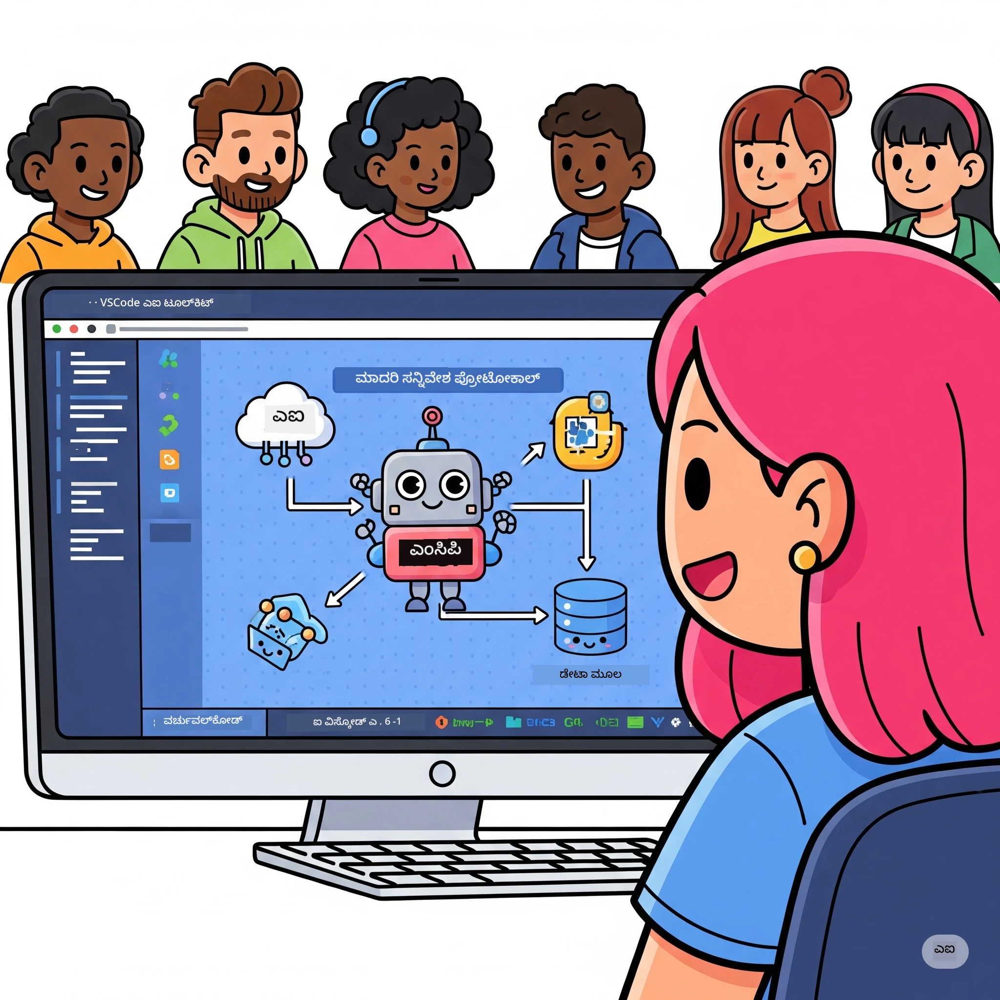
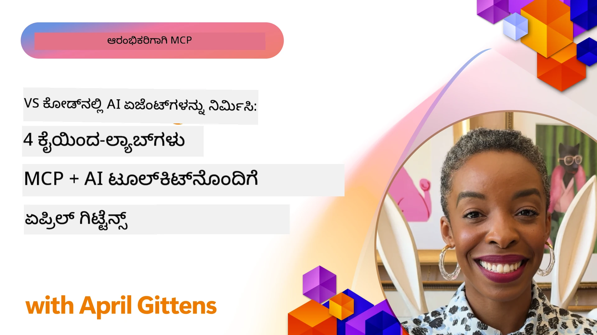

# AI ಕಾರ್ಯಪ್ರವಾಹಗಳ ಸುಗಮೀಕರಣ: Microsoft Foundry Toolkit ನೊಂದಿಗೆ MCP ಸರ್ವರ್ ನಿರ್ಮಾಣ

## 🎯 ಅವಲೋಕನ

_(ಈ ಪಾಠದ ವೀಡಿಯೋವನ್ನು ನೋಡಲು ಮೇಲಿನ ಚಿತ್ರವನ್ನು ಕ್ಲಿಕ್ ಮಾಡಿ)_

ನಿಮಗೆ ಸ್ವಾಗತ **ಮಾಡಲ್ ಕನ್ಟೆಕ್ಸ್ ಪ್ರೊಟೋಕಾಲ್ (MCP) ಕಾರ್ಯಾಗಾರಕ್ಕೆ**! ಈ ಸಮಗ್ರ ಕೈಜೋಡಿದ ಕಾರ್ಯಾಗಾರವು ಎರಡು ಅತ್ಯಾಧುನಿಕ ತಾಂತ್ರಿಕತಗಳನ್ನು ಸಂಯೋಜಿಸಿದ್ದು AI ಅಪ್ಲಿಕೇಶನ್ ಅಭಿವೃದ್ಧಿಯನ್ನು ಬದಲಾಯಿಸುತ್ತದೆ:

> **ಸಂಗತಿಯ ಸೂಚನೆ:** ಕಾರ್ಯಾಗಾರಿ ಕೋಡ್ MCP
> `2025-11-25` ನೊಂದಿಗೆ ನಿರ್ಮಿಸಲಾಗಿದೆ ಮತ್ತು ಪರೀಕ್ಷಿಸಲಾಗಿದೆ, ಮೇಲಿನ ಬ್ಯಾಜ್ ಮೂಲಕ ತೋರಿಸಲಾಗಿದೆ. ಬಳಸಿ
> [ಸತತ `2026-07-28` ವಿವರಣೆ](https://modelcontextprotocol.io/specification/2026-07-28/)
> ಹೊಸ ಪ್ರೋಟೋಕಾಲ್ ಅನ್ವಯಣೆಗಳಿಗೆ ಮತ್ತು SDK ಬಿಡುಗಡೆಯ ಸೂಚನೆಗಳನ್ನು ವಿಮರ್ಶಿಸಿ
> ಪ್ರಯೋಗಾಲಯಗಳನ್ನು ಸ್ಥಳಾಂತರಿಸುವ ಮೊದಲು.

- **🔗 ಮಾಡಲ್ ಕನ್ಟೆಕ್ಸ್ ಪ್ರೊಟೋಕಾಲ್ (MCP)**: ನಿರಂತರ AI-ಮುಡುಬು ಗುಣಮಟ್ಟದ ವಿರಾಮ ರಹಿತ ನಲ್ಲಿ ಒಪನ್ ಸ್ಟ್ಯಾಂಡರ್ಡ್
- **🛠️ Microsoft Foundry Toolkit VS Code ಗೆ ವಿಸ್ತರಣೆ**: ಮೈಕ್ರೋಸಾಫ್ಟ್ ಅವರ ಶಕ್ತಿಶಾಲಿ AI ಅಭಿವೃದ್ಧಿ ವಿಸ್ತರಣೆ

### 🎓 ನೀವು ಅಥವಾ ಕಲಿಯುವುದು

ಈ ಕಾರ್ಯಾಗಾರದ ಅಂತ್ಯದಲ್ಲಿ, ನೀವು ಬುದ್ಧಿವಂತ ಅಪ್ಲಿಕೇಶನ್ಗಳ ನಿರ್ಮಾಣ ಕೌಶಲ್ಯದಲ್ಲಿ ಪರಿಣತಿ ಹೊಂದುತ್ತೀರಿ, ಇದು AI ಮಾದರಿಗಳನ್ನು ನೈಜದ ಪ್ರಪಂಚದ ಟೂಲ್ಗಳು ಮತ್ತು ಸೇವೆಗಳೊಂದಿಗೆ ಸೇರ್ಪಡೆ ಮಾಡುತ್ತವೆ. ಸ್ವಯಂಚಾಲಿತ ಪರೀಕ್ಷೆಯಿಂದ ಕಸ್ಟಮ್ API ಸಂಯೋಜನೆಗಳಿಗೆ, ನೀವು ಸಂಕೀರ್ಣ ವ್ಯಾಪಾರದ ಸವಾಲುಗಳನ್ನು ಪರಿಹರಿಸುವಲ್ಲಿ ಪ್ರಾಯೋಗಿಕ ಕೌಶಲ್ಯಗಳನ್ನು ಪಡೆಯುತ್ತೀರಿ.

## 🏗️ ತಂತ್ರಜ್ಞಾನ ಸ್ಟ್ಯಾಕ್

### 🔌 ಮಾಡಲ್ ಕನ್ಟೆಕ್ಸ್ ಪ್ರೊಟೋಕಾಲ್ (MCP)

MCP ಮೂಲತಃ **"USB-C for AI"** - ಇದು AI ಮಾದರಿಗಳನ್ನು ಹೊರಗಿನ ಟೂಲ್ಗಳಿಗೆ ಮತ್ತು ಡೇಟಾ ಮೂಲಗಳಿಗೆ ಸಂಪರ್ಕಿಸುವ ವಿಶ್ವವ್ಯಾಪಿ ಮಾನದಂಡವಾಗಿದೆ.

**✨ ಮುಖ್ಯ ವೈಶಿಷ್ಟ್ಯಗಳು:**

- 🔄 **ಸ್ಟ್ಯಾಂಡರ್ಡೈಸ್ ಮಾಡಿದ ಸಂಯೋಜನೆ**: AI-ಟೂಲ್ ಸಂಪರ್ಕಗಳಿಗೆ ವಿಶ್ವವ್ಯಾಪಿ ಇಂಟರ್ಫೇಸ್
- 🏛️ **ಲವಚಿಕ معماري**: ಸ್ಥಳೀಯ ಮತ್ತು ದೂರದ ಸರ್ವರ್ ಗಳು stdio/SSE ಸಾರಣೆ ಮೂಲಕ
- 🧰 **ಸಮೃದ್ಧ ಪರಿಸರ**: ಒಂದು ಪ್ರೋಟೋಕಾಲ್‌ನಲ್ಲಿ ಟೂಲ್ಗಳು, ಪ್ರಾಂಪ್ಟ್‌ಗಳು ಮತ್ತು ಸಂಪನ್ಮೂಲಗಳು
- 🔒 **ಉದ್ಯಮ-ಸಿದ್ಧ**: ಒಳಚರಂಡಿ ಭದ್ರತೆ ಮತ್ತು ವಿಶ್ವಾಸಾರ್ಹತೆ

**🎯 MCP ಪ್ರಾಮುಖ್ಯತೆ:**
USB-C ತಂತು ಅವ್ಯವಸ್ಥೆಯನ್ನು ನಿವಾರಿಸಿಕೊಂಡಂತೆ, MCP AI ಸಂಯೋಜನೆಗಳ ಸಂಕೀರ್ಣತೆಯನ್ನು ನಿವಾರಿಸುತ್ತದೆ. ಒಂದು ಪ್ರೋಟೋಕಾಲ್, ಅನಿಯಮಿತ ಸಾಧ್ಯತೆಗಳು.

### 🤖 Microsoft Foundry Toolkit VS Code ಗೆ ವಿಸ್ತರಣೆ

ಮೈಕ್ರೋಸಾಫ್ಟ್ ನ ಪ್ರಮುಖ AI ಅಭಿವೃದ್ಧಿ ವಿಸ್ತರಣೆ, ಇದು VS Code ನ್ನು AI ಶಕ್ತಿಸಾಲಿಯಾದ ಯಂತ್ರವಾಗಿ ಪರಿವರ್ತಿಸುತ್ತದೆ.

**🚀 ಪ್ರಮುಖ ಸಾಮರ್ಥ್ಯಗಳು:**

- 📦 **ಮಾಡಲ್ ಕ್ಯಾಟಲಾಗ್**: Azure AI, GitHub, Hugging Face, Ollama ನಿಂದ ಮಾದರಿಗಳಿಗೆ ಪ್ರವೇಶ
- ⚡ **ಸ್ಥಳೀಯ ನಿರ್ಧಾರ**: ONNX-ಆಪ್ಟಿಮೈಜ್ಡ್ CPU/GPU/NPU ನಿರ್ವಹಣೆ
- 🏗️ **ಏಜೆಂಟ್ ಬಿಲ್ಡರ್**: MCP ಸಂಯೋಜನೆ ಹೊಂದಿರುವ ದೃಶ್ಯ AI ಏಜೆಂಟ್ ಅಭಿವೃದ್ಧಿ
- 🎭 **ಬಹು-ಮಾದರಿ**: ಪಠ್ಯ, ದೃಷ್ಟಿ ಮತ್ತು ರಚನೆಯೊದಗಿಸಲಾದ ಫಲಿತಾಂಶ ಬೆಂಬಲ

**💡 ಅಭಿವೃದ್ಧಿ ಲಾಭಗಳು:**

- ಶೂನ್ಯ-ಸೆಟ್ಟಿಂಗ್ ಮಾಡಲ್ ನಿಯೋಜನೆ
- ದೃಶ್ಯಾತ್ಮಕ ಪ್ರಾಂಪ್ಟ್ ಎಂಜಿನಿಯರಿಂಗ್
- ನೈಜಕಾಲದ ಪರೀಕ್ಷಾ ಪ್ಲೇಗ್ರೌಂಡ್
- ನಿರಂತರ MCP ಸರ್ವರ್ ಸಂಯೋಜನೆ

## 📚 ಕಲಿಕಾ ಯಾತ್ರೆ

### [🚀 Module 1: Microsoft Foundry Toolkit ಮೂಲಭೂತಗಳು](./lab1/README.md)

**ាចೇತ್ರಾವಧಿ**: 15 ನಿಮಿಷಗಳು

- 🛠️ VS Code ಗೆ Microsoft Foundry Toolkit ಅನ್ನು ಸ್ಥಾಪಿಸಿ ಮತ್ತು ರೂಪೊಗೊಳಿಸಿ
- 🗂️ ಮಾಡಲ್ ಕ್ಯಾಟಲಾಗ್ ಅನ್ವೇಷಿಸಿ (GitHub, ONNX, OpenAI, Anthropic, Google ನ 100+ ಮಾದರಿಗಳು)
- 🎮 ನೈಜಕಾಲ ಮಾದರಿ ಪರೀಕ್ಷೆಗಾಗಿ ಇಂಟरेक್ಟಿವ್ ಪ್ಲೇಗ್ರೌಂಡ್ ನಲ್ಲಿ ಪರಿಣತಿ ಪಡೆದಿರಿ
- 🤖 ನಿಮ್ಮ ಮೊದಲ AI ಏಜೆಂಟ್ ಅನ್ನು ಏಜೆಂಟ್ ಬಿಲ್ಡರ್ ಬಳಸಿ ನಿರ್ಮಿಸಿ
- 📊 ಅಂತರ್ಗತ ಮಿತಿಗಳನ್ನು ಬಳಸಿ ಮಾದರಿ ಕಾರ್ಯಕ್ಷಮತೆಯನ್ನು ಮೌಲ್ಯಮಾಪನ ಮಾಡಿ (F1, ಪ್ರಾಸಕ್ತಿಯ, ಸಾದೃಶ್ಯತೆ, ಸಮನ್ವಯತೆ)
- ⚡ ಬ್ಯಾಚ್ ಪ್ರಕ್ರಿಯೆ ಮತ್ತು ಬಹು-ಮಾದರಿ ಬೆಂಬಲ ಸಾಮರ್ಥ್ಯಗಳನ್ನು ಕಲಿಯಿರಿ

**🎯 ಕಲಿಕೆಯ ಫಲಿತಾಂಶ**: Microsoft Foundry Toolkit ಸಾಮರ್ಥ್ಯಗಳ ಸಂಪೂರ್ಣ ಅರಿವಿನಿಂದ ಕಾರ್ಯೋತ್ಪಾದಕ AI ಏಜೆಂಟ್ ರಚಿಸಿ

### [🌐 Module 2: Microsoft Foundry Toolkitೊಂದಿಗೆ MCP ಮೂಲಭೂತಗಳು](./lab2/README.md)

**ಅವಧಿ**: 20 ನಿಮಿಷಗಳು

- 🧠 ಮಾಡಲ್ ಕನ್ಟೆಕ್ಸ್ ಪ್ರೊಟೋಕಾಲ್ (MCP) معماري ಮತ್ತು ತತ್ವಗಳನ್ನು ನಿಪುಣತೆ ಪಡೆಯಿರಿ
- 🌐 Microsoft ನ MCP ಸರ್ವರ್ ಪರಿಸರವನ್ನು ಅನ್ವೇಷಿಸಿ
- 🤖 Playwright MCP ಸರ್ವರ್ ಬಳಸಿ ಬ್ರೌಸರ್ Automation ಏಜೆಂಟ್ ಕಟ್ಟಿಸಿ
- 🔧 MCP ಸರ್ವರ್‌ಗಳನ್ನು Microsoft Foundry Toolkit ಏಜೆಂಟ್ ಬಿಲ್ಡರ್ ಜೊತೆಗೆ ಸಂಯೋಜಿಸಿ
- 📊 ನಿಮ್ಮ ಏಜೆಂಟ್‌ಗಳಲ್ಲಿ MCP ಸಾಧನಗಳನ್ನು ರಚಿಸಿ ಮತ್ತು ಪರೀಕ್ಷಿಸಿ
- 🚀 MCP ಶಕ್ತಿಯುತ ಏಜೆಂಟ್‌ಗಳನ್ನು ಉತ್ಪಾದನೆಯಿಗಾಗಿ ರಫ್ತು ಮಾಡಿ ಮತ್ತು ನಿಯೋಜಿಸಿ

**🎯 ಕಲಿಕೆಯ ಫಲಿತಾಂಶ**: MCP ಮೂಲಕ ಹೊರಗಿನ ಟೂಲ್ಗಳೊಂದಿಗೆ ಪ್ರಶಕ್ತ ಐ ಏಜೆಂಟ್ ನಿಯೋಜಿಸಿ

### [🔧 Module 3: Microsoft Foundry Toolkit ನೊಂದಿಗೆ ಉನ್ನತ MCP ಅಭಿವೃದ್ಧಿ](./lab3/README.md)

**ಅವಧಿ**: 20 ನಿಮಿಷಗಳು

- 💻 Microsoft Foundry Toolkit ಬಳಸಿ ಕಸ್ಟಮ್ MCP ಸರ್ವರ್‌ಗಳು ರಚಿಸಿ
- 🐍 MCP ಪೈಥಾನ್ SDK (v1.9.3) ಇತ್ತೀಚಿನ ಆವೃತ್ತಿಯನ್ನು ಸಂರಚಿಸಿ ಮತ್ತು ಬಳಸಿ
- 🔍 ಡಿಬಗಿಂಗ್ ಹಂತದಲ್ಲಿ MCP ಇನ್‌ಸ್ಪೆಕ್ಟರ್ ಅನ್ನು ಸೆಟ್ ಅಪ್ ಮಾಡಿ ಮತ್ತು ಉಪಯೋಗಿಸಿ
- 🛠️ ವೃತ್ತಿಪರ ಡಿಬಗಿಂಗ್ ಕಾರ್ಯಪದ್ಧతೆಗಳೊಂದಿಗೆ ವಾತಾವರಣ MCP ಸರ್ವರ್ ನಿರ್ಮಿಸಿ
- 🧪 ಏಜೆಂಟ್ ಬಿಲ್ಡರ್ ಮತ್ತು ಇನ್‌ಸ್ಪೆಕ್ಟರ್ ಪರಿಸರಗಳಲ್ಲಿ MCP ಸರ್ವರ್‌ಗಳನ್ನು ಡಿಬಗ್ ಮಾಡಿ

**🎯 ಕಲಿಕೆಯ ಫಲಿತಾಂಶ**: ಆಧುನಿಕ ಟೂಲಿಂಗ್ ಬಳಸಿ ಕಸ್ಟಮ್ MCP ಸರ್ವರ್‌ಗಳನ್ನು ಅಭಿವೃದ್ಧಿಪಡಿಸಿ ಮತ್ತು ಡಿಬಗ್ ಮಾಡಿ

### [🐙 Module 4: ಪ್ರಾಯೋಗಿಕ MCP ಅಭಿವೃದ್ಧಿ - ಕಸ್ಟಮ್ GitHub ಕ್ಲೋನ್ ಸರ್ವರ್](./lab4/README.md)

**ಅವಧಿ**: 30 ನಿಮಿಷಗಳು

- 🏗️ ವಾಸ್ತವ GitHub ಕ್ಲೋನ್ MCP ಸರ್ವರ್ ಅಭಿವೃದ್ಧಿ ಕಾರ್ಯಪದ್ಧತಿ ನಿರ್ಮಿಸಿ
- 🔄 ಮಾನ್ಯತೆ ಮತ್ತು ದೋಷ ನಿರ್ವಹಣೆಯೊಂದಿಗೆ ಸ್ಮಾರ್ಟ್ ರೆಪೊಸಿಟರಿ ಕ್ಲೋನಿಂಗ್ ಜಾರಿಗೊಳಿಸಿ
- 📁 ಬುದ್ಧಿವಂತ ಡೈರೆಕ್ಟರಿ ನಿರ್ವಹಣೆ ಮತ್ತು VS Code ಸಂಯೋಜನೆ ರಚಿಸಿ
- 🤖 GitHub Copilot ಏಜೆಂಟ್ ಮೋಡ್‌ನ್ನು ಕಸ್ಟಮ್ MCP ಟೂಲ್ಗಳೊಂದಿಗೆ ಬಳಸಿರಿ
- 🛡️ ಉತ್ಪಾದನೆ-ಸಿದ್ಧ ವಿಶ್ವಾಸಾರ್ಹತೆ ಮತ್ತು ಕ್ರಾಸ್-ಪ್ಲಾಟ್‌ಫಾರ್ಮ್ ಹೊಂದಾಣಿಕೆ ಅನ್ವಯಿಸಿ

**🎯 ಕಲಿಕೆಯ ಫಲಿತಾಂಶ**: ನೈಜ ಅಭಿವೃದ್ಧಿ ಕಾರ್ಯಪದ್ಧತಿಗಳನ್ನು ಸುಗಮಗೊಳಿಸುವ ಉತ್ಪಾದನಾ-ಸಿದ್ಧ MCP ಸರ್ವರ್ ನಿಯೋಜಿಸಿ

## 💡 ನೈಜ ಪ್ರಪಂಚ ಅಪ್ಲಿಕೇಶನ್ ಮತ್ತು ಪ್ರಭಾವ

### 🏢 ಉದ್ಯಮ ಬಳಸುವ ಪ್ರಕರಣಗಳು

#### 🔄 ಡೆವ್ಓಪ್ಸ್ Automation

ಬುದ್ಧಿವಂತ automation ಮೂಲಕ ನಿಮ್ಮ ಅಭಿವೃದ್ಧಿ ಕಾರ್ಯಹಿನ್ನಲೆ ಪರಿವರ್ತಿಸಿ:

- **ಸ್ಮಾರ್ಟ್ ರೆಪೊಸಿಟರಿ ನಿರ್ವಹಣೆ**: AI ಚಾಲಿತ ಕೋಡ್ ರಿವ್ಯೂ ಮತ್ತು ಮರ್ಜ್ ನಿರ್ಧಾರಗಳು
- **ಬುದ್ಧಿವಂತ CI/CD**: ಕೋಡ್ ಬದಲಾವಣೆಗಳ ಆಧಾರದ ಮೇಲಿನ ಸ್ವಯಂಚಾಲಿತ ಪೈಪ್ಲೈನ್ ಆಪ್ಟಿಮೈಜೇಶನ್
- **ಸಮಸ್ಯೆ ಟ್ರಯಾಜ್**: ಸ್ವಯಂಚಾಲಿತ ದೋಷ ವರ್ಗೀಕರಣ ಮತ್ತು ನಿಯೋಜನೆ

#### 🧪 ಗುಣಮಟ್ಟ ಖಾತ್ರಿ ಕ್ರಾಂತಿ

AI ಚಾಲಿತ automation ಮೂಲಕ ಪರೀಕ್ಷೆಯನ್ನು ಎತ್ತರಕ್ಕೆ ತಲುಪಿಸಿ:

- **ಬುದ್ಧಿವಂತ ಪರೀಕ್ಷಾ ರಚನೆ**: ಸ್ವಯಂಚಾಲಿತವಾಗಿ ಸಂಪೂರ್ಣ ಪರೀಕ್ಷಾ ಸೂಟ್‌ಗಳನ್ನು ರಚಿಸಿ
- **ದೃಶ್ಯಾತ್ಮಕ ಹಿಂಸ್ಪೃಷ್ಟಿ ಪರೀಕ್ಷೆ**: AI ಚಾಲಿತ UI ಬದಲಾವಣೆ ಪತ್ತೆ
- **ಕಾರ್ಯಕ್ಷಮತೆ ನಿರೀಕ್ಷಣಾ**: ಪ್ರಾಕೃತಿಕ ಸಮಸ್ಯೆ ಗುರುತಿಸುವಿಕೆ ಮತ್ತು ಪರಿಹಾರ

#### 📊 ಡೇಟಾ ಪೈಪ್‌ಲೈನ್ ಬುದ್ಧಿಮತ್ತು

ಬುದ್ಧಿವಂತ ಡೇಟಾ ಪ್ರಕ್ರಿಯೆ ಕಾರ್ಯಪದ್ಧತಿಗಳನ್ನು ನಿರ್ಮಿಸಿ:

- **ಅನ್ವಯಕಾರಿ ETL ಪ್ರಕ್ರಿಯೆಗಳು**: ಸ್ವಯಂ-ಆಪ್ಟಿಮೈಸಿಂಗ್ ಡೇಟಾ ಪರಿವರ್ತನೆಗಳು
- **ಅಸಾಮಾನ್ಯತೆ ಪತ್ತೆ**: ನೈಜಕಾಲದ ಡೇಟಾ ಗುಣಮಟ್ಟ ನಿರೀಕ್ಷಣೆ
- **ಬುದ್ಧಿವಂತ ಮಾರ್ಗದರ್ಶನ**: ಸ್ಮಾರ್ಟ್ ಡೇಟಾ ಹರಿವು ನಿರ್ವಹಣೆ

#### 🎧 ಗ್ರಾಹಕ ಅನುಭವ ಸುಧಾರಣೆ

ವಿಶೇಷ ಗ್ರಾಹಕ ಸಂವಹನಗಳನ್ನು ರಚಿಸಿ:

- **ಸಂದರ್ಭ-ಜಾಗೃತಿ ಬೆಂಬಲ**: ಗ್ರಾಹಕ ಇತಿಹಾಸಕ್ಕೆ ಪ್ರವೇಶ ಹೊಂದಿರುವ AI ಏಜೆಂಟ್ ಗಳು
- **ಪೂರ್ವನೋಕ್ತ ಸಮಸ್ಯೆ ಪರಿಹಾರ**: ಭವಿಷ್ಯದ ಗ್ರಾಹಕ ಸೇವೆ
- **ಬಹು-ಚಾನೆಲ್ ಸಂಯೋಜನೆ**: ವೇದಿಕೆಗಳಾದ್ಯಾಂತ ಏಕಪಥ AI ಅನುಭವ

## 🛠️ ಪೂರ್ವಶರತ್ತುಗಳು ಮತ್ತು ಸ್ಥಾಪನೆ

### 💻 ವ್ಯವಸ್ಥೆ ಅವಶ್ಯಕತೆಗಳು

| ಘಟಕ | ಅವಶ್ಯಕತೆ | ಟಿಪ್ಪಣಿಗಳು |
|-----------|-------------|-------|
| **ಆಪರೇಟಿಂಗ್ ಸಿಸ್ಟಮ್** | Windows 10+, macOS 10.15+, Linux | ಯಾವುದೇ ಆಧುನಿಕ OS |
| **ವಿಜುವಲ್ ಸ್ಟುಡಿಯೊ ಕೋಡ್** | ಇತ್ತೀಚಿನ ಸ್ಥಿರ ಆವೃತ್ತಿ | Microsoft Foundry Toolkit ಗಾಗಿ ಅಗತ್ಯವಿದೆ |
| **Node.js** | v18.0+ ಮತ್ತು npm | MCP ಸರ್ವರ್ ಅಭಿವೃದ್ಧಿಗೆ |
| **Python** | 3.10+ | ಪೈಥಾನ್ MCP ಸರ್ವರ್‌ಗಳಿಗಾಗಿ ಆಯ್ಕೆಮಾಡಬಹುದಾದದು |
| **ಮೆಮೊರಿ** | ಕನಿಷ್ಠ 8GB RAM | ಸ್ಥಳೀಯ ಮಾದರಿಗಳಿಗೆ 16GB ಶಿಫಾರಸು ಮಾಡಲಾಗಿದೆ |

### 🔧 ಅಭಿವೃದ್ಧಿ ವಾತಾವರಣ

#### ಶಿಫಾರಸು ಮಾಡಿದ VS Code ವಿಸ್ತರಣೆಗಳು

- **Microsoft Foundry Toolkit** (ms-windows-ai-studio.windows-ai-studio)
- **Python** (ms-python.python)
- **Python ಡಿಬಗರ** (ms-python.debugpy)
- **GitHub Copilot** (GitHub.copilot) - ಐಚ್ಛಿಕ ಆದರೆ ಉಪಯುಕ್ತ

#### ಐಚ್ಛಿಕ ಸಾಧನಗಳು

- **uv**: ಆಧುನಿಕ ಪೈಥಾನ್ ಪ್ಯಾಕೇಜ್ ಮ್ಯಾನೇಜರ್
- **MCP ಇನ್‌ಸ್ಪೆಕ್ಟರ್**: MCP ಸರ್ವರ್‌ಗಳ ದೃಶ್ಯ ಡಿಬಗಿಂಗ್ ಸಾಧನ
- **Playwright**: ವೆಬ್ Automation ಉದಾಹರಣೆಗಳಿಗೆ

## 🎖️ ಕಲಿಕಾ ಫಲಿತಾಂಶಗಳು ಮತ್ತು ಪ್ರಮಾಣಪತ್ರ ಮಾರ್ಗ

### 🏆 ಕೌಶಲ್ಯ ನಿಪುಣತಾ ಪರಿಶೀಲಕ ಪಟ್ಟಿ

ಈ ಕಾರ್ಯಾಗಾರವನ್ನು ಪೂರ್ಣಗೊಳಿಸುವ ಮೂಲಕ, ನೀವು ನಿಪುಣರಾಗುತ್ತೀರಿ:

#### 🎯 ಕೇಂದ್ರ компетенцииಗಳು

- [ ] **MCP ಪ್ರೋಟೋಕಾಲ್ ನಿಪುಣತೆ**: ಆರ್ಕಿಟೆಕ್ಚರ್ ಮತ್ತು ಆಮಲಿನ ಮಾದರಿಗಳ ಪ್ರಗಾಢ ಸಂಜ್ಞಾನ
- [ ] **Microsoft Foundry Toolkit ಪರಿಣತಿ**: ವೇಗದ ಅಭಿವೃದ್ಧಿಗಾಗಿಯುMicrosoft Foundry Toolkit ನ ಪರಿಣತಿ ಬಳಕೆ
- [ ] **ಕಸ್ಟಮ್ ಸರ್ವರ್ ಅಭಿವೃದ್ಧಿ**: ಉತ್ಪಾದನಾ MCP ಸರ್ವರ್‌ಗಳನ್ನು ನಿರ್ಮಿಸಿ, ನಿಯೋಜಿಸಿ ಮತ್ತು պահպանಿಸಿ
- [ ] **ಟೂಲ್ ಸಂಯೋಜನೆ ಮೀರ ಮಾಜಿ**: ಅಸ್ತಿತ್ವದಲ್ಲಿರುವ ಅಭಿವೃದ್ಧಿ ಕಾರ್ಯಪದ್ಧತಿಗಳೊಂದಿಗೆ AI ಅನ್ನು ನೇರಸಂಪರ್ಕ ಮಾಡು
- [ ] **ಸಮಸ್ಯಾ-ಪರಿಹಾರ ಅಪ್ಲಿಕೇಶನ್**: ಕಲಿತ ಕೌಶಲ್ಯಗಳನ್ನು ನೈಜ ಉದ್ಯಮ ಸಮಸ್ಯೆಗಳ ಮೇಲೆ ಅನ್ವಯಿಸು

#### 🔧 ತಾಂತ್ರಿಕ ಕೌಶಲ್ಯಗಳು

- [ ] VS Code ನಲ್ಲಿ Microsoft Foundry Toolkit ಅನ್ನು ಸೆಟ್ ಅಪ್ ಮತ್ತು ಸಂರಚಿಸಿ
- [ ] ಕಸ್ಟಮ್ MCP ಸರ್ವರ್‌ಗಳನ್ನು ವಿನ್ಯಾಸ ಮಾಡಿ ಮತ್ತು ಅನುಷ್ಠಾನ ಮಾಡಿ
- [ ] GitHub ಮಾದರಿಗಳನ್ನು MCP معماريಗೆ ಸಂಯೋಜಿಸಿ
- [ ] Playwright ಬಳಸಿ ಸ್ವಯಂಚಾಲಿತ ಪರೀಕ್ಷಾ ಕಾರ್ಯಪದ್ಧತಿಗಳನ್ನು ನಿರ್ಮಿಸಿ
- [ ] ಉತ್ಪಾದನೆ ಬಳಸಿಗಾಗಿ AI ಏಜೆಂಟ್‌ಗಳನ್ನು ನಿಯೋಜಿಸಿ
- [ ] MCP ಸರ್ವರ್ ಕಾರ್ಯಕ್ಷಮತೆಯನ್ನು ಡಿಬಗ್ ಮಾಡಿ ಮತ್ತು ಆಪ್ಟಿಮೈಜ್ ಮಾಡಿ

#### 🚀 ಉನ್ನತ ಸಾಮರ್ಥ್ಯಗಳು

- [ ] ಉದ್ಯಮ ಮಟ್ಟದ AI ಸಂಯೋಜನೆಗಳನ್ನು معماري ಮಾಡಿ
- [ ] AI ಅಪ್ಲಿಕೇಶನ್‌ಗಳಿಗೆ ಭದ್ರತಾ ಉತ್ತಮ ಆಚರಣೆಯನ್ನು ಅನುಷ್ಠಾನಗೊಳಿಸಿ
- [ ] ಮಾಪನೀಯ MCP ಸರ್ವರ್ معماريಗಳನ್ನು ವಿನ್ಯಾಸ ಮಾಡಿ
- [ ] ನಿರ್ದಿಷ್ಟ ಕ್ಷೇತ್ರಗಳಿಗೆ ಕಸ್ಟಮ್ ಟೂಲ್ ಸರಣಿಗಳನ್ನು ರಚಿಸಿ
- [ ] ಇತರರನ್ನು AI-ಸ್ವದೇಶಿ ಅಭಿವೃದ್ಧಿಯಲ್ಲಿ ಮಾರ್ಗದರ್ಶನ ನೀಡಿ

## 📖 ಹೆಚ್ಚುವರಿ ಸಂಪನ್ಮೂಲಗಳು

- [MCP ವಿನ್ಯಾಸ (2026-07-28)](https://modelcontextprotocol.io/specification/2026-07-28/)
- [Microsoft Foundry Toolkit GitHub ಸಂಗ್ರಹಾಲಯ](https://github.com/microsoft/vscode-ai-toolkit)
- [ಮಾದರಿ MCP ಸರ್ವರ್‌ಗಳ ಸಂಗ್ರಹ](https://github.com/modelcontextprotocol/servers)
- [ಉತ್ತಮ ಅಭ್ಯಾಸಗಳ ಮಾರ್ಗದರ್ಶಿ](https://modelcontextprotocol.io/docs/best-practices)
- [OWASP MCP ಟಾಪ್ 10](https://microsoft.github.io/mcp-azure-security-guide/mcp/) - ಭದ್ರತಾ ಉತ್ತಮ ಅಭ್ಯಾಸಗಳು

---

**🚀 ನಿಮ್ಮ AI ಅಭಿವೃದ್ಧಿ ಕಾರ್ಯಪದ್ಧತಿಯನ್ನು ಕ್ರಾಂತಿಕಾರಿಯಾಗಿ ಪರಿವರ್ತಿಸಲು ಸಿದ್ದರಾಗಿ?**

MCP ಮತ್ತು Microsoft Foundry Toolkit ಜೊತೆಗೆ ಬುದ್ಧಿವಂತ ಅಪ್ಲಿಕೇಶನ್‌ಗಳ ಭವಿಷ್ಯವನ್ನು ಒಂದಾಗಿ ನಿರ್ಮಿಸೋಣ!

## ಮುಂದೇನು

ಮುಂದುವರಿಸಿ: [ಮಾಡ್ಯೂಲ್ 11: MCP ಸರ್ವರ್ ಹ್ಯಾಂಡ್ಸ್-ಆನ್ ಪ್ರಯೋಗಾಲಯಗಳು](../11-MCPServerHandsOnLabs/README.md)

---

<!-- CO-OP TRANSLATOR DISCLAIMER START -->
**ಅಸ್ವೀಕಾರ**:
ಈ ದಸ್ತಾವೇಜು AI ಅನುವಾದ ಸೇವೆ [Co-op Translator](https://github.com/Azure/co-op-translator) ಬಳಸಿ ಅನುವಾದಿಸಲಾಗಿದೆ. ನಾವು ನಿಖರತೆಯನ್ನು ಸಾಧಿಸಲು ಪ್ರಯತ್ನಿಸುತ್ತಿದ್ದರೂ, ದಯವಿಟ್ಟು ಗಮನಿಸಿ, ಸ್ವಯಂಚಾಲಿತ ಅನುವಾದಗಳಲ್ಲಿ ದೋಷಗಳು ಅಥವಾ ಅಸಡ್ಡೆಗಳು ಇರಬಹುದು. ಮೂಲ ಭಾಷೆಯಲ್ಲಿರುವ ಮೂಲ ದಸ್ತಾವೇಜು ಪ್ರಾಮಾಣಿಕ ಮೂಲವೆಂದು ಪರಿಗಣಿಸಬೇಕು. ಪ್ರಮುಖ ಮಾಹಿತಿಗಾಗಿ, ವೃತ್ತಿಪರ ಮಾನವ ಅನುವಾದವನ್ನು ಶಿಫಾರಸು ಮಾಡಲಾಗುತ್ತದೆ. ಈ ಅನುವಾದವನ್ನು ಬಳಸುವ ಮೂಲಕ ಉಂಟಾಗುವ ಯಾವುದೇ ತಪ್ಪು ಅರ್ಥಗಳ ಅಥವಾ ತಪ್ಪು ವ್ಯಾಖ್ಯಾನಗಳ ಬಗ್ಗೆ ನಾವು ಹೊಣೆಗಾರರಲ್ಲ.
<!-- CO-OP TRANSLATOR DISCLAIMER END -->