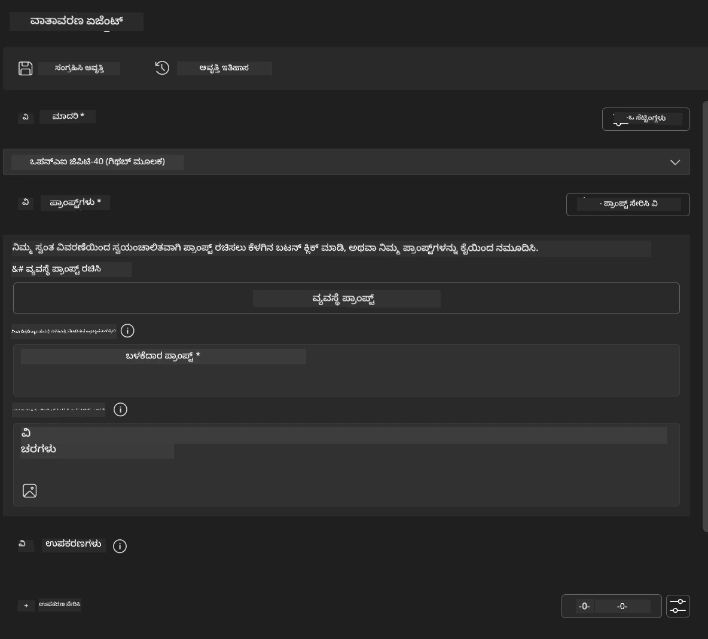
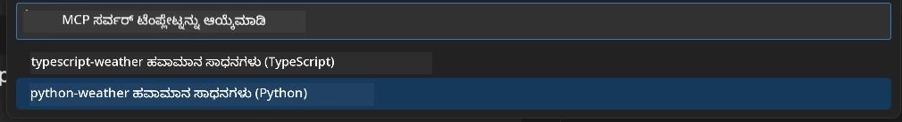
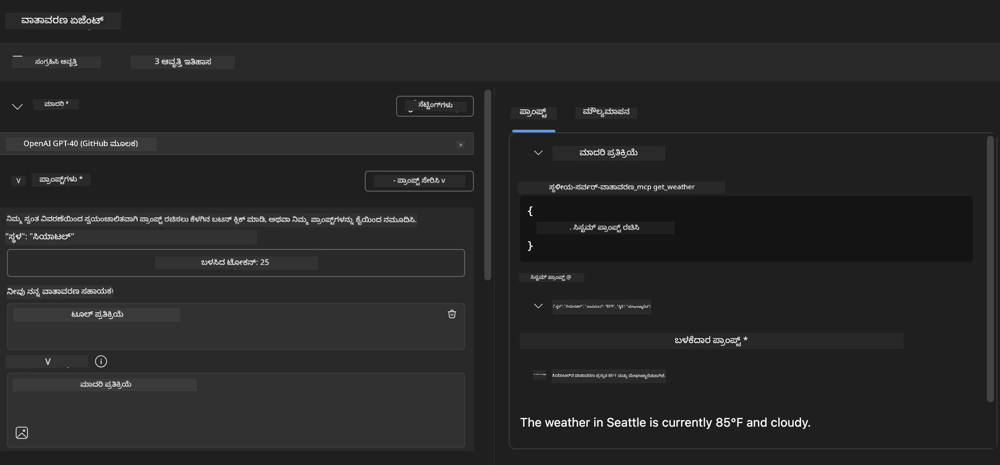
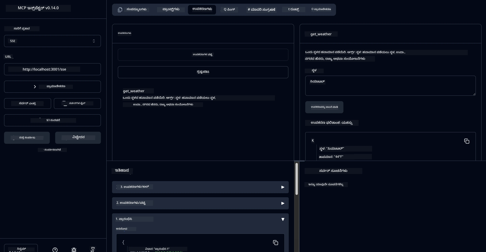

# 🔧 ಮಾಡ್ಯೂಲ್ 3: ಮೈಕ್ರೋಸಾಫ್ಟ್ ಫೌಂಡ್ರೀ ಟೂಲ್ಕಿಟ್‌ನೊಂದಿಗೆ ಪ್ರಗತಿಶೀಲ MCP ಅಭಿವೃದ್ಧಿ

> [!NOTE]
> ಈ ಲ್ಯಾಬ್‌ನಲ್ಲಿ ಇನ್ಸ್‌ಪೆಕ್ಟರ್ URL ಗಳು ಪುರಾತನ `/sse` ಎಂಡ್‌ಪಾಯಿಂಟ್ ಅನ್ನು ಬಳಸುತ್ತವೆ ಮತ್ತು ಲକ್ತ MCP SDK `1.9.3` ಮತ್ತು ಇನ್ಸ್‌ಪೆಕ್ಟರ್ `0.14.0` ಅವಶ್ಯಕತೆಗಳನ್ನು ಗುರಿಯಾಗಿರುತ್ತವೆ. ಇವು ಪ್ರಸ್ತುತ `2026-07-28` ಸ್ಟ್ರೀಮೇಬಲ್ HTTP ಉದಾಹರಣೆಗಳು ಅಲ್ಲ.
> 
> 


## 🎯 ಅಧ್ಯಯನ ಗುರಿಗಳು

ಈ ಲ್ಯಾಬ್‌ನ ಅಂತ್ಯಕ್ಕೆ ನೀವು ಈ ಕೆಳಗಿನವುಗಳನ್ನು ಮಾಡಲು সক্ষমರಾಗುತ್ತೀರಿ:

- ✅ ಮೈಕ್ರೋಸಾಫ್ಟ್ ಫೌಂಡ್ರೀ ಟೂಲ್ಕಿಟ್ ಬಳಸಿ ಕಸ್ಟಮ್ MCP ಸರ್ವರ್‌ಗಳನ್ನು ರಚಿಸುವುದು
- ✅ უலக MCP Python SDK (v1.9.3) ಅನ್ನು ಸಂರಚಿಸಿ ಮತ್ತು ಬಳಸುವುದು
- ✅ ಡಿಬಗಿಂಗ್‌ಗೆ MCP ಇನ್ಸ್‌ಪೆಕ್ಟರ್ ಅನ್ನು ಸ್ಥಾಪಿಸಿ ಮತ್ತು ಉಪಯೋಗಿಸು
- ✅ ಏಜೆಂಟ್ ಬಿಲ್ಡರ್ ಮತ್ತು ಇನ್ಸ್‌ಪೆಕ್ಟರ್ ಪರಿಸರದಲ್ಲಿ MCP ಸರ್ವರ್‌ಗಳನ್ನು ಡಿಬಗ್ ಮಾಡುವುದು
- ✅ ಪ್ರಗತಿಶೀಲ MCP ಸರ್ವರ್ ಅಭಿವೃದ್ಧಿ ಕಾರ್ಯಪ್ರವಾಹಗಳನ್ನು ಅರ್ಥಮಾಡಿಕೊಳ್ಳುವುದು

## 📋 ಪೂರ್ವಾಪೇಕ್ಷಿತಿಗಳು

- ಲ್ಯಾಬ್ 2 (MCP അടിസ്ഥാനಗಳು) ಪೂರ್ಣಗೊಳಿಸಲಾಗಿದೆ
- ಮೈಕ್ರೋಸಾಫ್ಟ್ ಫೌಂಡ್ರೀ ಟೂಲ್ಕಿಟ್ ವಿಸ್ತರಣೆ ಹೊಂದಿರುವ VS ಕೋಡ್
- Python 3.10+ ಪರಿಸರ
- ಇನ್ಸ್‌ಪೆಕ್ಟರ್ ಸ್ಥಾಪನೆಗೆ Node.js ಮತ್ತು npm

## 🏗️ ನೀವು ನಿರ್ಮಿಸುವುದು

ಈ ಲ್ಯಾಬ್‌ನಲ್ಲಿ ನೀವು **ವಾತಾವರಣ MCP ಸರ್ವರ್** ಅನ್ನು ನಿರ್ಮಿಸುತ್ತೀರಿ, ಇದು ಈ ಕೆಳಗಿನವುಗಳನ್ನು ಪ್ರದರ್ಶಿಸುತ್ತದೆ:
- ಕಸ್ಟಮ್ MCP ಸರ್ವರ್ ಜಾರಿಗೊಳಿಸುವಿಕೆ
- ಮೈಕ್ರೋಸಾಫ್ಟ್ ಫೌಂಡ್ರೀ ಟೂಲ್ಕಿಟ್ ಏಜೆಂಟ್ ಬಿಲ್ಡರ್ ಜೊತೆಗೆ ಸಮ್ಮಿಲನ
- ವೃತ್ತಿಪರ ಡಿಬಗಿಂಗ್ ಕಾರ್ಯಪ್ರವಾಹಗಳು
- ಆಧುನಿಕ MCP SDK ಬಳಕೆಯ ಮಾದರಿಗಳು

---

## 🔧 ಮೂಲ ಘಟಕಗಳ ಪರಿಶೀಲನೆ

### 🐍 MCP Python SDK
ಮಾದರಿ ಸಂದರ್ಭ ಪ್ರೋಟೋಕಾಲ್ Python SDK ಕಸ್ಟಮ್ MCP ಸರ್ವರ್‌ಗಳನ್ನು ನಿರ್ಮಿಸಲು ಮೂಲಾಧಾರವನ್ನು ಒದಗಿಸುತ್ತದೆ. ನೀವು ಆದರ್ಶ ಡಿಬಗಿಂಗ್ ಸಾಮರ್ಥ್ಯಗಳೊಂದಿಗೆ 1.9.3 ಆವೃತ್ತಿಯನ್ನು ಬಳಸಲಿದ್ದೀರಿ.

### 🔍 MCP ಇನ್ಸ್‌ಪೆಕ್ಟರ್
ಶಕ್ತಿಶಾಲಿ ಡಿಬಗಿಂಗ್ ಸಾಧನ, ಇದು ಒದಗಿಸುತ್ತದೆ:
- ನೈಜ ಸಮಯದ ಸರ್ವರ್ ನಿಗಾವಣೆ
- ಟೂಲ್ ನಿರ್ವಹಣೆಯ ದೃಶ್ಯೀಕರಣ
- ನೆಟ್‌ವರ್ಕ್ ವಿನಂತಿಗಳು/ಪ್ರತಿಕ್ರಿಯಾ ಪರಿಶೀಲನೆ
- ಪರಸ್ಪರ ಕ್ರಿಯಾಶೀಲ ಪರೀಕ್ಷಾ ವಾತಾವರಣ

---

## 📖 ಹಂತ ಹಂತವಾಗಿ ಜಾರಿ ಮಾಡಲು

### ಹಂತ 1: ಏಜೆಂಟ್ ಬಿಲ್ಡರ್‌ನಲ್ಲಿ WeatherAgent ರಚಿಸಿ

1. **VS ಕೋಡ್‌ನಲ್ಲಿ ಮೈಕ್ರೋಸಾಫ್ಟ್ ಫೌಂಡ್ರೀ ಟೂಲ್ಕಿಟ್ ವಿಸ್ತರಣೆಯ ಮೂಲಕ ಏಜೆಂಟ್ ಬಿಲ್ಡರ್ಅನ್ನು ಪ್ರಾರಂಭಿಸು**
2. **ಹೀಗೆ ಸಂರಚನೆಯೊಂದಿಗೆ ಹೊಸ ಏಜೆಂಟ್ ರಚಿಸಿ:**
   - ಏಜೆಂಟ್ ಹೆಸರು: `WeatherAgent`



### ಹಂತ 2: MCP ಸರ್ವರ್ ಯೋಜನೆಯನ್ನು ಆರಂಭಿಸು

1. **ಏಜೆಂಟ್ ಬಿಲ್ಡರ್‌ನಲ್ಲಿ Tools → Add Tool ಗೆ ನವಿಗೇಟ್ ಮಾಡಿ**
2. **ಲಭ್ಯವಿರುವ ಆಯ್ಕೆಗಳಿಂದ "MCP Server" ಆಯ್ಕೆಮಾಡಿ**
3. **"Create A new MCP Server" ಆಯ್ಕೆಮಾಡಿ**
4. **`python-weather` ಟೆಂಪ್ಲೇಟನ್ನು ಆಯ್ಕೆಮಾಡಿ**
5. **ನಿಮ್ಮ ಸರ್ವರ್‌ಗೆ ಹೆಸರಿಡಿ:** `weather_mcp`



### ಹಂತ 3: ಯೋಜನೆಯನ್ನು ತೆರೆಯಿರಿ ಮತ್ತು ಪರಿಶೀಲಿಸಿ

1. **ತಯಾರಾದ ಯೋಜನೆಯನ್ನು VS ಕೋಡ್‌ನಲ್ಲಿ ತೆರೆಯಿರಿ**
2. **ಯೋಜನಾ ಸಂರಚನೆಯನ್ನು ಪರಿಶೀಲಿಸಿ:**
   ```
   weather_mcp/
   ├── src/
   │   ├── __init__.py
   │   └── server.py
   ├── inspector/
   │   ├── package.json
   │   └── package-lock.json
   ├── .vscode/
   │   ├── launch.json
   │   └── tasks.json
   ├── pyproject.toml
   └── README.md
   ```

### ಹಂತ 4: ಇತ್ತೀಚಿನ MCP SDK ಗೆ ಅಪ್ಗ್ರೆಡ್ ಮಾಡಿ

> **🔍 ಏಕೆ ಅಪ್ಗ್ರೆಡ್ ಮಾಡಬೇಕು?** ನಾವು ಇತ್ತೀಚಿನ MCP SDK (v1.9.3) ಮತ್ತು ಇನ್ಸ್‌ಪೆಕ್ಟರ್ ಸೇವೆ (0.14.0)ಯನ್ನು ಹೆಚ್ಚಿನ ವೈಶಿಷ್ಟ್ಯಗಳು ಮತ್ತು ಉತ್ತಮ ಡಿಬಗಿಂಗ್ ಸಾಮರ್ಥ್ಯಗಳಿಗಾಗಿ ಬಳಸಬೇಕು.

#### 4a. Python ಅವಲಂಬನೆಗಳನ್ನು ನವೀಕರಿಸಿ

**`pyproject.toml` ಸಂಪಾದಿಸಿ:** [./code/weather_mcp/pyproject.toml](../../../../10-StreamliningAIWorkflowsBuildingAnMCPServerWithAIToolkit/lab3/code/weather_mcp/pyproject.toml) ನವೀಕರಿಸಿ


#### 4b. ಇನ್ಸ್‌ಪೆಕ್ಟರ್ ಕಾಂಫಿಗರೇಶನ್ ನವೀಕರಿಸಿ

**`inspector/package.json` ಸಂಪಾದಿಸಿ:** [./code/weather_mcp/inspector/package.json](../../../../10-StreamliningAIWorkflowsBuildingAnMCPServerWithAIToolkit/lab3/code/weather_mcp/inspector/package.json) ನವೀಕರಿಸಿ

#### 4c. ಇನ್ಸ್‌ಪೆಕ್ಟರ್ ಅವಲಂಬನೆಗಳನ್ನು ನವೀಕರಿಸಿ

**`inspector/package-lock.json` ಸಂಪಾದಿಸಿ:** [./code/weather_mcp/inspector/package-lock.json](../../../../10-StreamliningAIWorkflowsBuildingAnMCPServerWithAIToolkit/lab3/code/weather_mcp/inspector/package-lock.json) ನವೀಕರಿಸಿ

> **📝 ಟಿಪ್ಪಣಿ:** ಈ ಫೈಲ್‌ ನಲ್ಲಿ ವ್ಯಾಪಕವಾದ ಅವಲಂಬನೆ ವಿವರಗಳಿವೆ. ಕೆಳಗಿನವು ಅತ್ಯಾವಶ್ಯಕ ರಚನೆ - ಪೂರ್ಣ ವಿಷಯವು ಸಮರ್ಪಕ ಅವಲಂಬನೆ ಪರಿಹಾರವನ್ನು ಖಾತ್ರಿಪಡಿಸುತ್ತದೆ.


> **⚡ ಸಂಪೂರ್ಣ ಪ್ಯಾಕೇಜ್ ಲಾಕ್:** ಪೂರ್ಣ package-lock.json ನಲ್ಲಿ ~3000 ಸಾಲುಗಳ ಅವಲಂಬನೆ ವಿವರಗಳಿವೆ. ಮೇಲಿನವು ಪ್ರಮುಖ ರಚನೆಯನ್ನು ತೋರಿಸುತ್ತದೆ - ಸಂಪೂರ್ಣ ಅವಲಂಬನೆ ಪರಿಹಾರದಿಗಾಗಿ ನೀಡಲಾದ ಫೈಲ್ ಬಳಸಿರಿ.

### ಹಂತ 5: VS ಕೋಡ್ ಡಿಬಗ್ಗಿಂಗ್ ಸಂರಚನೆ

*ಟಿಪ್ಪಣಿ: ದಯವಿಟ್ಟು ಸೂಚಿಸಲಾದ ಮಾರ್ಗದಲ್ಲಿರುವ ಫೈಲ್ ಅನ್ನು ನಕಲಿಸಿ ಸಂಬಂಧಿತ ಸ್ಥಳೀಯ ಫೈಲ್ ಅನ್ನು ಬದಲಾಯಿಸಿ*

#### 5a. ಲಾಂಚ್ ಸಂರಚನೆಯನ್ನು ನವೀಕರಿಸಿ

**`.vscode/launch.json` ಸಂಪಾದಿಸಿ:**

```json
{
  "version": "0.2.0",
  "configurations": [
    {
      "name": "Attach to Local MCP",
      "type": "debugpy",
      "request": "attach",
      "connect": {
        "host": "localhost",
        "port": 5678
      },
      "presentation": {
        "hidden": true
      },
      "internalConsoleOptions": "neverOpen",
      "postDebugTask": "Terminate All Tasks"
    },
    {
      "name": "Launch Inspector (Edge)",
      "type": "msedge",
      "request": "launch",
      "url": "http://localhost:6274?timeout=60000&serverUrl=http://localhost:3001/sse#tools",
      "cascadeTerminateToConfigurations": [
        "Attach to Local MCP"
      ],
      "presentation": {
        "hidden": true
      },
      "internalConsoleOptions": "neverOpen"
    },
    {
      "name": "Launch Inspector (Chrome)",
      "type": "chrome",
      "request": "launch",
      "url": "http://localhost:6274?timeout=60000&serverUrl=http://localhost:3001/sse#tools",
      "cascadeTerminateToConfigurations": [
        "Attach to Local MCP"
      ],
      "presentation": {
        "hidden": true
      },
      "internalConsoleOptions": "neverOpen"
    }
  ],
  "compounds": [
    {
      "name": "Debug in Agent Builder",
      "configurations": [
        "Attach to Local MCP"
      ],
      "preLaunchTask": "Open Agent Builder",
    },
    {
      "name": "Debug in Inspector (Edge)",
      "configurations": [
        "Launch Inspector (Edge)",
        "Attach to Local MCP"
      ],
      "preLaunchTask": "Start MCP Inspector",
      "stopAll": true
    },
    {
      "name": "Debug in Inspector (Chrome)",
      "configurations": [
        "Launch Inspector (Chrome)",
        "Attach to Local MCP"
      ],
      "preLaunchTask": "Start MCP Inspector",
      "stopAll": true
    }
  ]
}
```

**`.vscode/tasks.json` ಸಂಪಾದಿಸಿ:**

```
{
  "version": "2.0.0",
  "tasks": [
    {
      "label": "Start MCP Server",
      "type": "shell",
      "command": "python -m debugpy --listen 127.0.0.1:5678 src/__init__.py sse",
      "isBackground": true,
      "options": {
        "cwd": "${workspaceFolder}",
        "env": {
          "PORT": "3001"
        }
      },
      "problemMatcher": {
        "pattern": [
          {
            "regexp": "^.*$",
            "file": 0,
            "location": 1,
            "message": 2
          }
        ],
        "background": {
          "activeOnStart": true,
          "beginsPattern": ".*",
          "endsPattern": "Application startup complete|running"
        }
      }
    },
    {
      "label": "Start MCP Inspector",
      "type": "shell",
      "command": "npm run dev:inspector",
      "isBackground": true,
      "options": {
        "cwd": "${workspaceFolder}/inspector",
        "env": {
          "CLIENT_PORT": "6274",
          "SERVER_PORT": "6277",
        }
      },
      "problemMatcher": {
        "pattern": [
          {
            "regexp": "^.*$",
            "file": 0,
            "location": 1,
            "message": 2
          }
        ],
        "background": {
          "activeOnStart": true,
          "beginsPattern": "Starting MCP inspector",
          "endsPattern": "Proxy server listening on port"
        }
      },
      "dependsOn": [
        "Start MCP Server"
      ]
    },
    {
      "label": "Open Agent Builder",
      "type": "shell",
      "command": "echo ${input:openAgentBuilder}",
      "presentation": {
        "reveal": "never"
      },
      "dependsOn": [
        "Start MCP Server"
      ],
    },
    {
      "label": "Terminate All Tasks",
      "command": "echo ${input:terminate}",
      "type": "shell",
      "problemMatcher": []
    }
  ],
  "inputs": [
    {
      "id": "openAgentBuilder",
      "type": "command",
      "command": "ai-mlstudio.agentBuilder",
      "args": {
        "initialMCPs": [ "local-server-weather_mcp" ],
        "triggeredFrom": "vsc-tasks"
      }
    },
    {
      "id": "terminate",
      "type": "command",
      "command": "workbench.action.tasks.terminate",
      "args": "terminateAll"
    }
  ]
}
```


---

## 🚀 ನಿಮ್ಮ MCP ಸರ್ವರ್ ಅನ್ನು ಚಾಲನೆ ಮತ್ತು ಪರೀಕ್ಷೆ ಮಾಡುವುದು

### ಹಂತ 6: ಅವಲಂಬನೆಗಳು ಇನ್‌ಸ್ಟಾಲ್ ಮಾಡಿ

ಸಂರಚನಾ ಬದಲಾವಣೆಗಳನ್ನು ಮಾಡಿದ ನಂತರ, ಈ ಕೆಳಗಿನ ಆಜ್ಞೆಗಳು ನಡೆಸಿ:

**Python ಅವಲಂಬನೆಗಳನ್ನು ಇನ್‌ಸ್ಟಾಲ್ ಮಾಡಿ:**
```bash
uv sync
```

**ಇನ್ಸ್‌ಪೆಕ್ಟರ್ ಅವಲಂಬನೆಗಳನ್ನು ಇನ್‌ಸ್ಟಾಲ್ ಮಾಡಿ:**
```bash
cd inspector
npm install
```

### ಹಂತ 7: ಏಜೆಂಟ್ ಬಿಲ್ಡರ್‌ನೊಂದಿಗೆ ಡಿಬಗ್ ಮಾಡಿ

1. **F5 ಒತ್ತಿ** ಅಥವಾ **"Debug in Agent Builder"** ಸಂರಚನೆಯನ್ನು ಬಳಸಿ
2. **ಡಿಬಗ್ ಪ್ಯಾನೆಲ್‌ನಿಂದ ಸಂಯುಕ್ತ ಸಂರಚನೆಯನ್ನು ಆಯ್ಕೆಮಾಡಿ**
3. **ಸರ್ವರ್ ಪ್ರಾರಂಭವಾಗಲು ಮತ್ತು ಏಜೆಂಟ್ ಬಿಲ್ಡರ್ ತೆರೆಯಲು ಕಾಯಿರಿ**
4. **ಸುಸ್ವಭಾವ ಭಾಷಾ ಪ್ರಶ್ನೆಗಳೊಂದಿಗೆ ನಿಮ್ಮ ವಾತಾವರಣ MCP ಸರ್ವರ್ ಅನ್ನು ಪರೀಕ್ಷಿಸಿ**

ಇನ್‌ಪುಟ್ ಪ್ರಾಂಪ್ಟ್ ಹೀಗೆ

SYSTEM_PROMPT

```
You are my weather assistant
```

USER_PROMPT

```
How's the weather like in Seattle
```



### ಹಂತ 8: MCP ಇನ್ಸ್‌ಪೆಕ್ಟರ್‌ನೊಂದಿಗೆ ಡಿಬಗ್ ಮಾಡಿ

1. **"Debug in Inspector"** ಸಂರಚನೆಯನ್ನು ಬಳಸಿ (ಎಡ್ಜ್ ಅಥವಾ ಕ್ರೋಮ್)
2. **`http://localhost:6274` ನಲ್ಲಿ ಇನ್ಸ್‌ಪೆಕ್ಟರ್ ಇಂಟರ್ಫೇಸ್ ತೆರೆಯಿರಿ**
3. **ಪರಸ್ಪರ ಕ್ರಿಯಾಶೀಲ ಪರೀಕ್ಷಾ ವಾತಾವರಣವನ್ನು ಅನ್ವೇಷಿಸಿ:**
   - ಲಭ್ಯವಿರುವ ಟೂಲ್‌ಗಳನ್ನು ವೀಕ್ಷಿಸಿ
   - ಟೂಲ್ ಕಾರ್ಯಾಚರಣೆಯನ್ನು ಪರೀಕ್ಷಿಸಿ
   - ನೆಟ್‌ವರ್ಕ್ ವಿನಂತಿಗಳನ್ನು ನಿಗದಿಪಡಿಸಿ
   - ಸರ್ವರ್ ಪ್ರತಿಕ್ರಿಯೆಗಳನ್ನು ಡಿಬಗ್ ಮಾಡಿ



---

## 🎯 ಮುಖ್ಯ ಅಧ್ಯಯನ ಫಲಿತಾಂಶಗಳು

ಈ ಲ್ಯಾಬ್ ಪೂರ್ಣಗೊಳಿಸುವ ಮೂಲಕ, ನೀವು:

- [x] **ಮೈಕ್ರೋಸಾಫ್ಟ್ ಫೌಂಡ್ರೀ ಟೂಲ್ಕಿಟ್ ಟೆಂಪ್ಲೇಟ್ಗಳನ್ನು ಬಳಸಿ ಕಸ್ಟಮ್ MCP ಸರ್ವರ್ ರಚಿಸಲಾಗಿದೆ**
- [x] **ಹೆಚ್ಚಿನ ಕಾರ್ಯಕ್ಷಮತೆಗಾಗಿ ಇತ್ತೀಚಿನ MCP SDK (v1.9.3) ಗೆ ಅಪ್ಗ್ರೆಡ್ ಮಾಡಲಾಗಿದೆ**
- [x] **ಏಜೆಂಟ್ ಬಿಲ್ಡರ್ ಮತ್ತು ಇನ್ಸ್‌ಪೆಕ್ಟರ್ ಎರಡೂಗೆ ವೃತ್ತಿಪರ ಡಿಬಗಿಂಗ್ ಕಾರ್ಯಪ್ರವಾಹಗಳನ್ನು ಸಂರಚಿಸಲಾಗಿದೆ**
- [x] **ಪರಸ್ಪರ ಕ್ರಿಯಾಶೀಲ ಸರ್ವರ್ ಪರೀಕ್ಷೆಗೆ MCP ಇನ್ಸ್‌ಪೆಕ್ಟರ್ ಅನ್ನು ಸ್ಥಾಪಿಸಲಾಗಿದೆ**
- [x] **MCP ಅಭಿವೃದ್ಧಿಗಾಗಿ VS ಕೋಡ್ ಡಿಬಗ್ಗಿಂಗ್ ಸಂರಚನೆಗಳನ್ನು ನಿಪುಣತೆಯಿಂದ ನಿರ್ವಹಿಸಲಾಗಿದೆ**

## 🔧 ಅವಲೋಕಿತ ಪ್ರಗತಿಶೀಲ ವೈಶಿಷ್ಟ್ಯಗಳು

| ವೈಶಿಷ್ಟ್ಯ | ವಿವರಣೆ | ಬಳಕೆ ಪ್ರಕರಣ |
|---------|-------------|----------|
| **MCP Python SDK v1.9.3** | ಇತ್ತೀಚಿನ ಪ್ರೋಟೋಕಾಲ್ ಜಾರಿಗೊಳಿಸುವಿಕೆ | ಆಧುನಿಕ ಸರ್ವರ್ ಅಭಿವೃದ್ಧಿ |
| **MCP ಇನ್ಸ್‌ಪೆಕ್ಟರ್ 0.14.0** | ಪರಸ್ಪರ ಡಿಬಗಿಂಗ್ ಸಾಧನ | ನೈಜ ಸಮಯದ ಸರ್ವರ್ ಪರೀಕ್ಷೆ |
| **VS ಕೋಡ್ ಡಿಬಗ್ಗಿಂಗ್** | ಇಡೀ ಅಭಿವೃದ್ಧಿ ಪರಿಸರ | ವೃತ್ತಿಪರ ಡಿಬಗ್ ಕಾರ್ಯಪ್ರವಾಹ |
| **ಏಜೆಂಟ್ ಬಿಲ್ಡರ್ ಸಮ್ಮಿಲನ** | ಮೈಕ್ರೋಸಾಫ್ಟ್ ಫೌಂಡ್ರೀ ಟೂಲ್ಕಿಟ್ ನೇರ ಸಂಪರ್ಕ | ಸಂಪೂರ್ಣ ಏಜೆಂಟ್ ಪರೀಕ್ಷೆ |

## 📚 ಹೆಚ್ಚುವರಿ ಸಂಪನ್ಮೂಲಗಳು

- [MCP Python SDK ಡಾಕ್ಯುಮೆಂಟೇಶನ್](https://modelcontextprotocol.io/docs/sdk/python)
- [ಮೈಕ್ರೋಸಾಫ್ಟ್ ಫೌಂಡ್ರೀ ಟೂಲ್ಕಿಟ್ ವಿಸ್ತರಣೆ ಮಾರ್ಗದರ್ಶಿ](https://code.visualstudio.com/docs/ai/ai-toolkit)
- [VS ಕೋಡ್ ಡಿಬಗ್ಗಿಂಗ್ ಡಾಕ್ಯುಮೆಂಟೇಶನ್](https://code.visualstudio.com/docs/editor/debugging)
- [ಮಾದರಿ ಸಂದರ್ಭ ಪ್ರೋಟೋಕಾಲ್ ನಿರ್ದಿಷ್ಟತೆ](https://modelcontextprotocol.io/docs/concepts/architecture)

---

**🎉 ಅಭಿನಂದನೆಗಳು!** ನೀವು ಯಶಸ್ವಿಯಾಗಿ ಲ್ಯಾಬ್ 3 ಪೂರ್ಣಗೊಳಿಸಿದ್ದೀರಿ ಮತ್ತು ಈಗ ವೃತ್ತಿಪರ ಅಭಿವೃದ್ಧಿ ಕಾರ್ಯಪ್ರವಾಹಗಳನ್ನು ಬಳಸಿ ಕಸ್ಟಮ್ MCP ಸರ್ವರ್‌ಗಳನ್ನು ರಚಿಸಬಹುದು, ಡಿಬಗ್ ಮಾಡಬಹುದು ಮತ್ತು ನಿಯೋಜಿಸಬಹುದು.

### 🔜 ಮುಂದಿನ ಮಾಡ್ಯೂಲ್‌ಗೆ ಮುಂದುವರಿಯಿರಿ

ನಿಮ್ಮ MCP ಕೌಶಲ್ಯಗಳನ್ನು ನೈಜ-ಲೋಕಾರ ಸಮರ್ಥನೆಯ ಕಾರ್ಯಪ್ರವಾಹಕ್ಕೆ ಅನ್ವಯಿಸಲು ಸಿದ್ಧರಾಯಿದ್ದೀರಾ? ಮುಂದುವರಿಯಿರಿ **[ಮಾಡ್ಯೂಲ್ 4: ಪ್ರಾಯೋಗಿಕ MCP ಅಭಿವೃದ್ಧಿ - ಕಸ್ಟಮ್ GitHub ಕ್ಲೋನ್ ಸರ್ವರ್](../lab4/README.md)** ಇಲ್ಲಿ ನೀವು:
- ಉತ್ಪಾದನಾ ಸಮರ್ಥ MCP ಸರ್ವರ್ ರಚಿಸುವಿರಿ, ಇದು GitHub ರಿಪೊಸಿಟರಿ ಕಾರ್ಯಾಚರಣೆಗಳನ್ನು ಸ್ವಯಂಚಾಲಿತಗೊಳಿಸುತ್ತದೆ
- MCP ಮೂಲಕ GitHub ರಿಪೊಸಿಟರಿ ಕ್ಲೋನಿಂಗ್ ಕಾರ್ಯಕ್ಷಮತೆಯನ್ನು ಜಾರಿಗೊಳಿಸು
- ಕಸ್ಟಮ್ MCP ಸರ್ವರ್ ಗಳನ್ನು VS ಕೋಡ್ ಮತ್ತು GitHub Copilot ಏಜೆಂಟ್ ಮೋಡ್‌ೊಂದಿಗೆ ಸಮ್ಮಿಳನಗೊಳಿಸು
- ಉತ್ಪಾದನಾ ಪರಿಸರಗಳಲ್ಲಿ ಕಸ್ಟಮ್ MCP ಸರ್ವರ್‌ಗಳನ್ನು ಪರೀಕ್ಷಿಸಿ ಮತ್ತು ನಿಯೋಜಿಸು
- ಡೆವಲಪರ್‌ಗಳಿಗೆ ಪ್ರಾಯೋಗಿಕ ಕಾರ್ಯಪ್ರವಾಹ ಸ್ವಯಂಚಾಲನೆ ಶીખಿ

---

<!-- CO-OP TRANSLATOR DISCLAIMER START -->
**ಅಸ್ವೀಕಾರ**:
ಈ ದಸ್ತಾವೇಜು AI ಅನುವಾದ ಸೇವೆ [Co-op Translator](https://github.com/Azure/co-op-translator) ಬಳಸಿ ಅನುವಾದಿಸಲಾಗಿದೆ. ನಾವು ನಿಖರತೆಯನ್ನು ಸಾಧಿಸಲು ಪ್ರಯತ್ನಿಸುತ್ತಿದ್ದರೂ, ದಯವಿಟ್ಟು ಗಮನಿಸಿ, ಸ್ವಯಂಚಾಲಿತ ಅನುವಾದಗಳಲ್ಲಿ ದೋಷಗಳು ಅಥವಾ ಅಸಡ್ಡೆಗಳು ಇರಬಹುದು. ಮೂಲ ಭಾಷೆಯಲ್ಲಿರುವ ಮೂಲ ದಸ್ತಾವೇಜು ಪ್ರಾಮಾಣಿಕ ಮೂಲವೆಂದು ಪರಿಗಣಿಸಬೇಕು. ಪ್ರಮುಖ ಮಾಹಿತಿಗಾಗಿ, ವೃತ್ತಿಪರ ಮಾನವ ಅನುವಾದವನ್ನು ಶಿಫಾರಸು ಮಾಡಲಾಗುತ್ತದೆ. ಈ ಅನುವಾದವನ್ನು ಬಳಸುವ ಮೂಲಕ ಉಂಟಾಗುವ ಯಾವುದೇ ತಪ್ಪು ಅರ್ಥಗಳ ಅಥವಾ ತಪ್ಪು ವ್ಯಾಖ್ಯಾನಗಳ ಬಗ್ಗೆ ನಾವು ಹೊಣೆಗಾರರಲ್ಲ.
<!-- CO-OP TRANSLATOR DISCLAIMER END -->