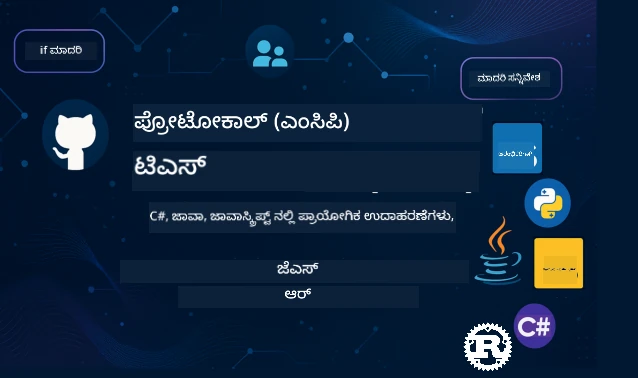

 

[](https://GitHub.com/microsoft/mcp-for-beginners/graphs/contributors)
[](https://GitHub.com/microsoft/mcp-for-beginners/issues)
[](https://GitHub.com/microsoft/mcp-for-beginners/pulls)
[](http://makeapullrequest.com)

[](https://GitHub.com/microsoft/mcp-for-beginners/watchers)
[](https://GitHub.com/microsoft/mcp-for-beginners/fork)
[](https://GitHub.com/microsoft/mcp-for-beginners/stargazers)


[](https://discord.gg/nTYy5BXMWG)

ಈ ಸಂಪನ್ಮೂಲಗಳನ್ನು ఉపయోగಿಸಲು ಪ್ರಾರಂಭಿಸಲು ಈ ಕ್ರಮಗಳನ್ನು ಅನುಸರಿಸಿ:
1. **ರಿಪോസಿಟರಿಯನ್ನು ಫೋರ್ಕ್ ಮಾಡಿ**: ಕ್ಲಿಕ್ ಮಾಡಿ [](https://GitHub.com/microsoft/mcp-for-beginners/fork)
2. **ರಿಪೊಸಿಟರಿಯನ್ನು ಕ್ಲೋನ್ ಮಾಡಿ**:   `git clone https://github.com/microsoft/mcp-for-beginners.git`
3. **ಸಂದರ್ಶಿಸಿ** [](https://discord.gg/nTYy5BXMWG)


### 🌐 ಬಹುಭಾಷಾ ಬೆಂಬಲ

#### GitHub ಕ್ರಿಯೆಯಿಂದ ಬೆಂಬಲಿತ(ಸ್ವಯಂಚಾಲಿತ ಮತ್ತು ಸದಾ تازಾ)

<!-- CO-OP TRANSLATOR LANGUAGES TABLE START -->
[ಅರಬಿಕ್](../ar/README.md) | [ಬಾಂಗ್ಲಾ](../bn/README.md) | [ಬಲ್ಗೇರಿ](../bg/README.md) | [ಬರ್ಮೀಸ್ (ಮ್ಯಾಂಮಾರ್)](../my/README.md) | [ಚೀನೀ (ಸರಳ)](../zh-CN/README.md) | [ಚೀನೀ (ಪಾರಂಪರಿಕ, ಹಾಂಗ್ ಕಾಂಗ್)](../zh-HK/README.md) | [ಚೀನೀ (ಪಾರಂಪರಿಕ, ಮಾಕಾವ್)](../zh-MO/README.md) | [ಚೀನೀ (ಪಾರಂಪರಿಕ, ತೈವಾನ್)](../zh-TW/README.md) | [ಕ್ರೋಯೇಷಿಯನ್](../hr/README.md) | [ಚೆಕ್](../cs/README.md) | [ಡೆನಿಷ್](../da/README.md) | [ಡಚ್](../nl/README.md) | [ಎಸ್ಟೋನಿಯನ್](../et/README.md) | [ಫಿನ್ನಿಷ್](../fi/README.md) | [ಫ್ರೆಂಚ್](../fr/README.md) | [ಜರ್ಮನ್](../de/README.md) | [ಗ್ರೀಕ್](../el/README.md) | [ಹಿಬ್ರೂ](../he/README.md) | [ಹಿಂದಿ](../hi/README.md) | [ಹಂಗೇರಿಯನ್](../hu/README.md) | [ಇಂಡೋನೇಶಿಯನ್](../id/README.md) | [ಇಟಾಲಿಯನ್](../it/README.md) | [ಜಾಪನೀಸ್](../ja/README.md) | [ಕನ್ನಡ](./README.md) | [ಕೋರಿಯನ್](../ko/README.md) | [ಲಿಥುವೇನಿಯನ್](../lt/README.md) | [ಮಲಯ್](../ms/README.md) | [ಮಲಯಾಳಂ](../ml/README.md) | [ಮರಾಠಿ](../mr/README.md) | [ನೇಪಾಳಿ](../ne/README.md) | [ನೈಜೀರಿಯನ್ ಪಿಜಿನ್](../pcm/README.md) | [ನಾರ್ವೇಜಿಯನ್](../no/README.md) | [ಪರ್ಶಿಯನ್ (ಫಾರ್ಸಿ)](../fa/README.md) | [ಪೋಲಿಶ್](../pl/README.md) | [ಪೋರ್ತುಗೀಸ್ (ಬ್ರೆಜಿಲ್)](../pt-BR/README.md) | [ಪೋರ್ಚುಗೀಸ್ (ಪೋರ್ಚುಗಲ್)](../pt-PT/README.md) | [ಪಂಜಾಬಿ (ಗುರ್ಮುಖಿ)](../pa/README.md) | [ರೊಮೇನಿಯನ್](../ro/README.md) | [ರಷ್ಯನ್](../ru/README.md) | [ಸೆರ್ಬಿಯನ್ (ಸಿರಿಲಿಕ್)](../sr/README.md) | [ಸ್ಲೋವಾಕ್](../sk/README.md) | [ಸ್ಲೋವೇನಿಯನ್](../sl/README.md) | [ಸ್ಪ್ಯಾನಿಷ್](../es/README.md) | [ಸ್ವಾಹಿಲಿ](../sw/README.md) | [ಸ್ವೀಡಿಷ್](../sv/README.md) | [ತಾಗಾಲೋಗ್ (ಫಿಲಿಪಿನೋ)](../tl/README.md) | [ತಮಿಳು](../ta/README.md) | [ತೆಲುಗು](../te/README.md) | [ಥಾಯ್](../th/README.md) | [ಟರ್ಕಿಷ್](../tr/README.md) | [ಉಕ್ರೇನಿಯನ್](../uk/README.md) | [ಉರ್ಡು](../ur/README.md) | [ವಿಯೆತ್ನಾಮಿ](../vi/README.md)

> **ಸ್ಥಳೀಯವಾಗಿ ಕ್ಲೋನ್ ಮಾಡಲು ಇಚ್ಛಿಸುವಿರಾ?**

> ಈ ರಿಪೊಸಿಟರಿಯಲ್ಲಿ 50+ ಭಾಷಾ ಅನುವಾದಗಳಿವೆ, ಇದು ಡೌನ್‌ಲೋಡ್ ಗಾತ್ರವನ್ನು ಬಹಳ ಮಟ್ಟಿಗೆ ಹೆಚ್ಚಿಸುತ್ತದೆ. ಅನುವಾದಗಳಿಲ್ಲದೆ ಕ್ಲೋನ್ ಮಾಡಲು, ಸ್ಪಾರ್ಸ್ ಚೆಕೌಟ್ ಬಳಸಿ:
> ```bash
> git clone --filter=blob:none --sparse https://github.com/microsoft/mcp-for-beginners.git
> cd mcp-for-beginners
> git sparse-checkout set --no-cone '/*' '!translations' '!translated_images'
> ```
> ಇದು ಕೋರ್ಸ್ ಮುಗಿಸಲು ಅಗತ್ಯವಿರುವ ಎಲ್ಲವನ್ನೂ ನಿಮಗೆ ಕೊಡುತ್ತದೆ, ಬಹಳ ವೇಗವಾದ ಡೌನ್‌ಲೋಡ್ ಜೊತೆಗೆ.
<!-- CO-OP TRANSLATOR LANGUAGES TABLE END -->

# 🚀 ಮಾದರಿ ಸಂಧರ್ಭ ಪ್ರೋಟೋಕಾಲ್ (MCP) ಆರಂಭಿಕರಿಗಾಗಿ ಪಠ್ಯಕ್ರಮ

## **C#, Java, JavaScript, Rust, Python, ಮತ್ತು TypeScript ನಲ್ಲಿ ಹಸ್ತಾಂತರ್ ಉಲ್ಲೇಖಗಳೊಂದಿಗೆ MCP ಅನ್ನು ಕಲಿಯಿರಿ**

## 🧠 ಮಾದರಿ ಸಂಧರ್ಭ ಪ್ರೋಟೋಕಾಲ್ ಪಠ್ಯಕ್ರಮದ ಅವಲೋಕನ
ನೀವು ಮಾದರಿ ಸಂಧರ್ಭ ಪ್ರೋಟೋಕಾಲ್‌ನೊಳಗೆ ನಿಮ್ಮ ಪ್ರಯಾಣಕ್ಕೆ ಸ್ವಾಗತ! ನೀವು ಎಂದಾದರೂ ಈ ಐುದೃಷ್ಟಿತ AI ಆ್ಯಪ್ಲಿಕೇಷನ್‌ಗಳು ವಿಭಿನ್ನ ಸಾಧನಗಳು ಮತ್ತು ಸೇವೆಗಳೊಂದಿಗೆ ಸಂವಹನ ಮಾಡುವ ರೀತಿಯನ್ನು ತಿಳಿದುಕೊಂಡಿರದೆ ಇದ್ದರೆ, ನೀವು ಇಂಟಲಿಜೆಂಟ್ ವ್ಯವಸ್ಥೆಗಳು ಹೇಗೆ ನಿರ್ಮಿಸುತ್ತಿವೆ ಎಂಬ ಅದ್ಭುತ ಪರಿಹಾರವನ್ನು ಕಂಡುಹಿಡಿಯಲಿದ್ದೀರಿ.

MCP ಅನ್ನು AI ಆ್ಯಪ್ಲಿಕೇಷನ್‌ಗಳಿಗಾಗಿ ಏಕಕಾಲಿಕ ಭಾಷಾಂತರಕ ಎಂದು ಭಾವಿಸಿ - USB ಪೋರ್ಟ್‌ಗಳು ಯಾವುದಾದರೂ ಸಾಧನವನ್ನು ನಿಮ್ಮ ಕಂಪ್ಯೂಟರ್‌ಗೆ ಸಂಪರ್ಕಿಸಬಹುದಾದಂತೆ, MCP AI ಮಾದರಿಗಳನ್ನು ಯಾವುದೇ ಸಾಧನ ಅಥವಾ ಸೇವೆಗೆ ಮಾನಕವಾಗಿ ಸಂಪರ್ಕಿಸಲು ಅವಕಾಶ ನೀಡುತ್ತದೆ. ನೀವು ಮೊದಲ ಚಾಟ್‌ಬಾಟ್ ಅನ್ನು ಇಟ್ಟುಕೊಳ್ಳುತ್ತಿದ್ದೀರೋ ಅಥವಾ ಸಕ್ಲಿಷ್ಟ AI ಕಾರ್ಯವಾಹಿಗಳ ಮೇಲೆ ಕೆಲಸಮಾಡುತ್ತಿದ್ದೀರೋ, MCP ಅರ್ಥಮಾಡಿಕೊಳ್ಳುವುದರಿಂದ ಹೆಚ್ಚು ಶಕ್ತಿಶಾಲಿ ಮತ್ತು ಲವಚಿಕ ಆ್ಯಪ್ಲಿಕೇಷನ್‌ಗಳನ್ನು ನಿರ್ಮಿಸುವ ಸಾಮರ್ಥ್ಯ ಸಿಗುತ್ತದೆ.

ಈ ಪಠ್ಯಕ್ರಮವನ್ನು ನಿಮ್ಮ ಕಲಿಕೆಯ ಪ್ರಯಾಣಕ್ಕಾಗಿ ಸಹನೆ ಮತ್ತು ಜಾಗೃತಿ ಹೊಂದಿದಂತೆ ವಿನ್ಯಾಸಗೊಳಿಸಲಾಗಿದೆ. ನಾವು ನಿಮ್ಮ ತಿಳಿವಳಿಕೆ ಪ್ರಮಾಣದ ಅನುಗುಣವಾಗಿ ಸರಳ ತತ್ವಗಳಿಂದ ಪ್ರಾರಂಭಿಸಿ, ನಿಮ್ಮ ಪ್ರಿಯ ಪ್ರೋಗ್ರಾಮಿಂಗ್ ಭಾಷೆಯಲ್ಲಿ ಹಸ್ತಾಂತರ್ ಅಭ್ಯಾಸದಿಂದ ನಿಮ್ಮ ನಿಪುಣತೆಯನ್ನು ಕ್ರಮೇಣ ನಿರ್ಮಿಸುತ್ತೇವೆ. ಪ್ರತಿ ಹಂತವೂ ಸ್ಪಷ್ಟ ವಿವರಣೆಗಳು, ವಾಸ್ತవಿಕಉದಾಹರಣೆಗಳು ಮತ್ತು ಸಾಕಷ್ಟು ಪ್ರೋತ್ಸಾಹವನ್ನು ಒಳಗೊಂಡಿದೆ.

ನೀವು ಈ ಪ್ರವಾಸ ಮುಗಿಸಿಕೊಳ್ಳುವ ತನಕ, ನಿಮ್ಮದೇ MCP ಸರ್ವರ್‌ಗಳನ್ನು ನಿರ್ಮಿಸುವ ಧೈರ್ಯ ಸಿಗುತ್ತದೆ, ನಿಯಮಿತ AI ವೇದಿಕೆಗಳೊಂದಿಗೆ ಅವುಗಳನ್ನು ಸಂಯೋಜಿಸುವುದು, ಮತ್ತು ಈ ತಂತ್ರಜ್ಞಾನ AI ಅಭಿವೃದ್ಧಿಯ ಭವಿಷ್ಯವನ್ನು ಹೇಗೆ ರೂಪಿಸುತ್ತಿದೆ ಎಂಬುದನ್ನು ಅರ್ಥ ಮಾಡಿಕೊಳ್ಳುವುದಕ್ಕೆ ಸಾಧ್ಯವಾಗುತ್ತದೆ. ಇಗೋ ಈ ರೋಚಕ ಸಾಹಸವನ್ನು ಒಟ್ಟಾಗಿ ಪ್ರಾರಂಭಿಸೋಣ!

### ಅಧಿಕೃತ ಡಾಕ್ಯುಮೆಂಟೇಶನ್ ಮತ್ತು ಸ್ಪೆಸಿಫಿಕೇಷನ್‌ಗಳು

ನಿಮ್ಮ ಅರಿವಿನೊಡನೆ ಈ ಸಂಪನ್ಮೂಲಗಳು ಇನ್ನಷ್ಟು ಅಮೂಲ್ಯವಾಗುತ್ತವೆ, ಆದರೆ ಪ್ರತಿಯುತ್ತರವನ್ನು ತಕ್ಷಣ ಓದಲು ಒತ್ತಡಪಡಿಸಿಕೊಳ್ಳಬೇಡಿ. ನಿಮ್ಮ ಕನಸುಗಳ ಉದ್ಯಮವಲಯದಿಂದ ಪ್ರಾರಂಭಿಸಿ!
- 📘 [MCP ಡಾಕ್ಯುಮೆಂಟೇಶನ್](https://modelcontextprotocol.io/) – ಹಂತಹಂತದ ಪಾಠಗಳು ಮತ್ತು ಬಳಕೆದಾರ ಮಾರ್ಗದರ್ಶಕರಿಗಾಗಿ ನಿಮ್ಮ ಪ್ರಾಥಮಿಕ ಸಂಪನ್ಮೂಲ. ಈ ಡಾಕ್ಯುಮೆಂಟ್ ಆರಂಭಿಕರಿಗಾಗಿ ಬರೆದಿದ್ದು, ನೀವು ನಿಮ್ಮ ತಾಳ್ಮೆಯಿಂದ ಅನುಸರಿಸಬಹುದಾದ ಸ್ಪಷ್ಟ ಉದಾಹರಣೆಗಳನ್ನು ಒದಗಿಸುತ್ತದೆ.
- 📜 [MCP ಸ್ಪೆಸಿಫಿಕೇಶನ್](https://modelcontextprotocol.io/docs/) – ಇದು ನಿಮ್ಮ ಸಮಗ್ರ ರೆಫರೆನ್ಸ್ ಹಸ್ತಪೂರ್ವೆಯಂತೆ ಕಾಣಿಸಿಕೊಳ್ಳುತ್ತದೆ. ಪಠ್ಯಕ್ರಮವನ್ನು ಮುರಿದುಕೊಳ್ಳುವಾಗ, ನೀವು ಕೆಲವು ವಿಶಿಷ್ಟ ವಿವರಗಳನ್ನು ನೋಡಲು ಮತ್ತು ಉತ್ತಮ ವೈಶಿಷ್ಟ್ಯಗಳನ್ನು ಅನ್ವೇಷಿಸಲು ಇಲ್ಲಿ ಮರುಭೇಟಿಯಾದುದು.
- 📜 [ಮೂಲ MCP ಸ್ಪೆಸಿಫಿಕೇಶನ್](https://modelcontextprotocol.io/specification/versioning) – ಇದು ಹೆಚ್ಚಿನ ತಾಂತ್ರಿಕ ವಿವರಗಳನ್ನು ಒಳಗೊಂಡಿದ್ದು, ಜಟಿಲ ಅನುಷ್ಠಾನಗಳಿಗೆ ಸಹಾಯಕವಾಗಿದೆ. ನೀವು ಅದನ್ನು ಬೇಕಾದಾಗ ನೋಡಿ, ಆರಂಭದಲ್ಲಿ ಅದನ್ನು ಗಮನಿಸಬೇಡಿ.
- 🧑‍💻 [MCP GitHub ರಿಪೊಸಿಟರಿ](https://github.com/modelcontextprotocol) – ಇಲ್ಲಿ ನೀವು SDKಗಳು, ಸಾಧನಗಳು ಮತ್ತು ವಿವಿಧ ಪ್ರೋಗ್ರಾಮಿಂಗ್ ಭಾಷೆಗಳಲ್ಲಿ ಕೋಡ್ ಮಾದರಿಗಳನ್ನು ಕಾಣಬಹುದು. ಇದು ಅನೇಕ ಪ್ರಾಯೋಗಿಕ ಉದಾಹರಣೆಗಳು ಮತ್ತು ತಯಾರಾದ ಉಪಕಣಗಳನ್ನು ಹೊಂದಿದ ಖಜಾನೆ.
- 🌐 [MCP ಸಮುದಾಯ](https://github.com/orgs/modelcontextprotocol/discussions) – MCP ಬಗ್ಗೆ ಚರ್ಚೆಗಳಿಗಾಗಿ ಇತರ ಕಲಿಯುವವರು ಮತ್ತು ಅನುಭವಜ್ಞಾನ ಗಣಿತಗಳೊಂದಿಗೆ ಸೇರಿಸಿ. ಇದು ಸಹಾಯಕ ಸಮುದಾಯ, ಇಲ್ಲಿ ಪ್ರಶ್ನೆಗಳಿಗೆ ಸ್ವಾಗತ ಇದೆ ಮತ್ತು ಜ್ಞಾನ ವಿನಿಮಯ ಉಚಿತವಾಗಿದೆ.

## ಕಲಿಕೆ ಗುರಿಗಳು

ಈ ಪಠ್ಯಕ್ರಮದ ಕೊನೆಯಲ್ಲಿ, ನಿಮ್ಮ ಹೊಸ ಸಾಮರ್ಥ್ಯದ ಬಗ್ಗೆ ನೀವು ಆತ್ಮವಿಶ್ವಾಸಿಯಾಗಿ ಮತ್ತು ಉತ್ಸಾಹಿಯಾಗಿ ಭಾಸವಾಗುತ್ತೀರಿ. ನೀವು ಸಾಧಿಸುವುದು:

• **MCP ಮೂಲಭೂತಗಳನ್ನು ಅರ್ಥಮಾಡಿಕೊಳ್ಳಿ**: ಮಾದರಿ ಸಂಧರ್ಭ ಪ್ರೋಟೋಕಾಲ್ ಏನು ಎಂದು ನೀವು ತಿಳಿದುಕೊಳ್ಳುತ್ತೀರಿ ಮತ್ತು ಇದು AI ಆ್ಯಪ್ಲಿಕೇಷನ್ಗಳ ಹಸ್ತಚಾಲಿತತೆಯನ್ನು ಹೇಗೆ ಬದಲಾಯಿಸುತ್ತಿದೆ ಎಂಬುದನ್ನು ತಿಳಿಯುತ್ತೀರಿ, ಸಮಾನಾರ್ಥಕಗಳು ಮತ್ತು ಉದಾಹರಣೆಗಳ ಮೂಲಕ.

• **ನಿಮ್ಮ ಮೊದಲ MCP ಸರ್ವರ್ ನಿರ್ಮಿಸಿ**: ನೀವು ನಿಮ್ಮ ಇಷ್ಟದ ಪ್ರೋಗ್ರಾಮಿಂಗ್ ಭಾಷೆಯಲ್ಲಿ ಕಾರ್ಯನಿರ್ವಹಿಸುವ MCP ಸರ್ವರ್ ಅನ್ನು ರಚಿಸುವಿರಿ, ಸರಳ ಉದಾಹರಣೆಗಳಿಂದ ಪ್ರಾರಂಭಿಸಿ ಹಂತೇ ಹಂತೇ ನಿಮ್ಮ ಕೌಶಲ್ಯವನ್ನು ಬೆಳೆಯಿಸುವಿರಿ.

• **AI ಮಾದರಿಗಳನ್ನು ನೈಜ ಸಾಧನಗಳಿಗೆ ಸಂಪರ್ಕಿಸಿ**: ನೀವು AI ಮಾದರಿಗಳು ಮತ್ತು ನೈಜ ಸೇವೆಗಳ ನಡುವೆ ಸೇತುವೆ ಕಟ್ಟುವುದು ಹೇಗೆ ಎನ್ನುವುದನ್ನು ಕಲಿಯುವಿರಿ, ನಿಮ್ಮ ಆ್ಯಪ್ಲಿಕೇಷನ್‌ಗಳಿಗೆ ಹೊಸ ಬಲಪೂರ್ಣ ಸಾಮರ್ಥ್ಯಗಳನ್ನು ನೀಡುತ್ತೀರಿ.

• **ಭದ್ರತಾ ಉತ್ತಮ ಅಭ್ಯಾಸಗಳನ್ನು ಅನುಷ್ಠಿಸು**: ನೀವು ನಿಮ್ಮ MCP ಅನುಷ್ಠಾನಗಳನ್ನು ಸುರಕ್ಷಿತವಾಗಿ ಇಡುವುದು ಮತ್ತು ನಿಮ್ಮ ಅಪ್ಲಿಕೇಷನ್‌ಗಳು ಮತ್ತು ಬಳಕೆದಾರರನ್ನು ರಕ್ಷಿಸುವ ಉತ್ತಮ ವಿಧಾನಗಳನ್ನು ಅರ್ಥಮಾಡಿಕೊಳ್ಳುತ್ತೀರಿ.

• **ಭವಿಷ್ಯದಲ್ಲಿ ನಂಬಿಕೆಯಿಂದ ನಿಯೋಜಿಸು**: ನೀವು ನಿಮ್ಮ MCP ಯೋಜನೆಗಳನ್ನು ಅಭಿವೃದ್ಧಿಯಿಂದ ಉತ್ಪಾದನೆಗೆ ಹೇಗೆ ತೆಗೆದುಕೊಳ್ಳುವುದು ಆ ತಿಳಿಯುವಿರಿ, ನೈಜ ಲೋಕದಲ್ಲಿ ಕಾರ್ಯನಿರ್ವಹಿಸುವ ಪರಿಣಾಮಕಾರಿ ನಿಯೋಜನೆ ಯುಕ್ತಿಗಳನ್ನು ಸಹ ಒದಗಿಸಲಾಗುತ್ತದೆ.

• **MCP ಸಮುದಾಯದಲ್ಲಿ ಸೇರಿ**: ನೀವು ಬೆಳವಣಿಗೆಯಲ್ಲಿರುವ AI ಆ್ಯಪ್ಲಿಕೇಷನ್ ಅಭಿವೃದ್ಧಿಯ ಭವಿಷ್ಯವನ್ನು ರೂಪಿಸುವ ಅಭಿವೃದ್ಧಿಗಾರರ ಒಗ್ಗೂಡಿಕೆಯ ಭಾಗವಾಗಿ ಬೆಳೆವಿರಿ.

## ಅಗತ್ಯ ಹಿನ್ನೆಲೆ

MCP ವಿಶೇಷಾಂಶಗಳಿಗೆ ಮುಂಚೆ, ಕೆಲವು ಮೂಲಭೂತ ತತ್ವಗಳೊಂದಿಗೆ ನೀವು ಸಮಾಧಾನದಿಂದ ಇದ್ದೀರಾ ಎಂಬುದನ್ನು ಖಚಿತಪಡಿಸಿಕೊಳ್ಳೋಣ. ನೀವು ಈ ಕ್ಷೇತ್ರಗಳಲ್ಲಿ ಪರಿಣತಿಗಳಲ್ಲದಿದ್ದರೂ ಚಿಂತಿಸಬೇಡಿ - ನಾವು ಬೇಕಾದ ಎಲ್ಲವನ್ನೂ ವಿವರಿಸುತ್ತೇವೆ!

### ಪ್ರೋಟೋಕಾಲ್‌ಗಳ ಅರ್ಥಮಾಡಿಕೆ (ಅಡಿಪಾಯ)

ಪ್ರೋಟೋಕಾಲ್ ಅನ್ನು ಸಂಭಾಷಣೆಯ ನಿಯಮಗಳೆಂದಾಗಿ ಭಾವಿಸಿ. ನೀವು ಸ್ನೇಹಿತನನ್ನು ಕರೆ ಮಾಡಿದಾಗ, ನೀವು ಎರಡೂ "ಹಲೋ" ಎಂದು ಸಾವಧಾನಿಸಬೇಕು, ಮಾತುಕತೆ ತಿರುಗುತ್ತದೆ ಮತ್ತು ಮುಗಿದಾಗ "ವಿದಾಯ" ಎಂದು ಹೇಳುತ್ತೀರಿ. ಕಂಪ್ಯೂಟರ್ ಪ್ರೋಗ್ರಾಮ್‌ಗಳು ಸಮರ್ಥವಾಗಿ ಸಂವಹನ ಮಾಡಲು ಇಂತಹ ನಿಯಮಗಳನ್ನು ಬೇಕಾಗುತ್ತದೆ.

MCP ಒಂದು ಪ್ರೋಟೋಕಾಲ್ ಆಗಿದ್ದು - AI ಮಾದರಿ ಮತ್ತು ಆ್ಯಪ್ಲಿಕೇಶನ್‌ಗಳು ಸಾಧನಗಳು ಮತ್ತು ಸೇವೆಗಳೊಂದಿಗೆ ಸ್ಪಂದನಾತ್ಮಕ "ಸಂಭಾಷಣೆ" ನಡೆಸಲು ಒಪ್ಪಂದ ಮಾಡಲಾದ ನಿಯಮ ಸಂಗ್ರಹ. ಮಾನವರ ಸಂಭಾಷಣೆ ಮೃದುವಾಗುವ ಹಾಗೆ MCP ಇರುವುದರಿಂದ AI ಆ್ಯಪ್ಲಿಕೇಶನ್ ಸಂವಹನ ಹೆಚ್ಚು ನಂಬಿಸಲು ಮತ್ತು ಶಕ್ತಿಶಾಲಿಯಾಗುವಂತಾಗುತ್ತದೆ.

### ಕ್ಲೈಯಂಟ್-ಸರ್ವರ್ ಸಂಬಂಧಗಳು (ಪ್ರೋಗ್ರಾಂಗಳು ಹೇಗೆ ಒಟ್ಟಾಗಿ ಕೆಲಸ ಮಾಡುತ್ತವೆ)

ನೀವು ದಿನನಿತ್ಯ ಕ್ಲೈಯಂಟ್-ಸರ್ವರ್ ಸಂಬಂಧಗಳನ್ನು ಬಳಸುತ್ತೀರಿ! ನೀವು ವೆಬ್ ಬ್ರೌಸರನ್ನು (ಕ್ಲೈಯಂಟ್) ಬಳಸಿ ವೆಬ್‌ಸೈಟ್‌ಗೆ ಭೇಟಿ ನೀಡುವಾಗ, ಅದೊಂದು ವೆಬ್ ಸರ್ವರ್‌ಗೆ ಸಂಪರ್ಕ ಮಾಡುತ್ತದೆ ಅದು ನಿಮಗೆ ಪುಟದ ವಿಷಯವನ್ನು ಕಳುಹಿಸುತ್ತದೆ. ಬ್ರೌಸರ್ ಮಾಹಿತಿಗಾಗಿ ಕೇಳುವುದು ಗೊತ್ತು, ಸರ್ವರ್ ಪ್ರತಿಕ್ರಿಯಿಸುವುದರ ನಿಯಮ ಗೊತ್ತು.

MCPನಲ್ಲಿ ಸಹ ಇದೇ ಸಂಬಂಧ ಇದೆ: AI ಮಾದರಿಗಳು ಕ್ಲೈಯಂಟ್‌ಗಳಂತೆ ಕಾರ್ಯನಿರ್ವಹಿಸುತ್ತವೆ ಮತ್ತು ಮಾಹಿತಿ ಅಥವಾ ಕ್ರಿಯೆಗಳಿಗೆ ವಿನಂತಿ ಮಾಡುವTerminal, MCP ಸರ್ವರ್ ಆಗಿದ್ದು ಆ ಸಾಮರ್ಥ್ಯಗಳನ್ನು ಒದಗಿಸುತ್ತವೆ. ಇದು ಸಹಾಯಕ ಸಹಾಯಕರಂತೆ (ಸರ್ವರ್) ಇದೆ, AI ಅದರಿಂದ ನಿರ್ದಿಷ್ಟ ಕಾರ್ಯಗಳನ್ನು ಮಾಡಿಸುವಂತೆ ಕೇಳಬಹುದು.

### ಮಾನಕೀಕರಣ ಏಕೆ ಮುಖ್ಯ (ಐದುಗಳ ಒಟ್ಟಾಗಿ ಕೆಲಸ ಮಾಡಿಸಲು)

ಎಲ್ಲ ಕಾರು ತಯಾರಕರು ಬೇರೆಬೇರೆ ಆಕಾರದ ಇಂಧನ ಪಂಪುಗಳನ್ನು ಉಪಯೋಗಿಸಿದ್ರೆ - ಪ್ರತಿಯೊಂದು ಕಾರಿಗೆ ವಿಭಿನ್ನ ಅಡಾಪ್ಟರ್ ಬೇಕಾಗುತ್ತದೆ! ಮಾನಕೀಕರಣ ಎಂದರೆ ಸಾಮಾನ್ಯ ವಿಧಾನಗಳ ಮೇಲೆ ಒಪ್ಪಿಗೆ ಮಾಡುವುದು ಹೀಗಾಗಿ ಎಲ್ಲವೂ ಒಂದೇ ರೀತಿ ಕೆಲಸಮಾಡುತ್ತದೆ ಎಂದು.

MCP AI ಆ್ಯಪ್ಲಿಕೇಶನ್ಗಾಗಿ ಈ ಮಾನಕೀಕರಣವನ್ನು ಒದಗಿಸುತ್ತದೆ. ಪ್ರತಿ AI ಮಾದರಿಗೂ ಪ್ರತಿಯೊಂದು ಸಾಧನಗಳೊಂದಿಗೆ ಕೆಲಸಮಾಡಲು ವಿಶೇಷ ಕೋಡ್ ಬೇಕಾಗದಂತೆ, MCP ಅವರಿಗೆ ಮಾತನಾಡಲು ಏಕಮಾನಕ ವಿಧಾನ ಕೊಡುತ್ತದೆ. ಇದರಿಂದ ಅಭಿವೃದ್ಧಿಗಾರರು ಒಂದೇ ಸಾಧನವನ್ನು ಒಮ್ಮೆ ನಿರ್ಮಿಸಿ ಅನೇಕ ವಿಭಿನ್ನ AI ವ್ಯವಸ್ಥೆಗಳೊಡನೆ ಕೆಲಸಮಾಡಬಲ್ಲರು.

## 🧭 ನಿಮ್ಮ ಕಲಿಕೆ ಹಾದಿಯ ಅವಲೋಕನ

ನಿಮ್ಮ MCP ಪ್ರಯಾಣ ಸಕಲ ಹಂತಗಳಲ್ಲಿ ನಿಮ್ಮ ಆತ್ಮವಿಶ್ವಾಸ ಮತ್ತು ಕೌಶಲ್ಯಗಳನ್ನು ಶ್ರದ್ಧೆಯಿಂದ ಬೆಳೆಸಲು ರಚಿಸಲಾಗಿದೆ. ಪ್ರತಿ ಹಂತ ಹೊಸ ತತ್ವಗಳನ್ನು ಪರಿಚಯಿಸುವ ಜೊತೆಗೆ, ನೀವು ಈಗಾಗಲೇ ಕಲಿತದ್ದನ್ನು ಬಲಪಡಿಸುತ್ತದೆ.

### 🌱 ಅಡಿಪಾಯ ಹಂತ: ಮೂಲ ವಿಷಯಗಳನ್ನು ಅರ್ಥಮಾಡಿಕೊಳ್ಳುವುದು (ಮಾಡ್ಯೂಲ್ಗಳು 0-2)

ನಿಮ್ಮ ಸಾಹಸ ಇಲ್ಲಿ ಪ್ರಾರಂಭ! ನಾವು MCP ತತ್ವಗಳನ್ನು ಪರಿಚಯ ಮಾಡಿಕೊಡುತ್ತೇವೆ ಪರಿಚಿತ ಸಮಾನಾರ್ಥಕಗಳು ಮತ್ತು ಸರಳ ಉದಾಹರಣೆಗಳೊಂದಿಗೆ. ನೀವು MCP ಏನು, ಅದರ ಅಭಿವೃದ್ದಿಗೆ ಬೆಂಬಲ ಏಕೆ ಮತ್ತು AI ಅಭಿವೃದ್ಧಿಯ ವ್ಯಾಪಕ ಜಗತ್ತಿನಲ್ಲಿ ಅದು ಹೇಗೆ ಸಂಗತಿಯಾಗುತ್ತದೆಯೆಂದು ತಿಳಿಯುತ್ತೀರಿ.

• **ಮಾಡ್ಯೂಲ್ 0 - MCP परिचಯ**: ನಾವು MCP ಏನೆಂದು ಮತ್ತು ಇದು ಆಧುನಿಕ AI ಆ್ಯಪ್ಲಿಕೇಶನ್ಗಳಿಗೆ ಎಷ್ಟು ಮುಖ್ಯ ಎಂದು ಪರಿಶೀಲಿಸುತ್ತೇವೆ. ನೀವು ನೈಜ ಜಾಗತಿಕ ಉದಾಹರಣೆಗಳನ್ನು ಕಾಣುವಿರಿ ಮತ್ತು MCP ಅಭಿವೃದ್ಧಿಗಾರರು ಎದುರಿಸುವ ಸಾಮಾನ್ಯ ಸಮಸ್ಯೆಗಳನ್ನು ಹೇಗೆ ಪರಿಹರಿಸುತ್ತಿದೆ ತಿಳಿಯುವಿರಿ.

• **ಮಾಡ್ಯೂಲ್ 1 - ಜ್ಞಾನ ತತ್ತ್ವಗಳ ವಿವರಣೆ**: ಇಲ್ಲಿ ನೀವು MCP ನ ಮೂಲಭೂತ ಅಂಶಗಳನ್ನು ಕಲಿಯುವಿರಿ. ನಾವು ಅನೇಕ ಸಮಾನಾರ್ಥಕಗಳು ಮತ್ತು ದೃಶ್ಯ ಮಾದರಿಗಳನ್ನು ಬಳಸುತ್ತೇವೆ, ಈ ತತ್ವಗಳು ಸಹಜವಾಗಿ ಮತ್ತು ಸ್ಪಷ್ಟವಾಗಿ ಅರ್ಥವಾಗಲೆಂದು.

• **ಮಾಡ್ಯೂಲ್ 2 - MCPನಲ್ಲಿ ಭದ್ರತೆ**: ಭದ್ರತೆ ಭಯಾನಕವಾಗಿರಬಹುದು, ಆದರೆ ನಾವು MCP ಹೊಂದಿರುವ ಒಳನಿಹ ಭದ್ರತೆ ವೈಶಿಷ್ಟ್ಯಗಳನ್ನು ತೋರಿಸುತ್ತೇವೆ ಮತ್ತು ನಿಮ್ಮ ಆ್ಯಪ್ಲಿಕೇಶನ್‌ಗಳನ್ನು ಆರಂಭದಿಂದೇಟ ದೂರವಿಟ್ಟು ರಕ್ಷಿಸುವ ಉತ್ತಮ ಅಭ್ಯಾಸಗಳನ್ನು ಕಲಿಸುತ್ತೇವೆ.

### 🔨 ನಿರ್ಮಾಣ ಹಂತ: ನಿಮ್ಮ ಮೊದಲ ಅನುಷ್ಠಾನಾತ್ಮಕ ರಚನೆಗಳು (ಮಾಡ್ಯೂಲ್ 3)

ಈಗ ನಿಜವಾದ ಆನಂದ ಪ್ರಾರಂಭ! ನೀವು MCP ಸರ್ವರ್‌ಗಳು ಮತ್ತು ಕ್ಲೈಯಂಟ್‌ಗಳನ್ನು ನಿರ್ಮಿಸಲು ಹಸ್ತಾಂತರ್ ಅನುಭವ ಪಡೆಯುತ್ತೀರಿ. ಚಿಂತಿಸಬೇಡಿ - ನಾವು ಸರಳದಿಂದ ಪ್ರಾರಂಭಿಸಿ ಪ್ರತಿಯೊಂದು ಹಂತದಲ್ಲಿ ಮಾರ್ಗದರ್ಶನ ನೀಡುತ್ತೇವೆ.

ಈ ಮಾಡ್ಯೂಲ್ ವಿವಿಧ ಪ್ರೋಗ್ರಾಮಿಂಗ್ ಭಾಷೆಗಳಲ್ಲಿ ಅಭ್ಯಾಸ ಮಾಡಲು ಹಲವಾರು ಹಸ್ತಾಂತರ್ ಗೈಡ್‌ಗಳನ್ನು ಒಳಗೊಂಡಿದೆ. ನೀವು ನಿಮ್ಮ ಮೊದಲ ಸರ್ವರ್ ಅನ್ನು ನಿರ್ಮಿಸುತ್ತೀರಿ, ಅದಕ್ಕೆ ಸಂಪರ್ಕ ಮಾಡಲು ಕ್ಲೈಯಂಟ್ ನಿರ್ಮಿಸುತ್ತೀರಿ, ವಿ.ಎಸ್. ಕೋಡ್ ಮುಂತಾದ ಜನಪ್ರಿಯ ಅಭಿವೃದ್ಧಿ ಸಾಧನಗಳೊಂದಿಗೆ ಸಹ ಸಂಯೋಜನೆ ಮಾಡುತ್ತೀರಿ.
ಪ್ರತಿ ಮಾರ್ಗದರ್ಶಿಯಲ್ಲಿ ಪೂರ್ಣ ಕೋಡ್ ಉದಾಹರಣೆಗಳು, ಸಮಸ್ಯೆ ಪರಿಹಾರದ ಸಲಹೆಗಳು ಮತ್ತು ನಾವು ವಿಶೇಷ ವಿನ್ಯಾಸ ಆಯ್ಕೆಗಳನ್ನು ಮಾಡುವ ಕಾರಣಗಳ ವಿವರಗಳನ್ನು ಒಳಗೊಂಡಿರುತ್ತವೆ. ಈ ಹಂತದ ಅಂತ್ಯಕ್ಕೆ, ನಿಮಗೆ ಹೆಮ್ಮೆಯಾದ ಕಾರ್ಯನಿರ್ವಹಿಸುವ MCP ಅವತರಣುಗಳು ಇರುತ್ತವೆ!

### 🚀 ಬೆಳವಣಿಗೆಯ ಹಂತ: ಉನ್ನತ ಕಲ್ಪನೆಗಳು ಮತ್ತು ವಾಸ್ತವ ಜಗತ್ತಿನ ಉಪಯೋಗ (ಮಾಡ್ಯೂಲ್‌ಗಳು 4-5)

ಮೂಲಭೂತಗಳನ್ನು ಸದೃಢವಾಗಿ ಅರ್ಥಮಾಡಿಕೊಂಡ ನಂತರ, ನೀವು ಹೆಚ್ಚು ಸುದೀರ್ಘ MCP ವೈಶಿಷ್ಟ್ಯಗಳನ್ನು ಅನ್ವೇಷಿಸಲು ಸಿದ್ಧರಿದ್ದೀರಿ. ನಾವು ಪ್ರಾಯೋಗಿಕ ಅನುಷ್ಠಾನ ಹೋರಾಟಗಳು, ಡಿಬಗ್ ತಂತ್ರಗಳು ಮತ್ತು ಬಹು-ಮಾದರಿ AI ಏಕೀಕರಣದಂತಹ ಉನ್ನತ ವಿಷಯಗಳನ್ನು ಒಳಗೊಂಡಂತೆ ಚರ್ಚಿಸುವೆವು.

ನೀವು ನಿಮ್ಮ MCP ಅವತರಣುಗಳನ್ನು ಉತ್ಪಾದನೆಗೆ ಪರಿಶೀಲಿಸುವುದು ಮತ್ತು Azure ಮುಂತಾದ ಕ್ಲೌಡ್ ತಳಹದಿಗಳೊಂದಿಗೆ ಏಕೀಕೃತ ಮಾಡುವಂತೆ ಕಲಿಯುತ್ತೀರಿ. ಈ ಮಾಡ್ಯೂಲ್‌ಗಳು ನಿಜವಾದ ಜಗತ್ತಿನ ಬೇಡಿಕೆಗಳನ್ನು ನಿರ್ವಹಿಸಬಲ್ಲ MCP ಪರಿಹಾರಗಳನ್ನು ನಿರ್ಮಿಸಲು ನಿಮಗೆ ಸಿದ್ಧವಾಗಿಸುತ್ತವೆ.

### 🌟 ಪರಿಣತಿ ಹಂತ: ಸಮುದಾಯ ಮತ್ತು ವಿಶೇಷೀಕರಣ (ಮಾಡ್ಯೂಲ್‌ಗಳು 6-11)

ಇತ್ತೀಚಿನ ಹಂತವು MCP ಸಮುದಾಯವನ್ನು ಸೇರಿಕೊಳ್ಳುವುದನ್ನು ಮತ್ತು ನೀವು ಆಸಕ್ತರಾಗಿರುವ ಕ್ಷೇತ್ರಗಳಲ್ಲಿ ವಿಶೇಷಗೊಳಿಸುವುದನ್ನು ಕೇಂದ್ರೀಕರಿಸುತ್ತದೆ. ನೀವು ಮುಕ್ತ ಮೂಲ MCP ಯೋಜನೆಗಳಿಗೆ ಸಹಾಯ ಮಾಡುವ ವಿಧಾನಗಳು, ಉನ್ನತ ಪರಿಶೀಲನಾ ಮಾದರಿಗಳನ್ನು ಅನುಷ್ಠಾನಗೊಳಿಸುವುದು ಮತ್ತು ಸಮಗ್ರ ಡೇಟಾಬೇಸ್ ಏಕೀಕೃತ ಪರಿಹಾರಗಳನ್ನು ನಿರ್ಮಿಸುವುದನ್ನು ಕಲಿಯುತ್ತೀರಿ.

ಮಾಡ್ಯೂಲ್ 11 ವಿಶೇಷವಾಗಿ ಸೂಚಿಸುವುದು - ಇದು PostgreSQL ಏಕೀಕರಣದೊಂದಿಗೆ ಉತ್ಪಾದನೆಗೆ ತಯಾರಾದ MCP ಸರ್ವರ್‌ಗಳನ್ನು ನಿರ್ಮಿಸುವ 13-ಲ್ಯಾಬ್ ಸಂಪೂರ್ಣ ಹ್ಯಾಂಡ್‌ಸಾನ್ ಕಲಿಕೆ ಮಾರ್ಗಮನವಾಗಿದೆ. ನಿಮ್ಮ ಕಲಿತ ಎಲ್ಲವನ್ನೂ ಒಗ್ಗೂಡಿಸುವಂತೆ ಒಂದು ಶಿಖರ ಪ್ರಾಜೆಕ್ಟ್‌

### 📚 ಪೂರ್ಣ ಪಠ್ಯಕ್ರಮ ರಚನೆ

| ಮಾಡ್ಯೂಲ್ | ವಿಷಯ | ವಿವರಣೆ | ಲಿಂಕ್ |
|--------|-------|-------------|------|
| **ಮಾಡ್ಯೂಲ್ 1-3: ಮೂಲಭೂತಗಳು** | | | |
| 00 | MCP ಗೆ ಪರಿಚಯ | ಮಾದರಿ ಪ್ರКонтೆಕ್ಸ್ ಪ್ರೋಟೋಕಾಲ್ ಮತ್ತು AI ಪೈಪ್ಲೈನ್ಗಳಲ್ಲಿನ ಅದರ ಮಹತ್ವದ ಅವಲೋಕನ | [Read more](./00-Introduction/README.md) |
| 01 | ಮುಖ್ಯ ಕಲ್ಪನೆಗಳ ವಿವರಣೆ | MCP ಮುಖ್ಯ ಕಲ್ಪನೆಗಳ ಒಳನೋಟ | [Read more](./01-CoreConcepts/README.md) |
| 02 | MCP ನಲ್ಲಿ ಭದ್ರತೆ | ಭದ್ರತಾ ಅಪಾಯಗಳು ಮತ್ತು ಉತ್ತಮ ಅಭ್ಯಾಸಗಳು | [Read more](./02-Security/README.md) |
| 03 | MCP ಪ್ರಾರಂಭಿಸುವಿಕೆ | ಪರಿಸರ ಸ್ಥಾಪನೆ, ಮೂಲ ಸರ್ವರ್/ಕ್ಲೈಂಟ್‌ಗಳು, ಏಕೀಕರಣ | [Read more](./03-GettingStarted/README.md) |
| **ಮಾಡ್ಯೂಲ್ 3: ನಿಮ್ಮ ಮೊದಲ ಸರ್ವರ್ ಮತ್ತು ಕ್ಲೈಂಟ್ ನಿರ್ಮಿಸುವಿಕೆ** | | | |
| 3.1 | ಮೊದಲ ಸರ್ವರ್ | ನಿಮ್ಮ ಮೊದಲ MCP ಸರ್ವರ್ ನಿರ್ಮಿಸಿ | [Guide](./03-GettingStarted/01-first-server/README.md) |
| 3.2 | ಮೊದಲ ಕ್ಲೈಂಟ್ | ಸಿಂಪಲ್ MCP ಕ್ಲೈಂಟ್ ಅಭಿವೃದ್ಧಿ | [Guide](./03-GettingStarted/02-client/README.md) |
| 3.3 | LLM ಹೊಂದಿರುವ ಕ್ಲೈಂಟ್ | ದೊಡ್ಡ ಭಾಷಾ ಮಾದರಿಗಳನ್ನು ಏಕೀಕರಿಸು | [Guide](./03-GettingStarted/03-llm-client/README.md) |
| 3.4 | VS ಕೋಡ್ ಏಕೀಕರಣ | VS ಕೋಡ್‌ನಲ್ಲಿ MCP ಸರ್ವರ್‌ಗಳನ್ನು ಬಳಸಿಕೊಳ್ಳಿ | [Guide](./03-GettingStarted/04-vscode/README.md) |
| 3.5 | stdio ಸರ್ವರ್ | stdio ಸಾರಿಗೆ ಬಳಸಿ ಸರ್ವರ್‌ಗಳನ್ನು ನಿರ್ಮಿಸಿ | [Guide](./03-GettingStarted/05-stdio-server/README.md) |
| 3.6 | HTTP ಸ್ಟ್ರೀಮಿಂಗ್ | MCP ನಲ್ಲಿ HTTP ಸ್ಟ್ರೀಮಿಂಗ್ ಅನುಷ್ಠಾನಗೊಳಿಸಿ | [Guide](./03-GettingStarted/06-http-streaming/README.md) |
| 3.7 | AI ಟೂಲ್‌ಕಿಟ್ | MCP ಜೊತೆ AI ಟೂಲ್‌ಕಿಟ್ ಬಳಸಿ | [Guide](./03-GettingStarted/07-aitk/README.md) |
| 3.8 | ಟೆಸ್ಟಿಂಗ್ | ನಿಮ್ಮ MCP ಸರ್ವರ್ ಅನುಷ್ಠಾನವನ್ನು ಪರೀಕ್ಷಿಸಿ | [Guide](./03-GettingStarted/08-testing/README.md) |
| 3.9 | ಡಿಪ್ಲಾಯ್‌ಮೆಂಟ್ | MCP ಸರ್ವರ್‌ಗಳನ್ನು ಉತ್ಪಾದನೆಗೆ ನಿಯೋಜಿಸಿ | [Guide](./03-GettingStarted/09-deployment/README.md) |
| 3.10 | ಉನ್ನತ ಸರ್ವರ್ ಉಪಯೋಗ | ಉನ್ನತ ವೈಶಿಷ್ಟ್ಯ ಉಪಯೋಗ ಮತ್ತು ಉತ್ತಮ ನಿರ್ಮಾಣಕ್ಕಾಗಿ ಉನ್ನತ ಸರ್ವರ್ ಬಳಕೆ | [Guide](./03-GettingStarted/10-advanced/README.md) |
| 3.11 | ಸರಳ ಪರಿಶೀಲನೆ | ಪ್ರಾರಂಭದಿಂದಲೇ ಪರಿಶೀಲನೆ ಮತ್ತು RBAC ತಿಳಿಸುವ ಅಧಾಯ | [Guide](./03-GettingStarted/11-simple-auth/README.md) |
| **ಮಾಡ್ಯೂಲ್ 4-5: ಪ್ರಾಯೋಗಿಕ ಮತ್ತು ಉನ್ನತ** | | | |
| 04 | ಪ್ರಾಯೋಗಿಕ ಅನುಷ್ಠಾನ | SDKಗಳು, ಡಿಬಗ್, ಪರೀಕ್ಷೆ, ಪುನಃಬಳಕೆ ಮಾಡಬಹುದಾದ ಪ್ರಾಂಪ್ಟ್ ಟೆಂಪ್ಲೇಟುಗಳು | [Read more](./04-PracticalImplementation/README.md) |
| 05 | MCP ನಲ್ಲಿ ಉನ್ನತ ವಿಷಯಗಳು | ಬಹು-ಮಾದರಿ AI, ವ್ಯಾಪ್ತಿ ವಿಸ್ತರಣೆ, ಉದ್ಯಮ ಉಪಯೋಗ | [Read more](./05-AdvancedTopics/README.md) |
| 5.1 | Azure ಏಕೀಕರಣ | Azure ಜೊತೆಗೆ MCP ಏಕೀಕರಣ | [Guide](./05-AdvancedTopics/mcp-integration/README.md) |
| 5.2 | ಬಹು-ಮಾದರಿತ್ವ | ಹಲವು ಮಾದರಿಗಳೊಂದಿಗೆ ಕೆಲಸ ಮಾಡುವುದು | [Guide](./05-AdvancedTopics/mcp-multi-modality/README.md) |
| 5.3 | OAuth2 ಡೆಮೊ | OAuth2 ಪರಿಶೀಲನೆ ಅನುಷ್ಠಾನ | [Guide](./05-AdvancedTopics/mcp-oauth2-demo/README.md) |
| 5.4 | ರೂಟ್ ಕಾನ್ಟೆಕ್ಸ್ಟ್ಸ್ | ರೂಟ್ ಕಾನ್ಟೆಕ್ಸ್ಟ್ಸ್ ಅರ್ಥಮಾಡಿಕೊಳ್ಳಿ ಮತ್ತು ಅನ್ವಯಿಸಿ | [Guide](./05-AdvancedTopics/mcp-root-contexts/README.md) |
| 5.5 | ರೂಟಿಂಗ್ | MCP ರೂಟಿಂಗ್ ತಂತ್ರಗಳು | [Guide](./05-AdvancedTopics/mcp-routing/README.md) |
| 5.6 | ಸ್ಯಾಂಪ್ಲಿಂಗ್ | MCP ನಲ್ಲಿ ಸ್ಯಾಂಪ್ಲಿಂಗ್ ತಂತ್ರಗಳು | [Guide](./05-AdvancedTopics/mcp-sampling/README.md) |
| 5.7 | ವ್ಯಾಪ್ತಿ ವಿಸ್ತರಣೆ | MCP ಅನುಷ್ಠಾನಗಳನ್ನು ಪ್ರಮಾಣ ವಿಸ್ತರಿಸಿ | [Guide](./05-AdvancedTopics/mcp-scaling/README.md) |
| 5.8 | ಭದ್ರತೆ | ಉನ್ನತ ಭದ್ರತಾ ಪರಿಗಣನೆಗಳು | [Guide](./05-AdvancedTopics/mcp-security/README.md) |
| 5.9 | ವೆಬ್ ಶೋಧನೆ | ವೆಬ್ ಶೋಧನ ಸಾಮರ್ಥ್ಯಗಳನ್ನು ಅನುಷ್ಠಾನಗೊಳಿಸಿ | [Guide](./05-AdvancedTopics/web-search-mcp/README.md) |
| 5.10 | ರಿಯಲ್ಟೈಮ್ ಸ್ಟ್ರೀಮಿಂಗ್ | ರಿಯಲ್ಟೈಮ್ ಸ್ಟ್ರೀಮಿಂಗ್ ಕಾರ್ಯಾಚರಣೆಯನ್ನು ನಿರ್ಮಿಸಿ | [Guide](./05-AdvancedTopics/mcp-realtimestreaming/README.md) |
| 5.11 | ರಿಯಲ್ಟೈಮ್ ಶೋಧನೆ | ರಿಯಲ್ಟೈಮ್ ಶೋಧನವನ್ನು ಅನುಷ್ಠಾನಗೊಳಿಸಿ | [Guide](./05-AdvancedTopics/mcp-realtimesearch/README.md) |
| 5.12 | Entra ID ಪರಿಶೀಲನೆ | Microsoft Entra ID ಮೂಲಕ ಪರಿಶೀಲನೆ | [Guide](./05-AdvancedTopics/mcp-security-entra/README.md) |
| 5.13 | Foundry ಏಕೀಕರಣ | Azure AI Foundry ಜೊತೆಗೆ ಏಕೀಕರಿಸಿ | [Guide](./05-AdvancedTopics/mcp-foundry-agent-integration/README.md) |
| 5.14 | ಕಾನ್ಟೆಕ್ಸ್ಟ್ ಎಂಜಿನಿಯರಿಂಗ್ | ಪರಿಣಾಮಕಾರಿ ಕಾನ್ಟೆಕ್ಸ್ಟ್ ಎಂಜಿನಿಯರಿಂಗ್ ತಂತ್ರಗಳು | [Guide](./05-AdvancedTopics/mcp-contextengineering/README.md) |
| 5.15 | MCP ಕಸ್ಟಮ್ ಸಾರಿಗೆ | ಕಸ್ಟಮ್ ಸಾರಿಗೆ ಅನುಷ್ಠಾನಗಳು | [Guide](./05-AdvancedTopics/mcp-transport/README.md) |
| **ಮಾಡ್ಯೂಲ್ 6-10: ಸಮುದಾಯ & ಉತ್ತಮ ಅಭ್ಯಾಸಗಳು** | | | |
| 06 | ಸಮುದಾಯ ಕೊಡುಗೆಗಳು | MCP ಪರಿಸರಕ್ಕೆ ಹೇಗೆ ಕೊಡುಗೆ ನೀಡುವುದು | [Guide](./06-CommunityContributions/README.md) |
| 07 | ಮೊದಲಿನ ಅನುಭವದಿಂದ ಪಾಠಗಳು | ವಾಸ್ತವ ಜಗತ್ತಿನ ಅನುಷ್ಠಾನ ಕಥೆಗಳು | [Guide](./07-LessonsFromEarlyAdoption/README.md) |
| 08 | MCP ಉತ್ತಮ ಅಭ್ಯಾಸಗಳು | ಕಾರ್ಯಕ್ಷಮತೆ, ದೋಷ-ತಡೆಯುವಿಕೆ, ಸ್ಥಿರತೆಯು | [Guide](./08-BestPractices/README.md) |
| 09 | MCP ಕೇಸ್ ಅಧ್ಯಯನಗಳು | ಪ್ರಾಯೋಗಿಕ ಅನುಷ್ಠಾನ ಉದಾಹರಣೆಗಳು | [Guide](./09-CaseStudy/README.md) |
| 10 | ಹ್ಯಾಂಡ್-ಆನ್ ವರ್ಕ್‌ಶಾಪ್ | AI ಟೂಲ್‌ಕಿಟ್ ಜೊತೆಗೆ MCP ಸರ್ವರ್ ನಿರ್ಮಾಣ | [Lab](./10-StreamliningAIWorkflowsBuildingAnMCPServerWithAIToolkit/README.md) |
| **ಮಾಡ್ಯೂಲ್ 11: MCP ಸರ್ವರ್ ಹ್ಯಾಂಡ್-ಆನ್ ಲ್ಯಾಬ್** | | | |
| 11 | MCP ಸರ್ವರ್ ಡೇಟಾಬೇಸ್ ಏಕೀಕರಣ | PostgreSQL ಏಕೀಕರಣಕ್ಕೆ 13-ಲ್ಯಾಬ್ ಸಂಪೂರ್ಣ ಹ್ಯಾಂಡ್-ಆನ್ಗಳ ಮಾರ್ಗ | [Labs](./11-MCPServerHandsOnLabs/README.md) |
| 11.1 | ಪರಿಚಯ | MCP ಡೇಟಾಬೇಸ್ ಏಕೀಕರಣ ಮತ್ತು ಚಿಲ್ಲರೆ ವಿಶ್ಲೇಷಣೆ ಬಳಕೆ ಪ್ರಕರಣದ ಅವಲೋಕನ | [Lab 00](./11-MCPServerHandsOnLabs/00-Introduction/README.md) |
| 11.2 | ಮುಖ್ಯ ವಿನ್ಯಾಸ | MCP ಸರ್ವರ್ ವಿನ್ಯಾಸ, ಡೇಟಾಬೇಸ್ ಲೇಯರ್‌ಗಳು ಮತ್ತು ಭದ್ರತಾ ಮಾದರಿಗಳು | [Lab 01](./11-MCPServerHandsOnLabs/01-Architecture/README.md) |
| 11.3 | ಭದ್ರತೆ ಮತ್ತು ಬಹು-ಭಾಡಿ | ಸಾಲಿನ ಮಟ್ಟದ ಭದ್ರತೆ, ಪರಿಶೀಲನೆ, ಮತ್ತು ಬಹು-ಭಾಡಿ ಡೇಟಾ ಪ್ರವೇಶ | [Lab 02](./11-MCPServerHandsOnLabs/02-Security/README.md) |
| 11.4 | ಪರಿಸರ ಸ್ಥಾಪನೆ | ಅಭಿವೃದ್ಧಿ ಪರಿಸರ, ಡೋಕರ್, ಆಝ್ಯೂರ್ ಸಂಪನ್ಮೂಲಗಳನ್ನು ಸ್ಥಾಪಿಸುವುದು | [Lab 03](./11-MCPServerHandsOnLabs/03-Setup/README.md) |
| 11.5 | ಡೇಟಾಬೇಸ್ ವಿನ್ಯಾಸ | PostgreSQL ಸೆಟ್‌ಅಪ್, ಚಿಲ್ಲರೆ ಸ್ಕೆ마 ವಿನ್ಯಾಸ, ಮಾದರಿ ಡೇಟಾ | [Lab 04](./11-MCPServerHandsOnLabs/04-Database/README.md) |
| 11.6 | MCP ಸರ್ವರ್ ಅನುಷ್ಠಾನ | ಡೇಟಾಬೇಸ್ ಏಕೀಕರಣದೊಂದಿಗೆ ಫಾಸ್ಟ್MCP ಸರ್ವರ್ ನಿರ್ಮಾಣ | [Lab 05](./11-MCPServerHandsOnLabs/05-MCP-Server/README.md) |
| 11.7 | ಉಪಕರಣ വികസನೆ | ಡೇಟಾಬೇಸ್ ಕ್ವೆರಿ ಉಪಕರಣಗಳು ಮತ್ತು ಸ್ಕೆಮಾ ಇಂಟ್ರೋಸ್ಪೆಕ್ಷನ್ ರಚನೆ | [Lab 06](./11-MCPServerHandsOnLabs/06-Tools/README.md) |
| 11.8 | ಸೆಮಾಂಟಿಕ್ ಶೋಧನೆ | Azure OpenAI ಮತ್ತು pgvector ಜೊತೆಗೆ ವೆಕ್ಟರ್ ಎम्बೆಡಿಂಗ್‌ಗಳನ್ನು ಅನುಷ್ಠಾನಗೊಳಿಸುವುದು | [Lab 07](./11-MCPServerHandsOnLabs/07-Semantic-Search/README.md) |
| 11.9 | ಪರೀಕ್ಷೆ ಮತ್ತು ಡಿಬಗ್ಗಿಂಗ್ | ಪರೀಕ್ಷಾ ತಂತ್ರಗಳು, ಡಿಬಗ್ ಉಪಕರಣಗಳು ಮತ್ತು ಮಾನ್ಯತೆ ವಿಧಾನಗಳು | [Lab 08](./11-MCPServerHandsOnLabs/08-Testing/README.md) |
| 11.10 | VS ಕೋಡ್ ಏಕೀಕರಣ | VS ಕೋಡ್ MCP ಏಕೀಕರಣ ಮತ್ತು AI ಚಾಟ್ ಉಪಯೋಗ ಕಾನ್ಫಿಗರ್ ಮಾಡುವುದು | [Lab 09](./11-MCPServerHandsOnLabs/09-VS-Code/README.md) |
| 11.11 | ನಿಯೋಜನೆ ತಂತ್ರಗಳು | ಡೋಕರ್ ನಿಯೋಜನೆ, ಆಝ್ಯೂರ್ ಕಂಟೈನರ್ ಅಪ್ಸ್ ಮತ್ತು ವ್ಯಾಪ್ತಿ ಪರಿಗಣನೆಗಳು | [Lab 10](./11-MCPServerHandsOnLabs/10-Deployment/README.md) |
| 11.12 | ನಿಗಾ ಹಿಂತี่ರು | ಅಪ್ಲಿಕೇಶನ್ ಇನ್ಸೈಟ್ಸ್, ಲಾಗ್ ಮಾಡುವುದು, ಕಾರ್ಯಕ್ಷಮತಾ ನಿಗಾ | [Lab 11](./11-MCPServerHandsOnLabs/11-Monitoring/README.md) |
| 11.13 | ಉತ್ತಮ ಅಭ್ಯಾಸಗಳು | ಕಾರ್ಯಕ್ಷಮತೆ ಸುಧಾರಣೆ, ಭದ್ರತಾ ಸಂಕಷ್ಟ ನಿರ್ಮೂಲನ, ಮತ್ತು ಉತ್ಪಾದನಾ ಸಲಹೆಗಳು | [Lab 12](./11-MCPServerHandsOnLabs/12-Best-Practices/README.md) |

### 💻 ಮಾದರಿ ಕೋಡ್ ಪ್ರಾಜೆಕ್ಟ್‌ಗಳು

MCP ಕಲಿಕೆಯ ಅತ್ಯಂತ ರೋಚಕ ಭಾಗಗಳಲ್ಲಿ ಒಂದಾಗಿದೆ ನಿಮ್ಮ ಕೋಡ್ ಕೌಶಲ್ಯಗಳು ಕ್ರಮೇಣ ಅಭಿವೃದ್ಧಿಯಾಗುತ್ತಿವೆ ಎಂಬುದನ್ನು ನೋಡುವುದು. ನಾವು ನಮ್ಮ ಕೋಡ್ ಉದಾಹರಣೆಗಳನ್ನು ಸರಳದಿಂದ ಪ್ರಾರಂಭಿಸಿ ನಿಮ್ಮ ಅರ್ಥವು ಹೀಗೆ ಆಳವಾಗುವಂತೆ ವಿನ್ಯಾಸ ಮಾಡಿದ್ದೇವೆ. ಇಲ್ಲಿದೆ ನಾವು ಕಲ್ಪನೆಗಳನ್ನು ಪರಿಚಯಿಸುವ ವಿಧಾನ - ಸುಲಭವಾಗಿ ಅರ್ಥಮಾಡಿಕೊಳ್ಳಬಹುದಾದ ಆದರೆ ನಿಜವಾದ MCP ಸಿದ್ಧಾಂತಗಳನ್ನು ಪ್ರದರ್ಶಿಸುವ ಕೋಡ್, ನೀವು ತಿಳಿಯುತ್ತೀರಿ ಈ ಕೋಡ್ ಏನು ಮಾಡುತ್ತದೆ ಮಾತ್ರವಲ್ಲದೆ, ಇದು ಇಂತಹ ರಚನೆ ಹೊಂದಿರುವುದು ಏಕೆ ಮತ್ತು ದೊಡ್ಡ MCP ಅಪ್ಲಿಕೇಶನ್‌ಗಳಲ್ಲಿ ಇದನ್ನು ಹೇಗೆ ಹೊಂದಿಸಲಾಗಿದೆ ಎಂಬುದನ್ನು.

#### ಮೂಲ MCP ಕ್ಯಾಲ್ಕುಲೆೇಟರ್ ಮಾದರಿಗಳು

| ಭಾಷೆ | ವಿವರಣೆ | ಲಿಂಕ್ |
|----------|-------------|------|
| C# | MCP ಸರ್ವರ್ ಉದಾಹರಣೆ | [View Code](./03-GettingStarted/samples/csharp/README.md) |
| ಜಾವಾ | MCP ಕ್ಯಾಲ್ಕುಲೆೇಟರ್ | [View Code](./03-GettingStarted/samples/java/calculator/README.md) |
| ಜಾವಾಸ್ಕ್ರಿಪ್ಟ್ | MCP ಡೆಮೊ | [View Code](./03-GettingStarted/samples/javascript/README.md) |
| ಪೈಥಾನ್ | MCP ಸರ್ವರ್ | [View Code](../../03-GettingStarted/samples/python/mcp_calculator_server.py) |
| ಟೈಪ್ಸ್ಕ್ರಿಪ್ಟ್ | MCP ಉದಾಹರಣೆ | [View Code](./03-GettingStarted/samples/typescript/README.md) |
| ರಸ್ಟ್ | MCP ಉದಾಹರಣೆ | [View Code](./03-GettingStarted/samples/rust/README.md) |

#### ಉನ್ನತ MCP ಅನುಷ್ಠಾನಗಳು

| ಭಾಷೆ | ವಿವರಣೆ | ಲಿಂಕ್ |
|----------|-------------|------|
| C# | ಉನ್ನತ ಮಾದರಿ | [View Code](./04-PracticalImplementation/samples/csharp/README.md) |
| ಸ್ಪ್ರಿಂಗ್ ಜಾವಾ | ಕಂಟೈನರ್ ಅಪ್ಲಿಕೇಶನ್ ಉದಾಹರಣೆ | [View Code](./04-PracticalImplementation/samples/java/containerapp/README.md) |
| ಜಾವಾಸ್ಕ್ರಿಪ್ಟ್ | ಉನ್ನತ ಮಾದರಿ | [View Code](./04-PracticalImplementation/samples/javascript/README.md) |
| ಪೈಥಾನ್ | ಸಂಕೀರ್ಣ ಅನುಷ್ಠಾನ | [View Code](../../04-PracticalImplementation/samples/python/READMEmd) |
| ಟೈಪ್ಸ್ಕ್ರಿಪ್ಟ್ | ಕಂಟೈನರ್ ಮಾದರಿ | [View Code](./04-PracticalImplementation/samples/typescript/README.md) |


## 🎯 MCP ಕಲಿಯಲು ಅವಶ್ಯಕತೆಗಳು

ಈ ಪಾಠಕ್ರಮದಿಂದ ಹೆಚ್ಚು ಪ್ರಯೋಜನ ಪಡೆಯಲು, ನೀವು ಹೊಂದಿರಬೇಕು:

- ಕನಿಷ್ಠ ಒಂದರಲ್ಲಿ ಪ್ರೋಗ್ರಾಮಿಂಗ್ ಮೂಲಜ್ಞಾನ: C#, ಜಾವಾ, ಜಾವಾಸ್ಕ್ರಿಪ್ಟ್, ಪೈಥಾನ್ ಅಥವಾ ಟೈಪ್ಸ್ಕ್ರಿಪ್ಟ್
- ಕ್ಲೈನ್ಟ್-ಸರ್ವರ್ ಮಾದರಿ ಮತ್ತು API ಗಳ ಅರ್ಥ
- REST ಮತ್ತು HTTP ಕಲ್ಪನೆಗಳ ಪರಿಚಯ
- (ಐಚ್ಛಿಕ) AI/ML ಕಲ್ಪನೆಗಳಲ್ಲಿ ಹಿನ್ನೆಲೆ

- ನಮ್ಮ ಸಮುದಾಯ ಚರ್ಚೆಗಳಲ್ಲಿ ಭಾಗವಹಿಸುವುದು ಬೆಂಬಲಕ್ಕಾಗಿ

## 📚 ಅಧ್ಯಯನ ಮಾರ್ಗದರ್ಶಿ ಮತ್ತು ಸಂಪನ್ಮೂಲಗಳು

ಈ ಸಂಗ್ರಹಸ್ಥಳವು ನಿಮಗೆ ಪರಿಣಾಮಕಾರಿಯಾಗಿ ನವಿಗೇಟ್ ಮಾಡಲು ಮತ್ತು ಕಲಿಯಲು ಸಹಾಯಮಾಡುವ ಹಲವು ಸಂಪನ್ಮೂಲಗಳನ್ನು ಒಳಗೊಂಡಿದೆ:

### ಅಧ್ಯಯನ ಮಾರ್ಗದರ್ಶಿ

ಒಂದು ಸಮಗ್ರ [ಅಧ್ಯಯನ ಮಾರ್ಗದರ್ಶಿ](./study_guide.md) ಈ ಸಂಗ್ರಹಸ್ಥಳವನ್ನು ಪರಿಣಾಮಕಾರಿಯಾಗಿ ನವಿಗೇಟ್ ಮಾಡುವಲ್ಲಿ ನಿಮಗೆ ಸಹಾಯ ಮಾಡುತ್ತದೆ. ಈ ದೃಶ್ಯ ಪಠ್ಯಕ್ರಮ ನಕ್ಷೆ ಎಲ್ಲ ವಿಷಯಗಳು ಹೇಗೆ ಸಂಪರ್ಕ ಹೊಂದಿವೆ ಮತ್ತು ಮಾದರಿ ಪ್ರಾಜೆಕ್ಟನ್ನು ಪರಿಣಾಮಕಾರಿಯಾಗಿ ಹೇಗೆ ಬಳಸುವುದು ಎಂಬ ಮಾರ್ಗದರ್ಶನ ನೀಡುತ್ತದೆ. ದೊಡ್ಡ ಚಿತ್ರವನ್ನು ನೋಡುವುದು ಇಷ್ಟವಿರುವ ದೃಶ್ಯ ಶಿಷ್ಯರಿಗೆ ಇದು ವಿಶೇಷವಾಗಿ ಉಪಯುಕ್ತ.

ಮಾರ್ಗದರ್ಶಿಯಲ್ಲಿ ಸೇರಿವೆ:
- ಎಲ್ಲಾ ಮುಠದಾಸನೆಯ ವಿಷಯಗಳ ದೃಶ್ಯಪಟ
- ಪ್ರತಿ ಸಂಗ್ರಹಸ್ಥಳ ವಿಭಾಗದ ವಿವರವಾದ ವಿವರ
- ಮಾದರಿ ಪ್ರಾಜೆಕ್ಟ್‌ಗಳನ್ನು ಹೇಗೆ ಬಳಸಬೇಕು ಎಂಬ ಮಾರ್ಗದರ್ಶನ
- ವಿಭಿನ್ನ ಕೌಶಲ ಮಟ್ಟಗಳಿಗಾಗಿ ಶಿಫಾರಸು ಮಾಡಿದ ಕಲಿಕಾ ಮಾರ್ಗಗಳು
- ನಿಮ್ಮ ಕಲಿಕಾ ಪಯಣವನ್ನು ಪೂರಕವಾಗಿಸುವ ಹೆಚ್ಚುವರಿ ಸಂಪನ್ಮೂಲಗಳು

### ಚೇಂಜ್‌ಲಾಗ್

ನಾವು ಒಂದು ವಿವರವಾದ [ಚೇಂಜ್‌ಲಾಗ್](./changelog.md) ಅನ್ನು నిర్వహಿಸುತ್ತೇವೆ ಇದು ಪಠ್ಯಕ್ರಮದ ಸಾಮಗ್ರಿಗಳ ಎಲ್ಲಾ ಪ್ರಮುಖ ಅಪ್‌ಡೇಟ್‌ಗಳನ್ನು ಟ್ರ್ಯಾಕ್ ಮಾಡುತ್ತದೆ, ಆದ್ದರಿಂದ ನೀವು ನವೀನ ಸುಧಾರಣೆಗಳು ಮತ್ತು ಸೇರಿಸುವಿಕೆಗಳೊಂದಿಗೆ ತಾಜಾ ಇರಬಹುದು.
- ಹೊಸ ವಿಷಯ ಸೇರಿಸುವಿಕೆಗಳು
- ರಚನಾತ್ಮಕ ಬದಲಾವಣೆಗಳು
- ವೈಶಿಷ್ಟ್ಯ ಸುಧಾರಣೆಗಳು
- ಡಾಕ್ಯುಮೆಂಟೇಶನ್ ಅಪ್‌ಡೇಟ್‌ಗಳು

## 🛠️ ಈ ಪಠ್ಯಕ್ರಮವನ್ನು ಪರಿಣಾಮಕಾರಿಯಾಗಿ ಹೇಗೆ ಬಳಸುವುದು

ಪ್ರತಿ ಪಾಠವು ಈ ಮಾರ್ಗದರ್ಶಿಯಲ್ಲಿ ಒಳಗೊಂಡಿದೆ:
1. MCP ধারনার স্পষ্ট ವಿವರಣೆಗಳು  
2. ಅನೇಕ ಭಾಷೆಗಳಲ್ಲಿ ಸಜೀವ ಕೋಡ್ ಉದಾಹರಣೆಗಳು  
3. ನಿಜವಾದ MCP ಅಪ್ಲಿಕೇಶನ್ಗಳನ್ನು ನಿರ್ಮಿಸಲು ವ್ಯಾಯಾಮಗಳು  
4. ಮುಂದುವರಿದ ಕಲಿಕಾಸ್ಟಿಗೆ ಹೆಚ್ಚುವರಿ ಸಂಪನ್ಮೂಲಗಳು

## ಬೇಡಿಕೆ ಪ್ರಕಾರದ ವಿಷಯ

### [MCP ಡೆವ್ ದಿನಗಳು ಜುಲೈ 2025](https://developer.microsoft.com/en-us/reactor/series/S-1563/)
#### [➡️ಬೇಡಿಕೆ ಪ್ರಕಾರ ವೀಕ್ಷಿಸಿ - MCP ಡೆವ್ ದಿನಗಳು](https://developer.microsoft.com/en-us/reactor/series/S-1563/)
MCP ಡೆವ್ ದಿನಗಳು, ಮಾದರಿ ಪ್ರಸಂಗ ಪ್ರೋಟೋಕಾಲ್ (MCP) ಯಿಗೆ ಅರ್ಪಿಸಿದ ಒಂದು ವರ್ಚುವಲ್ ಕಾರ್ಯಕ್ರಮ, ಎಐ ಮಾದರಿಗಳು ಮತ್ತು ಅವು ಆಧರಿಸುವ ಉಪಕರಣಗಳ ನಡುವೆ ಸೇತುವೆಯಾಗುವ ಉದಯೋನ್ಮುಖ ಪ್ರಮಾಣಿತವನ್ನು ಕುರಿತು ಎರಡು ದಿನಗಳ ತೀವ್ರ ತಾಂತ್ರಿಕ ಅರ್ಥಮಾಡಿಕೊಳ್ಳುವಿಕೆ, ಸಮುದಾಯ ಸಂಪರ್ಕ ಮತ್ತು ಕೈಗೊಳ್ಳುವ ಅಭ್ಯಾಸಕ್ಕಾಗಿ ಸಿದ್ಧರಾಗಿ.
ನೀವು ನಮ್ಮ ಕಾರ್ಯಕ್ರಮ ಪುಟದಲ್ಲಿ ನೋಂದಾಯಿಸಲು: https://aka.ms/mcpdevdays ಮೂಲಕ MPC ಡೆವ್ ದಿನಗಳನ್ನು ವೀಕ್ಷಿಸಬಹುದು.

#### [ದಿನ 1: MCP ಉತ್ಪಾದಕತೆ, ಡೆವ್‌ಟೂಲ್ಸ್, & ಸಮುದಾಯ:](https://developer.microsoft.com/en-us/reactor/series/S-1563/)

MCP ಅನ್ನು ತಮ್ಮ ಅಭಿವೃದ್ಧಿ ಕಾರ್ಯವಾಹಿಕೆಯಲ್ಲಿ ಬಳಸಲು ಡೆವಲಪರ್ಸ್ ನ್ನು ಪ್ರೇರೇಪಿಸುವುದು ಮತ್ತು ಅಚ್ಚರಿ ಮೂಡುವ MCP ಸಮುದಾಯವನ್ನು ಉತ್ಸವ ಮಾಡುವುದರ ಬಗ್ಗೆ. ನಾವು ಅರ್ಕೇಡ್, ಬ್ಲಾಕ್, ಒಕ್ಟಾ, ಮತ್ತು ನೀಯಾನ್ ಹೀಗೆ ಸಮುದಾಯ ಸದಸ್ಯರು ಮತ್ತು ಭಾಗೀದಾರರೊಂದಿಗೆ ಸೇರಿ ಅವರು ಮೈಕ್ರೋಸದ್ಫ್ಟ್ ಜೊತೆ 어떻게 ಮುಕ್ತ, ವಿಸ್ತರಿಸಲು ಬರುವ MCP ಪರಿಸರವನ್ನು ರೂಪಿಸುತ್ತಿದ್ದಾರೆ ಎಂದು ನೋಡಬಹುದು. VS ಕೋಡ್, ದೃಶ್ಯಸ್ಟೂಡಿಯೋ, GitHub ಕೋಪಿಲಾಟ್ ಮತ್ತು ಜನಪ್ರಿಯ ಸಮುದಾಯ ಉಪಕರಣಗಳ ನಡುವಣ ನಿಜವಾದ ಪ್ರదర్శನೆಗಳು  
ವ್ಯವಹಾರಿಕ, ಸನ್ನಿವೇಶ ಆಧಾರಿತ ಡೆವ್ ಕಾರ್ಯವಾಹಿಗಳು  
ಸಮುದಾಯನಾಯಕತ್ವದ ಅಧಿವೇಶನಗಳು ಮತ್ತು ಅವಲೋಕನಗಳು  
ನೀವು MCP ಆಯ್ದುತಿರುವುದಾದರೂ ಅಥವಾ ಈಗಾಗಲೇ ಅದರಲ್ಲಿ ನಿರ್ಮಿಸುತ್ತಿದ್ದರೂ, ದಿನ 1 ಪ್ರೇರಣೆ ಮತ್ತು ಕಾರ್ಯಪಡೆಯುವ ವಿವರಗಳೊಂದಿಗೆ ವೇದಿಕೆ ಸಿದ್ಧಪಡಿಸುತ್ತದೆ.

#### [ದಿನ 2: ಆತ್ಮವಿಶ್ವಾಸದಾಯಕವಾಗಿ MCP ಸರ್ವರ್ಸ್ ನಿರ್ಮಿಸಿ](https://developer.microsoft.com/en-us/reactor/series/S-1563/)

MCP ನಿರ್ಮಾಪಕರಿಗಾಗಿ. MCP ಸರ್ವರ್ಸ್ ರಚನೆಗೆ ಮತ್ತು MCP ನ್ನು ನಿಮ್ಮ ಎಐ ಕಾರ್ಯವಾಹಿಕೆಯಲ್ಲಿ ಸಂಯೋಜಿಸಲು ಅನುಷ್ಟಾನದ ತಂತ್ರಗಳು ಮತ್ತು ಉತ್ತಮ ಅಭ್ಯಾಸಗಳ ಮೇಲೆ ಆಳವಾಗಿ ಹೋಗುತ್ತೇವೆ.

#### ವಿಷಯಗಳು ಒಳಗೊಂಡಿವೆ:

- MCP ಸರ್ವರ್ಸ್ ರಚಿಸಿ ಮತ್ತು ಅವುಗಳನ್ನು ಏಜೆಂಟ್ ಅನುಭವಗಳಲ್ಲಿ ಸೇರಿಸುವುದು  
- ಪ್ರಾಂಪ್ಟ್ ಚಾಲಿತ ಅಭಿವೃದ್ಧಿ  
- ಭದ್ರತಾ ಉತ್ತಮ ಅಭ್ಯಾಸಗಳು  
- ಫಂಕ್ಷನ್ಸ್, ACA ಮತ್ತು API ನಿರ್ವಹಣೆ ಯಂತಹ ಕಟ್ಟಡದ ಘಟಕಗಳನ್ನು ಬಳಸುವುದು  
- ರೆಜಿಸ್ಟ್ರಿ ಹೊಂದಾಣಿಕೆ ಮತ್ತು ಉಪಕರಣಗಳು (1P + 3P)

ನೀವು ಡೆವಲಪರ್, ಉಪಕರಣ ನಿರ್ಮಾಪಕ ಅಥವಾ ಎಐ ಉತ್ಪನ್ನ ತಂತ್ರಜ್ಞಾನಜ್ಞರಾಗಿದ್ದರೆ, ಈ ದಿನವು ನಿಮಗೆ ವ್ಯಾಪಕ, ಭದ್ರ ಮತ್ತು ಭವಿಷ್ಯಕ್ಕೆ ಸಿದ್ಧ MCP ಪರಿಹಾರಗಳನ್ನು ನಿರ್ಮಿಸಲು ಬೇಕಾದ ಅರ್ಥಮಾಡಿಕೊಳ್ಳುವಿಕೆಯನ್ನುಳ್ಳುದಾಗಿದೆ.

### MCP ಬೂಟ್ ಕ್ಯಾಂಪ್ ಆಗಸ್ಟ್ 2025
MCP ಸರ್ವರ್ಸ್ ಹೇಗೆ ರಚಿಸುವುದು, VS ಕೋಡ್ ಜೊತೆಗೆ ಸಂಯೋಜಿಸುವುದು ಮತ್ತು ಅಜೂರ್ ಮೇಲೆ ವೃತ್ತಿಪರವಾಗಿ ನಿಯೋಜಿಸುವುದು ಎಂಬ ವಿಷಯಗಳನ್ನು MCP for Beginners ಪಾಠಕ್ರಮದ ವಿಷಯಗಳ ಆಧಾರದಲ್ಲಿ ತೀವ್ರ ವಿಡಿಯೋ ಅಧಿವೇಶನಗಳಲ್ಲಿ ಕಲಿಯಿರಿ. ಈಗಾಗಲೇ ಪ್ರಮುಖ ಕಂಪನಿಗಳು ಬಳಸುತ್ತಿರುವ ತಂತ್ರಜ್ಞಾನದಲ್ಲಿ ಕಾರ್ಯಪದ್ಧತಿಗಳನ್ನು ಪಡೆದು ಹೋಗಿ.

#### [➡️ಬೇಡಿಕೆ ಪ್ರಕಾರ ವೀಕ್ಷಿಸಿ MCP ಬೂಟ್ಕ್ಯಾಂಪ್ | ಇಂಗ್ಲಿಷ್](https://developer.microsoft.com/en-us/reactor/series/s-1568/)
#### [➡️ಬೇಡಿಕೆ ಪ್ರಕಾರ ವೀಕ್ಷಿಸಿ MCP ಬೂಟ್ಕ್ಯಾಂಪ್ | ಬ್ರೆಜಿಲ್](https://developer.microsoft.com/en-us/reactor/series/S-1566/)
#### [➡️ಬೇಡಿಕೆ ಪ್ರಕಾರ ವೀಕ್ಷಿಸಿ MCP ಬೂಟ್ಕ್ಯಾಂಪ್ | ಸ್ಪ್ಯಾನಿಷ್](https://developer.microsoft.com/en-us/reactor/series/S-1567/)

### ನಾವು C# ನೊಂದಿಗೆ MCP ಕಲಿಯೋಣ - ಟ್ಯುಟೋರಿಯಲ್ ಸರಣಿ
ನಾವು ಮಾದರಿ ಪ್ರಸಂಗ ಪ್ರೋಟೋಕಾಲ್ (MCP) ಬಗ್ಗೆ ಕಲಿಯೋಣ, ಏಐ ಮಾದರಿಗಳು ಮತ್ತು ಕ್ಲೈಂಟ್ ಅಪ್ಲಿಕೇಶನ್ಗಳ ನಡುವಣ ಸಂವಾದಗಳಿಗೆ ಮಾನದಂಡ ವಹಿಸಿರುವ ಅತ್ಯಾಧುನಿಕ ಫ್ರೇಮ್ವರ್ಕ್. ಈ ಶುರು ಆಗಬೇಕಾದ ಕೌಶಲ್ಯಪೂರಿತ ಅಧಿವೇಶನದಲ್ಲಿ, ನಿಮ್ಮ ಮೊದಲ MCP ಸರ್ವರ್ ಸೃಷ್ಟಿ ಮಾಡಲು ನಾವು ಮಾರ್ಗದರ್ಶನ ಮಾಡುತ್ತೇವೆ.  
#### C#: [https://aka.ms/letslearnmcp-csharp](https://aka.ms/letslearnmcp-csharp)  
#### ಜಾವಾ: [https://aka.ms/letslearnmcp-java](https://aka.ms/letslearnmcp-java)  
#### ಜಾವಾಸ್ಕ್ರಿಪ್ಟ್: [https://aka.ms/letslearnmcp-javascript](https://aka.ms/letslearnmcp-javascript)  
#### ಪೈಥಾನ್: [https://aka.ms/letslearnmcp-python](https://aka.ms/letslearnmcp-python)  

## 🎓 ನಿಮ್ಮ MCP ಪ್ರಯಾಣ ಪ್ರಾರಂಭವಾಗಿದೆ

ಅಭಿನಂದನೆಗಳು! ನೀವು ಪ್ರೊಗ್ರಾಮಿಂಗ್ ಕೌಶಲ್ಯಗಳನ್ನು ವಿಸ್ತರಿಸುವ ಮತ್ತು ಎಐ ಅಭಿವೃದ್ಧಿಯ ತಿರುಗುಮುಖಕ್ಕೆ ನಿಮ್ಮನ್ನು ಸಂಪರ್ಕಿಸುವ ಆಸಕ್ತಿದಾಯಕ ಪ್ರಯಾಣದ ಮೊದಲ ಹೆಜ್ಜೆಯನ್ನು ತೆಗೆದಿದ್ದೀರಿ.

### ನೀವು ಈಗಾಗಲೇ ಸಾಧಿಸಿರುವುದು  

ಈ ಪರಿಚಯವನ್ನು ಓದಿ ಮುಗಿಸಿರುವ ಮೂಲಕ ನೀವು ಈಗಾಗಲೇ ನಿಮ್ಮ MCP ಜ್ಞಾನ ಆಧಾರದ ನಿರ್ಮಾಣವನ್ನು ಪ್ರಾರಂಭಿಸಿದ್ದೀರಿ. MCP ಎಂದರೇನು, ಅದು ಯಾಕೆ ಮಹತ್ವವಂತಿದ್ದು, ಈ ಪಾಠಕ್ರಮ ನಿಮ್ಮ ಕಲಿಕೆ ಪ್ರಯಾಣವನ್ನು ಹೇಗೆ ಬೆಂಬಲಿಸುತ್ತದೆ ಎಂಬುದು ನಿಮಗೆ ತಿಳಿದಿದೆ. ಇದು ಪ್ರಮುಖ ಸಾಧನೆಯಾಗಿದ್ದು, ಈ ಮಹತ್ವಪೂರ್ಣ ತಂತ್ರಜ್ಞಾನದಲ್ಲಿ ನಿಮ್ಮ ಪರಿಣತಿಯ ಆರಂಭ.

### ಮುಂದಿನ ಸಾಹಸ

ನೀವು ಮಾದರಿಗಳನ್ನು ಮುಂದುವರಿಸುತ್ತಿರುವಾಗ, ಪ್ರತಿಯೊಂದು ಪರಿಣತಿಯೂ ಒಂದು ಕಾಲದಲ್ಲಿ ಆರಂಭಿಕನಾಗಿತ್ತು ಎಂಬುದನ್ನು ನೆನಪಿಡಿ. ಈಗ ಸಂಕೀರ್ಣ ತೋರುವ ಧಾರಣೆಗಳು ಅಭ್ಯಾಸ ಮಾಡುವುದರಿಂದ ಮತ್ತು ಅವುಗಳನ್ನು ಅನ್ವಯಿಸುವುದರಿಂದ ಎರಡನೇ ಸ್ವಭಾವವಾಗುತ್ತವೆ. ಪ್ರತಿಯೊಂದು ಸಣ್ಣ ಹೆಜ್ಜೆಯು ವಿರಾಳ ಸಾಮರ್ಥ್ಯಗಳತ್ತ ವೃದ್ಧಿಸುತ್ತದೆ, ಅದು ನಿಮ್ಮ ಅಭಿವೃದ್ಧಿ ವೃತ್ತಿಜೀವನದ ಮೂಲಕ ನಿಮ್ಮ ಸೇವೆಯಲ್ಲಿರುತ್ತದೆ.

### ನಿಮ್ಮ ಬೆಂಬಲ ಜಾಲ

ನೀವು MCP ಬಗ್ಗೆ ಆಸಕ್ತಿಯುಳ್ಳ ಕಲಿಕಾಕಾರರು ಮತ್ತು ತಜ್ಞರ ಸಮುದಾಯ ಸೇರಿಕೊಳ್ಳುತ್ತಿದ್ದೀರಿ. ನೀವು ಕೋಡಿಂಗ್ ಸವಾಲಿನಲ್ಲಿ ಅಡ್ಡಿಯಾದರೂ ಅಥವಾ ಒಂದು ನೂತನ ಸಾಧನೆಯನ್ನು ಹಂಚಿಕೊಳ್ಳಲು ಉತ್ಸಾಹಿಯಾಗಿದ್ದರೂ, ಸಮುದಾಯ ನಿಮ್ಮ ಪ್ರಯಾಣಕ್ಕೆ ಬೆಂಬಲ ನೀಡಲು ಕಾಯುತ್ತಿದೆ.

ನೀವು ಅಡ್ಡಿಯಾದರೆ ಅಥವಾ ಎಐ ಅಪ್ಲಿಕೇಶನ್ಗಳು ಕಟ್ಟುವ ಬಗ್ಗೆ ಯಾವುದೇ ಪ್ರಶ್ನೆಗಳಿದ್ದರೆ, MCP ಕುರಿತು ಚರ್ಚೆಗಳಲ್ಲಿ ಸಹಜ ಕಲಿಕಾಕಾರರು ಮತ್ತು ಅನುಭವಿ ಡೆವಲಪರರೊಂದಿಗೆ ಸೇರಿಕೊಳ್ಳಿ. ಇದು ಪ್ರಶ್ನೆಗಳು ಸ್ವಾಗತಾರ್ಹವಲ್ಲ meant and ಜ್ಞಾನವು ಮುಕ್ತವಾಗಿ ಹಂಚಿಕೊಳ್ಳಲಾಗುವ ಬೆಂಬಲಕರ ಸಮುದಾಯವಾಗಿದೆ.

[](https://discord.gg/nTYy5BXMWG)

ನೀವು ಉತ್ಪನ್ನ ಪ್ರತಿಕ್ರಿಯೆ ಅಥವಾ ದೋಷಗಳನ್ನು ನೋಡುತ್ತಿದ್ದರೆ, ಭೇಟಿ ನೀಡಿ:

[](https://aka.ms/foundry/forum)

### ಪ್ರಾರಂಭಿಸಲು ಸಿದ್ಧರಾ?

ನಿಮ್ಮ MCP ಸಾಹಸ ಈಗ ಆರಂಭವಾಗುತ್ತದೆ! ಮೊದಲ MCP ಅನುಭವಗಳಿಗೆ ಮುಳುಗಿನ ಪರಿಶೀಲನೆಯೊಂದಿಗೆ Module 0 ಇಂದ ಪ್ರಾರಂಭಿಸಿ, ಅಥವಾ ನೀವು ನಿರ್ಮಿಸಬೇಕಾದ ಮಾದರಿ ಪ್ರಾಜೆಕ್ಟ್‌ಗಳನ್ನು ಅನ್ವೇಷಿಸಿ. ನೆನಪಿಟ್ಟುಕೊಳ್ಳಿ - ಪ್ರತಿಯೊಬ್ಬ ಪರಿಣತ ಸಂದಿಗ್ಧಸ್ಥಳದಿಂದ ಪ್ರಾರಂಭಿಸಿದ್ದಾರೆ, ಮತ್ತು ಧೈರ್ಯ ಮತ್ತು ಅಭ್ಯಾಸದಿಂದ ನೀವು ಸುಲಭವಾಗಿ ಯಶಸ್ಸು ಸಾಧಿಸುವಿರಿ.

ಮಾದರಿ ಪ್ರಸಂಗ ಪ್ರೋಟೋಕಾಲ್ ಅಭಿವೃದ್ಧಿಯ ಜಗತ್ತಿಗೆ ಸ್ವಾಗತ. ನಾವು ಒಟ್ಟಾಗಿ ಅದ್ಭುತವಾಗಿಸುವುದನ್ನು ನಿರ್ಮಿಸೋಣ!

## 🤝 ಕಲಿಕಾ ಸಮುದಾಯಕ್ಕೆ ಕೊಡುಗೆ

ಈ ಪಾಠಕ್ರಮ ನಿಮ್ಮಂತಹ ಕಲಿಕಾಕಾರರ ಕೊಡುಗೆಗಳಿಂದ ಬಲವಾದುದು! ನೀವು ತಪ್ಪುಗಳನ್ನು ಸರಿಪಡಿಸುವುದಾಗಿರಲಿ, ಪ್ರಸ್ತುತ ವಿವರಣೆ ಒದಗಿಸುವುದಾಗಿರಲಿ ಅಥವಾ ಹೊಸ ಉದಾಹರಣೆಗಳನ್ನು ಸೇರಿಸುವುದಾಗಿರಲಿ, ನಿಮ್ಮ ಕೊಡುಗೆಗಳು ಇತರ ಆರಂಭಿಕರಿಗೆ ಯಶಸ್ಸು ತರುತ್ತವೆ.

ಮೈಕ್ರೋಸಾಫ್ಟ್ ಮೌಲ್ಯಯುತ ವೃತ್ತಿಪರ [ಶಿವಂ ಗೋಯಲ್](https://www.linkedin.com/in/shivam2003/) ಅವರಿಗೆ ಕೋಡ್ ಉದಾಹರಣೆಗಳನ್ನು ಕೊಡುವುದಕ್ಕೆ ಧನ್ಯವಾದಗಳು.

ಕೊಡುಗೆ ಪ್ರಕ್ರಿಯೆ ಸ್ವಾಗತಾರ್ಹ ಮತ್ತು ಬೆಂಬಲಕಾರಿ ಆಗಿರುತ್ತದೆ. ಬಹುತೇಕ ಕೊಡುಗೆಗಳಿಗೆ ಒಂದು ಕೊಡುಗೆದಾರರ ಪರವಾನಗಿ ಒಪ್ಪಂದ (CLA) ಬೇಕಾಗುತ್ತದೆ, ಆದರೆ ಸ್ವಯಂಚಾಲಿತ ಉಪಕರಣಗಳು ಪ್ರಕ್ರಿಯೆಯನ್ನು ಸುಗಮಗೊಳಿಸುತ್ತವೆ.

## 📜 ಓಪನ್ ಸೋರ್ಸ್ ಅಧ್ಯಯನ

ಈ ಸಂಪೂರ್ಣ ಪಾಠಕ್ರಮವು MIT [LICENSE](../../LICENSE) ಅಡಿಯಲ್ಲಿ ಲಭ್ಯವಿದೆ, ಅಂದರೆ ನೀವು ಇದನ್ನು ಮುಕ್ತವಾಗಿ ಬಳಸಬಹುದು, ತಿದ್ದುಪಡಿ ಮಾಡಬಹುದು ಮತ್ತು ಹಂಚಿಕೊಳ್ಳಬಹುದು. ಇದು MCP ಜ್ಞಾನವನ್ನು ಎಲ್ಲಾ ಡೆವಲಪರಿಗೂ ಲಭ್ಯವಾಗಿಸುವ ಗುರಿಯನ್ನು ಬೆಂಬಲಿಸುತ್ತದೆ.

## 🤝 ಕೊಡುಗೆ ಮಾರ್ಗಸೂಚಿಗಳು

ಈ ಪ್ರಾಜೆಕ್ಟ್ ಕೊಡುಗೆಗಳು ಮತ್ತು ಸಲಹೆಗಳಿಗೆ ತೆರೆದಾಗಿದೆ. ಬಹುತೇಕ ಕೊಡುಗೆಗಳಿಗೆ ನೀವು ನಿಮ್ಮ ಕೊಡುಗೆಯನ್ನು ಬಳಸಲು ಹಕ್ಕು ಹೊಂದಿದ್ದೀರಿ ಮತ್ತು ನೀಡುತ್ತಿದ್ದೀರಿ ಎಂದು ಘೋಷಿಸುವ ಕೊಡುಗೆದಾರರ ಪರವಾನಗಿ ಒಪ್ಪಂದ (CLA) ಒಪ್ಪಿಕೊಳ್ಳಬೇಕಾಗುತ್ತದೆ. ಹೆಚ್ಚಿನ ವಿವರಗಳಿಗೆ <https://cla.opensource.microsoft.com> ಗೆ ಭೇಟಿ ನೀಡಿ.

ನೀವು ಪಲ್ಲ್ ವಿನಂತಿ ಸಲ್ಲಿಸಿದಾಗ, CLA ಬಾಟ್ ಸ್ವಯಂಚಾಲಿತವಾಗಿ ನಿಮಗೆ CLA ನೀಡಬೇಕೇ ಅಥವಾ ಇಲ್ಲವೇ ಎಂದು ನಿರ್ಧರಿಸಿ, PR ಗೆ ಸೂಕ್ತ ಅಲಂಕರಣ ನೀಡುತ್ತದೆ (ಉದಾ., ಸ್ಥಿತಿ ಪರಿಶೀಲನೆ, ಕಾಮೆಂಟ್). ಬಾಟ್ ನೀಡುವ ಮಾರ್ಗದರ್ಶನವನ್ನು ಅನುಸರಿಸಿ. ನಮ್ಮ CLA ಅನ್ನು ಉಪಯೋಗಿಸುವ ಎಲ್ಲಾ ರೆಪೋಗಳಲ್ಲಿಯೂ ನೀವು ಇದನ್ನು ಒಮ್ಮೆ ಮಾತ್ರ ಮಾಡುವುದು.

ಈ ಪ್ರಾಜೆಕ್ಟ್ [Microsoft ಓಪನ್ ಸೋರ್ಸ್ ಕೇಡ್ ಆಫ್ ಕಂಡಕ್ಟ್](https://opensource.microsoft.com/codeofconduct/) ಅನ್ನು ಅಂಗೀಕರಿಸಿದೆ. ಹೆಚ್ಚಿನ ಮಾಹಿತಿಗಾಗಿ [ಕೋಡ್ ಆಫ್ ಕಂಡಕ್ಟ್ FAQ](https://opensource.microsoft.com/codeofconduct/faq/) ಅನ್ನು ನೋಡಿ ಅಥವಾ ಯಾವುದೇ ಹೆಚ್ಚುವರಿ ಪ್ರಶ್ನೆಗಳು ಅಥವಾ ಟಿಪ್ಪಣಿಗಳಿಗಾಗಿ [opencode@microsoft.com](mailto:opencode@microsoft.com) ಸಂಪರ್ಕಿಸಿ.

---

*ನಿಮ್ಮ MCP ಪ್ರಯಾಣವನ್ನು ಪ್ರಾರಂಭಿಸಲು ಸಿದ್ಧರಾ? [Module 00 - MCP ಗೆ ಪರಿಚಯ](./00-Introduction/README.md) ಇಂದ ಪ್ರಾರಂಭಿಸಿ ಮತ್ತು ಮಾದರಿ ಪ್ರಸಂಗ ಪ್ರೋಟೋಕಾಲ್ ಅಭಿವೃದ್ಧಿಯ ಜಗತ್ತಿನ ಮೊದಲ ಹೆಜ್ಜೆಗಳನ್ನು ಇಡಿ!*

## 🎒 ಇತರ ಪಾಠಕ್ರಮಗಳು  
ನಮ್ಮ ತಂಡ ಇತರೆ ಪಾಠಕ್ರಮಗಳನ್ನು ಸೃಷ್ಟಿಸುತ್ತದೆ! ಪರಿಶೀಲಿಸಿ:

<!-- CO-OP TRANSLATOR OTHER COURSES START -->
### LangChain  
[](https://aka.ms/langchain4j-for-beginners)  
[](https://aka.ms/langchainjs-for-beginners?WT.mc_id=m365-94501-dwahlin)  

---

### ಅಜೂರ್ / ಎಡ್ಜ್ / MCP / ಏಜೆಂಟ್‌ಗಳು  
[](https://github.com/microsoft/AZD-for-beginners?WT.mc_id=academic-105485-koreyst)  
[](https://github.com/microsoft/edgeai-for-beginners?WT.mc_id=academic-105485-koreyst)  
[](https://github.com/microsoft/mcp-for-beginners?WT.mc_id=academic-105485-koreyst)  
[](https://github.com/microsoft/ai-agents-for-beginners?WT.mc_id=academic-105485-koreyst)  

---

### ಜನರಟಿವ್ ಎಐ ಸರಣಿ  
[](https://github.com/microsoft/generative-ai-for-beginners?WT.mc_id=academic-105485-koreyst)  
[-9333EA?style=for-the-badge&labelColor=E5E7EB&color=9333EA)](https://github.com/microsoft/Generative-AI-for-beginners-dotnet?WT.mc_id=academic-105485-koreyst)  
[-C084FC?style=for-the-badge&labelColor=E5E7EB&color=C084FC)](https://github.com/microsoft/generative-ai-for-beginners-java?WT.mc_id=academic-105485-koreyst)  
[-E879F9?style=for-the-badge&labelColor=E5E7EB&color=E879F9)](https://github.com/microsoft/generative-ai-with-javascript?WT.mc_id=academic-105485-koreyst)  

---

### ಕೋರ್ ಕಲಿಕೆ  
[](https://aka.ms/ml-beginners?WT.mc_id=academic-105485-koreyst)  
[](https://aka.ms/datascience-beginners?WT.mc_id=academic-105485-koreyst)  
[](https://aka.ms/ai-beginners?WT.mc_id=academic-105485-koreyst)  
[](https://github.com/microsoft/Security-101?WT.mc_id=academic-96948-sayoung)
[](https://aka.ms/webdev-beginners?WT.mc_id=academic-105485-koreyst)
[](https://aka.ms/iot-beginners?WT.mc_id=academic-105485-koreyst)
[](https://github.com/microsoft/xr-development-for-beginners?WT.mc_id=academic-105485-koreyst)

---

### ಕೊಪೈಲಟ್ ಸರಣಿ
[](https://aka.ms/GitHubCopilotAI?WT.mc_id=academic-105485-koreyst)
[](https://github.com/microsoft/mastering-github-copilot-for-dotnet-csharp-developers?WT.mc_id=academic-105485-koreyst)
[](https://github.com/microsoft/CopilotAdventures?WT.mc_id=academic-105485-koreyst)
<!-- CO-OP TRANSLATOR OTHER COURSES END -->

---

<!-- CO-OP TRANSLATOR DISCLAIMER START -->
**ತಪ್ಪುನೋಡಿಕೆ**:
ಈ ಡಾಕ್ಯುಮೆಂಟ್ ಅನ್ನು AI ಅನುವಾದ ಸೇವೆ [Co-op Translator](https://github.com/Azure/co-op-translator) ಬಳಸಿಸಿ ಅನುವಾದಿಸಲಾಗಿದೆ. ನಾವು ಶುದ್ಧತೆಯಿಗಾಗಿ ಪ್ರಯತ್ನಿಸುವುದಾದರೂ, ಸ್ವಯಂಚಾಲಿತ ಅನುವಾದಗಳಲ್ಲಿ ತಪ್ಪುಗಳು ಅಥವಾ ಅಸತ್ಯತೆಗಳಿರಬಹುದು ಎಂದು ದಯವಿಟ್ಟು ಗಮನಿಸಿ. ಮೂಲ ಭಾಷೆಯಲ್ಲಿರುವ ಪ್ರಾರಂಭಿಕ ಡಾಕ್ಯುಮೆಂಟ್ ಅನ್ನು ಅಧಿಕೃತ ಮೂಲವನ್ನಾಗಿ ಪರಿಗಣಿಸಬೇಕು. ಮಹತ್ವಪೂರ್ಣ ಮಾಹಿತಿಗಾಗಿ, ವೃತ್ತಿಪರ ಮಾನವ ಅನುವಾದವನ್ನು ಶಿಫಾರಸು ಮಾಡಲಾಗುತ್ತದೆ. ಈ ಅನುವಾದ ಬಳಕೆಯಿಂದ ಉಂಟಾಗುವ ಯಾವುದೇ ತಪ್ಪು ಅರ್ಥಗರ್ಭಿಕೆಗಳಿಗಾಗಿ ನಾವು ಹೊಣೆಗಾರರಾಗಿರುವುದಿಲ್ಲ.
<!-- CO-OP TRANSLATOR DISCLAIMER END -->