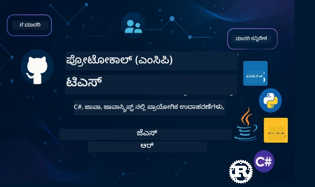

 

[](https://GitHub.com/microsoft/mcp-for-beginners/graphs/contributors)
[](https://GitHub.com/microsoft/mcp-for-beginners/issues)
[](https://GitHub.com/microsoft/mcp-for-beginners/pulls)
[](http://makeapullrequest.com)

[](https://GitHub.com/microsoft/mcp-for-beginners/watchers)
[](https://GitHub.com/microsoft/mcp-for-beginners/fork)
[](https://GitHub.com/microsoft/mcp-for-beginners/stargazers)


[](https://discord.gg/nTYy5BXMWG)

ಈ ಸಂಪನ್ಮೂಲಗಳನ್ನು ಬಳಸಲು ಪ್ರಾರಂಭಿಸಲು ಈ ಹೆಜ್ಜೆಗಳನ್ನು ಅನುಸರಿಸಿ:
1. **ರೆಪೊಸಿಟರಿ ಫೋರ್ಕ್ ಮಾಡಿ**: ಕ್ಲಿಕ್ ಮಾಡಿ [](https://GitHub.com/microsoft/mcp-for-beginners/fork)
2. **ರೆಪೊಸಿಟರಿ ಕ್ಲೋನ್ ಮಾಡಿ**:   `git clone https://github.com/microsoft/mcp-for-beginners.git`
3. **ಸೇರಿರಿ** [](https://discord.gg/nTYy5BXMWG)


### 🌐 ಬಹುಭಾಷಾ ಬೆಂಬಲ

#### GitHub ಆಕ್ಟಿಯನ್ ಮೂಲಕ ಬೆಂಬಲಿತ (ಸ್ವಯಂಚಾಲಿತ ಮತ್ತು ಯಾವಾಗಲೂ ನವೀಕರಿಸಲಾಗಿದೆ)

<!-- CO-OP TRANSLATOR LANGUAGES TABLE START -->
[Arabic](../ar/README.md) | [Bengali](../bn/README.md) | [Bulgarian](../bg/README.md) | [Burmese (Myanmar)](../my/README.md) | [Chinese (Simplified)](../zh-CN/README.md) | [Chinese (Traditional, Hong Kong)](../zh-HK/README.md) | [Chinese (Traditional, Macau)](../zh-MO/README.md) | [Chinese (Traditional, Taiwan)](../zh-TW/README.md) | [Croatian](../hr/README.md) | [Czech](../cs/README.md) | [Danish](../da/README.md) | [Dutch](../nl/README.md) | [Estonian](../et/README.md) | [Finnish](../fi/README.md) | [French](../fr/README.md) | [German](../de/README.md) | [Greek](../el/README.md) | [Hebrew](../he/README.md) | [Hindi](../hi/README.md) | [Hungarian](../hu/README.md) | [Indonesian](../id/README.md) | [Italian](../it/README.md) | [Japanese](../ja/README.md) | [Kannada](./README.md) | [Korean](../ko/README.md) | [Lithuanian](../lt/README.md) | [Malay](../ms/README.md) | [Malayalam](../ml/README.md) | [Marathi](../mr/README.md) | [Nepali](../ne/README.md) | [Nigerian Pidgin](../pcm/README.md) | [Norwegian](../no/README.md) | [Persian (Farsi)](../fa/README.md) | [Polish](../pl/README.md) | [Portuguese (Brazil)](../pt-BR/README.md) | [Portuguese (Portugal)](../pt-PT/README.md) | [Punjabi (Gurmukhi)](../pa/README.md) | [Romanian](../ro/README.md) | [Russian](../ru/README.md) | [Serbian (Cyrillic)](../sr/README.md) | [Slovak](../sk/README.md) | [Slovenian](../sl/README.md) | [Spanish](../es/README.md) | [Swahili](../sw/README.md) | [Swedish](../sv/README.md) | [Tagalog (Filipino)](../tl/README.md) | [Tamil](../ta/README.md) | [Telugu](../te/README.md) | [Thai](../th/README.md) | [Turkish](../tr/README.md) | [Ukrainian](../uk/README.md) | [Urdu](../ur/README.md) | [Vietnamese](../vi/README.md)

> **ಸ್ಥಳೀಯವಾಗಿ ಕ್ಲೋನ್ ಮಾಡಲು ಇಚ್ಛಿಸುತ್ತೀರಾ?**
>
> ಈ ರೆಪೊಸಿಟರಿಯು 50+ ಭಾಷಾ ಅನುವಾದಗಳನ್ನು ಒಳಗೊಂಡಿದ್ದು ಡೌನ್ಲೋಡ್ ಗಾತ್ರವನ್ನು ಬಹಳವಾಗಿ ವೃದ್ಧಿಸುತ್ತದೆ. ಅನುವಾದಗಳು ಇಲ್ಲದೆ ಕ್ಲೋನ್ ಮಾಡಲು, ಸ್ಪಾರ್ಸ್ ಚೆಕ್ಔಟ್ ಬಳಸಿ:
>
> **Bash / macOS / Linux:**
> ```bash
> git clone --filter=blob:none --sparse https://github.com/microsoft/mcp-for-beginners.git
> cd mcp-for-beginners
> git sparse-checkout set --no-cone '/*' '!translations' '!translated_images'
> ```
>
> **CMD (Windows):**
> ```cmd
> git clone --filter=blob:none --sparse https://github.com/microsoft/mcp-for-beginners.git
> cd mcp-for-beginners
> git sparse-checkout set --no-cone "/*" "!translations" "!translated_images"
> ```
>
> ಇದರಿಂದ ನಿಮಗೆ ಕೋರ್ಸ್ ಪೂರ್ಣಗೊಳಿಸಲು ಅಗತ್ಯವಿರುವ ಎಲ್ಲಾ ವಸ್ತುಗಳು much ವೇಗದ ಡೌನ್ಲೋಡ್‌ನೊಂದಿಗೆ ಲಭ್ಯವಾಗುತ್ತವೆ.
<!-- CO-OP TRANSLATOR LANGUAGES TABLE END -->

# 🚀 ಮಾದರಿ ಕಂಪೆ೯ಡ್ ಪ್ರೋಟೋಕಾಲ್ (MCP) ಪಠ್ಯಕ್ರಮ ಆರಂಭಿಕರಿಗಾಗಿ

## **C#, ಜಾವಾ, ಜಾವಾಸ್ಕ್ರಿಪ್ಟ್, ರಸ್ಟ್, ಪೈಥಾನ್ ಮತ್ತು ಟೈಪ್ಸ್ಕ್ರಿಪ್ಟ್ ನಲ್ಲಿ ಕೈಯಿಂದ ಕೈಗೆ ಉದಾಹರಣೆಗಳ ಮೂಲಕ MCP ಕಲಿಯಿರಿ**

## 🧠 ಮಾದರಿ ಸ೦ದರ್ಭ ಪ್ರೋಟೋಕಾಲ್ ಪಠ್ಯಕ್ರಮದ ಅವಲೋಕನ
ಮಾದರಿ ಸ೦ದರ್ಭ ಪ್ರೋಟೋಕಾಲ್ (Model Context Protocol) ಯಾತ್ರೆಗೆ ನಿಮ್ಮನ್ನು ಸ್ವಾಗತ! ನೀವು ಯಾವಾಗಲಾದರೂ ಎಐ ಅಪ್ಲಿಕೇಶನ್‌ಗಳು ವಿವಿಧ ಸಾಧನಗಳು ಮತ್ತು ಸೇವೆಗಳೊಂದಿಗೆ ಹೇಗೆ ಸಂವಹನ ಮಾಡುತ್ತವೆ ಎಂದು ಆಶ್ಚರ್ಯ ಹೊಂದಿದ್ದೀರಾ ಎಂದಾದರೆ, ನೀವು ಜಾಣ್ಮೆಯ ವ್ಯವಸ್ಥೆಗಳನ್ನು ನಿರ್ಮಿಸುವ ವಿಧಾನವನ್ನು ಪರಿವರ್ತಿಸುತ್ತಿರುವ ಅದ್ಭುತ ಪರಿಹಾರವನ್ನು ಕಂಡುಹಿಡಿಯಲಿದ್ದೀರಾ.

MCP ಅನ್ನು ಎಐ ಅಪ್ಲಿಕೇಶನ್‌ಗಳಿಗೆ ಸರ್ವತ್ರೇಯ ಭಾಷಾಂತರಕಾರ ಎಂದು ಯೋಚಿಸಿ - ಯುಎಸ್‌ಬಿ ಪೋರ್ಟ್‌ಗಳು ಯಾವುದೆ ಸಾಧನ ಸೇರಿಸುವುದನ್ನು ಅನುಮತಿಸುವಂತೆ, MCP ಎಐ ಮಾದರಿಗಳನ್ನು ಯಾವುದೆ ಸಾಧನ ಅಥವಾ ಸೇವೆಯೊಂದಿಗೆ ನಿಗದಿತ ರೀತಿಯಲ್ಲಿ ಸಂಪರ್ಕಿಸಲು ಅನುಮತಿಸುತ್ತದೆ. ನೀವು ನಿಮ್ಮ ಮೊದಲ ಚಾಟ್‌ಬಾಟ್ ಕಟ್ಟುತ್ತಿದ್ದೀರಾ ಅಥವಾ ಜಟಿಲ ಎಐ ಕಾರ್ಯಪ್ರವಾಹಗಳ üzerinde ಕೆಲಸ ಮಾಡುತ್ತಿದ್ದೀರಾ, MCP ತಿಳಿದುಕೊಳ್ಳುವುದರಿಂದ ನಿಮಗೆ ಹೆಚ್ಚಿನ ಶಕ್ತಿಶಾಲಿ ಮತ್ತು ನ زمانیಯ ಅಪ್ಲಿಕೇಶನ್‌ಗಳನ್ನು ರಚಿಸಲು ಶಕ್ತಿ ಸಿಗುತ್ತದೆ.

ಈ ಪಠ್ಯಕ್ರಮವು ನಿಮ್ಮ ಕಲಿಕೆಯ ಪ್ರಯಾಣಕ್ಕೆ ಸಹನಶೀಲತೆ ಮತ್ತು ಕಾಳಜಿಯಿಂದ ವಿನ್ಯಾಸಗೊಳಿಸಲ್ಪಟ್ಟಿದೆ. ನಾವು ನೀವು ಈಗಾಗಲೇ ಅರ್ಥಮಾಡಿಕೊಂಡಿರುವ ಸರಳ ಕಲ್ಪನೆಗಳಿಂದ ಪ್ರಾರಂಭಿಸೋಣ ಮತ್ತು ಪ್ರತಿ ಹಂತವನ್ನು ನಿಮ್ಮ ಮೆಚ್ಚಿನ ಪ್ರೋಗ್ರಾಮಿಂಗ್ ಭಾಷೆಯಲ್ಲಿ ಕೈಯಿಂದ ಅಭ್ಯಾಸದ ಮೂಲಕ ನಿಮ್ಮ ಪರಿಣತಿಯನ್ನು ಹಂತ ಹಂತವಾಗಿ ನಿರ್ಮಿಸೋಣ. ಪ್ರತಿ ಹಂತದಲ್ಲಿಯೂ ಸ್ಪಷ್ಟ ವಿವರಣೆಗಳು, ಪ್ರಾಯೋಗಿಕ ಉದಾಹರಣೆಗಳು ಮತ್ತು ಬಹಳ ಪ್ರೋತ್ಸಾಹವನ್ನು ನೀಡಲಾಗುತ್ತದೆ.

ನೀವು ಈ ಪ್ರಯಾಣವನ್ನು ಪೂರ್ಣಗೊಳಿಸಿದಾಗ, ನಿಮ್ಮದೇ MCP ಸರ್ವರ್‌ಗಳನ್ನು ನಿರ್ಮಿಸಲು, ಜನಪ್ರಿಯ ಎಐ ವೇದಿಕೆಗಳೊಂದಿಗೆ ಅವುಗಳನ್ನು ಸಂಯೋಜಿಸಲು ಮತ್ತು ಈ ತಂತ್ರಜ್ಞಾನವು ಎಐ ಅಭಿವೃದ್ಧಿಯ ಭವಿಷ್ಯವನ್ನು ಹೇಗೆ ರೂಪಿಸುತ್ತಿದೆ ಎಂಬುದನ್ನು ಅರ್ಥಮಾಡಿಕೊಳ್ಳಲು ನೀವಿದ್ದರು ವಿಶ್ವಾಸ ಹೊಂದಿರುತ್ತೀರಿ. ಬನ್ನಿ, ಈ ರೋಮಾಂಚಕ ಸಾಹಸವನ್ನು ಒಂದಾಗಿ ಪ್ರಾರಂಭಿಸೋಣ!

### ಅಧಿಕೃತ ಡಾಕ್ಯುಮೆಂಟೇಶನ್ ಮತ್ತು ನಿರ್ದಿಷ್ಟತೆಗಳು

ಈ ಪಠ್ಯಕ್ರಮವು **MCP ನಿರ್ದಿಷ್ಟತೆ 2025-11-25** (ಇತ್ತೀಚಿನ ಸ್ಥಿರ ಬಿಡುಗಡೆ) ಪ್ರಕಾರ ಹೊಂದಿಸಲಾಗಿದೆ. MCP ನಿರ್ದಿಷ್ಟತೆ ದಿನಾಂಕ ಆಧಾರಿತ ಆವೃತ್ತಿಗಳಿಗೆ (YYYY-MM-DD ಸ್ವರೂಪ) ಬಳಸುತ್ತದೆ, ಇದು ಸ್ಪಷ್ಟ ಪ್ರೋಟೋಕಾಲ್ ಆವೃತ್ತಿ ಟ್ರಕ್ಕಿಂಗ್ ಅನ್ನು ಖಚಿತಪಡಿಸುತ್ತದೆ.

ನೀವು ಅರಿವು ಹೆಚ್ಚಾದಂತೆ ಈ ಸಂಪನ್ಮೂಲಗಳು ಇನ್ನೂ ಅಮೂಲ್ಯವಾಗುತ್ತವೆ, ಆದರೆ ಎಲ್ಲವನ್ನೂ ತಕ್ಷಣ ಓದಬೇಕೆಂದು ಒತ್ತಡಕ್ಕೂಡಬೇಡಿ. ನೀವು ಹೆಚ್ಚು ಆಸಕ್ತಿ ಹೊಂದಿರುವ ಭಾಗಗಳಿಂದ ಆರಂಭಿಸಿ!
- 📘 [MCP ಡಾಕ್ಯುಮೆಂಟೇಶನ್](https://modelcontextprotocol.io/) – ಹಂತದಂತೆ ಟ್ಯುಟೋರಿಯಲ್‌ಗಳು ಮತ್ತು ಬಳಕೆದಾರ ಮಾರ್ಗದುರ್ಶನಗಳಿಗಾಗಿ ನಿಮ್ಮಲ್ಲಿರುವ ಮೂಲ ಸಂಪನ್ಮೂಲ. ಕಡತವು ಆರಂಭಿಕರ ಪರಿಗಣಿಸುವಂತೆ ಬರೆಯಲ್ಪಟ್ಟಿದ್ದು, ನೀವು ಸ್ವಂತವೇ ಅನುಸರಿಸಬಹುದಾದ ಸ್ಪಷ್ಟ ಉದಾಹರಣೆಗಳನ್ನು ಒದಗಿಸುತ್ತದೆ.
- 📜 [MCP ನಿರ್ದಿಷ್ಟತೆ](https://modelcontextprotocol.io/specification/2025-11-25) – ಇದು ನಿಮ್ಮ ಸಂಪೂರ್ಣ ರೆഫರೆನ್ಸ್ ಮ್ಯಾನುಯಲ್‌. ಪಠ್ಯಕ್ರಮದೊಳಗೆ ಕೆಲಸ ಮಾಡುತ್ತಿರುವಾಗ, ನೀವು ಇಲ್ಲಿ ನಿರ್ದಿಷ್ಟ ವಿವರಗಳಿಗಾಗಿ ಮತ್ತು ಪ್ರಗತಿಶೀಲ ವೈಶಿಷ್ಟ್ಯಗಳನ್ನು ಅನ್ವೇಷಿಸಲು ಹಿಂತಿರುಗಬಹುದು.
- 📜 [MCP ನಿರ್ದಿಷ್ಟತೆ ಆವೃತ್ತಿಕರಣ](https://modelcontextprotocol.io/specification/versioning) – ಪ್ರೋಟೋಕಾಲ್ ಆವೃತ್ತಿ ಇತಿಹಾಸ ಮತ್ತು MCP ಹೇಗೆ ದಿನಾಂಕ ಆಧಾರಿತ ಆವೃತ್ತಿಕರಣ (YYYY-MM-DD ಸ್ವರೂಪ) ಉಪಯೋಗಿಸುತ್ತದೆ ಎಂಬ ಮಾಹಿತಿಯನ್ನು ಇಲ್ಲಿ ಒಳಗೊಂಡಿದೆ.
- 🧑‍💻 [MCP GitHub ರೆಪೊಸಿಟರಿ](https://github.com/modelcontextprotocol) – ಇಲ್ಲಿ ನಿಮಗೆ ವಿವಿಧ ಪ್ರೋಗ್ರಾಮಿಂಗ್ ಭಾಷೆಗಳಲ್ಲಿನ SDKಗಳು, ಸಾಧನಗಳು ಮತ್ತು ಕೋಡ್ ಉದಾಹರಣೆಗಳಿವೆ. ಇದು ಪ್ರಾಯೋಗಿಕ ಉದಾಹರಣೆಗಳು ಮತ್ತು ಸಿದ್ಧ ಉಪಕರಣಗಳ ಸರದಾರಿಗಳಂತಹದ್ದು.
- 🌐 [MCP ಸಮುದಾಯ](https://github.com/orgs/modelcontextprotocol/discussions) – MCP ಬಗ್ಗೆ ಚರ್ಚೆಗಳಲ್ಲಿ ಇತರ ಕಲಿಯುವವರು ಮತ್ತು ಅನುಭವಜ್ಞ ತಂತ್ರಜ್ಞಾನಕಾರರೊಂದಿಗೆ ಸೇರಿಕೊಳ್ಳಿ. ಇದು ಪ್ರಶ್ನೆಗಳ ಸ್ವಾಗತವಿರುವ ಮತ್ತು ಜ್ಞಾನವನ್ನು ಮುಕ್ತವಾಗಿ ಹಂಚಿಕೊಳ್ಳುವ ಆದರದ ಸಮುದಾಯ.

## ಕಲಿಕೆಯ ಗುರಿಗಳು

ಈ ಪಠ್ಯಕ್ರಮದ ಅಂತ್ಯಕ್ಕೆ, ನೀವು ನಿಮ್ಮ ಹೊಸ ಕೌಶಲ್ಯಗಳ ಬಗ್ಗೆ ವಿಶ್ವಾಸ ಮತ್ತು ಉತ್ಸಾಹ ಹೊಂದಿರುತ್ತೀರಿ. ನೀವು ಸಾಧಿಸುವುದಾದ್ದು:

• **MCP ಮೂಲಭೂತಗಳನ್ನು ಅರ್ಥಮಾಡಿಕೊಳ್ಳಿ**: ಮಾದರಿ ಸಂಗ್ರಹ ಪ್ರೋಟೋಕಾಲ್ ಎಂದರೇನು ಮತ್ತು ಇದು ಹೇಗೆ ಎಐ ಅಪ್ಲಿಕೇಶನ್‌ಗಳ ಕಾರ್ಯಾಚರಣೆಯನ್ನು ಪರಿವರ್ತಿಸುತ್ತಿದೆ ಎಂಬುದನ್ನು ಸಾಮಾನ್ಯ ಉದಾಹರಣೆಗಳೊಂದಿಗೆ ಮತ್ತು ದೃಷ್ಟಾಂತಗಳೊಂದಿಗೆ ಅರ್ಥಮಾಡಿಕೊಳ್ಳುವಿರಿ.

• **ನಿಮ್ಮ ಮೊದಲ MCP ಸರ್ವರ್ ನಿರ್ಮಿಸಿ**: ನೀವು ನಿಮ್ಮ ನೈಜ ಪ್ರೋಗ್ರಾಮಿಂಗ್ ಭಾಷೆಯಲ್ಲಿ ಕಾರ್ಯನಿರತ MCP ಸರ್ವರ್ ಅನ್ನು ನಿರ್ಮಿಸುವುದು, ಸರಳ ಉದಾಹರಣೆಗಳಿಂದ ಪ್ರಾರಂಭಿಸಿ ಹಂತ ಹಂತವಾಗಿ ನಿಮ್ಮ ಕೌಶಲ್ಯವನ್ನು ಬೆಳೆಸಿಕೊಳ್ಳುವುದು.

• **ಎಐ ಮಾದರಿಗಳನ್ನು ನಿಜವಾದ ಸಾಧನಗಳಿಗೆ ಸಂಪರ್ಕಿಸಿ**: ಎಐ ಮಾದರಿಗಳು ಮತ್ತು ನಿಜವಾದ ಸೇವೆಗಳ ನಡುವೆ ಸೇತುವೆ ಕಟ್ಟುವುದು ಕಲಿಯುವಿರಿ, ಇದು ನಿಮ್ಮ ಅಪ್ಲಿಕೇಶನ್‌ಗಳಿಗೆ ಶಕ್ತಿಶಾಲಿ ಹೊಸ ಸಾಮರ್ಥ್ಯಗಳನ್ನು ನೀಡುತ್ತದೆ.

• **ಸುರಕ್ಷತಾ ಉತ್ತಮ ಅಭ್ಯಾಸಗಳನ್ನು ಜಾರಿಗೆ ತರಲು ಕಲಿಯಿರಿ**: ನಿಮ್ಮ MCP ಅನುಷ್ಠಾನಗಳನ್ನು ಸುರಕ್ಷಿತವಾಗಿರಿಸಲು ಹೇಗೆ ಕಾಯ್ದುಕೊಳ್ಳಬೇಕು ಎಂಬುದನ್ನು ಅರ್ಥಮಾಡಿಕೊಳ್ಳಿ, ನಿಮ್ಮ ಅಪ್ಲಿಕೇಶನ್‌ಗಳ ಮತ್ತು ಬಳಕೆದಾರರ ರಕ್ಷಣೆಗಾಗಿ.

• **ವಿಶ್ವಾಸದಿಂದ ನಿಯೋಜನೆ ಮಾಡಿ**: ನಿಮ್ಮ MCP ಯೋಜನೆಗಳನ್ನು ಅಭಿವೃದ್ಧಿಯಿಂದ ಉತ್ಪಾದನೆಗೆ ತರುವ ವಿಧಾನಗಳು ಮತ್ತು ನೈಜ ಜಗತ್ತಿನಲ್ಲಿ ಪರಿಣಾಮಕಾರಿಯಾಗಿ ಕೆಲಸ ಮಾಡುವ ನಿಯೋಜನಾ ತಂತ್ರಗಳನ್ನು ತಿಳಿದುಕೊಳ್ಳಿ.

• **MCP ಸಮುದಾಯದಲ್ಲಿ ಸೇರಿಕೊಳ್ಳಿ**: ಎಐ ಅಪ್ಲಿಕೇಶನ್ ಅಭಿವೃದ್ಧಿಯ ಭವಿಷ್ಯವನ್ನು ರೂಪಿಸುತ್ತಿರುವ ಅಭಿವೃದ್ಧಿಪೊಂದಿಸಿದ ಅಭಿವೃದ್ಧಿಪತ್ರಿಕ ಸಮುದಾಯದ ಭಾಗವಾಗಿರಿ.

## ಅಗತ್ಯ ಹಿನ್ನೆಲೆ

ನಾವು MCP ವಿಶೇಷತೆಗಳ ಬಗ್ಗೆ ಚಾಲನೆ ನೀಡುವ ಮೊದಲು, ಕೆಲವು ಆಧಾರಭೂತ ಕಲ್ಪನೆಗಳನ್ನು ನೀವು ಬಲವಾಗಿ ಮನಗಂಡುಕೊಂಡಿರುವುದನ್ನು ಖಚಿತಪಡಿಸಿಕೊಳ್ಳೋಣ. ಈ ವಿಷಯಗಳಲ್ಲಿ ನೀವು ತಜ್ಞರಾಗಿರದಿದ್ದರೂ ಚಿಂತಿಸಬೇಕಾಗಿಲ್ಲ — ನಾವು ನೀವು ತಿಳಿಯಬೇಕಾದ ಎಲ್ಲವನ್ನೂ ವಿವರಿಸೋಣ!

### ಪ್ರೋಟೋಕಾಲ್‌ಗಳನ್ನು ಅರ್ಥಮಾಡಿಕೊಳ್ಳುವುದು (ಅಡಿಗಲ್ಲು)

ಮಧ್ಯವರ್ತಿತ್ವದ ನಿಯಮಗಳನ್ನು ಸಂಭಾಷಣೆಯ ನಿಯಮಗಳಾಗಿ ಯೋಚಿಸಿ. ನೀವು ನಿಮ್ಮ ಸ್ನೇಹಿತನನ್ನು ಕರೆ ಮಾಡುವಾಗ, ನೀವು ಉಭಯರೂ "ನಮಸ್ಕಾರ" ಎಂದು ಹೇಳಬೇಕು ಎಂದು ತಿಳಿದುಕೊಂಡಿರುತ್ತೀರಿ, ಮಾತುಕತೆಗೆ ಕ್ರಮವಾಗಿ ಹೊಂದುತ್ತೀರಿ ಮತ್ತು ಮುಗಿಯುವಾಗ "ವಿದಾಯ" ಹೇಳುತ್ತೀರಿ. ಕಂಪ್ಯೂಟರ್ ಪ್ರೋಗ್ರಾಮ್‌ಗಳಿಗೆ ಪರಿಣಾಮಕಾರಿಯಾಗಿ ಸಂವಹನ ಮಾಡಲು ಇಂತಹ ನಿಯಮಗಳು ಬೇಕಾಗಿವೆ.

MCP ಒಂದು ಪ್ರೋಟೋಕಾಲ್ — ಸಹಮತಿಯಾದ ನಿಯಮಗಳ ಒಂದು ಸಮೂಹವಾಗಿದ್ದು, ಇದು ಎಐ ಮಾದರಿಗಳು ಮತ್ತು ಅಪ್ಲಿಕೇಶನ್‌ಗಳು ಸಾಧನಗಳು ಮತ್ತು ಸೇವೆಗಳೊಂದಿಗೆ ಫಲಪ್ರದ "ಸಂಭಾಷಣೆ" ನಡೆಸಲು ಸಹಾಯ ಮಾಡುತ್ತದೆ. ಮಾನವರ ಸಂಭಾಷಣೆ ಸುಗಮವಾಗಲು ನಿಯಮಗಳಿದ್ದಂತೆ, MCP ಇದ್ದಿದ್ದರಿಂದ ಎಐ ಅಪ್ಲಿಕೇಶನ್ ಸಂವಹನ ಹೆಚ್ಚು ವಿಶ್ವಾಸಾರ್ಹ ಮತ್ತು ಶಕ್ತಿಶಾಲಿಯಾಗುತ್ತದೆ.

### ಕ್ಲೈಂಟ್-ಸರ್ವರ್ ಸಂಬಂಧಗಳು (ಪ್ರೋಗ್ರಾಮಿಗಳು ಹೇಗೆ ಪರಸ್ಪರು ಕೆಲಸ ಮಾಡುತ್ತವೆ)

ನೀವು ಪ್ರತಿದಿನವೂ ಕ್ಲೈಂಟ್-ಸರ್ವರ್ ಸಂಬಂಧಗಳನ್ನು ಉಪಯೋಗಿಸುತ್ತಿರುವಿರಿ! ನೀವು ವೆಬ್ ಬ್ರೌಸರ್ (ಕ್ಲೈಂಟ್) ಬಳಸಿ ಯಾವುದಾದರೂ ವೆಬ್‌ಸೈಟ್‌ಗೆ ಭೇಟಿ ನೀಡುವಾಗ, ನೀವು ಪೇಜ್ ವಿಷಯವನ್ನು ಕಳುಹಿಸುವ ವೆಬ್ ಸರ್ವರ್‌ಗೆ ಸಂಪರ್ಕ ಮಾಡುತ್ತೀರಿ. ಬ್ರೌಸರ್ ಮಾಹಿತಿ ಕೇಳುವುದು ಹೇಗೆ ಎಂಬುದನ್ನು ತಿಳಿದುಕೊಂಡಿದ್ದು, ಸರ್ವರ್ ಪ್ರತಿಕ್ರಿಯಿಸುವುದನ್ನು ತಿಳಿದುಕೊಂಡಿರುತ್ತದೆ.

MCPಯಲ್ಲೂ ಹೀಗೆ ಇದೇ ಸಂಬಂಧ ಇದೆ: ಎಐ ಮಾದರಿಗಳು ಕ್ಯಾಂಲೆಂಟ್ ಆಗಿ ಕಾಯ್ತವೆ ಹಾಗೂ ಮಾಹಿತಿಯನ್ನು ಅಥವಾ ಕಾರ್ಯಗಳನ್ನು ಕೇಳುತ್ತವೆ, MCP ಸರ್ವರ್‌ಗಳು ಆ ಸಾಮರ್ಥ್ಯಗಳನ್ನು ಒದಗಿಸುತ್ತವೆ. ಇದು ಸಹಾಯಕಿ (ಸರ್ವರ್) ಇದ್ದಂತೆ, ಎಐ ನಿರ್ದಿಷ್ಟ ಕಾರ್ಯಗಳನ್ನು ಮಾಡುವಂತೆ ಕೇಳಬಹುದು.

### ನಿಯಮೀಕರಣವೇನು ಬಹುಮುಖ್ಯ (ಬುರಳಾಗಿ ಜೋಡಿಸಲು)

ಪ್ರತೀ ಕಾರು ತಯಾರಕವು ವಿಭಿನ್ನ ಆಕಾರಗಳ ಗ್ಯಾಸು ಪಂಪುಗಳನ್ನು ಬಳಸಿದ್ದರೆ ಎಷ್ಟು ಭಾರೀ ಅಡಾಪ್ಟರ್ ಬೇಕಾಗುತ್ತದೆ ಎಂದು চিন್ತಿಸಿ! ನಿಯಮೀಕರಣ ಎಂದರೆ ಒಂದೇ ರೀತಿಯ ದೃಷ್ಟಿಕೋನದಲ್ಲಿ ಒಪ್ಪಿಕೊಳ್ಳುವುದು, ಅದರಿಂದ ವಿಷಯಗಳು ಸರಾಗವಾಗಿ ಕಾರ್ಯನಿರ್ವಹಿಸುತ್ತವೆ.

MCP ಆ ನಿಯಮೀಕರಣವನ್ನು ಎಐ ಅಪ್ಲಿಕೇಶನ್‌ಗಳಿಗೆ ಒದಗಿಸುತ್ತದೆ. ಪ್ರತೀ ಎಐ ಮಾದರಿ ಪ್ರತಿ ಸಾಧನದೊಂದಿಗೆ ಕೆಲಸ ಮಾಡಲು ಕಸ್ಟಮ್ ಕೋಡ್ ಬೇಕಾಗುವುದನ್ನು ತಡೆದು MCP ಇದನ್ನು ಸರ್ವತ್ರೇಜನ ದ್ವಾರದಾಗಿ ರಚಿಸುತ್ತದೆ. ಇದರರ್ಥ ಅಭಿವೃದ್ಧಿಪರರು ಸಾಧನಗಳನ್ನು ಒಂದೇಬಾರಿಗೆ ನಿರ್ಮಿಸಿ ಅನೇಕ ಎಐ ವ್ಯವಸ್ಥೆಗಳೊಂದಿಗೆ ಕಾರ್ಯನಿರ್ವಹಿಸಲು ಸಾಧ್ಯ.

## 🧭 ನಿಮ್ಮ ಕಲಿಕೆಯ ಮಾರ್ಗ ಅವಲೋಕನ

ನಿಮ್ಮ MCP ಯಾತ್ರೆ ನಿಮ್ಮ ವಿಶ್ವಾಸ ಮತ್ತು ಕೌಶಲ್ಯವನ್ನು ಹಂತ ಹಂತವಾಗಿ ಬೆಳೆಸಲು ಸೂಕ್ಷ್ಮವಾಗಿ ರೂಪಿಸಲಾಗಿದೆ. ಪ್ರತೀ ಹಂತ ಹೊಸ ಕಲ್ಪನೆಗಳನ್ನು ಪರಿಚಯಿಸುತ್ತಿದ್ದು ಈಗಾಗಲೇ ಕಲಿತ ಸಂಗತಿಗಳನ್ನು ಮರುಶಿಕ್ಷಣ ಮಾಡುತ್ತದೆ.

### 🌱 ಅಡಿಗಲ್ಲು ಹಂತ: ಮೂಲಭೂತಗಳನ್ನು ಅರ್ಥಮಾಡಿಕೊಳ್ಳುವುದು (ಮಾಡ್ಯೂಲ್ 0-2)

ನಿಮ್ಮ ಸಾಹಸ ಇಲ್ಲಿ ಪ್ರಾರಂಭವಾಗುತ್ತದೆ! ನಾವು ಪರಿಚಿತ ದೃಷ್ಟಾಂತಗಳು ಮತ್ತು ಸರಳ ಉದಾಹರಣೆಗಳನ್ನು ಬಳಸಿ MCP ಕಲ್ಪನೆಗಳನ್ನು ಪರಿಚಯಿಸುವೆವು. ನೀವು MCP ಎಂದರೇನು, ಅದು ಏಕೆ ಇದೆ ಮತ್ತು ಇದು ಎಐ ಅಭಿವೃದ್ಧಿಯ ದೊಡ್ಡ ಜಗತ್ತಿನಲ್ಲಿ ಹೇಗೆ ಸೇರಿದಂತೆ ಅನ್ನಿಸುತ್ತದೆ ಎಂಬುದನ್ನು ಅರ್ಥಮಾಡಿಕೊಳ್ಳುವಿರಿ.

• **ಮಾಡ್ಯೂಲ್ 0 - MCP ಪರಿಚಯ**: ನಾವು MCP ಎಂದರೇನು ಮತ್ತು ಇದು ಆಧುನಿಕ ಎಐ ಅಪ್ಲಿಕೇಶನ್‌ಗಳಿಗೆ ಏಕೆ ಮಹತ್ತರ ಎಂದು ಅನ್ವೇ­ಷಿಸೋಣ. ನೀವು MCP ನ ನಿಜಜಗತ್ತಿನ ಉದಾಹರಣೆಗಳನ್ನು ನೋಡುತ್ತೀರಿ ಮತ್ತು ಅಭಿವೃದ್ಧಿಪರರು ಎದುರಿಸುವ ಸಾಮಾನ್ಯ ಸಮಸ್ಯೆಗಳಿಗೆ ಇದು ಹೇಗೆ ಪರಿಹಾರ ನೀಡುತ್ತದೆ ಎಂಬುದನ್ನು ಅರ್ಥ ಮಾಡಿಕೊಳ್ಳುವಿರಿ.

• **ಮಾಡ್ಯೂಲ್ 1 - ಅಕ್ಕದ ಕಲ್ಪನೆಗಳು ವಿವರಿಸಿ**: ಇಲ್ಲಿ ನೀವು MCP ನ ಅಗತ್ಯ ಅಡಿಪಾಯಗಳನ್ನು ಕಲಿಯೋಿರಿ. ನಾವು ಸಾಕಷ್ಟು ದೃಷ್ಟಾಂತಗಳು ಮತ್ತು ದೃಶ್ಯ ಉದಾಹರಣೆಗಳನ್ನು ಬಳಸುತ್ತೇವೆ, ಇದರಿಂದ ಈ ಕಲ್ಪನೆಗಳು ಸಹಜ ಮತ್ತು ಅರ್ಥಮಾಡಿಕೊಳ್ಳಲು ಸುಲಭವಾಗುತ್ತವೆ.

• **ಮಾಡ್ಯೂಲ್ 2 - MCPಯಲ್ಲಿನ ಭದ್ರತೆ**: ಭದ್ರತೆ ಭಯಕರವಾಗಿ ತೋರುವುದಾಗಿ ಕಾಣಬಹುದು, ಆದರೆ ನಾವು MCP ಯಲ್ಲಿ ನಿರ್ಮಿತ ಸುರಕ್ಷತಾ ವೈಶಿಷ್ಟ್ಯಗಳನ್ನು ಮತ್ತು ಉಪಯೋಗ ಶ್ರೇಷ್ಠ ಪದ್ಧತಿಗಳನ್ನು ತೋರಿಸುವೆವು, ಅವು ನಿಮ್ಮ ಅಪ್ಲಿಕೇಶನ್‌ಗಳನ್ನು ಆರಂಭದಿಂದಲೇ ರಕ್ಷಿಸುವುದಕ್ಕೆ ಸಹಾಯ ಮಾಡುತ್ತವೆ.

### 🔨 ನಿರ್ಮಾಣ ಹಂತ: ನಿಮ್ಮ ಮೊದಲ ಅನುಷ್ಠಾನಗಳನ್ನು ನಿರ್ಮಿಸುವುದು (ಮಾಡ್ಯೂಲ್ 3)

ಇಲ್ಲಿ ನಿಜವಾದ ರೊಮಾಂಚಕ ಆರಂಭವಾಗುತ್ತದೆ! ನೀವು ಕೈಯಿಂದ MCP ಸರ್ವರ್ ಮತ್ತು ಕ್ಲೈಂಟ್‌ಗಳನ್ನು ನಿರ್ಮಿಸುವ ಅನುಭವವನ್ನು ಪಡೆಯುತ್ತೀರಿ. ಚಿಂತಿಸಬೇಡಿ — ನಾವು ಸರಳವಾಗಿಯೇ ಪ್ರಾರಂಭಿಸಿ ಪ್ರತಿಯೊಂದು ಹಂತವನ್ನು ನಿಮಗೆ ಮಾರ್ಗದರ್ಶನ ನೀಡುತ್ತೇವೆ.
ಈ ಮಂಡಳಿ ನಿಮ್ಮ ಇಚ್ಛಿತ ಪ್ರೋಗ್ರಾಮಿಂಗ್ ಭಾಷೆಯಲ್ಲಿ ಅಭ್ಯಾಸ ಮಾಡಲು ನೀವು ಅನುಮತಿಸುವ ಬಹುತ렉 ಪ್ರಾಯೋಗಿಕ ಮಾರ್ಗದರ್ಶಿಗಳನ್ನು ಒಳಗೊಂಡಿದೆ. ನೀವು ನಿಮ್ಮ ಮೊದಲ ಸರ್ವರ್ ಅನ್ನು ರಚಿಸುತ್ತೀರಿ, ಅದಕ್ಕೆ ಸಂಪರ್ಕಿಸಲು ಕ್ಲೈಂಟ್ ಅನ್ನು ನಿರ್ಮಿಸುತ್ತೀರಿ, ಮತ್ತು VS ಕೋಡ್ ಮುಂತಾದ ಜನಪ್ರಿಯ ಅಭಿವೃದ್ಧಿ ಸಾಧನಗಳೊಂದಿಗೆ ಇಂಟಿಗ್ರೇಷನ್ even ಮಾಡುತ್ತೀರಿ.

ಪ್ರತಿ ಮಾರ್ಗದರ್ಶನದಲ್ಲಿ ಸಂಪೂರ್ಣ ಕೋಡ್ ಉದಾಹರಣೆಗಳು, ಸಮಸ್ಯೆ ಪರಿಹಾರ ಸಲಹೆಗಳು, ಮತ್ತು ನಾವು ವಿಶೇಷ ವಿನ್ಯಾಸ ಆಯ್ಕೆಯನ್ನು ಏಕೆ ಮಾಡುತ್ತೇವೆ ಎಂಬುದರ ವಿವರಣೆಗಳು ಇರುತ್ತವೆ. ಈ ಹಂತದ ಅಂತ್ಯದಾಗ, ನೀವು ಕೆಲಸ ಮಾಡುವ MCP ಅನುಷ್ಠಾನಗಳನ್ನು ಹೊಂದಿರುತ್ತೀರಿ, ಅದಕ್ಕಾಗಿ ನೀವು ಹೆಮ್ಮೆಪಡುವಿರಿ!

### 🚀 ಬೆಳವಣಿಗೆ ಹಂತ: ಸುಧಾರಿತ ತತ್ತ್ವಗಳು ಮತ್ತು ವಾಸ್ತವಿಕ ಅನ್ವಯ (ಮಾಡ್ಯೂಲ್‍ಗಳು 4-5)

ಮೂಲಭೂತಗಳನ್ನು ಆಳವಾಗಿ ತಿಳಿದುಕೊಂಡ ಮೇಲೆ, ನೀವು ಹೆಚ್ಚು ಸುಧಾರಿತ MCP ವೈಶಿಷ್ಟ್ಯಗಳನ್ನು ಅನ್ವೇಷಿಸಲು ಸಿದ್ಧರಾಗಿದ್ದೀರಿ. ನಾವು ಪ್ರಾಯೋಗಿಕ ಅನುಷ್ಠಾನ ತಂತ್ರಗಳು, ಡೀಬಗಿಂಗ್ ತಂತ್ರಗಳು ಮತ್ತು ಮಲ್ಟಿ-ಮೋಡಲ್ AI ಇಂಟಿಗ್ರೇಷನ್ ಮುಂತಾದ ಸುಧಾರಿತ ವಿಷಯಗಳನ್ನು ಮುಚ್ಚುತ್ತೇವೆ.

ನೀವು ನಿಮ್ಮ MCP ಅನುಷ್ಠಾನಗಳನ್ನು ಉತ್ಪಾದನೆಗಾಗಿ ಪ್ರಮಾಣಗೊಳಿಸುವುದು ಮತ್ತು ಅಜ್ಯುರ್ ಮುಂತಾದ ಕ್ಲೌಡ್ ವೇದಿಕೆಗಳೊಂದಿಗೆ ಇಂಟಿಗ್ರೇಟ್ ಮಾಡುವುದನ್ನು ಸಹ ಕಲಿತೀರಾ. ಈ ಮಾಡ್ಯೂಲ್‍ಗಳು ವಾಸ್ತವಿಕ ആവശ്യಗಳನ್ನು ನಿಭಾಯಿಸಲು ಸಾಧ್ಯವಿರುವ MCP ಪರಿಹಾರಗಳನ್ನು ನಿರ್ಮಿಸುವಂತೆ ನಿಮ್ಮನ್ನು ಸಿದ್ಧಗೊಳಿಸುತ್ತವೆ.

### 🌟 ನಿಪುಣತೆ ಹಂತ: ಸಮುದಾಯ ಮತ್ತು ವಿಶೇಷೀಕರಣ (ಮಾಡ್ಯೂಲ್‍ಗಳು 6-11)

ಕೊನೆಯ ಹಂತವು MCP ಸಮುದಾಯದಲ್ಲಿ ಸೇರಿಕೊಳ್ಳುವುದು ಮತ್ತು ನಿಮಗೆ ಆಸಕ್ತಿಯಿರುವ ಕ್ಷೇತ್ರಗಳಲ್ಲಿ ವಿಶೇಷವಾಗಿ ಪರಿಣತಿ ಪಡೆಯುವುದರ ಮೇಲೆ ಕೇಂದ್ರೀಕರಿಸುತ್ತದೆ. ನೀವು ತೆರವು ಮೂಲ MCP ಯೋಜನೆಗಳಿಗೆ כיצד ಕೊಡುಗೆ ನೀಡುವುದು, ಸುಧಾರಿತ ಪ್ರಮಾಣಿೀಕರಣ ಮಾದರಿಗಳನ್ನು ರಚಿಸುವುದು ಮತ್ತು ಸಮಗ್ರ ಡೇಟಾಬೇಸ್ ಇಂಟಿಗ್ರೇಟಡ್ সমಾಧಾನಗಳನ್ನು ನಿರ್ಮಿಸುವುದು ಕಲಿತೀರಿ.

ಮಾಡ್ಯೂಲ್ 11 ವಿಶೇಷವಾಗಿ ಪ್ರಸ್ತಾಪಿಸುವಂತಿದೆ - ಇದು 13-ಲ್ಯಾಬ್‍ಗಳ ಪೂರ್ಣ ಪ್ರಾಯೋಗಿಕ ಅಧ್ಯಯನ ಮಾರ್ಗವಾಗಿದೆ, ಅದು ಪೋಸ್ಟ್‌ಗ್ರೆಎಸ್‌ಕ್ಯೂಎಲ್ ಇಂಟಿಗ್ರೇಷನ್‍ದೊಂದಿಗೆ ಉತ್ಪಾದನೆಯಿಗೆ ಸಜ್ಜುಗೊಳಿಸಿದ MCP ಸರ್ವರ್‌ಗಳನ್ನು ನಿರ್ಮಿಸುವುದನ್ನು ಕಲಿಸುತ್ತದೆ. ನೀವು ಕಲಿತ ಎಲ್ಲವನ್ನೂ ಒಕ್ಕೂಟ ಮಾಡುವ ಕಾಪ್‌ಸ್ಟೋನ್ ಪ್ರಾಜೆಕ್ಟ್ ಅನಿಸುವಂತಿದೆ!

### 📚 ಪೂರ್ಣ ಪಠ್ಯಕ್ರಮ ರಚನೆ

| ಮಾಡೀಯುಲ್ | ವಿಷಯ | ವಿವರಣೆ | ಲಿಂಕ್ |
|--------|-------|-------------|------|
| **ಮಾಡ್ಯೂಲ್ 0-3: ಮೂಲತತ್ವಗಳು** | | | |
| 00 | MCP ಗೆ ಪರಿಚಯ | ಮಾದರಿ ಸಂಧರ್ಭ ಪ್ರೋಟೋಕಾಲ್ ಮತ್ತು ಅದರ AI ಪೈಪ್ಲೈನಿನಲ್ಲಿ ಮಹತ್ವದ ಅವಲೋಕನ | [Read more](./00-Introduction/README.md) |
| 01 | ಮೂಲ ಸಂಪ್ರದಾಯಗಳ ವಿವರಣೆ | MCP ನ ಪ್ರಮುಖ ಸಂಪ್ರದಾಯಗಳ ಆಳವಾದ ಅನ್ವೇಷಣೆ | [Read more](./01-CoreConcepts/README.md) |
| 02 | MCP ನಲ್ಲಿ ಭದ್ರತೆ | ಭದ್ರತಾ ಅಪಾಯಗಳು ಮತ್ತು ಉತ್ತಮ ಅಭ್ಯಾಸಗಳು | [Read more](./02-Security/README.md) |
| 03 | MCP ನೊಂದಿಗೆ ಪ್ರಾರಂಭಿಸುವುದು | ಪರಿಸರ ಸ್ಥಾಪನೆ, ಮೂಲ ಸರ್ವರ್/ಕ್ಲೈಂಟ್ ಗಳು, ಇಂಟಿಗ್ರೇಶನ್ | [Read more](./03-GettingStarted/README.md) |
| **ಮಾಡ್ಯೂಲ್ 3: ನಿಮ್ಮ ಮೊದಲ ಸರ್ವರ್ & ಕ್ಲೈಂಟ್ ನಿರ್ಮಾಣ** | | | |
| 3.1 | ಮೊದಲ ಸರ್ವರ್ | ನಿಮ್ಮ ಮೊದಲ MCP ಸರ್ವರ್ ರಚಿಸಿ | [Guide](./03-GettingStarted/01-first-server/README.md) |
| 3.2 | ಮೊದಲ ಕ್ಲೈಂಟ್ | ಮೂಲ MCP ಕ್ಲೈಂಟ್ ಅಭಿವೃದ್ಧಿಪಡಿಸಿ | [Guide](./03-GettingStarted/02-client/README.md) |
| 3.3 | LLM ಇರುವ ಕ್ಲೈಂಟ್ | ದೊಡ್ಡ ಭಾಷಾ ಮಾದರಿಗಳನ್ನು ಸಂಯೋಜಿಸಿ | [Guide](./03-GettingStarted/03-llm-client/README.md) |
| 3.4 | VS ಕೋಡ್ ಇಂಟಿಗ್ರೇಷನ್ | MCP ಸರ್ವರ್‍ಗಳನ್ನು VS ಕೋಡ್ ನಲ್ಲಿ ಬಳಸಿ | [Guide](./03-GettingStarted/04-vscode/README.md) |
| 3.5 | stdio ಸರ್ವರ್ | stdio ಸಾರಿಗೆ ಬಳಸಿ ಸರ್ವರ್‌ಗಳನ್ನು ರಚಿಸಿ | [Guide](./03-GettingStarted/05-stdio-server/README.md) |
| 3.6 | HTTP ಸ್ಟ್ರೀಮಿಂಗ್ | MCP ನಲ್ಲಿ HTTP ಸ್ಟ್ರೀಮಿಂಗ್ ಅನುಷ್ಠಾನ ಮಾಡಿ | [Guide](./03-GettingStarted/06-http-streaming/README.md) |
| 3.7 | AI ಉಪಕರಣಗಳಂಕು | MCP ಜೊತೆಗೆ AI ಉಪಕರಣಗಳಂಕು ಬಳಸಿ | [Guide](./03-GettingStarted/07-aitk/README.md) |
| 3.8 | ಪರೀಕ್ಷೆ | ನಿಮ್ಮ MCP ಸರ್ವರ್ ಅನುಷ್ಠಾನವನ್ನು ಪರೀಕ್ಷಿಸಿ | [Guide](./03-GettingStarted/08-testing/README.md) |
| 3.9 | ನಿಯೋಜನೆ | MCP ಸರ್ವರ್‍ಗಳನ್ನು ಉತ್ಪಾದನೆಗೆ ನಿಯೋಜಿಸಿ | [Guide](./03-GettingStarted/09-deployment/README.md) |
| 3.10 | ಸುಧಾರಿತ ಸರ್ವರ್ ಬಳಕೆ | ಸುಧಾರಿತ ವೈಶಿಷ್ಟ್ಯಗಳ ಬಳಕೆ ಮತ್ತು ಸುಧಾರಿತ ಸ್ಥಾಪನೆಯಿಗಾಗಿ ಸುಧಾರಿತ ಸರ್ವರ್‍ಗಳನ್ನು ಬಳಸಿ | [Guide](./03-GettingStarted/10-advanced/README.md) |
| 3.11 | ಸರಳ ಪ್ರಾಮಾಣೀಕರಣ | ಪ್ರಾರಂಭದಿಂದಲೇ ಪ್ರಾಮಾಣೀಕರಣ ಮತ್ತು RBAC ಅನ್ನು ತೋರಿಸುವ ಅಧ್ಯಾಯ | [Guide](./03-GettingStarted/11-simple-auth/README.md) |
| 3.12 | MCP ಹೋಸ್ಟ್‌ಗಳು | Claude ಡೆಸ್ಕ್‌ಟಾಪ್, Cursor, Cline ಮತ್ತು ಇತರ MCP ಹೋಸ್ಟ್‌ಗಳನ್ನು ಸಂರಚಿಸಿ | [Guide](./03-GettingStarted/12-mcp-hosts/README.md) |
| 3.13 | MCP ಪರಿಶೋಧಕ | ಪರಿಶೋಧಕ ಸಾಧನದಿಂದ MCP ಸರ್ವರ್‌ಗಳನ್ನು ಡೀಬಗ್ ಮತ್ತು ಪರೀಕ್ಷಿಸಿ | [Guide](./03-GettingStarted/13-mcp-inspector/README.md) |
| 3.14 | ಮಾದರಿ ಸಂಗ್ರಹಣೆ | ಕ್ಲೈಂಟ್ ಜೊತೆಗೆ ಸಹಯೋಗ ಮಾಡಲು ಮಾದರಿ ಸಂಗ್ರಹಣೆಯನ್ನು ಬಳಸಿ | [Guide](./03-GettingStarted/14-sampling/README.md) |
| 3.15 | MCP ಆப்‌ಗಳು | MCP ಆಪ್‌ಗಳನ್ನು ರಚಿಸಿ | [Guide](./03-GettingStarted/15-mcp-apps/README.md) |

| **ಮಾಡ್ಯೂಲ್ 4-5: ಪ್ರಾಯೋಗಿಕ ಮತ್ತು ಸುಧಾರಿತ** | | | |
| 04 | ಪ್ರಾಯೋಗಿಕ ಅನುಷ್ಠಾನ | SDKಗಳು, ಡೀಬಗಿಂಗ್, ಪರೀಕ್ಷೆ, ಪುನಃಬಳಕೆ ಪ್ರಾಂಪ್ಟ್ ಟೆಂಪ್ಲೇಟುಗಳು | [Read more](./04-PracticalImplementation/README.md) |
| 4.1 | ಪುಟೀಕರಣ | ಕಾರ್ಸರ್ ಆಧಾರಿತ ಪುಟೀಕರಣದೊಂದಿಗೆ ದೊಡ್ಡ ಫಲಿತಾಂಶಗಳನ್ನು ನಿರ್ವಹಿಸಿ | [Guide](./04-PracticalImplementation/pagination/README.md) |
| 05 | MCP ನಲ್ಲಿ ಸುಧಾರಿತ ವಿಷಯಗಳು | ಮಲ್ಟಿ-ಮೋಡಲ್ AI, ವಿಸ್ತರಣೆ, ಎಂಟರ್‌ಪ್ರೈಸ್ ಬಳಕೆ | [Read more](./05-AdvancedTopics/README.md) |
| 5.1 | ಅಜ್ಯುರ್ ಇಂಟಿಗ್ರೇಷನ್ | ಅಜ್ಯುರ್ ಜೊತೆಗೆ MCP ಇಂಟಿಗ್ರೇಷನ್ | [Guide](./05-AdvancedTopics/mcp-integration/README.md) |
| 5.2 | ಮಲ್ಟಿ-ಮೋಡಾಲಿಟಿ | ಬಹು ಮೋಡಾಲಿಟಿಗಳೊಂದಿಗೆ ಕಾರ್ಯನಿರ್ವಹಣೆ | [Guide](./05-AdvancedTopics/mcp-multi-modality/README.md) |
| 5.3 | OAuth2 ಪ್ರದರ್ಶನ | OAuth2 ಪ್ರಾಮಾಣೀಕರಣವನ್ನು ಅನುಷ್ಠಾನ ಮಾಡಿ | [Guide](./05-AdvancedTopics/mcp-oauth2-demo/README.md) |
| 5.4 | ಮೂಲ ಸಂಧರ್ಭಗಳು | ಮೂಲ ಸಂಧರ್ಭಗಳನ್ನು ಅರ್ಥಮಾಡಿಕೊಳ್ಳಿ ಮತ್ತು ಅನುಷ್ಠಾನ ಮಾಡಿರಿ | [Guide](./05-AdvancedTopics/mcp-root-contexts/README.md) |
| 5.5 | ಮಾರ್ಗದರ್ಶನ | MCP ಮಾರ್ಗದರ್ಶನ ತಂತ್ರಗಳು | [Guide](./05-AdvancedTopics/mcp-routing/README.md) |
| 5.6 | ಮಾದರಿ ಸಂಗ್ರಹಣೆ | MCPನಲ್ಲಿ ಮಾದರಿ ಸಂಗ್ರಹಣೆಯ ತಂತ್ರಗಳು | [Guide](./05-AdvancedTopics/mcp-sampling/README.md) |
| 5.7 | ವಿಸ್ತರಣೆ | MCP ಅನುಷ್ಠಾನಗಳನ್ನು ವಿಸ್ತರಿಸಿ | [Guide](./05-AdvancedTopics/mcp-scaling/README.md) |
| 5.8 | ಭದ್ರತೆ | ಸುಧಾರಿತ ಭದ್ರತಾ ಪರಿಗಣನೆಗಳು | [Guide](./05-AdvancedTopics/mcp-security/README.md) |
| 5.9 | ವೆಬ್ ಹುಡುಕಾಟ | ವೆಬ್ ಹುಡುಕಾಟ ಸಾಮರ್ಥ್ಯಗಳನ್ನು ಅನುಷ್ಠಾನ ಮಾಡಿ | [Guide](./05-AdvancedTopics/web-search-mcp/README.md) |
| 5.10 | ರಿಯಲ್ಟೈಮ್ ಸ್ಟ್ರೀಮಿಂಗ್ | ರಿಯಲ್ಟೈಮ್ ಸ್ಟ್ರೀಮಿಂಗ್ ಕಾರ್ಯಕ್ಷಮತೆಯನ್ನು ನಿರ್ಮಿಸಿ | [Guide](./05-AdvancedTopics/mcp-realtimestreaming/README.md) |
| 5.11 | ರಿಯಲ್ಟೈಮ್ ಹುಡುಕಾಟ | ರಿಯಲ್ಟೈಮ್ ಹುಡುಕಾಟವನ್ನು ಅನುಷ್ಠಾನ ಮಾಡಿ | [Guide](./05-AdvancedTopics/mcp-realtimesearch/README.md) |
| 5.12 | ಎಂಟ್ರಾ ID ಪ್ರಾಮಾಣೀಕರಣ | Microsoft Entra ID ಜೊತೆ ಪ್ರಾಮಾಣೀಕರಣ | [Guide](./05-AdvancedTopics/mcp-security-entra/README.md) |
| 5.13 | ಫೌಲ್ಡ್ರಿ ಇಂಟಿಗ್ರೇಷನ್ | ಅಜ್ಯುರ್ AI ಫೌಲ್ಡ್ರಿ ಜೊತೆಗೆ ಇಂಟಿಗ್ರೇಟ್ ಮಾಡಿ | [Guide](./05-AdvancedTopics/mcp-foundry-agent-integration/README.md) |
| 5.14 | ಸಂಧರ್ಭ ಎಂಜಿನಿಯರಿಂಗ್ | ಪರಿಣಾಮಕಾರಿ ಸಂಧರ್ಭ ಎಂಜಿನಿಯರಿಂಗ್‌ಗಾಗಿ ತಂತ್ರಗಳು | [Guide](./05-AdvancedTopics/mcp-contextengineering/README.md) |
| 5.15 | MCP ಕಸ್ಟಮ್ ಸಾರಿಗೆ | ಕಸ್ಟಮ್ ಸಾರಿಗೆ ಅನುಷ್ಠಾನಗಳು | [Guide](./05-AdvancedTopics/mcp-transport/README.md) |
| 5.16 | ಪ್ರೋಟೋಕಾಲ್ ವೈಶಿಷ್ಟ್ಯಗಳು | ಪ್ರಗತಿ ಅಧಿಸೂಚನೆಗಳು, ರದ್ದುಮಾಡುವಿಕೆ, ಸಂಪನ್ಮೂಲ ಟೆಂಪ್ಲೇಟುಗಳು | [Guide](./05-AdvancedTopics/mcp-protocol-features/README.md) |
| **ಮಾಡ్యూల್ 6-10: ಸಮುದಾಯ ಮತ್ತು ಉತ್ತಮ ಅಭ್ಯಾಸಗಳು** | | | |
| 06 | ಸಮುದಾಯ ಕೊಡುಗೆಗಳು | MCP ಪರಿಸರಕ್ಕೆ ಹೇಗೆ ಕೊಡುಗೆ ನೀಡುವುದು | [Guide](./06-CommunityContributions/README.md) |
| 07 | ಆರಂಭಿಕ ಬಳಕೆಯಿಂದ ಪಾಠಗಳು | ವಾಸ್ತವ ಅನ್ವಯದ ಕಥೆಗಳು | [Guide](./07-LessonsfromEarlyAdoption/README.md) |
| 08 | MCP ನ ಉತ್ತಮ ಅಭ್ಯಾಸಗಳು | ಕಾರ್ಯಕ್ಷಮತೆ, ದೋಷ-ಸಹನಶೀಲತೆ, ಪ್ರತಿರೂಪಣಾ ಶಕ್ತಿ | [Guide](./08-BestPractices/README.md) |
| 09 | MCP ಪ್ರಕರಣ ಅಧ್ಯಯನಗಳು | ಪ್ರಾಯೋಗಿಕ ಅನುಷ್ಠಾನ ಉದಾಹರಣೆಗಳು | [Guide](./09-CaseStudy/README.md) |
| 10 | ಪ್ರಾಯೋಗಿಕ ಕಾರ್ಯಾಗಾರ | AI ಉಪಕರಣಗಳೊಂದಿಗೆ MCP ಸರ್ವರ್ ನಿರ್ಮಾಣ | [Lab](./10-StreamliningAIWorkflowsBuildingAnMCPServerWithAIToolkit/README.md) |
| **ಮಾಡ್ಯೂಲ್ 11: MCP ಸರ್ವರ್ ಪ್ರಾಯೋಗಿಕ ಲ್ಯಾಬ್** | | | |
| 11 | MCP ಸರ್ವರ್ ಡೇಟಾಬೇಸ್ ಇಂಟಿಗ್ರೇಷನ್ | ಪೋಸ್ಟ್‌ಗ್ರೆಎಸ್‌ಕ್ಯೂಎಲ್ ಇಂಟಿಗ್ರೇಷನ್‍ಗಾಗಿ ಸಮಗ್ರ 13-ಲ್ಯಾಬ್ ಪ್ರಾಯೋಗಿಕ ಅಧ್ಯಯನ ಮಾರ್ಗ | [Labs](./11-MCPServerHandsOnLabs/README.md) |
| 11.1 | ಪರಿಚಯ | ಡೇಟಾಬೇಸ್ ಇಂಟಿಗ್ರೇಷನ್ ಮತ್ತು ರಿಟೈಲ ಅನಾಲಿಟಿಕ್ಸ್ ಬಳಕೆ ಪ್ರಕರಣದೊಂದಿಗೆ MCP ಅವಲೋಕನ | [Lab 00](./11-MCPServerHandsOnLabs/00-Introduction/README.md) |
| 11.2 | ಮೂಲ ವಾಸ್ತುಶಿಲ್ಪ | MCP ಸರ್ವರ್ ವಾಸ್ತುಶಿಲ್ಪ, ಡೇಟಾಬೇಸ್ ಪದರಗಳು ಮತ್ತು ಭದ್ರತಾ ಮಾದರಿಗಳನ್ನು ಅರ್ಥಮಾಡಿಕೊಳ್ಳುವುದು | [Lab 01](./11-MCPServerHandsOnLabs/01-Architecture/README.md) |
| 11.3 | ಭದ್ರತೆ ಮತ್ತು ಮಲ್ಟಿ-ಟೆನನ್ಸಿ | ಸಾಲಿನ ಮಟ್ಟದ ಭದ್ರತೆ, ಪ್ರಮಾಣಿೀಕರಣ, ಮತ್ತು ಬಹು-ತೆನೆಂಟ್ ಡೇಟಾ ಪ್ರವೇಶ | [Lab 02](./11-MCPServerHandsOnLabs/02-Security/README.md) |
| 11.4 | ಪರಿಸರ ಸ್ಥಾಪನೆ | ಅಭಿವೃದ್ಧಿ ಪರಿಸರ ಸ್ಥಾಪನೆ, ಡೋಕರ್, ಅಜ್ಯುರ್ ಸಂಪನ್ಮೂಲಗಳು | [Lab 03](./11-MCPServerHandsOnLabs/03-Setup/README.md) |
| 11.5 | ಡೇಟಾಬೇಸ್ ವಿನ್ಯಾಸ | ಪೋಸ್ಟ್‌ಗ್ರೆಎಸ್‌ಕ್ಯೂಎಲ್ ಸ್ಥಾಪನೆ, ರಿಟೇಲ್ ಸ್ಕೀಮಾ ವಿನ್ಯಾಸ, ಮತ್ತು ಮಾದರಿ ಡೇಟಾ | [Lab 04](./11-MCPServerHandsOnLabs/04-Database/README.md) |
| 11.6 | MCP ಸರ್ವರ್ ಅನುಷ್ಠಾನ | ಡೇಟಾಬೇಸ್ ಇಂಟಿಗ್ರೇಷನ್‍ನೊಂದಿಗೆ ಫಾಸ್ಟ್ MCP ಸರ್ವರ್ ನಿರ್ಮಾಣ | [Lab 05](./11-MCPServerHandsOnLabs/05-MCP-Server/README.md) |
| 11.7 | ಸಾಧನ ಅಭಿವೃದ್ಧಿ | ಡೇಟಾಬೇಸ್ ಕ್ವೇರಿ ಸಾಧನಗಳು ಮತ್ತು ಸ್ಕೀಮಾ ಇಂಟ್ರೋಸ್ಪೆಕ್ಷನ್ ರಚನೆ | [Lab 06](./11-MCPServerHandsOnLabs/06-Tools/README.md) |
| 11.8 | ಅರ್ಥವಂತರ ಹುಡುಕಾಟ | ಅಜ್ಯುರ್ ಓಪನ್‌ಎಐ ಮತ್ತು pgvector ಬಳಸಿ ವೆಕ್ಟರ್ ಎಂಬೆಡ್ಡಿಂಗ್‌ಗಳನ್ನು ಅನುಷ್ಠಾನ ಮಾಡಿ | [Lab 07](./11-MCPServerHandsOnLabs/07-Semantic-Search/README.md) |
| 11.9 | ಪರೀಕ್ಷೆ ಮತ್ತು ಡೀಬಗ್ | ಪರೀಕ್ಷಾ ತಂತ್ರಗಳು, ಡೀಬಗ್ ಸಾಧನಗಳು ಮತ್ತು ದೃಢೀಕರಣ ವಿಧಾನಗಳು | [Lab 08](./11-MCPServerHandsOnLabs/08-Testing/README.md) |
| 11.10 | VS ಕೋಡ್ ಇಂಟಿಗ್ರೇಷನ್ | VS ಕೋಡ್ MCP ಇಂಟಿಗ್ರೇಷನ್ ಮತ್ತು AI ಚಾಟ್ ಬಳಕೆ ಸಂರಚನೆ | [Lab 09](./11-MCPServerHandsOnLabs/09-VS-Code/README.md) |
| 11.11 | ನಿಯೋಜನಾ ತಂತ್ರಗಳು | ಡೋಕರ್ ನಿಯೋಜನೆ, ಅಜ್ಯುರ್ ಕಂಟೈನರ್ ಆಪ್‌ಗಳು ಮತ್ತು ವಿಸ್ತರಣೆ ಪರಿಗಣನೆಗಳು | [Lab 10](./11-MCPServerHandsOnLabs/10-Deployment/README.md) |
| 11.12 | ನಿಗಾ | ಅಪ್ಲಿಕೇಶನ್ ಇನ್ಸೈಟ್ಸ್, ಲಾಗಿಂಗ್, ಕಾರ್ಯಕ್ಷಮತೆ ನಿಗಾ | [Lab 11](./11-MCPServerHandsOnLabs/11-Monitoring/README.md) |
| 11.13 | ಉತ್ತಮ ಅಭ್ಯಾಸಗಳು | ಕಾರ್ಯಕ್ಷಮತೆ ಶೋಷಣೆ, ಭದ್ರತೆ ಗಟ್ಟಿಗೊಳಿಸುವಿಕೆ, ಮತ್ತು ಉತ್ಪಾದನಾ ಸಲಹೆಗಳು | [Lab 12](./11-MCPServerHandsOnLabs/12-Best-Practices/README.md) |

### 💻 ಮಾದರಿ ಕೋಡ್ ಪ್ರಾಜೆಕ್ಟ್‌ಗಳು

MCP ಕಲಿಕೆಯ ಅತ್ಯಂತ ಉತ್ಸಾಹಕರ ಭಾಗಗಳಲ್ಲಿ ಒಂದೆಂದರೆ ನಿಮ್ಮ ಕೋಡ್ ಕೌಶಲ್ಯಗಳು ಕ್ರಮೇಣ ಬೆಳೆಯುತ್ತವೆ ಎಂದು ನೋಡುವುದು. ನಮ್ಮ ಕೋಡ್ ಉದಾಹರಣೆಗಳನ್ನು ಸುಲಭವಾಗಿ ಪ್ರಾರಂಭಿಸಿ, ನಿಮ್ಮ ತಿಳಿವಳಿಕೆಯ ಬೆಳವಣಿಗೆಯಂತೆ ಹೆಚ್ಚು ಸುಧಾರಿತಗೊಳ್ಳುವಂತೆ ರೂಪಿಸಲಾಗಿದೆ. ಇಲ್ಲಿ ನಾವು ತತ್ವಗಳನ್ನು ಪರಿಚಯಿಸುವ ವಿಧಾನ ಇಂತಿದೆ - ಇದು ಅರ್ಥಮಾಡಿಕೊಳ್ಳಲು ಸುಲಭವಾದ, ಆದರೆ ನಿಜವಾದ MCP ಸಿದ್ಧಾಂತಗಳನ್ನು ಪ್ರದರ್ಶಿಸುವ ಕೋಡ್ ಮೂಲಕ, ನೀವು ಈ ಕೋಡ್ ಏನು ಮಾಡುತ್ತದೆ ಎಂಬುದನ್ನು ಮಾತ್ರವಲ್ಲದೆ, ಅದು ಈ ರೀತಿಯಲ್ಲಿ ಮಾಡಲಾಗಿದ್ದು ಏಕೆ ಮತ್ತು ಅದು ದೊಡ್ಡ MCP ಅಪ್ಲಿಕೇಶನ್‍ಗಳಿಗೆ ಹೇಗೆ ಹೊಂದಿಕೆಯಾಗುತ್ತದೆ ಎಂಬುದನ್ನು ಗ್ರಹಿಸುವಿರಿ.

#### ಮೂಲ MCP ಕ್ಯಾಲ್ಕ್ಯುಲೇಟರ್ ಮಾದರಿ

| ಭಾಷೆ | ವಿವರಣೆ | ಲಿಂಕ್ |
|----------|-------------|------|
| C# | MCP ಸರ್ವರ್ ಉದಾಹರಣೆ | [View Code](./03-GettingStarted/samples/csharp/README.md) |
| Java | MCP ಕ್ಯಾಲ್ಕ್ಯುಲೇಟರ್ | [View Code](./03-GettingStarted/samples/java/calculator/README.md) |
| JavaScript | MCP ಡೆಮೋ | [View Code](./03-GettingStarted/samples/javascript/README.md) |
| Python | MCP ಸರ್ವರ್ | [View Code](../../03-GettingStarted/samples/python/mcp_calculator_server.py) |
| TypeScript | MCP ಉದಾಹರಣೆ | [View Code](./03-GettingStarted/samples/typescript/README.md) |
| Rust | MCP ಉದಾಹರಣೆ | [View Code](./03-GettingStarted/samples/rust/README.md) |

#### ಸುಧಾರಿತ MCP ಅನುಷ್ಠಾನಗಳು

| ಭಾಷೆ | ವಿವರಣೆ | ಲಿಂಕ್ |
|----------|-------------|------|
| C# | ಸುಧಾರಿತ ಮಾದರಿ | [View Code](./04-PracticalImplementation/samples/csharp/README.md) |
| Java with Spring | ಕಂಟೈನರ್ ಆಪ್ ಉದಾಹರಣೆ | [View Code](./04-PracticalImplementation/samples/java/containerapp/README.md) |
| JavaScript | ಸುಧಾರಿತ ಮಾದರಿ | [View Code](./04-PracticalImplementation/samples/javascript/README.md) |
| Python | ಸಂಕೀರ್ಣ ಅನುಷ್ಠಾನ | [View Code](./04-PracticalImplementation/samples/python/README.md) |
| TypeScript | ಕಂಟೈನರ್ ಮಾದರಿ | [View Code](./04-PracticalImplementation/samples/typescript/README.md) |


## 🎯 MCP ಕಲಿಕೆಗೆPrerequisites

ಈ ಪಠ್ಯಕ್ರಮದಿಂದ ಹೆಚ್ಚಿನ ಪ್ರಯೋಜನ ಪಡೆಯಲು, ನಿಮ್ಮ ಬಳಿ ಇರುತ್ತದೆ:
- ಕೆಳಗಿನ ಭಾಷೆಗಳಾದರೂ ಒಂದರಲ್ಲಿ ಕನಿಷ್ಠ ಒಂದು ಪ್ರೋಗ್ರಾಮಿಂಗ್ ಮೂಲಭೂತ ಜ್ಞಾನ: C#, ಜಾವಾ, ಜಾವಾಸ್ಕ್ರಿಪ್ಟ್, ಪೈಥಾನ್, ಅಥವಾ ಟೈಪ್‌ಸ್ಕ್ರಿಪ್ಟ್  
- ಕ್ಲಯಿಂಟ್-ಸರ್ವರ್ ಮಾದರಿ ಮತ್ತು API ಗಳ ಅರ್ಥ  
- REST ಮತ್ತು HTTP ಸಂ概ನೆಗಳ ಪರಿಚಯ  
- (ಐಚ್ಛಿಕ) AI/ML ಸಂ概ನೆಗಳ ಹಿನ್ನೆಲೆ  

- ಬೆಂಬಲಕ್ಕಾಗಿ ನಮ್ಮ ಸಮುದಾಯ ಚರ್ಚೆಗಳಲ್ಲಿ ತೊಡಗಿಸಿಕೊಳ್ಳುವುದು  

## 📚 ಅಧ್ಯಯನ ಮಾರ್ಗದರ್ಶಿ ಮತ್ತು ಸಂಪನ್ಮೂಲಗಳು

ಈ ರೆಪೊಸಿಟರಿಯಲ್ಲಿ ನೀವು ಸುಲಭವಾಗಿ ಸಂಚರಿಸಲು ಮತ್ತು ಪರಿಣಾಮಕಾರಿಯಾಗಿ ಕಲಿಯುವುದಕ್ಕೆ ಹಲವು ಸಂಪನ್ಮೂಲಗಳಿವೆ:

### ಅಧ್ಯಯನ ಮಾರ್ಗದರ್ಶಿ

ಬೃಹತ್ [ಅಧ್ಯಯನ ಮಾರ್ಗದರ್ಶಿ](./study_guide.md) ಲಭ್ಯವಿದೆ ಇದು ಈ ರೆಪೊಸಿಟರಿಯನ್ನು ಪರಿಣಾಮಕಾರಿಯಾಗಿ ಸಂಚರಿಸಲು ಸಹಾಯ ಮಾಡುತ್ತದೆ. ಈ ದೃಶ್ಯ ಪಾಠಕ್ರಮ ನಕ್ಷೆ ಎಲ್ಲ ವಿಷಯಗಳು ಹೇಗೆ ಸಂಪರ್ಕ ಹೊಂದಿವೆ ಮತ್ತು ಮಾದರಿ ಪ್ರಾಜೆಕ್ಟ್‌ಗಳನ್ನು ಹೇಗೆ ಪರಿಣಾಮಕಾರಿಯಾಗಿ ಬಳಸುವುದು ಎಂಬುದರ ಮಾರ್ಗದರ್ಶನವನ್ನು ನೀಡುತ್ತದೆ. ನೀವು ದೊಡ್ಡ ಚಿತ್ರವನ್ನು ನೋಡಲು ಇಷ್ಟಪಡುವ ದೃಶ್ಯಾತ್ಮಕ ಕಲಿಕೆಯವರಿಗೆ ಇದು ವಿಶೇಷವಾಗಿ ಉಪಯುಕ್ತವಾಗಿದೆ.

ಮಾರ್ಗದರ್ಶಿ ಒಳಗೊಂಡಿದೆ:  
- ಎಲ್ಲ ವಿಷಯಗಳನ್ನು ತೋರಿಸುವ ದೃಶ್ಯ ಪಾಠಕ್ರಮ ನಕ್ಷೆ  
- ಪ್ರತಿಯೊಬ್ಬ ರೆಪೊ ವಿಭಾಗದ ವಿವರವಾದ ವಿಭಜನೆ  
- ಮಾದರಿ ಪ್ರಾಜೆಕ್ಟ್‌ಗಳನ್ನು ಹೇಗೆ ಬಳಸುವುದು ಎಂಬ ಮಾರ್ಗದರ್ಶನ  
- ವಿಭಿನ್ನ ಕೌಶಲ್ಯ ಮಟ್ಟಗಳಿಗೆ ಶಿಫಾರಸು ಮಾಡಲಾದ ಕಲಿಕೆ ಮಾರ್ಗಗಳು  
- ನಿಮ್ಮ ಕಲಿಕಾ ಯಾತ್ರೆಯನ್ನು ಪೂರಕ ಮಾಡುವ ಹೆಚ್ಚುವರಿ ಸಂಪನ್ಮೂಲಗಳು  

### ಚೇಂಜ್ ಲಾಗ್

ನಾವು ಪಾಠಕ್ರಮ ವಸ್ತುಗಳ ಎಲ್ಲಾ ಪ್ರಮುಖ ನವೀಕರಣಗಳನ್ನು ನಿಟ್ಟಿಯಿಂದ ಬರೆದ [ಚೇಂಜ್‌ಲಾಗ್](./changelog.md) ಅನ್ನು պահպանಿಸುತ್ತೇವೆ, ಇದರಿಂದ ನೀವು ಇತ್ತೀಚಿನ ಸುಧಾರಣೆಗಳು ಮತ್ತು ಸೇರ್ಪಡೆಗಳನ್ನು ತ countertops ನೀವು ತ countertops.

- ಹೊಸ ವಿಷಯದ ಸೇರ್ಪಡೆಗಳು  
- ರಚನೆ ಬದಲಾವಣೆಗಳು  
- ವೈಶಿಷ್ಟ್ಯ ಸುಧಾರಣೆಗಳು  
- ಡಾಕ್ಯುಮೆಂಟೇಶನ್ ನವೀಕರಣಗಳು  

## 🛠️ ಈ ಪಾಠಕ್ರಮವನ್ನು ಪರಿಣಾಮಕಾರಿಯಾಗಿ ಬಳಸುವುದು ಹೇಗೆ

ಈ ಮಾರ್ಗದರ್ಶಿಯ ಪ್ರತಿಯೊಂದು ಪಾಠದಲ್ಲಿ রয়েছে:

1. MCP ಸಂ概ನೆಗಳ ಸ್ಪಷ್ಟ ವಿವರಣೆಗಳು  
2. ಹಲವಾರು ಭಾಷೆಗಳಲ್ಲಿ ನೈಜ ಕಾಲೀನ ಕೋಡ್ ಉದಾಹರಣೆಗಳು  
3. ನೈಜ MCP ಅನ್ವಯಿಕೆಗೆ ಅಭ್ಯಾಸಗಳು  
4. ಅತ್ಯಾಧುನಿಕ ಕಲಿಕೆಗೆ ಹೆಚ್ಚಿನ ಸಂಪನ್ಮೂಲಗಳು  

### C# ಮೂಲಕ MCP ಕಲಿಯೋಣ - ಟ್ಯುಟೋರಿಯಲ್ ಸರಣಿ

ಮನಸೋಪಕಾರಿ ಸೇಶನ್ ಮೂಲಕ Model Context Protocol (MCP) ಕುರಿತು ಕಲಿಯಿರಿ, ಇದು AI ಮಾದರಿ ಮತ್ತು ಕ್ಲಯಿಂಟ್ ಅಪ್ಲಿಕೇಶನ್‌ಗಳ ನಡುವಣ ಸಂವಾದಗಳಿಗೆ ಸ್ವರೂಪ ನಿರ್ಧರಿಸುವ ಆಧುನಿಕ ಚಟುವಟಿಕೆ. ಆರಂಭಿಕರಿಗಾಗಿ, ನಿಮ್ಮ ಮೊದಲ MCP ಸರ್ವರ್ ರಚಿಸುವ ಕ್ರಮದಲ್ಲಿ ಮಾರ್ಗದರ್ಶನ ನೀಡಲಾಗುವುದು.  
#### C#: [https://aka.ms/letslearnmcp-csharp](https://aka.ms/letslearnmcp-csharp)  
#### Java: [https://aka.ms/letslearnmcp-java](https://aka.ms/letslearnmcp-java)  
#### JavaScript: [https://aka.ms/letslearnmcp-javascript](https://aka.ms/letslearnmcp-javascript)  
#### Python: [https://aka.ms/letslearnmcp-python](https://aka.ms/letslearnmcp-python)  

## 🎓 ನಿಮ್ಮ MCP ಯಾತ್ರೆ ಶುರು

ಅಭಿನಂದನೆಗಳು! ನೀವು ಪ್ರೋಗ್ರಾಮಿಂಗ್ ಸಾಮರ್ಥ್ಯಗಳನ್ನು ವಿಸ್ತರಿಸುವ ಮತ್ತು AI ಅಭಿವೃದ್ಧಿಯ ಅಗ್ರಗಣ್ಯ ಮಾರ್ಗದಲ್ಲಿ ಸಂಪರ್ಕ ಹೊಂದಲು ಮೊದಲ ಹೆಜ್ಜೆ ಇಟ್ಟಿದ್ದೀರಿ.  

### ನೀವು ಈಗಾಗಲೇ ಸಂಪಾದಿಸಿದವು

ಈ ಪರಿಚಯ ಓದಿದ ಮೂಲಕ, ನೀವು MCP ಜ್ಞಾನದ ಆಧಾರವನ್ನು ನಿರ್ಮಿಸಲು ಶುರುಮಾಡಿದ್ದೀರಿ. MCP ಎಂದರೇನು, ಅದು ಮಹತ್ವವಂತದು ಯಾಕೆ ಮತ್ತು ಈ ಪಾಠಕ್ರಮ ನಿಮ್ಮ ಕಲಿಕೆ ಯಾತ್ರೆಗೆ ಹೇಗೆ ಬೆಂಬಲ ನೀಡುತ್ತದೆ ಎಂದು ತಿಳಿದುಕೊಂಡಿದ್ದೀರಿ. ಇದು ಮಹತ್ವದ ಸಾಧನೆ ಮತ್ತು ಈ ಪ್ರಮುಖ ತಂತ್ರಜ್ಞಾನದಲ್ಲಿ ನಿಮ್ಮ ಪರಿಣತಿಯ ಪ್ರಾರಂಭವಾಗಿದೆ.  

### ಮುಂದೆ ಪ್ರಮುಖ ಸಾಹಸ

ನೀವು ವಿಭಾಗಗಳ ಮೂಲಕ ಮುಂದುವರಿದಂತೆ, ಪ್ರತಿ ಪರಿಣತಿಗೂ ಮೊದಲು ಆರಂಭಿಕನಾದದ್ದು ನೆನಸಿ. ಈಗ ಕಷ್ಟವಾಗಿ ತೋರುವುದಾದ ಸಂ概ನೆಗಳು ಅಭ್ಯಾಸ ಮತ್ತು ಅನುಷ್ಠಾನದೊಂದಿಗೆ ಸಹಜವಾಗಿರುತ್ತವೆ. ಪ್ರತಿ ಸಣ್ಣ ಹೆಜ್ಜೆ ಶಕ್ತಿಶಾಲಿ ಸಾಮರ್ಥ್ಯಗಳಿಗೆ ದಾರಿ ತೋರುತ್ತದೆ, ಇದು ನಿಮ್ಮ ಅಭಿವೃದ್ಧಿ ವೃತ್ತಿಜೀವನದಲ್ಲಿ ಸಹ ಸೇವೆ ಸಲ್ಲಿಸುತ್ತದೆ.  

### ನಿರಂತರ ಬೆಂಬಲ

ನೀವು MCP ಬಗ್ಗೆ ಹಂಬಲ ಹೊಂದಿದ ಕಲಿಕಾ ಸಮುದಾಯ ಮತ್ತು ತಜ್ಞರ ಜತೆ ಸೇರುತ್ತಿದ್ದಾರೆ, ಇವರು ಇತರರ ಯಶಸ್ಸಿಗೆ ಸಹಾಯ ಮಾಡಲು ಉತ್ಸುಕರಾಗಿದ್ದಾರೆ. ಕೋಡಿಯ ಸಮಸ್ಯೆ ಎದುರಾದರೂ, ಸಾಧನೆಯೊಂದಿಗೆ ಹಂಚಿಕೊಳ್ಳುವ ಉತ್ಸಾಹದಲ್ಲಿರಲೂ ಸಮುದಾಯ ಇದ್ದೇ ಇದೆ.  

ನೀವು ಅಡ್ಡಿ ಬಂದು ಅಥವಾ AI ಅಪ್ಲಿಕೇಶನ್‌ಗಳ ನಿರ್ಮಾಣದ ಬಗ್ಗೆ ಪ್ರಶ್ನೆಗಳಿದ್ದರೆ, MCP ಕುರಿತ ಚರ್ಚೆಗಳಲ್ಲಿ ಭಾಗವಹಿಸಿ. ಇದು ಸಹಾಯಕ ಸಮುದಾಯವಾಗಿದ್ದು, ಪ್ರಶ್ನೆಗಳು ಸ್ವಾಗತ ಮತ್ತು ಜ್ಞಾನ ಹಂಚಿಕೊಳ್ಳುವ ಸ್ಥಳ.  

[](https://discord.gg/nTYy5BXMWG)  

ನಿಮ್ಮ ಉತ್ಪನ್ನ ಪ್ರತಿಕ್ರಿಯೆ ಅಥವಾ ದೋಷಗಳು ಇದ್ದರೆ ಭೇಟಿ ನೀಡಿ:  

[](https://aka.ms/foundry/forum)  

### ಶುರು ಮಾಡಲು ಸಿದ್ಧರಾ?

ನಿಮ್ಮ MCP ಸಾಹಸ ಈಗಲೇ ಪ್ರಾರಂಭವಾಗಿದೆ! ಮೊದಲ MCP ಅನುಭವಗಳನ್ನು ಪಡೆಯಲು Module 0 ರಿಂದ ಪ್ರಾರಂಭಿಸಿ, ಅಥವಾ ನೀವು ರಚಿಸಲಿರುವ ಮಾದರಿ ಪ್ರಾಜೆಕ್ಟ್‌ಗಳನ್ನು ಅನ್ವೇಷಿಸಿ. ಪ್ರತಿ ಪರಿಣತಿ ಯೂ ಈಗಿರುವ ಸ್ಥಾನದಂತೆ ಪ್ರಾರಂಭಿಸಿ, ಧೈರ್ಯ ಮತ್ತು ಅಭ್ಯಾಸದಿಂದ ಮೇಲುಗೈ ಸಾಧಿಸುವಿರಿ.  

Model Context Protocol ಅಭಿವೃದ್ಧಿ ಲೋಕಕ್ಕೆ ಸ್ವಾಗತ. ನಾವು ಒಟ್ಟಿಗೆ ಅದ್ಭುತವಾದುದನ್ನು ನಿರ್ಮಿಸೋಣ!  

## 🤝 ಕಲಿಕಾ ಸಮುದಾಯಕ್ಕೆ ಕೊಡುಗೆ ನೀಡುವುದು

ನಿಮ್ಮ ತರಹದ ಕಲಿಕಾರ್ಥಿಗಳ ಕೊಡುಗೆಗಳಿಂದ ಈ ಪಾಠಕ್ರಮ ಬಲಗೊಳ್ಳುತ್ತದೆ! ಟೈಪೋ ಸರಿಪಡಿಸುವುದಾಗಿರಲಿ, ಸ್ಪಷ್ಟ ವಿವರಣೆ ಸೂಚಿಸುವುದಾಗಿರಲಿ ಅಥವಾ ಹೊಸ ಉದಾಹರಣೆ ಸೇರಿಸುವುದಾಗಿರಲಿ, ನಿಮ್ಮ ಕೊಡುಗೆಗಳು ಇತರ ಆರಂಭಿಕರಿಗೆ ಯಶಸ್ವಿಯಾಗಲು ಸಹಾಯ ಮಾಡುತ್ತವೆ.  

ಮೈಕ್ರೋಸಾಫ್ಟ್ ಮೌಲ್ಯಯುತ ವೃತ್ತಿಪರ [ಶಿವಂ ಗೋಯಲ್](https://www.linkedin.com/in/shivam2003/) ಅವರಿಗೆ ಸಾಂದರ್ಭಿಕ ಕೋಡ್ ಮಾದರಿಗಳಿಗೆ ಧನ್ಯವಾದಗಳು.  

ಕೊಡುಗೆ ಪ್ರಕ್ರಿಯೆ ಸ್ವಾಗತಾರ್ಹ ಮತ್ತು ಸಹಾಯಕವಾಗಿರುತ್ತದೆ. ಬಹುತೇಕ ಕೊಡುಗೆಗಳಿಗೆ Contributor License Agreement (CLA) ಅಗತ್ಯವಿದೆ, ಆದರೆ ಸ್ವಯಂಚಾಲಿತ ಸಲಕರಣೆಗಳು ಪ್ರಕ್ರಿಯೆಯನ್ನು ನಯವಾಗಿ ನಡೆಸಲು ಸಹಾಯ ಮಾಡುತ್ತವೆ.  

## 📜 ಓಪನ್ ಸೋರ್ಸ್ ಕಲಿಕೆ

ಈ ಸಂಪೂರ್ಣ ಪಾಠಕ್ರಮ MIT [ಲೈಸೆನ್ಸ್](../../LICENSE) ಅಡಿಯಲ್ಲಿ ಲಭ್ಯವಿದೆ. ನೀವು ಇದನ್ನು ಉಚಿತವಾಗಿ ಬಳಸಿ, ಬದಲಾಯಿಸಬಹುದು ಮತ್ತು ಹಂಚಿಕೊಳ್ಳಬಹುದು. ಇದು MCP ಜ್ಞಾನವನ್ನು ಡೆವೆಲಪರ್‌ಗಳಿಗೆ ಎಲ್ಲೆಡೆ ಲಭ್ಯವಾಗಿಸಬೇಕಾದ ನಮ್ಮ ಗುರಿಯನ್ನು ಬೆಂಬಲಿಸುತ್ತದೆ.  
## 🤝 ಕೊಡುಗೆ ಮಾರ್ಗದರ್ಶಿಗಳ

ಈ ಪ್ರಾಜೆಕ್ಟ್ ಕೊಡುಗೆಗಳಿಗೂ ಸಲಹೆಗಳಿಗೆ ಸ್ವಾಗತ ನೀಡುತ್ತದೆ. ಬಹುತೇಕ ಕೊಡುಗೆಗಳಿಗೆ ನೀವು ನಮಗೆ ನಿಮ್ಮ ಕೊಡುಗೆ ಬಳಸಲು ಹಕ್ಕುಗಳನ್ನು ಹೊಂದಿದ್ದು ಅದನ್ನು ನಿಜವಾಗಿಯೂ ನೀಡುತ್ತಿರುವಿರಿ ಎಂದು ಘೋಷಿಸುವ Contributor License Agreement (CLA) ಒಪ್ಪಿಕೊಳ್ಳಬೇಕು. ವಿವರಗಳಿಗೆ <https://cla.opensource.microsoft.com> ಭೇಟಿ ನೀಡಿ.  

ನೀವು ಪೋಲ ರಿಕ್ವೆಸ್ಟ್ ಸಲ್ಲಿಸಿದಾಗ, CLA ಬಾಟ್ ಸ್ವಯಂಚಾಲಿತವಾಗಿ ನಿಮ್ಮ CLA ಅಗತ್ಯವಿರುವುದು ಅಥವಾ ಇಲ್ಲವಿರುವುದು ನಿರ್ಧರಿಸಿ, PR ಅನ್ನು ತಕ್ಕಮಟ್ಟಿಗೆ (ಉದಾ: ಸ್ಥಿತಿ ಪರಿಶೀಲನೆ, ಟಿಪ್ಪಣಿ) ಅಲಂಕರಿಸುತ್ತದೆ. ಬಾಟ್ ನೀಡುವ ಸೂಚನೆಗಳನ್ನು ಅನುಸರಿಸಿ. ನೀವು ನಮ್ಮ CLA ಬಳಸುವ ಎಲ್ಲಾ ರೆಪೊಗಳಲ್ಲಿ ಇದನ್ನು ಒಮ್ಮೆ ಮಾತ್ರ ಮಾಡಬೇಕಾಗುತ್ತದೆ.  

ಈ ಪ್ರಾಜೆಕ್ಟ್ [Microsoft ಓಪನ್ ಸೋರ್ಸ್ ನಡವಳಿಕೆ ಕೋಡ್](https://opensource.microsoft.com/codeofconduct/) ಅನ್ನು ಅಳವಡಿಸಿಕೊಂಡಿದೆ. ಹೆಚ್ಚಿನ ಮಾಹಿತಿಗೆ [ನಡವಳಿಕೆ ಬಳಕೆದಾರಾ ಪ್ರಶ್ನೋತ್ತರ](https://opensource.microsoft.com/codeofconduct/faq/) ಅಥವಾ ಅತಿರಿಕ್ತ ಪ್ರಶ್ನೆಗಳಿಗೆ/ಟಿಪ್ಪಣಿಗಳಿಗಾಗಿ [opencode@microsoft.com](mailto:opencode@microsoft.com) ಸಂಪರ್ಕಿಸಿ.  

---  

*ನಿಮ್ಮ MCP ಯಾತ್ರೆಯನ್ನು ಪ್ರಾರಂಭಿಸಲು ಸಿದ್ಧರಾ? [Module 00 - MCP ಪರಿಚಯ](./00-Introduction/README.md) ಅನ್ನು ಆರಂಭಿಸಿ ಮತ್ತು Model Context Protocol ಅಭಿವೃದ್ಧಿಯ ಲೋಕದಲ್ಲಿ ಮೊದಲ ಹೆಜ್ಜೆಗಳನ್ನಾಡಿ!*  

## 🎒 ಇತರ ಪಾಠಗಳು

ನಮ್ಮ ತಂಡ ಇನ್ನೂ ಹಲವು ಪಾಠಗಳನ್ನು ಉತ್ಪಾದಿಸುತ್ತದೆ! ಪರಿಶೀಲಿಸಿ:  

<!-- CO-OP TRANSLATOR OTHER COURSES START -->  
### LangChain  
[](https://aka.ms/langchain4j-for-beginners)  
[](https://aka.ms/langchainjs-for-beginners?WT.mc_id=m365-94501-dwahlin)  
[](https://github.com/microsoft/langchain-for-beginners?WT.mc_id=m365-94501-dwahlin)  
---  

### Azure / Edge / MCP / ಏಜೆಂಟ್ಸ್  
[](https://github.com/microsoft/AZD-for-beginners?WT.mc_id=academic-105485-koreyst)  
[](https://github.com/microsoft/edgeai-for-beginners?WT.mc_id=academic-105485-koreyst)  
[](https://github.com/microsoft/mcp-for-beginners?WT.mc_id=academic-105485-koreyst)  
[](https://github.com/microsoft/ai-agents-for-beginners?WT.mc_id=academic-105485-koreyst)  

---  
 
### ಜನರೇಟಿವ್ AI ಸರಣಿ  
[](https://github.com/microsoft/generative-ai-for-beginners?WT.mc_id=academic-105485-koreyst)  
[-9333EA?style=for-the-badge&labelColor=E5E7EB&color=9333EA)](https://github.com/microsoft/Generative-AI-for-beginners-dotnet?WT.mc_id=academic-105485-koreyst)  
[-C084FC?style=for-the-badge&labelColor=E5E7EB&color=C084FC)](https://github.com/microsoft/generative-ai-for-beginners-java?WT.mc_id=academic-105485-koreyst)  
[-E879F9?style=for-the-badge&labelColor=E5E7EB&color=E879F9)](https://github.com/microsoft/generative-ai-with-javascript?WT.mc_id=academic-105485-koreyst)  

---  
 
### ಮೂಲ ಕಲಿಕೆ  
[](https://aka.ms/ml-beginners?WT.mc_id=academic-105485-koreyst)  
[](https://aka.ms/datascience-beginners?WT.mc_id=academic-105485-koreyst)  
[](https://aka.ms/ai-beginners?WT.mc_id=academic-105485-koreyst)  
[](https://github.com/microsoft/Security-101?WT.mc_id=academic-96948-sayoung)  
[](https://aka.ms/webdev-beginners?WT.mc_id=academic-105485-koreyst)  
[](https://aka.ms/iot-beginners?WT.mc_id=academic-105485-koreyst)  
[](https://github.com/microsoft/xr-development-for-beginners?WT.mc_id=academic-105485-koreyst)  

---  
 
### ಕೊಪೈಲಟ್ ಸರಣಿ  
[](https://aka.ms/GitHubCopilotAI?WT.mc_id=academic-105485-koreyst)
[](https://github.com/microsoft/mastering-github-copilot-for-dotnet-csharp-developers?WT.mc_id=academic-105485-koreyst)
[](https://github.com/microsoft/CopilotAdventures?WT.mc_id=academic-105485-koreyst)
<!-- CO-OP TRANSLATOR OTHER COURSES END -->

---

<!-- CO-OP TRANSLATOR DISCLAIMER START -->
**ಅಸಮಾಧಾನ ಸೂಚನೆ**:
ಈ ಡಾಕ್ಯುಮೆಂಟ್ ಅನ್ನು AI ಭಾಷಾಂತರ ಸೇವೆ [Co-op Translator](https://github.com/Azure/co-op-translator) ಬಳಸಿ ಭಾಷಾಂತರಿಸಲಾಗಿದೆ. ನಾವು ಸರಿಯಾದ ಅನುಭವಕ್ಕಾಗಿ ಶ್ರಮಿಸುತ್ತಿದ್ದರೂ, ಸ್ವಯಂಚಾಲಿತ ಭಾಷಾಂತರಗಳಲ್ಲಿ ತಪ್ಪುಗಳು ಅಥವಾ ಅಂಶದೋಷಗಳು ಇರಬಹುದು ಎಂದು ದಯವಿಟ್ಟು ಗಮನದಲ್ಲಿರಿಸಿಕೊಳ್ಳಿ. ಮೂಲ ಭಾಷೆಯಲ್ಲಿ ಬರೆದಿರುವ ಡಾಕ್ಯುಮೆಂಟ್ ನ್ನು ಅಧಿಕೃತ ಆಧಾರವೆಂದು ಪರಿಗಣಿಸಬೇಕು. ಮಹತ್ವಪೂರ್ಣ ಮಾಹಿತಿಗಾಗಿ, ವೃತ್ತಿಪರ ಮಾನವ ಭಾಷಾಂತರವನ್ನು ಶಿಫಾರಸು ಮಾಡಲಾಗಿದೆ. ಈ ಭಾಷಾಂತರ ಬಳಕೆಯಿಂದ ಉಂಟಾಗುವ ಯಾವುದೇ ತಪ್ಪು ಅರ್ಥಮಾರ್ಪಣೆ ಅಥವಾ ತಪ್ಪು ನಿರ್ವಹಣೆಯ ಬಗ್ಗೆ ನಾವು ಹೊಣೆಗಾರರಾಗುವುದಿಲ್ಲ.
<!-- CO-OP TRANSLATOR DISCLAIMER END -->