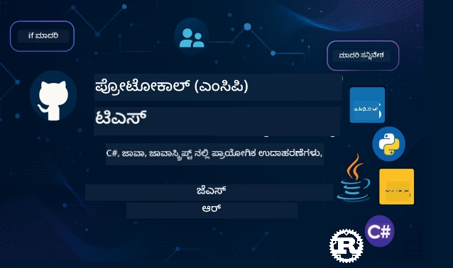

 

[](https://GitHub.com/microsoft/mcp-for-beginners/graphs/contributors)
[](https://GitHub.com/microsoft/mcp-for-beginners/issues)
[](https://GitHub.com/microsoft/mcp-for-beginners/pulls)
[](http://makeapullrequest.com)
[](https://mcptoplist.com/server/mcp.so%2Fmcp-for-beginners%2Fmicrosoft)

[](https://GitHub.com/microsoft/mcp-for-beginners/watchers)
[](https://GitHub.com/microsoft/mcp-for-beginners/fork)
[](https://GitHub.com/microsoft/mcp-for-beginners/stargazers)


[](https://discord.gg/nTYy5BXMWG)

ಈ ಸಂಪನ್ಮೂಲಗಳನ್ನು ಬಳಸಲು ಆರಂಭಿಸಲು ಈ ಹಂತಗಳನ್ನು ಅನುಸರಿಸಿ:
1. **ರಿಪೊಸಿಟರಿಯನ್ನು ಫೋರ್ಕ್ ಮಾಡಿ**: ಕ್ಲಿಕ್ ಮಾಡಿ [](https://GitHub.com/microsoft/mcp-for-beginners/fork)
2. **ರಿಪೊಸಿಟರಿಯನ್ನು ಕ್ಲೋನ್ ಮಾಡಿ**:   `git clone https://github.com/microsoft/mcp-for-beginners.git`
3. **ಸಂದರ್ಶನ ಸೇರ್ಸಿರಿ** [](https://discord.gg/nTYy5BXMWG)


### 🌐 ಬಹುಭಾಷಾ ಬೆಂಬಲ

#### GitHub ಆಕ್ಷನ್ ಮೂಲಕ ಬೆಂಬಲಿಸಲಾಗಿದೆ (ಸ್ವಯಂಚಾಲಿತ ಮತ್ತು ಸದಾ ನವೀಕೃತ)

<!-- CO-OP TRANSLATOR LANGUAGES TABLE START -->
[Arabic](../ar/README.md) | [Bengali](../bn/README.md) | [Bulgarian](../bg/README.md) | [Burmese (Myanmar)](../my/README.md) | [Chinese (Simplified)](../zh-CN/README.md) | [Chinese (Traditional, Hong Kong)](../zh-HK/README.md) | [Chinese (Traditional, Macau)](../zh-MO/README.md) | [Chinese (Traditional, Taiwan)](../zh-TW/README.md) | [Croatian](../hr/README.md) | [Czech](../cs/README.md) | [Danish](../da/README.md) | [Dutch](../nl/README.md) | [Estonian](../et/README.md) | [Finnish](../fi/README.md) | [French](../fr/README.md) | [German](../de/README.md) | [Greek](../el/README.md) | [Hebrew](../he/README.md) | [Hindi](../hi/README.md) | [Hungarian](../hu/README.md) | [Indonesian](../id/README.md) | [Italian](../it/README.md) | [Japanese](../ja/README.md) | [Kannada](./README.md) | [Khmer](../km/README.md) | [Korean](../ko/README.md) | [Lithuanian](../lt/README.md) | [Malay](../ms/README.md) | [Malayalam](../ml/README.md) | [Marathi](../mr/README.md) | [Nepali](../ne/README.md) | [Nigerian Pidgin](../pcm/README.md) | [Norwegian](../no/README.md) | [Persian (Farsi)](../fa/README.md) | [Polish](../pl/README.md) | [Portuguese (Brazil)](../pt-BR/README.md) | [Portuguese (Portugal)](../pt-PT/README.md) | [Punjabi (Gurmukhi)](../pa/README.md) | [Romanian](../ro/README.md) | [Russian](../ru/README.md) | [Serbian (Cyrillic)](../sr/README.md) | [Slovak](../sk/README.md) | [Slovenian](../sl/README.md) | [Spanish](../es/README.md) | [Swahili](../sw/README.md) | [Swedish](../sv/README.md) | [Tagalog (Filipino)](../tl/README.md) | [Tamil](../ta/README.md) | [Telugu](../te/README.md) | [Thai](../th/README.md) | [Turkish](../tr/README.md) | [Ukrainian](../uk/README.md) | [Urdu](../ur/README.md) | [Vietnamese](../vi/README.md)

> **ಸ್ಥಳೀಯವಾಗಿ ಕ್ಲೋನ್ ಮಾಡಲು ಇಷ್ಟಪಡುತ್ತೀರಾ?**
>
> ಈ ರಿಪೊಸಿಟರಿಯಲ್ಲಿ 50+ ಭಾಷಾ ಅನುವಾದಗಳು ಇದ್ದು ಅವು ಡೌನ್‌ಲೋಡ್ ಗಾತ್ರವನ್ನು ಬಹಳ ಹೆಚ್ಚಿಸುತ್ತವೆ. ಅನುವಾದಗಳಿಲ್ಲದೆ ಕ್ಲೋನ್ ಮಾಡಲು sparse checkout ಬಳಸಿರಿ:
>
> **ಬ್ಯಾಷ್ / macOS / ಲಿನಕ್ಸ್:**
> ```bash
> git clone --filter=blob:none --sparse https://github.com/microsoft/mcp-for-beginners.git
> cd mcp-for-beginners
> git sparse-checkout set --no-cone '/*' '!translations' '!translated_images'
> ```
>
> **ಸಿಎಂಡಿ (ವಿಂಡೋಸ್):**
> ```cmd
> git clone --filter=blob:none --sparse https://github.com/microsoft/mcp-for-beginners.git
> cd mcp-for-beginners
> git sparse-checkout set --no-cone "/*" "!translations" "!translated_images"
> ```
>
> ಇದು ನಿಮಗೆ ಕೋರ್ಸನ್ನು ಪೂರ್ಣಗೊಳಿಸಲು ಅಗತ್ಯವಿರುವ ಎಲ್ಲವನ್ನೂ ತುಂಬಾ ವೇಗವಾಗಿ ಡೌನ್‌ಲೋಡ್ ಮಾಡುತ್ತದೆ.
<!-- CO-OP TRANSLATOR LANGUAGES TABLE END -->

# 🚀 ಪ್ರಾರಂಭಿಕರಿಗಾಗಿ ಮಾಡಲ್ ಕಂಟೆಕ್ಸ್ಟ್ ಪ್ರೋಟೋಕಾಲ್ (MCP) ಪಠ್ಯಕ್ರಮ

## **C#, ಜಾವಾ, ಜಾವಾಸ್ಕ್ರಿಪ್ಟ್, ರಸ್ಟ್, ಪೈಥಾನ್ ಮತ್ತು ಟೈಪ್ಸ್ಕ್ರಿಪ್ಟ್‌ನಲ್ಲಿ ಕೈಯಲ್ಲಿನ ಕೋಡ್ ಉದಾಹರಣೆಗಳೊಂದಿಗೆ MCP నేర్చಿಕೊಳ್ಳಿ**

## 🧠 ಮಾಡಲ್ ಕಂಟೆಕ್ಸ್ಟ್ ಪ್ರೋಟೋಕಲ್ ಪಠ್ಯಕ್ರಮದ ಅವಲೋಕನ
ಮಾಡಲ್ ಕಂಟೆಕ್ಸ್ಟ್ ಪ್ರೋಟೋಕಾಲ್‌ನಲ್ಲಿ ನಿಮ್ಮ ಯಾತ್ರೆಗೆ ಸ್ವಾಗತ! ನೀವು ಎಂದಾದರೂ AI ಅಪ್ಲಿಕೇಶನ್ಗಳು ವಿಭಿನ್ನ ಉಪಕರಣಗಳು ಮತ್ತು ಸೇವೆಗಳೊಂದಿಗೆ ಹೇಗೆ ಸಂವಹನ ಮಾಡುತ್ತವೆಯೆಂದು ಆಶ್ಚರ್ಯಪಟ್ಟಿದ್ದರೆ, ನೀವು ಈಗಾಗಲೇ ಬದಲಾಯಿಸುತ್ತಿರುವ ಅದ್ಭುತ ಪರಿಹಾರವನ್ನು ಕಂಡುಹಿಡಿಯುತ್ತಿದ್ದೀರಾ, ಅದು ಡೆವಲಪರ್‌ಗಳು ಬುದ್ಧಿವಂತಿಕೆಯ ವ್ಯವಸ್ಥೆಗಳನ್ನು ನಿರ್ಮಿಸಲು ಹೇಗೆ ಸಹಾಯ ಮಾಡುತ್ತದೆ.

MCP ಅನ್ನು AI ಅಪ್ಲಿಕೇಶನ್ಗಳಿಗಾಗಿ ಎಲ್ಲ ಪಕ್ಕದ ಭಾಷಾಂತರಕಾರನಾಗಿ ಪರಿಗಣಿಸಬಹುದು - USB ಪೋರ್ಟ್‌ಗಳು ನೀವು ಯಾವುದಾದರೂ ಸಾಧನವನ್ನು ನಿಮ್ಮ ಕಂಪ್ಯೂಟರ್‌ಗೆ ಸಂಪರ್ಕಿಸಲು ಅನುಮತಿಸುವಂತಹದು, MCP AI ಮಾದರಿಗಳು ಯಾವುದೇ ಸಾಧನ ಅಥವಾ ಸೇವೆಯನ್ನು ಸ್ಥೂಲರಾಗಿಯೇ ಸಂಪರ್ಕಿಸುವಂತೆ ಮಾಡುತ್ತದೆ. ನೀವು ಪ್ರಥಮ ಚಾಟ್‌ಬಾಟ್ ಅನ್ನು ನಿರ್ಮಿಸುತ್ತಿದ್ದೀರಾ ಅಥವಾ ಸಂಕೀರ್ಣ AI ವರ್ಕ್ಫ್ಲೋಗಳ ಮೇಲೆ ಕೆಲಸ ಮಾಡುತ್ತಿದ್ದೀರಾ, MCP ಬಗ್ಗೆ ತಿಳಿದುಕೊಳ್ಳುವುದು ನಿಮಗೆ ಹೆಚ್ಚು ಶಕ್ತಿಶಾಲಿ ಮತ್ತು ಸುವ್ಯವಸ್ಥಿತ ಅಪ್ಲಿಕೇಶನ್‌ಗಳನ್ನು ನಿರ್ಮಿಸುವ ಸಾಮರ್ಥ್ಯವನ್ನು ನೀಡುತ್ತದೆ.

ಈ ಪಠ್ಯಕ್ರಮವು ನಿಮಗೆ ಸಹನಶೀಲತೆ ಮತ್ತು ಆರೈಕೆ ಜೊತೆಗಿಟ್ಟು ರಚಿಸಲಾಗಿದೆ ನಿಮ್ಮ ಕಲಿಕೆ ಯಾತ್ರೆಗೆ. ನಾವು ನೀವು ಈಗಾಗಲೇ ಅರ್ಥಮಾಡಿಕೊಂಡಿರುವ ಸರಳ ತತ್ವಗಳಿಂದ ಪ್ರಾರಂಭಿಸಿ, ಇಷ್ಟವಾಗುವ ಪ್ರೋಗ್ರಾಮಿಂಗ್ ಭಾಷೆಯಲ್ಲಿ ಕೈಗೆಟುಕುವ ಅಭ್ಯಾಸಗಳ ಮೂಲಕ ನಿಮ್ಮ ಪರಿಣತಿಯಿಂದ ಬೆಳೆಸುತ್ತೇವೆ. ಪ್ರತಿ ಹಂತದಲ್ಲೂ ಸ್ಪಷ್ಟ ವಿವರಣೆಗಳು, ಪ್ರಾಯೋಗಿಕ ಉದಾಹರಣೆಗಳು ಮತ್ತು ಸಾಕಷ್ಟು ಶ್ರದ್ಧೆಯಿರುವ ಪ್ರೇರಣೆ ಇದೆ.

ನೀವು ಈ ಯಾತ್ರೆಯನ್ನು ಪೂರ್ಣಗೊಳಿಸುವಾಗ, ನೀವು ನಿಮ್ಮ MCP ಸರ್ವರ್‌ಗಳನ್ನು ನಿರ್ಮಿಸಲು ಆತ್ಮವಿಶ್ವಾಸ ಪಡೆಯುತ್ತೀರಿ, ಜನಪ್ರಿಯ AI ವೇದಿಕೆಗಳೊಂದಿಗೆ ಇಂಟಿಗ್ರೇಟ್ ಮಾಡುತ್ತೀರಿ ಮತ್ತು ಈ ತಂತ್ರಜ್ಞಾನ AI ಅಭಿವೃದ್ಧಿಯ ಭವಿಷ್ಯವನ್ನು ಹೇಗೆ ರೂಪಿಸುತ್ತಿದೆ ಎಂದು ಅರ್ಥಮಾಡಿಕೊಳ್ಳುತ್ತೀರಿ. ಈ ರೋಚಕ ಸಾಹಸವನ್ನು ಸಹವಾಸ ಮಾಡಿಕೊಂಡು ಆರಂಭಿಸೋಣ!

### ಅಧಿಕೃತ ದಾಖಲೆಗಳು ಮತ್ತು ವಿಶೇಷಣಗಳು

ಈ ಪಠ್ಯಕ್ರಮವು **MCP ವಿಶೇಷಣ 2025-11-25** (ಇತ್ತೀಚಿನ ಸ್ಥಿರ ಬಿಡುಗಡೆಯ) ಜೊತೆಗೆ ಹೊಂದಾಣಿಕೆಯಾಗಿವೆ. MCP ವಿಶೇಷಣವು ಸ್ಪಷ್ಟ ಪ್ರೋಟೋಕಾಲ್ ಆವೃತ್ತಿ ಟ್ರ್ಯಾಕಿಂಗ್ ಮಾಡಲು ದಿನಾಂಕ ಆಧಾರಿತ ಆವೃತ್ತಿ(YYYY-MM-DD ಫಾರ್ಮ್ಯಾಟ್) ಬಳಸುತ್ತದೆ.

> **ಮುಂದಿನ ದೃಷ್ಟಿ:** ಮುಂದಿನ ವಿಶೇಷಣ ಆವೃತ್ತಿ, **2026-07-28**, ಬಿಡುಗಡೆ ಅಭ್ಯರ್ಥಿ ಜುಲೈ 28, 2026 ರಂದು ಬಿಡುಗಡೆಯಾಗಲು ಯೋಜಿಸಲಾಗಿದೆ. ಇದು ಸಂಪ್ರೇಕ್ಷಣ ಪರತೆಯಲ್ಲಿ ಪ್ರೋಟೋಕಾಲ್ ಅನ್ನು ರಾಜ್ಯರಹಿತವಾಗಿ ಮಾಡುತ್ತದೆ, ವಿಸ್ತರಣೆಗಳ ಫ್ರೇಮ್‌ವರ್ಕ್ (MCP ಆ್ಯಪ್ಸ್, ಟಾಸ್ಕ್ಸ್) ಅನ್ನು ಅಧಿಕೃತಗೊಳಿಸುತ್ತದೆ, ಪ್ರಾಧಿಕಾರವನ್ನು ಬಲಪಡಿಸುತ್ತದೆ, ಮತ್ತು ರೂಟ್ಸ್,ಸ್ಯಾಂಪ್ಲಿಂಗ್ ಮತ್ತು ಲಾಗಿಂಗ್ ಅನ್ನು ನಿರಾಕರಿಸುತ್ತದೆ. ಸಂಪೂರ್ಣ ವಿವರಣೆಗೆ [MCPನಲ್ಲಿ ಏನು ಬದಲಾಗುತ್ತಿದೆ: 2026-07-28 ಬಿಡುಗಡೆ ಅಭ್ಯರ್ಥಿ](./01-CoreConcepts/mcp-2026-07-28-release-candidate.md) ನೋಡಿ.

ಈ ಸಂಪನ್ಮೂಲಗಳು ನಿಮ್ಮ ಅರ್ಥವು ಬೆಳವಣಿಗೆಗೊಳ್ಳುತ್ತಿದ್ದಂತೆ ಮತ್ತಷ್ಟು ಮೌಲ್ಯವಂತ ಆಗುತ್ತವೆ, ಆದರೆ ತಕ್ಷಣವೇ ಎಲ್ಲವನ್ನೂ ಓದುವ ಒತ್ತಡವಾಗಬೇಡಿ. ನಿಮ್ಮಿಗೆ ಹೆಚ್ಚು ಆಸಕ್ತಿ ಇರುವ ವಿಭಾಗಗಳಿಂದ ಪ್ರಾರಂಭಿಸಿ!
- 📘 [MCP ಡಾಕ್ಯುಮೆಂಟೇಷನ್](https://modelcontextprotocol.io/) – ನಿಮಗೆ ಹಂತಹಂತದ ಟ್ಯುಟೋರಿಯಲ್ಗಳು ಮತ್ತು ಬಳಕೆದಾರ ಬಳಕೆದಾರ ಮಾರ್ಗದರ್ಶಿಗಳನ್ನು ನೀಡುವ ನಿಮ್ಮ ಮುಖ್ಯ ಸಂಪನ್ಮೂಲ. ಡಾಕ್ಯುಮೆಂಟೇಷನ್ ಪ್ರಾರಂಭಿಕರಿಗೆ ಅನುಕೂಲವಾಗುವಂತೆ ಬರೆಯಲ್ಪಟ್ಟಿದ್ದು, ನೀವು ನಿಮ್ಮ ವೇಗದಲ್ಲಿ ಅನುಸರಿಸಬಹುದಾದ ಸ್ಪಷ್ಟ ಉದಾಹರಣೆಗಳನ್ನು ಒದಗಿಸುತ್ತದೆ.
- 📜 [MCP ವಿಶೇಷಣ](https://modelcontextprotocol.io/specification/2025-11-25) – ಇದನ್ನು ನಿಮ್ಮ ಸಮಗ್ರ ನಿರೂಪಣಾ ಕೈಪಿಡಿ ಎಂದು ಭಾವಿಸಿ. ನೀವು ಪಠ್ಯಕ್ರಮದಿಂದ ಕೆಲಸ ಮಾಡುವಾಗ, ನಿಖರ ವಿವರಗಳನ್ನು ಹುಡುಕಲು ಮತ್ತು ಸುಧಾರಿತ ವೈಶಿಷ್ಟ್ಯಗಳನ್ನು ಅನ್ವೇಷಿಸಲು ನೀವು ಇಲ್ಲಿ ಮತ್ತೆ ಬರುತ್ತೀರಿ.
- 📜 [MCP ವಿಶಿಷ್ಟ ಆವೃತ್ತಿ ನಿಯಂತ್ರಣ](https://modelcontextprotocol.io/specification/versioning) – ಇದರಲ್ಲಿ ಪ್ರೋಟೋಕಾಲ್ ಆವೃತ್ತಿ ಇತಿಹಾಸ ಮತ್ತು MCP ದಿನಾಂಕ ಆಧಾರಿತ ಆವೃತ್ತಿ(YYYY-MM-DD) ಹೇಗೆ ಬಳಸುತ್ತದೆ ಬಗ್ಗೆ ಮಾಹಿತಿ ಇದೆ.
- 🧑‍💻 [MCP GitHub ರಿಪೊಸಿಟರಿ](https://github.com/modelcontextprotocol) – ಇಲ್ಲಿ ನೀವು SDK ಗಳು, ಸಾಧನಗಳು ಮತ್ತು ಹಲವಾರು ಪ್ರೋಗ್ರಾಮಿಂಗ್ ಭಾಷೆಗಳಲ್ಲಿ ಕೋಡ್ ಉದಾಹರಣೆಗಳನ್ನು ಕಾಣುತ್ತೀರಿ. ಇದು ಪ್ರಾಯೋಗಿಕ ಉದಾಹರಣೆಗಳ ಮತ್ತು ಬಳಸಲು ಸಿದ್ಧ ഘಟಕಗಳ ಒಂದು ಸಂಪತ್ತು ತುಂಬಿದ ಸ್ಥಳವಾಗಿದೆ.
- 🌐 [MCP ಸಮುದಾಯ](https://github.com/orgs/modelcontextprotocol/discussions) – MCP ಕುರಿತು fellow ಕಲಿಯುವವರು ಮತ್ತು ಅನುಭವಿ ಡೆವಲಪರ್‌ಗಳೊಂದಿಗೆ ಚರ್ಚೆಗಳಲ್ಲಿ ಸೇರಿರಿ. ಇದು ಸಹಾಯಕ ಸಮುದಾಯವಾಗಿದ್ದು, ಪ್ರಶ್ನೆಗಳಿಗೆ ಸ್ವಾಗತ ನೀಡುತ್ತದೆ ಮತ್ತು ಜ್ಞಾನವನ್ನು ಮುಕ್ತವಾಗಿ ಹಂಚಿಕೊಳ್ಳುತ್ತಾರೆ.
  
## ಕಲಿಕೆಯ ಗುರಿಗಳು

ಈ ಪಠ್ಯಕ್ರಮದ ಅಂತ್ಯದಲ್ಲಿ, ನೀವು ನಿಮ್ಮ ಹೊಸ ಸಾಮರ್ಥ್ಯಗಳ ಬಗ್ಗೆ ಆತ್ಮವಿಶ್ವಾಸ ಮತ್ತು ಉತ್ಸಾಹಿತವಾಗಿರುತ್ತೀರಿ. ನೀವು ಸಾಧಿಸುವುದೇನು ಇಲ್ಲಿದೆ:

• **MCP ಮೂಲಭೂತಗಳನ್ನು ಅರ್ಥಮಾಡಿಕೊಳ್ಳಿ**: ಮಾಡಲ್ ಕಂಟೆಕ್ಸ್ಟ್ ಪ್ರೋಟೋಕಾಲ್ ಎಂದರೇನು ಮತ್ತು ಅದು AI ಅಪ್ಲಿಕೇಶನ್ಗಳು ಹೇಗೆ ಸಂವಹನ ಮಾಡುತ್ತವೆ ಎಂಬುದನ್ನು ಸರಳ ಉದಾಹರಣೆಗಳು ಮತ್ತು ರೂಪಕಗಳ ಮೂಲಕ ಅರ್ಥಮಾಡಿಕೊಳ್ಳುವಿರಿ.

• **ನಿಮ್ಮ ಮೊದಲ MCP ಸರ್ವರ್ ನಿರ್ಮಿಸಿ**: ನಿಮ್ಮ ಇಷ್ಟದ ಪ್ರೋಗ್ರಾಮಿಂಗ್ ಭಾಷೆಯಲ್ಲಿ ಕೆಲಸ ಮಾಡುವ MCP ಸರ್ವರ್ ಅನ್ನು ಸರಳ ಉದಾಹರಣೆಗಳಿಂದ ಪ್ರಾರಂಭಿಸಿ ಹಂತ ಹಂತವಾಗಿ ನಿಮ್ಮ ಕೌಶಲ್ಯಗಳನ್ನು ವೃದ್ಧಿಪಡಿಸುವಿರಿ.

• **AI ಮಾದರಿಗಳನ್ನು ನಿಜವಾದ ಸಾಧನಗಳಿಗೆ ಸಂಪರ್ಕಿಸಿ**: AI ಮಾದರಿಗಳು ಮತ್ತು ನಿಜವಾದ ಸೇವೆಗಳ ನಡುವೆ ಸೇತುವೆ ನಿರ್ಮಿಸುವ ವಿಧಾನವನ್ನು ಕಲಿಯುವಿರಿ, ನಿಮ್ಮ ಅಪ್ಲಿಕೇಶನ್ಗಳಿಗೆ ಶಕ್ತಿಶಾಲಿ ಹೊಸ ಸಾಮರ್ಥ್ಯಗಳನ್ನು ನೀಡುವಿರಿ.

• **ಭದ್ರತಾ ಉತ್ತಮ ಅಭ್ಯಾಸಗಳನ್ನು ಜಾರಿಗೆ ತರುವಿರಿ**: ನಿಮ್ಮ MCP ಜಾರಿಗೆ ಸುರಕ್ಷಿತವಾಗಿರಲು ಹೇಗೆ ನೋಡಿಕೊಳ್ಳಬೇಕೆಂಬುದನ್ನು ಅರ್ಥಮಾಡಿಕೊಳ್ಳುವಿರಿ, ನಿಮ್ಮ ಅಪ್ಲಿಕೇಶನ್ಗಳನ್ನೂ, ಬಳಕೆದಾರರನ್ನೂ ರಕ್ಷಿಸುವಿರಿ.

• **ವಿಶ್ವಾಸದಿಂದ ನಿಯೋಜಿಸಿ**: ನಿಮ್ಮ MCP ಪ್ರಾಜೆಕ್ಟುಗಳನ್ನು ಅಭಿವೃದ್ಧಿಯಿಂದ ಉತ್ಪಾದನೆಗೆ ತೆಗೆದುಕೊಂಡು ಹೋಗುವ ದೃಢವಾದ ನಿಯೋಜನಾ ತಂತ್ರಗಳನ್ನು ತಿಳಿದುಕೊಳ್ಳುವಿರಿ.

• **MCP ಸಮುದಾಯದಲ್ಲಿ ಸೇರಿ**: AI ಅಪ್ಲಿಕೇಶನ್ ಅಭಿವೃದ್ಧಿಯ ಭವಿಷ್ಯ ಆಕಾರಗೊಳ್ಳುತ್ತಿರುವ ಅಭಿವೃದ್ಧಿಪಡಿಸುವವರ ಬೆಳೆಯುತ್ತಿರುವ ಸಮುದಾಯದ ಭಾಗವಾಗುವಿರಿ.

## ಅಗತ್ಯ ಹಿನ್ನೆಲೆ

MCP ವಿಶೇಷ ಕಾರ್ಯಗಳಿಗೆ ದಂಡೆಯಾಗಿ ಮುಳುಗುವ ಮುನ್ನ, ಕೆಲವು ಮೂಲಭೂತ ತತ್ವಗಳೊಂದಿಗೆ ನಿಮ್ಮನ್ನು ಆರಾಮವಾಗಿಸುವುದನ್ನು ಖಚಿತಪಡಿಸೋಣ. ನೀವು ಇಲ್ಲಿಯವರೆಗೆ ಪರಿಣತಿರಾಗಿರದಿದ್ದರೂ ಚಿಂತೆ ಬೇಡ - ನಾವೆಲ್ಲವೂ ನಿಮಗೆ ಬೇಕಾದ ಎಲ್ಲವನ್ನೂ ವಿವರಿಸುತ್ತೇವೆ!

### ಪ್ರೋಟೋಕಾಲ್‌ಗಳ ಅರ್ಥಮಾಡಿಕೊಳ್ಳುವುದು (ಅಡಿಗಲ್ಲು)

ಪ್ರೋಟೋಕಾಲ್ ಅನ್ನು ಸಂಭಾಷಣೆಯ ನಿಯಮಗಳಂತೆ ಪರಿಗಣಿಸಿ. ನೀವು ಸ್ನೇಹಿತನಿಗೆ ಕರೆ ಮಾಡಿದಾಗ, ನಿಮ್ಮಿಬ್ಬರೂ "ಹಲೋ" ಎಂದು ಹೇಳುತ್ತಾರೆ, ಮಾತು ಮಾಯವಾಗಿರುವ ಸುಮಾರು, ಮತ್ತು ಮುಗಿದ ಸಂದರ್ಭದಲ್ಲಿ "ವಿದಾಯ" ಎಂದು ಹೇಳುತ್ತಾರೆ. ಗಣಕಯಂತ್ರ ಕಾರ್ಯಕ್ರಮಗಳು ಪರಿಣಾಮಕಾರಿಯಾಗಿ ಸಂವಹನ ಮಾಡಲು ಇದೇ ರೀತಿ ನಿಯಮಗಳನ್ನು ಅಗತ್ಯವಿದೆ.

MCP ಒಂದು ಪ್ರೋಟೋಕಾಲ್ - AI ಮಾದರಿಗಳು ಮತ್ತು ಅಪ್ಲಿಕೇಶನ್ಗಳು ಸಾಧನಗಳು ಮತ್ತು ಸೇವೆಗಳ ಜೊತೆ ಉತ್ಪಾದಕ "ಸಂಭಾಷಣೆ" ನಡೆಸಲು ಸಹಾಯಕವಾಗುವ ಒಪ್ಪಿಗೆಯ ನಿಯಮಗಳ ಸಮೂಹ. ಮಾನವ ಸಂವಹನ ಸುಗಮವಾಗಲು ಸಂಭಾಷಣೆ ನಿಯಮಗಳು ಇರುವಂತೆ, MCP ಇರುವುದು AI ಅಪ್ಲಿಕೇಶನ್ ಸಂವಹನವನ್ನು ಹೆಚ್ಚಿನ ನಂಬಿಕೆಯಾಗುವ ಹಾಗೆ ಮತ್ತು ಶಕ್ತಿಶಾಲಿಯನ್ನಾಗಿಸುತ್ತದೆ.

### ಕ್ಲೈಂಟ್-ಸರ್ವರ್ ಸಂಬಂಧಗಳು (ಕಾರ್ಯಕ್ರಮಗಳು ಹೇಗೆ ಜತೆಗನುಡಿ ಹೋಗುತ್ತವೆ)

ನೀವು ಈಗಾಗಲೇ ಪ್ರತिदಿನ ಕ್ಲೈಂಟ್-ಸರ್ವರ್ ಸಂಬಂಧಗಳನ್ನು ಬಳಸುತ್ತಿದ್ದೀರಿ! ನೀವು ಒಬ್ಬ ವೆಬ್ ಬ್ರೌಸರ್ (ಕ್ಲೈಂಟ್) ಬಳಸಿ ವೆಬ್‌ಸೈಟ್‌ಗು ಭೇಟಿ ನೀಡುವಾಗ, ನೀವು ಪೇಜ್ ವಿಷಯವನ್ನು ಕಳುಹಿಸುವ ವೆಬ್ ಸರ್ವರ್ ಅನ್ನು ಸಂಪರ್ಕಿಸುತ್ತೀರಿ. ಬ್ರೌಸರ್ ಮಾಹಿತಿ ಕೇಳುವುದು ಹೇಗೆ ಮತ್ತು ಸರ್ವರ್ ಉತ್ತರಿಸುವುದು ಹೇಗೆ ತಿಳಿದಿರುತ್ತದೆ.

MCP ಯಲ್ಲಿ, ಇದೇ ರೀತಿಯ ಸಂಬಂಧಿದೆ: AI ಮಾದರಿಗಳು ಮಾಹಿತಿ ಅಥವಾ ಕ್ರಿಯೆಗಳ ಕೋರಿ, MCP ಸರ್ವರ್‌ಗಳು ಆ ಸಾಮರ್ಥ್ಯಗಳನ್ನು ಒದಗಿಸುತ್ತವೆ. ಇದು AIಗೆ ನಿರ್ದಿಷ್ಟ ಕಾರ್ಯಗಳನ್ನು ಮಾಡಲು ಕೇಳಬಲ್ಲ ಸಹಾಯಕ (ಸರ್ವರ್) ಇದ್ದಂತೆ.

### 为什么标准化很重要 (使事物协调工作)

ನಿಮ್ಮ ಎಲ್ಲಾ ಕಾರು ತಯಾರಕರು ವಿವಿಧ ಆಕಾರದ ಅನಿಲ ಪಂಪ್‌ಗಳನ್ನು ಬಳಸಿ ಎಂದು ಕಲ್ಪಿಸಿ - ಪ್ರತಿ ಕಾರಿಗೂ ಬೇರೆ ಅಡಾಪ್ಟರ್ ಬೇಕಾಗುತ್ತದೆ! ಪ್ರಮಾಣೀಕರಣವು ಸಾಮಾನ್ಯ ಕ್ರಮಗಳನ್ನು ಒಪ್ಪಿಕೊಳ್ಳುವುದನ್ನು 의미ಿಸಲು ಅರ್ಥ.

MCP AI ಅಪ್ಲಿಕೇಶನ್ಗಳಿಗೆ ಈ ಪ್ರಮಾಣೀಕರಣವನ್ನು ಒದಗಿಸುತ್ತದೆ. ಪ್ರತಿ AI ಮಾದರಿ ಪ್ರತಿ ಸಾಧನಕ್ಕೆ ಕಸ್ಟಮ್ ಕೋಡ್ ರಚಿಸುವ ಬದಲು, MCP ಅವರು ಸಂವಹನ ಮಾಡುವ ಸಾಮಾನ್ಯ ಮಾರ್ಗವನ್ನು ಸೃಷ್ಟಿಸುತ್ತದೆ. ಇದರಿಂದ ಡೆವಲಪರ್ಸ್ ಒಂದು ಸಲ ಸಾಧನಗಳನ್ನು ರೂಪಿಸಿ, ಅನೇಕ ವಿಭಿನ್ನ AI ವ್ಯವಸ್ಥೆಗಳಲ್ಲಿ ಕಾರ್ಯಗತಗೊಳಿಸಬಹುದಾಗಿದೆ.

## 🧭 ನಿಮ್ಮ ಕಲಿಕೆ ಮಾರ್ಗದ ಅವಲೋಕನ

ನಿಮ್ಮ MCP ಯಾತ್ರೆ ಪ್ರಗತಿಶೀಲವಾಗಿ ನಿಮ್ಮ ಆತ್ಮವಿಶ್ವಾಸ ಮತ್ತು ಕೌಶಲ್ಯಗಳನ್ನು ನಿರ್ಮಿಸಲು ಶ್ರದ್ಧೆಯಿಂದ ವಿನ್ಯಾಸಗೊಳಿಸಲಾಗಿದೆ. ಪ್ರತಿ ಹಂತವು ಹೊಸ ತತ್ವಗಳನ್ನು ಪರಿಚಯಿಸುವಾಗದಿನಾ ನೀವು ಈಗಾಗಲೇ ಕಲಿತಿರುವುದನ್ನು ಬಲಪಡಿಸುತ್ತದೆ.

### 🌱 ಅಡಿಗಲ್ಲು ಹಂತ: ಮೂಲತತ್ತ್ವಗಳನ್ನು ಅರ್ಥಮಾಡಿಕೊಳ್ಳುವುದು (ಮಾಡ್ಯೂಲ್‌ಗಳು 0-2)

ಇಲ್ಲಿ ನಿಮ್ಮ ಸಾಹಸ ಪ್ರಾರಂಭವಾಗುತ್ತದೆ! ನಾವು ನಿಮ್ಮಿಗೆ MCP ತತ್ವಗಳನ್ನು ಪರಿಚಯಿಸುವಾಗ ಪರಿಚಿತ ರೂಪಕಗಳು ಮತ್ತು ಸರಳ ಉದಾಹರಣೆಗಳನ್ನು ಉಪಯೋಗಿಸುತ್ತೇವೆ. ನೀವು MCP ಎಂದರೇನು, ಅದು ಏಕೆ ಇದೆ ಮತ್ತು ಇದು AI ಅಭಿವೃದ್ಧಿಯ ದೊಡ್ಡ ಜಗತ್ತಿನಲ್ಲಿ ಹೇಗೆ ಹೊಂದಿಕೊಳ್ಳುತ್ತದೆ ಎಂದು ಅರ್ಥಮಾಡಿಕೊಳ್ಳುತ್ತೀರಿ.


• **ಮೊಡ್ಯೂಲ್ 0 - MCPಗೆ ಪರಿಚಯ**: ನಾವು MCP ಯೇನು ಮತ್ತು ಆಧುನಿಕ AI ಅನ್ವಯಿಕೆಗಳಿಗೆ ಇದು ಏಕೆ ಇಷ್ಟು ಮುಖ್ಯವೋ ಅರ್ಥಮಾಡಿಕೊಳ್ಳುವುದರಿಂದ ಪ್ರಾರಂಭಿಸೋಣ. ನೀವು ಕಾರ್ಯನಿರ್ವಹಿಸಿದ MCP ನ ವಾಸ್ತವಿಕ ಉದಾಹರಣೆಗಳನ್ನು ನೋಡುತ್ತೀರಿ ಮತ್ತು ಇದು ಅಭಿವೃದ್ಧಿಪಡಿಸುವವರು ಎದುರಿಸುವ ಸಾಮಾನ್ಯ ಸಮಸ್ಯೆಗಳನ್ನು ಹೇಗೆ ಪರಿಹರಿಸುತ್ತದೆ ಎಂದು ಅರ್ಥಮಾಡಿಕೊಳ್ಳುತ್ತೀರಿ.

• **ಮೊಡ್ಯೂಲ್ 1 - ಕೋರ್ ಪರಿಕಲ್ಪನೆಗಳು ವಿವರಿಸಿದರು**: ಇಲ್ಲಿ ನೀವು MCP ನ ಅವಶ್ಯಕ ಕಟ್ಟಡ ತತ್ವಗಳನ್ನು ಕಲಿಯುತ್ತೀರಿ. ನಾವು ಹಲವಾರು ಉದಾಹರಣೆಗಳು ಮತ್ತು ದೃಶ್ಯ ಉದಾಹರಣೆಗಳನ್ನು ಬಳಸಿಕೊಂಡು ಈ ಪರಿಕಲ್ಪನೆಗಳನ್ನು ಸಹಜವಾಗಿಯೂ ಅರ್ಥವಾಗುವಂತೆ ಮಾಡುತ್ತೇವೆ.

• **ಮೊಡ್ಯೂಲ್ 2 - MCP ನಲ್ಲಿ ಭದ್ರತೆ**: ಭದ್ರತೆ ಭಯಭೀತಿಗೊಳಿಸುವಂತಿರಬಹುದು, ಆದರೆ ನಾವು ನಿಮಗೆ MCP ಯಲ್ಲಿ ರಚಿಸಲಾಗಿರುವ ಸುರಕ್ಷತಾ ವೈಶಿಷ್ಟ್ಯಗಳನ್ನು ತೋರಿಸುತ್ತೇವೆ ಮತ್ತು ನಿಮ್ಮ ಅನ್ವಯಿಕೆಗಳನ್ನು ಆರಂಭದಿಂದ ರಕ್ಷಿಸುವ ಉತ್ತಮ ಅಭ್ಯಾಸಗಳನ್ನು ಕಲಿಸುವೆವು.

### 🔨 ನಿರ್ಮಾಣ ಹಂತ: ನಿಮ್ಮ ಮೊದಲ ಅನುಷ್ಠಾನಗಳನ್ನು ಸೃಜಿಸುವುದು (ಮೊಡ್ಯೂಲ್ 3)

ಈಗ ನಿಜವಾದ ಮನರಂಜನೆ ಆರಂಭವಾಗುತ್ತದೆ! ನೀವು ನೇರವಾಗಿ MCP ಸರ್ವರ್ ಮತ್ತು ಕ್ಲೈಂಟ್‌ಗಳನ್ನು ನಿರ್ಮಿಸುವ ಅನುಭವವನ್ನು ಪಡೆಯುತ್ತೀರಿ. ಚಿಂತಿಸಬೇಕಾಗಿಲ್ಲ - ನಾವು ಸರಳವಾಗಿ ಪ್ರಾರಂಭಿಸಿ ಪ್ರತೀ ಹಂತದ ಮೂಲಕ ಮಾರ್ಗದರ್ಶನ ನೀಡುತ್ತೇವೆ.

ಈ ಮೊಡ್ಯೂಲ್ ವಿವಿಧ ಹಸ್ತಚಾಲಿತ ಮಾರ್ಗದರ್ಶನಗಳನ್ನು ಒಳಗೊಂಡಿದ್ದು ಅವು ನಿಮ್ಮ ಇಷ್ಟದ ಪ್ರೋಗ್ರಾಮಿಂಗ್ ಭಾಷೆಯಲ್ಲಿ ಅಭ್ಯಾಸ ಮಾಡಲು ಸಹಾಯ ಮಾಡುತ್ತವೆ. ನೀವು ನಿಮ್ಮ ಮೊದಲ ಸರ್ವರ್ ನಿರ್ಮಿಸಿ, ಅದಕ್ಕೆ ಸಂಪರ್ಕಿಸಲು ಕ್ಲೈಂಟ್ ಬಿಲ್ಡ್ ಮಾಡುತ್ತೀರಿ ಮತ್ತು ಪ್ರಸಿದ್ಧ ಅಭಿವೃದ್ಧಿ ಸಾಧನಗಳಾದ VS Code ಜೊತೆಗೂಳಿಸುವುದನ್ನು ಕಲಿಯುತ್ತೀರಿ.

ಪ್ರತಿ ಮಾರ್ಗದರ್ಶನವು ಸಂಪೂರ್ಣ ಕೋಡ್ ಉದಾಹರಣೆಗಳು, ತೊಂದರೆ ಪರಿಹಾರ ಸಲಹೆಗಳು ಮತ್ತು ನಾವು ನಿರ್ದಿಷ್ಟ ವಿನ್ಯಾಸ ಆಯ್ಕೆಗಳನ್ನು ಏಕೆ ಮಾಡುತ್ತೇವೆ ಎಂಬ وضاحتಗಳನ್ನು ಒಳಗೊಂಡಿದೆ. ಈ ಹಂತದ ಕೊನೆಯಲ್ಲಿ, ನೀವು ಹೆಮ್ಮೆಯಿಂದ ಕಾಣಿಸಿಕೊಳ್ಳಬಹುದಾದ ಕಾರ್ಯನಿರ್ವಹಿಸುವ MCP ಅನುಷ್ಠಾನಗಳನ್ನು ಹೊಂದಿರುವಿರಿ!

### 🚀 ಬೆಳವಣಿಗೆ ಹಂತ: ಉನ್ನತ ಪರಿಕಲ್ಪನೆಗಳು ಮತ್ತು ವಾಸ್ತವಿಕ ಅನ್ವಯಿಕೆ (ಮೊಡ್ಯೂಲ್‌ಗಳು 4-5)

ಮೂಲಭೂತ ತಿಳಿವಳಿಕೆ掌握 ಮಾಡಿದ ನಂತರ, ನೀವು ಇನ್ನಷ್ಟು ಸುಧಾರಿತ MCP ವೈಶಿಷ್ಟ್ಯಗಳನ್ನು ಅನ್ವೇಷಿಸಲು ಸಿದ್ಧರಾಗಿದ್ದೀರಿ. ನಾವು ವಾಸ್ತವಿಕ ಅನುಷ್ಠಾನ ತಂತ್ರಗಳು, ಡಿಬಗ್ ತಂತ್ರಗಳು ಮತ್ತು ಬಹು-ಮಾದರಿ AI ಸಂಯೋಜನೆ ಮುಂತಾದ ಉನ್ನತ ವಿಷಯಗಳನ್ನು ಆವರಿಸೋಣ.

ನೀವು ನಿಮ್ಮ MCP ಅನುಷ್ಠಾನಗಳನ್ನು ಉತ್ಪಾದನೆಗೆ ಏರಿಸುವುದು ಮತ್ತು ಅಜ್ಯೂರ್ ಲాంటి ಮೇಲಮಟ್ಟದ ವೇದಿಕೆಗಳೊಂದಿಗೆ ಸಂಯೋಜಿಸುವುದನ್ನು ಸಹ ಕಲಿಯುತ್ತೀರಿ. ಈ ಮೊಡ್ಯೂಲ್‌ಗಳು ನಿಮ್ಮನ್ನು ನೈಜ ಜಗತ್ತಿನ ಬೇಡಿಕೆಗಳನ್ನು ನಿಭಾಯಿಸುವ MCP ಪರಿಹಾರಗಳನ್ನು ನಿರ್ಮಿಸಲು ಸಿದ್ಧಪಡಿಸುತ್ತವೆ.

### 🌟 ನಿಪುಣತೆ ಹಂತ: ಸಮುದಾಯ ಮತ್ತು ಸ್ಪೆಷಲೈಜೆಷನ್ (ಮೊಡ್ಯೂಲ್‌ಗಳು 6-11)

ಕೊನೆ ಹಂತವು MCP ಸಮುದಾಯಕ್ಕೆ ಸೇರುವ ಮತ್ತು ನಿಮಗೆ ಹೆಚ್ಚು ಆಸಕ್ತಿಯಿರುವ ಕ್ಷೇತ್ರಗಳಲ್ಲಿ ಪರಿಣತಿ ಹೊಂದುವುದನ್ನು ನಿರ್ದಿಷ್ಟಿಸುತ್ತಿದೆ. ನೀವು ತೆರೆದ ಮೂಲ MCP ಯೋಜನೆಗಳಿಗೆ ಕೊಡುಗೆ ನೀಡುವುದು, ಉನ್ನತ ಪ್ರಮಾಣೀಕರಣ ಮಾದರಿಗಳನ್ನು ಅನುಷ್ಠಾನಗೊಳಿಸುವುದು ಮತ್ತು ಸಮಗ್ರ ಡೇಟಾಬೇಸ್-ಸಂಯೋಜಿತ ಪರಿಹಾರಗಳನ್ನು ನಿರ್ಮಿಸುವುದು ಕಲಿಯುತ್ತೀರಿ.

ಮೊಡ್ಯೂಲ್ 11 ವಿಶೇಷ ಉಲ್ಲೇಖಕ್ಕ ಅರ್ಹವಾಗಿದೆ – ಇದು PostgreSQL ಸಂಯೋಜನೆಯೊಂದಿಗೆ ಉತ್ಪಾದನೆಗೆ ಸಿದ್ಧ MCP ಸರ್ವರ್‌ಗಳನ್ನು ನಿರ್ಮಿಸುವ 13-ಲ್ಯಾಬ್ ಹಸ್ತಚಾಲಿತ ಕಲಿಕಾ ಮಾರ್ಗವಾಗಿದೆ. ಇದು ನೀವು ಕಲಿತ ಎಲ್ಲವನ್ನೂ ಒಟ್ಟುಗೂಡಿಸುವ ಕಾಪ್‌ಸ್ಟೋನ್ ಪ್ರಾಜೆಕ್ಟ್‍ನಂತೆ!

### 📚 ಸಂಪೂರ್ಣ ಪಠ್ಯಕ್ರಮ ರಚನೆ

| ಮೊಡ್ಯೂಲ್ | ವಿಷಯ | ವಿವರಣೆ | ಲಿಂಕ್ |
|--------|-------|-------------|------|
| **ಮೊಡ್ಯೂಲ್ 0-3: ಮೂಲಭೂತಗಳು** | | | |
| 00 | MCP ಗೆ ಪರಿಚಯ | ಮಾದರಿ ಸಾಂದರ್ಭಿಕ ಪ್ರೋಟೋಕಾಲ್ ಮತ್ತು ಇದು AI ಪೈಪ್ಲೈನ್‍ಗಳಲ್ಲಿ ಇರುವ ಮಹತ್ವದಿಂದ ಅವಲೋಕನ | [Read more](./00-Introduction/README.md) |
| 01 | ಕೋರ್ ಪರಿಕಲ್ಪನೆಗಳು ವಿವರಿಸಿದ್ದು | MCP ಮುಖ್ಯ ಪರಿಕಲ್ಪನೆಗಳ ಆಳವಾದ ಅನ್ವೇಷಣೆ | [Read more](./01-CoreConcepts/README.md) |
| 1.1 | MCP ಯಲ್ಲಿ ಏನು ಬದಲಾಗುತ್ತಿದೆ (2026-07-28 ಆರ್ ಸಿ) | ಸ್ಥಿತಿಗತ ಶಾಸಕ, ವಿಸ್ತರಣೆಗಳ ಫ್ರೇಮ್ವರ್ಕ್ ಮತ್ತು ಮುಂದೆ ಬರುವ ಸ್ಪೆಕ್ಸ್ ಆವೃತ್ತಿಯಲ್ಲಿ ವೈಶಿಷ್ಟ್ಯಗಳ ನಿಷ್ಕ್ರಿಯಗರಣೆ | [Guide](./01-CoreConcepts/mcp-2026-07-28-release-candidate.md) |
| 02 | MCP ನಲ್ಲಿ ಭದ್ರತೆ | ಭದ್ರತಾ ಬೆದರಿಕೆಗಳು ಮತ್ತು ಉತ್ತಮ ಅಭ್ಯಾಸಗಳು | [Read more](./02-Security/README.md) |
| 03 | MCP ಜೊತೆ ಪ್ರಾರಂಭಿಸುವುದು | ಪರಿಸರ ಸೆಟ್ಟಪ್, ಮೂಲ ಸರ್ವರ್‌ಗಳು/ಕ್ಲೈಂಟ್‌ಗಳು, ಸಂಯೋಜನೆ | [Read more](./03-GettingStarted/README.md) |
| **ಮೊಡ್ಯೂಲ್ 3: ನಿಮ್ಮ ಮೊದಲ ಸರ್ವರ್ & ಕ್ಲೈಂಟ್ ನಿರ್ಮಾಣ** | | | |
| 3.1 | ಮೊದಲ ಸರ್ವರ್ | ನಿಮ್ಮ ಮೊದಲ MCP ಸರ್ವರ್ ರಚಿಸಿ | [Guide](./03-GettingStarted/01-first-server/README.md) |
| 3.2 | ಮೊದಲ ಕ್ಲೈಂಟ್ | ಮೂಲ MCP ಕ್ಲೈಂಟ್ ಅಭಿವೃದ್ಧಿಪಡಿಸಿ | [Guide](./03-GettingStarted/02-client/README.md) |
| 3.3 | LLM ಜೊತೆಗೆ ಕ್ಲೈಂಟ್ | ದೊಡ್ಡ ಭಾಷಾ ಮಾದರಿಗಳನ್ನು ಸಂಯೋಜಿಸಿ | [Guide](./03-GettingStarted/03-llm-client/README.md) |
| 3.4 | VS ಕೋಡ್ ಸಂಯೋಜನೆ | VS ಕೋಡ್ ನಲ್ಲಿ MCP ಸರ್ವರ್‌ಗಳನ್ನು ಬಳಸಿ | [Guide](./03-GettingStarted/04-vscode/README.md) |
| 3.5 | stdio ಸರ್ವರ್ | stdio ಸಾರಿಗೆ ಬಳಸಿ ಸರ್ವರ್‌ಗಳನ್ನು ನಿರ್ಮಿಸಿ | [Guide](./03-GettingStarted/05-stdio-server/README.md) |
| 3.6 | HTTP ಸ್ಟ್ರೀಮಿಂಗ್ | MCP ನಲ್ಲಿ HTTP ಸ್ಟ್ರೀಮಿಂಗ್ ಅನ್ನು ಅನುಷ್ಠಾನಗೊಳಿಸಿ | [Guide](./03-GettingStarted/06-http-streaming/README.md) |
| 3.7 | ಮೈಕ್ರೋಸಾಫ್ಟ್ ಫೌಂಡ್ರೀ ಟುಲ್‌ಕಿಟ್ | MCP ಜೊತೆ ಮೈಕ್ರೋಸಾಫ್ಟ್ ಫೌಂಡ್‌ರಿ ಟುಲ್‌ಕಿಟ್ ಉಪಯೋಗಿಸಿ | [Guide](./03-GettingStarted/07-aitk/README.md) |
| 3.8 | ಪರೀಕ್ಷೆ | ನಿಮ್ಮ MCP ಸರ್ವರ್ ಅನುಷ್ಠಾನವನ್ನು ಪರೀಕ್ಷಿಸಿ | [Guide](./03-GettingStarted/08-testing/README.md) |
| 3.9 | ನಿಯೋಜನೆ | MCP ಸರ್ವರ್‌ಗಳನ್ನು ಉತ್ಪಾದನೆಗೆ ನಿಯೋಜಿಸಿ | [Guide](./03-GettingStarted/09-deployment/README.md) |
| 3.10 | ಉನ್ನತ ಸರ್ವರ್ ಬಳಕೆ | ಸುಧಾರಿತ ವೈಶಿಷ್ಟ್ಯ ಬಳಕೆ ಮತ್ತು ಉತ್ತಮ ವಾಸ್ತುಶಿಲ್ಪಕ್ಕೆ ಉನ್ನತ ಸರ್ವರ್‌ಗಳನ್ನು ಉಪಯೋಗಿಸಿ | [Guide](./03-GettingStarted/10-advanced/README.md) |
| 3.11 | ಸರಳ ಪ್ರಾಮಾಣೀಕರಣ | ಆರಂಭದಿಂದಲೇ ಪ್ರಾಮಾಣೀಕರಣ ಮತ್ತು RBAC ತೋರಿಸುವ ಅಧ್ಯಾಯ | [Guide](./03-GettingStarted/11-simple-auth/README.md) |
| 3.12 | MCP ಹೋಸ್ಟ್‌ಗಳು | ಕ್ಲಾರ್ಡ್ ಡೆಸ್ಕ್‌ಟಾಪ್, ಕರ್ಸರ್, ಕ್ಲೈನ್ಸ್ ಮತ್ತು ಇತರ MCP ಹೋಸ್ಟ್‌ಗಳನ್ನು ಕಾನ್ಫಿಗರ್ ಮಾಡಿ | [Guide](./03-GettingStarted/12-mcp-hosts/README.md) |
| 3.13 | MCP ಇನ್ಸ್‌ಪೆಕ್ಟರ್ | ಇನ್ಸ್‌ಪೆಕ್ಟರ್ ಉಪಕರಣದೊಂದಿಗೆ MCP ಸರ್ವರ್‌ಗಳನ್ನು ಡಿಬಗ್ ಮತ್ತು ಪರೀಕ್ಷಿಸಿ | [Guide](./03-GettingStarted/13-mcp-inspector/README.md) |
| 3.14 | സാമ്പ್ಲಿಂಗ್ | ಕ್ಲೈಂಟ್ ಜೊತೆ ಸಹಕಾರ ಮಾಡಲು സാമ്പ್ಲಿಂಗ್ ಬಳಸಿರಿ | [Guide](./03-GettingStarted/14-sampling/README.md) |
| 3.15 | MCP ಅಪ್ಲಿಕೇಶನ್‌ಗಳು | MCP ಅಪ್ಲಿಕೇಶನ್‌ಗಳನ್ನು ನಿರ್ಮಿಸಿ | [Guide](./03-GettingStarted/15-mcp-apps/README.md) |
| **ಮೊಡ್ಯೂಲ್ 4-5: ಪ್ರಾಯೋಗಿಕ ಮತ್ತು ಉನ್ನತ** | | | |
| 04 | ಪ್ರಾಯೋಗಿಕ ಅನುಷ್ಠಾನ | SDKಗಳು, ಡಿಬಗ್, ಪರೀಕ್ಷೆ, ಮರುಬಳಕೆ ಮಾಡಲು ಯೋಗ್ಯ ಪ್ರಾಂಪ್ಟ್ ಟೆಂಪ್ಲೇಟ್ಗಳು | [Read more](./04-PracticalImplementation/README.md) |
| 4.1 | ಪೇಜಿನೇಶನ್ | ಕರ್ಸರ್ ಆಧಾರಿತ ಪೇಜಿನೇಶನ್ ಬಳಸಿ ದೊಡ್ಡ ಫಲಿತಾಂಶ ಸೆಟ್‌ಗಳನ್ನು ನಿರ್ವಹಿಸಿ | [Guide](./04-PracticalImplementation/pagination/README.md) |
| 05 | MCP ನಲ್ಲಿ ಉನ್ನತ ವಿಷಯಗಳು | ಬಹು-ಮಾದರಿ AI, ಪ್ರಮಾಣಲೇಬಲ್ಲಿಕೆ, ಎಂಟರ್‌ಪ್ರೈಸ್ ಬಳಕೆ | [Read more](./05-AdvancedTopics/README.md) |
| 5.1 | ಅಜ್ಯೂರ್ ಸಂಯೋಜನೆ | ಅಜ್ಯೂರ್ ಜೊತೆಗೆ MCP ಸಂಯೋಜನೆ | [Guide](./05-AdvancedTopics/mcp-integration/README.md) |
| 5.2 | ಬಹು-ಮಾದರಿತ್ವ | ಬಹು ಮಾದರಿಗಳೊಂದಿಗೆ ಕೆಲಸ ಮಾಡುವುದು | [Guide](./05-AdvancedTopics/mcp-multi-modality/README.md) |
| 5.3 | OAuth2 ಡೆಮೊ | OAuth2 ಪ್ರಾಮಾಣೀಕರಣವನ್ನು ಅನುಷ್ಠಾನಗೊಳಿಸಿ | [Guide](./05-AdvancedTopics/mcp-oauth2-demo/README.md) |
| 5.4 | ರೂಟ್ ಕಾಂಟೆಕ್ಸ್ಟ್‌ಗಳು | ರೂಟ್ ಕಾಂಟೆಕ್ಸ್ಟ್‌ಗಳನ್ನು ಅರ್ಥಮಾಡಿಕೊಳ್ಳಿ ಮತ್ತು ಅನುಷ್ಠಾನಗೊಳಿಸಿ | [Guide](./05-AdvancedTopics/mcp-root-contexts/README.md) |
| 5.5 | ಮಾರ್ಗ ನಿರ್ದೇಶನ | MCP ಮಾರ್ಗ ನಿರ್ದೇಶನ ತಂತ್ರಗಳು | [Guide](./05-AdvancedTopics/mcp-routing/README.md) |
| 5.6 | സാമ്പ್ಲಿಂಗ್ | MCP ನಲ್ಲಿ സാമ്പ್ಲಿಂಗ್ ತಂತ್ರಗಳು | [Guide](./05-AdvancedTopics/mcp-sampling/README.md) |
| 5.7 | ಪ್ರಮಾಣಲೇಬಲ್ಲಿಕೆ | MCP ಅನುಷ್ಠಾನಗಳನ್ನು ಪ್ರಮಾಣಲೇಬಲ್ಲಿಕೆ ಮಾಡಿ | [Guide](./05-AdvancedTopics/mcp-scaling/README.md) |
| 5.8 | ಭದ್ರತೆ | ಉನ್ನತ ಭದ್ರತಾ ಪರಿಗಣನೆಗಳು | [Guide](./05-AdvancedTopics/mcp-security/README.md) |
| 5.9 | ವೆಬ್ ಶೋಧ | ವೆಬ್ ಶೋಧ ಸಾಮರ್ಥ್ಯಗಳನ್ನು ಅನುಷ್ಠಾನಗೊಳಿಸಿ | [Guide](./05-AdvancedTopics/web-search-mcp/README.md) |
| 5.10 | ತಕ್ಷಣದ ಸ್ಟ್ರೀಮಿಂಗ್ | ತಕ್ಷಣದ ಸ್ಟ್ರೀಮಿಂಗ್ ಕಾರ್ಯಶೀಲತೆಯನ್ನು ನಿರ್ಮಿಸಿ | [Guide](./05-AdvancedTopics/mcp-realtimestreaming/README.md) |
| 5.11 | ತಕ್ಷಣದ ಶೋಧ | ತಕ್ಷಣದ ಶೋಧವನ್ನು ಅನುಷ್ಠಾನಗೊಳಿಸಿ | [Guide](./05-AdvancedTopics/mcp-realtimesearch/README.md) |
| 5.12 | ಎಂಟ್ರಾ ID ಪ್ರಾಮಾಣೀಕರಣ | ಮೈಕ್ರೋಸಾಫ್ಟ್ ಎಂಟ್ರಾ ID ನೊಂದಿಗೆ ಪ್ರಾಮಾಣೀಕೃತ ಮಾಡು | [Guide](./05-AdvancedTopics/mcp-security-entra/README.md) |
| 5.13 | ಫೌಂಡ್ರಿ ಸಂಯೋಜನೆ | ಮೈಕ್ರೋಸಾಫ್ಟ್ ಫೌಂಡ್ರಿ ಜೊತೆಗೆ ಸಂಯೋಜಿಸಿ | [Guide](./05-AdvancedTopics/mcp-foundry-agent-integration/README.md) |
| 5.14 | ಕಾಂಟೆಕ್ಸ್ ಇಂಜಿನಿಯರಿಂಗ್ | ಪರಿಣಾಮಕಾರಿ ಕಾಂಟೆಕ್ಸ್ಟ್ ಇಂಜಿನಿಯರಿಂಗ್ ತಂತ್ರಗಳು | [Guide](./05-AdvancedTopics/mcp-contextengineering/README.md) |
| 5.15 | MCP ಕಸ್ಟಮ್ ಸಾರಿಗೆ | ಕಸ್ಟಮ್ ಸಾರಿಗೆ ಅನುಷ್ಠಾನಗಳು | [Guide](./05-AdvancedTopics/mcp-transport/README.md) |
| 5.16 | ಪ್ರೋಟೋಕಾಲ್ ವೈಶಿಷ್ಟ್ಯಗಳು | ಪ್ರಗತಿ ಪ್ರಕಟಣೆಗಳು, ರದ್ದುಪಡಿಸುವಿಕೆ, ಸ منابع ಟೆಂಪ್ಲೇಟ್ಗಳು | [Guide](./05-AdvancedTopics/mcp-protocol-features/README.md) |
| 5.17 | ವೈರೋಧಿ ಬಹು-ಏಜಂಟ್ ನಿರ್ಧಾರ | ಇಬ್ಬರು ಏಜಂಟ್‌ಗಳು ಹಂಚಿಕೊಳ್ಳುವ MCP ಉಪಕರಣಗಳ ಬಳಕೆಯಿಂದ ವಿರುದ್ಧ ಅಭಿಪ್ರಾಯಗಳನ್ನು ವಾದಿಸುತ್ತಾರೆ, ಜಜೆ ಏಜಂಟ್ ಮೌಲ್ಯಮಾಪನ ಮಾಡುತ್ತಾನೆ | [Guide](./05-AdvancedTopics/mcp-adversarial-agents/README.md) |
| **ಮೊಡ್ಯೂಲ್ 6-10: ಸಮುದಾಯ ಮತ್ತು ಉತ್ತಮ ಅಭ್ಯಾಸಗಳು** | | | |
| 06 | ಸಮುದಾಯ ಕೊಡುಗೆಗಳು | MCP ಪರಿಸರಕ್ಕೆ ಹೇಗೆ ಕೊಡುಗೆ ನೀಡುವುದು | [Guide](./06-CommunityContributions/README.md) |
| 07 | ಆರಂಭಿಕ ಸ್ವೀಕಾರದ ಅಂಶಗಳು | ನೈಜ ಜಗತ್ತಿನ ಅನುಷ್ಠಾನದ ಕಥನಗಳು | [Guide](./07-LessonsfromEarlyAdoption/README.md) |
| 08 | MCP ಗಮನಾರ್ಹ ಅಭ್ಯಾಸಗಳು | ಕಾರ್ಯಕ್ಷಮತೆ, ದೋಷ-ತಾಳ್ಮೆ, ಸದೃಢತೆ | [Guide](./08-BestPractices/README.md) |
| 09 | MCP ಪ್ರಕರಣ ಅಧ್ಯಯನಗಳು | ಪ್ರಾಯೋಗಿಕ ಅನುಷ್ಠಾನದ ಉದಾಹರಣೆಗಳು | [Guide](./09-CaseStudy/README.md) |
| 10 | ಹಸ್ತಚಾಲಿತ ಕಾರ್ಯಶಾಲೆ | ಮೈಕ್ರೋಸಾಫ್ಟ್ ಫೌಂಡ್ರಿ ಟುಲ್‌ಕಿಟ್ ಬಳಸಿ MCP ಸರ್ವರ್ ನಿರ್ಮಾಣ | [Lab](./10-StreamliningAIWorkflowsBuildingAnMCPServerWithAIToolkit/README.md) |
| **ಮೊಡ್ಯೂಲ್ 11: MCP ಸರ್ವರ್ ಹಸ್ತಚಾಲಿತ ಲ್ಯಾಬ್** | | | |
| 11 | MCP ಸರ್ವರ್ ಡೇಟಾಬೇಸ್ ಸಂಯೋಜನೆ | PostgreSQL ಸಂಯೋಜನೆಗಾಗಿ ಸಮಗ್ರ 13-ಲ್ಯಾಬ್ ಹಸ್ತಚಾಲಿತ ಕಲಿಕಾ ಮಾರ್ಗ | [Labs](./11-MCPServerHandsOnLabs/README.md) |
| 11.1 | ಪರಿಚಯ | ಡೇಟಾಬೇಸ್ ಸಂಯೋಜನೆಯೊಂದಿಗೆ MCP ಅವಲೋಕನ ಮತ್ತು ರಿಟೇಲ್ ವಿಶ್ಲೇಷಣೆ ಬಳಕೆ ಪ್ರಕರಣ | [Lab 00](./11-MCPServerHandsOnLabs/00-Introduction/README.md) |
| 11.2 | ಕೋರ್ ವಾಸ್ತುಶಿಲ್ಪ | MCP ಸರ್ವರ್ ವಾಸ್ತುಶಿಲ್ಪ, ಡೇಟಾಬೇಸ್ ಪದರಗಳು, ಮತ್ತು ಭದ್ರತಾ ಮಾದರಿಗಳನ್ನು ಅರ್ಥಮಾಡಿಕೊಳ್ಳುವುದು | [Lab 01](./11-MCPServerHandsOnLabs/01-Architecture/README.md) |
| 11.3 | ಭದ್ರತೆ ಮತ್ತು ಬಹು-ದೆರೆಸೆತನ | ಸಾಲು ಮಟ್ಟದ ಭದ್ರತೆ, ಪ್ರಾಮಾಣೀಕರಣ ಮತ್ತು ಬಹು-ತೆರೆಸೆತನ ಡೇಟಾ ಪ್ರವೇಶ | [Lab 02](./11-MCPServerHandsOnLabs/02-Security/README.md) |
| 11.4 | ಪರಿಸರ ಸೆಟ್ಟಪ್ | ಅಭಿವೃದ್ಧಿ ಪರಿಸರ, ಡಾಕರ್, ಅಜ್ಯೂರ್ ಸಂಪನ್ಮೂಲಗಳನ್ನು ಸೆಟ್‍ಅಪ್ ಮಾಡುವುದು | [Lab 03](./11-MCPServerHandsOnLabs/03-Setup/README.md) |
| 11.5 | ಡೇಟಾಬೇಸ್ ವಿನ್ಯಾಸ | PostgreSQL ಸೆಟ್ಟಪ್, ರಿಟೇಲ್chema ವಿನ್ಯಾಸ ಮತ್ತು ಮಾದರಿ ಡೇಟಾ | [Lab 04](./11-MCPServerHandsOnLabs/04-Database/README.md) |
| 11.6 | MCP ಸರ್ವರ್ ಅನುಷ್ಠಾನ | ಡೇಟಾಬೇಸ್ ಸಂಯೋಜನೆಯೊಂದಿಗೆ ಫಾಸ್ಟ್ MCP ಸರ್ವರ್ ನಿರ್ಮಾಣ | [Lab 05](./11-MCPServerHandsOnLabs/05-MCP-Server/README.md) |
| 11.7 | ಉಪಕರಣ ಅಭಿವೃದ್ಧಿ | ಡೇಟಾಬೇಸ್ ಕೇಳಿಕೋರಿ ಸಾಧನಗಳು ಮತ್ತು schema ಇನ್ಟ್ರೋಸ್ಪೆಕ್ಷನ್ ರಚನೆ | [Lab 06](./11-MCPServerHandsOnLabs/06-Tools/README.md) |
| 11.8 | ಅರ್ಥಪೂರ್ಣ ಶೋಧ | ಅಜ್ಯೂರ್ ಓಪನ್ AI ಮತ್ತು pgvector ಸಹಾಯದಿಂದ ವೆಕ್ಟರ್ ಸಂಕೇತಗಳನ್ನು ಅನುಷ್ಠಾನಗೊಳಿಸುವುದು | [Lab 07](./11-MCPServerHandsOnLabs/07-Semantic-Search/README.md) |
| 11.9 | ಪರೀಕ್ಷೆ ಮತ್ತು ಡಿಬಗ್ | ಪರೀಕ್ಷಾ ತಂತ್ರಗಳು, ಡಿಬಗ್ ಸಾಧನಗಳು ಮತ್ತು ಮಾನ್ಯತೆ ಪদ্ধತಿಗಳು | [Lab 08](./11-MCPServerHandsOnLabs/08-Testing/README.md) |
| 11.10 | VS ಕೋಡ್ ಸಂಯೋಜನೆ | VS ಕೋಡ್ MCP ಸಂಯೋಜನೆ ಮತ್ತು AI ಚಾಟ್ ಬಳಕೆ | [Lab 09](./11-MCPServerHandsOnLabs/09-VS-Code/README.md) |
| 11.11 | ನಿಯೋಜನೆ ತಂತ್ರಗಳು | ಡಾಕರ್ ನಿಯೋಜನೆ, ಅಜ್ಯೂರ್ ಕಂಟೈನರ್ ಅಪ್ಸ್, ಮತ್ತು ಪ್ರಮಾಣಲೇಬಲ್ಲಿಕೆ ಪರಿಗಣನೆಗಳು | [Lab 10](./11-MCPServerHandsOnLabs/10-Deployment/README.md) |
| 11.12 | ಮೇಲ್ವಿಚಾರಣೆ | ಅಪ್ಲಿಕೇಶನ್ ಇನ್ಸೈಟ್ಸ್, ಲಾಗಿಂಗ್, ಕಾರ್ಯಕ್ಷಮತೆ ಮೇಲ್ವಿಚಾರಣೆ | [Lab 11](./11-MCPServerHandsOnLabs/11-Monitoring/README.md) |
| 11.13 | ಉತ್ತಮ ಅಭ್ಯಾಸಗಳು | ಕಾರ್ಯಕ್ಷಮತೆ ಸುಧಾರಣೆ, ಭದ್ರತೆ ಗಟ್ಟಿತನ, ಮತ್ತು ಉತ್ಪಾದನಾ ಸಲಹೆಗಳು | [Lab 12](./11-MCPServerHandsOnLabs/12-Best-Practices/README.md) |
| **ಮೊಡ್ಯೂಲ್ 12: MCP ಟೂಲಿಂಗ್** | | | |
| 12.1 | ಟೂಲಿಂಗ್ | ಕಾಪಿಲಟ್ ಅಪ್ಲಿಕೇಶನ್‌ನಲ್ಲಿ MCP ಬಳಕೆ | [ Guide ](./12-tooling/README.md) |

### 💻 ಮಾದರಿ ಕೋಡ್ ಯೋಜನೆಗಳು

MCP ಕಲಿಯುವ ಅತ್ಯಂತ ರೋಚಕ ಭಾಗಗಳಲ್ಲಿ ಒಂದಾಗಿದ್ದು ನಿಮ್ಮ ಕೋಡ್ ಕೌಶಲ್ಯಗಳು ಕ್ರಮವಾಗಿ ಅಭಿವೃದ್ಧಿಯಾಗುತ್ತವೆ ಎಂಬುದನ್ನು ನೋಡುವುದು. ನಾವು ನಮ್ಮ ಕೋಡ್ ಉದಾಹರಣೆಗಳನ್ನು ಸರಳವಾಗಿ ಪ್ರಾರಂಭಿಸಿ ನಿಮ್ಮ ಅರ್ಥವರ್ಧನೆ ಗಟ್ಟಿಯಾಗುತ್ತಿದ್ದಂತೆ ಸಂಯೋಜಿತವಾಗಿಸುವಂತೆ ವಿನ್ಯಾಸ ಮಾಡಿದ್ದೇವೆ. ಇಲ್ಲಿದೆ ನಾವು ಪರಿಕಲ್ಪನೆಗಳನ್ನು ಪರಿಚಯಿಸುವ ವಿಧಾನ – ಅರ್ಥಮಾಡಿಕೊಳ್ಳಲು ಸುಲಭವಾದ ಆದರೆ ನಿಜ MCP ತತ್ವಗಳನ್ನು ತೋರಿಸುವ ಕೋಡ್, ನೀವು ಈ ಕೋಡ್ ಏನು ಮಾಡುತ್ತದೆ ಮಾತ್ರವಲ್ಲ, ಇದು ಯಾವುದೆ ಕಾರಣದಿಂದ ಅಂದಾಜು ಮಾಡಲ್ಪಟ್ಟಿದೆ ಮತ್ತು ಇದು ದೊಡ್ಡ MCP ಅನ್ವಯಿಕೆಗಳಲ್ಲಿ ಹೇಗೆ ಹೊಂದಿಕೊಳ್ಳುತ್ತದೆ ಎಂದು ತಿಳಿದುಕೊಳ್ಳುತ್ತೀರಿ.

#### ಮೂಲ MCP ಕ್ಯಾಲ್ಕುಲೇಟರ್ ಮಾದರಿಗಳು

| ಭಾಷೆ | ವಿವರಣೆ | ಲಿಂಕ್ |
|----------|-------------|------|

| C# | MCP ಸರ್ವರ್ ಉದಾಹರಣೆ | [View Code](./03-GettingStarted/samples/csharp/README.md) |
| ಜಾವಾ | MCP ಕ್ಯಾಲ್ಕುಲೇಟರ್ | [View Code](./03-GettingStarted/samples/java/calculator/README.md) |
| ಜಾವಾಸ್ಕ್ರಿಪ್ಟ್ | MCP ಡೆಮೋ | [View Code](./03-GettingStarted/samples/javascript/README.md) |
| ಪೈಥಾನ್ | MCP ಸರ್ವರ್ | [View Code](../../03-GettingStarted/samples/python/mcp_calculator_server.py) |
| ಟೈಪ್‌ಸ್ಕ್ರಿಪ್ಟ್ | MCP ಉದಾಹರಣೆ | [View Code](./03-GettingStarted/samples/typescript/README.md) |
| ರಸ್ಟ್ | MCP ಉದಾಹರಣೆ | [View Code](./03-GettingStarted/samples/rust/README.md) |

#### ರೋಚಕ MCP ಅನುಷ್ಠಾನಗಳು

| ಭಾಷೆ | ವಿವರಣೆ | ಲಿಂಕ್ |
|----------|-------------|------|
| C# | ರೋಚಕ ನಿದರ್ಶನ | [View Code](./04-PracticalImplementation/samples/csharp/README.md) |
| ಸ್ಪ್ರಿಂಗ್‌ನೊಂದಿಗೆ ಜಾವಾ | ಕಂಟೇನರ್ ಅಪ್ಲಿಕೇಶನ್ ಉದಾಹರಣೆ | [View Code](./04-PracticalImplementation/samples/java/containerapp/README.md) |
| ಜಾವಾಸ್ಕ್ರಿಪ್ಟ್ | ರೋಚಕ ನಿದರ್ಶನ | [View Code](./04-PracticalImplementation/samples/javascript/README.md) |
| ಪೈಥಾನ್ | ಸಂಕೀರ್ಣ ಅನುಷ್ಠಾನ | [View Code](./04-PracticalImplementation/samples/python/README.md) |
| ಟೈಪ್‌ಸ್ಕ್ರಿಪ್ಟ್ | ಕಂಟೇನರ್ ನಿದರ್ಶನ | [View Code](./04-PracticalImplementation/samples/typescript/README.md) |


## 🎯 MCP ಕಲಿಯಲು ಅಗತ್ಯವಿರುವ ಪೂರ್ವಶರತ್ತುಗಳು

ಈ ಪಠ್ಯಕ್ರಮದಿಂದ ಹೆಚ್ಚು ಲಾಭ ಪಡೆಯಲು, ನಿಮಗೆ ಕಳವಳವಿಲ್ಲದಿರುವುದು:

- ಕನಿಷ್ಠ ಒಂದಾದ ನಂತರ ಭಾಷೆಗಳಲ್ಲೊಂದು ಪ್ರೋಗ್ರಾಮಿಂಗ್ ಮೂಲ ಜ್ಞಾನ: C#, ಜಾವಾ, ಜಾವಾಸ್ಕ್ರಿಪ್ಟ್, ಪೈಥಾನ್ ಅಥವಾ ಟೈಪ್‌ಸ್ಕ್ರಿಪ್ಟ್
- ಕ್ಲೈಂಟ್-ಸರ್ವರ್ ಮಾದರಿ ಮತ್ತು API ಗಳು ಅರ್ಥಮಾಡಿಕೊಳ್ಳುವುದು
- REST ಮತ್ತು HTTP ಸಂ概ನೆಗಳ ಪರಿಚಯ
- (ಐಚ್ಛಿಕ) AI/ML ಸಂ概ನೆಗಳಲ್ಲಿ ಹಿನ್ನೆಲೆ

- ಬೆಂಬಲಕ್ಕಾಗಿ ನಮ್ಮ ಸಮುದಾಯ ಚರ್ಚೆಗಳಲ್ಲಿ ಸೇರುವುದು

## 📚 ಅಧ್ಯಯನ ಗೈಡ್ ಮತ್ತು ಸಂಪನ್ಮೂಲಗಳು

ಈ ರೆಪೊಸಿಟರಿ ನಿಮಗೆ ಮಾರ್ಗದರ್ಶನ ಮತ್ತು ಪರಿಣಾಮಕಾರಿಯಾಗಿ ಕಲಿಯಲು ಅನೇಕ ಸಂಪನ್ಮೂಲಗಳನ್ನು ಒಳಗೊಂಡಿದೆ:

### ಅಧ್ಯಯನ ಗೈಡ್

ಸಮಗ್ರ [ಅಧ್ಯಯನ ಗೈಡ್](./study_guide.md) ಲಭ್ಯವಿದ್ದು, ಇದು ಈ ರೆಪೊಸಿಟರಿಯನ್ನು ಪರಿಣಾಮಕಾರಿಯಾಗಿ ಬಳಕೆ ಮಾಡಲು ಸಹಾಯಮಾಡುತ್ತದೆ. ಈ ದೃಶ್ಯ ಪಠ್ಯಕ್ರಮ ನಕ್ಷೆ ಎಲ್ಲಾ ವಿಷಯಗಳು ಹೇಗೆ ಸಂಪರ್ಕ ಹೊಂದಿವೆ ಎಂಬುದನ್ನು ತೋರುತ್ತದೆ ಮತ್ತು ಯಾ ಮಾದರಿ ಪ್ರೊಜెక్ట್‌ಗಳನ್ನು ಪರಿಣಾಮಕಾರಿಯಾಗಿ ಬಳಸುವುದು ಎಂಬುದರ ಮಾರ್ಗದರ್ಶನವನ್ನು ನೀಡುತ್ತದೆ. ನೀವು ದೊಡ್ಡಚಿತ್ರವನ್ನು ನೋಡಲು ಇಚ್ಛಿಸುವ ದೃಶ್ಯ ಕಲಿಯುವವರಾಗಿದ್ದರೆ ಇದು ವಿಶೇಷವಾಗಿ ಸಹಾಯಕವಾಗಿದೆ.

ಗೈಡ್ ಒಳಗೊಂಡಿದೆ:
- ಎಲ್ಲಾ ವಿಷಯಗಳನ್ನು ತೋರುವ ದೃಶ್ಯ ಪಠ್ಯಕ್ರಮ ನಕ್ಷೆ
- ಪ್ರತಿ ರೆಪೊಸಿಟರಿ ವಿಭಾಗದ ವಿವರವಾದ ವಿಭಜನೆ
- ಮಾದರಿ ಪ್ರೊಜೆಕ್ಟ್‌ಗಳನ್ನು ಹೇಗೆ ಬಳಸುವುದು ಎಂಬ ಮಾರ್ಗದರ್ಶನ
- ವಿಭಿನ್ನ ಕೌಶಲ್ಯ ಮಟ್ಟಗಳಿಗಾಗಿ ಶಿಫಾರಸು ಮಾಡಲಾದ ಕಲಿಯುವ ಮಾರ್ಗಗಳು
- ನಿಮ್ಮ ಕಲಿಕಾ ಪ್ರಯಾಣವನ್ನು ಪೂರಕಮಾಡಲು ಹೆಚ್ಚುವರಿ ಸಂಪನ್ಮೂಲಗಳು

### ಬದಲಾವಣೆ ಪಟ್ಟಿ

ನಾವು ವಿವರವಾದ [ಬದಲಾವಣೆ ಪಟ್ಟಿ](./changelog.md) ಅನ್ನು ನಿರ್ವಹಿಸುತ್ತೇವೆ, ಇದು ಪಠ್ಯಕ್ರಮ ಸಾಮಗ್ರಿಗಳ ಎಲ್ಲಾ ಪ್ರಮುಖ ನವೀಕರಣಗಳನ್ನು ಹತ್ತಿರದಿಂದ ಟ್ರ್ಯಾಕ್ ಮಾಡುತ್ತದೆ, ಆದ್ದರಿಂದ ನೀವು ನವೀನಿಕರಣಗಳ最新 ಸುಧಾರಣೆಗಳು ಮತ್ತು ಹೆಚ್ಚಳಗಳೊಂದಿಗೆ ಇರುತ್ತೀರಿ.
- ಹೊಸ ವಿಷಯಗಳ ಸೇರ್ಪಡೆಗಳು
- ಶ್ರೇಯಸವಾಗಿಸಿದ ಬದಲಾವಣೆಗಳು
- ವೈಶಿಷ್ಟ್ಯ ಸುಧಾರಣೆಗಳು
- દસ્તાવેજીકરણ ನವೀಕರಣಗಳು

## 🛠️ ಈ ಪಠ್ಯಕ್ರಮವನ್ನು ಪರಿಣಾಮಕಾರಿಯಾಗಿ ಹೇಗೆ ಬಳಸಬೇಕು

ಈ ಗೈಡ್‌ನ ಪ್ರತಿ ಪಾಠದಲ್ಲಿ ಇದಾಗಿರುತ್ತದೆ:

1. MCP ಸಂ概ನೆಗಳ ಸ್ಪಷ್ಟ ವಿವರಣೆಗಳು  
2. ವಿವಿಧ ಭಾಷೆಗಳಲ್ಲಿ ಲೈವ್ ಕೋಡ್ ಉದಾಹರಣೆಗಳು  
3. ವಾಸ್ತವ MCP ಅಪ್ಲಿಕೇಶನ್‌ಗಳನ್ನು ನಿರ್ಮಿಸಲು ಅಭ್ಯಾಸಗಳು  
4. ಅಭಿವೃದ್ದಿ ಕಲಿಯುವವರಿಗೆ ಹೆಚ್ಚುವರಿ ಸಂಪನ್ಮೂಲಗಳು

### C# ಜೊತೆಗೆ MCP ಕಲಿಯೋಣ - ಟ್ಯುಟೋರಿಯಲ್ ಸರಣಿಗಳು
ನಾವು AI ಮಾದರಿಗಳ ಮತ್ತು ಕ್ಲೈಂಟ್ ಅಪ್ಲಿಕೇಶನ್‌ಗಳ ನಡುವೆ ಸಂವಹನವನ್ನು ಮೌಲ್ಯಮಾಡಲು ವಿನ್ಯಾಸಗೊಳಿಸಿದ ಅತ್ಯಾಧುನಿಕ ಫ್ರೆಮ್‌ವರ್ಕ್, Model Context Protocol (MCP) ಕುರಿತು ಕಲಿಯೋಣ. ಈ शुरುವಾತಿ ಸ್ನೇಹಿ ಅಧಿವೇಶನದಲ್ಲಿ, ನಾವು ನಿಮಗೆ MCP ಪರಿಚಯಿಸೋಣ ಮತ್ತು ನಿಮ್ಮ ಮೊದಲ MCP ಸರ್ವರ್ ನಿರ್ಮಿಸುವುದಕ್ಕೆ ಮಾರ್ಗದರ್ಶನ ನೀಡೋಣ.
#### C#: [https://aka.ms/letslearnmcp-csharp](https://aka.ms/letslearnmcp-csharp)
#### ಜಾವಾ: [https://aka.ms/letslearnmcp-java](https://aka.ms/letslearnmcp-java)
#### ಜಾವಾಸ್ಕ್ರಿಪ್ಟ್: [https://aka.ms/letslearnmcp-javascript](https://aka.ms/letslearnmcp-javascript)
#### ಪೈಥಾನ್: [https://aka.ms/letslearnmcp-python](https://aka.ms/letslearnmcp-python)

## 🎓 ನಿಮ್ಮ MCP ಪ್ರಯಾಣ ಪ್ರಾರಂಭವಾಗಿದೆ

ಅಭಿನಂದನೆಗಳು! ನೀವು ಪ್ರೋಗ್ರಾಮಿಂಗ್ ಸಾಮರ್ಥ್ಯಗಳನ್ನು ವಿಸ್ತರಣೆ ಮಾಡುವ ಮತ್ತು AI ಅಭಿವೃದ್ಧಿಯ ಅತ್ಯಾಧುನಿಕ ತಂತ್ರಜ್ಞಾನಕ್ಕೆ ಸಂಪರ್ಕ ಹೊಂದುವ ಸಂಸಾರದ ಮೊದಲ ಹೆಜ್ಜೆಯನ್ನು ಇಟ್ಟಿದ್ದೀರಿ.

### ನೀವು ಈಗಾಗಲೇ ಸಾಧಿಸಿದ್ದೀರಿ

ಈ ಪರಿಚಯವನ್ನು ಓದಿಕೊಂಡು, ನೀವು ಈಗಾಗಲೇ ನಿಮ್ಮ MCP ಜ್ಞಾನದ ಮೂಲಭೂತವನ್ನು ನಿರ್ಮಿಸುವ ಪ್ರಾರಂಭವನ್ನು ಮಾಡಿದ್ದೀರಿ. MCP ಎಂದರೆ ಏನು, ಯಾಕೆ ಇದು ಅಗತ್ಯವಿದ್ದು, ಈ ಪಠ್ಯಕ್ರಮ ನಿಮ್ಮ ಕಲಿಕಾ ಪ್ರಯಾಣವನ್ನು ಹೇಗೆ ಬೆಂಬಲಿಸುತ್ತದೆ ಎಂಬುದನ್ನು ನೀವು ಅರ್ಥ ಮಾಡಿಕೊಳ್ಳುವಿರಿ. ಇದು ಮಹತ್ವದ ಸಾಧನೆ ಮತ್ತು ಈ ಪ್ರಮುಖ ತಂತ್ರಜ್ಞಾನದಲ್ಲಿ ನಿಮ್ಮ ಪರಿಣತಿಗೆ ಆರಂಭವಾಗಿದೆ.

### ಮುಂದಿನ ಸಾಹಸ

ನೀವು ಮಾದರಿಗಳನ್ನು ಮುಂದುವರಿಸಲು ಪ್ರಗತಿ ತೋರಿಸುವಾಗ, ಪ್ರತಿಯೊಬ್ಬ ಪರಿಣತಿ ಕೂಡ ಆರಂಭದಲ್ಲಿ ಶಿಶು ಮಾತ್ರ. ಈಗ ನಿಂತಿರುವ ಸಂಕೀರ್ಣ ತೋರಿಸುವ ಸಂ概ನೆಗಳು ಅಭ್ಯಾಸ ಮತ್ತು ಅನ್ವಯದ ಮೂಲಕ ನಿಮ್ಮ ಮೇಲೆ ದುರ್ಭಾಗ್ಯವಾಗುತ್ತವೆ. ಪ್ರತಿ ಸಣ್ಣ ಹೆಜ್ಜೆ ದ್ರುತಗತರ ಸಾಮರ್ಥ್ಯಗಳಿಗೆ ಕೊಡುಗೆ ನೀಡುತ್ತದೆ, ಇದು ನಿಮ್ಮ ಅಭಿವೃದ್ಧಿ ವೃತ್ತಿ ಸಮಯದಲ್ಲಿ ನಿಮಗೆ ಉಪಯೋಗವಾಗಲಿದೆ.

### ನಿಮ್ಮ ಬೆಂಬಲ ಜಾಲ

ನೀವು MCP ಬಗ್ಗೆ ಹವ್ಯಾಸಿ ಉಳಿದವರು ಮತ್ತು ಪರಿಣತರು ಸೇರಿರುವ ಸಮುದಾಯದ ಭಾಗವಾಗುತ್ತಿದ್ದೀರಿ, ಮತ್ತು ಇತರರನ್ನು ಯಶಸ್ವಿಯಾಗಿಸಲು ಸಿದ್ಧರಿದ್ದಾರೆ. ನೀವು ಕೋಡ್ ಸವಾಲು ಎದುರಿಸಿದರೆ ಅಥವಾ ಯಾವುದೇ ಒಬ್ಬ ಯಶಸ್ಸನ್ನು ಹಂಚಿಕೊಳ್ಳಲು ಉತ್ಸಾಹಿಯಾಗಿದ್ದರೆ, ಸಮುದಾಯ ನಿಮ್ಮ ಪ್ರಯಾಣವನ್ನು ಬೆಂಬಲಿಸಲು ಇಲ್ಲಿ ಇದ್ದಾರೆ.

ನೀವು ತಡೆತಗೆಯಲ್ಪಟ್ಟರೆ ಅಥವಾ AI ಅಪ್ಲಿಕೇಶನ್‌ಗಳನ್ನು ನಿರ್ಮಿಸುವುದರಲ್ಲಿ ಯಾವುದಾದರೂ ಪ್ರಶ್ನೆಗಳಿದ್ದರೆ, MCP ಕುರಿತು ಚರ್ಚೆಗಳಲ್ಲಿ ಇತರ ಕಲಿಯುವವರು ಮತ್ತು ಅನುಭವಜ್ಞಾರೊಂದಿಗೆ ಸೇರಿ. ಇದು ಪ್ರಶ್ನೆಗಳಿಗಾಗಿ ಸ್ವಾಗತ ಹೊಂದಿರುವ ಮತ್ತು ಜ್ಞಾನವನ್ನು ಮುಕ್ತವಾಗಿ ಹಂಚಿಕೊಳ್ಳುವ ಬೆಂಬಲ ಸಮುದಾಯ.

[](https://discord.gg/nTYy5BXMWG)

ನೀವು ಉತ್ಪನ್ನ ಪ್ರತಿಕ್ರಿಯೆಗಳಿದ್ದರೆ ಅಥವಾ ಉಂಟಾಗಬಹುದಾದ ದೋಷಗಳನ್ನು ಕಟ್ಟಡಿಸುವಾಗ ಭೇಟಿ ನೀಡಿ:

[](https://aka.ms/foundry/forum)

### ಪ್ರಾರಂಭಿಸಲು ಸಿದ್ಧರಿದ್ದೀರಾ?

ನಿಮ್ಮ MCP ಸಾಹಸ ಈಗ ಆರಂಭವಾಗುತ್ತಿದೆ! ನಿಮ್ಮ ಮೊದಲ ಕೈಗಾರಿಕಾ MCP ಅನುಭಾವಗಳಿಗೆ ಡೈವ್ ಮಾಡಲು Module 0 ನಿಂದ ಪ್ರಾರಂಭಿಸಿ ಅಥವಾ ನೀವು ನಿರ್ಮಿಸುವ ಮಾದರಿ ಯೋಜನೆಗಳನ್ನು ಪರಿಶೀಲಿಸಿ. ಸ್ಮರಣದಲ್ಲಿರಲಿ - ಪ್ರತಿಯೊಬ್ಬ ಪರಿಣತಿ ಕೂಡ ನೀವು ಇಗೋಸ್ಥಿತಿಯಲ್ಲಿದ್ದಾಗ ಪ್ರಾರಂಭಿಸಿದ್ದು, ಸಹನೆ ಮತ್ತು ಅಭ್ಯಾಸದಿಂದ ನೀವು ಸಾಧಿಸಬಹುದಾದದ್ದು ನಿಮಗೆ ಆಶ್ಚರ್ಯವಾಗುತ್ತದೆ.

Model Context Protocol ಅಭಿವೃದ್ಧಿಯ ಲೋಕಕ್ಕೆ ಸುಸ್ವಾಗತ. ಬನ್ನಿ ನಾವು ಕೆಲವು ಅದ್ಭುತ ವಿಚಾರಗಳನ್ನು ನಿರ್ಮಿಸೋಣ!

## 🤝 ಕಲಿಕೆ ಸಮುದಾಯಕ್ಕೆ ಕೊಡುಗೆ ನೀಡುವುದು

ಈ ಪಠ್ಯಕ್ರಮ ಅರಿವುಗಳಿಂದ ಶಕ್ತಿಶಾಲಿ ಆಗುತ್ತದೆ! ನೀವು ತಪ್ಪು ತಿದ್ದುಪಡಿಸುತ್ತಿದ್ದೀರಾ, ಸ್ಪಷ್ಟ ವಿವರಣೆಯ ಪ್ರಸ್ತಾವಿಸುತ್ತಿದ್ದೀರಾ ಅಥವಾ ಹೊಸ ಉದಾಹರಣೆ ಸೇರಿಸುತ್ತಿದ್ದೀರಾ, ನಿಮ್ಮ ಕೊಡುಗೆಗಳು ಇತರ ಆರಂಭಿಕರಿಗೆ ಯಶಸ್ಸಿಗಾಗಿ ಸಹಾಯ ಮಾಡುತ್ತವೆ.

ಕೊಡುಗೆ ನೀಡಿದುದಕ್ಕೆ Microsoft ಮೌಲ್ಯಯುತ ವೃತ್ತಿಪರ [ಶಿವಂ ಗೋಯಲ್](https://www.linkedin.com/in/shivam2003/) ಅವರಿಗೆ ಧನ್ಯವಾದಗಳು.

ಕೊಡುಗೆ ಪ್ರಕ್ರಿಯೆ ಆಹ್ವಾನಾತ್ಮಕ ಮತ್ತು ಬೆಂಬಲಕಾರಿ ಆಗಿದ್ದು ರೂಪುಗೊಂಡಿದೆ. ಬಹುತೆಕ ಕೊಡುಗೆಗಳಿಗೆ ಕೊಡುಗುದಾರರ ಅನುಮತಿ ಒಪ್ಪಂದ (CLA) ಬೇಕಾಗುತ್ತದೆ, ಆದರೆ ಸ್ವಯಂಚಾಲಿತ ಸಾಧನಗಳು ಪ್ರಕ್ರಿಯೆಯನ್ನು ನೇರವಾಗಿ ಮಾರ್ಗದರ್ಶನ ಮಾಡುತ್ತದೆ.

## 📜 ಮುಕ್ತ ಮೂಲ ಕಲಿಕೆ

ಈ ಸಂಪೂರ್ಣ ಪಠ್ಯಕ್ರಮ MIT [ LICENSE](../../LICENSE) ಅಡಿಯಲ್ಲಿ ಲಭ್ಯವಿದ್ದು, ನೀವು ಇದನ್ನು ಮುಕ್ತವಾಗಿ ಬಳಕೆಮಾಡಲು, ಪರಿಷ್ಕರಿಸಲು, ಮತ್ತು ಹಂಚಿಕೊಳ್ಳಲು ಸಾಧ್ಯವಿದೆ. ಇದು MCP ಜ್ಞಾನವನ್ನು ಎಲ್ಲ ಡೆವಲಪರ್‌ಗಳಿಗೆ ಲಭ್ಯವಾಗಿಸುವ ನಮ್ಮ ಕಾರ್ಯದರ್ಶಿಯನ್ನು ಬೆಂಬಲಿಸುತ್ತದೆ.
## 🤝 ಕೊಡುಗೆ ಮಾರ್ಗಸೂಚಿಗಳು

ಈ ಯೋಜನೆ ಕೊಡುಗೆ ಮತ್ತು ಸಲಹೆಗಳನ್ನು ಸ್ವಾಗತಿಸುತ್ತದೆ. ಬಹುತೆಕ ಕೊಡುಗೆಗಳಿಗೂ ನೀವು ಒಪ್ಪುತ್ತೀರಿ
ಕೊಡುಗುದಾರರ ಅನುಮತಿ ಒಪ್ಪಂದ (CLA) ನಲ್ಲಿ ನೀವು ಹಕ್ಕು ಹೊಂದಿದ್ದೀರಿ ಮತ್ತು ನಿಜವಾಗಿಯೂ ನಿಮ್ಮ ಕೊಡುಗೆಗಳನ್ನು ಬಳಸಲು ಹಕ್ಕು ನೀಡುತ್ತೀರಿ ಎಂದು ಘೋಷಿಸುತ್ತೀರಿ. ವಿವರಗಳಿಗೆ, ಭೇಟಿ ನೀಡಿ <https://cla.opensource.microsoft.com>.


ಈ ಯೋಜನೆ [Microsoft Open Source Code of Conduct](https://opensource.microsoft.com/codeofconduct/) ಅನ್ನು ಅಳವಡಿಸಿಕೊಂಡಿದೆ.
ಹೆಚ್ಚಿನ ಮಾಹಿತಿಗೆ, [Code of Conduct FAQ](https://opensource.microsoft.com/codeofconduct/faq/) ನೋಡಿ ಅಥವಾ


---

*ನಿಮ್ಮ MCP ಯಾತ್ರೆಯನ್ನು ಪ್ರಾರಂಭಿಸಲು ಸಿದ್ದರಿದ್ದೀರಾ? [Module 00 - MCP ಗೆ ಪರಿಚಯ](./00-Introduction/README.md) ನಿಂದ ಪ್ರಾರಂಭಿಸಿ ಮತ್ತು Model Context Protocol ಅಭಿವೃದ್ಧಿ ಲೋಕದಲ್ಲಿ ನಿಮ್ಮ ಮೊದಲ ಹೆಜ್ಜೆಗಳು ಇಡಿ!*


## 🎒 ಇತರೆ ಕೋರ್ಸ್ಗಳು
ನಮ್ಮ ತಂಡ ಇತರೆ ಕೋರ್ಸ್ಗಳನ್ನು ಉತ್ಪಾದಿಸುತ್ತದೆ! ಪರಿಶೀಲಿಸಿ:

<!-- CO-OP TRANSLATOR OTHER COURSES START -->
### ಲಾಂಗ್‌ಚೈನ್
[](https://aka.ms/langchain4j-for-beginners)
[](https://aka.ms/langchainjs-for-beginners?WT.mc_id=m365-94501-dwahlin)
[](https://github.com/microsoft/langchain-for-beginners?WT.mc_id=m365-94501-dwahlin)
---

### ಅಜೂರ್ / ಎಡ್ಜ್ / MCP / ಏಜೆಂಟ್‌ಗಳು
[](https://github.com/microsoft/AZD-for-beginners?WT.mc_id=academic-105485-koreyst)
[](https://github.com/microsoft/edgeai-for-beginners?WT.mc_id=academic-105485-koreyst)
[](https://github.com/microsoft/mcp-for-beginners?WT.mc_id=academic-105485-koreyst)
[](https://github.com/microsoft/ai-agents-for-beginners?WT.mc_id=academic-105485-koreyst)

---
 
### ಜನರೇಟಿವ್ AI ಸರಣಿ
[](https://github.com/microsoft/generative-ai-for-beginners?WT.mc_id=academic-105485-koreyst)
[-9333EA?style=for-the-badge&labelColor=E5E7EB&color=9333EA)](https://github.com/microsoft/Generative-AI-for-beginners-dotnet?WT.mc_id=academic-105485-koreyst)
[-C084FC?style=for-the-badge&labelColor=E5E7EB&color=C084FC)](https://github.com/microsoft/generative-ai-for-beginners-java?WT.mc_id=academic-105485-koreyst)
[-E879F9?style=for-the-badge&labelColor=E5E7EB&color=E879F9)](https://github.com/microsoft/generative-ai-with-javascript?WT.mc_id=academic-105485-koreyst)

---
 
### ಮೂಲ ಕಲಿಕೆ
[](https://aka.ms/ml-beginners?WT.mc_id=academic-105485-koreyst)
[](https://aka.ms/datascience-beginners?WT.mc_id=academic-105485-koreyst)
[](https://aka.ms/ai-beginners?WT.mc_id=academic-105485-koreyst)

[](https://github.com/microsoft/Security-101?WT.mc_id=academic-96948-sayoung)
[](https://aka.ms/webdev-beginners?WT.mc_id=academic-105485-koreyst)
[](https://aka.ms/iot-beginners?WT.mc_id=academic-105485-koreyst)
[](https://github.com/microsoft/xr-development-for-beginners?WT.mc_id=academic-105485-koreyst)

---
 
### ಸಹಚರ ಸರಣಿ
[](https://aka.ms/GitHubCopilotAI?WT.mc_id=academic-105485-koreyst)
[](https://github.com/microsoft/mastering-github-copilot-for-dotnet-csharp-developers?WT.mc_id=academic-105485-koreyst)
[](https://github.com/microsoft/CopilotAdventures?WT.mc_id=academic-105485-koreyst)
<!-- CO-OP TRANSLATOR OTHER COURSES END -->

---

<!-- CO-OP TRANSLATOR DISCLAIMER START -->
**ಅಸ್ವೀಕಾರ**:
ಈ ದಸ್ತಾವೇಜು AI ಅನುವಾದ ಸೇವೆ [Co-op Translator](https://github.com/Azure/co-op-translator) ಬಳಸಿ ಅನುವಾದಿಸಲಾಗಿದೆ. ನಾವು ನಿಖರತೆಯನ್ನು ಸಾಧಿಸಲು ಪ್ರಯತ್ನಿಸುತ್ತಿದ್ದರೂ, ದಯವಿಟ್ಟು ಗಮನಿಸಿ, ಸ್ವಯಂಚಾಲಿತ ಅನುವಾದಗಳಲ್ಲಿ ದೋಷಗಳು ಅಥವಾ ಅಸಡ್ಡೆಗಳು ಇರಬಹುದು. ಮೂಲ ಭಾಷೆಯಲ್ಲಿರುವ ಮೂಲ ದಸ್ತಾವೇಜು ಪ್ರಾಮಾಣಿಕ ಮೂಲವೆಂದು ಪರಿಗಣಿಸಬೇಕು. ಪ್ರಮುಖ ಮಾಹಿತಿಗಾಗಿ, ವೃತ್ತಿಪರ ಮಾನವ ಅನುವಾದವನ್ನು ಶಿಫಾರಸು ಮಾಡಲಾಗುತ್ತದೆ. ಈ ಅನುವಾದವನ್ನು ಬಳಸುವ ಮೂಲಕ ಉಂಟಾಗುವ ಯಾವುದೇ ತಪ್ಪು ಅರ್ಥಗಳ ಅಥವಾ ತಪ್ಪು ವ್ಯಾಖ್ಯಾನಗಳ ಬಗ್ಗೆ ನಾವು ಹೊಣೆಗಾರರಲ್ಲ.
<!-- CO-OP TRANSLATOR DISCLAIMER END -->