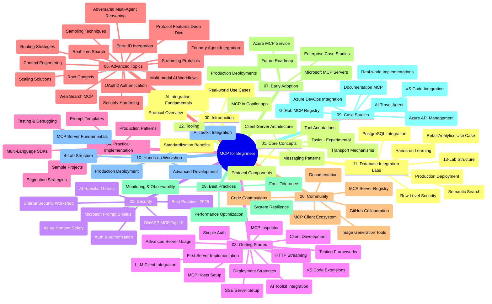

# ಶುರುಮಾಡುತ್ತಿರುವವರಿಗಾಗಿ ಮಾದರಿ ಸನ್ನಿವೇಶ ಪ್ರೋಟೋಕಾಲ್ (MCP) - ಅಧ್ಯಯನ ಮಾರ್ಗದರ್ಶಿ

ಈ ಅಧ್ಯಯನ ಮಾರ್ಗದರ್ಶಿ "ಶುರುಮಾಡುತ್ತಿರುವವರಿಗಾಗಿ ಮಾದರಿ ಸನ್ನಿವೇಶ ಪ್ರೋಟೋಕಾಲ್ (MCP)" ಪಠ್ಯಕ್ರಮಕ್ಕಾಗಿ ರೆಪೊಸಿಟರಿ ರಚನೆ ಮತ್ತು ವಿಷಯದ ಅವಲೋಕನವನ್ನು ನೀಡುತ್ತದೆ. ರೆಪೊಸಿಟರಿಯನ್ನು ಪರಿಣಾಮಕಾರಿಯಾಗಿ ನ್ಯಾವಿಗೇಟ್ ಮಾಡಲು ಮತ್ತು ಲಭ್ಯವಿರುವ ಸಂಪನ್ಮೂಲಗಳನ್ನು ಗರಿಷ್ಠವಾಗಿ ಬಳಸಲು ಈ ಮಾರ್ಗದರ್ಶನವನ್ನು ಬಳಸಿ.

## ರೆಪೊಸಿಟರಿ ಅವಲೋಕನ

ಮಾದರಿ ಸನ್ನಿವೇಶ ಪ್ರೋಟೋಕಾಲ್ (MCP) AI ಮಾದರಿಗಳು ಮತ್ತು ಕ್ಲೈನ್ ಅಪ್ಲಿಕೇಶನ್‌ಗಳ ನಡುವಿನ ಸಂವಹನಗಳಿಗೆ ಒಂದು ಮಾನಕೀಕೃತ ಫ್ರೇಮ್‌ವರ್ಕ್ ಆಗಿದೆ. ಮೂಲತಃ ಆಂಥ್ರೋಪಿಕ್ ಸಂಸ್ಥೆಯಿಂದ ರಚಿಸಲ್ಪಟ್ಟ MCP ಈಗ ಅಧಿಕೃತ GitHub ಸಂಸ್ಥೆಯ ಮೂಲಕ MCP ಸಮುದಾಯದ ಮೂಲಕ ನಿರ್ವಹಣೆ ಮಾಡಲಾಗುತ್ತಿದೆ. ಈ ರೆಪೊಸಿಟರಿ C#, ಜಾವಾ, ಜಾವಾಸ್ಕ್ರಿಪ್ಟ್, ಪೈಥಾನ್, ಮತ್ತು ಟೈಪ್‌ಸ್ಕ್ರಿಪ್ಟ್‌ನಲ್ಲಿ ಕೈಹಿಡಿದು ಮಾಡುವ ಕೋಡ್ ಉದಾಹರಣೆಗಳೊಂದಿಗೆ ಸಮಗ್ರ ಪಠ್ಯಕ್ರಮವನ್ನು ಒದಗಿಸುತ್ತದೆ, ಇದು AI ಡೆವಲಪರ್‌ಗಳು, ವ್ಯವಸ್ಥೆ ವಾಸ್ತುಶಿಲ್ಪಿಗಳು ಮತ್ತು ಸಾಫ್ಟ್‌ವೇರ್ ಇಂಜಿನಿಯರ್‌ಗಳಿಗೆ ವಿನ್ಯಾಸಗೊಳ್ಳಲಾಗಿದೆ.

## ದೃಶ್ಯ ಪಠ್ಯಕ್ರಮ ನಕ್ಷೆ

## ರೆಪೊಸಿಟರಿ ರಚನೆ

ರೆಪೊಸಿಟರಿ ಹನ್ನೆರಡು ಪ್ರಮುಖ ವಿಭಾಗಗಳಾಗಿ ಆಯೋಜಿಸಲಾಗಿದೆ, ಪ್ರತಿ ವಿಭಾಗವು MCP ನ ವಿವಿಧ ಆಯಾಮಗಳ ಮೇಲೆ ಗಮನಹರಿಸುತ್ತದೆ:

1. **ಪರಿಚಯ (00-Introduction/)**
   - ಮಾದರಿ ಸನ್ನಿವೇಶ ಪ್ರೋಟೋಕಾಲ್‍ನ ಅವಲೋಕನ
   - AI ಪೈಪ್ಲೈನ್‌ಗಳಲ್ಲಿ ಮಾನಕೀಕರಣದ ಮಹತ್ವ
   - ಪ್ರಾಯೋಗಿಕ ಬಳಕೆಯ ಪ್ರಕರಣಗಳು ಮತ್ತು ಲಾಭಗಳು

2. **ಮೂಲ概念ಗಳು (01-CoreConcepts/)**
   - ಕ್ಲೈಂಟ್-ಸರ್ವರ್ ವಾಸ್ತುಶಾಸ್ತ್ರ
   - ಪ್ರಮುಖ ಪ್ರೋಟೋಕಾಲ್ ಭಾಗಗಳು
   - MCP ಯಲ್ಲಿನ ಸಂದೇಶ ವಿನ್ಯಾಸಗಳು
   - ಪ್ರಸ್ತುತ ನಿರ್ದಿಷ್ಟತೆ: [MCP ಯಲ್ಲಿ ಏನು ಬದಲಾಗಿದೆ: 2026-07-28 ನಿರ್ದಿಷ್ಟತೆ](./01-CoreConcepts/mcp-2026-07-28.md) — ಸ್ಥಿತಿಹೀನ ಪ್ರೋಟೋಕಾಲ್ ಕೋರ್, ವಿಸ್ತರಣೆ ಫ್ರೇಮ್‌ವರ್ಕ್, ಮತ್ತು ಮೌಲಿಕ/ಸ್ಯಾಂಪ್ಲಿಂಗ್/ಲಾಗಿಂಗ್ ವಿನ್ಯಾಸಗಳ ನಿಷೇಧ

3. **ಭದ್ರತೆ (02-Security/)**
   - MCP ಆಧಾರಿತ ವ್ಯವಸ್ಥೆಗಳಲ್ಲಿ ಭದ್ರತೆ ಧಮಕಿಗಳು
   - ಜಾರಿಗೊಳಿಸುವಿಕೆಯ ಭದ್ರತೆಗಾಗಿ ಉತ್ತಮ ಅಭ್ಯಾಸಗಳು
   - ಪ್ರಮಾಣೀಕರಣ ಮತ್ತು ಅನುಮತಿಸು ವಿಧಾನಗಳು
   - ಕೈಹಿಡಿದು ಮಾಡುವ [CIMD ಮತ್ತು DCR ಅನುಮತಿ ಮಾದರಿ](./02-Security/samples/cimd-dcr-auth/README.md)
   - **ಸಮಗ್ರ ಭದ್ರತೆ ಡಾಕ್ಯುಮೆಂಟೇಶನ್**:
     - MCP ಭದ್ರತೆ ಉತ್ತಮ ಅಭ್ಯಾಸಗಳು
     - ಅಜ್ಯೂರ್ ವಿಷಯ ಭದ್ರತೆ ಜಾರಿಗೊಳಿಸುವ ಮಾರ್ಗದರ್ಶಿ
     - MCP ಭದ್ರತೆ ನಿಯಂತ್ರಣೆಗಳು ಮತ್ತು ತಂತ್ರಗಳು
     - MCP ಉತ್ತಮ ಅಭ್ಯಾಸಗಳ ತ್ವರಿತ ಸೂಚಿ
   - **ಪ್ರಮುಖ ಭದ್ರತೆ ವಿಷಯಗಳು**:
     - ಸೂಚನೆ ಸೇರುವುದು ಮತ್ತು ಸಾಧನ ವಿಷಕಾರಕದ ದಾಳಿ
     - ಸೆಷನ್ ಕಪಟಿಕೆ ಮತ್ತು ಗೊಂದಲದ ಪ್ರತಿನಿಧಿ ಸಮಸ್ಯೆಗಳು
     - ಟೋಕನ್ ಪಾಸ್ಸ್ಥ್ರೂ ದುರ್ಬಲತೆಗಳು
     - ಅತಿರಿಕ್ತ ಅನುಮತಿಗಳು ಮತ್ತು ಪ್ರವೇಶ ನಿಯಂತ್ರಣ
     - AI ಘಟಕಗಳ ಸರಬರಾಜು ಸರಣಿ ಭದ್ರತೆ
     - ಮೈಕ್ರೋಸಾಫ್ಟ್ ಪ್ರಾಂಪ್ಟ್ ಶೀಲ್ಡ್‌ಗಳ ಏಕೀಕರಣ

4. **ಪ್ರಾರಂಭಿಸುವುದು (03-GettingStarted/)**
   - ವಾತಾವರಣ ವ್ಯವಸ್ಥೆ ಮತ್ತು ಸಂರಚನೆ
   - ಮೂಲ MCP ಸರ್ವರ್‌ಗಳು ಮತ್ತು ಕ್ಲೈಂಟ್ ರಚನೆ
   - ಇತ್ತೀಚಿನ ಅಪ್ಲಿಕೇಶನ್‌ಗಳೊಂದಿಗೆ ಏಕೀಕರಣ
   - ಇದರಲ್ಲಿ ವಿಭಾಗಗಳು ಸೇರಿವೆ:
     - ಮೊದಲು ಸರ್ವರ್ ಜಾರಿಗೊಳಿಸುವಿಕೆ
     - ಕ್ಲೈಂಟ್ ಅಭಿವೃದ್ಧಿ
     - LLM ಕ್ಲೈಂಟ್ ಏಕೀಕರಣ
     - VS ಕೋಡ್ ಏಕೀಕರಣ
     - ಸರ್ವರ್-ಸೆಂಟ್ ಇವೆಂಟ್ಸ್ (SSE) ಸರ್ವರ್
     - ತಾಂತ್ರಿಕ ಸರ್ವರ್ ಬಳಕೆ
     - HTTP ಸ್ಟ್ರೀಮಿಂಗ್
     - AI ಟೂಲ್ಕೆಟ್ ಏಕೀಕರಣ
     - ಪರೀಕ್ಷಾ ತಂತ್ರಗಳು
     - ನಿಯೋಜನೆ ಮಾರ್ಗಸೂಚಿ

5. **ಪ್ರಾಯೋಗಿಕ ಜಾರಿಗೊಳಿಸುವಿಕೆ (04-PracticalImplementation/)**
   - ವಿಭಿನ್ನ ಪ್ರೋಗ್ರಾಮಿಂಗ್ ಭಾಷೆಗಳಲ್ಲಿ SDKs ಬಳಕೆ
   - ಡಿಬಗ್, ಪರೀಕ್ಷೆ ಮತ್ತು ಮಾನ್ಯತೆ ತಂತ್ರಗಳು
   - ಪುನಃಬಳಕೆಯಾದ ಪ್ರಾಂಪ್ಟ್ ಟೆಂಪ್ಲೇಟುಗಳು ಮತ್ತು ವರ್ಕ್‌ಫ್ಲೋಗಳ ರಚನೆ
   - ಜಾರಿಗೊಳಿಸುವಿಕೆಯ ಉದಾಹರಣೆಗಳುಳ್ಳ ಮಾದರಿ ಯೋಜನೆಗಳು

6. **ಅತ್ಯಧಿಕ ವಿಷಯಗಳು (05-AdvancedTopics/)**
   - ಸನ್ನಿವೇಶ ಎಂಜಿನಿಯರಿಂಗ್ ತಂತ್ರಗಳು
   - ಫೌಂಡ್ರಿ ಏಜೆಂಟ್ ಏಕೀಕರಣ
   - ಬಹು ಮಾದರಿಗಾರ AI ವರ್ಕ್‌ಫ್ಲೋಗಳು 
   - OAuth2 ಪ್ರಮಾಣೀಕರಣ ಡೆಮೋಗಳು
   - ನೈಜ ಸಮಯ ಹುಡುಕಾಟ ಸಾಮರ್ಥ್ಯಗಳು
   - ನೈಜ ಸಮಯ ಸ್ಟ್ರೀಮಿಂಗ್
   - ರೂಟ್ ಸನ್ನಿವೇಶಗಳ ಜಾರಿಗೊಳಿಸುವಿಕೆ
   - ಮಾರ್ಗ ಸಂರಚನೆ ವಿಧಾನಗಳು
   - ಮಾದರಿ ಸ್ಯಾಂಪ್ಲಿಂಗ್ ತಂತ್ರಗಳು
   - ಸ್ಕೇಲಿಂಗ್ ವಿಧಾನಗಳು
   - ಭದ್ರತಾ ಪರಿಗಣನೆಗಳು
   - ಎಂಟ್ರಾ ID ಭದ್ರತೆ ಏಕೀಕರಣ
   - ವೆಬ್ ಹುಡುಕಾಟ ಏಕೀಕರಣ
   - ಎದುರಾಳಿಯ ಬಹು-ಏಜೆಂಟ್ ತರ್ಕ (ವಿವಾದ ವಿನ್ಯಾಸಗಳು)

7. **ಸಮುದಾಯ ಕೊಡುಗೆಗಳು (06-CommunityContributions/)**
   - ಕೋಡ್ ಮತ್ತು ಡಾಕ್ಯುಮೆಂಟೇಶನ್ ಕೊಡುಗೆ ನೀಡುವುದು ಹೇಗೆ
   - GitHub ಮೂಲಕ ಸಹಯೋಗ
   - ಸಮುದಾಯ ಚಾಲಿತ ಸುಧಾರಣೆಗಳು ಮತ್ತು ಪ್ರತಿಕ್ರಿಯೆ
   - ವಿವಿಧ MCP ಕ್ಲೈಂಟ್‌ಗಳು (ಕ್ಲೋಡ್ ಡೆಸ್ಕ್‌ಟಾಪ್, ಕ್ಲೈನ್, VSCode) ಬಳಕೆ
   - ಜನಪ್ರಿಯ MCP ಸರ್ವರ್‌ಗಳಿಂದ, ಚಿತ್ರ ಉತ್ಪಾದನೆ ಸೇರಿದಂತೆ, ಕಾರ್ಯನಿರ್ವಹಣೆ

8. **ಪ್ರಾಥಮಿಕ ಅಳವಡಿಕೆಗಳಿಂದ ಪಾಠಗಳು (07-LessonsfromEarlyAdoption/)**
   - ನೈಜ ಜಗತ್ತಿನ ಜಾರಿಗೊಳಿಸುವಿಕೆಗಳು ಮತ್ತು ಯಶೋತ್ಪತ್ತಿ ಕಥೆಗಳು
   - MCP ಆಧಾರಿತ ಪರಿಹಾರಗಳ ನಿರ್ಮಾಣ ಮತ್ತು ನಿಯೋಜನೆ
   - ಟ್ರೆಂಡ್‌ها ಮತ್ತು ಭವಿಷ್ಯದ ರಸ್ತೆನಕ್ಷೆ
   - **Microsoft MCP ಸರ್ವರ್‌ಗಳ ಮಾರ್ಗದರ್ಶಿ**: 10 ಉತ್ಪಾದನಾ-ದಯಾರ Microsoft MCP ಸರ್ವರ್‌ಗಳ ಸಮಗ್ರ ಮಾರ್ಗದರ್ಶಿ:
     - Microsoft Learn Docs MCP ಸರ್ವರ್
     - ಅಜ್ಯೂರ್ MCP ಸರ್ವರ್ (15+ ವಿಶಿಷ್ಟ ಜೋಡಣೆ)
     - GitHub MCP ಸರ್ವರ್
     - ಅಜ್ಯೂರ್ ಡೆವ್‌ಆಪ್ಸ್ MCP ಸರ್ವರ್
     - MarkItDown MCP ಸರ್ವರ್
     - SQL ಸರ್ವರ್ MCP ಸರ್ವರ್
     - ಪ್ಲೇರೈಟ್ MCP ಸರ್ವರ್
     - ಡೆವ್ ಬಾಕ್ಸ್ MCP ಸರ್ವರ್
     - ಮೈಕ್ರೋಸಾಫ್ಟ್ ಫೌಂಡ್ರಿ MCP ಸರ್ವರ್
     - ಮೈಕ್ರೋಸಾಫ್ಟ್ 365 ಏಜೆಂಟ್ಸ್ ಟೂಲ್‌ಕಿಟ್ MCP ಸರ್ವರ್

9. **ಅತೀ ಉತ್ತಮ ಅಭ್ಯಾಸಗಳು (08-BestPractices/)**
   - ಪ್ರದರ್ಶನ ಟ್ಯೂನಿಂಗ್ ಮತ್ತು ಉತ್ತಮಗೊಳಿಸುವಿಕೆ
   - ದೋಷ ಬದುಕಿಸಬಲ್ಲ MCP ವ್ಯವಸ್ಥೆಗಳ ವಿನ್ಯಾಸ
   - ಪರೀಕ್ಷಾ ಮತ್ತು ಪ್ರತಿರೋಧ ತಂತ್ರಗಳು

10. **ಕೇಸ್ ಅಧ್ಯಯನಗಳು (09-CaseStudy/)**
    - MCP ಬಹುಮುಖತೆಯನ್ನು ವಿವಿಧ ಸನ್ನಿವೇಶಗಳಲ್ಲಿ ತೋರಿಸುವ **ಏಳು ಸಮಗ್ರ ಕೇಸ್ ಅಧ್ಯಯನಗಳು**:
    - **ಅಜ್ಯೂರ್ AI ಪ್ರವಾಸ ಏಜೆಂಟ್‌ಗಳು**: ಅಜ್ಯೂರ್ ಓಪನ್‌AI ಮತ್ತು AI ಹುಡುಕಾಟದಿಂದ ಬಹು-ಏಜೆಂಟ್ ಸಂಯೋಜನೆ
    - **ಅಜ್ಯೂರ್ ಡೆವ್‌ಆಪ್ಸ್ ಏಕೀಕರಣ**: YouTube ಮಾಹಿತಿ ನವೀಕರಣಗಳೊಂದಿಗೆ ವರ್ಕ್‌ಫ್ಲೋ ಪ್ರಕ್ರಿಯೆಗಳ ಸ್ವಯಂಚಾಲನೆ
    - **ನೈಜ-ಸಮಯ ಡಾಕ್ಯುಮೆಂಟೇಶನ್ ಪಡೆಯುವುದು**: ಪೈಥಾನ್ ಕನ್‌ಸೋಲ್ ಕ್ಲೈಂಟ್ ಜೊತೆಗೆ ಸ್ಟ್ರೀಮಿಂಗ್ HTTP
    - **ಇಂಟರ್ಯಾಕ್ಟಿವ್ ಅಧ್ಯಯನ ಯೋಜನೆ ನಿರ್ಮಾಪಕ**: ಚೈನ್‌ಲಿಟ್ ವೆಬ್ ಅಪ್ಲಿಕೇಶನ್, ಸಂವಹನಾತ್ಮಕ AI
    - **ಸಂಪಾದಕ ಒಳಗಿನ ಡಾಕ್ಯುಮೆಂಟೇಶನ್**: VS ಕೋಡ್ ಏಕೀಕರಣ GitHub Copilot ವರ್ಕ್‌ಫ್ಲೋಗಳೊಂದಿಗೆ
    - **ಅಜ್ಯೂರ್ API ನಿರ್ವಹಣೆ**: MCP ಸರ್ವರ್ ರಚನೆ ಜೊತೆಗೆ ಎಂಟರ್ಪ್ರೈಸ್ API ಏಕೀಕರಣ
    - **GitHub MCP ರೆಜಿಸ್ಟ್ರಿ**: ಪರಿಸರ ವ್ಯವಸ್ಥೆಯ ಅಭಿವೃದ್ಧಿ ಮತ್ತು ಏಜೆಂಟಿಕ್ ಏಕೀಕರಣ ವೇದಿಕೆ
    - ಎಂಟರ್ಪ್ರೈಸ್ ಏಕೀಕರಣ, ಡೆವಲಪರ್ ಉತ್ಪಾದಕತೆ, ಮತ್ತು ಪರಿಸರ ಅಭಿವೃದ್ಧಿಯನ್ನು ವಿಸ್ತರಿಸುವ ಜಾರಿಗೊಳಿಸುವಿಕೆ ಉದಾಹರಣೆಗಳು

11. **ಕೈಹಿಡಿದು ಕಾರ್ಯಾಗಾರ (10-StreamliningAIWorkflowsBuildingAnMCPServerWithAIToolkit/)**
    - MCP ಮತ್ತು AI ಟೂಲ್ಕೆಟ್‌ನೊಂದಿಗೆ ಸಮಗ್ರ ಕೈಹಿಡಿದು ಕಾರ್ಯಾಗಾರ
    - AI ಮಾದರಿಗಳನ್ನು ನೈಜ ಜಗತ್ತಿನ ಸಾಧನಗಳೊಂದಿಗೆ ಸಂಧಿಸುವ ಬುದ್ಧಿವಂತ ಅಪ್ಲಿಕೇಶನ್‌ಗಳ ನಿರ್ಮಾಣ
    - ಮೂಲಭೂತ, ಹೋಸು ಸರ್ವರ್ ಅಭಿವೃದ್ಧಿ ಮತ್ತು ಉತ್ಪಾದನಾ ನಿಯೋಜನೆ వ్యూహಗಳನ್ನು ಒಳಗೊಂಡ ಪ್ರಾಯೋಗಿಕ ವಿಭಾಗಗಳು
    - **ಲ್ಯಾಬ್ ರಚನೆ**:
      - ಲ್ಯಾಬ್ 1: MCP ಸರ್ವರ್ ಮೂಲಭೂತಗಳು
      - ಲ್ಯಾಬ್ 2: ಅತ್ಯಧಿಕ MCP ಸರ್ವರ್ ಅಭಿವೃದ್ಧಿ
      - ಲ್ಯಾಬ್ 3: AI ಟೂಲ್ಕೆಟ್ ಏಕೀಕರಣ
      - ಲ್ಯಾಬ್ 4: ಉತ್ಪಾದನಾ ನಿಯೋಜನೆ ಮತ್ತು ಸ್ಕೇಲಿಂಗ್
    - ಹಂತ-ಹಂತದ ಸೂಚನೆಗಳೊಂದಿಗೆ ಲ್ಯಾಬ್ ಆಧಾರಿತ ಅಧ್ಯಯನ ವಿಧಾನ

12. **MCP ಸರ್ವರ್ ಡೇಟಾಬೇಸ್ ಏಕೀಕರಣ ಲ್ಯಾಬ್‌ಗಳು (11-MCPServerHandsOnLabs/)**
    - ಉತ್ಪಾದನಾ-ದಯಾರ MCP ಸರ್ವರ್‌ಗಳನ್ನು PostgreSQL ಏಕೀಕರಣದೊಂದಿಗೆ ನಿರ್ಮಿಸಲು **ಸಮಗ್ರ 13-ಲ್ಯಾಬ್ ಅಧ್ಯಯನ ಮಾರ್ಗ** 
    - Zava ರೀಟೈಲ್ ಬಳಕೆಯೊಂದಿಗೆ **ನೈಜ ಜಗತ್ತಿನ ರೀಟೈಲ್ ವಿಶ್ಲೇಷಣೆ ಜಾರಿಗೊಳಿಸುವಿಕೆ**
    - **ಎಂಟರ್ಪ್ರೈಸ್ ಮಟ್ಟದ ವಿನ್ಯಾಸಗಳು** - ಸಾಲು ಮಟ್ಟದ ಭದ್ರತೆ (RLS), ಅರ್ಥಗರ್ಭಿತ ಹುಡುಕಾಟ ಮತ್ತು ಬಹು-ಟೆನಂಟ್ ಡೇಟಾ ಪ್ರವೇಶ ಸೇರಿವೆ
    - **ಪೂರ್ಣ ಲ್ಯಾಬ್ ರಚನೆ**:
      - **ಲ್ಯಾಬ್‌ಗಳು 00-03: ನೆಲೆಗಳು** - ಪರಿಚಯ, ವಾಸ್ತುಶಾಸ್ತ್ರ, ಭದ್ರತೆ, ವಾತಾವರಣ ವ್ಯವಸ್ಥೆ
      - **ಲ್ಯಾಬ್‌ಗಳು 04-06: MCP ಸರ್ವರ್ ನಿರ್ಮಾಣ** - ಡೇಟಾಬೇಸ್ ವಿನ್ಯಾಸ, MCP ಸರ್ವರ್ ಜಾರಿಗೊಳಿಸುವಿಕೆ, ಸಾಧನ ಅಭಿವೃದ್ಧಿ
      - **ಲ್ಯಾಬ್‌ಗಳು 07-09: ಅತ್ಯಧಿಕ ಲಕ್ಷಣಗಳು** - ಅರ್ಥಗರ್ಭಿತ ಹುಡುಕಾಟ, ಪರೀಕ್ಷೆ ಮತ್ತು ಡಿಬಗ್, VS ಕೋಡ್ ಏಕೀಕರಣ
      - **ಲ್ಯಾಬ್‌ಗಳು 10-12: ಉತ್ಪಾದನೆ ಮತ್ತು ಉತ್ತಮ ಅಭ್ಯಾಸಗಳು** - ನಿಯೋಜನೆ, ವೀಕ್ಷಣೆ, ಉತ್ತಮಗೊಳಿಸುವಿಕೆ
    - **ಕವರ್ ಮಾಡಿದ ತಂತ್ರಜ್ಞಾನಗಳು**: ಫಾಸ್ಟ್MCP ಫ್ರೇಮ್‌ವರ್ಕ್, PostgreSQL, ಅಜ್ಯೂರ್ ಓಪನ್‌AI, ಅಜ್ಯೂರ್ ಕಂಟೈನರ್ ಆ್ಯಪ್ಸ್, ಅಪ್ಲಿಕೇಶನ್ ಇನ್ಸೈಟ್ಸ್
    - **ಅಧ್ಯಯನ ಫಲಿತಾಂಶಗಳು**: ಉತ್ಪಾದನಾ-ದಯಾರ MCP ಸರ್ವರ್‌ಗಳು, ಡೇಟಾಬೇಸ್ ಏಕೀಕರಣ ವಿನ್ಯಾಸಗಳು, AI ಶಕ್ತಿ ಯುಕ್ತ ವಿಶ್ಲೇಷಣೆ, ಎಂಟರ್ಪ್ರೈಸ್ ಭದ್ರತೆ

13. **ಉಪಕರಣಗಳು (12-tooling/)**
    - ಕಂಪೈಲಟ್ ಅಪ್ಲಿಕೇಶನ್ ಮತ್ತು ಇತರ ಉಪಕರಣಗಳಲ್ಲಿ MCP ಅನ್ನು ಹೇಗೆ ಬಳಸುವುದು ಎಂಬುದು ತಿಳಿದುಕೊಳ್ಳಿ

## ಹೆಚ್ಚುವರಿ ಸಂಪನ್ಮೂಲಗಳು

ರೆಪೊಸಿಟರಿಯಲ್ಲಿ ಸಹಾಯಕರ ಸಂಪನ್ಮೂಲಗಳು ಒಳಗೊಂಡಿವೆ:

- **ಚಿತ್ರ ಫೋಲ್ಡರ್**: ಪಠ್ಯಕ್ರಮ throughout ಬಳಕೆಯಾದ ಚಿತ್ರಗಳು ಮತ್ತು ಚಿತ್ರಣಗಳು
- **ಭಾಷಾಂತರಗಳು**: ಬಹು-ಭಾಷಾ ಬೆಂಬಲ, ಡಾಕ್ಯುಮೆಂಟೇಶನ್ ಸ್ವಯಂಚಾಲಿತ ಭಾಷಾಂತರಗಳು
- **ಅಧಿಕೃತ MCP ಸಂಪನ್ಮೂಲಗಳು**:
  - [MCP ಡಾಕ್ಯುಮೆಂಟೇಶನ್](https://modelcontextprotocol.io/)
  - [MCP ನಿರ್ದಿಷ್ಟತೆ](https://modelcontextprotocol.io/specification/2026-07-28/)
  - [MCP GitHub ರೆಪೊಸಿಟರಿ](https://github.com/modelcontextprotocol)

## ಈ ರೆಪೊಸಿಟರಿಯನ್ನು ಹೇಗೆ ಬಳಸುವುದು

1. **ಕ್ರಮಬದ್ಧ ಅಧ್ಯಯನ**: ಸ್ಥಿತಿಗತ ಅಧ್ಯಯನ ಅನುಭವಕ್ಕಾಗಿ ಅಧ್ಯಾಯಗಳನ್ನು ಕ್ರಮವಾಗಿ ಅನುಸರಿಸಿ (00 ರಿಂದ 11 ತನಕ).
2. **ಭಾಷೆಗೆ专项聚焦**: ನೀವು ವಿಶೇಷ ಪ್ರೋಗ್ರಾಮಿಂಗ್ ಭಾಷೆಯಲ್ಲಿ ಆಸಕ್ತಿ ಹೊಂದಿದ್ದರೆ, ನಿಮ್ಮ ಇಷ್ಟದ ಭಾಷೆಯಲ್ಲಿ ಜಾರಿಗೊಳಿಸುವಿಕೆ ಗಳಿಗಾಗಿ ಮಾದರಿ ಡೈರೆಕ್ಟರಿಗಳ ವೀಕ್ಷಣೆ ಮಾಡಿ.
3. **ಪ್ರಾಯೋಗಿಕ ಜಾರಿಗೊಳಿಸುವಿಕೆ**: ನಿಮ್ಮ ವಾತಾವರಣವನ್ನು ಹೊಂದಿಸಲು ಮತ್ತು ನಿಮ್ಮ ಮೊದಲ MCP ಸರ್ವರ್ ಮತ್ತು ಕ್ಲೈಂಟ್ ರಚಿಸಲು "ಪ್ರಾರಂಭಿಸುವುದು" ವಿಭಾಗದಿಂದ ಪ್ರಾರಂಭಿಸಿ.
4. **ಅತ್ಯಧಿಕೆಯ ಅನ್ವೇಷಣೆ**: ಮೂಲಭೂತ ವಿಷಯಗಳಲ್ಲಿ ಆರಾಮವಾಗಿ ಆಯಿತು ತಕ್ಷಣ, ನಿಮ್ಮ ತಿಳಿವಳಿಕೆಯನ್ನು ವಿಸ್ತರಿಸಲು ಅತ್ಯಧಿಕ ವಿಷಯಗಳತ್ತ ಮುಳುಗಿರಿ.
5. **ಸಮುದಾಯ ತೊಡಕು**: MCP ಸಮುದಾಯದೊಂದಿಗೆ GitHub ಚರ್ಚೆಗಳು ಮತ್ತು Discord ಚಾನೆಲ್‌ಗಳ ಮೂಲಕ ಸಂಪರ್ಕ ಹೊಂದಿ, ತಜ್ಞರು ಮತ್ತು ಸಹ ಡೆವಲಪರ್‌ಗಳೊಂದಿಗೆ ಸಂವಹನ ಮಾಡಿರಿ.

## MCP ಕ್ಲೈಂಟ್‌ಗಳು ಮತ್ತು ಉಪಕರಣಗಳು

ಈ ಪಠ್ಯಕ್ರಮದಲ್ಲಿ ವಿವಿಧ MCP ಕ್ಲೈಂಟ್‌ಗಳು ಮತ್ತು ಉಪಕರಣಗಳನ್ನು ಒಳಗೊಂಡಿದೆ:

1. **ಅಧಿಕೃತ ಕ್ಲೈಂಟ್‌ಗಳು**:
   - ವಿಸುಯಲ್ ಸ್ಟುಡಿಯೋ ಕೋಡ್ 
   - ವಿಸುಯಲ್ ಸ್ಟುಡಿಯೋ ಕೋಡ್ ಆಧಾರಿತ MCP
   - ಕ್ಲೋಡ್ ಡೆಸ್ಕ್‌ಟಾಪ್
   - VSCode ನಲ್ಲಿ ಕ್ಲೋಡ್ 
   - ಕ್ಲೋಡ್ API

2. **ಸಮುದಾಯ ಕ್ಲೈಂಟ್‌ಗಳು**:
   - ಕ್ಲೈನ್ (ಟರ್ಮಿನಲ್ ಆಧಾರಿತ)
   - ಕರ್ಸರ್ (ಕೋಡ್ ಸಂಪಾದಕ)
   - ChatMCP
   - ವಿಂಡ್‌ಸರ್ಫ್

3. **MCP ನಿರ್ವಹಣಾ ಉಪಕರಣಗಳು**:
   - MCP CLI
   - MCP ಮ್ಯಾನೇಜರ್
   - MCP ಲಿಂಕರ್
   - MCP ರೌಟರ್

## ಜನಪ್ರಿಯ MCP ಸರ್ವರ್‌ಗಳು

ಈ ರೆಪೊಸಿಟರಿ ವಿಭಿನ್ನ MCP ಸರ್ವರ್‌ಗಳನ್ನು ಪರಿಚಯಿಸುತ್ತದೆ, ಅವುಗಳಲ್ಲಿ ಒಳಗೊಂಡಿವೆ:

1. **ಅಧಿಕೃತ ಮೈಕ್ರೋಸಾಫ್ಟ್ MCP ಸರ್ವರ್‌ಗಳು**:
   - ಮೈಕ್ರೋಸಾಫ್ಟ್ ಲರ್ನ್ ಡಾಕ್ಸ್ MCP ಸರ್ವರ್
   - ಅಜ್ಯೂರ್ MCP ಸರ್ವರ್ (15+ ವಿಶಿಷ್ಟ ಜೋಡಣೆ)
   - GitHub MCP ಸರ್ವರ್
   - ಅಜ್ಯೂರ್ ಡೆವ್‌ಆಪ್ಸ್ MCP ಸರ್ವರ್
   - MarkItDown MCP ಸರ್ವರ್
   - SQL ಸರ್ವರ್ MCP ಸರ್ವರ್
   - ಪ್ಲೇರೈಟ್ MCP ಸರ್ವರ್
   - ಡೆವ್ ಬಾಕ್ಸ್ MCP ಸರ್ವರ್
   - ಮೈಕ್ರೋಸಾಫ್ಟ್ ಫೌಂಡ್ರಿ MCP ಸರ್ವರ್
   - ಮೈಕ್ರೋಸಾಫ್ಟ್ 365 ಏಜೆಂಟ್ಸ್ ಟೂಲ್‌ಕಿಟ್ MCP ಸರ್ವರ್

2. **ಅಧಿಕೃತ ರೆಫರೆನ್ಸ್ ಸರ್ವರ್‌ಗಳು**:
   - ಫೈಲ್ಸಿಸ್ಟಮ್
   - ಫೆಚ್
   - ಮೆಮೊರಿ
   - ಕ್ರಮಬದ್ಧ ಚಿಂತನೆ

3. **ಚಿತ್ರ ಉತ್ಪಾದನೆ**:
   - ಅಜ್ಯೂರ್ ಓಪನ್‌AI DALL-E 3
   - ಸ್ಟೇಬಲ್ ಡಿಫ್ಯೂಷನ್ ವೆಬ್‌ಯುಐ
   - ರೆಪ್ಲಿಕೇಟ್

4. **ಅಭಿವೃದ್ಧಿ ಉಪಕರಣಗಳು**:
   - Git MCP
   - ಟರ್ಮಿನಲ್ ನಿಯಂತ್ರಣ
   - ಕೋಡ್ ಸಹಾಯಕ

5. **ವಿಶೇಷ ಸರ್ವರ್‌ಗಳು**:
   - ಸೇಲ್ಸ್‌ಫೋರ್ಸ್
   - ಮೈಕ್ರೋಸಾಫ್ಟ್ ತಂಡಗಳು
   - ಜಿರಾ ಮತ್ತು ಕಾಂಫ್ಲುವೆನ್ಸ್

## ಕೊಡುಗೆ ನೀಡುವುದು

ಈ ರೆಪೊಸಿಟರಿ ಸಮುದಾಯದಿಂದ ಕೊಡುಗೆಗಳನ್ನು ಸ್ವಾಗತಿಸುತ್ತದೆ. MCP ಪರಿಸರ ವ್ಯವಸ್ಥೆಗೆ ಪರಿಣಾಮಕಾರಿಯಾಗಿ ಕೊಡುಗೆ ನೀಡಲು ಮಾರ್ಗದರ್ಶನಕ್ಕಾಗಿ ಸಮುದಾಯ ಕೊಡುಗೆಗಳು ವಿಭಾಗ ನೋಡಿ.

----

*ಈ ಅಧ್ಯಯನ ಮಾರ್ಗದರ್ಶಿ ಸೆಪ್ಟೆಂಬರ್ 9, 2026 ರಂದು ಕೊನೆಯದಾಗಿ ನವೀಕರಿಸಲ್ಪಟ್ಟಿದೆ. ಇದು MCP
ನಿರ್ದಿಷ್ಟತೆ `2026-07-28`, ಪ್ರಸ್ತುತ ಪ್ರೋಟೋಕಾಲ್ ಪರಿಷ್ಕರಣೆ ಪ್ರತಿಬಿಂಬಿಸುತ್ತದೆ. ಕೆಲವು ಕೈಹಿಡಿದು ಮಾಡುವ
ಉದಾಹರಣೆಗಳು ಸ್ಪಷ್ಟ ರೀತಿ `2025-11-25` ಗೆ ಆವೃತ್ತಿಗೊಳಿಸಲಾಗಿದೆ, ಆದರೆ ಅವುಗಳ SDK ಗಳು ಮತ್ತು ಉಪಕರಣಗಳು
ಸ್ಥಿತಿಹೀನ ಪ್ರೋಟೋಕಾಲ್ APIs ಅನ್ನು ಸ್ವೀಕರಿಸುತ್ತವೆ.*

---

<!-- CO-OP TRANSLATOR DISCLAIMER START -->
**ಅಸ್ವೀಕಾರ**:
ಈ ದಸ್ತಾವೇಜು AI ಅನುವಾದ ಸೇವೆ [Co-op Translator](https://github.com/Azure/co-op-translator) ಬಳಸಿ ಅನುವಾದಿಸಲಾಗಿದೆ. ನಾವು ನಿಖರತೆಯನ್ನು ಸಾಧಿಸಲು ಪ್ರಯತ್ನಿಸುತ್ತಿದ್ದರೂ, ದಯವಿಟ್ಟು ಗಮನಿಸಿ, ಸ್ವಯಂಚಾಲಿತ ಅನುವಾದಗಳಲ್ಲಿ ದೋಷಗಳು ಅಥವಾ ಅಸಡ್ಡೆಗಳು ಇರಬಹುದು. ಮೂಲ ಭಾಷೆಯಲ್ಲಿರುವ ಮೂಲ ದಸ್ತಾವೇಜು ಪ್ರಾಮಾಣಿಕ ಮೂಲವೆಂದು ಪರಿಗಣಿಸಬೇಕು. ಪ್ರಮುಖ ಮಾಹಿತಿಗಾಗಿ, ವೃತ್ತಿಪರ ಮಾನವ ಅನುವಾದವನ್ನು ಶಿಫಾರಸು ಮಾಡಲಾಗುತ್ತದೆ. ಈ ಅನುವಾದವನ್ನು ಬಳಸುವ ಮೂಲಕ ಉಂಟಾಗುವ ಯಾವುದೇ ತಪ್ಪು ಅರ್ಥಗಳ ಅಥವಾ ತಪ್ಪು ವ್ಯಾಖ್ಯಾನಗಳ ಬಗ್ಗೆ ನಾವು ಹೊಣೆಗಾರರಲ್ಲ.
<!-- CO-OP TRANSLATOR DISCLAIMER END -->