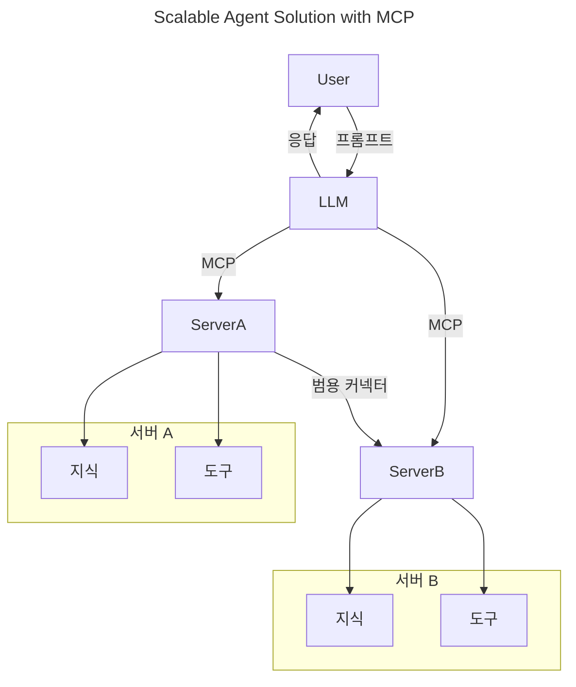
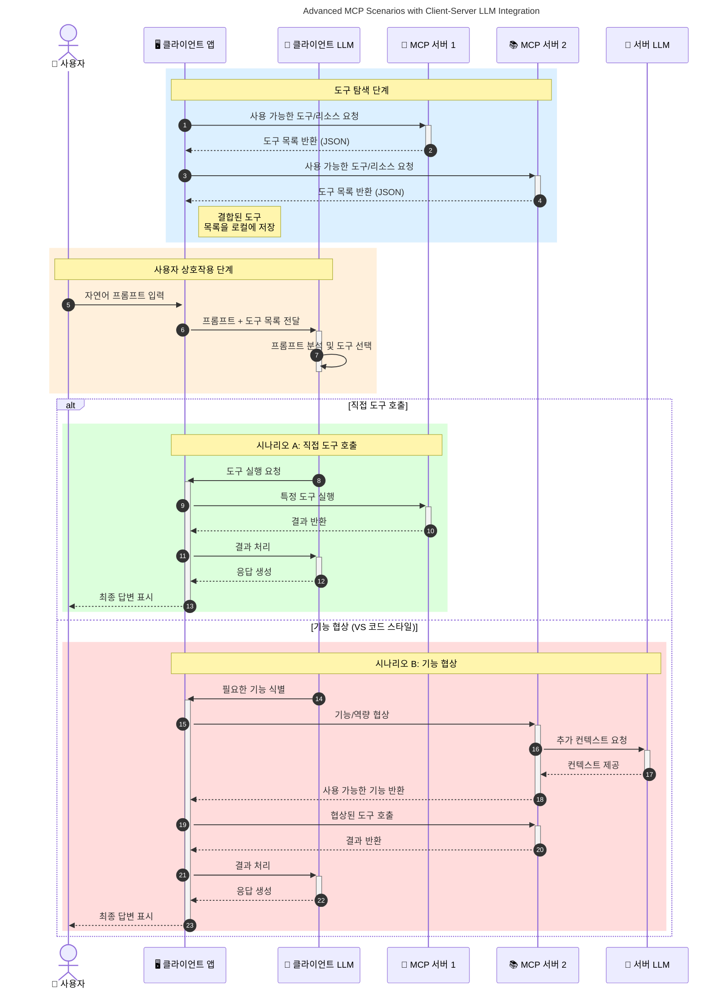

# 모델 컨텍스트 프로토콜(MCP) 소개: 확장 가능한 AI 애플리케이션에서 중요한 이유

[](https://youtu.be/agBbdiOPLQA)

_(위 이미지를 클릭하여 이 강의의 비디오를 시청하세요)_

생성 AI 애플리케이션은 종종 사용자가 자연어 프롬프트를 통해 앱과 상호작용할 수 있게 해주기 때문에 큰 진전입니다. 하지만 이러한 앱에 더 많은 시간과 자원을 투자할수록 기능과 자원을 쉽게 통합할 수 있도록 설계하여, 여러 모델을 지원하고 다양한 모델 특성을 처리할 수 있어야 합니다. 요컨대, 생성 AI 앱은 시작하기는 쉽지만, 성장하고 복잡해질수록 구조를 정의하고 표준에 의존하여 앱을 일관되게 구축해야 할 필요가 생깁니다. 바로 이 점에서 MCP가 조직과 표준을 제공하는 역할을 합니다.

---

## **🔍 모델 컨텍스트 프로토콜(MCP)이란?**

<strong>모델 컨텍스트 프로토콜(MCP)</strong>는 대형 언어 모델(LLM)이 외부 도구, API, 데이터 소스와 원활하게 상호작용할 수 있도록 하는 <strong>오픈 표준 인터페이스</strong>입니다. 훈련 데이터 외에도 AI 모델 기능을 확장하기 위한 일관된 아키텍처를 제공하여 더 스마트하고 확장 가능하며 반응성이 뛰어난 AI 시스템을 가능하게 합니다.

---

## **🎯 AI에서 표준화가 중요한 이유**

생성 AI 애플리케이션이 복잡해짐에 따라, **확장성, 확장 가능성, 유지 관리 용이성** 및 <strong>벤더 종속 방지</strong>를 보장하는 표준을 채택하는 것이 필수적입니다. MCP는 다음과 같은 요구를 해결합니다:

- 모델-도구 통합의 통합
- 불안정한 일회성 맞춤형 솔루션 감소
- 서로 다른 벤더의 여러 모델이 하나의 생태계 내에서 공존하도록 허용

**참고:** MCP는 오픈 표준으로 자리매김하고 있지만, IEEE, IETF, W3C, ISO 등 기존 표준화 기관을 통해 MCP를 공식 표준화할 계획은 없습니다.

---

## **📚 학습 목표**

이 글이 끝나면 다음을 할 수 있습니다:

- **모델 컨텍스트 프로토콜(MCP)** 정의 및 사용 사례 이해
- MCP가 모델-도구 통신을 표준화하는 방식 이해
- MCP 아키텍처의 핵심 구성 요소 파악
- 엔터프라이즈 및 개발 환경에서의 MCP 실전 활용 사례 탐구

---

## **💡 모델 컨텍스트 프로토콜(MCP)이 게임 체인저인 이유**

### **🔗 MCP가 AI 상호작용의 단편화를 해결**

MCP 이전에는 모델과 도구 통합에 다음이 필요했습니다:

- 도구-모델 쌍 별 맞춤형 코드
- 각 벤더마다 비표준 API
- 업데이트로 인한 잦은 중단
- 도구가 늘어날수록 확장성 부족

### **✅ MCP 표준화의 이점**

| <strong>이점</strong>                   | <strong>설명</strong>                                                                     |
|--------------------------|--------------------------------------------------------------------------------|
| 상호운용성               | LLM이 다양한 벤더의 도구와 원활하게 작동                                      |
| 일관성                   | 플랫폼과 도구 전반에서 균일한 동작                                            |
| 재사용성                 | 한 번 구축한 도구를 여러 프로젝트와 시스템에서 사용 가능                      |
| 개발 가속화              | 표준화되고 플러그 앤 플레이 가능한 인터페이스 사용으로 개발 시간 단축         |

---

## **🧱 MCP 아키텍처 개요**

MCP는 <strong>클라이언트-서버 모델</strong>을 따릅니다:

- <strong>MCP 호스트</strong>가 AI 모델을 실행합니다
- <strong>MCP 클라이언트</strong>가 요청을 시작합니다
- <strong>MCP 서버</strong>가 컨텍스트, 도구, 기능을 제공합니다

### **핵심 구성 요소:**

- <strong>리소스</strong> – 모델용 정적 또는 동적 데이터  
- <strong>프롬프트</strong> – 가이드 생성용 사전 정의된 워크플로  
- <strong>도구</strong> – 검색, 계산 같은 실행 가능한 함수  
- <strong>샘플링</strong> – 재귀적 상호작용을 통한 대리 행위 (MCP `2026-07-28`에 폐기; 새 구현은 LLM 제공자와 직접 통합 권장)  
   
   
- **요청(엘리시테이션)** – 서버가 시작하는 사용자 입력 요청  
- <strong>루트</strong> – 서버 관련 정보 파일 시스템 위치 (MCP `2026-07-28`에 폐기; 도구 매개변수, 리소스 URI, 서버 구성 사용 권장)  
     
     

### **프로토콜 아키텍처:**

MCP는 두 계층의 아키텍처를 사용합니다:
- **데이터 계층**: JSON-RPC 2.0 메시지, 요청별 메타데이터, 검색, 프로토콜 원시 기능  
   
- **전송 계층**: 로컬 하위 프로세스용 stdio 및 원격 서버용 스트리밍 HTTP. 스트리밍 HTTP는 스트림 응답을 위한 SSE 프레이밍 사용 가능, 이전 HTTP+SSE 전송은 폐기됨  
   
   

---

## MCP 서버 작동 방식

MCP 서버는 다음과 같이 작동합니다:

- **요청 흐름**:
    1. 최종 사용자나 그 대리 소프트웨어가 요청을 시작합니다.
    2. <strong>MCP 클라이언트</strong>가 요청을 AI 모델 런타임을 관리하는 <strong>MCP 호스트</strong>로 보냅니다.
    3. <strong>AI 모델</strong>이 사용자 프롬프트를 받고, 하나 이상의 도구 호출을 통해 외부 도구 또는 데이터 액세스를 요청할 수 있습니다.
    4. <strong>MCP 호스트</strong>가 직접 모델과 통신하지 않고 표준 프로토콜을 사용해 적절한 <strong>MCP 서버</strong>들과 통신합니다.
- **MCP 호스트 기능**:
    - **도구 등록부**: 사용 가능한 도구와 기능의 카탈로그를 유지합니다.
    - <strong>인증</strong>: 도구 접근 권한을 검증합니다.
    - **요청 처리기**: 모델로부터 들어오는 도구 요청을 처리합니다.
    - **응답 포맷터**: 도구 출력을 모델이 이해할 수 있는 형식으로 구조화합니다.
- **MCP 서버 실행**:
    - <strong>MCP 호스트</strong>가 특수 기능(예: 검색, 계산, 데이터베이스 쿼리)을 제공하는 하나 이상의 <strong>MCP 서버</strong>에 도구 호출을 분배합니다.
    - <strong>MCP 서버</strong>는 해당 작업을 수행하고 일관된 형식으로 결과를 <strong>MCP 호스트</strong>에 반환합니다.
    - <strong>MCP 호스트</strong>가 결과를 포맷하고 <strong>AI 모델</strong>에 전달합니다.
- **응답 완료**:
    - <strong>AI 모델</strong>이 도구 출력을 최종 응답에 통합합니다.
    - <strong>MCP 호스트</strong>가 이 응답을 <strong>MCP 클라이언트</strong>에 보내고, 클라이언트가 최종 사용자 또는 호출 소프트웨어에 전달합니다.
    

```mermaid
---
title: MCP Architecture and Component Interactions
description: A diagram showing the flows of the components in MCP.
---
graph TD
    Client[MCP 클라이언트/애플리케이션] -->|요청 전송| H[MCP 호스트]
    H -->|호출함| A[AI 모델]
    A -->|도구 호출 요청| H
    H -->|MCP Protocol| T1[MCP Server Tool 01: 웹 검색
    H -->|MCP Protocol| T2[MCP Server Tool 02: 계산기 도구
    H -->|MCP Protocol| T3[MCP Server Tool 03: 데이터베이스 접근 도구
    H -->|MCP Protocol| T4[MCP Server Tool 04: 파일 시스템 도구
    H -->|응답 전송| Client

    subgraph "MCP 호스트 구성 요소"
        H
        G[도구 등록부]
        I[인증]
        J[요청 처리기]
        K[응답 포맷터]
    end

    H <--> G
    H <--> I
    H <--> J
    H <--> K

    style A fill:#f9d5e5,stroke:#333,stroke-width:2px
    style H fill:#eeeeee,stroke:#333,stroke-width:2px
    style Client fill:#d5e8f9,stroke:#333,stroke-width:2px
    style G fill:#fffbe6,stroke:#333,stroke-width:1px
    style I fill:#fffbe6,stroke:#333,stroke-width:1px
    style J fill:#fffbe6,stroke:#333,stroke-width:1px
    style K fill:#fffbe6,stroke:#333,stroke-width:1px
    style T1 fill:#c2f0c2,stroke:#333,stroke-width:1px
    style T2 fill:#c2f0c2,stroke:#333,stroke-width:1px
    style T3 fill:#c2f0c2,stroke:#333,stroke-width:1px
    style T4 fill:#c2f0c2,stroke:#333,stroke-width:1px
```

## 👨‍💻 MCP 서버 구축 방법 (예제 포함)

MCP 서버는 데이터와 기능을 제공하여 LLM 기능을 확장할 수 있게 합니다.

사용해 볼 준비가 되었나요? 다음은 다양한 언어/스택별로 간단한 MCP 서버를 만드는 예제와 함께 제공되는 SDK입니다:

- **Python SDK**: https://github.com/modelcontextprotocol/python-sdk

- **TypeScript SDK**: https://github.com/modelcontextprotocol/typescript-sdk

- **Java SDK**: https://github.com/modelcontextprotocol/java-sdk

- **C#/.NET SDK**: https://github.com/modelcontextprotocol/csharp-sdk


## 🌍 MCP의 실제 활용 사례

MCP는 AI 기능 확장을 통해 다양한 애플리케이션을 가능하게 합니다:

| <strong>애플리케이션</strong>              | <strong>설명</strong>                                                                |
|------------------------------|--------------------------------------------------------------------------------|
| 엔터프라이즈 데이터 통합      | LLM을 데이터베이스, CRM, 내부 도구에 연결                                 |
| 에이전트 AI 시스템           | 도구 접근과 의사 결정 워크플로우를 갖춘 자율 에이전트 지원                 |
| 다중 모달 애플리케이션       | 텍스트, 이미지, 오디오 도구를 통합한 단일 AI 앱                          |
| 실시간 데이터 통합          | 실시간 데이터를 AI 상호작용에 도입하여 더 정확하고 최신의 결과 제공       |


### 🧠 MCP = AI 상호작용을 위한 범용 표준

모델 컨텍스트 프로토콜(MCP)은 USB-C가 장치의 물리적 연결을 표준화한 것과 같이 AI 상호작용을 위한 범용 표준 역할을 합니다. AI 세계에서 MCP는 모델(클라이언트)이 외부 도구 및 데이터 제공자(서버)와 원활하게 통합할 수 있는 일관된 인터페이스를 제공합니다. 이는 각 API 또는 데이터 소스마다 다양한 맞춤 프로토콜을 사용할 필요를 없애줍니다.

MCP 호환 도구(MCP 서버라고 부름)는 통합된 표준을 따릅니다. 이 서버들은 제공하는 도구나 작업을 나열하고 AI 에이전트 요청 시 해당 작업을 수행합니다. MCP를 지원하는 AI 에이전트 플랫폼은 서버에서 사용 가능한 도구를 발견하고 이 표준 프로토콜로 호출할 수 있습니다.

### 💡 지식 접근을 용이하게 함

도구 제공 외에도 MCP는 지식 접근을 용이하게 합니다. 애플리케이션이 여러 데이터 소스에 연결해 LLM에 컨텍스트를 제공할 수 있게 합니다. 예를 들어, MCP 서버가 회사 문서 저장소를 나타내면 에이전트가 관련 정보를 요청 시 찾아올 수 있습니다. 또 다른 서버는 이메일 발송이나 기록 업데이트 같은 특정 작업을 처리할 수 있습니다. 에이전트 입장에서는 이것들이 사용할 수 있는 도구일 뿐입니다 — 일부 도구는 데이터(지식 컨텍스트)를 반환하고, 다른 도구는 작업을 수행합니다. MCP는 이 둘을 효율적으로 관리합니다.

에이전트가 MCP 서버에 연결하면 표준 형식을 통해 서버의 사용 가능한 기능과 접근 가능한 데이터를 자동으로 학습합니다. 이러한 표준화 덕분에 도구 가용성이 동적으로 변할 수 있습니다. 예를 들어, 에이전트 시스템에 새 MCP 서버를 추가하면 에이전트 지침을 수정하지 않고도 즉시 기능을 사용할 수 있습니다.

이러한 원활한 통합은 아래 다이어그램처럼 서버가 도구와 지식을 모두 제공하여 시스템 간 원활한 협업을 보장하는 흐름과 일치합니다.

### 👉 예시: 확장 가능한 에이전트 솔루션


유니버설 커넥터는 MCP 서버들이 서로 통신하고 기능을 공유할 수 있게 하여 ServerA가 ServerB에 작업을 위임하거나 도구와 지식에 접근할 수 있게 합니다. 이는 서버 간 도구와 데이터의 연합을 통해 확장 가능하고 모듈화된 에이전트 아키텍처를 지원합니다. MCP가 도구 노출을 표준화하기 때문에 에이전트는 하드코딩된 통합 없이 서버 간 동적으로 도구를 발견하고 요청을 라우팅할 수 있습니다.


도구 및 지식 연합: 서버 간 도구와 데이터를 접근할 수 있게 하여 더 확장 가능하고 모듈화된 에이전트 아키텍처 가능

### 🔄 클라이언트 측 LLM 통합을 포함한 고급 MCP 시나리오

기본 MCP 아키텍처를 넘어서, 클라이언트와 서버 모두 LLM을 포함하여 더 정교한 상호작용이 가능한 고급 시나리오가 있습니다. 아래 다이어그램에서 <strong>클라이언트 앱</strong>은 LLM이 사용할 수 있는 여러 MCP 도구가 있는 IDE일 수 있습니다:



## 🔐 MCP의 실용적 이점

MCP 사용의 실용적 이점은 다음과 같습니다:

- <strong>최신성</strong>: 모델은 훈련 데이터를 넘어 최신 정보를 접근할 수 있습니다
- **능력 확장**: 모델이 훈련받지 않은 작업도 특수 도구를 활용할 수 있습니다
- **환각 감소**: 외부 데이터 소스는 사실적 근거를 제공합니다
- <strong>프라이버시</strong>: 민감한 데이터는 프롬프트에 포함하지 않고 안전한 환경 내에 유지할 수 있습니다

## 📌 주요 요점

다음은 MCP 사용의 주요 요점입니다:

- <strong>MCP</strong>는 AI 모델이 도구 및 데이터와 상호작용하는 방식을 표준화합니다
- <strong>확장성, 일관성, 상호운용성</strong>을 촉진합니다
- MCP는 개발 시간을 줄이고 신뢰성을 향상하며 모델 기능을 확장할 수 있도록 돕습니다
- 클라이언트-서버 아키텍처는 유연하고 확장 가능한 AI 애플리케이션을 가능하게 합니다

## 🧠 연습 문제

관심 있는 AI 애플리케이션에 대해 생각해보세요.

- 어떤 <strong>외부 도구나 데이터</strong>가 기능을 향상시킬 수 있을까요?
- MCP가 어떻게 통합을 **더 쉽고 신뢰성 있게** 만들 수 있을까요?

## 추가 자료

- [MCP GitHub 저장소](https://github.com/modelcontextprotocol)


## 다음 단계

다음: [1장: 핵심 개념](../01-CoreConcepts/README.md)

---

<!-- CO-OP TRANSLATOR DISCLAIMER START -->
**면책 조항**:
이 문서는 AI 번역 서비스 [Co-op Translator](https://github.com/Azure/co-op-translator)를 사용하여 번역되었습니다. 정확성을 기하기 위해 노력하고 있으나, 자동 번역은 오류나 부정확한 부분이 있을 수 있음을 유의하시기 바랍니다. 원본 문서의 원어본이 권위 있는 자료로 간주되어야 합니다. 중요한 정보의 경우, 전문가의 인간 번역을 권장합니다. 이 번역 사용으로 인해 발생하는 오해나 잘못된 해석에 대해 당사는 책임을 지지 않습니다.
<!-- CO-OP TRANSLATOR DISCLAIMER END -->