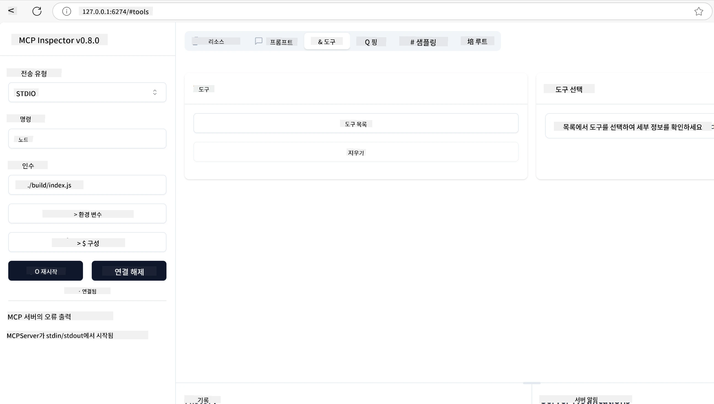
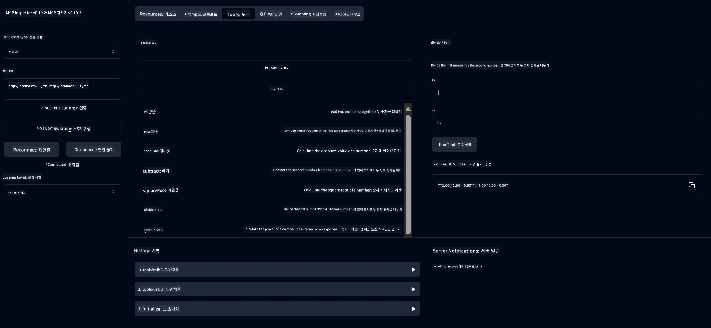
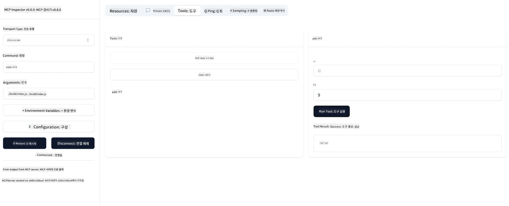

# MCP 시작하기

> [!NOTE]
> 이 강의의 Java HTTP 예제는 레거시 HTTP+SSE 전송을 사용하며 MCP `2025-11-25`와 호환되는 SDK를 대상으로 합니다. 새로운 원격 서버의 경우 `2026-07-28` Streamable HTTP 전송을 사용하고 SDK에서 지원 여부를 확인하세요.


## 개요

이 강의는 MCP 환경을 설정하고 첫 MCP 애플리케이션을 구축하는 실용적인 가이드를 제공합니다. 필요한 도구와 프레임워크 설정, 기본 MCP 서버 구축, 호스트 애플리케이션 생성 및 구현 테스트 방법을 배우게 됩니다.

Model Context Protocol(MCP)은 애플리케이션이 LLM에 컨텍스트를 제공하는 방식을 표준화하는 오픈 프로토콜입니다. MCP를 AI 애플리케이션을 위한 USB-C 포트라고 생각해보세요 — AI 모델을 다양한 데이터 소스와 도구에 연결하는 표준화된 방법을 제공합니다.

## 학습 목표

이 강의가 끝나면 다음을 할 수 있습니다:

- C#, Java, Python, TypeScript, Rust용 MCP 개발 환경을 설정합니다
- 맞춤 기능(자원, 프롬프트, 도구)을 갖춘 기본 MCP 서버를 구축하고 배포합니다
- MCP 서버에 연결하는 호스트 애플리케이션을 만듭니다
- MCP 구현을 테스트하고 디버깅합니다

## MCP 환경 설정

MCP로 작업을 시작하기 전에 개발 환경을 준비하고 기본 워크플로우를 이해하는 것이 중요합니다. 이 섹션은 MCP를 원활하게 시작하기 위한 초기 설정 단계를 안내합니다.

### 사전 요구 사항

MCP 개발에 뛰어들기 전에 다음을 준비하세요:

- **개발 환경**: 선택한 언어(C#, Java, Python, TypeScript, Rust)에 맞는 환경
- **IDE/에디터**: Visual Studio, Visual Studio Code, IntelliJ, Eclipse, PyCharm 또는 최신 코드 편집기
- **패키지 관리자**: NuGet, Maven/Gradle, pip, npm/yarn 또는 Cargo
- **API 키**: 호스트 애플리케이션에서 사용할 AI 서비스용 키

## 기본 MCP 서버 구조

MCP 서버는 일반적으로 다음을 포함합니다:

- **서버 구성**: 포트, 인증 및 기타 설정 셋업
- <strong>자원</strong>: LLM에서 사용할 수 있는 데이터 및 컨텍스트
- <strong>도구</strong>: 모델이 호출할 수 있는 기능
- <strong>프롬프트</strong>: 텍스트를 생성하거나 구조화하는 템플릿

TypeScript 예제는 다음과 같습니다:

```typescript
import { McpServer, ResourceTemplate } from "@modelcontextprotocol/sdk/server/mcp.js";
import { StdioServerTransport } from "@modelcontextprotocol/sdk/server/stdio.js";
import { z } from "zod";

// MCP 서버를 생성합니다
const server = new McpServer({
  name: "Demo",
  version: "1.0.0"
});

// 추가 도구를 추가합니다
server.tool("add",
  { a: z.number(), b: z.number() },
  async ({ a, b }) => ({
    content: [{ type: "text", text: String(a + b) }]
  })
);

// 동적 인사말 리소스를 추가합니다
server.resource(
  "file",
  // 'list' 매개변수는 리소스가 사용 가능한 파일을 나열하는 방식을 제어합니다. undefined로 설정하면 이 리소스의 목록 표시가 비활성화됩니다.
  new ResourceTemplate("file://{path}", { list: undefined }),
  async (uri, { path }) => ({
    contents: [{
      uri: uri.href,
      text: `File, ${path}!`
    }]
  })
);

// 파일 내용을 읽는 파일 리소스를 추가합니다
server.resource(
  "file",
  new ResourceTemplate("file://{path}", { list: undefined }),
  async (uri, { path }) => {
    let text;
    try {
      text = await fs.readFile(path, "utf8");
    } catch (err) {
      text = `Error reading file: ${err.message}`;
    }
    return {
      contents: [{
        uri: uri.href,
        text
      }]
    };
  }
);

server.prompt(
  "review-code",
  { code: z.string() },
  ({ code }) => ({
    messages: [{
      role: "user",
      content: {
        type: "text",
        text: `Please review this code:\n\n${code}`
      }
    }]
  })
);

// stdin에서 메시지 수신을 시작하고 stdout으로 메시지를 전송합니다
const transport = new StdioServerTransport();
await server.connect(transport);
```

위 코드에서:

- MCP TypeScript SDK에서 필요한 클래스를 임포트합니다.
- 새로운 MCP 서버 인스턴스를 생성 및 구성합니다.
- 핸들러 함수와 함께 사용자 정의 도구(`calculator`)를 등록합니다.
- 서버를 시작하여 들어오는 MCP 요청을 수신합니다.

## 테스트 및 디버깅

MCP 서버 테스트를 시작하기 전에, 사용할 수 있는 도구와 디버깅 모범 사례를 이해하는 것이 중요합니다. 효과적인 테스트로 서버가 예상대로 작동하는지 확인하고 문제를 신속히 식별 및 해결할 수 있습니다. 아래 섹션은 MCP 구현 검증을 위한 권장 방법을 설명합니다.

MCP는 서버 테스트 및 디버깅에 도움이 되는 도구를 제공합니다:

- <strong>Inspector 도구</strong>는 그래픽 인터페이스로, 서버에 연결해 도구, 프롬프트, 자원을 테스트할 수 있습니다.
- **curl**: 명령줄 도구인 curl이나 다른 HTTP 명령을 생성 및 실행할 수 있는 클라이언트로 서버에 연결할 수도 있습니다.

### MCP Inspector 사용하기

[MCP Inspector](https://github.com/modelcontextprotocol/inspector)는 다음을 돕는 시각적 테스트 도구입니다:

1. **서버 기능 발견**: 사용 가능한 자원, 도구, 프롬프트 자동 탐지
2. **도구 실행 테스트**: 다양한 매개변수를 시도하고 실시간 응답 확인
3. **서버 메타데이터 보기**: 서버 정보, 스키마, 구성 검토

```bash
# 예 TypeScript, MCP 검사기 설치 및 실행
npx @modelcontextprotocol/inspector node build/index.js
```

위 명령을 실행하면 MCP Inspector가 브라우저에서 로컬 웹 인터페이스를 시작합니다. 대시보드에는 등록된 MCP 서버와 사용 가능한 도구, 자원, 프롬프트가 표시됩니다. 인터페이스를 통해 도구 실행을 인터랙티브하게 테스트하고, 서버 메타데이터를 검사하며, 실시간 응답을 볼 수 있어 MCP 서버 구현 검증 및 디버깅이 편리합니다.

아래는 인터페이스의 스크린샷 예시입니다:



## 자주 발생하는 설정 문제 및 해결책

| 문제 | 가능한 해결책 |
|-------|-------------------|
| 연결 거부됨 | 서버가 실행 중이고 포트가 올바른지 확인하세요 |
| 도구 실행 오류 | 매개변수 검증과 오류 처리를 검토하세요 |
| 인증 실패 | API 키와 권한을 확인하세요 |
| 스키마 검증 오류 | 매개변수가 정의된 스키마와 일치하는지 확인하세요 |
| 서버가 시작되지 않음 | 포트 충돌 또는 누락된 종속성을 확인하세요 |
| CORS 오류 | 교차 출처 요청을 위한 올바른 CORS 헤더를 설정하세요 |
| 인증 문제 | 토큰 유효성과 권한을 확인하세요 |

## 로컬 개발

로컬 개발 및 테스트를 위해 MCP 서버를 직접 머신에서 실행할 수 있습니다:

1. **서버 프로세스 시작**: MCP 서버 애플리케이션 실행
2. **네트워킹 구성**: 서버가 예상 포트에서 접근 가능하도록 설정
3. **클라이언트 연결**: `http://localhost:3000` 등의 로컬 연결 URL 사용

```bash
# 예시: TypeScript MCP 서버를 로컬에서 실행하기
npm run start
# 서버가 http://localhost:3000 에서 실행 중입니다
```

## 첫 MCP 서버 구축하기

이전 강의에서 [핵심 개념](../../01-CoreConcepts/README.md)을 다뤘습니다. 이제 그 지식을 실전에 적용할 시간입니다.

### 서버가 할 수 있는 일

코딩을 시작하기 전, 서버가 할 수 있는 일을 다시 한 번 상기해보겠습니다:

MCP 서버는 예를 들어 다음을 할 수 있습니다:

- 로컬 파일 및 데이터베이스에 접근
- 원격 API에 연결
- 계산 수행
- 다른 도구 및 서비스와 통합
- 상호작용을 위한 사용자 인터페이스 제공

좋습니다. 이제 할 수 있는 일을 알았으니 코딩을 시작해봅시다.

## 연습: 서버 만들기

서버를 만들려면 다음 단계를 따르세요:

- MCP SDK를 설치합니다.
- 프로젝트를 만들고 프로젝트 구조를 설정합니다.
- 서버 코드를 작성합니다.
- 서버를 테스트합니다.

### -1- 프로젝트 생성

#### TypeScript

```sh
# 프로젝트 디렉토리를 만들고 npm 프로젝트를 초기화합니다
mkdir calculator-server
cd calculator-server
npm init -y
```

#### Python

```sh
# 프로젝트 디렉토리 생성
mkdir calculator-server
cd calculator-server
# Visual Studio Code에서 폴더 열기 - 다른 IDE를 사용하는 경우 이 단계를 건너뛰세요
code .
```

#### .NET

```sh
dotnet new console -n McpCalculatorServer
cd McpCalculatorServer
```

#### Java

Java의 경우 Spring Boot 프로젝트를 생성합니다:

```bash
curl https://start.spring.io/starter.zip \
  -d dependencies=web \
  -d javaVersion=21 \
  -d type=maven-project \
  -d groupId=com.example \
  -d artifactId=calculator-server \
  -d name=McpServer \
  -d packageName=com.microsoft.mcp.sample.server \
  -o calculator-server.zip
```

zip 파일을 압축 해제합니다:

```bash
unzip calculator-server.zip -d calculator-server
cd calculator-server
# 선택적으로 사용하지 않는 테스트 제거
rm -rf src/test/java
```

*pom.xml* 파일에 다음 전체 구성을 추가합니다:

```xml
<?xml version="1.0" encoding="UTF-8"?>
<project xmlns="http://maven.apache.org/POM/4.0.0"
    xmlns:xsi="http://www.w3.org/2001/XMLSchema-instance"
    xsi:schemaLocation="http://maven.apache.org/POM/4.0.0 http://maven.apache.org/xsd/maven-4.0.0.xsd">
    <modelVersion>4.0.0</modelVersion>
    
    <!-- Spring Boot parent for dependency management -->
    <parent>
        <groupId>org.springframework.boot</groupId>
        <artifactId>spring-boot-starter-parent</artifactId>
        <version>3.5.0</version>
        <relativePath />
    </parent>

    <!-- Project coordinates -->
    <groupId>com.example</groupId>
    <artifactId>calculator-server</artifactId>
    <version>0.0.1-SNAPSHOT</version>
    <name>Calculator Server</name>
    <description>Basic calculator MCP service for beginners</description>

    <!-- Properties -->
    <properties>
        <java.version>21</java.version>
        <maven.compiler.source>21</maven.compiler.source>
        <maven.compiler.target>21</maven.compiler.target>
    </properties>

    <!-- Spring AI BOM for version management -->
    <dependencyManagement>
        <dependencies>
            <dependency>
                <groupId>org.springframework.ai</groupId>
                <artifactId>spring-ai-bom</artifactId>
                <version>1.0.0-SNAPSHOT</version>
                <type>pom</type>
                <scope>import</scope>
            </dependency>
        </dependencies>
    </dependencyManagement>

    <!-- Dependencies -->
    <dependencies>
        <dependency>
            <groupId>org.springframework.ai</groupId>
            <artifactId>spring-ai-starter-mcp-server-webflux</artifactId>
        </dependency>
        <dependency>
            <groupId>org.springframework.boot</groupId>
            <artifactId>spring-boot-starter-actuator</artifactId>
        </dependency>
        <dependency>
         <groupId>org.springframework.boot</groupId>
         <artifactId>spring-boot-starter-test</artifactId>
         <scope>test</scope>
      </dependency>
    </dependencies>

    <!-- Build configuration -->
    <build>
        <plugins>
            <plugin>
                <groupId>org.springframework.boot</groupId>
                <artifactId>spring-boot-maven-plugin</artifactId>
            </plugin>
            <plugin>
                <groupId>org.apache.maven.plugins</groupId>
                <artifactId>maven-compiler-plugin</artifactId>
                <configuration>
                    <release>21</release>
                </configuration>
            </plugin>
        </plugins>
    </build>

    <!-- Repositories for Spring AI snapshots -->
    <repositories>
        <repository>
            <id>spring-milestones</id>
            <name>Spring Milestones</name>
            <url>https://repo.spring.io/milestone</url>
            <snapshots>
                <enabled>false</enabled>
            </snapshots>
        </repository>
        <repository>
            <id>spring-snapshots</id>
            <name>Spring Snapshots</name>
            <url>https://repo.spring.io/snapshot</url>
            <releases>
                <enabled>false</enabled>
            </releases>
        </repository>
    </repositories>
</project>
```

#### Rust

```sh
mkdir calculator-server
cd calculator-server
cargo init
```

### -2- 종속성 추가

프로젝트를 생성했으니 다음으로 종속성을 추가해봅시다:

#### TypeScript

```sh
# 아직 설치하지 않은 경우, TypeScript를 전역으로 설치하세요
npm install typescript -g

# MCP SDK와 스키마 검증을 위해 Zod를 설치하세요
npm install @modelcontextprotocol/sdk zod
npm install -D @types/node typescript
```

#### Python

```sh
# 가상 환경을 생성하고 의존성을 설치합니다
python -m venv venv
venv\Scripts\activate
pip install "mcp[cli]"
```

#### Java

```bash
cd calculator-server
./mvnw clean install -DskipTests
```

#### Rust

```sh
cargo add rmcp --features server,transport-io
cargo add serde
cargo add tokio --features rt-multi-thread
```

### -3- 프로젝트 파일 생성

#### TypeScript

*package.json* 파일을 열고 서버 빌드 및 실행을 위해 다음 내용으로 교체하세요:

```json
{
  "name": "calculator-server",
  "version": "1.0.0",
  "main": "index.js",
  "type": "module",
  "scripts": {
    "build": "tsc",
    "start": "npm run build && node ./build/index.js",
  },
  "keywords": [],
  "author": "",
  "license": "ISC",
  "description": "A simple calculator server using Model Context Protocol",
  "dependencies": {
    "@modelcontextprotocol/sdk": "^1.16.0",
    "zod": "^3.25.76"
  },
  "devDependencies": {
    "@types/node": "^24.0.14",
    "typescript": "^5.8.3"
  }
}
```

*tsconfig.json* 파일을 다음 내용으로 생성합니다:

```json
{
  "compilerOptions": {
    "target": "ES2022",
    "module": "Node16",
    "moduleResolution": "Node16",
    "outDir": "./build",
    "rootDir": "./src",
    "strict": true,
    "esModuleInterop": true,
    "skipLibCheck": true,
    "forceConsistentCasingInFileNames": true
  },
  "include": ["src/**/*"],
  "exclude": ["node_modules"]
}
```

소스 코드를 위한 디렉터리를 생성합니다:

```sh
mkdir src
touch src/index.ts
```

#### Python

*server.py* 파일을 생성합니다

```sh
touch server.py
```

#### .NET

필요한 NuGet 패키지를 설치합니다:

```sh
dotnet add package ModelContextProtocol --prerelease
dotnet add package Microsoft.Extensions.Hosting
```

#### Java

Java Spring Boot 프로젝트는 프로젝트 구조가 자동으로 생성됩니다.

#### Rust

Rust에서 `cargo init` 명령어를 실행하면 기본으로 *src/main.rs* 파일이 생성됩니다. 파일을 열어 기본 코드를 삭제하세요.

### -4- 서버 코드 생성

#### TypeScript

*index.ts* 파일을 만들고 다음 코드를 추가합니다:

```typescript
import { McpServer, ResourceTemplate } from "@modelcontextprotocol/sdk/server/mcp.js";
import { StdioServerTransport } from "@modelcontextprotocol/sdk/server/stdio.js";
import { z } from "zod";
 
// MCP 서버 생성
const server = new McpServer({
  name: "Calculator MCP Server",
  version: "1.0.0"
});
```

이제 서버가 있지만 할 수 있는 일이 많지 않습니다. 이를 개선해봅시다.

#### Python

```python
# server.py
from mcp.server.fastmcp import FastMCP

# MCP 서버 생성
mcp = FastMCP("Demo")
```

#### .NET

```csharp
using Microsoft.Extensions.DependencyInjection;
using Microsoft.Extensions.Hosting;
using Microsoft.Extensions.Logging;
using ModelContextProtocol.Server;
using System.ComponentModel;

var builder = Host.CreateApplicationBuilder(args);
builder.Logging.AddConsole(consoleLogOptions =>
{
    // Configure all logs to go to stderr
    consoleLogOptions.LogToStandardErrorThreshold = LogLevel.Trace;
});

builder.Services
    .AddMcpServer()
    .WithStdioServerTransport()
    .WithToolsFromAssembly();
await builder.Build().RunAsync();

// add features
```

#### Java

Java의 경우 핵심 서버 컴포넌트를 생성합니다. 먼저 메인 애플리케이션 클래스를 수정하세요:

*src/main/java/com/microsoft/mcp/sample/server/McpServerApplication.java*:

```java
package com.microsoft.mcp.sample.server;

import org.springframework.ai.tool.ToolCallbackProvider;
import org.springframework.ai.tool.method.MethodToolCallbackProvider;
import org.springframework.boot.SpringApplication;
import org.springframework.boot.autoconfigure.SpringBootApplication;
import org.springframework.context.annotation.Bean;
import com.microsoft.mcp.sample.server.service.CalculatorService;

@SpringBootApplication
public class McpServerApplication {

    public static void main(String[] args) {
        SpringApplication.run(McpServerApplication.class, args);
    }
    
    @Bean
    public ToolCallbackProvider calculatorTools(CalculatorService calculator) {
        return MethodToolCallbackProvider.builder().toolObjects(calculator).build();
    }
}
```

계산기 서비스 *src/main/java/com/microsoft/mcp/sample/server/service/CalculatorService.java* 를 생성합니다:

```java
package com.microsoft.mcp.sample.server.service;

import org.springframework.ai.tool.annotation.Tool;
import org.springframework.stereotype.Service;

/**
 * Service for basic calculator operations.
 * This service provides simple calculator functionality through MCP.
 */
@Service
public class CalculatorService {

    /**
     * Add two numbers
     * @param a The first number
     * @param b The second number
     * @return The sum of the two numbers
     */
    @Tool(description = "Add two numbers together")
    public String add(double a, double b) {
        double result = a + b;
        return formatResult(a, "+", b, result);
    }

    /**
     * Subtract one number from another
     * @param a The number to subtract from
     * @param b The number to subtract
     * @return The result of the subtraction
     */
    @Tool(description = "Subtract the second number from the first number")
    public String subtract(double a, double b) {
        double result = a - b;
        return formatResult(a, "-", b, result);
    }

    /**
     * Multiply two numbers
     * @param a The first number
     * @param b The second number
     * @return The product of the two numbers
     */
    @Tool(description = "Multiply two numbers together")
    public String multiply(double a, double b) {
        double result = a * b;
        return formatResult(a, "*", b, result);
    }

    /**
     * Divide one number by another
     * @param a The numerator
     * @param b The denominator
     * @return The result of the division
     */
    @Tool(description = "Divide the first number by the second number")
    public String divide(double a, double b) {
        if (b == 0) {
            return "Error: Cannot divide by zero";
        }
        double result = a / b;
        return formatResult(a, "/", b, result);
    }

    /**
     * Calculate the power of a number
     * @param base The base number
     * @param exponent The exponent
     * @return The result of raising the base to the exponent
     */
    @Tool(description = "Calculate the power of a number (base raised to an exponent)")
    public String power(double base, double exponent) {
        double result = Math.pow(base, exponent);
        return formatResult(base, "^", exponent, result);
    }

    /**
     * Calculate the square root of a number
     * @param number The number to find the square root of
     * @return The square root of the number
     */
    @Tool(description = "Calculate the square root of a number")
    public String squareRoot(double number) {
        if (number < 0) {
            return "Error: Cannot calculate square root of a negative number";
        }
        double result = Math.sqrt(number);
        return String.format("√%.2f = %.2f", number, result);
    }

    /**
     * Calculate the modulus (remainder) of division
     * @param a The dividend
     * @param b The divisor
     * @return The remainder of the division
     */
    @Tool(description = "Calculate the remainder when one number is divided by another")
    public String modulus(double a, double b) {
        if (b == 0) {
            return "Error: Cannot divide by zero";
        }
        double result = a % b;
        return formatResult(a, "%", b, result);
    }

    /**
     * Calculate the absolute value of a number
     * @param number The number to find the absolute value of
     * @return The absolute value of the number
     */
    @Tool(description = "Calculate the absolute value of a number")
    public String absolute(double number) {
        double result = Math.abs(number);
        return String.format("|%.2f| = %.2f", number, result);
    }

    /**
     * Get help about available calculator operations
     * @return Information about available operations
     */
    @Tool(description = "Get help about available calculator operations")
    public String help() {
        return "Basic Calculator MCP Service\n\n" +
               "Available operations:\n" +
               "1. add(a, b) - Adds two numbers\n" +
               "2. subtract(a, b) - Subtracts the second number from the first\n" +
               "3. multiply(a, b) - Multiplies two numbers\n" +
               "4. divide(a, b) - Divides the first number by the second\n" +
               "5. power(base, exponent) - Raises a number to a power\n" +
               "6. squareRoot(number) - Calculates the square root\n" + 
               "7. modulus(a, b) - Calculates the remainder of division\n" +
               "8. absolute(number) - Calculates the absolute value\n\n" +
               "Example usage: add(5, 3) will return 5 + 3 = 8";
    }

    /**
     * Format the result of a calculation
     */
    private String formatResult(double a, String operator, double b, double result) {
        return String.format("%.2f %s %.2f = %.2f", a, operator, b, result);
    }
}
```

**실제 운영 서비스에 필요한 선택적 컴포넌트:**

시작 구성 *src/main/java/com/microsoft/mcp/sample/server/config/StartupConfig.java* 를 생성합니다:

```java
package com.microsoft.mcp.sample.server.config;

import org.springframework.boot.CommandLineRunner;
import org.springframework.context.annotation.Bean;
import org.springframework.context.annotation.Configuration;

@Configuration
public class StartupConfig {
    
    @Bean
    public CommandLineRunner startupInfo() {
        return args -> {
            System.out.println("\n" + "=".repeat(60));
            System.out.println("Calculator MCP Server is starting...");
            System.out.println("SSE endpoint: http://localhost:8080/sse");
            System.out.println("Health check: http://localhost:8080/actuator/health");
            System.out.println("=".repeat(60) + "\n");
        };
    }
}
```

헬스 컨트롤러 *src/main/java/com/microsoft/mcp/sample/server/controller/HealthController.java* 를 생성합니다:

```java
package com.microsoft.mcp.sample.server.controller;

import org.springframework.http.ResponseEntity;
import org.springframework.web.bind.annotation.GetMapping;
import org.springframework.web.bind.annotation.RestController;
import java.time.LocalDateTime;
import java.util.HashMap;
import java.util.Map;

@RestController
public class HealthController {
    
    @GetMapping("/health")
    public ResponseEntity<Map<String, Object>> healthCheck() {
        Map<String, Object> response = new HashMap<>();
        response.put("status", "UP");
        response.put("timestamp", LocalDateTime.now().toString());
        response.put("service", "Calculator MCP Server");
        return ResponseEntity.ok(response);
    }
}
```

예외 처리기 *src/main/java/com/microsoft/mcp/sample/server/exception/GlobalExceptionHandler.java* 를 생성합니다:

```java
package com.microsoft.mcp.sample.server.exception;

import org.springframework.http.HttpStatus;
import org.springframework.http.ResponseEntity;
import org.springframework.web.bind.annotation.ExceptionHandler;
import org.springframework.web.bind.annotation.RestControllerAdvice;

@RestControllerAdvice
public class GlobalExceptionHandler {

    @ExceptionHandler(IllegalArgumentException.class)
    public ResponseEntity<ErrorResponse> handleIllegalArgumentException(IllegalArgumentException ex) {
        ErrorResponse error = new ErrorResponse(
            "Invalid_Input", 
            "Invalid input parameter: " + ex.getMessage());
        return new ResponseEntity<>(error, HttpStatus.BAD_REQUEST);
    }

    public static class ErrorResponse {
        private String code;
        private String message;

        public ErrorResponse(String code, String message) {
            this.code = code;
            this.message = message;
        }

        // 게터
        public String getCode() { return code; }
        public String getMessage() { return message; }
    }
}
```

커스텀 배너 *src/main/resources/banner.txt* 를 생성합니다:

```text
_____      _            _       _             
 / ____|    | |          | |     | |            
| |     __ _| | ___ _   _| | __ _| |_ ___  _ __ 
| |    / _` | |/ __| | | | |/ _` | __/ _ \| '__|
| |___| (_| | | (__| |_| | | (_| | || (_) | |   
 \_____\__,_|_|\___|\__,_|_|\__,_|\__\___/|_|   
                                                
Calculator MCP Server v1.0
Spring Boot MCP Application
```

</details>

#### Rust

*src/main.rs* 파일 상단에 다음 코드를 추가하세요. MCP 서버에 필요한 라이브러리와 모듈을 임포트합니다.

```rust
use rmcp::{
    handler::server::{router::tool::ToolRouter, tool::Parameters},
    model::{ServerCapabilities, ServerInfo},
    schemars, tool, tool_handler, tool_router,
    transport::stdio,
    ServerHandler, ServiceExt,
};
use std::error::Error;
```

계산기 서버는 두 숫자를 더할 수 있는 간단한 서버가 될 것입니다. 계산기 요청을 나타내는 구조체를 만듭니다.

```rust
#[derive(Debug, serde::Deserialize, schemars::JsonSchema)]
pub struct CalculatorRequest {
    pub a: f64,
    pub b: f64,
}
```

다음으로 계산기 서버를 나타내는 구조체를 만듭니다. 이 구조체는 도구 라우터를 보유하며, 도구 등록에 사용됩니다.

```rust
#[derive(Debug, Clone)]
pub struct Calculator {
    tool_router: ToolRouter<Self>,
}
```

이제 `Calculator` 구조체를 구현해 새 서버 인스턴스를 생성하고 서버 정보를 제공하는 핸들러를 구현할 수 있습니다.

```rust
#[tool_router]
impl Calculator {
    pub fn new() -> Self {
        Self {
            tool_router: Self::tool_router(),
        }
    }
}

#[tool_handler]
impl ServerHandler for Calculator {
    fn get_info(&self) -> ServerInfo {
        ServerInfo {
            instructions: Some("A simple calculator tool".into()),
            capabilities: ServerCapabilities::builder().enable_tools().build(),
            ..Default::default()
        }
    }
}
```

마지막으로 서버를 시작하는 메인 함수를 구현해야 합니다. 이 함수는 `Calculator` 구조체 인스턴스를 생성하여 표준 입출력으로 서비스를 제공합니다.

```rust
#[tokio::main]
async fn main() -> Result<(), Box<dyn Error>> {
    let service = Calculator::new().serve(stdio()).await?;
    service.waiting().await?;
    Ok(())
}
```

이제 서버가 기본 정보를 제공하도록 설정되었습니다. 다음으로 덧셈을 수행하는 도구를 추가할 것입니다.

### -5- 도구와 자원 추가

다음 코드를 추가하여 도구와 자원을 추가하세요:

#### TypeScript

```typescript
server.tool(
  "add",
  { a: z.number(), b: z.number() },
  async ({ a, b }) => ({
    content: [{ type: "text", text: String(a + b) }]
  })
);

server.resource(
  "greeting",
  new ResourceTemplate("greeting://{name}", { list: undefined }),
  async (uri, { name }) => ({
    contents: [{
      uri: uri.href,
      text: `Hello, ${name}!`
    }]
  })
);
```

도구는 매개변수 `a`, `b`를 받아서 다음 형식의 응답을 생성하는 함수를 실행합니다:

```typescript
{
  contents: [{
    type: "text", content: "some content"
  }]
}
```

자원은 "greeting" 문자열을 통해 접근하고, `name` 파라미터를 받아 도구와 유사한 응답을 만듭니다:

```typescript
{
  uri: "<href>",
  text: "a text"
}
```

#### Python

```python
# 더하기 도구 추가
@mcp.tool()
def add(a: int, b: int) -> int:
    """Add two numbers"""
    return a + b


# 동적인 인사말 리소스 추가
@mcp.resource("greeting://{name}")
def get_greeting(name: str) -> str:
    """Get a personalized greeting"""
    return f"Hello, {name}!"
```

위 코드에서는:

- 매개변수 `a`와 `b`(둘 다 정수)를 받는 `add` 도구를 정의했습니다.
- `name` 파라미터를 받는 `greeting` 자원을 생성했습니다.

#### .NET

Program.cs 파일에 다음을 추가하세요:

```csharp
[McpServerToolType]
public static class CalculatorTool
{
    [McpServerTool, Description("Adds two numbers")]
    public static string Add(int a, int b) => $"Sum {a + b}";
}
```

#### Java

도구들은 이미 이전 단계에서 생성되었습니다.

#### Rust

`impl Calculator` 블록 안에 새 도구를 추가하세요:

```rust
#[tool(description = "Adds a and b")]
async fn add(
    &self,
    Parameters(CalculatorRequest { a, b }): Parameters<CalculatorRequest>,
) -> String {
    (a + b).to_string()
}
```

### -6- 최종 코드

서버가 시작할 수 있도록 필요한 최종 코드를 추가합시다:

#### TypeScript

```typescript
// stdin에서 메시지 수신을 시작하고 stdout에서 메시지 전송을 시작합니다
const transport = new StdioServerTransport();
await server.connect(transport);
```

전체 코드는 다음과 같습니다:

```typescript
// index.ts
import { McpServer, ResourceTemplate } from "@modelcontextprotocol/sdk/server/mcp.js";
import { StdioServerTransport } from "@modelcontextprotocol/sdk/server/stdio.js";
import { z } from "zod";

// MCP 서버 생성
const server = new McpServer({
  name: "Calculator MCP Server",
  version: "1.0.0"
});

// 추가 도구 추가
server.tool(
  "add",
  { a: z.number(), b: z.number() },
  async ({ a, b }) => ({
    content: [{ type: "text", text: String(a + b) }]
  })
);

// 동적 인사말 리소스 추가
server.resource(
  "greeting",
  new ResourceTemplate("greeting://{name}", { list: undefined }),
  async (uri, { name }) => ({
    contents: [{
      uri: uri.href,
      text: `Hello, ${name}!`
    }]
  })
);

// stdin에서 메시지 수신 시작 및 stdout으로 메시지 전송 시작
const transport = new StdioServerTransport();
server.connect(transport);
```

#### Python

```python
# server.py
from mcp.server.fastmcp import FastMCP

# MCP 서버 생성
mcp = FastMCP("Demo")


# 추가 도구 추가
@mcp.tool()
def add(a: int, b: int) -> int:
    """Add two numbers"""
    return a + b


# 동적 인사말 리소스 추가
@mcp.resource("greeting://{name}")
def get_greeting(name: str) -> str:
    """Get a personalized greeting"""
    return f"Hello, {name}!"

# 주요 실행 블록 - 서버를 실행하는 데 필요합니다
if __name__ == "__main__":
    mcp.run()
```

#### .NET

다음 내용을 포함한 Program.cs 파일을 만드세요:

```csharp
using Microsoft.Extensions.DependencyInjection;
using Microsoft.Extensions.Hosting;
using Microsoft.Extensions.Logging;
using ModelContextProtocol.Server;
using System.ComponentModel;

var builder = Host.CreateApplicationBuilder(args);
builder.Logging.AddConsole(consoleLogOptions =>
{
    // Configure all logs to go to stderr
    consoleLogOptions.LogToStandardErrorThreshold = LogLevel.Trace;
});

builder.Services
    .AddMcpServer()
    .WithStdioServerTransport()
    .WithToolsFromAssembly();
await builder.Build().RunAsync();

[McpServerToolType]
public static class CalculatorTool
{
    [McpServerTool, Description("Adds two numbers")]
    public static string Add(int a, int b) => $"Sum {a + b}";
}
```

#### Java

완성된 메인 애플리케이션 클래스는 다음과 같아야 합니다:

```java
// McpServerApplication.java
package com.microsoft.mcp.sample.server;

import org.springframework.ai.tool.ToolCallbackProvider;
import org.springframework.ai.tool.method.MethodToolCallbackProvider;
import org.springframework.boot.SpringApplication;
import org.springframework.boot.autoconfigure.SpringBootApplication;
import org.springframework.context.annotation.Bean;
import com.microsoft.mcp.sample.server.service.CalculatorService;

@SpringBootApplication
public class McpServerApplication {

    public static void main(String[] args) {
        SpringApplication.run(McpServerApplication.class, args);
    }
    
    @Bean
    public ToolCallbackProvider calculatorTools(CalculatorService calculator) {
        return MethodToolCallbackProvider.builder().toolObjects(calculator).build();
    }
}
```

#### Rust

Rust 서버의 최종 코드는 다음과 같습니다:

```rust
use rmcp::{
    ServerHandler, ServiceExt,
    handler::server::{router::tool::ToolRouter, tool::Parameters},
    model::{ServerCapabilities, ServerInfo},
    schemars, tool, tool_handler, tool_router,
    transport::stdio,
};
use std::error::Error;

#[derive(Debug, serde::Deserialize, schemars::JsonSchema)]
pub struct CalculatorRequest {
    pub a: f64,
    pub b: f64,
}

#[derive(Debug, Clone)]
pub struct Calculator {
    tool_router: ToolRouter<Self>,
}

#[tool_router]
impl Calculator {
    pub fn new() -> Self {
        Self {
            tool_router: Self::tool_router(),
        }
    }
    
    #[tool(description = "Adds a and b")]
    async fn add(
        &self,
        Parameters(CalculatorRequest { a, b }): Parameters<CalculatorRequest>,
    ) -> String {
        (a + b).to_string()
    }
}

#[tool_handler]
impl ServerHandler for Calculator {
    fn get_info(&self) -> ServerInfo {
        ServerInfo {
            instructions: Some("A simple calculator tool".into()),
            capabilities: ServerCapabilities::builder().enable_tools().build(),
            ..Default::default()
        }
    }
}

#[tokio::main]
async fn main() -> Result<(), Box<dyn Error>> {
    let service = Calculator::new().serve(stdio()).await?;
    service.waiting().await?;
    Ok(())
}
```

### -7- 서버 테스트

다음 명령으로 서버를 시작하세요:

#### TypeScript

```sh
npm run build
```

#### Python

```sh
mcp run server.py
```

> MCP Inspector를 사용하려면 `mcp dev server.py`를 사용하세요. Inspector가 자동으로 실행되며 필요한 프록시 세션 토큰을 제공합니다. `mcp run server.py`를 사용하는 경우, 수동으로 Inspector를 시작하고 연결을 구성해야 합니다.

#### .NET

프로젝트 디렉토리에 있는지 확인하세요:

```sh
cd McpCalculatorServer
dotnet run
```

#### Java

```bash
./mvnw clean install -DskipTests
java -jar target/calculator-server-0.0.1-SNAPSHOT.jar
```

#### Rust

다음 명령어들로 서버를 포맷하고 실행하세요:

```sh
cargo fmt
cargo run
```

### -8- Inspector로 실행

Inspector는 서버를 시작하고 상호작용할 수 있어, 서버의 작동 여부를 테스트하는 데 아주 좋은 도구입니다. 시작해봅시다:

> [!NOTE]
> "명령" 필드는 런타임에 따라 서버 실행 명령어가 달라 보일 수 있습니다.

#### TypeScript

```sh
npx @modelcontextprotocol/inspector node build/index.js
```

또는 <em>package.json</em>에 `"inspector": "npx @modelcontextprotocol/inspector node build/index.js"`를 추가하고 `npm run inspector`를 실행하세요

#### Python

Python은 Node.js 도구인 inspector를 래핑합니다. 다음과 같이 도구를 호출할 수 있습니다:

```sh
mcp dev server.py
```


하지만 도구에서 사용할 수 있는 모든 메서드를 구현하지 않았으므로 아래와 같이 Node.js 도구를 직접 실행하는 것이 좋습니다:

```sh
npx @modelcontextprotocol/inspector mcp run server.py
```

스크립트를 실행하기 위한 명령과 인수를 구성할 수 있는 도구나 IDE를 사용하는 경우, 
`Command` 필드에 `python`을, `Arguments`에 `server.py`를 설정했는지 확인하세요. 이렇게 하면 스크립트가 올바르게 실행됩니다.

#### .NET

프로젝트 디렉터리에 있는지 확인하세요:

```sh
cd McpCalculatorServer
npx @modelcontextprotocol/inspector dotnet run
```

#### Java

계산기 서버가 실행 중인지 확인하세요
인스펙터를 실행합니다:

```cmd
npx @modelcontextprotocol/inspector
```

인스펙터 웹 인터페이스에서:

1. 전송 유형으로 "SSE"를 선택하세요
2. URL을 `http://localhost:8080/sse`로 설정하세요
3. "연결"을 클릭하세요



**서버에 연결되었습니다**
**이제 Java 서버 테스트 섹션이 완료되었습니다**

다음 섹션은 서버와 상호작용하는 방법입니다.

다음과 같은 사용자 인터페이스를 볼 수 있을 것입니다:


1. 연결 버튼을 선택하여 서버에 연결하세요
  서버에 연결하면 다음 화면을 볼 수 있습니다:

  

1. "Tools"에서 "listTools"를 선택하면 "Add"가 나타납니다. "Add"를 선택하고 매개변수 값을 입력하세요.

  다음과 같은 응답, 즉 "add" 도구의 결과를 볼 수 있습니다:

  

축하합니다, 첫 번째 서버를 성공적으로 만들고 실행했습니다!

#### Rust

MCP Inspector CLI를 사용해 Rust 서버를 실행하려면 다음 명령어를 사용하세요:

```sh
npx @modelcontextprotocol/inspector cargo run --cli --method tools/call --tool-name add --tool-arg a=1 b=2
```

### 공식 SDK

MCP는 여러 언어를 위한 공식 SDK를 제공합니다:

- [C# SDK](https://github.com/modelcontextprotocol/csharp-sdk) - Microsoft와 협력하여 유지 관리
- [Java SDK](https://github.com/modelcontextprotocol/java-sdk) - Spring AI와 협력하여 유지 관리
- [TypeScript SDK](https://github.com/modelcontextprotocol/typescript-sdk) - 공식 TypeScript 구현
- [Python SDK](https://github.com/modelcontextprotocol/python-sdk) - 공식 Python 구현
- [Kotlin SDK](https://github.com/modelcontextprotocol/kotlin-sdk) - 공식 Kotlin 구현
- [Swift SDK](https://github.com/modelcontextprotocol/swift-sdk) - Loopwork AI와 협력하여 유지 관리
- [Rust SDK](https://github.com/modelcontextprotocol/rust-sdk) - 공식 Rust 구현

## 주요 요점

- 언어별 SDK를 사용하면 MCP 개발 환경 설정이 간단함
- MCP 서버 구축은 명확한 스키마와 함께 도구를 생성하고 등록하는 것 포함
- 신뢰할 수 있는 MCP 구현을 위해 테스트와 디버깅이 필수적임

## 샘플

- [Java 계산기](../samples/java/calculator/README.md)
- [.NET 계산기](../../../../03-GettingStarted/samples/csharp)
- [JavaScript 계산기](../samples/javascript/README.md)
- [TypeScript 계산기](../samples/typescript/README.md)
- [Python 계산기](../../../../03-GettingStarted/samples/python)
- [Rust 계산기](../../../../03-GettingStarted/samples/rust)

## 과제

원하는 도구로 간단한 MCP 서버를 만드세요:

1. 선호하는 언어(.NET, Java, Python, TypeScript 또는 Rust)로 도구를 구현하세요.
2. 입력 매개변수와 반환 값을 정의하세요.
3. 인스펙터 도구를 실행하여 서버가 의도대로 작동하는지 확인하세요.
4. 다양한 입력으로 구현을 테스트하세요.

## 솔루션

[솔루션](./solution/README.md)

## 추가 리소스

- [Azure에서 Model Context Protocol로 에이전트 빌드하기](https://learn.microsoft.com/azure/developer/ai/intro-agents-mcp)
- [원격 MCP와 Azure Container Apps (Node.js/TypeScript/JavaScript)](https://learn.microsoft.com/samples/azure-samples/mcp-container-ts/mcp-container-ts/)
- [.NET OpenAI MCP 에이전트](https://learn.microsoft.com/samples/azure-samples/openai-mcp-agent-dotnet/openai-mcp-agent-dotnet/)

## 다음 단계

다음: [MCP 클라이언트 시작하기](../02-client/README.md)

---

<!-- CO-OP TRANSLATOR DISCLAIMER START -->
**면책 조항**:
이 문서는 AI 번역 서비스 [Co-op Translator](https://github.com/Azure/co-op-translator)를 사용하여 번역되었습니다. 정확성을 기하기 위해 노력하고 있으나, 자동 번역은 오류나 부정확한 부분이 있을 수 있음을 유의하시기 바랍니다. 원본 문서의 원어본이 권위 있는 자료로 간주되어야 합니다. 중요한 정보의 경우, 전문가의 인간 번역을 권장합니다. 이 번역 사용으로 인해 발생하는 오해나 잘못된 해석에 대해 당사는 책임을 지지 않습니다.
<!-- CO-OP TRANSLATOR DISCLAIMER END -->