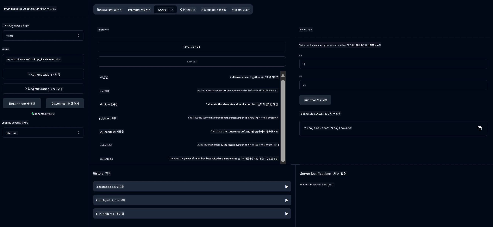

# 기본 계산기 MCP 서비스

> [!NOTE]
> 이 Java 솔루션은 레거시 HTTP+SSE 전송 방식을 사용하며 MCP `2025-11-25`와 호환되는 SDK를 대상으로 합니다.
> 이는 수업 코드와 일치하도록 유지된 것이며,
> 새 원격 서버는 `2026-07-28` 스트리머블 HTTP 지원을 사용해야 합니다.

이 서비스는 Spring Boot와 WebFlux 전송을 사용하여 Model Context Protocol(MCP)을 통해 기본 계산기 연산을 제공합니다. MCP 구현을 배우는 초보자를 위한 간단한 예제로 설계되었습니다.

자세한 내용은 [MCP Server Boot Starter](https://docs.spring.io/spring-ai/reference/api/mcp/mcp-server-boot-starter-docs.html) 참고 문서를 참조하세요.


## 서비스 사용법

이 서비스는 MCP 프로토콜을 통해 다음 API 엔드포인트를 노출합니다:

- `add(a, b)`: 두 수를 더합니다
- `subtract(a, b)`: 두 번째 수를 첫 번째 수에서 뺍니다
- `multiply(a, b)`: 두 수를 곱합니다
- `divide(a, b)`: 첫 번째 수를 두 번째 수로 나눕니다 (0 체크 포함)
- `power(base, exponent)`: 거듭제곱을 계산합니다
- `squareRoot(number)`: 제곱근을 계산합니다 (음수 체크 포함)
- `modulus(a, b)`: 나눈 나머지를 계산합니다
- `absolute(number)`: 절대값을 계산합니다

## 의존성

이 프로젝트에는 다음 주요 의존성이 필요합니다:

```xml
<dependency>
    <groupId>org.springframework.ai</groupId>
    <artifactId>spring-ai-starter-mcp-server-webflux</artifactId>
</dependency>
```

## 프로젝트 빌드

Maven을 사용하여 프로젝트를 빌드하세요:
```bash
./mvnw clean install -DskipTests
```

## 서버 실행

### Java 사용

```bash
java -jar target/calculator-server-0.0.1-SNAPSHOT.jar
```

### MCP Inspector 사용

MCP Inspector는 MCP 서비스와 상호 작용하기 위한 유용한 도구입니다. 이 계산기 서비스와 함께 사용하려면:

1. **새 터미널 창에서 MCP Inspector를 설치하고 실행하십시오**:
   ```bash
   npx @modelcontextprotocol/inspector
   ```

2. **앱에서 표시된 URL(일반적으로 http://localhost:6274)을 클릭하여 웹 UI에 접속합니다**

3. **연결 설정**:
   - 전송 유형을 "SSE"로 설정합니다
   - 실행 중인 서버의 SSE 엔드포인트 URL을 `http://localhost:8080/sse`로 설정합니다
   - "연결"을 클릭합니다

4. **도구 사용**:
   - "도구 목록"을 클릭하여 사용 가능한 계산기 연산을 확인합니다
   - 도구를 선택하고 "도구 실행"을 클릭하여 연산을 수행합니다



---

<!-- CO-OP TRANSLATOR DISCLAIMER START -->
**면책 조항**:
이 문서는 AI 번역 서비스 [Co-op Translator](https://github.com/Azure/co-op-translator)를 사용하여 번역되었습니다. 정확성을 기하기 위해 노력하고 있으나, 자동 번역은 오류나 부정확한 부분이 있을 수 있음을 유의하시기 바랍니다. 원본 문서의 원어본이 권위 있는 자료로 간주되어야 합니다. 중요한 정보의 경우, 전문가의 인간 번역을 권장합니다. 이 번역 사용으로 인해 발생하는 오해나 잘못된 해석에 대해 당사는 책임을 지지 않습니다.
<!-- CO-OP TRANSLATOR DISCLAIMER END -->