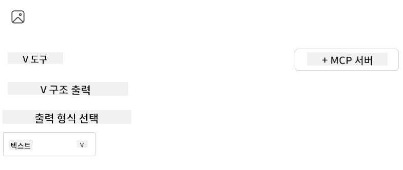

# Visual Studio Code용 AI Toolkit 확장으로 서버 사용하기

AI 에이전트를 구축할 때 단순히 스마트 응답을 생성하는 것뿐만 아니라 에이전트가 직접 행동할 수 있도록 하는 것이 중요합니다. 여기서 Model Context Protocol(MCP)이 역할을 합니다. MCP는 에이전트가 외부 도구와 서비스를 일관된 방식으로 쉽게 접근할 수 있게 해줍니다. 마치 에이전트를 실제로 사용할 수 있는 도구 상자에 연결하는 것과 같습니다.

예를 들어, 에이전트를 계산기 MCP 서버에 연결하면, "47 곱하기 89는 얼마야?"와 같은 프롬프트만 받아도 수학 연산을 수행할 수 있습니다—로직을 하드코딩하거나 맞춤형 API를 만들 필요가 없습니다.

## 개요

이 수업에서는 Visual Studio Code용 [AI Toolkit](https://aka.ms/AIToolkit) 확장을 사용하여 계산기 MCP 서버를 에이전트에 연결하는 방법을 다루며, 자연어를 통해 덧셈, 뺄셈, 곱셈, 나눗셈과 같은 수학 연산을 에이전트가 수행할 수 있도록 합니다.

AI Toolkit은 Visual Studio Code용 강력한 확장 기능으로 에이전트 개발을 간소화합니다. AI 엔지니어는 로컬 또는 클라우드에서 생성 AI 모델을 개발 및 테스트하여 AI 애플리케이션을 쉽게 구축할 수 있습니다. 이 확장은 현재 대부분의 주요 생성 모델을 지원합니다.

<em>참고</em>: AI Toolkit은 현재 Python 및 TypeScript를 지원합니다.

## 학습 목표

이 수업을 완료하면 다음을 할 수 있습니다:

- AI Toolkit을 통해 MCP 서버를 사용하기.
- 에이전트 구성을 설정하여 MCP 서버가 제공하는 도구를 발견하고 활용할 수 있도록 하기.
- 자연어를 통해 MCP 도구 활용하기.

## 접근 방법

전체 절차를 높은 수준에서 보면 다음과 같습니다:

- 에이전트를 만들고 시스템 프롬프트를 정의하기.
- 계산기 도구가 포함된 MCP 서버 생성하기.
- Agent Builder를 MCP 서버에 연결하기.
- 자연어를 통해 에이전트의 도구 호출을 테스트하기.

이제 흐름을 이해했으니 MCP를 통해 외부 도구를 활용할 수 있도록 AI 에이전트를 설정해보겠습니다. 이를 통해 에이전트의 능력이 향상됩니다!

## 사전 준비사항

- [Visual Studio Code](https://code.visualstudio.com/)
- [Visual Studio Code용 AI Toolkit](https://aka.ms/AIToolkit)

## 실습: 서버 사용하기

> [!WARNING]
> macOS 사용자 주의. 현재 macOS에서 종속성 설치와 관련된 문제를 조사 중입니다. 따라서 macOS 사용자는 이 튜토리얼을 현재 완료할 수 없습니다. 해결책이 나오면 안내를 업데이트할 예정입니다. 양해와 이해에 감사드립니다!

이 실습에서는 AI Toolkit을 사용하여 Visual Studio Code 내 MCP 서버의 도구를 활용하는 AI 에이전트를 구축, 실행 및 향상시킬 것입니다.

### -0- 사전 단계, OpenAI GPT-4o 모델을 내 모델에 추가하기

이 실습에서는 **GPT-4o** 모델을 사용합니다. 에이전트를 만들기 전에 해당 모델을 <strong>내 모델</strong>에 추가해야 합니다.


1. <strong>활동 바(Activity Bar)</strong>에서 **AI Toolkit** 확장을 엽니다.
1. **카탈로그(Catalog)** 섹션에서 <strong>모델(Models)</strong>을 선택하여 <strong>모델 카탈로그(Model Catalog)</strong>를 엽니다. 선택 시 새 편집기 탭에서 열립니다.
1. **모델 카탈로그** 검색 창에 <strong>OpenAI GPT-4o</strong>를 입력합니다.
1. **+ 추가(Add)** 버튼을 클릭해 모델을 **내 모델(My Models)** 목록에 추가합니다. **GitHub에서 호스팅된** 모델을 선택했는지 확인하세요.
1. <strong>활동 바</strong>에서 **OpenAI GPT-4o** 모델이 목록에 나타나는지 확인합니다.

### -1- 에이전트 만들기

<strong>Agent (Prompt) Builder</strong>를 이용해 자신만의 AI 에이전트를 생성하고 맞춤화할 수 있습니다. 이 섹션에서는 새 에이전트를 만들고 대화를 구동할 모델을 할당할 것입니다.


1. <strong>활동 바</strong>에서 **AI Toolkit** 확장을 엽니다.
1. **도구(Tools)** 섹션에서 <strong>Agent (Prompt) Builder</strong>를 선택합니다. 새 편집기 탭에서 열립니다.
1. **+ 새 에이전트(New Agent)** 버튼을 클릭합니다. 명령 팔레트를 통해 설정 마법사가 실행됩니다.
1. **Calculator Agent** 이름을 입력하고 **Enter** 키를 누릅니다.
1. <strong>Agent (Prompt) Builder</strong>에서 **모델(Model)** 필드에 **OpenAI GPT-4o (GitHub 경유)** 모델을 선택합니다.

### -2- 에이전트 시스템 프롬프트 생성하기

에이전트의 틀이 완성되었으니 이제 캐릭터와 목적을 정의할 차례입니다. 이 섹션에서 **시스템 프롬프트 생성** 기능을 사용해, 계산기 에이전트로서의 동작 방식을 설명하고 모델이 시스템 프롬프트를 작성하도록 합니다.


1. **프롬프트(Prompts)** 섹션에서 **시스템 프롬프트 생성(Generate system prompt)** 버튼을 클릭합니다. 이 버튼은 AI를 활용해 시스템 프롬프트를 생성하는 프롬프트 빌더를 엽니다.
1. **프롬프트 생성(Generate a prompt)** 창에 다음 문장을 입력하세요: `당신은 유용하고 효율적인 수학 도우미입니다. 기본 산술 문제를 받으면 올바른 결과로 답변합니다.`
1. **생성(Generate)** 버튼을 클릭합니다. 우측 하단에 시스템 프롬트 생성 중임을 알리는 알림이 뜹니다. 완료되면 <strong>Agent (Prompt) Builder</strong>의 **시스템 프롬프트** 필드에 생성된 프롬프트가 표시됩니다.
1. <strong>시스템 프롬프트</strong>를 검토하고 필요하면 수정하세요.

### -3- MCP 서버 만들기

에이전트의 시스템 프롬프트를 정의했으니 이제 실용적인 기능을 추가할 차례입니다. 이 섹션에서는 덧셈, 뺄셈, 곱셈, 나눗셈 계산을 수행하는 도구가 포함된 계산기 MCP 서버를 만듭니다. 이 서버는 자연어 프롬프트에 실시간 수학 연산을 수행하도록 에이전트를 지원합니다.



AI Toolkit은 MCP 서버를 쉽게 만들 수 있도록 템플릿을 제공합니다. 이번에는 Python 템플릿을 사용해 계산기 MCP 서버를 생성할 것입니다.

<em>참고</em>: AI Toolkit은 현재 Python 및 TypeScript를 지원합니다.

1. <strong>Agent (Prompt) Builder</strong>의 **도구(Tools)** 섹션에서 **+ MCP Server** 버튼을 클릭합니다. 명령 팔레트를 통해 설정 마법사가 시작됩니다.
1. <strong>+ 서버 추가(Add Server)</strong>를 선택합니다.
1. <strong>새 MCP 서버 만들기(Create a New MCP Server)</strong>를 선택합니다.
1. 템플릿으로 <strong>python-weather</strong>를 선택합니다.
1. MCP 서버 템플릿을 저장할 <strong>기본 폴더(Default folder)</strong>를 선택합니다.
1. 서버 이름을 <strong>Calculator</strong>로 입력합니다.
1. 새 Visual Studio Code 창이 열립니다. <strong>예, 작성자를 신뢰합니다(Yes, I trust the authors)</strong>를 선택합니다.
1. 터미널(<strong>터미널</strong> > **새 터미널**)을 열고 가상 환경을 생성합니다: `python -m venv .venv`
1. 터미널에서 가상 환경을 활성화합니다:
    1. Windows - `.venv\Scripts\activate`
    1. macOS/Linux - `source .venv/bin/activate`
1. 터미널에서 종속성을 설치합니다: `pip install -e .[dev]`
1. <strong>활동 바</strong>의 **탐색기(Explorer)** 뷰에서 **src** 디렉터리를 확장하고 **server.py** 파일을 선택하여 편집기에서 엽니다.
1. **server.py** 파일의 코드를 다음으로 교체하고 저장하세요:

    ```python
    """
    Sample MCP Calculator Server implementation in Python.

    
    This module demonstrates how to create a simple MCP server with calculator tools
    that can perform basic arithmetic operations (add, subtract, multiply, divide).
    """
    
    from mcp.server.fastmcp import FastMCP
    
    server = FastMCP("calculator")
    
    @server.tool()
    def add(a: float, b: float) -> float:
        """Add two numbers together and return the result."""
        return a + b
    
    @server.tool()
    def subtract(a: float, b: float) -> float:
        """Subtract b from a and return the result."""
        return a - b
    
    @server.tool()
    def multiply(a: float, b: float) -> float:
        """Multiply two numbers together and return the result."""
        return a * b
    
    @server.tool()
    def divide(a: float, b: float) -> float:
        """
        Divide a by b and return the result.
        
        Raises:
            ValueError: If b is zero
        """
        if b == 0:
            raise ValueError("Cannot divide by zero")
        return a / b
    ```

### -4- 계산기 MCP 서버로 에이전트 실행하기

이제 에이전트에 도구가 갖춰졌으니 이를 활용할 시간입니다! 이 섹션에서는 프롬프트를 에이전트에 제출해 에이전트가 계산기 MCP 서버의 적절한 도구를 활용하는지 테스트하고 검증합니다.


계산기 MCP 서버는 MCP 클라이언트 역할을 하는 <strong>Agent Builder</strong>를 통해 로컬 개발 머신에서 실행할 것입니다.

1. `F5` 키를 눌러 MCP 서버 디버깅을 시작합니다. <strong>Agent (Prompt) Builder</strong>가 새 편집기 탭에서 열립니다. 터미널에서 서버 상태를 확인할 수 있습니다.
1. <strong>Agent (Prompt) Builder</strong>의 **사용자 프롬프트(User prompt)** 필드에 다음 프롬프트를 입력하세요: `나는 3개의 상품을 각각 $25에 샀고, $20 할인을 받았다. 총 얼마를 지불했나요?`
1. **실행(Run)** 버튼을 클릭해 에이전트의 응답을 생성합니다.
1. 에이전트 출력을 검토합니다. 모델은 당신이 <strong>$55</strong>를 지불했다고 결론 내려야 합니다.
1. 예상되는 과정은 다음과 같습니다:
    - 에이전트가 계산을 돕기 위해 **곱하기(multiply)** 및 **빼기(subtract)** 도구를 선택합니다.
    - 곱하기 도구의 `a`와 `b` 값이 각각 할당됩니다.
    - 빼기 도구의 `a`와 `b` 값이 각각 할당됩니다.
    - 각 도구 응답이 해당 **도구 응답** 필드에 제공됩니다.
    - 최종 모델 출력이 최종 **모델 응답** 필드에 표시됩니다.
1. 추가 프롬프트를 입력해 에이전트를 더 테스트할 수 있습니다. 기존 프롬프트를 클릭하여 수정하세요.
1. 테스트가 끝나면 터미널에서 <strong>CTRL/CMD+C</strong>를 눌러 서버를 종료할 수 있습니다.

## 과제

**server.py** 파일에 추가 도구(예: 숫자의 제곱근 반환)를 더해보세요. 새 도구(또는 기존 도구)를 활용하는 프롬프트를 제출해 에이전트를 테스트하세요. 추가 후 서버를 재시작해야 새 도구가 로드됩니다.

## 솔루션

[솔루션](./solution/README.md)

## 주요 내용 정리

이 장에서 얻은 주요 내용은 다음과 같습니다:

- AI Toolkit 확장은 MCP 서버 및 도구를 사용할 수 있게 하는 훌륭한 클라이언트입니다.
- MCP 서버에 새로운 도구를 추가해 에이전트의 기능을 확장할 수 있습니다.
- AI Toolkit은 맞춤형 도구 생성을 쉽게 해주는 템플릿(예: Python MCP 서버 템플릿)을 포함합니다.

## 추가 자료

- [AI Toolkit 문서](https://aka.ms/AIToolkit/doc)

## 다음 단계
- 다음: [테스트 및 디버깅](../08-testing/README.md)

---

<!-- CO-OP TRANSLATOR DISCLAIMER START -->
**면책 조항**:
이 문서는 AI 번역 서비스 [Co-op Translator](https://github.com/Azure/co-op-translator)를 사용하여 번역되었습니다. 정확성을 기하기 위해 노력하고 있으나, 자동 번역은 오류나 부정확한 부분이 있을 수 있음을 유의하시기 바랍니다. 원본 문서의 원어본이 권위 있는 자료로 간주되어야 합니다. 중요한 정보의 경우, 전문가의 인간 번역을 권장합니다. 이 번역 사용으로 인해 발생하는 오해나 잘못된 해석에 대해 당사는 책임을 지지 않습니다.
<!-- CO-OP TRANSLATOR DISCLAIMER END -->