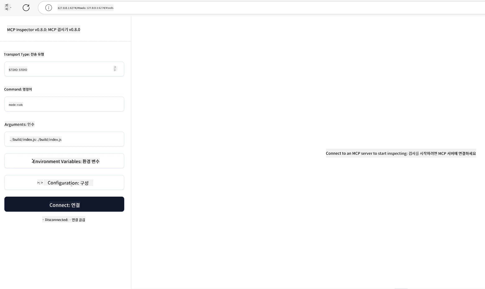

## 테스트 및 디버깅

MCP 서버 테스트를 시작하기 전에 사용 가능한 도구와 디버깅에 대한 모범 사례를 이해하는 것이 중요합니다. 효과적인 테스트는 서버가 예상대로 동작하는지 확인하고 문제를 신속하게 식별하고 해결하는 데 도움이 됩니다. 다음 섹션에서는 MCP 구현을 검증하기 위한 권장 접근 방식을 설명합니다.

## 개요

이 강의에서는 올바른 테스트 접근 방식을 선택하는 방법과 가장 효과적인 테스트 도구에 대해 다룹니다.

## 학습 목표

이 강의를 마치면 다음을 수행할 수 있습니다:

- 다양한 테스트 접근 방식을 설명할 수 있습니다.
- 다양한 도구를 사용하여 코드를 효과적으로 테스트할 수 있습니다.


## MCP 서버 테스트

MCP는 서버 테스트 및 디버깅을 돕기 위한 도구를 제공합니다:

- **MCP Inspector**: CLI 및 시각적 도구로 실행할 수 있는 명령줄 도구입니다.
- **수동 테스트**: curl 같은 도구를 사용하여 웹 요청을 실행할 수 있으며, HTTP를 실행할 수 있는 모든 도구가 가능합니다.
- **단위 테스트**: 선호하는 테스트 프레임워크를 사용하여 서버와 클라이언트 기능을 테스트할 수 있습니다.

### MCP Inspector 사용하기

이전 강의에서 이 도구 사용법을 설명했지만, 여기서 간략히 다루겠습니다. 이 도구는 Node.js로 만들어졌으며 `npx` 실행 파일을 호출하여 사용할 수 있습니다. 이 실행 파일은 도구를 임시로 다운로드 및 설치하고 요청 실행이 완료되면 자동으로 정리합니다.

[MCP Inspector](https://github.com/modelcontextprotocol/inspector)는 다음을 도와줍니다:

- **서버 기능 발견**: 사용 가능한 리소스, 도구 및 프롬프트를 자동으로 감지합니다.
- **도구 실행 테스트**: 다양한 매개변수를 시도하고 실시간으로 응답을 확인합니다.
- **서버 메타데이터 보기**: 서버 정보, 스키마, 구성을 살펴봅니다.

도구 실행 예시는 다음과 같습니다:

```bash
npx @modelcontextprotocol/inspector node build/index.js
```

위 명령어는 MCP와 시각적 인터페이스를 시작하고, 로컬 웹 인터페이스를 브라우저에 실행합니다. 등록된 MCP 서버, 사용 가능한 도구, 리소스, 프롬프트를 표시하는 대시보드를 볼 수 있습니다. 이 인터페이스를 통해 도구 실행을 대화식으로 테스트하고, 서버 메타데이터를 검사하며, 실시간 응답을 확인할 수 있어 MCP 서버 구현을 검증하고 디버깅하기가 더욱 용이합니다.

결과 화면 예시는 다음과 같습니다: 

또한 이 도구를 CLI 모드로 실행할 수 있는데, 이 경우 `--cli` 옵션을 추가합니다. 아래는 서버의 모든 도구를 나열하는 "CLI" 모드 실행 예시입니다:

```sh
npx @modelcontextprotocol/inspector --cli node build/index.js --method tools/list
```

### 수동 테스트

서버 기능을 테스트하기 위해 Inspector 도구 실행 외에도, curl 같은 HTTP 클라이언트를 사용하여 테스트할 수 있습니다.

curl을 사용하여 MCP 서버를 HTTP 요청으로 직접 테스트할 수 있습니다:

```bash
# 예시: 테스트 서버 메타데이터
curl http://localhost:3000/v1/metadata

# 예시: 도구 실행
curl -X POST http://localhost:3000/v1/tools/execute \
  -H "Content-Type: application/json" \
  -d '{"name": "calculator", "parameters": {"expression": "2+2"}}'
```

위 curl 사용 예시에서 볼 수 있듯이, 도구 이름과 매개변수로 구성된 페이로드를 POST 요청으로 보내 도구를 호출합니다. 자신에게 가장 적합한 방법을 사용하세요. 일반적으로 CLI 도구는 더 빠르고 스크립트 작성이 가능해 CI/CD 환경에서 유용합니다.

### 단위 테스트

도구와 리소스가 예상대로 작동하는지 확인하기 위해 단위 테스트를 작성하세요. 다음은 테스트 코드 예시입니다.

```python
import pytest

from mcp.server.fastmcp import FastMCP
from mcp.shared.memory import (
    create_connected_server_and_client_session as create_session,
)

# 비동기 테스트를 위해 전체 모듈 표시
pytestmark = pytest.mark.anyio


async def test_list_tools_cursor_parameter():
    """Test that the cursor parameter is accepted for list_tools.

    Note: FastMCP doesn't currently implement pagination, so this test
    only verifies that the cursor parameter is accepted by the client.
    """

 server = FastMCP("test")

    # 몇 가지 테스트 도구 생성
    @server.tool(name="test_tool_1")
    async def test_tool_1() -> str:
        """First test tool"""
        return "Result 1"

    @server.tool(name="test_tool_2")
    async def test_tool_2() -> str:
        """Second test tool"""
        return "Result 2"

    async with create_session(server._mcp_server) as client_session:
        # 커서 매개변수 없이 테스트(생략됨)
        result1 = await client_session.list_tools()
        assert len(result1.tools) == 2

        # cursor=None으로 테스트
        result2 = await client_session.list_tools(cursor=None)
        assert len(result2.tools) == 2

        # 문자열로 cursor 테스트
        result3 = await client_session.list_tools(cursor="some_cursor_value")
        assert len(result3.tools) == 2

        # 빈 문자열 커서로 테스트
        result4 = await client_session.list_tools(cursor="")
        assert len(result4.tools) == 2
    
```

위 코드는 다음을 수행합니다:

- pytest 프레임워크를 활용하여 테스트를 함수로 생성하고 assert 문을 사용합니다.
- 두 개의 다른 도구를 가진 MCP 서버를 생성합니다.
- 특정 조건이 충족되는지 `assert` 문으로 확인합니다.

[전체 파일 보기](https://github.com/modelcontextprotocol/python-sdk/blob/main/tests/client/test_list_methods_cursor.py)

위 파일을 참고하여 자신만의 서버가 기대하는 기능을 갖추었는지 테스트할 수 있습니다.

모든 주요 SDK에는 유사한 테스트 섹션이 있으므로 선택한 런타임에 맞게 조정할 수 있습니다.

## 샘플 

- [Java 계산기](../samples/java/calculator/README.md)
- [.Net 계산기](../../../../03-GettingStarted/samples/csharp)
- [JavaScript 계산기](../samples/javascript/README.md)
- [TypeScript 계산기](../samples/typescript/README.md)
- [Python 계산기](../../../../03-GettingStarted/samples/python) 

## 추가 자료

- [Python SDK](https://github.com/modelcontextprotocol/python-sdk)

## 다음 단계

- 다음: [배포](../09-deployment/README.md)

---

<!-- CO-OP TRANSLATOR DISCLAIMER START -->
**면책 조항**:
이 문서는 AI 번역 서비스 [Co-op Translator](https://github.com/Azure/co-op-translator)를 사용하여 번역되었습니다. 정확성을 기하기 위해 노력하고 있으나, 자동 번역은 오류나 부정확한 부분이 있을 수 있음을 유의하시기 바랍니다. 원본 문서의 원어본이 권위 있는 자료로 간주되어야 합니다. 중요한 정보의 경우, 전문가의 인간 번역을 권장합니다. 이 번역 사용으로 인해 발생하는 오해나 잘못된 해석에 대해 당사는 책임을 지지 않습니다.
<!-- CO-OP TRANSLATOR DISCLAIMER END -->