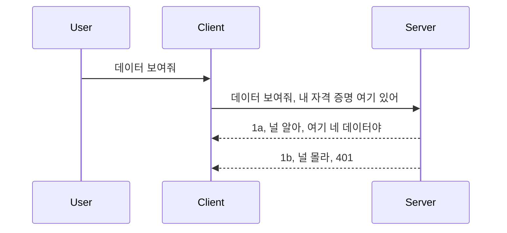

# Simple auth

MCP SDK는 OAuth 2.1의 사용을 지원합니다. 솔직히 말해서 OAuth는 인증 서버, 리소스 서버, 자격 증명 게시, 코드 획득, 코드를 베어러 토큰으로 교환하여 최종적으로 리소스 데이터를 얻는 과정과 같은 개념이 포함된 꽤 복잡한 프로세스입니다. OAuth에 익숙하지 않은 경우(이는 구현하기에 훌륭한 방법입니다) 기본적인 인증부터 시작하여 점점 더 나은 보안으로 구축하는 것이 좋습니다. 이 장이 존재하는 이유가 바로 고급 인증으로 도약할 수 있도록 돕기 위함입니다.

## 인증, 우리가 말하는 의미는?

인증은 인증(authentication)과 권한 부여(authorization)의 줄임말입니다. 여기서 두 가지를 수행해야 한다는 의미입니다:

- **인증(Authentication)**: 사용자가 우리 집에 들어올 권리가 있는지, 즉 MCP 서버 기능이 실행되는 리소스 서버에 접근할 권한이 있는지를 판단하는 과정입니다.
- **권한 부여(Authorization)**: 사용자가 요청하는 특정 리소스, 예를 들어 주문이나 제품, 또는 읽기만 허용되고 삭제는 불가한 콘텐츠에 접근할지 여부를 판단하는 과정입니다.

## 자격 증명: 시스템에 우리가 누구인지 알려주는 방법

대부분의 웹 개발자는 보통 서버에 제공하는 자격 증명, 즉 "여기에 있을 수 있는지"를 판단하는 비밀 정보를 생각합니다. 이 자격 증명은 일반적으로 사용자 이름과 비밀번호를 base64 인코딩한 것 또는 특정 사용자를 고유하게 식별하는 API 키입니다.

이것은 보통 다음과 같은 "Authorization" 헤더를 통해 전송됩니다:

```json
{ "Authorization": "secret123" }
```

이것을 일반적으로 기본 인증(basic authentication)이라고 합니다. 전체 흐름은 다음과 같이 진행됩니다:


흐름 관점에서 어떻게 작동하는지 이해했으니, 어떻게 구현할까요? 대부분의 웹 서버에는 요청 처리 중 자격 증명을 확인하고 유효하다면 요청을 통과시키는 미들웨어 개념이 있습니다. 자격 증명이 유효하지 않으면 인증 오류가 발생합니다. 구현 예제를 살펴보겠습니다:

**Python**

```python
class AuthMiddleware(BaseHTTPMiddleware):
    async def dispatch(self, request, call_next):

        has_header = request.headers.get("Authorization")
        if not has_header:
            print("-> Missing Authorization header!")
            return Response(status_code=401, content="Unauthorized")

        if not valid_token(has_header):
            print("-> Invalid token!")
            return Response(status_code=403, content="Forbidden")

        print("Valid token, proceeding...")
       
        response = await call_next(request)
        # 응답에 고객 헤더를 추가하거나 어떤 방식으로든 변경하세요
        return response


starlette_app.add_middleware(CustomHeaderMiddleware)
```

여기서는:

- `AuthMiddleware`라는 미들웨어를 만들었고, 웹 서버가 `dispatch` 메서드를 호출합니다.
- 웹 서버에 미들웨어를 추가했습니다:

    ```python
    starlette_app.add_middleware(AuthMiddleware)
    ```

- Authorization 헤더 존재 여부와 전달된 비밀키가 유효한지 검사하는 검증 로직을 작성했습니다:

    ```python
    has_header = request.headers.get("Authorization")
    if not has_header:
        print("-> Missing Authorization header!")
        return Response(status_code=401, content="Unauthorized")

    if not valid_token(has_header):
        print("-> Invalid token!")
        return Response(status_code=403, content="Forbidden")
    ```

    비밀키가 존재하고 유효하면 `call_next`를 호출해 요청을 통과시키고 응답을 반환합니다.

    ```python
    response = await call_next(request)
    # 응답에 고객 헤더를 추가하거나 어떤 방식으로든 변경하세요
    return response
    ```

이 작동 원리는 웹 요청이 서버로 들어오면 미들웨어가 호출되어 구현에 따라 요청을 통과시키거나 클라이언트가 진행할 수 없음을 알리는 오류를 반환하는 것입니다.

**TypeScript**

여기서는 인기 있는 프레임워크인 Express로 미들웨어를 만들고 MCP 서버에 도달하기 전에 요청을 가로챕니다. 코드 예시는 다음과 같습니다:

```typescript
function isValid(secret) {
    return secret === "secret123";
}

app.use((req, res, next) => {
    // 1. 권한 부여 헤더가 존재합니까?
    if(!req.headers["Authorization"]) {
        res.status(401).send('Unauthorized');
    }
    
    let token = req.headers["Authorization"];

    // 2. 유효성을 확인합니다.
    if(!isValid(token)) {
        res.status(403).send('Forbidden');
    }

   
    console.log('Middleware executed');
    // 3. 요청 파이프라인의 다음 단계로 요청을 전달합니다.
    next();
});
```

이 코드에서:

1. 우선 Authorization 헤더가 있는지 확인하고 없다면 401 오류를 전송합니다.
2. 자격 증명 또는 토큰이 유효한지 확인하고, 유효하지 않으면 403 오류를 전송합니다.
3. 마지막으로 요청 파이프라인에서 요청을 통과시키고 요청한 리소스를 반환합니다.

## 연습: 인증 구현하기

이제 배운 내용을 활용해 구현해 봅시다. 계획은 다음과 같습니다:

서버

- 웹 서버와 MCP 인스턴스를 생성합니다.
- 서버용 미들웨어를 구현합니다.

클라이언트

- 자격 증명과 함께 헤더를 통해 웹 요청을 전송합니다.

### -1- 웹 서버와 MCP 인스턴스 생성하기

첫 단계로 웹 서버 인스턴스와 MCP 서버를 생성해야 합니다.

**Python**

여기서는 MCP 서버 인스턴스를 만들고 starlette 웹 앱을 생성하여 uvicorn으로 호스트합니다.

```python
# MCP 서버 생성 중

app = FastMCP(
    name="MCP Resource Server",
    instructions="Resource Server that validates tokens via Authorization Server introspection",
    host=settings["host"],
    port=settings["port"],
    debug=True
)

# starlette 웹 앱 생성 중
starlette_app = app.streamable_http_app()

# uvicorn을 통해 앱 제공 중
async def run(starlette_app):
    import uvicorn
    config = uvicorn.Config(
            starlette_app,
            host=app.settings.host,
            port=app.settings.port,
            log_level=app.settings.log_level.lower(),
        )
    server = uvicorn.Server(config)
    await server.serve()

run(starlette_app)
```

이 코드에서는:

- MCP 서버를 생성합니다.
- MCP 서버에서 starlette 웹 앱을 `app.streamable_http_app()`으로 구성합니다.
- uvicorn의 `server.serve()`를 통해 웹 앱을 호스트하고 서비스합니다.

**TypeScript**

여기서는 MCP 서버 인스턴스를 생성합니다.

```typescript
const server = new McpServer({
      name: "example-server",
      version: "1.0.0"
    });

    // ... 서버 리소스, 도구 및 프롬프트 설정 ...
```

MCP 서버 생성은 POST /mcp 라우트 정의 내부에서 이뤄져야 하므로 위 코드를 다음과 같이 이동합니다:

```typescript
import express from "express";
import { randomUUID } from "node:crypto";
import { McpServer } from "@modelcontextprotocol/sdk/server/mcp.js";
import { StreamableHTTPServerTransport } from "@modelcontextprotocol/sdk/server/streamableHttp.js";
import { isInitializeRequest } from "@modelcontextprotocol/sdk/types.js"

const app = express();
app.use(express.json());

// 세션 ID별로 전송을 저장하는 맵
const transports: { [sessionId: string]: StreamableHTTPServerTransport } = {};

// 클라이언트-서버 통신을 위한 POST 요청 처리
app.post('/mcp', async (req, res) => {
  // 기존 세션 ID 확인
  const sessionId = req.headers['mcp-session-id'] as string | undefined;
  let transport: StreamableHTTPServerTransport;

  if (sessionId && transports[sessionId]) {
    // 기존 전송 재사용
    transport = transports[sessionId];
  } else if (!sessionId && isInitializeRequest(req.body)) {
    // 새로운 초기화 요청
    transport = new StreamableHTTPServerTransport({
      sessionIdGenerator: () => randomUUID(),
      onsessioninitialized: (sessionId) => {
        // 세션 ID별로 전송 저장
        transports[sessionId] = transport;
      },
      // DNS 리바인딩 보호는 하위 호환성을 위해 기본적으로 비활성화되어 있습니다. 이 서버를
      // 로컬에서 실행하는 경우 다음을 설정하세요:
      // enableDnsRebindingProtection: true,
      // allowedHosts: ['127.0.0.1'],
    });

    // 닫힐 때 전송 정리
    transport.onclose = () => {
      if (transport.sessionId) {
        delete transports[transport.sessionId];
      }
    };
    const server = new McpServer({
      name: "example-server",
      version: "1.0.0"
    });

    // ... 서버 리소스, 도구 및 프롬프트 설정 ...

    // MCP 서버에 연결
    await server.connect(transport);
  } else {
    // 잘못된 요청
    res.status(400).json({
      jsonrpc: '2.0',
      error: {
        code: -32000,
        message: 'Bad Request: No valid session ID provided',
      },
      id: null,
    });
    return;
  }

  // 요청 처리
  await transport.handleRequest(req, res, req.body);
});

// GET 및 DELETE 요청에 재사용 가능한 핸들러
const handleSessionRequest = async (req: express.Request, res: express.Response) => {
  const sessionId = req.headers['mcp-session-id'] as string | undefined;
  if (!sessionId || !transports[sessionId]) {
    res.status(400).send('Invalid or missing session ID');
    return;
  }
  
  const transport = transports[sessionId];
  await transport.handleRequest(req, res);
};

// SSE를 통한 서버-클라이언트 알림용 GET 요청 처리
app.get('/mcp', handleSessionRequest);

// 세션 종료를 위한 DELETE 요청 처리
app.delete('/mcp', handleSessionRequest);

app.listen(3000);
```

이제 MCP 서버 생성이 `app.post("/mcp")` 안으로 이동한 것을 확인할 수 있습니다.

다음 단계인 미들웨어 생성으로 넘어가서 들어오는 자격 증명을 검증해 봅시다.

### -2- 서버용 미들웨어 구현하기

다음은 미들웨어 부분입니다. `Authorization` 헤더에서 자격 증명을 찾아 검증하는 미들웨어를 만듭니다. 유효하면 요청이 계속 처리되어야 합니다(예: 도구 목록 보기, 리소스 읽기 또는 클라이언트가 요청한 MCP 기능 수행).

**Python**

미들웨어를 만들려면 `BaseHTTPMiddleware`를 상속받는 클래스를 생성해야 합니다. 두 가지 흥미로운 부분이 있습니다:

- 요청 객체 `request`에서 헤더 정보를 읽습니다.
- 자격 증명이 수락되면 호출해야 하는 콜백 `call_next`가 있습니다.

우선 `Authorization` 헤더가 없는 경우를 처리해야 합니다:

```python
has_header = request.headers.get("Authorization")

# 헤더가 없으면 401로 실패하고, 그렇지 않으면 계속 진행합니다.
if not has_header:
    print("-> Missing Authorization header!")
    return Response(status_code=401, content="Unauthorized")
```

여기서는 인증 실패이므로 401 권한 없음 메시지를 보냅니다.

다음으로 자격 증명이 제출되었으면 이를 검증해야 합니다:

```python
 if not valid_token(has_header):
    print("-> Invalid token!")
    return Response(status_code=403, content="Forbidden")
```

위에서는 403 접근 금지 메시지를 보내는 것을 확인할 수 있습니다. 아래는 앞서 설명한 모든 내용을 구현한 전체 미들웨어 코드입니다:

```python
class AuthMiddleware(BaseHTTPMiddleware):
    async def dispatch(self, request, call_next):

        has_header = request.headers.get("Authorization")
        if not has_header:
            print("-> Missing Authorization header!")
            return Response(status_code=401, content="Unauthorized")

        if not valid_token(has_header):
            print("-> Invalid token!")
            return Response(status_code=403, content="Forbidden")

        print("Valid token, proceeding...")
        print(f"-> Received {request.method} {request.url}")
        response = await call_next(request)
        response.headers['Custom'] = 'Example'
        return response

```

좋습니다. 그런데 `valid_token` 함수는 무엇일까요? 아래에 있습니다:

```python
# 프로덕션용으로 사용하지 마세요 - 개선하세요 !!
def valid_token(token: str) -> bool:
    # "Bearer " 접두사를 제거하세요
    if token.startswith("Bearer "):
        token = token[7:]
        return token == "secret-token"
    return False
```

분명히 개선이 필요합니다.

중요: 이런 비밀 정보는 결코 코드에 직접 포함해서는 안 됩니다. 이상적으로는 데이터 소스나 IDP(아이덴티티 서비스 제공자)에서 값을 불러와 비교하거나, 더 나아가 IDP가 검증을 수행하게 해야 합니다.

**TypeScript**

Express에서 이를 구현하려면 `use` 메서드에 미들웨어 함수를 넘겨야 합니다.

우리는:

- 요청 변수에서 `Authorization` 속성의 자격 증명을 확인합니다.
- 자격 증명을 검증하고 유효하면 요청이 계속 진행되도록 합니다(예: 도구 목록, 리소스 읽기, 기타 MCP 관련 작업 수행).

여기서는 `Authorization` 헤더가 있는지 확인하고, 없으면 요청을 중단합니다:

```typescript
if(!req.headers["authorization"]) {
    res.status(401).send('Unauthorized');
    return;
}
```

헤더가 전혀 없으면 401 오류가 발생합니다.

다음으로 자격 증명이 유효한지 확인하고 그렇지 않으면 다른 메시지로 요청을 중단합니다:

```typescript
if(!isValid(token)) {
    res.status(403).send('Forbidden');
    return;
} 
```

이때 403 오류가 발생합니다.

전체 코드는 다음과 같습니다:

```typescript
app.use((req, res, next) => {
    console.log('Request received:', req.method, req.url, req.headers);
    console.log('Headers:', req.headers["authorization"]);
    if(!req.headers["authorization"]) {
        res.status(401).send('Unauthorized');
        return;
    }
    
    let token = req.headers["authorization"];

    if(!isValid(token)) {
        res.status(403).send('Forbidden');
        return;
    }  

    console.log('Middleware executed');
    next();
});
```

웹 서버에 클라이언트가 전송하는 자격 증명을 확인하는 미들웨어를 설정했습니다. 클라이언트 측은 어떻게 할까요?

### -3- 헤더를 통해 자격 증명과 함께 웹 요청 보내기

클라이언트가 헤더를 통해 자격 증명을 전달해야 합니다. MCP 클라이언트를 사용하므로 전달 방법을 알아야 합니다.

**Python**

클라이언트에서는 다음과 같이 헤더에 자격 증명을 넣어야 합니다:

```python
# 값을 하드코딩하지 말고 최소한 환경 변수나 더 안전한 저장소에 보관하세요
token = "secret-token"

async with streamablehttp_client(
        url = f"http://localhost:{port}/mcp",
        headers = {"Authorization": f"Bearer {token}"}
    ) as (
        read_stream,
        write_stream,
        session_callback,
    ):
        async with ClientSession(
            read_stream,
            write_stream
        ) as session:
            await session.initialize()
      
            # TODO, 클라이언트에서 수행하고 싶은 작업, 예: 도구 목록 조회, 도구 호출 등
```

`headers` 속성을 `headers = {"Authorization": f"Bearer {token}"}`로 채운 것을 확인할 수 있습니다.

**TypeScript**

두 단계로 해결할 수 있습니다:

1. 자격 증명을 담은 구성 객체를 만듭니다.
2. 이 구성 객체를 트랜스포트에 전달합니다.

```typescript

// 여기처럼 값을 하드코딩하지 마세요. 최소한 환경 변수로 설정하고 개발 모드에서는 dotenv 같은 것을 사용하세요.
let token = "secret123"

// 클라이언트 전송 옵션 객체를 정의하세요
let options: StreamableHTTPClientTransportOptions = {
  sessionId: sessionId,
  requestInit: {
    headers: {
      "Authorization": "secret123"
    }
  }
};

// 옵션 객체를 전송에 전달하세요
async function main() {
   const transport = new StreamableHTTPClientTransport(
      new URL(serverUrl),
      options
   );
```

위에서 `options` 객체를 만들고 `requestInit` 속성에 헤더를 배치한 것을 볼 수 있습니다.

중요: 이 구현에는 문제점이 있습니다. 첫째, HTTPS를 최소한 갖추지 않으면 자격 증명을 보내는 것이 매우 위험합니다. 심지어 그게 보안되어 있더라도 자격 증명이 탈취될 수 있으므로, 토큰을 쉽게 취소할 수 있고 송신 위치, 요청 빈도(봇 행위 여부)와 같은 추가 점검이 필요합니다. 짧게 말해 여러 우려 사항이 존재합니다.

하지만, 아주 간단한 API로, 인증되지 않은 누군가가 내 API를 호출하지 못하게 하려면 이 방법도 좋은 출발점입니다.

이제 보안을 조금 더 강화해 JSON Web Token, 즉 JWT 혹은 "JOT" 토큰과 같은 표준화된 형식을 사용해 봅시다.

## JSON Web Tokens, JWT

기본 자격 증명을 보내는 방식을 개선하려고 합니다. JWT를 채택하면 얻는 즉각적인 개선점은 무엇일까요?

- **보안 향상**: 기본 인증에서 사용자 이름과 비밀번호를 base64 인코딩 토큰으로 계속 보내거나 API 키를 보내면 위험이 커집니다. JWT는 사용자 이름과 비밀번호를 보내고 토큰을 받는데, 이 토큰은 기간이 정해져 만료됩니다. JWT는 역할, 범위 및 권한을 사용해 세밀한 접근 제어를 쉽게 합니다.
- **무상태성과 확장성**: JWT는 자체 포함형으로 사용자 정보를 담고 있어 서버 측 세션 저장이 불필요합니다. 토큰을 로컬에서 검증할 수도 있습니다.
- **상호 운용성과 페더레이션**: JWT는 Open ID Connect의 중심이며 Entra ID, Google Identity, Auth0 등 잘 알려진 아이덴티티 제공자와 함께 사용됩니다. 싱글 사인온 등 다양한 엔터프라이즈급 기능이 가능합니다.
- **모듈성 및 유연성**: Azure API Management, NGINX 같은 API 게이트웨이와도 사용할 수 있으며 서버 간 통신, 위임 및 대리 기능도 지원합니다.
- **성능 및 캐싱**: JWT는 디코딩 후 캐시가 가능해 파싱 필요성을 줄입니다. 이는 트래픽이 많은 애플리케이션의 처리량 향상과 인프라 부하 감소에 도움이 됩니다.
- **고급 기능**: 인트로스펙션(서버에서 유효성 체크)과 토큰 무효화(취소) 기능도 지원합니다.

이 모든 이점을 살펴본 후, 우리가 구현한 인증을 한 단계 더 발전시키는 방법을 알아봅시다.

## 기본 인증에서 JWT로 전환하기

대략적인 변경사항은 다음과 같습니다:

- **JWT 토큰 만들기**: 클라이언트에서 서버로 보낼 수 있도록 토큰을 생성합니다.
- **JWT 토큰 검증**: 토큰이 유효하면 리소스 접근을 허용합니다.
- **토큰 안전하게 저장하기**: 토큰 저장 방식.
- **라우트 보호**: 라우트와 특정 MCP 기능 보호.
- **갱신 토큰 추가**: 짧은 수명 토큰과 만료 시 새 토큰을 얻기 위한 장기 갱신 토큰을 생성, 갱신 엔드포인트 및 회전 전략 구현.

### -1- JWT 토큰 생성하기

JWT 토큰은 다음 부분으로 구성됩니다:

- **헤더**: 사용 알고리즘과 토큰 타입.
- **페이로드**: 클레임(주체(sub, 토큰이 나타내는 사용자 또는 엔터티, 보통 사용자 ID), 만료 시간(exp), 역할(role) 등)
- **서명**: 비밀키나 개인키로 서명.

이를 위해 헤더, 페이로드, 인코딩된 토큰을 만들어야 합니다.

**Python**

```python

import jwt
import jwt
from jwt.exceptions import ExpiredSignatureError, InvalidTokenError
import datetime

# JWT 서명에 사용되는 비밀 키
secret_key = 'your-secret-key'

header = {
    "alg": "HS256",
    "typ": "JWT"
}

# 사용자 정보 및 해당 클레임과 만료 시간
payload = {
    "sub": "1234567890",               # 주체 (사용자 ID)
    "name": "User Userson",                # 사용자 정의 클레임
    "admin": True,                     # 사용자 정의 클레임
    "iat": datetime.datetime.utcnow(),# 발급 시각
    "exp": datetime.datetime.utcnow() + datetime.timedelta(hours=1)  # 만료 시각
}

# 인코딩하세요
encoded_jwt = jwt.encode(payload, secret_key, algorithm="HS256", headers=header)
```

위 코드에서:

- HS256 알고리즘과 JWT 타입으로 헤더를 정의했습니다.
- 주체(user id), 사용자 이름, 역할, 발급 시간 및 만료 시간 등 시간 제한 요소를 포함한 페이로드를 구성했습니다.

**TypeScript**

여기서는 JWT 토큰 생성에 도움이 될 몇 가지 의존성을 설치해야 합니다.

의존성

```sh

npm install jsonwebtoken
npm install --save-dev @types/jsonwebtoken
```

준비가 되었으니, 헤더와 페이로드를 만들어 인코딩된 토큰을 생성합시다.

```typescript
import jwt from 'jsonwebtoken';

const secretKey = 'your-secret-key'; // 프로덕션에서 환경 변수를 사용하세요

// 페이로드 정의
const payload = {
  sub: '1234567890',
  name: 'User usersson',
  admin: true,
  iat: Math.floor(Date.now() / 1000), // 발행 시간
  exp: Math.floor(Date.now() / 1000) + 60 * 60 // 1시간 후 만료
};

// 헤더 정의 (선택 사항, jsonwebtoken이 기본값 설정)
const header = {
  alg: 'HS256',
  typ: 'JWT'
};

// 토큰 생성
const token = jwt.sign(payload, secretKey, {
  algorithm: 'HS256',
  header: header
});

console.log('JWT:', token);
```

이 토큰은:

HS256 알고리즘으로 서명되었으며
유효 기간은 1시간
sub, name, admin, iat, exp 클레임을 포함합니다.

### -2- 토큰 검증하기

서버에서 클라이언트가 보낸 토큰이 실제 유효한지 확인해야 하므로 토큰을 검증해야 합니다. 구조, 유효성 등 여러 검증 작업이 필요하며, 시스템에 사용자가 존재하는지 등 추가 검사도 권장됩니다.

토큰을 검증하려면 먼저 디코딩부터 시작합니다.

**Python**

```python

# JWT를 디코딩하고 검증합니다
try:
    decoded = jwt.decode(token, secret_key, algorithms=["HS256"])
    print("✅ Token is valid.")
    print("Decoded claims:")
    for key, value in decoded.items():
        print(f"  {key}: {value}")
except ExpiredSignatureError:
    print("❌ Token has expired.")
except InvalidTokenError as e:
    print(f"❌ Invalid token: {e}")

```

`jwt.decode`를 호출해 토큰, 비밀키, 알고리즘을 인자로 넘깁니다. 유효하지 않을 경우 예외가 발생해 try-catch 블록으로 처리합니다.

**TypeScript**

`jwt.verify`를 호출해 디코딩된 토큰을 얻고 추가 분석합니다. 호출 실패 시 토큰 구조가 잘못됐거나 유효기간 만료를 뜻합니다.

```typescript

try {
  const decoded = jwt.verify(token, secretKey);
  console.log('Decoded Payload:', decoded);
} catch (err) {
  console.error('Token verification failed:', err);
}
```

참고: 위에서 언급했듯, 토큰을 받은 후 시스템의 사용자 존재 여부 및 권한 부여 여부 등 추가 검증을 수행해야 합니다.

다음으로는 역할 기반 접근 제어(RBAC, Role Based Access Control)를 살펴보겠습니다.
## 역할 기반 접근 제어 추가하기

여기서의 아이디어는 서로 다른 역할이 서로 다른 권한을 가진다는 것을 표현하는 것입니다. 예를 들어, 관리자는 모든 작업을 할 수 있고, 일반 사용자는 읽기/쓰기를 할 수 있으며, 게스트는 읽기만 할 수 있다고 가정합니다. 따라서, 가능한 권한 수준은 다음과 같습니다:

- Admin.Write  
- User.Read  
- Guest.Read  

미들웨어로 이러한 제어를 어떻게 구현할 수 있는지 살펴보겠습니다. 미들웨어는 경로별로 추가할 수도 있고 모든 경로에 대해 추가할 수도 있습니다.

**Python**

```python
from starlette.middleware.base import BaseHTTPMiddleware
from starlette.responses import JSONResponse
import jwt

# 비밀 정보를 코드에 직접 넣지 마세요. 이것은 시연 목적일 뿐입니다. 안전한 곳에서 읽어오세요.
SECRET_KEY = "your-secret-key" # 이것을 환경 변수에 넣으세요
REQUIRED_PERMISSION = "User.Read"

class JWTPermissionMiddleware(BaseHTTPMiddleware):
    async def dispatch(self, request, call_next):
        auth_header = request.headers.get("Authorization")
        if not auth_header or not auth_header.startswith("Bearer "):
            return JSONResponse({"error": "Missing or invalid Authorization header"}, status_code=401)

        token = auth_header.split(" ")[1]
        try:
            decoded = jwt.decode(token, SECRET_KEY, algorithms=["HS256"])
        except jwt.ExpiredSignatureError:
            return JSONResponse({"error": "Token expired"}, status_code=401)
        except jwt.InvalidTokenError:
            return JSONResponse({"error": "Invalid token"}, status_code=401)

        permissions = decoded.get("permissions", [])
        if REQUIRED_PERMISSION not in permissions:
            return JSONResponse({"error": "Permission denied"}, status_code=403)

        request.state.user = decoded
        return await call_next(request)


```
  
다음과 같이 미들웨어를 추가하는 몇 가지 다른 방법이 있습니다:

```python

# 대안 1: starlette 앱을 구성하는 동안 미들웨어 추가
middleware = [
    Middleware(JWTPermissionMiddleware)
]

app = Starlette(routes=routes, middleware=middleware)

# 대안 2: starlette 앱이 이미 구성된 후에 미들웨어 추가
starlette_app.add_middleware(JWTPermissionMiddleware)

# 대안 3: 경로별로 미들웨어 추가
routes = [
    Route(
        "/mcp",
        endpoint=..., # 핸들러
        middleware=[Middleware(JWTPermissionMiddleware)]
    )
]
```
  
**TypeScript**

`app.use`와 모든 요청에 대해 실행될 미들웨어를 사용할 수 있습니다.

```typescript
app.use((req, res, next) => {
    console.log('Request received:', req.method, req.url, req.headers);
    console.log('Headers:', req.headers["authorization"]);

    // 1. 인증 헤더가 전송되었는지 확인

    if(!req.headers["authorization"]) {
        res.status(401).send('Unauthorized');
        return;
    }
    
    let token = req.headers["authorization"];

    // 2. 토큰이 유효한지 확인
    if(!isValid(token)) {
        res.status(403).send('Forbidden');
        return;
    }  

    // 3. 토큰 사용자가 우리 시스템에 존재하는지 확인
    if(!isExistingUser(token)) {
        res.status(403).send('Forbidden');
        console.log("User does not exist");
        return;
    }
    console.log("User exists");

    // 4. 토큰에 올바른 권한이 있는지 검증
    if(!hasScopes(token, ["User.Read"])){
        res.status(403).send('Forbidden - insufficient scopes');
    }

    console.log("User has required scopes");

    console.log('Middleware executed');
    next();
});

```
  
미들웨어에서 해야 하는 것들이 꽤 많으며, 특히 미들웨어가 반드시 해야 하는 일은 다음과 같습니다:

1. Authorization 헤더가 있는지 확인  
2. 토큰이 유효한지 확인, `isValid`라는 메서드를 호출하는데 이 메서드는 JWT 토큰의 무결성과 유효성을 검사합니다.  
3. 사용자가 시스템에 존재하는지 확인, 반드시 확인해야 합니다.  

   ```typescript
    // DB의 사용자들
   const users = [
     "user1",
     "User usersson",
   ]

   function isExistingUser(token) {
     let decodedToken = verifyToken(token);

     // TODO, 사용자가 DB에 존재하는지 확인하기
     return users.includes(decodedToken?.name || "");
   }
   ```
  
   위에서 만든 아주 간단한 `users` 리스트는 당연히 데이터베이스에 있어야 합니다.

4. 추가로, 토큰이 적절한 권한을 가지고 있는지도 확인해야 합니다.

   ```typescript
   if(!hasScopes(token, ["User.Read"])){
        res.status(403).send('Forbidden - insufficient scopes');
   }
   ```
  
   위 미들웨어 코드에서, 토큰이 User.Read 권한을 포함하는지 확인하고, 그렇지 않으면 403 에러를 보냅니다. 아래는 `hasScopes` 헬퍼 메서드입니다.

   ```typescript
   function hasScopes(scope: string, requiredScopes: string[]) {
     let decodedToken = verifyToken(scope);
    return requiredScopes.every(scope => decodedToken?.scopes.includes(scope));
  }  
   ```

Have a think which additional checks you should be doing, but these are the absolute minimum of checks you should be doing.

Using Express as a web framework is a common choice. There are helpers library when you use JWT so you can write less code.

- `express-jwt`, helper library that provides a middleware that helps decode your token.
- `express-jwt-permissions`, this provides a middleware `guard` that helps check if a certain permission is on the token.

Here's what these libraries can look like when used:

```typescript
const express = require('express');
const jwt = require('express-jwt');
const guard = require('express-jwt-permissions')();

const app = express();
const secretKey = 'your-secret-key'; // put this in env variable

// Decode JWT and attach to req.user
app.use(jwt({ secret: secretKey, algorithms: ['HS256'] }));

// Check for User.Read permission
app.use(guard.check('User.Read'));

// multiple permissions
// app.use(guard.check(['User.Read', 'Admin.Access']));

app.get('/protected', (req, res) => {
  res.json({ message: `Welcome ${req.user.name}` });
});

// Error handler
app.use((err, req, res, next) => {
  if (err.code === 'permission_denied') {
    return res.status(403).send('Forbidden');
  }
  next(err);
});

```
  
미들웨어가 인증과 인가 모두에 어떻게 사용될 수 있는지 보셨습니다. MCP는 어떨까요? MCP에서 인증 방식이 달라지나요? 다음 섹션에서 알아봅시다.

### -3- MCP에 RBAC 추가하기

지금까지 미들웨어를 통해 어떻게 RBAC를 추가할 수 있는지 보았습니다. 그러나 MCP에 대해서는 기능별 RBAC를 쉽게 추가할 방법이 없기 때문에 어떻게 해야 할까요? 여기서는 클라이언트가 특정 도구를 호출할 권한이 있는지 검사하는 코드를 추가하는 방식을 사용합니다.

기능별 RBAC를 구현하는 방법에 대한 몇 가지 선택지가 있습니다:

- 권한 수준을 검사해야 하는 각 도구, 리소스, 프롬프트마다 검사를 추가합니다.

   **python**

   ```python
   @tool()
   def delete_product(id: int):
      try:
          check_permissions(role="Admin.Write", request)
      catch:
        pass # 클라이언트 인증 실패, 인증 오류 발생
   ```
  
   **typescript**

   ```typescript
   server.registerTool(
    "delete-product",
    {
      title: Delete a product",
      description: "Deletes a product",
      inputSchema: { id: z.number() }
    },
    async ({ id }) => {
      
      try {
        checkPermissions("Admin.Write", request);
        // 할 일, id를 productService와 remote entry로 전송하기
      } catch(Exception e) {
        console.log("Authorization error, you're not allowed");  
      }

      return {
        content: [{ type: "text", text: `Deletected product with id ${id}` }]
      };
    }
   );
   ```
  

- 고급 서버 방식을 사용하고 요청 핸들러를 활용하여 검사해야 하는 위치를 최소화합니다.

   **Python**

   ```python
   
   tool_permission = {
      "create_product": ["User.Write", "Admin.Write"],
      "delete_product": ["Admin.Write"]
   }

   def has_permission(user_permissions, required_permissions) -> bool:
      # user_permissions: 사용자가 가진 권한 목록
      # required_permissions: 도구에 필요한 권한 목록
      return any(perm in user_permissions for perm in required_permissions)

   @server.call_tool()
   async def handle_call_tool(
     name: str, arguments: dict[str, str] | None
   ) -> list[types.TextContent]:
    # request.user.permissions는 사용자의 권한 목록이라고 가정
     user_permissions = request.user.permissions
     required_permissions = tool_permission.get(name, [])
     if not has_permission(user_permissions, required_permissions):
        # "도구 {name}을 호출할 권한이 없습니다" 오류 발생
        raise Exception(f"You don't have permission to call tool {name}")
     # 계속 진행하여 도구 호출
     # ...
   ```   
     

   **TypeScript**

   ```typescript
   function hasPermission(userPermissions: string[], requiredPermissions: string[]): boolean {
       if (!Array.isArray(userPermissions) || !Array.isArray(requiredPermissions)) return false;
       // 사용자가 적어도 하나 이상의 필수 권한을 가지고 있으면 true를 반환합니다
       
       return requiredPermissions.some(perm => userPermissions.includes(perm));
   }
  
   server.setRequestHandler(CallToolRequestSchema, async (request) => {
      const { params: { name } } = request;
  
      let permissions = request.user.permissions;
  
      if (!hasPermission(permissions, toolPermissions[name])) {
         return new Error(`You don't have permission to call ${name}`);
      }
  
      // 계속 진행하세요..
   });
   ```
  
   참고로, 위 코드가 간단해지려면 미들웨어가 디코딩된 토큰을 요청의 user 속성에 할당해야 합니다.

### 요약

일반적인 RBAC 지원 추가와 특히 MCP에 대한 RBAC 추가 방법을 논의했으니, 이번에는 여러분이 직접 보안 구현을 시도해 보면서 제시한 개념을 잘 이해했는지 확인할 차례입니다.

## 과제 1: 기본 인증을 사용하여 mcp 서버와 mcp 클라이언트 구축하기

여기서는 헤더를 통해 자격 증명을 전송하는 방법에 대해 배운 내용을 활용합니다.

## 솔루션 1

[Solution 1](./code/basic/README.md)

## 과제 2: 과제 1의 솔루션을 JWT를 사용하도록 업그레이드하기

첫 번째 솔루션을 가져와서 이번에는 향상시켜 봅시다.

기본 인증 대신 JWT를 사용합시다.

## 솔루션 2

[Solution 2](./solution/jwt-solution/README.md)

## 도전 과제

"Add RBAC to MCP" 섹션에서 설명한 것처럼 도구별 RBAC를 추가하세요.

## 요약

이번 장에서 전혀 보안이 없는 상태에서 기본 보안, JWT, 그리고 JWT가 MCP에 어떻게 추가될 수 있는지까지 많은 것을 배웠기를 바랍니다.

커스텀 JWT를 사용해 견고한 기반을 구축했지만, 우리가 확장할수록 표준 기반의 아이덴티티 모델로 이동하고 있습니다. Entra나 Keycloak 같은 IdP를 도입하면 토큰 발급, 검증, 수명 관리 작업을 신뢰할 수 있는 플랫폼에 위임할 수 있어서, 앱의 로직과 사용자 경험에 더 집중할 수 있습니다.

이를 위해 [Entra에 관한 더 고급 장](../../05-AdvancedTopics/mcp-security-entra/README.md)가 준비되어 있습니다.

## 다음 단계

- 다음: [MCP 호스트 설정하기](../12-mcp-hosts/README.md)

---

<!-- CO-OP TRANSLATOR DISCLAIMER START -->
**면책 조항**:  
이 문서는 AI 번역 서비스 [Co-op Translator](https://github.com/Azure/co-op-translator)를 사용하여 번역되었습니다. 정확성을 위해 노력하고 있으나, 자동 번역은 오류나 부정확성이 포함될 수 있음을 양지해 주시기 바랍니다. 원본 문서는 해당 언어의 원전이 권위 있는 출처로 간주되어야 합니다. 중요한 정보에 대해서는 전문적인 인간 번역을 권장합니다. 본 번역 사용으로 인해 발생하는 오해나 잘못된 해석에 대해 당사는 책임을 지지 않습니다.
<!-- CO-OP TRANSLATOR DISCLAIMER END -->