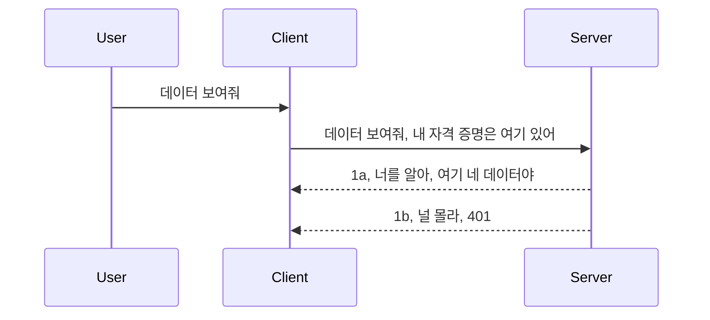

# 간단한 인증

MCP SDK는 OAuth 2.1 사용을 지원하는데, 솔직히 말해 인증 서버, 리소스 서버, 자격 증명 전송, 코드 받기, 그 코드를 베어러 토큰으로 교환하여 최종적으로 리소스 데이터를 얻는 것과 같은 개념을 포함하는 꽤 복잡한 과정입니다. OAuth에 익숙하지 않다면 구현하기 훌륭한 시스템이지만, 기본적인 수준의 인증부터 시작하여 점점 더 나은 보안으로 발전시키는 것이 좋습니다. 이 장은 여러분을 더 고급 인증으로 이끌기 위해 존재합니다.

## 인증, 우리가 의미하는 것?

인증은 authentication과 authorization의 줄임말입니다. 여기서 해야 할 두 가지는:

- **인증(Authentication)**, 즉 어떤 사람이 우리 집에 들어올 권한이 있는지, 즉 우리가 보유한 MCP 서버 기능이 있는 리소스 서버에 접근할 권한이 있는지를 확인하는 과정입니다.
- **인가(Authorization)**, 사용자가 요청하는 특정 리소스, 예를 들어 주문 혹은 상품에 접근 권한이 있는지, 또는 읽기만 가능하고 삭제는 불가능한지 등 접근 권한을 확인하는 과정입니다.

## 자격 증명: 시스템에 우리가 누구인지 알리는 방법

대부분의 웹 개발자는 보통 서버에 제공할 자격 증명, 즉 자신이 여기에 있을 수 있는지 말해 주는 비밀을 생각합니다. 이 자격 증명은 보통 사용자 이름과 비밀번호를 base64로 인코딩한 것 혹은 특정 사용자를 고유하게 식별하는 API 키입니다.

이 자격 증명은 "Authorization"이라는 헤더를 통해 이렇게 전송됩니다:

```json
{ "Authorization": "secret123" }
```

보통 이를 기본 인증(basic authentication)이라고 합니다. 전체 흐름은 다음과 같습니다:


```mermaid
sequenceDiagram
   participant User
   participant Client
   participant Server

   User->>Client: 데이터 보여줘
   Client->>Server: 데이터 보여줘, 내 자격 증명은 여기 있어
   Server-->>Client: 1a, 너를 알아, 여기 네 데이터야
   Server-->>Client: 1b, 널 몰라, 401 
```

흐름을 이해했으니, 어떻게 구현할까요? 대부분의 웹 서버에는 미들웨어라는 개념이 있어서, 요청의 일부로 실행되어 자격 증명을 검증하며, 유효하다면 요청을 통과시킵니다. 유효하지 않다면 인증 오류가 발생합니다. 구현은 다음과 같습니다:

**Python**

```python
class AuthMiddleware(BaseHTTPMiddleware):
    async def dispatch(self, request, call_next):

        has_header = request.headers.get("Authorization")
        if not has_header:
            print("-> Missing Authorization header!")
            return Response(status_code=401, content="Unauthorized")

        if not valid_token(has_header):
            print("-> Invalid token!")
            return Response(status_code=403, content="Forbidden")

        print("Valid token, proceeding...")
       
        response = await call_next(request)
        # 응답에 고객 헤더를 추가하거나 어떤 방식으로든 변경하십시오
        return response


starlette_app.add_middleware(CustomHeaderMiddleware)
```

여기에는:

- `AuthMiddleware`라는 미들웨어를 생성하고, `dispatch` 메서드가 웹 서버에 의해 호출됩니다.
- 미들웨어를 웹 서버에 추가했습니다:

    ```python
    starlette_app.add_middleware(AuthMiddleware)
    ```

- Authorization 헤더가 있는지 확인하고, 전송된 비밀이 유효한지 검사하는 검증 로직 작성:

    ```python
    has_header = request.headers.get("Authorization")
    if not has_header:
        print("-> Missing Authorization header!")
        return Response(status_code=401, content="Unauthorized")

    if not valid_token(has_header):
        print("-> Invalid token!")
        return Response(status_code=403, content="Forbidden")
    ```

    비밀이 존재하고 유효하다면, `call_next`를 호출하여 요청을 통과시키고 응답을 반환합니다.

    ```python
    response = await call_next(request)
    # 응답에 고객 헤더를 추가하거나 어떤 식으로든 변경하십시오
    return response
    ```

웹 요청이 서버로 들어오면 미들웨어가 호출되어 요청을 통과시키거나 클라이언트가 진행할 수 없음을 나타내는 오류를 반환합니다.

**TypeScript**

Express라는 인기 프레임워크로 미들웨어를 만들고 요청이 MCP 서버에 도달하기 전에 가로챕니다. 코드 예시는 다음과 같습니다:

```typescript
function isValid(secret) {
    return secret === "secret123";
}

app.use((req, res, next) => {
    // 1. 인증 헤더가 존재합니까?
    if(!req.headers["Authorization"]) {
        res.status(401).send('Unauthorized');
    }
    
    let token = req.headers["Authorization"];

    // 2. 유효성을 검사합니다.
    if(!isValid(token)) {
        res.status(403).send('Forbidden');
    }

   
    console.log('Middleware executed');
    // 3. 요청을 요청 파이프라인의 다음 단계로 전달합니다.
    next();
});
```

이 코드에서는:

1. 먼저 Authorization 헤더가 있는지 확인하고 없으면 401 오류를 보냅니다.
2. 자격 증명/토큰이 유효한지 확인하고, 그렇지 않으면 403 오류를 보냅니다.
3. 마지막으로 요청 파이프라인에 요청을 전달하여 요청된 리소스를 반환합니다.

## 연습: 인증 구현하기

이제 배운 내용을 바탕으로 구현해봅시다. 계획은 다음과 같습니다:

서버

- 웹 서버와 MCP 인스턴스를 생성합니다.
- 서버용 미들웨어를 구현합니다.

클라이언트

- 헤더를 통해 자격 증명과 함께 웹 요청을 보냅니다.

### -1- 웹 서버와 MCP 인스턴스 생성

> [!WARNING]
> 아래 TypeScript 예제는 MCP `2025-11-25` 버전을 대상으로 하며,
> `mcp-session-id` 기반 전송 방식을 추적합니다. 이는 현재 `2026-07-28` 버전 전송 예제가 아닙니다. MCP
> `2026-07-28` 버전에서는 `initialize` 핸드셰이크 및 프로토콜 세션 ID가 제거되었으며,
> 새 구현은 자체 포함형 요청을 사용합니다. 자세한 내용은
> [MCP 변경사항: 2026-07-28 사양](../../01-CoreConcepts/mcp-2026-07-28.md)을 참조하세요.

첫 단계로 웹 서버 인스턴스와 MCP 서버를 생성해야 합니다.

**Python**

여기서는 MCP 서버 인스턴스를 생성하고 starlette 웹 앱을 만들어 uvicorn으로 호스팅합니다.

```python
# MCP 서버 생성 중

app = FastMCP(
    name="MCP Resource Server",
    instructions="Resource Server that validates tokens via Authorization Server introspection",
    host=settings["host"],
    port=settings["port"],
    debug=True
)

# starlette 웹 앱 생성 중
starlette_app = app.streamable_http_app()

# uvicorn을 통해 앱 제공 중
async def run(starlette_app):
    import uvicorn
    config = uvicorn.Config(
            starlette_app,
            host=app.settings.host,
            port=app.settings.port,
            log_level=app.settings.log_level.lower(),
        )
    server = uvicorn.Server(config)
    await server.serve()

run(starlette_app)
```

이 코드에서는:

- MCP 서버를 생성합니다.
- MCP 서버에서 starlette 웹 앱을 구성하는 `app.streamable_http_app()`을 사용합니다.
- uvicorn을 이용해 웹 앱을 호스팅하고 서버를 실행합니다 `server.serve()`.

**TypeScript**

여기서는 MCP 서버 인스턴스를 생성합니다.

```typescript
const server = new McpServer({
      name: "example-server",
      version: "1.0.0"
    });

    // ... 서버 자원, 도구 및 프롬프트 설정 ...
```

이 MCP 서버 생성은 POST /mcp 라우트 정의 내에서 이뤄져야 하므로, 위 코드를 옮기면 다음과 같습니다:

```typescript
import express from "express";
import { randomUUID } from "node:crypto";
import { McpServer } from "@modelcontextprotocol/sdk/server/mcp.js";
import { StreamableHTTPServerTransport } from "@modelcontextprotocol/sdk/server/streamableHttp.js";
import { isInitializeRequest } from "@modelcontextprotocol/sdk/types.js"

const app = express();
app.use(express.json());

// 세션 ID별 전송 수단을 저장하는 맵
const transports: { [sessionId: string]: StreamableHTTPServerTransport } = {};

// 클라이언트에서 서버로의 통신을 위한 POST 요청 처리
app.post('/mcp', async (req, res) => {
  // 기존 세션 ID 확인
  const sessionId = req.headers['mcp-session-id'] as string | undefined;
  let transport: StreamableHTTPServerTransport;

  if (sessionId && transports[sessionId]) {
    // 기존 전송 수단 재사용
    transport = transports[sessionId];
  } else if (!sessionId && isInitializeRequest(req.body)) {
    // 새로운 초기화 요청
    transport = new StreamableHTTPServerTransport({
      sessionIdGenerator: () => randomUUID(),
      onsessioninitialized: (sessionId) => {
        // 세션 ID별 전송 수단 저장
        transports[sessionId] = transport;
      },
      // DNS 리바인딩 보호는 이전 버전과의 호환성을 위해 기본적으로 비활성화되어 있습니다. 이 서버를
      // 로컬에서 실행하는 경우, 다음을 설정해야 합니다:
      // enableDnsRebindingProtection: true,
      // allowedHosts: ['127.0.0.1'],
    });

    // 종료 시 전송 수단 정리
    transport.onclose = () => {
      if (transport.sessionId) {
        delete transports[transport.sessionId];
      }
    };
    const server = new McpServer({
      name: "example-server",
      version: "1.0.0"
    });

    // ... 서버 리소스, 도구 및 프롬프트 설정 ...

    // MCP 서버에 연결
    await server.connect(transport);
  } else {
    // 잘못된 요청
    res.status(400).json({
      jsonrpc: '2.0',
      error: {
        code: -32000,
        message: 'Bad Request: No valid session ID provided',
      },
      id: null,
    });
    return;
  }

  // 요청 처리
  await transport.handleRequest(req, res, req.body);
});

// GET 및 DELETE 요청을 위한 재사용 가능한 핸들러
const handleSessionRequest = async (req: express.Request, res: express.Response) => {
  const sessionId = req.headers['mcp-session-id'] as string | undefined;
  if (!sessionId || !transports[sessionId]) {
    res.status(400).send('Invalid or missing session ID');
    return;
  }
  
  const transport = transports[sessionId];
  await transport.handleRequest(req, res);
};

// SSE를 통한 서버-클라이언트 알림용 GET 요청 처리
app.get('/mcp', handleSessionRequest);

// 세션 종료를 위한 DELETE 요청 처리
app.delete('/mcp', handleSessionRequest);

app.listen(3000);
```

이제 MCP 서버 생성이 `app.post("/mcp")` 내부로 이동된 것을 볼 수 있습니다.

다음 단계는 들어오는 자격 증명을 검증하기 위한 미들웨어를 만드는 것입니다.

### -2- 서버용 미들웨어 구현

다음으로 미들웨어 부분입니다. 여기서는 `Authorization` 헤더에서 자격 증명을 찾아 검증하는 미들웨어를 만듭니다. 자격 증명이 적합하면 요청은 MCP 기능(예: 도구 목록 조회, 리소스 읽기 등)을 수행하도록 진행됩니다.

**Python**

미들웨어를 만들려면 `BaseHTTPMiddleware`를 상속하는 클래스를 생성해야 합니다. 주의할 점은 다음 두 가지입니다:

- 헤더 정보를 읽는 요청 `request`
- 클라이언트가 수락할 자격 증명을 가져왔다면 호출해야 하는 콜백 `call_next`

먼저 `Authorization` 헤더가 없을 때를 처리합니다:

```python
has_header = request.headers.get("Authorization")

# 헤더가 없으면 401 에러로 실패하고, 아니면 계속 진행합니다.
if not has_header:
    print("-> Missing Authorization header!")
    return Response(status_code=401, content="Unauthorized")
```

클라이언트가 인증에 실패했으므로 401 인증 실패 메시지를 보냅니다.

다음으로, 자격 증명이 제출되었다면 유효성을 이렇게 확인합니다:

```python
 if not valid_token(has_header):
    print("-> Invalid token!")
    return Response(status_code=403, content="Forbidden")
```

위에서 403 금지 메시지를 보내는 방식에 주목하세요. 아래는 위 내용을 전부 구현한 완전한 미들웨어입니다:

```python
class AuthMiddleware(BaseHTTPMiddleware):
    async def dispatch(self, request, call_next):

        has_header = request.headers.get("Authorization")
        if not has_header:
            print("-> Missing Authorization header!")
            return Response(status_code=401, content="Unauthorized")

        if not valid_token(has_header):
            print("-> Invalid token!")
            return Response(status_code=403, content="Forbidden")

        print("Valid token, proceeding...")
        print(f"-> Received {request.method} {request.url}")
        response = await call_next(request)
        response.headers['Custom'] = 'Example'
        return response

```

좋습니다. 그런데 `valid_token` 함수는 무엇일까요? 아래에 있습니다:

```python
# 프로덕션 환경에서는 사용하지 마세요 - 개선하세요 !!
def valid_token(token: str) -> bool:
    # "Bearer " 접두사를 제거하세요
    if token.startswith("Bearer "):
        token = token[7:]
        return token == "secret-token"
    return False
```

이는 명백히 개선되어야 합니다.

중요: 이런 비밀은 코드에 절대 포함하면 안 됩니다. 비교할 값은 ideally 데이터 소스나 IDP(신원 제공자)에서 가져오거나, 더 나아가서는 IDP 자체에 검증을 맡기는 것이 좋습니다.

**TypeScript**

Express로 구현하려면 미들웨어 함수를 받는 `use` 메서드를 호출해야 합니다.


우리는 다음을 해야 합니다:

- `Authorization` 속성에 전달된 자격 증명을 확인하기 위해 요청 변수를 상호작용합니다.
- 자격 증명을 검증하고, 유효하다면 요청을 계속 진행시켜 클라이언트의 MCP 요청이 해야 할 일을 수행하도록 합니다(예: 도구 목록 가져오기, 리소스 읽기 또는 기타 MCP 관련 작업).

여기서는 `Authorization` 헤더가 존재하는지 확인하며, 없으면 요청을 중단합니다:

```typescript
if(!req.headers["authorization"]) {
    res.status(401).send('Unauthorized');
    return;
}
```

만약 처음부터 헤더가 전송되지 않으면 401 오류를 받게 됩니다.

다음으로 자격 증명이 유효한지 확인하며, 유효하지 않으면 다시 요청을 중단하되 약간 다른 메시지를 보냅니다:

```typescript
if(!isValid(token)) {
    res.status(403).send('Forbidden');
    return;
} 
```

여기서는 403 오류를 받게 되는 것을 볼 수 있습니다.

전체 코드는 다음과 같습니다:

```typescript
app.use((req, res, next) => {
    console.log('Request received:', req.method, req.url, req.headers);
    console.log('Headers:', req.headers["authorization"]);
    if(!req.headers["authorization"]) {
        res.status(401).send('Unauthorized');
        return;
    }
    
    let token = req.headers["authorization"];

    if(!isValid(token)) {
        res.status(403).send('Forbidden');
        return;
    }  

    console.log('Middleware executed');
    next();
});
```

우리는 웹 서버를 설정하여 클라이언트가 보내려고 하는 자격 증명을 검사하는 미들웨어를 수락하도록 했습니다. 그렇다면 클라이언트는 어떨까요?

### -3- 헤더를 통해 자격 증명이 포함된 웹 요청 보내기

클라이언트가 헤더를 통해 자격 증명을 전달하는지 확인해야 합니다. MCP 클라이언트를 사용할 것이므로 어떻게 하는지 알아야 합니다.

**Python**

클라이언트의 경우 다음과 같이 자격 증명과 함께 헤더를 전달해야 합니다:

```python
# 값을 하드코딩하지 말고 최소한 환경 변수나 더 안전한 저장소에 보관하세요
token = "secret-token"

async with streamablehttp_client(
        url = f"http://localhost:{port}/mcp",
        headers = {"Authorization": f"Bearer {token}"}
    ) as (
        read_stream,
        write_stream,
        session_callback,
    ):
        async with ClientSession(
            read_stream,
            write_stream
        ) as session:
            await session.initialize()
      
            # TODO, 클라이언트에서 수행하고 싶은 작업, 예를 들어 도구 목록 나열, 도구 호출 등
```

`headers` 속성을 이렇게 채우는 것을 볼 수 있습니다 ` headers = {"Authorization": f"Bearer {token}"}`.

**TypeScript**

이를 두 단계로 해결할 수 있습니다:

1. 구성 객체에 자격 증명을 채웁니다.
2. 구성 객체를 transport에 전달합니다.

```typescript

// 여기처럼 값을 하드코딩하지 마세요. 최소한 환경 변수로 설정하고 개발 모드에서는 dotenv와 같은 것을 사용하세요.
let token = "secret123"

// 클라이언트 전송 옵션 객체를 정의하세요
let options: StreamableHTTPClientTransportOptions = {
  sessionId: sessionId,
  requestInit: {
    headers: {
      "Authorization": "secret123"
    }
  }
};

// 옵션 객체를 전송에 전달하세요
async function main() {
   const transport = new StreamableHTTPClientTransport(
      new URL(serverUrl),
      options
   );
```

위 코드에서는 `options` 객체를 만들어 헤더를 `requestInit` 속성 아래에 배치했습니다.

중요: 여기서 어떻게 개선할 수 있을까요? 현재 구현에는 몇 가지 문제가 있습니다. 무엇보다 자격 증명을 이렇게 전달하는 것은 최소한 HTTPS가 아니면 꽤 위험합니다. 설령 HTTPS라도 자격 증명이 탈취될 수 있으므로 토큰을 쉽게 취소할 수 있는 시스템과 요청이 너무 자주 발생하는지(bot 같은 행동) 등 다양한 검사와 함께 출처 위치 검사 같은 추가적인 검사를 마련해야 합니다.

하지만 매우 간단한 API에서 인증 없이 누구도 API를 호출하지 못하게 하려면 여기서 설명한 방법이 좋은 출발점입니다.

그렇다면 JSON 웹 토큰, 즉 JWT 또는 "JOT" 토큰과 같은 표준화된 포맷을 사용해 보안을 조금 더 강화해 봅시다.

## JSON 웹 토큰, JWT

간단한 자격 증명에서 개선을 시도하는데, JWT를 채택하면 어떤 즉각적인 이점이 있을까요?

- **보안 개선**. 기본 인증에서는 사용자 이름과 비밀번호를 base64로 인코딩한 토큰(또는 API 키)을 반복적으로 보내서 위험이 증가합니다. JWT는 사용자 이름과 비밀번호를 보내고 토큰을 받아서 사용하며, 토큰은 시간 제한이 있어 만료됩니다. JWT는 역할, 범위, 권한 등을 사용하는 정밀한 접근 제어가 가능합니다.
- **무상태성과 확장성**. JWT는 자체 포함되어 있어 모든 사용자 정보를 담고 서버 측 세션 저장소가 필요 없습니다. 토큰은 로컬에서도 검증할 수 있습니다.
- **상호운용성과 연합**. JWT는 Open ID Connect의 중심이며 Entra ID, Google Identity, Auth0 같은 알려진 ID 공급자와 함께 사용됩니다. 싱글 사인온과 기타 엔터프라이즈 급 기능도 지원합니다.
- **모듈성 및 유연성**. JWT는 Azure API Management, NGINX 등 API 게이트웨이와 함께 사용할 수 있습니다. 인증 시나리오와 서비스 간 통신, 대리 및 위임 시나리오도 지원합니다.
- **성능 및 캐싱**. JWT는 디코딩 후 캐시할 수 있어서 구문 분석 필요를 줄입니다. 이는 특히 트래픽이 많은 앱에서 처리량을 높이고 인프라 부하를 줄이는 데 도움 됩니다.
- **고급 기능**. introspection(서버에서 유효성 검사)과 취소(토큰 무효화)도 지원합니다.

이러한 모든 이점을 통해, 구현을 다음 단계로 끌어올리는 방법을 살펴봅시다.

## 기본 인증을 JWT로 전환하기

큰 그림에서 필요한 변경 사항은 다음과 같습니다:

- **JWT 토큰을 구성하는 방법을 배우고** 클라이언트에서 서버로 보낼 준비를 합니다.
- **JWT 토큰을 검증하고**, 유효하면 클라이언트가 자원을 사용할 수 있게 합니다.
- **토큰을 안전하게 저장하는 방법**.
- **라우트를 보호하는 방법**. 우리 경우는 라우트와 특정 MCP 기능을 보호해야 합니다.
- **갱신 토큰 추가**. 짧은 수명의 토큰과 만료 시 새 토큰을 얻는 데 사용하는 긴 수명의 갱신 토큰을 만들고, 갱신 엔드포인트와 회전 전략을 마련합니다.

### -1- JWT 토큰 구성하기

먼저, JWT 토큰은 다음 부분으로 구성됩니다:

- <strong>헤더</strong>, 사용된 알고리즘과 토큰 타입
- <strong>페이로드</strong>, sub(토큰이 대표하는 사용자 또는 엔터티, 인증 시 보통 사용자 ID), exp(만료 시간), role(역할) 같은 클레임
- <strong>서명</strong>, 비밀키나 개인키로 서명됨

이를 위해 헤더, 페이로드와 인코딩된 토큰을 구성해야 합니다.

**Python**

```python

import jwt
import jwt
from jwt.exceptions import ExpiredSignatureError, InvalidTokenError
import datetime

# JWT 서명에 사용되는 비밀 키
secret_key = 'your-secret-key'

header = {
    "alg": "HS256",
    "typ": "JWT"
}

# 사용자 정보와 클레임 및 만료 시간
payload = {
    "sub": "1234567890",               # 주제 (사용자 ID)
    "name": "User Userson",                # 사용자 정의 클레임
    "admin": True,                     # 사용자 정의 클레임
    "iat": datetime.datetime.utcnow(),# 발급 시간
    "exp": datetime.datetime.utcnow() + datetime.timedelta(hours=1)  # 만료 시간
}

# 인코딩하기
encoded_jwt = jwt.encode(payload, secret_key, algorithm="HS256", headers=header)
```

위 코드에서 우리는:

- HS256를 알고리즘으로, 토큰 유형을 JWT로 지정한 헤더를 정의했습니다.
- 주제(subject) 또는 사용자 ID, 사용자 이름, 역할, 발급 시간과 만료 시간이 포함된 페이로드를 구성하여 앞서 언급한 시간 제한 측면을 구현했습니다.

**TypeScript**

여기서는 JWT 토큰 구성을 도와줄 몇 가지 종속성을 사용합니다.

종속성

```sh

npm install jsonwebtoken
npm install --save-dev @types/jsonwebtoken
```

이제 준비가 되었으니 헤더, 페이로드를 만들고 이를 통해 인코딩된 토큰을 생성해 봅시다.

```typescript
import jwt from 'jsonwebtoken';

const secretKey = 'your-secret-key'; // 프로덕션에서 환경 변수를 사용하세요

// 페이로드 정의
const payload = {
  sub: '1234567890',
  name: 'User usersson',
  admin: true,
  iat: Math.floor(Date.now() / 1000), // 발행 시간
  exp: Math.floor(Date.now() / 1000) + 60 * 60 // 1시간 후 만료
};

// 헤더 정의 (선택 사항, jsonwebtoken이 기본값 설정)
const header = {
  alg: 'HS256',
  typ: 'JWT'
};

// 토큰 생성
const token = jwt.sign(payload, secretKey, {
  algorithm: 'HS256',
  header: header
});

console.log('JWT:', token);
```

이 토큰은:

HS256으로 서명됨
1시간 유효함
sub, name, admin, iat, exp 등의 클레임을 포함함

### -2- 토큰 검증하기

토큰 검증도 필요합니다. 이는 클라이언트가 보내는 것이 실제로 유효한지 서버 측에서 확인하기 위한 것입니다. 구조 검증부터 유효성 검사까지 여러 검사를 해야 합니다. 사용자가 시스템에 등록되어 있는지 등 추가 검사도 권장됩니다.

토큰을 검증하려면 먼저 디코딩해서 읽을 수 있어야 하며, 그런 다음 유효성을 확인하기 시작합니다:

**Python**

```python

# JWT를 디코딩하고 검증합니다
try:
    decoded = jwt.decode(token, secret_key, algorithms=["HS256"])
    print("✅ Token is valid.")
    print("Decoded claims:")
    for key, value in decoded.items():
        print(f"  {key}: {value}")
except ExpiredSignatureError:
    print("❌ Token has expired.")
except InvalidTokenError as e:
    print(f"❌ Invalid token: {e}")

```


이 코드에서는 토큰, 비밀 키 및 선택한 알고리즘을 입력으로 사용하여 `jwt.decode`를 호출합니다. 유효성 검사가 실패하면 오류가 발생하므로 try-catch 구문을 사용하는 점에 주목하세요.

**TypeScript**

여기서는 토큰을 해독된 상태로 받기 위해 `jwt.verify`를 호출해야 하며, 이를 통해 토큰을 더 분석할 수 있습니다. 이 호출이 실패하면 토큰의 구조가 올바르지 않거나 더 이상 유효하지 않음을 의미합니다.

```typescript

try {
  const decoded = jwt.verify(token, secretKey);
  console.log('Decoded Payload:', decoded);
} catch (err) {
  console.error('Token verification failed:', err);
}
```

참고: 앞서 언급했듯이, 이 토큰이 우리 시스템 내 사용자를 가리키는지, 그리고 사용자가 주장하는 권한을 가지고 있는지를 확실히 하기 위해 추가 검사를 수행해야 합니다.

다음으로 역할 기반 접근 제어, 즉 RBAC를 살펴보겠습니다.

## 역할 기반 접근 제어 추가

다양한 역할이 다른 권한을 가진다는 것을 표현하려는 것이 아이디어입니다. 예를 들어, 관리자는 모든 작업을 할 수 있고 일반 사용자는 읽기/쓰기만 할 수 있으며, 게스트는 읽기만 할 수 있다고 가정합니다. 따라서 몇 가지 가능한 권한 레벨은 다음과 같습니다:

- Admin.Write 
- User.Read
- Guest.Read

미들웨어를 사용하여 이러한 제어를 어떻게 구현할 수 있는지 살펴봅시다. 미들웨어는 개별 경로나 모든 경로에 대해 추가할 수 있습니다.

**Python**

```python
from starlette.middleware.base import BaseHTTPMiddleware
from starlette.responses import JSONResponse
import jwt

# 코드에 비밀을 포함하지 마세요, 이것은 시연 목적으로만 사용됩니다. 안전한 곳에서 읽으세요.
SECRET_KEY = "your-secret-key" # 이것을 환경 변수에 넣으세요
REQUIRED_PERMISSION = "User.Read"

class JWTPermissionMiddleware(BaseHTTPMiddleware):
    async def dispatch(self, request, call_next):
        auth_header = request.headers.get("Authorization")
        if not auth_header or not auth_header.startswith("Bearer "):
            return JSONResponse({"error": "Missing or invalid Authorization header"}, status_code=401)

        token = auth_header.split(" ")[1]
        try:
            decoded = jwt.decode(token, SECRET_KEY, algorithms=["HS256"])
        except jwt.ExpiredSignatureError:
            return JSONResponse({"error": "Token expired"}, status_code=401)
        except jwt.InvalidTokenError:
            return JSONResponse({"error": "Invalid token"}, status_code=401)

        permissions = decoded.get("permissions", [])
        if REQUIRED_PERMISSION not in permissions:
            return JSONResponse({"error": "Permission denied"}, status_code=403)

        request.state.user = decoded
        return await call_next(request)


```

미들웨어를 추가하는 다양한 방법이 있습니다:

```python

# 대안 1: starlette 앱을 생성하는 동안 미들웨어 추가
middleware = [
    Middleware(JWTPermissionMiddleware)
]

app = Starlette(routes=routes, middleware=middleware)

# 대안 2: starlette 앱이 이미 생성된 후에 미들웨어 추가
starlette_app.add_middleware(JWTPermissionMiddleware)

# 대안 3: 경로별로 미들웨어 추가
routes = [
    Route(
        "/mcp",
        endpoint=..., # 핸들러
        middleware=[Middleware(JWTPermissionMiddleware)]
    )
]
```

**TypeScript**

모든 요청에 대해 실행될 미들웨어로 `app.use`와 미들웨어를 사용할 수 있습니다.

```typescript
app.use((req, res, next) => {
    console.log('Request received:', req.method, req.url, req.headers);
    console.log('Headers:', req.headers["authorization"]);

    // 1. 인증 헤더가 전송되었는지 확인합니다

    if(!req.headers["authorization"]) {
        res.status(401).send('Unauthorized');
        return;
    }
    
    let token = req.headers["authorization"];

    // 2. 토큰이 유효한지 확인합니다
    if(!isValid(token)) {
        res.status(403).send('Forbidden');
        return;
    }  

    // 3. 토큰 사용자가 우리 시스템에 존재하는지 확인합니다
    if(!isExistingUser(token)) {
        res.status(403).send('Forbidden');
        console.log("User does not exist");
        return;
    }
    console.log("User exists");

    // 4. 토큰이 올바른 권한을 가지고 있는지 검증합니다
    if(!hasScopes(token, ["User.Read"])){
        res.status(403).send('Forbidden - insufficient scopes');
    }

    console.log("User has required scopes");

    console.log('Middleware executed');
    next();
});

```

우리가 미들웨어를 통해 수행할 수 있고 수행해야 하는 중요한 작업들이 몇 가지 있습니다. 즉:

1. 인증 헤더가 존재하는지 확인
2. 토큰이 유효한지 확인합니다. 우리가 작성한 `isValid`라는 메서드를 호출하여 JWT 토큰의 무결성과 유효성을 체크합니다.
3. 사용자가 우리 시스템에 존재하는지 확인해야 합니다.

   ```typescript
    // DB에 있는 사용자
   const users = [
     "user1",
     "User usersson",
   ]

   function isExistingUser(token) {
     let decodedToken = verifyToken(token);

     // TODO, 사용자가 DB에 존재하는지 확인
     return users.includes(decodedToken?.name || "");
   }
   ```

   위에서는 매우 단순한 `users` 리스트를 생성했는데, 실제로는 데이터베이스에 있어야 합니다.

4. 추가로, 토큰이 적절한 권한을 가지고 있는지 확인해야 합니다.

   ```typescript
   if(!hasScopes(token, ["User.Read"])){
        res.status(403).send('Forbidden - insufficient scopes');
   }
   ```

   위 미들웨어 코드에서는 토큰에 User.Read 권한이 포함되어 있는지 확인하며, 없을 경우 403 에러를 반환합니다. 아래는 `hasScopes` 헬퍼 메서드입니다.

   ```typescript
   function hasScopes(scope: string, requiredScopes: string[]) {
     let decodedToken = verifyToken(scope);
    return requiredScopes.every(scope => decodedToken?.scopes.includes(scope));
  }
   ```

Have a think which additional checks you should be doing, but these are the absolute minimum of checks you should be doing.

Using Express as a web framework is a common choice. There are helpers library when you use JWT so you can write less code.

- `express-jwt`, helper library that provides a middleware that helps decode your token.
- `express-jwt-permissions`, this provides a middleware `guard` that helps check if a certain permission is on the token.

Here's what these libraries can look like when used:

```typescript
const express = require('express');
const jwt = require('express-jwt');
const guard = require('express-jwt-permissions')();

const app = express();
const secretKey = 'your-secret-key'; // put this in env variable

// Decode JWT and attach to req.user
app.use(jwt({ secret: secretKey, algorithms: ['HS256'] }));

// Check for User.Read permission
app.use(guard.check('User.Read'));

// multiple permissions
// app.use(guard.check(['User.Read', 'Admin.Access']));

app.get('/protected', (req, res) => {
  res.json({ message: `Welcome ${req.user.name}` });
});

// Error handler
app.use((err, req, res, next) => {
  if (err.code === 'permission_denied') {
    return res.status(403).send('Forbidden');
  }
  next(err);
});

```

이제 미들웨어가 인증과 권한 부여에 어떻게 사용될 수 있는지 보았습니다. 그렇다면 MCP에서는 어떻게 할까요? 인증 과정을 변경합니까? 다음 섹션에서 알아봅시다.

### -3- MCP에 RBAC 추가

지금까지 미들웨어를 통해 RBAC를 추가하는 방법을 보았습니다. 하지만 MCP에서는 기능별 RBAC를 쉽게 추가하는 방법이 없는데, 그렇다면 어떻게 할까요? 특정 도구를 호출할 권한이 클라이언트에 있는지 확인하는 코드와 같은 것을 추가해야 합니다:

기능별 RBAC를 달성하기 위한 선택지가 몇 가지 있습니다. 여기 몇 가지를 소개합니다:

- 각 도구, 리소스, 프롬프트마다 권한 수준을 확인하는 코드를 추가합니다.

   **python**

   ```python
   @tool()
   def delete_product(id: int):
      try:
          check_permissions(role="Admin.Write", request)
      catch:
        pass # 클라이언트 인증 실패, 인증 오류 발생
   ```

   **typescript**

   ```typescript
   server.registerTool(
    "delete-product",
    {
      title: Delete a product",
      description: "Deletes a product",
      inputSchema: { id: z.number() }
    },
    async ({ id }) => {
      
      try {
        checkPermissions("Admin.Write", request);
        // 할 일, id를 productService와 remote entry에 전송하기
      } catch(Exception e) {
        console.log("Authorization error, you're not allowed");  
      }

      return {
        content: [{ type: "text", text: `Deletected product with id ${id}` }]
      };
    }
   );
   ```


- 고급 서버 접근법과 요청 핸들러를 사용하여 권한 검사 위치를 최소화합니다.

   **Python**

   ```python
   
   tool_permission = {
      "create_product": ["User.Write", "Admin.Write"],
      "delete_product": ["Admin.Write"]
   }

   def has_permission(user_permissions, required_permissions) -> bool:
      # user_permissions: 사용자가 가진 권한 목록
      # required_permissions: 도구에 필요한 권한 목록
      return any(perm in user_permissions for perm in required_permissions)

   @server.call_tool()
   async def handle_call_tool(
     name: str, arguments: dict[str, str] | None
   ) -> list[types.TextContent]:
    # request.user.permissions는 사용자의 권한 목록이라고 가정
     user_permissions = request.user.permissions
     required_permissions = tool_permission.get(name, [])
     if not has_permission(user_permissions, required_permissions):
        # "도구 {name}을 호출할 권한이 없습니다"라는 오류를 발생
        raise Exception(f"You don't have permission to call tool {name}")
     # 계속 진행하여 도구 호출
     # ...
   ```   
   

   **TypeScript**

   ```typescript
   function hasPermission(userPermissions: string[], requiredPermissions: string[]): boolean {
       if (!Array.isArray(userPermissions) || !Array.isArray(requiredPermissions)) return false;
       // 사용자가 하나 이상의 필수 권한을 가지고 있으면 true를 반환합니다
       
       return requiredPermissions.some(perm => userPermissions.includes(perm));
   }
  
   server.setRequestHandler(CallToolRequestSchema, async (request) => {
      const { params: { name } } = request;
  
      let permissions = request.user.permissions;
  
      if (!hasPermission(permissions, toolPermissions[name])) {
         return new Error(`You don't have permission to call ${name}`);
      }
  
      // 계속 진행하십시오..
   });
   ```

   참고로, 위 코드를 간단하게 만들려면 미들웨어가 디코딩한 토큰을 요청의 사용자 속성에 할당해야 합니다.

### 요약

일반적으로 그리고 MCP에 대해 RBAC를 추가하는 방법을 논의했으니, 이제 개념을 잘 이해했는지 보장하기 위해 스스로 보안을 구현해 볼 시간입니다.

## 과제 1: 기본 인증을 사용하여 MCP 서버와 MCP 클라이언트를 구축하세요

여기에서는 헤더를 통해 자격증명을 전송하는 방법을 배웁니다.

## 솔루션 1

[Solution 1](./code/basic/README.md)

## 과제 2: 과제 1의 솔루션을 JWT 사용으로 업그레이드하세요

첫 번째 솔루션을 가져와서 이번에는 개선해 봅시다.

기본 인증 대신 JWT를 사용합시다.

## 솔루션 2

[Solution 2](./solution/jwt-solution/README.md)

## 도전 과제

"MCP에 RBAC 추가" 섹션에서 설명한 도구별 RBAC를 추가해 보세요.

## 요약

이 장에서 보안이 전혀 없는 상태에서 기본 보안, JWT 및 MCP에 어떻게 추가하는지까지 많은 것을 배웠기를 바랍니다.

사용자 정의 JWT로 견고한 기반을 구축했지만, 규모가 커지면서 표준 기반의 아이덴티티 모델로 이동하고 있습니다. Entra나 Keycloak 같은 IdP를 도입하면 토큰 발급, 검증 및 수명 주기 관리를 신뢰할 수 있는 플랫폼에 위임할 수 있어 애플리케이션 로직과 사용자 경험에 집중할 수 있습니다.

이를 위해 더 [고급 Entra 장](../../05-AdvancedTopics/mcp-security-entra/README.md)이 준비되어 있습니다.

## 다음은 무엇일까요

- 다음: [MCP 호스트 설정](../12-mcp-hosts/README.md)

---

<!-- CO-OP TRANSLATOR DISCLAIMER START -->
**면책 조항**:
이 문서는 AI 번역 서비스 [Co-op Translator](https://github.com/Azure/co-op-translator)를 사용하여 번역되었습니다. 정확성을 기하기 위해 노력하고 있으나, 자동 번역은 오류나 부정확한 부분이 있을 수 있음을 유의하시기 바랍니다. 원본 문서의 원어본이 권위 있는 자료로 간주되어야 합니다. 중요한 정보의 경우, 전문가의 인간 번역을 권장합니다. 이 번역 사용으로 인해 발생하는 오해나 잘못된 해석에 대해 당사는 책임을 지지 않습니다.
<!-- CO-OP TRANSLATOR DISCLAIMER END -->