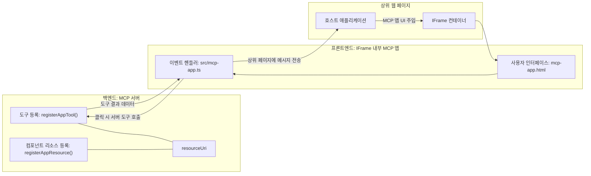
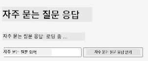
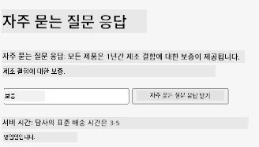
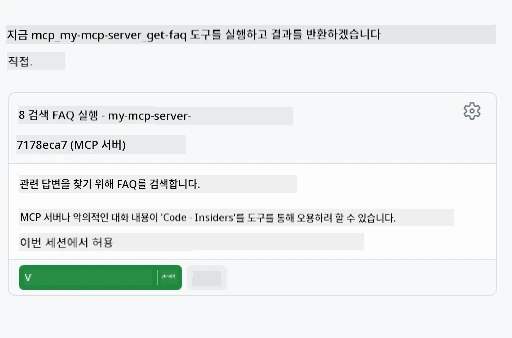

# MCP 앱

MCP 앱은 MCP에서의 새로운 패러다임입니다. 아이디어는 단순히 도구 호출에서 데이터를 응답하는 것뿐만 아니라, 이 정보가 어떻게 상호작용되어야 하는지에 대한 정보를 제공한다는 것입니다. 즉, 도구 결과에 UI 정보가 포함될 수 있다는 의미입니다. 왜 이렇게 하려는 걸까요? 오늘날 여러분이 하는 방식을 생각해보세요. 아마도 MCP 서버의 결과를 소비하기 위해 앞단에 프런트엔드를 두고 있을 것입니다. 이는 여러분이 작성하고 유지해야 하는 코드입니다. 때로는 그게 원하는 방식이지만, 때로는 데이터부터 사용자 인터페이스까지 모두 포함하는 자체 완결된 정보 조각을 가져올 수 있다면 아주 좋을 것입니다.

## 개요

이 수업은 MCP 앱에 대한 실용적인 지침과 시작 방법, 기존 웹 앱에 통합하는 방법을 제공합니다. MCP 앱은 MCP 표준에 매우 새롭게 추가된 기능입니다.

## 학습 목표

이 수업을 마치면 다음을 할 수 있습니다:

- MCP 앱이 무엇인지 설명할 수 있습니다.
- 언제 MCP 앱을 사용하는지 알 수 있습니다.
- 자신만의 MCP 앱을 구축하고 통합할 수 있습니다.

## MCP 앱 - 어떻게 작동하는가

MCP 앱의 아이디어는 본질적으로 렌더링될 컴포넌트를 응답으로 제공하는 것입니다. 이러한 컴포넌트는 시각적 요소와 상호작용성(예: 버튼 클릭, 사용자 입력 등)을 가질 수 있습니다. 서버 측과 MCP 서버부터 시작해 보겠습니다. MCP 앱 컴포넌트를 만들려면 도구와 애플리케이션 리소스를 모두 만들어야 합니다. 이 두 부분은 resourceUri로 연결됩니다.

예를 들어 보겠습니다. 관련된 부분이 무엇이며 각 부분이 무엇을 하는지 시각화해 봅시다:

```text
server.ts -- responsible for registering tools and the component as a UI component
src/
  mcp-app.ts -- wiring up event handlers
mcp-app.html -- the user interface
```
  
이 시각 자료는 컴포넌트와 그 로직을 생성하는 아키텍처를 설명합니다.


다음으로 백엔드와 프런트엔드 각각의 책임을 설명해 보겠습니다.

### 백엔드

여기서 달성해야 할 두 가지가 있습니다:

- 상호작용할 도구 등록하기.
- 컴포넌트 정의하기.

**도구 등록**

```typescript
registerAppTool(
    server,
    "get-time",
    {
      title: "Get Time",
      description: "Returns the current server time.",
      inputSchema: {},
      _meta: { ui: { resourceUri } }, // 이 도구를 UI 리소스에 연결합니다
    },
    async () => {
      const time = new Date().toISOString();
      return { content: [{ type: "text", text: time }] };
    },
  );

```
  
위 코드는 `get-time`이라는 도구를 노출하는 동작을 설명합니다. 입력은 없지만 현재 시간을 생성합니다. 사용자 입력을 받아야 하는 도구에 대해서는 `inputSchema`를 정의할 수 있는 기능도 있습니다.

**컴포넌트 등록**

같은 파일에서 컴포넌트도 등록해야 합니다:

```typescript
const resourceUri = "ui://get-time/mcp-app.html";

// UI를 위한 번들된 HTML/JavaScript를 반환하는 리소스를 등록합니다.
registerAppResource(
  server,
  resourceUri,
  resourceUri,
  { mimeType: RESOURCE_MIME_TYPE },
  async () => {
    const html = await fs.readFile(path.join(DIST_DIR, "mcp-app.html"), "utf-8");

    return {
    contents: [
        { uri: resourceUri, mimeType: RESOURCE_MIME_TYPE, text: html },
    ],
    };
  },
);
```
  
컴포넌트를 도구와 연결하기 위해 `resourceUri`를 언급한 부분에 주목하세요. 또한 UI 파일을 로드하고 컴포넌트를 반환하는 콜백도 흥미롭습니다.

### 컴포넌트 프런트엔드

백엔드와 마찬가지로 두 부분이 있습니다:

- 순수 HTML로 작성된 프런트엔드.
- 이벤트 처리 및 도구 호출, 부모 창과의 메시징 등 작업을 처리하는 코드.

**사용자 인터페이스**

사용자 인터페이스를 살펴보겠습니다.

```html
<!-- mcp-app.html -->
<!DOCTYPE html>
<html lang="en">
  <head>
    <meta charset="UTF-8" />
    <title>Get Time App</title>
  </head>
  <body>
    <p>
      <strong>Server Time:</strong> <code id="server-time">Loading...</code>
    </p>
    <button id="get-time-btn">Get Server Time</button>
    <script type="module" src="/src/mcp-app.ts"></script>
  </body>
</html>
```
  
**이벤트 연결**

마지막 부분은 이벤트 연결입니다. 즉, UI의 어느 부분에 이벤트 핸들러가 필요하고 이벤트가 발생하면 무엇을 할지 확인하는 것입니다:

```typescript
// mcp-app.ts

import { App } from "@modelcontextprotocol/ext-apps";

// 요소 참조 가져오기
const serverTimeEl = document.getElementById("server-time")!;
const getTimeBtn = document.getElementById("get-time-btn")!;

// 앱 인스턴스 생성
const app = new App({ name: "Get Time App", version: "1.0.0" });

// 서버의 도구 결과 처리. 초기 도구 결과 누락 방지를 위해 `app.connect()` 전에 설정
// 초기 도구 결과 누락 방지
app.ontoolresult = (result) => {
  const time = result.content?.find((c) => c.type === "text")?.text;
  serverTimeEl.textContent = time ?? "[ERROR]";
};

// 버튼 클릭 연결
getTimeBtn.addEventListener("click", async () => {
  // `app.callServerTool()`은 UI가 서버에서 최신 데이터를 요청할 수 있게 함
  const result = await app.callServerTool({ name: "get-time", arguments: {} });
  const time = result.content?.find((c) => c.type === "text")?.text;
  serverTimeEl.textContent = time ?? "[ERROR]";
});

// 호스트에 연결
app.connect();
```
  
위 내용을 보면 DOM 요소와 이벤트를 연결하는 평범한 코드임을 알 수 있습니다. 특히 백엔드에 도구 호출을 하는 `callServerTool` 호출이 중요합니다.

## 사용자 입력 처리

지금까지 클릭 시 도구를 호출하는 버튼이 있는 컴포넌트를 보았습니다. 이제 입력 필드와 같은 UI 요소를 추가하여 도구에 인수를 보낼 수 있는지 보겠습니다. FAQ 기능을 구현해 봅시다. 동작 방식은 다음과 같습니다:

- 사용자가 "Shipping"과 같이 검색할 키워드를 입력하는 버튼과 입력 요소가 있어야 합니다. 이는 FAQ 데이터에서 검색하는 도구를 백엔드에서 호출합니다.
- 앞서 언급한 FAQ 검색을 지원하는 도구.

먼저 백엔드에 필요한 지원을 추가해 봅시다:

```typescript
const faq: { [key: string]: string } = {
    "shipping": "Our standard shipping time is 3-5 business days.",
    "return policy": "You can return any item within 30 days of purchase.",
    "warranty": "All products come with a 1-year warranty covering manufacturing defects.",
  }

registerAppTool(
    server,
    "get-faq",
    {
      title: "Search FAQ",
      description: "Searches the FAQ for relevant answers.",
      inputSchema: zod.object({
        query: zod.string().default("shipping"),
      }),
      _meta: { ui: { resourceUri: faqResourceUri } }, // 이 도구를 UI 리소스에 연결합니다
    },
    async ({ query }) => {
      const answer: string = faq[query.toLowerCase()] || "Sorry, I don't have an answer for that.";
      return { content: [{ type: "text", text: answer }] };
    },
  );
```
  
여기서 `inputSchema`를 채우고 `zod` 스키마를 이렇게 설정하는 모습을 볼 수 있습니다:

```typescript
inputSchema: zod.object({
  query: zod.string().default("shipping"),
})
```
  
위 스키마에서는 입력 매개변수 `query`가 있고, 이는 선택사항이며 기본값은 "shipping"임을 선언합니다.

좋습니다. 이제 *mcp-app.html*로 가서 생성할 UI를 살펴봅시다:

```html
<div class="faq">
    <h1>FAQ response</h1>
    <p>FAQ Response: <code id="faq-response">Loading...</code></p>
    <input type="text" id="faq-query" placeholder="Enter FAQ query" />
    <button id="get-faq-btn">Get FAQ Response</button>
  </div>
```
  
훌륭합니다. 입력 요소와 버튼이 생겼습니다. 다음으로 *mcp-app.ts*로 이동해서 이벤트를 연결해 봅시다:

```typescript
const getFaqBtn = document.getElementById("get-faq-btn")!;
const faqQueryInput = document.getElementById("faq-query") as HTMLInputElement;

getFaqBtn.addEventListener("click", async () => {
  const query = faqQueryInput.value;
  const result = await app.callServerTool({ name: "get-faq", arguments: { query } });
  const faq = result.content?.find((c) => c.type === "text")?.text;
  faqResponseEl.textContent = faq ?? "[ERROR]";
});
```
  
위 코드에서 우리는:

- 흥미로운 UI 요소에 대한 참조를 생성합니다.
- 버튼 클릭을 처리하여 입력 요소 값을 파싱하고, `app.callServerTool()`을 호출하며 여기서 `name`과 `arguments`를 전달하는데, 후자는 `query` 값을 넘깁니다.

`callServerTool`을 호출하면 실제로 부모 창에 메시지를 보내고, 그 창이 MCP 서버를 호출하는 방식입니다.

### 직접 시도해 보기

시도하면 다음과 같은 화면을 볼 수 있습니다:



입력에 "warranty"를 넣어 시도한 모습입니다:



이 코드를 실행하려면 [코드 섹션](./code/README.md)으로 가세요.

## Visual Studio Code에서 테스트하기

Visual Studio Code는 MCP 앱을 테스트하기에 매우 편리하며 가장 쉬운 방법 중 하나입니다. Visual Studio Code를 사용하려면 *mcp.json*에 서버 항목을 다음과 같이 추가하세요:

```json
"my-mcp-server-7178eca7": {
    "url": "http://localhost:3001/mcp",
    "type": "http"
  }
```
  
서버를 시작하면 GitHub Copilot이 설치되어 있을 경우 채팅 창을 통해 MCP 앱과 통신할 수 있습니다.

예를 들어 "#get-faq" 프롬프트로 시작할 수 있습니다:



웹 브라우저로 실행했을 때와 마찬가지로 동일하게 렌더링됩니다:


## 과제

가위 바위 보 게임을 만드세요. 다음과 같은 요소로 구성되어야 합니다:

UI:

- 옵션이 있는 드롭다운 리스트
- 선택을 제출하는 버튼
- 누가 무엇을 선택했고 누가 이겼는지 표시하는 레이블

서버:

- "choice"를 입력으로 받는 가위 바위 보 도구가 있어야 합니다. 컴퓨터 선택도 렌더링하고 승자를 결정해야 합니다.

## 솔루션

[솔루션](./assignment/README.md)

## 요약

우리는 MCP 앱이라는 새로운 패러다임에 대해 배웠습니다. 이는 MCP 서버가 데이터 뿐만 아니라 데이터가 어떻게 제시되어야 하는지에 대해서도 의견을 가질 수 있게 하는 새로운 패러다임입니다.

또한 MCP 앱은 IFrame 안에 호스팅되며 MCP 서버와 통신하기 위해 부모 웹 앱에 메시지를 보내야 한다는 점도 배웠습니다. 이를 쉽게 해주는 평범한 JavaScript, React 등 여러 라이브러리가 존재합니다.

## 핵심 정리

배운 내용을 정리하면 다음과 같습니다:

- MCP 앱은 데이터와 UI 기능 모두를 제공해야 할 때 유용한 새로운 표준입니다.
- 이러한 앱은 보안상의 이유로 IFrame에서 실행됩니다.

## 다음 학습

- [4장](../../04-PracticalImplementation/README.md)

---

<!-- CO-OP TRANSLATOR DISCLAIMER START -->
**면책 조항**:  
이 문서는 AI 번역 서비스 [Co-op Translator](https://github.com/Azure/co-op-translator)를 사용하여 번역되었습니다. 정확성을 위해 최선을 다하고 있으나, 자동 번역에는 오류나 부정확성이 포함될 수 있음을 유의하시기 바랍니다. 원문이 작성된 원어 문서가 권위 있는 출처로 간주되어야 합니다. 중요한 정보의 경우 전문적인 인간 번역을 권장합니다. 본 번역 사용으로 인한 오해나 잘못된 해석에 대해 당사는 책임을 지지 않습니다.
<!-- CO-OP TRANSLATOR DISCLAIMER END -->