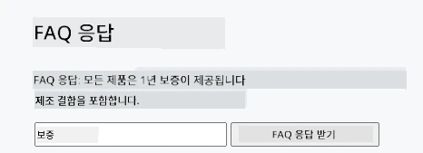
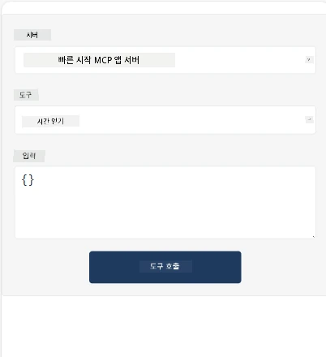
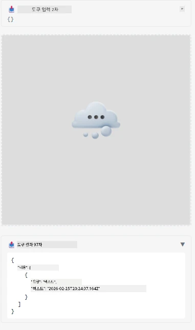

Here's a sample demonstrating MCP App

## 설치 

1. *mcp-app* 폴더로 이동합니다.
1. `npm install`을 실행하면 프런트엔드 및 백엔드 종속성이 설치됩니다.

다음 명령어로 백엔드가 컴파일되는지 확인하세요:

```sh
npx tsc --noEmit
```

모든 것이 정상이라면 출력이 없어야 합니다.

## 백엔드 실행

> MCP Apps 솔루션이 `concurrently` 라이브러리를 사용하기 때문에 Windows 머신에서는 추가 작업이 필요합니다. 대체할 수단을 찾아야 합니다. MCP App의 *package.json*에서 문제가 되는 부분은 다음과 같습니다:

    ```json
    "start": "concurrently \"cross-env NODE_ENV=development INPUT=mcp-app.html vite build --watch\" \"tsx watch main.ts\""
    ```

이 앱은 백엔드 부분과 호스트 부분, 두 부분으로 구성되어 있습니다.

다음 명령어로 백엔드를 시작하세요:

```sh
npm start
```

이 명령어는 `http://localhost:3001/mcp`에서 백엔드를 시작합니다.

> 참고로, Codespace를 사용하는 경우 포트 공개 설정을 공개로 해야 할 수 있습니다. 브라우저를 통해 https://<Codespace 이름>.app.github.dev/mcp 에서 엔드포인트에 접속할 수 있는지 확인하세요.

## 선택 -1 Visual Studio Code에서 앱 테스트

Visual Studio Code에서 솔루션을 테스트하려면 다음과 같이 하세요:

- `mcp.json`에 다음과 같이 서버 항목을 추가하세요:

    ```json
    {
        "servers": {
            "my-mcp-server-7178eca7": {
                "url": "http://localhost:3001/mcp",
                "type": "http"
            }
        },
        "inputs": []
    }
    ```

1. *mcp.json*에서 "start" 버튼을 클릭하세요.
1. 채팅 창이 열려 있는지 확인하고 `get-faq`를 입력하세요. 다음과 비슷한 결과를 볼 수 있습니다:

    

## 선택 -2- 호스트와 앱 테스트

리포지토리 <https://github.com/modelcontextprotocol/ext-apps> 에는 MVP 앱을 테스트할 수 있는 여러 호스트가 들어 있습니다.

여기 두 가지 옵션을 안내해 드립니다:

### 로컬 머신

- 리포를 클론한 뒤 *ext-apps* 폴더로 이동합니다.

- 종속성을 설치합니다

   ```sh
   npm install
   ```

- 별도 터미널 창에서 *ext-apps/examples/basic-host* 폴더로 이동합니다.

    > Codespace를 사용하는 경우 *serve.ts* 파일 27번째 줄로 이동하여 http://localhost:3001/mcp 를 Codespace 백엔드 URL로 교체해야 합니다. 예를 들어 https://psychic-xylophone-657rpjgvxpc5g64-3001.app.github.dev/mcp 와 같이 변경하세요.

- 호스트를 실행합니다:

    ```sh
    npm start
    ```

    이 작업으로 호스트와 백엔드가 연결되고 다음과 같이 앱이 실행되는 것을 볼 수 있습니다:

    

### Codespace

Codespace 환경을 작동시키려면 약간 추가 작업이 필요합니다. Codespace에서 호스트를 사용하려면:

- *ext-apps* 디렉터리에서 *examples/basic-host* 로 이동합니다.
- 종속성을 설치하기 위해 `npm install`을 실행하세요.
- 호스트를 시작하기 위해 `npm start`를 실행하세요.

## 앱 테스트하기

다음 방법으로 앱을 테스트해 보세요:

- "Call Tool" 버튼을 선택하면 다음 그림과 같이 결과를 볼 수 있습니다:

    

잘 작동하고 있습니다.

---

<!-- CO-OP TRANSLATOR DISCLAIMER START -->
**면책 조항**:  
이 문서는 AI 번역 서비스 [Co-op Translator](https://github.com/Azure/co-op-translator)를 사용하여 번역되었습니다. 정확성을 위해 노력하고 있으나, 자동 번역은 오류나 부정확성을 포함할 수 있음을 유의하시기 바랍니다. 원본 문서의 원어 버전이 권위 있는 자료로 간주되어야 합니다. 중요한 정보의 경우 전문 인간 번역을 권장합니다. 본 번역 사용으로 인해 발생하는 오해나 잘못된 해석에 대해서는 책임을 지지 않습니다.
<!-- CO-OP TRANSLATOR DISCLAIMER END -->